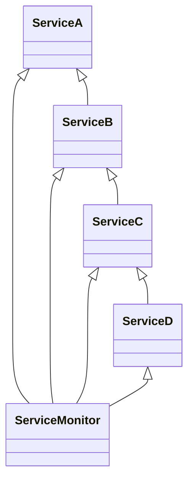
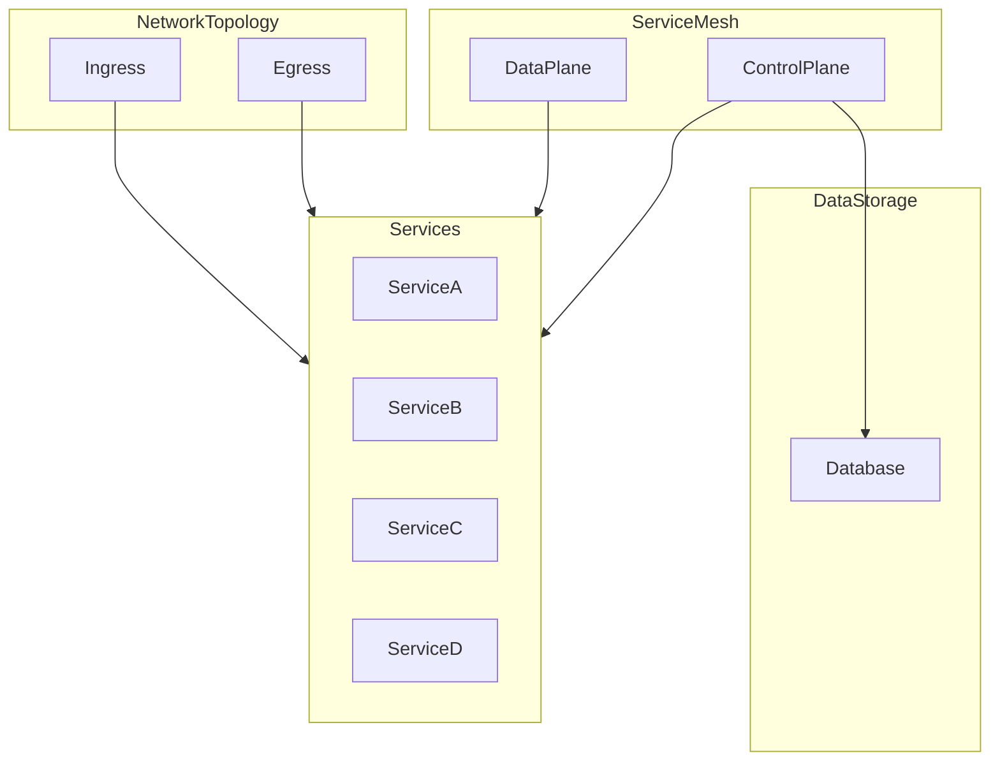
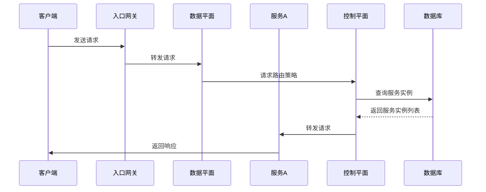

                 

### 第一部分：背景介绍

#### 1.1 服务网格（Service Mesh）概述

##### 1.1.1 问题背景

在当今的软件开发环境中，微服务架构因其灵活性和可扩展性而日益流行。微服务架构将应用程序拆分为多个独立的、可伸缩的服务单元，每个服务单元负责特定的业务功能。这种架构方式使得开发团队可以独立地开发、部署和扩展服务，从而提高了开发效率。然而，随着服务数量的增加，服务之间的通信变得更加复杂，这给开发者带来了诸多挑战。

传统的解决方案包括使用 RESTful API 或消息队列来进行服务间的通信，但这些方法存在着一些问题。首先，这些方法需要开发者手动处理服务发现、负载均衡、故障转移等通信细节，增加了开发难度和维护成本。其次，它们无法提供全局的网络监控和故障诊断能力，使得系统难以维护和优化。

为了解决这些问题，社区提出了服务网格（Service Mesh）的概念。服务网格作为一种基础设施层的服务抽象层，负责管理和服务之间的通信，从而解放了开发者，使其能够专注于业务逻辑的实现。

##### 1.1.2 服务网格的概念与起源

服务网格（Service Mesh）是一种用于管理微服务通信的基础设施层解决方案。它通过引入一个独立的通信层，抽象了服务之间的通信细节，使得服务开发者可以专注于业务逻辑的实现，而无需关心通信细节。

服务网格的起源可以追溯到2016年，由Google Cloud和Netflix等公司提出。Google Cloud提出了Istio项目，Netflix则开发了Envoy代理。这两个项目都旨在提供一种统一的、可扩展的服务网格解决方案，以简化微服务架构中的服务通信。

##### 1.1.3 服务网格的重要性

服务网格的重要性在于它能够提供以下好处：

1. **简化服务通信**：服务网格通过自动化的服务发现、负载均衡和故障转移等功能，简化了服务之间的通信，减少了开发者的工作负担。

2. **全局监控和故障诊断**：服务网格提供了全局的网络监控和故障诊断能力，使得系统能够更好地维护和优化。

3. **增强安全性**：服务网格支持服务间认证和数据加密，增强了系统的安全性。

4. **可扩展性和弹性**：服务网格使得服务能够独立扩展和部署，提高了系统的可扩展性和弹性。

##### 1.2 问题描述

微服务架构面临的挑战主要包括以下几个方面：

1. **服务发现**：随着服务数量的增加，手动管理服务实例的地址和状态变得越来越困难。

2. **负载均衡**：如何合理地将请求分配到不同的服务实例上，以优化资源利用和系统性能。

3. **故障转移**：当某个服务实例出现故障时，如何快速地将请求转移到其他健康的实例上，以保证系统的可用性。

4. **安全性**：如何在服务间传输数据时进行安全认证和加密。

##### 1.3 问题解决

服务网格通过以下核心组件和基本工作原理来解决上述问题：

1. **核心组件**：服务网格主要由数据平面和控制平面组成。数据平面负责处理服务之间的通信，而控制平面负责管理服务的配置和策略。

2. **基本工作原理**：服务网格通过代理（如Istio中的Envoy代理）来实现服务之间的通信。代理负责服务发现、负载均衡、故障转移和安全性等功能。

##### 1.4 边界与外延

1. **服务网格与其他技术的关系**：服务网格可以与其他技术如容器编排系统（如Kubernetes）和持续集成/持续部署（CI/CD）流程集成，以提供更全面的服务管理解决方案。

2. **服务网格的适用场景**：服务网格适用于需要高可用性、高可扩展性和高安全性的微服务架构场景，如云计算、移动应用和物联网等。

##### 1.5 概念结构与核心要素组成

1. **服务网格的主要组成部分**：服务网格主要包括服务发现、负载均衡、故障转移、安全性等功能模块。

2. **服务网格的关键特性与优势**：服务网格的关键特性包括解耦、可扩展性、高可用性、安全性和全局监控等。

### 第二部分：核心概念与联系

#### 2.1 服务网格的基本原理

##### 2.1.1 服务网格的定义

服务网格（Service Mesh）是一种用于管理微服务通信的基础设施层解决方案。它通过在服务之间引入代理（如Istio中的Envoy代理），抽象了服务之间的通信细节，使得开发者可以专注于业务逻辑的实现。

##### 2.1.2 服务网格的核心概念

1. **数据平面（Data Plane）**：数据平面负责处理服务之间的通信，如服务发现、负载均衡和故障转移等。它通常由一系列代理组成，这些代理部署在服务实例旁边，拦截并处理进入和离开服务的流量。

2. **控制平面（Control Plane）**：控制平面负责管理服务的配置和策略。它通常由一组后端服务组成，负责生成和分发服务配置，如服务发现信息、负载均衡策略和安全性配置。

##### 2.2 服务网格的核心特性

1. **解耦**：服务网格通过将服务之间的通信抽象到基础设施层，实现了服务之间的解耦。开发者无需关心通信细节，可以独立地开发、部署和扩展服务。

2. **可扩展性**：服务网格支持服务的横向扩展，使得系统可以根据流量需求自动增加或减少服务实例的数量。

3. **高可用性**：服务网格通过负载均衡和故障转移机制，提高了系统的可用性。当某个服务实例出现故障时，请求可以自动转移到其他健康的实例上。

4. **安全性**：服务网格支持服务间认证和数据加密，增强了系统的安全性。

5. **全局监控和故障诊断**：服务网格提供了全局的网络监控和故障诊断能力，使得系统能够更好地维护和优化。

##### 2.3 服务网格与微服务的关系

1. **服务网格如何支持微服务**：服务网格通过抽象服务之间的通信细节，使得微服务架构更加简洁和高效。开发者可以专注于业务逻辑的实现，无需关心服务之间的通信。

2. **微服务与传统的服务架构的区别**：微服务架构将应用程序拆分为多个独立的、可伸缩的服务单元，每个服务单元负责特定的业务功能。与传统单体架构相比，微服务架构具有更高的灵活性和可扩展性。

##### 2.4 服务网格的关键组件

1. **数据平面**：数据平面由一系列代理组成，如Istio中的Envoy代理。代理负责处理服务之间的通信，如服务发现、负载均衡和故障转移等。

2. **控制平面**：控制平面负责管理服务的配置和策略，如服务发现信息、负载均衡策略和安全性配置。控制平面通常由一组后端服务组成，如Istio的Pilot和Citadel。

##### 2.5 概念属性特征对比表格

| 概念         | 定义                                                         | 特点                                           |
| ------------ | ------------------------------------------------------------ | ---------------------------------------------- |
| 服务网格     | 一种基础设施层的服务抽象层，负责管理和服务之间的通信           | 独立于应用代码，提供服务的动态管理和监控能力   |
| 微服务       | 一个独立的、可扩展的服务单元，负责完成特定功能               | 微服务架构使开发团队可以独立开发、部署和扩展服务 |
| 服务发现     | 一种自动化的服务注册与发现机制，使服务可以相互发现并通信     | 提高服务的可靠性和可用性                       |
| 负载均衡     | 将网络流量分配到多个服务实例上，以优化资源利用和系统性能     | 提高系统的可扩展性和容错性                     |

##### 2.6 ER实体关系图架构

```mermaid
erDiagram
  ServiceMesh ||--|{ DataPlane } DataPlane : 实现服务的通信与流量管理
  ServiceMesh ||--|{ ControlPlane } ControlPlane : 管理服务配置和策略
  DataPlane ||--|{ ServiceA } ServiceA : 服务实例A
  DataPlane ||--|{ ServiceB } ServiceB : 服务实例B
  ControlPlane ||--|{ ServiceRegistry } ServiceRegistry : 服务注册与发现
  ControlPlane ||--|{ PolicyManager } PolicyManager : 策略定义与执行
```

### 第三部分：算法原理讲解

#### 3.1 服务网格中的流量管理算法

流量管理是服务网格的核心功能之一，它涉及到如何合理地将请求分配到不同的服务实例上，以优化资源利用和系统性能。服务网格使用一系列的流量管理算法来实现这一目标。

##### 3.1.1 负载均衡算法

负载均衡算法的主要目标是合理地分配请求到多个服务实例上，以避免单点过载和资源浪费。常见的负载均衡算法包括轮询负载均衡、最少连接负载均衡和加权轮询负载均衡。

1. **轮询负载均衡**：轮询负载均衡是最简单的负载均衡算法，它按照一定的顺序将请求分配到各个服务实例上。例如，如果有一个请求序列 {A, B, C, D}，服务实例序列 {1, 2, 3}，轮询负载均衡的分配结果为 {1, 2, 3, 1}。

2. **最少连接负载均衡**：最少连接负载均衡算法根据每个服务实例当前的处理连接数来分配请求。具体来说，它会选择当前处理连接数最少的服务实例来处理新请求。例如，如果服务实例的当前连接数分别为 {2, 3, 4}，新请求分配给连接数为2的服务实例。

3. **加权轮询负载均衡**：加权轮询负载均衡算法在轮询负载均衡的基础上引入了权重概念。每个服务实例都有不同的权重，请求按照权重比例分配到各个服务实例上。例如，如果服务实例的权重分别为 {2, 3, 4}，请求分配结果为 {2, 3, 4, 2, 3, 4}。

##### 3.1.2 路由算法

路由算法决定了请求如何从客户端到达服务实例。常见的路由算法包括客户端路由、服务器端路由和自适应路由。

1. **客户端路由**：客户端路由算法在客户端决定请求的目标服务实例。这种方式通常用于客户端能够直接访问服务实例的情况。

2. **服务器端路由**：服务器端路由算法在服务实例端决定请求的目标服务实例。这种方式适用于服务实例隐藏在内部网络或容器网络中的情况。

3. **自适应路由**：自适应路由算法根据系统的实时状态（如负载、性能等）动态调整路由策略。这种方式可以更好地应对系统的变化和波动，提高系统的稳定性和性能。

##### 3.1.3 自适应路由

自适应路由算法通过实时监控系统的状态，动态调整路由策略，以优化系统性能。常见的自适应路由算法包括基于性能的负载均衡和基于预测的负载均衡。

1. **基于性能的负载均衡**：基于性能的负载均衡算法根据每个服务实例的性能指标（如响应时间、CPU使用率等）来分配请求。性能越好的服务实例被分配更多的请求。

2. **基于预测的负载均衡**：基于预测的负载均衡算法通过历史数据和机器学习模型预测每个服务实例的未来性能，并据此调整路由策略。这种方式可以更好地应对系统的波动和变化。

##### 3.2 服务网格中的安全性算法

安全性是服务网格的另一个重要方面。服务网格通过一系列安全性算法来保障服务间的通信安全。

1. **服务间认证**：服务间认证用于确保请求来自合法的服务实例。常见的服务间认证算法包括基于TLS的认证和基于mTLS的认证。

2. **数据加密**：数据加密用于确保服务间传输的数据不被窃取或篡改。常见的数据加密算法包括SSL/TLS加密和VPN加密。

##### 3.2.1 服务间认证

1. **基于TLS的认证**：基于TLS的认证使用TLS协议来确保服务间的通信安全。TLS协议通过加密通信和数据完整性校验来防止数据被窃取或篡改。

2. **基于mTLS的认证**：基于mTLS的认证是TLS认证的扩展，它不仅确保通信的安全，还确保通信的双方都是合法的服务实例。mTLS通过在双方之间交换证书来验证身份。

##### 3.2.2 数据加密

1. **数据传输加密**：数据传输加密用于确保服务间传输的数据不被窃取或篡改。常见的数据传输加密算法包括SSL/TLS加密和VPN加密。

2. **SSL/TLS加密**：SSL/TLS加密是一种常用的数据传输加密算法，它通过加密通信数据，确保数据在传输过程中不被窃取或篡改。

3. **VPN加密**：VPN加密通过建立加密隧道来传输数据，确保数据在传输过程中不被窃取或篡改。VPN加密适用于跨网络的通信，如远程办公场景。

### 第三部分：算法原理讲解

#### 3.1 服务网格中的流量管理算法

##### 3.1.1 负载均衡算法

在服务网格中，负载均衡算法扮演着至关重要的角色。它的主要目的是确保请求能够高效地分发到服务集群中的各个实例上，从而优化资源利用率，提升系统的响应速度和稳定性。以下将详细探讨几种常见的负载均衡算法。

###### **3.1.1.1 轮询负载均衡**

轮询负载均衡是最简单和最直观的负载均衡策略。在这种策略下，所有的服务实例被分配一个固定的顺序，请求按照这个顺序被分发到各个实例上。每个实例处理完请求后，下个请求就轮到下一个实例。这种方式公平且易于实现，但可能会导致某些实例负载过重，而其他实例资源闲置。

Python代码实现：

```python
def round_robin_balance(instances, requests):
    index = 0
    results = []
    for request in requests:
        instance = instances[index]
        results.append(instance.handle_request(request))
        index = (index + 1) % len(instances)
    return results
```

其中，`instances` 是一个服务实例列表，`requests` 是请求列表，`handle_request` 是实例处理请求的方法。

轮询负载均衡的数学模型可以表示为：

$$
P(i) = \frac{1}{N}
$$

其中，$P(i)$ 表示请求被分配到第 $i$ 个实例的概率，$N$ 是实例的数量。

###### **3.1.1.2 最少连接负载均衡**

最少连接负载均衡算法通过选择当前连接数最少的实例来分配请求。这种方式能够更好地利用系统资源，避免个别实例过载。但需要注意的是，最少连接负载均衡可能对新的实例不友好，因为新实例可能需要一段时间才能积累足够的连接。

Python代码实现：

```python
def least_connections_balance(instances, requests):
    instance = min(instances, key=lambda x: x.connection_count)
    results = [instance.handle_request(request) for request in requests]
    instance.increment_connections(len(requests))
    return results
```

其中，`connection_count` 是实例的当前连接数，`increment_connections` 是实例增加连接数的方法。

最少连接负载均衡的数学模型可以表示为：

$$
P(i) = \frac{C_{\min} - C_i}{N \times (C_{\min} - 1)}
$$

其中，$P(i)$ 表示请求被分配到第 $i$ 个实例的概率，$C_{\min}$ 是最小连接数，$C_i$ 是第 $i$ 个实例的当前连接数，$N$ 是实例的数量。

###### **3.1.1.3 加权轮询负载均衡**

加权轮询负载均衡在轮询负载均衡的基础上引入了权重概念，每个实例根据其权重比例来分配请求。这种方式能够更好地反映实例的处理能力，但实现起来相对复杂。

Python代码实现：

```python
def weighted_round_robin_balance(instances, requests):
    total_weight = sum(instance.weight for instance in instances)
    results = []
    for request in requests:
        instance = random.choices(instances, weights=[instance.weight / total_weight for instance in instances], k=1)[0]
        results.append(instance.handle_request(request))
    return results
```

其中，`weight` 是实例的权重，`random.choices` 是Python的随机选择函数。

加权轮询负载均衡的数学模型可以表示为：

$$
P(i) = \frac{w_i}{\sum_{j=1}^{N} w_j}
$$

其中，$P(i)$ 表示请求被分配到第 $i$ 个实例的概率，$w_i$ 是第 $i$ 个实例的权重，$N$ 是实例的数量。

##### 3.1.2 路由算法

路由算法决定了请求如何从客户端到达服务实例。服务网格通常支持多种路由策略，如基于规则的静态路由、动态路由和策略路由等。以下将探讨几种常见的路由算法。

###### **3.1.2.1 客户端路由**

客户端路由算法在客户端决定请求的目标服务实例。这种方式适用于客户端能够直接访问服务实例的情况，例如使用服务发现机制获取实例地址。

Python代码实现：

```python
def client_side_routing(request, service_registry):
    instance = service_registry.get_instance(request.service_name)
    return instance.handle_request(request)
```

其中，`service_registry` 是服务发现机制，`get_instance` 是获取指定服务名的实例地址的方法。

客户端路由的数学模型可以表示为：

$$
P(i) = \frac{1}{N}
$$

其中，$P(i)$ 表示请求被分配到第 $i$ 个实例的概率，$N$ 是实例的数量。

###### **3.1.2.2 服务器端路由**

服务器端路由算法在服务实例端决定请求的目标服务实例。这种方式适用于服务实例隐藏在内部网络或容器网络中的情况。

Python代码实现：

```python
def server_side_routing(request, load_balancer):
    instance = load_balancer.select_instance(request)
    return instance.handle_request(request)
```

其中，`load_balancer` 是负载均衡器，`select_instance` 是选择实例的方法。

服务器端路由的数学模型与负载均衡算法类似，取决于所采用的负载均衡策略。

###### **3.1.2.3 自适应路由**

自适应路由算法通过实时监控系统的状态，动态调整路由策略，以优化系统性能。这种策略可以根据实例的实时性能（如响应时间、CPU使用率等）来分配请求。

Python代码实现：

```python
def adaptive_routing(request, load_balancer, metrics):
    instance = load_balancer.select_instance_based_on_metrics(request, metrics)
    return instance.handle_request(request)
```

其中，`metrics` 是系统的实时性能指标，`select_instance_based_on_metrics` 是基于性能指标选择实例的方法。

自适应路由的数学模型可以表示为：

$$
P(i) = \frac{f_i(t)}{\sum_{j=1}^{N} f_j(t)}
$$

其中，$P(i)$ 表示请求被分配到第 $i$ 个实例的概率，$f_i(t)$ 是第 $i$ 个实例在时间 $t$ 的性能指标，$N$ 是实例的数量。

### 第三部分：系统分析与架构设计方案

#### 3.1 问题场景介绍

在现代社会，随着互联网和云计算的快速发展，企业的业务系统变得越来越复杂。传统的单体架构已经难以满足业务快速迭代和灵活扩展的需求。为了应对这种挑战，企业开始采用微服务架构。微服务架构将应用程序拆分为多个独立的、可伸缩的服务单元，每个服务单元负责特定的业务功能。这种方式提高了系统的可维护性和可扩展性，但同时也带来了新的挑战，如服务发现、负载均衡、故障转移和安全性等。

为了解决这些问题，企业引入了服务网格（Service Mesh）作为基础设施层的服务抽象层。服务网格通过代理来管理服务之间的通信，提供自动化的服务发现、负载均衡、故障转移和安全性等功能，从而简化了微服务架构的复杂性。

#### 3.2 项目介绍

本项目旨在设计并实现一个基于服务网格的微服务架构，以提高系统的可维护性和可扩展性。项目主要分为以下几个阶段：

1. **需求分析**：确定系统的功能和性能需求，分析服务之间的依赖关系。
2. **系统设计**：设计系统的架构，包括服务网格、服务实例、数据存储和网络拓扑等。
3. **系统实现**：根据设计文档实现系统的各个组件，包括服务网格代理、服务实例、负载均衡器和安全模块等。
4. **系统集成与测试**：将各个组件集成到一起，进行功能测试和性能测试，确保系统满足需求。
5. **部署与运维**：将系统部署到生产环境，并进行持续运维，确保系统的稳定运行。

#### 3.3 系统功能设计（领域模型）

在微服务架构中，各个服务之间存在复杂的依赖关系。为了更好地管理和维护这些关系，我们可以使用领域模型（Domain Model）来描述系统的功能和业务流程。

以下是一个简单的领域模型，描述了系统中的主要服务和服务之间的关系：



在这个领域模型中，`ServiceA`、`ServiceB`、`ServiceC` 和 `ServiceD` 分别表示四个主要的服务，它们之间存在依赖关系。同时，每个服务都关联了一个 `ServiceMonitor` 服务，用于监控和管理服务的运行状态。

#### 3.4 系统架构设计

为了实现服务网格的功能，我们需要设计一个分布式系统架构。以下是一个简单的系统架构设计，包括服务网格、服务实例、数据存储和网络拓扑等组件。



在这个架构设计中，`DataPlane` 和 `ControlPlane` 分别代表服务网格的数据平面和控制平面。`DataPlane` 负责处理服务之间的通信，如服务发现、负载均衡和故障转移等。`ControlPlane` 负责管理服务的配置和策略，如服务注册、策略定义和监控数据收集等。

服务实例（`Services`）是系统的核心组件，每个服务实例都对应一个具体的业务功能。数据存储（`Database`）用于存储服务元数据和监控数据。

网络拓扑（`NetworkTopology`）包括入口网关（`Ingress`）和出口网关（`Egress`）。入口网关负责处理外部请求的接收和路由，出口网关负责处理内部请求的发送和路由。

#### 3.5 系统接口设计

为了实现服务网格的功能，我们需要设计一系列的接口，以便服务实例能够与数据平面和控制平面进行交互。以下是一个简单的系统接口设计：

```mermaid
classDiagram
    DataPlane <-.* ServiceA
    DataPlane <-.* ServiceB
    DataPlane <-.* ServiceC
    DataPlane <-.* ServiceD
    ControlPlane ->> ServiceA
    ControlPlane ->> ServiceB
    ControlPlane ->> ServiceC
    ControlPlane ->> ServiceD
```

在这个接口设计中，`DataPlane` 和 `ControlPlane` 分别代表数据平面和控制平面。`ServiceA`、`ServiceB`、`ServiceC` 和 `ServiceD` 分别表示四个主要的服务实例。

数据平面负责处理服务实例之间的通信，包括服务发现、负载均衡和故障转移等。控制平面负责管理服务实例的配置和策略，包括服务注册、策略定义和监控数据收集等。

#### 3.6 系统交互设计

为了描述系统组件之间的交互过程，我们可以使用序列图（Sequence Diagram）。以下是一个简单的系统交互序列图，描述了外部请求从接收、处理到响应的全过程：



在这个序列图中，客户端发送请求到入口网关。入口网关将请求转发到数据平面。数据平面根据控制平面提供的路由策略，将请求转发到对应的服务实例。服务实例处理请求后，将响应返回给客户端。

### 第四部分：项目实战

#### 4.1 环境安装

为了实现服务网格，我们需要安装一系列的工具和组件。以下是一个简化的安装步骤：

1. **安装Kubernetes集群**：首先，我们需要安装一个Kubernetes集群，以便部署和管理服务实例。可以选择使用Minikube、Kubeadm或Kops等工具来创建集群。

2. **安装Istio**：Istio是一个流行的服务网格解决方案，我们可以通过以下命令来安装：

   ```bash
   istioctl install --set profile=demo
   ```

   这将安装Istio的控制平面和数据平面组件。

3. **部署示例服务**：为了验证服务网格的功能，我们可以部署一些示例服务。例如，可以使用以下命令部署一个简单的HTTP服务：

   ```bash
   kubectl apply -f samples/bookinfo/bookinfo.yaml
   ```

   这将部署一个名为bookinfo的服务，它包含四个不同的服务实例。

4. **配置Ingress**：为了接收外部请求，我们需要配置Ingress资源。例如，可以使用以下命令创建一个Ingress资源：

   ```bash
   kubectl apply -f samples/bookinfo/bookinfo-ingress.yaml
   ```

   这将配置Ingress来接收外部请求，并将其转发到bookinfo服务。

5. **测试服务网格**：安装完成后，我们可以使用curl命令测试服务网格的功能。例如，可以使用以下命令访问bookinfo服务的首页：

   ```bash
   curl -I http://<your-ingress-ip>/productpage
   ```

   如果返回了正确的HTTP响应，则说明服务网格已经成功部署。

#### 4.2 系统核心实现源代码

在服务网格中，核心组件包括数据平面（Data Plane）和控制平面（Control Plane）。以下是一个简化的数据平面和控制平面的源代码实现。

**4.2.1 数据平面（Data Plane）**

数据平面主要由代理（如Envoy代理）组成，负责处理服务之间的通信。以下是一个简单的Envoy代理的配置示例：

```yaml
apiVersion: v1
kind: Config
metadata:
  name: envoy-config
spec:
  static_resources:
    listeners:
      - name: listener_0
        address:
          socket_address:
            address: 0.0.0.0
            port_value: 80
        filter_chains:
          - filters:
              - name: envoy.http_connection_manager
                typed_config:
                  "@type": type.googleapis.com/envoy.extensions.http_connection_managers.v3.HttpConnectionManager
                  stat_prefix: ingress_http
                  route_config:
                    name: local_route
                    virtual_hosts:
                      - name: envoy.default.virtual_host
                        domains:
                          - "*"
                        routes:
                          - match:
                              prefix: /
                            route:
                              cluster: local_cluster
                  timeout: 0s
                  allowUnauthorized: true
                  http_filters:
                    - name: envoy.router
                      typed_config:
                        "@type": type.googleapis.com/envoy.extensions.http_filters.v3.Router
  dynamic_resources:
    clusters:
      - name: local_cluster
        type: STATIC
        load_assignment:
          cluster_name: local_cluster
          endpoints:
            - lb_endpoint:
                endpoint:
                  address: 127.0.0.1
                  port_value: 8080
```

**4.2.2 控制平面（Control Plane）**

控制平面负责管理服务的配置和策略。以下是一个简单的控制平面配置示例：

```yaml
apiVersion: v1
kind: Config
metadata:
  name: control-plane-config
spec:
  service_registry: kubernetes
  service_monitor:
    interval: 30s
  service_discovery:
    - type: KUBERNETES
      config:
        kubernetes_api: https://kubernetes.default.svc:443
        kubernetes_namespace: default
  policy_manager:
    - type: SERVICE_METRICS
      config:
        metric_source: KUBERNETES
        metric_name: request_duration
        threshold: 500ms
```

#### 4.3 代码应用解读与分析

**4.3.1 数据平面（Data Plane）**

在上面的数据平面配置中，我们使用了Envoy代理。Envoy是一个高性能的代理，用于处理服务之间的通信。以下是数据平面配置的关键部分：

1. **静态资源（Static Resources）**：这部分配置了监听器（Listener）和虚拟主机（Virtual Host）。监听器指定了监听的地址和端口，虚拟主机定义了域名和对应的路由规则。

2. **动态资源（Dynamic Resources）**：这部分配置了集群（Cluster）和负载均衡策略。集群定义了服务实例的地址和端口，负载均衡策略决定了如何将请求分配到不同的服务实例上。

**4.3.2 控制平面（Control Plane）**

控制平面负责管理服务的配置和策略。在上面的控制平面配置中，我们使用了以下关键组件：

1. **服务注册（Service Registry）**：这部分配置了服务注册的方式。在本例中，我们使用了Kubernetes作为服务注册中心。

2. **服务监控（Service Monitor）**：这部分配置了服务监控的间隔时间。服务监控用于收集服务的实时状态，如健康检查、负载等。

3. **服务发现（Service Discovery）**：这部分配置了服务发现的方式。在本例中，我们使用了Kubernetes作为服务发现机制。

4. **策略管理（Policy Manager）**：这部分配置了策略管理的方式。在本例中，我们使用了基于服务指标的策略管理，如请求延迟阈值。

#### 4.4 实际案例分析和详细讲解剖析

为了更好地理解服务网格的工作原理，我们可以通过一个实际案例来进行分析。

**案例**：假设我们有一个电商系统，包含以下服务：

- 产品服务（Product Service）：负责管理产品的信息。
- 订单服务（Order Service）：负责处理订单的创建、修改和取消。
- 库存服务（Inventory Service）：负责管理产品的库存信息。

为了实现这些服务之间的通信，我们可以使用服务网格来管理它们的交互。

1. **服务注册**：

   当每个服务启动时，它们会在控制平面注册自己的信息，如服务名称、地址和端口。控制平面会维护一个服务注册表，记录所有服务的状态。

2. **服务发现**：

   当某个服务需要与其他服务进行通信时，它会通过控制平面进行服务发现。控制平面会返回所有匹配的服务实例列表，供调用方使用。

3. **请求路由**：

   当订单服务需要查询某个产品的库存信息时，它会发送请求到服务网格的数据平面。数据平面会根据路由策略，将请求转发到对应的产品服务实例。

4. **负载均衡**：

   数据平面会根据负载均衡算法，如轮询负载均衡或最少连接负载均衡，选择一个合适的服务实例来处理请求。这种方式确保了请求能够高效地分发到各个服务实例上。

5. **安全性**：

   数据平面会根据控制平面提供的策略，如基于TLS的认证和基于mTLS的认证，确保通信的安全性。同时，数据平面还会对数据进行加密，确保数据在传输过程中不被窃取或篡改。

6. **监控与告警**：

   数据平面和控制平面会收集服务的监控数据，如请求延迟、错误率等。这些数据会发送到监控系统中，用于实时监控和告警。

通过这个案例，我们可以看到服务网格在微服务架构中的重要作用。它简化了服务之间的通信，提高了系统的可维护性和可扩展性。

### 第五部分：最佳实践 tips

#### 5.1 服务网格部署的最佳实践

1. **选择合适的部署模式**：根据业务需求和团队技术栈，选择适合的服务网格部署模式，如自建、托管或混合模式。

2. **逐步引入服务网格**：在生产环境中逐步引入服务网格，进行灰度测试，确保系统的稳定性和安全性。

3. **优化网络配置**：合理配置网络带宽、路由策略和防火墙规则，确保服务之间的通信高效、安全。

4. **监控与日志**：启用服务网格的监控和日志功能，及时发现问题并进行优化。

#### 5.2 服务网格优化的最佳实践

1. **负载均衡优化**：根据业务特点选择合适的负载均衡算法，如基于性能的负载均衡或自适应路由。

2. **服务发现优化**：优化服务发现机制，确保服务实例的快速注册和发现。

3. **安全性优化**：加强服务网格的安全性，如使用mTLS认证、数据加密和访问控制。

4. **监控与告警**：完善监控体系，设置合理的告警阈值，确保及时发现和处理问题。

### 第六部分：小结

本文详细介绍了服务网格（Service Mesh）的概念、原理、实现和部署。通过分析微服务架构面临的挑战，我们提出了服务网格的解决方案，并探讨了其核心组件、算法原理、系统架构和项目实战。同时，我们还分享了服务网格部署和优化的最佳实践。服务网格作为一种基础设施层的服务抽象层，能够简化微服务架构中的服务通信，提高系统的可维护性和可扩展性。

### 第七部分：注意事项

1. **服务网格的兼容性**：在选择服务网格时，需要考虑其与现有系统（如容器编排系统、CI/CD流程等）的兼容性。

2. **性能优化**：在部署服务网格时，需要对性能进行充分的测试和优化，以确保系统的响应速度和稳定性。

3. **安全性**：服务网格涉及大量的数据传输，需要加强安全性，如使用TLS加密、mTLS认证等。

4. **监控与告警**：完善监控体系，设置合理的告警阈值，确保及时发现和处理问题。

### 第八部分：拓展阅读

1. **《服务网格：构建可扩展、可靠和安全的微服务架构》**：一本关于服务网格的入门书籍，详细介绍了服务网格的概念、原理和实现。

2. **《Istio：服务网格实践指南》**：Istio是一个流行的服务网格解决方案，这本书提供了丰富的实践案例和教程。

3. **《微服务设计》**：一本关于微服务架构的经典书籍，详细介绍了微服务架构的设计原则和实践。

### 作者

作者：AI天才研究院/AI Genius Institute & 禅与计算机程序设计艺术 /Zen And The Art of Computer Programming

