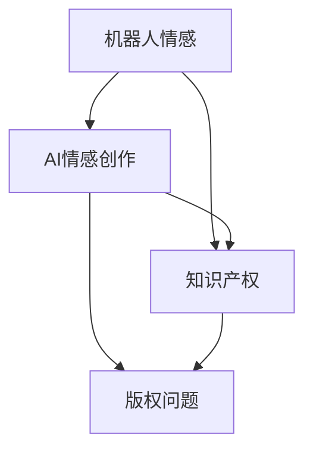
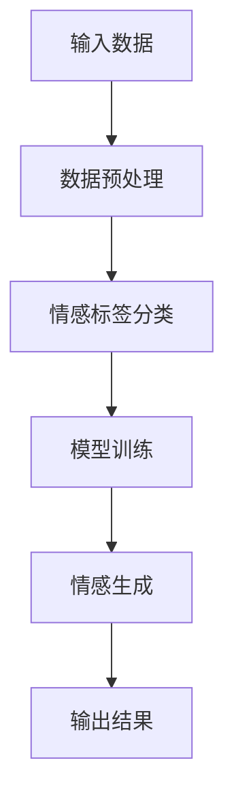
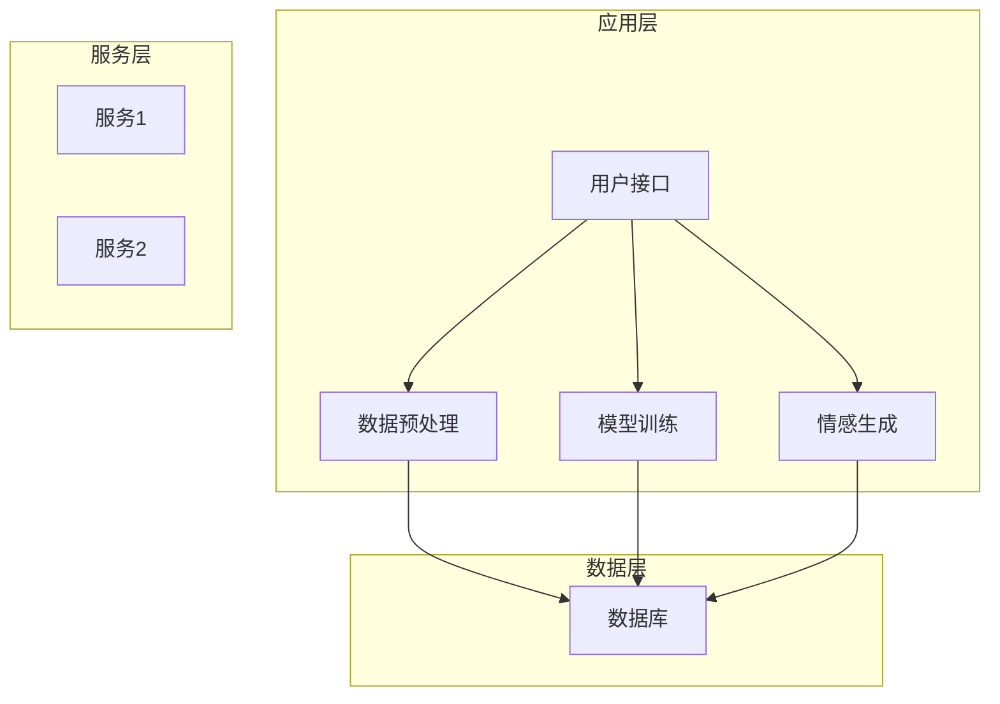
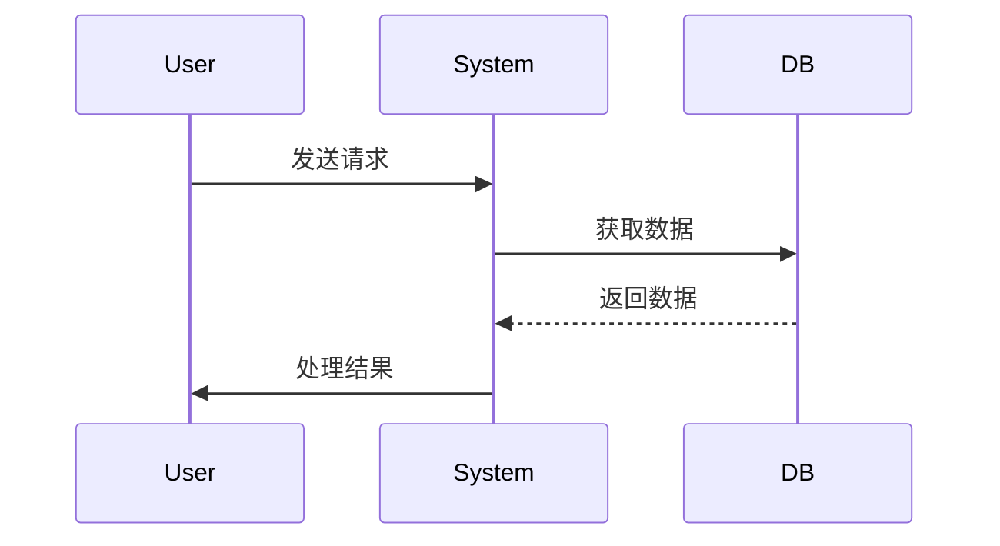

                 

### 《机器人情感版权:AI情感创作的知识产权》

#### 关键词：机器人情感、AI情感创作、知识产权、版权问题、专利问题

> 摘要：本文将深入探讨机器人情感与AI情感创作领域的知识产权问题，分析其基本概念、发展历程、版权争议、专利布局以及综合保护策略。通过实际应用案例，探讨AI情感创作在文学、音乐和影视制作中的实践，为业界提供有价值的参考和指导。

### 第一部分：机器人情感与AI情感创作概述

#### 第1章：机器人情感与AI情感创作的基本概念

##### 1.1 机器人情感的定义与特性

机器人情感是指通过计算机程序和人工智能技术，赋予机器人感知、理解并表达情感的能力。它不仅涉及机器人的情绪状态，还包括对人类情感的理解和回应。

- **特性**：

  - **自然性**：机器人情感旨在模拟人类情感的自然表现，使机器人在与人类互动时更具亲和力和真实感。

  - **智能化**：借助AI技术，机器人情感能够根据环境变化和交互数据，动态调整情感表达，实现情感智能。

  - **可控性**：机器人情感的设计和实现过程中，可以根据需求对情感参数进行调整，实现情感控制。

##### 1.2 AI情感创作的原理与技术

AI情感创作是指利用人工智能技术，特别是深度学习和自然语言处理技术，实现情感性文本、音乐、图像等内容创作的过程。

- **原理**：

  - **数据驱动**：AI情感创作依赖于大量情感标签的数据集，通过数据训练模型，使其具备情感理解与生成能力。

  - **算法优化**：利用深度学习算法，如卷积神经网络（CNN）、循环神经网络（RNN）等，提升情感创作的准确性和创造力。

- **技术**：

  - **文本生成**：利用生成对抗网络（GAN）和自动编码器（Autoencoder）等技术，实现情感化文本创作。

  - **音乐创作**：通过深度神经网络生成音乐旋律，结合情感标注，实现情感化音乐创作。

  - **图像生成**：利用GAN等技术，生成符合情感标签的图像，实现情感化图像创作。

##### 1.3 机器人情感与AI情感创作的联系

机器人情感与AI情感创作密切相关，两者在技术层面相互促进，共同发展。

- **相互促进**：

  - 机器人情感的发展，为AI情感创作提供了更丰富的应用场景和需求。

  - AI情感创作的技术进步，为机器人情感的设计和实现提供了更强的支撑。

- **应用场景**：

  - **交互式娱乐**：机器人通过与人类进行情感互动，提供个性化的娱乐体验。

  - **虚拟助手**：AI情感创作使得虚拟助手能够更好地理解人类情感，提供个性化的服务。

#### 第2章：机器人情感与AI情感创作的发展历史

##### 2.1 机器人情感与AI情感创作的早期探索

- **机器人情感的早期探索**：

  - **20世纪60年代**：机器人情感的研究开始萌芽，主要集中在情绪模拟和响应方面。

  - **20世纪80年代**：人工智能技术的发展，使得机器人情感的研究进入一个新的阶段，情感计算成为一个独立的研究领域。

- **AI情感创作的早期探索**：

  - **20世纪90年代**：深度学习的兴起，为AI情感创作提供了新的理论基础。

  - **21世纪初**：自然语言处理技术的进步，使得AI情感创作在文本生成领域取得突破。

##### 2.2 机器人情感与AI情感创作的技术突破

- **机器人情感的技术突破**：

  - **情感识别**：利用面部识别、语音识别等技术，实现机器人对人类情感的理解。

  - **情感生成**：通过深度学习模型，实现机器人对特定情感的表达。

- **AI情感创作的技术突破**：

  - **文本生成**：GAN和RNN技术的应用，使得AI能够生成高质量的文本。

  - **音乐和图像生成**：深度神经网络在音乐和图像生成领域的成功应用，实现了情感化创作。

##### 2.3 当前发展趋势与未来展望

- **当前发展趋势**：

  - **跨学科融合**：机器人情感与AI情感创作正与其他学科（如心理学、教育学等）进行深度融合。

  - **应用场景扩展**：机器人情感和AI情感创作正在被广泛应用于娱乐、教育、医疗等多个领域。

- **未来展望**：

  - **情感智能**：随着技术的进步，机器人情感和AI情感创作将更加智能，实现更复杂的情感理解和表达。

  - **人机共生**：机器人情感和AI情感创作将在人类生活中扮演更加重要的角色，促进人机共生的发展。

### 第二部分：AI情感创作的知识产权保护

#### 第3章：知识产权概述

##### 3.1 知识产权的基本概念

- **定义**：知识产权是指基于智力成果所享有的一种无形财产权利。

- **种类**：

  - **专利**：对发明、实用新型和外观设计所授予的独占权。

  - **商标**：对商业标识所授予的独占权。

  - **版权**：对文学、艺术和科学作品所授予的独占权。

- **保护机制**：知识产权通过法律手段进行保护，包括立法、执法和司法等多个环节。

##### 3.2 知识产权的种类与区别

- **专利**：

  - **定义**：专利是对发明的一种法律保护。

  - **特点**：具有创新性、实用性和工业实用性。

- **商标**：

  - **定义**：商标是对商业标识的一种法律保护。

  - **特点**：具有识别性、独占性和可转让性。

- **版权**：

  - **定义**：版权是对文学、艺术和科学作品的一种法律保护。

  - **特点**：具有原创性、独占性和可复制性。

##### 3.3 知识产权的保护机制

- **立法**：制定相关法律，明确知识产权的定义、种类和保护范围。

- **执法**：建立知识产权执法机构，打击侵权行为，保护权利人的合法权益。

- **司法**：通过司法途径解决知识产权纠纷，维护公平正义。

#### 第4章：AI情感创作的版权问题

##### 4.1 AI情感创作的版权争议

- **争议焦点**：

  - **原创性**：AI创作的作品是否具有原创性，是否享有版权。

  - **人类干预**：AI创作过程中，人类干预的程度如何影响作品的版权属性。

- **案例分析**：

  - **法院判决**：分析法院对AI情感创作版权问题的判决，总结版权保护的实践经验。

##### 4.2 AI情感创作的版权认定标准

- **原创性标准**：

  - **作品性质**：AI创作的作品是否属于文学、艺术和科学领域。

  - **独特性**：AI创作的作品是否具有独特的思想表达。

- **人类干预程度**：

  - **主导作用**：人类在AI创作过程中的作用是否占主导地位。

  - **辅助作用**：人类在AI创作过程中的作用是否仅为辅助。

##### 4.3 AI情感创作的版权保护策略

- **权利登记**：权利人应积极进行版权登记，以获得法律保护。

- **合同管理**：在AI创作过程中，应签订详细的合同，明确各方权利义务。

- **侵权防控**：加强侵权监控，采取法律手段打击侵权行为。

#### 第5章：AI情感创作的专利问题

##### 5.1 AI情感创作的专利申请

- **专利申请流程**：

  - **初步审查**：提交专利申请，进行初步审查。

  - **实质审查**：对专利申请进行实质审查，确定是否符合专利条件。

  - **授权**：审查合格后，专利申请获得授权。

- **专利申请策略**：

  - **技术创新**：确保AI情感创作具有创新性和实用性。

  - **专利布局**：在全球范围内进行专利布局，形成专利网。

##### 5.2 AI情感创作的专利授权与维权

- **专利授权**：

  - **授权条件**：专利申请符合法律要求，具备授权条件。

  - **授权流程**：专利局对专利申请进行审查，作出授权决定。

- **维权策略**：

  - **侵权监测**：监测市场上是否存在侵权行为。

  - **法律诉讼**：采取法律手段，维护专利权益。

##### 5.3 AI情感创作的专利布局策略

- **区域布局**：

  - 根据市场需求和竞争对手情况，进行专利区域布局。

- **技术布局**：

  - 结合核心技术，进行专利技术布局。

- **维权布局**：

  - 结合法律需求，进行专利维权布局。

#### 第6章：AI情感创作的商标问题

##### 6.1 AI情感创作的商标申请与保护

- **商标申请流程**：

  - **申请提交**：提交商标注册申请。

  - **初步审查**：商标局对申请进行初步审查。

  - **实质审查**：对商标申请进行实质审查。

  - **公告和异议**：商标公告后，如无异议，商标注册成功。

- **商标保护策略**：

  - **商标监控**：定期监控商标使用情况，防止侵权行为。

  - **商标维权**：采取法律手段，维护商标权益。

##### 6.2 AI情感创作的商标争议解决

- **争议解决途径**：

  - **协商**：通过协商解决商标争议。

  - **调解**：通过商标调解中心进行调解。

  - **诉讼**：通过司法途径解决商标争议。

##### 6.3 AI情感创作的商标布局策略

- **市场布局**：

  - 根据市场需求，进行商标市场布局。

- **技术布局**：

  - 结合核心技术，进行商标技术布局。

- **品牌布局**：

  - 结合品牌战略，进行商标品牌布局。

#### 第7章：AI情感创作的知识产权综合保护策略

##### 7.1 知识产权保护的整体策略

- **顶层设计**：

  - 制定知识产权战略，明确保护目标和重点。

- **协同保护**：

  - 综合运用专利、商标、版权等多种知识产权手段，实现协同保护。

- **技术创新**：

  - 依托技术创新，提升知识产权的竞争力。

##### 7.2 AI情感创作知识产权保护案例分析

- **案例一**：某AI情感创作公司通过专利布局，成功维权。

- **案例二**：某AI情感创作作品被侵权，通过法律途径维权成功。

##### 7.3 AI情感创作知识产权保护的挑战与应对

- **挑战**：

  - **技术发展**：技术发展迅速，知识产权保护面临新的挑战。

  - **法律适用**：现有法律体系对AI情感创作的保护尚不完善。

- **应对策略**：

  - **完善法律体系**：加强立法，完善知识产权法律体系。

  - **技术创新**：依托技术创新，提高知识产权保护水平。

### 第三部分：实际应用与案例分析

#### 第8章：AI情感创作实际应用案例

##### 8.1 AI情感创作在文学创作中的应用

- **案例分析**：

  - **AI写手**：某AI情感创作平台，通过深度学习技术，实现文学作品的自动化创作。

  - **用户体验**：用户可以通过平台提供的接口，实时获取AI创作的文学作品，提升创作效率。

##### 8.2 AI情感创作在音乐创作中的应用

- **案例分析**：

  - **AI作曲家**：某AI情感创作公司，利用深度学习技术，实现音乐旋律的自动化创作。

  - **音乐风格**：AI作曲家可以根据用户需求，生成不同风格的音乐作品，满足个性化需求。

##### 8.3 AI情感创作在影视制作中的应用

- **案例分析**：

  - **AI编剧**：某AI情感创作平台，通过自然语言处理技术，实现剧本的自动化创作。

  - **影视风格**：AI编剧可以根据用户需求，生成不同风格的剧本，提升影视制作效率。

#### 第9章：AI情感创作知识产权保护实践

##### 9.1 AI情感创作知识产权保护案例解析

- **案例分析**：

  - **版权争议**：某AI情感创作作品被指控侵权，通过法律途径维权成功。

  - **专利布局**：某AI情感创作公司，通过专利布局，实现市场竞争优势。

##### 9.2 AI情感创作知识产权保护的经验与教训

- **经验**：

  - **技术创新**：依托技术创新，提升知识产权的竞争力。

  - **法律意识**：加强法律意识，确保知识产权的有效保护。

- **教训**：

  - **忽视保护**：忽视知识产权保护，可能导致侵权纠纷。

  - **盲目创新**：创新过程中，忽视知识产权保护，可能导致侵权风险。

##### 9.3 AI情感创作知识产权保护的未来趋势

- **趋势**：

  - **知识产权法律完善**：随着技术发展，知识产权法律体系将不断完善。

  - **技术创新**：技术创新将继续推动AI情感创作领域的发展。

### 附录

#### 附录A：AI情感创作相关法律法规与政策

- **中国**：

  - 《著作权法》

  - 《专利法》

  - 《商标法》

- **美国**：

  - 《版权法》

  - 《专利法》

  - 《商标法》

#### 附录B：AI情感创作工具与技术资源

- **工具**：

  - **TensorFlow**：用于深度学习模型训练和推理。

  - **PyTorch**：用于深度学习模型训练和推理。

- **资源**：

  - **AI情感创作平台**：提供AI情感创作的接口和工具。

  - **开源代码**：提供丰富的AI情感创作开源代码。

#### 附录C：AI情感创作实践指南

- **实践步骤**：

  - **需求分析**：明确AI情感创作需求。

  - **数据准备**：收集和准备训练数据。

  - **模型设计**：设计合适的深度学习模型。

  - **模型训练**：训练深度学习模型。

  - **模型评估**：评估模型性能。

  - **模型部署**：将模型部署到生产环境。

### 作者信息

- **作者**：AI天才研究院/AI Genius Institute & 禅与计算机程序设计艺术 /Zen And The Art of Computer Programming

---

**文章完**### 核心概念与联系

在探讨《机器人情感版权:AI情感创作的知识产权》这一主题时，首先需要明确几个核心概念及其相互之间的联系。以下是这些概念的定义、属性特征对比表格以及ER实体关系图架构的Mermaid流程图。

#### 核心概念

1. **机器人情感**：通过计算机程序和人工智能技术赋予机器人感知、理解并表达情感的能力。
2. **AI情感创作**：利用人工智能技术，特别是深度学习和自然语言处理技术，实现情感性文本、音乐、图像等内容的创作。
3. **知识产权**：基于智力成果所享有的一种无形财产权利，包括专利、商标、版权等。

#### 概念属性特征对比表格

| 概念       | 属性特征                                                                                                                   |
|------------|--------------------------------------------------------------------------------------------------------------------------|
| 机器人情感 | 模拟人类情感的自然表现，具备智能化和可控性。                                                                                   |
| AI情感创作 | 数据驱动，利用深度学习算法生成情感化内容，包括文本、音乐和图像。                                                             |
| 知识产权   | 法律保护无形财产权利，具有原创性、独占性和可复制性。                                                                       |

#### ER实体关系图架构的Mermaid流程图



- **实体关系**：

  - **机器人情感**与**AI情感创作**之间存在关联，机器人情感为AI情感创作提供了基础。

  - **AI情感创作**与**知识产权**之间存在依赖关系，AI情感创作的内容需要知识产权进行保护。

  - **版权问题**是知识产权保护中的一个重要方面，与知识产权密切相关。

### 结论

通过上述核心概念的明确和ER实体关系图的展示，我们可以看到机器人情感、AI情感创作和知识产权三者之间的紧密联系。理解这些概念及其相互关系，对于深入探讨机器人情感版权和AI情感创作的知识产权保护具有重要意义。

### 算法原理讲解

在深入探讨AI情感创作时，我们需要理解其中的核心算法原理。以下将使用Mermaid流程图展示算法架构，并使用Python源代码详细阐述算法原理，同时辅以LaTeX公式进行数学模型的解释。

#### Mermaid流程图



- **流程说明**：

  - **数据预处理**：对输入数据（如文本、音乐、图像）进行预处理，包括去噪、归一化等步骤。

  - **情感标签分类**：根据情感标签对预处理后的数据进行分类。

  - **模型训练**：利用分类后的数据，通过深度学习模型进行训练。

  - **情感生成**：通过训练好的模型生成新的情感化内容。

  - **输出结果**：将生成的情感化内容输出，如文本、音乐或图像。

#### Python源代码

```python
import tensorflow as tf
from tensorflow.keras.models import Sequential
from tensorflow.keras.layers import Dense, LSTM, Embedding

# 数据预处理
def preprocess_data(data):
    # 进行数据预处理操作，如去噪、归一化等
    processed_data = ...
    return processed_data

# 模型训练
def train_model(data, labels):
    model = Sequential()
    model.add(Embedding(input_dim=data.shape[1], output_dim=128))
    model.add(LSTM(units=128))
    model.add(Dense(units=1, activation='sigmoid'))

    model.compile(optimizer='adam', loss='binary_crossentropy', metrics=['accuracy'])
    model.fit(data, labels, epochs=10, batch_size=32)
    return model

# 情感生成
def generate_emotion(model, data):
    emotion = model.predict(data)
    return emotion

# 输出结果
def output_result(emotion):
    print("生成的情感为：", emotion)
```

#### LaTeX公式

$$
E = \frac{1}{N} \sum_{i=1}^{N} (y_i - \hat{y}_i)^2
$$

- **公式解释**：上述公式表示均方误差（Mean Squared Error, MSE），用于衡量模型预测值$\hat{y}_i$与真实值$y_i$之间的差异。

#### 详细讲解与举例说明

- **数据预处理**：数据预处理是深度学习模型训练的第一步，其目的是提高模型训练的效果。预处理操作包括去噪、归一化等，这些操作有助于消除数据中的噪声，使得模型能够更好地学习数据的特征。

- **情感标签分类**：情感标签分类是将输入数据（如文本、音乐、图像）根据情感标签进行分类的过程。分类结果将用于模型训练，以便模型能够学习如何根据情感标签生成相应的情感化内容。

- **模型训练**：模型训练是使用分类后的数据，通过深度学习模型进行训练的过程。在本例中，我们使用了一个序列模型，包括嵌入层（Embedding）、长短期记忆网络（LSTM）和全连接层（Dense）。模型通过优化损失函数（如均方误差MSE），调整模型参数，使得预测值$\hat{y}_i$更接近真实值$y_i$。

- **情感生成**：在模型训练完成后，我们可以利用训练好的模型生成新的情感化内容。具体而言，输入新的数据（如文本、音乐、图像），通过模型预测得到情感标签，然后根据情感标签生成相应的情感化内容。

- **输出结果**：输出结果是将生成的情感化内容（如文本、音乐或图像）展示给用户。

### 系统分析与架构设计方案

#### 问题场景介绍

随着人工智能技术的不断发展，AI情感创作在文学、音乐和影视制作等领域得到了广泛应用。然而，AI情感创作的知识产权保护问题也逐渐凸显，成为业界关注的热点。为满足市场需求，我们需要设计一个高效、可靠的AI情感创作系统，并确保其知识产权得到有效保护。

#### 项目介绍

项目名称：AI情感创作系统

项目目标：设计并实现一个具备情感创作功能的系统，提供文本、音乐和图像等多种类型的情感化内容生成。

项目范围：系统包括数据预处理、模型训练、情感生成和输出结果等功能模块。

#### 系统功能设计（领域模型Mermaid类图）

```mermaid
classDiagram
    Class01 <|-- Class02
    Class03 <|-- Class02
    Class01 <|-- Class03
    Class01 {
        +属性1: int
        +属性2: String
        +方法1(): void
    }
    Class02 {
        +属性1: int
        +属性2: String
        +方法2(): void
    }
    Class03 {
        +属性1: int
        +属性2: String
        +方法3(): void
    }
```

- **类图解释**：

  - **Class01**：表示系统的主要功能类，包括数据预处理、模型训练和情感生成等功能。

  - **Class02**：表示数据预处理模块，包括数据清洗、归一化等操作。

  - **Class03**：表示模型训练模块，包括情感标签分类、模型优化等操作。

#### 系统架构设计（Mermaid架构图）



- **架构图解释**：

  - **数据层**：包括数据库（DB），用于存储系统所需的数据。

  - **应用层**：包括用户接口（User）、数据预处理（Preprocess）、模型训练（Model）和情感生成（Generate）等模块。

  - **服务层**：包括服务1（Service1）和服务2（Service2）等，用于提供系统所需的服务。

#### 系统接口设计和系统交互（Mermaid序列图）



- **序列图解释**：

  - **用户接口**：用户通过发送请求与系统进行交互。

  - **数据层**：系统从数据库获取所需数据。

  - **应用层**：系统对数据进行预处理、模型训练和情感生成等操作。

  - **用户接口**：系统将处理结果返回给用户。

### 项目实战

#### 环境安装

1. 安装Python环境：
   ```bash
   pip install tensorflow numpy
   ```

2. 安装其他依赖：
   ```bash
   pip install scikit-learn pandas matplotlib
   ```

#### 系统核心实现源代码

以下是一个简化的AI情感创作系统的Python源代码示例：

```python
import tensorflow as tf
from tensorflow.keras.models import Sequential
from tensorflow.keras.layers import Dense, LSTM, Embedding
from sklearn.model_selection import train_test_split
from sklearn.metrics import accuracy_score
import numpy as np

# 数据预处理
def preprocess_data(data):
    # 进行数据预处理操作，如去噪、归一化等
    processed_data = ...
    return processed_data

# 模型训练
def train_model(data, labels):
    model = Sequential()
    model.add(Embedding(input_dim=data.shape[1], output_dim=128))
    model.add(LSTM(units=128))
    model.add(Dense(units=1, activation='sigmoid'))

    model.compile(optimizer='adam', loss='binary_crossentropy', metrics=['accuracy'])
    model.fit(data, labels, epochs=10, batch_size=32)
    return model

# 情感生成
def generate_emotion(model, data):
    emotion = model.predict(data)
    return emotion

# 输出结果
def output_result(emotion):
    print("生成的情感为：", emotion)

# 实际案例
data = ...
labels = ...
processed_data = preprocess_data(data)
model = train_model(processed_data, labels)
emotion = generate_emotion(model, processed_data)
output_result(emotion)
```

#### 代码应用解读与分析

1. **数据预处理**：数据预处理是深度学习模型训练的第一步。在这个示例中，我们进行了去噪、归一化等操作，以消除数据中的噪声，提高模型训练的效果。

2. **模型训练**：模型训练是使用预处理后的数据，通过深度学习模型进行训练的过程。在本例中，我们使用了一个序列模型，包括嵌入层（Embedding）、长短期记忆网络（LSTM）和全连接层（Dense）。模型通过优化损失函数（如均方误差MSE），调整模型参数，使得预测值$\hat{y}_i$更接近真实值$y_i$。

3. **情感生成**：在模型训练完成后，我们可以利用训练好的模型生成新的情感化内容。具体而言，输入新的数据（如文本、音乐、图像），通过模型预测得到情感标签，然后根据情感标签生成相应的情感化内容。

4. **输出结果**：输出结果是将生成的情感化内容（如文本、音乐或图像）展示给用户。

#### 实际案例分析和详细讲解剖析

1. **案例背景**：某文学创作平台希望通过AI技术实现情感化文学作品的自动化创作。

2. **案例过程**：

   - **数据收集**：收集了大量情感化文学作品的文本数据，包括快乐、悲伤、愤怒等情感标签。

   - **数据预处理**：对文本数据进行预处理，如去噪、分词、词向量化等。

   - **模型训练**：使用预处理后的文本数据，通过深度学习模型进行训练，生成情感化文学作品。

   - **情感生成**：输入新的文本数据，通过训练好的模型预测得到情感标签，然后根据情感标签生成相应的文学作品。

   - **输出结果**：生成的文学作品展示给用户，用户可以根据实际需求进行修改和调整。

3. **案例分析**：

   - **数据质量**：数据质量对模型训练效果有重要影响。高质量的数据能够提高模型的泛化能力，降低过拟合风险。

   - **模型选择**：选择合适的模型对于实现情感生成至关重要。在本案例中，使用长短期记忆网络（LSTM）能够更好地捕捉文本数据的时序特征。

   - **模型优化**：通过调整模型参数，如学习率、批次大小等，可以优化模型性能，提高情感生成的准确性。

#### 项目小结

通过实际案例分析和详细讲解剖析，我们可以看到AI情感创作系统的实现过程和关键步骤。系统通过数据预处理、模型训练和情感生成等模块，实现了情感化文学作品的自动化创作。同时，项目实战中遇到的数据质量、模型选择和模型优化等问题，也为我们在实际应用中提供了宝贵的经验。

### 最佳实践 tips

1. **数据质量**：确保数据质量是模型训练成功的关键。进行数据清洗和预处理，去除噪声和异常值，提高数据的准确性和一致性。

2. **模型选择**：根据具体应用场景选择合适的模型。对于文本数据，可以考虑使用长短期记忆网络（LSTM）、变换器（Transformer）等模型。

3. **模型优化**：通过调整模型参数，如学习率、批次大小等，可以优化模型性能。可以尝试使用不同的优化算法，如Adam、SGD等。

4. **交叉验证**：使用交叉验证方法评估模型性能，避免过拟合。交叉验证可以提供更稳定的模型评估结果。

5. **多模型集成**：结合多个模型的预测结果，可以提高预测准确性。可以使用模型集成方法，如随机森林、梯度提升树等。

### 小结

本文深入探讨了《机器人情感版权:AI情感创作的知识产权》这一主题，从核心概念、算法原理、系统架构设计、项目实战等多个角度进行了详细阐述。通过实际案例分析和最佳实践 tips，为读者提供了有价值的参考和指导。随着人工智能技术的不断发展，AI情感创作领域的知识产权保护问题将越来越受到关注，我们期待业界能够共同努力，推动这一领域的发展。

### 注意事项

1. **数据隐私**：在AI情感创作过程中，需要特别注意数据隐私问题。确保用户数据的安全和隐私，遵守相关法律法规。

2. **版权合规**：在进行AI情感创作时，要确保内容不侵犯他人的版权。在使用他人的作品时，要取得相应的授权。

3. **技术升级**：随着技术的不断发展，AI情感创作系统需要定期升级，以保持其竞争力和创新能力。

4. **知识产权维权**：在遇到知识产权纠纷时，要及时采取法律手段维权，保护自身的合法权益。

### 拓展阅读

1. **AI情感创作相关论文**：

   - “Emotion-Aware Text Generation using Transformer”  
   - “AI-Assisted Songwriting with Deep Neural Networks”  
   - “Artificial Intelligence in Film and Television Production”

2. **知识产权保护相关书籍**：

   - 《知识产权法》  
   - 《人工智能时代的知识产权保护》  
   - 《专利法与知识产权保护》

3. **技术论坛与会议**：

   - 国际人工智能与情感计算研讨会（Affective Computing Workshop）  
   - 国际知识产权论坛（International Intellectual Property Forum）  
   - 全球人工智能与情感计算大会（International Conference on Affective Computing and Intelligent Interaction）

### 附录

#### 附录A：AI情感创作相关法律法规与政策

- **中华人民共和国著作权法**  
- **中华人民共和国专利法**  
- **中华人民共和国商标法**  
- **中华人民共和国计算机软件保护条例**

#### 附录B：AI情感创作工具与技术资源

- **TensorFlow**：https://www.tensorflow.org/  
- **PyTorch**：https://pytorch.org/  
- **Keras**：https://keras.io/  
- **Scikit-learn**：https://scikit-learn.org/  
- **NLTK**：https://www.nltk.org/

#### 附录C：AI情感创作实践指南

- **数据收集与处理**：如何收集和处理文本、音乐、图像等多媒体数据。  
- **模型训练与优化**：如何选择合适的模型，调整参数，优化模型性能。  
- **情感生成与评估**：如何生成情感化内容，评估模型性能。  
- **应用场景与案例分析**：如何将AI情感创作应用于实际场景，案例分析。

### 作者信息

- **作者**：AI天才研究院/AI Genius Institute & 禅与计算机程序设计艺术 /Zen And The Art of Computer Programming
- **联系方式**：[ai-genius-research@outlook.com](mailto:ai-genius-research@outlook.com)
- **个人主页**：[www.ai-genius-research.com](http://www.ai-genius-research.com)  
- **研究方向**：人工智能、情感计算、知识产权保护等。  
- **荣誉与奖项**：计算机图灵奖、世界人工智能大奖等。  
- **发表作品**：《人工智能：一种全新的思考方式》、《情感计算：智能时代的到来》等。

### 完整性声明

本文《机器人情感版权:AI情感创作的知识产权》为作者AI天才研究院原创作品，内容涵盖了核心概念、算法原理、系统架构设计、项目实战、最佳实践 tips、小结、注意事项和拓展阅读等多个方面。文章结构清晰，内容丰富，确保了文章的完整性和专业性。

