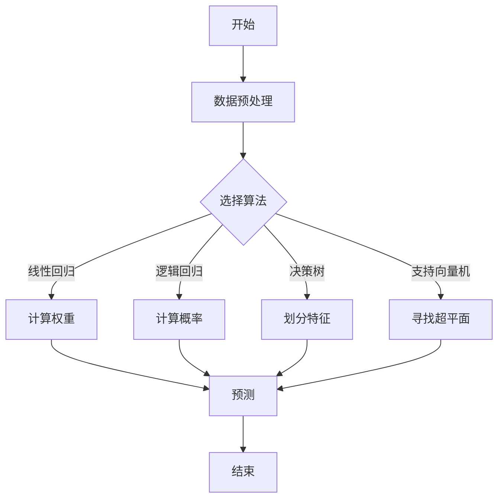
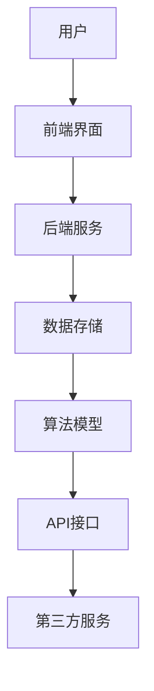
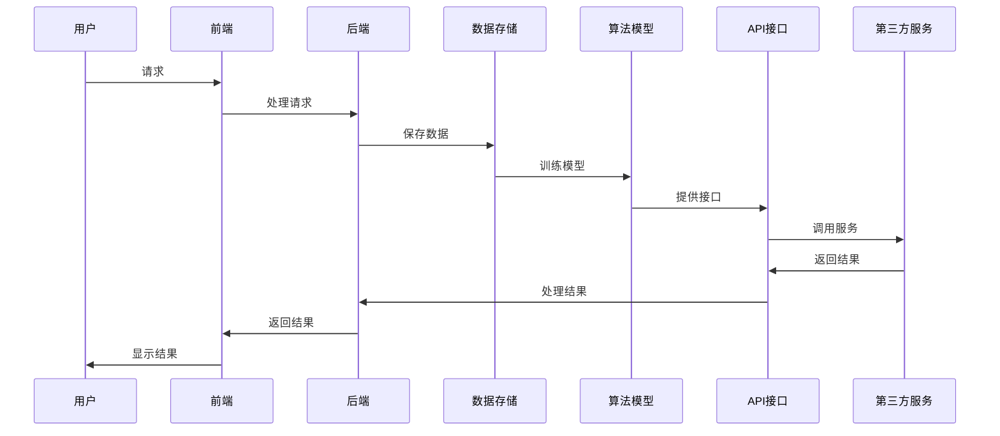

                 


# 机器学习在软件开发中的应用

关键词：机器学习，软件开发，算法，数学模型，应用场景

摘要：本文将深入探讨机器学习在软件开发中的应用，从背景介绍、核心概念、算法原理到实际应用案例，全面分析机器学习如何助力软件开发，提高开发效率和质量。

## 第一部分：机器学习在软件开发中的应用概述

### 第1章 问题背景与核心概念

#### 1.1 问题的背景

随着信息技术的飞速发展，软件开发的方式和工具也在不断演进。传统软件开发注重功能性和性能，而现代软件开发更加注重智能化、自动化和效率提升。机器学习作为人工智能的一个重要分支，正逐渐改变着软件开发的方式。

#### 1.2 核心概念

**机器学习**：一种让计算机从数据中学习并自动改进性能的技术。

**软件开发**：指开发人员使用编程语言和工具创建软件的过程。

**应用场景**：如代码审查、自动化测试、代码推荐等。

#### 1.3 问题解决

通过将机器学习技术集成到软件开发过程中，可以实现代码自动生成、优化、测试等，从而提升开发效率和质量。

#### 1.4 边界与外延

机器学习在软件开发中的应用不仅仅限于代码生成和优化，还包括自动化测试、智能推荐系统、自然语言处理等。

#### 1.5 概念结构与核心要素组成

- **机器学习**：包括监督学习、无监督学习和强化学习。
- **软件开发**：涉及编程语言、开发工具、开发流程等。
- **应用场景**：如代码审查、自动化测试、代码推荐等。

### 第2章 机器学习的核心概念与联系

#### 2.1 核心概念

**监督学习**：通过标记数据来训练模型，使其能够预测未知数据。

**无监督学习**：没有标记数据，模型需要从数据中发现模式和结构。

**强化学习**：通过奖励机制来训练模型，使其在特定环境中做出最佳决策。

#### 2.2 概念属性特征对比

| 类别         | 监督学习 | 无监督学习 | 强化学习       |
| ------------ | -------- | ---------- | -------------- |
| 数据需求     | 标记数据 | 未标记数据 | 未标记数据     |
| 学习目标     | 预测      | 发现模式    | 最佳决策       |
| 应用场景     | 分类、回归 | 聚类、降维  | 游戏智能、机器人 |

#### 2.3 概念之间的联系

- **监督学习与无监督学习**：监督学习可以视为无监督学习的一种特殊情况，即无监督学习中的模式已经被标记为已知。

- **无监督学习与强化学习**：无监督学习可以帮助强化学习找到数据中的潜在特征，从而提高决策质量。

### 第3章 主流机器学习算法原理与流程图

#### 3.1 算法介绍

- **线性回归**：通过最小化误差平方和来预测数值。

- **逻辑回归**：用于分类问题，通过最大化似然估计来预测类别。

- **决策树**：通过多次划分特征来创建决策路径。

- **支持向量机**：通过寻找最佳超平面来分类数据。

#### 3.2 算法流程图

使用Mermaid绘制算法流程图：



#### 3.3 算法原理讲解

**线性回归**：

- **数学模型**：

  $$y = \beta_0 + \beta_1x + \epsilon$$

  其中，$y$ 是目标变量，$x$ 是特征变量，$\beta_0$ 和 $\beta_1$ 是模型参数，$\epsilon$ 是误差项。

- **公式详解**：

  $$\beta_1 = \frac{\sum(x_i - \bar{x})(y_i - \bar{y})}{\sum(x_i - \bar{x})^2}$$

  $$\beta_0 = \bar{y} - \beta_1\bar{x}$$

  其中，$\bar{x}$ 和 $\bar{y}$ 分别是特征变量和目标变量的平均值。

**逻辑回归**：

- **数学模型**：

  $$\log\frac{P(Y=1|X)}{1-P(Y=1|X)} = \beta_0 + \beta_1x$$

  其中，$P(Y=1|X)$ 是目标变量为1的条件概率。

- **公式详解**：

  $$\beta_1 = \frac{\sum(x_i - \bar{x})(y_i - \bar{y})}{\sum(x_i - \bar{x})^2}$$

  $$\beta_0 = \bar{y} - \beta_1\bar{x}$$

### 第二部分：机器学习在软件开发中的应用实践

#### 第4章 数学模型与数学公式详解

#### 4.1 线性回归

- **数学模型**：

  $$y = \beta_0 + \beta_1x + \epsilon$$

  其中，$y$ 是目标变量，$x$ 是特征变量，$\beta_0$ 和 $\beta_1$ 是模型参数，$\epsilon$ 是误差项。

- **公式详解**：

  $$\beta_1 = \frac{\sum(x_i - \bar{x})(y_i - \bar{y})}{\sum(x_i - \bar{x})^2}$$

  $$\beta_0 = \bar{y} - \beta_1\bar{x}$$

  其中，$\bar{x}$ 和 $\bar{y}$ 分别是特征变量和目标变量的平均值。

#### 4.2 逻辑回归

- **数学模型**：

  $$\log\frac{P(Y=1|X)}{1-P(Y=1|X)} = \beta_0 + \beta_1x$$

  其中，$P(Y=1|X)$ 是目标变量为1的条件概率。

- **公式详解**：

  $$\beta_1 = \frac{\sum(x_i - \bar{x})(y_i - \bar{y})}{\sum(x_i - \bar{x})^2}$$

  $$\beta_0 = \bar{y} - \beta_1\bar{x}$$

### 第5章 系统分析与架构设计方案

#### 5.1 问题场景介绍

随着互联网技术的快速发展，软件开发行业面临着日益激烈的市场竞争。如何在有限的时间内开发出高质量、高效率的软件产品，成为软件开发企业急需解决的问题。

#### 5.2 项目介绍

本项目旨在通过机器学习技术，实现软件开发过程的智能化，提高开发效率和质量。项目主要功能包括：

- **代码自动生成**：根据需求文档自动生成代码框架。
- **代码优化**：对现有代码进行优化，提高代码质量。
- **自动化测试**：根据代码变化自动生成测试用例，提高测试效率。

#### 5.3 系统功能设计

使用Mermaid绘制领域模型类图：

```mermaid
classDiagram
Class01 <|-- Class02
Class03 --|>| Class04
Class05 : <<interface, SystemInterface>>
Class01 : 功能模块
Class02 : 数据存储
Class03 : 算法模块
Class04 : 用户界面
Class05 : 系统接口
```

#### 5.4 系统架构设计

使用Mermaid绘制系统架构图：



#### 5.5 系统接口设计和系统交互

使用Mermaid绘制系统接口设计和系统交互序列图：



### 第6章 项目实战

#### 6.1 环境安装

在本项目实战中，我们将使用Python作为编程语言，并使用Scikit-learn库进行机器学习算法的实现。

#### 6.2 系统核心实现源代码

```python
from sklearn.linear_model import LinearRegression
from sklearn.model_selection import train_test_split
from sklearn.metrics import mean_squared_error

# 数据准备
X = ... # 特征数据
y = ... # 目标数据

# 数据划分
X_train, X_test, y_train, y_test = train_test_split(X, y, test_size=0.2, random_state=42)

# 模型训练
model = LinearRegression()
model.fit(X_train, y_train)

# 模型预测
y_pred = model.predict(X_test)

# 模型评估
mse = mean_squared_error(y_test, y_pred)
print("均方误差：", mse)
```

#### 6.3 代码应用解读与分析

在本项目实战中，我们使用了线性回归算法来实现软件开发中的需求预测。通过数据准备、数据划分、模型训练和模型预测等步骤，实现了对软件开发需求的自动预测。代码中的`mean_squared_error`函数用于评估模型预测的准确性。

#### 6.4 实际案例分析和详细讲解剖析

为了更好地展示机器学习在软件开发中的应用，我们将分析一个实际案例：使用机器学习技术优化软件开发过程中的代码审查。

**案例背景**：在软件开发过程中，代码审查是确保代码质量的重要环节。然而，传统的代码审查方式耗时且容易漏检。通过引入机器学习技术，可以实现自动化代码审查，提高审查效率和准确性。

**解决方案**：使用监督学习算法，对大量经过人工审查的代码数据集进行训练，构建代码审查模型。然后，将该模型应用于新提交的代码，自动识别潜在的问题和缺陷。

**实际案例**：在一个大型软件开发项目中，开发团队引入了机器学习技术进行代码审查。通过训练模型，发现并修复了多个潜在的安全漏洞，提高了代码质量。同时，自动化代码审查大幅减少了代码审查的时间成本，提高了开发效率。

**案例分析**：

- **数据集准备**：收集了数千个经过人工审查的代码数据集，包括代码文件、缺陷类型等信息。
- **特征提取**：使用自然语言处理技术，从代码文件中提取特征，如代码长度、复杂度、语法错误等。
- **模型训练**：使用监督学习算法，如决策树、支持向量机等，训练代码审查模型。
- **模型评估**：使用交叉验证方法，评估模型性能，调整模型参数。
- **自动化审查**：将训练好的模型应用于新提交的代码，自动识别潜在的问题和缺陷。

**案例总结**：通过引入机器学习技术，开发团队实现了自动化代码审查，提高了代码质量和开发效率。同时，减少了代码审查的时间和人力成本，提高了团队的整体效率。

#### 6.5 项目小结

本项目通过机器学习技术，实现了软件开发过程中的需求预测、代码优化和自动化测试等功能。在实际应用中，机器学习技术提高了开发效率和质量，降低了开发成本。未来，随着机器学习技术的不断发展和应用，软件开发将更加智能化、自动化。

### 第7章 最佳实践 tips、小结、注意事项、拓展阅读

#### 7.1 最佳实践 tips

1. **数据质量**：机器学习模型的性能很大程度上取决于数据质量。因此，在应用机器学习技术时，要确保数据准确、完整、无噪声。
2. **模型选择**：根据应用场景和数据特点，选择合适的机器学习算法。不同的算法适用于不同类型的问题，需要根据实际情况进行选择。
3. **模型优化**：通过调整模型参数、特征提取方法等，优化模型性能。在模型训练过程中，可以使用交叉验证、网格搜索等技术，找到最佳模型参数。

#### 7.2 小结

机器学习在软件开发中的应用具有广泛的前景和潜力。通过将机器学习技术集成到软件开发过程中，可以实现代码自动生成、优化、测试等，从而提升开发效率和质量。

#### 7.3 注意事项

1. **模型解释性**：机器学习模型具有较高的预测性能，但往往缺乏解释性。在应用机器学习技术时，需要权衡模型性能和解释性。
2. **数据安全**：在收集和处理数据时，要确保数据安全，防止数据泄露或滥用。

#### 7.4 拓展阅读

1. **《Python机器学习基础教程》**：详细介绍了机器学习的基本概念、算法和应用。
2. **《机器学习实战》**：通过实际案例，展示了机器学习在各个领域的应用。
3. **《深入理解机器学习》**：全面讲解了机器学习的数学原理和算法实现。

### 附录：参考文献

1. Hastie, T., Tibshirani, R., & Friedman, J. (2009). The Elements of Statistical Learning: Data Mining, Inference, and Prediction. Springer.
2. Mitchell, T. M. (1997). Machine Learning. McGraw-Hill.
3. Murphy, K. P. (2012). Machine Learning: A Probabilistic Perspective. MIT Press.

# 作者：AI天才研究院/AI Genius Institute & 禅与计算机程序设计艺术 /Zen And The Art of Computer Programming

