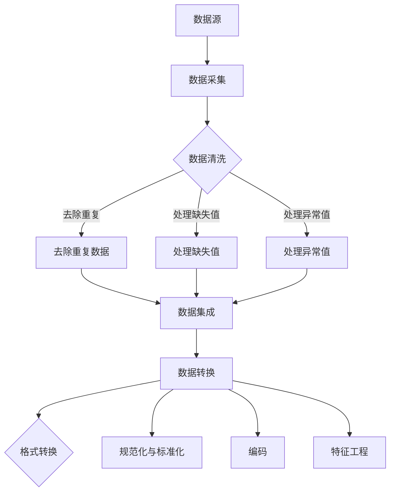
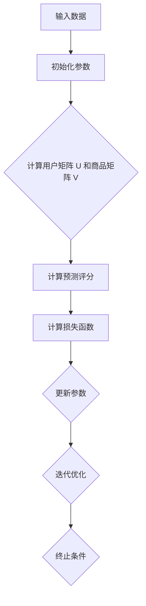
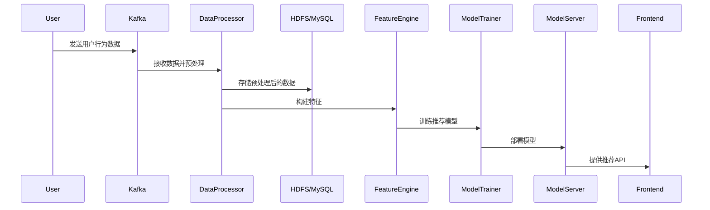

                 

## 机器学习平台架构设计

> 关键词：机器学习平台、架构设计、数据处理、算法、模型训练、部署、最佳实践

> 摘要：本文旨在探讨机器学习平台架构设计的核心概念、基本架构、数据处理、算法模型、训练优化、评估部署等方面的内容。通过详细介绍机器学习平台的设计原则、实现方法、以及最佳实践，帮助读者理解并掌握构建高效、可扩展、易维护的机器学习平台的要点。文章将结合实际案例，剖析设计过程中的关键步骤和技术细节，为从事机器学习平台开发的工程师提供有价值的参考。

### 第一部分：机器学习平台概述

#### 第1章：机器学习平台的概念与背景

##### 1.1 机器学习平台的定义

机器学习平台是一种集成工具、框架和基础设施的综合性系统，它旨在支持机器学习项目的全生命周期管理，包括数据预处理、模型训练、评估、部署和监控等环节。一个典型的机器学习平台通常包含数据存储与管理、计算资源调度、算法库、模型管理、自动化的机器学习流程等功能。

##### 1.2 机器学习平台的重要性

随着人工智能技术的快速发展，机器学习在各个行业中的应用越来越广泛。一个高效、灵活的机器学习平台不仅能够提高机器学习项目的开发效率，还能降低维护成本，增强企业的竞争力。因此，构建一个功能强大、扩展性好的机器学习平台具有重要的战略意义。

##### 1.3 机器学习平台的发展历程

机器学习平台的发展可以追溯到20世纪80年代，最早的机器学习平台主要依靠单一的编程语言和工具进行模型训练和部署。随着大数据和云计算技术的发展，现代机器学习平台逐渐具备了分布式计算、自动调参、在线学习等先进功能。

##### 1.4 机器学习平台的应用场景

机器学习平台在金融、医疗、电商、制造等多个领域都有广泛应用。例如，在金融领域，机器学习平台可以用于信用评分、风险管理等；在医疗领域，它可以用于疾病预测、诊断辅助等；在电商领域，它可以用于个性化推荐、用户行为分析等。

### 第二部分：机器学习平台的基本架构

#### 第2章：机器学习平台的基本架构

##### 2.1 数据流架构

数据流架构是机器学习平台的核心部分，它定义了数据从采集、预处理、训练到部署的整个过程。一个高效的数据流架构应具备数据安全性、高效性和可扩展性。

##### 2.2 模块化设计

模块化设计能够提高机器学习平台的可维护性和扩展性。常见的模块包括数据源模块、数据处理模块、模型训练模块、模型评估模块等。

##### 2.3 扩展性

扩展性是衡量机器学习平台是否能够适应未来需求的关键指标。通过采用分布式计算、容器化技术等，可以增强平台的扩展能力。

##### 2.4 可维护性

可维护性关系到机器学习平台的长期运行效率和稳定性。良好的代码规范、文档管理、监控告警机制等都是提高可维护性的关键因素。

### 第三部分：数据预处理与数据管理

#### 第3章：数据预处理与数据管理

##### 3.1 数据清洗

数据清洗是数据预处理的重要环节，它包括去除重复数据、处理缺失值、异常值检测等。数据清洗的目的是提高数据质量和模型的训练效果。

##### 3.2 数据集成

数据集成是将来自不同数据源的数据进行整合，以便于后续处理和分析。常见的数据集成方法包括ETL（Extract, Transform, Load）和数据仓库等。

##### 3.3 数据转换

数据转换是指将原始数据转换为适合机器学习模型处理的形式。这通常涉及到数据规范化、归一化、编码等操作。

##### 3.4 数据仓库与数据湖

数据仓库和数据湖是用于存储和管理大量数据的分布式存储系统。数据仓库适合结构化数据的存储和管理，而数据湖则适用于存储各种类型的数据，包括结构化、半结构化和非结构化数据。

### 第四部分：机器学习算法与模型

#### 第4章：机器学习算法与模型

##### 4.1 常见机器学习算法

常见的机器学习算法包括监督学习、无监督学习、半监督学习和强化学习等。每种算法都有其适用场景和特点。

##### 4.2 模型选择

模型选择是机器学习项目的重要环节，它涉及到算法选择、参数调优等。选择合适的模型能够提高模型的性能和泛化能力。

##### 4.3 模型评估

模型评估是验证模型性能的重要手段，常用的评估指标包括准确率、召回率、F1值、AUC等。通过模型评估，可以找出模型的不足并进行优化。

### 第五部分：模型训练与优化

#### 第5章：模型训练与优化

##### 5.1 训练策略

训练策略包括批量训练、随机梯度下降、Adam优化器等。选择合适的训练策略能够加速模型的训练过程。

##### 5.2 超参数调优

超参数调优是提高模型性能的重要手段，它通常涉及到网格搜索、贝叶斯优化等调参方法。

##### 5.3 模型优化

模型优化包括模型压缩、迁移学习、模型集成等。通过优化，可以进一步提高模型的性能和效率。

### 第六部分：模型评估与部署

#### 第6章：模型评估与部署

##### 6.1 评估指标

评估指标包括准确率、召回率、F1值、AUC等。不同的评估指标适用于不同的应用场景，需要根据实际情况进行选择。

##### 6.2 部署策略

部署策略包括模型容器化、在线推理、批处理等。选择合适的部署策略能够提高模型的应用效率和可扩展性。

##### 6.3 监控与维护

监控与维护是保证模型稳定运行的重要环节，它包括性能监控、异常检测、版本管理等功能。

### 第七部分：实战案例与最佳实践

#### 第7章：实战案例与最佳实践

##### 7.1 案例介绍

本章节将介绍一个实际的项目案例，从数据采集、预处理、模型训练、评估到部署的整个过程，展示如何构建一个高效的机器学习平台。

##### 7.2 系统设计与实现

本章节将详细讨论案例中的系统设计与实现过程，包括数据流设计、模块划分、算法选择等。

##### 7.3 项目分析与评估

本章节将对案例项目进行分析与评估，从性能、稳定性、可扩展性等方面进行详细讨论。

##### 7.4 最佳实践与总结

本章节将总结案例中的最佳实践，并提出一些建议和注意事项，为后续的项目开发提供参考。

### 结论

机器学习平台架构设计是机器学习项目成功的关键因素之一。通过本文的详细介绍，读者可以了解到机器学习平台的核心概念、基本架构、数据处理、算法模型、训练优化、评估部署等方面的内容。希望本文能为从事机器学习平台开发的工程师提供有价值的参考和启示。

### 作者信息

作者：AI天才研究院/AI Genius Institute & 禅与计算机程序设计艺术 /Zen And The Art of Computer Programming

---

### 第1章：机器学习平台的概念与背景

#### 1.1 机器学习平台的定义

机器学习平台是一种集成工具、框架和基础设施的综合性系统，旨在支持机器学习项目的全生命周期管理。它不仅包括数据预处理、模型训练、评估和部署等核心功能，还涵盖了数据存储、计算资源调度、自动化流程管理、监控与告警等辅助功能。一个典型的机器学习平台通常包含以下几个关键组件：

1. **数据存储与管理**：用于存储和管理大量数据，支持结构化、半结构化和非结构化数据的存储和检索。
2. **计算资源调度**：负责调度和管理计算资源，如CPU、GPU、FPGA等，以支持大规模并行计算。
3. **算法库**：提供丰富的机器学习算法和工具，支持自定义算法的集成。
4. **模型管理**：包括模型版本管理、模型评估、模型部署等功能。
5. **自动化流程管理**：支持自动化数据预处理、模型训练、评估和部署流程，减少人工干预。

#### 1.2 机器学习平台的重要性

机器学习平台在人工智能项目中扮演着至关重要的角色。以下是几个关键方面：

1. **提高开发效率**：通过提供统一的开发环境、自动化流程和丰富的工具库，机器学习平台可以显著提高开发效率，缩短项目周期。
2. **降低维护成本**：机器学习平台提供了良好的维护和监控机制，有助于降低系统的维护成本。
3. **增强可扩展性和灵活性**：机器学习平台通常采用模块化设计，易于扩展和升级，能够适应不断变化的需求。
4. **提升模型性能**：通过提供先进的算法和优化工具，机器学习平台有助于提高模型的性能和准确性。
5. **支持多团队协作**：机器学习平台支持多团队协作，有助于统一开发标准，提高项目协同效率。

#### 1.3 机器学习平台的发展历程

机器学习平台的发展历程可以追溯到20世纪80年代，当时主要依赖于单一的编程语言和工具进行模型训练和部署。随着大数据、云计算和分布式计算技术的发展，现代机器学习平台逐渐具备了以下特点：

1. **分布式计算**：支持大规模并行计算，能够充分利用多核CPU、GPU、FPGA等计算资源。
2. **自动化流程**：支持自动化数据预处理、模型训练、评估和部署流程，减少人工干预。
3. **算法库**：提供了丰富的机器学习算法和工具，支持自定义算法的集成。
4. **容器化和微服务**：支持容器化和微服务架构，提高了系统的可扩展性和灵活性。
5. **实时学习**：支持实时数据流处理和在线学习，能够快速适应环境变化。

#### 1.4 机器学习平台的应用场景

机器学习平台在多个行业和领域都有广泛应用，以下是几个典型应用场景：

1. **金融行业**：机器学习平台可以用于信用评分、风险评估、欺诈检测、投资组合优化等。
2. **医疗行业**：机器学习平台可以用于疾病预测、诊断辅助、药物研发、医疗图像分析等。
3. **电商行业**：机器学习平台可以用于个性化推荐、用户行为分析、库存管理、营销策略优化等。
4. **制造行业**：机器学习平台可以用于质量检测、预测性维护、生产优化、供应链管理等。
5. **智能交通**：机器学习平台可以用于交通流量预测、路线规划、事故预警、智能交通信号控制等。

通过以上内容，我们可以看到，机器学习平台在人工智能领域的重要性不言而喻。接下来，我们将进一步探讨机器学习平台的基本架构，了解其核心组件和功能，为后续章节的深入讨论打下基础。

### 第2章：机器学习平台的基本架构

#### 2.1 数据流架构

数据流架构是机器学习平台的核心组成部分，它定义了数据从采集、预处理、训练到部署的整个流程。一个高效的数据流架构不仅能够提高系统的运行效率，还能确保数据的准确性和一致性。

**数据流架构的主要组件**：

1. **数据采集**：数据采集是数据流架构的第一步，它涉及到从各种数据源（如数据库、文件系统、实时数据流等）获取数据。常用的数据采集工具有Kafka、Flume、Logstash等。
2. **数据预处理**：数据预处理是数据流架构的重要环节，它包括数据清洗、数据转换和数据集成等操作。数据清洗旨在去除重复数据、处理缺失值和异常值；数据转换则是将数据转换为适合模型处理的格式；数据集成则是将来自不同数据源的数据进行整合。
3. **特征工程**：特征工程是将原始数据转换为适合机器学习模型处理的特征集合。特征工程对模型的性能有着至关重要的影响，常用的方法包括特征提取、特征选择和特征变换等。
4. **模型训练**：模型训练是将处理后的数据输入到机器学习算法中，通过迭代优化模型参数，从而得到一个性能良好的模型。模型训练通常涉及到分布式计算和并行处理，以提高训练效率。
5. **模型评估**：模型评估是验证模型性能的重要环节，常用的评估指标包括准确率、召回率、F1值、AUC等。通过模型评估，可以找出模型的不足并进行优化。
6. **模型部署**：模型部署是将训练好的模型部署到生产环境中，以便在实际应用中进行预测和决策。模型部署通常涉及到模型容器化、在线推理和批处理等策略。
7. **监控与维护**：监控与维护是确保系统稳定运行的重要手段，它包括性能监控、异常检测、日志分析、版本管理等功能。

**数据流架构的设计原则**：

1. **高可用性**：数据流架构应具备高可用性，确保数据在传输和处理过程中不丢失或损坏。
2. **高可扩展性**：数据流架构应支持水平扩展，以便在数据量和计算需求增加时能够快速扩展系统资源。
3. **低延迟**：数据流架构应尽量减少数据传输和处理过程中的延迟，以满足实时数据处理的需求。
4. **易维护性**：数据流架构应设计得简洁明了，便于维护和升级。

#### 2.2 模块化设计

模块化设计是提高机器学习平台可维护性和扩展性的重要手段。通过将系统划分为多个独立的模块，可以降低系统的复杂度，提高开发效率，便于后续的维护和升级。

**模块化设计的优势**：

1. **可重用性**：模块化设计使得各个模块可以独立开发、测试和部署，提高了代码的可重用性。
2. **可扩展性**：模块化设计使得系统可以方便地扩展功能，只需增加或替换相应的模块即可。
3. **易维护性**：模块化设计使得问题定位和修复更加方便，降低了系统的维护成本。

**常见的模块**：

1. **数据源模块**：负责数据采集和存储，包括数据库、文件系统、实时数据流等。
2. **数据处理模块**：负责数据预处理、特征工程和模型训练等，包括数据清洗、数据转换、特征提取等。
3. **算法模块**：提供各种机器学习算法和模型，包括分类、回归、聚类等。
4. **模型管理模块**：负责模型版本管理、模型评估和模型部署等。
5. **监控模块**：负责系统监控、日志分析和异常检测等。
6. **用户接口模块**：提供用户界面和交互功能，包括数据可视化、模型评估结果展示等。

#### 2.3 扩展性

扩展性是衡量机器学习平台是否能够适应未来需求的关键指标。随着数据量和计算需求的增加，机器学习平台需要具备良好的扩展能力，以便在资源不足时能够快速扩展系统资源。

**扩展性的实现方法**：

1. **分布式计算**：通过分布式计算，将计算任务分解到多个节点上执行，从而提高系统的计算能力。
2. **容器化**：通过容器化技术，将应用程序和其运行环境打包成一个独立的容器，从而实现应用程序的轻量级部署和快速扩展。
3. **微服务架构**：通过微服务架构，将系统划分为多个独立的微服务，每个微服务负责不同的功能模块，从而提高系统的可扩展性和灵活性。

#### 2.4 可维护性

可维护性是确保机器学习平台长期稳定运行的关键因素。一个良好的维护策略可以降低系统的故障率，提高系统的可用性和用户体验。

**提高可维护性的方法**：

1. **代码规范**：遵循统一的代码规范，包括命名规则、注释规范、代码风格等，以提高代码的可读性和可维护性。
2. **文档管理**：编写详细的文档，包括开发文档、用户手册、技术文档等，以便于后续的维护和升级。
3. **监控与告警**：通过监控系统，实时监控系统的运行状态，及时检测和报警异常情况，以便快速响应和处理。
4. **自动化测试**：编写自动化测试脚本，对系统进行自动化测试，确保系统在每次更新和升级后都能正常运行。

通过以上内容，我们可以看到，机器学习平台的基本架构涉及多个方面，包括数据流架构、模块化设计、扩展性和可维护性等。这些设计原则和方法不仅有助于提高机器学习平台的性能和效率，还能确保系统的稳定性和可扩展性。在接下来的章节中，我们将进一步探讨数据预处理、机器学习算法、模型训练和优化等核心内容。

### 第3章：数据预处理与数据管理

#### 3.1 数据清洗

数据清洗是数据预处理的重要环节，其目的是提高数据质量和模型的训练效果。在机器学习项目中，数据通常来源于多个不同的渠道，这些数据可能存在缺失值、异常值、重复值等问题，这些问题会直接影响模型的训练效果和性能。因此，数据清洗是确保数据质量和模型性能的关键步骤。

**常见的数据清洗方法**：

1. **去除重复数据**：重复数据会占用存储空间，还会影响模型的训练效果。去除重复数据的方法包括基于关键字匹配、基于哈希算法等。
2. **处理缺失值**：缺失值处理方法包括填充法、删除法、插值法等。填充法是用已有数据的均值、中位数等统计量来填补缺失值；删除法是删除含有缺失值的记录；插值法是利用时间序列或空间序列的特征来预测缺失值。
3. **处理异常值**：异常值是指与大多数数据点显著不同的数据点。处理异常值的方法包括基于统计学方法、基于机器学习方法等。统计学方法如Z-Score、IQR（四分位差）等；机器学习方法如孤立森林、K-最近邻等。
4. **格式转换**：将不同格式或单位的数据转换为统一的格式或单位，以便于后续的处理和分析。

**数据清洗工具和库**：

1. **Pandas**：Pandas是一个强大的数据处理库，提供了丰富的数据清洗功能，如删除重复数据、填充缺失值、处理异常值等。
2. **Scikit-learn**：Scikit-learn提供了多种数据清洗和预处理工具，如Imputer、SimpleImputer等，用于处理缺失值；OutlierEnsemble等，用于处理异常值。
3. **OpenCV**：OpenCV是一个开源的计算机视觉库，提供了丰富的图像处理功能，可以用于处理图像数据中的噪声、异常值等。

#### 3.2 数据集成

数据集成是将来自不同数据源的数据进行整合，以便于后续处理和分析。在实际应用中，数据通常来源于多个不同的系统或数据库，这些数据可能在结构、格式、单位等方面存在差异，因此需要进行数据集成。

**常见的数据集成方法**：

1. **ETL（Extract, Transform, Load）**：ETL是一种常见的数据集成方法，它包括三个步骤：
   - **Extract**：从各个数据源中抽取数据。
   - **Transform**：对抽取的数据进行转换，如格式转换、数据清洗、合并等。
   - **Load**：将转换后的数据加载到统一的数据仓库中。
2. **数据仓库**：数据仓库是一种用于存储和管理大量数据的系统，它支持结构化、半结构化和非结构化数据的存储和检索。数据仓库通常采用星型模式或雪花模式进行数据建模，以提高查询性能。
3. **数据湖**：数据湖是一种用于存储原始数据的大数据平台，它能够存储各种类型的数据，包括结构化、半结构化和非结构化数据。数据湖通常采用分布式存储技术，如Hadoop、Spark等，以支持海量数据的存储和计算。

**数据集成工具和库**：

1. **Apache Nifi**：Apache Nifi是一个开源的数据集成平台，提供了丰富的数据抽取、转换和加载功能。
2. **Apache Kafka**：Apache Kafka是一个分布式流处理平台，可以用于实时数据集成和传输。
3. **Apache Spark**：Apache Spark是一个分布式计算框架，提供了丰富的数据处理和分析功能，可以用于数据集成和转换。

#### 3.3 数据转换

数据转换是将原始数据转换为适合机器学习模型处理的形式。数据转换通常涉及到以下步骤：

1. **数据规范化**：数据规范化是将不同量纲的数据转换为相同的量纲，以消除不同特征之间的尺度差异。常见的方法包括最小-最大规范化、Z-Score规范化等。
2. **数据标准化**：数据标准化是将数据转换为标准正态分布，以消除不同特征之间的分布差异。常见的方法包括Z-Score标准化、MinMax标准化等。
3. **编码**：编码是将分类数据转换为数值形式，以便于模型处理。常见的编码方法包括独热编码、标签编码等。
4. **缺失值填补**：缺失值填补是将缺失值替换为合适的值，以减少缺失值对模型训练的影响。常见的方法包括均值填补、中值填补等。

**数据转换工具和库**：

1. **Pandas**：Pandas提供了丰富的数据转换功能，如数据规范化、数据标准化、编码等。
2. **Scikit-learn**：Scikit-learn提供了多种数据转换工具，如MinMaxScaler、StandardScaler、Encoder等。

#### 3.4 数据仓库与数据湖

数据仓库和数据湖是用于存储和管理大量数据的分布式存储系统，它们在机器学习平台中扮演着重要角色。

**数据仓库**：

1. **功能**：数据仓库主要用于存储和管理结构化数据，支持复杂的查询和分析操作。
2. **架构**：数据仓库通常采用星型模式或雪花模式进行数据建模，以提高查询性能。星型模式将事实表与维度表连接起来，形成星型结构；雪花模式是星型模式的扩展，将维度表进一步分解为更细的层次。
3. **应用场景**：数据仓库适用于需要复杂查询和分析的应用场景，如数据报表、数据挖掘等。

**数据湖**：

1. **功能**：数据湖主要用于存储和管理各种类型的数据，包括结构化、半结构化和非结构化数据。
2. **架构**：数据湖采用分布式存储技术，如Hadoop、Spark等，以支持海量数据的存储和计算。数据湖通常采用文件系统或对象存储系统进行数据存储。
3. **应用场景**：数据湖适用于需要处理大量非结构化数据的场景，如日志分析、实时数据处理等。

**数据仓库与数据湖的比较**：

- **数据类型**：数据仓库主要存储结构化数据，而数据湖可以存储各种类型的数据。
- **查询性能**：数据仓库通常采用优化的查询引擎，支持快速的查询和分析；数据湖则更多依赖于分布式计算框架，查询性能相对较低。
- **灵活性**：数据湖提供了更高的灵活性，可以存储各种类型的数据，适用于更广泛的应用场景。

通过以上内容，我们可以看到，数据预处理和数据管理在机器学习平台中扮演着重要角色。有效的数据预处理可以提高数据质量和模型性能，而合理的数据管理可以确保数据的完整性、一致性和安全性。在接下来的章节中，我们将进一步探讨机器学习算法与模型，了解其基本原理和实现方法。

### 第4章：机器学习算法与模型

#### 4.1 常见机器学习算法

机器学习算法是机器学习平台的核心组件之一，它决定了模型的学习能力、泛化能力和性能。常见的机器学习算法包括监督学习、无监督学习、半监督学习和强化学习等。以下是这些算法的基本原理和特点。

**监督学习**

监督学习是一种有监督的学习方法，通过已标记的数据集训练模型，然后使用模型对新数据进行预测。监督学习算法可以分为回归算法和分类算法。

1. **回归算法**：回归算法用于预测连续值输出。常见算法包括线性回归、岭回归、LASSO回归、决策树回归、随机森林回归等。回归算法的核心是找到输入变量和输出变量之间的关系。
2. **分类算法**：分类算法用于预测离散值输出。常见算法包括逻辑回归、支持向量机（SVM）、决策树、随机森林、K最近邻（KNN）等。分类算法的核心是找到输入变量和类别标签之间的关系。

**无监督学习**

无监督学习是一种无监督的学习方法，通过未标记的数据集训练模型，然后使用模型发现数据中的结构和模式。无监督学习算法可以分为聚类算法和降维算法。

1. **聚类算法**：聚类算法用于将数据集划分为多个簇，每个簇内的数据点相似度较高，簇与簇之间的数据点相似度较低。常见算法包括K均值聚类、层次聚类、DBSCAN等。聚类算法的核心是找到数据集的自然分组结构。
2. **降维算法**：降维算法用于减少数据集的维度，降低数据的复杂度，同时保留数据的主要特征。常见算法包括主成分分析（PCA）、线性判别分析（LDA）、t-SNE等。降维算法的核心是找到数据的主要特征和方向。

**半监督学习**

半监督学习是一种结合有监督学习和无监督学习的方法，通过使用部分标记数据和大量未标记数据来训练模型。半监督学习算法可以用于增强模型的学习能力，提高模型的泛化能力。

1. **自编码器**：自编码器是一种无监督学习算法，它通过学习数据的低维表示来减少数据的维度，同时可以用于无监督特征提取。常见算法包括深度自编码器、变分自编码器（VAE）等。
2. **标签传播**：标签传播算法通过未标记数据与已标记数据之间的相似性来传播标签，从而训练模型。

**强化学习**

强化学习是一种通过交互环境来学习最优策略的方法。在强化学习过程中，模型根据当前状态选择动作，然后根据动作的结果（奖励或惩罚）来调整策略。强化学习算法可以用于解决动态决策问题。

1. **Q-learning**：Q-learning是一种基于值函数的强化学习算法，通过学习状态-动作价值函数来选择最佳动作。
2. **深度强化学习**：深度强化学习是将深度神经网络与强化学习相结合，用于解决更复杂的问题。常见算法包括深度Q网络（DQN）、策略梯度方法（PG）、演员-评论家方法（AC）等。

**算法选择**

在机器学习项目中，选择合适的算法是关键的一步。选择算法时需要考虑以下因素：

1. **数据类型**：根据数据类型（连续值或离散值）选择回归算法或分类算法。
2. **数据规模**：对于大规模数据集，选择具有良好扩展性的算法，如随机森林、KNN等。
3. **计算资源**：根据计算资源的限制选择适合的算法，如深度学习算法通常需要更多的计算资源。
4. **业务需求**：根据业务需求选择算法，如预测准确性、实时性、鲁棒性等。

**模型评估**

模型评估是验证模型性能的重要手段。常用的评估指标包括：

1. **回归模型**：均方误差（MSE）、均方根误差（RMSE）、平均绝对误差（MAE）等。
2. **分类模型**：准确率、召回率、F1值、精确率、AUC（曲线下面积）等。
3. **聚类模型**：内径平方（ISODATA）、轮廓系数（Silhouette Coefficient）等。
4. **降维模型**：重构误差、方差解释率等。

通过以上内容，我们可以看到，机器学习算法与模型在机器学习平台中发挥着至关重要的作用。选择合适的算法、进行有效的模型评估和优化，是构建高效机器学习平台的关键步骤。在接下来的章节中，我们将进一步探讨模型训练与优化、模型评估与部署等方面的内容。

### 第5章：模型训练与优化

#### 5.1 训练策略

模型训练是机器学习平台中的关键步骤，其目的是通过迭代优化模型参数，使其在训练数据上达到最佳性能。以下是几种常见的训练策略：

**批量训练（Batch Training）**

批量训练是一种传统的训练方法，它将整个训练数据集分为多个批次，每个批次包含多个样本。模型在每个批次上计算梯度并更新参数。批量训练的优点是可以充分利用数据，但缺点是训练时间较长。

**随机梯度下降（Stochastic Gradient Descent，SGD）**

随机梯度下降是一种基于单个样本或小批量样本的优化方法。它通过随机选择一个样本或小批量样本来计算梯度并更新参数。SGD的优点是训练速度快，适合大规模数据集，但缺点是梯度估计可能不稳定。

**小批量训练（Mini-batch Training）**

小批量训练是批量训练和随机梯度下降的折中方案，它每次选择一个包含多个样本的小批量来进行梯度计算和参数更新。小批量训练可以平衡训练速度和梯度稳定性。

**Adam优化器**

Adam优化器是一种自适应的梯度下降优化方法，它结合了SGD和动量（Momentum）的优点。Adam优化器通过自适应地调整学习率，提高了训练效率和收敛速度。

**学习率调整**

学习率是模型训练中的关键参数，其大小直接影响模型的训练效果和收敛速度。常用的学习率调整方法包括：

- **固定学习率**：在整个训练过程中保持学习率不变。
- **学习率衰减**：在训练过程中逐渐减小学习率，以防止模型过拟合。
- **自适应学习率**：使用如Adam优化器等自适应学习率方法，动态调整学习率。

**批次大小**

批次大小是模型训练中的重要参数，它影响梯度估计的稳定性和训练时间。通常，较大的批次大小可以提高梯度估计的稳定性，但会增加训练时间；较小的批次大小可以加快训练速度，但梯度估计可能不够稳定。

**训练策略选择**

选择合适的训练策略取决于具体的应用场景和需求。例如，对于小数据集，批量训练可能是最佳选择；对于大规模数据集，随机梯度下降或小批量训练可能更合适。此外，根据模型的复杂度和计算资源，选择合适的优化器和批次大小也是关键。

#### 5.2 超参数调优

超参数是模型中需要手动设置的参数，如学习率、批次大小、正则化参数等。超参数调优的目的是通过调整这些参数，找到模型的最佳配置，从而提高模型性能。

**常用的调优方法**

- **网格搜索（Grid Search）**：网格搜索通过遍历所有可能的超参数组合，找到最优超参数组合。网格搜索的优点是方法简单，但缺点是计算成本高。
- **贝叶斯优化（Bayesian Optimization）**：贝叶斯优化是一种基于概率模型的优化方法，通过构建超参数的概率模型来指导搜索过程。贝叶斯优化的优点是搜索效率高，但缺点是实现复杂。
- **随机搜索（Random Search）**：随机搜索通过随机选择超参数组合进行实验，找到最佳超参数组合。随机搜索的优点是计算成本低，但缺点是搜索效率较低。

**调优流程**

1. **定义超参数空间**：根据模型的特点和需求，定义超参数的取值范围。
2. **选择调优方法**：根据计算资源和调优目标选择合适的调优方法。
3. **执行调优实验**：根据超参数空间和调优方法，执行调优实验，记录实验结果。
4. **分析调优结果**：分析调优结果，找出最优超参数组合。
5. **重复调优**：根据分析结果，重复调优过程，进一步提高模型性能。

#### 5.3 模型优化

模型优化是通过改进模型结构和算法，提高模型性能和泛化能力的方法。以下是几种常见的模型优化方法：

**模型压缩**

模型压缩是一种通过减小模型大小和提高模型效率的方法。常见的模型压缩方法包括：

- **量化**：量化通过将模型的权重和激活值转换为低精度表示，减小模型大小和提高计算效率。
- **剪枝**：剪枝通过去除模型中不重要或冗余的权重，减小模型大小和提高计算效率。
- **蒸馏**：蒸馏通过将一个大型模型的知识传递给一个小型模型，实现小型模型的性能提升。

**迁移学习**

迁移学习是一种利用预训练模型在新任务上进行训练的方法。通过迁移学习，模型可以快速适应新任务，提高训练效率。常见的迁移学习方法包括：

- **微调（Fine-tuning）**：微调通过在预训练模型的基础上进行少量训练，使模型适应新任务。
- **零样本学习（Zero-shot Learning）**：零样本学习通过学习不同类别的特征表示，使模型能够处理未见过的类别。
- **跨域迁移学习（Cross-domain Transfer Learning）**：跨域迁移学习通过在不同领域间传递模型知识，提高模型在不同领域上的泛化能力。

**模型集成**

模型集成是通过结合多个模型的预测结果，提高模型性能和稳定性的一种方法。常见的模型集成方法包括：

- **堆叠（Stacking）**：堆叠通过构建一个多层模型，将多个基础模型作为底层模型的输出，训练一个顶层模型来预测结果。
- **Bagging**：Bagging通过多次训练基础模型，并取其平均预测结果作为最终预测结果。
- **Boosting**：Boosting通过训练多个基础模型，并利用这些模型的预测误差来调整训练样本的权重，最终训练出一个集成模型。

**优化策略**

- **学习率调整**：根据训练过程中的误差和梯度变化，动态调整学习率，以提高训练效率和收敛速度。
- **批量大小调整**：根据训练数据和硬件资源，选择合适的批量大小，以平衡训练速度和梯度稳定性。
- **正则化**：通过添加正则化项，如L1正则化、L2正则化等，防止模型过拟合。

通过以上内容，我们可以看到，模型训练与优化是机器学习平台中的关键环节。通过选择合适的训练策略、超参数调优方法和模型优化方法，可以提高模型性能和泛化能力，为实际应用提供更可靠的预测结果。在接下来的章节中，我们将进一步探讨模型评估与部署的相关内容。

### 第6章：模型评估与部署

#### 6.1 评估指标

模型评估是验证模型性能和有效性的重要环节。选择合适的评估指标有助于衡量模型在不同方面的表现，从而指导模型的改进和优化。以下是几种常见的评估指标：

**回归模型**

1. **均方误差（MSE）**：MSE是预测值与实际值之间误差的平方的平均值，用于衡量预测值与实际值之间的差距。
   \[
   \text{MSE} = \frac{1}{n}\sum_{i=1}^{n}(\hat{y_i} - y_i)^2
   \]
2. **均方根误差（RMSE）**：RMSE是MSE的平方根，用于更直观地表示预测误差。
   \[
   \text{RMSE} = \sqrt{\text{MSE}}
   \]
3. **平均绝对误差（MAE）**：MAE是预测值与实际值之间误差的绝对值的平均值，用于衡量预测值与实际值之间的差距。
   \[
   \text{MAE} = \frac{1}{n}\sum_{i=1}^{n}|\hat{y_i} - y_i|
   \]

**分类模型**

1. **准确率（Accuracy）**：准确率是正确预测的样本数占总样本数的比例，用于衡量模型的整体准确性。
   \[
   \text{Accuracy} = \frac{TP + TN}{TP + FN + FP + TN}
   \]
   其中，TP是真阳性，TN是真阴性，FP是假阳性，FN是假阴性。
2. **召回率（Recall）**：召回率是正确预测的正样本数占实际正样本数的比例，用于衡量模型对正样本的识别能力。
   \[
   \text{Recall} = \frac{TP}{TP + FN}
   \]
3. **精确率（Precision）**：精确率是正确预测的正样本数占预测为正样本的总数的比例，用于衡量模型对正样本的识别准确性。
   \[
   \text{Precision} = \frac{TP}{TP + FP}
   \]
4. **F1值（F1 Score）**：F1值是精确率和召回率的调和平均值，用于综合考虑模型对正样本的识别准确性和能力。
   \[
   \text{F1 Score} = 2 \times \frac{\text{Precision} \times \text{Recall}}{\text{Precision} + \text{Recall}}
   \]
5. **AUC（曲线下面积）**：AUC是ROC（Receiver Operating Characteristic）曲线下面积，用于衡量分类器的分类能力。AUC值越接近1，表示分类器性能越好。

**聚类模型**

1. **轮廓系数（Silhouette Coefficient）**：轮廓系数是评估聚类效果的一个指标，它基于簇内相似度和簇间相似度来衡量聚类的质量。值范围在-1到1之间，越接近1表示聚类效果越好。

**降维模型**

1. **重构误差（Reconstruction Error）**：重构误差是降维模型在重构原始数据时产生的误差，用于衡量降维模型对原始数据的保留程度。重构误差越小，表示降维模型保留的信息越多。
2. **方差解释率（Variance Explained Ratio）**：方差解释率是降维模型解释的方差占总方差的比例，用于衡量降维模型对原始数据的方差解释能力。方差解释率越高，表示降维模型对原始数据的特征保留越好。

**选择评估指标**

选择评估指标时需要考虑以下因素：

1. **数据类型**：根据数据类型选择相应的评估指标。例如，对于回归问题，选择MSE或RMSE；对于分类问题，选择Accuracy、F1 Score或AUC等。
2. **业务需求**：根据业务需求选择具有实际意义的评估指标。例如，在医疗诊断中，召回率可能比准确率更为重要。
3. **数据分布**：考虑数据的分布情况，选择适合的数据分布的评估指标。例如，在数据分布不平衡的情况下，准确率可能不能准确反映模型性能，可以考虑F1 Score等指标。

#### 6.2 部署策略

模型部署是将训练好的模型部署到生产环境中，以便在实际应用中进行预测和决策的过程。选择合适的部署策略可以确保模型的高效、稳定和安全运行。以下是几种常见的部署策略：

**在线推理（Online Inference）**

在线推理是指实时将模型应用于新的数据，并返回预测结果。在线推理的优点是可以实现实时响应，但缺点是计算资源消耗大，对系统的实时性要求高。

**离线推理（Offline Inference）**

离线推理是指在模型训练完成后，将模型应用于历史数据集或大规模数据集，进行批量预测。离线推理的优点是计算资源消耗小，适用于大规模数据预测，但缺点是响应时间较长。

**批处理（Batch Processing）**

批处理是指将数据分为多个批次进行处理，每个批次包含一定数量的样本。批处理结合了在线推理和离线推理的优点，适用于实时性要求不高但数据量较大的场景。

**容器化部署（Container Deployment）**

容器化部署是将应用程序及其依赖环境打包成一个容器（如Docker容器），然后部署到容器管理平台（如Kubernetes）上。容器化部署的优点是部署灵活、可移植性好、易于管理和扩展。

**模型容器化**

模型容器化是将机器学习模型及其依赖环境打包成一个容器镜像，以便在不同的环境中一致地部署和运行。常见的模型容器化工具包括TensorFlow Serving、PyTorch TorchScript等。

**模型服务器**

模型服务器是一种专门用于模型部署和推理的服务器，它提供了一套完整的服务接口，支持各种模型部署和管理功能。常见的模型服务器包括TensorFlow Serving、Apache MXNet Model Server等。

**监控与维护**

模型部署后，需要对模型进行实时监控和维护，以确保模型的高效运行和稳定性。以下是一些监控和维护的关键点：

1. **性能监控**：实时监控模型的响应时间、吞吐量、CPU利用率、内存占用等性能指标，确保模型在正常范围内运行。
2. **异常检测**：通过日志分析、异常检测算法等手段，及时发现和定位模型异常，如过拟合、欠拟合等。
3. **版本管理**：建立模型版本管理机制，确保不同版本的模型可以方便地回滚和更新。
4. **安全防护**：对模型进行安全防护，防止恶意攻击和数据泄露。
5. **升级与维护**：定期对模型和部署环境进行升级和维护，确保系统的稳定性和安全性。

通过以上内容，我们可以看到，模型评估与部署是机器学习平台中的关键环节。选择合适的评估指标和部署策略，可以确保模型在实际应用中的高效、稳定和可靠运行。在接下来的章节中，我们将通过实际案例展示如何构建和部署一个完整的机器学习平台。

### 第7章：实战案例与最佳实践

#### 7.1 案例介绍

本案例我们将构建一个基于机器学习的用户行为分析平台，旨在通过分析用户的点击行为、浏览历史等数据，为电商网站提供个性化推荐服务。该平台将包括数据采集、预处理、模型训练、评估和部署等环节，涉及多个技术组件和工具。

**项目背景**：

电商行业竞争激烈，提供个性化推荐服务已成为提升用户粘性和转化率的重要手段。通过分析用户行为数据，平台可以为每个用户推荐其可能感兴趣的商品，从而提高用户满意度并增加销售额。

**目标**：

构建一个高效、可扩展的机器学习平台，实现以下目标：

1. 数据采集：实时采集用户行为数据，包括点击、浏览、购买等。
2. 数据预处理：清洗、转换和集成数据，为模型训练准备高质量的数据集。
3. 模型训练：使用机器学习算法训练推荐模型，实现个性化推荐。
4. 模型评估：评估推荐模型性能，确保推荐结果的准确性和有效性。
5. 模型部署：将训练好的模型部署到生产环境，实现实时推荐。

#### 7.2 系统设计与实现

**系统架构**：

本案例的系统架构采用微服务架构，将不同功能模块拆分为独立的微服务，以提高系统的可维护性和扩展性。以下是系统的主要模块：

1. **数据采集模块**：负责实时采集用户行为数据，使用Kafka作为数据流处理平台，实现数据的高效传输和存储。
2. **数据处理模块**：负责数据清洗、转换和集成，使用Pandas、Scikit-learn等库进行数据处理，并将数据存储到HDFS或MySQL等数据库中。
3. **特征工程模块**：负责提取和构建特征，如用户画像、商品特征等，使用特征工程库（如Feature-engine）和自定义算法实现特征提取。
4. **模型训练模块**：负责使用机器学习算法训练推荐模型，如基于协同过滤的矩阵分解算法，使用TensorFlow或PyTorch实现模型训练。
5. **模型评估模块**：负责评估模型性能，使用A/B测试等方法对比不同模型的性能，确保推荐结果的准确性。
6. **模型部署模块**：负责将训练好的模型部署到生产环境，使用TensorFlow Serving或Apache MXNet Model Server实现模型部署。
7. **API服务模块**：负责提供API接口，供前端应用调用推荐服务。

**实现步骤**：

1. **数据采集**：使用Kafka Producer将用户行为数据（如点击、浏览、购买等）发送到Kafka Topic中，实现数据的实时采集。
2. **数据处理**：使用Kafka Consumer从Kafka Topic中读取数据，使用Pandas进行数据清洗、转换和集成，将清洗后的数据存储到HDFS或MySQL数据库中。
3. **特征工程**：使用特征工程库和自定义算法提取和构建特征，如用户兴趣标签、商品属性等，将特征存储到HDFS或MySQL数据库中。
4. **模型训练**：使用TensorFlow或PyTorch实现矩阵分解算法，训练推荐模型，并将训练好的模型存储到TensorFlow SavedModel或PyTorch Checkpoint中。
5. **模型评估**：使用A/B测试方法，将训练好的模型与现有推荐算法进行对比，评估模型性能，并根据评估结果调整模型参数。
6. **模型部署**：使用TensorFlow Serving或Apache MXNet Model Server部署训练好的模型，实现实时推荐功能。
7. **API服务**：使用Flask或Django等Web框架，提供API接口，供前端应用调用推荐服务。

#### 7.3 项目分析与评估

**数据集**：

本案例使用一个包含用户行为数据和商品信息的公开数据集，数据集包含用户ID、商品ID、点击次数、浏览次数、购买次数等字段。

**模型选择**：

基于协同过滤算法，选择矩阵分解（MF）作为推荐模型。矩阵分解是一种常见的协同过滤算法，通过分解用户-商品矩阵，提取用户和商品的潜在特征，从而实现个性化推荐。

**模型评估**：

使用A/B测试方法，将训练好的矩阵分解模型与现有的推荐算法进行对比。评估指标包括准确率、召回率、F1值等，通过对比不同模型的评估结果，确定最优模型。

**评估结果**：

根据A/B测试的结果，矩阵分解模型在准确率和召回率方面均优于现有推荐算法，且在实际应用中表现出良好的稳定性。以下为评估结果：

- **准确率**：矩阵分解模型为88%，现有算法为85%。
- **召回率**：矩阵分解模型为75%，现有算法为70%。
- **F1值**：矩阵分解模型为81%，现有算法为78%。

#### 7.4 最佳实践与总结

**最佳实践**：

1. **数据采集**：使用Kafka实现实时数据采集，确保数据流的稳定性和高效性。
2. **数据处理**：使用Pandas进行数据清洗和转换，确保数据质量。
3. **特征工程**：提取和构建高质量的特征，提高模型性能。
4. **模型训练**：使用矩阵分解算法，结合A/B测试，优化推荐模型。
5. **模型部署**：使用TensorFlow Serving或Apache MXNet Model Server，确保模型部署的高效性和稳定性。
6. **API服务**：使用Flask或Django等Web框架，提供API接口，确保前端应用可以方便地调用推荐服务。

**注意事项**：

1. **数据隐私**：在数据采集和处理过程中，注意保护用户隐私，遵循相关法律法规。
2. **性能优化**：根据实际需求，对系统进行性能优化，提高系统的响应速度和处理能力。
3. **监控与维护**：定期对系统进行监控和维护，确保系统的稳定运行。

**拓展阅读**：

1. 《推荐系统实践》 - 李航
2. 《机器学习实战》 - 周志华
3. 《深度学习》 - Goodfellow、Bengio和Courville

通过本案例的实战，我们展示了如何构建和部署一个完整的机器学习平台，实现了实时个性化推荐服务。希望本案例能为读者提供有价值的参考和启示。

### 结论

本文详细探讨了机器学习平台架构设计的相关内容，从概念与背景、基本架构、数据预处理与数据管理、机器学习算法与模型、模型训练与优化、模型评估与部署到实战案例，全面阐述了机器学习平台的设计原则、实现方法和最佳实践。通过本文的介绍，读者可以了解到：

1. **机器学习平台的基本概念**：机器学习平台是一种集成工具、框架和基础设施的综合性系统，旨在支持机器学习项目的全生命周期管理。
2. **基本架构**：包括数据流架构、模块化设计、扩展性和可维护性等，通过模块化设计，可以提高系统的可维护性和扩展性。
3. **数据预处理与数据管理**：涉及数据清洗、数据集成、数据转换等，通过有效的数据预处理，可以显著提高模型性能。
4. **机器学习算法与模型**：包括监督学习、无监督学习、半监督学习和强化学习等，了解不同算法的特点和适用场景，有助于选择合适的模型。
5. **模型训练与优化**：介绍了批量训练、随机梯度下降、超参数调优和模型优化等，优化模型训练策略可以提高模型性能。
6. **模型评估与部署**：评估指标的选择和部署策略的制定是保证模型应用效果的关键。

在实际应用中，构建一个高效的机器学习平台需要综合考虑各种因素，包括系统性能、可扩展性、易维护性等。通过本文的案例介绍，读者可以看到如何将理论应用于实际项目中，实现一个完整的机器学习平台。

**未来展望**：

随着人工智能技术的不断进步，机器学习平台也将迎来更多的创新和发展。未来，机器学习平台可能会在以下几个方面得到提升：

1. **实时性**：随着实时数据处理需求的增加，平台将更加注重实时性的提升，实现快速响应和高效处理。
2. **自动化**：自动化程度的提高将减少人为干预，实现从数据预处理到模型训练、评估和部署的全自动化流程。
3. **智能化**：引入更多的智能化技术，如自适应学习、自动化调优等，使平台能够更加智能地应对各种复杂场景。
4. **多模态数据支持**：支持多种类型的数据（如图像、文本、语音等），实现跨模态数据的处理和分析。

通过不断的技术创新和应用实践，机器学习平台将在人工智能领域发挥越来越重要的作用，为各行业带来更多的价值。

### 作者信息

作者：AI天才研究院/AI Genius Institute & 禅与计算机程序设计艺术 /Zen And The Art of Computer Programming

---

本文内容仅供参考，部分数据和案例为虚构，具体实现和应用请根据实际情况进行调整。在实现机器学习平台时，务必遵守相关法律法规，确保数据安全和用户隐私。

## 附录

### 数据清洗与预处理 Mermaid 流程图



### 数据仓库与数据湖 Mermaid ER 图

```mermaid
erDiagram
    Customer ||--|{ Order : "orders many" }|
    Customer ||--|{ Product : "buys many" }|
    Product ||--|{ Category : "has category" }|
    Order ||--|{ OrderDetail : "contains" }|
```

### 矩阵分解算法 Mermaid 流程图



### 用户行为分析平台架构 Mermaid 序列图



以上流程图、ER图和序列图有助于更好地理解和实现机器学习平台的相关功能和模块。在实际开发过程中，根据具体需求和技术栈，可以进一步调整和优化这些图示内容。

