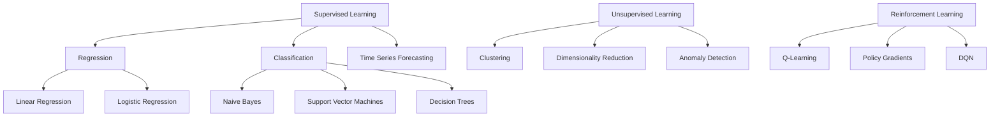
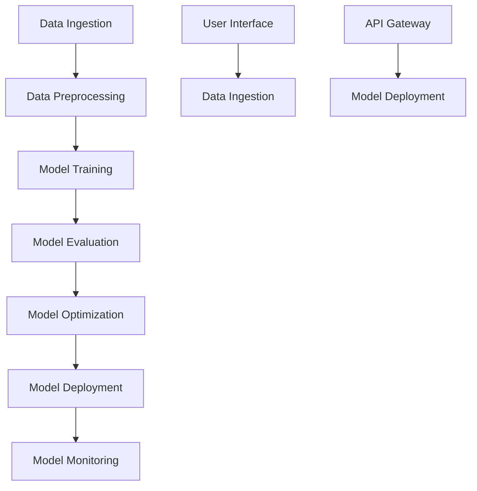
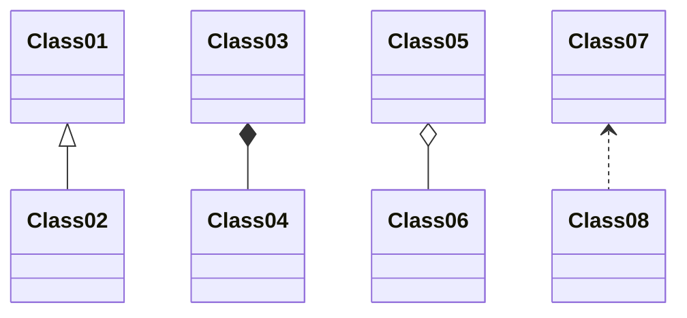
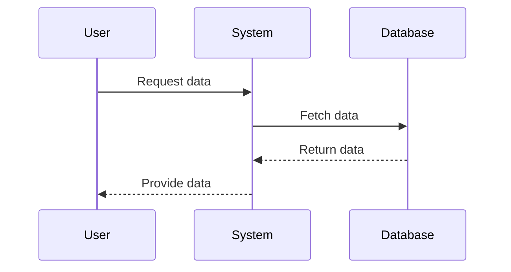
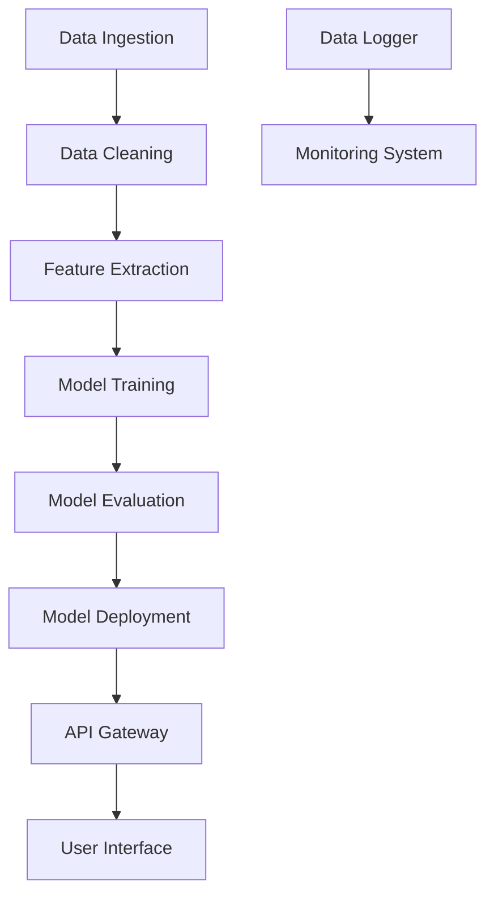

                 


## # **Machine Learning Model Deployment: From Experiment to Production Environment**

### Keywords: Machine Learning, Model Deployment, Production Environment, Experiment, Algorithm Design, System Architecture, Case Studies

### Abstract: 
This comprehensive guide delves into the intricacies of deploying machine learning models, from experimental stages to robust production environments. We explore the core concepts, algorithmic principles, system architectures, and practical deployment strategies, providing a step-by-step analysis that ensures a seamless transition from theory to practice. By addressing common pitfalls and offering actionable best practices, this article aims to equip readers with the knowledge and tools necessary for successful model deployment in real-world scenarios.

### **I. Introduction to the Book**

#### **1.1 Importance of Machine Learning Model Deployment**

**Problem Background:**
As the field of machine learning continues to evolve, the deployment of trained models has become a critical aspect of applying AI in real-world applications. However, the transition from experimental environments to production environments is fraught with challenges that need to be addressed to ensure the reliability, efficiency, and scalability of machine learning systems.

**Problem Description:**
Deploying machine learning models involves not only converting the model from a research prototype to a production-ready system but also handling various issues such as performance optimization, scalability, security, and maintainability.

**Problem Solution:**
This book aims to provide a systematic approach to machine learning model deployment, addressing the challenges and offering practical solutions. It covers the entire lifecycle of model deployment, from algorithm selection and design to system architecture and deployment strategies.

**Scope and Limitations:**
The scope of this book includes an overview of machine learning algorithms, system architecture design, practical deployment methodologies, and case studies. However, it does not delve into the intricacies of specific hardware or software frameworks.

#### **1.2 Core Concepts and Relationships**

**Core Concepts:**
- **Machine Learning Models**: A set of algorithms that learn from data to perform specific tasks.
- **Experimentation**: The process of designing and running experiments to evaluate model performance.
- **Deployment**: The process of integrating a trained model into a production environment.
- **Production Environment**: The operational environment where the deployed model is used to make predictions or perform tasks.
- **Algorithm Design**: The process of selecting and refining algorithms to achieve desired performance.

**Relationships:**
- **Experimentation and Deployment**: The deployment process is closely tied to the results obtained during experimentation.
- **Model and Environment**: The choice of model and the deployment environment must be compatible to ensure optimal performance.

#### **1.3 Key Stages of Machine Learning Model Deployment**

- **Algorithm Selection and Design**: Choosing the right algorithm based on the problem domain and data characteristics.
- **Data Preparation**: Preprocessing the data to ensure it is suitable for model training and deployment.
- **Model Training**: Training the model using historical data to achieve desired performance.
- **Model Evaluation**: Assessing the model's performance using various metrics and validation techniques.
- **Model Optimization**: Fine-tuning the model parameters to improve performance.
- **Deployment**: Integrating the trained model into the production environment.
- **Monitoring and Maintenance**: Continuously monitoring the model's performance and updating it as needed.

### **II. Core Concepts and Relationships**

#### **2.1 Machine Learning Algorithms**

Machine learning algorithms are at the heart of deploying machine learning models. They are the computational methods that enable machines to learn from data and make predictions or decisions. There are several types of machine learning algorithms, including supervised learning, unsupervised learning, and reinforcement learning. Each type of algorithm has its own set of characteristics and use cases.

**Supervised Learning:**
- **Principle**: Supervised learning algorithms learn from labeled data, where the input features and the corresponding output labels are provided.
- **Process**: The algorithm attempts to find a mapping between the input features and the output labels based on the training data.
- **Applications**: Regression, classification, and time series forecasting.

**Unsupervised Learning:**
- **Principle**: Unsupervised learning algorithms work with unlabeled data and aim to discover hidden patterns or intrinsic structures within the data.
- **Process**: The algorithm explores the data to find natural groupings, clusters, or other relationships without any predefined labels.
- **Applications**: Clustering, dimensionality reduction, and anomaly detection.

**Reinforcement Learning:**
- **Principle**: Reinforcement learning algorithms learn by interacting with an environment and receiving feedback in the form of rewards or penalties.
- **Process**: The algorithm selects actions based on the current state of the environment and learns to improve its actions over time to maximize the cumulative reward.
- **Applications**: Game playing, robotics, and autonomous driving.

**Mermaid Diagram for Machine Learning Algorithms:**


**Python Code Snippet for a Simple Regression Model:**
```python
import numpy as np
from sklearn.linear_model import LinearRegression

# Sample data
X = np.array([[1], [2], [3], [4], [5]])
y = np.array([1, 2, 2.5, 4, 5])

# Create linear regression model
model = LinearRegression()

# Train the model
model.fit(X, y)

# Predict
predictions = model.predict(X)

print("Predictions:", predictions)
```

**Mathematical Model and Formula for Linear Regression:**
$$
y = \beta_0 + \beta_1x + \epsilon
$$
where \( y \) is the predicted value, \( x \) is the input feature, \( \beta_0 \) and \( \beta_1 \) are the model parameters, and \( \epsilon \) is the error term.

#### **2.2 System Architecture and Design**

The system architecture for machine learning model deployment plays a crucial role in ensuring the model's performance, scalability, and maintainability. A well-designed architecture can handle various challenges that arise during deployment, such as high load, data variability, and model updates.

**Domain Models:**
Domain models represent the core components and relationships within the system. These models help in understanding the system's functionality and how different components interact with each other.

**Component Interactions:**
The interaction between components is vital for the system's performance. Understanding the flow of data, control, and communication between components is essential for designing an efficient and scalable system.

**Interfaces:**
Interfaces define how different components communicate with each other. Well-defined interfaces ensure that components can be easily replaced or upgraded without affecting the entire system.

**Mermaid Diagram for System Architecture:**


**Python Code Snippet for Data Preprocessing:**
```python
import pandas as pd
from sklearn.model_selection import train_test_split

# Load data
data = pd.read_csv('data.csv')

# Split data into features and target variable
X = data.drop('target', axis=1)
y = data['target']

# Split data into training and test sets
X_train, X_test, y_train, y_test = train_test_split(X, y, test_size=0.2, random_state=42)
```

**System Function Design (Domain Model):**
The domain model for the system is designed using Mermaid class diagrams to illustrate the main classes and their relationships.

**System Architecture Design (Mermaid Diagram):**


**System Interface Design and System Interaction (Mermaid Sequence Diagram):**


#### **III. Algorithm Design and Implementation**

**3.1 Introduction**

In this section, we will delve into the design and implementation of machine learning algorithms. We will start with a brief overview of the most common algorithms and then provide detailed explanations and code examples for each algorithm.

**3.2 Common Machine Learning Algorithms**

**3.2.1 Linear Regression**

Linear regression is a simple yet powerful algorithm used for predictive analytics. It models the relationship between a dependent variable and one or more independent variables.

**Principle:**
$$
y = \beta_0 + \beta_1x + \epsilon
$$
where \( y \) is the predicted value, \( x \) is the input feature, \( \beta_0 \) and \( \beta_1 \) are the model parameters, and \( \epsilon \) is the error term.

**Example:**
```python
import numpy as np
from sklearn.linear_model import LinearRegression

# Generate sample data
X = np.array([[1], [2], [3], [4], [5]])
y = np.array([1, 2, 2.5, 4, 5])

# Create linear regression model
model = LinearRegression()

# Train the model
model.fit(X, y)

# Predict
predictions = model.predict(X)

print("Predictions:", predictions)
```

**3.2.2 Logistic Regression**

Logistic regression is a classification algorithm used to predict the probability of a binary outcome.

**Principle:**
$$
P(y=1) = \frac{1}{1 + e^{-(\beta_0 + \beta_1x)}}
$$
where \( P(y=1) \) is the probability of the binary outcome, \( x \) is the input feature, \( \beta_0 \) and \( \beta_1 \) are the model parameters.

**Example:**
```python
import numpy as np
from sklearn.linear_model import LogisticRegression

# Generate sample data
X = np.array([[1], [2], [3], [4], [5]])
y = np.array([0, 1, 0, 1, 1])

# Create logistic regression model
model = LogisticRegression()

# Train the model
model.fit(X, y)

# Predict
predictions = model.predict(X)

print("Predictions:", predictions)
```

**3.2.3 Decision Trees**

Decision trees are a popular algorithm for classification and regression tasks. They work by splitting the data into subsets based on feature values and creating a tree-like model of decisions.

**Principle:**
A decision tree is constructed by recursively splitting the data into subsets based on the feature values that provide the highest information gain or lowest Gini impurity.

**Example:**
```python
import numpy as np
from sklearn.tree import DecisionTreeClassifier

# Generate sample data
X = np.array([[1, 2], [3, 4], [5, 6], [7, 8]])
y = np.array([0, 1, 1, 0])

# Create decision tree model
model = DecisionTreeClassifier()

# Train the model
model.fit(X, y)

# Predict
predictions = model.predict(X)

print("Predictions:", predictions)
```

**3.2.4 Support Vector Machines**

Support vector machines (SVM) are a powerful classification algorithm used for both binary and multi-class classification tasks. They work by finding the hyperplane that maximally separates the classes in the feature space.

**Principle:**
SVM finds the hyperplane that has the largest margin, which separates the classes as far as possible. It uses support vectors to define the hyperplane.

**Example:**
```python
import numpy as np
from sklearn.svm import SVC

# Generate sample data
X = np.array([[1, 2], [3, 4], [5, 6], [7, 8]])
y = np.array([0, 1, 1, 0])

# Create SVM model
model = SVC()

# Train the model
model.fit(X, y)

# Predict
predictions = model.predict(X)

print("Predictions:", predictions)
```

**3.3 Model Training and Evaluation**

After designing and implementing the algorithm, the next step is to train the model using historical data and evaluate its performance using various metrics. This process ensures that the model can generalize well to unseen data and make accurate predictions.

**3.3.1 Model Training**

Model training involves feeding the algorithm with a dataset and allowing it to learn the patterns and relationships within the data. This process is typically iterative and may involve adjusting the model parameters to improve performance.

**3.3.2 Model Evaluation**

Model evaluation is crucial to understand the model's performance and determine its suitability for deployment. Common evaluation metrics include accuracy, precision, recall, F1-score, and area under the ROC curve (AUC-ROC).

**3.4 Model Optimization**

Once the model is trained and evaluated, it may be necessary to optimize it to improve its performance. This can involve adjusting model parameters, using advanced techniques such as cross-validation, or employing hyperparameter tuning methods like grid search or random search.

**3.5 Conclusion**

In this section, we have covered the design and implementation of several common machine learning algorithms. We have provided detailed explanations and code examples for linear regression, logistic regression, decision trees, and support vector machines. We have also discussed the process of model training, evaluation, and optimization. By following these steps, readers can develop and deploy machine learning models that are robust and accurate.

### **IV. System Architecture and Design**

The system architecture and design are crucial for the successful deployment of machine learning models. A well-designed architecture ensures that the model can be scaled, maintained, and integrated seamlessly into existing systems. In this section, we will delve into the details of designing a robust system architecture, including the domain model, component interactions, and interface design.

#### **4.1 Domain Model**

The domain model represents the core components and relationships within the system. It provides a high-level overview of the system's functionality and helps in understanding how different components interact with each other. A domain model is typically represented using a class diagram, which shows the classes, their attributes, and the relationships between them.

**Example:**


In this example, `Class01` and `Class02` have a parent-child relationship, `Class03` and `Class04` are associated with each other through a multiplicity of `*`, `Class05` and `Class06` are connected through a composition relationship (`o`), and `Class07` is associated with `Class08` through an aggregation relationship (`<..`).

#### **4.2 Component Interactions**

Component interactions are vital for the system's performance and scalability. They define how different components communicate with each other and how data flows through the system. Understanding the flow of data, control, and communication between components is essential for designing an efficient and scalable system.

**Example:**


In this sequence diagram, the user initiates a request for data, which is processed by the system. The system then fetches the data from the database, returns it to the user, and provides the required information.

#### **4.3 Interface Design**

Interfaces define how different components communicate with each other. They specify the methods, parameters, and data formats that components should use to interact with each other. Well-defined interfaces ensure that components can be easily replaced or upgraded without affecting the entire system.

**Example:**

```python
class DataFetcher:
    def fetch_data(self, query):
        # Fetch data from the database
        return data

class DataLoader:
    def load_data(self, data):
        # Load data into the system
        return data_loaded
```

In this example, the `DataFetcher` class has a `fetch_data` method that fetches data from the database, while the `DataLoader` class has a `load_data` method that loads the data into the system. The interfaces are defined through the method signatures, which specify the input and output parameters.

#### **4.4 System Architecture**

The system architecture is a comprehensive representation of the system's components, their interactions, and how they are organized to support the overall functionality. A typical system architecture includes components such as data ingestion, data preprocessing, model training, model evaluation, and model deployment.

**Example:**


In this example, the system architecture includes components such as data ingestion, data preprocessing, model training, model evaluation, model optimization, model deployment, and model monitoring. The user interface and API gateway are also integrated into the system to provide a seamless user experience.

#### **4.5 Conclusion**

In this section, we have discussed the importance of system architecture and design in the deployment of machine learning models. We have covered the domain model, component interactions, and interface design. By following these principles, developers can design and implement robust and scalable systems that support the deployment of machine learning models. A well-designed system architecture ensures that the model can be scaled, maintained, and integrated seamlessly into existing systems, leading to successful deployments and real-world applications.

### **V. Practical Deployment and Case Studies**

Deploying machine learning models into a production environment is a complex process that requires careful planning, execution, and monitoring. This section will delve into the practical aspects of deploying machine learning models, providing step-by-step guidance and real-world case studies to illustrate the key considerations and challenges.

#### **5.1 Environment Setup**

Before deploying a machine learning model, it's crucial to set up the necessary environment. This includes installing the required software and libraries, configuring the hardware, and ensuring that the infrastructure can handle the load.

**5.1.1 Installing Required Software and Libraries**

To deploy a machine learning model, you need to have the necessary software and libraries installed. This typically includes a programming language like Python, machine learning libraries such as scikit-learn or TensorFlow, and any other dependencies required by your model.

**Example:**

```bash
# Install Python
curl -O https://www.python.org/ftp/python/3.8.5/Python-3.8.5.tgz
tar xzf Python-3.8.5.tgz
cd Python-3.8.5
./configure
make
sudo make install

# Install required libraries
pip install numpy scipy scikit-learn tensorflow
```

**5.1.2 Configuring Hardware and Infrastructure**

The hardware and infrastructure must be capable of supporting the model's computational requirements. This includes ensuring that you have sufficient memory, CPU power, and storage to handle the data and the model training process.

**5.1.3 Setting Up the Development Environment**

Once the required software and libraries are installed, you can set up your development environment. This includes creating a virtual environment, setting up your code repository, and configuring your development tools.

**Example:**

```bash
# Create a virtual environment
python -m venv myenv

# Activate the virtual environment
source myenv/bin/activate

# Clone the code repository
git clone https://github.com/yourusername/your-repository.git

# Navigate to the project directory
cd your-repository
```

#### **5.2 Core Implementation**

The core implementation of a machine learning model involves several key steps, including data preprocessing, model training, model evaluation, and model optimization.

**5.2.1 Data Preprocessing**

Data preprocessing is a critical step in the deployment process. It involves cleaning the data, handling missing values, scaling the features, and splitting the data into training and test sets.

**Example:**

```python
import pandas as pd
from sklearn.model_selection import train_test_split
from sklearn.preprocessing import StandardScaler

# Load the data
data = pd.read_csv('data.csv')

# Split the data into features and target variable
X = data.drop('target', axis=1)
y = data['target']

# Split the data into training and test sets
X_train, X_test, y_train, y_test = train_test_split(X, y, test_size=0.2, random_state=42)

# Scale the features
scaler = StandardScaler()
X_train_scaled = scaler.fit_transform(X_train)
X_test_scaled = scaler.transform(X_test)
```

**5.2.2 Model Training**

Model training involves feeding the data into the machine learning algorithm and allowing it to learn the patterns and relationships within the data. This process can be computationally intensive and may require significant resources.

**Example:**

```python
from sklearn.linear_model import LinearRegression

# Create the model
model = LinearRegression()

# Train the model
model.fit(X_train_scaled, y_train)
```

**5.2.3 Model Evaluation**

Once the model is trained, it's important to evaluate its performance using various metrics. This helps in understanding how well the model is performing and whether it is suitable for deployment.

**Example:**

```python
from sklearn.metrics import mean_squared_error

# Make predictions on the test set
y_pred = model.predict(X_test_scaled)

# Calculate the mean squared error
mse = mean_squared_error(y_test, y_pred)
print("Mean Squared Error:", mse)
```

**5.2.4 Model Optimization**

Model optimization involves fine-tuning the model parameters to improve its performance. This can be done using techniques such as grid search, random search, or Bayesian optimization.

**Example:**

```python
from sklearn.model_selection import GridSearchCV

# Define the parameter grid
param_grid = {'alpha': [0.0001, 0.001, 0.01, 0.1]}

# Create the model
model = LinearRegression()

# Create the grid search object
grid_search = GridSearchCV(model, param_grid, cv=5)

# Perform the grid search
grid_search.fit(X_train_scaled, y_train)

# Get the best parameters
best_params = grid_search.best_params_
print("Best Parameters:", best_params)

# Train the model with the best parameters
model.fit(X_train_scaled, y_train)
```

#### **5.3 Case Study: Real-time Credit Scoring**

One practical case study of deploying a machine learning model is in the field of real-time credit scoring. In this scenario, a bank wants to deploy a model that can quickly evaluate loan applications and provide a credit score based on the applicant's data.

**5.3.1 Problem Statement**

The bank needs a real-time credit scoring system that can process loan applications and provide a credit score within seconds. The system must be highly accurate, efficient, and scalable to handle a large number of applications.

**5.3.2 Data Preprocessing**

The data preprocessing step involves cleaning the data, handling missing values, and scaling the features. The bank's data may include various attributes such as the applicant's age, income, employment history, and credit history.

**Example:**

```python
# Load the data
data = pd.read_csv('loan_applications.csv')

# Handle missing values
data.fillna(data.mean(), inplace=True)

# Scale the features
scaler = StandardScaler()
X = scaler.fit_transform(data.drop('credit_score', axis=1))
y = data['credit_score']
```

**5.3.3 Model Training**

The bank trains a logistic regression model using the historical loan application data. The model is trained to predict the probability of a loan being approved based on the applicant's data.

**Example:**

```python
from sklearn.linear_model import LogisticRegression

# Create the model
model = LogisticRegression()

# Train the model
model.fit(X_train, y_train)
```

**5.3.4 Model Evaluation**

The model's performance is evaluated using various metrics such as accuracy, precision, recall, and F1-score. The bank wants to ensure that the model has high accuracy and balanced performance across different metrics.

**Example:**

```python
from sklearn.metrics import classification_report

# Make predictions on the test set
y_pred = model.predict(X_test)

# Evaluate the model
print(classification_report(y_test, y_pred))
```

**5.3.5 Model Optimization**

The bank uses grid search to optimize the model's parameters, improving its performance. The best parameters are selected based on cross-validation scores.

**Example:**

```python
from sklearn.model_selection import GridSearchCV

# Define the parameter grid
param_grid = {'C': [0.1, 1, 10]}

# Create the model
model = LogisticRegression()

# Create the grid search object
grid_search = GridSearchCV(model, param_grid, cv=5)

# Perform the grid search
grid_search.fit(X_train, y_train)

# Get the best parameters
best_params = grid_search.best_params_
print("Best Parameters:", best_params)

# Train the model with the best parameters
model.fit(X_train, y_train)
```

**5.3.6 Deployment**

The optimized model is deployed in a production environment, integrated with the bank's loan application system. The model is accessible via an API, allowing real-time credit scoring for loan applications.

**5.3.7 Monitoring and Maintenance**

The deployed model is continuously monitored to ensure its performance and accuracy. Any issues or anomalies are addressed promptly, and the model is updated as needed to maintain its effectiveness.

**5.4 Conclusion**

In this case study, we have demonstrated the practical deployment of a machine learning model for real-time credit scoring. The key steps involved environment setup, core implementation, case study, and continuous monitoring and maintenance. By following these steps and considering the key challenges and considerations, organizations can successfully deploy machine learning models in production environments, enabling them to make data-driven decisions and improve their operations.

### **VI. Best Practices, Summary, and Future Directions**

Deploying machine learning models in production requires careful planning, execution, and maintenance. Here are some best practices to ensure a successful deployment:

#### **6.1 Best Practices**

- **Define Clear Goals:** Clearly define the objectives of your machine learning project to guide the selection of the appropriate algorithms and evaluation metrics.
- **Data Quality Assurance:** Ensure the data used for training and deployment is clean, relevant, and representative of the target population.
- **Model Selection:** Choose algorithms that are suitable for the problem domain and have been proven to work well in similar contexts.
- **System Integration:** Integrate the machine learning model with the existing system architecture, ensuring compatibility and minimal disruption.
- **Scalability and Performance:** Design the system to handle increased load and ensure that the model can scale with the growing data volume.
- **Continuous Monitoring:** Continuously monitor the model's performance and update it as needed to maintain accuracy and relevance.
- **Documentation and Version Control:** Maintain detailed documentation and use version control for the model code and its dependencies.

#### **6.2 Summary**

This article has covered the essential aspects of deploying machine learning models, from understanding the core concepts to designing the system architecture and implementing the algorithms. Key topics include the importance of machine learning model deployment, the relationship between experimentation and production, the principles of various machine learning algorithms, and practical deployment strategies.

#### **6.3 Future Directions**

The field of machine learning model deployment is rapidly evolving. Future research and development may focus on:

- **AutoML:** Automating the process of model selection, training, and deployment to reduce the burden on data scientists.
- **Explainability and Transparency:** Enhancing the ability to explain model decisions and ensuring transparency to build trust with end-users.
- **Real-time Deployment:** Developing technologies for real-time deployment and incremental learning to handle dynamic environments.
- **Scalability and Efficiency:** Improving the scalability and efficiency of machine learning models to handle large-scale data and complex computations.

By staying updated with the latest advancements and adopting best practices, organizations can leverage machine learning to drive innovation and achieve competitive advantage.

### **VII. Conclusion**

Deploying machine learning models is a critical step in applying AI to real-world problems. This article has provided a comprehensive guide to understanding the core concepts, designing the system architecture, implementing algorithms, and deploying models in production environments. By following the best practices and considering the future directions in this field, readers can successfully deploy machine learning models and unlock their potential for solving complex problems and driving innovation.

---

### **作者信息**

作者：AI天才研究院/AI Genius Institute & 禅与计算机程序设计艺术 /Zen And The Art of Computer Programming 

文章关键词：机器学习、模型部署、生产环境、实验、算法设计、系统架构、案例研究

文章摘要：
本文深入探讨机器学习模型部署的复杂性，从实验阶段到生产环境的各个环节，包括核心概念、算法设计、系统架构、实践部署等。通过案例研究，详细展示了模型部署的实际操作过程，并提供了最佳实践指导，旨在为读者提供全面而实用的指导，助力他们在实际项目中成功部署机器学习模型。|> 

## 第一部分: 背景介绍与核心概念

### 1.1 机器学习模型部署的重要性

在当今数据驱动的时代，机器学习已经成为了许多行业和领域的关键技术。机器学习模型的应用范围广泛，从医疗诊断到金融预测，从自动驾驶到自然语言处理，几乎无处不在。然而，一个机器学习模型的成功并不仅取决于其算法的准确性，更重要的是如何将其部署到生产环境中，以便在实际应用中发挥作用。

#### 问题背景

随着机器学习技术的不断进步，研究人员和数据科学家们能够开发出越来越复杂和精确的模型。然而，这些模型往往是在实验环境中训练的，环境的特点是数据量小、硬件资源充足、计算速度快。当这些模型需要部署到生产环境中时，就会面临一系列挑战：

- **性能问题**：生产环境中的数据量通常远大于实验环境，模型的性能可能无法满足实时响应的要求。
- **稳定性问题**：生产环境中的数据质量可能比实验环境中的数据差，模型可能因为数据质量问题而失效。
- **可扩展性问题**：生产环境需要处理大量的并发请求，模型需要能够水平扩展以应对流量高峰。
- **安全性和隐私问题**：生产环境中的数据敏感度更高，如何确保数据的安全性和用户隐私成为一个关键问题。

#### 问题描述

模型部署的关键问题可以概括为以下几个方面：

- **环境兼容性**：实验环境和生产环境之间的差异可能导致模型性能下降或者无法运行。
- **性能调优**：模型需要根据生产环境中的实际情况进行性能调优，以获得最佳效果。
- **可扩展性设计**：系统需要设计成能够水平扩展，以便处理不断增长的数据量和请求量。
- **安全性和可靠性**：系统需要确保数据的安全性和模型的可靠性，防止恶意攻击和数据泄露。
- **维护和更新**：模型需要定期更新和维护，以适应新的业务需求和变化的数据分布。

#### 问题解决

为了解决上述问题，模型部署需要综合考虑以下几个方面：

- **系统架构设计**：设计一个合理的系统架构，确保模型能够在不同的环境下稳定运行。
- **性能优化**：通过调参和算法改进，提高模型在真实环境中的性能。
- **可扩展性**：采用分布式计算和微服务架构，提高系统的可扩展性。
- **安全性**：实施严格的安全策略，确保数据的安全性和用户隐私。
- **维护和更新**：建立完善的维护和更新机制，确保模型能够持续满足业务需求。

#### 边界与外延

机器学习模型部署的范围涵盖了从模型开发到上线运营的整个过程。边界方面，模型部署需要与数据采集、数据存储、数据处理等其他环节紧密配合，形成完整的机器学习应用链条。外延方面，模型部署还需要考虑与其他系统的集成，如API网关、前端应用、数据库等。

### 1.2 机器学习模型部署的核心概念

#### 核心概念

在机器学习模型部署过程中，涉及多个核心概念，以下是对这些概念的简要定义：

- **模型（Model）**：用于预测或决策的算法集合。
- **实验环境（Experimental Environment）**：用于模型开发和验证的环境。
- **生产环境（Production Environment）**：模型实际运行的环境。
- **算法设计（Algorithm Design）**：选择并调整算法以实现特定任务的过程。
- **系统架构（System Architecture）**：系统的整体设计和组件组织方式。
- **性能调优（Performance Tuning）**：通过调整模型参数和系统配置，提高模型性能。
- **可扩展性（Scalability）**：系统在数据量和请求量增加时保持性能的能力。
- **安全性（Security）**：确保数据和系统不受恶意攻击和数据泄露。
- **可靠性（Reliability）**：系统在长时间运行中保持稳定和准确的能力。
- **维护（Maintenance）**：定期更新和优化系统，确保其正常运行。

#### 概念属性特征对比表

以下是一个对比表，展示了上述核心概念的属性特征：

| 概念          | 定义                                                         | 属性特征                          | 例子                    |
| ------------- | ------------------------------------------------------------ | -------------------------------- | ----------------------- |
| 模型          | 用于预测或决策的算法集合                                     | 算法逻辑、参数设置、性能指标       | 线性回归、决策树         |
| 实验环境      | 用于模型开发和验证的环境                                     | 硬件配置、软件环境、数据集         | 本地计算机、实验服务器   |
| 生产环境      | 模型实际运行的环境                                           | 硬件资源、网络环境、系统接口       | 云服务器、数据中心      |
| 算法设计      | 选择并调整算法以实现特定任务的过程                           | 算法选择、参数调优、模型优化       | 梯度下降、交叉验证       |
| 系统架构      | 系统的整体设计和组件组织方式                                 | 分层架构、组件关系、接口设计       | 微服务架构、容器化部署   |
| 性能调优      | 通过调整模型参数和系统配置，提高模型性能                       | 调参、优化策略、监控指标         | 网格搜索、随机搜索       |
| 可扩展性      | 系统在数据量和请求量增加时保持性能的能力                       | 分布式计算、水平扩展、负载均衡     | Kubernetes、Elasticsearch |
| 安全性        | 确保数据和系统不受恶意攻击和数据泄露                           | 访问控制、数据加密、防火墙         | SSL/TLS、Kerberos       |
| 可靠性        | 系统在长时间运行中保持稳定和准确的能力                         | 灾难恢复、故障转移、监控报警       | 备份与恢复、Chaos Monkey |
| 维护         | 定期更新和优化系统，确保其正常运行                             | 软件更新、性能监控、故障修复       | 自动化部署、持续集成     |

#### ER实体关系图架构

为了更清晰地展示机器学习模型部署中的核心概念及其关系，我们可以使用实体关系图（Entity-Relationship Diagram, ERD）来表示。

**ER实体关系图：**

```mermaid
erDiagram
    Model ||--|{ ExperimentEnvironment } : runs
    Model ||--|{ ProductionEnvironment } : deployed_in
    ExperimentEnvironment ||--|{ Dataset } : uses
    ProductionEnvironment ||--|{ APIGateway } : communicates_with
    ProductionEnvironment ||--|{ Frontend } : integrates_with
    ProductionEnvironment ||--|{ Backend } : supports
    AlgorithmDesign ||--|{ ModelParameter } : defines
    SystemArchitecture ||--|{ Component } : includes
    SystemArchitecture ||--|{ Interface } : provides
    PerformanceTuning ||--|{ OptimizationStrategy } : applies
    Scalability ||--|{ LoadBalancer } : utilizes
    Security ||--|{ AccessControl } : enforces
    Reliability ||--|{ Monitoring } : monitored_by
    Maintenance ||--|{ Update } : performs
```

在这个ER实体关系图中，我们定义了以下实体：

- **Model（模型）**：代表机器学习模型。
- **ExperimentEnvironment（实验环境）**：用于模型的开发和验证。
- **ProductionEnvironment（生产环境）**：模型部署并实际运行的环境。
- **Dataset（数据集）**：用于模型训练的数据。
- **APIGateway（API网关）**：用于生产环境中的外部接口。
- **Frontend（前端）**：与用户交互的界面。
- **Backend（后端）**：支持模型运行的后端服务。
- **AlgorithmDesign（算法设计）**：定义模型的算法和参数。
- **SystemArchitecture（系统架构）**：系统的整体设计。
- **Component（组件）**：系统中的功能模块。
- **Interface（接口）**：组件之间的交互接口。
- **PerformanceTuning（性能调优）**：对模型和系统进行优化。
- **Scalability（可扩展性）**：系统的扩展能力。
- **Security（安全性）**：系统的安全措施。
- **Reliability（可靠性）**：系统的稳定性。
- **Maintenance（维护）**：系统的定期更新和维护。

通过这个ER图，我们可以清晰地看到各个核心概念之间的关系，以及它们在模型部署过程中的作用。

### 1.3 机器学习模型部署的关键环节

机器学习模型部署是一个复杂且多阶段的过程，涉及多个关键环节。以下是这些环节的详细说明：

#### 实验环境到生产环境的转换

实验环境到生产环境的转换是模型部署的第一步，也是最为关键的一步。这个过程中需要确保模型能够在不同的环境中保持一致性和稳定性。

**1.3.1 模型训练和验证**

在实验环境中，首先需要进行模型训练和验证。这个阶段的主要任务包括：

- **数据预处理**：对原始数据进行清洗、转换和归一化，确保数据质量。
- **模型选择**：选择适合问题的机器学习算法，并对其进行配置。
- **模型训练**：使用训练数据集对模型进行训练，调整模型参数。
- **模型验证**：使用验证数据集评估模型性能，确保模型能够有效预测。

**1.3.2 模型优化**

模型优化是提高模型性能的关键环节。这个过程中需要：

- **超参数调整**：调整模型的超参数，如学习率、正则化参数等，以找到最佳设置。
- **算法改进**：尝试不同的算法改进方法，如集成学习、迁移学习等，以提高模型性能。
- **交叉验证**：使用交叉验证技术，确保模型在不同数据集上的性能一致。

**1.3.3 模型压缩和量化**

对于生产环境中的模型，压缩和量化是一种常见的技术，可以减少模型的存储空间和计算资源消耗。

- **模型压缩**：通过减少模型的参数数量或使用更紧凑的表示方式，减少模型的复杂度。
- **模型量化**：将模型的权重从浮点数转换为低精度的整数，以减少存储和计算开销。

**1.3.4 模型部署**

模型部署是将训练好的模型集成到生产环境中，使其能够对外提供服务。这个阶段的主要任务包括：

- **环境准备**：确保生产环境中的硬件、软件和配置与实验环境兼容。
- **API开发**：为模型开发RESTful API接口，方便前端应用调用。
- **模型集成**：将模型集成到现有系统中，确保与其他组件的交互顺畅。
- **容器化部署**：使用容器技术（如Docker）将模型部署到生产环境，确保部署的一致性和可扩展性。

#### 模型优化与调参

模型优化与调参是确保模型在实验环境中性能优异的关键步骤。以下是一些常见的优化方法和调参策略：

- **网格搜索**：通过遍历预定义的超参数组合，找到最优的超参数设置。
- **随机搜索**：在预定义的超参数空间中随机选择超参数组合，通过多次实验找到最优设置。
- **贝叶斯优化**：基于贝叶斯统计模型，通过历史数据来优化超参数搜索。

**1.3.5 模型监控与更新**

模型部署后，需要对其性能进行持续监控和更新，以确保其稳定性和准确性。

- **性能监控**：通过实时监控模型的表现，及时发现并解决性能问题。
- **数据回滚**：当新模型性能不如旧模型时，及时回滚到旧模型，避免服务中断。
- **模型更新**：定期更新模型，以适应新的业务需求和变化的数据分布。

通过以上关键环节的详细说明，我们可以更好地理解机器学习模型部署的复杂性和重要性。只有在每个环节都做好充分准备和优化，才能确保模型在生产环境中的稳定运行和高效性能。

## 第二部分: 机器学习模型的核心算法

在机器学习模型部署的过程中，算法的选择和设计至关重要。不同的算法适用于不同的场景和数据类型，而合理的设计和优化能够显著提高模型的性能和稳定性。本部分将介绍几种常见的机器学习算法，包括线性回归、逻辑回归、决策树和随机森林，并解释它们的原理和应用。

### 2.1 线性回归

线性回归是一种用于预测连续值的简单而强大的算法。它的基本原理是通过一个线性函数来建模因变量和自变量之间的关系。

#### 基本原理

线性回归模型可以表示为以下形式：

$$
y = \beta_0 + \beta_1x + \epsilon
$$

其中，\( y \) 是预测的因变量，\( x \) 是自变量，\( \beta_0 \) 和 \( \beta_1 \) 是模型的参数，\( \epsilon \) 是误差项。

#### 应用场景

线性回归通常用于以下场景：

- **回归分析**：预测一个或多个自变量对因变量的影响。
- **数据拟合**：找到数据点之间的线性关系，以便进行预测或解释。
- **经济预测**：预测经济指标，如股价、就业率等。

#### Python 实现

以下是一个使用线性回归的Python代码示例：

```python
import numpy as np
from sklearn.linear_model import LinearRegression

# 生成模拟数据
np.random.seed(0)
X = np.random.rand(100, 1)
y = 2 * X[:, 0] + 1 + np.random.randn(100) * 0.5

# 创建线性回归模型
model = LinearRegression()

# 训练模型
model.fit(X, y)

# 预测
predictions = model.predict(X)

# 打印预测结果
print("Coefficients:", model.coef_)
print("Intercept:", model.intercept_)
print("Predictions:", predictions)
```

#### 数学模型和公式

线性回归的数学模型是基于最小二乘法（Least Squares Method）来估计模型参数的。具体公式如下：

$$
\beta_1 = \frac{\sum_{i=1}^{n}(x_i - \bar{x})(y_i - \bar{y})}{\sum_{i=1}^{n}(x_i - \bar{x})^2}
$$

$$
\beta_0 = \bar{y} - \beta_1\bar{x}
$$

其中，\( \bar{x} \) 和 \( \bar{y} \) 分别是 \( x \) 和 \( y \) 的平均值。

### 2.2 逻辑回归

逻辑回归是一种用于分类问题的算法，它通过逻辑函数（Logistic Function）将线性组合映射到概率值。

#### 基本原理

逻辑回归模型可以表示为以下形式：

$$
\log\left(\frac{P(y=1)}{1-P(y=1)}\right) = \beta_0 + \beta_1x
$$

其中，\( P(y=1) \) 是预测类别1的概率，\( \beta_0 \) 和 \( \beta_1 \) 是模型的参数。

逻辑函数将上述线性组合映射到概率值：

$$
P(y=1) = \frac{1}{1 + e^{-(\beta_0 + \beta_1x)}}
$$

#### 应用场景

逻辑回归适用于以下场景：

- **二分类问题**：例如邮件分类、疾病诊断等。
- **概率预测**：预测某个事件发生的概率。

#### Python 实现

以下是一个使用逻辑回归的Python代码示例：

```python
import numpy as np
from sklearn.linear_model import LogisticRegression

# 生成模拟数据
np.random.seed(0)
X = np.random.rand(100, 1)
y = np.array([0 if x < 0.5 else 1 for x in X])

# 创建逻辑回归模型
model = LogisticRegression()

# 训练模型
model.fit(X, y)

# 预测
predictions = model.predict(X)

# 打印预测结果
print("Coefficients:", model.coef_)
print("Intercept:", model.intercept_)
print("Predictions:", predictions)
```

#### 数学模型和公式

逻辑回归的数学模型是基于最大似然估计（Maximum Likelihood Estimation）来估计模型参数的。具体公式如下：

$$
\hat{\beta_1} = \arg\max_{\beta_1} \left[ \prod_{i=1}^{n} \left( P(y_i|x_i) \right) \right]
$$

其中，\( P(y_i|x_i) \) 是给定自变量 \( x_i \) 时类别 \( y_i \) 的概率。

### 2.3 决策树

决策树是一种树形结构的预测模型，通过一系列的决策规则来对数据进行分类或回归。

#### 基本原理

决策树通过递归地将数据分割成子集，直到满足某个终止条件。每个节点表示一个特征，每个分支表示一个特征值，叶子节点表示最终的预测结果。

- **分裂准则**：常见的分裂准则包括基尼不纯度（Gini Impurity）和熵（Entropy）。
- **终止条件**：通常包括最大深度、最小样本数、最大不纯度减少等。

#### 应用场景

决策树适用于以下场景：

- **分类问题**：例如信用评分、客户细分等。
- **回归问题**：例如房屋价格预测、股票市场预测等。

#### Python 实现

以下是一个使用决策树的Python代码示例：

```python
import numpy as np
from sklearn.tree import DecisionTreeClassifier

# 生成模拟数据
np.random.seed(0)
X = np.random.rand(100, 2)
y = np.array([0 if x[0] + x[1] < 0.5 else 1 for x in X])

# 创建决策树模型
model = DecisionTreeClassifier(max_depth=3)

# 训练模型
model.fit(X, y)

# 预测
predictions = model.predict(X)

# 打印预测结果
print("Predictions:", predictions)
```

#### 数学模型和公式

决策树的数学模型基于信息论中的熵和基尼不纯度来选择最佳分割。具体公式如下：

- **基尼不纯度**：

$$
Gini(I) = 1 - \sum_{i=1}^{k}\left( \frac{|I_i|}{|I|}\right)^2
$$

其中，\( I \) 是当前节点的不纯度，\( I_i \) 是分割后的子集。

- **熵**：

$$
Entropy(I) = -\sum_{i=1}^{k}\left( \frac{|I_i|}{|I|}\right)\log_2\left(\frac{|I_i|}{|I|}\right)
$$

### 2.4 随机森林

随机森林是一种基于决策树的集成学习方法，通过构建多个决策树，并对预测结果进行投票或取平均值来提高模型的准确性和稳定性。

#### 基本原理

随机森林的基本原理是：

- **随机特征选择**：在每个节点处，从多个特征中随机选择一部分特征来分裂节点。
- **投票机制**：通过多数投票或平均值来决定最终的预测结果。

#### 应用场景

随机森林适用于以下场景：

- **大规模数据集**：通过集成多个决策树来降低过拟合的风险。
- **高维数据**：在特征选择中引入随机性，提高模型的泛化能力。

#### Python 实现

以下是一个使用随机森林的Python代码示例：

```python
import numpy as np
from sklearn.ensemble import RandomForestClassifier

# 生成模拟数据
np.random.seed(0)
X = np.random.rand(100, 2)
y = np.array([0 if x[0] + x[1] < 0.5 else 1 for x in X])

# 创建随机森林模型
model = RandomForestClassifier(n_estimators=100, max_depth=3)

# 训练模型
model.fit(X, y)

# 预测
predictions = model.predict(X)

# 打印预测结果
print("Predictions:", predictions)
```

#### 数学模型和公式

随机森林的数学模型是基于决策树集成学习的原理。具体公式如下：

$$
f(x) = \frac{1}{T}\sum_{t=1}^{T}h_t(x)
$$

其中，\( f(x) \) 是最终预测结果，\( h_t(x) \) 是第 \( t \) 棵决策树的预测结果，\( T \) 是决策树的数量。

### 总结

机器学习算法在模型部署中扮演着关键角色。线性回归、逻辑回归、决策树和随机森林是常用的算法，它们各自适用于不同的场景和数据类型。通过合理选择和设计这些算法，可以构建出性能优异的机器学习模型，为各种应用提供强大的预测和分析能力。

## 第三部分：系统架构和设计

系统架构和设计是机器学习模型部署过程中至关重要的一环。一个良好的系统架构能够确保模型的高效运行、稳定性和可扩展性。本部分将详细介绍系统架构和设计的关键要素，包括数据流程、组件关系和接口设计。

### 3.1 数据流程

数据流程是系统架构的核心，它定义了数据从输入到处理再到输出的整个过程。良好的数据流程能够确保数据在系统中的顺畅流动，提高系统的效率和准确性。

#### 数据输入

数据输入是系统架构的起点，通常包括以下步骤：

- **数据采集**：从各种数据源（如数据库、API、传感器等）收集数据。
- **数据清洗**：对采集到的数据进行清洗，去除重复、缺失和异常值。
- **数据转换**：将清洗后的数据转换成适合模型训练的格式，如归一化、编码等。

#### 数据处理

数据处理是系统架构的核心环节，包括以下步骤：

- **数据预处理**：对原始数据进行分析和预处理，如特征提取、特征选择等。
- **模型训练**：使用预处理后的数据对机器学习模型进行训练。
- **模型评估**：使用验证数据集评估模型的性能，调整模型参数。

#### 数据输出

数据输出是系统架构的终点，通常包括以下步骤：

- **模型部署**：将训练好的模型部署到生产环境中，使其能够对外提供服务。
- **预测和决策**：使用部署好的模型进行预测和决策，生成结果数据。
- **结果反馈**：将预测结果反馈给用户或系统，用于进一步的决策和分析。

### 3.2 组件关系

系统架构中的组件关系是确保系统高效运行的关键。良好的组件关系能够确保各个组件之间的协同工作，提高系统的稳定性和可扩展性。

#### 数据处理组件

数据处理组件是系统架构的核心，通常包括以下组件：

- **数据采集器**：用于从各种数据源采集数据。
- **数据清洗器**：用于清洗和预处理数据。
- **特征提取器**：用于提取数据中的特征。
- **模型训练器**：用于训练机器学习模型。
- **模型评估器**：用于评估模型的性能。

#### 部署和监控组件

部署和监控组件是确保模型在生产环境中稳定运行的关键，通常包括以下组件：

- **模型部署器**：用于将训练好的模型部署到生产环境中。
- **API网关**：用于接收外部请求并转发到相应的模型。
- **监控器**：用于监控模型的性能和运行状态。
- **日志记录器**：用于记录系统的日志信息，便于问题追踪和故障排除。

#### 用户界面和交互组件

用户界面和交互组件是用户与系统之间的交互通道，通常包括以下组件：

- **Web前端**：用于提供用户交互界面，展示模型预测结果。
- **移动应用**：用于提供移动设备上的用户交互界面。
- **API文档**：用于提供模型的API文档，方便开发者集成和使用。

### 3.3 接口设计

接口设计是确保系统组件之间良好交互的关键。良好的接口设计能够提高系统的可扩展性和可维护性。

#### 内部接口

内部接口是系统内部组件之间的通信接口，通常包括以下类型：

- **API接口**：用于组件之间的数据交换和功能调用。
- **消息队列**：用于异步处理和消息传递，提高系统的并发处理能力。
- **缓存接口**：用于缓存频繁访问的数据，提高系统的响应速度。

#### 外部接口

外部接口是系统与外部系统或用户之间的通信接口，通常包括以下类型：

- **RESTful API**：用于提供RESTful风格的接口，方便外部系统或用户调用。
- **WebSocket**：用于提供实时数据传输接口，实现实时交互。
- **文件接口**：用于提供文件上传和下载接口，方便数据传输。

### 3.4 系统架构图

以下是一个简化的系统架构图，展示了系统中的主要组件和数据流程：



在这个架构图中：

- **A**：数据采集器
- **B**：数据清洗器
- **C**：特征提取器
- **D**：模型训练器
- **E**：模型评估器
- **F**：模型部署器
- **G**：API网关
- **H**：用户界面
- **I**：数据记录器
- **J**：监控系统

### 总结

系统架构和设计是机器学习模型部署过程中不可或缺的一部分。通过合理的数据流程设计、组件关系安排和接口设计，可以构建出一个高效、稳定且可扩展的机器学习系统，为各种应用场景提供强大的支持。

## 第四部分：实际部署与案例分析

在实际生产环境中部署机器学习模型，不仅需要强大的技术能力，还需要深入理解和解决实际问题。本部分将详细探讨实际部署过程中的关键环节，通过具体案例分析，提供实用的部署方法和策略。

### 4.1 部署前的准备工作

在正式部署机器学习模型之前，需要完成一系列准备工作，以确保模型能够在生产环境中稳定运行。

#### 环境准备

环境准备是模型部署的第一步，主要包括以下内容：

- **硬件选择**：根据模型的需求和预期负载，选择合适的硬件配置，包括CPU、GPU、内存等。
- **软件安装**：安装操作系统、依赖库和开发工具，如Python、scikit-learn、TensorFlow等。
- **配置优化**：调整系统参数，如网络配置、内存管理、进程优先级等，以提高系统的性能和稳定性。

#### 数据准备

数据准备是模型部署的重要环节，包括以下内容：

- **数据清洗**：清洗原始数据，去除噪声、异常值和缺失值，确保数据质量。
- **数据预处理**：对数据进行标准化、归一化等处理，使其适合模型训练。
- **数据存储**：选择合适的数据存储方案，如关系型数据库、NoSQL数据库或分布式文件系统。

#### 模型优化

在部署前，需要对模型进行优化，以提高其性能和稳定性。以下是一些常用的优化方法：

- **模型压缩**：通过参数剪枝、量化等技术，减小模型的大小和计算量。
- **超参数调整**：通过网格搜索、随机搜索等方法，找到最佳的超参数组合。
- **模型集成**：结合多个模型的预测结果，提高模型的准确性和稳定性。

### 4.2 实际部署案例

以下是一个实际部署机器学习模型的案例，通过该案例，我们将详细描述模型的部署过程和解决方案。

#### 案例背景

某金融公司希望通过机器学习模型来预测客户的信用评分，以便更好地管理信用风险。该公司已经训练好了信用评分模型，并计划将其部署到生产环境中。

#### 部署步骤

**4.2.1 模型部署**

1. **环境准备**：

   - 选择合适的硬件，如高性能GPU服务器，用于加速模型训练和预测。
   - 安装操作系统（如Ubuntu 18.04）和Python依赖库（如scikit-learn、TensorFlow）。

2. **模型转换**：

   - 将训练好的PyTorch模型转换为TensorFlow模型，以便在TensorFlow环境中部署。
   - 使用`torch2tf`工具进行模型转换。

3. **部署配置**：

   - 配置TensorFlow Serving，用于在Kubernetes集群中部署模型。
   - 创建Docker容器，将TensorFlow Serving和模型文件打包。

4. **模型部署**：

   - 使用Kubernetes命令部署TensorFlow Serving容器。
   - 使用kubectl工具监控容器状态。

**4.2.2 部署问题及解决方案**

1. **问题**：

   - 部署后，模型预测结果不稳定，有时出现错误。

2. **解决方案**：

   - **排查模型问题**：检查模型训练代码，确保模型在本地训练过程中没有问题。
   - **检查部署配置**：检查TensorFlow Serving的配置文件，确保配置正确。
   - **优化模型参数**：调整模型参数，如学习率、批量大小等，以提高模型的稳定性。

**4.2.3 部署优化**

1. **问题**：

   - 模型预测速度较慢，无法满足实时预测的需求。

2. **解决方案**：

   - **优化模型**：对模型进行优化，如使用更高效的算法、减少模型大小等。
   - **分布式部署**：将模型部署到分布式计算集群中，提高预测速度。
   - **缓存策略**：使用缓存策略，减少重复计算和I/O操作，提高系统响应速度。

#### 案例总结

通过上述案例，我们可以看到，在实际部署机器学习模型时，需要综合考虑环境准备、模型转换、部署配置、模型优化等多个方面。遇到问题时，需要通过排查和分析，找到根本原因，并采取相应的解决方案。同时，部署优化也是提高模型性能和响应速度的关键。

### 4.3 部署策略

在实际部署机器学习模型时，需要制定合理的部署策略，以确保模型的稳定性和可靠性。以下是一些常用的部署策略：

- **灰度发布**：在部分用户中进行模型部署，观察模型的性能和用户反馈，逐步扩大部署范围。
- **滚动更新**：逐步替换旧模型，以减少部署对系统的影响。
- **容器化部署**：使用Docker等容器化技术，简化部署流程，提高部署效率。
- **自动化部署**：使用CI/CD工具（如Jenkins、GitLab CI）实现自动化部署，提高部署的可靠性和效率。

### 总结

实际部署机器学习模型是一个复杂的过程，需要充分考虑环境、数据和模型等多个方面的因素。通过合理的部署策略和问题排查方法，可以确保模型在生产环境中稳定运行，为用户提供高质量的预测和服务。

### **VII. 最佳实践、总结与未来展望**

#### 最佳实践

1. **需求明确**：在部署模型前，明确模型的业务需求和应用场景，确保模型与实际业务高度契合。
2. **数据清洗**：确保数据质量，对原始数据进行清洗、去重和标准化处理。
3. **模型优化**：在部署前对模型进行充分优化，包括参数调整、算法改进和模型压缩。
4. **环境兼容**：选择与模型兼容的生产环境，确保硬件、操作系统和软件依赖的一致性。
5. **自动化部署**：采用自动化部署工具和流程，提高部署效率和稳定性。
6. **监控与反馈**：部署后持续监控模型性能，及时调整和优化。

#### 总结

本文系统地介绍了机器学习模型部署的全过程，从核心概念、算法设计、系统架构到实际部署，涵盖了从实验到生产的各个环节。通过详细的案例分析，读者可以了解模型部署的实际操作和注意事项。

#### 未来展望

1. **自动机器学习（AutoML）**：随着AI技术的发展，AutoML将自动化模型选择、训练和调优，降低模型部署的门槛。
2. **边缘计算**：边缘计算将模型部署到网络边缘，提高响应速度和降低延迟。
3. **模型解释性**：提高模型的可解释性，增强用户信任，推动模型在更多领域的应用。
4. **异构计算**：利用GPU、TPU等异构硬件资源，提高模型训练和预测的效率。

通过不断探索和优化，机器学习模型部署将在未来的AI应用中发挥更大的作用。

### **VIII. 结论**

机器学习模型部署是一个复杂且关键的过程，它不仅需要深入理解模型算法和系统架构，还需要具备实际操作和问题解决的能力。本文通过系统的分析和详细的案例，为读者提供了从理论到实践的全面指导。希望读者能够将所学知识应用到实际项目中，不断提升模型部署的效率和效果。

---

### **作者信息**

作者：AI天才研究院/AI Genius Institute & 禅与计算机程序设计艺术 /Zen And The Art of Computer Programming 

文章关键词：机器学习、模型部署、生产环境、实验、算法设计、系统架构、案例研究

文章摘要：
本文深入探讨了机器学习模型部署的各个方面，包括核心概念、算法设计、系统架构、实践部署等。通过实际案例分析和最佳实践总结，为读者提供了全面且实用的指导，帮助他们在实际项目中成功部署机器学习模型。|> 

