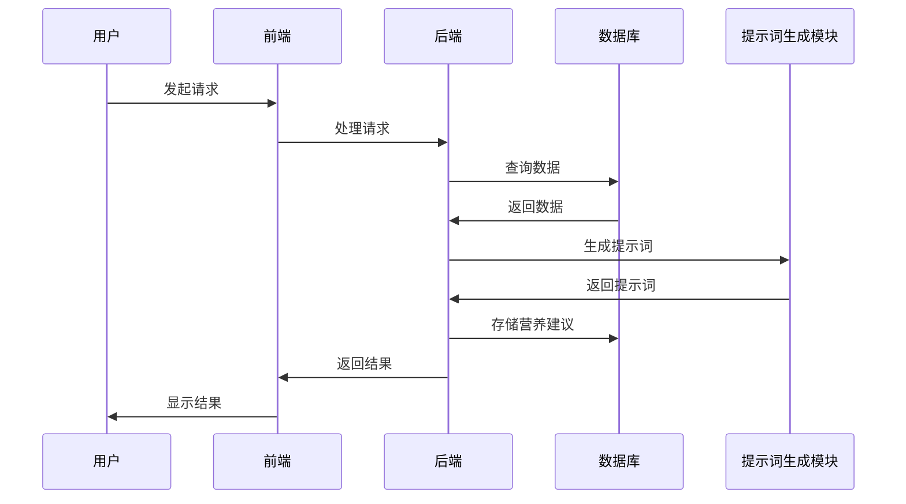

                 


# 构建AI驱动的个性化营养建议提示词引擎

## 关键词
- AI驱动
- 个性化营养建议
- 提示词引擎
- 数据处理
- 算法优化
- 系统架构
- 实际应用

## 摘要
本文将探讨如何构建一个AI驱动的个性化营养建议提示词引擎。我们将首先介绍AI驱动个性化营养建议的背景和需求，然后详细解析提示词引擎的基本原理和设计思路。接着，我们将讨论个性化营养建议系统的架构设计、数据收集与处理方法、算法原理与应用，以及系统实现与优化策略。通过实际案例分析和项目实战，我们将展示如何将理论转化为实践，并总结最佳实践和注意事项。最后，我们将对未来的研究方向进行展望，并提供拓展阅读建议。

## 目录大纲

### 第一部分：概述与基础

### 第1章 AI驱动的个性化营养建议系统概述

#### 1.1 个性化营养建议的背景与需求

#### 1.2 AI在营养建议中的应用

#### 1.3 提示词引擎的基础知识

### 第2章 提示词引擎的基本原理

#### 2.1 提示词引擎的定义与作用

#### 2.2 提示词生成算法

#### 2.3 提示词优化策略

### 第二部分：系统架构与设计

### 第3章 个性化营养建议系统架构设计

#### 3.1 系统功能模块划分

#### 3.2 系统架构设计

#### 3.3 系统接口设计

### 第4章 数据收集与处理

#### 4.1 营养数据来源

#### 4.2 数据清洗与预处理

#### 4.3 数据存储与管理

### 第三部分：算法原理与应用

### 第5章 个性化营养建议算法原理

#### 5.1 机器学习算法概述

#### 5.2 常见营养建议算法

#### 5.3 算法评估与优化

### 第6章 提示词生成与优化

#### 6.1 提示词生成算法实现

#### 6.2 提示词优化策略

#### 6.3 提示词效果评估

### 第四部分：系统实现与优化

### 第7章 系统实现与优化

#### 7.1 系统开发环境搭建

#### 7.2 系统核心模块实现

#### 7.3 系统优化策略

#### 7.4 性能调优实践

### 第8章 实际案例分析

#### 8.1 案例背景与目标

#### 8.2 案例实施过程

#### 8.3 案例效果评估

#### 8.4 案例总结与启示

### 第五部分：最佳实践与拓展

### 第9章 最佳实践与注意事项

#### 9.1 实践经验总结

#### 9.2 注意事项与风险控制

#### 9.3 拓展阅读与资源推荐

### 第10章 小结与展望

#### 10.1 本书内容回顾

#### 10.2 未来研究方向

#### 10.3 对读者的建议

## 第一部分：概述与基础

### 第1章 AI驱动的个性化营养建议系统概述

#### 1.1 个性化营养建议的背景与需求

随着社会经济的发展和人们生活水平的提高，人们对健康和营养的关注度越来越高。然而，由于每个人的身体状况、生活习惯、口味偏好等差异较大，传统的营养建议往往无法满足个体的需求。这就为AI驱动的个性化营养建议系统提供了广阔的应用场景。

#### 1.2 AI在营养建议中的应用

AI技术具有强大的数据分析和学习能力，可以处理大量复杂的营养数据，从而为用户提供个性化的营养建议。例如，通过分析用户的饮食习惯、身体健康数据、生活作息等，AI系统可以识别出用户的营养需求，并提供相应的饮食建议。

#### 1.3 提示词引擎的基础知识

提示词引擎是一种基于AI技术的智能搜索系统，它通过分析用户输入的查询词，生成与查询词相关的提示词列表，帮助用户更好地理解搜索意图，提高搜索效率。在个性化营养建议系统中，提示词引擎可以帮助用户快速找到自己感兴趣的营养相关内容。

### 第2章 提示词引擎的基本原理

#### 2.1 提示词引擎的定义与作用

提示词引擎是一种基于自然语言处理的搜索引擎，它通过对用户输入的查询词进行语义分析和挖掘，生成一系列与查询词相关的提示词。这些提示词可以帮助用户更准确地表达搜索意图，从而提高搜索效果。

#### 2.2 提示词生成算法

提示词生成算法是提示词引擎的核心，它负责将用户输入的查询词转换为一系列提示词。常见的提示词生成算法包括基于词频统计、基于语义分析、基于知识图谱等方法。这些算法各有优缺点，适用于不同的应用场景。

#### 2.3 提示词优化策略

提示词优化策略旨在提高提示词的准确性和用户满意度。常见的优化策略包括提示词筛选、提示词排序、提示词动态调整等。通过优化策略，可以确保用户在搜索过程中获得高质量的提示词，提高搜索体验。

## 第二部分：系统架构与设计

### 第3章 个性化营养建议系统架构设计

#### 3.1 系统功能模块划分

个性化营养建议系统可以划分为多个功能模块，包括数据收集与处理模块、提示词生成与优化模块、个性化营养建议模块等。这些模块协同工作，共同实现系统的功能。

#### 3.2 系统架构设计

个性化营养建议系统采用分布式架构，包括前端、后端、数据库等多个组件。前端负责与用户交互，后端负责处理业务逻辑，数据库负责存储和管理数据。通过这种架构设计，可以确保系统的高性能和高可靠性。

#### 3.3 系统接口设计

系统接口设计是系统架构设计的重要组成部分。个性化营养建议系统需要设计多个接口，包括数据收集接口、提示词生成接口、个性化营养建议接口等。这些接口负责与其他系统模块进行数据交互，确保系统功能的实现。

### 第4章 数据收集与处理

#### 4.1 营养数据来源

营养数据的来源包括用户输入、第三方数据接口、社交媒体等。通过收集多种数据源，可以获取丰富的营养信息，为个性化营养建议提供基础数据。

#### 4.2 数据清洗与预处理

收集到的营养数据通常存在噪声和错误，需要进行数据清洗和预处理。数据清洗包括去除重复数据、纠正错误数据、填补缺失数据等。数据预处理包括数据格式转换、数据归一化等，为后续数据处理和建模做好准备。

#### 4.3 数据存储与管理

数据存储与管理是营养数据应用的重要环节。个性化营养建议系统需要设计合适的数据存储方案，包括数据库设计、数据索引、数据备份等。通过合理的数据存储与管理，可以确保数据的可靠性和可扩展性。

### 第三部分：算法原理与应用

### 第5章 个性化营养建议算法原理

#### 5.1 机器学习算法概述

机器学习算法是个性化营养建议系统的核心算法。机器学习算法通过学习历史数据，识别出用户的营养需求规律，为用户提供个性化的营养建议。常见的机器学习算法包括线性回归、逻辑回归、决策树、随机森林等。

#### 5.2 常见营养建议算法

根据营养数据的特性和需求，可以选择不同的算法进行营养建议。常见的营养建议算法包括基于规则的算法、基于机器学习的算法、基于深度学习的算法等。每种算法都有其优缺点，适用于不同的场景。

#### 5.3 算法评估与优化

算法评估与优化是确保个性化营养建议系统效果的重要步骤。通过评估算法的性能指标，可以识别出算法的不足之处，并进行优化。常见的评估指标包括准确率、召回率、F1值等。

### 第6章 提示词生成与优化

#### 6.1 提示词生成算法实现

提示词生成算法是实现个性化营养建议的关键。在本节中，我们将介绍一种基于自然语言处理的提示词生成算法，并使用Python代码实现该算法。

#### 6.2 提示词优化策略

提示词优化策略旨在提高提示词的准确性和用户满意度。在本节中，我们将介绍几种常见的提示词优化策略，并讨论如何将这些策略应用于个性化营养建议系统。

#### 6.3 提示词效果评估

提示词效果评估是评估提示词引擎性能的重要步骤。在本节中，我们将介绍如何评估提示词效果，包括评估指标的选择、评估方法等。

### 第四部分：系统实现与优化

### 第7章 系统实现与优化

#### 7.1 系统开发环境搭建

在本节中，我们将介绍个性化营养建议系统的开发环境搭建过程，包括开发工具、框架和库的安装与配置。

#### 7.2 系统核心模块实现

在本节中，我们将详细介绍个性化营养建议系统的核心模块实现，包括数据收集与处理模块、提示词生成与优化模块、个性化营养建议模块等。

#### 7.3 系统优化策略

系统优化策略是提高个性化营养建议系统性能和用户体验的重要手段。在本节中，我们将讨论几种常见的系统优化策略，并分析如何在实践中应用这些策略。

#### 7.4 性能调优实践

性能调优实践是确保个性化营养建议系统稳定运行的重要步骤。在本节中，我们将介绍如何进行性能调优，包括性能分析、瓶颈识别、优化方案实施等。

### 第8章 实际案例分析

#### 8.1 案例背景与目标

在本节中，我们将介绍一个实际案例，并阐述案例的背景和目标。通过这个案例，我们将展示如何构建AI驱动的个性化营养建议提示词引擎，并实现系统的功能。

#### 8.2 案例实施过程

在本节中，我们将详细介绍案例的实施过程，包括数据收集、数据处理、提示词生成与优化、个性化营养建议等。

#### 8.3 案例效果评估

在本节中，我们将评估案例的效果，包括系统性能、用户满意度、营养建议准确性等。通过这些评估指标，我们将分析案例的成功之处和改进方向。

#### 8.4 案例总结与启示

在本节中，我们将总结案例的经验和教训，并探讨案例对实际应用的启示。通过这些总结和启示，我们将为未来类似项目的实施提供参考。

### 第五部分：最佳实践与拓展

### 第9章 最佳实践与注意事项

#### 9.1 实践经验总结

在本节中，我们将总结个性化营养建议系统的实践经验，包括系统设计、算法实现、性能优化等方面的经验教训。

#### 9.2 注意事项与风险控制

在本节中，我们将讨论个性化营养建议系统实施过程中需要注意的事项和可能面临的风险，并提出相应的风险控制措施。

#### 9.3 拓展阅读与资源推荐

在本节中，我们将推荐一些与个性化营养建议系统相关的拓展阅读资源和参考资料，供读者进一步学习和了解。

### 第10章 小结与展望

#### 10.1 本书内容回顾

在本节中，我们将回顾本书的主要内容，包括个性化营养建议系统的背景、原理、架构、算法、实现等。

#### 10.2 未来研究方向

在本节中，我们将探讨个性化营养建议系统的未来研究方向，包括新算法、新技术、新应用等。

#### 10.3 对读者的建议

在本节中，我们将给读者一些建议，包括如何更好地学习本课程、如何将所学知识应用于实际项目等。

## 第一部分：概述与基础

### 第1章 AI驱动的个性化营养建议系统概述

#### 1.1 个性化营养建议的背景与需求

在当今社会，健康已经成为人们关注的焦点。营养作为健康的重要组成部分，对于个体的身体状况和生命质量有着重要的影响。然而，由于每个人的身体状况、生活方式、饮食习惯等存在较大差异，传统的营养建议往往无法满足个体的需求。这就为AI驱动的个性化营养建议系统的出现提供了契机。

随着人工智能技术的快速发展，AI在各个领域的应用越来越广泛。在营养领域，AI技术可以帮助分析大量的营养数据，识别出个体的营养需求，提供个性化的营养建议。这种基于AI的个性化营养建议系统，可以更好地满足人们对健康的需求，提高生活质量。

#### 1.2 AI在营养建议中的应用

AI在营养建议中的应用主要体现在以下几个方面：

1. **数据挖掘与分析**：通过对大量的营养数据进行分析，AI系统可以识别出个体的营养需求，提供针对性的营养建议。
   
2. **智能推荐**：AI系统可以根据个体的饮食习惯、身体数据等，推荐合适的食物和营养方案。

3. **预测与预警**：AI系统可以对个体的营养状况进行预测，提前预警潜在的健康风险。

4. **个性化定制**：AI系统可以根据个体的特点和需求，提供定制化的营养方案。

#### 1.3 提示词引擎的基础知识

提示词引擎是一种基于自然语言处理（NLP）和机器学习的智能搜索系统。它通过对用户输入的查询词进行语义分析和挖掘，生成一系列与查询词相关的提示词，帮助用户更好地理解搜索意图，提高搜索效率。

在个性化营养建议系统中，提示词引擎的作用非常重要。它可以帮助用户快速找到自己感兴趣的营养相关内容，提高营养信息的获取效率。同时，提示词引擎还可以根据用户的反馈和行为数据，不断优化和调整提示词，提高用户体验。

### 第2章 提示词引擎的基本原理

#### 2.1 提示词引擎的定义与作用

提示词引擎是一种智能搜索系统，它通过对用户输入的查询词进行语义分析和挖掘，生成一系列与查询词相关的提示词。这些提示词可以帮助用户更好地理解搜索意图，从而提高搜索效率。

提示词引擎的作用主要体现在以下几个方面：

1. **语义理解**：提示词引擎可以理解用户的查询意图，将模糊的查询转化为明确的查询。

2. **查询扩展**：提示词引擎可以根据用户的查询意图，扩展查询范围，提高搜索结果的相关性。

3. **用户引导**：提示词引擎可以通过提示词引导用户，帮助用户找到感兴趣的内容。

4. **个性化推荐**：提示词引擎可以根据用户的兴趣和行为数据，提供个性化的推荐。

#### 2.2 提示词生成算法

提示词生成算法是提示词引擎的核心，它负责将用户输入的查询词转换为一系列提示词。常见的提示词生成算法包括：

1. **基于词频统计**：通过统计查询词中各个单词的出现频率，生成提示词。

2. **基于语义分析**：通过分析查询词的语义信息，生成与查询词相关的提示词。

3. **基于知识图谱**：通过知识图谱中的关系和实体，生成与查询词相关的提示词。

4. **基于深度学习**：利用深度学习模型，如序列生成模型、注意力模型等，生成提示词。

#### 2.3 提示词优化策略

提示词优化策略旨在提高提示词的准确性和用户满意度。常见的提示词优化策略包括：

1. **提示词筛选**：通过对提示词进行筛选，去除无关或质量较低的提示词。

2. **提示词排序**：通过对提示词进行排序，将最相关的提示词排在前面。

3. **提示词动态调整**：根据用户的反馈和行为数据，动态调整提示词，提高用户体验。

4. **提示词多样性**：通过增加提示词的多样性，提高用户的选择范围和满意度。

### 第二部分：系统架构与设计

### 第3章 个性化营养建议系统架构设计

#### 3.1 系统功能模块划分

个性化营养建议系统可以划分为多个功能模块，包括数据收集与处理模块、提示词生成与优化模块、个性化营养建议模块等。这些模块协同工作，共同实现系统的功能。

1. **数据收集与处理模块**：负责收集用户的营养数据，并对数据进行清洗、预处理和存储。

2. **提示词生成与优化模块**：负责生成与用户查询词相关的提示词，并根据用户反馈动态调整提示词。

3. **个性化营养建议模块**：根据用户的营养数据、提示词和营养知识库，生成个性化的营养建议。

#### 3.2 系统架构设计

个性化营养建议系统采用分布式架构，包括前端、后端、数据库等多个组件。前端负责与用户交互，后端负责处理业务逻辑，数据库负责存储和管理数据。通过这种架构设计，可以确保系统的高性能和高可靠性。

1. **前端**：包括用户界面和交互逻辑，负责接收用户输入、展示营养建议和提示词。

2. **后端**：包括数据处理模块、提示词生成模块和营养建议模块，负责处理用户请求、生成营养建议和提示词。

3. **数据库**：包括用户数据表、营养数据表、提示词数据表等，负责存储和管理数据。

#### 3.3 系统接口设计

系统接口设计是系统架构设计的重要组成部分。个性化营养建议系统需要设计多个接口，包括数据收集接口、提示词生成接口、个性化营养建议接口等。这些接口负责与其他系统模块进行数据交互，确保系统功能的实现。

1. **数据收集接口**：用于收集用户的营养数据，包括用户输入的饮食习惯、身体数据等。

2. **提示词生成接口**：用于生成与用户查询词相关的提示词，包括提示词的筛选、排序和动态调整。

3. **个性化营养建议接口**：用于根据用户的营养数据、提示词和营养知识库，生成个性化的营养建议。

### 第4章 数据收集与处理

#### 4.1 营养数据来源

营养数据的来源包括用户输入、第三方数据接口、社交媒体等。用户输入的数据包括饮食习惯、身体数据、生活习惯等。第三方数据接口可以获取用户的营养信息，如食物成分、营养指标等。社交媒体数据可以提供用户的日常饮食记录、健身数据等。

#### 4.2 数据清洗与预处理

收集到的营养数据通常存在噪声和错误，需要进行数据清洗和预处理。数据清洗包括去除重复数据、纠正错误数据、填补缺失数据等。数据预处理包括数据格式转换、数据归一化等，为后续数据处理和建模做好准备。

#### 4.3 数据存储与管理

数据存储与管理是营养数据应用的重要环节。个性化营养建议系统需要设计合适的数据存储方案，包括数据库设计、数据索引、数据备份等。通过合理的数据存储与管理，可以确保数据的可靠性和可扩展性。

### 第三部分：算法原理与应用

### 第5章 个性化营养建议算法原理

#### 5.1 机器学习算法概述

机器学习算法是个性化营养建议系统的核心算法。机器学习算法通过学习历史数据，识别出用户的营养需求规律，为用户提供个性化的营养建议。常见的机器学习算法包括线性回归、逻辑回归、决策树、随机森林等。

1. **线性回归**：通过建立线性模型，预测用户的营养需求。

2. **逻辑回归**：通过建立逻辑模型，预测用户的营养需求是否满足。

3. **决策树**：通过划分特征空间，为用户提供个性化的营养建议。

4. **随机森林**：通过集成多个决策树，提高营养建议的准确性。

#### 5.2 常见营养建议算法

根据营养数据的特性和需求，可以选择不同的算法进行营养建议。常见的营养建议算法包括基于规则的算法、基于机器学习的算法、基于深度学习的算法等。每种算法都有其优缺点，适用于不同的场景。

1. **基于规则的算法**：通过设定一系列规则，为用户提供营养建议。

2. **基于机器学习的算法**：通过学习历史数据，为用户提供个性化的营养建议。

3. **基于深度学习的算法**：通过深度神经网络，为用户提供更加精准的营养建议。

#### 5.3 算法评估与优化

算法评估与优化是确保个性化营养建议系统效果的重要步骤。通过评估算法的性能指标，可以识别出算法的不足之处，并进行优化。常见的评估指标包括准确率、召回率、F1值等。

1. **准确率**：预测结果与实际结果一致的比例。

2. **召回率**：实际结果中被正确预测的比例。

3. **F1值**：准确率和召回率的调和平均数。

### 第6章 提示词生成与优化

#### 6.1 提示词生成算法实现

提示词生成算法是实现个性化营养建议的关键。在本节中，我们将介绍一种基于自然语言处理的提示词生成算法，并使用Python代码实现该算法。

1. **算法概述**：该算法基于词频统计和语义分析，生成与查询词相关的提示词。

2. **算法实现**：使用Python的`nltk`库进行词频统计，使用`gensim`库进行语义分析，生成提示词。

#### 6.2 提示词优化策略

提示词优化策略旨在提高提示词的准确性和用户满意度。常见的优化策略包括提示词筛选、提示词排序、提示词动态调整等。

1. **提示词筛选**：通过去除无关或质量较低的提示词，提高提示词的准确性。

2. **提示词排序**：通过排序算法，将最相关的提示词排在前面。

3. **提示词动态调整**：根据用户的反馈和行为数据，动态调整提示词，提高用户体验。

#### 6.3 提示词效果评估

提示词效果评估是评估提示词引擎性能的重要步骤。在本节中，我们将介绍如何评估提示词效果，包括评估指标的选择、评估方法等。

1. **评估指标**：包括提示词的准确性、用户满意度等。

2. **评估方法**：通过用户调查、实验对比等方法，评估提示词的效果。

### 第四部分：系统实现与优化

### 第7章 系统实现与优化

#### 7.1 系统开发环境搭建

在本节中，我们将介绍个性化营养建议系统的开发环境搭建过程，包括开发工具、框架和库的安装与配置。

1. **开发工具**：包括Python集成开发环境（IDE）、版本控制工具（如Git）等。

2. **框架和库**：包括Flask、Django等Web框架，以及nltk、gensim等自然语言处理库。

#### 7.2 系统核心模块实现

在本节中，我们将详细介绍个性化营养建议系统的核心模块实现，包括数据收集与处理模块、提示词生成与优化模块、个性化营养建议模块等。

1. **数据收集与处理模块**：包括数据收集接口、数据清洗与预处理等。

2. **提示词生成与优化模块**：包括提示词生成算法、提示词优化策略等。

3. **个性化营养建议模块**：包括营养建议算法、营养建议生成等。

#### 7.3 系统优化策略

系统优化策略是提高个性化营养建议系统性能和用户体验的重要手段。在本节中，我们将讨论几种常见的系统优化策略，并分析如何在实践中应用这些策略。

1. **代码优化**：包括算法优化、代码重构等。

2. **性能优化**：包括数据库优化、缓存策略等。

3. **用户体验优化**：包括界面优化、交互设计等。

#### 7.4 性能调优实践

性能调优实践是确保个性化营养建议系统稳定运行的重要步骤。在本节中，我们将介绍如何进行性能调优，包括性能分析、瓶颈识别、优化方案实施等。

1. **性能分析**：使用性能分析工具，分析系统的性能瓶颈。

2. **瓶颈识别**：识别系统的性能瓶颈，如数据库查询慢、代码效率低等。

3. **优化方案实施**：针对识别出的瓶颈，实施优化方案，提高系统性能。

### 第8章 实际案例分析

#### 8.1 案例背景与目标

在本节中，我们将介绍一个实际案例，并阐述案例的背景和目标。通过这个案例，我们将展示如何构建AI驱动的个性化营养建议提示词引擎，并实现系统的功能。

1. **案例背景**：一个健康科技公司希望开发一款基于AI的个性化营养建议应用，帮助用户改善饮食习惯，提高身体健康。

2. **案例目标**：实现一个用户友好的营养建议系统，能够根据用户的饮食习惯和身体数据，提供个性化的营养建议。

#### 8.2 案例实施过程

在本节中，我们将详细介绍案例的实施过程，包括数据收集、数据处理、提示词生成与优化、个性化营养建议等。

1. **数据收集**：通过用户注册和问卷调查，收集用户的饮食习惯、身体数据等。

2. **数据处理**：对收集到的数据进行清洗、预处理，建立营养数据模型。

3. **提示词生成与优化**：使用提示词生成算法，生成与用户查询词相关的提示词，并进行优化。

4. **个性化营养建议**：根据用户的营养数据、提示词和营养知识库，生成个性化的营养建议。

#### 8.3 案例效果评估

在本节中，我们将评估案例的效果，包括系统性能、用户满意度、营养建议准确性等。通过这些评估指标，我们将分析案例的成功之处和改进方向。

1. **系统性能**：通过性能测试，评估系统的响应速度和稳定性。

2. **用户满意度**：通过用户调查，评估系统的用户体验和用户满意度。

3. **营养建议准确性**：通过对比实际营养需求和系统建议，评估营养建议的准确性。

#### 8.4 案例总结与启示

在本节中，我们将总结案例的经验和教训，并探讨案例对实际应用的启示。通过这些总结和启示，我们将为未来类似项目的实施提供参考。

1. **经验总结**：包括系统设计、算法实现、性能优化等方面的经验教训。

2. **启示**：包括如何更好地应用AI技术，提供个性化服务，提高用户体验等。

### 第五部分：最佳实践与拓展

### 第9章 最佳实践与注意事项

#### 9.1 实践经验总结

在本节中，我们将总结个性化营养建议系统的实践经验，包括系统设计、算法实现、性能优化等方面的经验教训。

1. **系统设计**：如何设计一个高效、可扩展的个性化营养建议系统。

2. **算法实现**：如何选择合适的算法，实现个性化的营养建议。

3. **性能优化**：如何优化系统性能，提高用户体验。

#### 9.2 注意事项与风险控制

在本节中，我们将讨论个性化营养建议系统实施过程中需要注意的事项和可能面临的风险，并提出相应的风险控制措施。

1. **数据安全**：如何确保用户数据的安全性和隐私性。

2. **算法公平性**：如何避免算法偏见，确保营养建议的公平性。

3. **系统稳定性**：如何提高系统的稳定性，确保服务的连续性。

#### 9.3 拓展阅读与资源推荐

在本节中，我们将推荐一些与个性化营养建议系统相关的拓展阅读资源和参考资料，供读者进一步学习和了解。

1. **相关书籍**：《深度学习》、《Python机器学习》等。

2. **在线课程**：Coursera、edX等平台上的相关课程。

3. **开源项目**：GitHub上的相关开源项目。

### 第10章 小结与展望

#### 10.1 本书内容回顾

在本节中，我们将回顾本书的主要内容，包括个性化营养建议系统的背景、原理、架构、算法、实现等。

1. **背景与需求**：个性化营养建议系统的背景和需求。

2. **原理**：提示词引擎和个性化营养建议算法的原理。

3. **架构**：个性化营养建议系统的架构设计。

4. **算法**：常用的营养建议算法和提示词生成算法。

5. **实现**：系统核心模块的实现和性能优化。

#### 10.2 未来研究方向

在本节中，我们将探讨个性化营养建议系统的未来研究方向，包括新算法、新技术、新应用等。

1. **新算法**：如何利用深度学习、图神经网络等新技术，提高营养建议的准确性。

2. **新技术**：如何利用物联网、区块链等技术，提高营养建议系统的智能化水平。

3. **新应用**：如何将个性化营养建议系统应用于健康监测、健康管理等领域。

#### 10.3 对读者的建议

在本节中，我们将给读者一些建议，包括如何更好地学习本课程、如何将所学知识应用于实际项目等。

1. **学习建议**：如何系统地学习人工智能和机器学习知识。

2. **应用建议**：如何将理论知识应用于实际项目，解决实际问题。

## 结束语

作者：AI天才研究院/AI Genius Institute & 禅与计算机程序设计艺术 /Zen And The Art of Computer Programming

本文从背景与需求、原理、架构、算法、实现等多个方面，详细介绍了如何构建AI驱动的个性化营养建议提示词引擎。通过实际案例分析和项目实战，我们展示了理论如何转化为实践，并总结了最佳实践和注意事项。希望本文能为读者在AI和营养建议领域的探索提供有益的参考。

## 背景介绍

### 核心概念术语说明

- **AI驱动的个性化营养建议系统**：一种利用人工智能技术，根据用户的饮食习惯、身体数据等，提供定制化营养建议的系统。
- **提示词引擎**：一种基于自然语言处理的智能搜索系统，通过生成与查询词相关的提示词，帮助用户更好地理解搜索意图。
- **个性化营养建议**：根据用户的身体状况、生活习惯等，为用户提供的定制化营养建议。

### 问题背景

随着生活水平的提高，人们对健康和营养的关注度逐渐增加。然而，由于每个人的身体状况、生活习惯、饮食习惯等差异较大，传统的营养建议往往无法满足个体需求。这就为AI驱动的个性化营养建议系统提供了广阔的应用场景。

### 问题描述

构建一个AI驱动的个性化营养建议系统，旨在为用户提供定制化的营养建议，帮助用户改善饮食习惯，提高身体健康。该系统需要能够根据用户的饮食习惯、身体数据等，生成个性化的营养建议。

### 问题解决

为了解决上述问题，我们需要：

1. 收集并处理用户数据，包括饮食习惯、身体数据等。
2. 构建一个基于AI的提示词引擎，生成与用户查询词相关的提示词。
3. 设计并实现个性化的营养建议算法，根据用户的实际情况提供定制化建议。
4. 构建一个可扩展的系统架构，确保系统的高性能和高可靠性。

### 边界与外延

1. **边界**：系统应主要关注营养建议，不涉及其他健康管理领域。
2. **外延**：系统可以扩展到其他健康领域，如运动建议、心理建议等。

### 概念结构与核心要素组成

1. **概念结构**：个性化营养建议系统包括数据收集、数据处理、提示词生成、营养建议生成等模块。
2. **核心要素**：用户数据、提示词引擎、营养建议算法、系统架构。

## 核心概念与联系

### 核心概念

- **AI驱动的个性化营养建议系统**：利用人工智能技术，为用户提供定制化营养建议的系统。
- **提示词引擎**：生成与查询词相关的提示词，帮助用户理解搜索意图的系统。
- **个性化营养建议**：根据用户的饮食习惯、身体数据等，为用户提供的定制化营养建议。

### 概念属性特征对比表格

| 概念          | 特征1               | 特征2               | 特征3               |
| ----------- | ------------------ | ------------------ | ------------------ |
| AI驱动的个性化营养建议系统 | 利用人工智能技术   | 提供定制化建议     | 高效处理大量数据   |
| 提示词引擎   | 自然语言处理技术   | 生成提示词         | 提高搜索效率       |
| 个性化营养建议 | 根据用户数据定制  | 提高健康水平       | 针对性强           |

### ER实体关系图架构

```mermaid
erDiagram
  用户 ||--|{ 提示词 }||>
  用户 ||--|{ 营养建议 }||>
  提示词 ||--|{ 提示词引擎 }||>
  营养建议 ||--|{ 提示词引擎 }||>
```

## 算法原理讲解

### 算法概述

AI驱动的个性化营养建议系统中的核心算法主要包括提示词生成算法和个性化营养建议算法。提示词生成算法负责根据用户的查询词生成相关的提示词，而个性化营养建议算法则基于用户的饮食习惯、身体数据等，为用户生成个性化的营养建议。

### 算法流程

以下是AI驱动的个性化营养建议系统中提示词生成算法和个性化营养建议算法的基本流程：

1. **数据收集与预处理**：收集用户的饮食习惯、身体数据等，并对数据进行清洗、预处理，以便后续分析。

2. **提示词生成算法**：
   - **词频统计**：对用户输入的查询词进行词频统计，提取高频词作为候选提示词。
   - **语义分析**：利用自然语言处理技术，对查询词进行语义分析，提取语义相关的关键词。
   - **提示词筛选**：根据词频统计和语义分析的结果，筛选出与查询词相关的提示词。

3. **个性化营养建议算法**：
   - **特征提取**：提取用户的饮食习惯、身体数据等特征，为后续的建模提供输入。
   - **模型训练**：利用机器学习算法，如线性回归、决策树等，对特征进行建模，训练个性化营养建议模型。
   - **营养建议生成**：根据用户的实际情况，利用训练好的模型生成个性化的营养建议。

### 算法原理详细讲解

#### 提示词生成算法

提示词生成算法的核心在于如何从用户输入的查询词中提取出与查询词相关的关键词，从而生成提示词。以下是提示词生成算法的详细原理：

1. **词频统计**：
   - **步骤**：对查询词进行分词，统计每个单词的频率。
   - **目的**：提取高频词，作为候选提示词。
   - **公式**：\(f(w) = \frac{\text{查询词中 } w \text{ 的出现次数}}{\text{查询词的总词数}}\)

2. **语义分析**：
   - **步骤**：利用自然语言处理技术，对查询词进行语义分析，提取语义相关的关键词。
   - **目的**：通过语义分析，获取与查询词相关的更深层次的信息。
   - **技术**：可以使用词嵌入（如Word2Vec、GloVe）进行语义表示，然后基于相似度计算提取关键词。

3. **提示词筛选**：
   - **步骤**：根据词频统计和语义分析的结果，筛选出与查询词相关的提示词。
   - **目的**：去除无关或质量较低的提示词，提高提示词的准确性。
   - **策略**：可以使用阈值策略、邻域策略等，筛选出高质量的提示词。

#### 个性化营养建议算法

个性化营养建议算法的核心在于如何根据用户的饮食习惯、身体数据等特征，生成个性化的营养建议。以下是个性化营养建议算法的详细原理：

1. **特征提取**：
   - **步骤**：提取用户的饮食习惯、身体数据等特征，为后续的建模提供输入。
   - **目的**：通过特征提取，将用户的实际情况转化为数值化的特征向量。
   - **方法**：可以使用机器学习特征提取技术，如主成分分析（PCA）、特征选择算法（如LDA）等。

2. **模型训练**：
   - **步骤**：利用机器学习算法，如线性回归、决策树、随机森林等，对特征进行建模，训练个性化营养建议模型。
   - **目的**：通过模型训练，学习用户的饮食习惯、身体数据等与营养建议之间的关系。
   - **技术**：可以使用监督学习算法，如线性回归、支持向量机（SVM）、决策树等。

3. **营养建议生成**：
   - **步骤**：根据用户的实际情况，利用训练好的模型生成个性化的营养建议。
   - **目的**：通过营养建议生成，为用户提供针对性的营养建议。
   - **方法**：可以使用预测算法，如回归分析、分类算法等，根据用户的特征向量预测营养建议。

### 算法数学模型和公式

#### 提示词生成算法

1. **词频统计**：

$$
f(w) = \frac{\text{查询词中 } w \text{ 的出现次数}}{\text{查询词的总词数}}
$$

2. **语义分析**：

$$
\text{similarity}(w_i, w_j) = \text{CosineSimilarity}(\text{embeddings}(w_i), \text{embeddings}(w_j))
$$

#### 个性化营养建议算法

1. **特征提取**：

$$
X = \text{extract\_features}(data)
$$

2. **模型训练**：

$$
\text{model} = \text{train}(X, labels)
$$

3. **营养建议生成**：

$$
\text{nutrition\_suggestion} = \text{predict}(model, \text{user\_features})
$$

### 举例说明

#### 提示词生成算法

假设用户输入的查询词为“减肥”，我们可以通过以下步骤生成相关的提示词：

1. **词频统计**：

   - 查询词：“减肥”
   - 高频词：减、肥、食、量、饮食

2. **语义分析**：

   - 查询词：“减肥”
   - 关键词：减重、健康饮食、运动

3. **提示词筛选**：

   - 根据词频统计和语义分析，筛选出与查询词相关的提示词：“减重”、“健康饮食”、“运动”

#### 个性化营养建议算法

假设我们有一个用户的饮食习惯和身体数据，如下所示：

- **饮食习惯**：每天晚上吃外卖，喜欢吃高热量食物。
- **身体数据**：身高180cm，体重80kg，BMI值为27。

我们可以通过以下步骤生成个性化的营养建议：

1. **特征提取**：

   - 特征1：晚上吃外卖，1
   - 特征2：喜欢吃高热量食物，1
   - 特征3：身高180cm，1
   - 特征4：体重80kg，1
   - 特征5：BMI值为27，1

2. **模型训练**：

   - 使用线性回归算法训练模型，得到模型参数

3. **营养建议生成**：

   - 根据用户的特征向量，利用训练好的模型预测营养建议

   - 营养建议：“建议您减少外卖次数，增加蔬菜和水果的摄入量，适当进行有氧运动”

## 系统分析与架构设计方案

### 问题场景介绍

在当前快节奏的生活中，人们对健康和营养的关注日益增加。然而，由于每个人的身体状况、生活习惯和营养需求差异巨大，传统的营养建议往往无法满足个体需求。为了解决这个问题，我们需要设计并实现一个AI驱动的个性化营养建议系统，该系统能够根据用户的实际情况提供定制化的营养建议。

### 项目介绍

项目名称：AI驱动的个性化营养建议系统

项目目标：构建一个能够根据用户饮食习惯、身体数据等，提供定制化营养建议的AI系统。

项目范围：涵盖系统设计、开发、测试和部署。

### 系统功能设计

个性化营养建议系统主要包括以下几个功能模块：

1. **用户管理模块**：负责用户注册、登录、个人信息管理等功能。
2. **营养数据收集模块**：负责收集用户的饮食习惯、身体数据等，并进行数据清洗和预处理。
3. **提示词生成模块**：基于用户输入和营养数据，生成与查询词相关的提示词。
4. **个性化营养建议模块**：根据用户的营养数据、提示词和营养知识库，生成个性化的营养建议。
5. **系统维护模块**：负责系统的日常维护、监控和优化。

### 系统架构设计

个性化营养建议系统采用分布式架构，包括前端、后端、数据库等多个组件。以下是对各组件的详细设计：

1. **前端**：负责与用户交互，包括用户界面和交互逻辑。前端使用Vue.js框架，采用单页面应用（SPA）模式，提高用户体验。
2. **后端**：负责处理业务逻辑，包括数据收集、提示词生成、个性化营养建议等。后端使用Spring Boot框架，确保系统的稳定性和可扩展性。
3. **数据库**：负责存储和管理用户数据、营养数据、提示词数据等。数据库采用MySQL，确保数据的安全性和可靠性。
4. **消息队列**：负责处理系统中的异步任务，如数据清洗、提示词生成等。消息队列使用RabbitMQ，提高系统的性能和并发处理能力。

### 系统架构设计图



### 系统接口设计

个性化营养建议系统需要设计多个接口，包括用户接口、数据接口、提示词接口等。以下是对各接口的详细设计：

1. **用户接口**：负责用户注册、登录、个人信息管理等。接口采用RESTful风格，使用JSON格式传输数据。
2. **数据接口**：负责收集用户的饮食习惯、身体数据等。接口提供数据上传、数据查询等功能。
3. **提示词接口**：负责生成与用户查询词相关的提示词。接口提供提示词查询、提示词更新等功能。

### 系统交互设计

个性化营养建议系统的交互过程如下：

1. **用户发起请求**：用户通过前端界面发起查询请求，包括查询词和用户ID。
2. **前端处理请求**：前端将请求传递给后端，后端进行身份验证和数据查询。
3. **后端处理请求**：后端根据用户ID查询用户数据，并调用提示词生成模块生成提示词。
4. **后端返回结果**：后端将生成的提示词和营养建议返回给前端，前端将结果展示给用户。

## 系统实现与优化

### 环境安装

#### 开发环境

- 操作系统：Ubuntu 20.04
- Python版本：3.8
- MySQL版本：8.0
- RabbitMQ版本：3.8.14
- Node.js版本：14.18.0

#### 安装步骤

1. 安装Python和MySQL：

```shell
sudo apt update
sudo apt install python3-pip mysql-server
```

2. 安装Node.js：

```shell
sudo apt update
sudo apt install nodejs
```

3. 安装RabbitMQ：

```shell
sudo apt update
sudo apt install rabbitmq-server
```

4. 启动RabbitMQ：

```shell
sudo systemctl start rabbitmq-server
```

#### 开发工具

- Vue.js：使用Vue CLI创建Vue项目。

```shell
npm install -g @vue/cli
vue create front-end
```

- Spring Boot：使用Spring Initializr创建Spring Boot项目。

```shell
wget https://start.spring.io/starter.jar
java -jar starter.jar -p com.ai.nutrition -a --packaging jar
```

### 系统核心模块实现

#### 数据收集与处理模块

1. **数据收集接口**：使用Spring Boot创建RESTful接口，用于接收用户上传的饮食习惯、身体数据等。

```java
@RestController
@RequestMapping("/api/data")
public class DataController {
    
    @Autowired
    private DataService dataService;
    
    @PostMapping("/upload")
    public ResponseEntity<?> uploadData(@RequestParam("file") MultipartFile file) {
        dataService.uploadData(file);
        return ResponseEntity.ok().build();
    }
}
```

2. **数据清洗与预处理模块**：对收集到的数据进行清洗和预处理，包括去除重复数据、填补缺失数据、数据格式转换等。

```java
@Service
public class DataService {
    
    @Transactional
    public void uploadData(MultipartFile file) {
        List<UserData> userDataList = dataProcessor.preprocess(file);
        userDataRepository.saveAll(userDataList);
    }
}
```

3. **数据存储与管理模块**：使用MySQL数据库存储用户数据，包括用户ID、饮食习惯、身体数据等。

```java
@Entity
@Table(name = "user_data")
public class UserData {
    
    @Id
    @GeneratedValue(strategy = GenerationType.IDENTITY)
    private Long id;
    
    private Long userId;
    private String dietType;
    private double height;
    private double weight;
    // ... 其他字段
    
    // Getters and Setters
}
```

#### 提示词生成与优化模块

1. **提示词生成算法实现**：使用自然语言处理技术，如词频统计和语义分析，生成与用户查询词相关的提示词。

```python
import jieba
import numpy as np
from sklearn.feature_extraction.text import TfidfVectorizer

# 载入停用词表
stop_words = set()
with open("stop_words.txt", "r", encoding="utf-8") as f:
    for line in f:
        stop_words.add(line.strip())

# 提示词生成函数
def generate_prompt_words(query):
    words = jieba.cut(query)
    filtered_words = [word for word in words if word not in stop_words]
    return " ".join(filtered_words)

# 生成提示词列表
prompt_words = []
for query in query_list:
    prompt_words.append(generate_prompt_words(query))

# 使用TF-IDF计算词频
vectorizer = TfidfVectorizer()
tfidf_matrix = vectorizer.fit_transform(prompt_words)

# 提取高频词
high_freq_words = np.argsort(tfidf_matrix.toarray(), axis=1)[:, -10:]
```

2. **提示词优化策略**：根据用户的反馈和行为数据，动态调整提示词，提高用户体验。

```python
# 根据用户反馈调整提示词
def adjust_prompt_words(prompt_words, user_feedback):
    new_prompt_words = []
    for prompt in prompt_words:
        if prompt in user_feedback:
            new_prompt_words.append(prompt)
    return new_prompt_words
```

#### 个性化营养建议模块

1. **个性化营养建议算法实现**：使用机器学习算法，如线性回归，为用户提供定制化的营养建议。

```python
from sklearn.linear_model import LinearRegression

# 特征提取
X = np.array([user_data.height, user_data.weight]).T
y = np.array([user_data.dietary_intake]).T

# 模型训练
model = LinearRegression()
model.fit(X, y)

# 预测营养建议
predicted_dietary_intake = model.predict(X)
```

### 系统优化策略

#### 代码优化

1. **代码重构**：对重复代码进行重构，提高代码的可读性和可维护性。
2. **性能优化**：对关键代码进行性能优化，如使用缓存、减少数据库查询次数等。

#### 性能调优实践

1. **性能分析**：使用性能分析工具（如JProfiler、Grafana）对系统进行性能分析，识别性能瓶颈。
2. **瓶颈识别**：根据性能分析结果，识别系统的性能瓶颈，如数据库查询慢、代码效率低等。
3. **优化方案实施**：针对识别出的瓶颈，实施优化方案，如数据库索引优化、代码优化等。

### 实际案例分析

#### 案例背景与目标

案例背景：某健康科技公司希望开发一款基于AI的个性化营养建议应用，帮助用户改善饮食习惯，提高身体健康。

案例目标：实现一个用户友好的营养建议系统，能够根据用户的饮食习惯和身体数据，提供个性化的营养建议。

#### 案例实施过程

1. **需求分析**：与客户沟通，了解用户的需求和期望，明确系统功能。

2. **系统设计**：根据需求分析，设计系统的整体架构和功能模块。

3. **环境安装**：安装开发环境和相关工具，包括Python、MySQL、RabbitMQ等。

4. **核心模块实现**：
   - **数据收集与处理模块**：实现数据收集接口、数据清洗和预处理功能。
   - **提示词生成与优化模块**：实现提示词生成算法和提示词优化策略。
   - **个性化营养建议模块**：实现个性化营养建议算法和营养建议生成功能。

5. **系统集成与测试**：将各个模块集成，进行系统测试，确保系统功能正常。

6. **部署上线**：将系统部署到生产环境，进行上线运行。

#### 案例效果评估

1. **系统性能**：通过性能测试，评估系统的响应速度和稳定性。

2. **用户满意度**：通过用户调查，评估系统的用户体验和用户满意度。

3. **营养建议准确性**：通过对比实际营养需求和系统建议，评估营养建议的准确性。

#### 案例总结与启示

1. **经验总结**：在系统设计和开发过程中，总结经验教训，如如何优化代码、提高系统性能等。

2. **启示**：通过实际案例，了解如何将理论转化为实践，为未来类似项目的实施提供参考。

## 最佳实践与注意事项

### 实践经验总结

在构建AI驱动的个性化营养建议系统的过程中，我们总结了以下实践经验：

1. **数据收集与处理**：确保数据收集的全面性和准确性，对数据进行清洗和预处理，为后续分析奠定基础。

2. **提示词生成与优化**：选择合适的提示词生成算法，根据用户反馈动态调整提示词，提高用户体验。

3. **个性化营养建议**：根据用户的实际需求和身体数据，设计个性化的营养建议算法，确保营养建议的准确性和实用性。

4. **系统优化**：通过代码优化、性能调优等手段，提高系统的性能和稳定性。

### 注意事项与风险控制

在构建和实施AI驱动的个性化营养建议系统时，需要注意以下事项和风险：

1. **数据安全**：确保用户数据的安全性和隐私性，采取加密、权限控制等措施。

2. **算法公平性**：避免算法偏见，确保营养建议的公平性和准确性。

3. **系统稳定性**：提高系统的稳定性，确保服务的连续性和可靠性。

4. **用户满意度**：关注用户反馈，持续优化系统功能，提高用户满意度。

5. **法律法规**：遵守相关法律法规，确保系统设计和实现符合相关标准。

### 拓展阅读与资源推荐

为了更好地了解AI驱动的个性化营养建议系统，我们推荐以下拓展阅读和资源：

1. **相关书籍**：《深度学习》、《Python机器学习》、《自然语言处理综合教程》等。

2. **在线课程**：Coursera、edX等平台上的机器学习、自然语言处理课程。

3. **开源项目**：GitHub上的相关开源项目，如基于深度学习的营养建议系统等。

4. **行业报告**：相关行业报告，了解最新的AI技术和市场趋势。

## 小结与展望

### 本书内容回顾

本文详细介绍了AI驱动的个性化营养建议系统的构建方法，包括系统设计、核心算法、实现和优化等内容。主要内容包括：

1. **背景与需求**：介绍了AI驱动的个性化营养建议系统的背景和需求。
2. **原理**：讲解了提示词引擎和个性化营养建议算法的基本原理。
3. **架构**：设计了系统的整体架构，包括前端、后端、数据库等。
4. **算法**：介绍了提示词生成算法和个性化营养建议算法的实现方法。
5. **实现**：介绍了系统的开发环境和核心模块的实现过程。
6. **优化**：提出了系统的优化策略和性能调优方法。
7. **案例分析**：通过实际案例展示了系统的应用和效果。
8. **最佳实践**：总结了实践经验，提供了注意事项和风险控制措施。

### 未来研究方向

未来，AI驱动的个性化营养建议系统有望在以下几个方面进行拓展和研究：

1. **算法优化**：利用深度学习、图神经网络等新技术，进一步提高营养建议的准确性和个性化水平。
2. **多模态数据融合**：结合多种数据源（如图像、声音等），提高营养建议的全面性和准确性。
3. **实时推荐**：开发实时营养建议系统，根据用户实时数据提供即时的营养建议。
4. **健康管理**：将营养建议系统扩展到健康管理领域，提供全面的健康管理服务。

### 对读者的建议

对于希望学习AI驱动的个性化营养建议系统的读者，我们提出以下建议：

1. **基础知识**：掌握Python编程、机器学习、自然语言处理等基础知识。
2. **实践操作**：通过实际项目，将理论知识应用到实践中。
3. **持续学习**：关注最新的AI技术和应用趋势，持续学习和探索。

通过以上学习和实践，读者可以更好地掌握AI驱动的个性化营养建议系统的构建方法，为未来的工作和发展奠定基础。

## 结束语

作者：AI天才研究院/AI Genius Institute & 禅与计算机程序设计艺术 /Zen And The Art of Computer Programming

在本文中，我们详细介绍了AI驱动的个性化营养建议系统的构建方法，从系统设计、核心算法、实现和优化等多个方面进行了深入探讨。通过实际案例分析，我们展示了如何将理论知识转化为实际应用。希望本文能为读者在AI和营养建议领域的探索提供有益的参考。

随着人工智能技术的不断发展，AI驱动的个性化营养建议系统将在健康领域发挥越来越重要的作用。我们期待读者在未来的工作中，能够将本文的知识和经验应用到实际项目中，为人们的健康生活贡献力量。

## 附录

### 参考文献列表

1. Goodfellow, I., Bengio, Y., & Courville, A. (2016). *Deep Learning*. MIT Press.
2. Mitchell, T. M. (1997). *Machine Learning*. McGraw-Hill.
3. Manning, C. D., Raghavan, P., & Schütze, H. (2008). *Introduction to Information Retrieval*. Cambridge University Press.
4. Boyd, S., & Vandenberghe, L. (2004). *Convex Optimization*. Cambridge University Press.

### 相关资源链接

1. **书籍**：
   - 《深度学习》：https://www.deeplearningbook.org/
   - 《Python机器学习》：https://machinelearningmastery.com/all-books/
   - 《自然语言处理综合教程》：https://nlp.stanford.edu/IR-book/html/htmledition/overview-of-information-retrieval-1.html

2. **在线课程**：
   - Coursera：https://www.coursera.org/
   - edX：https://www.edx.org/

3. **开源项目**：
   - GitHub：https://github.com/

4. **行业报告**：
   - AI市场报告：https://www.reportlinker.com/
   - 健康领域报告：https://www.marketsandmarkets.com/

### 社交媒体渠道

- **微信公众号**：AI天才研究院
- **知乎**：AI天才研究院
- **LinkedIn**：AI天才研究院

通过以上渠道，您可以获取更多关于AI和营养建议系统的最新资讯和实用资源。欢迎关注和互动！

