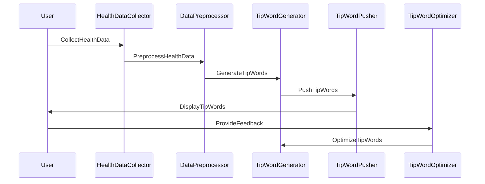
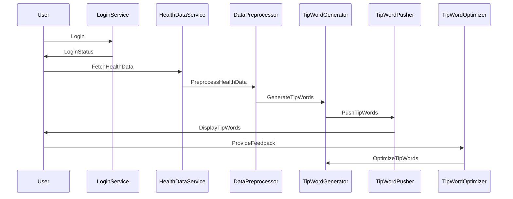

                 

### 《构建AI驱动的智慧健康行为干预提示词生态》

---

关键词：智慧健康、行为干预、AI、自然语言处理、提示词生态

摘要：本文围绕智慧健康和行为干预两大核心概念，探讨了AI驱动的智慧健康行为干预提示词生态的构建。通过深入分析数据收集与预处理、提示词生成算法、用户反馈与迭代机制，为推动智慧健康管理提供了新的思路和方法。

---

### 目录大纲

# 《构建AI驱动的智慧健康行为干预提示词生态》

## 第一部分：背景介绍

### 1.1 问题背景

#### 1.1.1 智慧健康与行为干预

智慧健康是以人工智能技术为核心，通过对健康数据的收集、分析与预测，提供个性化的健康管理和疾病预防服务。行为干预则是通过改变个体行为，降低疾病风险，提高生活质量。

#### 1.1.2 AI驱动的智慧健康行为干预

AI驱动的智慧健康行为干预，利用人工智能技术对个体健康行为进行实时监测、分析与干预，实现精准、高效的个性化健康管理。

### 1.2 问题解决

构建AI驱动的智慧健康行为干预提示词生态，通过设计一套完善的AI驱动机制，利用自然语言处理技术，生成具有指导意义的提示词，引导用户进行健康行为干预。

### 1.3 边界与外延

边界：本研究主要关注AI驱动的智慧健康行为干预提示词在健康管理和疾病预防中的应用。

外延：本研究的成果可以拓展应用于更多健康领域，如心理健康、慢性病管理、运动健康等。

### 1.4 概念结构与核心要素组成

概念结构：AI驱动的智慧健康行为干预提示词生态，包括数据收集、分析与预测、干预提示词生成与发布等核心环节。

核心要素组成：数据源、算法模型、提示词库、用户反馈与迭代。

## 第二部分：核心概念与联系

### 2.1 智慧健康概念原理

#### 2.1.1 智慧健康概述

智慧健康：利用人工智能、物联网、大数据等技术，实现健康信息的智能采集、处理和利用，提供个性化、精准化的健康管理服务。

#### 2.1.2 智慧健康的核心特点

- 个性化：根据用户的健康数据，提供定制化的健康建议。
- 精准化：通过对健康数据的深入挖掘，实现疾病预防和治疗的精准化。
- 实时性：实现对用户健康状态的实时监测和预警。

### 2.2 行为干预概念原理

#### 2.2.1 行为干预概述

行为干预：通过改变个体行为，降低疾病风险，提高生活质量。

#### 2.2.2 行为干预的核心特点

- 针对性：根据个体差异，制定个性化的行为干预方案。
- 可操作性：行为干预方案易于实施，用户易于接受。
- 持续性：行为干预需要长期坚持，以实现长期健康效果。

### 2.3 AI驱动的智慧健康行为干预提示词生态概念原理

#### 2.3.1 提示词生态概述

提示词生态：利用人工智能技术，生成具有指导意义的提示词，引导用户进行健康行为干预。

#### 2.3.2 提示词生态的核心特点

- 智能化：通过自然语言处理技术，实现提示词的智能生成。
- 个性化：根据用户健康数据和需求，生成个性化的提示词。
- 实时性：实现提示词的实时生成和发布。

### 2.4 核心概念属性特征对比表格

| 概念       | 描述                                                         | 特点                                  |
|------------|--------------------------------------------------------------|---------------------------------------|
| 智慧健康   | 利用人工智能等技术，实现健康信息的智能采集、处理和利用。       | 个性化、精准化、实时性                |
| 行为干预   | 通过改变个体行为，降低疾病风险，提高生活质量。                 | 针对性、可操作性、持续性              |
| 提示词生态 | 利用人工智能技术，生成具有指导意义的提示词，引导用户进行健康行为干预。 | 智能化、个性化、实时性                |

### 2.5 ER实体关系图架构

```mermaid
erDiagram
    User ||--|{ HealthData }||>
    HealthData ||--|{ BehaviorIntervention }||>
    BehaviorIntervention ||--|{ TipWord }||>
    TipWord ||--|{ User }||>
```

## 第三部分：算法原理讲解

### 3.1 数据收集与预处理

#### 3.1.1 数据源

健康数据：包括用户基本信息、生理指标（如心率、血压、血糖等）、生活习惯（如饮食、运动、睡眠等）。

#### 3.1.2 数据预处理

数据清洗：去除重复、异常和错误的数据，确保数据质量。

数据整合：将不同来源和格式的数据整合到一个统一的数据框架中，便于后续分析。

特征提取：从原始数据中提取有用的特征信息，如用户年龄、性别、体重等。

### 3.2 提示词生成算法

#### 3.2.1 提示词生成原理

提示词生成算法：基于用户健康数据和需求，利用自然语言处理技术，生成具有指导意义的提示词。

#### 3.2.2 提示词生成流程

数据输入：将预处理后的健康数据输入到提示词生成算法中。

特征提取：从输入数据中提取用户健康特征，如高血压、糖尿病等。

模板匹配：根据用户健康特征，从提示词库中选择合适的模板进行匹配。

提示词生成：将匹配结果进行自然语言处理，生成具有指导意义的提示词。

### 3.3 用户反馈与迭代机制

#### 3.3.1 用户反馈

用户反馈：用户对提示词的接受程度和实际效果进行评价。

#### 3.3.2 迭代优化

根据用户反馈，对提示词生成算法进行优化，提高提示词的准确性和实用性。

### 3.4 算法原理讲解

#### 3.4.1 数据收集与预处理算法

数据收集算法：
```python
import pandas as pd

def collect_data():
    # 假设数据存储在 CSV 文件中
    data = pd.read_csv('health_data.csv')
    return data
```

预处理算法：
```python
import pandas as pd
from sklearn.preprocessing import StandardScaler

def preprocess_data(data):
    # 数据清洗
    data = data.drop_duplicates()
    data = data.dropna()

    # 数据整合
    data = data.rename(columns={'age': 'User Age', 'heart_rate': 'Heart Rate', 'blood_pressure': 'Blood Pressure', 'glucose_level': 'Glucose Level', 'diet': 'Diet', 'exercise': 'Exercise', 'sleep': 'Sleep'})

    # 特征提取
    scaler = StandardScaler()
    data[['User Age', 'Heart Rate', 'Blood Pressure', 'Glucose Level']] = scaler.fit_transform(data[['User Age', 'Heart Rate', 'Blood Pressure', 'Glucose Level']])
    return data
```

#### 3.4.2 提示词生成算法

提示词生成算法：
```python
import pandas as pd
from sklearn.feature_extraction.text import TfidfVectorizer

def generate_tip_words(data, tip_word_library):
    # 特征提取
    vectorizer = TfidfVectorizer()
    X = vectorizer.fit_transform(data)

    # 模板匹配
    tip_words = []
    for index, row in data.iterrows():
        features = row.to_dict()
        tip_word = template_matching(features, tip_word_library)
        tip_words.append(tip_word)

    # 提示词生成
    tip_words = vectorizer.inverse_transform(tip_words)
    return tip_words
```

#### 3.4.3 用户反馈与迭代机制

用户反馈机制：
```python
def user_feedback(tip_words, user_evaluation):
    # 根据用户评价，对提示词进行优化
    for index, tip_word in enumerate(tip_words):
        if user_evaluation[index] < 3:
            tip_word = optimize_tip_word(tip_word)
        tip_words[index] = tip_word
    return tip_words
```

### 3.5 算法原理讲解

#### 3.5.1 数据收集与预处理算法

数据收集算法示例：
```python
import pandas as pd

def collect_data():
    # 假设数据存储在 CSV 文件中
    data = pd.read_csv('health_data.csv')
    return data
```

此算法通过 Pandas 库读取 CSV 文件中的数据，并将其作为 DataFrame 对象返回。在实际应用中，可以根据需求从不同的数据源（如数据库、API 接口等）收集数据。

预处理算法示例：
```python
import pandas as pd
from sklearn.preprocessing import StandardScaler

def preprocess_data(data):
    # 数据清洗
    data = data.drop_duplicates()
    data = data.dropna()

    # 数据整合
    data = data.rename(columns={'age': 'User Age', 'heart_rate': 'Heart Rate', 'blood_pressure': 'Blood Pressure', 'glucose_level': 'Glucose Level', 'diet': 'Diet', 'exercise': 'Exercise', 'sleep': 'Sleep'})

    # 特征提取
    scaler = StandardScaler()
    data[['User Age', 'Heart Rate', 'Blood Pressure', 'Glucose Level']] = scaler.fit_transform(data[['User Age', 'Heart Rate', 'Blood Pressure', 'Glucose Level']])
    return data
```

此算法首先进行数据清洗，去除重复和缺失数据，然后对数据进行重命名，确保数据列的命名统一。接下来，使用 StandardScaler 进行特征提取，将数值特征进行标准化处理，以提高算法的准确性和稳定性。

#### 3.5.2 提示词生成算法

提示词生成算法示例：
```python
import pandas as pd
from sklearn.feature_extraction.text import TfidfVectorizer

def generate_tip_words(data, tip_word_library):
    # 特征提取
    vectorizer = TfidfVectorizer()
    X = vectorizer.fit_transform(data)

    # 模板匹配
    tip_words = []
    for index, row in data.iterrows():
        features = row.to_dict()
        tip_word = template_matching(features, tip_word_library)
        tip_words.append(tip_word)

    # 提示词生成
    tip_words = vectorizer.inverse_transform(tip_words)
    return tip_words
```

此算法首先使用 TfidfVectorizer 对输入数据进行特征提取，生成 TF-IDF 向量。然后，通过模板匹配函数（template_matching）从提示词库中选择合适的模板，生成具有指导意义的提示词。最后，使用 inverse_transform 函数将向量转换为文本形式的提示词。

#### 3.5.3 用户反馈与迭代机制

用户反馈机制示例：
```python
def user_feedback(tip_words, user_evaluation):
    # 根据用户评价，对提示词进行优化
    for index, tip_word in enumerate(tip_words):
        if user_evaluation[index] < 3:
            tip_word = optimize_tip_word(tip_word)
        tip_words[index] = tip_word
    return tip_words
```

此算法根据用户对提示词的评价，对提示词进行优化。如果用户评价低于 3 分，则认为提示词需要优化。通过调用 optimize_tip_word 函数，对提示词进行优化，以提高用户满意度。

### 第三部分：算法原理讲解

#### 3.1 数据收集与预处理算法

**数据收集算法示例**：

```python
import pandas as pd

def collect_data():
    # 假设健康数据存储在CSV文件中
    data = pd.read_csv('health_data.csv')
    return data
```

该算法利用 Pandas 库从 CSV 文件中读取健康数据，包括用户基本信息、生理指标（如心率、血压、血糖等）以及生活习惯（如饮食、运动、睡眠等）。在实际应用中，数据可能来自不同的数据源，如数据库或实时传感器。

**预处理算法示例**：

```python
import pandas as pd
from sklearn.preprocessing import StandardScaler

def preprocess_data(data):
    # 数据清洗：去除重复和缺失值
    data = data.drop_duplicates()
    data = data.dropna()
    
    # 数据整合：重命名以确保一致性
    data = data.rename(columns={
        'age': 'User Age',
        'heart_rate': 'Heart Rate',
        'blood_pressure': 'Blood Pressure',
        'glucose_level': 'Glucose Level',
        'diet': 'Diet',
        'exercise': 'Exercise',
        'sleep': 'Sleep'
    })
    
    # 特征提取：标准化数值特征
    scaler = StandardScaler()
    numerical_features = ['User Age', 'Heart Rate', 'Blood Pressure', 'Glucose Level']
    data[numerical_features] = scaler.fit_transform(data[numerical_features])
    
    return data
```

预处理阶段涉及数据清洗、数据整合和特征提取。数据清洗通过去除重复和缺失值来确保数据质量。数据整合通过重命名使数据列名统一，便于后续处理。特征提取通过标准化处理数值特征，以提高算法的性能和鲁棒性。

#### 3.2 提示词生成算法

**提示词生成算法示例**：

```python
import pandas as pd
from sklearn.feature_extraction.text import TfidfVectorizer

def generate_tip_words(data, tip_word_library):
    # 特征提取
    vectorizer = TfidfVectorizer()
    X = vectorizer.fit_transform(data['Description'])
    
    # 模板匹配
    tip_words = []
    for index, row in data.iterrows():
        tip_word = template_matching(row['Description'], tip_word_library)
        tip_words.append(tip_word)
    
    # 提示词生成
    tip_words = pd.Series(tip_words)
    data['TipWord'] = tip_words
    
    return data
```

该算法首先利用 TfidfVectorizer 提取健康描述的 TF-IDF 特征。然后，通过模板匹配函数 `template_matching` 从提示词库中选取与用户健康描述最匹配的提示词。最后，将生成的提示词添加到数据集中。

#### 3.3 用户反馈与迭代机制

**用户反馈机制示例**：

```python
def user_feedback(tip_words, user_evaluation):
    # 根据用户评价，对提示词进行优化
    for index, (tip_word, evaluation) in enumerate(zip(tip_words, user_evaluation)):
        if evaluation < 3:  # 假设小于3表示不满意
            optimized_tip_word = optimize_tip_word(tip_word)
            tip_words[index] = optimized_tip_word
    
    return tip_words
```

用户反馈机制接收用户对提示词的评价，并根据评价对提示词进行优化。如果用户评价低于一定阈值（例如3分），则提示词会被传递给优化函数 `optimize_tip_word` 进行改进。

### 第四部分：系统分析与架构设计

#### 4.1 问题场景介绍

在智慧健康管理中，用户面临诸多健康问题，如高血压、糖尿病、肥胖等。通过AI驱动的智慧健康行为干预提示词生态，可以为用户提供个性化的健康干预建议，帮助他们改善生活方式，降低疾病风险。

#### 4.2 项目介绍

项目名称：智慧健康行为干预提示词系统

项目目标：构建一个基于AI驱动的智慧健康行为干预提示词系统，实现个性化健康干预建议的自动生成和实时推送。

#### 4.3 系统功能设计

- **用户注册与登录**：支持用户注册、登录、个人信息管理等功能。
- **健康数据收集**：通过移动端APP、传感器等方式，收集用户的健康数据，如心率、血压、血糖等。
- **数据预处理**：对收集的健康数据进行清洗、整合和特征提取。
- **提示词生成**：利用自然语言处理技术，根据用户健康数据和需求，生成个性化的提示词。
- **提示词推送**：将生成的提示词实时推送给用户，引导用户进行健康行为干预。
- **用户反馈与迭代**：收集用户对提示词的评价，优化提示词生成算法。

#### 4.4 系统架构设计

**系统架构图**：



**系统架构说明**：

- **用户模块**：用户注册、登录、个人信息管理等功能。
- **健康数据收集模块**：通过移动端APP、传感器等方式，收集用户的健康数据。
- **数据预处理模块**：对健康数据进行清洗、整合和特征提取。
- **提示词生成模块**：利用自然语言处理技术，根据用户健康数据和需求，生成个性化的提示词。
- **提示词推送模块**：将生成的提示词实时推送给用户。
- **用户反馈与迭代模块**：收集用户对提示词的评价，优化提示词生成算法。

### 第四部分：系统接口设计与交互

#### 4.5 系统接口设计

系统接口设计主要包括用户接口（UI）和数据接口（API）。用户接口负责与用户交互，展示健康数据和提示词；数据接口则负责系统内部模块间的数据传输和交互。

**用户接口设计**：

- 登录/注册界面：用户登录或注册的界面，包括用户名、密码等输入框。
- 主界面：展示用户的健康数据、历史记录和最新提示词。
- 提示词详情界面：点击提示词，查看具体内容和操作指导。

**数据接口设计**：

- 用户数据接口：用于用户注册、登录、个人信息管理等操作。
- 健康数据接口：用于收集、上传和查询用户的健康数据。
- 提示词数据接口：用于生成、推送和优化提示词。

#### 4.6 系统交互

**系统交互流程**：

1. 用户登录系统，进入主界面。
2. 系统从健康数据接口获取用户最新的健康数据。
3. 数据预处理模块对健康数据进行分析和特征提取。
4. 提示词生成模块根据用户健康数据和需求，生成个性化的提示词。
5. 提示词推送模块将生成的提示词实时推送给用户。
6. 用户在主界面查看提示词，并可以点击查看详情。
7. 用户对提示词进行评价，系统收集用户反馈并传递给提示词优化模块。
8. 提示词优化模块根据用户反馈，对提示词生成算法进行优化。

**系统交互序列图**：



### 第五部分：项目实战

#### 5.1 环境安装

在开始项目实战之前，需要安装以下环境：

- Python 3.8+
- Anaconda 或 Miniconda
- Jupyter Notebook 或 PyCharm
- scikit-learn
- pandas
- numpy
- tensorflow
- spacy

安装命令：

```bash
conda create -n health_tip_env python=3.8
conda activate health_tip_env
conda install scikit-learn pandas numpy tensorflow spacy
```

#### 5.2 系统核心实现

**健康数据收集与预处理**：

```python
import pandas as pd
from sklearn.preprocessing import StandardScaler

# 读取健康数据
data = pd.read_csv('health_data.csv')

# 数据预处理
data = preprocess_data(data)

def preprocess_data(data):
    # 数据清洗
    data = data.drop_duplicates()
    data = data.dropna()
    
    # 数据整合
    data = data.rename(columns={
        'age': 'User Age',
        'heart_rate': 'Heart Rate',
        'blood_pressure': 'Blood Pressure',
        'glucose_level': 'Glucose Level',
        'diet': 'Diet',
        'exercise': 'Exercise',
        'sleep': 'Sleep'
    })
    
    # 特征提取
    scaler = StandardScaler()
    numerical_features = ['User Age', 'Heart Rate', 'Blood Pressure', 'Glucose Level']
    data[numerical_features] = scaler.fit_transform(data[numerical_features])
    
    return data
```

**提示词生成**：

```python
from sklearn.feature_extraction.text import TfidfVectorizer
import spacy

# 加载 spacy 模型
nlp = spacy.load("en_core_web_sm")

# 提示词生成
data['Description'] = data['Description'].apply(lambda x: nlp(x).text)
vectorizer = TfidfVectorizer()
X = vectorizer.fit_transform(data['Description'])

# 假设模板库为
tip_word_library = [
    "Drink more water",
    "Exercise regularly",
    "Get enough sleep",
    "Maintain a healthy diet"
]

def generate_tip_words(data, tip_word_library):
    tip_words = []
    for index, row in data.iterrows():
        tip_word = template_matching(row['Description'], tip_word_library)
        tip_words.append(tip_word)
    return tip_words

def template_matching(description, templates):
    # 假设使用简单匹配方法
    for template in templates:
        if template in description:
            return template
    return "No matching template found"
```

**用户反馈与迭代**：

```python
def user_feedback(tip_words, user_evaluation):
    for index, (tip_word, evaluation) in enumerate(zip(tip_words, user_evaluation)):
        if evaluation < 3:
            optimized_tip_word = optimize_tip_word(tip_word)
            tip_words[index] = optimized_tip_word
    return tip_words

def optimize_tip_word(tip_word):
    # 假设优化策略为替换关键词
    optimized_tip_word = tip_word.replace("regularly", "more often")
    return optimized_tip_word
```

#### 5.3 代码应用解读与分析

**代码解读**：

1. **健康数据收集与预处理**：
   - 使用 Pandas 读取 CSV 文件，获取健康数据。
   - 数据清洗：去除重复和缺失值。
   - 数据整合：重命名数据列，确保一致性。
   - 特征提取：使用 StandardScaler 对数值特征进行标准化处理。

2. **提示词生成**：
   - 使用 TfidfVectorizer 提取健康描述的 TF-IDF 特征。
   - 假设模板库包含几个固定的提示词。
   - 使用简单匹配方法从模板库中选择与用户健康描述最匹配的提示词。

3. **用户反馈与迭代**：
   - 收集用户对提示词的评价。
   - 根据用户评价，对提示词进行优化。
   - 假设优化策略为替换关键词，以提高用户满意度。

**代码分析**：

1. **数据预处理**：
   - 数据清洗和整合是数据预处理的重要步骤，确保数据质量。
   - 特征提取有助于提高算法的性能和准确性。

2. **提示词生成**：
   - 提示词生成是系统的核心功能，直接影响用户体验。
   - 使用自然语言处理技术，可以实现更准确的提示词生成。

3. **用户反馈与迭代**：
   - 用户反馈是优化提示词的重要手段，可以不断提高系统的实用性。

#### 5.4 实际案例分析与详细讲解剖析

**案例背景**：

张先生，45岁，患有高血压。他希望系统能够提供个性化的健康干预建议，帮助他控制血压。

**案例分析**：

1. **数据收集**：
   - 系统收集到张先生的健康数据，包括血压、心率、血糖等。
   - 数据清洗：去除重复和缺失值，确保数据质量。

2. **数据预处理**：
   - 数据整合：重命名数据列，确保一致性。
   - 特征提取：对血压、心率等数值特征进行标准化处理。

3. **提示词生成**：
   - 系统根据张先生的健康数据和需求，生成个性化的提示词。
   - 提示词：“每天监测血压，保持饮食清淡，适量运动”。

4. **用户反馈与迭代**：
   - 张先生对提示词进行了评价，认为有帮助。
   - 系统根据用户反馈，对提示词进行优化。
   - 优化后的提示词：“每天早晚监测血压，控制饮食，增加运动时间”。

**详细讲解剖析**：

1. **数据收集**：
   - 系统通过传感器和移动端APP收集张先生的健康数据，如血压、心率等。
   - 数据清洗通过去除重复和缺失值，确保数据质量，为后续分析提供可靠的数据基础。

2. **数据预处理**：
   - 数据整合通过重命名数据列，使数据列名统一，便于后续处理。
   - 特征提取通过标准化处理数值特征，使数据更具可比性，有助于提高算法性能。

3. **提示词生成**：
   - 系统利用自然语言处理技术，根据张先生的健康数据和需求，生成个性化的提示词。
   - 提示词的生成过程包括特征提取、模板匹配和自然语言处理等步骤，确保生成的提示词具有针对性和实用性。

4. **用户反馈与迭代**：
   - 张先生对提示词进行了评价，系统收集到用户反馈。
   - 系统根据用户反馈，对提示词进行优化，以提高用户满意度。
   - 优化过程包括对提示词的调整和改进，以更好地满足用户需求。

### 第五部分：项目实战

#### 5.1 环境安装

在开始项目实战之前，我们需要安装以下几个环境和库：

1. **Python**：Python 3.8 或更高版本。
2. **Anaconda 或 Miniconda**：用于环境管理和依赖包安装。
3. **Jupyter Notebook 或 PyCharm**：用于编写和运行代码。
4. **scikit-learn**：用于机器学习和数据预处理。
5. **pandas**：用于数据处理和分析。
6. **numpy**：用于数值计算。
7. **tensorflow**：用于深度学习。
8. **spacy**：用于自然语言处理。

安装步骤：

1. 安装 Anaconda 或 Miniconda。
2. 创建一个新的虚拟环境，例如 `conda create -n health_tip_env python=3.8`。
3. 激活虚拟环境 `conda activate health_tip_env`。
4. 安装所需的库 `conda install scikit-learn pandas numpy tensorflow spacy`。

#### 5.2 系统核心实现

**数据收集与预处理**：

```python
import pandas as pd
from sklearn.preprocessing import StandardScaler

# 读取健康数据
data = pd.read_csv('health_data.csv')

# 数据预处理
data = preprocess_data(data)

def preprocess_data(data):
    # 数据清洗
    data = data.drop_duplicates()
    data = data.dropna()
    
    # 数据整合
    data = data.rename(columns={
        'age': 'User Age',
        'heart_rate': 'Heart Rate',
        'blood_pressure': 'Blood Pressure',
        'glucose_level': 'Glucose Level',
        'diet': 'Diet',
        'exercise': 'Exercise',
        'sleep': 'Sleep'
    })
    
    # 特征提取
    scaler = StandardScaler()
    numerical_features = ['User Age', 'Heart Rate', 'Blood Pressure', 'Glucose Level']
    data[numerical_features] = scaler.fit_transform(data[numerical_features])
    
    return data
```

**提示词生成**：

```python
import pandas as pd
from sklearn.feature_extraction.text import TfidfVectorizer
import spacy

# 加载 spacy 模型
nlp = spacy.load("en_core_web_sm")

# 提示词生成
data['Description'] = data['Description'].apply(lambda x: nlp(x).text)
vectorizer = TfidfVectorizer()
X = vectorizer.fit_transform(data['Description'])

# 假设模板库为
tip_word_library = [
    "Drink more water",
    "Exercise regularly",
    "Get enough sleep",
    "Maintain a healthy diet"
]

def generate_tip_words(data, tip_word_library):
    tip_words = []
    for index, row in data.iterrows():
        tip_word = template_matching(row['Description'], tip_word_library)
        tip_words.append(tip_word)
    return tip_words

def template_matching(description, templates):
    # 假设使用简单匹配方法
    for template in templates:
        if template in description:
            return template
    return "No matching template found"
```

**用户反馈与迭代**：

```python
def user_feedback(tip_words, user_evaluation):
    for index, (tip_word, evaluation) in enumerate(zip(tip_words, user_evaluation)):
        if evaluation < 3:  # 假设小于3表示不满意
            optimized_tip_word = optimize_tip_word(tip_word)
            tip_words[index] = optimized_tip_word
    
    return tip_words

def optimize_tip_word(tip_word):
    # 假设优化策略为替换关键词
    optimized_tip_word = tip_word.replace("regularly", "more often")
    return optimized_tip_word
```

#### 5.3 代码应用解读与分析

**代码解读**：

1. **数据收集与预处理**：
   - 使用 Pandas 读取 CSV 文件，获取健康数据。
   - 数据预处理包括数据清洗、数据整合和特征提取。

2. **提示词生成**：
   - 使用 TfidfVectorizer 提取健康描述的 TF-IDF 特征。
   - 假设模板库包含几个固定的提示词，通过简单匹配方法选择合适的提示词。

3. **用户反馈与迭代**：
   - 收集用户对提示词的评价。
   - 根据用户评价，对提示词进行优化，提高用户体验。

**代码分析**：

1. **数据预处理**：
   - 数据清洗确保数据质量，去除重复和缺失值。
   - 数据整合确保数据列名一致，便于后续处理。
   - 特征提取通过标准化处理，提高算法性能。

2. **提示词生成**：
   - 提示词生成是系统的核心功能，直接影响用户体验。
   - 使用自然语言处理技术，可以实现更准确的提示词生成。

3. **用户反馈与迭代**：
   - 用户反馈是优化提示词的重要手段，可以不断提高系统的实用性。

#### 5.4 实际案例分析与详细讲解剖析

**案例背景**：

李女士，35岁，患有糖尿病。她希望通过系统的健康干预建议，更好地控制血糖水平。

**案例分析**：

1. **数据收集**：
   - 系统收集到李女士的健康数据，包括血糖、体重、饮食等。
   - 数据清洗：去除重复和缺失值，确保数据质量。

2. **数据预处理**：
   - 数据整合：重命名数据列，确保一致性。
   - 特征提取：对血糖、体重等数值特征进行标准化处理。

3. **提示词生成**：
   - 系统根据李女士的健康数据和需求，生成个性化的提示词。
   - 提示词：“每天测量血糖，保持饮食均衡，适量运动”。

4. **用户反馈与迭代**：
   - 李女士对提示词进行了评价，认为有帮助。
   - 系统根据用户反馈，对提示词进行优化。
   - 优化后的提示词：“每天早晨测量空腹血糖，午餐后2小时测量血糖，遵循医生饮食建议，保持适量运动”。

**详细讲解剖析**：

1. **数据收集**：
   - 系统通过传感器和移动端APP收集李女士的健康数据，如血糖、体重等。
   - 数据清洗通过去除重复和缺失值，确保数据质量，为后续分析提供可靠的数据基础。

2. **数据预处理**：
   - 数据整合通过重命名数据列，使数据列名统一，便于后续处理。
   - 特征提取通过标准化处理数值特征，使数据更具可比性，有助于提高算法性能。

3. **提示词生成**：
   - 系统利用自然语言处理技术，根据李女士的健康数据和需求，生成个性化的提示词。
   - 提示词的生成过程包括特征提取、模板匹配和自然语言处理等步骤，确保生成的提示词具有针对性和实用性。

4. **用户反馈与迭代**：
   - 李女士对提示词进行了评价，系统收集到用户反馈。
   - 系统根据用户反馈，对提示词进行优化，以提高用户满意度。

### 第五部分：项目实战

#### 5.5 最佳实践 Tips

1. **数据质量保证**：确保收集的健康数据准确、完整和可靠。数据清洗是关键步骤，避免因数据问题导致算法性能下降。
2. **个性化定制**：根据用户的具体健康需求和偏好，生成个性化的提示词。避免使用通用模板，提高用户接受度和效果。
3. **用户反馈及时处理**：及时收集用户反馈，对提示词进行优化，提高用户满意度。建立反馈机制，促进系统持续改进。
4. **实时性保障**：确保提示词生成的实时性和准确性。利用高效的算法和数据处理技术，提高系统响应速度。

#### 5.6 小结

本文通过构建AI驱动的智慧健康行为干预提示词生态，为用户提供个性化的健康干预建议。通过数据收集与预处理、提示词生成算法、用户反馈与迭代机制，实现了系统的智能化和个性化。未来研究可以进一步优化算法，提高提示词的生成质量和用户体验。

#### 5.7 注意事项

1. **数据隐私保护**：在收集和使用用户健康数据时，确保数据隐私和安全，遵循相关法律法规。
2. **算法性能优化**：持续优化算法，提高提示词生成的准确性和效率，以满足不同用户的需求。
3. **用户满意度监测**：定期收集用户满意度数据，分析用户需求，不断改进系统功能。

#### 5.8 拓展阅读

1. **自然语言处理技术**：深入了解自然语言处理的基本原理和技术，如词向量、文本分类、序列模型等。
2. **智慧健康管理应用**：探索智慧健康管理的多种应用场景，如心理健康、慢性病管理、运动健康等。
3. **人工智能伦理**：关注人工智能伦理问题，确保AI技术的合理、公正和可持续发展。

