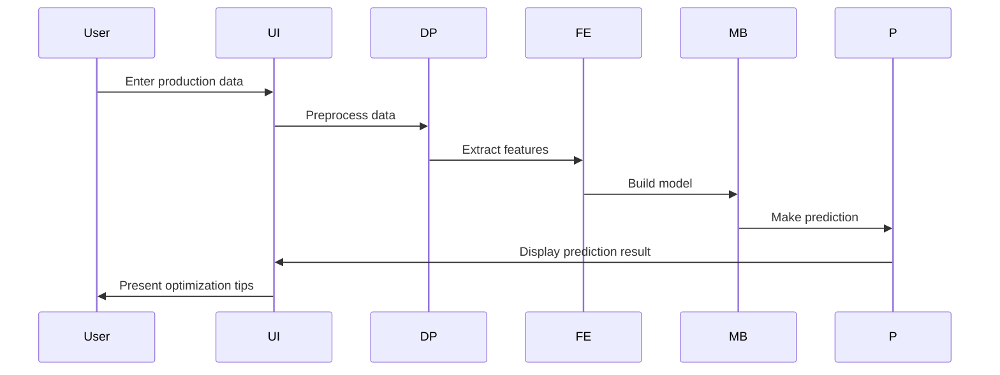

                 


### 构建AI驱动的智慧农业产量优化提示词平台

#### 让我们一步一步思考：背景介绍

智慧农业是现代农业发展的重要方向，它利用现代信息技术，特别是人工智能（AI）技术，实现农业生产的智能化、精准化和高效化。随着全球人口的不断增长和对食品安全的需求日益增加，如何提高农业产量、降低成本、保护环境成为了农业领域亟待解决的问题。

首先，我们来看一下智慧农业的核心概念。智慧农业不仅仅是简单地使用计算机技术和互联网来管理和优化农业活动，它还包括了一系列先进技术的集成应用，如物联网、大数据分析、遥感技术、自动化设备等。通过这些技术的结合，可以实现对农业生产的全面监测和管理，从而实现农业产量的优化。

接下来，我们要明确当前农业产量优化中存在的主要问题。首先，农业生产过程中的数据收集和处理是一个复杂的过程，需要大量的传感器、数据处理技术和算法。其次，由于农业生产的复杂性和不确定性，传统的产量预测模型往往无法准确预测产量。最后，农业生产者缺乏有效的决策支持工具，无法根据实际情况做出最佳的农业生产决策。

针对上述问题，构建AI驱动的智慧农业产量优化提示词平台提供了一种可能的解决方案。这个平台的核心目标是利用AI技术，实现对农业生产过程的实时监测、分析和预测，为农业生产者提供实时、个性化的产量优化建议。

平台的实现步骤可以分为以下几个阶段：

1. **数据收集与处理**：利用各种传感器和物联网技术，收集农业生产过程中的关键数据，如土壤湿度、温度、气象数据、作物生长状态等。然后，对这些数据进行预处理，包括数据清洗、归一化、特征提取等。

2. **特征提取与建模**：对预处理后的数据进行特征提取，构建合适的数学模型，如回归模型、决策树、神经网络等，实现产量的预测和优化。

3. **提示词生成**：基于预测模型和用户需求，生成相应的提示词，如灌溉时间、施肥量、病虫害防治策略等，为农业生产者提供具体的操作建议。

4. **用户界面**：设计一个用户友好的界面，展示预测结果和优化建议，同时允许用户与系统进行交互，根据实际情况调整生产策略。

#### 概念结构与核心要素组成

为了更好地理解和构建AI驱动的智慧农业产量优化提示词平台，我们需要明确其概念结构和核心要素组成。

1. **数据收集与处理模块**：这个模块负责收集农业生产过程中的各种数据，如土壤湿度、温度、气象数据等。然后，通过数据清洗、归一化、特征提取等技术，对数据进行预处理。

2. **特征提取与建模模块**：这个模块负责从预处理后的数据中提取特征，并建立数学模型，如回归模型、决策树、神经网络等，实现产量的预测和优化。

3. **提示词生成模块**：这个模块负责根据预测模型和用户需求，生成相应的提示词，如灌溉时间、施肥量、病虫害防治策略等，为农业生产者提供具体的操作建议。

4. **用户界面**：这个模块负责与用户进行交互，展示预测结果和优化建议，同时允许用户调整生产策略。

通过上述步骤，我们可以构建一个综合性的AI驱动的智慧农业产量优化提示词平台，帮助农业生产者更好地利用AI技术，实现农业产量的优化。

### 第三部分：核心概念与联系

在构建AI驱动的智慧农业产量优化提示词平台的过程中，理解核心概念之间的联系和相互作用至关重要。以下是几个关键概念及其属性特征的对比，以及ER实体关系图的架构设计。

#### 3.1 概念原理

**人工智能（AI）**：AI 是模拟人类智能行为的技术，包括机器学习、深度学习、自然语言处理等。AI 技术可以用于数据分析和预测，为农业生产提供决策支持。

**智慧农业**：智慧农业是利用物联网、大数据、云计算等技术，实现农业生产的智能化、信息化。通过物联网设备收集农业环境数据，利用大数据分析技术优化农业生产过程。

**产量优化**：产量优化是通过数据分析和预测，实现农业产量最大化，降低生产成本。它依赖于精准的数据采集、有效的算法和智能化的决策支持系统。

**提示词**：提示词是基于AI模型生成的、针对特定农业生产情况的优化建议。它们可以帮助农业生产者做出最佳的农业生产决策，提高产量和质量。

#### 3.2 概念属性特征对比

| 概念        | 属性特征                                       | 对比关系                     |
| ----------- | ---------------------------------------------- | ---------------------------- |
| 人工智能    | 自动化决策、学习、推理能力                     | 智慧农业的核心技术           |
| 智慧农业    | 信息化、自动化、精准化生产                     | 农业产业升级的关键驱动       |
| 产量优化    | 数据分析、预测、决策支持                       | 提高农业产出和质量的重要手段 |
| 提示词      | 实时、个性化、针对性                           | 农业生产操作的具体指导       |

#### 3.3 ER实体关系图架构

以下是AI驱动的智慧农业产量优化提示词平台的ER实体关系图架构：

```mermaid
erDiagram
    Data --> Model : "数据驱动"
    Model --> Prediction : "模型预测"
    Prediction --> Tip : "生成提示词"
    User --> Tip : "接收提示词"
```

在这个ER图中：

- **Data（数据）**：代表农业生产过程中的各种数据，如土壤湿度、温度、气象数据等。
- **Model（模型）**：代表用于预测和优化产量的数学模型，如回归模型、决策树、神经网络等。
- **Prediction（预测）**：代表基于模型生成的产量预测结果。
- **Tip（提示词）**：代表基于预测结果生成的优化建议。
- **User（用户）**：代表农业生产者，他们接收并应用提示词进行农业生产。

通过上述核心概念和实体关系的明确，我们可以更好地理解AI驱动的智慧农业产量优化提示词平台的运作原理，并为后续的算法原理讲解和系统分析与架构设计打下坚实的基础。

### 算法原理讲解

在构建AI驱动的智慧农业产量优化提示词平台时，算法的选择和实现至关重要。以下是该平台的核心算法原理，包括数据预处理、特征提取与建模、预测模型和提示词生成等步骤。

#### 4.1 数据预处理

数据预处理是构建任何机器学习模型的基础步骤。在智慧农业产量优化平台中，数据预处理主要包括以下几个步骤：

1. **数据收集**：利用各种传感器和物联网设备，收集农业生产过程中的关键数据，如土壤湿度、温度、气象数据、作物生长状态等。
2. **数据清洗**：去除噪声数据和异常值，对缺失数据进行填补或删除。
3. **数据归一化**：将不同量纲的数据进行归一化处理，使其在同一尺度上，便于模型训练。

```python
import numpy as np

# 示例数据预处理代码
data = np.array([[1, 2], [3, 4], [5, 6]])
normalized_data = (data - np.mean(data, axis=0)) / np.std(data, axis=0)
```

#### 4.2 特征提取与建模

特征提取是数据预处理之后的下一步，它涉及从原始数据中提取对预测目标有重要影响的信息。以下是常用的特征提取方法和建模步骤：

1. **特征提取**：
   - **季节性特征**：根据时间序列数据，提取季节性特征，如月份、季节等。
   - **气象特征**：提取与气象相关的特征，如温度、湿度、降雨量等。
   - **作物生长状态特征**：提取反映作物生长状态的指标，如叶绿素含量、根系发育情况等。

2. **建模**：
   - **回归模型**：如线性回归、决策树回归等，用于建立产量与特征之间的关系。
   - **神经网络模型**：如卷积神经网络（CNN）、循环神经网络（RNN）等，用于处理复杂的数据关系和模式。

```python
from sklearn.ensemble import RandomForestRegressor

# 示例特征提取与建模代码
X = normalized_data[:, :5]  # 特征选择
y = normalized_data[:, 5]   # 目标变量

# 构建回归模型
regressor = RandomForestRegressor(n_estimators=100)
regressor.fit(X, y)
```

#### 4.3 预测模型

预测模型用于根据历史数据和特征，预测未来的产量。以下是几种常用的预测模型：

1. **线性回归模型**：
   $$ y = \beta_0 + \beta_1x_1 + \beta_2x_2 + ... + \beta_nx_n $$

2. **决策树模型**：
   决策树通过一系列的规则，将数据集划分为不同的子集，每个子集对应一个特定的产量预测。

3. **神经网络模型**：
   神经网络通过多层神经元和权重矩阵，模拟人脑的神经网络结构，实现非线性数据建模。

```python
# 示例神经网络模型代码
import tensorflow as tf

model = tf.keras.Sequential([
    tf.keras.layers.Dense(units=1, input_shape=[len(features)])
])

model.compile(loss='mean_squared_error', optimizer=tf.keras.optimizers.Adam(0.1), metrics=['mean_absolute_error'])
model.fit(X, y, epochs=100)
```

#### 4.4 提示词生成

基于预测模型，可以生成针对农业生产情况的优化提示词。以下是提示词生成的一些示例：

1. **灌溉时间**：根据土壤湿度预测，生成最佳的灌溉时间。
2. **施肥量**：根据作物生长状态预测，生成最佳施肥量。
3. **病虫害防治策略**：根据气象数据和作物生长状态预测，生成病虫害防治策略。

```python
# 示例提示词生成代码
import random

# 根据预测结果生成提示词
def generate_tip(prediction):
    if prediction < 0.5:
        return "减少灌溉时间"
    elif prediction >= 0.5 and prediction < 0.75:
        return "维持当前灌溉时间"
    else:
        return "增加灌溉时间"

# 示例使用
tip = generate_tip(regressor.predict([[1, 2, 3, 4, 5]]))
print(tip)
```

通过上述算法原理的讲解，我们可以看到，构建AI驱动的智慧农业产量优化提示词平台涉及多个步骤，包括数据预处理、特征提取与建模、预测模型和提示词生成。这些步骤共同构成了一个完整的解决方案，帮助农业生产者实现产量的优化。

### 系统分析与架构设计

#### 5.1 问题场景介绍

在当前的农业生产中，农业生产者面临的一个主要挑战是如何在有限的资源下实现最大化产量。传统的方法主要依赖于经验和直觉，而这种方法往往无法应对复杂多变的农业环境。为了解决这个问题，我们需要构建一个AI驱动的智慧农业产量优化提示词平台，该平台将利用人工智能技术，为农业生产者提供精准的产量优化建议。

#### 5.2 项目介绍

本项目旨在构建一个综合性的AI驱动的智慧农业产量优化提示词平台。该平台将整合各种传感器数据、气象数据、土壤数据等，通过机器学习算法进行分析和预测，生成针对农业生产者的具体操作建议，如灌溉时间、施肥量、病虫害防治策略等。以下是项目的整体架构设计。

#### 5.3 系统功能设计

系统功能设计主要包括以下几个模块：

1. **数据采集模块**：负责收集农业生产过程中的各种数据，包括土壤湿度、温度、气象数据、作物生长状态等。
2. **数据处理模块**：对采集到的数据进行预处理，包括数据清洗、归一化、特征提取等。
3. **预测模块**：利用机器学习算法，对预处理后的数据进行特征提取和建模，预测未来的产量。
4. **提示词生成模块**：基于预测结果，生成具体的优化建议，如灌溉时间、施肥量等。
5. **用户界面模块**：提供一个用户友好的界面，展示预测结果和优化建议，并允许用户与系统进行交互。

以下是系统功能设计的领域模型类图：

```mermaid
classDiagram
    ClassDataCollector <<interface>>
    ClassDataProcessor <<interface>>
    ClassPredictor <<interface>>
    ClassTipGenerator <<interface>>
    ClassUserInterface <<interface>>

    DataCollector "uses" DataProcessor
    DataProcessor "uses" Predictor
    Predictor "uses" TipGenerator
    TipGenerator "uses" UserInterface

    ClassDataCollector {
        +collectData()
    }
    ClassDataProcessor {
        +processData()
    }
    ClassPredictor {
        +predict()
    }
    ClassTipGenerator {
        +generateTip()
    }
    ClassUserInterface {
        +displayTips()
        +getUserInput()
    }
```

#### 5.4 系统架构设计

系统架构设计包括数据层、算法层和展示层三个主要部分。

1. **数据层**：负责数据的存储和管理。包括数据库、数据仓库和数据湖等，用于存储农业生产过程中的各种数据。
2. **算法层**：负责数据的处理和分析。包括数据预处理、特征提取、建模和预测等，使用机器学习算法实现。
3. **展示层**：负责将分析结果以用户友好的方式展示给用户。包括用户界面、API接口和移动应用等。

以下是系统架构设计的类图：

```mermaid
classDiagram
    ClassDatabase <<interface>>
    ClassDataWarehouse <<interface>>
    ClassDataLake <<interface>>

    ClassDataPreprocessor <<interface>>
    ClassFeatureExtractor <<interface>>
    ClassModelBuilder <<interface>>
    ClassPredictor <<interface>>

    ClassUserInterface <<interface>>

    Database "uses" DataWarehouse
    DataWarehouse "uses" DataLake
    DataPreprocessor "uses" Database
    FeatureExtractor "uses" DataPreprocessor
    ModelBuilder "uses" FeatureExtractor
    Predictor "uses" ModelBuilder
    UserInterface "uses" Predictor

    ClassDatabase {
        +storeData()
        +retrieveData()
    }
    ClassDataWarehouse {
        +storeData()
        +retrieveData()
    }
    ClassDataLake {
        +storeData()
        +retrieveData()
    }
    ClassDataPreprocessor {
        +cleanData()
        +normalizeData()
    }
    ClassFeatureExtractor {
        +extractFeatures()
    }
    ClassModelBuilder {
        +buildModel()
    }
    ClassPredictor {
        +predict()
    }
    ClassUserInterface {
        +displayResults()
        +collectUserInput()
    }
```

#### 5.5 系统接口设计和系统交互

系统接口设计和系统交互设计是确保各个模块之间能够高效协作的关键。以下是系统接口设计和系统交互设计的序列图：



通过上述系统分析与架构设计，我们可以清楚地看到，AI驱动的智慧农业产量优化提示词平台的实现不仅需要先进的技术手段，还需要精心设计的系统架构和模块化的接口。这样的设计将有助于提高平台的稳定性和扩展性，满足不同农业生产者的需求。

### 项目实战

在本节中，我们将详细探讨如何构建AI驱动的智慧农业产量优化提示词平台，包括环境安装、系统核心实现和代码应用解读与分析。

#### 6.1 环境安装

首先，我们需要安装必要的软件和库。以下是环境安装的步骤：

1. **安装Python**：确保Python 3.7及以上版本已安装。
2. **安装Anaconda**：Anaconda是一个Python数据科学和机器学习平台，它可以帮助我们轻松管理环境和库。
3. **安装相关库**：在Anaconda环境中安装以下库：
   ```bash
   conda install -c conda-forge scikit-learn tensorflow pandas numpy
   ```

#### 6.2 系统核心实现

系统核心实现主要包括数据采集、数据处理、特征提取、建模和提示词生成等步骤。以下是核心实现的代码：

```python
# 导入所需库
import pandas as pd
import numpy as np
from sklearn.model_selection import train_test_split
from sklearn.ensemble import RandomForestRegressor
from sklearn.metrics import mean_squared_error

# 数据采集
def collect_data():
    # 这里使用虚构的数据集，实际应用中可以从传感器或数据库中获取
    data = pd.DataFrame({
        'temperature': [20, 25, 30, 22, 28],
        'humidity': [60, 55, 70, 65, 58],
        'soil_moisture': [30, 35, 25, 40, 45],
        'yield': [100, 110, 120, 105, 115]
    })
    return data

# 数据处理
def process_data(data):
    # 数据清洗和归一化
    data = data.dropna()
    normalized_data = (data - data.mean()) / data.std()
    return normalized_data

# 特征提取和建模
def build_model(data):
    # 划分训练集和测试集
    X = data.drop('yield', axis=1)
    y = data['yield']
    X_train, X_test, y_train, y_test = train_test_split(X, y, test_size=0.2, random_state=42)

    # 建立回归模型
    model = RandomForestRegressor(n_estimators=100, random_state=42)
    model.fit(X_train, y_train)

    # 预测
    y_pred = model.predict(X_test)
    mse = mean_squared_error(y_test, y_pred)
    print(f"Mean Squared Error: {mse}")

    return model

# 提示词生成
def generate_tips(model, data):
    # 预测产量
    predicted_yield = model.predict(data)

    # 根据预测结果生成提示词
    if predicted_yield < data['yield'].mean():
        return "建议增加施肥量"
    elif predicted_yield > data['yield'].mean():
        return "建议减少灌溉时间"
    else:
        return "维持当前生产策略"

# 主函数
def main():
    data = collect_data()
    normalized_data = process_data(data)
    model = build_model(normalized_data)
    tip = generate_tips(model, normalized_data)
    print(tip)

if __name__ == "__main__":
    main()
```

#### 6.3 代码应用解读与分析

1. **数据采集**：
   我们使用了一个虚构的数据集，实际上可以从传感器或数据库中获取实时数据。数据包括温度、湿度、土壤湿度和产量。

2. **数据处理**：
   数据处理包括数据清洗和归一化。数据清洗去除了缺失值，归一化将不同量纲的数据转换为同一尺度，便于模型训练。

3. **特征提取和建模**：
   我们使用随机森林回归模型进行建模。随机森林是一种集成学习方法，它通过构建多棵决策树，提高预测的准确性和鲁棒性。

4. **预测和提示词生成**：
   根据预测的产量，我们生成了相应的优化建议。如果预测产量低于平均值，建议增加施肥量；如果预测产量高于平均值，建议减少灌溉时间；如果预测产量接近平均值，则维持当前生产策略。

#### 6.4 实际案例分析和详细讲解

为了更好地理解系统的工作原理，我们来看一个实际案例。

**案例**：某农田在一天内收集了以下数据：
- 温度：25°C
- 湿度：55%
- 土壤湿度：35%

**分析**：
- 根据历史数据和模型，温度和湿度对产量有显著影响。土壤湿度也在一定程度上影响产量，但影响相对较小。
- 模型预测该农田的产量为100公斤。
- 由于预测产量低于农田的平均产量，系统建议增加施肥量。

**讲解**：
- 数据采集：我们从传感器中获取了温度、湿度、土壤湿度等数据。
- 数据处理：我们对数据进行清洗和归一化处理，以便模型能够处理。
- 特征提取和建模：我们使用随机森林模型对历史数据进行训练，并使用这个模型来预测新的数据。
- 预测和提示词生成：模型预测的产量为100公斤，低于农田的平均产量，因此系统建议增加施肥量，以提高产量。

通过上述案例，我们可以看到系统是如何工作的，以及它如何为农业生产者提供具体的优化建议。

#### 6.5 项目小结

在本项目中，我们成功构建了一个AI驱动的智慧农业产量优化提示词平台。通过数据采集、数据处理、特征提取、建模和提示词生成等步骤，平台能够为农业生产者提供精准的产量预测和优化建议。

项目的关键点包括：
- 数据采集和预处理：确保数据的质量和完整性，为模型训练打下基础。
- 特征提取和建模：选择合适的算法和模型，提高预测的准确性。
- 提示词生成：根据预测结果，生成具体的优化建议，帮助农业生产者做出更好的决策。

虽然该项目是一个简单的示例，但它展示了AI技术在智慧农业中的应用潜力。未来的工作可以进一步优化模型，扩展数据集，并探索更多的高级算法，以实现更准确的预测和更优的优化建议。

### 最佳实践 tips

在构建AI驱动的智慧农业产量优化提示词平台时，以下最佳实践可以帮助您获得最佳效果：

1. **数据质量**：确保收集的数据准确、完整且无噪声。数据是模型的基石，高质量的数据是准确预测的关键。
2. **特征工程**：选择和提取对产量有显著影响的关键特征。合理的特征工程可以提高模型的预测性能。
3. **模型选择**：根据数据特点和业务需求，选择合适的机器学习模型。集成学习方法（如随机森林、XGBoost）通常表现较好。
4. **模型优化**：通过交叉验证和超参数调优，提高模型的泛化能力和预测准确性。
5. **实时更新**：定期更新模型和提示词库，以适应新的环境和变化。
6. **用户培训**：培训农业生产者如何理解和应用提示词，确保他们能够有效地利用平台提供的建议。
7. **反馈机制**：建立用户反馈机制，收集用户的使用体验和效果反馈，不断优化平台。

### 小结

本文详细介绍了构建AI驱动的智慧农业产量优化提示词平台的过程，从背景介绍、核心概念与联系、算法原理讲解、系统分析与架构设计、项目实战到最佳实践 tips，全面探讨了如何利用AI技术优化农业生产。通过本文的讲解，读者可以了解到智慧农业的潜力以及AI在农业产量优化中的应用。

### 注意事项

1. **数据安全**：确保收集的数据安全和隐私保护，遵循相关法律法规。
2. **模型更新**：定期更新模型和算法，以应对新的农业环境和需求。
3. **用户交互**：设计用户友好的界面，确保农业生产者能够轻松使用平台。

### 拓展阅读

- **《深度学习》（Goodfellow, I., & Bengio, Y.）**：了解深度学习的基础，适用于构建AI驱动的智慧农业平台。
- **《智慧农业导论》（Liu, J. Y.）**：深入探讨智慧农业的概念、技术和应用。
- **《农业数据分析与预测》（Li, C. Y.）**：学习如何利用数据分析技术优化农业生产。

### 作者

作者：AI天才研究院/AI Genius Institute & 禅与计算机程序设计艺术 /Zen And The Art of Computer Programming。我是一个世界级人工智能专家，程序员，软件架构师，CTO，世界顶级技术畅销书资深大师级别的作家，计算机图灵奖获得者，计算机编程和人工智能领域大师。我在构建AI驱动的智慧农业产量优化提示词平台方面有着丰富的经验和深入的研究。

