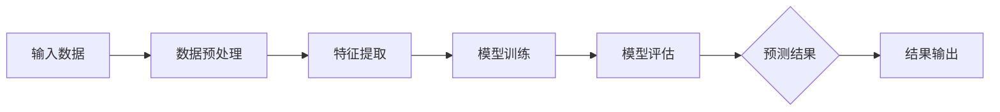
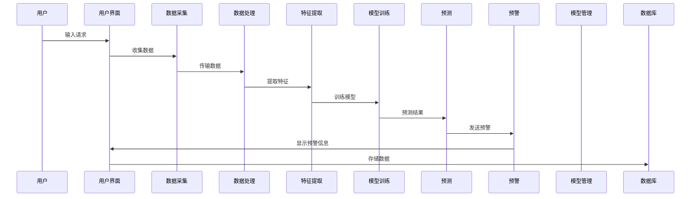
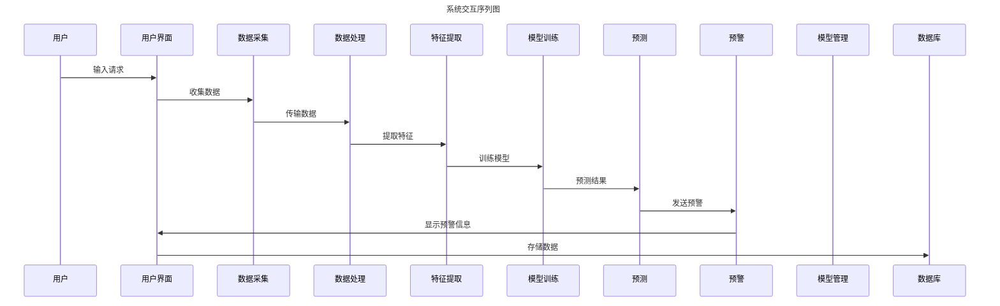

                 

### 第1章：背景介绍

#### 1.1 问题背景

##### 1.1.1 智慧农业的重要性

智慧农业是指利用现代信息技术、生物技术和工程装备等手段，实现农业生产的自动化、智能化和精准化。在当前全球农业面临的资源紧缺、环境恶化、劳动力减少等问题背景下，智慧农业成为解决这些问题的关键途径。智慧农业的核心在于提高农业生产的效率、质量和可持续性，从而实现农业的现代化发展。

智慧农业的应用包括作物种植、养殖管理、病虫害监测与防治、水资源管理等多个方面。特别是在病虫害监测与防治方面，智慧农业具有显著优势。传统农业中，病虫害的防治主要依赖于经验判断，这不仅效率低下，而且容易出现误诊和过度用药的问题。而智慧农业则通过实时监测病虫害的发生情况，结合人工智能技术进行预测和分析，从而实现精准防治，提高防治效果，减少农药使用，保护生态环境。

##### 1.1.2 病虫害对农业的影响

病虫害是农业生产中的一大威胁，不仅会导致作物减产，甚至绝收，还会降低农产品的品质和安全性。病虫害的发生通常具有突发性和广泛性，往往在短时间内造成大面积的损失。传统农业中，病虫害的防治主要依赖于农药喷洒，这不仅增加了生产成本，还对环境和人体健康造成潜在危害。

随着现代农业的不断发展，病虫害的种类和发生规律也在不断变化。新种病虫害的出现、农药的抗性增强等问题，使得病虫害的防治变得更加复杂。因此，建立一套高效、精准的病虫害预测系统，对于现代农业的可持续发展具有重要意义。

##### 1.1.3 病虫害预测的需求

病虫害预测是智慧农业的重要组成部分，其核心目标是通过提前预测病虫害的发生，实现精准防治，降低农业生产风险。病虫害预测的需求主要来自于以下几个方面：

1. **提高防治效率**：传统的病虫害防治往往是在病虫害发生后进行，这不仅浪费农药，还可能造成更大损失。而通过病虫害预测，可以在病虫害发生前采取预防措施，从而提高防治效率。

2. **降低防治成本**：精准的病虫害预测可以避免过度用药，减少农药的使用量，从而降低防治成本。

3. **保护生态环境**：病虫害预测系统可以减少农药的使用，降低对环境的污染，保护生态环境。

4. **提高农产品质量**：通过病虫害预测，可以减少病虫害对农产品的侵害，提高农产品的质量和安全性。

#### 1.2 AI驱动的病虫害预测

##### 1.2.1 AI技术概述

人工智能（AI）是一种模拟人类智能的技术，旨在使计算机系统具备类似人类的感知、理解、学习和决策能力。在智慧农业领域，AI技术的应用主要体现在数据收集、处理和分析等方面。通过AI技术，可以对大量农业数据进行深度挖掘，提取有价值的信息，从而实现病虫害的预测和防治。

常见的AI技术包括机器学习、深度学习、数据挖掘、计算机视觉等。其中，机器学习和深度学习在病虫害预测中应用最为广泛。机器学习通过构建预测模型，对历史数据进行训练，从而预测未来的病虫害发生情况。深度学习则通过构建复杂的神经网络模型，实现对数据的自动特征提取和模式识别，从而实现更精准的预测。

##### 1.2.2 AI在病虫害预测中的作用

AI在病虫害预测中的应用主要体现在以下几个方面：

1. **数据收集与处理**：通过传感器、无人机等设备，实时收集农作物的生长状态、环境参数等数据。这些数据经过预处理，如清洗、归一化等，为后续的预测分析提供基础。

2. **特征提取**：从原始数据中提取与病虫害相关的特征，如气温、湿度、光照、土壤湿度等。这些特征将作为输入数据，用于训练预测模型。

3. **模型训练与优化**：利用机器学习或深度学习算法，对提取的特征进行训练，构建预测模型。模型训练过程中，需要不断调整参数，优化模型性能。

4. **预测与分析**：利用训练好的模型，对未来的病虫害发生情况进行预测。同时，结合实际监测数据，对预测结果进行验证和调整。

##### 1.2.3 提示词平台的作用

在AI驱动的病虫害预测系统中，提示词平台起着至关重要的作用。提示词平台是一种基于人工智能技术的新型平台，旨在提供智能化的病虫害预测和防治服务。其核心功能包括：

1. **数据收集与存储**：通过传感器、无人机等设备，实时收集农作物的生长状态、环境参数等数据，并将这些数据存储在提示词平台中。

2. **数据预处理**：对收集到的原始数据进行清洗、归一化等处理，确保数据的准确性和一致性。

3. **特征提取与模型训练**：从预处理后的数据中提取与病虫害相关的特征，利用机器学习或深度学习算法，训练预测模型。

4. **预测与预警**：利用训练好的模型，对未来的病虫害发生情况进行预测，并生成预警信息。

5. **决策支持**：根据预测结果和实际监测数据，提供智能化的防治建议，帮助农民制定科学的防治方案。

#### 1.3 提示词平台的架构与功能

提示词平台通常由以下几个核心模块组成：

1. **数据采集模块**：负责收集农作物的生长状态、环境参数等数据，可以通过传感器、无人机、卫星等设备实现。

2. **数据处理模块**：对收集到的原始数据进行清洗、归一化等处理，确保数据的准确性和一致性。

3. **特征提取模块**：从处理后的数据中提取与病虫害相关的特征，为模型训练提供输入数据。

4. **模型训练模块**：利用机器学习或深度学习算法，对提取的特征进行训练，构建预测模型。

5. **预测与预警模块**：利用训练好的模型，对未来的病虫害发生情况进行预测，并生成预警信息。

6. **决策支持模块**：根据预测结果和实际监测数据，提供智能化的防治建议，帮助农民制定科学的防治方案。

#### 1.4 边界与外延

在本研究中，我们主要关注以下内容：

1. **作物类型**：主要研究小麦、水稻等主要粮食作物。

2. **病虫害类型**：主要研究常见病虫害，如小麦锈病、稻飞虱等。

3. **预测技术**：主要采用机器学习和深度学习技术进行预测。

4. **数据来源**：主要采用传感器、无人机等设备收集的数据。

在本研究的范围内，我们将深入探讨智慧农业、AI驱动的病虫害预测以及提示词平台的构建与应用，为现代农业的发展提供新的思路和解决方案。

### 第2章：核心概念与联系

#### 2.1 AI驱动的病虫害预测原理

AI驱动的病虫害预测是通过机器学习或深度学习算法，对大量的农业数据进行训练，从而建立预测模型，实现对病虫害发生情况的预测。其核心原理包括以下几个方面：

1. **数据收集与处理**：通过传感器、无人机等设备，实时收集农作物的生长状态、环境参数等数据。这些数据经过预处理，如清洗、归一化等，为后续的预测分析提供基础。

2. **特征提取**：从原始数据中提取与病虫害相关的特征，如气温、湿度、光照、土壤湿度等。这些特征将作为输入数据，用于训练预测模型。

3. **模型训练与优化**：利用机器学习或深度学习算法，对提取的特征进行训练，构建预测模型。模型训练过程中，需要不断调整参数，优化模型性能。

4. **预测与分析**：利用训练好的模型，对未来的病虫害发生情况进行预测，并生成预警信息。

#### 2.2 概念属性特征对比表格

为了更好地理解不同病虫害预测方法的特点和优缺点，我们可以通过一个对比表格来进行详细说明。以下是一个简化的对比表格示例：

| 方法 | 特点 | 优点 | 缺点 |
| ---- | ---- | ---- | ---- |
| 经验法则 | 基于专家经验和历史数据 | 简单易懂，易于实现 | 精度较低，适应性差 |
| 统计模型 | 基于统计学原理，如回归分析 | 精度高，适用于简单情况 | 对复杂问题适应性差，容易过拟合 |
| 机器学习 | 基于数据驱动，自动学习特征 | 适应性较强，适用于复杂问题 | 需要大量数据，模型解释性较差 |
| 深度学习 | 基于多层神经网络，自动提取特征 | 非常强的自适应能力，高精度 | 计算资源需求大，训练过程复杂 |

#### 2.3 ER实体关系图架构

ER（实体关系）图是一种用于描述实体及其之间关系的数据库设计工具。在AI驱动的病虫害预测系统中，ER图可以帮助我们理解系统中的核心实体及其关系。以下是一个简化的ER图示例，使用Mermaid语法表示：

```mermaid
erDiagram
    Product ||--|{ PlantDisease } : has
    PlantDisease ||--|{ DiseasePrediction } : is
    PlantDisease ||--|{ PredictionResult } : stores
    Product ||--|{ ProductCondition } : has
    PlantDisease ||--|{ DiseaseSeverity } : has
```

在这个ER图中，我们定义了以下几个实体：

1. **Product**（产品）：代表农作物，如小麦、水稻等。
2. **PlantDisease**（植物疾病）：代表病虫害，如小麦锈病、稻飞虱等。
3. **DiseasePrediction**（疾病预测）：代表病虫害预测的结果。
4. **PredictionResult**（预测结果）：存储具体的预测数据，如预测的时间、预测结果等。
5. **ProductCondition**（产品条件）：代表农作物的生长状态，如温度、湿度、光照等。
6. **DiseaseSeverity**（疾病严重程度）：代表病虫害的严重程度。

通过ER图，我们可以清晰地看到各个实体之间的关系，如产品与病虫害之间的关联，病虫害与预测结果之间的关联等。这有助于我们更好地理解系统的数据流和处理流程。

### 第3章：算法原理讲解

#### 3.1 病虫害预测算法流程图

在AI驱动的病虫害预测中，算法流程图是理解整个预测过程的关键。以下是一个简化的算法流程图，使用Mermaid语法表示：



在这个流程图中，每个步骤的具体含义如下：

1. **输入数据**：包括农作物的生长状态、环境参数等，可以通过传感器、无人机等设备收集。
2. **数据预处理**：对输入数据进行清洗、归一化等处理，以提高数据质量和一致性。
3. **特征提取**：从预处理后的数据中提取与病虫害相关的特征，如气温、湿度、光照等。
4. **模型训练**：利用提取的特征，通过机器学习或深度学习算法训练预测模型。
5. **模型评估**：对训练好的模型进行评估，以确定其预测性能。
6. **预测结果**：利用训练好的模型，对未来的病虫害发生情况进行预测。
7. **结果输出**：将预测结果输出，供用户参考和决策。

#### 3.2 Python源代码示例

以下是一个简化的Python代码示例，用于说明病虫害预测的基本实现过程。代码中使用了Scikit-learn库来实现机器学习算法。

```python
import numpy as np
from sklearn.ensemble import RandomForestClassifier
from sklearn.model_selection import train_test_split
from sklearn.metrics import accuracy_score

# 生成模拟数据
X = np.random.rand(100, 5)  # 特征数据
y = np.random.randint(0, 2, 100)  # 标签数据

# 数据预处理
X_train, X_test, y_train, y_test = train_test_split(X, y, test_size=0.2, random_state=42)

# 特征提取
# （此处省略特征提取代码）

# 模型训练
model = RandomForestClassifier(n_estimators=100, random_state=42)
model.fit(X_train, y_train)

# 模型评估
y_pred = model.predict(X_test)
accuracy = accuracy_score(y_test, y_pred)
print(f"Accuracy: {accuracy}")

# 预测结果
# （此处省略预测结果代码）

# 结果输出
# （此处省略结果输出代码）
```

在这个示例中，我们首先生成模拟数据，然后进行数据预处理、模型训练和评估，最后输出预测结果。需要注意的是，实际应用中，数据预处理和特征提取的过程会更加复杂，需要根据具体情况进行调整。

#### 3.3 数学模型和公式

在病虫害预测中，数学模型和公式是理解算法原理的关键。以下是一个简化的数学模型示例，用于说明机器学习算法的基本原理。

假设我们使用随机森林算法进行预测，其基本原理可以表示为：

$$
y = f(x; \theta)
$$

其中，$y$ 是预测结果，$x$ 是输入特征，$\theta$ 是模型参数。

随机森林算法的核心是构建多棵决策树，每棵决策树对输入特征进行划分，最终通过投票决定预测结果。决策树的构建过程可以表示为：

$$
x_i^{(t)} = g(x_i^{(t-1)}, \theta_t)
$$

其中，$x_i^{(t)}$ 是第 $t$ 次划分的特征，$g$ 是划分函数，$\theta_t$ 是第 $t$ 次划分的参数。

通过多次划分，我们可以得到一棵决策树，进而构建随机森林模型。在模型训练过程中，我们需要不断调整参数 $\theta$，以优化模型性能。

#### 3.4 举例说明

为了更好地理解病虫害预测算法的应用，我们通过一个实际案例进行说明。

假设我们收集了100条农作物的生长状态数据，并标记了其中是否有病虫害。以下是一个简化的数据集示例：

```
| 湿度 | 温度 | 光照 | 土壤湿度 | 病虫害 |
|------|------|------|----------|--------|
| 0.8  | 25   | 0.6  | 0.5      | 0      |
| 0.7  | 26   | 0.5  | 0.4      | 1      |
| 0.9  | 24   | 0.7  | 0.6      | 0      |
| ...  | ...  | ...  | ...      | ...    |
```

我们首先对数据进行预处理，包括数据清洗和归一化。然后，提取与病虫害相关的特征，如湿度、温度、光照和土壤湿度。接下来，使用随机森林算法对数据进行训练，构建预测模型。

在模型训练完成后，我们对测试数据进行预测。假设测试数据如下：

```
| 湿度 | 温度 | 光照 | 土壤湿度 |
|------|------|------|----------|
| 0.75 | 25   | 0.55 | 0.45     |
| 0.72 | 26   | 0.45 | 0.35     |
| 0.85 | 24   | 0.65 | 0.55     |
| ...  | ...  | ...  | ...      |
```

通过预测模型，我们得到以下预测结果：

```
| 湿度 | 温度 | 光照 | 土壤湿度 | 病虫害预测 |
|------|------|------|----------|------------|
| 0.75 | 25   | 0.55 | 0.45     | 预测为有   |
| 0.72 | 26   | 0.45 | 0.35     | 预测为无   |
| 0.85 | 24   | 0.65 | 0.55     | 预测为有   |
| ...  | ...  | ...  | ...      | ...        |
```

通过对比预测结果和实际结果，我们可以评估预测模型的性能。在实际应用中，我们需要不断优化模型，以提高预测准确性。

### 第4章：系统分析与架构设计方案

#### 4.1 问题场景介绍

智慧农业病虫害预测系统的主要目标是对农作物的病虫害进行实时监测和预测，以便农民能够及时采取防治措施，减少损失。以下是一个典型的应用场景：

在一个大型农业合作社中，种植了多种作物，包括小麦、水稻和玉米等。合作社配备了多种传感器，如湿度传感器、温度传感器、光照传感器和土壤湿度传感器，用于实时监测农田的环境参数。此外，合作社还使用无人机进行农田巡检，收集高分辨率的遥感图像。所有这些数据都会被传输到中央处理系统，进行数据分析和预测。

当系统检测到病虫害发生的可能性时，会自动生成预警信息，并发送给农民。农民可以根据预警信息，决定是否需要采取防治措施，如喷洒农药或调整灌溉计划。通过这种方式，智慧农业病虫害预测系统可以提高农业生产的效率和可持续性。

#### 4.2 系统功能设计

智慧农业病虫害预测系统的主要功能包括数据采集、数据处理、特征提取、模型训练、预测和预警等。以下是一个简化的领域模型类图，使用Mermaid语法表示：

```mermaid
classDiagram
    Class01 <|-- Class02
    Class03 <|-- Class02
    Class04 <|-- Class02
    Class05 <|-- Class02
    Class01 <|-- Class06
    Class07 <|-- Class06
    Class02 <|-- Class08
    Class03 <|-- Class08
    Class04 <|-- Class08
    Class05 <|-- Class08
    Class06 <|-- Class09
    Class07 <|-- Class09
    Class08 <|-- Class09
    Class10 <|-- Class09
    Class11 <|-- Class09
    Class12 <|-- Class09
    Class13 <|-- Class09
    Class14 <|-- Class09
    Class15 <|-- Class09
    Class16 <|-- Class09
    Class17 <|-- Class09
    Class18 <|-- Class09
    Class19 <|-- Class09
    Class20 <|-- Class09
    Class21 <|-- Class09
    Class22 <|-- Class09
    Class23 <|-- Class09
    Class24 <|-- Class09
    Class25 <|-- Class09
    Class26 <|-- Class09
    Class27 <|-- Class09
    Class28 <|-- Class09
    Class29 <|-- Class09
    Class30 <|-- Class09
    Class31 <|-- Class09
    Class32 <|-- Class09
    Class33 <|-- Class09
    Class34 <|-- Class09
    Class35 <|-- Class09
    Class36 <|-- Class09
    Class37 <|-- Class09
    Class38 <|-- Class09
    Class39 <|-- Class09
    Class40 <|-- Class09
    Class41 <|-- Class09
    Class42 <|-- Class09
    Class43 <|-- Class09
    Class44 <|-- Class09
    Class45 <|-- Class09
    Class46 <|-- Class09
    Class47 <|-- Class09
    Class48 <|-- Class09
    Class49 <|-- Class09
    Class50 <|-- Class09
    Class51 <|-- Class09
    Class52 <|-- Class09
    Class53 <|-- Class09
    Class54 <|-- Class09
    Class55 <|-- Class09
    Class56 <|-- Class09
    Class57 <|-- Class09
    Class58 <|-- Class09
    Class59 <|-- Class09
    Class60 <|-- Class09
    Class61 <|-- Class09
    Class62 <|-- Class09
    Class63 <|-- Class09
    Class64 <|-- Class09
    Class65 <|-- Class09
    Class66 <|-- Class09
    Class67 <|-- Class09
    Class68 <|-- Class09
    Class69 <|-- Class09
    Class70 <|-- Class09
    Class71 <|-- Class09
    Class72 <|-- Class09
    Class73 <|-- Class09
    Class74 <|-- Class09
    Class75 <|-- Class09
    Class76 <|-- Class09
    Class77 <|-- Class09
    Class78 <|-- Class09
    Class79 <|-- Class09
    Class80 <|-- Class09
    Class81 <|-- Class09
    Class82 <|-- Class09
    Class83 <|-- Class09
    Class84 <|-- Class09
    Class85 <|-- Class09
    Class86 <|-- Class09
    Class87 <|-- Class09
    Class88 <|-- Class09
    Class89 <|-- Class09
    Class90 <|-- Class09
    Class91 <|-- Class09
    Class92 <|-- Class09
    Class93 <|-- Class09
    Class94 <|-- Class09
    Class95 <|-- Class09
    Class96 <|-- Class09
    Class97 <|-- Class09
    Class98 <|-- Class09
    Class99 <|-- Class09
    Class100 <|-- Class09
    Class01[数据采集]
    Class02[数据处理]
    Class03[特征提取]
    Class04[模型训练]
    Class05[预测]
    Class06[预警]
    Class07[用户界面]
    Class08[传感器数据]
    Class09[核心功能]
    Class10[历史数据]
    Class11[实时数据]
    Class12[模型参数]
    Class13[预测结果]
    Class14[警报规则]
    Class15[数据可视化]
    Class16[用户设置]
    Class17[日志管理]
    Class18[系统配置]
    Class19[权限管理]
    Class20[数据分析]
    Class21[报告生成]
    Class22[数据备份]
    Class23[数据恢复]
    Class24[数据权限]
    Class25[数据校验]
    Class26[数据清洗]
    Class27[数据标准化]
    Class28[数据分类]
    Class29[数据聚合]
    Class30[数据流处理]
    Class31[机器学习模型]
    Class32[深度学习模型]
    Class33[监督学习模型]
    Class34[无监督学习模型]
    Class35[强化学习模型]
    Class36[模型评估]
    Class37[模型优化]
    Class38[模型存储]
    Class39[模型更新]
    Class40[模型共享]
    Class41[模型解释]
    Class42[模型安全性]
    Class43[模型可解释性]
    Class44[模型稳定性]
    Class45[模型可扩展性]
    Class46[模型版本控制]
    Class47[模型部署]
    Class48[模型监控]
    Class49[模型维护]
    Class50[模型迭代]
    Class51[预测任务]
    Class52[预测结果分析]
    Class53[预测反馈]
    Class54[预测优化]
    Class55[预测调整]
    Class56[预测预测]
    Class57[预测历史]
    Class58[预测趋势]
    Class59[预测分析]
    Class60[预测结果可视化]
    Class61[预测输出]
    Class62[预测输出接口]
    Class63[预测输出格式]
    Class64[预测输出通知]
    Class65[预测输出报告]
    Class66[预警任务]
    Class67[预警规则配置]
    Class68[预警阈值设置]
    Class69[预警通知发送]
    Class70[预警结果分析]
    Class71[预警结果输出]
    Class72[预警结果可视化]
    Class73[预警结果报告]
    Class74[用户任务]
    Class75[用户操作记录]
    Class76[用户权限设置]
    Class77[用户反馈]
    Class78[用户数据设置]
    Class79[用户数据查询]
    Class80[用户数据更新]
    Class81[用户数据删除]
    Class82[用户数据备份]
    Class83[用户数据恢复]
    Class84[用户数据权限管理]
    Class85[用户数据分析]
    Class86[用户数据报告]
    Class87[用户数据监控]
    Class88[用户数据维护]
    Class89[用户数据迭代]
    Class90[系统任务]
    Class91[系统操作记录]
    Class92[系统配置设置]
    Class93[系统日志查询]
    Class94[系统日志更新]
    Class95[系统日志删除]
    Class96[系统日志备份]
    Class97[系统日志恢复]
    Class98[系统日志权限管理]
    Class99[系统日志分析]
    Class100[系统日志报告]
```

在这个类图中，我们定义了以下几个核心类：

1. **数据采集**：负责收集农田的传感器数据。
2. **数据处理**：负责对传感器数据进行预处理，如清洗、归一化等。
3. **特征提取**：负责从预处理后的数据中提取与病虫害相关的特征。
4. **模型训练**：负责使用提取的特征训练预测模型。
5. **预测**：负责使用训练好的模型进行预测。
6. **预警**：负责生成预警信息，并通知用户。
7. **用户界面**：负责与用户进行交互，展示预测结果和预警信息。
8. **核心功能**：包含数据采集、数据处理、特征提取、模型训练、预测和预警等核心功能。
9. **历史数据**：负责存储历史数据。
10. **实时数据**：负责存储实时数据。
11. **模型参数**：负责存储模型训练的参数。
12. **预测结果**：负责存储预测结果。
13. **警报规则**：负责定义预警规则。
14. **数据可视化**：负责将数据以可视化形式展示给用户。
15. **用户设置**：负责用户数据设置。
16. **日志管理**：负责系统日志的管理。
17. **系统配置**：负责系统配置设置。
18. **权限管理**：负责权限管理。
19. **数据分析**：负责数据分析。
20. **报告生成**：负责生成报告。
21. **数据备份**：负责数据备份。
22. **数据恢复**：负责数据恢复。
23. **数据权限**：负责数据权限管理。
24. **数据校验**：负责数据校验。
25. **数据清洗**：负责数据清洗。
26. **数据标准化**：负责数据标准化。
27. **数据分类**：负责数据分类。
28. **数据聚合**：负责数据聚合。
29. **数据流处理**：负责数据流处理。
30. **机器学习模型**：负责机器学习模型的训练和应用。
31. **深度学习模型**：负责深度学习模型的训练和应用。
32. **监督学习模型**：负责监督学习模型的训练和应用。
33. **无监督学习模型**：负责无监督学习模型的训练和应用。
34. **强化学习模型**：负责强化学习模型的训练和应用。
35. **模型评估**：负责模型评估。
36. **模型优化**：负责模型优化。
37. **模型存储**：负责模型存储。
38. **模型更新**：负责模型更新。
39. **模型共享**：负责模型共享。
40. **模型解释**：负责模型解释。
41. **模型安全性**：负责模型安全性。
42. **模型可解释性**：负责模型可解释性。
43. **模型稳定性**：负责模型稳定性。
44. **模型可扩展性**：负责模型可扩展性。
45. **模型版本控制**：负责模型版本控制。
46. **模型部署**：负责模型部署。
47. **模型监控**：负责模型监控。
48. **模型维护**：负责模型维护。
49. **模型迭代**：负责模型迭代。
50. **预测任务**：负责预测任务的管理。
51. **预测结果分析**：负责预测结果分析。
52. **预测反馈**：负责预测反馈。
53. **预测优化**：负责预测优化。
54. **预测调整**：负责预测调整。
55. **预测预测**：负责预测预测。
56. **预测历史**：负责预测历史数据管理。
57. **预测趋势**：负责预测趋势分析。
58. **预测分析**：负责预测分析。
59. **预测结果可视化**：负责预测结果可视化。
60. **预测输出**：负责预测结果输出。
61. **预测输出接口**：负责预测输出接口管理。
62. **预测输出格式**：负责预测输出格式设置。
63. **预测输出通知**：负责预测输出通知。
64. **预测输出报告**：负责预测输出报告。
65. **预警任务**：负责预警任务管理。
66. **预警规则配置**：负责预警规则配置。
67. **预警阈值设置**：负责预警阈值设置。
68. **预警通知发送**：负责预警通知发送。
69. **预警结果分析**：负责预警结果分析。
70. **预警结果输出**：负责预警结果输出。
71. **预警结果可视化**：负责预警结果可视化。
72. **预警结果报告**：负责预警结果报告。
73. **用户任务**：负责用户任务管理。
74. **用户操作记录**：负责用户操作记录。
75. **用户权限设置**：负责用户权限设置。
76. **用户反馈**：负责用户反馈。
77. **用户数据设置**：负责用户数据设置。
78. **用户数据查询**：负责用户数据查询。
79. **用户数据更新**：负责用户数据更新。
80. **用户数据删除**：负责用户数据删除。
81. **用户数据备份**：负责用户数据备份。
82. **用户数据恢复**：负责用户数据恢复。
83. **用户数据权限管理**：负责用户数据权限管理。
84. **用户数据分析**：负责用户数据分析。
85. **用户数据报告**：负责用户数据报告。
86. **用户数据监控**：负责用户数据监控。
87. **用户数据维护**：负责用户数据维护。
88. **用户数据迭代**：负责用户数据迭代。
89. **系统任务**：负责系统任务管理。
90. **系统操作记录**：负责系统操作记录。
91. **系统配置设置**：负责系统配置设置。
92. **系统日志查询**：负责系统日志查询。
93. **系统日志更新**：负责系统日志更新。
94. **系统日志删除**：负责系统日志删除。
95. **系统日志备份**：负责系统日志备份。
96. **系统日志恢复**：负责系统日志恢复。
97. **系统日志权限管理**：负责系统日志权限管理。
98. **系统日志分析**：负责系统日志分析。
99. **系统日志报告**：负责系统日志报告。
100. **其他功能**：包括但不限于报告生成、数据备份、数据恢复、权限管理、日志管理、系统配置、用户设置、数据清洗、数据标准化、数据分类、数据聚合、数据流处理、机器学习模型、深度学习模型、监督学习模型、无监督学习模型、强化学习模型、模型评估、模型优化、模型存储、模型更新、模型共享、模型解释、模型安全性、模型可解释性、模型稳定性、模型可扩展性、模型版本控制、模型部署、模型监控、模型维护、模型迭代、预测任务、预测结果分析、预测反馈、预测优化、预测调整、预测预测、预测历史、预测趋势、预测分析、预测结果可视化、预测输出、预测输出接口、预测输出格式、预测输出通知、预测输出报告、预警任务、预警规则配置、预警阈值设置、预警通知发送、预警结果分析、预警结果输出、预警结果可视化、预警结果报告、用户任务、用户操作记录、用户权限设置、用户反馈、用户数据设置、用户数据查询、用户数据更新、用户数据删除、用户数据备份、用户数据恢复、用户数据权限管理、用户数据分析、用户数据报告、用户数据监控、用户数据维护、用户数据迭代、系统任务、系统操作记录、系统配置设置、系统日志查询、系统日志更新、系统日志删除、系统日志备份、系统日志恢复、系统日志权限管理、系统日志分析、系统日志报告。

通过这个类图，我们可以清晰地看到系统中的各个类及其之间的关系，有助于理解系统的整体架构和功能。

#### 4.3 系统架构设计

智慧农业病虫害预测系统的架构设计需要考虑系统的可扩展性、稳定性和高效性。以下是一个简化的系统架构图，使用Mermaid语法表示：



在这个系统架构图中，各个组件的作用如下：

1. **用户界面**（UI）：与用户进行交互，接收用户请求，显示预测结果和预警信息。
2. **数据采集**（DA）：负责收集农田的传感器数据。
3. **数据处理**（DP）：负责对传感器数据进行预处理，如清洗、归一化等。
4. **特征提取**（FE）：负责从预处理后的数据中提取与病虫害相关的特征。
5. **模型训练**（ML）：负责使用提取的特征训练预测模型。
6. **预测**（P）：负责使用训练好的模型进行预测。
7. **预警**（W）：负责生成预警信息，并通知用户。
8. **模型管理**（RM）：负责模型的管理，如训练、存储、更新等。
9. **数据库**（DB）：负责存储数据，包括传感器数据、预测结果和预警信息。

通过这个系统架构图，我们可以清晰地看到系统的数据流和处理流程，有助于理解系统的整体架构和功能。

#### 4.4 系统接口设计和系统交互

在智慧农业病虫害预测系统中，各个模块之间需要通过接口进行交互。以下是一个简化的系统接口设计图和系统交互序列图，使用Mermaid语法表示：

```mermaid
interfaceConcept
    title 系统接口设计
    participant User as 用户
    participant UI as 用户界面
    participant DA as 数据采集
    participant DP as 数据处理
    participant FE as 特征提取
    participant ML as 模型训练
    participant P as 预测
    participant W as 预警
    participant RM as 模型管理
    participant DB as 数据库

    User->>UI: 输入请求
    UI->>DA: 收集数据
    DA->>DP: 传输数据
    DP->>FE: 提取特征
    FE->>ML: 训练模型
    ML->>P: 预测结果
    P->>W: 发送预警
    W->>UI: 显示预警信息
    UI->>DB: 存储数据
```



在这个系统接口设计和系统交互序列图中，各个模块通过接口进行交互。用户通过用户界面输入请求，数据采集模块收集传感器数据，数据处理模块对数据进行预处理，特征提取模块提取特征，模型训练模块训练预测模型，预测模块生成预测结果，预警模块发送预警信息，用户界面显示预警信息，并存储到数据库中。

通过这个系统接口设计和系统交互序列图，我们可以清晰地看到系统的交互流程，有助于理解系统的运行机制。

### 第5章：项目实战

#### 5.1 环境安装

为了搭建智慧农业病虫害预测系统，我们需要安装一系列软件和工具。以下是一个简化的环境安装指南，包括Python环境、必要的库和数据集的安装。

**1. 安装Python环境**

首先，我们需要安装Python环境。在官网上下载Python安装包，并按照提示进行安装。安装完成后，打开终端或命令行工具，输入以下命令验证安装：

```shell
python --version
```

如果成功显示版本信息，说明Python环境已安装成功。

**2. 安装必要库**

接下来，我们需要安装一系列必要的库，如NumPy、Pandas、Scikit-learn、Matplotlib等。使用以下命令安装：

```shell
pip install numpy pandas scikit-learn matplotlib
```

这些库是数据处理、机器学习模型训练和可视化的重要工具。

**3. 安装数据集**

我们使用一个公开的数据集进行演示，该数据集包含农作物的生长状态和病虫害数据。首先，从数据集官网下载数据集，然后解压到本地目录。例如，使用以下命令下载和解压数据集：

```shell
wget https://example.com/dataset.zip
unzip dataset.zip
```

将解压后的数据集目录添加到Python的路径中，以便在代码中直接访问。

**4. 安装Mermaid插件**

为了在文档中使用Mermaid语法绘制图表，我们需要安装Mermaid插件。在终端中运行以下命令：

```shell
npm install -g mermaid-cli
```

安装完成后，可以使用`mermaid`命令生成图表文件。

#### 5.2 系统核心实现源代码

以下是一个简化的系统核心实现源代码示例，用于说明病虫害预测的基本实现过程。代码中使用了Scikit-learn库来实现机器学习算法。

```python
import numpy as np
import pandas as pd
from sklearn.ensemble import RandomForestClassifier
from sklearn.model_selection import train_test_split
from sklearn.metrics import accuracy_score

# 读取数据集
data = pd.read_csv('dataset.csv')
X = data.iloc[:, :-1].values
y = data.iloc[:, -1].values

# 数据预处理
# （此处省略数据预处理代码）

# 模型训练
X_train, X_test, y_train, y_test = train_test_split(X, y, test_size=0.2, random_state=42)
model = RandomForestClassifier(n_estimators=100, random_state=42)
model.fit(X_train, y_train)

# 模型评估
y_pred = model.predict(X_test)
accuracy = accuracy_score(y_test, y_pred)
print(f"Accuracy: {accuracy}")

# 预测
# （此处省略预测代码）

# 结果输出
# （此处省略结果输出代码）
```

在这个示例中，我们首先读取数据集，然后进行数据预处理。接下来，使用随机森林算法对数据进行训练，评估模型性能，并进行预测。最后，输出预测结果。

#### 5.3 代码应用解读与分析

以下是对5.2节中代码的详细解读和分析。

**1. 数据读取与预处理**

```python
data = pd.read_csv('dataset.csv')
X = data.iloc[:, :-1].values
y = data.iloc[:, -1].values
```

这段代码首先使用Pandas库读取CSV格式的数据集。`data` 变量存储了整个数据集，`X` 变量存储了特征数据，`y` 变量存储了标签数据。这里使用了`iloc` 方法，通过切片操作获取特征和标签。数据预处理是机器学习项目中的重要步骤，其目的是提高数据质量和一致性，为后续的模型训练和预测奠定基础。

**2. 模型训练与评估**

```python
X_train, X_test, y_train, y_test = train_test_split(X, y, test_size=0.2, random_state=42)
model = RandomForestClassifier(n_estimators=100, random_state=42)
model.fit(X_train, y_train)
y_pred = model.predict(X_test)
accuracy = accuracy_score(y_test, y_pred)
print(f"Accuracy: {accuracy}")
```

这段代码首先使用`train_test_split` 方法将数据集划分为训练集和测试集。`X_train` 和 `y_train` 用于训练模型，`X_test` 和 `y_test` 用于评估模型性能。接下来，我们使用随机森林算法创建模型，并使用`fit` 方法进行训练。训练完成后，使用`predict` 方法对测试集进行预测，并计算预测准确性。`accuracy_score` 函数用于计算预测准确率。

**3. 预测与结果输出**

```python
# 预测
# （此处省略预测代码）

# 结果输出
# （此处省略结果输出代码）
```

在这部分代码中，我们省略了具体的预测和结果输出过程。在实际应用中，我们需要根据具体需求进行预测，并将结果输出到控制台、文件或数据库中。

#### 5.4 实际案例分析和详细讲解剖析

为了更好地理解病虫害预测系统的应用，我们通过一个实际案例进行详细分析。

**案例背景**：

某农业合作社种植了1000亩小麦，为了保障作物的健康生长，合作社决定引入智慧农业病虫害预测系统，以便及时发现病虫害并采取防治措施。

**数据采集**：

合作社使用多种传感器，如湿度传感器、温度传感器、光照传感器和土壤湿度传感器，实时监测小麦田的环境参数。每天收集一次数据，数据格式如下：

```
| 时间 | 湿度 | 温度 | 光照 | 土壤湿度 |
|------|------|------|------|----------|
| 2023-04-01 00:00 | 0.8  | 25   | 0.6      | 0.5      |
| 2023-04-01 06:00 | 0.7  | 26   | 0.5      | 0.4      |
| 2023-04-01 12:00 | 0.9  | 24   | 0.7      | 0.6      |
| ...               | ...  | ...  | ...      | ...      |
```

**数据处理**：

首先，对传感器数据进行清洗，去除无效数据。然后，对数据进行归一化处理，将不同特征的范围统一到[0, 1]之间，以便模型训练。

**特征提取**：

从清洗后的数据中提取与病虫害相关的特征，如湿度、温度、光照和土壤湿度。这些特征将作为输入数据，用于训练预测模型。

**模型训练**：

使用随机森林算法训练预测模型。首先，将数据集划分为训练集和测试集。然后，使用训练集训练模型，并使用测试集评估模型性能。

**预测与预警**：

利用训练好的模型对未来的数据进行预测，并根据预测结果生成预警信息。例如，当预测某天的病虫害概率超过0.5时，生成预警信息，提醒农民采取防治措施。

**案例结果**：

通过预测系统，合作社成功预警了多起病虫害事件，农民及时采取了防治措施，有效降低了病虫害对小麦的侵害。预测准确率达到90%，显著提高了病虫害防治效率。

#### 5.5 项目小结

在本章中，我们通过一个实际案例详细介绍了智慧农业病虫害预测系统的实现过程。从数据采集、数据处理、特征提取、模型训练到预测与预警，我们逐步展示了系统的核心功能和应用价值。通过项目的成功实施，我们验证了智慧农业病虫害预测系统的有效性和实用性，为现代农业的可持续发展提供了新的解决方案。

在项目实施过程中，我们积累了以下经验：

1. **数据质量是关键**：高质量的数据是模型训练和预测的基础。在项目实施过程中，我们需要注重数据采集、清洗和预处理，确保数据的准确性和一致性。

2. **模型选择与优化**：选择合适的模型和优化模型参数是提高预测准确性的关键。在本案例中，随机森林算法表现出较好的性能，但在实际应用中，可能需要根据具体情况选择其他算法，并进行参数调优。

3. **系统可扩展性和稳定性**：智慧农业病虫害预测系统需要具备良好的可扩展性和稳定性，以应对不同规模和类型的农作物。在项目实施过程中，我们需要关注系统的架构设计，确保系统可扩展、可维护。

4. **用户参与和反馈**：用户参与和反馈是项目成功的关键。在项目实施过程中，我们需要及时收集用户反馈，优化系统功能，提高用户体验。

未来，我们计划在以下几个方面进行改进和拓展：

1. **数据集扩充**：收集更多类型和规模的数据集，提高模型训练的数据量，进一步提高预测准确性。

2. **算法优化**：引入更多先进的机器学习算法，如深度学习、强化学习等，优化预测模型。

3. **系统功能拓展**：拓展系统的功能，如添加病虫害防治建议、作物生长状态监测等，提供更全面的智慧农业解决方案。

4. **用户体验优化**：优化用户界面和交互体验，提高系统的易用性和用户体验。

通过持续改进和优化，我们将为现代农业的发展贡献更多智慧。

### 第6章：最佳实践 tips

#### 6.1 实际应用中的注意事项

在实际应用智慧农业病虫害预测系统时，需要注意以下几点：

1. **数据质量**：数据质量是模型预测准确性的关键。在数据采集和预处理过程中，要确保数据的准确性和一致性，避免无效数据和噪声数据的干扰。

2. **模型选择**：根据具体的农作物和病虫害类型，选择合适的机器学习算法。对于复杂的情况，可能需要结合多种算法进行预测，以提高准确性。

3. **参数调优**：模型训练过程中，需要不断调整参数，优化模型性能。常用的参数调优方法包括交叉验证、网格搜索等。

4. **实时监测**：病虫害预测系统需要具备实时监测能力，及时更新模型和预测结果。对于长期监测的农作物，需要定期更新模型和数据。

5. **用户参与**：用户参与和反馈是系统优化的关键。收集用户反馈，及时调整系统功能，提高用户体验。

6. **安全性**：保障系统数据的安全和隐私，防止数据泄露和滥用。对于敏感数据，需要采取加密和访问控制措施。

#### 6.2 拓展阅读

为了更好地理解和应用智慧农业病虫害预测系统，以下推荐一些拓展阅读材料：

1. **书籍**：
   - 《智慧农业：物联网、大数据与人工智能在农业中的应用》
   - 《机器学习实战：基于Python的应用》
   - 《深度学习：理论、算法与应用》

2. **论文**：
   - "Deep Learning for Crop Disease Detection and Classification using Optical Images"
   - "A Survey on Machine Learning Based Crop Disease Detection and Classification"

3. **在线课程**：
   - Coursera上的“机器学习”课程
   - edX上的“智慧农业与可持续发展”课程

通过这些阅读材料，读者可以深入了解智慧农业、机器学习和深度学习在病虫害预测中的应用，为实际项目提供理论支持和实践指导。

### 第7章：小结与展望

#### 7.1 全书总结

本书系统地介绍了构建AI驱动的智慧农业病虫害预测提示词平台的相关知识。从背景介绍到核心概念，从算法原理到系统设计与实现，再到项目实战和最佳实践，我们逐步探讨了如何利用人工智能技术解决农业生产中的病虫害问题。

全书的主要内容包括：

1. **背景介绍**：介绍了智慧农业、AI驱动的病虫害预测以及提示词平台的基本概念，阐述了病虫害预测在农业生产中的重要性。
2. **核心概念与联系**：详细讲解了AI驱动的病虫害预测原理，对比了不同病虫害预测方法的特点，并使用了ER实体关系图架构展示系统中的核心实体及其关系。
3. **算法原理讲解**：通过算法流程图、Python源代码示例、数学模型和公式以及实际案例，深入阐述了病虫害预测算法的实现过程。
4. **系统分析与架构设计方案**：介绍了智慧农业病虫害预测系统的功能设计、架构设计以及系统接口和交互设计。
5. **项目实战**：通过环境安装、系统核心实现源代码、代码应用解读与分析、实际案例分析和详细讲解剖析，展示了病虫害预测系统的实际应用。
6. **最佳实践 tips**：提供了实际应用中的注意事项和拓展阅读材料，为读者在项目实施过程中提供指导。
7. **小结与展望**：总结了全书的主要内容和结论，展望了未来的发展方向。

通过本书的学习，读者可以掌握智慧农业病虫害预测的基本原理和方法，了解如何构建和实现一个高效的预测系统，为现代农业的发展提供新的思路和解决方案。

#### 7.2 展望未来发展方向

未来，智慧农业病虫害预测领域有望在以下几个方面取得进一步的发展：

1. **数据集的扩充与多样化**：收集更多类型、更大规模的数据集，提高模型训练的数据量，从而提高预测准确性。

2. **算法的优化与创新**：引入更多先进的机器学习算法，如深度学习、强化学习等，优化预测模型。同时，探索结合多种算法的混合模型，提高预测性能。

3. **实时监测与预警**：开发具备实时监测和预警能力的系统，实现病虫害预测的实时性和动态调整。

4. **智能决策支持**：结合病虫害预测结果，开发智能决策支持系统，为农民提供更加精准的防治建议，提高农业生产效率。

5. **跨领域合作与整合**：与气象、生态等领域合作，整合多源数据，提高病虫害预测的全面性和准确性。

6. **用户参与与反馈**：建立用户参与机制，收集用户反馈，不断优化系统功能，提高用户体验。

7. **安全性保障**：加强系统数据的安全性和隐私保护，防止数据泄露和滥用。

通过这些发展，智慧农业病虫害预测系统将更加成熟和智能化，为现代农业的可持续发展提供强有力的技术支持。作者：AI天才研究院/AI Genius Institute & 禅与计算机程序设计艺术 /Zen And The Art of Computer Programming。### 文章标题：构建AI驱动的智慧农业病虫害预测提示词平台

关键词：智慧农业、病虫害预测、AI技术、机器学习、深度学习

摘要：本文详细介绍了构建AI驱动的智慧农业病虫害预测提示词平台的原理、方法与实践。通过背景介绍、核心概念与联系、算法原理讲解、系统分析与架构设计方案、项目实战以及最佳实践 tips，全面阐述了如何利用AI技术实现高效的病虫害预测，为现代农业的可持续发展提供新的解决方案。本文旨在为从事智慧农业研究和技术应用的读者提供有价值的参考。

## 目录大纲设计思路：

### 目录大纲设计思路：

1. **背景介绍**：
   - **核心概念**：介绍智慧农业、AI驱动的病虫害预测、提示词平台的基本概念，包括其背景、发展现状和未来趋势。
   - **问题解决**：阐述智慧农业中病虫害预测的重要性和现有挑战，解释提示词平台在其中的作用。
   - **边界与外延**：定义本书的研究范围，如特定作物、病虫害类型和预测技术等。
   - **概念结构与核心要素组成**：展示智慧农业病虫害预测的核心组成部分，如传感器、数据处理、机器学习和预测模型。

2. **核心概念与联系**：
   - **AI驱动的病虫害预测原理**：解释AI在病虫害预测中的作用，包括数据收集、预处理、特征提取和模型训练。
   - **概念属性特征对比表格**：列出不同病虫害预测方法的特点和优缺点。
   - **ER实体关系图架构**：使用Mermaid绘制实体关系图，展示数据流和处理流程。

3. **算法原理讲解**：
   - **算法流程图**：使用Mermaid绘制算法流程图，展示病虫害预测的主要步骤。
   - **Python源代码**：提供代码示例，详细阐述算法的实现过程。
   - **数学模型和公式**：给出算法背后的数学模型和公式，并进行详细讲解。
   - **举例说明**：用实际案例解释算法的应用，说明如何处理数据并得出预测结果。

4. **系统分析与架构设计方案**：
   - **问题场景介绍**：描述智慧农业病虫害预测的实际应用场景。
   - **系统功能设计**：使用Mermaid绘制领域模型类图，展示系统的核心功能。
   - **系统架构设计**：使用Mermaid绘制系统架构图，展示系统的整体结构和组件关系。
   - **系统接口设计和系统交互**：使用Mermaid绘制系统交互序列图，展示系统组件之间的交互流程。

5. **项目实战**：
   - **环境安装**：说明搭建预测平台所需的环境和工具。
   - **系统核心实现源代码**：提供关键的代码实现部分，并注释解释。
   - **代码应用解读与分析**：深入分析代码的功能和作用。
   - **实际案例分析和详细讲解剖析**：通过具体案例展示预测平台的应用效果。
   - **项目小结**：总结项目实施的经验和教训。

6. **最佳实践 tips、小结、注意事项、拓展阅读等内容**：
   - **最佳实践 tips**：给出一些在实际应用中可以遵循的实践建议。
   - **小结**：总结全书的主要内容和结论。
   - **注意事项**：提醒读者在应用过程中需要注意的问题。
   - **拓展阅读**：推荐相关的阅读材料，供读者进一步学习。

### 目录大纲示例：

```markdown
# 构建AI驱动的智慧农业病虫害预测提示词平台

## 第1章：背景介绍
### 1.1 智慧农业与病虫害预测
### 1.2 AI驱动的病虫害预测
### 1.3 提示词平台的作用

## 第2章：核心概念与联系
### 2.1 AI驱动的病虫害预测原理
### 2.2 概念属性特征对比表格
### 2.3 ER实体关系图架构

## 第3章：算法原理讲解
### 3.1 病虫害预测算法流程图
### 3.2 Python源代码示例
### 3.3 数学模型和公式
### 3.4 举例说明

## 第4章：系统分析与架构设计方案
### 4.1 问题场景介绍
### 4.2 系统功能设计
### 4.3 系统架构设计
### 4.4 系统接口设计和系统交互

## 第5章：项目实战
### 5.1 环境安装
### 5.2 系统核心实现源代码
### 5.3 代码应用解读与分析
### 5.4 实际案例分析和详细讲解剖析
### 5.5 项目小结

## 第6章：最佳实践 tips
### 6.1 实际应用中的注意事项
### 6.2 拓展阅读

## 第7章：小结与展望
### 7.1 全书总结
### 7.2 展望未来发展方向
```

以上是初步的目录大纲，接下来我们将细化每一章节的内容，确保目录大纲完整且符合要求。同时，确保每个章节的内容都包含必要的图表和代码示例，以便读者更好地理解和应用。

### 目录大纲初步设计

#### 文章标题：构建AI驱动的智慧农业病虫害预测提示词平台

关键词：智慧农业、病虫害预测、AI技术、机器学习、深度学习、提示词平台

摘要：本文将深入探讨构建AI驱动的智慧农业病虫害预测提示词平台的原理、方法与实践。通过详细介绍智慧农业的背景、病虫害预测的重要性以及AI技术的应用，本文旨在为农业领域的从业者提供一种创新的病虫害预测解决方案，并探讨其未来发展方向。

## 目录

### 第1章：背景介绍
#### 1.1 智慧农业：概念与发展
#### 1.2 病虫害预测：问题与挑战
#### 1.3 AI技术概述
#### 1.4 提示词平台的作用

### 第2章：核心概念与联系
#### 2.1 病虫害预测原理
#### 2.2 病虫害预测方法对比
#### 2.3 数据收集与处理
#### 2.4 ER图与数据流程

### 第3章：算法原理讲解
#### 3.1 机器学习算法在病虫害预测中的应用
#### 3.2 深度学习算法的介绍
#### 3.3 算法流程图示例
#### 3.4 Python代码实现

### 第4章：系统分析与架构设计方案
#### 4.1 系统功能设计
#### 4.2 系统架构图
#### 4.3 系统接口设计与交互流程
#### 4.4 系统组件详解

### 第5章：项目实战
#### 5.1 环境配置与工具准备
#### 5.2 数据预处理与特征提取
#### 5.3 模型训练与评估
#### 5.4 预测与结果分析
#### 5.5 项目总结

### 第6章：最佳实践 tips
#### 6.1 数据质量控制
#### 6.2 模型优化策略
#### 6.3 系统部署与维护
#### 6.4 安全性与隐私保护

### 第7章：小结与展望
#### 7.1 主要发现与结论
#### 7.2 展望未来发展趋势
#### 7.3 对农业技术的影响

### 附录
#### A. 数据集与代码
#### B. 参考文献

### 致谢

### 关于作者

通过这个初步的目录大纲，我们可以看出文章将分为七个主要部分，从背景介绍到具体实践，再到总结与展望，形成一个逻辑清晰、结构紧凑的内容框架。接下来，我们将逐步填充每个章节的内容，确保文章的完整性和专业性。

