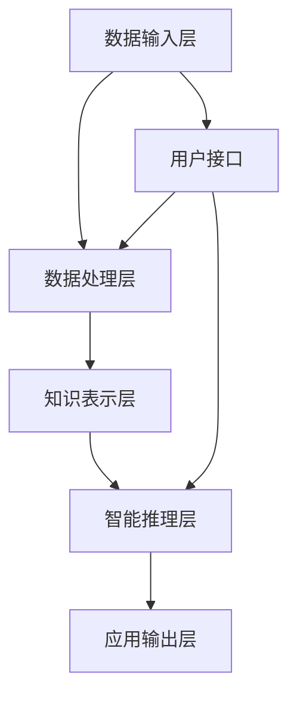

                 

# 构建 AI 驱动的智慧医疗提示词系统

## 关键词
- AI驱动的智慧医疗
- 提示词系统
- 自然语言处理
- 知识图谱
- 机器学习
- 深度学习

## 摘要
本文将深入探讨构建AI驱动的智慧医疗提示词系统的全过程。我们将从问题背景、核心概念、技术路线、系统架构设计、算法原理、实战应用等方面进行详细分析，旨在为开发者提供一份全面的技术指南，帮助实现一个高效、精准、个性化的智慧医疗提示词系统。

### 第1章: 引言

#### 1.1 问题背景

**智慧医疗的概念与重要性**

智慧医疗是利用现代信息技术、人工智能、物联网等手段提升医疗服务的效率、质量和患者体验的实践。随着医疗数据的爆炸性增长和人工智能技术的快速发展，智慧医疗已经成为医疗行业发展的新趋势。

**提示词系统在智慧医疗中的应用**

提示词系统是一种基于自然语言处理技术的智能交互系统，在医疗领域有广泛的应用前景：

- **医疗咨询与问答**：通过分析患者的症状和病史，提供专业的医疗建议。
- **疾病诊断辅助**：结合医学知识和患者数据，辅助医生进行疾病诊断。
- **治疗方案推荐**：根据患者病情和临床指南，为医生提供个性化的治疗方案。
- **医疗知识普及**：向患者普及医疗知识，提高患者的健康意识。

#### 1.2 问题描述

**构建提示词系统的挑战**

- **数据多样性**：医疗数据包含文本、图像、语音等多种类型，如何对这些数据进行有效整合和处理，是一个重要问题。
- **数据质量**：医疗数据存在缺失、噪声和错误，这对提示词系统的准确性有较大影响。
- **隐私保护**：在处理医疗数据时，如何保护患者的隐私是一个重要的伦理问题。

**提示词系统的核心需求**

- **高准确性**：提示词系统需要能够准确理解患者的问题，提供专业的医疗建议。
- **实时性**：提示词系统需要能够快速响应，提供实时的医疗服务。
- **个性化**：提示词系统需要根据患者的病史和病情，提供个性化的医疗服务。

#### 1.3 问题解决

**技术路线**

构建AI驱动的智慧医疗提示词系统，可以采用以下技术路线：

- **数据预处理**：对医疗数据进行清洗、去噪和整合，提高数据质量。
- **自然语言处理**：利用自然语言处理技术，理解患者的问题，提取关键信息。
- **知识图谱构建**：构建医疗知识图谱，为提示词系统提供专业知识支持。
- **机器学习与深度学习**：利用机器学习与深度学习技术，对医疗数据进行训练和预测。

**核心技术**

- **自然语言处理（NLP）**：实现文本的预处理、分词、词性标注、实体识别等。
- **知识图谱（KG）**：构建医疗知识图谱，实现知识的抽取、存储和查询。
- **机器学习（ML）与深度学习（DL）**：实现数据的训练和预测，提高提示词系统的准确性。

#### 1.4 边界与外延

**系统边界**

- **数据来源**：系统仅处理公开的医疗数据，不涉及患者隐私数据。
- **应用范围**：系统主要应用于常见疾病的诊断和治疗方案推荐，不涉及复杂疾病的诊断和治疗。

**系统外延**

- **扩展功能**：未来可以考虑添加更多功能，如患者健康监测、预防医学等。
- **跨领域应用**：可以探索将AI驱动的智慧医疗提示词系统应用于其他领域，如教育、金融等。

#### 1.5 概念结构与核心要素组成

**概念结构**

智慧医疗提示词系统的概念结构包括：

- **数据层**：包括医疗数据、公开数据和外部数据。
- **算法层**：包括自然语言处理、知识图谱构建、机器学习和深度学习算法。
- **应用层**：包括医疗咨询、疾病诊断、治疗方案推荐等应用。

**核心要素组成**

智慧医疗提示词系统的核心要素包括：

- **数据预处理工具**：如数据清洗、去噪、整合工具。
- **自然语言处理库**：如NLTK、spaCy等。
- **知识图谱工具**：如Neo4j、Elastic KG等。
- **机器学习与深度学习框架**：如TensorFlow、PyTorch等。
- **应用接口**：如API接口、Web界面等。

#### 1.6 本章小结

本章主要介绍了构建AI驱动的智慧医疗提示词系统的背景、问题描述、问题解决、边界与外延、概念结构与核心要素组成等内容。在后续章节中，将详细探讨数据预处理、自然语言处理、知识图谱构建、机器学习与深度学习等方面的技术，以及如何实现一个完整的智慧医疗提示词系统。

### 第2章: AI驱动的智慧医疗提示词系统设计

#### 2.1 系统架构设计

**2.1.1 系统架构概述**

AI驱动的智慧医疗提示词系统的架构设计需要综合考虑数据处理、知识表示、智能推理等环节，确保系统能够高效、准确地处理医疗问题。系统架构可以分为以下几个层次：

1. **数据输入层**：负责接收用户输入的医疗问题和相关数据。
2. **数据处理层**：包括数据预处理、自然语言处理、知识图谱构建等模块。
3. **知识表示层**：使用知识图谱表示医疗知识，实现知识的抽取、存储和查询。
4. **智能推理层**：利用机器学习和深度学习算法，对医疗问题进行推理和预测。
5. **应用输出层**：将推理结果转化为医疗建议、诊断结果或治疗方案等，提供给用户。

**2.1.2 系统架构图**

以下是一个简化的系统架构图，展示了各层次之间的交互关系：

#### 2.2 数据输入层设计

**2.2.1 用户接口设计**

用户接口是用户与系统交互的入口，设计一个直观、易用的用户接口对于提高用户体验至关重要。用户接口可以采用以下几种形式：

- **命令行界面（CLI）**：适合技术型用户，提供简单的文本输入和输出。
- **图形用户界面（GUI）**：提供直观的图形界面，方便非技术用户使用。
- **Web界面**：通过浏览器进行访问，适合跨平台使用。

**2.2.2 数据来源**

智慧医疗提示词系统的数据来源主要包括：

- **公开医疗数据集**：如疾病症状、治疗方法、临床指南等。
- **用户输入数据**：如症状描述、病史记录、体检数据等。
- **外部数据源**：如医学期刊、书籍、专业网站等。

#### 2.3 数据处理层设计

**2.3.1 数据预处理**

数据预处理是数据处理层的关键环节，包括以下步骤：

- **数据清洗**：去除重复数据、填补缺失值、去除噪声数据。
- **数据整合**：将不同来源的数据进行整合，形成统一的视图。
- **数据标准化**：对数据进行格式统一和处理，以便后续处理。

**2.3.2 自然语言处理**

自然语言处理（NLP）是数据处理层的重要组成部分，主要任务包括：

- **文本预处理**：包括分词、去停用词、词性标注等。
- **实体识别**：识别文本中的医学实体，如疾病、症状、药物等。
- **关系抽取**：提取文本中的实体关系，如“症状-疾病”关系。
- **语义理解**：理解文本的语义，为后续推理提供支持。

**2.3.3 知识图谱构建**

知识图谱构建是将医疗领域知识以结构化形式表示的过程，包括以下步骤：

- **知识抽取**：从文本数据中抽取医疗知识，如疾病症状、治疗方法等。
- **知识表示**：使用图结构表示知识，实现知识的抽取、存储和查询。
- **知识融合**：将不同来源的知识进行融合，提高知识的完整性。

#### 2.4 知识表示层设计

**2.4.1 知识图谱模型**

知识图谱模型是知识表示层的基础，可以使用以下几种模型：

- **基于实体-关系的模型**：如RDF（Resource Description Framework）。
- **基于图的模型**：如Neo4j。
- **基于图谱的模型**：如Elastic KG。

**2.4.2 知识抽取**

知识抽取是知识表示层的关键技术，包括以下步骤：

- **实体识别**：识别文本中的医学实体。
- **关系抽取**：提取文本中的实体关系。
- **属性抽取**：提取医学实体的属性信息。

#### 2.5 智能推理层设计

**2.5.1 机器学习算法**

智能推理层可以利用机器学习算法进行推理和预测，常用的算法包括：

- **分类算法**：如逻辑回归、决策树、随机森林等。
- **回归算法**：如线性回归、岭回归等。
- **聚类算法**：如K-means、层次聚类等。

**2.5.2 深度学习算法**

深度学习算法在智能推理层具有广泛的应用，常用的算法包括：

- **卷积神经网络（CNN）**：适用于图像处理。
- **循环神经网络（RNN）**：适用于序列数据处理。
- **Transformer模型**：适用于自然语言处理。

#### 2.6 应用输出层设计

**2.6.1 医疗建议生成**

应用输出层的主要任务是根据推理结果生成医疗建议，包括以下步骤：

- **疾病诊断**：根据患者的症状和病史，诊断出可能的疾病。
- **治疗方案推荐**：根据患者的病情和临床指南，推荐合适的治疗方案。
- **健康评估**：根据患者的体检数据，评估其健康状况。

**2.6.2 用户反馈**

用户反馈是优化系统的重要途径，包括以下步骤：

- **反馈收集**：收集用户的反馈意见。
- **反馈分析**：分析用户的反馈，找出系统的不足之处。
- **系统优化**：根据用户反馈，优化系统的性能和用户体验。

#### 2.7 本章小结

本章详细介绍了AI驱动的智慧医疗提示词系统的架构设计，包括数据输入层、数据处理层、知识表示层、智能推理层和应用输出层。通过本章的内容，读者可以了解系统设计的基本原理和方法，为后续章节的深入探讨奠定基础。在下一章中，我们将进一步探讨数据预处理、自然语言处理、知识图谱构建、机器学习与深度学习等关键技术。

