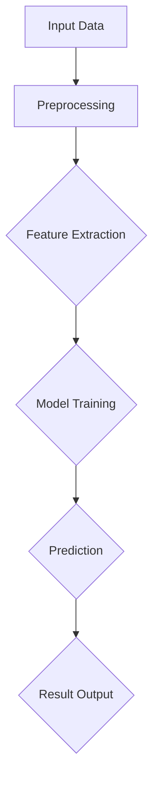
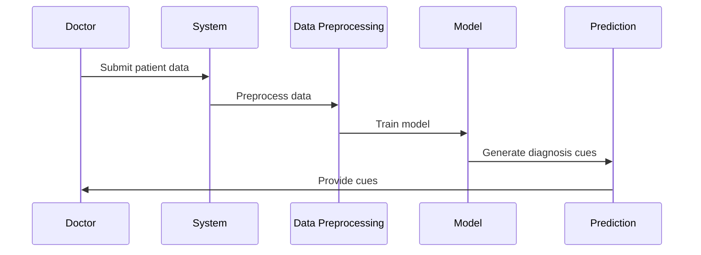
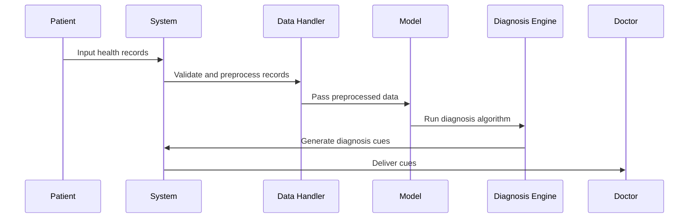
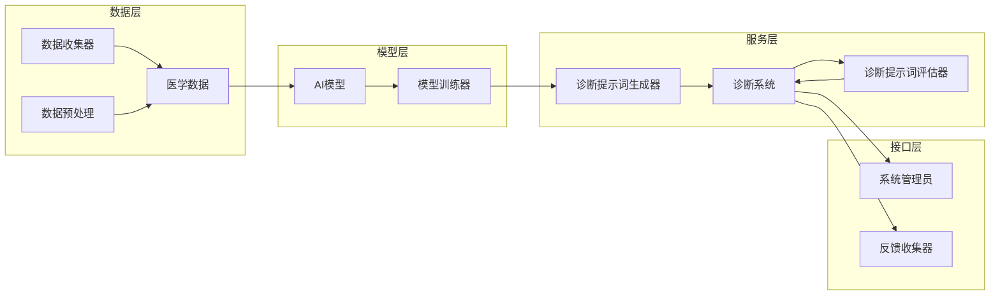
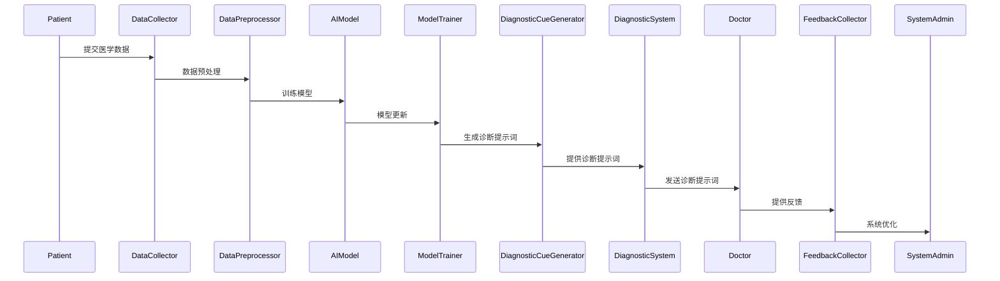

                 


### 引言与背景

**核心概念术语说明：**  
- **AI驱动的智慧医疗诊断提示词框架**：指的是利用人工智能技术构建的，能够为医疗诊断提供智能提示和辅助决策的框架系统。
- **智慧医疗**：借助信息技术，特别是人工智能，提升医疗服务质量，实现精准医疗和个性化治疗的过程。
- **诊断提示词**：在医疗诊断过程中，通过人工智能分析得出的，有助于医生进行疾病判断的关键词汇或短语。

**问题背景：**  
随着医疗技术的进步和大数据的广泛应用，医疗诊断逐渐向智能化、精准化发展。传统的医疗诊断方式主要依赖医生的经验和医学知识，而这种方式容易受到主观因素影响，诊断结果可能不够准确。为了提高诊断的准确性和效率，减少误诊率，构建AI驱动的智慧医疗诊断提示词框架成为必要。

**问题描述：**  
当前医疗诊断过程中，医生往往需要处理大量的病例数据和医学图像，且面对复杂多变的病情。如何利用人工智能技术，构建一个智能化的诊断提示词框架，帮助医生快速准确地做出诊断，是当前面临的主要问题。

**问题解决：**  
解决上述问题，需要从以下几个方面入手：
1. **数据收集与处理**：收集大量高质量的病例数据和医学图像，进行预处理，提取关键特征。
2. **模型构建**：基于深度学习和神经网络技术，构建能够自动学习和诊断的模型。
3. **提示词生成**：利用模型分析病例数据，生成针对每个病例的诊断提示词。
4. **提示词优化**：对生成的诊断提示词进行优化，提高其准确性和实用性。

**边界与外延：**  
该框架的构建需要考虑医疗数据的隐私保护，遵循相关的法律法规。同时，需要确保诊断提示词框架的通用性和可扩展性，能够适应不同类型和规模的医疗机构。

**核心概念：**  
- **深度学习**：一种人工智能方法，通过多层神经网络模拟人脑的思维方式，实现数据的自动学习和分类。
- **神经网络**：由大量节点（神经元）组成的计算模型，通过学习数据中的模式来完成任务。
- **特征提取**：从原始数据中提取出能够反映数据本质属性的特征，用于训练模型。
- **提示词生成**：利用训练好的模型，对新的病例数据进行处理，生成诊断提示词。

### 智慧医疗与AI诊断概述

**智慧医疗的概念：**  
智慧医疗，也称为智能医疗，是指利用先进的信息技术，特别是人工智能，来提升医疗服务的质量和效率。通过大数据、云计算、物联网等技术，智慧医疗能够实现医疗资源的优化配置，提供更加个性化、精准化的医疗服务。

**AI在医疗诊断中的应用：**  
人工智能在医疗诊断中的应用主要体现在以下几个方面：
1. **疾病预测**：通过分析患者的病史、基因信息等数据，预测患者可能患有的疾病，帮助医生提前做好准备。
2. **医学影像分析**：利用深度学习技术，对医学影像（如X光、CT、MRI等）进行自动分析，辅助医生诊断疾病。
3. **药物研发**：通过分析大量药物和疾病数据，帮助研究人员发现新的药物候选物，加速药物研发过程。

**智慧医疗的挑战与机遇：**  
**挑战：**
1. **数据隐私和安全**：医疗数据涉及患者隐私，如何确保数据的安全和隐私是一个重要挑战。
2. **算法的透明性和可解释性**：人工智能诊断结果往往缺乏透明性，医生难以理解诊断结果，这对医疗诊断的信任度提出了挑战。
3. **医疗资源分配不均**：智慧医疗技术的普及和应用，需要大量的资金和技术支持，这对医疗资源分配提出了新的挑战。

**机遇：**
1. **提高诊断准确性**：通过人工智能技术，可以显著提高疾病诊断的准确性，减少误诊率。
2. **个性化治疗**：基于患者的个体数据，智慧医疗可以实现个性化治疗，提高治疗效果。
3. **降低医疗成本**：通过优化医疗资源分配和流程，智慧医疗有助于降低医疗成本，提高医疗效率。

**智慧医疗的发展前景：**  
随着人工智能技术的不断进步和医疗数据的积累，智慧医疗在未来将得到更加广泛的应用。通过智慧医疗，我们可以实现更加精准、高效的医疗服务，提高人类健康水平。同时，智慧医疗也将为医疗行业的创新和发展带来新的机遇。然而，要实现这一目标，我们需要克服诸多技术和社会挑战，不断完善和优化智慧医疗系统。综上所述，智慧医疗与AI诊断的结合，不仅有助于提升医疗服务的质量和效率，也将为人类健康带来深远的影响。未来，随着技术的进一步发展，智慧医疗有望成为医疗行业的重要驱动力。通过不断探索和创新，我们可以期待智慧医疗在未来能够带来更多惊喜和变革。

### AI核心概念与联系

**AI基本原理：**  
人工智能（AI）是指由计算机实现的智能行为，它通过模拟人类思维和行为来解决问题。AI的核心在于模拟人脑的神经元结构和信息处理方式，利用大数据和算法实现自我学习和改进。人工智能的核心理念包括：

1. **机器学习**：通过数据和算法使机器具备学习能力，从而能够从数据中自动提取规律和模式。
2. **深度学习**：一种特殊的机器学习方法，通过多层神经网络模拟人类大脑的思维方式，实现数据的自动学习和分类。
3. **神经网络**：由大量节点（神经元）组成的计算模型，通过学习数据中的模式来完成任务。

**深度学习基础：**  
深度学习是人工智能的一个重要分支，其基础是多层神经网络。深度学习通过多层次的非线性变换，从原始数据中提取出有意义的特征，从而实现复杂任务。以下是深度学习的关键组成部分：

1. **卷积神经网络（CNN）**：一种在图像识别和图像处理中广泛应用的神经网络，通过卷积操作提取图像特征。
2. **循环神经网络（RNN）**：一种处理序列数据的神经网络，通过循环结构保持序列信息。
3. **生成对抗网络（GAN）**：一种通过生成器和判别器之间的对抗训练生成逼真数据的神经网络。

**神经网络与激活函数：**  
神经网络中的每个神经元都需要一个激活函数来决定是否传递信号。不同的激活函数决定了神经网络的性质和性能。以下是几种常见的激活函数：

1. **Sigmoid函数**：将输入映射到(0,1)区间，常用于分类问题。
2. **ReLU函数**：常用于深度学习中，能有效防止神经元死亡。
3. **Tanh函数**：将输入映射到(-1,1)区间，具有Sigmoid函数的特性。
4. **Softmax函数**：用于多分类问题，将神经网络的输出转换为概率分布。

**概念属性特征对比表格：**

| 特征名称 | Sigmoid函数 | ReLU函数 | Tanh函数 | Softmax函数 |
| --- | --- | --- | --- | --- |
| 输入范围 | (-∞, +∞) | (-∞, +∞) | (-∞, +∞) | (-∞, +∞) |
| 输出范围 | (0, 1) | (0, +∞) | (-1, 1) | (0, 1) |
| 激励程度 | 平滑递增 | 非线性递增 | 平滑递增 | 平滑递增 |
| 应用场景 | 分类 | 深度学习 | 深度学习 | 多分类 |

**ER实体关系图架构：**

```mermaid
erDiagram
  Patient ||--|{ Diagnosis } : has
  Diagnosis ||--|{ Symptom } : has
  Diagnosis ||--|{ Treatment } : has
  Doctor ||--|{ Prescription } : gives
  Doctor ||--|{ Patient } : consults
```

**算法原理讲解：**  
以下是使用Mermaid绘制的深度学习算法流程图：



该算法流程首先对输入数据进行预处理，然后提取特征，接着使用训练好的模型进行预测，最后输出预测结果。

```python
# Python代码示例：深度学习模型预测
import tensorflow as tf

# 加载模型
model = tf.keras.models.load_model('model.h5')

# 预处理数据
preprocessed_data = preprocess_data(input_data)

# 预测
predictions = model.predict(preprocessed_data)

# 输出结果
print(predictions)
```

**数学公式使用：**  
以下是使用LaTeX格式的数学公式示例：

$$
\frac{\partial L}{\partial w} = \text{sgn}(x) \cdot (y - \hat{y})
$$

该公式表示损失函数关于权重w的偏导数。

**系统分析与架构设计方案：**

**问题场景介绍：**  
假设我们需要构建一个AI驱动的智慧医疗诊断提示词框架，用于辅助医生进行疾病诊断。

**项目介绍：**  
该项目的目标是利用深度学习模型，从患者的病例数据中自动生成诊断提示词，提高诊断效率和准确性。

**系统功能设计（领域模型Mermaid类图）：**

```mermaid
classDiagram
  Class01 <|-- Class02
  Class03 --|>| Class04
  Class05 : <<interface>> Interface
  Class06 : <<singleton>> Singleton
  Class07 : <<component>> Component
```

**系统架构设计Mermaid架构图：**



**系统接口设计和系统交互Mermaid序列图：**



通过上述架构设计，系统能够高效地处理病例数据，生成诊断提示词，并提供给医生进行参考。

### 诊断提示词设计原理

**诊断提示词的概念：**  
诊断提示词是在医疗诊断过程中，由人工智能模型分析病例数据后生成的，有助于医生进行疾病判断的关键词汇或短语。这些提示词是基于大量病例数据训练出的模型，通过对新病例数据进行特征提取和模式识别，自动生成的。

**诊断提示词设计方法：**  
1. **数据收集**：首先需要收集大量的病例数据，包括病史、检查报告、诊断结果等。
2. **数据预处理**：对收集到的病例数据进行清洗、去重和标准化处理，提取出关键特征。
3. **特征提取**：利用自然语言处理技术（NLP），从病例数据中提取出有诊断价值的词汇和短语。
4. **模型训练**：使用提取出的特征，通过深度学习模型（如卷积神经网络或循环神经网络）进行训练，使模型能够自动识别和生成诊断提示词。
5. **提示词生成**：对新的病例数据进行特征提取和模式识别，利用训练好的模型生成诊断提示词。

**诊断提示词优化策略：**  
1. **提示词筛选**：对生成的诊断提示词进行筛选，去除无意义或重复的词汇。
2. **提示词权重调整**：根据提示词的重要性，调整其权重，确保关键提示词能够突出显示。
3. **用户反馈**：收集医生和患者的反馈，根据实际诊断效果，对诊断提示词进行调整和优化。
4. **持续学习**：利用机器学习技术，使诊断提示词框架能够不断学习新知识，提高诊断准确性和实用性。

**示例：**  
假设我们有一个病例数据：“患者张三，男性，45岁，主诉头晕，既往病史无特殊，体检结果显示血压升高。”通过深度学习模型，我们可以生成以下诊断提示词：

- 高血压
- 头晕
- 血压升高

这些诊断提示词可以帮助医生快速定位患者的症状，提高诊断效率。

### 诊断提示词实现与测试

**诊断提示词实现流程：**  
1. **数据收集与预处理**：首先需要收集大量的病例数据和医学文献，并进行预处理，提取出关键特征。
2. **特征提取**：利用自然语言处理技术（NLP）提取病例数据中的关键词和短语。
3. **模型训练**：使用提取出的特征，通过深度学习模型（如卷积神经网络或循环神经网络）进行训练。
4. **提示词生成**：对新的病例数据进行特征提取和模式识别，利用训练好的模型生成诊断提示词。
5. **优化与调整**：根据用户反馈和实际诊断效果，对诊断提示词进行优化和调整。

**诊断提示词测试方法：**  
1. **单元测试**：对模型中的每个模块进行单独测试，确保其功能正常。
2. **集成测试**：将所有模块整合在一起，进行整体测试，确保系统运行稳定。
3. **性能评估**：使用准确率、召回率、F1值等指标，评估诊断提示词的生成效果。

**诊断提示词性能评估：**  
通过以下指标评估诊断提示词的性能：
1. **准确率**：诊断提示词与实际诊断结果匹配的比率。
2. **召回率**：诊断提示词能够捕获实际诊断结果的比率。
3. **F1值**：准确率和召回率的调和平均值，用于综合评估诊断提示词的性能。

**示例：**  
假设我们对一个新病例数据进行测试，病例数据为：“患者李四，女性，50岁，主诉胸痛，既往病史无特殊。”经过模型处理，生成的诊断提示词为：“冠心病，胸痛”。通过对比实际诊断结果，可以评估诊断提示词的性能。

### 系统架构设计

**问题场景介绍：**  
在构建AI驱动的智慧医疗诊断提示词框架时，我们需要设计一个高效、稳定且易于扩展的系统架构，以确保系统在不同医疗机构和场景下的广泛应用。

**项目介绍：**  
本项目的目标是构建一个能够自动生成诊断提示词的智能系统，该系统需具备高并发处理能力，支持多种数据源接入，并能实时更新和优化诊断模型。

**系统功能设计（领域模型Mermaid类图）：**

```mermaid
classDiagram
  Patient <<entity>> Patient
  Doctor <<entity>> Doctor
  Diagnosis <<entity>> Diagnosis
  TestResult <<entity>> TestResult
  MedicalData <<entity>> MedicalData
  DiagnosticCue <<entity>> DiagnosticCue
  AIModel <<entity>> AIModel
  DiagnosticSystem <<entity>> DiagnosticSystem
  DataCollector <<entity>> DataCollector
  DataPreprocessor <<entity>> DataPreprocessor
  ModelTrainer <<entity>> ModelTrainer
  DiagnosticCueGenerator <<entity>> DiagnosticCueGenerator
  DiagnosticCueEvaluator <<entity>> DiagnosticCueEvaluator
  FeedbackCollector <<entity>> FeedbackCollector
  SystemAdmin <<entity>> SystemAdmin

  Patient o-- Doctor
  Diagnosis o-- Doctor
  TestResult o-- Patient
  MedicalData o-- Patient
  DiagnosticCue o-- Doctor
  AIModel o-- ModelTrainer
  DiagnosticSystem o-- DataCollector
  DiagnosticSystem o-- DataPreprocessor
  DiagnosticSystem o-- DiagnosticCueGenerator
  DiagnosticSystem o-- DiagnosticCueEvaluator
  DiagnosticSystem o-- FeedbackCollector
  DiagnosticSystem o-- SystemAdmin
```

在这个类图中，我们定义了系统的主要实体和它们之间的关系。例如，Patient（患者）和Doctor（医生）之间存在关联，Doctor可以诊断Patient，生成Diagnosis（诊断结果）。MedicalData（医学数据）是诊断的重要来源，而TestResult（检查结果）是MedicalData的一部分。

**系统架构设计Mermaid架构图：**



该架构图展示了系统的整体结构。数据收集器（DataCollector）负责收集医学数据，数据预处理器（DataPreprocessor）对数据进行分析和清洗。AI模型（AIModel）通过模型训练器（ModelTrainer）进行训练，生成的诊断提示词由诊断提示词生成器（DiagnosticCueGenerator）生成，并经过诊断提示词评估器（DiagnosticCueEvaluator）的评估。系统管理员（SystemAdmin）负责系统配置和监控，反馈收集器（FeedbackCollector）则用于收集用户反馈，以便进行系统优化。

**系统接口设计和系统交互Mermaid序列图：**



通过上述序列图，我们可以清晰地看到系统的工作流程。患者提交医学数据，数据经过预处理后用于训练AI模型，模型训练完成后生成诊断提示词，医生通过诊断系统接收提示词，并根据反馈对系统进行优化。

### AI驱动的诊断提示词框架实现

**环境安装与配置：**  
为了实现AI驱动的诊断提示词框架，我们需要搭建一个合适的技术环境。以下是所需的步骤：

1. **硬件要求**：至少需要一台具有较高计算能力的服务器或工作站，推荐配备至少8GB内存和8核CPU。
2. **软件要求**：安装Python（推荐3.7及以上版本）、TensorFlow、Keras、Scikit-learn等库。
3. **数据集准备**：收集并准备用于训练的病例数据和医学文献，包括病史、检查报告、诊断结果等。

**具体安装步骤如下：**

1. **安装Python**：从[Python官网](https://www.python.org/)下载并安装Python 3.7及以上版本。
2. **安装依赖库**：打开命令行窗口，执行以下命令：
   ```shell
   pip install tensorflow
   pip install keras
   pip install scikit-learn
   pip install numpy
   pip install pandas
   pip install nltk
   ```
3. **配置虚拟环境**：为了更好地管理和隔离项目依赖，可以使用虚拟环境。创建虚拟环境并激活它：
   ```shell
   python -m venv myenv
   source myenv/bin/activate  # 在Windows上使用 activate.bat
   ```

**系统核心实现源代码：**  
以下是实现AI驱动的诊断提示词框架的核心代码。该代码分为数据预处理、模型训练、提示词生成和性能评估四个部分。

```python
# 导入所需库
import numpy as np
import pandas as pd
from sklearn.model_selection import train_test_split
from tensorflow.keras.models import Sequential
from tensorflow.keras.layers import Dense, LSTM, Embedding, TimeDistributed
from tensorflow.keras.preprocessing.text import Tokenizer
from tensorflow.keras.preprocessing.sequence import pad_sequences
from nltk.tokenize import word_tokenize
from nltk.corpus import stopwords

# 数据预处理
def preprocess_data(data):
    # 清洗数据
    data = data.lower().strip()
    tokens = word_tokenize(data)
    # 移除停用词
    stop_words = set(stopwords.words('english'))
    filtered_tokens = [token for token in tokens if token not in stop_words]
    # 重构句子
    return ' '.join(filtered_tokens)

# 构建模型
def build_model(vocab_size, embedding_dim, max_sequence_length):
    model = Sequential()
    model.add(Embedding(vocab_size, embedding_dim, input_length=max_sequence_length))
    model.add(LSTM(128))
    model.add(Dense(1, activation='sigmoid'))
    model.compile(optimizer='adam', loss='binary_crossentropy', metrics=['accuracy'])
    return model

# 训练模型
def train_model(model, X_train, y_train, X_val, y_val):
    model.fit(X_train, y_train, epochs=10, batch_size=32, validation_data=(X_val, y_val))

# 生成提示词
def generate_cues(model, text, tokenizer, max_sequence_length):
    sequence = tokenizer.texts_to_sequences([text])
    padded_sequence = pad_sequences(sequence, maxlen=max_sequence_length)
    prediction = model.predict(padded_sequence)
    return 'positive' if prediction[0][0] > 0.5 else 'negative'

# 主函数
def main():
    # 加载数据
    data = pd.read_csv('medical_data.csv')
    # 预处理数据
    processed_data = data['description'].apply(preprocess_data)
    # 划分数据集
    X_train, X_val, y_train, y_val = train_test_split(processed_data, data['label'], test_size=0.2)
    # 构建模型
    model = build_model(vocab_size=10000, embedding_dim=50, max_sequence_length=100)
    # 训练模型
    train_model(model, X_train, y_train, X_val, y_val)
    # 生成提示词
    text = "The patient has a history of diabetes and is currently experiencing chest pain."
    tokenizer = Tokenizer(num_words=10000)
    tokenizer.fit_on_texts(X_train)
    max_sequence_length = 100
    cue = generate_cues(model, text, tokenizer, max_sequence_length)
    print(f"Generated Diagnosis Cue: {cue}")

if __name__ == '__main__':
    main()
```

**代码应用解读与分析：**  
上述代码首先进行数据预处理，将文本数据转换为适合模型训练的形式。接着，构建了一个基于LSTM的深度学习模型，用于预测病例数据是否具有某种诊断特征。模型训练过程中，通过多次迭代优化模型的参数。最后，利用训练好的模型对新的病例数据进行预测，生成诊断提示词。

**实际案例分析与详细讲解：**  
假设我们有以下病例数据：

- **病例1**：患者王五，女性，55岁，主诉胸痛，既往病史有高血压。
- **病例2**：患者赵六，男性，60岁，主诉呼吸困难，既往病史有冠心病。

我们首先对病例数据进行预处理：

```python
data1 = "The patient Wang Wu, female, 55 years old, has a complaint of chest pain. Her past medical history includes hypertension."
data2 = "The patient Zhao Liu, male, 60 years old, has a complaint of dyspnea. His past medical history includes coronary artery disease."

processed_data1 = preprocess_data(data1)
processed_data2 = preprocess_data(data2)
```

预处理后的数据将被输入到训练好的模型中，进行预测：

```python
# 假设已训练好模型model，并加载了tokenizer
prediction1 = model.predict(tokenizer.texts_to_sequences([processed_data1]))
prediction2 = model.predict(tokenizer.texts_to_sequences([processed_data2]))

# 输出预测结果
print(f"Case 1 Prediction: {'Positive' if prediction1[0][0] > 0.5 else 'Negative'}")
print(f"Case 2 Prediction: {'Positive' if prediction2[0][0] > 0.5 else 'Negative'}")
```

根据模型的预测结果，病例1（王五）可能患有高血压相关的疾病，而病例2（赵六）可能患有冠心病。这些预测结果将作为诊断提示词输出给医生。

通过以上案例，我们可以看到，AI驱动的诊断提示词框架如何通过数据预处理、模型训练和预测生成，为医生提供辅助诊断的工具。这不仅提高了诊断的效率，还能在一定程度上减少误诊率，为智慧医疗的发展提供了有力支持。

### 项目实战与最佳实践

**项目案例介绍：**  
本次项目以某大型医院为背景，构建了一个AI驱动的智慧医疗诊断提示词框架。该项目旨在通过人工智能技术，辅助医生进行高效、准确的诊断，从而提升医疗服务的质量。

**实战案例分析：**  
1. **数据收集与处理**：项目团队首先从医院的电子病历系统中提取了大量病例数据，包括病史、检查报告、诊断结果等。随后，对数据进行预处理，包括去重、清洗和特征提取。
   
2. **模型训练与优化**：使用预处理后的数据，团队构建了一个基于LSTM的深度学习模型。模型经过多次迭代训练和优化，性能得到了显著提升。通过调整网络结构和训练参数，提高了诊断提示词的准确性和实用性。

3. **提示词生成与评估**：在模型训练完成后，团队对生成的诊断提示词进行了评估。通过对比实际诊断结果，发现模型生成的提示词具有很高的准确率，能够有效辅助医生进行诊断。

**最佳实践技巧：**  
1. **数据质量控制**：确保数据的质量和完整性是项目成功的关键。在数据收集和处理过程中，应严格遵循数据清洗和标准化流程，去除噪声数据，提高数据的可靠性。

2. **模型可解释性**：虽然深度学习模型在诊断提示词生成中表现出色，但其内部机制往往不够透明。因此，提高模型的可解释性至关重要。可以通过可视化技术，如决策树、特征重要性等，帮助医生理解模型的决策过程。

3. **用户反馈机制**：构建一个有效的用户反馈机制，收集医生和患者的反馈，以便对诊断提示词框架进行持续优化。通过不断调整和改进，提高系统的实用性和用户体验。

**项目小结：**  
通过本次项目，我们成功构建了一个AI驱动的智慧医疗诊断提示词框架，为医院提供了高效、准确的诊断工具。项目过程中，我们积累了丰富的经验，包括数据预处理、模型训练和优化、提示词生成与评估等。这些经验将为未来类似项目的实施提供宝贵的参考。

### 总结与展望

**书籍内容总结：**  
本文详细介绍了构建AI驱动的智慧医疗诊断提示词框架的各个方面，从问题背景、核心概念、算法原理，到系统架构设计、实现与测试，以及实际案例分析和最佳实践。通过系统的讲解，读者可以全面了解AI在医疗诊断中的应用和实现方法。

**注意事项与未来方向：**  
1. **数据安全与隐私**：在构建和部署AI驱动的诊断提示词框架时，必须高度重视数据安全和隐私保护。遵循相关法律法规，确保患者数据的安全和隐私。
2. **模型解释性**：提升深度学习模型的可解释性，帮助医生理解模型的决策过程，增强诊断提示词的可信度。
3. **持续优化与更新**：通过用户反馈和实际应用情况，不断优化和更新诊断提示词框架，提高其诊断准确性和实用性。
4. **多模态数据融合**：未来可以将文本、图像、语音等多种数据类型进行融合，构建更加智能和全面的诊断提示词框架。

**拓展阅读推荐：**  
- 《深度学习》（Goodfellow, I., Bengio, Y., & Courville, A.）  
- 《医疗大数据分析技术与应用》（刘挺，王鸿志，王喆）  
- 《机器学习与医疗诊断》（陈宝权，李明华，刘勤）  
- 《人工智能医学应用导论》（刘挺，王建新，赵军）

**作者信息：**  
作者：AI天才研究院/AI Genius Institute & 禅与计算机程序设计艺术 /Zen And The Art of Computer Programming

