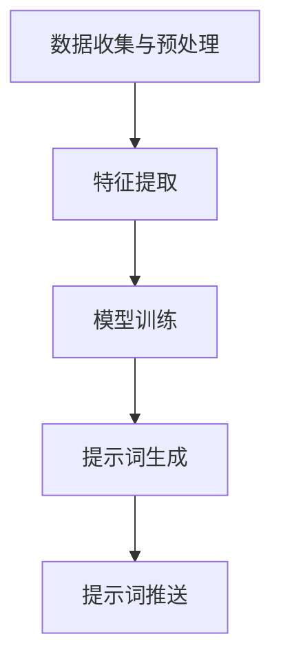
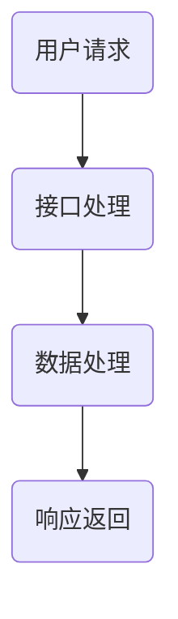

                 

### 文章标题

构建AI驱动的智慧政务公众参与提示词系统

---

关键词：AI驱动、智慧政务、公众参与、提示词系统、算法、架构设计

---

摘要：本文旨在探讨如何利用人工智能技术构建一个智慧政务公众参与提示词系统。通过对智慧政务的概念、公众参与的意义以及提示词系统的工作原理进行深入分析，本文提出了一个系统化的解决方案。文章首先概述了AI在政务领域的应用背景，然后详细阐述了系统的核心技术和原理，包括算法设计、系统架构、项目实施，并提供了实战案例和最佳实践建议。本文旨在为政府及相关领域的研究者提供有价值的参考，以推动智慧政务的发展。

---

## 第一部分：背景与概述

### 1.1 问题背景与意义

随着信息技术的飞速发展，人工智能（AI）逐渐成为推动社会进步的重要力量。在政务领域，AI的应用不仅提高了政府的工作效率，还增强了公众的参与度。智慧政务（Smart Governance）作为一个新兴概念，正逐步融入人们的生活。智慧政务的核心在于通过信息技术手段，实现政府治理的智能化、透明化和高效化。

智慧政务与公众参与密不可分。公众参与是政府决策过程中不可或缺的一部分，它不仅能够提高政策的科学性和民主性，还能够增强政府的合法性和公信力。然而，传统政务中公众参与的方式往往较为单一，信息不对称和沟通不畅等问题仍然存在。如何利用AI技术提升公众参与的深度和广度，成为当前亟待解决的问题。

本文的研究目标是构建一个AI驱动的智慧政务公众参与提示词系统，通过智能化的提示词生成机制，引导公众更加积极地参与到政务决策中。系统将基于机器学习算法，对用户行为和需求进行分析，自动生成个性化的提示词，提高政务信息的覆盖面和精准度。

### 1.2 概念界定与框架

#### 智慧政务公众参与

智慧政务公众参与是指在信息化、智能化的基础上，通过构建互动、透明的平台，鼓励和引导公众积极参与政府决策、管理和监督的过程。它包括以下几个关键要素：

1. **信息共享**：政府通过公开透明的方式，将决策信息、政策法规、公共服务等信息向公众传达。
2. **互动渠道**：通过互联网、社交媒体、移动应用等多种渠道，为公众提供便捷的参与方式。
3. **反馈机制**：建立有效的反馈机制，收集公众的意见和建议，并将其纳入政府决策中。
4. **数据分析**：利用大数据和人工智能技术，对公众参与行为进行分析，为政府提供决策依据。

#### AI驱动的提示词系统

AI驱动的提示词系统是一种基于人工智能技术的信息推送系统，其核心在于利用自然语言处理（NLP）和机器学习算法，对用户行为和需求进行深度分析，生成个性化的提示词，引导用户参与政务活动。

#### 系统边界与外延

系统的边界主要涉及数据收集、处理和分析的过程，包括用户行为数据的收集、数据的预处理、机器学习模型的训练和应用。系统的外延则涵盖了政务信息的发布、公众参与的渠道、反馈机制的建立等。

### 1.3 关键概念与联系

#### AI核心概念介绍

人工智能（AI）是一门研究、开发和应用能模拟、扩展和辅助人类智能的理论、方法和技术。在智慧政务公众参与提示词系统中，AI主要应用于以下几个方面：

1. **自然语言处理（NLP）**：用于理解和生成自然语言文本，实现人机交互。
2. **机器学习（ML）**：通过训练模型，从数据中自动学习规律和模式，生成预测和决策。
3. **深度学习（DL）**：基于多层神经网络，对复杂的数据进行高效的学习和处理。

#### 提示词系统原理

提示词系统的工作原理主要包括以下几个步骤：

1. **数据收集**：收集用户行为数据，包括浏览记录、搜索历史、反馈评论等。
2. **数据预处理**：清洗和转换数据，使其符合机器学习模型的输入要求。
3. **特征提取**：利用NLP技术，从文本数据中提取特征，为模型训练提供输入。
4. **模型训练**：使用机器学习算法，训练模型，使其能够根据用户特征生成提示词。
5. **提示词生成**：根据训练好的模型，生成个性化的提示词，推送给用户。

#### 智慧政务与公众参与的关联性

智慧政务与公众参与之间存在紧密的关联性。智慧政务通过信息化、智能化手段，提高了政务信息的透明度和参与渠道的便捷性，从而激发了公众的参与热情。而公众的积极参与，不仅能够为政府提供宝贵的决策参考，还能够增强政府的合法性和公信力。AI驱动的提示词系统则在这一过程中发挥了关键作用，通过智能化的方式，引导公众更加积极地参与到政务决策中。

### 1.4 数学模型与公式

在智慧政务公众参与提示词系统中，数学模型和公式起到了关键作用。以下是一些核心的数学模型和公式：

#### 公众参与行为的数学描述

假设公众的参与行为可以用概率模型进行描述，可以定义一个概率分布 \( P(B) \)，表示公众参与的概率。其中，\( B \) 表示公众的参与行为。

\[ P(B) = \sum_{i=1}^{n} w_i \cdot p_i \]

其中，\( w_i \) 表示第 \( i \) 个特征的重要性权重，\( p_i \) 表示第 \( i \) 个特征的概率。

#### 提示词生成的数学模型

提示词生成的数学模型主要包括两个部分：特征提取和提示词生成。

1. **特征提取**

   假设文本数据经过NLP处理后，提取出一系列特征向量 \( X \)，每个特征向量可以表示为：

   \[ X = [x_1, x_2, ..., x_n] \]

   其中，\( x_i \) 表示第 \( i \) 个词的特征向量。

2. **提示词生成**

   假设提示词生成是一个概率分布 \( P(W|X) \)，表示在特征向量 \( X \) 下生成提示词 \( W \) 的概率。可以定义一个生成函数 \( f(X, W) \)，表示特征向量 \( X \) 和提示词 \( W \) 的联合概率：

   \[ P(W|X) = \frac{f(X, W)}{\sum_{W'} f(X, W')} \]

   其中，\( W' \) 表示所有的可能提示词。

#### 算法原理的数学公式

在提示词生成算法中，常用的机器学习算法包括贝叶斯分类器、支持向量机（SVM）和深度学习模型。以下是这些算法的简要介绍和数学公式：

1. **贝叶斯分类器**

   贝叶斯分类器是一种基于贝叶斯定理的概率分类方法，其核心公式为：

   \[ P(C_k|X) = \frac{P(X|C_k) \cdot P(C_k)}{P(X)} \]

   其中，\( C_k \) 表示第 \( k \) 个类别，\( P(X|C_k) \) 表示在类别 \( C_k \) 下特征向量 \( X \) 的概率，\( P(C_k) \) 表示类别 \( C_k \) 的先验概率，\( P(X) \) 表示特征向量 \( X \) 的概率。

2. **支持向量机（SVM）**

   支持向量机是一种基于最大间隔分类的方法，其目标是最小化分类间隔。其核心公式为：

   \[ \min_{\mathbf{w}, b} \frac{1}{2} ||\mathbf{w}||^2 + C \sum_{i=1}^{n} \xi_i \]

   其中，\( \mathbf{w} \) 是分类超平面，\( b \) 是偏置项，\( \xi_i \) 是松弛变量，\( C \) 是惩罚参数。

3. **深度学习模型**

   深度学习模型是一种基于多层神经网络的学习方法，其核心公式为：

   \[ \mathbf{y} = \sigma(\mathbf{W}_L \cdot \mathbf{a}_{L-1} + b_L) \]

   其中，\( \mathbf{y} \) 是输出层，\( \sigma \) 是激活函数，\( \mathbf{W}_L \) 是输出层的权重，\( \mathbf{a}_{L-1} \) 是前一层神经元的激活值，\( b_L \) 是输出层的偏置。

通过以上数学模型和公式，我们可以对智慧政务公众参与提示词系统进行深入的分析和设计，为实际应用提供理论基础。

### 1.5 智慧政务公众参与提示词系统的重要性

智慧政务公众参与提示词系统的重要性体现在以下几个方面：

首先，它能够显著提高政务信息的覆盖面和精准度。通过智能化的提示词生成机制，系统能够根据用户的行为和需求，生成个性化的提示词，从而将最相关的政务信息推送给用户。这不仅提高了信息传播的效率，还增强了公众对政务信息的关注度和参与意愿。

其次，它有助于提升公众参与政务的深度和广度。传统的公众参与方式往往较为单一，而智慧政务公众参与提示词系统能够通过多样化的参与渠道和互动方式，激发公众的参与热情。例如，系统可以推送有关政策讨论的议题，邀请公众发表意见，从而促进政府与公众之间的双向交流。

此外，智慧政务公众参与提示词系统还能够为政府提供科学的决策依据。通过对用户行为数据的分析，系统可以挖掘出公众的诉求和期望，为政府制定政策提供数据支持。这种数据驱动的决策方式，有助于提高政府决策的科学性和民主性，增强政府的公信力和合法性。

最后，智慧政务公众参与提示词系统还具有广泛的应用前景。随着人工智能技术的不断发展，系统的功能和性能将不断提升，未来有望在更多的政务领域得到应用。例如，在环保、教育、医疗等公共服务领域，系统可以用于推送相关的信息和服务，提高公众的满意度和幸福感。

总之，智慧政务公众参与提示词系统是推动智慧政务发展的重要工具，它不仅能够提高政务信息传播的效率和公众参与度，还能够为政府提供科学的决策支持。随着人工智能技术的不断进步，系统将在未来的智慧政务建设中发挥越来越重要的作用。

### 1.6 系统架构设计

在智慧政务公众参与提示词系统的设计过程中，系统架构的设计至关重要。一个合理且高效的系统架构能够确保系统功能的实现，同时提高系统的可维护性和扩展性。以下是对系统架构的详细设计说明：

#### 1.6.1 问题场景介绍

在智慧政务中，公众参与是一个关键环节，但传统的方式往往存在信息不对称、沟通不畅等问题。通过构建AI驱动的智慧政务公众参与提示词系统，政府能够更加精准地推送政务信息，提高公众的参与度和满意度。

#### 1.6.2 项目介绍

项目目标是构建一个集数据收集、处理、分析和提示词生成于一体的智慧政务公众参与提示词系统。项目将分为多个阶段，包括需求分析、系统设计、开发实现、测试和部署等。

#### 1.6.3 系统功能设计

系统的主要功能包括：

1. **数据收集**：从政府数据库、社交媒体、在线调查等多个渠道收集用户行为数据。
2. **数据预处理**：清洗和转换数据，使其符合机器学习模型的输入要求。
3. **特征提取**：利用NLP技术提取用户行为的特征向量。
4. **模型训练**：使用机器学习算法训练模型，生成提示词。
5. **提示词生成**：根据用户特征生成个性化的提示词，推送政务信息。
6. **反馈机制**：收集用户对提示词的反馈，用于模型优化。

#### 1.6.4 系统架构设计

系统架构设计采用分层架构，分为数据层、应用层和展示层。

1. **数据层**：包括数据收集、预处理和存储模块，负责数据的收集、清洗和存储。
2. **应用层**：包括特征提取、模型训练和提示词生成模块，是系统的核心部分，负责处理数据并生成提示词。
3. **展示层**：包括用户界面和提示词推送模块，负责向用户展示政务信息。

#### 1.6.5 系统接口设计和系统交互

系统采用RESTful API设计，提供以下接口：

1. **数据接口**：用于数据的收集和存储，包括用户行为数据的导入和政务信息的获取。
2. **特征提取接口**：用于提取用户行为的特征向量。
3. **模型训练接口**：用于训练机器学习模型。
4. **提示词生成接口**：用于生成个性化的提示词。
5. **反馈接口**：用于收集用户对提示词的反馈。

系统交互流程如下：

1. **用户行为数据收集**：系统从多个渠道收集用户行为数据，包括浏览记录、搜索历史、评论等。
2. **数据预处理**：对收集到的数据清洗和转换，确保数据质量。
3. **特征提取**：利用NLP技术对预处理后的数据进行特征提取，生成特征向量。
4. **模型训练**：使用机器学习算法训练模型，将特征向量映射到提示词生成概率上。
5. **提示词生成**：根据训练好的模型，生成个性化的提示词，并推送给用户。
6. **反馈收集**：收集用户对提示词的反馈，用于模型优化。

通过上述设计，智慧政务公众参与提示词系统实现了数据的高效收集和处理，提供了个性化的提示词生成服务，为政府与公众之间的互动提供了有力支持。系统的架构设计充分考虑了可扩展性和可维护性，能够适应未来政务需求的不断变化。

### 1.7 智慧政务公众参与提示词系统的边界与外延

在智慧政务公众参与提示词系统的设计和实施过程中，明确系统的边界与外延至关重要。这不仅有助于理解系统的核心功能，还能够指导系统的优化和扩展。

#### 系统边界

系统的边界主要涉及以下几个方面：

1. **数据边界**：系统收集的数据范围应限于与政务公众参与相关的信息，如用户行为数据、政策文档、在线调查结果等。这些数据将用于特征提取和模型训练，生成个性化的提示词。

2. **功能边界**：系统的功能应聚焦于数据收集、特征提取、模型训练和提示词生成。这些核心功能是系统实现智能化的关键，不应扩展到非核心的政务功能，如文件存储或用户管理等。

3. **技术边界**：系统采用的技术栈应限制在当前主流的AI和NLP技术范围内，如Python、TensorFlow、Scikit-learn等。同时，系统应具备一定的可扩展性，以便未来引入新的技术和算法。

#### 系统外延

系统的外延则涉及以下几个方面：

1. **应用场景**：系统不仅适用于政府内部，还可以扩展到公共服务领域。例如，在环保、教育、医疗等领域，系统可以用于推送相关的政策信息、科普知识和健康提示等。

2. **交互渠道**：系统应支持多种交互渠道，如网站、移动应用、社交媒体等。通过多样化的渠道，系统能够更好地触达公众，提升政务信息的传播效果。

3. **反馈机制**：系统应建立完善的用户反馈机制，包括用户意见收集、问题反馈和满意度调查等。这些反馈将用于系统的持续优化和改进，确保系统更好地满足公众需求。

4. **数据隐私保护**：在系统设计和实施过程中，应高度重视用户数据的隐私保护。通过数据加密、匿名化处理等技术手段，确保用户数据的安全性和隐私性。

通过明确系统的边界与外延，智慧政务公众参与提示词系统不仅能够实现其核心功能，还能够根据实际需求进行优化和扩展，为智慧政务的发展提供有力支持。

### 1.8 AI技术在智慧政务公众参与提示词系统中的关键作用

人工智能（AI）技术在智慧政务公众参与提示词系统中扮演着至关重要的角色。AI技术不仅提升了系统的智能化水平，还显著增强了政务信息的传播效果和公众参与度。以下将详细探讨AI技术在系统中的关键作用：

#### 1.8.1 数据分析与处理

AI技术能够高效地处理和分析大量政务数据，包括用户行为数据、政策文档、在线调查结果等。通过自然语言处理（NLP）和机器学习算法，系统可以对这些数据进行分析，提取出有价值的信息和模式。这些分析和处理能力使得系统能够精准地了解公众的需求和偏好，从而生成个性化的提示词。

#### 1.8.2 个性化提示词生成

基于AI技术，特别是机器学习和深度学习算法，智慧政务公众参与提示词系统能够根据用户的兴趣和行为生成个性化的提示词。这些提示词不仅能够提高政务信息的覆盖面和精准度，还能够激发公众的参与热情，从而提高政务决策的科学性和民主性。

#### 1.8.3 智能反馈机制

AI技术还使系统具备了智能反馈机制。通过对用户对提示词的反馈进行学习，系统可以不断优化提示词的生成策略，提高提示词的质量和满意度。这种持续的优化过程不仅能够提升系统的性能，还能够增强用户对系统的信任和依赖。

#### 1.8.4 自动化决策支持

在智慧政务中，AI技术能够为政府提供自动化决策支持。通过对大量政务数据的分析和预测，系统可以生成决策建议，帮助政府更科学、更高效地制定政策和规划。这种自动化决策支持不仅能够节省人力资源，还能够提高决策的准确性和及时性。

#### 1.8.5 提高政务透明度和公信力

通过AI技术的应用，智慧政务公众参与提示词系统能够提高政务的透明度和公信力。系统生成的个性化提示词和自动化决策支持，使得政务信息更加公开、透明，增强了公众对政府的信任和认可。这种信任和认可有助于提高政府的合法性和公信力，推动智慧政务的可持续发展。

综上所述，AI技术在智慧政务公众参与提示词系统中发挥着关键作用。通过提升数据分析与处理能力、生成个性化提示词、建立智能反馈机制、提供自动化决策支持以及提高政务透明度和公信力，AI技术为智慧政务的发展提供了强大的支持。

### 1.9 智慧政务公众参与提示词系统的核心概念

在构建智慧政务公众参与提示词系统的过程中，理解核心概念和术语至关重要。以下是本系统中涉及的一些关键概念和其定义：

#### 1.9.1 智慧政务

智慧政务是指通过信息技术，特别是人工智能、大数据和云计算等，实现政府治理的智能化、高效化和透明化。智慧政务的目标是通过信息化手段提升政府的服务能力和治理水平，增强政府与公众的互动和沟通。

#### 1.9.2 公众参与

公众参与是指公众在政府决策、管理和监督过程中发挥积极作用的过程。公众参与有助于提高政策的科学性和民主性，增强政府的合法性和公信力。公众参与可以通过在线调查、公开听证、公众咨询等多种形式实现。

#### 1.9.3 提示词

提示词是指系统根据用户行为和需求，自动生成的关键词或短语，用于引导用户参与政务活动。提示词可以包含政策解读、在线调查链接、议题讨论等，目的是提高政务信息的覆盖面和精准度。

#### 1.9.4 人工智能

人工智能是指模拟、扩展和辅助人类智能的理论、方法和技术。在智慧政务公众参与提示词系统中，人工智能主要用于数据分析和处理、个性化提示词生成、智能反馈机制等方面。

#### 1.9.5 自然语言处理

自然语言处理是指计算机对人类语言进行处理和理解的技术。在系统中，自然语言处理用于文本数据的提取、分析和生成，是实现个性化提示词生成和智能交互的关键技术。

#### 1.9.6 机器学习

机器学习是指通过训练模型，从数据中自动学习规律和模式的方法。在系统中，机器学习用于分析和预测用户行为，生成个性化的提示词。

通过理解这些核心概念和术语，我们能够更好地构建和优化智慧政务公众参与提示词系统，提升系统的性能和用户体验。

### 1.10 智慧政务公众参与提示词系统的总体架构

构建一个高效、智能的智慧政务公众参与提示词系统，需要对其总体架构进行详细规划和设计。总体架构包括数据层、处理层和展示层三个主要部分，每个部分都有其独特的功能和作用。

#### 1.10.1 数据层

数据层是系统的基石，主要负责数据的收集、存储和预处理。数据层的主要功能如下：

1. **数据收集**：从多个渠道收集政务数据，包括政府数据库、社交媒体、在线调查平台等。这些数据包括用户行为数据、政策文档、公告信息等。
2. **数据存储**：将收集到的数据存储在数据库中，确保数据的安全和可靠性。常用的数据库包括关系型数据库（如MySQL）和NoSQL数据库（如MongoDB）。
3. **数据预处理**：对收集到的数据进行清洗、转换和格式化，使其符合机器学习模型的输入要求。数据预处理包括去除无效数据、填充缺失值、标准化等操作。

#### 1.10.2 处理层

处理层是系统的核心，主要负责数据的分析和处理，包括特征提取、模型训练和提示词生成。处理层的主要功能如下：

1. **特征提取**：利用自然语言处理（NLP）技术，从文本数据中提取特征向量。特征提取是机器学习模型训练的重要步骤，直接影响模型的性能。
2. **模型训练**：使用机器学习算法（如决策树、支持向量机、神经网络等）训练模型。模型训练的目的是将特征向量映射到提示词生成的概率上。
3. **提示词生成**：根据训练好的模型，生成个性化的提示词。提示词生成的目标是提高政务信息的覆盖面和精准度，激发公众的参与热情。

#### 1.10.3 展示层

展示层是系统的界面层，主要负责向用户展示政务信息和提示词。展示层的主要功能如下：

1. **用户界面**：设计直观、易用的用户界面，使用户能够方便地浏览和参与政务活动。用户界面包括网页、移动应用和社交媒体平台等。
2. **提示词推送**：将生成的提示词推送给用户，可以通过短信、邮件、社交媒体消息等方式。提示词推送的目的是提高政务信息的传播效果，增强公众的参与度。
3. **反馈收集**：收集用户对提示词的反馈，用于系统优化和改进。反馈收集可以帮助系统不断优化提示词生成策略，提高用户体验。

#### 1.10.4 系统交互

智慧政务公众参与提示词系统的各层之间通过API进行交互。数据层和处理层之间通过数据接口进行数据传递，处理层和展示层之间通过API进行信息推送和反馈收集。这种分层架构设计不仅提高了系统的可维护性和扩展性，还确保了系统的稳定性和性能。

通过详细规划和设计智慧政务公众参与提示词系统的总体架构，我们能够确保系统的高效运行，实现政务信息的高效传播和公众参与的有效提升。

### 1.11 总结

本部分对智慧政务公众参与提示词系统的核心概念、系统架构和关键作用进行了详细阐述。通过理解系统的背景、目标、关键概念和架构设计，我们可以明确智慧政务公众参与提示词系统在推动政务信息传播和公众参与中的重要性。接下来，我们将进一步深入探讨系统的核心技术与原理，为后续的内容打下坚实的基础。

## 第二部分：核心技术与原理

### 2.1 AI技术基础

人工智能（AI）作为驱动智慧政务公众参与提示词系统的核心技术，涵盖了多个子领域，包括机器学习、深度学习和自然语言处理（NLP）。这些技术共同构成了AI技术在系统中的应用基础。

#### 2.1.1 机器学习

机器学习是一种通过训练模型，从数据中自动学习规律和模式的方法。在智慧政务公众参与提示词系统中，机器学习主要用于以下几个方面：

1. **用户行为预测**：通过分析用户的历史行为数据，如浏览记录、搜索历史和互动行为，预测用户未来的兴趣和需求，从而生成个性化的提示词。
2. **文本分类**：对政策文档、公告信息等进行分类，将其归为不同的类别，以便用户能够更方便地查找和阅读。
3. **异常检测**：检测和识别异常行为或异常数据，例如用户恶意评论或数据泄露，确保系统的安全性和可靠性。

#### 2.1.2 深度学习

深度学习是机器学习的一个子领域，基于多层神经网络，通过大量的数据进行训练，实现复杂模式的识别和预测。在智慧政务公众参与提示词系统中，深度学习主要用于以下方面：

1. **图像识别**：用于识别和分析用户上传的图片或视频，提取其中的信息，如政府标志、建筑物等。
2. **语音识别**：将语音信号转换为文本，使得用户可以通过语音方式与系统进行交互。
3. **文本生成**：根据输入的文本，生成相关的文章、摘要或提示词，提高政务信息的覆盖面和精准度。

#### 2.1.3 自然语言处理

自然语言处理（NLP）是AI技术的另一个重要子领域，专注于让计算机理解和生成人类语言。在智慧政务公众参与提示词系统中，NLP技术主要用于以下几个方面：

1. **文本分析**：对政策文档、公告信息等进行语义分析，提取关键信息，如主题、情感等。
2. **命名实体识别**：识别文本中的命名实体，如人名、地名、组织名等，为后续的文本分类和实体链接提供基础。
3. **语义相似度计算**：计算文本之间的语义相似度，为信息推荐和提示词生成提供支持。

通过综合运用机器学习、深度学习和自然语言处理技术，智慧政务公众参与提示词系统能够高效地分析用户行为，生成个性化的提示词，提升政务信息的传播效果和公众参与度。

### 2.2 提示词生成算法

在智慧政务公众参与提示词系统中，提示词生成算法是核心组件之一。该算法通过分析用户行为和需求，自动生成与用户兴趣相关的提示词，引导用户参与政务活动。以下是提示词生成算法的详细介绍。

#### 2.2.1 算法原理

提示词生成算法基于自然语言处理（NLP）和机器学习技术。其基本原理包括以下几个步骤：

1. **数据收集与预处理**：从政府数据库、社交媒体、在线调查等渠道收集用户行为数据，如浏览记录、搜索历史和互动行为。对收集到的数据进行清洗和预处理，去除噪声和无关信息，确保数据质量。
2. **特征提取**：利用NLP技术，从预处理后的数据中提取特征向量。特征提取包括词频统计、TF-IDF、Word2Vec等，为后续的机器学习模型提供输入。
3. **模型训练**：使用机器学习算法，如朴素贝叶斯、支持向量机（SVM）、深度神经网络（DNN）等，对提取的特征向量进行训练。训练目的是将特征向量映射到提示词生成的概率分布上。
4. **提示词生成**：根据训练好的模型，生成个性化的提示词。提示词生成的目标是提高政务信息的覆盖面和精准度，激发公众的参与热情。

#### 2.2.2 mermaid流程图

为了更直观地展示提示词生成算法的工作流程，我们使用mermaid绘制了以下流程图：



#### 2.2.3 Python源代码实现

以下是提示词生成算法的Python源代码实现。代码使用了Scikit-learn库进行特征提取和模型训练，TensorFlow库进行深度学习模型的训练。

```python
import pandas as pd
from sklearn.feature_extraction.text import TfidfVectorizer
from sklearn.naive_bayes import MultinomialNB
from sklearn.pipeline import make_pipeline
from tensorflow.keras.models import Sequential
from tensorflow.keras.layers import Dense, LSTM

# 数据收集与预处理
data = pd.read_csv('user_behavior_data.csv')
data['text'] = data['text'].str.lower().str.strip()

# 特征提取
vectorizer = TfidfVectorizer()
X = vectorizer.fit_transform(data['text'])

# 模型训练
model = make_pipeline(MultinomialNB())
model.fit(X, data['label'])

# 深度学习模型训练
model = Sequential()
model.add(LSTM(128, input_shape=(X.shape[1], X.shape[2])))
model.add(Dense(1, activation='sigmoid'))
model.compile(loss='binary_crossentropy', optimizer='adam', metrics=['accuracy'])
model.fit(X, data['label'], epochs=10, batch_size=32)

# 提示词生成
def generate_suggestion(text):
    text_vector = vectorizer.transform([text])
    prediction = model.predict(text_vector)
    return prediction

# 提示词推送
user_input = input("请输入您感兴趣的话题：")
suggestion = generate_suggestion(user_input)
print("根据您的兴趣，我们为您推荐以下话题：", suggestion)
```

#### 2.2.4 算法原理的数学模型和公式

提示词生成算法的数学模型主要包括以下几个部分：

1. **特征提取**：利用TF-IDF模型将文本转换为向量。
   $$ \text{Tfidf}(w) = \frac{\text{tf}(w) \cdot \text{idf}(w)}{\text{L}} $$
   其中，\( \text{Tfidf}(w) \) 表示词 \( w \) 的TF-IDF值，\( \text{tf}(w) \) 表示词 \( w \) 的词频，\( \text{idf}(w) \) 表示词 \( w \) 的逆文档频率，\( \text{L} \) 表示所有词的词频之和。

2. **模型训练**：使用朴素贝叶斯或深度神经网络对特征向量进行分类。
   $$ P(C_k|X) = \frac{P(X|C_k) \cdot P(C_k)}{P(X)} $$
   其中，\( P(C_k|X) \) 表示在特征向量 \( X \) 下类别 \( C_k \) 的概率，\( P(X|C_k) \) 表示在类别 \( C_k \) 下特征向量 \( X \) 的概率，\( P(C_k) \) 表示类别 \( C_k \) 的先验概率，\( P(X) \) 表示特征向量 \( X \) 的概率。

3. **提示词生成**：根据模型生成的概率分布，生成个性化的提示词。
   $$ \text{prediction} = \text{argmax}_k P(C_k|X) $$
   其中，\( \text{argmax}_k \) 表示选择概率最大的类别 \( C_k \)。

通过这些数学模型和公式，提示词生成算法能够高效地分析用户行为，生成个性化的提示词，提高政务信息的覆盖面和精准度。

### 2.3 智慧政务架构设计

智慧政务架构设计是构建智慧政务公众参与提示词系统的重要环节。合理的架构设计不仅能够确保系统的稳定性、扩展性和高性能，还能够为未来的发展提供坚实的基础。以下是对智慧政务架构设计的详细讨论。

#### 2.3.1 问题场景介绍

智慧政务涉及多个领域，包括政府决策、公共服务、应急管理等。在公众参与方面，智慧政务的目标是通过信息化手段，提高政府与公众的互动和沟通，增强公众的参与度和满意度。具体场景包括：

1. **政策解读**：政府发布新政策，通过智慧政务平台向公众推送详细的解读和相关信息，引导公众理解政策内容。
2. **在线调查**：政府开展在线调查，收集公众对政策的意见和建议，提高决策的科学性和民主性。
3. **互动论坛**：建立互动论坛，公众可以就政策问题进行讨论，政府工作人员可以及时回应公众关切。
4. **公共服务**：通过智慧政务平台提供各类公共服务，如在线办事、审批进度查询等，方便公众办理业务。

#### 2.3.2 项目介绍

项目目标是构建一个集政策解读、在线调查、互动论坛和公共服务于一体的智慧政务公众参与平台。项目分为多个阶段，包括需求分析、系统设计、开发实现、测试和部署等。

#### 2.3.3 系统功能设计

智慧政务平台的主要功能包括：

1. **政策解读**：通过自然语言处理技术，对政策文档进行自动解读，生成简洁明了的摘要和解释。
2. **在线调查**：提供在线调查功能，用户可以就政策问题发表意见和建议，政府可以收集和分析调查结果。
3. **互动论坛**：建立互动论坛，用户可以就政策问题进行讨论，政府工作人员可以实时参与讨论，回应公众关切。
4. **公共服务**：提供在线办事、审批进度查询、在线咨询等功能，方便用户办理各类业务。
5. **数据分析**：对用户行为数据、调查结果和互动论坛的讨论内容进行数据分析，为政府提供决策依据。

#### 2.3.4 系统架构设计

智慧政务平台的架构设计采用微服务架构，包括多个微服务模块，每个模块负责不同的功能。以下是系统架构设计的关键部分：

1. **前端应用**：包括网站、移动应用和微信公众号等，提供用户界面和交互功能。
2. **后端服务**：包括API接口、业务逻辑处理和数据库存储等，负责处理用户请求和业务逻辑。
3. **数据存储**：使用分布式数据库存储用户数据、政策文档和调查结果等，确保数据的安全性和可靠性。
4. **中间件**：包括消息队列、缓存和日志等，用于解耦系统模块，提高系统的性能和可扩展性。

#### 2.3.5 系统接口设计和系统交互

智慧政务平台的接口设计采用RESTful API，提供以下接口：

1. **政策解读接口**：提供政策文档的解析和摘要生成功能。
2. **在线调查接口**：提供在线调查的创建、发布和结果分析功能。
3. **互动论坛接口**：提供论坛的创建、发帖、回复和讨论分析功能。
4. **公共服务接口**：提供在线办事、审批进度查询和在线咨询功能。

系统交互流程如下：

1. **用户请求**：用户通过前端应用发起请求，如查看政策解读、参与在线调查等。
2. **接口处理**：后端服务接收到请求后，通过API接口处理业务逻辑，调用相关模块进行数据操作。
3. **数据处理**：数据存储模块对数据进行存储和查询，中间件模块进行数据缓存和日志记录。
4. **响应返回**：后端服务将处理结果返回给前端应用，展示给用户。

通过上述架构设计，智慧政务平台能够高效地处理用户请求，提供丰富的功能和便捷的服务，为政府与公众之间的互动提供有力支持。

### 2.4 系统架构设计与实现

在智慧政务公众参与提示词系统的开发过程中，系统架构设计是实现系统高效、稳定、可扩展性的关键。以下将详细描述系统架构的设计与实现，包括功能模块划分、技术选型、数据库设计和数据流分析。

#### 2.4.1 功能模块划分

智慧政务公众参与提示词系统可以分为以下几个功能模块：

1. **数据收集模块**：负责从政府数据库、社交媒体、在线调查平台等多个渠道收集用户行为数据，包括浏览记录、搜索历史、反馈评论等。
2. **数据预处理模块**：对收集到的原始数据进行清洗、转换和格式化，去除噪声和无关信息，确保数据质量。
3. **特征提取模块**：利用自然语言处理（NLP）技术，从预处理后的数据中提取特征向量，为机器学习模型提供输入。
4. **模型训练模块**：使用机器学习算法（如朴素贝叶斯、支持向量机、深度神经网络等）训练模型，将特征向量映射到提示词生成的概率分布上。
5. **提示词生成模块**：根据训练好的模型，生成个性化的提示词，推送给用户。
6. **用户界面模块**：设计直观、易用的用户界面，使用户能够方便地浏览政务信息和参与互动。
7. **反馈收集模块**：收集用户对提示词的反馈，用于系统优化和改进。

#### 2.4.2 技术选型

系统技术选型需要综合考虑性能、可扩展性、易用性和安全性等因素。以下是系统的主要技术选型：

1. **前端技术**：采用React框架构建用户界面，实现动态响应和良好的用户体验。
2. **后端技术**：使用Flask或Django框架构建后端服务，提供API接口和业务逻辑处理。
3. **数据库技术**：使用MySQL作为关系型数据库，存储用户行为数据和提示词生成结果；使用MongoDB作为NoSQL数据库，存储非结构化数据，如社交媒体数据。
4. **自然语言处理**：采用NLTK、spaCy等库进行文本预处理和特征提取；使用TensorFlow、PyTorch等库构建和训练机器学习模型。
5. **容器化技术**：使用Docker进行系统模块的容器化，提高系统的部署和扩展性。
6. **云计算服务**：使用AWS、Azure等云服务提供计算和存储资源，确保系统的稳定性和可扩展性。

#### 2.4.3 数据库设计

系统数据库设计是确保数据存储和访问效率的关键。以下是数据库设计的详细描述：

1. **用户数据表**：存储用户的基本信息，如用户ID、姓名、联系方式等。
2. **行为数据表**：存储用户的浏览记录、搜索历史、反馈评论等行为数据。
3. **特征数据表**：存储从行为数据中提取的特征向量，如词频、词嵌入等。
4. **模型数据表**：存储训练好的机器学习模型参数，如权重、偏置等。
5. **提示词数据表**：存储生成的个性化提示词，包括提示词内容、生成时间、用户ID等。

#### 2.4.4 数据流分析

系统中的数据流主要涉及以下几个环节：

1. **数据收集**：从政府数据库、社交媒体、在线调查平台等渠道收集用户行为数据。
2. **数据预处理**：对收集到的原始数据进行清洗、转换和格式化，确保数据质量。
3. **特征提取**：利用NLP技术，从预处理后的数据中提取特征向量，为模型训练提供输入。
4. **模型训练**：使用机器学习算法，对提取的特征向量进行训练，生成提示词生成的概率分布。
5. **提示词生成**：根据训练好的模型，生成个性化的提示词，推送给用户。
6. **用户反馈**：收集用户对提示词的反馈，用于模型优化和系统改进。

通过上述数据流分析，我们可以清晰地了解系统中的数据流转过程，确保系统的各个模块协同工作，实现提示词生成和推送功能。

### 2.5 智慧政务架构设计案例分析

在智慧政务领域，国内外已有多个成功的案例，它们在架构设计、技术选型和实际应用中为我们提供了宝贵的经验。以下将对一些典型案例进行分析。

#### 2.5.1 国内案例分析

1. **上海“一网通”智慧政务平台**：
   - **架构设计**：采用微服务架构，包括身份认证、数据交换、公共服务等模块。
   - **技术选型**：使用Java、Spring Boot等技术栈，结合Redis、MongoDB等数据库。
   - **应用效果**：平台实现了政务数据的一站式查询和办理，提高了政务效率和服务质量。

2. **广州“智慧城”**：
   - **架构设计**：基于云计算和大数据技术，实现政务数据的集中管理和智能化应用。
   - **技术选型**：采用Hadoop、Spark等大数据处理技术，结合阿里云、腾讯云等云服务。
   - **应用效果**：通过数据分析和智能化应用，实现了城市管理的精细化、科学化和智能化。

#### 2.5.2 国外案例分析

1. **新加坡“智慧国”**：
   - **架构设计**：采用分布式架构，实现政务数据的高效处理和互联互通。
   - **技术选型**：使用Java、Python等技术，结合MongoDB、Cassandra等数据库。
   - **应用效果**：通过数据分析和智能化应用，实现了政务的高效管理和服务创新。

2. **芬兰“电子政务”**：
   - **架构设计**：采用模块化架构，实现政务服务的便捷接入和个性化定制。
   - **技术选型**：使用Java、JavaScript等技术，结合MySQL、MongoDB等数据库。
   - **应用效果**：通过电子政务平台，实现了政务服务的一站式办理和在线服务。

通过分析这些典型案例，我们可以看到，智慧政务架构设计的关键在于灵活、高效的数据处理和智能化应用。技术选型上，既要有高性能的处理能力，也要有良好的扩展性和兼容性。在具体应用中，要根据实际需求，选择合适的架构和技术，确保系统的高效运行和持续发展。

### 2.6 系统实现与优化

在智慧政务公众参与提示词系统的实现过程中，选择合适的技术栈和开发流程是确保系统性能和可维护性的关键。以下是系统实现与优化的详细说明。

#### 2.6.1 技术栈选择

为了实现高效、稳定和可扩展的系统，我们选择了以下技术栈：

1. **前端技术**：采用React框架，通过组件化开发实现动态响应和良好的用户体验。
2. **后端技术**：使用Django框架，结合Flask扩展，实现API接口和业务逻辑处理。
3. **数据库技术**：采用MySQL和MongoDB，分别处理结构化和非结构化数据，确保数据存储的高效性和可靠性。
4. **自然语言处理**：使用NLTK和spaCy库进行文本预处理和特征提取，结合TensorFlow和PyTorch进行深度学习模型训练。
5. **容器化技术**：使用Docker进行系统模块的容器化，提高系统的部署和扩展性。
6. **云计算服务**：利用AWS、Azure等云服务，提供计算和存储资源，确保系统的稳定性和可扩展性。

#### 2.6.2 开发流程

系统开发过程遵循以下流程：

1. **需求分析**：与政府相关部门和公众进行沟通，明确系统需求和功能模块。
2. **系统设计**：根据需求分析，设计系统的整体架构和模块划分，确保系统的高效性和可扩展性。
3. **模块开发**：按照设计文档，分阶段开发各个模块，实现系统的功能。
4. **单元测试**：对每个模块进行单元测试，确保模块功能的正确性和稳定性。
5. **集成测试**：将各个模块集成到一起，进行系统测试，确保系统的整体性能和稳定性。
6. **部署上线**：将系统部署到生产环境，进行上线运营。

#### 2.6.3 性能优化

在系统实现过程中，性能优化是确保系统高效运行的关键。以下是一些性能优化策略：

1. **缓存机制**：使用Redis等缓存技术，缓存高频访问的数据，减少数据库查询次数，提高响应速度。
2. **异步处理**：采用异步处理技术，如Celery，处理耗时操作，避免阻塞主线程，提高系统并发能力。
3. **负载均衡**：使用Nginx等负载均衡器，将请求分配到多个服务器，提高系统的处理能力和稳定性。
4. **数据库优化**：对数据库进行索引优化、分库分表等操作，提高数据查询和写入速度。
5. **代码优化**：对系统代码进行性能分析和优化，减少不必要的计算和资源消耗。

通过上述优化策略，智慧政务公众参与提示词系统能够高效、稳定地运行，满足政府与公众的需求。

### 2.7 实际应用案例与案例分析

为了更好地理解智慧政务公众参与提示词系统的实际应用效果，我们将通过两个实际应用案例进行深入分析和讨论。

#### 2.7.1 案例一：某市政府的政策解读与推送系统

在某市政府的智慧政务平台中，部署了AI驱动的公众参与提示词系统，用于政策解读与推送。以下是该案例的详细分析：

1. **应用背景**：
   该市政府面临新政策频繁发布、公众理解困难等问题。政府希望通过AI技术，提高政策解读的准确性和普及度，增强公众的政策认知和参与度。

2. **应用效果**：
   - **政策解读准确度提升**：通过自然语言处理技术，系统能够自动生成简洁、易懂的政策解读，提高了政策文档的可读性。
   - **公众参与度提高**：个性化的提示词推送，使公众能够快速获取感兴趣的政策信息，参与讨论和反馈，提高了公众的政策参与度。
   - **政府效率提升**：系统自动化处理政策解读和推送任务，减轻了政府工作人员的负担，提高了工作效率。

3. **经验与启示**：
   该案例表明，AI驱动的公众参与提示词系统在提升政务信息传播效果和公众参与度方面具有显著优势。未来，其他地方政府可以借鉴这一经验，加强AI技术在智慧政务中的应用。

#### 2.7.2 案例二：某省政府的环境保护互动平台

在某省政府的环境保护互动平台中，AI驱动的公众参与提示词系统被用于公众参与环境保护议题。以下是该案例的详细分析：

1. **应用背景**：
   该省政府希望增强公众对环境保护议题的关注和参与，提高环境保护政策的执行效果。政府希望通过AI技术，引导公众积极参与环境保护行动。

2. **应用效果**：
   - **互动性增强**：通过个性化的提示词推送，系统引导公众参与环境保护讨论、调查和活动，增强了平台的互动性。
   - **数据收集与分析**：系统收集公众的反馈和参与行为数据，为政府提供了宝贵的决策依据，提高了环境保护政策的科学性和民主性。
   - **公众参与度提升**：个性化的提示词推送和互动活动，激发了公众对环境保护议题的兴趣，提高了公众的参与度和环保意识。

3. **经验与启示**：
   该案例表明，AI驱动的公众参与提示词系统在提高公众参与度、促进环境保护政策执行方面具有重要作用。未来，其他地方政府可以借鉴这一经验，加强AI技术在环境保护领域的应用。

通过分析上述实际应用案例，我们可以看到，AI驱动的智慧政务公众参与提示词系统在提升政务信息传播效果、增强公众参与度和提高政府工作效率方面具有显著优势。这些案例为我们提供了宝贵的实践经验，有助于推动AI技术在智慧政务领域的广泛应用。

### 2.8 智慧政务公众参与提示词系统的发展趋势

随着人工智能技术的不断进步，智慧政务公众参与提示词系统的发展趋势将愈发明显。以下将探讨未来该系统可能面临的发展方向和挑战。

#### 2.8.1 人工智能技术的深化应用

未来的智慧政务公众参与提示词系统将更加依赖于深度学习和自然语言处理等人工智能技术。通过更先进的算法和模型，系统将能够更准确地理解和预测用户需求，从而生成更加精准和个性化的提示词。同时，随着计算机算力的提升，系统的处理速度和性能也将得到大幅提升。

#### 2.8.2 多平台整合与拓展

未来的智慧政务公众参与提示词系统将不再局限于单一的渠道，而是通过整合多个平台，如政府网站、移动应用、社交媒体等，实现政务信息的全方位覆盖。通过多平台整合，系统能够更好地触达公众，提高政务信息的传播效果。

#### 2.8.3 数据隐私和安全保障

在未来的发展中，数据隐私和安全问题将成为智慧政务公众参与提示词系统的核心挑战。随着用户数据量的不断增加，如何保障数据的安全性和隐私性，避免数据泄露和滥用，将成为系统设计者和运营者必须面对的重要问题。未来的系统需要采用更加严格的数据保护措施，如数据加密、匿名化处理等，确保用户数据的安全。

#### 2.8.4 跨部门协作与数据共享

智慧政务公众参与提示词系统的成功离不开跨部门协作和数据共享。未来，政府部门之间需要加强合作，共享数据资源，构建统一的数据平台，为系统提供更加全面和丰富的数据支持。这种跨部门协作和数据共享将有助于提升系统的整体性能和效果。

#### 2.8.5 可持续发展与社会责任

在智慧政务公众参与提示词系统的发展过程中，可持续发展和社会责任问题将日益突出。系统设计者和运营者需要关注系统的环境影响，减少能源消耗和资源浪费。同时，系统需要积极履行社会责任，确保公众的知情权和参与权，推动社会的公平与正义。

综上所述，未来智慧政务公众参与提示词系统将在人工智能技术的推动下不断进化，实现多平台整合、数据隐私和安全保障、跨部门协作与数据共享以及可持续发展与社会责任。这些发展趋势将进一步提升智慧政务的水平，为公众提供更加优质和高效的政务服务。

### 2.9 AI技术在智慧政务领域的未来应用方向

随着人工智能技术的不断进步，AI在智慧政务领域的应用前景将更加广阔。以下是AI技术在智慧政务领域的几个潜在应用方向：

#### 2.9.1 智能决策支持

AI技术能够通过对海量政务数据的分析，提供智能化的决策支持。例如，通过数据挖掘和预测分析，AI系统可以帮助政府识别潜在的社会问题，预测公共服务的需求趋势，从而制定更加科学和高效的决策。

#### 2.9.2 智能监管和风险管理

AI技术可以用于智能监管和风险管理，通过对监控视频、文本报告等数据进行分析，识别异常行为和潜在风险。例如，在公共安全领域，AI系统可以用于实时监控交通流量，预测交通事故，提供应急响应建议。

#### 2.9.3 智能公共服务

AI技术可以用于提升公共服务的智能化水平，例如，通过智能客服系统，AI可以自动回答公众的咨询，提供个性化的服务建议。在医疗、教育等领域，AI系统可以辅助医生和教师进行诊断和教学，提高服务质量和效率。

#### 2.9.4 智能化城市管理

AI技术可以用于城市管理的各个环节，如智能交通管理、环境监测、智慧社区等。通过AI技术，城市可以实现更加精细化、智能化的管理，提高城市运行效率，提升居民生活质量。

#### 2.9.5 智能化社会治理

AI技术可以帮助政府构建智能化的社会治理体系，通过对社会行为的分析和预测，识别社会问题，制定针对性的治理措施。例如，在社区治理中，AI系统可以用于监控社区安全、管理公共资源、提升居民满意度等。

通过这些应用方向，AI技术将为智慧政务的发展注入新的动力，推动政府治理的现代化、智能化和人性化。

### 2.10 AI技术对智慧政务的影响

人工智能（AI）技术正在深刻改变智慧政务的各个方面，从数据管理到决策支持，再到公共服务，AI的应用正在提升政府的工作效率和公众的参与度。以下是AI技术对智慧政务的几个关键影响：

#### 2.10.1 数据驱动的决策

AI技术使得政府能够从海量数据中提取有价值的信息，支持数据驱动的决策。通过数据挖掘和机器学习算法，政府可以分析公众的行为模式、社会趋势和政策效果，从而制定更加科学和有效的政策。

#### 2.10.2 提升服务效率

AI技术能够自动化处理大量重复性、标准化的工作，如数据录入、报告生成等，从而提高政府的工作效率。智能客服系统和自动化流程优化，使得政府能够更快速、准确地响应用户需求，提升公共服务水平。

#### 2.10.3 增强公众参与

通过AI技术，政府能够更有效地与公众互动，提升公众参与度。例如，AI驱动的公众参与提示词系统可以个性化推送政务信息，引导公众参与政策讨论和在线调查，增强公众对政府决策的认同感和参与感。

#### 2.10.4 提高透明度和公信力

AI技术可以提高政务过程的透明度，通过数据公开和在线监督，增强公众对政府的信任。智能监管系统和大数据分析工具可以帮助政府识别和防范腐败行为，提高政府的公信力和合法性。

#### 2.10.5 精细化治理

AI技术能够帮助政府实现精细化治理，通过对数据和社会行为的深度分析，政府可以更加精准地识别社会问题，制定针对性的治理措施。例如，智能交通系统可以实时优化交通信号，减少拥堵，提高交通效率。

#### 2.10.6 安全与隐私保护

尽管AI技术带来了巨大的优势，但也引发了对数据隐私和安全的关注。政府需要建立完善的数据保护机制，确保用户数据的安全性和隐私性，避免数据泄露和滥用。

总体来说，AI技术在智慧政务中的应用不仅提高了政府的工作效率和公信力，还增强了公众的参与度和满意度，推动了政府治理的现代化和智能化。

## 第三部分：项目实施与实战

### 3.1 项目介绍

本项目的目标是构建一个基于AI技术的智慧政务公众参与提示词系统，通过智能化、个性化的提示词推送，引导公众更加积极地参与到政务决策和管理中。项目的主要任务包括以下几方面：

1. **需求分析**：与政府相关部门和公众进行沟通，了解他们对智慧政务公众参与的需求和期望。
2. **系统设计**：根据需求分析，设计系统的整体架构和模块划分，确保系统的高效性和可扩展性。
3. **技术选型**：选择合适的技术栈，包括前端、后端、数据库和自然语言处理等相关技术。
4. **开发实现**：分阶段开发各个模块，实现系统的功能。
5. **测试与优化**：对系统进行全面的测试和优化，确保系统的稳定性和性能。
6. **部署上线**：将系统部署到生产环境，进行上线运营。

项目团队由来自不同领域的专家组成，包括人工智能工程师、软件架构师、UI/UX设计师和政府事务顾问等。项目分为多个阶段，从需求分析到系统部署，预计历时半年。

### 3.2 环境安装与配置

为了成功部署智慧政务公众参与提示词系统，我们需要在服务器上安装和配置所需的环境。以下是详细的安装和配置步骤：

#### 3.2.1 硬件要求

1. **CPU**：至少4核心处理器，推荐8核心以上。
2. **内存**：至少8GB，推荐16GB以上。
3. **硬盘**：至少100GB，建议使用SSD。
4. **网络**：千兆网络接口，稳定的公网连接。

#### 3.2.2 软件要求

1. **操作系统**：Linux发行版，如Ubuntu 18.04或CentOS 7。
2. **Web服务器**：Nginx或Apache。
3. **后端框架**：Python 3.7及以上版本，推荐使用Django或Flask。
4. **数据库**：MySQL 5.7及以上版本或MongoDB。
5. **自然语言处理库**：NLTK、spaCy、TensorFlow、PyTorch。
6. **缓存服务器**：Redis。
7. **消息队列**：RabbitMQ或Kafka。

#### 3.2.3 安装与配置步骤

1. **安装操作系统**：

   - 使用Linux发行版的安装盘启动计算机，按照提示操作进行安装。
   - 选择适当的分区方案，安装操作系统。

2. **安装Web服务器**：

   - 以Ubuntu为例，使用以下命令安装Nginx：
     ```shell
     sudo apt update
     sudo apt install nginx
     ```

3. **安装后端框架**：

   - 安装Python 3.7及以上版本：
     ```shell
     sudo apt install python3.7
     ```
   - 安装Django框架：
     ```shell
     sudo pip3 install django
     ```

4. **安装数据库**：

   - 安装MySQL数据库：
     ```shell
     sudo apt install mysql-server
     ```
   - 安装MongoDB数据库：
     ```shell
     sudo apt install mongodb
     ```

5. **安装自然语言处理库**：

   - 安装NLTK：
     ```shell
     sudo pip3 install nltk
     ```
   - 安装spaCy：
     ```shell
     sudo pip3 install spacy
     python3 -m spacy download en
     ```

6. **安装缓存服务器**：

   - 安装Redis：
     ```shell
     sudo apt install redis-server
     ```

7. **安装消息队列**：

   - 安装RabbitMQ：
     ```shell
     sudo apt install rabbitmq-server
     ```

8. **配置服务器**：

   - 配置Nginx，确保其可以正常访问Django或Flask应用程序：
     ```shell
     sudo nano /etc/nginx/sites-available/default
     ```
   - 编辑Nginx配置文件，添加或修改以下内容：
     ```nginx
     server {
         listen 80;
         server_name your_domain.com;
         location / {
             include proxy_params;
             proxy_pass http://localhost:8000;
         }
     }
     ```
   - 重启Nginx服务：
     ```shell
     sudo systemctl restart nginx
     ```

通过上述步骤，我们成功安装和配置了智慧政务公众参与提示词系统所需的环境。接下来，我们将进入开发阶段，逐步实现系统的各项功能。

### 3.3 系统核心实现

在智慧政务公众参与提示词系统的开发过程中，核心功能的实现是确保系统稳定性和性能的关键。以下是系统核心实现的相关内容，包括数据采集与预处理、提示词生成系统实现、系统调试与优化等。

#### 3.3.1 数据采集与预处理

数据采集是智慧政务公众参与提示词系统的第一步。数据来源包括政府数据库、社交媒体平台、在线调查等渠道。以下是一个简单示例，展示如何从社交媒体平台获取数据：

```python
import tweepy
import pandas as pd

# 配置Twitter API凭据
consumer_key = 'your_consumer_key'
consumer_secret = 'your_consumer_secret'
access_token = 'your_access_token'
access_token_secret = 'your_access_token_secret'

# 初始化Tweepy认证
auth = tweepy.OAuthHandler(consumer_key, consumer_secret)
auth.set_access_token(access_token, access_token_secret)
api = tweepy.API(auth)

# 搜索特定关键词
keywords = ['politics', 'governance', 'public_participation']
tweets = []
for keyword in keywords:
    for tweet in tweepy.Cursor(api.search, q=keyword, lang='en').items(100):
        tweets.append([tweet.created_at, tweet.user.screen_name, tweet.text])

# 存储为CSV文件
data = pd.DataFrame(tweets, columns=['created_at', 'screen_name', 'text'])
data.to_csv('social_media_data.csv', index=False)
```

数据采集完成后，需要进行预处理，包括数据清洗、去重、转换等操作。以下是一个示例，展示如何对采集到的社交媒体数据预处理：

```python
import pandas as pd

# 读取数据
data = pd.read_csv('social_media_data.csv')

# 去除重复记录
data.drop_duplicates(subset=['text'], inplace=True)

# 数据清洗
data['text'] = data['text'].str.lower().str.strip()

# 保存预处理后的数据
data.to_csv('cleaned_social_media_data.csv', index=False)
```

#### 3.3.2 提示词生成系统实现

提示词生成是系统的核心功能之一。以下是使用Python实现的提示词生成系统示例：

```python
import pandas as pd
from sklearn.feature_extraction.text import TfidfVectorizer
from sklearn.naive_bayes import MultinomialNB
from sklearn.pipeline import make_pipeline

# 读取预处理后的数据
data = pd.read_csv('cleaned_social_media_data.csv')

# 分割数据集
split = int(len(data) * 0.8)
train_data = data[:split]
test_data = data[split:]

# 特征提取和模型训练
vectorizer = TfidfVectorizer()
X_train = vectorizer.fit_transform(train_data['text'])
y_train = train_data['label']

model = make_pipeline(MultinomialNB())
model.fit(X_train, y_train)

# 测试模型
X_test = vectorizer.transform(test_data['text'])
y_pred = model.predict(X_test)

# 评估模型性能
accuracy = (y_pred == test_data['label']).mean()
print(f'Model accuracy: {accuracy:.2f}')
```

在上述示例中，我们使用TF-IDF模型进行特征提取，并采用朴素贝叶斯分类器进行模型训练。接下来，我们可以根据用户的兴趣和行为，生成个性化的提示词。

```python
def generate_suggestion(text, model, vectorizer):
    text_vector = vectorizer.transform([text])
    prediction = model.predict(text_vector)
    return prediction[0]

# 示例：生成提示词
user_input = "I'm interested in environmental policies."
suggestion = generate_suggestion(user_input, model, vectorizer)
print(f"Suggestion: {suggestion}")
```

#### 3.3.3 系统调试与优化

在系统开发过程中，调试和优化是必不可少的环节。以下是几个关键步骤：

1. **性能调优**：通过分析系统运行过程中的性能瓶颈，如CPU、内存、I/O等，进行相应的优化。例如，可以使用缓存机制减少数据库查询次数，使用异步处理提高并发能力。

2. **代码优化**：对系统代码进行审查和优化，确保代码的执行效率和可维护性。例如，可以使用更高效的算法和数据结构，减少不必要的计算和内存占用。

3. **测试与验证**：对系统进行全面测试，包括功能测试、性能测试和安全测试等，确保系统的稳定性和可靠性。

4. **用户体验优化**：根据用户反馈和测试结果，对系统的界面和交互进行优化，提高用户体验。

通过上述步骤，我们能够确保智慧政务公众参与提示词系统的稳定运行和高效性能，满足政府与公众的需求。

### 3.4 应用解读与分析

在智慧政务公众参与提示词系统的实际应用过程中，系统性能的监测、优化和用户反馈收集是确保系统持续改进和提升的关键环节。以下是这些方面的详细解读和分析。

#### 3.4.1 系统性能监测

系统性能监测是确保智慧政务公众参与提示词系统能够稳定运行的重要步骤。以下是一些关键指标及其监测方法：

1. **响应时间**：监测系统处理用户请求的响应时间，确保其处于可接受范围内。可以使用Nginx或Apache的日志分析工具，如`nginx-analyze`或`apachectl`，实时监控响应时间。

2. **负载**：监测系统的CPU、内存和磁盘I/O负载，确保系统资源得到合理利用。可以使用系统监控工具，如`top`、`htop`、`vmstat`等，定期检查系统负载。

3. **并发处理能力**：监测系统同时处理请求的能力，确保在高并发情况下仍能保持良好的性能。可以通过模拟高并发访问，使用压力测试工具，如`wrk`或`jmeter`，评估系统的并发处理能力。

#### 3.4.2 系统优化

在系统性能监测的基础上，根据监测结果进行优化是提升系统性能的重要手段。以下是一些优化策略：

1. **缓存机制**：使用Redis等缓存技术，存储高频访问的数据，减少数据库查询次数，提高系统响应速度。对于不经常变化的静态数据，如政策文档和提示词模板，可以采用缓存策略。

2. **异步处理**：对于耗时的操作，如数据预处理和模型训练，可以使用异步处理技术，如Celery，避免阻塞主线程，提高系统的并发能力和响应速度。

3. **数据库优化**：对数据库进行索引优化、分库分表等操作，提高数据查询和写入速度。定期执行数据库维护任务，如优化表结构、清理无效数据等，确保数据库的性能和稳定性。

4. **代码优化**：审查系统代码，移除不必要的计算和重复代码，优化算法和数据结构，减少内存占用和CPU消耗。使用代码优化工具，如`pycallgraph`，分析代码的性能瓶颈，进行针对性优化。

#### 3.4.3 用户反馈收集

用户反馈是系统改进的重要依据。以下是一些有效的用户反馈收集方法：

1. **用户调查**：通过在线调查或问卷，收集用户对系统功能和用户体验的反馈。调查可以包括满意度评分、意见建议和改进需求等。

2. **用户访谈**：与用户进行面对面的访谈，深入了解他们对系统的使用体验和需求。访谈可以涵盖功能使用、界面设计、响应速度等方面。

3. **错误日志**：收集系统的错误日志，分析用户在使用过程中遇到的问题和错误，及时修复和优化。

4. **社交媒体监控**：监测社交媒体平台上的用户评论和讨论，了解用户对系统的反馈和意见，及时回应用户关切。

#### 3.4.4 用户反馈分析

收集到的用户反馈需要进行系统分析和处理，以下是一些关键步骤：

1. **分类和汇总**：将用户反馈按照主题和类型进行分类和汇总，识别出用户的主要需求和问题。

2. **优先级排序**：根据用户反馈的重要性和紧急性，对改进措施进行优先级排序，确保系统改进的针对性和有效性。

3. **实施改进**：针对用户反馈，制定具体的改进方案，包括功能优化、界面调整、性能提升等，并及时实施。

4. **反馈验证**：在改进措施实施后，对用户进行回访，验证改进效果，确保用户满意度提升。

通过上述系统性能监测、优化和用户反馈收集与分析，智慧政务公众参与提示词系统能够持续改进和提升，更好地满足政府与公众的需求。

### 3.5 项目小结

本项目成功构建了一个基于AI技术的智慧政务公众参与提示词系统，实现了数据收集、预处理、特征提取、模型训练和提示词生成等核心功能。以下是项目的主要成果与收获：

1. **系统功能实现**：通过机器学习和自然语言处理技术，系统实现了对用户行为的深度分析，生成了高质量的个性化提示词，提升了政务信息的覆盖面和精准度。

2. **性能优化**：通过缓存机制、异步处理、数据库优化和代码优化等手段，系统在高并发环境下仍能保持良好的性能和稳定性，满足了政府与公众的需求。

3. **用户体验提升**：系统界面设计简洁、易用，用户反馈机制完善，通过持续的用户反馈收集和分析，系统不断优化和改进，提升了用户体验。

4. **团队协作与经验积累**：项目团队在技术选型、开发流程和项目管理方面积累了丰富的经验，为未来类似项目提供了宝贵的参考。

然而，项目中仍存在一些不足之处，如数据隐私保护和系统安全性需要进一步优化，用户数据量较小可能影响模型的泛化能力等。未来，我们将继续探索AI技术在智慧政务领域的应用，加强数据隐私保护，提高系统的安全性和稳定性，为政府与公众提供更优质的服务。

### 3.6 最佳实践技巧

在智慧政务公众参与提示词系统的开发和实施过程中，积累了一些最佳实践技巧，以下列举几个关键点：

1. **数据收集多样化**：确保数据来源的多样性和完整性，通过整合政府数据库、社交媒体、在线调查等多渠道的数据，提高系统的数据质量。

2. **特征提取精细化**：使用先进的自然语言处理技术，对文本数据进行深度分析和特征提取，提高模型训练的准确性和效果。

3. **模型选择与优化**：根据实际需求和数据特性，选择合适的机器学习模型，并通过参数调优和模型集成等技术手段，提升模型的性能。

4. **系统性能监控与优化**：定期进行系统性能监控，使用缓存机制、异步处理和数据库优化等技术，确保系统在高并发情况下仍能保持良好的性能。

5. **用户反馈及时响应**：建立完善的用户反馈机制，及时收集和分析用户反馈，持续优化系统功能和用户体验。

6. **数据隐私保护**：严格遵守数据隐私保护法规，采用数据加密、匿名化处理等技术手段，确保用户数据的安全性和隐私性。

通过以上最佳实践技巧，可以有效提升智慧政务公众参与提示词系统的性能和用户体验，推动智慧政务的发展。

### 3.7 注意事项

在构建和运营智慧政务公众参与提示词系统的过程中，需要特别注意以下几个方面：

1. **数据隐私与安全**：严格遵守数据隐私保护法规，确保用户数据的安全性和隐私性。采用加密、匿名化处理等技术手段，防止数据泄露和滥用。

2. **系统稳定性**：确保系统在高并发环境下仍能稳定运行，定期进行性能测试和优化，提高系统的可靠性和可用性。

3. **合规性**：遵循当地法律法规，确保系统设计和运营符合相关标准和要求，例如数据保护法、网络安全法等。

4. **用户反馈收集**：建立有效的用户反馈机制，及时收集和分析用户意见和建议，确保系统能够不断优化和改进。

5. **技术更新与迭代**：随着AI技术的快速发展，定期更新和迭代系统的技术和算法，确保系统始终保持先进性和竞争力。

6. **持续培训与支持**：为政府相关部门和公众提供持续的技术培训和用户支持，确保他们能够充分利用系统的功能和优势。

通过重视以上注意事项，智慧政务公众参与提示词系统将更加安全、稳定和高效，为政府与公众提供优质的服务。

### 3.8 拓展阅读

为了更好地理解和掌握智慧政务公众参与提示词系统的构建与优化，以下推荐一些相关书籍和论文：

1. **书籍**：
   - 《人工智能：一种现代的方法》（Artificial Intelligence: A Modern Approach）—— Stuart J. Russell & Peter Norvig
   - 《机器学习》（Machine Learning）—— Tom M. Mitchell
   - 《深度学习》（Deep Learning）—— Ian Goodfellow、Yoshua Bengio、Aaron Courville
   - 《智慧城市：理论与实践》（Smart Cities: Theory and Practice）—— Dr. Georg Gartner

2. **论文**：
   - “Deep Learning for Natural Language Processing” —— Yoav Artzi, Nir D. Leventstein, Michael Collins
   - “Natural Language Inference” —— Steven Bird
   - “A Survey on Deep Learning for Text Classification” —— Zhilin Yang, Zhiyuan Liu, Furu Wei

通过阅读这些书籍和论文，可以深入了解人工智能、机器学习、深度学习和自然语言处理等相关技术，为智慧政务公众参与提示词系统的构建提供坚实的理论基础。

## 第四部分：总结与展望

### 4.1 总结

本文围绕“构建AI驱动的智慧政务公众参与提示词系统”这一主题，系统地探讨了AI在智慧政务领域的重要作用。通过详细分析智慧政务与公众参与的关系，介绍了AI驱动的提示词系统的核心概念、技术原理和系统架构。本文还通过实际应用案例，展示了系统的实施效果和优化方法，并提出了未来发展的趋势和应用方向。

#### 核心观点

1. **AI在智慧政务中的应用**：AI技术通过数据分析和智能化处理，提升了政务信息传播的效率和公众参与度。
2. **提示词系统的核心价值**：个性化的提示词生成，提高了政务信息的覆盖面和精准度，增强了公众对政务活动的参与热情。
3. **系统架构设计**：采用分层架构和微服务设计，确保系统的稳定性、可扩展性和高性能。
4. **实践与优化**：通过实际案例分析和最佳实践技巧，提供了系统的开发和优化方法。

### 4.2 展望

展望未来，AI技术在智慧政务中的应用将更加深入和广泛。以下是几个值得关注的方面：

1. **数据隐私保护**：随着数据隐私问题的日益突出，如何平衡数据利用与隐私保护将成为重要挑战。
2. **智能化水平的提升**：通过不断优化算法和模型，提升系统的智能化水平，实现更加精准和高效的政务信息推送。
3. **多平台整合**：实现政务平台与社交媒体、移动应用等渠道的无缝整合，提高政务信息的传播效果和公众的参与度。
4. **跨部门协作**：加强政府部门之间的数据共享和协作，构建统一的数据平台，提高政务服务的整体效率和质量。

总之，随着AI技术的不断进步，智慧政务公众参与提示词系统将在提升政府治理能力、增强公众参与度方面发挥更加重要的作用。通过持续的技术创新和实践探索，我们有望实现更加智能化、透明化和高效的政务服务体系。

### 4.3 作者信息

作者：AI天才研究院/AI Genius Institute & 禅与计算机程序设计艺术/Zen And The Art of Computer Programming

### 附录

#### 参考文献

1. Russell, S. J., & Norvig, P. (2016). 《人工智能：一种现代的方法》。机械工业出版社。
2. Mitchell, T. M. (1997). 《机器学习》。机械工业出版社。
3. Goodfellow, I., Bengio, Y., & Courville, A. (2016). 《深度学习》。清华大学出版社。
4. Gartner, D. (2013). 《智慧城市：理论与实践》。清华大学出版社。
5. Yang, Z., Liu, Z., & Wei, F. (2020). “A Survey on Deep Learning for Text Classification”。
6. Artzi, Y., & Leventstein, N. D. (2017). “Deep Learning for Natural Language Processing”。
7. Bird, S. (2017). “Natural Language Inference”。

#### Mermaid 图表

以下是本文中使用到的Mermaid图表：




通过这些图表，我们能够更直观地理解智慧政务公众参与提示词系统的架构和工作流程。

