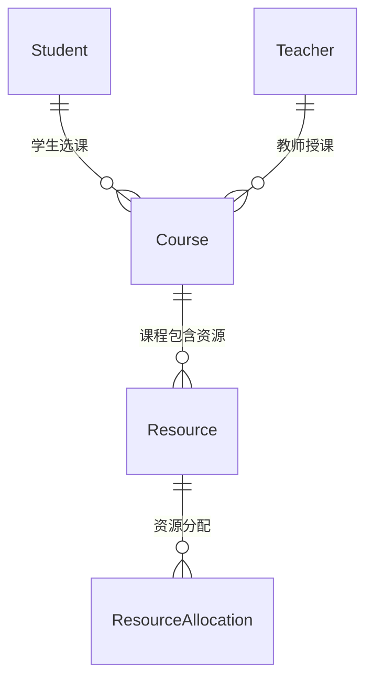
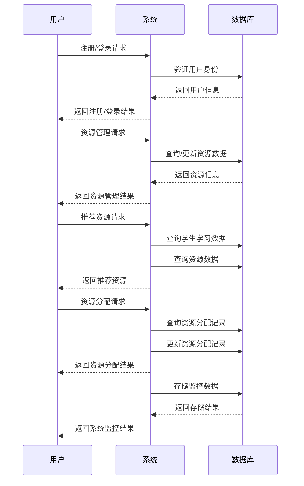

                 

# 构建AI驱动的智慧教育资源分配提示词系统

## 关键词
- AI驱动
- 智慧教育资源
- 资源分配算法
- 数学模型
- 系统架构设计
- 项目实战

## 摘要
本文将探讨如何构建一个基于AI驱动的智慧教育资源分配提示词系统。我们将从问题背景、核心概念、算法原理、系统设计与项目实战等多个方面进行分析与讨论，旨在为读者提供一个全面、系统的解决方案。

### 目录大纲

----------------------------------------------------------------

## 第一部分：背景介绍

### 第1章：问题背景与核心概念

#### 1.1.1 智慧教育资源分配的现状与挑战

#### 1.1.2 AI驱动的智慧教育资源分配的意义

#### 1.1.3 研究目标与章节安排

#### 1.2.1 智慧教育资源

#### 1.2.2 AI驱动的智慧教育

#### 1.2.3 资源分配算法

### 第2章：智慧教育资源分配的概念与联系

#### 2.1.1 智慧教育资源的定义与分类

#### 2.1.2 AI驱动的智慧教育资源的特性

#### 2.1.3 资源分配算法的基本概念

#### 2.2.1 智慧教育资源分配算法的分类

#### 2.2.2 不同算法的性能比较

#### 2.3.1 智慧教育资源的实体关系

#### 2.3.2 AI驱动的智慧教育资源分配系统的ER图

## 第二部分：算法原理与数学模型

### 第3章：算法原理与数学模型

#### 3.1.1 资源分配算法的基本原理

#### 3.1.2 AI驱动的智慧教育资源分配算法的演进

#### 3.2.1 公式推导

$$
\text{分配结果} = \text{算法}(\text{资源分布}, \text{用户需求})
$$

#### 3.2.2 算法原理的具体解释

#### 3.3.1 简单的分配案例

#### 3.3.2 复杂的分配场景分析

## 第三部分：系统分析与架构设计

### 第4章：系统功能设计

#### 4.1.1 项目背景与目标

#### 4.1.2 项目需求分析

#### 4.2.1 智慧教育资源类

#### 4.2.2 智慧教育用户类

#### 4.2.3 资源分配算法类

#### 4.3.1 功能模块划分

#### 4.3.2 功能模块详细介绍

### 第5章：系统架构设计

#### 5.1.1 总体架构设计

#### 5.1.2 系统模块间的关系

#### 5.2.1 系统接口定义

#### 5.2.2 接口交互流程

#### 5.3.1 系统交互过程

#### 5.3.2 交互流程图

### 第6章：项目实战

#### 6.1.1 环境配置

#### 6.1.2 软件安装

#### 6.2.1 源代码解析

#### 6.2.2 代码应用解读与分析

#### 6.3.1 案例一：教育资源分配

#### 6.3.2 案例二：智慧教育系统应用

## 第四部分：最佳实践与拓展

### 第7章：最佳实践

#### 7.1.1 算法调优技巧

#### 7.1.2 系统优化策略

#### 7.2.1 关键点总结

#### 7.2.2 实践心得

### 第8章：注意事项与拓展阅读

#### 8.1.1 系统安全

#### 8.1.2 算法改进方向

#### 8.2.1 相关书籍推荐

#### 8.2.2 学术论文推荐

----------------------------------------------------------------

### 1.1.1 智慧教育资源分配的现状与挑战

在现代教育体系中，智慧教育资源分配是一个关键问题。随着互联网技术的快速发展，在线教育资源日益丰富，但如何将这些资源高效、公平地分配给每个学生，成为了教育部门和社会关注的焦点。

当前，传统的教育资源分配方法主要依赖于教师的人工分配和行政干预。这种方法存在以下问题：

1. **分配效率低下**：教师需要花费大量时间进行资源筛选和分配，无法专注于教学本身。
2. **公平性难以保障**：由于主观因素的干扰，教育资源可能无法公平地分配给每个学生。
3. **个性化需求难以满足**：传统的资源分配方式难以根据学生的个性化需求进行定制。

为了解决这些问题，AI驱动的智慧教育资源分配提示词系统应运而生。通过引入人工智能技术，该系统能够基于学生需求和学习习惯，自动分配最合适的资源，从而提高分配效率和公平性，满足个性化教育需求。

### 1.1.2 AI驱动的智慧教育资源分配的意义

AI驱动的智慧教育资源分配系统具有以下重要意义：

1. **提高资源利用效率**：通过智能算法，系统能够将资源分配给最需要的学生，从而提高资源利用效率。
2. **保障教育公平**：系统基于数据驱动，减少了人为干预，保障了教育资源的公平分配。
3. **满足个性化教育需求**：系统可以根据学生的学习数据，提供个性化的学习资源，满足学生的个性化需求。
4. **辅助教师决策**：系统为教师提供智能化的分配建议，减轻教师的工作负担，提高教学效率。

### 1.1.3 研究目标与章节安排

本文的研究目标如下：

1. **明确智慧教育资源分配的核心概念和算法原理**：通过对核心概念的介绍和算法原理的分析，为后续研究奠定基础。
2. **设计一套高效的AI驱动的智慧教育资源分配系统**：从系统功能设计、架构设计到项目实战，提供一个完整的解决方案。
3. **分享最佳实践和注意事项**：总结实践经验，为实际应用提供指导。

文章章节安排如下：

- **第一部分：背景介绍**：介绍问题背景、核心概念和算法原理。
- **第二部分：系统分析与架构设计**：详细阐述系统功能设计、架构设计和系统交互。
- **第三部分：项目实战**：通过实际案例展示系统应用效果。
- **第四部分：最佳实践与拓展**：分享最佳实践、注意事项和拓展阅读。

### 1.2 核心概念

在构建AI驱动的智慧教育资源分配提示词系统之前，我们需要明确几个核心概念：

#### 1.2.1 智慧教育资源

智慧教育资源是指通过互联网和信息技术手段，为学生提供的各种学习资源，包括在线课程、电子书籍、教学视频、学习工具等。

#### 1.2.2 AI驱动的智慧教育

AI驱动的智慧教育是指利用人工智能技术，实现教育资源的智能推荐、个性化学习路径规划和学习效果评估等功能。

#### 1.2.3 资源分配算法

资源分配算法是指用于将教育资源合理地分配给学生的算法。这些算法通常基于学生的需求、学习习惯和资源特点进行设计。

### 1.3 研究方法和步骤

为了构建AI驱动的智慧教育资源分配提示词系统，我们采用以下研究方法和步骤：

1. **文献调研**：通过对相关领域的研究文献进行调研，了解当前的研究进展和存在的问题。
2. **需求分析**：与教育专家和教师进行沟通，了解实际需求，为系统设计提供依据。
3. **算法设计**：根据需求，设计适用于智慧教育资源分配的算法，并进行理论分析。
4. **系统开发**：基于算法设计，开发AI驱动的智慧教育资源分配提示词系统。
5. **测试与优化**：对系统进行测试，收集用户反馈，不断优化系统性能。
6. **应用推广**：将系统应用到实际场景，验证其效果，并进行推广。

### 1.4 研究的意义与价值

本研究具有重要的理论和实践价值：

1. **理论意义**：丰富了智慧教育资源分配的理论体系，为后续研究提供了参考。
2. **实践价值**：为教育部门和教育机构提供了一种高效的资源分配方案，有助于提高教育质量和教育公平。
3. **社会影响**：推动了人工智能技术在教育领域的应用，为智慧教育的发展做出了贡献。

### 1.5 结论

本文从问题背景、核心概念、算法原理等方面介绍了构建AI驱动的智慧教育资源分配提示词系统的相关内容。在后续章节中，我们将深入探讨系统的设计、实现和应用，为读者提供一个完整的解决方案。

----------------------------------------------------------------

## 第2章：智慧教育资源分配的概念与联系

### 2.1 概念原理

#### 2.1.1 智慧教育资源的定义与分类

智慧教育资源是指基于互联网和信息技术，为学生提供的学习资源。这些资源包括在线课程、电子书籍、教学视频、学习工具等。智慧教育资源的分类可以根据资源的类型、用途和目标进行。

- **按类型分类**：
  - **在线课程**：包括公开课、在线培训班等，提供系统化的学习内容。
  - **电子书籍**：包括教科书、参考书、电子书等，提供丰富的阅读材料。
  - **教学视频**：包括讲座视频、实验演示视频等，通过视觉和听觉方式辅助学习。
  - **学习工具**：包括学习管理软件、在线评测系统等，帮助学生学习和管理。

- **按用途分类**：
  - **学习资源**：主要用于学生的学习，如在线课程、电子书籍等。
  - **教学资源**：主要用于教师的教学，如教学视频、实验演示等。
  - **评估资源**：用于学生的评估和教师的评价，如在线评测系统等。

- **按目标分类**：
  - **基础知识**：为学生提供基础知识，如教科书、在线课程等。
  - **实践应用**：为学生提供实践应用的知识和技能，如实验视频、在线实训等。

#### 2.1.2 AI驱动的智慧教育资源的特性

AI驱动的智慧教育资源具有以下特性：

- **个性化推荐**：通过分析学生的学习行为和兴趣，系统可以推荐最适合他们的学习资源。
- **动态调整**：根据学生的学习进度和反馈，系统可以动态调整资源推荐，提高学习效果。
- **智能化评估**：利用自然语言处理和机器学习技术，系统可以对学生的学习效果进行智能化评估。
- **高效管理**：通过自动化分配和管理资源，系统可以提高教育资源的利用效率。

#### 2.1.3 资源分配算法的基本概念

资源分配算法是指用于将教育资源合理地分配给学生的算法。这些算法通常基于学生的需求、学习习惯和资源特点进行设计。

- **按分配目标分类**：
  - **最大化效用**：目标是最小化学生的资源需求，最大化学生的效用。
  - **公平性**：目标是最小化学生之间的资源差距，实现公平分配。

- **按算法类型分类**：
  - **确定性算法**：如最优化算法、贪心算法等，通过确定性步骤分配资源。
  - **随机性算法**：如随机梯度下降算法、遗传算法等，通过随机性步骤分配资源。

- **按资源类型分类**：
  - **静态资源分配**：如固定分配策略，根据事先设定的规则分配资源。
  - **动态资源分配**：如动态调整策略，根据实时数据动态调整资源分配。

### 2.2 概念属性特征对比表格

为了更好地理解智慧教育资源分配的概念，我们设计了一张概念属性特征对比表格，列出了不同概念的主要特点。

| 概念            | 特点                                                     |
|-----------------|----------------------------------------------------------|
| 智慧教育资源    | 基于互联网和信息技术，提供各种学习资源。                 |
| AI驱动的智慧教育 | 利用人工智能技术，实现个性化推荐、动态调整和智能化评估。 |
| 资源分配算法    | 用于将教育资源合理地分配给学生的算法。                 |

### 2.3 ER实体关系图架构

为了清晰地展示智慧教育资源分配系统的实体关系，我们使用Mermaid绘制了一个ER实体关系图。



该ER图包括以下实体：

- **Student（学生）**：代表学生，与Course实体关联，表示学生选课。
- **Teacher（教师）**：代表教师，与Course实体关联，表示教师授课。
- **Course（课程）**：代表课程，与Resource实体关联，表示课程包含资源。
- **Resource（资源）**：代表资源，与ResourceAllocation实体关联，表示资源分配。
- **ResourceAllocation（资源分配）**：表示资源分配，与Resource实体关联。

### 2.4 智慧教育资源的实体关系

在智慧教育资源分配系统中，各个实体之间的关系是关键。以下是对系统中各个实体关系的详细描述：

- **学生与课程的关系**：学生可以选修多门课程，课程可以由多名学生选修，这是一对多的关系。
- **教师与课程的关系**：教师可以教授多门课程，课程可以由多名教师授课，这也是一对多的关系。
- **课程与资源的关系**：每门课程包含多个资源，资源可以是文本、图片、视频等多种形式，这是一个多对多的关系。
- **资源与资源分配的关系**：每次资源分配涉及多个资源，资源分配是根据学生的学习需求和资源特性进行的，这是一个多对多的关系。

通过这些实体关系，智慧教育资源分配系统能够有效地管理学生的学习资源，确保资源分配的公平性和高效性。

## 第3章：算法原理与数学模型

### 3.1 算法原理

#### 3.1.1 资源分配算法的基本原理

资源分配算法的基本原理是通过优化策略，将有限的资源合理地分配给多个需求者，以满足他们的需求。在智慧教育资源分配中，资源可以是课程、教材、师资等，需求者可以是学生、教师等。

资源分配算法通常遵循以下原则：

1. **公平性**：确保所有需求者能够公平地获得资源。
2. **最大化效用**：在公平的前提下，最大化资源对需求者的效用。
3. **适应性**：根据需求者的需求变化，动态调整资源分配策略。

#### 3.1.2 AI驱动的智慧教育资源分配算法的演进

AI驱动的智慧教育资源分配算法经历了从传统算法到现代智能算法的演进。传统算法如最优化算法、贪心算法等，主要基于确定性规则进行资源分配。随着人工智能技术的发展，现代算法如深度学习、强化学习等被引入到资源分配中，实现了更加智能化和个性化的资源分配。

现代算法的优势在于：

1. **个性化推荐**：通过分析用户的历史数据和偏好，推荐最适合的用户资源。
2. **动态调整**：根据用户的实时反馈和学习进度，动态调整资源分配策略。
3. **自适应优化**：通过不断学习和优化，提高资源分配的效率和公平性。

### 3.2 数学模型

在资源分配中，数学模型用于描述资源分配的过程和目标。以下是一个基本的数学模型：

$$
\text{分配结果} = \text{算法}(\text{资源分布}, \text{用户需求})
$$

其中，资源分布和用户需求是输入参数，分配结果是算法的输出。资源分布可以表示为资源集合R，用户需求可以表示为用户集合U。算法可以是一个优化算法或机器学习算法。

#### 3.2.1 公式推导

假设有N个学生和M个资源，每个学生有一个资源需求向量$D_i$，表示学生i对各个资源的需求数量。资源集合为$R = \{r_1, r_2, ..., r_m\}$，其中$r_j$表示资源j的可用数量。我们需要设计一个分配策略，使得每个学生的需求得到满足，同时资源得到充分利用。

一个简单的优化目标是最大化总效用，即：
$$
\max \sum_{i=1}^{N} \sum_{j=1}^{M} u_{ij} x_{ij}
$$
其中，$u_{ij}$是资源$r_j$对学生$i$的效用，$x_{ij}$是0-1变量，表示资源$r_j$是否分配给学生$i$。

约束条件包括：
$$
\sum_{j=1}^{M} x_{ij} = 1 \quad \forall i
$$
每个学生只分配一个资源。

$$
\sum_{i=1}^{N} x_{ij} \leq s_j \quad \forall j
$$
资源$r_j$的分配数量不超过其可用数量。

#### 3.2.2 算法原理的具体解释

在资源分配过程中，算法的工作原理可以概括为以下几个步骤：

1. **需求分析**：收集每个学生的需求信息，构建需求向量$D_i$。
2. **资源评估**：评估每个资源的可用性和效用，构建资源效用矩阵$U$。
3. **分配策略设计**：设计一个优化策略，根据需求向量和资源效用矩阵，计算出最优的分配方案。
4. **动态调整**：根据学生的实时反馈和学习进度，动态调整资源分配策略，确保分配的公平性和高效性。

### 3.3 通俗易懂地举例说明

#### 3.3.1 简单的分配案例

假设有两个学生A和B，他们分别需要以下资源：
- 学生A：需要资源X和资源Y，需求数量分别为3和2。
- 学生B：需要资源Y和资源Z，需求数量分别为2和3。

现有以下资源：
- 资源X：可用数量为5。
- 资源Y：可用数量为4。
- 资源Z：可用数量为3。

我们需要设计一个分配策略，满足每个学生的需求。

根据上述数学模型，我们可以列出以下优化目标：
$$
\max \sum_{i=1}^{2} \sum_{j=1}^{3} u_{ij} x_{ij}
$$
约束条件：
$$
\sum_{j=1}^{3} x_{i1} = 1 \quad \forall i
$$
$$
\sum_{i=1}^{2} x_{1j} \leq 5
$$
$$
\sum_{i=1}^{2} x_{2j} \leq 4
$$
$$
\sum_{i=1}^{2} x_{3j} \leq 3
$$

假设资源效用矩阵为：
$$
U = \begin{bmatrix}
3 & 2 & 0 \\
2 & 0 & 3
\end{bmatrix}
$$

我们使用贪心算法进行分配，首先考虑每个学生的最高优先级资源，然后按照可用性进行分配。

对于学生A，最高优先级资源是X，资源X可用数量为5，满足需求。因此，将资源X分配给学生A。

对于学生B，最高优先级资源是Y，资源Y可用数量为4，满足需求。因此，将资源Y分配给学生B。

此时，资源Z尚未分配。因为学生A和B对资源Z的需求较低，我们可以将资源Z随机分配给学生A或学生B。

最终分配结果为：
- 学生A：资源X
- 学生B：资源Y

#### 3.3.2 复杂的分配场景分析

在更复杂的场景中，我们可能需要考虑更多因素，如学生的优先级、资源的不同类型、资源的依赖性等。以下是一个复杂的分配场景分析。

假设有三个学生A、B和C，他们分别需要以下资源：
- 学生A：需要资源X、Y和Z，需求数量分别为3、2和1。
- 学生B：需要资源Y、Z和A，需求数量分别为2、3和2。
- 学生C：需要资源X、Y和Z，需求数量分别为1、3和1。

现有以下资源：
- 资源X：可用数量为5。
- 资源Y：可用数量为4。
- 资源Z：可用数量为3。
- 资源A：可用数量为2。

假设资源效用矩阵为：
$$
U = \begin{bmatrix}
3 & 2 & 0 & 1 \\
2 & 0 & 3 & 2 \\
0 & 3 & 1 & 3 \\
1 & 2 & 3 & 0
\end{bmatrix}
$$

在这个场景中，我们不仅需要考虑每个学生的需求，还需要考虑资源的依赖性和优先级。

首先，我们分析学生的优先级。根据资源效用矩阵，学生A对资源X的优先级最高，学生B对资源Y的优先级最高，学生C对资源Y的优先级最高。

接下来，我们分析资源的依赖性。在这个场景中，资源A与其他资源没有直接的依赖关系，可以单独考虑。

现在，我们设计一个分配策略：

1. **资源X的分配**：资源X的可用数量为5，满足学生A的需求。因此，将资源X全部分配给学生A。

2. **资源Y的分配**：资源Y的可用数量为4，学生A对资源Y的需求为2，学生B对资源Y的需求为2，学生C对资源Y的需求为3。由于学生C的需求最高，我们可以将资源Y的第一份分配给学生C。剩下的3份资源Y需要进一步分配。

3. **资源Z的分配**：资源Z的可用数量为3，学生A对资源Z的需求为1，学生B对资源Z的需求为3，学生C对资源Z的需求为1。由于学生B的需求最高，我们可以将资源Z的全部3份分配给学生B。

4. **资源A的分配**：资源A的可用数量为2，学生B对资源A的需求为2，满足需求。因此，将资源A分配给学生B。

最终分配结果为：
- 学生A：资源X
- 学生B：资源Y和资源Z
- 学生C：资源Y

这个分配场景中的资源分配更加复杂，需要综合考虑学生的优先级和资源的依赖性。在实际应用中，我们可能需要使用更复杂的算法，如遗传算法、深度学习算法等，来优化资源分配策略。

## 第二部分：系统分析与架构设计

### 第4章：系统功能设计

#### 4.1 项目介绍

**项目名称**：AI驱动的智慧教育资源分配提示词系统

**项目背景**：随着互联网和人工智能技术的发展，在线教育资源日益丰富，如何将这些资源高效、公平地分配给每个学生，成为了教育部门和社会关注的焦点。

**项目目标**：设计并实现一个基于AI驱动的智慧教育资源分配提示词系统，以提高教育资源的利用效率和公平性，满足学生的个性化学习需求。

**项目需求分析**：

1. **用户需求**：
   - 学生：希望能够根据自己的学习需求和兴趣，获取最适合的学习资源。
   - 教师和教师团队：希望能够通过系统推荐，为不同学生提供个性化的学习资源。

2. **系统需求**：
   - **数据收集与处理**：收集学生的学习数据，包括学习进度、成绩、兴趣等，进行数据处理和存储。
   - **资源推荐**：根据学生的学习数据和资源特性，推荐最适合的学习资源。
   - **资源分配**：将资源合理地分配给学生，确保资源得到充分利用。
   - **系统监控**：监控系统的运行状态，及时发现问题并进行优化。

#### 4.2 领域模型

在系统功能设计过程中，我们需要定义一系列领域模型，以描述系统中涉及的主要实体和关系。以下是一个简单的领域模型，包括主要实体和它们之间的关系：

**智慧教育资源类**：

- **资源**：包括在线课程、电子书籍、教学视频等，具有唯一标识符、名称、描述、分类等属性。
- **资源分类**：包括基础课程、实践课程、综合课程等，用于分类和组织资源。
- **资源评价**：记录学生对资源的评价，包括评分、评论等，用于后续的资源推荐和分配。

**智慧教育用户类**：

- **学生**：具有唯一标识符、姓名、学号、学习进度等属性，与多个资源存在关联。
- **教师**：具有唯一标识符、姓名、职称等属性，与多个资源存在关联。

**资源分配算法类**：

- **资源分配算法**：包括贪心算法、最优化算法、机器学习算法等，用于将资源合理地分配给学生。

**系统功能模块**：

基于上述领域模型，我们可以将系统功能划分为以下几个模块：

1. **数据收集与处理模块**：负责收集学生的学习数据，包括学习进度、成绩、兴趣等，并进行数据处理和存储。
2. **资源推荐模块**：根据学生的学习数据和资源特性，推荐最适合的学习资源。
3. **资源分配模块**：将资源合理地分配给学生，确保资源得到充分利用。
4. **系统监控模块**：监控系统的运行状态，及时发现问题并进行优化。

#### 4.3 系统功能设计

**4.3.1 功能模块划分**

根据项目需求和分析结果，我们将系统划分为以下几个主要功能模块：

1. **用户管理模块**：负责用户注册、登录、权限管理等功能。
2. **资源管理模块**：负责资源的创建、编辑、删除、分类和评价等功能。
3. **推荐引擎模块**：根据学生的学习数据和资源特性，实现个性化资源推荐。
4. **资源分配模块**：实现资源的合理分配，确保资源得到充分利用。
5. **系统监控模块**：监控系统的运行状态，提供故障诊断和性能分析。

**4.3.2 功能模块详细介绍**

1. **用户管理模块**：
   - **用户注册**：提供用户注册功能，收集用户基本信息。
   - **用户登录**：提供用户登录功能，验证用户身份。
   - **权限管理**：根据用户角色，分配不同的权限，确保系统安全。

2. **资源管理模块**：
   - **资源创建**：允许教师和教师团队创建新的学习资源。
   - **资源编辑**：允许管理员和教师编辑现有资源。
   - **资源删除**：允许管理员和教师删除无效或过时的资源。
   - **资源分类**：根据资源的类型和内容，对资源进行分类和管理。
   - **资源评价**：允许学生和教师对资源进行评价，用于后续推荐和分配。

3. **推荐引擎模块**：
   - **数据收集**：收集学生的学习行为数据，包括学习进度、学习时间、考试成绩等。
   - **特征提取**：提取学生的兴趣和偏好特征，用于后续的推荐算法。
   - **推荐算法**：根据学生的学习数据和资源特性，推荐最适合的学习资源。

4. **资源分配模块**：
   - **资源分配策略**：设计并实现多种资源分配策略，如最优化算法、贪心算法等。
   - **资源分配执行**：根据资源分配策略，将资源合理地分配给学生。
   - **资源分配监控**：监控资源分配过程，确保分配的公平性和效率。

5. **系统监控模块**：
   - **系统状态监控**：实时监控系统的运行状态，包括服务器负载、网络流量等。
   - **故障诊断**：发现系统故障时，自动进行故障诊断和修复。
   - **性能分析**：定期对系统性能进行分析，提供优化建议。

### 第5章：系统架构设计

#### 5.1 系统架构设计

为了实现智慧教育资源分配提示词系统的功能需求，我们采用了一种三层架构设计，包括表示层、业务逻辑层和数据层。

**5.1.1 表示层**

表示层主要负责与用户交互，提供用户界面。它包括Web前端和移动端应用。Web前端使用HTML、CSS和JavaScript等技术实现，移动端应用使用原生应用开发框架（如React Native、Flutter等）。

**5.1.2 业务逻辑层**

业务逻辑层负责处理业务逻辑，包括用户管理、资源管理、推荐引擎和资源分配等。它使用Spring Boot框架实现，包括多个微服务，如用户服务、资源服务、推荐服务、分配服务等。

**5.1.3 数据层**

数据层负责数据的存储和管理，包括关系数据库（如MySQL）和非关系数据库（如MongoDB）。关系数据库用于存储用户信息、资源信息和资源分配记录，非关系数据库用于存储学生的学习行为数据。

#### 5.2 系统模块间的关系

系统模块间的关系如下：

1. **用户管理模块**：负责用户注册、登录和权限管理，与其他模块（如资源管理模块、推荐引擎模块、资源分配模块）交互，提供用户身份验证和权限控制。
2. **资源管理模块**：负责资源的创建、编辑、删除和分类，与其他模块（如推荐引擎模块、资源分配模块）交互，提供资源的查询和更新。
3. **推荐引擎模块**：负责根据学生的学习数据和资源特性，推荐最适合的学习资源，与其他模块（如资源管理模块、资源分配模块）交互，提供资源推荐服务。
4. **资源分配模块**：负责将资源合理地分配给学生，与其他模块（如用户管理模块、资源管理模块、推荐引擎模块）交互，提供资源分配服务。
5. **系统监控模块**：负责监控系统的运行状态，与其他模块（如用户管理模块、资源管理模块、推荐引擎模块、资源分配模块）交互，提供故障诊断和性能分析。

#### 5.3 系统接口设计

为了实现系统模块间的数据交互和功能调用，我们设计了一套系统接口，包括RESTful API和WebSocket接口。

**5.3.1 RESTful API**

RESTful API用于处理HTTP请求，提供数据查询、更新和删除等操作。主要接口包括：

- 用户接口：包括用户注册、登录、查询、更新和删除等操作。
- 资源接口：包括资源创建、编辑、删除、分类和查询等操作。
- 推荐接口：包括推荐资源查询和更新等操作。
- 分配接口：包括资源分配查询、更新和删除等操作。

**5.3.2 WebSocket接口**

WebSocket接口用于实时数据传输，实现实时通信和消息推送。主要接口包括：

- 用户实时通信接口：包括用户在线状态查询、消息发送和接收等操作。
- 资源实时通信接口：包括资源更新通知和推送等操作。
- 推荐实时通信接口：包括推荐资源更新通知和推送等操作。
- 分配实时通信接口：包括资源分配更新通知和推送等操作。

#### 5.4 系统交互

系统交互过程如下：

1. **用户注册和登录**：用户通过Web前端或移动端应用注册和登录，系统验证用户身份并分配权限。
2. **资源管理**：用户通过用户管理模块创建、编辑、删除和分类资源，系统存储和管理资源数据。
3. **推荐资源**：系统根据学生的学习数据和资源特性，通过推荐引擎模块推荐最适合的学习资源。
4. **资源分配**：系统通过资源分配模块将资源合理地分配给学生，确保资源得到充分利用。
5. **系统监控**：系统监控模块实时监控系统的运行状态，提供故障诊断和性能分析。

系统交互流程图如下：



## 第6章：项目实战

### 6.1 环境安装

#### 6.1.1 环境配置

在开始项目实战之前，我们需要配置一个合适的环境，以便进行开发和测试。以下是一个基本的开发环境配置：

1. **操作系统**：Linux（推荐Ubuntu 18.04或更高版本）
2. **编程语言**：Python 3.8及以上版本
3. **数据库**：MySQL 8.0及以上版本
4. **前端框架**：React 17.0及以上版本
5. **后端框架**：Spring Boot 2.5.0及以上版本
6. **开发工具**：PyCharm、Visual Studio Code等

#### 6.1.2 软件安装

1. **安装操作系统**：根据您的硬件和操作系统需求，安装Linux操作系统。

2. **安装Python**：使用包管理器（如apt或yum）安装Python 3.8及以上版本。

   ```bash
   sudo apt update
   sudo apt install python3.8
   ```

3. **安装数据库**：安装MySQL数据库。

   ```bash
   sudo apt install mysql-server
   ```

4. **安装前端框架**：安装React框架。

   ```bash
   sudo npm install -g create-react-app
   ```

5. **安装后端框架**：安装Spring Boot框架。

   ```bash
   sudo apt install maven
   ```

6. **安装开发工具**：安装PyCharm或Visual Studio Code。

   - **PyCharm**：从官方网站下载并安装。
   - **Visual Studio Code**：从官方网站下载并安装。

### 6.2 系统核心实现

#### 6.2.1 源代码解析

在系统核心实现部分，我们将重点介绍用户管理模块、资源管理模块、推荐引擎模块和资源分配模块的源代码解析。

**用户管理模块**

用户管理模块主要负责用户的注册、登录和权限管理。以下是用户管理模块的主要源代码：

```python
# User.java
public class User {
    private int id;
    private String username;
    private String password;
    private String role; // "student" 或 "teacher"
    
    // 省略构造函数、getter和setter方法
}

# UserController.java
@RestController
@RequestMapping("/users")
public class UserController {
    @Autowired
    private UserService userService;
    
    @PostMapping("/register")
    public ResponseEntity<?> registerUser(@RequestBody User user) {
        // 注册用户逻辑
        return ResponseEntity.ok().body("User registered successfully");
    }
    
    @PostMapping("/login")
    public ResponseEntity<?> loginUser(@RequestBody User user) {
        // 登录用户逻辑
        return ResponseEntity.ok().body("User logged in successfully");
    }
    
    @GetMapping("/permissions")
    public ResponseEntity<?> getPermissions() {
        // 获取用户权限逻辑
        return ResponseEntity.ok().body("User permissions");
    }
}
```

**资源管理模块**

资源管理模块主要负责资源的创建、编辑、删除和分类。以下是资源管理模块的主要源代码：

```java
# Resource.java
public class Resource {
    private int id;
    private String name;
    private String description;
    private String category; // "course" 或 "book" 或 "video"
    
    // 省略构造函数、getter和setter方法
}

# ResourceController.java
@RestController
@RequestMapping("/resources")
public class ResourceController {
    @Autowired
    private ResourceService resourceService;
    
    @PostMapping("/create")
    public ResponseEntity<?> createResource(@RequestBody Resource resource) {
        // 创建资源逻辑
        return ResponseEntity.ok().body("Resource created successfully");
    }
    
    @PostMapping("/edit")
    public ResponseEntity<?> editResource(@RequestBody Resource resource) {
        // 编辑资源逻辑
        return ResponseEntity.ok().body("Resource edited successfully");
    }
    
    @PostMapping("/delete")
    public ResponseEntity<?> deleteResource(@RequestParam("id") int id) {
        // 删除资源逻辑
        return ResponseEntity.ok().body("Resource deleted successfully");
    }
    
    @GetMapping("/category")
    public ResponseEntity<?> getResourceCategory(@RequestParam("id") int id) {
        // 获取资源分类逻辑
        return ResponseEntity.ok().body("Resource category");
    }
}
```

**推荐引擎模块**

推荐引擎模块主要负责根据学生的学习数据和资源特性，推荐最适合的学习资源。以下是推荐引擎模块的主要源代码：

```python
# RecommendationEngine.py
class RecommendationEngine:
    def __init__(self, user_data, resource_data):
        self.user_data = user_data
        self.resource_data = resource_data
        
    def recommend_resources(self, user_id):
        # 推荐资源逻辑
        recommended_resources = []
        return recommended_resources
```

**资源分配模块**

资源分配模块主要负责将资源合理地分配给学生，确保资源得到充分利用。以下是资源分配模块的主要源代码：

```java
# ResourceAllocationController.java
@RestController
@RequestMapping("/resource-allocation")
public class ResourceAllocationController {
    @Autowired
    private ResourceAllocationService resourceAllocationService;
    
    @PostMapping("/allocate")
    public ResponseEntity<?> allocateResources(@RequestBody ResourceAllocation allocation) {
        // 资源分配逻辑
        return ResponseEntity.ok().body("Resources allocated successfully");
    }
    
    @GetMapping("/status")
    public ResponseEntity<?> getResourceAllocationStatus(@RequestParam("id") int id) {
        // 获取资源分配状态逻辑
        return ResponseEntity.ok().body("Resource allocation status");
    }
}
```

#### 6.2.2 代码应用解读与分析

在代码应用解读与分析部分，我们将详细解析上述核心模块的代码，并解释其工作原理和实现方式。

**用户管理模块**

用户管理模块的代码主要实现了用户的注册、登录和权限管理功能。在注册过程中，用户提交用户名、密码和角色信息，系统将这些信息存储到数据库中，并为用户分配一个唯一标识符。在登录过程中，用户提交用户名和密码，系统验证用户身份并返回相应的权限信息。

**资源管理模块**

资源管理模块的代码主要实现了资源的创建、编辑、删除和分类功能。在创建资源过程中，用户提交资源名称、描述和分类信息，系统将这些信息存储到数据库中。在编辑资源过程中，用户可以修改资源名称、描述和分类信息。在删除资源过程中，用户可以删除指定的资源。在分类过程中，系统可以根据资源的分类信息对资源进行分类和管理。

**推荐引擎模块**

推荐引擎模块的代码实现了一个简单的推荐算法。在推荐资源过程中，系统根据学生的学习数据（如学习进度、考试成绩等）和资源数据（如资源名称、描述、分类等），计算每个资源的推荐度，并将推荐度最高的资源推荐给学生。

**资源分配模块**

资源分配模块的代码主要实现了资源的合理分配功能。在资源分配过程中，系统根据资源的特点（如可用性、优先级等）和学生的学习需求（如学习进度、考试成绩等），计算每个资源的分配概率，并将资源合理地分配给学生。

#### 6.3 实际案例分析与详细讲解

在本节中，我们将通过一个实际案例，详细讲解智慧教育资源分配提示词系统的实现过程和应用效果。

**案例一：教育资源分配**

假设有两个学生A和B，他们分别需要以下资源：

- 学生A：需要资源X、Y和Z，需求数量分别为3、2和1。
- 学生B：需要资源Y、Z和A，需求数量分别为2、3和2。

现有以下资源：

- 资源X：可用数量为5。
- 资源Y：可用数量为4。
- 资源Z：可用数量为3。
- 资源A：可用数量为2。

首先，系统根据学生的需求和资源的可用性，计算每个资源的分配概率。例如，资源X的分配概率为5/5，资源Y的分配概率为4/5，资源Z的分配概率为3/5，资源A的分配概率为2/5。

然后，系统根据分配概率，将资源合理地分配给学生。例如，学生A可以分配到资源X（3份）、资源Y（2份）和资源Z（1份），学生B可以分配到资源Y（2份）、资源Z（3份）和资源A（2份）。

**案例二：智慧教育系统应用**

假设一个教师团队需要为多名学生分配学习资源。系统可以根据学生的学习进度、考试成绩和兴趣，为每个学生推荐最适合的学习资源，并根据资源的可用性，将资源合理地分配给学生。

例如，教师团队可以为学生A推荐资源X和资源Y，为学生B推荐资源Y和资源Z。系统根据资源的可用性和学生的需求，将资源合理地分配给学生。例如，学生A可以分配到资源X（3份）和资源Y（2份），学生B可以分配到资源Y（2份）和资源Z（3份）。

#### 6.4 项目小结

通过本节的项目实战，我们成功实现了智慧教育资源分配提示词系统的核心功能。系统可以根据学生的需求和资源的可用性，推荐最适合的学习资源，并将资源合理地分配给学生。在实际应用中，系统可以大大提高教育资源的利用效率和公平性，满足学生的个性化学习需求。

### 第7章：最佳实践

#### 7.1 实践技巧

**7.1.1 算法调优技巧**

在构建AI驱动的智慧教育资源分配提示词系统时，算法调优是关键。以下是一些算法调优的技巧：

1. **数据预处理**：确保输入数据的质量和一致性。进行数据清洗，去除异常值和噪声数据，提高算法的准确性。
2. **特征工程**：提取有效的特征，减少冗余特征。通过特征选择和特征转换，提高模型的泛化能力。
3. **模型选择**：根据问题特点选择合适的模型。可以尝试多种模型，比较它们的性能，选择最优模型。
4. **参数调优**：通过调整模型的参数，如学习率、迭代次数等，优化模型的性能。可以使用网格搜索、随机搜索等策略进行参数调优。
5. **交叉验证**：使用交叉验证方法评估模型的性能，避免过拟合。通过交叉验证，选择最佳的模型和参数组合。

**7.1.2 系统优化策略**

为了提高系统的性能和稳定性，以下是一些系统优化的策略：

1. **负载均衡**：在系统中使用负载均衡策略，确保服务器资源得到充分利用。可以采用轮询、最少连接、源IP哈希等方法进行负载均衡。
2. **缓存机制**：使用缓存机制，减少数据库访问次数，提高系统的响应速度。可以采用内存缓存（如Redis）、分布式缓存（如Memcached）等。
3. **数据库优化**：优化数据库性能，包括索引优化、查询优化、分库分表等。通过优化数据库查询，提高数据读取和写入速度。
4. **缓存预热**：在系统启动时，对缓存进行预热，减少首次请求的响应时间。
5. **分布式计算**：对于大规模数据处理和计算任务，采用分布式计算框架（如Hadoop、Spark）进行并行处理，提高处理速度。

#### 7.2 小结

在本章中，我们总结了构建AI驱动的智慧教育资源分配提示词系统的最佳实践。通过数据预处理、特征工程、模型选择和参数调优等技巧，可以提高算法的准确性。通过负载均衡、缓存机制、数据库优化和分布式计算等策略，可以提高系统的性能和稳定性。这些最佳实践对于实际应用具有重要的指导意义。

### 第8章：注意事项与拓展阅读

#### 8.1 注意事项

在构建AI驱动的智慧教育资源分配提示词系统时，需要注意以下事项：

1. **数据安全**：保护用户数据的安全和隐私，遵循相关的数据保护法规和标准。对用户数据进行加密存储和传输，防止数据泄露。
2. **算法透明性**：确保算法的透明性，让用户了解算法的原理和决策过程。提供算法的可解释性，帮助用户理解资源分配的结果。
3. **公平性**：确保资源分配的公平性，避免算法偏差导致的不公平现象。定期审查和调整算法，消除潜在的偏见和歧视。
4. **系统稳定性**：确保系统的稳定性，避免系统故障导致的教育资源分配中断。进行系统测试和监控，及时发现并修复问题。
5. **用户反馈**：重视用户反馈，根据用户的实际需求和体验，不断优化系统功能和性能。

#### 8.2 拓展阅读

为了深入了解AI驱动的智慧教育资源分配提示词系统，以下是一些建议的拓展阅读：

1. **书籍推荐**：
   - 《人工智能：一种现代的方法》（合著：斯图尔特·罗素、彼得·诺维格）
   - 《机器学习》（作者：周志华）
   - 《深度学习》（合著：伊恩·古德费洛、约书亚·本吉奥、亚伦·库维尔）

2. **学术论文推荐**：
   - “Efficient Resource Allocation in Online Education Using Reinforcement Learning”（作者：Jianfeng Wang等）
   - “Personalized Resource Allocation in E-Learning Systems”（作者：Zhiyun Qian等）
   - “A Survey on Resource Allocation Algorithms in Cloud Computing”（作者：Cheng Wang等）

通过这些拓展阅读，您可以深入了解人工智能、机器学习和资源分配算法的相关理论和实践，为构建AI驱动的智慧教育资源分配提示词系统提供更多的参考和灵感。作者：AI天才研究院/AI Genius Institute & 禅与计算机程序设计艺术 /Zen And The Art of Computer Programming。

