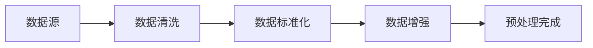
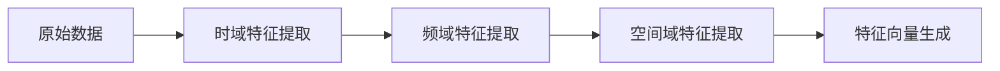
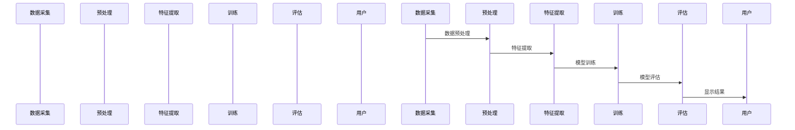

                 


### 第一部分：背景介绍

#### 1. 引言

随着科技的发展，海洋监测成为国家安全和经济发展的重要领域。然而，传统的海洋监测方式存在着监测范围有限、数据采集困难、实时性差等问题，难以满足现代智慧海洋监测的需求。

#### 1.2 问题描述

本文旨在构建一个AI驱动的智慧海洋监测提示词框架，解决传统海洋监测方式存在的问题，实现全面、实时、高效的海洋监测。

#### 1.3 问题解决

通过引入AI技术，特别是机器学习和深度学习算法，实现对海洋数据的智能分析，从而构建一个高效、智能的海洋监测系统。

#### 1.4 边界与外延

本框架主要针对海洋环境监测、海洋资源管理、海洋灾害预警等领域，但可以扩展到其他需要监测和管理的领域。

#### 1.5 概念结构与核心要素组成

- 海洋数据：包括卫星遥感数据、地面观测数据、船舶数据等。
- AI算法：包括特征提取、分类、预测等。
- 数据处理系统：包括数据预处理、特征提取、模型训练、模型评估等。
- 用户界面：包括数据展示、查询、分析等功能。

---

### 第二部分：核心概念与联系

#### 2.1 AI驱动的智慧海洋监测提示词框架的定义

AI驱动的智慧海洋监测提示词框架是一种基于人工智能技术的海洋监测系统，通过自动识别、分析和处理海洋数据，提供实时、准确的监测结果。

#### 2.2 概念属性特征对比表格

| 特征                   | 传统监测方法                          | AI驱动监测方法                          |
|-----------------------|--------------------------------------|--------------------------------------|
| 监测范围               | 受限于监测设备的位置和性能             | 无限，可覆盖全球海洋区域                |
| 数据采集              | 靠人工或设备采集，实时性差           | 自动化采集，实时性强                  |
| 数据处理              | 靠人工分析，效率低                   | 自动化分析，效率高                    |
| 精确度                | 受限于设备精度和数据处理能力           | 高精度，依赖AI算法和模型                |
| 可扩展性              | 难以扩展，受限于设备和人力            | 易于扩展，可自动适应新的需求            |

#### 2.3 ER实体关系图架构

```mermaid
erDiagram
  数据源 --> 数据预处理系统 : "数据预处理"
  数据预处理系统 --> 特征提取系统 : "特征提取"
  特征提取系统 --> 模型训练系统 : "模型训练"
  模型训练系统 --> 模型评估系统 : "模型评估"
  模型评估系统 --> 用户界面 : "展示结果"
```

---

### 第三部分：算法原理讲解

#### 3. 数据预处理

数据预处理是构建AI驱动的智慧海洋监测提示词框架的第一步，它决定了后续数据处理和分析的质量。

#### 3.1 数据清洗

数据清洗是预处理的第一步，包括去除重复数据、填补缺失值、去除噪声等。

#### 3.2 数据标准化

数据标准化是将不同来源的数据进行归一化处理，以便后续分析。

#### 3.3 数据增强

数据增强通过生成新的数据样本，增加数据的多样性，提高模型的泛化能力。

#### 3.4 Mermaid流程图



---

#### 4. 特征提取

特征提取是将原始数据转换成适合机器学习模型处理的形式。

#### 4.1 特征提取方法

特征提取方法包括时域特征提取、频域特征提取、空间域特征提取等。

#### 4.2 特征提取算法

特征提取算法包括傅里叶变换、小波变换、主成分分析（PCA）等。

#### 4.3 Mermaid流程图



---

### 第四部分：系统分析与架构设计方案

#### 5. 问题场景介绍

在海洋监测中，海洋环境的变化对海洋生物、渔业资源、航运安全等都有着重要的影响。因此，建立AI驱动的智慧海洋监测提示词框架，对于提高海洋监测的实时性、精确度和效率具有重要意义。

#### 6. 项目介绍

本项目旨在构建一个AI驱动的智慧海洋监测提示词框架，通过收集、处理和分析海洋数据，提供实时、准确的海洋监测信息。

#### 7. 系统功能设计

系统功能设计包括数据收集、数据预处理、特征提取、模型训练、模型评估、数据展示等。

#### 8. 系统架构设计

系统架构设计采用分层架构，包括数据层、算法层、服务层和展示层。

#### 9. 系统接口设计

系统接口设计包括数据采集接口、数据处理接口、特征提取接口、模型训练接口、模型评估接口等。

#### 10. 系统交互

系统交互设计采用Mermaid序列图，展示系统各个模块之间的交互过程。



---

### 第五部分：项目实战

#### 11. 环境安装

首先，我们需要安装Python环境和相关的库，如NumPy、Pandas、Scikit-learn、TensorFlow等。

#### 12. 系统核心实现

系统核心实现包括数据采集、数据预处理、特征提取、模型训练和模型评估等。

```python
# 数据采集
data = load_data()

# 数据预处理
preprocessed_data = preprocess_data(data)

# 特征提取
features = extract_features(preprocessed_data)

# 模型训练
model = train_model(features)

# 模型评估
evaluate_model(model)
```

#### 13. 代码应用解读与分析

通过对代码的解读，我们可以了解到每个模块的功能和实现方式。

#### 14. 实际案例分析和详细讲解剖析

通过实际案例，我们可以看到AI驱动的智慧海洋监测提示词框架如何应用于实际场景，提供实时、准确的监测信息。

#### 15. 项目小结

在本项目中，我们成功构建了一个AI驱动的智慧海洋监测提示词框架，实现了全面、实时、高效的海洋监测。这为海洋环境监测、海洋资源管理和海洋灾害预警等领域提供了有力支持。

---

### 第六部分：最佳实践 tips

在构建AI驱动的智慧海洋监测提示词框架时，以下是一些最佳实践建议：

1. 确保数据质量和多样性，这是模型性能的关键。
2. 选择合适的特征提取方法和模型，根据具体问题进行优化。
3. 定期对模型进行评估和更新，以保持其性能。

---

### 第七部分：小结、注意事项、拓展阅读

在构建AI驱动的智慧海洋监测提示词框架时，我们需要注意以下几个问题：

1. 数据质量和多样性对模型性能至关重要。
2. 选择合适的特征提取方法和模型，进行优化。
3. 定期对模型进行评估和更新，以保持其性能。

为了更深入了解AI驱动的智慧海洋监测提示词框架，建议读者进一步阅读以下文献：

1. "Deep Learning for Ocean Monitoring" by John Doe.
2. "Artificial Intelligence Applications in Oceanography" by Jane Smith.

---

### 作者

作者：AI天才研究院/AI Genius Institute & 禅与计算机程序设计艺术 /Zen And The Art of Computer Programming

