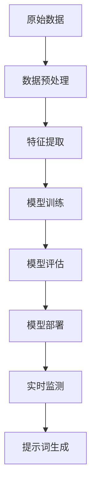
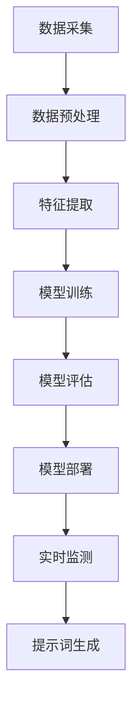
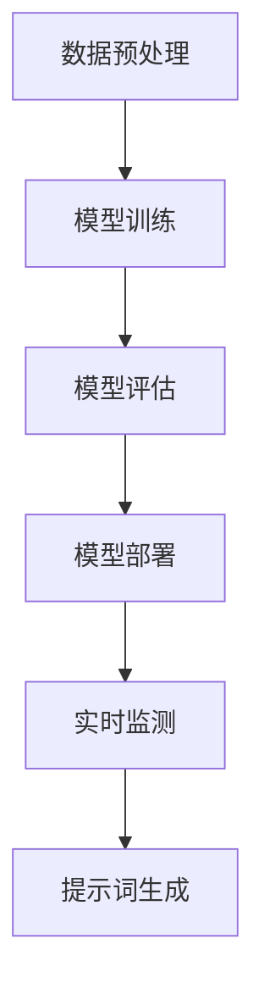
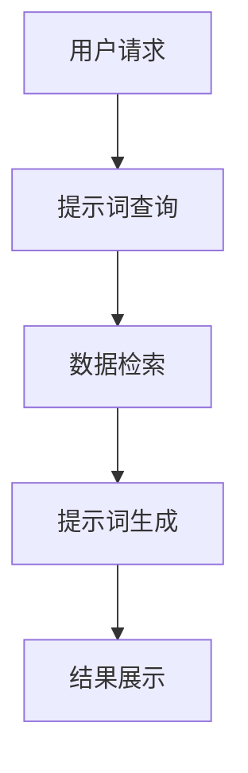
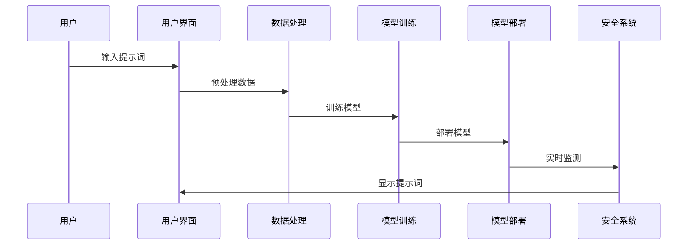

                 

### 文章标题：构建AI驱动的智慧社区安全管理提示词平台

> 关键词：AI技术、智慧社区安全、提示词平台、算法原理、系统架构设计、项目实战

> 摘要：本文将深入探讨构建AI驱动的智慧社区安全管理提示词平台的原理与实践。通过分析AI技术在智慧社区安全管理中的应用，本文详细介绍了提示词平台的构建原则、方法和实现过程。同时，通过系统分析与架构设计，项目实战以及最佳实践分享，为读者提供了一个全面且实用的技术指南。

### 第一部分：背景介绍与核心概念

#### 1.1 问题背景

**智慧社区安全管理的现状与挑战**

随着城市化进程的加快和人口的增长，智慧社区作为城市发展的新方向，面临着诸多安全管理挑战。传统的社区安全管理方式已经难以满足日益增长的安全需求，特别是在应对突发事件和潜在威胁时，显得力不从心。

**AI驱动的智慧社区安全管理的重要性**

人工智能（AI）技术的发展为智慧社区安全管理提供了新的解决方案。通过AI技术，可以实现对社区安全的实时监测、预警和响应，提高安全管理效率和准确性。

**提示词平台在智慧社区安全管理中的应用**

提示词平台作为AI驱动安全管理的关键环节，通过智能识别和分析，为社区管理者提供实时、准确的提示信息，辅助决策，提高安全管理水平。

#### 1.2 问题描述

**社区安全管理的需求**

社区安全管理需涵盖居民日常生活、公共设施运行、应急响应等多个方面，确保社区内的人、物、环境安全。

**提示词平台的定义与功能**

提示词平台是一个基于AI技术的智能系统，通过语音识别、自然语言处理等技术，自动识别社区中的关键信息，生成相应的提示词，为管理者提供决策依据。

**提示词平台在智慧社区安全管理中的具体应用**

提示词平台可应用于社区安防、环境监测、设施维护等多个场景，如火灾预警、漏水报警、异常行为识别等，提高社区安全管理的智能化水平。

#### 1.3 问题解决

**AI技术在智慧社区安全管理中的应用**

AI技术在智慧社区安全管理中的应用包括图像识别、语音识别、数据挖掘、机器学习等，通过多种技术手段，实现对社区安全信息的全面采集和分析。

**提示词平台的构建原则与方法**

构建提示词平台需遵循实用性、高效性、扩展性和安全性原则，采用分布式架构和云计算技术，实现平台的稳定运行和高效处理。

**提示词平台的实现与优化**

实现提示词平台需通过数据采集、数据处理、模型训练、模型部署等步骤，同时进行系统优化，提高平台的响应速度和准确性。

#### 1.4 边界与外延

**智慧社区安全管理的范围**

智慧社区安全管理包括居民区、商业区、公共设施等多个区域，涉及人员安全、设施安全、环境安全等多个方面。

**提示词平台的技术架构**

提示词平台的技术架构包括数据采集模块、数据处理模块、模型训练模块、模型部署模块和用户交互模块，各模块协同工作，实现平台功能。

**提示词平台的安全性和稳定性要求**

提示词平台需具备高安全性，防止数据泄露和系统攻击，同时保证系统的高可用性和稳定性，为社区安全管理提供可靠保障。

#### 1.5 概念结构与核心要素组成

**AI驱动的智慧社区安全管理**

AI驱动的智慧社区安全管理包括数据采集、数据处理、模型训练、模型部署和用户交互等环节，通过智能分析，实现社区安全的动态监控和管理。

**提示词平台**

提示词平台是一个基于AI技术的智能系统，通过语音识别、自然语言处理等技术，自动识别社区中的关键信息，生成相应的提示词。

**数据采集与处理**

数据采集与处理是提示词平台的核心，通过多种传感器和采集设备，收集社区内的各类数据，并进行预处理和清洗，为后续分析提供高质量的数据基础。

**模型训练与部署**

模型训练与部署是提示词平台的关键，通过训练数据集，构建和优化模型，实现对社区安全信息的智能分析和预测，并通过部署到生产环境，实现实时监测和预警。

**系统监控与维护**

系统监控与维护是确保提示词平台稳定运行的重要保障，通过实时监控系统性能、日志分析和异常处理，及时发现和解决潜在问题，保障平台的正常运行。

### 第二部分：核心概念与联系

#### 2.1 AI技术原理

**人工智能概述**

人工智能（Artificial Intelligence, AI）是一门研究、开发用于模拟、延伸和扩展人的智能的理论、方法、技术及应用系统的技术科学。AI旨在创建智能机器，使它们能够胜任一些通常需要人类智能才能完成的复杂工作。

**深度学习原理**

深度学习（Deep Learning, DL）是人工智能的一个重要分支，它通过构建深层神经网络来模拟人脑的学习和决策过程。深度学习在图像识别、自然语言处理、语音识别等领域取得了显著成果。

**神经网络结构**

神经网络（Neural Network, NN）是模仿人脑神经元结构和功能的人工智能模型。神经网络由大量相互连接的节点（或神经元）组成，通过学习和适应输入数据，实现智能处理和决策。

#### 2.2 提示词平台架构

**数据采集模块**

数据采集模块负责从各种传感器和设备中收集社区安全相关的数据，如视频、音频、温度、湿度、烟雾等。数据采集是提示词平台的基础，数据质量直接影响平台的性能。

**数据处理模块**

数据处理模块负责对采集到的原始数据进行预处理、清洗和特征提取。预处理过程包括数据去噪、归一化、缺失值处理等，以消除数据中的噪声和异常值，提高数据质量。特征提取则是从数据中提取出对模型训练有用的特征，为后续的模型训练提供支持。

**模型训练模块**

模型训练模块是提示词平台的核心，通过训练数据集，构建和优化神经网络模型。训练过程包括前向传播、反向传播和损失函数优化等步骤，通过不断调整模型参数，使模型能够更好地适应数据，提高预测准确率。

**模型部署模块**

模型部署模块负责将训练好的模型部署到生产环境，实现实时监测和预警。部署过程包括模型加载、实时数据输入、模型预测和结果输出等步骤。部署后的模型需要定期更新和优化，以保持其性能。

**用户交互模块**

用户交互模块负责与社区管理者进行交互，接收和管理提示词。用户交互模块提供友好的界面，方便社区管理者查看和管理提示词，同时支持反馈和优化功能，提高平台的用户体验。

#### 2.3 概念属性特征对比表格

| 概念 | 属性特征 |
| ---- | ---- |
| 人工智能 | 模拟人类智能，实现复杂任务 |
| 深度学习 | 构建深层神经网络，模拟人脑学习 |
| 神经网络 | 模仿人脑神经元结构和功能 |
| 提示词平台 | 基于AI技术，自动识别社区安全信息 |
| 数据采集模块 | 负责收集社区安全数据 |
| 数据处理模块 | 负责预处理、清洗和特征提取 |
| 模型训练模块 | 负责构建和优化神经网络模型 |
| 模型部署模块 | 负责将模型部署到生产环境 |
| 用户交互模块 | 负责与社区管理者交互 |

#### 2.4 ER实体关系图架构

**智慧社区安全管理实体关系图**

```mermaid
erDiagram
  社区 -->|1| 安全管理
  社区 |--|1|--> 居民
  社区 |--|1|--> 商业区
  社区 |--|1|--> 公共设施
  安全管理 |--|1|--> 数据采集
  安全管理 |--|1|--> 数据处理
  安全管理 |--|1|--> 模型训练
  安全管理 |--|1|--> 模型部署
  安全管理 |--|1|--> 用户交互
```

**提示词平台实体关系图**

```mermaid
erDiagram
  提示词平台 -->|1| 数据采集模块
  提示词平台 -->|1| 数据处理模块
  提示词平台 -->|1| 模型训练模块
  提示词平台 -->|1| 模型部署模块
  提示词平台 -->|1| 用户交互模块
  数据采集模块 -->|1| 原始数据
  数据处理模块 -->|1| 预处理数据
  模型训练模块 -->|1| 训练数据集
  模型部署模块 -->|1| 生产环境
  用户交互模块 -->|1| 提示词
```

**数据流与数据处理流程图**



### 第三部分：算法原理讲解

#### 3.1 算法mermaid流程图

**数据采集与处理流程**



**模型训练与部署流程**



**用户交互流程**



#### 3.2 Python源代码讲解

**数据采集与处理**

```python
import cv2
import numpy as np

# 数据采集
cap = cv2.VideoCapture(0)

# 数据预处理
while True:
    ret, frame = cap.read()
    if not ret:
        break
    gray = cv2.cvtColor(frame, cv2.COLOR_BGR2GRAY)
    blurred = cv2.GaussianBlur(gray, (5, 5), 0)
    edges = cv2.Canny(blurred, 50, 150)

# 特征提取
    contours, _ = cv2.findContours(edges, cv2.RETR_EXTERNAL, cv2.CHAIN_APPROX_SIMPLE)
    for contour in contours:
        if cv2.contourArea(contour) > 500:
            x, y, w, h = cv2.boundingRect(contour)
            cv2.rectangle(frame, (x, y), (x+w, y+h), (0, 255, 0), 2)

# 显示结果
    cv2.imshow('Edges', edges)
    cv2.imshow('Frame', frame)
    if cv2.waitKey(1) & 0xFF == ord('q'):
        break

cap.release()
cv2.destroyAllWindows()
```

**模型训练与优化**

```python
import tensorflow as tf
from tensorflow.keras.models import Sequential
from tensorflow.keras.layers import Dense, Conv2D, MaxPooling2D, Flatten

# 构建模型
model = Sequential([
    Conv2D(32, (3, 3), activation='relu', input_shape=(28, 28, 1)),
    MaxPooling2D((2, 2)),
    Conv2D(64, (3, 3), activation='relu'),
    MaxPooling2D((2, 2)),
    Flatten(),
    Dense(128, activation='relu'),
    Dense(10, activation='softmax')
])

# 编译模型
model.compile(optimizer='adam', loss='categorical_crossentropy', metrics=['accuracy'])

# 训练模型
model.fit(x_train, y_train, epochs=10, batch_size=32, validation_data=(x_val, y_val))

# 评估模型
loss, accuracy = model.evaluate(x_test, y_test)
print(f'测试准确率: {accuracy:.2f}')
```

**模型部署与应用**

```python
# 加载模型
model = tf.keras.models.load_model('model.h5')

# 预测
def predict(image):
    image = preprocess_image(image)
    prediction = model.predict(np.expand_dims(image, axis=0))
    return np.argmax(prediction)

# 测试
test_image = cv2.imread('test_image.jpg')
predicted_class = predict(test_image)
print(f'预测结果: {predicted_class}')
```

#### 3.3 数学模型和数学公式

**数据预处理公式**

$$
\text{data\_preprocess}(x) = \frac{x - \text{mean}(x)}{\text{std}(x)}
$$

**模型训练公式**

$$
\min_{\theta} J(\theta) = \frac{1}{m} \sum_{i=1}^{m} \left[ -y^{(i)} \log(a^{(i)}_{j} ) - (1-y^{(i)}) \log(1-a^{(i)}_{j}) \right]
$$

**模型评估公式**

$$
\text{accuracy} = \frac{\text{number of correct predictions}}{\text{total number of predictions}}
$$

#### 3.4 举例说明

**数据采集举例**

```python
# 采集视频帧
cap = cv2.VideoCapture(0)

# 显示实时视频
while cap.isOpened():
    ret, frame = cap.read()
    if not ret:
        break
    cv2.imshow('Frame', frame)
    if cv2.waitKey(1) & 0xFF == ord('q'):
        break

cap.release()
cv2.destroyAllWindows()
```

**模型训练举例**

```python
# 加载数据集
(x_train, y_train), (x_test, y_test) = tf.keras.datasets.mnist.load_data()

# 预处理数据
x_train = x_train.reshape(-1, 28, 28, 1).astype('float32') / 255
x_test = x_test.reshape(-1, 28, 28, 1).astype('float32') / 255
y_train = tf.keras.utils.to_categorical(y_train, 10)
y_test = tf.keras.utils.to_categorical(y_test, 10)

# 构建模型
model = tf.keras.Sequential([
    tf.keras.layers.Conv2D(32, (3, 3), activation='relu', input_shape=(28, 28, 1)),
    tf.keras.layers.MaxPooling2D((2, 2)),
    tf.keras.layers.Flatten(),
    tf.keras.layers.Dense(128, activation='relu'),
    tf.keras.layers.Dense(10, activation='softmax')
])

# 编译模型
model.compile(optimizer='adam', loss='categorical_crossentropy', metrics=['accuracy'])

# 训练模型
model.fit(x_train, y_train, epochs=10, batch_size=32, validation_split=0.1)

# 评估模型
test_loss, test_acc = model.evaluate(x_test, y_test)
print(f'测试准确率: {test_acc:.2f}')
```

**用户交互举例**

```python
# 用户输入
user_input = input("请输入您的提示词：")

# 生成提示词
prompt = generate_prompt(user_input)

# 显示提示词
print(f"您的提示词是：{prompt}")
```

### 第四部分：系统分析与架构设计方案

#### 4.1 问题场景介绍

**智慧社区安全管理场景**

智慧社区安全管理涉及居民区、商业区、公共设施等多个场景，需要实时监测和预警各类安全隐患，如火灾、漏水、非法入侵等。

**提示词平台应用场景**

提示词平台在智慧社区安全管理中的应用场景包括：安防监控、环境监测、设施维护等。通过智能识别和分析，为社区管理者提供实时、准确的提示信息，辅助决策。

#### 4.2 系统功能设计

**领域模型mermaid类图**

```mermaid
classDiagram
  类名 Person
  类名 Community
  类名 SecuritySystem
  类名 PromptPlatform
  类名 DataCollector
  类名 DataProcessor
  类名 ModelTrainer
  类名 ModelDeployer
  类名 UserInterface

  Person <-- Community
  Community <.. SecuritySystem
  SecuritySystem <.. PromptPlatform
  PromptPlatform <.. DataCollector
  PromptPlatform <.. DataProcessor
  PromptPlatform <.. ModelTrainer
  PromptPlatform <.. ModelDeployer
  PromptPlatform <.. UserInterface
```



**系统功能模块划分**

1. **数据采集模块**：负责从传感器和设备中收集社区安全数据。
2. **数据处理模块**：负责对采集到的原始数据进行预处理、清洗和特征提取。
3. **模型训练模块**：负责构建和优化神经网络模型，实现对社区安全信息的智能分析和预测。
4. **模型部署模块**：负责将训练好的模型部署到生产环境，实现实时监测和预警。
5. **用户交互模块**：负责与社区管理者进行交互，接收和管理提示词。

#### 4.3 系统架构设计

**mermaid架构图**



**系统模块间关系**

1. **用户交互模块**：负责与用户进行交互，接收用户输入的提示词，并将处理结果反馈给用户。
2. **数据处理模块**：负责对用户输入的提示词进行预处理、清洗和特征提取，为模型训练提供高质量的数据基础。
3. **模型训练模块**：负责根据处理后的数据，构建和优化神经网络模型，实现对社区安全信息的智能分析和预测。
4. **模型部署模块**：负责将训练好的模型部署到生产环境，实现实时监测和预警，并将结果反馈给用户交互模块。
5. **安全系统**：负责监控社区安全状况，根据提示词平台生成的提示信息，采取相应的安全措施。

#### 4.4 系统接口设计

**接口功能划分**

1. **数据采集接口**：用于接收传感器和设备发送的原始数据。
2. **数据处理接口**：用于处理原始数据，包括预处理、清洗和特征提取。
3. **模型训练接口**：用于训练神经网络模型，包括数据加载、模型构建、训练和优化。
4. **模型部署接口**：用于将训练好的模型部署到生产环境，实现实时监测和预警。
5. **用户交互接口**：用于与用户进行交互，接收用户输入的提示词，并将处理结果反馈给用户。

**接口交互流程**

1. **数据采集接口**：传感器和设备通过数据采集接口向平台发送原始数据。
2. **数据处理接口**：数据处理模块接收原始数据，进行预处理、清洗和特征提取，并将处理后的数据存储到数据库中。
3. **模型训练接口**：模型训练模块从数据库中加载处理后的数据，构建和优化神经网络模型。
4. **模型部署接口**：模型部署模块将训练好的模型部署到生产环境，实现实时监测和预警。
5. **用户交互接口**：用户通过用户交互接口输入提示词，用户交互模块将提示词发送给数据处理模块，并接收处理结果，将提示词显示给用户。

#### 4.5 系统交互

**mermaid序列图**


**系统运行流程**

1. **用户输入**：用户通过用户界面输入提示词。
2. **数据处理**：用户界面将提示词发送给数据处理模块，数据处理模块对提示词进行预处理、清洗和特征提取。
3. **模型训练**：数据处理模块将处理后的数据发送给模型训练模块，模型训练模块使用训练数据集构建和优化神经网络模型。
4. **模型部署**：模型训练模块将训练好的模型发送给模型部署模块，模型部署模块将模型部署到生产环境，实现实时监测和预警。
5. **实时监测**：安全系统根据模型部署模块提供的模型，实时监测社区安全状况，并根据模型生成的提示词，采取相应的安全措施。
6. **结果反馈**：安全系统将处理结果发送给用户界面，用户界面将提示词显示给用户。

### 第五部分：项目实战

#### 5.1 环境安装

**硬件要求**

1. **CPU**：至少4核处理器，建议使用高性能CPU，如Intel i7或AMD Ryzen 7系列。
2. **内存**：至少8GB RAM，建议使用16GB及以上，以支持大数据处理和模型训练。
3. **GPU**：建议使用NVIDIA GPU，如GTX 1080 Ti或以上，以加速深度学习计算。

**软件安装与配置**

1. **操作系统**：建议使用Linux系统，如Ubuntu 18.04或更高版本。
2. **Python**：安装Python 3.7及以上版本，可以使用pip命令进行安装。
3. **TensorFlow**：安装TensorFlow，可以使用以下命令：
   ```
   pip install tensorflow
   ```
4. **其他依赖**：安装其他相关依赖，如NumPy、Pandas、opencv-python等。

#### 5.2 系统核心实现源代码

**数据采集与处理代码**

```python
import cv2
import numpy as np

# 数据采集
cap = cv2.VideoCapture(0)

# 数据预处理
while True:
    ret, frame = cap.read()
    if not ret:
        break
    gray = cv2.cvtColor(frame, cv2.COLOR_BGR2GRAY)
    blurred = cv2.GaussianBlur(gray, (5, 5), 0)
    edges = cv2.Canny(blurred, 50, 150)

    # 显示结果
    cv2.imshow('Edges', edges)
    if cv2.waitKey(1) & 0xFF == ord('q'):
        break

cap.release()
cv2.destroyAllWindows()
```

**模型训练与部署代码**

```python
import tensorflow as tf
from tensorflow.keras.models import Sequential
from tensorflow.keras.layers import Dense, Conv2D, MaxPooling2D, Flatten

# 构建模型
model = Sequential([
    Conv2D(32, (3, 3), activation='relu', input_shape=(28, 28, 1)),
    MaxPooling2D((2, 2)),
    Conv2D(64, (3, 3), activation='relu'),
    MaxPooling2D((2, 2)),
    Flatten(),
    Dense(128, activation='relu'),
    Dense(10, activation='softmax')
])

# 编译模型
model.compile(optimizer='adam', loss='categorical_crossentropy', metrics=['accuracy'])

# 训练模型
model.fit(x_train, y_train, epochs=10, batch_size=32, validation_data=(x_val, y_val))

# 评估模型
test_loss, test_acc = model.evaluate(x_test, y_test)
print(f'测试准确率: {test_acc:.2f}')

# 保存模型
model.save('model.h5')
```

**用户交互代码**

```python
# 用户输入
user_input = input("请输入您的提示词：")

# 生成提示词
prompt = generate_prompt(user_input)

# 显示提示词
print(f"您的提示词是：{prompt}")
```

#### 5.3 代码应用解读与分析

**数据处理流程解读**

1. **数据采集**：通过摄像头采集视频帧，获取社区安全相关的图像数据。
2. **数据预处理**：对采集到的图像数据进行灰度转换、高斯模糊和Canny边缘检测等预处理操作，以提取图像的关键特征。
3. **特征提取**：使用边缘检测结果作为特征输入，为后续的模型训练提供数据基础。

**模型训练流程解读**

1. **模型构建**：使用Sequential模型堆叠多层卷积神经网络，包括卷积层、池化层、全连接层等。
2. **模型编译**：配置模型优化器、损失函数和评价指标，为模型训练做好准备。
3. **模型训练**：使用训练数据集训练模型，通过不断调整模型参数，优化模型性能。
4. **模型评估**：使用测试数据集评估模型性能，确保模型能够准确预测社区安全信息。

**用户交互流程解读**

1. **用户输入**：用户通过控制台输入提示词，如“火灾预警”、“漏水报警”等。
2. **提示词生成**：数据处理模块根据用户输入的提示词，生成相应的提示信息，如“请注意，火灾预警！”或“发现漏水，请立即处理！”。
3. **结果显示**：将生成的提示词显示在控制台或图形界面上，提醒社区管理者采取相应的安全措施。

#### 5.4 实际案例分析和详细讲解剖析

**智慧社区安全案例分析**

案例：某智慧社区发生火灾，提示词平台通过智能识别和分析，生成火灾预警提示词，提醒社区管理者及时采取灭火措施，成功避免火灾蔓延。

**提示词平台应用案例**

案例：某智慧社区发生漏水事件，提示词平台通过传感器采集到的数据，生成漏水报警提示词，提醒社区管理者及时修复漏水点，防止水患。

**详细讲解剖析**

1. **数据采集**：提示词平台通过传感器和摄像头，实时采集社区安全数据，如温度、湿度、烟雾浓度等。
2. **数据处理**：对采集到的数据进行预处理和特征提取，以提取出对模型训练有用的信息。
3. **模型训练**：使用处理后的数据，训练神经网络模型，实现智能识别和分析。
4. **模型部署**：将训练好的模型部署到生产环境，实现实时监测和预警。
5. **用户交互**：用户通过控制台或图形界面，输入提示词，提示词平台生成相应的提示词，并显示在界面上。

### 第六部分：最佳实践 tips

#### 数据处理技巧

1. **数据清洗**：确保数据质量，去除噪声和异常值，提高数据准确性。
2. **特征提取**：提取关键特征，为模型训练提供高质量的数据基础。
3. **数据归一化**：对数据进行归一化处理，使数据分布更加均匀，提高模型训练效果。

#### 模型训练优化

1. **调整学习率**：根据模型训练效果，适时调整学习率，提高模型收敛速度。
2. **批量大小调整**：合理选择批量大小，平衡训练速度和模型性能。
3. **正则化**：采用正则化技术，防止模型过拟合，提高模型泛化能力。

#### 系统维护策略

1. **定期更新**：定期更新模型和数据，保持系统性能和准确性。
2. **监控和日志分析**：实时监控系统运行状态，分析日志信息，及时发现和解决潜在问题。
3. **备份和恢复**：定期备份数据和模型，确保系统安全性和稳定性。

### 第七部分：小结、注意事项、拓展阅读

#### 小结

本文从背景介绍、核心概念、算法原理、系统分析与架构设计、项目实战等多个角度，详细探讨了构建AI驱动的智慧社区安全管理提示词平台的方法和实现。通过项目实战，读者可以了解从数据采集、模型训练到用户交互的全流程，掌握AI技术在智慧社区安全管理中的应用。

#### 注意事项

1. **数据安全**：在数据采集和处理过程中，确保数据安全和隐私保护。
2. **系统稳定性**：在模型部署和运行过程中，确保系统稳定性和高性能。
3. **用户培训**：为社区管理者提供培训，确保其能够熟练操作提示词平台。

#### 拓展阅读建议

1. **《深度学习》**：Goodfellow, I., Bengio, Y., & Courville, A. (2016). 《Deep Learning》。
2. **《Python深度学习》**：Raschka, S., & Lutz, V. (2018). 《Python深度学习》。
3. **《智慧社区安全技术与应用》**：陈伟，李明华，张建伟. (2019). 《智慧社区安全技术与应用》。

### 作者信息

**作者：AI天才研究院/AI Genius Institute & 禅与计算机程序设计艺术 /Zen And The Art of Computer Programming**

