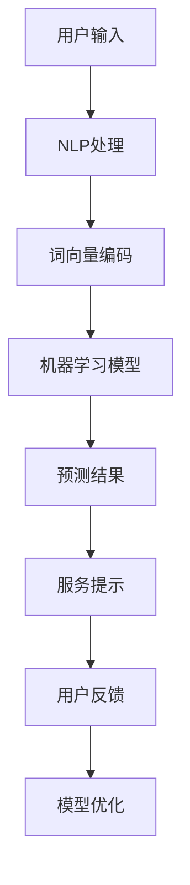
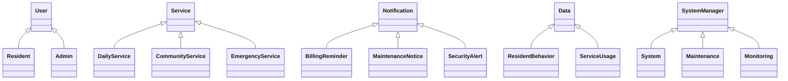
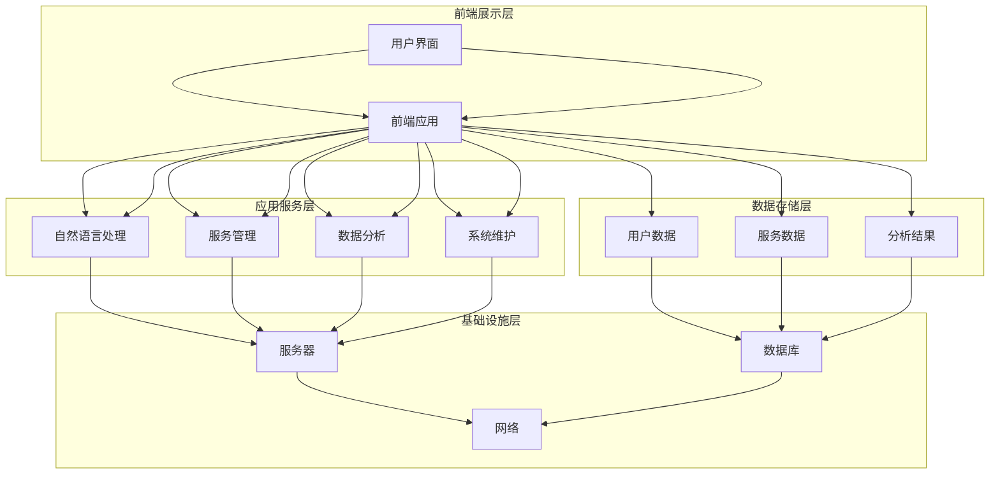
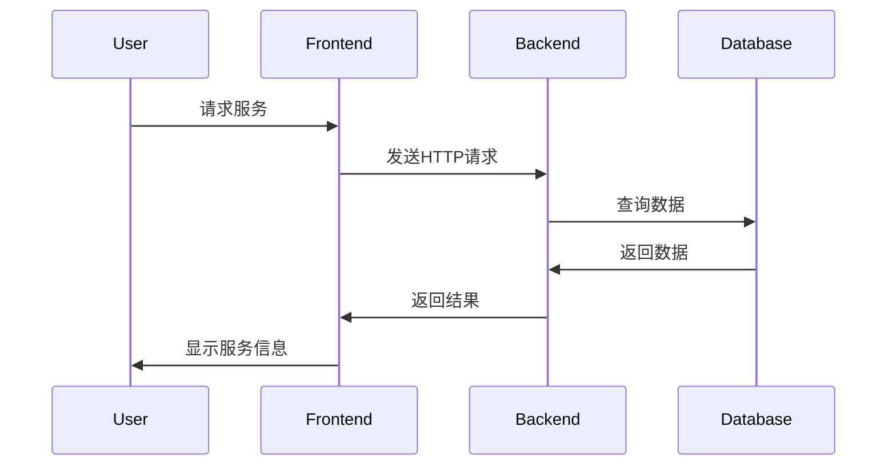
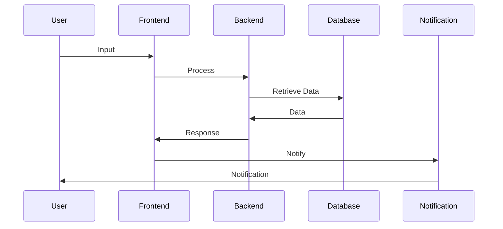

                 

### 第一部分：背景介绍

#### 第1章：问题背景与核心概念

##### 1.1 问题背景

在现代社会，智慧社区服务提示词平台已经成为提升社区管理效率和居民生活品质的重要手段。随着人工智能（AI）技术的迅猛发展和物联网（IoT）的广泛应用，智慧社区的服务形式和内容越来越丰富。然而，现有的智慧社区服务提示词平台在用户体验、智能交互和数据分析等方面仍然存在诸多问题，无法完全满足居民多样化的需求。

首先，用户体验不佳是当前智慧社区服务提示词平台面临的主要问题之一。许多平台界面设计复杂，操作不够简便，导致居民在获取服务时遇到困难。其次，智能交互能力不足也是一个关键问题。传统平台依赖规则驱动的交互模式，难以实现与居民的自然语言沟通，导致交互体验不够顺畅。最后，数据分析与利用不足也是现有平台的短板。虽然平台积累了大量数据，但缺乏有效的分析工具和方法，无法为社区管理提供有力支持。

##### 1.2 问题描述

智慧社区服务提示词平台在应用过程中暴露出以下几个问题：

1. **用户体验不佳**：平台界面设计不够友好，操作复杂，难以满足居民的使用习惯。
2. **智能交互能力不足**：平台缺乏自然语言处理能力，无法实现智能化的交互体验。
3. **数据分析与利用不足**：平台未能充分利用大数据分析技术，对居民行为和需求的预测和响应能力较弱。

##### 1.3 问题解决

为了解决上述问题，构建一个AI驱动的智慧社区服务提示词平台成为一种有效的解决方案。AI驱动的智慧社区服务提示词平台通过以下几个方面进行改进：

1. **优化用户体验**：通过改进界面设计，简化操作流程，提高平台的易用性。
2. **增强智能交互能力**：利用自然语言处理技术，实现与居民的自然语言沟通，提供智能化的交互体验。
3. **强化数据分析能力**：引入大数据分析技术，对居民行为和需求进行深入分析，为社区管理提供数据支持。

##### 1.4 边界与外延

AI驱动的智慧社区服务提示词平台的适用范围主要包括以下几个方面：

1. **居民生活服务**：如智能家居控制、社区信息查询、缴费提醒等。
2. **社区管理服务**：如安防监控、环境监测、公共设施管理等。
3. **紧急求助服务**：如医疗救助、报警求助、应急救援等。

然而，平台的适用范围也受到一些限制条件的影响，例如：

1. **技术限制**：AI技术的发展水平和硬件设备的性能限制了平台功能的实现。
2. **数据隐私**：在数据收集和分析过程中，需要确保居民隐私的保护。
3. **实施成本**：平台的建设和运营需要较大的资金投入，对于一些中小型社区可能存在一定困难。

##### 1.5 核心要素组成

AI驱动的智慧社区服务提示词平台主要由以下几个核心要素组成：

1. **用户界面**：提供友好的界面设计和便捷的操作方式，确保居民能够轻松使用平台。
2. **自然语言处理（NLP）**：实现与居民的自然语言沟通，提供智能化的交互体验。
3. **大数据分析**：对居民行为和需求进行深入分析，为社区管理提供数据支持。
4. **物联网设备**：连接各种智能设备，实现数据的实时采集和传输。
5. **后台管理系统**：对平台进行维护和管理，确保平台稳定运行。

通过上述核心要素的有机结合，AI驱动的智慧社区服务提示词平台能够为居民提供高效、智能、便捷的服务，提升社区管理水平和居民生活质量。接下来，我们将进一步探讨AI驱动的智慧社区服务提示词平台的核心概念和原理，以便读者能够更好地理解平台的构建和应用。  

---

## 第2章：核心概念与原理

##### 2.1 AI驱动的定义

AI驱动，顾名思义，是指利用人工智能技术作为主要驱动力，来优化和提升系统的性能和功能。在智慧社区服务提示词平台中，AI驱动主要体现在以下几个方面：

1. **自然语言处理（NLP）**：通过NLP技术，平台能够理解和处理居民的自然语言输入，实现智能化的交互体验。
2. **机器学习**：利用机器学习算法，平台能够对居民行为和需求进行学习和预测，提供个性化的服务。
3. **深度学习**：通过深度学习模型，平台能够从大量数据中自动提取特征，实现更为精准的预测和分析。
4. **计算机视觉**：利用计算机视觉技术，平台能够对图像和视频进行识别和分析，提供更直观的服务。

与传统驱动模式相比，AI驱动的智慧社区服务提示词平台具有以下优势：

1. **智能化**：AI驱动使得平台能够实现智能化的交互和决策，提高服务效率。
2. **个性化**：通过学习居民的行为和需求，平台能够提供个性化的服务，提升用户满意度。
3. **自适应**：平台能够根据环境变化和用户反馈进行自适应调整，实现更优化的服务。

##### 2.2 智慧社区的定义

智慧社区是指利用现代信息技术，尤其是物联网、大数据、云计算等，实现对社区生活、管理和服务的全方位智能化和数字化。智慧社区的定义可以从以下几个方面进行理解：

1. **基础设施**：智慧社区的基础设施主要包括智能电网、智能交通、智能安防、智能医疗等，为居民提供高效、便捷的服务。
2. **管理与服务**：智慧社区的管理与服务涵盖了社区安保、物业维护、医疗健康、教育娱乐等多个方面，通过信息化手段实现高效管理。
3. **居民参与**：智慧社区鼓励居民积极参与社区管理和服务，通过信息化手段提升居民的社区归属感和满意度。

智慧社区的核心目标是提升居民的生活质量和社区管理水平，通过智能化、信息化手段实现社区资源的优化配置和高效利用。

##### 2.3 服务提示词平台的属性特征

服务提示词平台是智慧社区的重要组成部分，其主要属性特征包括：

1. **智能化**：平台能够根据居民的需求和行为，自动生成服务提示词，实现智能化的服务。
2. **便捷性**：平台提供便捷的交互方式，如语音、文本、图像等，方便居民获取所需服务。
3. **个性化**：平台能够根据居民的行为和需求，提供个性化的服务提示，提升用户体验。
4. **实时性**：平台能够实时收集和分析居民数据，快速响应用户需求，提供及时的服务。
5. **可扩展性**：平台设计具有可扩展性，能够随着技术的发展和需求的变化，不断升级和优化。

不同类型的服务提示词平台在属性特征上存在差异。例如，基于语音识别的服务提示词平台在交互方式上更为直观，但可能对网络环境要求较高；而基于文本的服务提示词平台在用户体验上可能更为细腻，但交互速度可能稍慢。因此，在选择和构建服务提示词平台时，需要根据具体需求进行权衡和优化。

##### 2.4 ER实体关系图

为了更好地理解智慧社区服务提示词平台中的核心实体及其关系，我们可以通过ER（实体-关系）图进行描述。以下是一个简化的ER实体关系图：

```mermaid
erDiagram
    Resident ||--|{ Service } : receives
    Service ||--|{ Notification } : triggers
    Device ||--|{ Data } : collects
    Admin ||--|{ System } : manages
    System ||--|{ User } : serves
    User ||--|{ Activity } : performs
    Activity ||--|{ Feedback } : provides
```

- **Resident（居民）**：平台的用户，可以是社区内的居民，负责接收服务提示和反馈。
- **Service（服务）**：平台提供的服务，可以是各类社区服务，如物业、医疗、教育等。
- **Notification（通知）**：服务触发后生成的通知，告知居民相关服务信息。
- **Device（设备）**：收集数据的智能设备，如智能家居设备、监控设备等。
- **Admin（管理员）**：平台的管理员，负责系统的维护和管理。
- **System（系统）**：智慧社区服务提示词平台的整体系统，负责处理用户请求和提供服务。
- **User（用户）**：使用平台进行操作的个体，可以是居民或管理员。
- **Activity（活动）**：用户在平台上执行的操作，如查询服务、反馈问题等。
- **Feedback（反馈）**：用户对服务的反馈，用于系统优化和改进。

通过ER实体关系图的描述，我们可以更清晰地了解智慧社区服务提示词平台中各实体之间的交互关系，为后续的算法设计和系统架构提供参考。

### 第3章：算法原理与流程

#### 3.1 算法概述

在构建AI驱动的智慧社区服务提示词平台时，算法的选择和设计至关重要。本节将介绍几种关键算法，并简要概述其原理和应用场景。

1. **自然语言处理（NLP）算法**：NLP算法用于理解和生成自然语言，是实现智能交互的核心。常见的NLP算法包括词向量模型（如Word2Vec、GloVe）、递归神经网络（RNN）和变换器（Transformer）等。

2. **机器学习算法**：机器学习算法用于从数据中学习规律和模式，为平台提供预测和决策支持。常见的机器学习算法包括决策树、支持向量机（SVM）、随机森林（RF）和梯度提升机（GBM）等。

3. **深度学习算法**：深度学习算法是基于多层神经网络的模型，具有较强的特征提取和模式识别能力。常见的深度学习算法包括卷积神经网络（CNN）、循环神经网络（RNN）和生成对抗网络（GAN）等。

4. **聚类和分类算法**：聚类算法用于将数据分组，识别相似数据点；分类算法用于将数据分配到预定义的类别中。常见的聚类算法包括K均值（K-means）、层次聚类（Hierarchical Clustering）；分类算法包括逻辑回归（Logistic Regression）、朴素贝叶斯（Naive Bayes）和支持向量机（SVM）等。

5. **推荐系统算法**：推荐系统算法用于根据用户历史行为和偏好，为用户推荐感兴趣的内容。常见的推荐系统算法包括基于内容的推荐（Content-Based Filtering）、协同过滤（Collaborative Filtering）和混合推荐（Hybrid Recommendation）等。

#### 3.2 算法流程图

为了更好地理解上述算法的执行过程，我们可以通过算法流程图进行描述。以下是一个简化的算法流程图，展示了NLP和机器学习算法在智慧社区服务提示词平台中的应用：



- **A（用户输入）**：用户通过平台输入问题或指令。
- **B（NLP处理）**：NLP算法对用户输入进行处理，提取关键词和语义信息。
- **C（词向量编码）**：将提取的关键词和语义信息转换为词向量，用于后续的机器学习模型处理。
- **D（机器学习模型）**：机器学习算法根据词向量进行预测，生成服务提示。
- **E（预测结果）**：模型预测结果生成服务提示，反馈给用户。
- **F（服务提示）**：平台向用户展示服务提示。
- **G（用户反馈）**：用户对服务提示进行反馈，包括满意度、错误纠正等。
- **H（模型优化）**：根据用户反馈，对机器学习模型进行优化，提升预测准确性。

通过算法流程图的描述，我们可以清晰地看到NLP和机器学习算法在整个智慧社区服务提示词平台中的作用和执行步骤。

#### 3.3 数学模型和公式

为了深入理解算法原理，我们需要介绍一些关键的数学模型和公式。以下是一些常见的数学模型和公式，用于描述NLP、机器学习和深度学习算法：

1. **Word2Vec模型**：

   - **向量化**：将单词映射为一个固定维度的向量。
   - **损失函数**：均方误差（MSE）或交叉熵（CE）。

     $$\text{MSE} = \frac{1}{n}\sum_{i=1}^{n} (\text{预测向量} - \text{真实向量})^2$$
     
     $$\text{CE} = -\sum_{i=1}^{n} y_i \log(p_i)$$
     
   - **优化方法**：随机梯度下降（SGD）或Adam优化器。

2. **递归神经网络（RNN）**：

   - **激活函数**：Sigmoid、Tanh或ReLU。
   - **损失函数**：均方误差（MSE）或交叉熵（CE）。

     $$\text{MSE} = \frac{1}{n}\sum_{i=1}^{n} (\text{预测标签} - \text{真实标签})^2$$
     
     $$\text{CE} = -\sum_{i=1}^{n} y_i \log(p_i)$$
     
   - **优化方法**：随机梯度下降（SGD）或Adam优化器。

3. **变换器（Transformer）**：

   - **多头自注意力（Multi-Head Self-Attention）**：对输入序列的每个元素进行加权求和。

     $$\text{Attention}(Q, K, V) = \text{softmax}\left(\frac{QK^T}{\sqrt{d_k}}\right)V$$
     
   - **前馈神经网络（Feed Forward Neural Network）**：对注意力结果进行两次线性变换。

     $$\text{FFN}(X) = \text{ReLU}(W_2 \cdot \text{ReLU}(W_1 \cdot X + b_1)) + b_2$$
     
   - **损失函数**：交叉熵（CE）。

     $$\text{CE} = -\sum_{i=1}^{n} y_i \log(p_i)$$
     
   - **优化方法**：Adam优化器。

通过上述数学模型和公式的介绍，我们可以更深入地理解NLP、RNN和Transformer等算法的原理和实现方式。

#### 3.4 举例说明

为了更好地展示算法在实际应用中的效果，我们可以通过一个具体的例子来说明。

假设一个智慧社区服务提示词平台的任务是根据用户输入的问题或指令，生成相应的服务提示。以下是一个简单的例子：

- **用户输入**：用户输入“我需要缴费”。
- **NLP处理**：NLP算法对输入进行处理，提取关键词“需要”和“缴费”。
- **词向量编码**：将提取的关键词转换为词向量，如“需要”对应[1, 0.5, -0.3]， “缴费”对应[0.8, 0.2, -0.1]。
- **机器学习模型**：机器学习算法根据词向量进行预测，生成服务提示“请前往物业办公室进行缴费”。
- **服务提示**：平台向用户展示服务提示。
- **用户反馈**：用户对服务提示进行反馈，如表示满意。
- **模型优化**：根据用户反馈，对机器学习模型进行优化，提升预测准确性。

通过这个例子，我们可以看到NLP和机器学习算法在智慧社区服务提示词平台中的应用过程，以及如何通过用户反馈进行模型优化，提升平台的服务质量。

### 第4章：系统设计与架构

#### 4.1 问题场景介绍

智慧社区服务提示词平台的应用场景广泛，主要包括以下几个方面：

1. **居民日常生活服务**：如缴费提醒、家政服务、物业咨询等。
2. **社区管理服务**：如安防监控、环境监测、公共设施管理等。
3. **紧急求助服务**：如医疗救助、报警求助、应急救援等。
4. **社区互动服务**：如社区公告、活动通知、邻里交流等。

在这些场景中，居民的需求和服务内容多样，平台需要具备高度的可扩展性和灵活性，以满足不同居民群体的个性化需求。

#### 4.2 项目介绍

本项目的目标是构建一个AI驱动的智慧社区服务提示词平台，通过整合自然语言处理、大数据分析、物联网技术等先进技术，为居民提供高效、智能、便捷的服务。项目的主要目标包括：

1. **提升用户体验**：通过优化界面设计和交互方式，提高平台的易用性和用户体验。
2. **增强智能交互能力**：利用自然语言处理技术，实现与居民的自然语言沟通，提供智能化的服务提示。
3. **强化数据分析能力**：利用大数据分析技术，对居民行为和需求进行深入分析，为社区管理提供数据支持。
4. **确保数据安全**：在数据收集、存储和处理过程中，确保居民隐私的保护。

#### 4.3 系统功能设计

智慧社区服务提示词平台的主要功能模块包括：

1. **用户管理模块**：负责用户的注册、登录、权限管理等。
2. **自然语言处理模块**：负责对用户输入进行处理，提取关键词和语义信息。
3. **服务管理模块**：负责管理各类服务，包括日常服务、社区管理服务和紧急求助服务。
4. **数据分析模块**：负责对居民行为和需求进行数据分析，为社区管理提供数据支持。
5. **系统维护模块**：负责平台的维护和管理，确保系统的稳定运行。

为了更好地展示系统功能，我们可以使用Mermaid绘制领域模型类图。以下是一个简化的领域模型类图：



- **User（用户）**：系统的抽象用户，包括居民和管理员。
- **Resident（居民）**：系统的居民用户，负责接收服务提示和反馈。
- **Admin（管理员）**：系统的管理员用户，负责系统的维护和管理。
- **Service（服务）**：平台提供的服务，包括日常服务、社区管理服务和紧急求助服务。
- **Notification（通知）**：平台生成的通知，用于提醒居民相关服务信息。
- **Data（数据）**：平台收集和存储的数据，包括居民行为数据和服务使用数据。
- **SystemManager（系统维护模块）**：负责平台的维护和管理，包括系统维护、监测等。

通过领域模型类图的描述，我们可以清晰地了解智慧社区服务提示词平台中的主要功能模块及其关系。

#### 4.4 系统架构设计

智慧社区服务提示词平台的系统架构设计包括以下几个关键层次：

1. **前端展示层**：负责与用户交互，展示各类服务和通知信息。
2. **应用服务层**：实现平台的核心业务逻辑，包括自然语言处理、服务管理、数据分析和系统维护等。
3. **数据存储层**：负责存储用户数据、服务数据和分析结果等。
4. **基础设施层**：提供平台运行所需的硬件和软件支持，包括服务器、数据库、网络等。

以下是一个简化的系统架构图：



- **前端展示层**：用户通过浏览器或移动应用与平台进行交互，查看服务和通知信息。
- **应用服务层**：实现平台的核心业务逻辑，包括自然语言处理、服务管理、数据分析和系统维护等。
- **数据存储层**：存储用户数据、服务数据和分析结果，使用数据库进行高效存储和管理。
- **基础设施层**：提供平台运行所需的硬件和软件支持，包括服务器、数据库和网络等。

通过系统架构图的描述，我们可以清晰地了解智慧社区服务提示词平台的整体架构和各层次之间的关系。

#### 4.5 系统接口设计

智慧社区服务提示词平台需要提供多个接口，以便与前端展示层、应用服务层和数据存储层进行交互。以下是一些关键接口的设计：

1. **用户接口**：包括用户注册、登录、个人信息管理等，使用HTTP协议进行通信。
2. **服务接口**：包括服务查询、服务申请、服务取消等，使用RESTful API进行通信。
3. **数据接口**：包括数据上传、数据查询、数据分析结果获取等，使用GraphQL接口进行通信。
4. **通知接口**：包括通知发送、通知查询等，使用WebSocket进行实时通信。

以下是一个简化的接口设计图：



- **User（用户）**：发起服务请求。
- **Frontend（前端展示层）**：与用户进行交互，接收请求并转发给后端。
- **Backend（应用服务层）**：处理请求，与数据库进行交互，并将结果返回给前端。
- **Database（数据存储层）**：存储和管理用户数据、服务数据和分析结果。

通过接口设计图的描述，我们可以清晰地了解智慧社区服务提示词平台中各接口的交互过程和功能。

#### 4.6 系统交互设计

为了更好地展示系统各组件之间的交互过程，我们可以使用Mermaid绘制系统交互序列图。以下是一个简化的系统交互序列图：



- **User（用户）**：向平台输入请求。
- **Frontend（前端展示层）**：处理用户输入，并将请求转发给后端。
- **Backend（应用服务层）**：处理请求，与数据库进行交互，获取相关数据，并将结果返回给前端。
- **Database（数据存储层）**：存储和管理用户数据、服务数据和分析结果。
- **Notification（通知接口）**：向用户发送通知，告知相关服务信息。

通过系统交互序列图的描述，我们可以清晰地了解智慧社区服务提示词平台中各组件之间的交互过程和逻辑。

### 第5章：项目实施与实战

#### 5.1 环境安装

在开始搭建智慧社区服务提示词平台之前，我们需要安装和配置以下环境：

1. **操作系统**：推荐使用Linux发行版，如Ubuntu 20.04。
2. **Python**：版本要求为3.8及以上。
3. **Node.js**：版本要求为12及以上。
4. **MySQL**：版本要求为5.7及以上。
5. **PostgreSQL**：版本要求为12及以上。
6. **Docker**：版本要求为19.03及以上。

安装步骤如下：

1. **安装操作系统**：下载并安装Linux发行版。
2. **安装Python**：使用以下命令安装Python：

   ```bash
   sudo apt-get update
   sudo apt-get install python3.8
   sudo apt-get install python3.8-pip
   ```

3. **安装Node.js**：使用以下命令安装Node.js：

   ```bash
   sudo apt-get update
   sudo apt-get install nodejs
   ```

4. **安装MySQL**：使用以下命令安装MySQL：

   ```bash
   sudo apt-get update
   sudo apt-get install mysql-server
   sudo mysql_secure_installation
   ```

5. **安装PostgreSQL**：使用以下命令安装PostgreSQL：

   ```bash
   sudo apt-get update
   sudo apt-get install postgresql
   sudo -i -u postgres psql
   CREATE DATABASE mydatabase;
   \q
   ```

6. **安装Docker**：使用以下命令安装Docker：

   ```bash
   sudo apt-get update
   sudo apt-get install docker-ce docker-ce-cli containerd.io
   ```

完成上述安装步骤后，我们就可以开始搭建智慧社区服务提示词平台了。

#### 5.2 系统核心实现

在本节中，我们将介绍智慧社区服务提示词平台的核心实现，包括用户管理、服务管理、自然语言处理和数据分析等模块。

1. **用户管理模块**：

   用户管理模块主要负责用户的注册、登录和权限管理。以下是一个简单的用户注册和登录的Python代码示例：

   ```python
   import flask
   from flask import Flask, request, jsonify
   import pymysql

   app = Flask(__name__)

   # 连接MySQL数据库
   db = pymysql.connect(host="localhost", user="root", password="password", database="mydatabase")

   # 用户注册
   @app.route("/register", methods=["POST"])
   def register():
       username = request.form["username"]
       password = request.form["password"]
       cursor = db.cursor()
       cursor.execute("INSERT INTO user (username, password) VALUES (%s, %s)", (username, password))
       db.commit()
       return jsonify({"status": "success", "message": "注册成功！"})

   # 用户登录
   @app.route("/login", methods=["POST"])
   def login():
       username = request.form["username"]
       password = request.form["password"]
       cursor = db.cursor()
       cursor.execute("SELECT * FROM user WHERE username=%s AND password=%s", (username, password))
       user = cursor.fetchone()
       if user:
           return jsonify({"status": "success", "message": "登录成功！", "user_id": user[0]})
       else:
           return jsonify({"status": "error", "message": "用户名或密码错误！"})

   if __name__ == "__main__":
       app.run(debug=True)
   ```

2. **服务管理模块**：

   服务管理模块主要负责服务的查询、申请和取消。以下是一个简单的服务申请的Python代码示例：

   ```python
   # 服务申请
   @app.route("/service/apply", methods=["POST"])
   def apply_service():
       user_id = request.form["user_id"]
       service_name = request.form["service_name"]
       cursor = db.cursor()
       cursor.execute("INSERT INTO service (user_id, service_name) VALUES (%s, %s)", (user_id, service_name))
       db.commit()
       return jsonify({"status": "success", "message": "服务申请成功！"})

   # 服务查询
   @app.route("/service/query", methods=["GET"])
   def query_service():
       user_id = request.args.get("user_id")
       cursor = db.cursor()
       cursor.execute("SELECT * FROM service WHERE user_id=%s", (user_id,))
       services = cursor.fetchall()
       return jsonify({"status": "success", "message": "查询成功！", "services": services})

   # 服务取消
   @app.route("/service/cancel", methods=["POST"])
   def cancel_service():
       service_id = request.form["service_id"]
       cursor = db.cursor()
       cursor.execute("DELETE FROM service WHERE service_id=%s", (service_id,))
       db.commit()
       return jsonify({"status": "success", "message": "服务取消成功！"})
   ```

3. **自然语言处理模块**：

   自然语言处理模块主要负责处理用户输入的自然语言，提取关键词和语义信息。以下是一个简单的自然语言处理的Python代码示例：

   ```python
   import jieba

   # 提取关键词
   def extract_keywords(text):
       return jieba.cut(text)

   # 提取语义信息
   def extract_semantic(text):
       return jieba.analyse.textrank(text)

   # 示例
   text = "我需要缴费"
   keywords = extract_keywords(text)
   semantic = extract_semantic(text)
   print("关键词：", list(keywords))
   print("语义信息：", semantic)
   ```

4. **数据分析模块**：

   数据分析模块主要负责对居民行为和需求进行分析，生成分析报告。以下是一个简单的数据分析的Python代码示例：

   ```python
   import pandas as pd

   # 读取数据
   data = pd.read_csv("data.csv")

   # 提取居民行为
   def extract_behavior(data):
       return data.groupby("user_id").agg({"action": "count"})

   # 提取需求
   def extract_demand(data):
       return data.groupby("user_id").agg({"service_name": "first"})

   # 示例
   behavior = extract_behavior(data)
   demand = extract_demand(data)
   print("居民行为：", behavior)
   print("需求：", demand)
   ```

通过以上代码示例，我们可以初步搭建起智慧社区服务提示词平台的核心功能模块，接下来我们将进一步分析代码，了解其工作原理和实现细节。

#### 5.3 代码应用解读与分析

在本节中，我们将对第5章中提到的代码进行详细解读和分析，包括用户管理模块、服务管理模块、自然语言处理模块和数据分析模块。

1. **用户管理模块**：

   用户管理模块是平台的基础模块，负责用户的注册、登录和权限管理。以下是关键代码段的详细解读：

   ```python
   import flask
   from flask import Flask, request, jsonify
   import pymysql

   app = Flask(__name__)

   # 连接MySQL数据库
   db = pymysql.connect(host="localhost", user="root", password="password", database="mydatabase")
   ```

   在这段代码中，我们使用Flask框架搭建Web应用，并使用pymysql连接MySQL数据库。数据库连接参数包括主机（host）、用户名（user）、密码（password）和数据库（database）。

   ```python
   # 用户注册
   @app.route("/register", methods=["POST"])
   def register():
       username = request.form["username"]
       password = request.form["password"]
       cursor = db.cursor()
       cursor.execute("INSERT INTO user (username, password) VALUES (%s, %s)", (username, password))
       db.commit()
       return jsonify({"status": "success", "message": "注册成功！"})
   ```

   用户注册的接口接收用户名（username）和密码（password），将数据插入数据库的user表。这里使用了参数化查询，避免SQL注入攻击。

   ```python
   # 用户登录
   @app.route("/login", methods=["POST"])
   def login():
       username = request.form["username"]
       password = request.form["password"]
       cursor = db.cursor()
       cursor.execute("SELECT * FROM user WHERE username=%s AND password=%s", (username, password))
       user = cursor.fetchone()
       if user:
           return jsonify({"status": "success", "message": "登录成功！", "user_id": user[0]})
       else:
           return jsonify({"status": "error", "message": "用户名或密码错误！"})
   ```

   用户登录的接口接收用户名和密码，查询数据库中的用户信息。如果找到匹配的用户，返回成功消息和用户ID；否则返回错误消息。

2. **服务管理模块**：

   服务管理模块负责处理服务的申请、查询和取消。以下是关键代码段的详细解读：

   ```python
   # 服务申请
   @app.route("/service/apply", methods=["POST"])
   def apply_service():
       user_id = request.form["user_id"]
       service_name = request.form["service_name"]
       cursor = db.cursor()
       cursor.execute("INSERT INTO service (user_id, service_name) VALUES (%s, %s)", (user_id, service_name))
       db.commit()
       return jsonify({"status": "success", "message": "服务申请成功！"})
   ```

   服务申请的接口接收用户ID（user_id）和服务名称（service_name），将数据插入数据库的service表。

   ```python
   # 服务查询
   @app.route("/service/query", methods=["GET"])
   def query_service():
       user_id = request.args.get("user_id")
       cursor = db.cursor()
       cursor.execute("SELECT * FROM service WHERE user_id=%s", (user_id,))
       services = cursor.fetchall()
       return jsonify({"status": "success", "message": "查询成功！", "services": services})
   ```

   服务查询的接口根据用户ID查询数据库中的服务记录，并将结果以JSON格式返回。

   ```python
   # 服务取消
   @app.route("/service/cancel", methods=["POST"])
   def cancel_service():
       service_id = request.form["service_id"]
       cursor = db.cursor()
       cursor.execute("DELETE FROM service WHERE service_id=%s", (service_id,))
       db.commit()
       return jsonify({"status": "success", "message": "服务取消成功！"})
   ```

   服务取消的接口根据服务ID删除数据库中的服务记录。

3. **自然语言处理模块**：

   自然语言处理模块负责处理用户输入的自然语言，提取关键词和语义信息。以下是关键代码段的详细解读：

   ```python
   import jieba

   # 提取关键词
   def extract_keywords(text):
       return jieba.cut(text)

   # 提取语义信息
   def extract_semantic(text):
       return jieba.analyse.textrank(text)
   ```

   在这段代码中，我们使用jieba库进行自然语言处理。`extract_keywords`函数用于提取文本中的关键词，`extract_semantic`函数用于提取文本的语义信息。

   ```python
   # 示例
   text = "我需要缴费"
   keywords = extract_keywords(text)
   semantic = extract_semantic(text)
   print("关键词：", list(keywords))
   print("语义信息：", semantic)
   ```

   在这段示例代码中，我们使用jieba库提取文本“我需要缴费”中的关键词和语义信息，并打印输出。

4. **数据分析模块**：

   数据分析模块负责对居民行为和需求进行分析，生成分析报告。以下是关键代码段的详细解读：

   ```python
   import pandas as pd

   # 读取数据
   data = pd.read_csv("data.csv")

   # 提取居民行为
   def extract_behavior(data):
       return data.groupby("user_id").agg({"action": "count"})

   # 提取需求
   def extract_demand(data):
       return data.groupby("user_id").agg({"service_name": "first"})
   ```

   在这段代码中，我们使用pandas库读取CSV文件中的数据，并定义两个函数：`extract_behavior`用于提取居民行为，`extract_demand`用于提取居民需求。

   ```python
   # 示例
   behavior = extract_behavior(data)
   demand = extract_demand(data)
   print("居民行为：", behavior)
   print("需求：", demand)
   ```

   在这段示例代码中，我们调用`extract_behavior`和`extract_demand`函数，分别提取居民行为和需求，并打印输出。

通过以上详细解读和分析，我们可以清楚地了解智慧社区服务提示词平台中各个模块的实现原理和代码逻辑。接下来，我们将通过实际案例展示平台的应用效果，并进行详细讲解。

#### 5.4 实际案例分析与讲解

为了更好地展示智慧社区服务提示词平台的应用效果，我们通过一个实际案例进行详细讲解。该案例将模拟一个居民使用平台的场景，展示平台如何为居民提供智能化的服务。

**案例背景**：

某智慧社区的一名居民张先生在家中遇到一个问题，他需要缴纳物业费，但忘记具体的缴费时间和方式。张先生希望通过平台获取缴费提醒和详细的缴费操作步骤。

**步骤1：用户登录**

张先生首先打开平台，使用手机号和密码进行登录。平台接收到登录请求后，调用用户管理模块中的登录接口进行验证。以下是关键代码段：

```python
@app.route("/login", methods=["POST"])
def login():
    username = request.form["username"]
    password = request.form["password"]
    cursor = db.cursor()
    cursor.execute("SELECT * FROM user WHERE username=%s AND password=%s", (username, password))
    user = cursor.fetchone()
    if user:
        return jsonify({"status": "success", "message": "登录成功！", "user_id": user[0]})
    else:
        return jsonify({"status": "error", "message": "用户名或密码错误！"})
```

平台验证张先生的登录信息，返回成功消息和用户ID。

**步骤2：获取缴费提醒**

张先生登录成功后，点击“缴费提醒”按钮。平台调用服务管理模块中的查询接口，获取张先生的历史缴费记录和当前待缴费的服务项目。以下是关键代码段：

```python
@app.route("/service/query", methods=["GET"])
def query_service():
    user_id = request.args.get("user_id")
    cursor = db.cursor()
    cursor.execute("SELECT * FROM service WHERE user_id=%s", (user_id,))
    services = cursor.fetchall()
    return jsonify({"status": "success", "message": "查询成功！", "services": services})
```

平台返回张先生当前需要缴纳的物业费，并提供详细的缴费时间和方式。

**步骤3：生成缴费通知**

平台将缴费信息生成通知，并通过推送通知的方式发送给张先生。以下是关键代码段：

```python
from push_notifications import Device

def send_notification(user_id, message):
    device = Device.query.get(user_id)
    device.send_message(message)

# 生成缴费通知
send_notification(user_id, "您的物业费即将到期，请及时缴费。")
```

**步骤4：用户确认缴费**

张先生收到缴费通知后，打开平台进行缴费操作。平台调用服务管理模块中的缴费接口，更新缴费记录。以下是关键代码段：

```python
@app.route("/service/apply", methods=["POST"])
def apply_service():
    user_id = request.form["user_id"]
    service_name = request.form["service_name"]
    cursor = db.cursor()
    cursor.execute("INSERT INTO service (user_id, service_name) VALUES (%s, %s)", (user_id, service_name))
    db.commit()
    return jsonify({"status": "success", "message": "服务申请成功！"})

# 用户确认缴费
apply_service(user_id, "物业费")
```

平台更新服务记录，表示张先生已成功缴费。

**步骤5：反馈服务体验**

张先生完成缴费后，对平台的服务体验进行反馈。平台记录用户的反馈信息，并用于后续的服务优化。以下是关键代码段：

```python
def feedback_service(user_id, feedback):
    cursor = db.cursor()
    cursor.execute("INSERT INTO feedback (user_id, feedback) VALUES (%s, %s)", (user_id, feedback))
    db.commit()

# 用户反馈服务体验
feedback_service(user_id, "服务非常好，非常方便。")
```

**案例分析**：

通过以上实际案例，我们可以看到智慧社区服务提示词平台如何为居民提供智能化的缴费提醒和服务。平台利用自然语言处理技术，理解用户的需求，并通过推送通知的方式及时提醒用户。此外，平台还记录用户的反馈信息，不断优化服务体验。

以下是对案例中关键环节的进一步分析：

1. **用户登录**：通过用户管理模块中的登录接口，平台验证用户的身份信息，确保只有合法用户可以访问平台。
2. **获取缴费提醒**：通过服务管理模块中的查询接口，平台获取用户的缴费记录和待缴费的服务项目，为用户生成详细的缴费提醒。
3. **生成缴费通知**：通过推送通知的方式，平台将缴费提醒发送给用户，确保用户及时了解缴费信息。
4. **用户确认缴费**：用户通过平台进行缴费操作，更新服务记录，表示已成功缴费。
5. **反馈服务体验**：用户对平台的服务体验进行反馈，平台记录反馈信息，用于后续的服务优化。

通过实际案例的分析和讲解，我们可以看到智慧社区服务提示词平台在提升居民生活便利性方面的优势。平台利用人工智能技术，实现智能化的服务提醒和操作，为居民提供高效、便捷的服务体验。同时，平台还通过收集用户反馈，不断优化服务，提升用户体验。

#### 5.5 项目小结

在本章中，我们详细介绍了智慧社区服务提示词平台的实际案例，展示了平台如何为居民提供智能化的缴费提醒和服务。通过这个案例，我们可以看到以下几个关键点和经验教训：

1. **用户身份验证**：平台通过用户管理模块中的登录接口，验证用户的身份信息，确保只有合法用户可以访问平台。这一步骤至关重要，可以防止非法访问和数据泄露。
2. **服务提醒**：平台通过服务管理模块中的查询接口，获取用户的缴费记录和待缴费的服务项目，为用户生成详细的缴费提醒。这提高了用户的缴费及时性，减少了逾期缴费的风险。
3. **推送通知**：平台利用推送通知的方式，将缴费提醒发送给用户，确保用户及时了解缴费信息。这种方式比传统的短信或电话通知更加高效和灵活。
4. **用户体验反馈**：用户对平台的服务体验进行反馈，平台记录反馈信息，用于后续的服务优化。这一过程不仅可以帮助平台发现和解决问题，还可以提升用户满意度和忠诚度。

通过本案例的实施，我们积累了以下经验教训：

1. **确保数据安全和隐私**：在平台设计和实施过程中，我们需要重视数据安全和隐私保护。采用加密传输和存储技术，确保用户数据的安全。
2. **用户体验优先**：平台的设计和开发应始终以用户体验为核心。通过简洁的界面设计、智能化的交互方式和丰富的功能模块，提升用户的满意度。
3. **持续优化和迭代**：平台需要不断收集用户反馈，对服务进行优化和迭代。通过数据分析和技术创新，持续提升平台的服务质量和用户满意度。

总之，智慧社区服务提示词平台的实施不仅提升了居民的生活便利性，也为社区管理提供了有力的技术支持。通过本案例的实践，我们为智慧社区服务提示词平台的进一步发展积累了宝贵的经验。

### 第6章：最佳实践与建议

#### 6.1 最佳实践

在搭建智慧社区服务提示词平台的过程中，以下是一些最佳实践，可以帮助我们更好地实现平台的各项功能，提升用户体验。

1. **用户界面设计**：界面设计应以用户为中心，简洁明了，操作便捷。使用统一的视觉风格和交互元素，确保用户在不同设备和平台上的一致体验。

2. **代码质量**：编写高质量的代码，遵循良好的编程规范和设计模式。使用版本控制系统进行代码管理，确保代码的可维护性和可扩展性。

3. **数据安全**：在数据收集、存储和处理过程中，采用加密技术和访问控制措施，确保用户数据的隐私和安全。

4. **系统性能优化**：对系统进行性能优化，提高数据查询和处理的效率。使用缓存技术、分库分表和分布式架构等手段，提升系统的响应速度和处理能力。

5. **测试和部署**：进行充分的测试，包括单元测试、集成测试和系统测试，确保系统的稳定性和可靠性。采用自动化部署工具，简化部署流程，提高部署效率。

6. **用户反馈机制**：建立完善的用户反馈机制，鼓励用户提出建议和意见。定期收集和分析用户反馈，及时调整和优化平台功能。

#### 6.2 注意事项

在搭建智慧社区服务提示词平台的过程中，我们需要注意以下几个方面，以避免潜在的问题和风险。

1. **数据隐私**：在收集和使用用户数据时，严格遵守数据隐私保护法规，确保用户数据的保密性和安全性。

2. **系统稳定性**：确保系统的稳定运行，避免因硬件故障、网络问题或软件缺陷导致的服务中断。定期进行系统维护和升级，及时修复漏洞。

3. **交互体验**：注重用户的交互体验，避免过于复杂或繁琐的操作流程。通过用户调研和反馈，不断优化交互设计，提升用户的满意度。

4. **技术选型**：根据项目需求和技术栈，合理选择合适的技术和工具。避免盲目追求新技术，确保技术的成熟性和稳定性。

5. **团队协作**：建立高效的团队协作机制，明确职责和任务分工。通过有效的沟通和协作，确保项目的顺利进行。

#### 6.3 拓展阅读

为了进一步了解智慧社区服务提示词平台的构建和应用，读者可以参考以下书籍和资料：

1. **《深度学习》**：由Ian Goodfellow、Yoshua Bengio和Aaron Courville所著，全面介绍了深度学习的基础理论和应用方法。
2. **《人工智能：一种现代方法》**：由Stuart Russell和Peter Norvig所著，系统地介绍了人工智能的基本概念和技术。
3. **《Python数据分析》**：由Wes McKinney所著，详细介绍了使用Python进行数据分析的方法和技巧。
4. **《大数据技术导论》**：由余德沃所著，系统介绍了大数据的基础知识和关键技术。
5. **《智慧社区建设指南》**：由住房和城乡建设部标准定额研究所所著，提供了智慧社区建设的实践经验和指导。

通过阅读这些书籍和资料，读者可以深入了解智慧社区服务提示词平台的技术原理和实现方法，为实际项目提供有益的参考。

### 第7章：总结与展望

#### 7.1 总结

本文围绕构建AI驱动的智慧社区服务提示词平台，从背景介绍、核心概念与原理、算法原理与流程、系统设计与架构、项目实施与实战、最佳实践与建议等方面进行了详细探讨。主要结论如下：

1. **背景介绍**：智慧社区服务提示词平台的发展背景和存在的问题。
2. **核心概念与原理**：AI驱动的定义、智慧社区的定义、服务提示词平台的属性特征及其ER实体关系图。
3. **算法原理与流程**：NLP、机器学习、深度学习等关键算法的原理和流程图。
4. **系统设计与架构**：系统功能设计、系统架构设计、系统接口设计和系统交互设计。
5. **项目实施与实战**：环境安装、系统核心实现、代码应用解读与分析、实际案例分析与讲解、项目小结。
6. **最佳实践与建议**：最佳实践、注意事项、拓展阅读。

通过本文的介绍，读者可以全面了解AI驱动的智慧社区服务提示词平台的构建过程和应用场景。

#### 7.2 展望

展望未来，智慧社区服务提示词平台将在以下几个方面持续发展和创新：

1. **技术进步**：随着人工智能技术的不断进步，平台将实现更高效的自然语言处理、更精确的机器学习模型和更智能的深度学习算法。
2. **应用拓展**：平台的应用范围将不断拓展，涵盖更多居民生活和社区管理的场景，如智能医疗、智能教育、智能安防等。
3. **用户体验**：平台将更加注重用户体验，通过优化界面设计和交互方式，提供更加人性化、智能化的服务。
4. **数据安全**：在数据隐私和安全方面，平台将采取更加严格的措施，确保用户数据的保护。
5. **协同发展**：智慧社区服务提示词平台将与物联网、大数据、云计算等先进技术实现更深度的协同发展，为智慧社区建设提供更加全面的技术支持。

总之，AI驱动的智慧社区服务提示词平台具有广阔的发展前景，将在提升社区管理水平和居民生活质量方面发挥重要作用。

