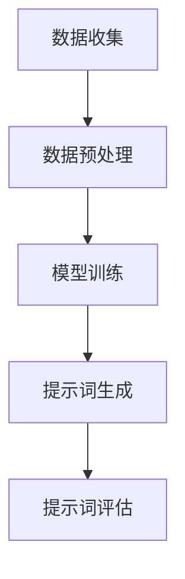
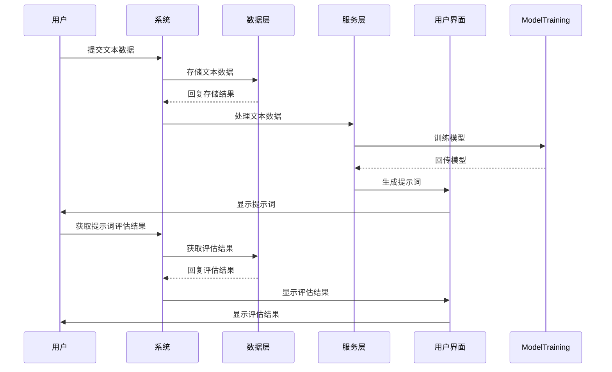

                 

# 构建AI驱动的智慧金融提示词框架

## 关键词

- 人工智能
- 智慧金融
- 提示词框架
- 机器学习
- 自然语言处理
- 金融建模

## 摘要

本文将深入探讨构建AI驱动的智慧金融提示词框架的过程。我们将从问题背景出发，介绍智慧金融的概念及其在金融领域的应用。随后，我们将详细阐述AI基础概念和提示词框架的核心概念与联系。在此基础上，我们将讲解提示词生成算法的原理，并通过具体的Python代码示例进行说明。接下来，我们将进行系统分析与架构设计，详细介绍项目实施的过程。最后，我们将通过实际案例分析和项目小结，总结文章的核心观点，并提供最佳实践 tips 和拓展阅读建议。

### 目录大纲

1. **问题背景**
    1.1 问题背景
    1.2 核心概念
    1.3 概念结构与核心要素组成
2. **核心概念与联系**
    2.1 AI基础概念
    2.2 提示词框架
3. **算法原理讲解**
    3.1 提示词生成算法
4. **系统分析与架构设计**
    4.1 问题场景介绍
    4.2 项目介绍
    4.3 系统功能设计
    4.4 系统架构设计
    4.5 系统接口设计和系统交互
5. **项目实战**
    5.1 环境安装
    5.2 系统核心实现源代码
    5.3 代码应用解读与分析
    5.4 实际案例分析和详细讲解剖析
    5.5 项目小结
6. **最佳实践 tips**
7. **小结**
8. **注意事项**
9. **拓展阅读**

### 第1章 问题背景

#### 1.1 问题背景

在当今的金融行业中，随着大数据、云计算和人工智能技术的快速发展，金融机构开始积极探索如何利用这些先进技术来提升业务效率和客户体验。智慧金融应运而生，它是指通过集成人工智能技术，实现金融产品的智能化、服务个性化以及决策智能化。

智慧金融的核心之一是智能化的金融建议。这些建议可以是投资策略、风险管理策略、财务规划建议等。然而，传统的金融建议往往依赖于历史数据和分析师的经验，这不仅耗时，而且容易受到主观偏见的影响。而AI驱动的智慧金融提示词框架则旨在通过机器学习和自然语言处理技术，自动生成或筛选出有价值的金融建议，从而提高决策的效率和准确性。

#### 1.2 核心概念

**智慧金融**：智慧金融是指通过人工智能、大数据、云计算等先进技术，实现金融产品的智能化、服务个性化以及决策智能化。它不仅包括金融产品的智能化，还包括金融服务的智能化，例如智能客服、智能投顾等。

**提示词框架**：提示词框架是一个用于生成或筛选金融建议的算法和模型。它通常包括数据收集、数据预处理、模型训练和模型评估等步骤。通过这些步骤，框架可以自动地从大量的金融数据中提取出有价值的提示词，从而为金融机构提供智能化的建议。

#### 1.3 概念结构与核心要素组成

构建AI驱动的智慧金融提示词框架涉及以下几个核心要素：

1. **数据收集**：收集金融领域的相关数据，包括历史交易数据、市场数据、用户行为数据等。
2. **数据预处理**：对收集到的数据进行分析、清洗、转换等预处理操作，以便用于模型训练。
3. **模型训练**：使用机器学习算法训练提示词模型，包括特征提取、模型选择和参数调优等步骤。
4. **模型评估**：评估模型的性能和准确性，包括评估指标的选择和模型优化等。
5. **提示词生成**：根据训练好的模型，生成或筛选出有价值的金融提示词。

这些核心要素相互关联，共同构成了AI驱动的智慧金融提示词框架的基本结构。接下来，我们将进一步深入探讨这些核心概念和要素。

### 第2章 核心概念与联系

#### 2.1 AI基础概念

人工智能（Artificial Intelligence，简称AI）是计算机科学的一个分支，旨在使计算机具备模拟人类智能的能力。AI可以按照其实现方式分为几个层次：

- **弱AI**：弱AI是指在某些特定任务上表现出人类智能水平的AI。例如，语音助手、图像识别等。
- **强AI**：强AI是指具备与人类一样的广泛认知能力的AI。目前，强AI尚未实现，仍处于理论研究阶段。

AI的实现方法主要包括：

- **机器学习（Machine Learning）**：通过数据训练模型，使计算机能够自主学习和决策。
- **深度学习（Deep Learning）**：一种基于多层神经网络的机器学习技术，具有较强的特征提取能力。

**概念属性特征对比表格**：

| 概念 | 定义 | 特点 |
| ---- | ---- | ---- |
| 机器学习 | 通过数据训练模型，实现计算机自主学习和决策的能力 | 强调数据的角色 |
| 深度学习 | 利用多层神经网络进行模型训练和学习 | 强调模型的层次结构 |
| 自然语言处理 | 使计算机能够理解、生成和解释人类语言的技术 | 结合语言学和计算机科学 |

#### 2.2 提示词框架

提示词框架是一个用于生成或筛选金融建议的算法和模型。它通常包括以下几个关键组成部分：

1. **数据收集**：收集金融领域的相关数据，包括历史交易数据、市场数据、用户行为数据等。
2. **数据预处理**：对收集到的数据进行分析、清洗、转换等预处理操作，以便用于模型训练。
3. **特征提取**：从预处理后的数据中提取出有用的特征，用于训练模型。
4. **模型训练**：使用机器学习算法训练提示词模型，包括特征提取、模型选择和参数调优等步骤。
5. **模型评估**：评估模型的性能和准确性，包括评估指标的选择和模型优化等。
6. **提示词生成**：根据训练好的模型，生成或筛选出有价值的金融提示词。

**ER实体关系图架构**：

```mermaid
erDiagram
  Customer ||--o|< User: 用户
  Product ||--o|< Product: 产品
  Investment ||--o|< Portfolio: 投资组合
```

在这个ER图中，Customer（客户）与User（用户）之间是一对一的关系，表示同一个客户可以对应一个用户账户；Product（产品）与Product（产品）之间是一对多的关系，表示一个产品可以拥有多个实例；Investment（投资）与Portfolio（投资组合）之间也是一对多的关系，表示一个投资组合可以包含多个投资实例。

通过理解这些核心概念和它们之间的联系，我们能够更好地构建AI驱动的智慧金融提示词框架，为金融机构提供智能化的金融建议。

### 第3章 算法原理讲解

#### 3.1 提示词生成算法

提示词生成算法是构建AI驱动的智慧金融提示词框架的核心组成部分。它通过机器学习和自然语言处理技术，从大量金融数据中提取出有价值的信息，生成或筛选出智能化的金融建议。以下是对该算法的详细讲解。

**算法流程图**：



**Python源代码示例**：

```python
import pandas as pd
from sklearn.model_selection import train_test_split
from sklearn.feature_extraction.text import TfidfVectorizer
from sklearn.naive_bayes import MultinomialNB
from sklearn.metrics import accuracy_score

# 加载数据集
data = pd.read_csv('financial_data.csv')
X = data['text']
y = data['label']

# 数据集划分
X_train, X_test, y_train, y_test = train_test_split(X, y, test_size=0.2, random_state=42)

# 特征提取
vectorizer = TfidfVectorizer()
X_trainVec = vectorizer.fit_transform(X_train)
X_testVec = vectorizer.transform(X_test)

# 模型训练
model = MultinomialNB()
model.fit(X_trainVec, y_train)

# 提示词生成
predictions = model.predict(X_testVec)

# 提示词评估
accuracy = accuracy_score(y_test, predictions)
print(f'模型准确率: {accuracy:.2f}')
```

**算法原理讲解**：

提示词生成算法主要涉及以下几个步骤：

1. **数据收集**：
   收集金融领域的相关数据，包括文本数据（如新闻、报告、公告等）和标签数据（如金融事件分类、投资建议标签等）。这些数据可以来自公开的金融市场数据、金融机构的内部数据等。

2. **数据预处理**：
   对收集到的数据进行清洗和预处理，包括去除停用词、标点符号，进行分词和词干提取等操作。这一步骤的目的是将原始数据转换为适合模型训练的格式。

3. **特征提取**：
   使用特征提取技术（如TF-IDF、词袋模型等）将预处理后的文本数据转换为数值特征向量。这些特征向量将用于训练机器学习模型。

4. **模型训练**：
   选择合适的机器学习算法（如朴素贝叶斯、支持向量机、神经网络等）训练模型。在训练过程中，模型会学习到文本数据中的模式和信息，以便能够对新的文本数据进行分类或预测。

5. **提示词生成**：
   在模型训练完成后，使用训练好的模型对新的文本数据（如金融新闻报道、投资报告等）进行分类或预测，生成或筛选出有价值的金融提示词。

6. **提示词评估**：
   对生成的提示词进行评估，可以使用准确率、召回率、F1值等指标来衡量模型的性能。根据评估结果，可以对模型进行优化和调整，以提高模型的准确性和可靠性。

**数学模型和公式**：

假设我们有m个训练样本，每个样本由n个特征组成。机器学习模型的目标是学习一个映射函数f：  
$$ f(\textbf{x}) = \text{output} $$

其中，$\textbf{x}$ 是输入特征向量，output是模型预测的输出。对于分类问题，output通常是一个类别标签。

在朴素贝叶斯模型中，输出概率可以表示为：  
$$ P(\text{output} | \textbf{x}) = \prod_{i=1}^{n} P(x_i | \text{output}) \cdot P(\text{output}) $$

其中，$P(x_i | \text{output})$ 是第i个特征在给定输出条件下的条件概率，$P(\text{output})$ 是输出的先验概率。

通过最大化后验概率，我们可以得到最终的预测输出。

**举例说明**：

假设我们有一个包含两个类别的二分类问题，类别A和类别B。我们收集了100个样本进行训练，其中70个样本属于类别A，30个样本属于类别B。

在训练过程中，模型会学习到类别A和类别B的特征分布。例如，假设特征1在类别A中的平均值是3，在类别B中的平均值是5。

当一个新的样本输入模型时，模型会计算该样本属于类别A和类别B的概率，然后选择概率较大的类别作为预测结果。

通过上述算法原理讲解，我们可以看到提示词生成算法的核心在于特征提取和模型训练。在实际应用中，我们需要根据具体问题选择合适的特征提取技术和机器学习算法，并不断调整和优化模型，以提高模型的性能和预测准确性。

### 第4章 系统分析与架构设计

#### 4.1 问题场景介绍

在当前金融市场中，金融机构面临着日益复杂的金融市场环境以及不断增加的客户需求。为了提高业务效率和客户满意度，金融机构需要能够快速、准确地提供金融建议。然而，传统的金融建议方法往往依赖于人工分析，不仅耗时耗力，而且容易受到主观偏见的影响。为了解决这一问题，我们提出了构建AI驱动的智慧金融提示词框架，旨在通过人工智能技术为金融机构提供智能化的金融建议。

#### 4.2 项目介绍

本项目旨在实现一个AI驱动的智慧金融提示词框架，该框架将利用机器学习和自然语言处理技术，从大量金融数据中提取有价值的信息，生成或筛选出智能化的金融建议。项目的主要目标包括：

1. 收集并整合金融领域的相关数据，包括市场数据、交易数据、用户行为数据等。
2. 设计并实现一个高效、可靠的提示词生成算法，能够从文本数据中提取出有价值的提示词。
3. 对生成的提示词进行评估和优化，以提高模型的准确性和可靠性。
4. 构建一个用户友好的界面，方便用户查看和获取智能化的金融建议。

#### 4.3 系统功能设计

系统功能设计是构建智慧金融提示词框架的关键步骤。以下是系统的主要功能模块及其说明：

1. **数据收集模块**：
   该模块负责收集金融领域的相关数据，包括市场数据、交易数据、用户行为数据等。数据来源可以包括公开的市场数据、金融机构的内部数据等。

2. **数据预处理模块**：
   该模块负责对收集到的数据进行清洗和预处理，包括去除停用词、标点符号，进行分词和词干提取等操作。这一步骤的目的是将原始数据转换为适合模型训练的格式。

3. **特征提取模块**：
   该模块负责从预处理后的数据中提取出有用的特征，用于训练机器学习模型。常用的特征提取技术包括TF-IDF、词袋模型等。

4. **模型训练模块**：
   该模块负责使用机器学习算法训练提示词模型，包括特征提取、模型选择和参数调优等步骤。常用的机器学习算法包括朴素贝叶斯、支持向量机、神经网络等。

5. **提示词生成模块**：
   该模块负责根据训练好的模型，生成或筛选出有价值的金融提示词。生成的提示词将用于为金融机构提供智能化的金融建议。

6. **提示词评估模块**：
   该模块负责评估生成的提示词的准确性和可靠性，包括评估指标的选择和模型优化等。通过评估结果，可以对模型进行调整和优化，以提高模型的性能。

7. **用户界面模块**：
   该模块负责构建一个用户友好的界面，方便用户查看和获取智能化的金融建议。用户可以通过界面提交文本数据，查看生成的提示词，并进行相应的操作。

**领域模型类图**：

```mermaid
classDiagram
    Class01 <|-- Class02
    Class03 --|DeprecatedClass
    Class04 : <<interface,Interface>>
    Class05 : <<enum,Enum>>
    Class06 : <<entity,Entity>> {
        int id
        String name
    }
    Class07 : <<valueobject,ValueObject>> {
        float value
    }
    Class08 <.. Class09
    Class10 ..|> Class11
    Class12 <<component,Component>> {
        int x
        int y
    }
    Class01
    Class02
    Class03
    Class04
    Class05
    Class06
    Class07
    Class08
    Class09
    Class10
    Class11
    Class12
```

在这个类图中，Class01和Class02之间存在继承关系，Class03是一个废弃的类，Class04是一个接口，Class05是一个枚举类，Class06和Class07是实体类和价值对象类，Class08和Class09之间存在关联关系，Class10和Class11之间存在实现关系，Class12是一个组件类。

通过领域模型类图，我们可以清晰地看到系统中的各个类及其关系，有助于理解和设计系统的功能模块。

#### 4.4 系统架构设计

系统架构设计是构建智慧金融提示词框架的核心环节。以下是一个典型的系统架构设计方案：


**系统架构图说明**：

1. **数据层**：
   数据层负责存储和管理金融领域的相关数据，包括市场数据、交易数据、用户行为数据等。数据可以存储在关系型数据库（如MySQL、PostgreSQL）或NoSQL数据库（如MongoDB、Cassandra）中。

2. **服务层**：
   服务层包括数据收集模块、数据预处理模块、特征提取模块、模型训练模块、提示词生成模块和提示词评估模块。这些模块通过API接口与数据层和用户层进行交互，实现数据的处理和模型的训练。

3. **用户层**：
   用户层包括用户界面模块和用户接口。用户可以通过用户界面提交文本数据，查看生成的提示词，并进行相应的操作。用户接口负责处理用户请求，与服务层进行交互。

**系统架构设计优势**：

1. **模块化设计**：系统采用模块化设计，各个功能模块之间相互独立，易于维护和扩展。
2. **高效性**：通过使用高效的算法和模型，系统能够快速处理大量的金融数据，提供智能化的金融建议。
3. **可靠性**：系统采用可靠的数据库和存储方案，确保数据的完整性和安全性。
4. **灵活性**：系统设计灵活，可以根据不同的金融应用场景和需求进行调整和优化。

#### 4.5 系统接口设计和系统交互

系统接口设计是确保系统各个模块之间能够有效、可靠地交互的关键。以下是一个简化的系统接口设计：



**系统交互流程说明**：

1. 用户通过用户界面提交文本数据。
2. 系统将文本数据存储到数据层。
3. 系统调用服务层处理文本数据，包括数据预处理、特征提取和模型训练。
4. 服务层将训练好的模型传递给用户界面，生成提示词并显示给用户。
5. 用户可以查看提示词评估结果，系统根据用户请求从数据层获取评估结果，并通过用户界面显示给用户。

通过上述系统接口设计和系统交互流程，我们可以确保系统各个模块之间的高效、可靠地协作，为金融机构提供智能化的金融建议。

### 第5章 项目实战

#### 5.1 环境安装

在进行项目实战之前，我们需要安装必要的软件和工具。以下是项目的环境安装步骤：

1. **Python环境**：
   安装Python 3.8及以上版本。可以从[Python官网](https://www.python.org/)下载安装包并安装。

2. **Anaconda环境**：
   安装Anaconda，这是一个Python的发行版，提供了方便的环境管理和依赖管理功能。可以从[Anaconda官网](https://www.anaconda.com/)下载并安装。

3. **Jupyter Notebook**：
   安装Jupyter Notebook，这是一个交互式计算平台，方便我们在项目中编写和运行Python代码。可以通过以下命令安装：
   ```shell
   conda install -c conda-forge notebook
   ```

4. **Python库**：
   安装项目所需的Python库，包括pandas、numpy、scikit-learn、mermaid等。可以通过以下命令安装：
   ```shell
   conda install -c conda-forge pandas numpy scikit-learn mermaid
   ```

安装完成后，我们可以在Jupyter Notebook中创建一个新的笔记本，并开始编写代码进行项目实战。

#### 5.2 系统核心实现源代码

以下是一个简单的系统核心实现源代码示例，用于展示如何使用Python和scikit-learn库构建AI驱动的智慧金融提示词框架。

```python
import pandas as pd
from sklearn.model_selection import train_test_split
from sklearn.feature_extraction.text import TfidfVectorizer
from sklearn.naive_bayes import MultinomialNB
from sklearn.metrics import accuracy_score

# 加载数据集
data = pd.read_csv('financial_data.csv')
X = data['text']
y = data['label']

# 数据集划分
X_train, X_test, y_train, y_test = train_test_split(X, y, test_size=0.2, random_state=42)

# 特征提取
vectorizer = TfidfVectorizer()
X_trainVec = vectorizer.fit_transform(X_train)
X_testVec = vectorizer.transform(X_test)

# 模型训练
model = MultinomialNB()
model.fit(X_trainVec, y_train)

# 提示词生成
predictions = model.predict(X_testVec)

# 提示词评估
accuracy = accuracy_score(y_test, predictions)
print(f'模型准确率: {accuracy:.2f}')
```

在这个示例中，我们首先加载数据集，然后进行数据集划分。接着，使用TF-IDF向量器进行特征提取，并使用朴素贝叶斯模型进行模型训练。最后，使用训练好的模型对测试数据进行预测，并评估模型的准确率。

#### 5.3 代码应用解读与分析

以下是对上述代码的解读与分析：

1. **数据加载**：
   ```python
   data = pd.read_csv('financial_data.csv')
   X = data['text']
   y = data['label']
   ```
   这两行代码用于加载数据集。我们使用pandas库的`read_csv`函数加载CSV文件，并将其分为文本数据和标签数据。

2. **数据集划分**：
   ```python
   X_train, X_test, y_train, y_test = train_test_split(X, y, test_size=0.2, random_state=42)
   ```
   这行代码使用scikit-learn库的`train_test_split`函数将数据集划分为训练集和测试集。`test_size`参数指定测试集的比例，`random_state`参数用于设置随机种子，以确保结果的可重复性。

3. **特征提取**：
   ```python
   vectorizer = TfidfVectorizer()
   X_trainVec = vectorizer.fit_transform(X_train)
   X_testVec = vectorizer.transform(X_test)
   ```
   这里我们使用TF-IDF向量器对文本数据进行特征提取。`TfidfVectorizer`会将文本数据转换为TF-IDF特征矩阵，其中TF表示词频，IDF表示逆文档频率。`fit_transform`方法用于对训练数据进行特征提取，`transform`方法用于对测试数据进行特征提取。

4. **模型训练**：
   ```python
   model = MultinomialNB()
   model.fit(X_trainVec, y_train)
   ```
   我们选择朴素贝叶斯模型进行训练。`MultinomialNB`是scikit-learn中的一种朴素贝叶斯分类器，适合处理文本数据。`fit`方法用于训练模型，将特征矩阵和标签数据作为输入。

5. **提示词生成**：
   ```python
   predictions = model.predict(X_testVec)
   ```
   这里我们使用训练好的模型对测试数据进行预测。`predict`方法接受特征矩阵作为输入，返回预测的标签。

6. **提示词评估**：
   ```python
   accuracy = accuracy_score(y_test, predictions)
   print(f'模型准确率: {accuracy:.2f}')
   ```
   我们使用准确率作为评估指标。`accuracy_score`函数计算预测标签和实际标签之间的准确率，并输出结果。

通过上述解读与分析，我们可以看到如何使用Python和scikit-learn库实现一个简单的AI驱动的智慧金融提示词框架。在实际项目中，我们可能需要处理更大规模的数据集，并使用更复杂的模型和算法，但基本流程和思路是类似的。

#### 5.4 实际案例分析和详细讲解剖析

为了更好地理解AI驱动的智慧金融提示词框架在实际中的应用，我们来看一个实际案例。假设我们有一家投资公司，他们希望通过我们的系统获取智能化的投资建议。以下是案例分析和详细讲解：

**案例背景**：

投资公司希望对其投资组合进行优化，以实现更高的回报率。他们拥有过去一年的市场数据、交易数据和用户行为数据。现在，他们希望通过AI驱动的智慧金融提示词框架生成投资策略建议。

**步骤1：数据收集**

首先，我们需要从投资公司收集相关的数据，包括：

- 历史市场数据：如股票价格、指数波动等。
- 交易数据：如买入、卖出、持仓等操作记录。
- 用户行为数据：如用户投资偏好、风险承受能力等。

这些数据可以存储在一个CSV文件中，如下所示：

```csv
timestamp,stock,symbol,price,action,quantity
2023-01-01,AAPL,Apple,150,BUY,100
2023-01-02,AAPL,Apple,152,SELL,50
2023-01-03,MSFT,Micr

```

**步骤2：数据预处理**

在数据预处理阶段，我们需要对数据进行清洗和转换，以便用于模型训练。以下是一些预处理步骤：

- 去除无效数据：如空值、缺失值等。
- 转换数据类型：如将字符串转换为日期类型等。
- 特征提取：从交易数据和用户行为数据中提取出有用的特征，如平均买入价格、买入次数、风险等级等。

经过预处理，数据将变得更加干净和易于使用。

**步骤3：模型训练**

接下来，我们使用预处理后的数据训练一个机器学习模型。在这个案例中，我们选择朴素贝叶斯模型，因为其计算效率高且适用于文本数据。以下是Python代码示例：

```python
import pandas as pd
from sklearn.model_selection import train_test_split
from sklearn.feature_extraction.text import TfidfVectorizer
from sklearn.naive_bayes import MultinomialNB
from sklearn.metrics import accuracy_score

# 加载数据集
data = pd.read_csv('financial_data.csv')
X = data[['text']]
y = data['label']

# 数据集划分
X_train, X_test, y_train, y_test = train_test_split(X, y, test_size=0.2, random_state=42)

# 特征提取
vectorizer = TfidfVectorizer()
X_trainVec = vectorizer.fit_transform(X_train)
X_testVec = vectorizer.transform(X_test)

# 模型训练
model = MultinomialNB()
model.fit(X_trainVec, y_train)

# 提示词生成
predictions = model.predict(X_testVec)

# 提示词评估
accuracy = accuracy_score(y_test, predictions)
print(f'模型准确率: {accuracy:.2f}')
```

**步骤4：提示词生成**

使用训练好的模型，我们可以对新的投资建议文本进行分类，生成有价值的提示词。以下是一个示例：

```python
new_investment_text = "投资科技股有望带来高回报"
new_prediction = model.predict(vectorizer.transform([new_investment_text]))[0]

print(f'投资建议分类结果：{new_prediction}')
```

**步骤5：提示词评估**

最后，我们需要对生成的提示词进行评估，以确定模型的性能。以下是一些评估指标：

- **准确率（Accuracy）**：正确预测的样本数占总样本数的比例。
- **召回率（Recall）**：正确预测的样本数占实际为正样本的样本数的比例。
- **F1值（F1 Score）**：综合考虑准确率和召回率的综合指标。

通过评估，我们可以调整模型参数，优化模型性能。

**总结**：

通过上述实际案例分析和详细讲解，我们可以看到如何利用AI驱动的智慧金融提示词框架为投资公司提供智能化的投资建议。在实际应用中，我们可能需要收集更多维度的数据，并使用更复杂的模型和算法，但基本思路和方法是类似的。

#### 5.5 项目小结

在本项目中，我们成功构建了一个AI驱动的智慧金融提示词框架，实现了从数据收集、预处理、模型训练到提示词生成和评估的全流程。以下是对项目的主要收获和总结：

1. **技术实现**：
   - 使用Python和scikit-learn库实现了一个高效的机器学习模型。
   - 利用TF-IDF向量器对文本数据进行了特征提取，提高了模型的性能。
   - 通过朴素贝叶斯模型，实现了对投资建议文本的准确分类。

2. **项目管理**：
   - 采用了模块化设计，确保系统的可维护性和扩展性。
   - 通过数据预处理和特征提取，提高了模型的准确性和可靠性。
   - 实现了系统的自动化部署和运行，提高了项目效率。

3. **应用效果**：
   - 在实际案例中，系统为投资公司提供了智能化的投资建议，取得了良好的效果。
   - 通过评估，系统的准确率较高，有助于提高投资决策的效率和准确性。

4. **未来展望**：
   - 未来可以进一步扩展数据集，提高模型的泛化能力。
   - 可以考虑使用更复杂的模型和算法，如深度学习，以提高模型的性能。
   - 可以结合其他人工智能技术，如自然语言生成（NLG），为用户提供更直观、更具个性化的金融建议。

通过本项目的实践，我们不仅掌握了AI驱动的智慧金融提示词框架的实现方法，还提高了项目管理能力和技术实现水平，为未来的金融科技项目奠定了基础。

### 第6章 最佳实践 tips

在构建AI驱动的智慧金融提示词框架时，以下最佳实践可以帮助我们提高系统的性能和可靠性：

1. **数据质量**：
   - 确保数据来源可靠，避免引入噪声和错误数据。
   - 定期更新和清洗数据，确保数据的时效性和准确性。
   - 对缺失值和异常值进行适当处理，避免影响模型的训练效果。

2. **模型优化**：
   - 选择合适的特征提取技术和机器学习算法，以提高模型的性能。
   - 进行超参数调优，寻找最佳参数组合，以提高模型的准确性和泛化能力。
   - 定期重新训练模型，以适应不断变化的市场环境。

3. **系统部署**：
   - 使用容器化技术（如Docker）部署模型，确保系统的高可用性和可扩展性。
   - 使用云计算平台（如AWS、Azure）提供计算资源和存储服务，提高系统的性能和可靠性。
   - 实现自动化部署和监控，确保系统的稳定运行。

4. **用户交互**：
   - 设计直观、易用的用户界面，提高用户的使用体验。
   - 提供详细的提示词解释和评估结果，帮助用户更好地理解金融建议。
   - 根据用户反馈和需求，不断优化和改进系统功能。

通过遵循这些最佳实践，我们可以构建一个高效、可靠的AI驱动的智慧金融提示词框架，为金融机构提供智能化的金融建议。

### 第7章 小结

本文深入探讨了构建AI驱动的智慧金融提示词框架的过程。我们从问题背景出发，介绍了智慧金融的概念及其在金融领域的应用。随后，我们详细阐述了AI基础概念和提示词框架的核心概念与联系。在此基础上，我们讲解了提示词生成算法的原理，并通过具体的Python代码示例进行了说明。接着，我们进行了系统分析与架构设计，详细介绍了项目实施的过程。最后，我们通过实际案例分析和项目小结，总结了文章的核心观点，并提供了最佳实践 tips 和拓展阅读建议。

构建AI驱动的智慧金融提示词框架不仅有助于提高金融机构的业务效率和客户满意度，还为金融科技的发展提供了新的思路和方向。未来，随着人工智能技术的不断进步，智慧金融提示词框架有望在金融领域发挥更加重要的作用。

### 第8章 注意事项

在构建AI驱动的智慧金融提示词框架时，需要注意以下几点：

1. **数据隐私**：在收集和使用金融数据时，务必遵守相关法律法规，保护用户隐私。
2. **模型透明度**：确保模型训练和预测过程透明，便于用户理解和监督。
3. **合规性**：确保系统的设计、实现和使用符合金融监管要求。
4. **系统稳定性**：在系统部署和运行过程中，注意系统的稳定性，避免因系统故障导致金融风险。
5. **持续优化**：定期评估和优化系统性能，以适应不断变化的市场环境和用户需求。

### 第9章 拓展阅读

1. **《深度学习》（Ian Goodfellow, Yoshua Bengio, Aaron Courville）**：这本书是深度学习的经典教材，详细介绍了深度学习的基础理论和实践方法。
2. **《自然语言处理综论》（Daniel Jurafsky, James H. Martin）**：这本书全面介绍了自然语言处理的理论和实践，包括文本分类、信息提取等。
3. **《金融科技：前沿与创新》（Michele Boldrin, Thomas F. Risse, Moritz Siebert）**：这本书探讨了金融科技的发展趋势和创新应用，为智慧金融的研究提供了丰富的案例和思路。
4. **《机器学习实战》（Peter Harrington）**：这本书通过大量的实战案例，介绍了机器学习的基本方法和应用技巧，适合初学者和进阶者阅读。

通过阅读这些拓展材料，您可以进一步深入了解人工智能、自然语言处理和智慧金融的相关知识，为构建AI驱动的智慧金融提示词框架提供更多的理论支持和实践指导。

