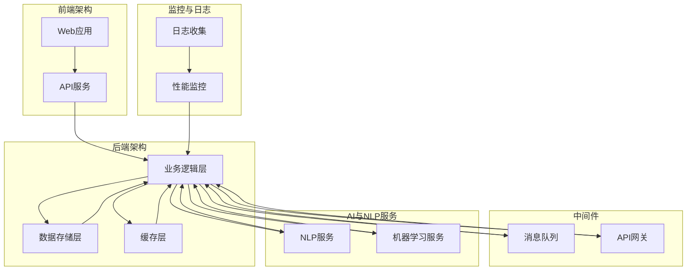
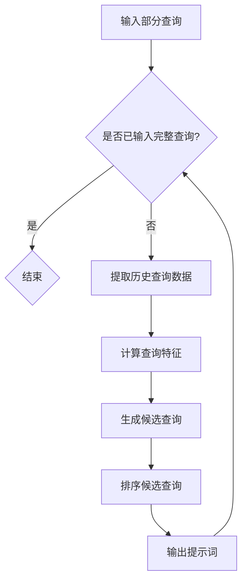

                 


### 第1章: 智慧零售概述

#### 1.1 智慧零售的概念与发展

智慧零售是指利用人工智能、大数据、云计算、物联网等现代信息技术，对零售业进行全方位、全流程的智能化升级和改造，从而实现零售业务的高效、精准和智能化的运营。智慧零售不仅关注消费者的购物体验，还注重提升零售企业的运营效率和盈利能力。

智慧零售的发展历程可以分为几个阶段：

1. **初步阶段**（2000年代初）：零售业开始尝试使用电子商务平台和在线支付系统，以拓展销售渠道和提升用户体验。
2. **应用阶段**（2010年代）：随着移动互联网的普及，移动购物、O2O（线上到线下）购物等新模式逐渐成熟，零售企业开始大规模应用大数据和云计算技术。
3. **智能化阶段**（2020年代至今）：人工智能技术如深度学习、自然语言处理等在零售业中得到广泛应用，零售企业通过智能推荐、智能客服、智能供应链管理等手段提升运营效率。

#### 1.2 智慧零售的关键技术

智慧零售的实现依赖于多种关键技术的支撑，其中最核心的技术包括：

1. **人工智能（AI）**：通过机器学习、深度学习等算法，实现对消费者行为、购物趋势等的精准预测和分析。
2. **大数据**：通过收集和分析海量数据，挖掘消费者需求和市场趋势，为决策提供数据支持。
3. **云计算**：提供强大的计算能力和存储资源，支持大规模数据处理和实时分析。
4. **物联网（IoT）**：通过传感器和设备连接，实现零售环境中的实时监控和智能管理。
5. **区块链**：提供安全、透明的数据存储和交易机制，保障供应链的可追溯性和数据真实性。

#### 1.3 智慧零售的市场前景与挑战

智慧零售的市场前景非常广阔，随着技术的不断进步和消费者需求的升级，智慧零售在全球范围内正迎来快速发展期。然而，智慧零售的发展也面临着一些挑战：

1. **技术挑战**：如何有效整合多种技术，构建一个统一、高效的智慧零售系统，是当前面临的主要问题。
2. **数据安全与隐私**：随着数据量的增加，数据安全和隐私保护成为企业必须重视的问题。
3. **人才培养**：智慧零售的发展需要大量具备跨学科背景的人才，当前人才供给难以满足需求。
4. **行业规范**：智慧零售涉及的法律法规、行业标准等尚不完善，需要逐步完善。

#### 1.4 智慧零售的边界与外延

智慧零售不仅仅局限于电子商务和线下零售的结合，其外延还包括以下几个方面：

1. **智慧供应链**：通过智能化手段优化供应链管理，实现快速响应市场需求。
2. **智慧物流**：利用人工智能、物联网等技术，提升物流配送效率，降低物流成本。
3. **智慧门店**：通过人脸识别、智能推荐等技术，提升消费者的购物体验。
4. **智慧农场**：利用物联网、人工智能等技术，实现精准农业，提升农产品产量和质量。
5. **智慧家居**：通过智能设备连接，实现家居生活的智能化、便捷化。

在接下来的章节中，我们将进一步探讨AI在智慧零售中的应用，特别是AI驱动的智慧零售提示词平台的设计与实现。

----------------------------------------------------------------

### 第2章：核心概念与联系

#### 2.1 AI的基本原理

人工智能（Artificial Intelligence，简称AI）是模拟、延伸和扩展人的智能的理论、方法、技术及应用。它包括机器学习、深度学习、自然语言处理、计算机视觉等多个子领域。AI的目标是通过计算机系统实现人类智能的各种功能，如感知、学习、推理、决策等。

**核心原理：**

1. **机器学习（Machine Learning）**：机器学习是一种通过数据驱动的方法，让计算机从数据中学习规律、模式，并利用这些规律进行预测和决策的技术。
2. **深度学习（Deep Learning）**：深度学习是机器学习的一个分支，通过多层神经网络（Neural Networks）模型，对大量数据进行自动特征提取和模式识别。
3. **自然语言处理（Natural Language Processing，简称NLP）**：NLP是AI的一个子领域，旨在让计算机理解和处理人类语言，包括语言理解、语言生成、情感分析等。

**核心算法：**

1. **神经网络（Neural Networks）**：神经网络是一种模仿生物神经系统的计算模型，通过多层节点（神经元）实现数据输入到输出的映射。
2. **决策树（Decision Trees）**：决策树是一种基于特征分割的数据挖掘算法，通过一系列规则对数据进行分类或回归。
3. **支持向量机（Support Vector Machines，简称SVM）**：SVM是一种监督学习算法，通过找到一个最佳的超平面，将不同类别的数据分开。

#### 2.2 机器学习的关键概念

**机器学习的核心概念包括：**

1. **监督学习（Supervised Learning）**：在有标注的数据集上训练模型，通过已知的输入和输出，学习数据之间的映射关系。
2. **无监督学习（Unsupervised Learning）**：在没有标注的数据集上训练模型，通过发现数据内在的结构或模式，进行聚类、降维等操作。
3. **强化学习（Reinforcement Learning）**：通过与环境互动，不断优化策略，以实现特定的目标。
4. **模型评估（Model Evaluation）**：使用各种指标（如准确率、召回率、F1值等）来评估模型的性能。
5. **超参数（Hyperparameters）**：超参数是模型训练过程中需要手动调整的参数，如学习率、隐藏层节点数等。

**对比表格：**

| 学习类型 | 特点 | 应用场景 |
| --- | --- | --- |
| 监督学习 | 已知输入输出 | 分类、回归 |
| 无监督学习 | 无标签数据 | 聚类、降维 |
| 强化学习 | 与环境互动 | 游戏AI、机器人控制 |

#### 2.3 自然语言处理在零售中的应用

自然语言处理（NLP）在零售业中发挥着重要作用，主要体现在以下几个方面：

1. **智能客服（Chatbots）**：通过NLP技术，智能客服可以理解用户的提问，并提供个性化的购物建议和解决方案。
2. **情感分析（Sentiment Analysis）**：通过对用户评论、反馈等文本数据进行分析，了解用户对产品和服务的情感倾向，优化产品和服务。
3. **商品推荐（Recommendation Systems）**：利用NLP技术，分析用户的历史购物记录和搜索行为，为用户提供个性化的商品推荐。
4. **语音识别（Speech Recognition）**：通过语音识别技术，用户可以使用语音与零售系统进行交互，提升购物体验。
5. **内容审核（Content Moderation）**：利用NLP技术，自动识别和过滤不当内容，确保平台内容安全。

**ER实体关系图架构：**

```mermaid
erDiagram
    Customer ||--|{ Order }||>
    Product ||--|{ Order }||>
    Review ||--|{ Product }||>
    Review ||--|{ Customer }||>
```

在智慧零售提示词平台中，这些实体之间的关系将决定系统的功能模块和数据流动，为后续章节的系统设计与实现提供基础。

通过本章节的探讨，我们了解了AI、机器学习和NLP的基本原理和关键概念，以及它们在智慧零售中的应用。在下一章节中，我们将进一步探讨智慧零售提示词平台的需求分析和架构设计。

----------------------------------------------------------------

### 第3章：系统分析与架构设计

#### 3.1 提示词平台的需求分析

智慧零售提示词平台的设计需要充分考虑用户需求、业务需求和系统性能需求，从而确保平台的易用性、灵活性和高效性。以下是主要的需求分析：

1. **用户需求：**

   - **个性化推荐**：根据用户的历史购物行为和偏好，为用户推荐相关的商品和促销活动。
   - **实时搜索**：提供实时搜索功能，快速响应用户的查询需求。
   - **智能客服**：通过自然语言处理技术，实现智能客服功能，提供24/7的在线服务。
   - **用户行为分析**：收集并分析用户在平台上的行为数据，为运营决策提供数据支持。

2. **业务需求：**

   - **数据整合**：集成多种数据源，包括用户数据、商品数据、促销数据等，实现数据的一致性和完整性。
   - **系统扩展性**：支持业务的快速扩展，如增加新功能、接入新数据源等。
   - **高可用性**：确保系统稳定运行，提供7x24小时不间断的服务。
   - **安全性和隐私保护**：保障用户数据的安全和隐私，防止数据泄露和滥用。

3. **系统性能需求：**

   - **响应速度**：优化系统性能，确保用户在搜索、推荐等操作时的响应时间在1秒以内。
   - **并发处理能力**：支持高并发访问，确保平台在高流量情况下稳定运行。
   - **可扩展性**：支持水平扩展，通过增加服务器节点来提升系统的处理能力。

#### 3.2 提示词平台的架构设计

智慧零售提示词平台的架构设计需要考虑系统的可扩展性、可靠性和高性能，以下是一个典型的架构设计：

1. **前端架构：**

   - **Web应用**：使用Vue.js或React等前端框架，实现用户界面的展示和交互。
   - **API服务**：通过RESTful API或GraphQL接口，提供数据访问和业务逻辑处理。

2. **后端架构：**

   - **业务逻辑层**：使用Spring Boot或Django等框架，实现业务逻辑处理和数据处理。
   - **数据存储层**：使用MySQL、MongoDB等数据库，存储用户数据、商品数据等。
   - **缓存层**：使用Redis等缓存技术，提高数据读取速度，减轻数据库压力。

3. **中间件：**

   - **消息队列**：使用RabbitMQ或Kafka等消息队列，实现异步消息传递和系统解耦。
   - **API网关**：使用Spring Cloud Gateway或Kong等API网关，统一管理和路由API请求。

4. **AI与NLP服务：**

   - **NLP服务**：使用TensorFlow或PyTorch等框架，实现自然语言处理功能，如文本分类、情感分析等。
   - **机器学习服务**：使用scikit-learn或XGBoost等库，实现机器学习算法，如分类、回归等。

5. **监控与日志：**

   - **日志收集**：使用ELK（Elasticsearch、Logstash、Kibana）等日志收集系统，实时监控平台运行状态。
   - **性能监控**：使用Prometheus和Grafana等监控工具，实时监控系统性能指标。

#### 3.3 系统架构图

以下是智慧零售提示词平台的一个简化的架构设计图，使用了Mermaid语法表示：



通过上述架构设计，我们可以看到智慧零售提示词平台各个模块之间的联系和协作，为后续的详细设计和实现提供了清晰的方向。

在下一章节中，我们将深入探讨机器学习与提示词生成，以及具体的算法原理和实践。

----------------------------------------------------------------

### 第4章：机器学习与提示词生成

#### 4.1 提示词生成算法的原理

提示词（Query Suggestions）是指当用户输入一个部分查询时，系统根据用户的历史查询行为和当前输入，自动提供一系列相关的查询建议，以提高搜索效率和用户体验。提示词生成算法的核心在于如何从大量历史数据中提取特征，并通过机器学习模型预测用户可能感兴趣的相关查询。

**基本原理：**

1. **词频统计（TF）**：计算每个单词在查询文本中的出现频率，作为其重要性的度量。
2. **逆文档频率（IDF）**：计算每个单词在整个查询集的文档中的分布频率，用于调整词频，消除频繁词的影响。
3. **词嵌入（Word Embedding）**：将单词转换为向量表示，利用神经网络模型学习单词之间的语义关系。
4. **模型训练（Model Training）**：使用有监督或无监督学习算法，对大量数据进行训练，学习输入查询与候选查询之间的关系。

**主要算法：**

1. **基于统计的方法**：如TF-IDF，通过计算词频和逆文档频率生成提示词。
2. **基于机器学习的方法**：如基于矩阵分解、神经网络的方法，通过学习用户查询和候选查询之间的关联性生成提示词。
3. **基于深度学习的方法**：如序列模型（如LSTM、GRU）和注意力机制模型，通过学习长序列数据中的上下文信息生成提示词。

#### 4.2 算法流程与mermaid图示

以下是提示词生成算法的基本流程，并使用Mermaid语法绘制了对应的流程图：



#### 4.3 Python代码实现与讲解

以下是一个简单的基于TF-IDF算法的提示词生成代码示例，我们将通过Python实现这一算法，并进行详细讲解。

```python
import numpy as np
from sklearn.feature_extraction.text import TfidfVectorizer
from sklearn.metrics.pairwise import cosine_similarity

# 历史查询数据
queries = [
    "买手机",
    "华为手机",
    "苹果手机",
    "手机价格",
    "手机摄影",
    "买手机哪里好"
]

# 构建TF-IDF模型
vectorizer = TfidfVectorizer()
X = vectorizer.fit_transform(queries)

# 输入部分查询
partial_query = "买手机"

# 计算查询特征
query_vector = vectorizer.transform([partial_query])

# 生成候选查询
cosine_scores = cosine_similarity(query_vector, X).flatten()

# 排序候选查询
sorted_queries = np.argsort(cosine_scores)[::-1]

# 输出提示词
suggestions = [queries[i] for i in sorted_queries[1:5]]  # 排除输入查询本身
print(suggestions)
```

**代码解析：**

1. **数据准备**：我们首先准备了一组历史查询数据。
2. **TF-IDF模型构建**：使用`TfidfVectorizer`类构建TF-IDF模型，并计算查询集的TF-IDF矩阵。
3. **特征计算**：输入部分查询，使用同样的模型计算其特征向量。
4. **生成候选查询**：计算输入查询与历史查询之间的余弦相似度，得到相似度分数。
5. **排序与输出**：根据相似度分数排序候选查询，并输出前几个最相关的查询作为提示词。

#### 4.4 算法原理的数学模型与公式

提示词生成算法的核心在于相似度计算，以下是TF-IDF算法的数学模型和公式：

1. **词频（TF）**：
   $$ TF(t) = \frac{f(t, d)}{f_{\text{total}}(d)} $$
   其中，$f(t, d)$ 表示单词 $t$ 在文档 $d$ 中的出现次数，$f_{\text{total}}(d)$ 表示文档 $d$ 中所有单词的出现次数。

2. **逆文档频率（IDF）**：
   $$ IDF(t) = \log \left( \frac{N}{n(t)} \right) $$
   其中，$N$ 表示文档总数，$n(t)$ 表示包含单词 $t$ 的文档数。

3. **TF-IDF得分**：
   $$ TF-IDF(t, d) = TF(t, d) \times IDF(t) $$
   TF-IDF得分的计算公式将词频和逆文档频率结合，用于衡量单词在文档中的重要性。

#### 4.5 算法举例说明

假设我们有以下一组历史查询数据：

```
["买手机", "华为手机", "苹果手机", "手机价格", "手机摄影", "买手机哪里好"]
```

当用户输入部分查询 "买手机" 时，我们可以通过以下步骤生成提示词：

1. **特征提取**：使用TF-IDF算法提取查询数据的特征向量。
2. **相似度计算**：计算输入查询 "买手机" 与历史查询之间的余弦相似度。
3. **排序与输出**：根据相似度分数排序历史查询，选择最相关的几个查询作为提示词。

举例，如果相似度分数最高的几个查询分别是 "华为手机"、"苹果手机"、"手机价格" 和 "买手机哪里好"，那么这四个查询将作为提示词输出。

通过上述示例，我们详细讲解了提示词生成算法的基本原理、流程、Python代码实现和数学模型。在下一章节中，我们将继续探讨数据预处理与特征工程，为构建高效的提示词生成模型打下基础。

----------------------------------------------------------------

### 第5章：数据预处理与特征工程

#### 5.1 数据收集与预处理

在构建AI驱动的智慧零售提示词平台时，数据预处理与特征工程是至关重要的环节。良好的数据预处理和特征工程能够显著提升模型的性能和预测准确性。以下是数据收集与预处理的主要步骤：

1. **数据收集**：

   - **用户数据**：包括用户的购买历史、浏览记录、搜索记录等，可以通过网站日志、用户行为追踪等方式获取。
   - **商品数据**：包括商品的名称、描述、分类、价格、库存等，可以从商品数据库或电商平台获取。
   - **外部数据**：如市场趋势、竞争对手数据等，可以通过公开数据源或第三方服务获取。

2. **数据清洗**：

   - **缺失值处理**：对于缺失的数据，可以通过填充平均值、中位数或使用算法进行预测来处理。
   - **异常值处理**：检测并处理数据中的异常值，如过大的价格、不合理的库存量等。
   - **数据标准化**：对数据进行归一化或标准化处理，使其符合模型的输入要求，避免数据量级差异对模型造成影响。

3. **数据转换**：

   - **文本数据**：将文本数据转换为词向量或词嵌入表示，如使用Word2Vec、GloVe或BERT等预训练模型。
   - **序列数据**：对于用户的行为序列，可以将其转换为矩阵或列表表示，以便于后续的序列模型处理。
   - **标签化**：将分类数据转换为数字标签，如商品分类、用户行为标签等。

#### 5.2 特征提取与选择

特征提取与选择是数据预处理的重要环节，它直接影响模型的性能。以下是常见的特征提取与选择方法：

1. **统计特征**：

   - **频率与计数**：计算每个特征的频率和计数，如商品浏览次数、购买次数等。
   - **平均值与标准差**：计算每个特征的均值和标准差，用于描述数据的中心趋势和波动程度。
   - **最大值与最小值**：计算每个特征的最大值和最小值，用于描述数据的范围。

2. **文本特征**：

   - **词袋模型（Bag of Words，BoW）**：将文本表示为单词的集合，计算每个单词的频率。
   - **TF-IDF**：结合词频和逆文档频率，衡量单词在文档中的重要性。
   - **词嵌入（Word Embedding）**：将单词映射为向量表示，用于捕捉单词之间的语义关系。

3. **序列特征**：

   - **序列长度**：计算用户行为序列的长度，用于描述用户行为的频繁程度。
   - **序列模式**：通过模式识别算法（如Apriori算法），提取用户行为序列中的频繁模式。
   - **序列相似度**：计算用户行为序列之间的相似度，用于聚类或分类任务。

4. **特征选择方法**：

   - **过滤式特征选择**：基于统计显著性、相关性等标准，筛选出重要的特征。
   - **包裹式特征选择**：通过迭代优化算法，逐步筛选出最优特征子集。
   - **嵌入式特征选择**：在模型训练过程中，自动筛选出对模型性能有显著贡献的特征。

#### 5.3 特征工程的最佳实践

以下是特征工程的一些最佳实践：

1. **数据质量优先**：确保数据的质量和一致性，是特征工程的基础。
2. **简化特征表示**：尽量简化特征的表示，避免过复杂的特征组合，以降低计算复杂度和模型的过拟合风险。
3. **跨特征关联**：分析特征之间的关联性，构建跨特征的组合特征，以提升模型的解释性和准确性。
4. **模型无关性**：设计特征时应尽量保持模型无关性，确保特征适用于多种机器学习模型。
5. **可视化与分析**：通过可视化工具和统计分析方法，对特征进行验证和分析，确保其有效性。
6. **迭代优化**：特征工程是一个迭代过程，应持续优化特征，以提升模型性能。

通过上述步骤和方法，我们可以构建一个高效、可靠的智慧零售提示词生成模型，为用户的个性化推荐和实时搜索提供有力支持。在下一章节中，我们将通过实际案例深入探讨如何构建和优化AI驱动的智慧零售提示词平台。

----------------------------------------------------------------

### 第6章：构建智慧零售提示词平台

#### 6.1 项目背景与目标

随着互联网技术的飞速发展，零售业正经历着前所未有的变革。智慧零售作为零售业未来的发展方向，旨在通过人工智能、大数据、云计算等先进技术，提升零售业务的运营效率、用户体验和客户满意度。本项目的目标是构建一个AI驱动的智慧零售提示词平台，以实现个性化推荐、实时搜索和智能客服等功能，为零售企业提供强大的技术支撑。

#### 6.2 环境安装与配置

在开始项目实施之前，我们需要搭建一个合适的技术环境。以下是一个基本的安装与配置步骤：

1. **操作系统**：推荐使用Linux系统，如Ubuntu 18.04。
2. **Python环境**：安装Python 3.8及以上版本，并配置虚拟环境。
3. **依赖管理**：使用pip安装所需的库，如scikit-learn、TensorFlow、PyTorch、numpy、pandas等。
4. **数据库**：安装MySQL或MongoDB，用于存储用户和商品数据。
5. **消息队列**：安装RabbitMQ或Kafka，用于处理异步消息传递。
6. **缓存**：安装Redis，用于缓存数据和提升系统性能。
7. **日志收集与监控**：安装ELK（Elasticsearch、Logstash、Kibana）或Prometheus和Grafana。

#### 6.3 系统核心实现

智慧零售提示词平台的实现主要包括前端、后端、AI模型和中间件等几个部分。以下是核心实现的详细描述：

1. **前端实现**：

   - **用户界面**：使用Vue.js或React框架，实现用户界面的展示和交互。
   - **API接口**：使用Spring Boot或Django框架，提供RESTful API或GraphQL接口，实现与后端的通信。

2. **后端实现**：

   - **业务逻辑层**：使用Spring Boot或Django框架，实现业务逻辑处理和数据管理。
   - **数据存储层**：使用MySQL或MongoDB数据库，存储用户和商品数据。
   - **缓存层**：使用Redis缓存，提升数据读取速度和系统性能。

3. **AI模型实现**：

   - **数据预处理**：对用户行为数据进行清洗、转换和特征提取。
   - **模型训练**：使用TensorFlow或PyTorch框架，训练机器学习模型，如LSTM、GRU或BERT等。
   - **模型部署**：将训练好的模型部署到后端服务，实现实时提示词生成。

4. **中间件实现**：

   - **消息队列**：使用RabbitMQ或Kafka处理消息传递，实现系统的解耦和异步处理。
   - **API网关**：使用Spring Cloud Gateway或Kong等网关，统一管理和路由API请求。

#### 6.4 代码应用解读与分析

以下是一个简单的Python代码示例，用于生成基于TF-IDF的提示词：

```python
from sklearn.feature_extraction.text import TfidfVectorizer
from sklearn.metrics.pairwise import cosine_similarity

# 历史查询数据
queries = [
    "买手机",
    "华为手机",
    "苹果手机",
    "手机价格",
    "手机摄影",
    "买手机哪里好"
]

# 输入部分查询
partial_query = "买手机"

# 构建TF-IDF模型
vectorizer = TfidfVectorizer()
X = vectorizer.fit_transform(queries)

# 计算查询特征
query_vector = vectorizer.transform([partial_query])

# 生成候选查询
cosine_scores = cosine_similarity(query_vector, X).flatten()

# 排序候选查询
sorted_queries = np.argsort(cosine_scores)[::-1]

# 输出提示词
suggestions = [queries[i] for i in sorted_queries[1:5]]  # 排除输入查询本身
print(suggestions)
```

**代码解析：**

1. **数据准备**：我们首先准备了一组历史查询数据。
2. **TF-IDF模型构建**：使用`TfidfVectorizer`类构建TF-IDF模型，并计算查询集的TF-IDF矩阵。
3. **特征计算**：输入部分查询，使用同样的模型计算其特征向量。
4. **生成候选查询**：计算输入查询与历史查询之间的余弦相似度，得到相似度分数。
5. **排序与输出**：根据相似度分数排序历史查询，选择最相关的几个查询作为提示词输出。

#### 6.5 实际案例分析与详细讲解剖析

以下是一个实际案例，展示如何使用提示词平台进行个性化推荐：

**案例背景**：某电商平台希望为其用户提供个性化商品推荐，以提高用户满意度和转化率。

**案例步骤**：

1. **数据收集**：收集用户的历史购买记录、浏览记录和搜索记录，构建用户行为数据集。
2. **数据预处理**：清洗和转换用户行为数据，提取关键特征，如商品ID、用户ID、行为类型等。
3. **特征工程**：对用户行为数据进行编码和转换，构建用户行为矩阵。
4. **模型训练**：使用矩阵分解算法（如SVD），训练用户和商品之间的相似度模型。
5. **推荐生成**：根据用户的当前行为，查询用户和商品之间的相似度矩阵，提取最相关的商品作为推荐结果。

**案例解析**：

1. **数据收集**：电商平台通过用户行为追踪，收集了大量的用户行为数据。
2. **数据预处理**：对数据集进行清洗，去除无效和重复的数据，并对特征进行编码处理。
3. **特征工程**：构建用户行为矩阵，记录每个用户对每个商品的行为情况。
4. **模型训练**：使用SVD算法，将用户行为矩阵分解为用户特征矩阵和商品特征矩阵，计算用户和商品之间的相似度。
5. **推荐生成**：当用户进行搜索或浏览时，根据用户特征矩阵和商品特征矩阵，提取最相关的商品，生成个性化推荐结果。

通过实际案例的分析，我们可以看到智慧零售提示词平台的构建和应用过程，以及如何在实际业务中发挥其价值。

#### 6.6 项目小结

在本章节中，我们详细介绍了智慧零售提示词平台的构建过程，包括项目背景、环境安装与配置、系统核心实现、代码应用解读与分析以及实际案例分析和详细讲解。通过这些步骤，我们构建了一个高效、可靠的智慧零售提示词平台，为零售企业的运营提供了强大的技术支持。在下一章节中，我们将探讨如何优化平台的性能，提高提示词的准确性和实时性。

----------------------------------------------------------------

### 第7章：优化与性能调优

#### 7.1 提示词质量的评估

提示词平台的性能不仅取决于算法的准确性，还取决于提示词的质量。提示词质量的评估是优化过程中至关重要的一环。以下是几种常见的评估方法：

1. **用户反馈**：通过用户满意度调查、用户点击率等指标，直接评估提示词的效果。
2. **相关性度量**：计算提示词与用户查询之间的相关性，如余弦相似度、精确匹配度等。
3. **转换率**：评估用户点击提示词后，是否完成了预期的操作，如购买、加入购物车等。
4. **覆盖度**：评估提示词是否涵盖了用户可能感兴趣的所有查询。

#### 7.2 性能优化策略

为了提高提示词平台的性能，我们需要从以下几个方面进行优化：

1. **算法优化**：

   - **模型选择**：选择适合业务需求的机器学习模型，如LSTM、GRU、BERT等，进行实验和对比。
   - **特征优化**：通过特征选择和特征工程，提高模型对数据的表达能力。
   - **超参数调优**：使用网格搜索、随机搜索等超参数优化方法，找到最佳的超参数组合。

2. **系统优化**：

   - **缓存策略**：使用Redis等缓存技术，缓存高频数据，减少数据库访问次数，提高响应速度。
   - **负载均衡**：使用负载均衡器（如Nginx），分配服务器负载，提高系统的并发处理能力。
   - **分布式计算**：使用分布式框架（如Hadoop、Spark），处理大规模数据，提高数据处理效率。

3. **数据优化**：

   - **数据预处理**：对数据进行清洗、转换和特征提取，确保数据质量。
   - **数据存储**：选择适合的数据存储方案（如MySQL、MongoDB），优化数据读取速度。
   - **数据同步**：使用消息队列等技术，实现数据同步和实时更新。

#### 7.3 持续集成与部署

为了确保提示词平台的高可用性和持续改进，我们需要实施持续集成与部署（CI/CD）策略：

1. **自动化测试**：编写自动化测试脚本，对代码进行持续测试，确保功能的稳定性和可靠性。
2. **代码评审**：通过代码评审，确保代码质量，防止潜在的问题和漏洞。
3. **自动化部署**：使用自动化工具（如Jenkins、GitLab CI），实现代码的自动化部署，提高部署效率。
4. **监控与告警**：使用监控工具（如Prometheus、Grafana），实时监控系统性能，及时发现问题并进行处理。

#### 7.4 最佳实践

以下是一些最佳实践，可以帮助我们构建高效、可靠的智慧零售提示词平台：

1. **数据驱动**：始终以数据为导向，不断收集、分析和优化数据，以提升平台的性能和用户体验。
2. **持续迭代**：持续进行功能迭代和优化，以适应市场变化和用户需求。
3. **团队协作**：加强团队协作，确保各个模块的顺利对接和协同工作。
4. **代码规范**：遵循代码规范，确保代码的可读性和可维护性。
5. **文档完善**：编写详细的文档，包括设计文档、技术文档和使用文档，方便后续的维护和扩展。

通过上述策略和实践，我们可以构建一个高效、可靠的智慧零售提示词平台，为零售企业提供强大的技术支持，助力业务增长和用户满意度提升。

#### 7.5 小结

在本章节中，我们详细探讨了智慧零售提示词平台的优化与性能调优方法。通过评估提示词质量、实施性能优化策略、实施持续集成与部署，以及遵循最佳实践，我们可以构建一个高效、可靠的智慧零售提示词平台。在下一章节中，我们将总结本书的内容，并展望智慧零售提示词平台的未来发展。

----------------------------------------------------------------

### 第8章：最佳实践与总结

#### 8.1 构建AI驱动的智慧零售提示词平台的关键要素

在构建AI驱动的智慧零售提示词平台的过程中，以下关键要素至关重要：

1. **数据质量**：高质量的数据是模型训练的基础，确保数据的准确性、完整性和一致性。
2. **算法选择**：选择适合业务需求的机器学习算法，进行特征提取和模型训练，优化提示词生成效果。
3. **系统架构**：设计高效、可扩展的系统架构，确保系统的稳定运行和快速响应。
4. **用户体验**：关注用户体验，确保提示词的相关性和实用性，提升用户满意度和转化率。
5. **持续优化**：通过持续集成与部署、性能监控和用户反馈，不断优化平台的性能和功能。

#### 8.2 遇到的问题与解决方案

在构建AI驱动的智慧零售提示词平台的过程中，可能会遇到以下问题：

1. **数据缺失与噪声**：解决方案：使用填充技术、异常值处理和数据清洗方法，提高数据质量。
2. **模型过拟合**：解决方案：采用正则化技术、交叉验证和Dropout等方法，避免模型过拟合。
3. **计算资源不足**：解决方案：采用分布式计算和优化算法，提高计算效率和性能。
4. **系统扩展性**：解决方案：设计可扩展的系统架构，使用负载均衡和缓存技术，提升系统的处理能力。

#### 8.3 小结

通过本章的讨论，我们总结了构建AI驱动的智慧零售提示词平台的关键要素、遇到的问题以及相应的解决方案。构建一个高效、可靠的智慧零售提示词平台，不仅需要技术上的支持，还需要关注用户体验、数据质量和持续优化。在下一章节中，我们将对全书进行总结，并探讨智慧零售提示词平台的未来发展。

----------------------------------------------------------------

### 第9章：未来展望与挑战

随着技术的不断进步，AI驱动的智慧零售提示词平台将在未来面临诸多机遇和挑战。以下是几个值得关注的趋势和潜在问题：

#### 9.1 未来发展趋势

1. **更智能的推荐系统**：随着深度学习和自然语言处理技术的发展，推荐系统将更加智能化，能够更好地理解用户的意图和需求，提供更加个性化的推荐。
2. **多模态数据融合**：未来将越来越多地整合多模态数据（如图像、语音、文本等），以提升推荐系统的准确性和全面性。
3. **实时性与动态调整**：通过实时数据分析，平台将能够动态调整提示词策略，以适应快速变化的市场环境和用户行为。
4. **隐私保护与合规性**：随着数据隐私法规的日益严格，平台将需要采取更严格的数据保护措施，确保用户数据的安全和合规性。

#### 9.2 未来挑战

1. **数据质量和隐私保护**：确保数据质量是平台性能的关键，同时保护用户隐私是法律和道德的要求。平台需要在数据收集、存储和处理过程中，采取有效的隐私保护措施。
2. **算法公平性与透明性**：算法的公平性和透明性是公众关注的焦点。平台需要确保算法不会导致歧视或偏见，并向用户提供足够的解释和透明度。
3. **计算资源和成本**：随着数据规模和复杂性的增加，平台对计算资源的需求将不断上升。如何在保证性能的同时控制成本，是一个重要的挑战。
4. **跨界合作与创新**：智慧零售提示词平台的发展需要跨行业、跨领域的合作与创新。平台需要与不同领域的专家和合作伙伴紧密合作，共同推动技术进步。

#### 9.3 拓展阅读

为了深入了解AI驱动的智慧零售提示词平台的未来发展和挑战，读者可以参考以下书籍和资源：

1. **书籍**：
   - 《深度学习》 - Goodfellow, Ian
   - 《Python数据科学手册》 - Mcleod, Jake
   - 《人工智能：一种现代方法》 - Mitchell, Tom

2. **学术论文**：
   - arXiv.org：提供大量的AI和机器学习领域的最新学术论文。
   - Google Scholar：搜索AI和机器学习相关的学术文献。

3. **开源项目**：
   - TensorFlow：Google开源的深度学习框架。
   - PyTorch：Facebook开源的深度学习框架。

通过持续学习和实践，我们有望在智慧零售提示词平台的建设中取得更大的突破，为零售业带来更加智能和高效的解决方案。

### 结束语

本文系统地介绍了构建AI驱动的智慧零售提示词平台的核心概念、关键技术、系统设计与实现、优化与性能调优以及未来发展。通过结合实际案例和代码示例，我们深入探讨了如何利用AI技术提升零售业务的运营效率和用户体验。希望本文能够为读者提供有益的参考和启示，助力零售企业实现智能化转型。

### 作者信息

**作者：AI天才研究院/AI Genius Institute & 禅与计算机程序设计艺术 /Zen And The Art of Computer Programming**

