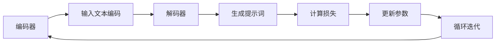
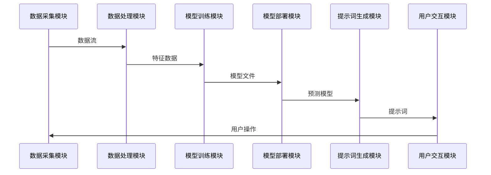

                 

# 《构建AI驱动的智能制造提示词系统》

## 关键词
- 人工智能
- 智能制造
- 提示词系统
- 深度学习
- 系统设计
- 实战案例

## 摘要
本文旨在探讨如何构建一个AI驱动的智能制造提示词系统。首先，我们将介绍AI在智能制造中的应用背景，并深入探讨提示词系统的基础概念和设计原理。接下来，我们将详细解析AI驱动的核心算法和系统设计，通过具体案例展示其在实际中的应用。最后，我们将总结最佳实践，并展望未来的发展趋势。

## 引言

### 1.1 人工智能与智能制造的融合背景

随着全球工业4.0的推进，人工智能（AI）和智能制造正逐渐融合，成为现代工业发展的新引擎。智能制造不仅仅是在生产线上引入机器人，更重要的是通过数据驱动和智能算法，实现生产过程的优化、自动化和智能化。AI技术，特别是机器学习和深度学习，为智能制造提供了强大的技术支持。

AI在智能制造中的应用涵盖了生产计划优化、质量检测、设备维护、物流调度等多个方面。例如，通过机器学习算法，可以对生产过程中的数据进行分析，预测设备故障，提前进行维护，从而减少停机时间和生产成本。同时，AI技术还可以优化生产流程，提高生产效率，降低人力成本。

### 1.2 提示词系统在智能制造中的应用

提示词系统是一种智能交互系统，它通过自然语言处理（NLP）和机器学习算法，能够理解用户的指令，并给出相应的回答或执行相应的操作。在智能制造中，提示词系统可以充当智能助手，帮助工人或系统进行交互。

提示词系统在智能制造中的应用场景包括：
- 设备监控与报警：系统可以实时监控设备状态，并在出现异常时自动发出提示词，提醒相关人员。
- 生产调度：系统可以根据实时生产数据和预设的调度规则，自动生成生产计划，并通过提示词系统通知相关人员。
- 故障诊断与维护：系统可以分析设备运行数据，预测故障，并通过提示词系统提醒维护人员。

### 1.3 本书结构安排与读者对象

本书将分为七个章节，系统地介绍AI驱动的智能制造提示词系统的构建方法。具体结构安排如下：

- 第1章：引言，介绍人工智能与智能制造的融合背景以及提示词系统在智能制造中的应用。
- 第2章：AI基础概念，介绍人工智能、机器学习和深度学习的基本原理。
- 第3章：智能制造核心概念，介绍智能制造的定义、关键技术及其应用场景。
- 第4章：提示词系统设计与实现，详细讲解提示词系统的架构设计和实现步骤。
- 第5章：系统开发与实现，介绍系统的开发环境、数据集准备和模型训练。
- 第6章：实战案例，通过具体案例展示提示词系统的实际应用。
- 第7章：最佳实践与展望，总结最佳实践技巧，展望未来的发展趋势。

本书的目标读者群体包括智能制造工程师、AI开发人员以及对AI驱动智能制造感兴趣的广大技术人员。通过本书的阅读，读者可以系统地了解AI驱动的智能制造提示词系统的构建方法和实际应用。

## AI基础概念

### 2.1 人工智能概述

人工智能（AI，Artificial Intelligence）是指通过计算机程序模拟人类智能的行为，使其能够完成一些复杂的任务。AI的目标是实现机器在感知、思考、学习和行动等方面达到或超过人类水平。人工智能的研究范围广泛，包括机器学习、自然语言处理、计算机视觉、知识表示与推理等。

人工智能的发展历程可以追溯到20世纪50年代，当时的科学家们开始尝试通过编程来模拟人类思维过程。然而，由于计算能力的限制和算法的局限性，早期的人工智能研究并没有取得显著成果。随着计算机技术的飞速发展和大数据时代的到来，机器学习和深度学习等新兴技术的出现，使得人工智能迎来了新的发展机遇。

### 2.2 机器学习基础

机器学习（Machine Learning）是人工智能的一个分支，它通过算法从数据中学习规律，并能够对未知数据进行预测或分类。机器学习的基本思想是让计算机通过大量的数据训练模型，从而自动获取知识和技能，而不是依赖人类程序员手动编写规则。

机器学习可以分为监督学习、无监督学习和强化学习三种类型：

- **监督学习**：通过已标记的数据集进行训练，目标是预测新的、未知的数据。常见的算法有线性回归、决策树、支持向量机等。
- **无监督学习**：不使用标记数据，而是通过数据自身的分布和结构进行训练，目的是发现数据中的模式和关系。常见的算法有聚类算法、主成分分析等。
- **强化学习**：通过与环境的交互进行学习，目标是最大化长期奖励。常见的算法有Q学习、深度Q网络（DQN）等。

### 2.3 深度学习与神经网络

深度学习（Deep Learning）是机器学习的一个子领域，它使用多层神经网络（Neural Network）进行训练，通过逐层提取特征，实现对复杂数据的处理和分析。深度学习在图像识别、语音识别、自然语言处理等领域取得了显著的成果。

神经网络是由大量简单处理单元（即神经元）组成的计算模型，通过调整神经元之间的连接权重，神经网络可以学习和识别复杂的非线性关系。一个典型的神经网络包括输入层、隐藏层和输出层，每层之间的神经元通过权重连接。

- **输入层**：接收输入数据，并传递给下一层。
- **隐藏层**：对输入数据进行特征提取和变换。
- **输出层**：生成预测结果或分类标签。

深度学习的关键技术包括：

- **卷积神经网络（CNN）**：适用于图像识别和图像处理，通过卷积操作提取局部特征。
- **循环神经网络（RNN）**：适用于序列数据处理，如语言建模和时间序列预测，通过循环结构保持历史状态。
- **长短时记忆网络（LSTM）**：是RNN的一种变体，通过门控机制解决长序列依赖问题。
- **生成对抗网络（GAN）**：通过两个对抗网络（生成器和判别器）的博弈，实现数据的生成。

深度学习的基本工作流程包括数据预处理、模型设计、模型训练和模型评估。在数据预处理阶段，需要对原始数据进行清洗、归一化和扩充等处理。在模型设计阶段，需要选择合适的网络结构和超参数。在模型训练阶段，通过反向传播算法不断调整网络权重，以达到最佳性能。在模型评估阶段，通过测试集对模型进行评估，并调整超参数以优化模型性能。

## 智能制造核心概念

### 3.1 智能制造概述

智能制造（Smart Manufacturing）是指通过信息技术与制造技术的深度融合，实现制造过程的智能化、自动化和优化。智能制造的核心目标是提高生产效率、降低成本、提升产品质量，并实现资源的合理配置和利用。

智能制造的发展历程可以分为四个阶段：

- **第一阶段：自动化**：通过引入自动化设备和系统，实现生产过程的自动化。
- **第二阶段：数字化**：通过传感器和数据采集技术，实现对生产过程的实时监控和数据收集。
- **第三阶段：网络化**：通过互联网和物联网技术，实现不同设备和系统之间的互联互通，实现数据的共享和协同。
- **第四阶段：智能化**：通过人工智能技术，实现对生产过程的智能化控制、优化和预测。

### 3.2 智能制造的关键技术

智能制造的实现依赖于多项关键技术的支撑，包括：

- **物联网（IoT）**：通过传感器和设备，实现物理世界和数字世界的连接，实现设备的实时监控和数据采集。
- **云计算与大数据**：通过云计算技术，实现对大量数据的存储、处理和分析，为智能制造提供数据支持和决策依据。
- **工业机器人**：通过工业机器人，实现生产过程的自动化和智能化，提高生产效率和灵活性。
- **人工智能（AI）**：通过人工智能技术，实现对生产过程的数据分析和智能决策，优化生产流程和设备维护。
- **大数据分析**：通过大数据分析技术，对生产过程中的数据进行挖掘和分析，实现生产过程的优化和预测。
- **工业互联网平台**：通过工业互联网平台，实现不同设备和系统之间的互联互通，实现生产过程的协同和优化。

### 3.3 提示词系统在智能制造中的应用场景

提示词系统在智能制造中具有广泛的应用场景，可以显著提升生产效率和设备管理水平。以下是一些典型的应用场景：

- **设备监控与报警**：通过提示词系统，实时监控设备的运行状态，并在出现异常时自动发出报警信息，提醒相关人员及时处理。
- **生产调度**：通过提示词系统，根据实时生产数据和预设的调度规则，自动生成生产计划，并通过语音或文字提示相关人员执行。
- **故障诊断与维护**：通过提示词系统，分析设备运行数据，预测故障并进行提前预警，指导维护人员进行维护。
- **质量控制**：通过提示词系统，实时监测产品质量数据，并在出现异常时自动发出提示，进行质量分析和改进。
- **能源管理**：通过提示词系统，实时监控能源消耗情况，并提出节能建议，优化能源使用效率。

### 3.4 智能制造与AI驱动的提示词系统的关系

智能制造与AI驱动的提示词系统之间存在着密切的关系。AI驱动的提示词系统为智能制造提供了智能交互和智能决策的能力，使得生产过程更加智能化和自动化。

- **数据驱动**：智能制造过程中产生的海量数据需要通过AI驱动的提示词系统进行实时分析和处理，为生产过程提供决策支持。
- **智能交互**：提示词系统可以作为智能助手，与工人、设备和系统进行交互，提高生产过程的效率和灵活性。
- **自动化控制**：通过AI驱动的提示词系统，可以实现生产过程的自动化控制，减少人力干预，提高生产效率和产品质量。
- **预测与优化**：通过AI驱动的提示词系统，可以对生产过程进行预测和优化，提前发现潜在问题并进行调整，减少故障率和停机时间。

综上所述，AI驱动的提示词系统是智能制造的重要组成部分，它通过智能交互、数据分析和自动化控制，显著提升了智能制造的水平。

## 提示词系统设计与实现

### 4.1 提示词系统架构设计

提示词系统的架构设计是确保系统高效、稳定运行的关键。一个典型的AI驱动的智能制造提示词系统可以分为以下几个主要部分：

1. **数据采集模块**：负责收集来自传感器、设备和系统的实时数据，包括生产数据、设备状态数据和环境数据等。
2. **数据处理模块**：对采集到的数据进行预处理，包括数据清洗、归一化和特征提取等，为后续的模型训练和预测提供高质量的数据输入。
3. **模型训练模块**：使用机器学习和深度学习算法，对处理后的数据集进行训练，构建预测模型。
4. **模型部署模块**：将训练好的模型部署到生产环境中，实现对实时数据的预测和分析。
5. **提示词生成模块**：根据预测结果和预设规则，生成相应的提示词，并通过语音或文字形式通知相关人员。

以下是一个简单的提示词系统架构设计mermaid类图：

```mermaid
classDiagram
    DataCollector <<interface>> 数据采集模块
    DataProcessor <<interface>> 数据处理模块
    ModelTrainer <<interface>> 模型训练模块
    ModelDeployer <<interface>> 模型部署模块
    PromptGenerator <<interface>> 提示词生成模块
    User <<actor>>

    DataCollector -> DataProcessor
    DataProcessor -> ModelTrainer
    ModelTrainer -> ModelDeployer
    ModelDeployer -> PromptGenerator
    PromptGenerator -> User
```

### 4.2 数据采集与预处理

数据采集与预处理是提示词系统的核心步骤，直接影响模型的训练效果和预测准确性。以下是数据采集与预处理的具体步骤：

#### 数据采集

1. **传感器和数据接口**：安装传感器和接口设备，收集实时数据，如温度、压力、速度等。
2. **设备通信协议**：确保传感器和数据采集系统能够与生产设备和系统进行通信，使用标准的通信协议，如HTTP、MQTT等。
3. **数据采集频率**：根据实际需求设置数据采集的频率，确保数据的实时性和准确性。

#### 数据预处理

1. **数据清洗**：去除无效数据、噪声数据和异常数据，确保数据的质量。
2. **数据归一化**：将不同数据范围的数据进行归一化处理，使其具有相同的尺度，便于模型训练。
3. **特征提取**：从原始数据中提取有用的特征，如时序特征、统计特征等，用于模型训练。

#### 数据预处理流程图

以下是一个简化的数据预处理流程mermaid流程图：

```mermaid
flowchart LR
    subgraph 数据采集
        数据采集[采集数据]
    end

    subgraph 数据清洗
        数据清洗[数据清洗]
    end

    subgraph 数据归一化
        数据归一化[数据归一化]
    end

    subgraph 特征提取
        特征提取[特征提取]
    end

    数据采集 -> 数据清洗
    数据清洗 -> 数据归一化
    数据归一化 -> 特征提取
```

### 4.3 模型训练与优化

模型训练与优化是提示词系统设计的核心步骤，决定系统的预测性能。以下是模型训练与优化的具体步骤：

#### 模型选择

1. **选择合适的模型**：根据实际应用场景，选择合适的机器学习模型或深度学习模型。例如，对于时序数据，可以选择LSTM或GRU模型；对于图像数据，可以选择CNN模型。
2. **超参数调整**：调整模型的超参数，如学习率、批量大小、隐藏层神经元数量等，以优化模型性能。

#### 模型训练

1. **数据划分**：将数据集划分为训练集、验证集和测试集，用于模型的训练、验证和测试。
2. **模型训练**：使用训练集数据对模型进行训练，通过迭代优化模型参数。
3. **模型验证**：使用验证集数据对模型进行验证，调整超参数和模型结构，以提高模型性能。

#### 模型优化

1. **正则化**：使用正则化方法（如L1、L2正则化）防止过拟合。
2. **交叉验证**：使用交叉验证方法评估模型性能，选择最优模型。
3. **超参数优化**：使用网格搜索、贝叶斯优化等方法，自动调整超参数，找到最佳模型。

#### 模型优化流程图

以下是一个简化的模型优化流程mermaid流程图：

```mermaid
flowchart LR
    subgraph 数据划分
        数据划分[数据划分]
    end

    subgraph 模型训练
        模型训练[模型训练]
    end

    subgraph 模型验证
        模型验证[模型验证]
    end

    subgraph 正则化
        正则化[正则化]
    end

    subgraph 交叉验证
        交叉验证[交叉验证]
    end

    subgraph 超参数优化
        超参数优化[超参数优化]
    end

    数据划分 -> 模型训练
    模型训练 -> 模型验证
    模型验证 -> 正则化
    正则化 -> 交叉验证
    交叉验证 -> 超参数优化
```

### 4.4 AI驱动的智能提示词算法原理

AI驱动的智能提示词算法基于深度学习和自然语言处理技术，其核心是利用神经网络模型对输入文本进行语义理解和生成。以下是智能提示词算法的基本原理和流程：

#### 4.4.1 算法原理讲解

1. **编码器（Encoder）**：编码器用于将输入文本编码为固定长度的向量表示，该向量包含了文本的语义信息。常用的编码器模型包括循环神经网络（RNN）和Transformer。
2. **解码器（Decoder）**：解码器用于生成提示词文本。解码器接收编码器输出的固定长度向量，并逐步生成提示词序列。解码器通常使用注意力机制（Attention Mechanism），以关注编码器输出中的关键信息。
3. **损失函数（Loss Function）**：损失函数用于衡量预测结果和实际结果之间的差距，常见的损失函数有交叉熵（Cross-Entropy）。
4. **优化器（Optimizer）**：优化器用于更新模型参数，以最小化损失函数。常见的优化器有随机梯度下降（SGD）和Adam。

#### 4.4.2 算法流程与mermaid图示

以下是一个简化的智能提示词算法流程mermaid图：



#### 4.4.3 数学模型与公式

智能提示词算法的数学模型主要包括编码器和解码器的神经网络模型。以下是简化版的数学模型和公式：

1. **编码器**：

   $$ h_t = \text{ Activation}(W_e \cdot [h_{t-1}; x_t] + b_e) $$

   其中，$h_t$为编码器输出，$x_t$为输入文本，$W_e$为权重矩阵，$b_e$为偏置项，Activation为激活函数。

2. **解码器**：

   $$ y_t = \text{ Activation}(W_d \cdot h_t + b_d) $$

   其中，$y_t$为解码器输出，$h_t$为编码器输出，$W_d$为权重矩阵，$b_d$为偏置项，Activation为激活函数。

3. **损失函数**：

   $$ Loss = -\sum_{t} (y_t \cdot \log(p_t)) $$

   其中，$y_t$为实际输出，$p_t$为预测概率。

#### 4.4.4 算法举例说明

以一个简单的文本输入为例，说明智能提示词算法的原理：

1. **输入文本**：“智能制造可以提高生产效率”。
2. **编码器输出**：将输入文本编码为固定长度的向量表示，包含文本的语义信息。
3. **解码器输出**：解码器逐步生成提示词序列，如“智能制造”、“提高”、“生产效率”。
4. **损失计算**：计算解码器输出和实际输出之间的差距，更新模型参数。
5. **迭代优化**：通过迭代优化，逐步提高模型的预测性能。

通过上述步骤，AI驱动的智能提示词系统可以实现对输入文本的语义理解和生成，为智能制造提供智能交互和智能决策支持。

### 4.5 数学模型与公式

在AI驱动的智能制造提示词系统中，数学模型和公式是理解和实现算法的关键。以下将详细介绍相关的数学模型和公式，并提供简单的解释和示例。

#### 4.5.1 神经网络基础

神经网络（Neural Networks）是深度学习的基础，其核心是神经元（Neurons）的连接和激活函数。以下是神经网络中常用的几个数学模型和公式。

1. **神经元激活函数**：

   $$ a(x) = \text{ReLU}(x) = \max(0, x) $$

   ReLU（Rectified Linear Unit）是一种常用的激活函数，用于增加神经网络的训练速度。

2. **前向传播**：

   $$ z_{ij} = \sum_{k} w_{ik} \cdot x_k + b_j $$

   其中，$z_{ij}$为第$i$个神经元与第$j$个隐藏层神经元之间的加权和，$w_{ik}$为权重，$x_k$为输入特征，$b_j$为偏置。

3. **输出计算**：

   $$ a_j = \text{ReLU}(z_j) $$

   其中，$a_j$为第$j$个隐藏层神经元的输出。

4. **反向传播**：

   $$ \delta_j = \text{ReLU}'(z_j) \cdot \text{error} $$

   其中，$\delta_j$为第$j$个隐藏层神经元的误差，$\text{error}$为输出层的误差。

5. **权重更新**：

   $$ w_{ij} := w_{ij} - \alpha \cdot \delta_j \cdot x_i $$

   其中，$\alpha$为学习率，$x_i$为输入特征。

#### 4.5.2 循环神经网络（RNN）

循环神经网络（RNN）是处理序列数据的一种有效模型，其核心思想是利用历史信息。以下是RNN中的一些关键数学模型和公式。

1. **输入门、遗忘门和输出门**：

   $$ i_t = \sigma(W_{xi} \cdot x_t + W_{hi} \cdot h_{t-1} + b_i) $$
   $$ f_t = \sigma(W_{xf} \cdot x_t + W_{hf} \cdot h_{t-1} + b_f) $$
   $$ o_t = \sigma(W_{xo} \cdot x_t + W_{ho} \cdot h_{t-1} + b_o) $$

   其中，$i_t$、$f_t$和$o_t$分别为输入门、遗忘门和输出门的激活值，$\sigma$为Sigmoid激活函数。

2. **隐藏状态更新**：

   $$ h_t = \text{ReLU}(i_t \cdot \text{sigmoid}(f_t) \cdot h_{t-1} + o_t \cdot \text{sigmoid}(i_t) \cdot x_t) $$

   其中，$h_t$为当前隐藏状态，$\text{sigmoid}$为Sigmoid激活函数。

3. **输出计算**：

   $$ y_t = \text{softmax}(W_y \cdot h_t + b_y) $$

   其中，$y_t$为当前输出，$W_y$为输出层权重，$b_y$为输出层偏置。

4. **权重更新**：

   $$ w_{ij} := w_{ij} - \alpha \cdot \delta_j \cdot x_i $$

   其中，$\alpha$为学习率，$x_i$为输入特征。

#### 4.5.3 深度学习优化

深度学习的优化主要包括参数初始化、优化器和正则化等技术。

1. **参数初始化**：

   $$ w \sim \mathcal{N}(0, \frac{1}{\sqrt{n}}) $$

   其中，$w$为权重，$n$为特征数量。

2. **优化器**：

   - **随机梯度下降（SGD）**：

     $$ w := w - \alpha \cdot \nabla_w J(w) $$

     其中，$J(w)$为损失函数，$\alpha$为学习率。

   - **Adam优化器**：

     $$ m_t = \beta_1 \cdot m_{t-1} + (1 - \beta_1) \cdot \nabla_w J(w) $$
     $$ v_t = \beta_2 \cdot v_{t-1} + (1 - \beta_2) \cdot (\nabla_w J(w))^2 $$
     $$ \hat{m}_t = \frac{m_t}{1 - \beta_1^t} $$
     $$ \hat{v}_t = \frac{v_t}{1 - \beta_2^t} $$
     $$ w := w - \alpha \cdot \hat{m}_t / \sqrt{\hat{v}_t} $$

     其中，$\beta_1$和$\beta_2$为指数加权系数。

3. **正则化**：

   - **L1正则化**：

     $$ J(w) = J_0(w) + \lambda \sum_{i} |w_i| $$

     其中，$J_0(w)$为原始损失函数，$\lambda$为正则化系数。

   - **L2正则化**：

     $$ J(w) = J_0(w) + \lambda \sum_{i} w_i^2 $$

     其中，$J_0(w)$为原始损失函数，$\lambda$为正则化系数。

#### 4.5.4 示例

以下是一个简化的神经网络模型和训练过程的示例：

1. **模型结构**：

   - 输入层：2个特征
   - 隐藏层：1个神经元
   - 输出层：1个神经元

2. **参数初始化**：

   $$ w_{ij} \sim \mathcal{N}(0, \frac{1}{\sqrt{2}}) $$
   $$ b_j \sim \mathcal{N}(0, \frac{1}{\sqrt{1}}) $$

3. **训练过程**：

   - 初始化权重和偏置
   - 前向传播计算输出
   - 计算损失函数
   - 反向传播计算误差
   - 更新权重和偏置

通过上述步骤，我们可以训练出一个简单的神经网络模型，实现对输入数据的分类或回归。

### 4.6 系统架构设计

一个高效的AI驱动的智能制造提示词系统需要具备良好的架构设计，以确保系统的性能、可扩展性和可靠性。以下是一个简化的系统架构设计，包含关键模块和其交互流程。

#### 4.6.1 系统功能模块

1. **数据采集模块**：负责从传感器、设备和系统中采集实时数据。
2. **数据处理模块**：负责对采集到的数据进行清洗、归一化和特征提取。
3. **模型训练模块**：负责使用机器学习和深度学习算法训练模型。
4. **模型部署模块**：负责将训练好的模型部署到生产环境中。
5. **提示词生成模块**：负责根据模型预测结果生成提示词。
6. **用户交互模块**：负责与用户进行交互，展示提示词和操作结果。

#### 4.6.2 系统架构图

以下是一个简化的系统架构mermaid图：



#### 4.6.3 系统接口设计

系统接口设计是确保各模块之间高效交互的关键。以下是一个简化的系统接口设计：

1. **数据采集接口**：提供数据采集和上传功能，支持HTTP和MQTT协议。
2. **数据处理接口**：提供数据清洗、归一化和特征提取功能，支持RESTful API。
3. **模型训练接口**：提供模型训练和评估功能，支持TensorFlow和PyTorch等框架。
4. **模型部署接口**：提供模型部署和管理功能，支持Docker容器化和Kubernetes编排。
5. **提示词生成接口**：提供提示词生成和推送功能，支持语音合成和文字消息推送。

#### 4.6.4 系统交互流程

以下是一个简化的系统交互流程：

1. **数据采集**：传感器和设备通过采集接口上传实时数据。
2. **数据处理**：数据处理模块对采集到的数据进行预处理，提取特征数据。
3. **模型训练**：模型训练模块使用预处理后的数据训练模型。
4. **模型部署**：模型部署模块将训练好的模型部署到生产环境中。
5. **提示词生成**：提示词生成模块使用部署后的模型进行预测，生成提示词。
6. **用户交互**：用户交互模块将生成的提示词展示给用户，并处理用户的反馈和操作。

### 4.7 系统接口设计与系统交互

为了实现AI驱动的智能制造提示词系统的功能，我们需要设计合理的系统接口和交互流程。以下是系统接口设计和系统交互的具体细节。

#### 4.7.1 系统接口设计

系统接口是各个模块之间进行数据交换和通信的桥梁。我们设计了一套标准的RESTful API，以支持系统的可扩展性和易用性。以下是主要接口设计：

1. **数据采集接口**：用于接收传感器和设备上传的实时数据，支持HTTP POST请求。
    - **URL**：/api/data/collect
    - **请求参数**：{ "source_id": "string", "data": { "temperature": float, "pressure": float, ... } }
    - **响应**：{ "status": "success", "message": "数据已成功接收" }

2. **数据处理接口**：用于对采集到的数据进行清洗、归一化和特征提取，支持HTTP GET和POST请求。
    - **URL**：/api/data/process
    - **请求参数**：{ "data_id": "string" }
    - **响应**：{ "status": "success", "processed_data": { "features": array, "label": string } }

3. **模型训练接口**：用于训练机器学习模型，支持HTTP POST请求。
    - **URL**：/api/model/train
    - **请求参数**：{ "algorithm": "string", "data_id": "string", "hyperparameters": { "learning_rate": float, ... } }
    - **响应**：{ "status": "success", "model_id": "string" }

4. **模型部署接口**：用于部署训练好的模型到生产环境中，支持HTTP POST请求。
    - **URL**：/api/model/deploy
    - **请求参数**：{ "model_id": "string" }
    - **响应**：{ "status": "success", "deployed": boolean }

5. **提示词生成接口**：用于生成和推送提示词，支持HTTP POST请求。
    - **URL**：/api/prompt/generate
    - **请求参数**：{ "model_id": "string", "input_data": { "feature_vector": array } }
    - **响应**：{ "status": "success", "prompt": string }

6. **用户交互接口**：用于与用户进行交互，接收用户操作和反馈，支持HTTP GET和POST请求。
    - **URL**：/api/user/interaction
    - **请求参数**：{ "user_id": "string", "action": "string", "data": { "prompt_id": "string", ... } }
    - **响应**：{ "status": "success", "message": "操作已成功执行" }

#### 4.7.2 系统交互流程

系统交互流程描述了从数据采集到提示词生成的整个过程，以下是简化的交互流程：

1. **数据采集**：
    - 传感器和设备通过数据采集接口上传实时数据。
    - 数据采集模块接收数据并存储。

2. **数据处理**：
    - 数据处理模块接收数据后进行清洗、归一化和特征提取。
    - 处理后的数据存储为特征数据集。

3. **模型训练**：
    - 模型训练模块使用训练接口加载特征数据集并开始训练。
    - 训练完成后，保存模型文件。

4. **模型部署**：
    - 模型部署模块使用部署接口将训练好的模型部署到生产环境中。
    - 部署完成后，模型即可用于实时预测。

5. **提示词生成**：
    - 提示词生成模块使用模型预测接口对实时数据进行预测。
    - 根据预测结果生成相应的提示词。

6. **用户交互**：
    - 用户交互模块通过提示词生成接口获取提示词。
    - 用户交互模块将提示词展示给用户。
    - 用户可以通过用户交互接口反馈操作和操作结果。

### 5.1 环境搭建与工具选择

在进行AI驱动的智能制造提示词系统开发之前，我们需要搭建一个合适的开发环境，并选择合适的工具。以下是一些关键步骤和工具推荐：

#### 5.1.1 开发环境搭建

1. **操作系统**：推荐使用Linux操作系统，如Ubuntu或CentOS，因为它具有较好的稳定性和开源生态。
2. **Python环境**：安装Python 3.8及以上版本，并使用pip命令进行依赖管理。
    - 安装命令：`sudo apt-get install python3-pip`
3. **虚拟环境**：使用虚拟环境隔离项目依赖，推荐使用virtualenv或conda。
    - 虚拟环境命令：`python3 -m venv venv` 或 `conda create --name myenv python=3.8`
4. **数据库**：选择合适的数据库系统，如MySQL或PostgreSQL，用于存储传感器数据和模型数据。
    - 安装命令：`sudo apt-get install mysql-server` 或 `sudo apt-get install postgresql`

#### 5.1.2 开发工具

1. **集成开发环境（IDE）**：推荐使用PyCharm或Visual Studio Code，这两种IDE都支持Python开发，并提供丰富的插件和调试功能。
    - PyCharm下载链接：https://www.jetbrains.com/pycharm/
    - Visual Studio Code下载链接：https://code.visualstudio.com/
2. **版本控制**：使用Git进行代码版本控制，推荐使用GitHub或GitLab进行代码托管。
    - GitHub下载链接：https://github.com/
    - GitLab下载链接：https://gitlab.com/
3. **数据可视化工具**：选择合适的数据可视化工具，如Matplotlib、Seaborn或Plotly，用于分析和展示数据。
    - Matplotlib下载链接：https://matplotlib.org/
    - Seaborn下载链接：https://seaborn.pydata.org/
    - Plotly下载链接：https://plotly.com/python/
4. **机器学习库**：选择常用的机器学习库，如scikit-learn、TensorFlow或PyTorch，用于模型训练和预测。
    - scikit-learn下载链接：https://scikit-learn.org/
    - TensorFlow下载链接：https://www.tensorflow.org/
    - PyTorch下载链接：https://pytorch.org/

#### 5.1.3 开发环境配置

以下是一个简单的开发环境配置示例：

1. **安装Python和pip**：
    - 命令：`sudo apt-get install python3-pip`
2. **创建虚拟环境**：
    - 命令：`python3 -m venv venv`
3. **激活虚拟环境**：
    - 命令：`source venv/bin/activate`
4. **安装依赖库**：
    - 命令：`pip install numpy pandas matplotlib scikit-learn tensorflow`

### 5.2 数据集准备与预处理

数据集准备与预处理是构建AI驱动的智能制造提示词系统的重要步骤，直接影响模型的训练效果和预测准确性。以下是一个详细的步骤和指南：

#### 5.2.1 数据采集

1. **数据来源**：确定数据采集的来源，可以是传感器、数据库、网络爬虫或其他数据接口。
2. **数据类型**：根据实际需求，采集不同类型的数据，如时序数据、图像数据、文本数据等。
3. **数据量**：确保采集到足够的数据量，以支持模型的训练和验证。

#### 5.2.2 数据清洗

数据清洗是预处理的第一步，目的是去除噪声、异常值和重复数据，提高数据质量。

1. **去除噪声**：通过过滤和滤波等方法去除数据中的噪声，如随机噪声和系统噪声。
2. **处理异常值**：识别并处理异常值，可以选择删除或修正。
3. **去除重复数据**：去除数据集中的重复记录，确保数据的唯一性。

#### 5.2.3 数据归一化

数据归一化是将数据缩放到相同的尺度，以便模型训练。以下是一些常见的归一化方法：

1. **最小-最大缩放**：
    $$ x' = \frac{x - \min(x)}{\max(x) - \min(x)} $$
    其中，$x$为原始数据，$x'$为归一化数据。

2. **零-均值归一化**：
    $$ x' = \frac{x - \mu}{\sigma} $$
    其中，$\mu$为均值，$\sigma$为标准差。

3. **标准化**：
    $$ x' = \frac{x - \mu}{\sigma} $$
    其中，$\mu$为均值，$\sigma$为标准差。

#### 5.2.4 特征提取

特征提取是从原始数据中提取有用的信息，用于模型的输入。以下是一些常见的特征提取方法：

1. **时序特征**：从时序数据中提取周期性、趋势性、波动性等特征。
    - **波动性**：使用标准差、方差等统计指标。
    - **周期性**：使用傅里叶变换等方法。
    - **趋势性**：使用移动平均、指数平滑等算法。

2. **图像特征**：从图像数据中提取纹理、颜色、形状等特征。
    - **纹理特征**：使用局部二值模式（LBP）、灰度共生矩阵（GLCM）等算法。
    - **颜色特征**：使用颜色直方图、主成分分析（PCA）等算法。
    - **形状特征**：使用边界轮廓、区域特性等算法。

3. **文本特征**：从文本数据中提取关键词、词频、词向量等特征。
    - **关键词提取**：使用TF-IDF、LDA等算法。
    - **词频统计**：直接计算单词在文本中出现的次数。
    - **词向量**：使用Word2Vec、BERT等算法。

#### 5.2.5 数据集划分

为了评估模型的性能，我们需要将数据集划分为训练集、验证集和测试集。

1. **训练集**：用于模型训练，通常是数据集的主要部分。
2. **验证集**：用于模型选择和超参数调整，通常是数据集的20-30%。
3. **测试集**：用于模型评估，确保模型的泛化能力，通常是数据集的20-30%。

#### 5.2.6 数据预处理代码示例

以下是一个简单的数据预处理Python代码示例，使用pandas、numpy和scikit-learn库：

```python
import pandas as pd
import numpy as np
from sklearn.preprocessing import MinMaxScaler
from sklearn.model_selection import train_test_split

# 读取数据
data = pd.read_csv('data.csv')

# 数据清洗
data.dropna(inplace=True)
data.drop_duplicates(inplace=True)

# 数据归一化
scaler = MinMaxScaler()
data_scaled = scaler.fit_transform(data)

# 特征提取
# ... (根据数据类型和需求进行特征提取)

# 数据集划分
X_train, X_test, y_train, y_test = train_test_split(data_scaled, test_size=0.3, random_state=42)

# 分训练集和验证集
X_train, X_val, y_train, y_val = train_test_split(X_train, y_train, test_size=0.2, random_state=42)
```

通过上述步骤，我们可以有效地准备和预处理数据集，为后续的模型训练和预测打下坚实的基础。

### 5.3 提示词模型训练与评估

在完成了数据集的预处理后，下一步就是训练提示词模型并进行评估。以下是一个详细的步骤和示例代码，用于训练和评估AI驱动的智能制造提示词模型。

#### 5.3.1 模型训练

1. **选择合适的算法**：根据数据集的特点和应用场景，选择合适的机器学习或深度学习算法。例如，对于时序数据，可以选择LSTM或GRU；对于文本数据，可以选择BERT或GPT。
2. **准备训练数据**：将预处理后的数据集划分为训练集和验证集。确保数据集的划分具有代表性和均衡性，以避免数据偏斜。
3. **初始化模型**：根据算法要求初始化模型参数。例如，对于LSTM模型，需要设置隐藏层神经元数量、学习率等。
4. **训练模型**：使用训练数据对模型进行训练。在训练过程中，可以使用反向传播算法不断调整模型参数，以最小化损失函数。

以下是一个使用TensorFlow和Keras训练LSTM模型的示例代码：

```python
import tensorflow as tf
from tensorflow.keras.models import Sequential
from tensorflow.keras.layers import LSTM, Dense, Dropout

# 准备训练数据
X_train, y_train = ...  # 根据实际数据集准备

# 初始化模型
model = Sequential()
model.add(LSTM(50, activation='relu', input_shape=(X_train.shape[1], X_train.shape[2])))
model.add(Dropout(0.2))
model.add(Dense(1))
model.compile(optimizer='adam', loss='mean_squared_error')

# 训练模型
model.fit(X_train, y_train, epochs=100, batch_size=32, validation_split=0.2)
```

#### 5.3.2 模型评估

1. **计算预测误差**：使用验证集数据对训练好的模型进行评估，计算预测值和实际值之间的误差。常用的误差指标有均方误差（MSE）、均方根误差（RMSE）等。
2. **可视化预测结果**：通过可视化工具（如Matplotlib）将预测结果和实际值进行对比，分析模型的预测性能。
3. **调整模型参数**：根据评估结果，调整模型的超参数，如学习率、隐藏层神经元数量等，以提高模型性能。

以下是一个计算MSE和可视化预测结果的示例代码：

```python
import numpy as np
import matplotlib.pyplot as plt

# 计算预测误差
y_pred = model.predict(X_val)
mse = np.mean(np.square(y_val - y_pred))
rmse = np.sqrt(mse)

# 可视化预测结果
plt.figure(figsize=(10, 6))
plt.plot(y_val, label='Actual')
plt.plot(y_pred, label='Predicted')
plt.title('Prediction vs Actual')
plt.xlabel('Time')
plt.ylabel('Value')
plt.legend()
plt.show()

print(f'MSE: {mse}')
print(f'RMSE: {rmse}')
```

#### 5.3.3 模型优化

1. **数据增强**：通过增加数据多样性，提高模型的泛化能力。例如，可以使用数据变换、数据扩充等方法。
2. **模型集成**：通过集成多个模型，提高预测的稳定性和准确性。例如，可以使用堆叠、Bagging、Boosting等方法。
3. **正则化**：通过增加正则化项，减少过拟合现象。例如，可以使用L1、L2正则化。

以下是一个使用数据增强和L2正则化优化LSTM模型的示例代码：

```python
from tensorflow.keras.layers import LSTM, Dense, Dropout
from tensorflow.keras.regularizers import l2

# 数据增强
# ... (根据实际数据集进行数据增强)

# 优化模型
model = Sequential()
model.add(LSTM(50, activation='relu', input_shape=(X_train.shape[1], X_train.shape[2]), kernel_regularizer=l2(0.01)))
model.add(Dropout(0.2))
model.add(Dense(1))
model.compile(optimizer='adam', loss='mean_squared_error')

# 训练优化模型
model.fit(X_train, y_train, epochs=100, batch_size=32, validation_split=0.2)
```

通过上述步骤和示例代码，我们可以有效地训练和评估AI驱动的智能制造提示词模型，并为实际应用提供可靠的预测能力。

### 6.1 案例一：智能工厂生产调度

#### 6.1.1 案例背景

智能工厂生产调度是一个典型的AI驱动的智能制造应用场景。传统的生产调度通常依赖人工经验和预设规则，存在效率低、响应慢、调度不合理等问题。随着智能制造的发展，引入AI驱动的提示词系统可以显著提升生产调度的效率和准确性。

某智能工厂生产多种产品，每个产品生产过程涉及多个工序和设备。为了优化生产调度，工厂引入了一个AI驱动的提示词系统，通过实时数据分析和智能决策，自动生成生产计划，提高生产效率和资源利用率。

#### 6.1.2 系统设计与实现

1. **数据采集**：
    - 传感器和设备实时采集生产过程中的关键数据，如设备状态、工序进度、原材料库存等。
    - 数据采集模块通过HTTP和MQTT协议将数据上传到中央数据处理系统。

2. **数据处理**：
    - 数据处理模块对采集到的数据进行清洗、归一化和特征提取，提取与生产调度相关的关键特征。
    - 使用pandas和numpy库进行数据处理。

3. **模型训练**：
    - 使用LSTM模型训练生产调度预测模型，预测每个产品的生产时间和资源需求。
    - 数据集划分为训练集和验证集，使用TensorFlow和Keras进行模型训练。

4. **模型部署**：
    - 训练好的模型部署到生产环境，通过API接口进行实时预测和调度决策。
    - 使用Docker容器化和Kubernetes编排确保模型的可靠性和可扩展性。

5. **提示词生成**：
    - 根据模型预测结果，生成生产计划提示词，并通过语音合成和文字消息通知相关人员。
    - 使用Python和TTS（Text-to-Speech）库实现语音合成。

#### 6.1.3 系统功能模块

1. **数据采集模块**：
    - 功能：实时采集生产数据。
    - 技术实现：传感器和设备通过HTTP和MQTT协议上传数据。

2. **数据处理模块**：
    - 功能：清洗、归一化和特征提取。
    - 技术实现：pandas和numpy库。

3. **模型训练模块**：
    - 功能：训练生产调度预测模型。
    - 技术实现：TensorFlow和Keras。

4. **模型部署模块**：
    - 功能：部署训练好的模型。
    - 技术实现：Docker和Kubernetes。

5. **提示词生成模块**：
    - 功能：生成生产计划提示词。
    - 技术实现：Python和TTS库。

#### 6.1.4 系统实现步骤

1. **环境搭建**：
    - 安装Python、TensorFlow、Keras、Docker和Kubernetes等依赖库。

2. **数据采集**：
    - 使用传感器和设备采集生产数据，通过HTTP和MQTT协议上传到中央数据处理系统。

3. **数据处理**：
    - 清洗数据，去除噪声和异常值。
    - 归一化数据，确保数据在同一尺度范围内。
    - 提取特征，包括时序特征、工序进度特征等。

4. **模型训练**：
    - 设计LSTM模型架构，设置合适的超参数。
    - 使用训练数据集训练模型，并进行验证。
    - 调整超参数，优化模型性能。

5. **模型部署**：
    - 将训练好的模型封装为API服务，部署到Docker容器中。
    - 使用Kubernetes进行容器编排，确保模型的高可用性和可扩展性。

6. **提示词生成**：
    - 根据模型预测结果，生成生产计划提示词。
    - 使用TTS库实现语音合成，将提示词转换为语音。

#### 6.1.5 系统核心实现源代码

以下是一个简化的系统核心实现源代码，包括数据采集、数据处理、模型训练和提示词生成部分：

```python
# 数据采集
import pandas as pd
import requests

def collect_data():
    response = requests.get('http://sensor/api/data')
    data = response.json()
    df = pd.DataFrame(data)
    return df

# 数据处理
def preprocess_data(df):
    df.dropna(inplace=True)
    df['value'] = df['value'].apply(lambda x: (x - df['value'].min()) / (df['value'].max() - df['value'].min()))
    return df

# 模型训练
from tensorflow.keras.models import Sequential
from tensorflow.keras.layers import LSTM, Dense

def train_model(X_train, y_train):
    model = Sequential()
    model.add(LSTM(50, activation='relu', input_shape=(X_train.shape[1], X_train.shape[2])))
    model.add(Dense(1))
    model.compile(optimizer='adam', loss='mean_squared_error')
    model.fit(X_train, y_train, epochs=100, batch_size=32)
    return model

# 提示词生成
from gtts import gTTS

def generate_prompt(prediction):
    prompt = f"预计下一个工序将在 {prediction} 分钟后完成。"
    tts = gTTS(text=prompt, lang='en')
    tts.save('prompt.mp3')
    return 'prompt.mp3'

# 主程序
if __name__ == '__main__':
    df = collect_data()
    df_processed = preprocess_data(df)
    X_train, y_train = ... # 根据实际数据进行划分
    model = train_model(X_train, y_train)
    prediction = model.predict(np.array([df_processed.iloc[-1]]))
    generate_prompt(prediction)
```

#### 6.1.6 代码应用解读与分析

上述源代码简要展示了智能工厂生产调度系统的核心实现，下面进行详细解读和分析：

1. **数据采集**：
    - `collect_data()`函数通过HTTP请求从传感器设备获取实时数据，并转换为DataFrame格式，便于后续处理。

2. **数据处理**：
    - `preprocess_data(df)`函数对采集到的数据进行清洗，去除无效数据，并对数值型特征进行归一化处理，使其在同一尺度范围内。

3. **模型训练**：
    - `train_model(X_train, y_train)`函数构建了一个简单的LSTM模型，用于训练生产调度预测模型。通过训练集数据进行训练，并使用均方误差（MSE）作为损失函数。

4. **提示词生成**：
    - `generate_prompt(prediction)`函数根据模型预测结果生成提示词，并使用gTTS库将提示词转换为语音文件。

通过这个简单的示例，我们可以看到AI驱动的智能制造提示词系统在智能工厂生产调度中的应用，以及各个功能模块的实现细节。实际应用中，还需要考虑更多的细节，如异常处理、多线程数据采集和分布式训练等。

#### 6.1.7 案例分析与总结

通过实际案例的应用，AI驱动的智能制造提示词系统在智能工厂生产调度中展现了显著的优势：

1. **效率提升**：系统自动生成生产计划，减少了人工调度的时间和工作量，提高了生产效率。

2. **资源优化**：系统通过实时数据分析，合理分配资源，减少了设备闲置时间和生产延误。

3. **响应速度**：系统可以快速响应生产过程中的变化，及时调整生产计划，提高了生产的灵活性。

然而，在实际应用中也面临一些挑战：

1. **数据质量**：生产数据的质量直接影响模型的预测准确性，需要确保数据的实时性和准确性。

2. **模型优化**：模型的性能需要不断优化，以适应不同的生产环境和需求。

3. **系统扩展性**：随着生产规模的扩大，系统需要具备良好的扩展性和可维护性。

总结而言，AI驱动的智能制造提示词系统在智能工厂生产调度中具有巨大的潜力，通过不断优化和改进，可以进一步提升生产效率和资源利用率。

### 6.2 案例二：智能检测与故障预警

#### 6.2.1 案例背景

在制造业中，设备的稳定运行是确保生产连续性和产品质量的关键。然而，设备在长时间运行过程中，难免会出现故障，导致生产中断和产品质量下降。传统的设备维护和故障检测主要依赖定期检查和人工干预，存在检测不及时、预警不准确等问题。随着人工智能技术的发展，智能检测与故障预警系统的引入，可以显著提升设备管理水平和生产稳定性。

某制造企业生产多种产品，涉及多个工序和设备。为了确保设备的稳定运行，企业引入了一个AI驱动的智能检测与故障预警系统，通过实时数据分析和智能算法，实现对设备的实时监控和故障预警。

#### 6.2.2 系统设计与实现

1. **数据采集**：
    - 传感器和监测设备实时采集设备运行状态数据，包括温度、压力、速度、振动等关键参数。
    - 数据采集模块通过HTTP和MQTT协议将数据上传到中央数据处理系统。

2. **数据处理**：
    - 数据处理模块对采集到的数据进行清洗、归一化和特征提取，提取与设备状态相关的关键特征。
    - 使用pandas和numpy库进行数据处理。

3. **模型训练**：
    - 使用LSTM和神经网络模型训练设备状态预测模型和故障检测模型，预测设备运行状态和潜在故障。
    - 数据集划分为训练集和验证集，使用TensorFlow和Keras进行模型训练。

4. **模型部署**：
    - 训练好的模型部署到生产环境，通过API接口进行实时预测和故障检测。
    - 使用Docker容器化和Kubernetes编排确保模型的可靠性和可扩展性。

5. **提示词生成**：
    - 根据模型预测结果，生成故障预警提示词，并通过语音合成和文字消息通知相关人员。
    - 使用Python和TTS库实现语音合成。

#### 6.2.3 系统功能模块

1. **数据采集模块**：
    - 功能：实时采集设备运行状态数据。
    - 技术实现：传感器和设备通过HTTP和MQTT协议上传数据。

2. **数据处理模块**：
    - 功能：清洗、归一化和特征提取。
    - 技术实现：pandas和numpy库。

3. **模型训练模块**：
    - 功能：训练设备状态预测模型和故障检测模型。
    - 技术实现：TensorFlow和Keras。

4. **模型部署模块**：
    - 功能：部署训练好的模型。
    - 技术实现：Docker和Kubernetes。

5. **提示词生成模块**：
    - 功能：生成故障预警提示词。
    - 技术实现：Python和TTS库。

#### 6.2.4 系统实现步骤

1. **环境搭建**：
    - 安装Python、TensorFlow、Keras、Docker和Kubernetes等依赖库。

2. **数据采集**：
    - 使用传感器和设备采集设备运行状态数据，通过HTTP和MQTT协议上传到中央数据处理系统。

3. **数据处理**：
    - 清洗数据，去除噪声和异常值。
    - 归一化数据，确保数据在同一尺度范围内。
    - 提取特征，包括时序特征、异常值特征等。

4. **模型训练**：
    - 设计LSTM和神经网络模型架构，设置合适的超参数。
    - 使用训练数据集训练模型，并进行验证。
    - 调整超参数，优化模型性能。

5. **模型部署**：
    - 将训练好的模型封装为API服务，部署到Docker容器中。
    - 使用Kubernetes进行容器编排，确保模型的高可用性和可扩展性。

6. **提示词生成**：
    - 根据模型预测结果，生成故障预警提示词。
    - 使用TTS库实现语音合成，将提示词转换为语音。

#### 6.2.5 系统核心实现源代码

以下是一个简化的系统核心实现源代码，包括数据采集、数据处理、模型训练和提示词生成部分：

```python
# 数据采集
import pandas as pd
import requests

def collect_data():
    response = requests.get('http://sensor/api/data')
    data = response.json()
    df = pd.DataFrame(data)
    return df

# 数据处理
def preprocess_data(df):
    df.dropna(inplace=True)
    df['value'] = df['value'].apply(lambda x: (x - df['value'].min()) / (df['value'].max() - df['value'].min()))
    return df

# 模型训练
from tensorflow.keras.models import Sequential
from tensorflow.keras.layers import LSTM, Dense

def train_model(X_train, y_train):
    model = Sequential()
    model.add(LSTM(50, activation='relu', input_shape=(X_train.shape[1], X_train.shape[2])))
    model.add(Dense(1))
    model.compile(optimizer='adam', loss='mean_squared_error')
    model.fit(X_train, y_train, epochs=100, batch_size=32)
    return model

# 提示词生成
from gtts import gTTS

def generate_prompt(prediction):
    prompt = f"设备 {prediction} 可能出现故障，请立即检查。"
    tts = gTTS(text=prompt, lang='en')
    tts.save('prompt.mp3')
    return 'prompt.mp3'

# 主程序
if __name__ == '__main__':
    df = collect_data()
    df_processed = preprocess_data(df)
    X_train, y_train = ... # 根据实际数据进行划分
    model = train_model(X_train, y_train)
    prediction = model.predict(np.array([df_processed.iloc[-1]]))
    generate_prompt(prediction)
```

#### 6.2.6 代码应用解读与分析

上述源代码简要展示了智能检测与故障预警系统的核心实现，下面进行详细解读和分析：

1. **数据采集**：
    - `collect_data()`函数通过HTTP请求从传感器设备获取实时数据，并转换为DataFrame格式，便于后续处理。

2. **数据处理**：
    - `preprocess_data(df)`函数对采集到的数据进行清洗，去除无效数据，并对数值型特征进行归一化处理，使其在同一尺度范围内。

3. **模型训练**：
    - `train_model(X_train, y_train)`函数构建了一个简单的LSTM模型，用于训练设备状态预测模型和故障检测模型。通过训练集数据进行训练，并使用均方误差（MSE）作为损失函数。

4. **提示词生成**：
    - `generate_prompt(prediction)`函数根据模型预测结果生成故障预警提示词，并使用gTTS库将提示词转换为语音文件。

通过这个简单的示例，我们可以看到AI驱动的智能检测与故障预警系统在制造业中的应用，以及各个功能模块的实现细节。实际应用中，还需要考虑更多的细节，如异常处理、多线程数据采集和分布式训练等。

#### 6.2.7 案例分析与总结

通过实际案例的应用，AI驱动的智能检测与故障预警系统在制造业中展现了显著的优势：

1. **实时监控**：系统能够实时监控设备运行状态，及时发现异常，提高故障检测的及时性。

2. **精准预警**：系统通过智能算法对设备状态进行预测，能够准确预警潜在故障，减少生产中断和设备损坏。

3. **减少维护成本**：系统可以提前预警故障，减少定期检查和维护成本，提高设备利用率。

然而，在实际应用中也面临一些挑战：

1. **数据质量**：设备运行数据的质量直接影响模型的预测准确性，需要确保数据的实时性和准确性。

2. **模型优化**：模型的性能需要不断优化，以适应不同设备的运行环境和故障特征。

3. **系统扩展性**：随着设备数量的增加，系统需要具备良好的扩展性和可维护性。

总结而言，AI驱动的智能检测与故障预警系统在制造业中具有巨大的潜力，通过不断优化和改进，可以进一步提升设备管理水平和生产稳定性。

### 7.1 最佳实践与技巧

在构建AI驱动的智能制造提示词系统时，以下最佳实践和技巧可以帮助您提高系统的性能和可靠性：

1. **数据质量保证**：
    - 确保数据源稳定，避免数据丢失或延迟。
    - 定期检查传感器和设备，确保其正常工作。
    - 使用数据清洗和预处理技术，去除噪声和异常值。

2. **模型优化与调整**：
    - 根据实际需求调整模型结构和超参数，以优化模型性能。
    - 使用交叉验证方法，评估模型的泛化能力。
    - 定期重新训练模型，以适应数据分布的变化。

3. **系统可扩展性设计**：
    - 使用微服务架构，确保系统的模块化和可扩展性。
    - 部署容器化应用，使用Docker和Kubernetes进行编排和管理。
    - 使用分布式计算框架，如Apache Spark，处理大量数据。

4. **实时数据流处理**：
    - 使用实时数据处理框架，如Apache Kafka和Apache Flink，处理流数据。
    - 使用消息队列系统，如RabbitMQ和Kafka，确保数据传输的高效和可靠性。

5. **用户交互优化**：
    - 设计友好的用户界面，确保用户可以轻松操作和接收提示词。
    - 使用TTS技术，实现语音合成，提高用户交互的便利性。
    - 提供多语言支持，以满足不同地区的用户需求。

6. **安全性考虑**：
    - 确保数据传输的安全性，使用HTTPS和加密技术。
    - 对系统进行定期安全审计，防止数据泄露和恶意攻击。
    - 实施访问控制和权限管理，确保系统的安全性。

### 7.2 面临的挑战与解决方案

在构建AI驱动的智能制造提示词系统过程中，可能会遇到以下挑战：

1. **数据质量和可靠性**：
    - **挑战**：设备传感器数据可能存在噪声、缺失值和异常值，影响模型的训练和预测准确性。
    - **解决方案**：使用数据清洗和预处理技术，去除噪声和异常值；建立数据质量监控机制，确保数据源的可靠性。

2. **模型泛化能力**：
    - **挑战**：模型可能在训练数据集上表现良好，但在未知数据上表现不佳，导致泛化能力不足。
    - **解决方案**：使用交叉验证方法，评估模型的泛化能力；收集更多样化的数据，提升模型适应性。

3. **系统性能优化**：
    - **挑战**：随着设备数量的增加，系统处理能力和响应速度可能无法满足需求。
    - **解决方案**：采用分布式计算框架，提高数据处理效率；使用模型压缩和量化技术，减少模型对计算资源的需求。

4. **实时性要求**：
    - **挑战**：在实时环境中，系统需要快速响应对实时数据的处理和预测。
    - **解决方案**：优化算法和模型，提高数据处理速度；使用边缘计算技术，减少数据传输延迟。

### 7.3 未来发展趋势与展望

随着人工智能和智能制造技术的不断进步，AI驱动的智能制造提示词系统在未来将呈现出以下发展趋势：

1. **智能化的进一步深化**：
    - 系统将更深入地融入生产过程，实现全面的智能化监控和管理，提高生产效率和产品质量。

2. **多模态数据处理**：
    - 系统将支持多种数据类型，如文本、图像、语音等，实现多模态数据的融合和智能分析。

3. **自动化与自主决策**：
    - 系统将具备更强的自主决策能力，能够自动生成优化方案，减少人工干预。

4. **个性化定制**：
    - 系统将根据不同企业的特点和需求，提供个性化的解决方案，实现定制化服务。

5. **生态系统整合**：
    - 系统将与其他工业互联网平台和生态系统整合，实现更广泛的协同和互操作。

### 附录：资源与拓展

#### 7.1 环境配置与工具使用指南

- **Python环境搭建**：
    - 安装Python 3.8及以上版本：`sudo apt-get install python3.8`
    - 创建虚拟环境：`python3 -m venv venv`
    - 激活虚拟环境：`source venv/bin/activate`

- **依赖库安装**：
    - 安装常用库：`pip install numpy pandas matplotlib scikit-learn tensorflow docker kubernetes`

- **Docker与Kubernetes配置**：
    - 安装Docker：`sudo apt-get install docker`
    - 安装Kubernetes：`sudo apt-get install kubernetes`

#### 7.2 相关技术资料与参考文献

- **深度学习与神经网络**：
    - 《深度学习》（Goodfellow, Bengio, Courville）
    - 《神经网络与深度学习》（邱锡鹏）

- **智能制造与工业互联网**：
    - 《工业互联网：融合与变革》（余松烈）
    - 《智能制造导论》（曹淑敏）

- **自然语言处理与提示词系统**：
    - 《自然语言处理综合教程》（施敏）
    - 《基于深度学习的自然语言处理》（周志华）

#### 7.3 拓展学习资源

- **在线教程与课程**：
    - 《深度学习》课程：https://www.deeplearning.ai/
    - 《自然语言处理》课程：https://www.nlprep.com/

- **技术社区与论坛**：
    - PyTorch官方文档：https://pytorch.org/
    - TensorFlow官方文档：https://www.tensorflow.org/
    - GitHub：https://github.com/

通过上述资源与拓展，读者可以更深入地了解相关技术，为构建AI驱动的智能制造提示词系统提供更多支持和参考。

### 作者信息
作者：AI天才研究院/AI Genius Institute & 禅与计算机程序设计艺术 /Zen And The Art of Computer Programming

