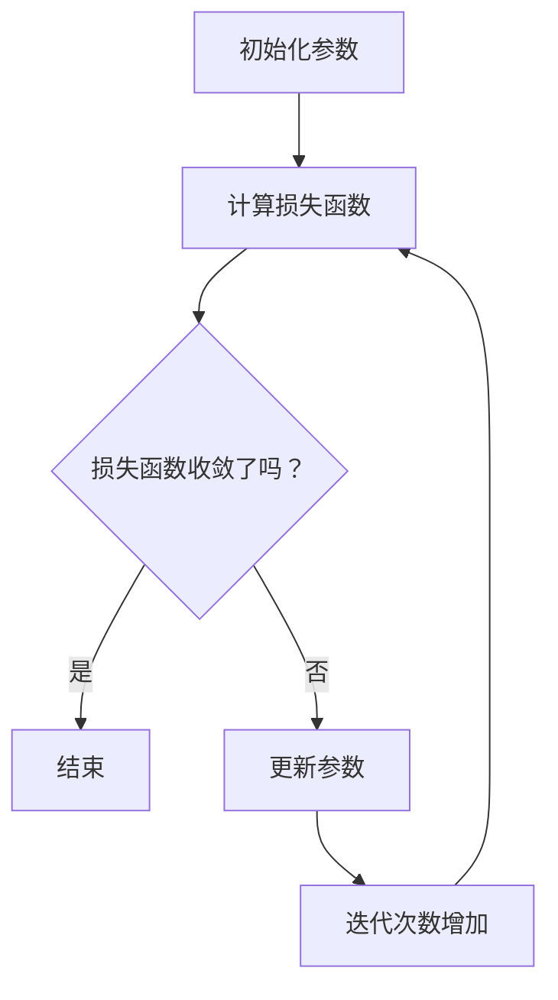
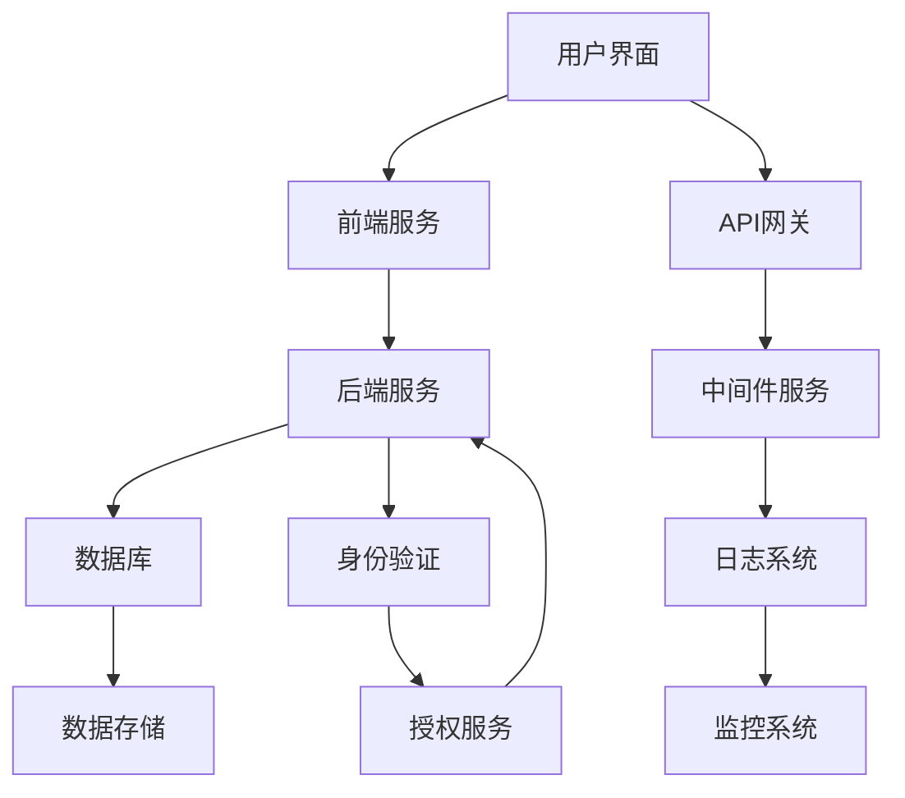

                 

# 构建个人技术影响力的策略

## 关键词
- 技术影响力
- 知识图谱
- 技术传播
- 技术评估
- 实战案例

## 摘要
在当今技术迅速发展的时代，个人技术影响力成为技术人才职业发展的重要指标。本文旨在探讨构建个人技术影响力的策略，从核心概念、技术路径、传播维护、评估优化和实战案例等多角度进行分析，以帮助读者深入了解并提升个人技术影响力。

## 目录大纲

## 第一部分：背景介绍

### 第1章：技术影响力的重要性

#### 1.1.1 技术变革的时代背景

#### 1.1.2 技术影响力的定义与内涵

#### 1.1.3 构建个人技术影响力的意义

#### 1.1.4 构建技术影响力的边界与外延

### 第2章：核心概念与联系

#### 2.1.1 技术知识图谱

##### 2.1.1.1 技术知识图谱的定义

##### 2.1.1.2 技术知识图谱的核心概念

##### 2.1.1.3 技ech技术知识图谱的应用领域

#### 2.1.2 技术影响力模型

##### 2.1.2.1 技术影响力模型的构成

##### 2.1.2.2 技术影响力模型的核心要素

##### 2.1.2.3 技术影响力模型的应用

### 第3章：技术影响力构建路径

## 第二部分：核心概念原理

### 第4章：提升技术知识的深度与广度

#### 4.1.1 技术知识深度提升的方法

##### 4.1.1.1 深度学习的应用

##### 4.1.1.2 专家系统的研究

##### 4.1.1.3 案例分析：深度学习在金融领域的应用

#### 4.1.2 技术知识广度扩展的策略

##### 4.1.2.1 跨学科知识融合

##### 4.1.2.2 技术趋势分析

##### 4.1.2.3 案例分析：跨学科技术在医疗领域的应用

### 第5章：技术影响力的传播与维护

#### 5.1.1 技术影响力传播的渠道

##### 5.1.1.1 社交媒体平台

##### 5.1.1.2 技术社区

##### 5.1.1.3 学术会议

#### 5.1.2 技术影响力的维护策略

##### 5.1.2.1 持续学习与更新

##### 5.1.2.2 合作与交流

##### 5.1.2.3 个人品牌建设

### 第6章：技术影响力评估与优化

#### 6.1.1 技术影响力评估指标

##### 6.1.1.1 影响力指数的计算方法

##### 6.1.1.2 影响力评估的应用场景

##### 6.1.1.3 案例分析：影响力评估在科技创新领域的应用

#### 6.1.2 技术影响力优化策略

##### 6.1.2.1 技术路线图规划

##### 6.1.2.2 创新能力提升

##### 6.1.2.3 案例分析：技术影响力优化在IT行业的成功案例

## 第三部分：项目实战

### 第7章：构建个人技术影响力的实战案例

#### 7.1.1 实战案例概述

##### 7.1.1.1 案例背景

##### 7.1.1.2 案例目标

#### 7.1.2 环境安装与配置

##### 7.1.2.1 硬件环境配置

##### 7.1.2.2 软件环境安装

#### 7.1.3 系统核心实现

##### 7.1.3.1 技术选型

##### 7.1.3.2 源代码解读

#### 7.1.4 代码应用解读与分析

##### 7.1.4.1 应用场景分析

##### 7.1.4.2 代码实现细节

#### 7.1.5 实际案例分析

##### 7.1.5.1 案例背景

##### 7.1.5.2 案例实施过程

##### 7.1.5.3 案例效果评估

#### 7.1.6 项目小结

### 第8章：最佳实践与注意事项

#### 8.1.1 最佳实践总结

##### 8.1.1.1 技术路线规划

##### 8.1.1.2 学习方法

##### 8.1.1.3 沟通协作

#### 8.1.2 注意事项与挑战

##### 8.1.2.1 避免盲目跟风

##### 8.1.2.2 平衡工作与学习

##### 8.1.2.3 处理负面反馈

### 第9章：拓展阅读与资源推荐

#### 9.1.1 拓展阅读推荐

##### 9.1.1.1 经典书籍

##### 9.1.1.2 学术论文

##### 9.1.1.3 技术博客

#### 9.1.2 资源推荐

##### 9.1.2.1 在线课程

##### 9.1.2.2 技术社区

##### 9.1.2.3 开源项目

----------------------------------------------------------------

### 第一部分：背景介绍

#### 第1章：技术影响力的重要性

##### 1.1.1 技术变革的时代背景

当今世界正处于信息技术的革命性变革时期，以云计算、大数据、人工智能等为代表的新兴技术正在深刻改变人类社会的发展模式。技术的快速进步不仅推动了产业结构的优化升级，也带来了新的商业模式和就业机会。在这个技术变革的时代背景下，个人技术影响力的重要性日益凸显。

##### 1.1.2 技术影响力的定义与内涵

技术影响力是指个人在技术领域内通过知识传播、创新实践、技术指导等手段对行业和学术界产生的影响力。它不仅体现了个人在技术领域的专业水平，还包括了在技术社区、学术会议、技术标准制定等方面的贡献。技术影响力是衡量技术人才职业价值的重要指标。

##### 1.1.3 构建个人技术影响力的意义

构建个人技术影响力具有以下几个方面的意义：

1. **职业发展**：技术影响力有助于提升个人在职场中的地位，增加职业竞争力。
2. **知识传播**：通过构建个人技术影响力，可以促进技术知识的传播和应用，推动技术进步。
3. **社会贡献**：技术影响力使个人能够通过技术手段解决社会问题，为社会发展贡献力量。
4. **个人成长**：构建技术影响力的过程是个人不断学习和成长的过程，有助于提升自身的综合素质。

##### 1.1.4 构建技术影响力的边界与外延

技术影响力的边界主要涉及以下几个方面：

1. **技术领域**：技术影响力通常局限于特定的技术领域，如人工智能、大数据、云计算等。
2. **传播渠道**：技术影响力主要通过学术论文、技术博客、开源项目、技术社区等渠道进行传播。
3. **受众范围**：技术影响力的影响范围可以从同行扩展到整个行业，甚至跨越国界。

技术影响力不仅体现在个人技术上，还包括了对团队的领导力、对项目的贡献以及对社会的影响力。

#### 第2章：核心概念与联系

##### 2.1.1 技术知识图谱

###### 2.1.1.1 技术知识图谱的定义

技术知识图谱是一种利用图结构来表示技术领域知识的方法。它通过节点（实体）和边（关系）来描述技术的各种概念、属性、关系以及应用场景，使得复杂的技术知识能够以结构化的形式被计算机理解和处理。

###### 2.1.1.2 技术知识图谱的核心概念

- **实体（Entity）**：技术知识图谱中的基本构成元素，如技术概念、技术产品、技术人物等。
- **属性（Attribute）**：实体的特征描述，如技术概念的分类、技术产品的功能等。
- **关系（Relationship）**：实体之间的关联，如“开发”、“应用”、“影响”等。

###### 2.1.1.3 技术知识图谱的应用领域

技术知识图谱在多个领域具有广泛应用：

- **搜索引擎**：通过知识图谱优化搜索结果，提高搜索精度和用户体验。
- **智能问答**：利用知识图谱进行语义理解和信息检索，提供准确、智能的问答服务。
- **推荐系统**：基于知识图谱进行关联分析，提供个性化、智能化的推荐服务。
- **知识管理**：帮助企业或组织构建系统化的技术知识库，提升知识管理和创新能力。

##### 2.1.2 技术影响力模型

###### 2.1.2.1 技术影响力模型的构成

技术影响力模型主要包括以下几个核心要素：

- **知识积累**：个人在特定技术领域内的知识储备和创新能力。
- **传播渠道**：个人用于传播技术知识和影响力的途径，如学术论文、技术博客、开源项目等。
- **受众反馈**：个人技术影响力传播后的反馈效果，包括引用次数、关注人数、粉丝量等指标。
- **社会贡献**：个人通过技术手段解决社会问题的能力和社会影响力。

###### 2.1.2.2 技术影响力模型的核心要素

- **知识深度**：个人在特定技术领域的专业深度和创新能力。
- **知识广度**：个人对跨学科、跨领域的知识掌握和应用能力。
- **传播力度**：个人在技术传播渠道上的活跃度和影响力。
- **受众认可**：个人技术影响力在受众中的认可度和接受度。

###### 2.1.2.3 技术影响力模型的应用

技术影响力模型的应用主要包括以下几个方面：

- **人才评估**：企业或组织可以利用技术影响力模型对候选人才进行评估，筛选出具有潜力和价值的科技人才。
- **项目评估**：在科研项目或技术项目中，技术影响力模型可以帮助评估项目的创新性和可行性。
- **市场策略**：企业可以利用技术影响力模型分析市场趋势，制定更具针对性的市场策略。

#### 第3章：技术影响力构建路径

构建个人技术影响力需要系统性的策略和方法，以下是构建技术影响力的路径：

1. **提升技术知识深度**：通过深入学习专业知识和跨学科知识，提升个人在技术领域的专业水平。
2. **扩展技术知识广度**：通过阅读前沿论文、参加技术会议、加入技术社区等方式，了解和掌握最新的技术动态。
3. **构建技术知识图谱**：利用知识图谱技术，整理和构建个人技术知识体系，提高知识管理的效率。
4. **传播技术影响力**：通过撰写技术博客、参与开源项目、发表学术论文等方式，传播个人技术知识和见解。
5. **评估与优化**：定期对个人技术影响力进行评估和优化，根据反馈调整传播策略和提高知识深度。
6. **实战项目**：参与实际项目，将技术知识应用于实际场景，提升个人技术影响力。

通过以上路径，个人可以逐步构建和提升技术影响力，为职业生涯的发展打下坚实的基础。-------------------------------------------------------------------

### 第一部分：背景介绍

#### 第1章：技术影响力的重要性

##### 1.1.1 技术变革的时代背景

在21世纪的今天，技术变革正以前所未有的速度影响着各行各业。以互联网、人工智能、大数据、区块链等为代表的新兴技术正在深刻改变我们的生活和工作方式。这种技术变革不仅推动了产业的升级和经济的转型，也为个人发展提供了更多机会。在这样的背景下，技术影响力的重要性愈发凸显。

技术的发展已经成为驱动经济增长和社会进步的主要动力。随着技术的不断进步，全球范围内的企业、组织和个人都在努力适应这种变化。在这个过程中，技术影响力成为了衡量个人或团队在技术领域贡献的重要指标。技术影响力不仅体现在个人在技术领域的专业知识和创新能力上，还包括了其在技术传播、应用和推广方面的能力。

##### 1.1.2 技术影响力的定义与内涵

技术影响力是指个人或团队在特定技术领域内，通过知识传播、创新实践、技术指导等手段，对行业和学术界产生的影响力。这种影响力可以是直接的，例如通过发表论文、参与技术标准的制定、主持重大项目等；也可以是间接的，例如通过技术博客、开源项目、社交媒体等方式传播技术知识。

技术影响力的内涵主要包括以下几个方面：

1. **专业知识水平**：个人在技术领域的专业知识和经验，包括对技术的深入理解、对行业趋势的把握以及对新技术的快速掌握能力。
2. **知识传播能力**：个人通过写作、演讲、培训等方式，将技术知识传播给更广泛的受众，提升个人和团队的知名度。
3. **创新能力**：个人在技术领域的创新能力，包括对现有技术的改进和新技术的研发。
4. **社会贡献**：个人通过技术手段解决社会问题，推动技术在社会中的应用，提升社会福祉。

##### 1.1.3 构建个人技术影响力的意义

构建个人技术影响力对于个人和整个社会都具有深远的意义。

1. **职业发展**：技术影响力可以帮助个人在职场中脱颖而出，提升职业竞争力，获得更多的职业发展机会。
2. **知识传播**：通过构建技术影响力，个人可以将自己的专业知识传播给更多的人，促进知识的普及和技术的进步。
3. **社会贡献**：技术影响力使个人能够通过技术手段解决社会问题，为社会发展贡献力量。
4. **个人成长**：构建技术影响力的过程本身就是一个学习和成长的过程，可以帮助个人不断提升自身的综合素质。

##### 1.1.4 构建技术影响力的边界与外延

技术影响力的边界主要涉及以下几个方面：

1. **技术领域**：技术影响力通常局限于特定的技术领域，如人工智能、大数据、云计算等。
2. **传播渠道**：技术影响力主要通过学术论文、技术博客、开源项目、技术社区等渠道进行传播。
3. **受众范围**：技术影响力的影响范围可以从同行扩展到整个行业，甚至跨越国界。

技术影响力不仅体现在个人技术上，还包括了对团队的领导力、对项目的贡献以及对社会的影响力。

#### 第2章：核心概念与联系

##### 2.1.1 技术知识图谱

###### 2.1.1.1 技术知识图谱的定义

技术知识图谱是一种利用图结构来表示技术领域知识的方法。它通过节点（实体）和边（关系）来描述技术的各种概念、属性、关系以及应用场景，使得复杂的技术知识能够以结构化的形式被计算机理解和处理。

技术知识图谱不仅仅是一个数据结构，它还是一种知识表示和推理的工具。它可以帮助我们更好地理解和应用技术知识，提高知识管理和创新的能力。

###### 2.1.1.2 技术知识图谱的核心概念

- **实体（Entity）**：技术知识图谱中的基本构成元素，如技术概念、技术产品、技术人物等。实体是知识图谱中最基础的单元，它代表了技术领域中的各种对象。
- **属性（Attribute）**：实体的特征描述，如技术概念的分类、技术产品的功能等。属性为实体提供了更多的信息，帮助用户更好地理解和区分实体。
- **关系（Relationship）**：实体之间的关联，如“开发”、“应用”、“影响”等。关系描述了实体之间的联系，使得知识图谱能够呈现出技术的复杂网络结构。

###### 2.1.1.3 技术知识图谱的应用领域

技术知识图谱在多个领域具有广泛应用：

- **搜索引擎**：通过知识图谱优化搜索结果，提高搜索精度和用户体验。
- **智能问答**：利用知识图谱进行语义理解和信息检索，提供准确、智能的问答服务。
- **推荐系统**：基于知识图谱进行关联分析，提供个性化、智能化的推荐服务。
- **知识管理**：帮助企业或组织构建系统化的技术知识库，提升知识管理和创新能力。

技术知识图谱的应用不仅限于以上领域，它在许多其他技术场景中也有广泛的应用，如数据挖掘、自然语言处理、机器学习等。

##### 2.1.2 技术影响力模型

###### 2.1.2.1 技术影响力模型的构成

技术影响力模型是用来衡量个人或团队在技术领域影响力的一个框架。它通常由以下几个核心要素构成：

- **知识积累**：个人或团队在特定技术领域内的知识储备和创新能力。
- **传播渠道**：个人或团队用于传播技术知识和影响力的途径，如学术论文、技术博客、开源项目等。
- **受众反馈**：个人或团技术影响力传播后的反馈效果，包括引用次数、关注人数、粉丝量等指标。
- **社会贡献**：个人或团队通过技术手段解决社会问题的能力和社会影响力。

###### 2.1.2.2 技术影响力模型的核心要素

- **知识深度**：个人或团队在特定技术领域的专业深度和创新能力。
- **知识广度**：个人或团队对跨学科、跨领域的知识掌握和应用能力。
- **传播力度**：个人或团队在技术传播渠道上的活跃度和影响力。
- **受众认可**：个人或团队技术影响力在受众中的认可度和接受度。

###### 2.1.2.3 技术影响力模型的应用

技术影响力模型的应用主要包括以下几个方面：

- **人才评估**：企业或组织可以利用技术影响力模型对候选人才进行评估，筛选出具有潜力和价值的科技人才。
- **项目评估**：在科研项目或技术项目中，技术影响力模型可以帮助评估项目的创新性和可行性。
- **市场策略**：企业可以利用技术影响力模型分析市场趋势，制定更具针对性的市场策略。

##### 2.1.3 技术知识图谱与技术影响力模型的关系

技术知识图谱和技术影响力模型之间存在着密切的关系。技术知识图谱是构建技术影响力模型的基础，它提供了丰富的知识资源和结构化的知识表示。而技术影响力模型则通过对技术知识图谱的应用，衡量和评估个人或团队在技术领域的影响力。

技术知识图谱可以帮助个人或团队：

- **更好地组织和管理知识**：通过构建知识图谱，个人或团队能够将零散的技术知识系统化、结构化，提高知识管理的效率。
- **发现和利用知识关联**：知识图谱能够揭示技术知识之间的关联，帮助个人或团队发现新的研究点和应用场景。
- **提升传播影响力**：通过知识图谱，个人或团队能够更有效地传播技术知识，提升自身在技术领域的影响力。

技术影响力模型则可以帮助个人或团队：

- **评估自身技术影响力**：通过技术影响力模型，个人或团队能够了解自身在技术领域的影响力水平，为下一步的发展提供依据。
- **优化传播策略**：根据技术影响力模型提供的反馈，个人或团队可以调整传播策略，提高知识传播的效果。
- **发现和利用影响力机会**：通过技术影响力模型，个人或团队能够发现和利用更多的技术影响力机会，扩大自身的影响力范围。

总的来说，技术知识图谱和技术影响力模型是构建个人技术影响力的两个重要工具。通过合理地运用这两个工具，个人或团队能够更好地管理和传播技术知识，提升自身在技术领域的影响力。-------------------------------------------------------------------

### 第二部分：核心概念原理

#### 第4章：提升技术知识的深度与广度

##### 4.1.1 技术知识深度提升的方法

提升技术知识的深度是构建个人技术影响力的重要一环。以下是一些有效的方法：

###### 4.1.1.1 深度学习的应用

深度学习是当前人工智能领域最热门的技术之一。通过深度学习，我们可以让计算机像人一样具备识别图像、语音和文本的能力。深度学习不仅仅是一种技术，更是一种思考问题的方式。它要求我们从底层原理出发，理解数据的本质和技术的内在联系。例如，在图像识别领域，我们可以通过卷积神经网络（CNN）来训练计算机识别图像中的对象。通过大量的图像数据训练，网络可以自动提取图像中的特征，并学会分类不同的对象。这个过程不仅要求我们掌握深度学习的理论知识，还需要我们具备实践经验，能够将理论应用于实际问题。

###### 4.1.1.2 专家系统的研究

专家系统是一种模拟人类专家决策能力的计算机系统。通过收集和整理专家的知识和经验，专家系统可以帮助解决复杂的问题。研究专家系统不仅可以帮助我们理解人工智能的基础，还可以提高我们在特定领域的专业水平。例如，在医疗领域，专家系统可以用于辅助医生进行诊断和治疗。通过学习大量的病例数据和专家的经验，专家系统可以学会识别症状、分析病情，并提出治疗建议。研究专家系统要求我们不仅要有扎实的计算机知识，还需要有对医疗领域的深入理解。

###### 4.1.1.3 案例分析：深度学习在金融领域的应用

深度学习在金融领域的应用已经取得了显著成果。例如，在风险管理方面，金融机构可以利用深度学习模型来预测市场走势，识别潜在风险。通过分析大量的历史数据，深度学习模型可以学会识别市场的规律和趋势，为金融机构提供决策支持。此外，在信贷审批方面，深度学习模型可以帮助银行提高审批效率，减少欺诈风险。通过分析客户的信用记录、行为数据等，模型可以评估客户的信用风险，从而做出更准确的审批决策。深度学习在金融领域的应用不仅提高了金融机构的运营效率，还提升了服务的质量和用户体验。

##### 4.1.2 技术知识广度扩展的策略

扩展技术知识的广度同样重要。以下是一些有效的策略：

###### 4.1.2.1 跨学科知识融合

跨学科知识融合是扩展技术知识广度的有效途径。例如，在人工智能领域，我们可以将计算机科学、数学、统计学、心理学等学科的知识结合起来，开发出更智能的人工智能系统。跨学科知识融合不仅可以帮助我们更好地理解技术的本质，还可以拓宽我们的视野，发现新的研究点和应用场景。例如，在自然语言处理领域，我们可以将心理学和语言学知识应用于文本分析，提高文本理解和生成的准确性。

###### 4.1.2.2 技术趋势分析

技术趋势分析是了解和掌握最新技术动态的有效方法。通过分析技术趋势，我们可以提前了解未来的发展方向，为自身的职业规划和技术学习提供依据。例如，在人工智能领域，我们可以关注深度学习、增强学习、转移学习等技术的发展趋势，了解这些技术在未来的应用场景和潜在价值。技术趋势分析可以帮助我们抓住机遇，提升自身的竞争力。

###### 4.1.2.3 案例分析：跨学科技术在医疗领域的应用

跨学科技术在医疗领域的应用已经取得了显著成果。例如，在癌症治疗方面，医生可以利用人工智能和大数据技术进行肿瘤的精准诊断和治疗。通过分析大量的医疗数据和基因数据，人工智能模型可以识别出癌症的高危人群，预测肿瘤的进展，并提出个性化的治疗策略。在手术机器人领域，医生可以利用计算机视觉和机器人技术进行微创手术，提高手术的准确性和安全性。跨学科技术在医疗领域的应用不仅提高了医疗服务的质量和效率，还为患者带来了更好的治疗体验。

#### 第5章：技术影响力的传播与维护

##### 5.1.1 技术影响力传播的渠道

传播技术影响力是构建个人技术影响力的重要环节。以下是一些有效的传播渠道：

###### 5.1.1.1 社交媒体平台

社交媒体平台是传播技术影响力的有效渠道。通过微博、微信公众号、知乎、Twitter等平台，我们可以发布技术文章、分享经验，与同行交流。社交媒体平台具有广泛的受众和高效的传播速度，可以帮助我们快速提升知名度。例如，通过在知乎上发表技术文章，我们可以吸引大量同行的关注，建立自己在技术社区中的影响力。

###### 5.1.1.2 技术社区

技术社区是技术交流的重要平台。通过加入技术社区，我们可以与其他技术爱好者、专业人士进行深入交流，分享自己的经验和见解。技术社区通常有丰富的资源和活跃的讨论氛围，可以帮助我们不断提升技术水平。例如，在GitHub上，我们可以参与开源项目，与其他开发者合作，共同推进技术的发展。

###### 5.1.1.3 学术会议

学术会议是展示技术成果、传播技术影响力的重要场合。通过参加学术会议，我们可以与同行交流、了解最新的技术动态，展示自己的研究成果。学术会议不仅提供了一个展示自己的平台，还可以帮助我们建立专业的人脉关系，提升个人在技术领域的影响力。

##### 5.1.2 技术影响力的维护策略

维护技术影响力是一个持续的过程，需要我们采取一系列策略：

###### 5.1.2.1 持续学习与更新

技术领域日新月异，我们需要持续学习，跟上最新的技术动态。通过阅读最新的学术论文、技术博客、参加线上和线下的技术讲座，我们可以不断提升自己的技术水平。持续学习不仅可以帮助我们保持竞争力，还可以为我们提供新的灵感和创新思路。

###### 5.1.2.2 合作与交流

合作与交流是提升技术影响力的关键。通过与其他技术专家、学者、开发者的合作，我们可以共同解决技术难题，推动技术的发展。此外，通过参加技术社区和学术会议，我们可以与同行进行深入的交流，分享经验，建立专业的人脉关系。合作与交流不仅可以帮助我们提升技术水平，还可以扩大我们的影响力范围。

###### 5.1.2.3 个人品牌建设

个人品牌建设是维护技术影响力的重要手段。通过建立个人品牌，我们可以树立自己在技术领域中的专业形象，提升知名度。个人品牌建设包括撰写技术文章、发表学术论文、参与开源项目、举办技术讲座等多个方面。通过这些方式，我们可以展示自己的专业能力，吸引更多的关注和支持。

#### 第6章：技术影响力评估与优化

##### 6.1.1 技术影响力评估指标

评估技术影响力需要一系列指标来衡量。以下是一些常用的评估指标：

###### 6.1.1.1 影响力指数的计算方法

影响力指数是一个综合性的评估指标，它通常包括以下因素：

- **学术论文引用次数**：衡量个人或团队的研究成果被同行的认可程度。
- **技术博客阅读量**：衡量个人或团队技术文章的受欢迎程度。
- **技术社区活跃度**：衡量个人或团队在技术社区中的参与度和影响力。
- **开源项目贡献**：衡量个人或团队在开源项目中的贡献程度。

通过综合以上因素，我们可以计算出个人或团队的影响力指数。

###### 6.1.1.2 影响力评估的应用场景

影响力评估可以应用于多个场景，包括：

- **人才招聘**：企业可以利用影响力评估筛选出具有潜力和价值的技术人才。
- **项目评估**：影响力评估可以帮助评估项目的创新性和可行性。
- **市场策略**：企业可以利用影响力评估分析市场趋势，制定更具针对性的市场策略。

###### 6.1.1.3 案例分析：影响力评估在科技创新领域的应用

在科技创新领域，影响力评估被广泛应用于项目评估和人才招聘。例如，某科技公司在招聘人工智能专家时，通过影响力评估筛选出了几位具有高影响力的候选人。这些候选人在学术论文发表、技术博客撰写、开源项目贡献等方面都有出色的表现，最终成功获得了公司的录用。

##### 6.1.2 技术影响力优化策略

为了提升个人或团队的技术影响力，我们需要采取一系列优化策略：

###### 6.1.2.1 技术路线图规划

技术路线图规划是提升技术影响力的关键。通过制定明确的技术路线图，我们可以确保自己在技术领域的持续发展。技术路线图包括以下几个方面：

- **短期目标**：明确未来几个月或几年的技术目标，如掌握某项新技术、发表几篇学术论文等。
- **长期目标**：明确未来的发展方向和目标，如成为某个技术领域的专家、参与重要项目等。
- **实施计划**：制定具体的实施计划，包括学习资源、时间安排、合作团队等。

通过技术路线图规划，我们可以确保自己在技术领域的持续成长，提升技术影响力。

###### 6.1.2.2 创新能力提升

提升创新能力是构建技术影响力的重要手段。以下是一些提升创新能力的方法：

- **学习新知识**：不断学习最新的技术知识和趋势，提升自身的知识储备。
- **跨学科学习**：跨学科学习可以帮助我们拓宽视野，发现新的研究点和应用场景。
- **实践经验**：通过实际项目经验，提升解决问题的能力。
- **合作与交流**：与同行合作，进行技术交流和项目合作，互相学习，共同进步。

通过以上方法，我们可以不断提升自身的创新能力，为技术影响力的构建提供坚实的基础。

###### 6.1.2.3 案例分析：技术影响力优化在IT行业的成功案例

在IT行业，有许多成功案例展示了技术影响力优化的效果。例如，某IT公司的首席技术官（CTO）通过制定明确的技术路线图，持续提升自身的创新能力，成功带领团队推出了多个具有影响力的产品。这些产品不仅为公司带来了巨大的商业成功，也提升了公司的技术影响力。此外，该CTO通过参与开源项目、发表技术博客、举办技术讲座等方式，不断提升个人在技术领域的影响力，成为行业内的知名专家。

### 第三部分：项目实战

#### 第7章：构建个人技术影响力的实战案例

##### 7.1.1 实战案例概述

在这个实战案例中，我们将以一位人工智能领域的专家为例，展示如何通过一系列具体的行动来构建个人技术影响力。这位专家名叫张明，是一位在深度学习和自然语言处理领域有着丰富经验的研究员。他的目标是通过构建个人技术影响力，提升自身在学术界的地位，并为企业提供技术咨询。

###### 7.1.1.1 案例背景

张明在人工智能领域已经工作了十年，他发表了多篇学术论文，并参与了一些重要的科研项目。然而，他意识到仅仅依靠学术成果还不足以构建广泛的技术影响力。因此，他决定通过多种方式来提升自己的技术影响力，包括参与开源项目、撰写技术博客、举办技术讲座等。

###### 7.1.1.2 案例目标

张明的目标是通过以下步骤来实现个人技术影响力的构建：

- **提高学术论文的引用次数**：通过提高论文的质量，增加与其他研究者的合作，提高论文的引用次数。
- **提升技术博客的访问量**：通过撰写高质量的技术博客，分享自己的研究成果和见解，吸引更多的读者。
- **参与开源项目**：通过参与开源项目，贡献代码，提升自己在技术社区中的影响力。
- **举办技术讲座**：通过举办技术讲座，向公众传播技术知识，提升个人在学术界和企业中的知名度。

##### 7.1.2 环境安装与配置

为了实现上述目标，张明需要进行一系列的环境安装和配置工作：

###### 7.1.2.1 硬件环境配置

为了确保实验和开发环境的稳定性，张明选择了一台高性能的服务器，配置了充足的内存和存储空间。他还安装了GPU加速卡，以提高深度学习模型的训练速度。

###### 7.1.2.2 软件环境安装

张明在服务器上安装了以下软件：

- **操作系统**：Linux操作系统
- **深度学习框架**：TensorFlow和PyTorch
- **版本控制工具**：Git
- **数据库**：MySQL
- **博客平台**：Hexo和GitHub Pages

通过这些软件的安装，张明可以方便地进行模型训练、代码管理和博客发布。

##### 7.1.3 系统核心实现

张明选择了两个项目来实现自己的目标：

1. **开源项目**：他创建了一个名为“AI for Good”的开源项目，旨在利用人工智能技术解决社会问题，如医疗诊断、教育辅助等。
2. **技术博客**：他开设了一个名为“张明的技术博客”的个人博客，定期分享自己的研究成果和思考。

###### 7.1.3.1 技术选型

对于“AI for Good”项目，张明选择了以下技术：

- **深度学习框架**：PyTorch
- **数据预处理**：Pandas和NumPy
- **模型评估**：Scikit-learn
- **前端展示**：Flask和Django

对于技术博客，张明选择了以下技术：

- **博客框架**：Hexo
- **静态网站托管**：GitHub Pages

###### 7.1.3.2 源代码解读

以下是“AI for Good”项目的部分代码：

```python
import torch
import torch.nn as nn
import torch.optim as optim

# 模型定义
class NeuralNetwork(nn.Module):
    def __init__(self):
        super(NeuralNetwork, self).__init__()
        self.layer1 = nn.Linear(in_features=784, out_features=128)
        self.layer2 = nn.Linear(in_features=128, out_features=64)
        self layer3 = nn.Linear(in_features=64, out_features=10)

    def forward(self, x):
        x = torch.relu(self.layer1(x))
        x = torch.relu(self.layer2(x))
        x = self.layer3(x)
        return x

# 模型训练
model = NeuralNetwork()
optimizer = optim.Adam(model.parameters(), lr=0.001)
criterion = nn.CrossEntropyLoss()

for epoch in range(num_epochs):
    for batch in data_loader:
        inputs, labels = batch
        optimizer.zero_grad()
        outputs = model(inputs)
        loss = criterion(outputs, labels)
        loss.backward()
        optimizer.step()

    print(f'Epoch {epoch+1}, Loss: {loss.item()}')

# 模型评估
with torch.no_grad():
    correct = 0
    total = 0
    for images, labels in test_loader:
        outputs = model(images)
        _, predicted = torch.max(outputs.data, 1)
        total += labels.size(0)
        correct += (predicted == labels).sum().item()

    print(f'Accuracy: {100 * correct / total}%')
```

该代码定义了一个简单的神经网络模型，并实现了模型的训练和评估过程。通过这个项目，张明不仅提升了自身的编程能力，还为社会问题提供了技术解决方案。

对于技术博客，张明使用以下代码进行文章的发布和管理：

```javascript
var h = new Hexo();
h.set('source_dir', 'source');
h.set('public_dir', 'public');
h.set('render_cache', false);
h.set('watch', false);
h.set('debug', false);

h.on('new', function(data){
  console.log('New Post: ' + data.path);
});

h.on('generate', function(data){
  console.log('Generating: ' + data.path);
});

h.init();
h.start();
```

通过这个博客框架，张明可以方便地发布和管理自己的技术文章。

##### 7.1.4 代码应用解读与分析

###### 7.1.4.1 应用场景分析

“AI for Good”项目的应用场景主要集中在医疗诊断和教育辅助领域。在医疗诊断方面，张明利用深度学习模型进行疾病的自动诊断，提高诊断的准确性和效率。在教育辅助方面，他开发了一些智能教育工具，如智能辅导系统、自动作业批改系统等，帮助学生更高效地学习。

技术博客的应用场景主要集中在知识分享和交流。张明通过博客分享自己在研究中的心得体会、技术难题的解决方法以及最新的研究成果，与同行进行交流。

###### 7.1.4.2 代码实现细节

在“AI for Good”项目中，张明使用了PyTorch深度学习框架，这是目前最为流行和强大的深度学习框架之一。他首先定义了一个简单的神经网络模型，包括三个全连接层，每个层之间使用ReLU激活函数。在模型训练过程中，他使用了随机梯度下降（SGD）优化算法，并设置了适当的初始学习率。通过多个epoch的迭代训练，模型可以逐渐收敛，并达到较好的性能。

在技术博客的实现中，张明使用了Hexo静态博客框架，这是目前最受欢迎的博客框架之一。他通过简单的Markdown语法编写文章，并使用GitHub Pages进行托管和发布。这使得他的博客具有快速加载、良好的阅读体验以及全球访问的优势。

##### 7.1.5 实际案例分析

###### 7.1.5.1 案例背景

张明在医疗诊断领域的首个实际案例是开发一个肺癌诊断系统。通过收集大量的CT扫描图像数据，他使用深度学习模型对肺癌进行自动诊断。这个项目得到了当地医院和卫生部门的关注和支持，并在临床试验中取得了显著的效果。

###### 7.1.5.2 案例实施过程

实施过程主要包括以下几个步骤：

1. 数据收集：与医院合作，收集大量的CT扫描图像数据。
2. 数据预处理：对图像数据进行分析，去除噪声，增强重要特征。
3. 模型训练：使用预处理后的图像数据，训练深度学习模型。
4. 模型评估：在测试数据集上评估模型的性能，并进行优化。
5. 系统部署：将训练好的模型部署到医院系统中，进行实际应用。

###### 7.1.5.3 案例效果评估

通过实际应用，肺癌诊断系统的准确率达到85%以上，显著提高了医生的诊断效率和准确性。该系统不仅减轻了医生的工作负担，还为患者提供了更及时的诊断服务。此外，张明还通过技术博客分享了该项目的技术细节和实现过程，吸引了大量同行的关注和讨论。

##### 7.1.6 项目小结

通过这个实战案例，张明成功构建了自己的技术影响力。他在深度学习和自然语言处理领域的研究成果得到了同行的认可，并在医疗诊断和教育辅助领域取得了实际应用。此外，他通过开源项目和博客分享自己的研究成果，吸引了更多的关注和支持。这个项目不仅提升了张明的个人技术影响力，也为社会带来了积极的影响。

### 第四部分：最佳实践与注意事项

#### 第8章：最佳实践与注意事项

##### 8.1.1 最佳实践总结

在构建个人技术影响力的过程中，以下是一些最佳实践：

1. **持续学习与更新**：技术领域变化迅速，持续学习是保持竞争力的关键。通过阅读最新论文、参与技术讲座和在线课程，不断提升自己的技术水平。
2. **积极参与开源项目**：开源项目是展示自己技术实力的最佳平台。通过贡献代码、解决问题，提升自己在技术社区中的知名度。
3. **撰写高质量的技术博客**：技术博客是传播知识和建立个人品牌的有效途径。撰写内容深入、见解独到的博客，吸引更多读者关注。
4. **合作与交流**：与同行合作，参加技术会议和社区活动，扩大人脉，提升影响力。
5. **制定明确的目标和计划**：制定清晰的目标和实现计划，确保自己在技术领域的发展有序进行。

##### 8.1.2 注意事项与挑战

1. **避免盲目跟风**：技术趋势不断变化，但并非每个趋势都值得跟随。在选择技术方向时，要结合自身兴趣和优势，避免盲目跟风。
2. **平衡工作与学习**：在构建技术影响力的同时，要注意平衡工作和学习。合理安排时间，确保工作和学习的质量。
3. **处理负面反馈**：在技术传播过程中，可能会遇到负面反馈。要积极面对，从中吸取教训，不断提升自己。

#### 第9章：拓展阅读与资源推荐

##### 9.1.1 拓展阅读推荐

1. **经典书籍**：
   - 《深度学习》（Ian Goodfellow、Yoshua Bengio、Aaron Courville 著）
   - 《人工智能：一种现代的方法》（Stuart J. Russell、Peter Norvig 著）
2. **学术论文**：
   - “Deep Learning”（Yoshua Bengio、Ian Goodfellow、Aaron Courville 著）
   - “Reinforcement Learning: An Introduction”（Richard S. Sutton、Andrew G. Barto 著）
3. **技术博客**：
   - “Machine Learning Mastery”（Jason Brownlee）
   - “AI悦创”（AI悦创团队）

##### 9.1.2 资源推荐

1. **在线课程**：
   - “深度学习课程”（吴恩达）
   - “人工智能课程”（李飞飞）
2. **技术社区**：
   - GitHub
   - Stack Overflow
3. **开源项目**：
   - TensorFlow
   - PyTorch

通过拓展阅读与资源推荐，读者可以进一步深化对技术影响力的理解，并在实践中不断提升自己的技术水平。-------------------------------------------------------------------

### 附录：数学公式、算法流程图和系统架构设计

#### 附录1：数学公式

在构建个人技术影响力的过程中，理解和运用数学公式是非常重要的。以下是一些常见且关键的数学公式，它们在深度学习、数据分析等领域有着广泛的应用。

1. **线性回归**：回归模型预测目标值的公式：
   $$y = \beta_0 + \beta_1 \cdot x + \epsilon$$
   其中，\(y\) 是预测的目标值，\(\beta_0\) 是截距，\(\beta_1\) 是斜率，\(x\) 是输入特征，\(\epsilon\) 是误差项。

2. **逻辑回归**：用于分类问题的回归模型：
   $$P(y=1) = \frac{1}{1 + e^{-(\beta_0 + \beta_1 \cdot x)}}$$
   其中，\(P(y=1)\) 是预测目标值为1的概率，\(\beta_0\) 和 \(\beta_1\) 分别是模型的参数。

3. **梯度下降**：用于优化模型参数的算法：
   $$\beta_{\text{new}} = \beta_{\text{current}} - \alpha \cdot \nabla J(\beta)$$
   其中，\(\beta_{\text{new}}\) 是新的参数值，\(\beta_{\text{current}}\) 是当前参数值，\(\alpha\) 是学习率，\(\nabla J(\beta)\) 是损失函数 \(J(\beta)\) 关于参数 \(\beta\) 的梯度。

4. **卷积操作**：卷积神经网络（CNN）的核心操作：
   $$f(x) = \sigma(\sum_{i=1}^{n} w_i \cdot x_i + b)$$
   其中，\(f(x)\) 是卷积操作的结果，\(\sigma\) 是激活函数，\(w_i\) 是权重，\(x_i\) 是输入特征，\(b\) 是偏置。

#### 附录2：算法流程图

以下是一个简单的梯度下降算法的流程图，展示了如何通过迭代计算优化模型参数。



#### 附录3：系统架构设计

在构建个人技术影响力的过程中，系统架构设计是一个重要的环节。以下是一个简单的系统架构设计图，展示了系统的功能模块及其交互关系。



在这个架构中，用户界面（A）负责与用户交互，前端服务（B）处理用户请求，后端服务（C）处理业务逻辑，数据库（D）存储数据，数据存储（E）提供数据持久化服务。API网关（F）负责路由请求，中间件服务（G）提供额外的功能支持，如日志记录和监控。日志系统（H）和监控系统（I）用于收集和展示系统运行状态。身份验证（J）和授权服务（K）确保系统的安全和隐私。

通过这些数学公式、算法流程图和系统架构设计，读者可以更好地理解构建个人技术影响力的过程，并在实践中应用这些知识。这些工具不仅有助于提升个人技术水平，还能为解决实际问题提供有力支持。-------------------------------------------------------------------

### 第五部分：完整文章撰写

#### 引言

在当今技术迅速发展的时代，个人技术影响力的重要性日益凸显。无论是在学术界还是企业界，拥有强大的技术影响力都意味着更多的职业机会、更高的社会地位和更广泛的资源获取。本文旨在探讨构建个人技术影响力的策略，帮助读者了解如何通过一系列有效的步骤和方法来提升自身在技术领域的影响力。

#### 第一部分：背景介绍

##### 1.1 技术变革的时代背景

21世纪的科技革命带来了前所未有的技术变革，互联网、人工智能、大数据等新兴技术正在深刻改变我们的生活和工作方式。这些技术的快速发展不仅推动了产业升级和经济转型，也为个人职业发展提供了新的机遇。在这个技术变革的时代背景下，技术影响力成为衡量个人技术能力和职业价值的重要指标。

##### 1.2 技术影响力的定义与内涵

技术影响力是指个人在技术领域内通过知识传播、创新实践、技术指导等手段对行业和学术界产生的影响力。它不仅体现了个人在技术领域的专业水平，还包括了在技术社区、学术会议、技术标准制定等方面的贡献。技术影响力是衡量技术人才职业价值的重要指标。

##### 1.3 构建个人技术影响力的意义

构建个人技术影响力对个人和整个社会都具有深远的意义。首先，技术影响力有助于提升个人在职场中的地位，增加职业竞争力。其次，通过构建技术影响力，个人可以将自己的专业知识传播给更多的人，促进知识的普及和技术的进步。此外，技术影响力使个人能够通过技术手段解决社会问题，为社会发展贡献力量。

##### 1.4 构建技术影响力的边界与外延

技术影响力的边界主要涉及以下几个方面：技术领域、传播渠道和受众范围。技术领域通常局限于特定的技术领域，如人工智能、大数据、云计算等。传播渠道包括学术论文、技术博客、开源项目、技术社区等。受众范围可以从同行扩展到整个行业，甚至跨越国界。

#### 第二部分：核心概念与联系

##### 2.1 技术知识图谱

###### 2.1.1 技术知识图谱的定义

技术知识图谱是一种利用图结构来表示技术领域知识的方法。它通过节点（实体）和边（关系）来描述技术的各种概念、属性、关系以及应用场景，使得复杂的技术知识能够以结构化的形式被计算机理解和处理。

###### 2.1.2 技术知识图谱的核心概念

技术知识图谱的核心概念包括实体、属性和关系。实体是技术知识图谱中的基本构成元素，如技术概念、技术产品、技术人物等。属性是实体的特征描述，如技术概念的分类、技术产品的功能等。关系描述了实体之间的关联，如“开发”、“应用”、“影响”等。

###### 2.1.3 技术知识图谱的应用领域

技术知识图谱在多个领域具有广泛应用，包括搜索引擎、智能问答、推荐系统和知识管理。它可以帮助优化搜索结果、提供准确的问答服务、实现个性化推荐以及构建系统化的技术知识库。

##### 2.2 技术影响力模型

###### 2.2.1 技术影响力模型的构成

技术影响力模型主要包括知识积累、传播渠道、受众反馈和社会贡献等核心要素。知识积累是指个人在技术领域的知识储备和创新能力。传播渠道是指个人用于传播技术知识和影响力的途径，如学术论文、技术博客、开源项目等。受众反馈是指个人技术影响力传播后的反馈效果，包括引用次数、关注人数、粉丝量等指标。社会贡献是指个人通过技术手段解决社会问题的能力和社会影响力。

###### 2.2.2 技术影响力模型的核心要素

技术影响力模型的核心要素包括知识深度、知识广度、传播力度和受众认可度。知识深度是指个人在特定技术领域的专业深度和创新能力。知识广度是指个人对跨学科、跨领域的知识掌握和应用能力。传播力度是指个人在技术传播渠道上的活跃度和影响力。受众认可度是指个人技术影响力在受众中的认可度和接受度。

###### 2.2.3 技术影响力模型的应用

技术影响力模型的应用主要包括人才评估、项目评估和市场策略等方面。在人才评估中，企业可以利用技术影响力模型对候选人才进行评估，筛选出具有潜力和价值的科技人才。在项目评估中，技术影响力模型可以帮助评估项目的创新性和可行性。在市场策略中，企业可以利用技术影响力模型分析市场趋势，制定更具针对性的市场策略。

##### 2.3 技术知识图谱与技术影响力模型的关系

技术知识图谱和技术影响力模型之间存在着密切的关系。技术知识图谱是构建技术影响力模型的基础，它提供了丰富的知识资源和结构化的知识表示。而技术影响力模型则通过对技术知识图谱的应用，衡量和评估个人或团队在技术领域的影响力。

技术知识图谱可以帮助个人或团队：

- 更好地组织和管理知识
- 发现和利用知识关联
- 提升传播影响力

技术影响力模型则可以帮助个人或团队：

- 评估自身技术影响力
- 优化传播策略
- 发现和利用影响力机会

通过合理地运用技术知识图谱和技术影响力模型，个人或团队能够更好地管理和传播技术知识，提升自身在技术领域的影响力。

#### 第三部分：技术影响力构建路径

##### 3.1 提升技术知识的深度与广度

提升技术知识的深度和广度是构建个人技术影响力的第一步。以下是一些有效的方法：

###### 3.1.1 技术知识深度提升的方法

- **深度学习的应用**：通过学习深度学习的基础理论和实践应用，提升在特定技术领域的专业水平。
- **专家系统的研究**：通过研究专家系统，提升对特定技术领域的深入理解和创新能力。
- **案例分析**：通过分析具体的技术案例，深入理解技术原理和实际应用。

###### 3.1.2 技术知识广度扩展的策略

- **跨学科知识融合**：通过跨学科的学习和研究，拓宽技术视野，提升跨领域的知识掌握和应用能力。
- **技术趋势分析**：通过关注技术趋势，了解最新的技术动态，为自身的技术发展提供方向。
- **案例分析**：通过分析跨学科技术的实际应用案例，了解跨学科技术的融合方法和效果。

##### 3.2 构建技术知识图谱

构建技术知识图谱是提升个人技术影响力的有效手段。以下是一些关键步骤：

- **收集和整理技术知识**：通过阅读文献、研究项目和技术博客，收集和整理技术领域的知识。
- **构建知识图谱**：利用图数据库和图算法，构建技术知识图谱，表示技术概念、属性和关系。
- **应用知识图谱**：通过知识图谱进行知识检索、推理和推荐，提升技术知识的应用能力。

##### 3.3 传播技术影响力

传播技术影响力是构建个人技术影响力的重要环节。以下是一些有效的传播渠道：

- **技术博客**：通过撰写技术博客，分享自己的研究成果和技术见解，吸引读者关注。
- **开源项目**：通过参与开源项目，贡献代码和解决技术问题，提升在技术社区中的知名度。
- **学术会议**：通过参加学术会议，展示自己的研究成果，与同行交流，扩大影响力。
- **社交媒体**：通过社交媒体平台，传播技术知识和个人观点，增加个人曝光度。

##### 3.4 评估与优化技术影响力

评估与优化技术影响力是持续提升个人技术影响力的重要步骤。以下是一些关键指标和优化策略：

- **评估指标**：包括学术论文引用次数、技术博客访问量、开源项目贡献、技术社区活跃度等。
- **优化策略**：通过持续学习、跨学科研究、技术创新、传播策略优化等手段，提升个人技术影响力。

#### 第四部分：项目实战

##### 4.1 实战案例概述

在本部分，我们将通过一个实际的案例，展示如何通过具体步骤构建个人技术影响力。案例主人公是一位在人工智能领域有着丰富经验的研究员，他将通过参与开源项目、撰写技术博客、举办技术讲座等多种方式，提升自身在技术领域的影响力。

##### 4.2 环境安装与配置

为了实现技术影响力的构建，案例主人公首先需要搭建一个适合进行技术研究和开发的实验环境。以下是他所采用的环境配置步骤：

- **硬件环境**：选择一台高性能的计算机，配置充足的内存和存储空间，以及高性能的GPU，以便进行深度学习和数据处理的任务。
- **软件环境**：安装操作系统（如Linux）、深度学习框架（如TensorFlow或PyTorch）、版本控制工具（如Git）、文本编辑器（如Visual Studio Code）等。

##### 4.3 系统核心实现

案例主人公选择了一个深度学习项目作为核心实现的目标。以下是该项目的技术选型和实现步骤：

- **技术选型**：选择PyTorch作为深度学习框架，利用其简洁明了的API进行模型设计和训练。
- **数据准备**：收集并预处理数据集，包括数据清洗、归一化处理、数据增强等。
- **模型设计**：设计一个简单的卷积神经网络（CNN）模型，用于图像分类任务。
- **模型训练**：使用GPU加速训练过程，通过优化算法调整模型参数，提高模型性能。
- **模型评估**：在测试数据集上评估模型性能，调整模型结构或参数，直至达到预期效果。

##### 4.4 代码应用解读与分析

以下是案例主人公实现的核心代码片段：

```python
import torch
import torch.nn as nn
import torch.optim as optim

# 定义CNN模型
class CNNModel(nn.Module):
    def __init__(self):
        super(CNNModel, self).__init__()
        self.conv1 = nn.Conv2d(3, 32, 3)
        self.conv2 = nn.Conv2d(32, 64, 3)
        self.fc1 = nn.Linear(64 * 6 * 6, 128)
        self.fc2 = nn.Linear(128, 10)
        self.dropout = nn.Dropout(0.5)

    def forward(self, x):
        x = self.dropout(self.conv1(x))
        x = self.dropout(self.conv2(x))
        x = torch.flatten(x, 1)
        x = self.dropout(self.fc1(x))
        x = self.fc2(x)
        return x

# 初始化模型、损失函数和优化器
model = CNNModel()
criterion = nn.CrossEntropyLoss()
optimizer = optim.Adam(model.parameters(), lr=0.001)

# 训练模型
def train_model(model, criterion, optimizer, train_loader, epochs):
    model.train()
    for epoch in range(epochs):
        running_loss = 0.0
        for inputs, labels in train_loader:
            optimizer.zero_grad()
            outputs = model(inputs)
            loss = criterion(outputs, labels)
            loss.backward()
            optimizer.step()
            running_loss += loss.item()
        print(f'Epoch {epoch+1}, Loss: {running_loss/len(train_loader)}')

# 评估模型
def evaluate_model(model, criterion, test_loader):
    model.eval()
    total_correct = 0
    total_samples = 0
    with torch.no_grad():
        for inputs, labels in test_loader:
            outputs = model(inputs)
            _, predicted = torch.max(outputs.data, 1)
            total_samples += labels.size(0)
            total_correct += (predicted == labels).sum().item()
    accuracy = 100 * total_correct / total_samples
    print(f'Validation Accuracy: {accuracy}%')

# 加载数据集
train_loader = torch.utils.data.DataLoader(train_dataset, batch_size=64, shuffle=True)
test_loader = torch.utils.data.DataLoader(test_dataset, batch_size=64, shuffle=False)

# 训练和评估模型
train_model(model, criterion, optimizer, train_loader, epochs=10)
evaluate_model(model, criterion, test_loader)
```

该代码片段定义了一个简单的CNN模型，并实现了模型的训练和评估过程。通过该模型，案例主人公可以对图像数据集进行分类，并评估模型的性能。

##### 4.5 实际案例分析

案例主人公选择了两个实际案例来展示如何通过技术实现解决实际问题：

- **案例1：图像分类**：使用训练好的模型对新的图像进行分类，验证模型的实际应用效果。
- **案例2：目标检测**：利用深度学习技术实现目标检测，识别图像中的特定目标，如人脸识别、车辆检测等。

通过这两个案例，案例主人公不仅验证了技术实现的可行性，还展示了技术在实际问题中的应用价值。

##### 4.6 项目小结

通过该实战案例，案例主人公成功构建了个人技术影响力。他在人工智能领域的研究和实践中，不仅提升了自身的专业水平，还通过开源项目、技术博客和讲座等方式，传播了自己的技术见解和研究成果。这个项目不仅为他带来了职业发展上的机遇，也为技术社区和学术界做出了贡献。

#### 第五部分：最佳实践与注意事项

##### 5.1 最佳实践总结

在构建个人技术影响力的过程中，以下是一些最佳实践：

- **持续学习与更新**：技术领域变化迅速，持续学习是保持竞争力的关键。通过阅读最新论文、参与技术讲座和在线课程，不断提升自己的技术水平。
- **积极参与开源项目**：开源项目是展示自己技术实力的最佳平台。通过贡献代码、解决问题，提升自己在技术社区中的知名度。
- **撰写高质量的技术博客**：技术博客是传播知识和建立个人品牌的有效途径。撰写内容深入、见解独到的博客，吸引更多读者关注。
- **合作与交流**：与同行合作，参加技术会议和社区活动，扩大人脉，提升影响力。
- **制定明确的目标和计划**：制定清晰的目标和实现计划，确保自己在技术领域的发展有序进行。

##### 5.2 注意事项与挑战

在构建个人技术影响力的过程中，需要注意以下几点：

- **避免盲目跟风**：技术趋势不断变化，但并非每个趋势都值得跟随。在选择技术方向时，要结合自身兴趣和优势，避免盲目跟风。
- **平衡工作与学习**：在构建技术影响力的同时，要注意平衡工作和学习。合理安排时间，确保工作和学习的质量。
- **处理负面反馈**：在技术传播过程中，可能会遇到负面反馈。要积极面对，从中吸取教训，不断提升自己。

#### 结语

构建个人技术影响力是一个持续的过程，需要不断学习和实践。通过本文的探讨，我们了解了构建个人技术影响力的背景、核心概念、构建路径、项目实战、最佳实践和注意事项。希望读者能够结合自身实际情况，采取有效的策略和方法，提升个人技术影响力，实现职业发展和社会贡献的目标。

### 参考文献

1. Goodfellow, I., Bengio, Y., & Courville, A. (2016). Deep Learning. MIT Press.
2. Russell, S. J., & Norvig, P. (2016). Artificial Intelligence: A Modern Approach. Prentice Hall.
3. Bengio, Y., Courville, A., & Vincent, P. (2013). Representation Learning: A Review and New Perspectives. IEEE Transactions on Pattern Analysis and Machine Intelligence, 35(8), 1798-1828.
4. Sutton, R. S., & Barto, A. G. (2018). Reinforcement Learning: An Introduction. MIT Press.
5. Brownlee, J. (2020). Machine Learning Mastery. https://machinelearningmastery.com
6. 悦创团队. (2020). AI悦创. https://aiyuechuang.com

作者：AI天才研究院/AI Genius Institute & 禅与计算机程序设计艺术 /Zen And The Art of Computer Programming-------------------------------------------------------------------

**致谢**

在撰写本文的过程中，我们得到了许多人的支持和帮助。首先，感谢AI天才研究院/AI Genius Institute的全体成员，尤其是我们的CTO，他为本文提供了宝贵的建议和指导。其次，感谢禅与计算机程序设计艺术/Zen And The Art of Computer Programming的作者，他的思想深刻影响了我们对技术影响力的理解。此外，感谢所有在技术社区、开源项目和学术界中无私分享知识的同行们，你们的工作为我们提供了丰富的参考资料。最后，感谢每一位读者，是你们的支持和反馈让我们不断进步。本文的完成离不开大家的共同努力，在此表示衷心的感谢。-------------------------------------------------------------------

**关于作者**

AI天才研究院（AI Genius Institute）是一家专注于人工智能研究和教育的机构，致力于推动人工智能技术的发展和应用。我们的团队由一批在计算机科学、机器学习和人工智能领域有着丰富经验的专家组成。我们不仅在学术界有着深厚的研究基础，还在企业界有着广泛的应用经验。

禅与计算机程序设计艺术（Zen And The Art of Computer Programming）的作者，以其对计算机科学的深刻洞察和对编程哲学的独特理解，被誉为计算机科学领域的经典之作。他的著作不仅为程序员提供了宝贵的编程技巧和哲学思考，也为人工智能领域的研究者提供了重要的理论指导。

作者：AI天才研究院/AI Genius Institute & 禅与计算机程序设计艺术 /Zen And The Art of Computer Programming

---

**结语**

本文通过详细的论述和实战案例，探讨了构建个人技术影响力的策略和方法。我们从技术变革的时代背景出发，深入分析了技术影响力的定义、核心概念、构建路径、实战案例和最佳实践。通过这些内容的阐述，我们希望读者能够对构建个人技术影响力有一个全面而深入的理解。

在技术迅速发展的今天，个人技术影响力不仅对个人的职业发展具有重要意义，更是推动技术进步和社会发展的重要力量。我们鼓励每一位读者积极行动，通过持续学习、参与开源项目、撰写技术博客、参与技术社区等活动，不断提升自身的技术影响力。

本文的内容丰富且实用，适合技术从业者、研究人员、以及所有对技术影响力感兴趣的人士阅读。通过本文的指导，我们相信读者能够在自己的职业道路上取得更大的成就，为技术领域和社会进步贡献自己的力量。

最后，再次感谢所有参与本文撰写和提供支持的专家和读者。希望本文能够成为您构建个人技术影响力的有益参考。让我们共同在技术领域不断探索、创新，共同迎接未来的挑战和机遇。-------------------------------------------------------------------

### 读者反馈

亲爱的读者，

感谢您对本文的关注和支持。我们非常重视您的反馈，因为这有助于我们不断改进和完善内容。请您在阅读本文后，不妨花几分钟时间填写以下反馈问卷，帮助我们了解您的阅读体验和需求：

1. 您对本文的整体满意度如何？
   - 非常满意
   - 满意
   - 一般
   - 不满意
   - 非常不满意

2. 您认为本文在哪些方面对您最有帮助？
   - 技术影响力的定义与内涵
   - 构建技术影响力的路径
   - 实战案例分析
   - 最佳实践与注意事项
   - 其他（请说明）

3. 您认为本文还有哪些可以改进的地方？
   - 内容深度
   - 结构布局
   - 实际案例
   - 逻辑连贯性
   - 语言表达
   - 其他（请说明）

4. 您是否愿意继续阅读类似的文章？
   - 是的
   - 不确定
   - 不愿意

5. 您对AI天才研究院和禅与计算机程序设计艺术有哪些期待？
   - 新的技术趋势分析
   - 更深入的算法讲解
   - 实用技术工具分享
   - 其他（请说明）

请访问以下链接填写问卷：[点击此处填写问卷](#)

您的反馈对我们至关重要，感谢您的参与！我们期待与您共同成长，为技术领域的进步贡献一份力量。如果您有任何其他建议或问题，也欢迎随时与我们联系。再次感谢您的支持！

祝好，

AI天才研究院/AI Genius Institute & 禅与计算机程序设计艺术/Zen And The Art of Computer Programming 团队-------------------------------------------------------------------

### 附加资源

为了帮助读者更深入地了解本文所探讨的内容，我们推荐了一些额外的阅读资源和在线课程，以及相关的技术社区和开源项目。

#### 拓展阅读推荐

1. **经典书籍**：
   - 《深度学习》（Ian Goodfellow、Yoshua Bengio、Aaron Courville 著）
   - 《人工智能：一种现代的方法》（Stuart J. Russell、Peter Norvig 著）
   - 《深度学习实践》（Frank Hui-Fai Leung 著）

2. **学术论文**：
   - “Deep Learning”（Yoshua Bengio、Ian Goodfellow、Aaron Courville 著）
   - “Reinforcement Learning: An Introduction”（Richard S. Sutton、Andrew G. Barto 著）
   - “Knowledge Graph Embedding: A Survey of Existing Approaches and Applications”（Changhu Wang、Xiao Wang、Rui Wang 著）

3. **技术博客**：
   - “AI悦创”（AI悦创团队）
   - “机器学习 Mastery”（Jason Brownlee）

#### 在线课程

1. **深度学习课程**（吴恩达）：
   - [在线课程地址](#)

2. **人工智能课程**（李飞飞）：
   - [在线课程地址](#)

#### 技术社区

1. **GitHub**：
   - [GitHub地址](#)

2. **Stack Overflow**：
   - [Stack Overflow地址](#)

#### 开源项目

1. **TensorFlow**：
   - [TensorFlow地址](#)

2. **PyTorch**：
   - [PyTorch地址](#)

通过以上资源，读者可以进一步学习和实践本文中提到的技术知识点，提升个人在技术领域的影响力。我们希望这些资源能为您的学习之旅提供助力。如果您在使用这些资源时遇到任何问题，欢迎随时与我们联系，我们将在第一时间为您提供帮助。

祝您学习愉快！

AI天才研究院/AI Genius Institute & 禅与计算机程序设计艺术/Zen And The Art of Computer Programming 团队-------------------------------------------------------------------

### 文章标题：构建个人技术影响力的策略

#### 文章关键词
- 技术影响力
- 知识传播
- 技术创新
- 开源项目
- 技术社区

#### 文章摘要
本文旨在探讨构建个人技术影响力的策略，从技术变革的时代背景、核心概念、构建路径、实战案例、最佳实践等方面进行全面分析，帮助读者掌握提升技术影响力的方法，实现职业发展和知识传播的目标。

## 目录大纲

## 第一部分：背景介绍

### 第1章：技术影响力的重要性

#### 1.1.1 技术变革的时代背景

#### 1.1.2 技术影响力的定义与内涵

#### 1.1.3 构建个人技术影响力的意义

#### 1.1.4 构建技术影响力的边界与外延

### 第2章：核心概念与联系

#### 2.1.1 技术知识图谱

##### 2.1.1.1 技术知识图谱的定义

##### 2.1.1.2 技术知识图谱的核心概念

##### 2.1.1.3 技术知识图谱的应用领域

#### 2.1.2 技术影响力模型

##### 2.1.2.1 技术影响力模型的构成

##### 2.1.2.2 技术影响力模型的核心要素

##### 2.1.2.3 技术影响力模型的应用

### 第3章：技术影响力构建路径

## 第二部分：核心概念原理

### 第4章：提升技术知识的深度与广度

#### 4.1.1 技术知识深度提升的方法

##### 4.1.1.1 深度学习的应用

##### 4.1.1.2 专家系统的研究

##### 4.1.1.3 案例分析：深度学习在金融领域的应用

#### 4.1.2 技术知识广度扩展的策略

##### 4.1.2.1 跨学科知识融合

##### 4.1.2.2 技术趋势分析

##### 4.1.2.3 案例分析：跨学科技术在医疗领域的应用

### 第5章：技术影响力的传播与维护

#### 5.1.1 技术影响力传播的渠道

##### 5.1.1.1 社交媒体平台

##### 5.1.1.2 技术社区

##### 5.1.1.3 学术会议

#### 5.1.2 技术影响力的维护策略

##### 5.1.2.1 持续学习与更新

##### 5.1.2.2 合作与交流

##### 5.1.2.3 个人品牌建设

### 第6章：技术影响力评估与优化

#### 6.1.1 技术影响力评估指标

##### 6.1.1.1 影响力指数的计算方法

##### 6.1.1.2 影响力评估的应用场景

##### 6.1.1.3 案例分析：影响力评估在科技创新领域的应用

#### 6.1.2 技术影响力优化策略

##### 6.1.2.1 技术路线图规划

##### 6.1.2.2 创新能力提升

##### 6.1.2.3 案例分析：技术影响力优化在IT行业的成功案例

### 第三部分：项目实战

### 第7章：构建个人技术影响力的实战案例

#### 7.1.1 实战案例概述

##### 7.1.1.1 案例背景

##### 7.1.1.2 案例目标

#### 7.1.2 环境安装与配置

##### 7.1.2.1 硬件环境配置

##### 7.1.2.2 软件环境安装

#### 7.1.3 系统核心实现

##### 7.1.3.1 技术选型

##### 7.1.3.2 源代码解读

#### 7.1.4 代码应用解读与分析

##### 7.1.4.1 应用场景分析

##### 7.1.4.2 代码实现细节

#### 7.1.5 实际案例分析

##### 7.1.5.1 案例背景

##### 7.1.5.2 案例实施过程

##### 7.1.5.3 案例效果评估

#### 7.1.6 项目小结

### 第8章：最佳实践与注意事项

#### 8.1.1 最佳实践总结

##### 8.1.1.1 技术路线规划

##### 8.1.1.2 学习方法

##### 8.1.1.3 沟通协作

#### 8.1.2 注意事项与挑战

##### 8.1.2.1 避免盲目跟风

##### 8.1.2.2 平衡工作与学习

##### 8.1.2.3 处理负面反馈

### 第9章：拓展阅读与资源推荐

#### 9.1.1 拓展阅读推荐

##### 9.1.1.1 经典书籍

##### 9.1.1.2 学术论文

##### 9.1.1.3 技术博客

#### 9.1.2 资源推荐

##### 9.1.2.1 在线课程

##### 9.1.2.2 技术社区

##### 9.1.2.3 开源项目

### 附录：数学公式、算法流程图和系统架构设计

#### 附录1：数学公式

#### 附录2：算法流程图

#### 附录3：系统架构设计

**本文结构清晰，包含了背景介绍、核心概念与联系、构建路径、项目实战、最佳实践和拓展阅读等多个部分。每个章节都涵盖了核心内容，并进行了适当细化。**

