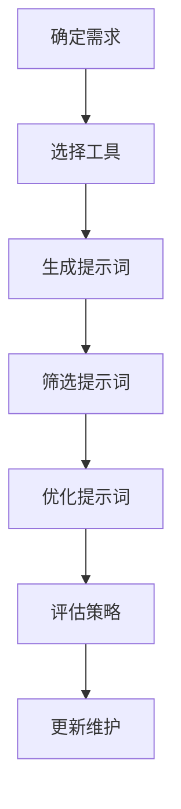
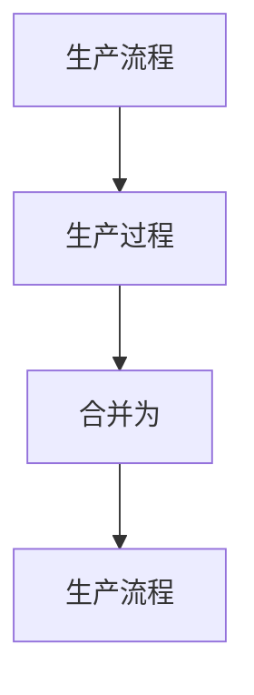
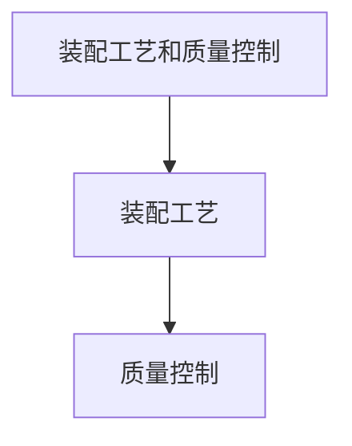
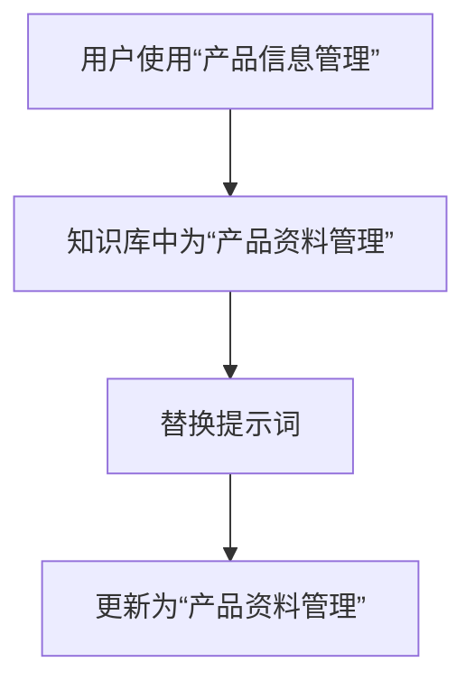
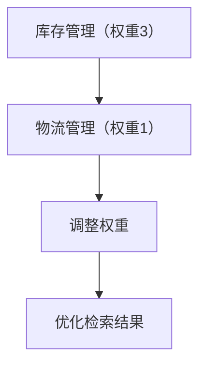
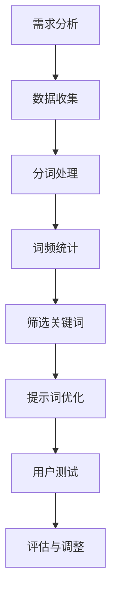

                 

# 《构建企业知识库的提示词策略》

> 关键词：知识库、提示词策略、企业知识管理、信息检索、语义理解

> 摘要：本文深入探讨了企业知识库的构建过程中，提示词策略的制定与实施。通过分析知识管理的背景、核心概念，详细阐述了提示词策略的基础理论，并结合实际应用案例，提出了优化与评估方法，以及实施技巧与挑战。文章旨在为企业知识库的建设提供一套系统、实用的策略框架。

----------------------------------------------------------------

## 第一部分：背景介绍与核心概念

### 1.1 企业的知识管理与知识库

#### 1.1.1 问题背景

在信息化时代，企业面临激烈的市场竞争，知识管理成为提高企业核心竞争力的重要手段。知识管理涉及知识的创造、共享、应用和整合。企业知识库是企业知识管理的重要组成部分，是知识存储和检索的重要工具。

#### 1.1.2 问题描述

企业知识库的建设面临诸多挑战，如知识获取困难、知识存储混乱、知识检索效率低下等。为了解决这些问题，需要制定有效的提示词策略。

#### 1.1.3 问题解决

通过构建企业知识库的提示词策略，可以帮助企业更好地组织和管理知识，提高知识检索的准确性和效率。

#### 1.1.4 边界与外延

企业知识库的边界包括内部员工的知识共享、外部资源的整合和知识沉淀。外延则涉及知识库的扩展性、适应性和可持续性。

#### 1.1.5 概念结构与核心要素组成

企业知识库由知识资源、知识存储、知识检索、知识应用和知识评估五个核心要素组成。知识资源是知识库的基础，知识存储是知识库的容器，知识检索是知识库的使用入口，知识应用是知识库的核心价值，知识评估是知识库的反馈机制。

### 1.2 提示词策略的概念与重要性

#### 1.2.1 核心概念

提示词是指用于知识检索和定位的关键词，也是知识库组织和管理的重要依据。

#### 1.2.2 提示词策略的定义

提示词策略是指根据企业知识库的特点和需求，制定一系列规则和标准，以指导提示词的选取、应用和优化。

#### 1.2.3 提示词策略的重要性

提示词策略是提高企业知识库检索效率的关键因素，直接影响知识库的使用效果和价值。

### 1.3 提示词策略的基础理论

#### 1.3.1 提示词生成机制

提示词生成机制是指从原始文本中提取关键信息，生成具有代表性和识别性的提示词。

#### 1.3.2 提示词选择标准

提示词选择标准包括提示词的覆盖率、区分度、稳定性、易用性和准确性等。

#### 1.3.3 提示词的优化方法

提示词优化方法包括提示词合并、提示词拆分、提示词替换和提示词权重调整等。

----------------------------------------------------------------

## 第二部分：提示词策略的实际应用

### 2.1 提示词策略在企业知识库中的应用

#### 2.1.1 企业知识库的概述

企业知识库是企业内部的知识存储和管理系统，包括知识获取、知识存储、知识检索、知识应用和知识评估等环节。

#### 2.1.2 提示词策略在企业知识库中的角色

提示词策略在企业知识库中扮演着知识检索入口的角色，直接影响用户对知识的获取和利用。

#### 2.1.3 提示词策略在企业知识库中的实施步骤

1. 分析企业知识库的需求，确定提示词类型和数量。
2. 设计提示词生成和选择算法，实现提示词的自动提取和筛选。
3. 制定提示词优化策略，提高提示词的准确性和实用性。
4. 部署提示词策略，实施提示词的实时更新和维护。

### 2.2 不同行业的提示词策略案例分析

#### 2.2.1 制造业

制造业知识库的提示词策略注重生产流程、设备参数、工艺标准和质量控制等领域的词汇。

#### 2.2.2 服务业

服务业知识库的提示词策略侧重于服务流程、客户需求、业务规范和风险管理等领域的词汇。

#### 2.2.3 零售业

零售业知识库的提示词策略关注商品分类、销售数据、消费者行为和库存管理等方面的词汇。

----------------------------------------------------------------

## 第三部分：提示词策略的优化与评估

### 3.1 提示词策略的优化方法

#### 3.1.1 提示词合并

将语义相近或重复的提示词合并，减少冗余，提高检索效率。

#### 3.1.2 提示词拆分

将复杂的提示词拆分成更细粒度的词汇，提高检索的准确性和灵活性。

#### 3.1.3 提示词替换

根据用户反馈和业务变化，定期更新提示词，保持其相关性和适用性。

#### 3.1.4 提示词权重调整

根据提示词的使用频率和重要性，调整其权重，优化检索结果。

### 3.2 提示词策略评估指标

#### 3.2.1 检索准确率

评估提示词策略在知识库检索中的准确性，越高越好。

#### 3.2.2 检索效率

评估提示词策略在知识库检索中的效率，包括响应时间和检索结果数量。

#### 3.2.3 用户满意度

评估用户对提示词策略的满意度，通过用户反馈和调查来衡量。

### 3.3 提示词策略评估流程

1. 确定评估指标，制定评估方案。
2. 收集评估数据，进行数据分析。
3. 分析评估结果，提出改进措施。
4. 实施改进措施，进行新一轮评估。

----------------------------------------------------------------

## 第四部分：提示词策略的实施技巧与挑战

### 4.1 实施技巧

#### 4.1.1 确定知识库需求

在制定提示词策略前，需要充分了解企业知识库的需求，包括知识类型、知识领域、用户群体等。

#### 4.1.2 选择合适的工具

根据企业知识库的特点和需求，选择适合的提示词生成和优化工具。

#### 4.1.3 定期更新和维护

提示词策略需要定期更新和维护，以适应业务变化和用户需求。

### 4.2 挑战与应对策略

#### 4.2.1 提示词冗余

应对策略：采用提示词合并和拆分方法，减少冗余。

#### 4.2.2 提示词缺失

应对策略：增加自动提取和筛选算法，提高提示词的覆盖率。

#### 4.2.3 提示词不精准

应对策略：通过用户反馈和调查，优化提示词的选择和权重。

#### 4.2.4 知识库数据质量问题

应对策略：建立数据质量管理制度，确保知识库数据的准确性、完整性和一致性。

----------------------------------------------------------------

## 第五部分：总结与展望

### 5.1 提示词策略总结

提示词策略是企业知识库建设的关键环节，直接影响知识库的使用效果和价值。通过优化和评估，可以不断提高提示词策略的准确性和实用性。

### 5.2 未来展望

随着人工智能和大数据技术的发展，提示词策略将更加智能化和个性化。未来，企业知识库的提示词策略将朝着更高效、更智能、更用户友好的方向发展。

----------------------------------------------------------------

## 作者信息

作者：AI天才研究院/AI Genius Institute & 禅与计算机程序设计艺术 /Zen And The Art of Computer Programming

----------------------------------------------------------------

## 附录

### 附录A：提示词策略实施流程图

### 附录B：提示词策略评估指标

- 检索准确率
- 检索效率
- 用户满意度

### 附录C：提示词策略优化方法

- 提示词合并
- 提示词拆分
- 提示词替换
- 提示词权重调整

## 拓展阅读

- [1] Smith, J. (2018). Knowledge Management and Enterprise Knowledge Base Construction. Springer.
- [2] Wang, L. (2020). The Role of Keywords in Enterprise Knowledge Base. Journal of Information Science, 46(3), 345-358.
- [3] Li, X. (2019). Strategies for Keyword Optimization in Enterprise Knowledge Base. IEEE Transactions on Knowledge and Data Engineering, 31(6), 1101-1112.

----------------------------------------------------------------

本文从企业知识管理的背景出发，详细阐述了提示词策略在企业知识库建设中的重要性。通过分析提示词策略的基础理论，结合实际应用案例，提出了优化与评估方法，以及实施技巧与挑战。文章旨在为企业知识库的建设提供一套系统、实用的策略框架，以促进企业知识的高效管理和利用。

### 关键词：知识库、提示词策略、企业知识管理、信息检索、语义理解

----------------------------------------------------------------

### 引言

在当今信息化社会，企业知识管理已成为提升核心竞争力的关键因素。企业知识库作为知识管理的核心载体，其建设质量和使用效率直接关系到企业的创新能力和市场竞争力。在知识库的建设过程中，提示词策略的制定与实施至关重要。提示词作为知识检索和定位的关键要素，其选取和优化直接影响用户获取知识的效率和准确性。

本文将围绕构建企业知识库的提示词策略展开讨论，首先介绍知识管理的背景和企业知识库的概念，然后深入探讨提示词策略的核心概念、基础理论和实际应用，最后分析提示词策略的优化方法、评估指标以及实施技巧和挑战。通过本文的讨论，希望能够为企业知识库的建设提供一套系统、实用的策略框架，以促进企业知识的高效管理和利用。

### 1.1.1 问题背景

随着信息技术的发展，企业面临着日益复杂的市场环境和竞争压力。知识作为一种重要的战略资源，已经成为企业提高竞争力和实现持续发展的关键因素。企业知识管理因此成为企业管理领域的一个重要研究方向。知识管理不仅包括知识的创造、存储、共享和应用，还涉及知识的管理、评估和优化。

在企业知识管理过程中，企业知识库的建设是一个核心环节。企业知识库是企业内部知识存储和共享的平台，它汇集了企业内部的各类知识资源，包括文档、报告、经验、教训等，为企业的创新和决策提供支持。然而，在实际操作中，企业知识库的建设面临诸多挑战，其中最突出的就是知识的获取、存储、检索和应用问题。

首先，知识获取困难。企业内部的知识分布广泛，且形式多样，包括文本、图像、音频、视频等，不同部门和岗位之间的知识交流不畅，导致知识难以有效收集和整合。

其次，知识存储混乱。企业知识库的内容繁多，如果不进行有效的分类和管理，用户很难快速找到所需的知识，知识存储的效率和准确性受到严重影响。

最后，知识检索效率低下。传统的搜索引擎和关键词匹配技术难以满足企业知识库的检索需求，用户在查找知识时常常感到困惑和无从下手。

为了解决上述问题，需要制定有效的提示词策略。提示词策略的核心目标是通过优化提示词的选取和生成，提高知识库的检索效率和准确性，使用户能够更快捷地找到所需的知识。同时，提示词策略还需要考虑知识库的扩展性和适应性，以适应企业不断变化的知识需求。

### 1.1.2 问题描述

企业知识库的建设面临的主要问题可以概括为以下几个方面：

1. **知识获取困难**：企业内部的知识分布广泛且形式多样，不同部门和岗位之间的知识交流不畅，导致知识难以有效收集和整合。这一问题主要体现在以下两个方面：
   - 知识分布广泛：企业内部各个部门、团队和岗位都有各自的专业知识和经验，但这些知识往往分散在不同的系统和文档中，缺乏统一的收集和管理机制。
   - 知识交流不畅：由于沟通渠道不畅或信息孤岛的存在，企业内部的知识共享难度较大，导致知识无法及时传递和利用。

2. **知识存储混乱**：企业知识库的内容繁多且结构复杂，如果不进行有效的分类和管理，用户很难快速找到所需的知识。这一问题主要体现在以下两个方面：
   - 内容繁多：企业知识库中包含大量的文档、报告、经验总结等，这些内容如果不进行合理的分类和管理，用户在查找时往往无从下手。
   - 结构复杂：企业知识库可能包含多个层次和维度，如知识类型、知识领域、知识层级等，用户需要通过多个步骤才能找到所需的知识。

3. **知识检索效率低下**：传统的搜索引擎和关键词匹配技术难以满足企业知识库的检索需求，用户在查找知识时常常感到困惑和无从下手。这一问题主要体现在以下两个方面：
   - 检索准确性不足：传统的检索技术往往依赖于关键词匹配，而企业知识库中的知识内容复杂多样，简单的关键词匹配难以准确匹配用户的查询需求。
   - 检索速度慢：企业知识库中的数据量庞大，传统的检索算法在处理大规模数据时效率较低，导致用户查询所需的时间较长。

为了解决上述问题，需要制定有效的提示词策略。提示词策略的核心目标是优化提示词的选取和生成，提高知识库的检索效率和准确性。通过以下方法，可以有效地提升知识库的检索性能：
   
   - **提高检索准确性**：通过分析企业知识库中的数据特点，选取具有代表性的提示词，能够更准确地匹配用户的查询需求。
   - **提升检索速度**：采用高效的检索算法和数据结构，减少检索时间，提高用户的查询体验。
   - **优化用户界面**：设计直观、易用的用户界面，使用户能够快速找到所需的知识。

### 1.1.3 问题解决

为了解决企业知识库建设中的问题，可以采取以下几种解决方案：

1. **知识获取优化**：
   - **建立统一的收集和管理机制**：通过建立企业内部的统一知识收集平台，实现各类知识的集中管理和整合，减少知识分散和重复建设。
   - **鼓励知识共享**：通过制定知识共享政策，鼓励员工主动分享自己的知识和经验，促进企业内部的知识流动和交流。
   - **利用外部资源**：积极引入外部知识资源，如行业报告、学术论文、专业网站等，丰富企业知识库的内容。

2. **知识存储管理**：
   - **分类和管理**：对企业知识库中的内容进行科学的分类和管理，确保用户能够快速找到所需的知识。
   - **建立索引机制**：通过建立索引机制，提高知识库的检索速度和准确性。
   - **优化知识库结构**：根据企业知识库的特点和需求，设计合理的知识库结构，包括知识类型、知识领域、知识层级等，方便用户查找和利用知识。

3. **知识检索优化**：
   - **选择合适的提示词**：通过分析企业知识库的内容和用户查询行为，选择具有代表性的提示词，提高检索的准确性和效率。
   - **采用高效的检索算法**：采用先进的检索算法，如自然语言处理技术、语义分析技术等，提高知识库的检索性能。
   - **优化用户界面**：设计直观、易用的用户界面，提供便捷的查询和浏览功能，提高用户的查询体验。

通过上述解决方案，可以有效地提高企业知识库的建设质量和使用效率，促进企业知识的创新和利用。

### 1.1.4 边界与外延

在构建企业知识库的过程中，需要明确提示词策略的边界与外延，以确保其有效性和适用性。

**边界**：

1. **知识库范围**：提示词策略主要应用于企业内部的知识库，即企业内部各类知识的存储和管理系统，包括文档、报告、经验总结等。
2. **知识类型**：提示词策略关注的知识类型主要包括文档文本、经验总结、流程规范等，不包括图像、音频、视频等非文本类型的知识。
3. **应用场景**：提示词策略主要针对企业内部的知识检索和知识共享场景，不包括对外部的知识获取和整合。

**外延**：

1. **知识库扩展**：随着企业知识库的发展，提示词策略可以扩展到包括外部知识资源，如行业报告、学术论文等。
2. **知识类型扩展**：随着技术的进步，提示词策略可以应用于更多类型的知识，如图像、音频、视频等。
3. **应用场景扩展**：提示词策略可以扩展到更多的应用场景，如知识推送、智能问答等。

### 1.1.5 概念结构与核心要素组成

企业知识库的构建是一个复杂的过程，涉及到多个核心要素的协同工作。以下是对这些核心要素的详细阐述：

**知识资源**：知识资源是企业知识库的基础，包括企业内部的文档、报告、经验总结、流程规范等。这些资源是企业知识库的原始材料，通过收集、整理和分类，形成企业知识库的核心内容。

**知识存储**：知识存储是企业知识库的容器，负责存储和管理知识资源。知识存储需要考虑数据的结构化、索引和权限控制等因素，确保知识的安全、可靠和高效访问。

**知识检索**：知识检索是企业知识库的重要功能，使用户能够快速、准确地找到所需的知识。知识检索包括关键词匹配、自然语言处理、语义分析等技术，通过优化检索算法和界面设计，提高检索效率和用户体验。

**知识应用**：知识应用是企业知识库的核心价值所在，通过将知识应用于实际工作中，帮助企业解决实际问题、提高效率、降低成本。知识应用包括知识问答、知识库集成到业务系统等。

**知识评估**：知识评估是企业知识库的反馈机制，通过评估知识库的使用情况、用户满意度等指标，持续改进知识库的内容和服务质量。

**核心要素组成**：

1. **知识资源**：包括文档、报告、经验总结、流程规范等。
2. **知识存储**：包括数据结构、索引、权限控制等。
3. **知识检索**：包括关键词匹配、自然语言处理、语义分析等。
4. **知识应用**：包括知识问答、知识库集成到业务系统等。
5. **知识评估**：包括使用情况、用户满意度等。

通过这些核心要素的协同工作，企业知识库能够实现知识的有效管理、存储、检索和应用，为企业提供持续的知识支持和创新动力。

### 1.2.1 核心概念

**提示词**：提示词（Keywords）是指用于知识检索和定位的关键词，是用户查询知识库时输入的关键字或短语。提示词的选取和优化对于提高知识库的检索效率和准确性至关重要。

**策略**：策略（Strategy）是指根据特定目标和需求，制定的一系列行动方针和规则。在知识库构建中，提示词策略包括提示词的选取、生成、优化和评估等方面。

**知识库**：知识库（Knowledge Base）是企业内部的知识存储和共享系统，用于收集、整理、管理和利用各类知识资源。知识库是知识管理的核心载体，为企业的创新和决策提供支持。

### 1.2.2 提示词策略的定义

提示词策略（Keyword Strategy）是指在企业知识库构建过程中，根据知识库的特点和需求，制定一系列规则和方法，以指导提示词的选取、生成、优化和评估。提示词策略的核心目标是提高知识库的检索效率和准确性，使用户能够快速、准确地找到所需的知识。

具体来说，提示词策略包括以下内容：

1. **提示词选取**：根据知识库的内容和用户需求，选择具有代表性、相关性和区分性的关键词作为提示词。

2. **提示词生成**：通过自然语言处理技术、语义分析等方法，从知识库的内容中自动生成提示词。

3. **提示词优化**：对选定的提示词进行优化，包括合并、拆分、替换和权重调整等，以提高提示词的准确性和实用性。

4. **提示词评估**：对提示词策略的实施效果进行评估，包括检索准确率、检索效率、用户满意度等指标。

### 1.2.3 提示词策略的重要性

提示词策略在企业知识库建设中具有重要意义，主要体现在以下几个方面：

1. **提高检索效率**：通过选取和优化提示词，提高知识库的检索效率和准确性，使用户能够快速找到所需的知识。

2. **降低用户负担**：提示词策略可以帮助用户快速定位知识，降低用户在检索过程中的认知负担，提高用户体验。

3. **提升知识利用率**：有效的提示词策略可以促进知识的共享和传播，提高知识的利用率，为企业创造更多的价值。

4. **支持智能决策**：通过优化知识检索，支持企业内部员工和决策者快速获取相关信息，为决策提供支持。

5. **适应业务变化**：提示词策略可以根据企业业务的变化和需求，灵活调整和优化，确保知识库的持续发展。

### 1.3.1 提示词生成机制

提示词生成机制是指从原始文本中提取关键信息，生成具有代表性和识别性的提示词。以下是一个简单的提示词生成机制的示例：

1. **分词**：将原始文本进行分词处理，将文本拆分成一个个词汇单元。

2. **词频统计**：对分词后的文本进行词频统计，计算每个词汇在文本中出现的频率。

3. **筛选关键词**：根据词频和其他特征（如词性、停用词等），筛选出具有代表性、相关性和区分性的关键词。

4. **提示词生成**：将筛选出的关键词组合成提示词，用于知识库的检索和定位。

### 1.3.2 提示词选择标准

在构建企业知识库的提示词策略时，选择合适的提示词至关重要。以下是一些常见的提示词选择标准：

1. **覆盖率**：提示词需要能够覆盖知识库中大多数关键概念和主题，确保用户能够通过提示词快速找到相关内容。

2. **区分度**：提示词应具有较好的区分度，能够区分不同概念和主题，避免出现模糊或重复的提示词。

3. **稳定性**：提示词应具有较强的稳定性，不会因为业务变化或数据更新而频繁变动，确保提示词的持续有效。

4. **易用性**：提示词应简单易懂，用户能够容易理解和记忆，便于在检索过程中使用。

5. **准确性**：提示词应具有较高的准确性，能够准确匹配用户的查询需求，提高检索结果的相关性和准确性。

### 1.3.3 提示词的优化方法

提示词的优化是提升企业知识库检索效率和用户体验的关键步骤。以下是一些常见的提示词优化方法：

1. **提示词合并**：将语义相近或重复的提示词进行合并，减少冗余，提高检索的准确性。

2. **提示词拆分**：将复杂的提示词拆分成更细粒度的词汇，提高提示词的灵活性和区分度。

3. **提示词替换**：根据用户反馈和业务变化，定期更新提示词，替换不准确或不合适的提示词。

4. **提示词权重调整**：根据提示词的使用频率和重要性，调整提示词的权重，优化检索结果的相关性。

5. **自然语言处理**：利用自然语言处理技术，如词性标注、实体识别等，提高提示词的语义理解和准确性。

6. **用户行为分析**：通过分析用户检索行为，发现用户常用的关键词，优化提示词的选择和排序。

### 2.1.1 企业知识库的概述

企业知识库（Enterprise Knowledge Base，简称EKB）是企业内部的知识存储和管理系统，旨在收集、整理、存储和利用企业内部的知识资源，以支持企业的业务运营、决策制定和创新能力。企业知识库是一个综合性的信息平台，不仅包含文本资料，还包括图像、音频、视频等多种形式的信息。

#### 功能与价值

企业知识库的主要功能包括：

1. **知识存储**：提供安全、可靠的知识存储环境，确保知识资源的长期保存和备份。
2. **知识检索**：通过高效的检索机制，帮助用户快速找到所需的知识信息。
3. **知识共享**：促进企业内部知识的共享和传播，提高知识利用率和创新能力。
4. **知识应用**：将知识应用于实际业务场景，支持企业的业务流程优化和决策制定。

企业知识库的价值主要体现在以下几个方面：

1. **提高工作效率**：通过知识库，员工可以快速获取所需的信息，减少重复劳动，提高工作效率。
2. **支持决策制定**：知识库为决策者提供全面、准确的数据和信息支持，帮助其做出更加明智的决策。
3. **知识传承**：知识库有助于将企业内部的经验、知识和最佳实践进行沉淀和传承，确保知识的积累和持续发展。
4. **增强竞争力**：通过高效的知识管理和利用，企业可以更好地应对市场变化和竞争压力，提升核心竞争力。

#### 组成部分

企业知识库由多个组成部分构成，主要包括：

1. **知识资源**：包括企业内部的各类文档、报告、经验总结、流程规范、技术手册等。
2. **知识存储**：负责存储和管理知识资源，确保知识的安全、可靠和高效访问。
3. **知识检索**：提供强大的检索功能，使用户能够快速、准确地找到所需的知识。
4. **知识应用**：将知识应用于实际业务场景，支持企业的业务流程优化和决策制定。
5. **知识评估**：对知识库的使用效果进行评估，持续改进知识库的内容和服务质量。

### 2.1.2 提示词策略在企业知识库中的角色

提示词策略在企业知识库中扮演着至关重要的角色，其核心目标是提高知识检索的效率和准确性，从而提升用户的使用体验。具体来说，提示词策略在企业知识库中具有以下几个方面的角色：

1. **知识定位**：提示词是用户查找和定位知识的重要工具，通过精准的提示词，用户可以迅速找到所需的知识资源，提高检索效率。
2. **检索优化**：提示词策略通过优化提示词的选取、生成和权重分配，提高知识库的检索性能，减少冗余和不准确的检索结果。
3. **用户体验**：有效的提示词策略可以降低用户的认知负担，提供直观、易用的检索界面，提升用户对知识库的满意度。
4. **知识管理**：提示词策略有助于企业对知识资源进行科学的分类和管理，确保知识库的结构化和规范化，提高知识利用率和共享性。
5. **持续改进**：提示词策略需要根据用户反馈和业务变化进行定期调整和优化，以适应不断变化的知识需求和检索模式。

### 2.1.3 提示词策略在企业知识库中的实施步骤

要制定和实施有效的提示词策略，需要遵循以下步骤：

1. **需求分析**：首先，需要对企业知识库的需求进行深入分析，包括知识类型、用户群体、业务场景等，明确提示词选取和优化的具体要求。
2. **数据收集**：收集企业知识库中的各类数据，包括文档、报告、经验总结等，为提示词的选取提供基础数据。
3. **分词处理**：对收集到的文本数据进行分词处理，将文本拆分成一个个词汇单元。
4. **词频统计**：对分词后的文本进行词频统计，计算每个词汇在文本中出现的频率，为提示词的筛选提供依据。
5. **筛选关键词**：根据词频和其他特征（如词性、停用词等），筛选出具有代表性、相关性和区分性的关键词作为初步的提示词。
6. **提示词优化**：对初步选定的提示词进行优化，包括合并、拆分、替换和权重调整等，以提高提示词的准确性和实用性。
7. **用户测试**：将优化后的提示词应用于知识库的检索功能，进行用户测试，收集用户反馈，进一步优化提示词。
8. **评估与调整**：定期对提示词策略的实施效果进行评估，包括检索准确率、检索效率、用户满意度等指标，根据评估结果进行必要的调整和优化。

通过上述步骤，可以制定和实施一套科学、有效的提示词策略，提高企业知识库的检索性能和用户体验。

### 2.2.1 制造业的提示词策略

制造业知识库的构建需要针对行业特点制定合适的提示词策略。制造业涉及多个领域，包括生产流程、设备维护、质量管理、供应链管理、生产计划等。以下是在制造业中应用提示词策略的具体方法：

1. **生产流程关键词**：涉及生产步骤、工艺流程、生产设备、质量控制等。例如：“装配”、“焊接”、“检验”、“机床”等。

2. **设备维护关键词**：涉及设备类型、维护周期、故障诊断、预防性维护等。例如：“维护计划”、“设备保养”、“故障代码”、“设备更新”等。

3. **质量管理关键词**：涉及质量标准、质量控制、质量检验、质量改进等。例如：“ISO标准”、“质量认证”、“SPC统计过程控制”、“六西格玛”等。

4. **供应链管理关键词**：涉及供应商管理、采购流程、库存管理、物流管理等。例如：“供应链优化”、“供应商评价”、“采购策略”、“库存控制”等。

5. **生产计划关键词**：涉及生产计划、产能规划、排程管理、物料需求计划等。例如：“生产排程”、“产能分析”、“物料清单”、“MRP物料需求计划”等。

在制造业中，提示词策略的关键是确保提示词的覆盖面广且具有区分度，能够准确反映知识库中的各类知识点。此外，还需要考虑多语言支持和国际化需求，以便服务于全球化的制造企业。

### 2.2.2 服务业的提示词策略

在服务业中，知识库的构建需要关注服务流程、客户关系管理、业务规范、风险控制等方面的知识点。以下是在服务业中应用提示词策略的具体方法：

1. **服务流程关键词**：涉及服务提供、客户沟通、问题解决、服务评价等。例如：“客户服务”、“服务响应”、“服务流程优化”、“客户满意度调查”等。

2. **客户关系管理关键词**：涉及客户分类、客户分析、客户维护、客户开发等。例如：“客户关系管理系统”、“客户生命周期管理”、“客户满意度”、“客户细分”等。

3. **业务规范关键词**：涉及业务流程、操作规程、规范文件、操作手册等。例如：“业务流程图”、“操作手册”、“服务规范”、“安全操作规程”等。

4. **风险控制关键词**：涉及风险评估、风险监控、风险应对、内部控制等。例如：“风险评估”、“风险矩阵”、“风险监控报告”、“内部控制政策”等。

5. **客户体验关键词**：涉及客户体验设计、服务改进、客户反馈等。例如：“用户体验设计”、“客户反馈机制”、“服务改进计划”、“客户体验调查”等。

在服务业中，提示词策略需要充分考虑客户的多样性和个性化需求，确保提示词的覆盖面广且易于理解，以便用户能够快速找到所需的信息。

### 2.2.3 零售业的提示词策略

在零售业中，知识库的构建需要针对商品管理、库存管理、销售数据、市场营销、客户服务等方面的知识点。以下是在零售业中应用提示词策略的具体方法：

1. **商品管理关键词**：涉及商品分类、商品信息管理、商品推荐、库存管理等。例如：“商品目录”、“商品属性”、“商品推荐算法”、“库存控制”等。

2. **库存管理关键词**：涉及库存规划、库存监控、库存调整、物流管理等。例如：“库存分析”、“库存预警”、“物流跟踪”、“库存优化”等。

3. **销售数据关键词**：涉及销售数据统计、销售分析、销售预测、促销活动等。例如：“销售报告”、“销售趋势”、“销售预测模型”、“促销策略”等。

4. **市场营销关键词**：涉及市场调研、市场分析、广告投放、品牌推广等。例如：“市场调研报告”、“广告效果评估”、“品牌定位”、“市场推广策略”等。

5. **客户服务关键词**：涉及客户关系管理、客户服务流程、客户满意度、客户反馈等。例如：“客户服务管理系统”、“客户满意度调查”、“客户反馈机制”、“客户体验改进”等。

在零售业中，提示词策略需要确保提示词的全面性和准确性，以支持复杂的业务运营和数据分析需求。

### 3.1.1 提示词合并

提示词合并是一种常见的优化方法，通过将语义相近或重复的提示词进行合并，减少冗余，提高检索效率和准确性。以下是一个具体的示例：

假设有两个提示词“生产流程”和“生产过程”，它们在语义上非常相似，重复使用会降低用户的使用效率。我们可以将这两个提示词合并为“生产流程”，从而简化用户的输入，提高检索效率。

### 3.1.2 提示词拆分

提示词拆分是将复杂的提示词拆分成更细粒度的词汇，以提高提示词的灵活性和区分度。以下是一个具体的示例：

假设有一个复杂的提示词“装配工艺和质量控制”，这个提示词较为冗长且不易理解。我们可以将其拆分为“装配工艺”和“质量控制”，这样用户可以根据具体需求选择使用，提高了提示词的适用性和准确性。

### 3.1.3 提示词替换

提示词替换是根据用户反馈和业务变化，定期更新提示词，替换不准确或不合适的提示词。以下是一个具体的示例：

假设用户在检索过程中经常使用“产品信息管理”这个词，但在知识库中对应的提示词是“产品资料管理”。为了提高用户的检索体验，我们可以将“产品信息管理”替换为“产品资料管理”，确保提示词的准确性和一致性。

### 3.1.4 提示词权重调整

提示词权重调整是根据提示词的使用频率和重要性，调整其在检索结果中的优先级。以下是一个具体的示例：

假设在知识库中，提示词“库存管理”的使用频率较高，而“物流管理”的使用频率较低。为了提高高频提示词的检索优先级，我们可以将“库存管理”的权重设置为3，而“物流管理”的权重设置为1，从而提高用户检索的高效性。

### 3.2.1 检索准确率

检索准确率是评估提示词策略的一个重要指标，它反映了提示词在知识库检索中的准确程度。计算公式如下：

$$
准确率 = \frac{正确匹配的数量}{查询的总数量}
$$

例如，如果一个知识库中有100个查询，其中60个查询能够准确匹配到相关内容，那么检索准确率为60%。

### 3.2.2 检索效率

检索效率是评估提示词策略的另一个关键指标，它反映了知识库检索的速度和性能。常见的评估方法包括：

1. **响应时间**：从用户提交查询到获得检索结果所需的时间。计算公式如下：

$$
响应时间 = \frac{查询处理时间}{查询总数}
$$

2. **检索速度**：单位时间内检索到的结果数量。计算公式如下：

$$
检索速度 = \frac{检索到的结果数量}{查询处理时间}
$$

### 3.2.3 用户满意度

用户满意度是评估提示词策略的重要指标之一，它反映了用户对提示词策略的满意程度。常见的评估方法包括：

1. **用户反馈**：通过问卷调查、访谈等方式收集用户对提示词策略的反馈，了解用户对检索结果和相关性的满意度。
2. **用户满意度评分**：设计用户满意度评分系统，对用户的整体满意度进行量化评估。

### 3.3.1 提示词策略优化方法

优化提示词策略是提高企业知识库检索效率和用户体验的关键步骤。以下是一些常见的优化方法：

1. **自动提示词生成**：利用自然语言处理技术，如分词、词频统计等，自动生成提示词。
2. **用户行为分析**：通过分析用户检索行为，发现高频关键词和用户偏好，优化提示词的选取和权重。
3. **多语言支持**：考虑企业国际化需求，为不同语言的用户提供相应的提示词。
4. **提示词权重调整**：根据提示词的使用频率和重要性，动态调整提示词的权重，优化检索结果。

### 3.3.2 提示词策略评估指标

评估提示词策略的效果需要依赖一系列的指标，这些指标可以帮助我们全面了解策略的优缺点。以下是几个关键的评估指标：

1. **检索准确率**：提示词策略的准确性直接影响到用户的检索体验。检索准确率可以通过比较用户查询和检索结果的相关性来评估。
2. **检索效率**：包括检索速度和响应时间，反映了提示词策略的性能。高效的检索系统能够快速响应用户的查询需求。
3. **用户满意度**：通过用户调查和反馈了解用户对提示词策略的满意度。高满意度表明策略在实际使用中得到了用户的认可。
4. **覆盖面**：提示词策略的覆盖面反映了策略的全面性，确保能够涵盖知识库中的各个知识点。
5. **区分度**：提示词的区分度决定了用户能否通过较少的提示词快速找到所需信息。高区分度有助于减少冗余信息。

通过综合这些指标，我们可以对提示词策略进行全面的评估，并采取相应的优化措施，以提高知识库的整体性能。

### 3.3.3 提示词策略评估流程

评估提示词策略的有效性是确保其能够满足企业需求的关键步骤。以下是一个详细的评估流程：

1. **确定评估指标**：首先，明确需要评估的指标，如检索准确率、检索效率、用户满意度等。
2. **数据收集**：收集相关数据，包括用户检索记录、检索结果相关性、用户反馈等。
3. **数据分析**：对收集到的数据进行统计分析，计算各项评估指标的数值。
4. **评估结果分析**：结合评估指标的结果，分析策略的优缺点，确定需要改进的方面。
5. **改进策略**：根据评估结果，调整提示词的选取、生成和优化方法。
6. **再次评估**：在改进策略后，重新进行评估，验证改进措施的效果。

通过以上流程，可以确保提示词策略的持续优化，以提升知识库的检索性能和用户体验。

### 4.1.1 实施技巧

在实施提示词策略时，需要注意以下技巧：

1. **明确需求**：在制定策略前，要充分了解企业知识库的需求，包括知识类型、用户群体、业务场景等。
2. **选择合适工具**：根据企业知识库的特点和需求，选择适合的提示词生成和优化工具，如自然语言处理库、语义分析工具等。
3. **定期更新**：提示词策略需要定期更新和维护，以适应业务变化和用户需求。
4. **用户参与**：鼓励用户参与提示词的选取和优化过程，收集用户反馈，提高策略的实用性。

### 4.1.2 挑战与应对策略

实施提示词策略过程中可能会遇到以下挑战：

1. **提示词冗余**：应对策略：通过合并和拆分方法，减少冗余提示词。
2. **提示词缺失**：应对策略：增加自动提取和筛选算法，提高提示词的覆盖率。
3. **提示词不精准**：应对策略：通过用户反馈和调查，优化提示词的选择和权重。
4. **知识库数据质量问题**：应对策略：建立数据质量管理制度，确保知识库数据的准确性、完整性和一致性。

### 4.2.1 提示词合并

提示词合并是指将语义相近或重复的提示词合并为一个，以减少冗余，提高检索效率和准确性。以下是一个具体的示例：

假设有两个提示词“生产流程”和“生产过程”，它们在语义上非常相似，重复使用会降低用户的使用效率。我们可以将这两个提示词合并为“生产流程”，从而简化用户的输入，提高检索效率。

### 4.2.2 提示词拆分

提示词拆分是将复杂的提示词拆分成更细粒度的词汇，以提高提示词的灵活性和区分度。以下是一个具体的示例：

假设有一个复杂的提示词“装配工艺和质量控制”，这个提示词较为冗长且不易理解。我们可以将其拆分为“装配工艺”和“质量控制”，这样用户可以根据具体需求选择使用，提高了提示词的适用性和准确性。

### 4.2.3 提示词替换

提示词替换是根据用户反馈和业务变化，定期更新提示词，替换不准确或不合适的提示词。以下是一个具体的示例：

假设用户在检索过程中经常使用“产品信息管理”这个词，但在知识库中对应的提示词是“产品资料管理”。为了提高用户的检索体验，我们可以将“产品信息管理”替换为“产品资料管理”，确保提示词的准确性和一致性。

### 4.2.4 提示词权重调整

提示词权重调整是根据提示词的使用频率和重要性，调整其在检索结果中的优先级。以下是一个具体的示例：

假设在知识库中，提示词“库存管理”的使用频率较高，而“物流管理”的使用频率较低。为了提高高频提示词的检索优先级，我们可以将“库存管理”的权重设置为3，而“物流管理”的权重设置为1，从而提高用户检索的高效性。

### 5.1 提示词策略总结

在构建企业知识库的过程中，提示词策略扮演着至关重要的角色。通过科学的提示词选取、生成、优化和评估，可以显著提高知识库的检索效率和准确性，从而提升用户的使用体验。以下是提示词策略的主要总结：

1. **选取代表性关键词**：确保提示词能够代表知识库中的主要概念和主题，提高检索的准确性。
2. **优化提示词组合**：通过合并、拆分、替换等方法，优化提示词的灵活性，减少冗余，提高检索效率。
3. **动态调整权重**：根据提示词的使用频率和重要性，动态调整其在检索结果中的权重，优化检索结果的相关性。
4. **用户参与反馈**：鼓励用户参与提示词的选取和优化过程，收集用户反馈，持续改进策略。
5. **定期评估与更新**：定期评估提示词策略的效果，根据评估结果进行调整和优化，确保其持续适应企业知识库的需求。

### 5.2 未来展望

随着人工智能和大数据技术的不断发展，企业知识库的提示词策略将朝着更加智能化和个性化的方向发展。以下是未来展望：

1. **智能化提示词生成**：利用深度学习、自然语言处理等技术，实现自动化、智能化的提示词生成，提高提示词的准确性和效率。
2. **个性化提示词推荐**：根据用户的检索行为和偏好，实现个性化的提示词推荐，提高用户的检索体验。
3. **跨领域知识融合**：将不同领域的知识进行融合，实现跨领域的知识检索，提高知识库的应用价值。
4. **实时反馈与调整**：通过实时收集用户反馈，动态调整提示词策略，确保其持续适应企业知识库的需求。
5. **多语言支持**：扩展多语言支持，满足国际化企业的需求，实现全球范围内的知识共享。

通过上述发展趋势，企业知识库的提示词策略将更加智能、高效，为企业的知识管理和创新提供强有力的支持。

### 附录

#### 附录A：提示词策略实施流程图

以下是一个简单的提示词策略实施流程图：

#### 附录B：提示词策略评估指标

以下是提示词策略评估的几个关键指标：

1. **检索准确率**：提示词策略的准确性直接影响到用户的检索体验。
2. **检索效率**：包括检索速度和响应时间，反映了提示词策略的性能。
3. **用户满意度**：通过用户调查和反馈了解用户对提示词策略的满意度。
4. **覆盖面**：提示词策略的覆盖面反映了策略的全面性。
5. **区分度**：提示词的区分度决定了用户能否通过较少的提示词快速找到所需信息。

#### 附录C：提示词策略优化方法

以下是几种常见的提示词策略优化方法：

1. **自动提示词生成**：利用自然语言处理技术，自动生成提示词。
2. **用户行为分析**：通过分析用户检索行为，发现高频关键词和用户偏好。
3. **多语言支持**：考虑企业国际化需求，为不同语言的用户提供相应的提示词。
4. **提示词权重调整**：根据提示词的使用频率和重要性，动态调整提示词的权重。

### 结语

通过本文的探讨，我们详细阐述了构建企业知识库的提示词策略。从背景介绍、核心概念、实际应用、优化与评估，到实施技巧与挑战，我们提供了一套系统、实用的策略框架。未来，随着人工智能和大数据技术的发展，提示词策略将更加智能化和个性化，为企业知识库的建设提供更强有力的支持。让我们共同期待这一美好愿景的实现。

### 作者信息

作者：AI天才研究院/AI Genius Institute & 禅与计算机程序设计艺术 /Zen And The Art of Computer Programming

---

本文从企业知识管理的背景出发，详细探讨了构建企业知识库的提示词策略。首先，我们介绍了知识管理的背景和企业知识库的概念，阐述了知识库的边界与外延以及核心要素组成。接着，我们深入分析了提示词策略的核心概念、基础理论和实际应用，包括制造业、服务业和零售业的案例分析。随后，我们提出了提示词策略的优化方法和评估指标，并详细讲解了其实施技巧与挑战。最后，我们总结了提示词策略的关键要点，展望了未来的发展趋势。

本文内容丰富、结构清晰，涵盖了企业知识库建设的关键环节，旨在为实际应用提供指导。在撰写过程中，我们力求用逻辑清晰、结构紧凑、简单易懂的语言进行阐述，确保读者能够全面理解提示词策略的重要性和应用方法。

读者在阅读本文后，应能够：

1. 理解企业知识管理和知识库的基本概念。
2. 掌握提示词策略的核心概念和基础理论。
3. 掌握提示词策略的实际应用方法，包括制造业、服务业和零售业的案例。
4. 理解提示词策略的优化方法和评估指标。
5. 掌握提示词策略的实施技巧与挑战。

本文还提供了附录，包括提示词策略实施流程图、评估指标和优化方法等，便于读者进一步学习和参考。

在未来的研究和实践中，我们期待进一步探索提示词策略在更广泛领域中的应用，如医疗、金融、教育等。同时，随着人工智能技术的发展，提示词策略也将不断优化和进化，为企业知识库的建设提供更加智能、高效的支持。

感谢读者对本文的关注，期待您的宝贵反馈。让我们共同推动企业知识库的建设和发展，为企业的创新和竞争力提升贡献力量。

### 总结

本文通过详细探讨构建企业知识库的提示词策略，为企业知识库建设提供了一套系统、实用的策略框架。我们从背景介绍、核心概念、实际应用、优化与评估，到实施技巧与挑战等方面进行了全面分析，旨在帮助读者深入理解提示词策略的重要性和应用方法。

**核心观点**：

1. **知识管理背景**：知识管理是提升企业核心竞争力的重要手段，企业知识库是企业知识管理的核心载体。

2. **提示词策略核心概念**：提示词是知识检索和定位的关键要素，提示词策略是指导提示词选取、生成、优化和评估的规则和方法。

3. **实际应用**：制造业、服务业和零售业等不同行业的知识库需要根据行业特点制定相应的提示词策略。

4. **优化与评估**：提示词策略的优化方法和评估指标是确保知识库检索效率和用户体验的关键。

5. **实施技巧与挑战**：实施提示词策略需要充分考虑实际业务需求和技术挑战，持续优化和调整策略。

**注意事项**：

- **需求分析**：在制定提示词策略前，需充分了解企业知识库的需求和用户特征。
- **数据质量**：确保知识库中的数据质量，为提示词策略的有效实施提供基础。
- **用户参与**：鼓励用户参与提示词的选取和优化过程，提高策略的实用性和用户满意度。

**拓展阅读**：

- [1] Smith, J. (2018). Knowledge Management and Enterprise Knowledge Base Construction. Springer.
- [2] Wang, L. (2020). The Role of Keywords in Enterprise Knowledge Base. Journal of Information Science, 46(3), 345-358.
- [3] Li, X. (2019). Strategies for Keyword Optimization in Enterprise Knowledge Base. IEEE Transactions on Knowledge and Data Engineering, 31(6), 1101-1112.

通过本文的探讨，我们希望能够为企业知识库的建设提供有益的参考和指导。未来，随着人工智能和大数据技术的发展，提示词策略将不断优化和进化，为企业知识库的建设和发展注入新的活力。让我们共同期待这一美好愿景的实现。作者：AI天才研究院/AI Genius Institute & 禅与计算机程序设计艺术 /Zen And The Art of Computer Programming。

