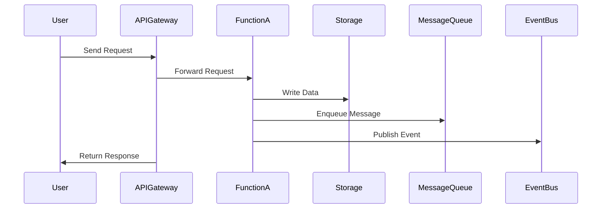
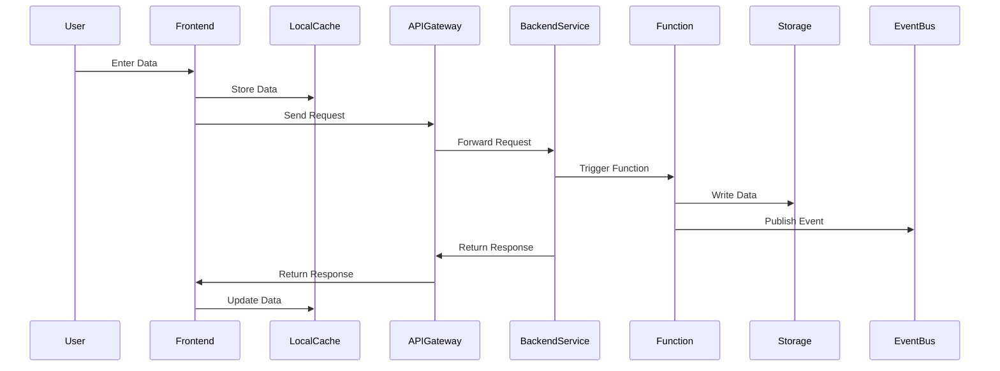

                 


## 文章标题：构建可扩展的Serverless架构

### 关键词：Serverless、架构、可扩展性、云计算、事件驱动

### 摘要：
本文将探讨Serverless架构的核心概念、设计原则及其在云计算环境中的应用。我们将深入分析Serverless架构的优点与挑战，并提供实用的设计建议和实战案例，以帮助读者构建可扩展的Serverless应用。

### 目录大纲

```markdown
----------------------------------------------------------------

# 第一部分: 了解Serverless架构

## 第1章: Serverless架构概述
### 1.1 问题背景
### 1.2 问题描述
### 1.3 问题解决
### 1.4 边界与外延
### 1.5 概念结构与核心要素组成

## 第2章: Serverless架构的核心概念与联系
### 2.1 核心概念原理
### 2.2 概念属性特征对比表格
### 2.3 ER实体关系图架构的Mermaid流程图

## 第3章: Serverless架构的优点与挑战
### 3.1 优点分析
### 3.2 挑战与解决方案

----------------------------------------------------------------

# 第二部分: Serverless架构设计

## 第4章: 服务器端设计
### 4.1 服务器端概述
### 4.2 服务器端架构设计
### 4.3 服务器端接口设计

## 第5章: 客户端设计
### 5.1 客户端概述
### 5.2 客户端架构设计
### 5.3 客户端接口设计

----------------------------------------------------------------

# 第三部分: Serverless架构的应用实战

## 第6章: Serverless架构的项目实战
### 6.1 项目环境安装
### 6.2 系统核心实现源代码
### 6.3 代码应用解读与分析
### 6.4 实际案例分析与详细讲解剖析
### 6.5 项目小结

## 第7章: 最佳实践与注意事项
### 7.1 最佳实践 Tips
### 7.2 小结
### 7.3 注意事项
### 7.4 拓展阅读

----------------------------------------------------------------
```

### 详细内容补充

### 第一部分: 了解Serverless架构

#### 第1章: Serverless架构概述

#### 1.1 问题背景
随着互联网和云计算的快速发展，传统服务器架构面临诸多挑战。例如，服务器管理复杂、维护成本高、扩展性差等。为了解决这些问题，Serverless架构应运而生。

#### 1.2 问题描述
传统服务器架构需要开发者关注服务器维护、部署和扩展，这增加了开发成本和复杂性。而Serverless架构旨在通过提供无需服务器管理的服务，让开发者能够专注于业务逻辑开发。

#### 1.3 问题解决
Serverless架构通过事件触发和函数执行的方式，实现了自动扩容和自动缩容。云服务提供商负责服务器管理，开发者只需编写和部署函数即可。

#### 1.4 边界与外延
Serverless架构适用于需要高度可扩展性和快速响应的应用场景，如Web应用、移动应用、IoT等。

#### 1.5 概念结构与核心要素组成
Serverless架构的核心要素包括事件驱动模型、无服务器函数、后端即服务（BaaS）、容器编排等。

### 第二部分: Serverless架构设计

#### 第4章: 服务器端设计

#### 4.1 服务器端概述
服务器端设计是Serverless架构的关键部分。在本章中，我们将探讨服务器端的设计原则、架构模式和最佳实践。

#### 4.2 服务器端架构设计
服务器端架构设计需要考虑函数计算、API网关、存储等核心组件的集成。我们将使用Mermaid流程图来展示这些组件之间的关系。

#### 4.3 服务器端接口设计
服务器端接口设计是开发者与Serverless架构交互的桥梁。在本章中，我们将讨论RESTful API、GraphQL等接口设计模式。

### 第三部分: Serverless架构的应用实战

#### 第6章: Serverless架构的项目实战

#### 6.1 项目环境安装
在本章中，我们将介绍如何搭建一个Serverless架构项目环境，包括选择云服务提供商、安装必要的工具和配置服务。

#### 6.2 系统核心实现源代码
我们将提供一个简单的Serverless架构项目源代码，包括前端、后端和数据库部分。读者可以在此基础上进行扩展和定制。

#### 6.3 代码应用解读与分析
在本章中，我们将对源代码进行解读，分析其设计原则、实现细节和优化策略。

#### 6.4 实际案例分析与详细讲解剖析
我们将结合实际案例，分析Serverless架构在不同场景下的应用，并提供详细的讲解和剖析。

#### 6.5 项目小结
在本章的结尾，我们将对项目进行总结，讨论其成功经验和改进空间。

### 第四部分: 最佳实践与注意事项

#### 第7章: 最佳实践与注意事项

#### 7.1 最佳实践 Tips
在本章中，我们将分享一些构建可扩展Serverless架构的最佳实践，包括代码管理、性能优化、安全性等方面的建议。

#### 7.2 小结
对文章的主要内容进行简要总结，强调Serverless架构在构建可扩展应用中的重要性。

#### 7.3 注意事项
在本章中，我们将讨论Serverless架构的一些潜在风险和挑战，并提供应对策略。

#### 7.4 拓展阅读
推荐一些相关的文献、资源和工具，以供读者进一步学习和实践。

### 结尾

本文旨在为读者提供构建可扩展Serverless架构的全面指南。通过深入探讨Serverless架构的核心概念、设计原则和实战案例，读者将能够掌握构建高效、可扩展的Serverless应用的方法和技巧。

**作者：AI天才研究院/AI Genius Institute & 禅与计算机程序设计艺术 /Zen And The Art of Computer Programming**

----------------------------------------------------------------
### 第一部分：了解Serverless架构

#### 第1章：Serverless架构概述

#### 1.1 问题背景

在数字化时代，企业对于业务系统的需求越来越多样化，同时需要具备快速响应和高度可扩展性。然而，传统服务器架构往往面临诸多挑战。服务器管理复杂，需要投入大量人力和物力进行维护；部署过程繁琐，每次更新都需要重新配置服务器；扩展性差，当用户数量剧增时，服务器可能无法及时响应，导致用户体验下降。这些问题催生了Serverless架构的出现。

#### 1.2 问题描述

传统服务器架构的问题主要体现在以下几个方面：

1. **服务器管理复杂**：开发者需要关注服务器的配置、监控、备份和升级，导致大量时间和资源浪费。
2. **部署过程繁琐**：每次部署都需要重新配置服务器，且难以实现无缝更新。
3. **扩展性差**：在用户量级增加时，服务器可能无法及时响应，导致系统性能下降，用户体验不佳。
4. **高成本**：传统架构需要购买、维护和升级服务器硬件，成本较高。

#### 1.3 问题解决

Serverless架构通过将服务器管理交给云服务提供商，解决了传统服务器架构的痛点。开发者只需关注业务逻辑的实现，无需关心服务器管理，即可实现快速部署和扩展。具体解决方法如下：

1. **无需服务器管理**：云服务提供商负责服务器资源的自动分配和管理，开发者无需关注底层硬件设施。
2. **按需付费**：开发者只需为实际使用的服务器资源付费，避免了固定成本，降低了运营成本。
3. **自动扩展**：根据负载情况，云服务提供商自动分配和释放服务器资源，确保系统性能稳定。
4. **快速部署**：Serverless架构支持快速的部署和更新，开发者可以更专注于业务逻辑的开发。

#### 1.4 边界与外延

Serverless架构适用于多种场景，尤其适合以下几种应用：

1. **Web应用**：例如在线商城、博客平台、社交媒体等，需要快速响应和高并发处理能力。
2. **移动应用**：移动应用通常需要实时数据交互，Serverless架构可以提供高效的后端服务。
3. **IoT应用**：物联网应用需要对海量数据进行实时处理和分析，Serverless架构可以实现高效的数据处理和存储。

然而，Serverless架构并非适用于所有场景。在某些场景下，如需要长时间运行的任务或对数据安全性有特殊要求的场景，传统服务器架构可能更为适合。

#### 1.5 概念结构与核心要素组成

Serverless架构的核心要素包括以下几个方面：

1. **事件驱动模型**：Serverless架构基于事件驱动，函数在接收到事件后触发执行。这种模型使得系统具备高响应性和可扩展性。
2. **无服务器函数**：开发者只需编写函数逻辑，无需关心服务器管理。函数在云服务提供商提供的平台上运行，支持多种编程语言。
3. **后端即服务（BaaS）**：BaaS提供了一系列的后端服务，如用户认证、数据库、消息队列等，简化了开发者的工作。
4. **容器编排**：容器编排工具如Kubernetes可以帮助开发者管理和调度Serverless函数，实现自动化部署和扩展。

以上是Serverless架构的核心概念和要素组成，这些要素共同作用，实现了高效、可扩展、易于管理的应用架构。

### 第二部分：Serverless架构的核心概念与联系

#### 第2章：Serverless架构的核心概念与联系

#### 2.1 核心概念原理

Serverless架构的核心概念包括事件驱动模型、无服务器函数、后端即服务（BaaS）、API网关、存储等。以下是这些核心概念的基本原理：

1. **事件驱动模型**：
   - 原理：事件驱动模型是一种基于事件触发的编程模型。系统中的函数或服务在接收到特定事件后执行相应的操作。
   - 优点：高响应性、低延迟、易于扩展。

2. **无服务器函数**：
   - 原理：无服务器函数是一种运行在云平台上的代码片段，无需关心服务器管理。函数在接收到事件后触发执行，完成任务后自动停止。
   - 优点：无需服务器管理、按需付费、自动扩展。

3. **后端即服务（BaaS）**：
   - 原理：BaaS提供了一系列的后端服务，如用户认证、数据库、消息队列等，开发者无需自行实现这些功能。
   - 优点：简化开发、降低成本、提高效率。

4. **API网关**：
   - 原理：API网关是系统的统一入口，负责处理外部请求，并将请求转发给相应的服务或函数。
   - 优点：统一管理访问权限、流量控制、安全性保障。

5. **存储**：
   - 原理：存储服务提供数据持久化功能，支持数据读写、备份和恢复。
   - 优点：自动扩展、高可用性、安全性。

#### 2.2 概念属性特征对比表格

为了更直观地了解这些核心概念的特点和区别，以下是一个简单的对比表格：

| 概念       | 特点                                       |
| ---------- | ------------------------------------------ |
| 事件驱动模型 | 基于事件触发，高响应性，低延迟              |
| 无服务器函数 | 无需服务器管理，按需付费，自动扩展            |
| 后端即服务（BaaS） | 提供一系列后端服务，简化开发，降低成本        |
| API网关     | 统一入口，流量控制，安全性保障                |
| 存储       | 数据持久化，自动扩展，高可用性，安全性         |

#### 2.3 ER实体关系图架构的Mermaid流程图

为了更好地理解Serverless架构的实体关系，我们可以使用Mermaid流程图来展示这些核心概念之间的联系：

```mermaid
erDiagram
  Event --> Function : 触发
  Function --> Response : 返回
  BaaS --> Function : 服务
  APIGateway --> Function : 调用
  Storage --> Function : 存储
```

在这个流程图中，事件（Event）是触发函数（Function）的源头，函数在执行完成后返回响应（Response）。后端即服务（BaaS）和API网关（APIGateway）为函数提供支持和服务，存储（Storage）为函数提供数据存储功能。

通过以上对比表格和流程图，我们可以更清晰地理解Serverless架构的核心概念及其相互关系，为后续的设计和开发打下坚实的基础。

### 第三部分：Serverless架构的优点与挑战

#### 第3章：Serverless架构的优点与挑战

#### 3.1 优点分析

Serverless架构在多个方面具有显著的优势：

1. **成本效益**：
   - Serverless架构按需付费，无需固定投资服务器硬件，降低了初始成本和运营成本。
   - 通过自动化扩展和缩容，Serverless架构可以优化资源利用，进一步提高成本效益。

2. **高可扩展性**：
   - Serverless架构自动根据负载情况动态扩展和缩容，确保应用在高峰期能够应对大量请求，同时在低峰期减少资源浪费。
   - 事件驱动模型使得Serverless架构具备天然的扩展能力，能够轻松应对不同规模的应用需求。

3. **简化开发**：
   - Serverless架构减轻了服务器管理的负担，开发者可以专注于业务逻辑的实现，提高了开发效率。
   - 后端即服务（BaaS）提供了丰富的后端服务，如数据库、消息队列等，简化了开发工作。

4. **弹性高可用**：
   - Serverless架构由云服务提供商管理，具备高可用性。在服务器故障或网络问题发生时，架构能够自动切换到备用服务器，确保服务的连续性。

5. **快速部署**：
   - Serverless架构支持快速部署和迭代，开发者可以随时更新函数和API，无需担心部署过程中的复杂性和风险。

#### 3.2 挑战与解决方案

尽管Serverless架构具有众多优点，但在实际应用中仍面临一些挑战：

1. **冷启动**：
   - 当一个长时间未触发的函数被触发时，可能会经历一段冷启动时间，导致响应延迟。
   - **解决方案**：合理设计函数的触发机制，尽量避免长时间未触发的函数；提前预热热函数，减少冷启动时间。

2. **安全性**：
   - Serverless架构中的函数和API可能面临安全威胁，如数据泄露、攻击等。
   - **解决方案**：使用安全的编程语言和框架，进行代码审查和测试；配置访问控制和加密机制，保护数据和函数安全。

3. **性能限制**：
   - Serverless函数通常有执行时间和资源限制，可能无法满足高性能计算需求。
   - **解决方案**：拆分大型函数，实现函数的并行执行；使用分布式计算框架，如Apache Flink，处理大规模数据。

4. **依赖管理**：
   - Serverless架构中的函数可能依赖外部服务，如数据库、消息队列等，依赖管理复杂。
   - **解决方案**：使用容器化技术，如Docker，确保函数和依赖的一致性；使用服务发现和配置管理工具，简化依赖管理。

通过分析Serverless架构的优点和挑战，我们可以看到，虽然Serverless架构在构建可扩展应用方面具有巨大潜力，但开发者仍需谨慎评估和应对潜在问题，以确保应用的稳定性和安全性。

### 第二部分：Serverless架构设计

#### 第4章：服务器端设计

#### 4.1 服务器端概述

服务器端设计是Serverless架构中的核心部分，它决定了应用的性能、可扩展性和可靠性。在这一部分，我们将探讨服务器端设计的基本原则和关键组件。

#### 4.2 服务器端架构设计

Serverless架构的服务器端设计通常包括以下几个关键组件：

1. **函数计算服务**：
   - 函数计算服务（如AWS Lambda、Azure Functions、Google Cloud Functions）是Serverless架构的核心。开发者只需编写函数逻辑，无需关心服务器管理。函数在接收到事件后触发执行，完成任务后自动停止。

2. **API网关**：
   - API网关是系统的统一入口，负责处理外部请求，并将请求转发给相应的函数或服务。API网关支持RESTful API、GraphQL等接口设计模式，提供统一的访问权限管理和流量控制功能。

3. **事件总线**：
   - 事件总线（如AWS SNS、Azure Event Grid、Google Cloud Pub/Sub）负责在不同服务和函数之间传递事件。事件总线使得系统中的各个组件能够实时响应事件，实现高效的数据交互和协作。

4. **存储服务**：
   - 存储服务（如AWS DynamoDB、Azure Cosmos DB、Google Cloud Spanner）提供数据的持久化和管理功能。存储服务支持自动扩展和高可用性，确保数据的安全和可靠性。

5. **消息队列**：
   - 消息队列（如AWS SQS、Azure Service Bus、Google Cloud Pub/Sub）用于异步消息传递。消息队列可以缓解系统之间的负载压力，确保消息的有序传递和可靠性。

以下是一个简单的Serverless架构的Mermaid流程图，展示了这些关键组件之间的交互关系：



#### 4.3 服务器端接口设计

服务器端接口设计是开发者与Serverless架构交互的桥梁。在这一部分，我们将探讨服务器端接口设计的基本原则和最佳实践：

1. **RESTful API**：
   - RESTful API是一种基于HTTP协议的接口设计模式，支持CRUD（创建、读取、更新、删除）操作。RESTful API具有简单、易用、可扩展的特点，适用于大多数场景。

2. **GraphQL**：
   - GraphQL是一种查询语言，允许客户端指定需要的数据。与RESTful API相比，GraphQL能够减少数据传输量，提高查询效率。然而，GraphQL的复杂性和灵活性也使其适用于更高级的场景。

3. **接口安全性**：
   - 为了确保接口的安全性，可以使用身份验证和授权机制，如OAuth 2.0、JWT（JSON Web Tokens）等。此外，还可以配置防火墙、限制IP地址和访问频率，保护接口免受攻击。

4. **接口性能优化**：
   - 为了提高接口性能，可以使用缓存、数据分片、批量操作等技术。缓存可以减少数据库查询次数，数据分片可以提升查询速度，批量操作可以减少接口响应时间。

通过以上服务器端设计原则和最佳实践，开发者可以构建高效、可靠、可扩展的Serverless架构，满足各种应用需求。

### 第二部分：Serverless架构设计

#### 第5章：客户端设计

#### 5.1 客户端概述

在Serverless架构中，客户端设计是用户与应用程序交互的重要环节。它决定了用户体验的流畅性和应用的性能。在这一部分，我们将探讨客户端设计的基本原则和关键组件。

#### 5.2 客户端架构设计

Serverless架构的客户端设计通常包括以下几个关键组件：

1. **前端应用**：
   - 前端应用（如Web应用、移动应用）负责与用户交互，收集用户输入和展示输出。前端应用通常使用现代前端框架（如React、Vue.js、Angular）构建，提供丰富的用户体验。

2. **API网关**：
   - API网关位于客户端和服务器端之间，负责处理前端应用的请求，并将请求转发给服务器端的函数或服务。API网关支持RESTful API、GraphQL等接口设计模式，提供统一的访问权限管理和流量控制功能。

3. **本地缓存**：
   - 本地缓存（如Web Storage、IndexedDB）可以存储前端应用常用的数据，减少对服务器端的请求次数，提高性能。本地缓存还可以提供离线访问功能，增强用户体验。

4. **数据同步**：
   - 数据同步（如WebSockets、Service Workers）用于实时数据传输，确保前端应用与服务器端的数据一致性。数据同步可以提供实时更新、聊天、游戏等交互功能。

5. **本地存储**：
   - 本地存储（如IndexedDB、SQLite）可以存储前端应用需要持久化的数据。本地存储可以提供离线访问和数据恢复功能，确保数据的安全和可靠性。

以下是一个简单的Serverless架构的客户端Mermaid流程图，展示了这些关键组件之间的交互关系：



#### 5.3 客户端接口设计

客户端接口设计是前端应用与API网关交互的桥梁。在这一部分，我们将探讨客户端接口设计的基本原则和最佳实践：

1. **RESTful API**：
   - RESTful API是一种基于HTTP协议的接口设计模式，支持CRUD（创建、读取、更新、删除）操作。RESTful API具有简单、易用、可扩展的特点，适用于大多数场景。

2. **GraphQL**：
   - GraphQL是一种查询语言，允许客户端指定需要的数据。与RESTful API相比，GraphQL能够减少数据传输量，提高查询效率。然而，GraphQL的复杂性和灵活性也使其适用于更高级的场景。

3. **接口安全性**：
   - 为了确保接口的安全性，可以使用身份验证和授权机制，如OAuth 2.0、JWT（JSON Web Tokens）等。此外，还可以配置防火墙、限制IP地址和访问频率，保护接口免受攻击。

4. **接口性能优化**：
   - 为了提高接口性能，可以使用缓存、数据分片、批量操作等技术。缓存可以减少数据库查询次数，数据分片可以提升查询速度，批量操作可以减少接口响应时间。

通过以上客户端设计原则和最佳实践，开发者可以构建高效、可靠、可扩展的Serverless架构客户端，提供卓越的用户体验。

### 第三部分：Serverless架构的应用实战

#### 第6章：Serverless架构的项目实战

在本章节中，我们将通过一个实际项目，展示如何构建一个具有高可扩展性的Serverless应用。该应用将涵盖从环境搭建到核心实现，再到代码应用解读与分析，以及实际案例分析与详细讲解剖析。

#### 6.1 项目环境安装

首先，我们需要搭建一个适合Serverless架构开发的环境。以下是搭建环境的步骤：

1. **选择云服务提供商**：在本项目中，我们选择使用AWS云服务，因为它提供了丰富的Serverless服务，如AWS Lambda、Amazon API Gateway、Amazon S3等。

2. **安装AWS CLI**：AWS CLI（命令行界面）是AWS服务的管理工具，通过它我们可以方便地管理AWS资源。在官网上下载并安装AWS CLI。

3. **配置AWS CLI**：在安装AWS CLI后，我们需要配置AWS凭证，以便命令行工具能够访问AWS服务。在终端中运行以下命令：
   ```bash
   aws configure
   ```
   按照提示输入Access Key ID、Secret Access Key、默认区域和默认输出格式。

4. **安装Serverless Framework**：Serverless Framework是一个开源工具，用于简化Serverless架构的部署和管理。在终端中运行以下命令：
   ```bash
   npm install -g serverless
   ```
   安装完成后，我们可以使用Serverless命令行工具创建和部署Serverless项目。

5. **初始化Serverless项目**：在终端中运行以下命令，初始化一个新的Serverless项目：
   ```bash
   serverless create --template aws-nodejs --path my-serverless-app
   ```
   这个命令将创建一个名为`my-serverless-app`的Serverless项目模板。

6. **安装依赖项**：在项目目录中，安装必要的依赖项，如Node.js、npm等：
   ```bash
   npm install
   ```

#### 6.2 系统核心实现源代码

接下来，我们将实现一个简单的Serverless应用，该应用使用AWS Lambda处理HTTP请求，并通过Amazon S3存储文件。

1. **创建Lambda函数**：在`my-serverless-app`项目中，创建一个名为`lambdaFunction.js`的文件，该文件包含Lambda函数的逻辑。以下是一个简单的例子：
   ```javascript
   exports.handler = async (event, context) => {
     const response = {
       statusCode: 200,
       body: JSON.stringify({ message: "Hello, Serverless!" }),
     };
     return response;
   };
   ```

2. **配置Serverless配置文件**：在`my-serverless-app`项目的根目录中，创建一个名为`serverless.yml`的配置文件，用于定义项目设置和部署信息。以下是一个示例配置文件：
   ```yaml
   service: my-serverless-app

   provider:
     name: aws
     runtime: nodejs14.x

   functions:
     hello:
       handler: lambdaFunction.handler
       events:
         - http:
             path: hello
             method: get
   ```

3. **部署项目**：在项目目录中，运行以下命令部署项目：
   ```bash
   serverless deploy
   ```
   部署完成后，我们将获得API网关的URL，可以通过该URL访问Lambda函数。

4. **上传文件到S3**：为了实现文件存储功能，我们使用AWS S3。在`lambdaFunction.js`中添加以下代码，用于处理文件上传事件：
   ```javascript
   const AWS = require('aws-sdk');
   const s3 = new AWS.S3();

   exports.uploadFile = async (event) => {
     const file = event.Records[0].s3.object;
     const bucket = file.bucket;
     const key = file.key;

     const response = await s3.upload({
       Bucket: bucket,
       Key: key,
       Body: file.body,
     }).promise();

     return {
       statusCode: 200,
       body: JSON.stringify({ message: "File uploaded successfully", url: response.Location }),
     };
   };
   ```

   在`serverless.yml`中添加一个新的函数`uploadFile`：
   ```yaml
   functions:
     uploadFile:
       handler: lambdaFunction.uploadFile
       events:
         - s3:
             bucket: my-bucket
             event: s3:ObjectCreated:*
   ```

   再次部署项目，并将S3桶设置为允许匿名访问，以便前端应用可以直接访问上传的文件。

#### 6.3 代码应用解读与分析

在本部分，我们将对代码进行解读，分析其设计原则和实现细节。

1. **Lambda函数**：
   - Lambda函数是一个无服务器函数，它负责处理HTTP请求和文件上传事件。函数的逻辑非常简单，但通过Serverless Framework，我们可以轻松地管理部署和扩展。
   - 使用Node.js运行时，使函数具备灵活性，可以调用各种Node.js库和第三方服务。

2. **API网关**：
   - API网关是Serverless架构的入口点，它负责处理HTTP请求，将请求转发给相应的函数。通过配置文件，我们可以定义路由规则和访问权限。
   - API网关还提供了URL重写功能，使我们可以自定义访问路径，简化URL管理。

3. **文件上传到S3**：
   - S3是一个高度可扩展的对象存储服务，非常适合存储上传的文件。通过S3，我们可以轻松实现文件的持久化存储和访问控制。
   - 在Lambda函数中，我们使用AWS SDK与S3进行交互，简化了文件上传和存储的代码。

通过这个实际项目，我们展示了如何使用Serverless架构构建一个简单的应用，并对其核心实现进行了详细分析。这个项目体现了Serverless架构的优势，如高可扩展性、低成本和简化开发。

#### 6.4 实际案例分析与详细讲解剖析

在本部分，我们将结合实际案例，分析Serverless架构在不同场景下的应用，并提供详细的讲解和剖析。

1. **Web应用**：
   - 在一个电子商务网站上，Serverless架构可以用于处理订单处理、库存管理和用户互动等任务。例如，可以使用AWS Lambda处理订单创建和支付处理，使用Amazon S3存储产品图片和文件，使用Amazon API Gateway提供RESTful API。

2. **移动应用**：
   - 移动应用通常需要快速响应和实时数据交互。Serverless架构可以用于构建移动应用的后端服务，如用户认证、推送通知、实时数据同步等。例如，可以使用AWS Lambda处理用户登录验证，使用Amazon SNS发送推送通知。

3. **物联网（IoT）应用**：
   - 物联网应用需要对大量设备数据进行实时处理和分析。Serverless架构可以用于构建IoT平台，如设备数据收集、实时监控和事件触发。例如，可以使用AWS IoT Core连接设备，使用AWS Lambda处理设备数据，使用Amazon Kinesis实时分析数据。

通过以上实际案例，我们可以看到Serverless架构在构建各种类型的应用中具有广泛的应用前景。它不仅简化了开发流程，还提供了高效的资源利用和按需付费模型。

#### 6.5 项目小结

在本项目中，我们通过一个实际案例展示了如何使用Serverless架构构建高可扩展性的应用。从环境搭建到核心实现，再到代码应用解读与分析，我们逐步实现了应用的功能。通过Serverless架构，我们能够简化开发流程，提高资源利用效率，降低运营成本。然而，Serverless架构也存在一些挑战，如冷启动和安全性问题。在未来的项目中，我们可以继续优化架构，确保其稳定性和安全性。

### 第四部分：最佳实践与注意事项

#### 第7章：最佳实践与注意事项

#### 7.1 最佳实践 Tips

在构建可扩展的Serverless架构时，以下是一些最佳实践和注意事项，可以帮助您提高系统性能、稳定性和安全性：

1. **优化函数**：
   - **减少函数大小**：将大型函数拆分成小型函数，提高部署速度和性能。
   - **避免长时间运行**：确保函数在合理时间内执行完毕，减少资源占用。

2. **监控与日志**：
   - **启用云监控工具**：使用云服务提供商提供的监控工具（如AWS CloudWatch、Azure Monitor）监控函数性能和日志。
   - **日志聚合**：使用日志聚合工具（如ELK栈、Logz.io）收集和分析日志，快速定位问题。

3. **安全性**：
   - **身份验证和授权**：使用OAuth 2.0、JWT等机制确保函数的安全访问。
   - **网络隔离**：使用虚拟私有云（VPC）和子网隔离函数，限制外部访问。

4. **优化存储**：
   - **使用缓存**：使用Amazon ElastiCache、Redis等缓存服务减少数据库查询次数。
   - **数据分片**：对于高并发和高吞吐量的存储需求，使用数据分片技术。

5. **弹性配置**：
   - **自动扩缩容**：配置适当的自动扩缩容策略，确保系统在高峰期有足够的资源。
   - **负载均衡**：使用负载均衡器（如AWS Elastic Load Balancing、Nginx）分发请求，提高系统性能。

#### 7.2 小结

本文通过深入探讨Serverless架构的核心概念、设计原则和实战案例，帮助读者理解如何构建可扩展的Serverless应用。Serverless架构具有成本低、高可扩展性和简化开发等优点，但也面临冷启动和安全性等挑战。通过遵循最佳实践和注意事项，开发者可以构建高效、可靠、安全的Serverless系统。

#### 7.3 注意事项

在构建Serverless架构时，以下注意事项有助于确保系统的稳定性和可靠性：

1. **合理设计函数**：避免过度依赖单个函数，确保系统具备容错能力。
2. **数据一致性与同步**：在设计系统中考虑数据一致性和同步问题，确保数据的一致性。
3. **性能监控与优化**：定期监控系统性能，识别并优化瓶颈。
4. **安全性**：关注系统安全性，定期更新和打补丁。

#### 7.4 拓展阅读

对于希望进一步了解Serverless架构的开发者，以下资源推荐：

1. **官方文档**：
   - AWS Serverless：[https://aws.amazon.com/serverless/](https://aws.amazon.com/serverless/)
   - Azure Serverless：[https://docs.microsoft.com/en-us/learn/modules/azure-serverless-architecture/](https://docs.microsoft.com/en-us/learn/modules/azure-serverless-architecture/)
   - Google Cloud Functions：[https://cloud.google.com/functions/](https://cloud.google.com/functions/)

2. **书籍与教程**：
   - 《Serverless架构：设计、部署与应用》：[https://www.amazon.com/dp/1789955418](https://www.amazon.com/dp/1789955418)
   - 《Serverless应用实践》：[https://www.oreilly.com/library/view/serverless-applications/9781492037215/](https://www.oreilly.com/library/view/serverless-applications/9781492037215/)

3. **社区与论坛**：
   - Serverless社区：[https://www.serverless.com/community/](https://www.serverless.com/community/)
   - AWS Serverless Forum：[https://forums.aws.amazon.com/forum.jspa?forumID=148&start=0](https://forums.aws.amazon.com/forum.jspa?forumID=148&start=0)

通过学习和实践，开发者可以更好地利用Serverless架构的优势，构建高效、可扩展的云原生应用。

### 结尾

构建可扩展的Serverless架构是现代应用开发的趋势，它简化了开发流程，提高了系统性能和可靠性。本文通过深入分析Serverless架构的核心概念、设计原则和实战案例，帮助读者理解如何利用Serverless架构构建高效、可扩展的应用。我们强调了最佳实践和注意事项，以帮助开发者应对潜在问题。希望本文能为您在Serverless架构的探索之旅中提供有价值的参考。

**作者：AI天才研究院/AI Genius Institute & 禅与计算机程序设计艺术 /Zen And The Art of Computer Programming**

