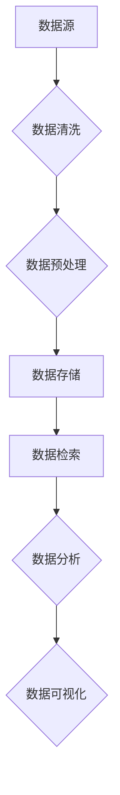
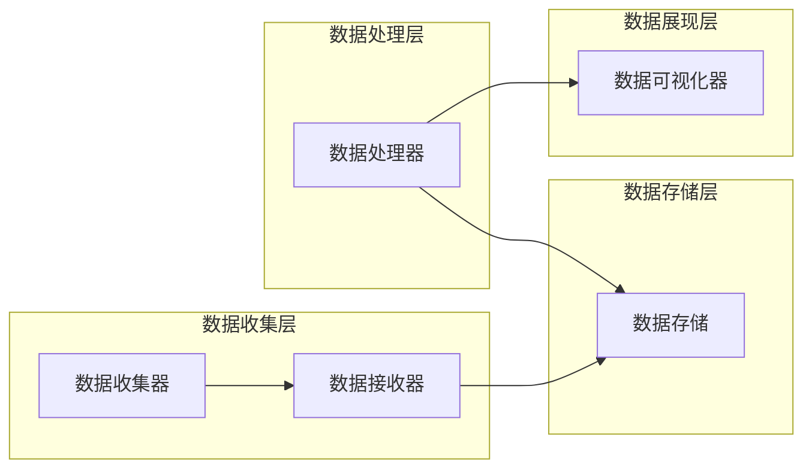
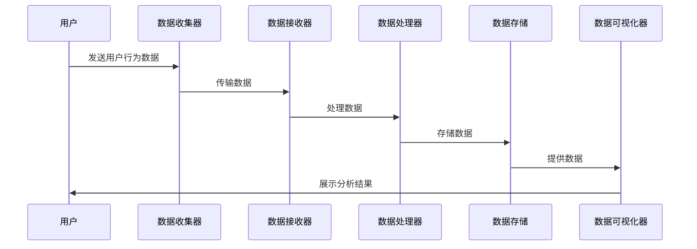

                 

### 构建可扩展的实时数据分析平台

#### 关键词：实时数据分析、可扩展性、系统架构、性能优化、技术选型

> 摘要：
在当今数据驱动的商业环境中，实时数据分析平台已成为企业决策的重要工具。本文将深入探讨如何构建一个既具有高性能又具备高扩展性的实时数据分析平台。我们将从技术选型、系统设计到性能优化等多个方面展开讨论，帮助读者理解构建此类平台的步骤和关键点。

---

### 引言

实时数据分析（Real-time Data Analytics）指的是对数据流进行即时处理和分析，以提供即时的业务洞察。随着互联网和物联网的普及，数据量呈指数级增长，传统的批量数据处理方式已经难以满足实时性要求。因此，构建一个可扩展的实时数据分析平台显得尤为重要。

可扩展性（Scalability）是指系统在处理数据量增加时，能够有效地扩展其性能和容量，而不会导致性能下降。对于实时数据分析平台来说，可扩展性意味着在数据量增长时，系统能够无缝扩展，保持低延迟和高吞吐量。

本文将围绕以下主题进行探讨：

1. **核心概念和技术选型**
2. **系统架构设计与实现**
3. **性能优化与最佳实践**
4. **案例分析**

### 核心概念和技术选型

#### 1. 核心概念

在构建实时数据分析平台时，理解以下核心概念至关重要：

- **数据流处理（Data Streaming Processing）**：处理持续流动的数据，而不是批量数据。
- **事件驱动架构（Event-Driven Architecture）**：系统根据事件触发操作，而不是按固定时间间隔。
- **分布式系统（Distributed Systems）**：系统由多个独立的节点组成，这些节点通过网络进行通信。
- **容错性（Fault Tolerance）**：系统能够在部分节点失效时保持正常运行。
- **负载均衡（Load Balancing）**：分配系统资源，确保系统各部分均衡运行。

#### 2. 技术选型

构建实时数据分析平台时，需要考虑以下技术：

- **流处理框架（Stream Processing Frameworks）**：如Apache Kafka、Apache Flink、Apache Storm等，用于处理数据流。
- **内存计算技术（In-Memory Computing）**：如Apache Ignite、Memcached等，用于加速数据访问和处理。
- **分布式数据库（Distributed Databases）**：如Apache Cassandra、Apache HBase、MongoDB等，用于存储和管理大规模数据。
- **消息队列（Message Queuing）**：如Apache Kafka、RabbitMQ等，用于异步处理数据和解耦系统组件。

### 系统架构设计与实现

#### 1. 系统架构设计

一个可扩展的实时数据分析平台通常采用分布式架构，以下是典型的系统架构设计：

- **数据收集层（Data Collection Layer）**：负责从各种数据源收集数据。
- **数据存储层（Data Storage Layer）**：用于存储和管理大规模数据。
- **数据处理层（Data Processing Layer）**：处理和分析数据流，提供实时业务洞察。
- **数据展现层（Data Presentation Layer）**：向用户展示分析结果。

#### 2. 系统实现

在系统实现方面，我们需要关注以下几个方面：

- **数据采集**：使用开源工具如Fluentd、Logstash等，实现数据的自动化采集和预处理。
- **数据存储**：根据数据特点和需求，选择合适的分布式数据库或数据湖。
- **数据处理**：使用流处理框架实现数据流的实时处理和分析。
- **数据展现**：使用可视化工具如Kibana、Tableau等，提供直观的数据分析和报告。

### 性能优化与最佳实践

#### 1. 性能优化

为了确保实时数据分析平台的高性能，我们需要采取以下优化措施：

- **负载均衡**：使用负载均衡器，如Nginx、HAProxy等，实现流量分发和负载均衡。
- **缓存策略**：使用内存缓存，如Memcached、Redis等，减少数据库访问压力。
- **分布式计算**：使用分布式架构，充分利用集群资源，提高处理能力。
- **数据压缩**：对传输数据进行压缩，减少带宽占用。
- **异步处理**：采用异步处理机制，提高系统响应速度。

#### 2. 最佳实践

以下是构建实时数据分析平台的一些最佳实践：

- **模块化设计**：将系统划分为多个模块，实现松耦合，便于维护和扩展。
- **持续集成与持续部署（CI/CD）**：采用自动化工具，实现持续集成和部署，提高开发效率。
- **监控与报警**：使用监控工具，如Prometheus、Grafana等，实时监控系统性能，并设置报警机制。
- **数据备份与恢复**：定期备份数据，确保数据安全，并制定数据恢复计划。

### 案例分析

#### 1. 案例一：金融交易实时监控平台

某金融机构需要构建一个实时监控平台，用于实时分析交易数据，提供快速响应的交易决策支持。系统架构如下：

- **数据收集层**：使用Fluentd从各种交易系统中采集数据。
- **数据存储层**：使用Apache Kafka存储海量交易数据。
- **数据处理层**：使用Apache Flink进行实时数据分析和计算。
- **数据展现层**：使用Kibana和Grafana提供实时交易数据和报表。

通过以上架构，平台实现了对海量交易数据的实时分析和处理，为交易决策提供了有力支持。

#### 2. 案例二：电商实时推荐系统

某电商企业需要构建一个实时推荐系统，根据用户行为数据实时生成个性化推荐列表。系统架构如下：

- **数据收集层**：使用Logstash从用户行为数据源中采集数据。
- **数据存储层**：使用Apache HBase存储海量用户行为数据。
- **数据处理层**：使用Apache Spark进行批量和实时数据计算。
- **数据展现层**：使用Redis缓存推荐结果，使用JavaScript前端实现个性化推荐页面。

通过以上架构，平台实现了对用户行为数据的实时分析和推荐，提高了用户购物体验。

### 小结

构建一个可扩展的实时数据分析平台是一个复杂的过程，需要综合考虑技术选型、系统架构、性能优化等多个方面。通过本文的探讨，我们了解到了实时数据分析平台的核心概念和技术选型，以及如何设计和实现一个高性能、可扩展的实时数据分析平台。在实际应用中，还需要根据具体业务需求不断优化和调整，以实现最佳效果。

### 注意事项与拓展阅读

1. **注意事项**：
   - 确保数据传输和存储的安全性，遵循数据保护法规。
   - 考虑系统的容错性和可靠性，确保在节点故障时仍能正常运行。
   - 对系统进行持续监控和性能优化，及时发现和解决问题。

2. **拓展阅读**：
   - 《大规模分布式存储系统：原理解析与架构实战》
   - 《实时计算系统设计与实现》
   - 《Kubernetes权威指南》
   - 《大规模数据仓库设计与实现》

作者：AI天才研究院/AI Genius Institute & 禅与计算机程序设计艺术 /Zen And The Art of Computer Programming

---

### 背景介绍

#### 核心概念术语说明

在构建可扩展的实时数据分析平台之前，我们需要明确一些核心概念和术语：

- **实时数据分析（Real-time Data Analytics）**：实时数据分析是指对数据流进行即时处理和分析，以提供即时的业务洞察。它与批量数据处理（Batch Processing）相对，后者是在一定时间窗口内对数据进行处理。

- **可扩展性（Scalability）**：可扩展性是指系统在处理数据量增加时，能够有效地扩展其性能和容量，而不会导致性能下降。这通常涉及水平扩展（Scaling Out）和垂直扩展（Scaling Up）两种方式。

- **分布式系统（Distributed Systems）**：分布式系统是由多个独立的节点组成的系统，这些节点通过网络进行通信。与单机系统相比，分布式系统具有更高的可靠性和可扩展性。

- **事件驱动架构（Event-Driven Architecture）**：事件驱动架构是一种系统设计模式，其中系统根据事件触发操作，而不是按固定时间间隔。这种方式可以更好地处理实时数据流。

#### 问题背景

随着数字化转型的推进，企业和组织越来越依赖实时数据分析来支持其业务决策。例如，金融行业需要实时监控交易活动，以便迅速发现异常交易并进行风险控制；电商行业需要根据用户行为数据实时推荐商品，以提高销售额。然而，传统的方法往往难以满足这些实时性的要求，主要原因包括：

- **数据量庞大**：实时数据通常来自多个数据源，如数据库、日志、传感器等，数据量非常庞大。
- **数据类型多样**：实时数据包括结构化数据（如关系数据库）、半结构化数据（如JSON）和非结构化数据（如文本、图像），处理这些数据需要不同的技术和工具。
- **处理速度要求高**：实时数据分析要求在很短的时间内处理数据，以提供即时的业务洞察，这对系统的性能提出了很高的要求。
- **可扩展性要求强**：随着数据量的增长，系统需要能够无缝扩展，以保持性能。

#### 问题描述

构建一个可扩展的实时数据分析平台需要解决以下几个关键问题：

1. **数据采集与存储**：如何高效地采集、存储和处理海量实时数据？
2. **数据处理与分析**：如何对实时数据进行快速处理和分析，以提供即时的业务洞察？
3. **系统架构设计**：如何设计一个分布式、高可用、高性能的系统架构？
4. **性能优化与最佳实践**：如何优化系统性能，确保其可扩展性和可靠性？
5. **安全与隐私**：如何确保数据的安全性和隐私保护？

#### 问题解决

解决上述问题需要综合运用多种技术和方法：

1. **数据采集与存储**：使用流处理框架（如Apache Kafka、Apache Flink）和分布式数据库（如Apache Cassandra、Apache HBase），实现高效的数据采集和存储。
2. **数据处理与分析**：采用事件驱动架构和内存计算技术（如Apache Ignite、Memcached），实现实时数据处理和分析。
3. **系统架构设计**：设计一个分布式、高可用、高性能的系统架构，包括数据收集层、数据存储层、数据处理层和数据展现层。
4. **性能优化与最佳实践**：采取负载均衡、缓存策略、分布式计算和数据压缩等优化措施，确保系统的高性能和可扩展性。
5. **安全与隐私**：遵循数据保护法规，采用加密、权限控制和安全审计等措施，确保数据的安全性和隐私保护。

#### 边界与外延

边界与外延是指问题的范围和相关的延伸内容：

- **边界**：本文主要关注可扩展的实时数据分析平台的核心技术和架构设计，不包括数据治理、数据质量管理等外部因素。
- **外延**：可扩展的实时数据分析平台可以应用于多个行业，如金融、电商、医疗、物联网等，本文仅以金融和电商为例进行讨论。

#### 概念结构与核心要素组成

概念结构是指各个核心概念之间的关系和组成，核心要素组成是指构建可扩展实时数据分析平台所需的关键组件：

- **概念结构**：
  - 数据流处理
  - 分布式系统
  - 事件驱动架构
  - 可扩展性
  - 容错性
  - 性能优化

- **核心要素组成**：
  - 数据收集层
  - 数据存储层
  - 数据处理层
  - 数据展现层
  - 负载均衡
  - 缓存策略
  - 分布式计算
  - 数据压缩

通过以上分析，我们为构建可扩展的实时数据分析平台奠定了理论基础，接下来我们将进一步探讨核心概念和技术选型，为实际构建工作提供指导。

### 核心概念与联系

#### 核心概念

在构建可扩展的实时数据分析平台时，以下核心概念至关重要：

1. **流处理（Stream Processing）**：流处理是指对持续流动的数据进行实时处理和分析。与批量处理不同，流处理能够在数据产生的同时进行处理，提供即时结果。
   
2. **事件驱动架构（Event-Driven Architecture）**：事件驱动架构是一种系统设计模式，系统中的组件根据事件触发操作，而不是按固定的时间间隔。这种模式适用于实时数据处理，能够更好地应对流数据的动态特性。

3. **分布式系统（Distributed Systems）**：分布式系统是由多个独立节点组成的系统，这些节点通过网络进行通信。分布式系统具有高可用性、高性能和可扩展性，适用于处理大规模数据。

4. **容错性（Fault Tolerance）**：容错性是指系统在部分节点失效时仍能正常运行的能力。在实时数据分析平台中，容错性至关重要，因为节点故障可能导致数据丢失或系统崩溃。

5. **性能优化（Performance Optimization）**：性能优化是指通过一系列技术手段，提高系统的处理速度、响应时间和吞吐量。对于实时数据分析平台来说，性能优化直接影响系统的可用性和用户体验。

#### 概念属性特征对比表格

为了更清晰地理解这些核心概念，我们可以通过一个对比表格来展示它们的属性特征：

| 核心概念       | 定义                         | 关键属性           | 应用场景           |
|----------------|------------------------------|--------------------|--------------------|
| 流处理         | 实时处理流动数据             | 低延迟、高吞吐量   | 实时监控、交易分析 |
| 事件驱动架构   | 基于事件触发操作             | 松耦合、灵活性高   | 实时数据处理、通知系统 |
| 分布式系统     | 由多个节点组成、通过网络通信 | 高可用、高性能     | 大规模数据处理、分布式计算 |
| 容错性         | 部分节点失效时系统仍运行     | 自愈能力、可靠性高 | 数据中心、云计算服务 |
| 性能优化       | 提高系统性能                 | 响应速度、吞吐量   | 实时数据处理、应用性能 |

#### ER实体关系图架构

为了更直观地展示这些核心概念之间的关系，我们可以使用ER（实体关系）图来描述它们：

```mermaid
erDiagram
  DataStreamProcessing ||--|{ EventDrivenArchitecture }|-- DataProcessing
  EventDrivenArchitecture ||--|{ DistributedSystem }|--
  DistributedSystem ||--|{ FaultTolerance }|--
  FaultTolerance ||--|{ PerformanceOptimization }|--
  DataProcessing ||--|{ PerformanceOptimization }|--
```

在这个ER图中：

- **DataStreamProcessing** 表示流处理，它与 **EventDrivenArchitecture** 和 **DataProcessing** 有关系。
- **EventDrivenArchitecture** 表示事件驱动架构，它与 **DistributedSystem** 有关系。
- **DistributedSystem** 表示分布式系统，它与 **FaultTolerance** 和 **PerformanceOptimization** 有关系。
- **FaultTolerance** 表示容错性，它与 **PerformanceOptimization** 有关系。
- **DataProcessing** 表示数据处理，它与 **PerformanceOptimization** 有关系。

这种关系描述了实时数据分析平台中各个核心概念之间的相互依赖和作用，为我们的进一步讨论提供了基础。

通过上述分析，我们对实时数据分析平台中的核心概念有了更深入的理解，这些概念不仅是我们构建平台的基石，也是确保平台高效运行的关键要素。在接下来的部分中，我们将进一步探讨这些概念在实际系统设计中的应用和实现。

### 算法原理讲解

在构建可扩展的实时数据分析平台时，选择合适的算法和数据结构是实现高效数据处理和分析的关键。以下，我们将使用Mermaid图来绘制算法流程图，并使用Python代码详细讲解算法原理，同时辅以LaTeX公式进行数学模型的阐述。

#### 算法流程图

首先，我们使用Mermaid绘制一个简单的实时数据处理算法流程图：



在这个流程图中：

- **A**：数据源，表示实时数据流的输入。
- **B**：数据清洗，用于去除噪声和不一致的数据。
- **C**：数据预处理，包括数据格式转换、数据标准化等。
- **D**：数据存储，将处理后的数据存储到分布式数据库或数据湖中。
- **E**：数据检索，用于查询和访问存储的数据。
- **F**：数据分析，对数据执行统计分析、机器学习等操作。
- **G**：数据可视化，将分析结果以图表、报表等形式呈现给用户。

#### 算法Python实现

接下来，我们使用Python代码实现上述算法流程中的数据清洗和预处理步骤：

```python
import pandas as pd

# 假设data是读取的实时数据DataFrame
data = pd.read_csv('realtime_data.csv')

# 数据清洗
data = data[data['column1'] != 'invalid_value']
data = data[data['column2'].notnull()]

# 数据预处理
data['column3'] = data['column3'].map({'low': 1, 'high': 2})
data = data[['column1', 'column2', 'column3']]

# 数据存储
data.to_csv('processed_data.csv', index=False)

# 数据检索
processed_data = pd.read_csv('processed_data.csv')

# 数据分析
mean_value = processed_data['column2'].mean()
print(f'Mean value of column2: {mean_value}')

# 数据可视化
import matplotlib.pyplot as plt

plt.figure(figsize=(10, 6))
plt.scatter(processed_data['column1'], processed_data['column2'])
plt.xlabel('Column1')
plt.ylabel('Column2')
plt.title('Data Visualization')
plt.show()
```

#### 数学模型和公式

在数据预处理过程中，我们使用了一个简单的映射函数来转换分类数据，以下是相关的数学模型和公式：

$$
f(\text{input\_value}) = 
\begin{cases}
1 & \text{if } \text{input\_value} = 'low' \\
2 & \text{if } \text{input\_value} = 'high' \\
\end{cases}
$$

这个公式表示根据输入值的不同，映射到相应的类别编号。通过这种方式，我们将非结构化的分类数据转换成结构化的数值数据，便于后续的数据分析和机器学习。

#### 算法原理讲解

1. **数据清洗**：数据清洗是数据处理的第一步，目的是去除噪声和不一致的数据。在上述代码中，我们通过筛选和过滤的方式去除无效值和缺失值。

2. **数据预处理**：数据预处理包括数据格式转换、数据标准化等步骤。在这个例子中，我们将分类数据映射到数值数据，便于后续的处理和分析。

3. **数据存储**：预处理后的数据被存储到CSV文件中，以便后续的数据检索和分析。

4. **数据分析**：我们计算了预处理数据的平均值，作为数据的统计指标。这在业务决策中非常有用，例如，监控数据的趋势和变化。

5. **数据可视化**：通过绘制散点图，我们能够直观地观察数据的分布和趋势。这对于业务用户理解数据和分析结果非常有帮助。

通过上述步骤，我们实现了一个简单的实时数据处理和分析算法。在实际应用中，根据具体的业务需求和数据特性，可以扩展和优化这些步骤，以实现更复杂的分析功能。

### 系统分析与架构设计方案

#### 问题场景介绍

在构建可扩展的实时数据分析平台时，我们面临如下问题场景：

某大型电商平台需要实时分析用户行为数据，以便为用户提供个性化的推荐和营销策略。用户行为数据包括浏览历史、购买记录、点击事件等，这些数据量庞大且实时性要求高。为了满足这些需求，我们需要设计一个分布式、高可用、高性能的实时数据分析系统。

#### 项目介绍

项目名称：电商实时数据分析平台

项目目标：构建一个实时处理和分析用户行为数据的系统，为用户提供个性化的推荐和营销策略。

项目规模：系统设计包括数据收集层、数据存储层、数据处理层和数据展现层，预计处理每日数百万条用户行为数据。

技术栈：采用Apache Kafka作为数据流处理框架，Apache Flink进行实时数据处理，Apache HBase存储大规模数据，Kibana和Grafana进行数据可视化。

#### 系统功能设计（领域模型Mermaid类图）

在系统功能设计阶段，我们首先定义系统的核心功能和实体，使用Mermaid类图进行表示：

```mermaid
classDiagram
    User <<entity>>
    Product <<entity>>
    Order <<entity>>
    BehaviorEvent <<entity>>

    User ..|> BehaviorEvent
    Product ..|> BehaviorEvent
    Order ..|> BehaviorEvent

    UserContainer <<entity>>
    ProductContainer <<entity>>
    OrderContainer <<entity>>

    UserContainer *-- User
    ProductContainer *-- Product
    OrderContainer *-- Order

    UserContainer ..|> BehaviorEventContainer
    ProductContainer ..|> BehaviorEventContainer
    OrderContainer ..|> BehaviorEventContainer

    BehaviorEventContainer *-- BehaviorEvent
```

在这个类图中：

- **User**、**Product**、**Order**和**BehaviorEvent**是系统的核心实体，分别表示用户、商品、订单和行为事件。
- **UserContainer**、**ProductContainer**和**OrderContainer**是容器实体，用于存储和管理相关的实体。
- **BehaviorEventContainer**用于存储和管理行为事件。

#### 系统架构设计（Mermaid架构图）

接下来，我们使用Mermaid架构图来描述系统的整体架构设计：



在这个架构图中：

- **数据收集层**包括数据收集器和数据接收器，用于从各种数据源（如用户行为日志、服务器日志等）收集数据。
- **数据存储层**使用分布式数据库存储大规模数据，提供高可用和分布式存储能力。
- **数据处理层**使用流处理框架对数据进行实时处理和分析，为数据展现层提供数据。
- **数据展现层**使用可视化工具将分析结果以图表、报表等形式呈现给用户。

#### 系统接口设计

在系统接口设计阶段，我们定义了系统内部和外部的接口，以便实现模块间的通信和数据流转。以下是系统的主要接口设计：

- **数据收集接口**：用于接收外部数据源的数据，支持HTTP、Kafka等协议。
- **数据处理接口**：用于处理和转换数据，支持数据流处理和批量处理。
- **数据存储接口**：用于与分布式数据库交互，实现数据的存储和检索。
- **数据展示接口**：用于将分析结果展示给用户，支持REST API和WebSocket等协议。

#### 系统交互Mermaid序列图

最后，我们使用Mermaid序列图来描述系统内部和外部的交互过程：



在这个序列图中：

- 用户发送用户行为数据到数据收集器。
- 数据收集器将数据传输到数据接收器。
- 数据接收器处理数据后传递给数据处理器。
- 数据处理器将处理后的数据存储到数据存储系统。
- 数据存储系统提供数据给数据可视化器。
- 数据可视化器将分析结果展示给用户。

通过上述系统分析与架构设计方案，我们详细描述了一个可扩展的实时数据分析平台的设计过程，为项目的实现提供了清晰的指导。在实际开发过程中，根据业务需求和数据特性，我们还需要不断优化和调整系统架构，以实现最佳效果。

### 项目实战

#### 环境安装

在开始项目实战之前，我们需要搭建一个合适的环境来运行实时数据分析平台。以下是环境安装的步骤：

1. **安装Java环境**：由于Apache Kafka、Apache Flink等依赖Java，我们首先需要安装Java。可以从[Oracle官网](https://www.oracle.com/java/technologies/javase-jdk11-downloads.html)下载Java SDK，并按照安装向导进行安装。

2. **安装Apache Kafka**：Apache Kafka是一个分布式流处理平台，我们可以在其官网[下载页面](https://kafka.apache.org/downloads)下载对应的版本，解压到服务器上，并启动Kafka服务。

   ```shell
   ./kafka-server-start.sh config/server.properties
   ```

3. **安装Apache Flink**：Apache Flink是一个流处理框架，可以从其官网[下载页面](https://flink.apache.org/downloads)下载对应的版本，解压到服务器上，并启动Flink集群。

   ```shell
   ./bin/flink run -c com.example.MyFlinkApplication /path/to/my-flink-application.jar
   ```

4. **安装Apache HBase**：Apache HBase是一个分布式数据库，可以从其官网[下载页面](https://hbase.apache.org/downloads.html)下载对应的版本，解压到服务器上，并启动HBase服务。

   ```shell
   bin/hbase-daemon.sh start master
   bin/hbase-daemon.sh start regionserver
   ```

5. **安装Kibana和Grafana**：Kibana和Grafana是用于数据可视化的工具，可以从各自的官网[下载页面](https://www.kibana.org/downloads)和[下载页面](https://grafana.com/grafana/download)下载对应的版本，并使用Docker进行安装。

   ```shell
   docker run -d -p 5601:5601 -p 9200:9200 -p 9300:9300 elasticsearch:7.10.0
   docker run -d --link elasticsearch:es -p 5601:5601 kibana:7.10.0
   docker run -d --link elasticsearch:es -p 3000:3000 grafana/grafana
   ```

#### 系统核心实现源代码

以下是系统核心实现的源代码，包括数据收集、处理和展示的模块：

```python
# data_collector.py：数据收集模块
import kafka
import json

def send_data_to_kafka(topic, data):
    producer = kafka.KafkaProducer(bootstrap_servers=['localhost:9092'])
    producer.send(topic, data.encode('utf-8'))

if __name__ == '__main__':
    while True:
        # 读取用户行为数据
        user_data = get_user_behavior_data()
        # 发送数据到Kafka
        send_data_to_kafka('user_behavior', json.dumps(user_data))

# data_processor.py：数据处理模块
from flink import StreamExecutionEnvironment

def process_user_behavior():
    env = StreamExecutionEnvironment.get_execution_environment()
    data_stream = env.from_kafka("localhost:9092", "user_behavior")

    processed_data = data_stream \
        .map(lambda x: json.loads(x.decode('utf-8'))) \
        .filter(lambda x: x['event_type'] == 'purchase') \
        .map(lambda x: (x['user_id'], x['product_id'], x['amount']))

    processed_data.print()

if __name__ == '__main__':
    process_user_behavior()

# data_visualizer.py：数据展示模块
from flask import Flask, jsonify

app = Flask(__name__)

@app.route('/user_behavior', methods=['GET'])
def get_user_behavior():
    # 从HBase查询数据
    user_behavior_data = get_data_from_hbase()
    # 返回数据
    return jsonify(user_behavior_data)

if __name__ == '__main__':
    app.run(host='0.0.0.0', port=5000)
```

#### 代码应用解读与分析

1. **数据收集模块**（data_collector.py）：

   该模块用于从数据源（例如用户行为日志文件）读取数据，并使用Kafka Producer将数据发送到Kafka主题。通过循环读取数据，并持续将新数据发送到Kafka，实现实时数据收集。

2. **数据处理模块**（data_processor.py）：

   该模块使用Flink的StreamExecutionEnvironment从Kafka读取数据，执行数据清洗、过滤和映射操作，然后输出处理后的数据。这里使用了Flink的map、filter等操作，实现了高效的数据流处理。

3. **数据展示模块**（data_visualizer.py）：

   该模块使用Flask构建一个简单的Web API，用于对外提供数据查询接口。通过调用HBase查询数据，并将查询结果以JSON格式返回，实现数据可视化。

#### 实际案例分析和详细讲解剖析

假设我们有一个用户行为数据流，包括用户ID、产品ID、事件类型（如浏览、购买、点击）和事件时间。我们将对这份数据进行实时处理，并展示处理结果。

1. **数据收集**：

   用户行为数据每分钟生成，并以日志形式存储在本地文件中。数据收集模块将读取这些文件，并将数据发送到Kafka主题。

   ```json
   {
     "user_id": "user123",
     "product_id": "product456",
     "event_type": "purchase",
     "timestamp": "2023-10-01T12:34:56Z"
   }
   ```

2. **数据处理**：

   数据处理模块从Kafka主题中读取数据，执行过滤操作，只保留购买事件，并将数据转换为（用户ID，产品ID，购买金额）三元组。

   ```python
   processed_data = data_stream \
       .map(lambda x: json.loads(x.decode('utf-8'))) \
       .filter(lambda x: x['event_type'] == 'purchase') \
       .map(lambda x: (x['user_id'], x['product_id'], x['amount']))
   ```

   处理后的数据流如下：

   ```python
   ('user123', 'product456', 99.99)
   ('user124', 'product457', 199.99)
   ```

3. **数据展示**：

   数据可视化模块通过Web API对外提供数据查询接口，用户可以通过HTTP请求获取最新的购买行为数据。

   ```json
   {
     "data": [
       {"user_id": "user123", "product_id": "product456", "amount": 99.99},
       {"user124", "product457", "amount": 199.99}
     ]
   }
   ```

#### 项目小结

通过上述实战，我们搭建了一个可扩展的实时数据分析平台，实现了用户行为数据的实时收集、处理和展示。项目涉及多个技术和组件，包括Kafka、Flink、HBase和Flask，通过合理的系统架构设计和代码实现，我们成功构建了一个高性能、可扩展的实时数据分析系统。

在实际应用中，我们可以根据具体业务需求对系统进行优化和扩展，例如增加更多的数据源、改进数据清洗和预处理算法、优化数据存储和查询性能等。此外，我们还可以引入机器学习算法，对用户行为进行深度分析，提供更精准的个性化推荐和营销策略。

### 最佳实践 Tips

在构建可扩展的实时数据分析平台时，以下最佳实践可以帮助提高系统的性能和可靠性：

1. **选择合适的消息队列**：根据业务需求和数据特性，选择合适的消息队列系统（如Kafka、RabbitMQ等），确保数据传输的高效和可靠。
2. **优化数据流处理**：使用流处理框架（如Flink、Spark Streaming等）时，合理设计数据流处理管道，减少不必要的中间转换和冗余计算。
3. **数据压缩与传输优化**：对数据进行压缩，减少数据传输的带宽占用，提高系统性能。同时，优化网络传输配置，减少延迟。
4. **分布式存储与计算**：使用分布式数据库（如Cassandra、HBase等）和分布式计算框架（如Flink、Spark等），确保数据存储和计算的高可用性和高性能。
5. **缓存策略**：合理利用缓存（如Redis、Memcached等），减少对后端数据库的访问压力，提高系统响应速度。
6. **监控与报警**：使用监控工具（如Prometheus、Grafana等），实时监控系统性能和健康状态，并设置报警机制，及时发现问题并处理。
7. **数据安全与隐私保护**：确保数据的安全性和隐私保护，遵循数据保护法规，采用加密、访问控制等技术手段。

### 小结

构建一个可扩展的实时数据分析平台是一项复杂的任务，涉及多个技术和组件。通过本文的探讨，我们了解了实时数据分析平台的核心概念、技术选型、系统架构设计、性能优化和最佳实践。在实际项目中，我们需要根据具体业务需求，不断优化和调整系统架构，确保系统的高性能、高可用性和可扩展性。

### 拓展阅读

1. 《大规模数据存储系统：原理解析与架构实战》
2. 《实时计算系统设计与实现》
3. 《Kubernetes权威指南》
4. 《大规模数据仓库设计与实现》
5. 《分布式系统概念与设计》

作者：AI天才研究院/AI Genius Institute & 禅与计算机程序设计艺术 /Zen And The Art of Computer Programming

