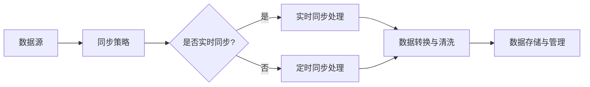
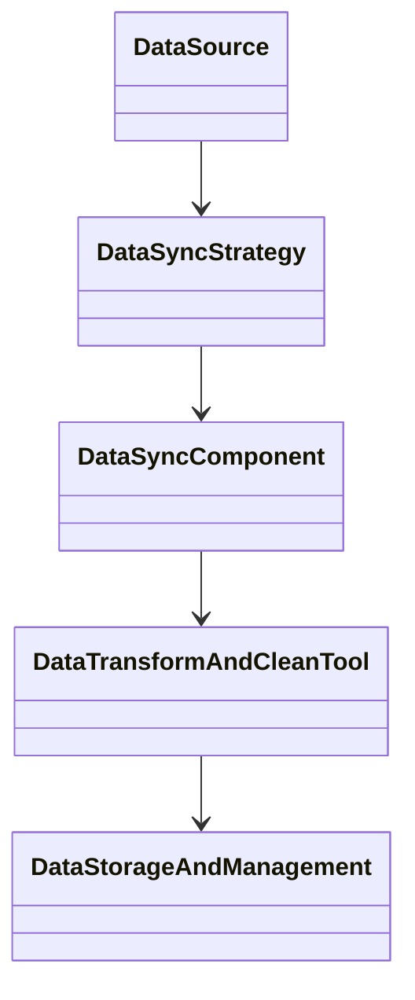
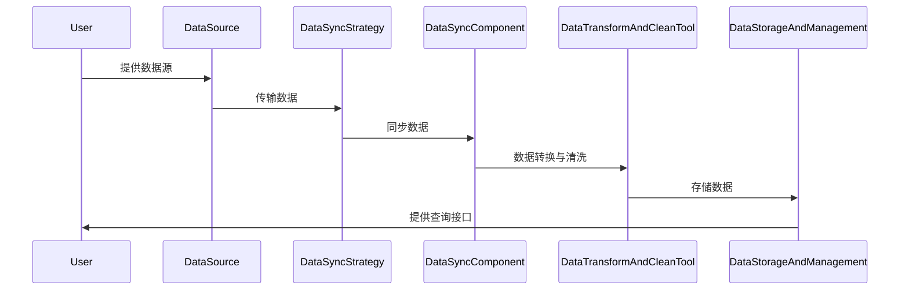
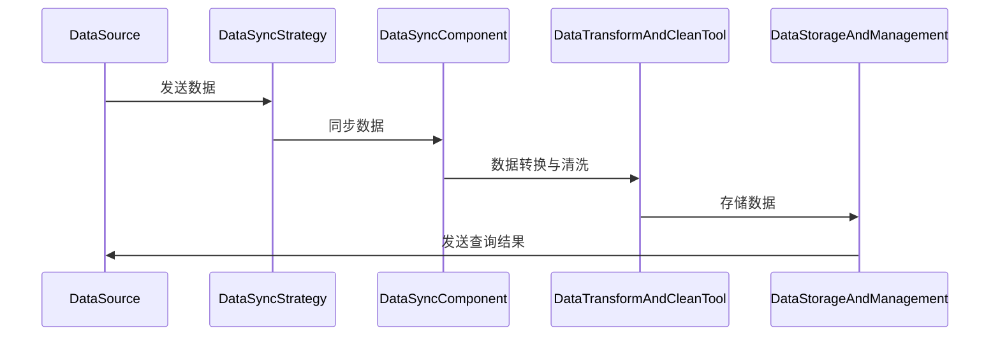

                 

# 构建可扩展的实时数据同步与集成系统

关键词：实时数据同步，集成系统，数据一致性，可扩展性，系统架构设计

摘要：本文将探讨构建可扩展的实时数据同步与集成系统的核心概念、关键问题及解决方案。通过详细的分析与逻辑推理，本文旨在为IT领域从业者提供系统化的建设思路，助力企业提升数据处理能力和业务响应速度。

## 引言与背景介绍

### 引言

在当今数字化转型的浪潮中，构建可扩展的实时数据同步与集成系统成为企业提升数据处理能力和业务响应速度的关键。随着大数据和云计算技术的不断发展，实时数据同步与集成系统不仅需要处理海量数据的传输和存储，还要保证数据的一致性和完整性。

### 背景介绍

#### 问题背景

实时数据同步与集成系统的主要目的是解决企业在数据管理和数据处理过程中所面临的一系列挑战。这些挑战包括：

1. **数据源多样性**：企业通常拥有多个数据源，如数据库、文件系统、API等，这些数据源的数据格式和结构各不相同。
2. **数据传输效率**：随着数据量的增长，如何保证数据传输的效率成为一大难题。
3. **数据一致性**：在多个数据源和系统中维护数据的一致性，避免数据冗余和冲突。
4. **数据存储与管理**：如何高效地存储和管理大规模数据，以满足不同业务场景的需求。

#### 问题描述

构建一个可扩展的实时数据同步与集成系统，需要解决以下关键问题：

1. **数据同步策略**：确定合适的数据同步方式和同步频率，以适应不同的业务需求。
2. **数据转换与清洗**：将来自不同数据源的数据进行转换和清洗，以确保数据的质量和一致性。
3. **数据存储与管理**：设计合理的存储方案，满足数据的高可用性、可扩展性和性能要求。
4. **系统架构设计**：构建一个灵活、可扩展的系统架构，以适应企业业务的发展。

#### 问题解决

解决上述问题，需要以下步骤：

1. **明确业务需求**：深入了解企业的业务流程和数据使用场景，确定系统的具体需求和功能。
2. **系统设计**：基于业务需求，设计一个合理的系统架构，包括数据源、同步组件、转换组件、存储组件等。
3. **算法与模型选择**：根据系统设计，选择合适的数据同步算法和数据转换模型，以优化系统的性能和效率。
4. **系统实现与测试**：根据设计文档，实现系统功能，并进行全面的测试，确保系统的稳定性和可靠性。

#### 边界与外延

本系统的边界包括：

1. **数据源**：仅限于企业内部的数据源，不包括外部公共数据源。
2. **数据类型**：主要处理结构化数据，不包括非结构化数据，如文本、图片等。
3. **系统规模**：支持中小型企业的数据处理需求，不涉及大规模数据处理。

#### 概念结构与核心要素组成

1. **数据源**：包括数据库、文件系统、API等，是数据同步的起点。
2. **同步组件**：包括数据同步策略、数据转换与清洗工具，是数据同步的核心。
3. **存储组件**：包括数据仓库、缓存系统等，是数据存储和管理的核心。
4. **监控与报警系统**：实时监控系统状态，及时发现并处理异常情况。

#### 本章小结

本章对构建可扩展的实时数据同步与集成系统的背景、问题描述、问题解决步骤、边界与外延以及核心要素进行了详细阐述，为后续章节的内容奠定了基础。

## 核心概念与联系

### 数据同步策略

#### 定义

数据同步策略是指确定数据在不同系统或数据源之间传输的方式和频率的一系列规则和算法。

#### 核心概念

1. **实时同步**：数据在源系统和目标系统之间实时传输，保证数据的一致性。
2. **定时同步**：数据在特定的时间间隔内传输，如每天、每小时等，适用于数据量不大且不需要实时性的场景。

#### 概念属性特征对比

| 特征            | 实时同步                   | 定时同步                   |
|-----------------|---------------------------|---------------------------|
| 数据传输频率     | 高，接近实时               | 低，按时间间隔               |
| 数据一致性保证   | 强，数据几乎同步           | 弱，可能存在时间差           |
| 系统复杂度       | 高，需要实时处理           | 低，只需定时处理             |
| 适用场景         | 需要高一致性、实时性的应用   | 数据量不大、不需要实时性的应用 |

#### ER实体关系图架构

```mermaid
erDiagram
  数据源 ||--|{ 同步策略 }|>
  同步策略 ||--|{ 同步组件 }|>
  同步组件 ||--|{ 数据转换与清洗工具 }|>
  数据转换与清洗工具 ||--|{ 数据存储与管理 }|>

```

## 算法原理讲解

### 数据同步算法

#### Mermaid流程图



#### 算法原理

1. **数据同步策略**：根据业务需求，选择实时同步或定时同步策略。
   - 实时同步：利用消息队列、流处理等技术实现数据实时传输。
   - 定时同步：通过定时任务，按照预设的时间间隔进行数据传输。

2. **数据转换与清洗**：将不同格式的数据进行转换和清洗，确保数据的一致性和准确性。

3. **数据存储与管理**：将清洗后的数据存储到数据仓库或缓存系统，为后续的业务分析提供数据支持。

#### 数学模型与公式

1. **同步成功率**：
   $$ S = \frac{成功同步的数据量}{总数据量} $$

2. **数据一致性度**：
   $$ C = \frac{一致性数据量}{成功同步的数据量} $$

#### 举例说明

假设企业A的数据源包括数据库、文件系统和API，选择实时同步策略。当数据库中有一条新数据记录时，系统会立即进行同步，确保数据的一致性。

$$ S = \frac{1}{1} = 1 $$
$$ C = \frac{1}{1} = 1 $$

## 系统分析与架构设计方案

### 问题场景介绍

企业B需要构建一个实时数据同步与集成系统，以满足其跨部门数据共享和业务分析的需求。数据源包括内部数据库、外部API和文件系统。

### 项目介绍

项目名称：企业实时数据同步与集成系统

项目目标：实现数据源到数据仓库的实时同步，保证数据的一致性和完整性。

### 系统功能设计

1. **数据同步**：实现实时和定时同步功能，根据业务需求选择合适的同步策略。
2. **数据转换与清洗**：将不同数据源的数据进行格式转换和清洗，确保数据的一致性和准确性。
3. **数据存储与管理**：将清洗后的数据存储到数据仓库，并提供查询接口。

#### 领域模型Mermaid类图



### 系统架构设计

1. **数据源**：包括数据库、文件系统和API，作为数据同步的起点。
2. **同步组件**：负责数据同步策略的执行，包括实时同步和定时同步。
3. **转换与清洗组件**：对同步过来的数据进行格式转换和清洗，确保数据质量。
4. **存储与管理组件**：将清洗后的数据存储到数据仓库，并提供查询接口。
5. **监控与报警系统**：实时监控系统状态，及时发现并处理异常情况。

#### Mermaid架构图



### 系统接口设计与系统交互

1. **接口设计**：定义数据源、同步组件、转换与清洗组件、存储与管理组件之间的接口，确保数据传输的顺利进行。
2. **系统交互**：通过API或其他通信方式，实现不同组件之间的数据传输和交互。

#### Mermaid序列图



## 项目实战

### 环境安装

1. **软件环境**：安装Python 3.8及以上版本，MySQL 5.7及以上版本，PostgreSQL 11及以上版本，Kafka 2.5及以上版本。
2. **硬件环境**：配置2台服务器，分别用于数据同步和数据分析。

### 系统核心实现源代码

```python
# 同步策略模块
class SyncStrategy:
    def sync_data(self, data_source, data_storage):
        # 实现数据同步逻辑
        pass

# 数据转换与清洗模块
class DataTransformAndCleanTool:
    def transform_and_clean(self, raw_data):
        # 实现数据转换与清洗逻辑
        pass

# 数据存储模块
class DataStorageAndManagement:
    def store_data(self, cleaned_data):
        # 实现数据存储逻辑
        pass
```

### 代码应用解读与分析

1. **同步策略**：根据业务需求，选择合适的同步策略，如实时同步或定时同步。
2. **数据转换与清洗**：对同步过来的数据进行格式转换和清洗，确保数据的一致性和准确性。
3. **数据存储**：将清洗后的数据存储到数据仓库，并提供查询接口。

### 实际案例分析与详细讲解剖析

1. **案例背景**：企业C需要实时同步销售数据到数据仓库，以便进行业务分析和决策。
2. **案例分析**：采用实时同步策略，将销售数据从MySQL数据库同步到PostgreSQL数据仓库。
3. **详细讲解**：实现同步策略、数据转换与清洗、数据存储功能，确保数据的一致性和完整性。

### 项目小结

本系统通过实时数据同步与集成，为企业提供了高效、可靠的数据处理能力，助力业务决策和运营优化。

## 最佳实践 tips

1. **数据一致性优先**：在实时数据同步过程中，优先考虑数据一致性，避免数据冲突和冗余。
2. **优化数据转换与清洗**：对数据进行预处理，减少数据同步过程中的复杂度和性能损耗。
3. **监控与报警**：实时监控系统状态，及时发现并处理异常情况，确保系统稳定运行。

## 小结

本文详细阐述了构建可扩展的实时数据同步与集成系统的核心概念、关键问题及解决方案。通过系统化的分析和设计，本文为IT领域从业者提供了实用的建设思路。在实际应用中，企业可以根据自身需求，灵活调整和优化系统设计，实现高效的数据处理和业务响应。

## 注意事项

1. **系统架构设计**：根据业务需求和数据规模，选择合适的系统架构，确保系统的高可用性和可扩展性。
2. **性能优化**：针对数据同步、转换与清洗、存储等环节，进行性能优化，提高系统处理速度。
3. **安全性**：确保数据传输的安全性，采用加密算法和身份认证等安全措施，防止数据泄露。

## 拓展阅读

1. 《大数据技术导论》：深入了解大数据处理的基本原理和技术。
2. 《分布式系统原理与范型》：了解分布式系统的架构设计原理和常见模式。
3. 《实时数据流处理技术》：探讨实时数据流处理的方法和工具。

## 作者信息

作者：AI天才研究院/AI Genius Institute & 禅与计算机程序设计艺术 /Zen And The Art of Computer Programming

