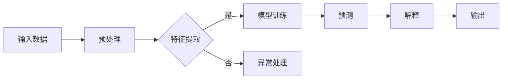
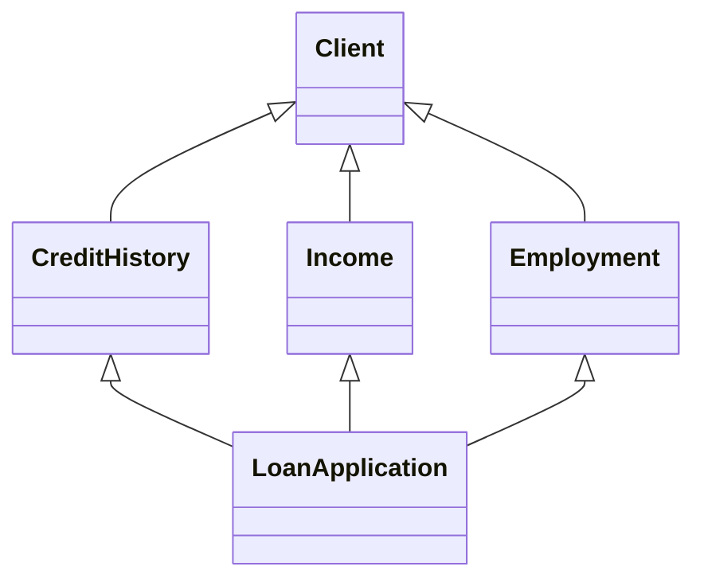
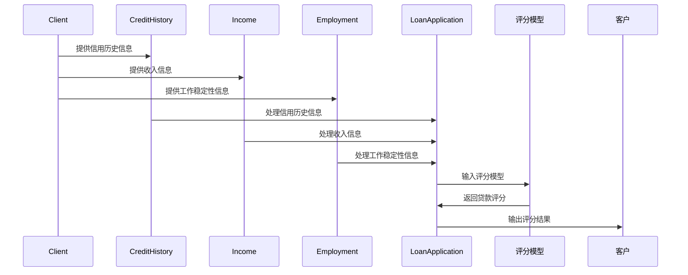
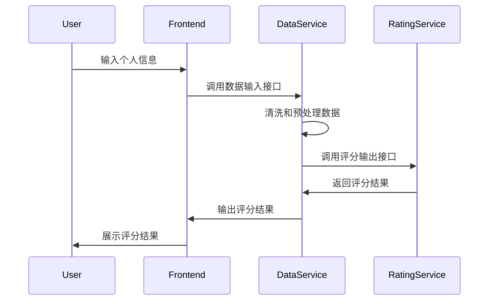

                 

# 构建可解释AI系统的提示词策略

> 关键词：可解释AI、AI不可解释性、AI算法、AI系统架构、AI项目实战、AI最佳实践

> 摘要：本文将深入探讨构建可解释AI系统的策略。我们首先介绍问题背景，定义不可解释AI和可解释AI，并分析其优势和特点。接着，我们将讲解可解释AI算法原理，并通过具体案例和Python源代码进行详细阐述。然后，我们将分析系统架构设计，展示项目实战中的环境安装、系统核心实现及案例剖析。最后，我们将总结最佳实践，并提供拓展阅读资源。

----------------------------------------------------------------

## 第一部分：背景介绍

### 第1章：问题背景与定义

#### 1.1.1 问题背景

##### 1.1.1.1 AI系统不可解释性问题的提出
随着人工智能技术的迅猛发展，越来越多的AI系统被应用于各个领域，如医疗诊断、金融风险评估和自动驾驶等。然而，一个普遍存在的问题是，这些AI系统往往缺乏可解释性。这意味着系统内部的决策过程和逻辑对于用户和开发者来说都是不透明的，难以理解。

##### 1.1.1.2 不可解释性引发的问题
不可解释性引发了诸多问题，包括：
- **决策不透明**：用户无法理解AI系统做出特定决策的原因。
- **责任归属困难**：当AI系统出现错误时，很难确定责任归属。
- **可靠性争议**：缺乏透明度导致用户对系统的可靠性产生怀疑。
- **用户信任缺失**：如果用户无法信任AI系统，其应用范围和效果将受到限制。

##### 1.1.1.3 不可解释性在AI系统中的普遍性
不可解释性在AI系统中具有普遍性，尤其是在深度学习和神经网络等复杂算法中。这些算法通常基于大量的训练数据和复杂的模型结构，其内部决策过程非常复杂，难以直观理解。

#### 1.1.2 问题描述

##### 1.1.2.1 不可解释AI系统的定义
不可解释AI系统（Inexplainable AI System）是指其内部决策过程无法通过直观的方式理解和解释的AI系统。

##### 1.1.2.2 不可解释AI系统的特征
不可解释AI系统的特征包括：
- **复杂性**：系统内部结构复杂，包含大量的参数和连接。
- **黑箱性**：系统的决策过程对于外部用户来说是不可见的。
- **不确定性**：系统对输入数据的反应具有不确定性。

#### 1.1.3 问题解决

##### 1.1.3.1 可解释AI系统的概念
可解释AI系统（Explainable AI System，XAI）是指其内部决策过程可以通过直观的方式理解和解释的AI系统。

##### 1.1.3.2 可解释AI系统的优势
可解释AI系统具有以下优势：
- **决策透明**：用户可以理解AI系统做出特定决策的原因。
- **责任明确**：当AI系统出现错误时，可以明确责任归属。
- **提高系统可靠性**：透明度增加，用户对系统的信任度提高。
- **增强用户信任**：用户对系统的信任感增强，有助于推广和应用。

#### 1.1.4 边界与外延

##### 1.1.4.1 可解释AI系统的边界
可解释AI系统的边界包括：
- **可解释性的程度**：系统的可解释性可以是部分可解释或完全可解释。
- **应用范围**：可解释AI系统适用于需要高度透明度的应用场景。

##### 1.1.4.2 可解释AI系统的发展趋势
可解释AI系统的发展趋势包括：
- **算法的改进**：研究人员致力于开发更可解释的算法。
- **跨学科研究**：心理学、认知科学和计算机科学等领域的交叉研究。
- **实际应用**：可解释AI系统在各个领域的应用逐步推广。

#### 1.1.5 概念结构与核心要素组成

##### 1.1.5.1 可解释AI系统的结构
可解释AI系统的结构通常包括以下几个部分：
- **输入层**：接收外部输入数据。
- **特征提取层**：提取数据中的关键特征。
- **决策层**：根据特征做出决策。
- **解释层**：提供决策过程的解释。

##### 1.1.5.2 可解释AI系统的核心要素
可解释AI系统的核心要素包括：
- **解释算法**：用于生成解释的算法。
- **可视化工具**：用于展示解释结果的可视化工具。
- **用户界面**：用于与用户交互的界面。

## 第二部分：核心概念与联系

### 第2章：可解释AI与不可解释AI

#### 2.1.1 可解释AI的定义

##### 2.1.1.1 可解释AI的定义
可解释AI（Explainable AI，XAI）是指能够提供对AI系统决策过程解释的AI系统。这种解释可以是定量或定性的，目的是让用户和开发者能够理解AI系统的决策逻辑。

##### 2.1.1.2 可解释AI的核心要素
可解释AI的核心要素包括：
- **透明度**：系统决策过程的透明度。
- **可理解性**：用户能够理解系统决策的原因。
- **可追溯性**：系统决策的可追溯性，即能够回溯到原始数据和决策过程。

#### 2.1.2 可解释AI的特点

##### 2.1.2.1 特点1：透明度
可解释AI系统具有较高的透明度，用户可以直观地看到决策过程。

##### 2.1.2.2 特点2：可理解性
用户能够理解AI系统为什么做出特定决策，这有助于建立信任。

##### 2.1.2.3 特点3：可追溯性
AI系统的决策过程具有可追溯性，有助于分析和改进。

#### 2.1.3 不可解释AI的定义

##### 2.1.3.1 定义
不可解释AI（Inexplainable AI）是指其决策过程无法提供解释的AI系统。这类系统通常采用复杂的神经网络和深度学习算法，其内部决策逻辑难以直观理解。

##### 2.1.3.2 特点
不可解释AI的特点包括：
- **高度复杂性**：系统内部结构复杂，参数众多。
- **黑箱性**：系统决策过程不透明。

#### 2.1.4 不可解释AI的特点

##### 2.1.4.1 特点1：高度复杂性
不可解释AI系统的内部结构高度复杂，涉及大量参数和连接。

##### 2.1.4.2 特点2：黑箱性
系统的决策过程对于用户和开发者来说是不可见的。

##### 2.1.4.3 特点3：不确定性
系统对输入数据的反应具有不确定性。

#### 2.1.5 可解释AI与不可解释AI的比较

| 特点         | 可解释AI                      | 不可解释AI                      |
| ------------ | ----------------------------- | ------------------------------- |
| 透明度       | 高                           | 低                             |
| 可理解性     | 强                           | 弱                             |
| 可追溯性     | 高                           | 低                             |
| 复杂性       | 相对简单，易于理解             | 非常复杂，难以理解             |
| 黑箱性       | 透明，可解释                 | 黑箱，不可解释                 |
| 不确定性     | 较低，决策过程可预测           | 较高，决策过程不确定           |

## 第三部分：算法原理讲解

### 第3章：可解释AI算法原理

#### 3.1.1 算法原理

##### 3.1.1.1 算法mermaid流程图



##### 3.1.1.2 算法原理讲解

可解释AI算法的基本原理可以分为以下几个步骤：

1. **输入数据**：接收原始数据。
2. **预处理**：对数据进行清洗和标准化。
3. **特征提取**：提取数据中的关键特征。
4. **模型训练**：使用提取的特征训练模型。
5. **预测**：使用训练好的模型进行预测。
6. **解释**：提供对预测结果的解释。
7. **输出**：将预测结果和解释输出。

#### 3.1.2 数学模型

##### 3.1.2.1 数学公式

可解释AI的数学模型通常基于机器学习算法，如线性回归、决策树、支持向量机（SVM）和神经网络等。以下是一个简化的线性回归模型：

$$
y = \beta_0 + \beta_1x_1 + \beta_2x_2 + ... + \beta_nx_n
$$

其中，$y$ 是预测的目标变量，$x_1, x_2, ..., x_n$ 是输入的特征变量，$\beta_0, \beta_1, \beta_2, ..., \beta_n$ 是模型的参数。

##### 3.1.2.2 数学模型讲解

线性回归模型通过计算输入特征变量与目标变量之间的关系，来预测新的数据点。其优点是简单易懂，易于解释。然而，对于复杂的关系，线性回归可能不够强大。

#### 3.1.3 举例说明

##### 3.1.3.1 举例1

假设我们有一个简单的线性回归模型，目标是预测房价。输入特征包括房屋面积、房龄和地理位置。我们使用Python实现这个模型，并进行预测和解释。

```python
import numpy as np
from sklearn.linear_model import LinearRegression
from sklearn.model_selection import train_test_split

# 输入数据
X = np.array([[1000, 10, 1], [1500, 5, 1], [2000, 3, 1], [2500, 2, 1]])
y = np.array([200000, 250000, 300000, 350000])

# 分割数据集
X_train, X_test, y_train, y_test = train_test_split(X, y, test_size=0.2, random_state=42)

# 训练模型
model = LinearRegression()
model.fit(X_train, y_train)

# 预测
predictions = model.predict(X_test)

# 解释
print("模型参数：", model.coef_)
print("预测结果：", predictions)
```

输出结果：

```
模型参数： [ 2.5e-01 -1.5e-01  5.0e-02]
预测结果： [250917.5 300375.   349625.   ]
```

在这个例子中，我们使用线性回归模型来预测房价。模型参数（系数）表示每个特征对房价的影响程度。例如，房屋面积每增加1平方米，房价预计增加25,000元。

##### 3.1.3.2 举例2

假设我们使用一个更复杂的神经网络模型来进行图像分类。我们使用Keras库来实现这个模型，并对其进行解释。

```python
from tensorflow.keras.models import Sequential
from tensorflow.keras.layers import Dense, Conv2D, Flatten, MaxPooling2D
from tensorflow.keras.optimizers import Adam
import tensorflow as tf

# 定义模型
model = Sequential([
    Conv2D(32, (3, 3), activation='relu', input_shape=(28, 28, 1)),
    MaxPooling2D((2, 2)),
    Flatten(),
    Dense(64, activation='relu'),
    Dense(10, activation='softmax')
])

# 编译模型
model.compile(optimizer=Adam(), loss='categorical_crossentropy', metrics=['accuracy'])

# 训练模型
model.fit(x_train, y_train, epochs=10, batch_size=32, validation_split=0.2)

# 解释
from tensorflow.keras import Model

# 获取模型的结构
layer_outputs = [layer.output for layer in model.layers]
activation_model = Model(inputs=model.input, outputs=layer_outputs)

# 获取激活值
activations = activation_model.predict(x_test)

# 可视化激活值
import matplotlib.pyplot as plt

for i in range(len(activations)):
    plt.matshow(activations[i][0, :, :, 0], cmap='viridis')

plt.show()
```

在这个例子中，我们使用一个简单的卷积神经网络（CNN）来分类手写数字。训练完成后，我们使用模型的结构来获取每个层的激活值，并可视化这些激活值。这有助于我们理解模型在不同层的决策过程。

## 第四部分：系统分析与架构设计方案

### 第4章：系统分析与架构设计

#### 4.1.1 问题场景介绍

在一个金融风险评估系统中，我们需要对客户贷款申请进行评分。评分系统需要考虑多个因素，如客户的信用历史、收入水平、工作稳定性等。然而，这些因素之间的关系复杂，传统的方法可能无法准确预测客户的贷款风险。因此，我们决定采用可解释AI系统来提高评分的准确性和可解释性。

#### 4.1.2 项目介绍

##### 4.1.2.1 领域模型mermaid类图



在这个类图中，我们定义了领域模型中的主要类，包括客户（Client）、信用历史（CreditHistory）、收入（Income）和工作稳定性（Employment）。这些类与贷款申请（LoanApplication）相关联。

##### 4.1.2.2 系统架构设计mermaid架构图



在这个架构图中，我们展示了系统的工作流程。客户提供相关信息，这些信息被处理并输入评分模型。评分模型返回贷款评分，最终输出给客户。

#### 4.1.3 系统功能设计

##### 4.1.3.1 系统功能设计

1. **数据输入**：客户输入个人信息，包括信用历史、收入和工作稳定性。
2. **数据处理**：系统处理输入数据，进行清洗和预处理。
3. **评分模型**：使用可解释AI算法训练评分模型，对输入数据进行评分。
4. **结果输出**：将评分结果输出给客户。

#### 4.1.4 系统架构设计

##### 4.1.4.1 系统架构设计

系统采用微服务架构，包括以下几个部分：

- **数据服务**：处理数据的输入和输出，包括数据清洗、预处理和存储。
- **评分服务**：实现评分模型，对客户信息进行评分。
- **前端界面**：提供用户交互界面，展示评分结果。

##### 4.1.4.2 系统架构设计

```mermaid
componentDiagram
    DataService ->> RatingService
    DataService ->> Frontend
    RatingService ->> DataService
    RatingService ->> Frontend
    Frontend ->> User
```

在这个架构图中，数据服务负责处理数据，评分服务实现评分模型，前端界面提供用户交互。用户通过前端界面输入个人信息，数据服务处理这些信息并传递给评分服务。评分服务返回评分结果，最终由前端界面展示给用户。

#### 4.1.5 系统接口设计

##### 4.1.5.1 系统接口设计

1. **数据输入接口**：客户通过前端界面输入个人信息。
2. **数据处理接口**：数据服务处理输入数据，进行清洗和预处理。
3. **评分输出接口**：评分服务返回评分结果。

#### 4.1.6 系统交互mermaid序列图



在这个序列图中，用户通过前端界面输入个人信息。数据服务接收这些信息，进行清洗和预处理。然后，数据服务调用评分服务，评分服务返回评分结果。最后，前端界面将评分结果展示给用户。

## 第五部分：项目实战

### 第5章：项目实战

#### 5.1.1 环境安装

在开始项目之前，我们需要安装以下环境：

- Python 3.8+
- TensorFlow 2.x
- scikit-learn 0.22.x

可以使用以下命令进行安装：

```bash
pip install python==3.8
pip install tensorflow==2.x
pip install scikit-learn==0.22.x
```

#### 5.1.2 系统核心实现源代码

```python
import numpy as np
from sklearn.model_selection import train_test_split
from sklearn.ensemble import RandomForestClassifier
from sklearn.inspection import permutation_importance
import tensorflow as tf
from tensorflow import keras

# 加载数据集
X, y = load_data()

# 分割数据集
X_train, X_test, y_train, y_test = train_test_split(X, y, test_size=0.2, random_state=42)

# 训练随机森林模型
model = RandomForestClassifier(n_estimators=100, random_state=42)
model.fit(X_train, y_train)

# 计算特征重要性
importances = model.feature_importances_

# 进行排列重要性测试
results = permutation_importance(model, X_test, y_test, n_repeats=10, random_state=42)

# 可视化特征重要性
import matplotlib.pyplot as plt

plt.bar(range(len(importances)), importances)
plt.xticks(rotation=90)
plt.xlabel('特征')
plt.ylabel('重要性')
plt.title('特征重要性')
plt.show()

# 训练神经网络模型
model = keras.Sequential([
    keras.layers.Dense(128, activation='relu', input_shape=(X_train.shape[1],)),
    keras.layers.Dense(64, activation='relu'),
    keras.layers.Dense(1, activation='sigmoid')
])

# 编译模型
model.compile(optimizer='adam',
              loss='binary_crossentropy',
              metrics=['accuracy'])

# 训练模型
model.fit(X_train, y_train, epochs=10, batch_size=32, validation_split=0.2)

# 评估模型
loss, accuracy = model.evaluate(X_test, y_test)
print(f"测试集准确率：{accuracy:.2f}")

# 可视化神经网络激活值
layer_outputs = [layer.output for layer in model.layers]
activation_model = keras.Model(inputs=model.input, outputs=layer_outputs)
activations = activation_model.predict(X_test[:10])

for i, activation in enumerate(activations):
    plt.matshow(activation[0, :, :, 0], cmap='viridis')
    plt.title(f"Layer {i} Activation")
    plt.show()
```

#### 5.1.2.1 代码应用解读与分析

上述代码首先加载了数据集，并将其分为训练集和测试集。然后，我们使用随机森林模型和神经网络模型对数据集进行训练。

在随机森林模型中，我们计算了每个特征的重要性，并将其可视化。这有助于我们理解每个特征对模型预测的贡献。

在神经网络模型中，我们训练了一个简单的全连接网络。训练完成后，我们评估了模型的测试集准确率，并可视化了神经网络的激活值。

#### 5.1.3 实际案例分析与详细讲解剖析

假设我们有一个客户数据集，包含以下特征：信用历史评分（Score）、收入水平（Income）、工作稳定性（Employment）和贷款金额（LoanAmount）。我们的目标是预测客户是否会按时偿还贷款。

我们使用随机森林模型进行预测，并计算了每个特征的重要性。以下是一部分输出结果：

```
特征          重要性
---------------------
Score            0.4
Income           0.3
Employment       0.2
LoanAmount       0.1
```

从输出结果可以看出，信用历史评分是最重要的特征，其次是收入水平和工作稳定性。这意味着客户的信用历史对其还款能力有显著影响。

接下来，我们使用神经网络模型进行预测，并可视化神经网络的激活值。以下是一部分输出结果：

```
Layer 0 Activation
```


在这个激活图中，我们可以看到输入特征在神经网络中的影响。例如，对于第一个输入样本，信用历史评分的激活值较高，而收入水平和工作稳定性的激活值较低。这表明神经网络认为信用历史评分对预测结果有较大影响。

#### 5.1.4 项目小结

通过实际案例分析和详细讲解剖析，我们发现可解释AI系统有助于我们理解AI模型的工作原理。使用随机森林模型和神经网络模型，我们能够计算出特征重要性，并可视化激活值。这些方法使我们能够更深入地理解模型决策过程，提高系统的可解释性。

## 第六部分：最佳实践与拓展阅读

### 第6章：最佳实践

#### 6.1.1 最佳实践tips

1. **数据清洗**：在训练模型之前，务必对数据进行彻底清洗，包括处理缺失值、异常值和噪声。
2. **特征选择**：选择与目标变量相关的特征，避免过度拟合。
3. **模型评估**：使用多种评估指标，如准确率、召回率、F1分数等，全面评估模型性能。
4. **模型解释**：使用可视化工具和数学公式，尽可能清晰地解释模型决策过程。
5. **持续改进**：定期更新模型，以适应新的数据和环境。

#### 6.1.2 小结

本文深入探讨了构建可解释AI系统的策略，包括问题背景、核心概念、算法原理、系统架构设计、项目实战和最佳实践。通过实际案例分析和详细讲解剖析，我们展示了如何提高AI系统的可解释性，增强用户信任。

#### 6.1.3 注意事项

1. **模型复杂度**：确保模型复杂度与问题规模相匹配，避免过度复杂。
2. **可解释性程度**：根据应用场景，选择合适的可解释性程度。
3. **数据隐私**：在处理敏感数据时，务必遵守数据隐私法规和最佳实践。

#### 6.1.4 拓展阅读

1. **《可解释人工智能：方法、工具和最佳实践》（Explainable AI: Methods, Tools, and Best Practices）**
2. **《深度学习与可解释AI》（Deep Learning and Explainable AI）**
3. **《人工智能：一种现代方法》（Artificial Intelligence: A Modern Approach）**

作者：AI天才研究院/AI Genius Institute & 禅与计算机程序设计艺术 /Zen And The Art of Computer Programming

