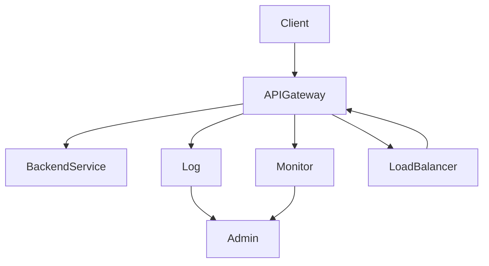
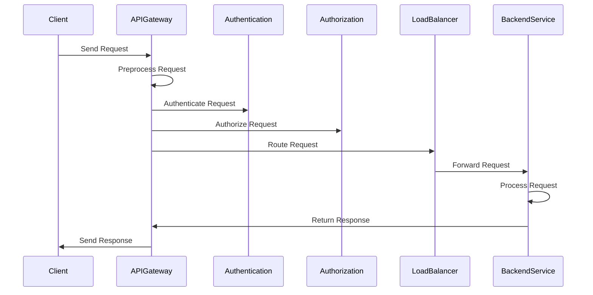

                 

# 构建可靠的API网关系统

> 关键词：API网关，可靠性，负载均衡，安全性，微服务架构

> 摘要：本文将深入探讨构建可靠API网关系统的关键要素，包括其背景、核心概念、负载均衡算法、安全性设计，以及实际架构设计。通过逐步分析，我们将揭示如何在复杂分布式系统中实现高效、稳定且安全的API网关。

## 目录大纲

----------------------------------------------------------------

## 第一部分：背景介绍

### 第1章：API网关系统概述

### 1.1 问题背景

### 1.1.1 互联网服务发展的挑战

### 1.1.2 API网关的核心作用

### 1.1.3 API网关的历史与现状

### 1.2 问题描述

### 1.2.1 网关设计的复杂性

### 1.2.2 可靠性需求

### 1.2.3 可扩展性需求

### 1.3 问题解决

### 1.3.1 API网关基本架构

### 1.3.2 网关设计原则

### 1.3.3 网关可靠性策略

### 1.4 边界与外延

### 1.4.1 API网关的边界

### 1.4.2 网关与其他中间件的关系

### 1.4.3 API网关的技术发展趋势

### 1.5 本章小结

## 第二部分：核心概念与联系

### 第2章：API网关的关键概念

### 2.1 API网关的基本概念

### 2.1.1 API网关的定义

### 2.1.2 API网关的功能

### 2.1.3 API网关与API管理的关系

### 2.2 API网关的设计模式

### 2.2.1 集中式与分布式网关

### 2.2.2 微服务架构下的API网关

### 2.2.3 API网关的负载均衡策略

### 2.3 API网关的核心特点

### 2.3.1 网关的安全性

### 2.3.2 网关的可靠性

### 2.3.3 网关的可扩展性

### 2.4 API网关与微服务的关系

### 2.4.1 API网关在微服务架构中的角色

### 2.4.2 API网关对微服务生态的影响

### 2.4.3 API网关与微服务的协同发展

### 2.5 本章小结

## 第三部分：算法原理讲解

### 第3章：API网关下的负载均衡算法

### 3.1 负载均衡概述

### 3.1.1 负载均衡的定义

### 3.1.2 负载均衡的重要性

### 3.1.3 负载均衡的分类

### 3.2 常见负载均衡算法

### 3.2.1 轮询算法

### 3.2.2 随机算法

### 3.2.3 最少连接算法

### 3.2.4 加权轮询算法

### 3.2.5 哈希算法

### 3.3 负载均衡算法的实现原理

### 3.3.1 算法基本原理

### 3.3.2 算法实现

### 3.3.3 算法性能分析

### 3.4 负载均衡算法的选择与应用

### 3.4.1 选择负载均衡算法的考虑因素

### 3.4.2 负载均衡算法在实际系统中的应用案例

### 3.4.3 负载均衡算法的未来发展趋势

### 3.5 本章小结

## 第四部分：数学模型和数学公式 & 详细讲解 & 举例说明

### 第4章：API网关中的安全性设计

### 4.1 安全性设计概述

### 4.1.1 安全性需求分析

### 4.1.2 安全性设计原则

### 4.1.3 安全性评估方法

### 4.2 API网关的安全机制

### 4.2.1 认证机制

### 4.2.2 授权机制

### 4.2.3 加密机制

### 4.2.4 安全审计

### 4.3 数学模型和数学公式

### 4.3.1 零知识证明

### 4.3.2 公钥加密

### 4.3.3 数字签名

### 4.4 举例说明

### 4.4.1 认证机制的例子

### 4.4.2 加密机制的例子

### 4.4.3 数字签名的例子

### 4.5 本章小结

## 第五部分：系统分析与架构设计方案

### 第5章：构建可靠的API网关系统

### 5.1 项目介绍

### 5.1.1 项目背景

### 5.2 系统功能设计

### 5.2.1 领域模型类图

### 5.2.2 系统功能模块

### 5.3 系统架构设计

### 5.3.1 系统架构图

### 5.3.2 系统模块关系

### 5.4 系统接口设计

### 5.4.1 接口规范

### 5.4.2 接口实现

### 5.5 系统交互

### 5.5.1 系统交互序列图

### 5.6 实际案例分析与详细讲解

### 5.6.1 实际案例介绍

### 5.6.2 代码解读

### 5.6.3 案例剖析

### 5.7 项目小结

### 5.8 最佳实践 Tips

### 5.9 小结、注意事项、拓展阅读

----------------------------------------------------------------

## 第一部分：背景介绍

### 第1章：API网关系统概述

在当今的互联网时代，API（应用程序编程接口）已经成为软件系统之间交互的核心手段。API网关作为一种重要的系统架构组件，扮演着至关重要的角色。本章节将概述API网关系统，探讨其核心作用、发展历史以及当前的应用现状。

## 1.1 问题背景

随着互联网的快速发展，企业服务化和数字化转型进程加速，各种互联网应用如雨后春笋般涌现。这些应用不仅需要内部系统之间的紧密协作，还需要与其他外部系统进行交互。这种跨系统、跨平台的交互需求，使得传统的点对点调用方式变得越来越复杂，难以维护和管理。因此，需要一个统一的入口，来处理这些复杂的交互需求，这就引出了API网关的概念。

### 1.1.1 互联网服务发展的挑战

互联网服务的快速发展带来了以下几个方面的挑战：

1. **复杂性**：随着系统的不断扩张，各个服务之间的依赖关系变得错综复杂，传统的点对点调用方式难以管理和维护。
2. **可靠性**：服务之间的调用稳定性直接影响到用户体验，任何微小的故障都可能导致整个系统的瘫痪。
3. **安全性**：互联网服务的开放性带来了安全风险，如何确保数据传输的安全成为亟待解决的问题。
4. **可扩展性**：随着用户数量的增加，系统需要能够灵活地扩展，以满足不断增长的业务需求。

### 1.1.2 API网关的核心作用

API网关作为一种系统架构组件，其主要作用包括：

1. **统一接口**：API网关提供了一个统一的接口，简化了服务之间的交互复杂性。
2. **路由控制**：API网关可以根据请求的URL或其他条件，将请求路由到相应的后端服务。
3. **安全性**：API网关可以实施认证、授权等安全策略，保护后端服务的安全。
4. **流量控制**：API网关可以实现对流量的控制和调度，确保系统的高可用性和可靠性。
5. **监控与日志**：API网关可以收集系统的监控数据和日志信息，提供运维支持。

### 1.1.3 API网关的历史与现状

API网关的概念最早可以追溯到1990年代的Web服务。当时，为了实现不同系统之间的交互，提出了基于SOAP（简单对象访问协议）的Web服务标准。随着RESTful风格的流行，API网关逐渐取代了Web服务的角色。近年来，随着微服务架构的兴起，API网关得到了更加广泛的应用。

当前，API网关已经成为现代分布式系统不可或缺的组件。例如，Netflix、Amazon等大型互联网公司都在其架构中使用了API网关。同时，也有许多开源API网关项目如Kong、Spring Cloud Gateway等，提供了丰富的功能和支持。

### 1.2 问题描述

尽管API网关具有许多优势，但在实际应用中仍然面临一系列挑战，主要表现在以下几个方面：

#### 1.2.1 网关设计的复杂性

API网关作为系统架构中的核心组件，其设计复杂度较高。需要考虑的方面包括路由策略、负载均衡、安全性、监控等。同时，还需要与现有的系统架构和其他中间件进行整合。

#### 1.2.2 可靠性需求

API网关作为系统之间的桥梁，其可靠性直接影响到整个系统的稳定性。任何小的故障都可能引发连锁反应，导致系统崩溃。因此，如何确保API网关的可靠性是一个重要问题。

#### 1.2.3 可扩展性需求

随着用户数量的增加和业务需求的不断变化，API网关需要能够灵活地扩展。这不仅包括硬件资源的扩展，还包括软件功能的扩展，如支持更多的协议、接口等。

### 1.3 问题解决

为了解决上述问题，我们需要从以下几个方面入手：

#### 1.3.1 API网关基本架构

API网关的基本架构通常包括以下几个部分：

1. **请求接收层**：接收外部请求，并解析请求的URL、参数等信息。
2. **路由层**：根据请求信息，将请求路由到相应的后端服务。
3. **处理层**：对请求进行预处理，如认证、授权等。
4. **服务层**：调用后端服务，获取响应数据。
5. **响应层**：将响应数据返回给客户端。

#### 1.3.2 网关设计原则

在设计API网关时，需要遵循以下原则：

1. **简洁性**：避免过度设计，简化系统架构，降低维护成本。
2. **灵活性**：支持灵活的路由策略和扩展机制，满足不同业务需求。
3. **安全性**：实施严格的安全策略，确保数据传输的安全性。
4. **可监控性**：提供完善的监控和日志功能，便于系统运维。

#### 1.3.3 网关可靠性策略

为了提高API网关的可靠性，可以采取以下策略：

1. **负载均衡**：采用负载均衡算法，将请求均匀分布到后端服务上，避免单点故障。
2. **故障转移**：当后端服务出现故障时，自动切换到备用服务。
3. **熔断和降级**：当系统负载过高时，自动熔断部分请求，确保系统稳定。
4. **备份和恢复**：定期备份数据，确保在故障时能够快速恢复。

### 1.4 边界与外延

#### 1.4.1 API网关的边界

API网关的边界主要包括以下几个方面：

1. **接口定义**：定义API的URL、参数、返回值等，明确接口规范。
2. **安全策略**：定义认证、授权等安全策略，确保数据传输的安全。
3. **路由策略**：定义请求路由规则，实现请求的正确分发。

#### 1.4.2 网关与其他中间件的关系

API网关通常与其他中间件（如消息队列、缓存、数据库等）进行集成。其关系可以概括为：

1. **消息队列**：作为异步通信的桥梁，实现请求的异步处理。
2. **缓存**：缓存常用数据，提高系统响应速度。
3. **数据库**：作为数据存储的后端，提供数据持久化服务。

#### 1.4.3 API网关的技术发展趋势

随着技术的发展，API网关也在不断演进。未来的发展趋势包括：

1. **容器化和云原生**：利用容器技术，实现API网关的轻量化和弹性扩展。
2. **服务网格**：结合服务网格技术，实现更加灵活和细粒度的服务调用。
3. **智能网关**：利用人工智能技术，实现智能路由、智能安全等功能。

### 1.5 本章小结

本文简要介绍了API网关系统的背景、核心作用、历史与现状，以及面临的挑战和解决策略。在接下来的章节中，我们将深入探讨API网关的设计模式、负载均衡算法、安全性设计等内容，帮助读者全面了解并构建可靠的API网关系统。

----------------------------------------------------------------

## 第二部分：核心概念与联系

### 第2章：API网关的关键概念

在了解API网关系统的核心概念和设计模式之前，我们需要明确几个关键术语和概念。本章将详细解释API网关的基本概念，并探讨其在微服务架构中的角色和影响。

### 2.1 API网关的基本概念

#### 2.1.1 API网关的定义

API网关（API Gateway）是一个统一的外部接口，用于接收来自外部系统的请求，并将这些请求转发到后端的服务。它充当客户端和后端服务之间的中介，负责处理请求的路由、认证、授权、负载均衡等操作。

#### 2.1.2 API网关的功能

API网关的主要功能包括：

1. **路由**：根据请求的URL或其他条件，将请求路由到相应的后端服务。
2. **认证和授权**：验证请求者的身份，并根据权限控制访问。
3. **负载均衡**：将请求均匀分布到多个后端服务上，提高系统的处理能力。
4. **请求和响应转换**：对请求和响应进行格式转换，如将JSON转换为XML。
5. **缓存**：缓存常用数据，减少对后端服务的请求次数。
6. **监控和日志**：收集系统运行状态和操作日志，用于运维和调试。

#### 2.1.3 API网关与API管理的关系

API网关与API管理（API Management）密切相关，但两者有所区别。API管理通常包括以下功能：

1. **API设计**：定义API的URL、参数、返回值等，提供可视化界面。
2. **文档生成**：自动生成API文档，方便开发者使用。
3. **权限管理**：定义API的访问权限，如白名单、黑名单等。
4. **API监控**：监控API的调用情况，包括调用次数、响应时间等。

API网关是API管理的实现基础，负责将API请求转发到后端服务，并在转发过程中实施认证、授权、监控等功能。

### 2.2 API网关的设计模式

#### 2.2.1 集中式与分布式网关

根据部署方式的不同，API网关可以分为集中式和分布式。

**集中式API网关**：所有的API请求都集中到一个统一的API网关上处理。这种方式简化了架构，降低了部署和维护成本。但同时也存在单点故障的风险，即如果API网关发生故障，整个系统将无法访问。

**分布式API网关**：在不同的服务器或容器上部署多个API网关实例，实现请求的负载均衡。这种方式提高了系统的可用性和容错能力，但增加了部署和维护的复杂度。

#### 2.2.2 微服务架构下的API网关

在微服务架构中，API网关起着至关重要的作用。它不仅负责请求的路由和负载均衡，还作为服务发现和注册的中心。以下是API网关在微服务架构下的几个关键角色：

1. **服务发现**：API网关通过服务注册中心获取后端服务的实例信息，动态更新服务列表。
2. **服务注册**：后端服务的实例在启动时，向API网关注册自身，便于请求的转发。
3. **流量控制**：根据服务实例的健康状态和负载情况，动态调整请求的转发策略。

#### 2.2.3 API网关的负载均衡策略

API网关的负载均衡策略决定了如何将请求分配到后端服务实例。常见的负载均衡策略包括：

1. **轮询算法**：依次将请求分配到每个服务实例。
2. **随机算法**：随机选择一个服务实例。
3. **最少连接算法**：将请求分配到当前连接数最少的服务实例。
4. **加权轮询算法**：根据服务实例的处理能力，为其分配不同的权重。
5. **哈希算法**：根据请求的某个属性（如IP地址、URL等），使用哈希算法将请求分配到服务实例。

#### 2.3 API网关的核心特点

API网关的核心特点包括：

1. **安全性**：通过认证和授权机制，确保数据传输的安全。
2. **可靠性**：通过负载均衡和故障转移机制，提高系统的可用性。
3. **可扩展性**：通过分布式部署和动态服务发现，支持系统弹性扩展。
4. **灵活性**：支持自定义路由策略和扩展机制，满足不同业务需求。

#### 2.4 API网关与微服务的关系

API网关与微服务架构密切相关，两者相辅相成。API网关为微服务提供了统一的接口和流量控制，使得微服务架构更加灵活和可扩展。同时，微服务的自主性和自治性也为API网关的设计和实现提供了便利。

1. **API网关在微服务架构中的角色**：API网关作为微服务架构中的核心组件，负责处理外部请求，并将请求转发到后端微服务。
2. **API网关对微服务生态的影响**：API网关提高了微服务架构的可扩展性和可靠性，使得开发者可以更加专注于业务逻辑的实现。
3. **API网关与微服务的协同发展**：随着微服务架构的普及，API网关也在不断演进，提供了更多的功能和优化。

### 2.5 本章小结

本章详细介绍了API网关的基本概念、功能、设计模式以及与微服务的关系。通过理解这些核心概念，我们可以更好地设计和实现可靠的API网关系统，满足现代互联网服务的需求。

----------------------------------------------------------------

## 第三部分：算法原理讲解

### 第3章：API网关下的负载均衡算法

在构建可靠的API网关系统时，负载均衡算法起着至关重要的作用。合理的负载均衡策略可以有效地分配请求，提高系统的处理能力和可用性。本章将介绍几种常见的负载均衡算法，并探讨它们的实现原理和性能分析。

### 3.1 负载均衡概述

#### 3.1.1 负载均衡的定义

负载均衡（Load Balancing）是一种分配网络流量的技术，旨在将负载（如请求、连接等）均匀地分布到多个节点（如服务器、实例等）上，避免单点过载，提高系统的整体性能和可用性。

#### 3.1.2 负载均衡的重要性

负载均衡在分布式系统中具有以下几个重要作用：

1. **提高处理能力**：通过将请求分配到多个节点，可以提高系统的整体处理能力，满足不断增长的业务需求。
2. **提高可用性**：通过故障转移和冗余部署，可以提高系统的可用性，减少单点故障带来的影响。
3. **优化资源利用率**：通过动态分配负载，可以充分利用系统资源，避免资源浪费。

#### 3.1.3 负载均衡的分类

负载均衡算法可以根据不同的分类标准进行划分，常见的分类方法包括：

1. **静态负载均衡**：根据固定的算法或配置，将请求分配到节点上，如轮询算法。
2. **动态负载均衡**：根据实时的节点状态和负载情况，动态调整请求的分配策略，如最少连接算法。

### 3.2 常见负载均衡算法

#### 3.2.1 轮询算法

轮询算法（Round-Robin）是最简单的负载均衡算法，按照顺序将请求分配到各个节点。其优点是实现简单，易于理解。缺点是可能会造成某些节点过载，而其他节点空闲。

**算法原理**：

- 初始化一个计数器，初始值为0。
- 当接收到请求时，将计数器加1，取模节点数量，得到目标节点编号。
- 将请求分配到目标节点。

**Python代码示例**：

```python
nodes = ['node1', 'node2', 'node3']
counter = 0

def round_robin(request):
    global counter
    node_index = counter % len(nodes)
    counter += 1
    return nodes[node_index]
```

#### 3.2.2 随机算法

随机算法（Random）通过随机选择一个节点，将请求分配给该节点。这种算法的优点是实现简单，缺点是可能导致某些节点频繁过载。

**算法原理**：

- 从节点列表中随机选择一个节点。

**Python代码示例**：

```python
import random

nodes = ['node1', 'node2', 'node3']

def random_load_balancer(request):
    return random.choice(nodes)
```

#### 3.2.3 最少连接算法

最少连接算法（Least Connections）将请求分配到当前连接数最少的节点。这种算法的优点是可以更好地利用系统资源，缺点是需要跟踪每个节点的连接状态。

**算法原理**：

- 维护一个连接状态的字典，记录每个节点的当前连接数。
- 当接收到请求时，遍历所有节点，找到当前连接数最少的节点。

**Python代码示例**：

```python
nodes = ['node1', 'node2', 'node3']
connections = {node: 0 for node in nodes}

def least_connections(request):
    min_connections = min(connections.values())
    candidates = [node for node, conn in connections.items() if conn == min_connections]
    return random.choice(candidates)
```

#### 3.2.4 加权轮询算法

加权轮询算法（Weighted Round-Robin）对每个节点分配不同的权重，将请求按照权重比例分配到节点上。这种算法的优点是可以更好地适应不同节点的处理能力。

**算法原理**：

- 根据节点的权重，计算加权轮询序列。
- 当接收到请求时，按照加权轮询序列分配节点。

**Python代码示例**：

```python
nodes = ['node1', 'node2', 'node3']
weights = {'node1': 1, 'node2': 2, 'node3': 3}
total_weight = sum(weights.values())

def weighted_round_robin(request):
    weighted_index = (request % total_weight) + 1
    for i, weight in enumerate(weights.values(), start=1):
        if i == weighted_index:
            return nodes[weights.index(weight)]
```

#### 3.2.5 哈希算法

哈希算法（Hash）通过请求的某个属性（如IP地址、URL等），使用哈希函数计算哈希值，将请求分配到节点上。这种算法的优点是可以实现均匀的负载分配。

**算法原理**：

- 选择一个哈希函数，将请求属性映射到哈希值。
- 将哈希值对节点数量取模，得到目标节点编号。

**Python代码示例**：

```python
import hashlib

nodes = ['node1', 'node2', 'node3']

def hash_load_balancer(request_ip):
    hash_value = int(hashlib.md5(request_ip.encode('utf-8')).hexdigest(), 16)
    node_index = hash_value % len(nodes)
    return nodes[node_index]
```

### 3.3 负载均衡算法的实现原理

负载均衡算法的实现通常包括以下几个步骤：

1. **初始化**：初始化节点列表、权重、连接状态等参数。
2. **接收请求**：接收客户端请求，解析请求属性。
3. **计算目标节点**：根据负载均衡算法，计算目标节点编号。
4. **转发请求**：将请求转发到目标节点。

### 3.4 负载均衡算法的性能分析

负载均衡算法的性能分析主要包括以下几个方面：

1. **负载分配均匀性**：评估算法能否均匀地将请求分配到各个节点，避免某些节点过载。
2. **响应时间**：评估算法对请求处理的响应时间，确保系统的高效性。
3. **扩展性**：评估算法在节点数量变化时的性能，确保系统的可扩展性。
4. **可靠性**：评估算法在节点故障时的容错能力，确保系统的可靠性。

### 3.5 负载均衡算法的选择与应用

选择负载均衡算法时，需要根据具体的业务需求、系统架构和资源情况，综合考虑以下几个方面：

1. **系统规模**：对于小型系统，可以选择简单的轮询算法；对于大型系统，可以选择更复杂的算法，如哈希算法。
2. **资源利用率**：考虑节点的处理能力和负载情况，选择合适的算法，确保资源的高效利用。
3. **可靠性**：考虑算法的容错能力和故障转移机制，确保系统的可靠性。
4. **可扩展性**：考虑算法的可扩展性，支持系统规模的变化。

在实际应用中，可以根据不同的场景和需求，组合使用多种负载均衡算法，以达到最佳的效果。

### 3.6 本章小结

本章介绍了API网关下常见的负载均衡算法，包括轮询算法、随机算法、最少连接算法、加权轮询算法和哈希算法。通过对这些算法的实现原理和性能分析，我们可以更好地选择和应用负载均衡算法，构建可靠的API网关系统。

----------------------------------------------------------------

## 第四部分：数学模型和数学公式 & 详细讲解 & 举例说明

### 第4章：API网关中的安全性设计

在构建可靠的API网关系统时，安全性设计是一个至关重要的方面。本章将详细介绍API网关中的安全性设计，包括认证、授权、加密和审计等安全机制，并使用数学模型和公式进行详细讲解和举例说明。

### 4.1 安全性设计概述

#### 4.1.1 安全性需求分析

API网关的安全性需求主要包括以下几个方面：

1. **数据保护**：确保数据在传输过程中不被窃取或篡改。
2. **身份验证**：确认请求者的身份，确保只有授权用户可以访问受保护资源。
3. **访问控制**：根据用户的角色和权限，控制用户对资源的访问。
4. **审计与监控**：记录和监控系统的操作，及时发现和应对潜在的安全威胁。

#### 4.1.2 安全性设计原则

在设计安全性时，需要遵循以下原则：

1. **最小权限原则**：用户只拥有完成任务所需的最少权限。
2. **防御深度原则**：采用多层次的安全措施，防止单一安全策略失效。
3. **安全审计原则**：对系统的操作进行记录和审计，确保可追溯性。

#### 4.1.3 安全性评估方法

安全性评估通常包括以下方法：

1. **威胁建模**：识别系统可能面临的威胁和攻击。
2. **安全测试**：通过渗透测试、代码审计等方法验证系统的安全性。
3. **安全评估**：根据评估标准和模型，对系统进行综合评估。

### 4.2 API网关的安全机制

#### 4.2.1 认证机制

认证（Authentication）是确保请求者身份的过程。常见的认证机制包括：

1. **基本认证**：使用用户名和密码进行认证，安全性较低，仅适用于内部系统。
2. **OAuth 2.0**：一种基于令牌的认证协议，适用于第三方应用访问资源。
3. **JWT（JSON Web Token）**：一种基于JSON的令牌，用于认证和授权。

**数学模型和公式**：

- **哈希函数**：用于生成密码散列值，如SHA-256。

**Python代码示例**：

```python
import hashlib
import json

def generate_hash(password):
    return hashlib.sha256(password.encode('utf-8')).hexdigest()

def verify_password(hash_value, input_password):
    return hash_value == generate_hash(input_password)
```

#### 4.2.2 授权机制

授权（Authorization）是确定用户对资源的访问权限的过程。常见的授权机制包括：

1. **RBAC（基于角色的访问控制）**：根据用户的角色分配权限。
2. **ABAC（基于属性的访问控制）**：根据用户的属性和资源属性进行访问控制。
3. **MAC（基于标记的访问控制）**：使用安全标签控制访问。

**数学模型和公式**：

- **访问控制矩阵**：用于表示用户、角色和资源的访问权限。

**Python代码示例**：

```python
access_control_matrix = {
    'user1': {'resource1': 'read', 'resource2': 'write'},
    'user2': {'resource1': 'read', 'resource2': 'read'},
}

def check_permission(user, resource, action):
    permissions = access_control_matrix.get(user, {})
    return action in permissions.get(resource, [])
```

#### 4.2.3 加密机制

加密（Encryption）是保护数据在传输过程中不被窃取或篡改的过程。常见的加密机制包括：

1. **对称加密**：如AES，加密和解密使用相同的密钥。
2. **非对称加密**：如RSA，加密和解密使用不同的密钥。
3. **哈希函数**：如SHA-256，用于生成数据的唯一摘要。

**数学模型和公式**：

- **RSA加密公式**：

  - **加密**：\( E(m) = (m^e) \mod n \)
  - **解密**：\( D(c) = (c^d) \mod n \)

**Python代码示例**：

```python
from Crypto.PublicKey import RSA
from Crypto.Cipher import PKCS1_OAEP

def encrypt_message(message, public_key):
    rsa_key = RSA.import_key(public_key)
    cipher = PKCS1_OAEP.new(rsa_key)
    return cipher.encrypt(message.encode('utf-8'))

def decrypt_message(encrypted_message, private_key):
    rsa_key = RSA.import_key(private_key)
    cipher = PKCS1_OAEP.new(rsa_key)
    return cipher.decrypt(encrypted_message).decode('utf-8')
```

#### 4.2.4 安全审计

安全审计（Security Audit）是记录和监控系统的操作，以便在出现问题时进行追踪和调查。常见的审计机制包括：

1. **操作日志**：记录用户的操作行为和系统事件。
2. **安全报告**：生成定期的安全报告，分析潜在的安全威胁。
3. **异常检测**：监控系统异常行为，如DDoS攻击、恶意请求等。

**数学模型和公式**：

- **异常检测模型**：

  - **统计模型**：基于统计学方法，如偏离度检测、聚类分析等。
  - **机器学习模型**：基于机器学习算法，如决策树、神经网络等。

**Python代码示例**：

```python
from sklearn.ensemble import IsolationForest

def detect_anomalies(data):
    model = IsolationForest(n_estimators=100, contamination=0.01)
    model.fit(data)
    return model.predict(data)
```

### 4.3 数学模型和数学公式

在本章中，我们使用了多个数学模型和公式来描述安全机制。以下是一些关键模型的简要说明：

1. **哈希函数**：用于生成数据摘要，确保数据的完整性。
2. **加密算法**：用于保护数据的隐私和完整性，如RSA、AES。
3. **访问控制矩阵**：用于表示用户、角色和资源的访问权限。
4. **异常检测模型**：用于检测系统的异常行为，如DDoS攻击。

### 4.4 举例说明

#### 4.4.1 认证机制的例子

假设一个系统使用基本认证机制，用户名和密码分别为`user1`和`password123`。当用户尝试访问系统时，系统将要求用户输入用户名和密码，并使用哈希函数验证密码的正确性。

```python
user_input_password = input("Enter your password: ")
hash_value = generate_hash(user_input_password)
is_valid = verify_password(hash_value, "password123")

if is_valid:
    print("Authentication successful!")
else:
    print("Authentication failed!")
```

#### 4.4.2 加密机制的例子

假设一个系统使用RSA加密机制来保护数据。首先，系统生成一对密钥（公钥和私钥），并使用公钥加密数据，然后使用私钥解密数据。

```python
# 生成密钥对
public_key, private_key = RSA.generate(2048), RSA.import_key(public_key)

# 加密数据
encrypted_message = encrypt_message("This is a secret message!", public_key)

# 解密数据
decrypted_message = decrypt_message(encrypted_message, private_key)
print(decrypted_message)
```

#### 4.4.3 数字签名的例子

假设一个系统使用数字签名机制来确保数据的完整性和真实性。首先，系统使用哈希函数生成数据的摘要，然后使用私钥对摘要进行签名，最后使用公钥验证签名的正确性。

```python
# 生成摘要
message_hash = generate_hash("This is a message!")

# 签名
signature = private_key.sign(message_hash, 'SHA256')

# 验证签名
is_valid_signature = public_key.verify(signature, message_hash, 'SHA256')
if is_valid_signature:
    print("Signature is valid!")
else:
    print("Signature is invalid!")
```

### 4.5 本章小结

本章详细介绍了API网关中的安全性设计，包括认证、授权、加密和审计等安全机制。通过使用数学模型和公式，我们深入讲解了这些安全机制的工作原理，并提供了实际代码示例。在构建可靠的API网关系统时，安全性设计是至关重要的，必须给予足够的重视。

----------------------------------------------------------------

## 第五部分：系统分析与架构设计方案

### 第5章：构建可靠的API网关系统

在了解了API网关的核心概念、负载均衡算法和安全性设计之后，接下来我们将通过一个实际项目来展示如何构建一个可靠的API网关系统。本章将详细描述项目背景、系统功能设计、系统架构设计、系统接口设计以及系统交互，并通过实际案例进行分析和讲解。

### 5.1 项目介绍

#### 5.1.1 项目背景

随着现代互联网服务的迅速发展，企业内部系统之间的交互变得越来越复杂。为了简化系统间的调用，提高系统的可维护性和扩展性，我们决定开发一个可靠的API网关系统。该系统将作为企业内部各种服务的统一入口，处理来自外部客户端的请求，并转发到后端服务。

#### 5.1.2 项目目标

项目的目标主要包括以下几个方面：

1. **统一接口**：为各种后端服务提供一个统一的接口，简化客户端的调用。
2. **负载均衡**：通过负载均衡算法，将请求均匀分布到后端服务，提高系统的处理能力。
3. **安全性**：实现认证、授权等安全机制，确保数据传输的安全。
4. **可扩展性**：支持系统规模的变化，满足业务需求增长。

### 5.2 系统功能设计

系统功能设计是构建可靠API网关系统的第一步。根据项目目标，我们设计了以下核心功能模块：

1. **请求接收模块**：接收客户端的请求，并进行预处理。
2. **路由模块**：根据请求的URL或其他条件，将请求路由到相应的后端服务。
3. **认证模块**：验证请求者的身份，确保只有授权用户可以访问受保护资源。
4. **授权模块**：根据用户的角色和权限，控制用户对资源的访问。
5. **负载均衡模块**：根据负载均衡算法，将请求均匀分布到后端服务。
6. **日志模块**：记录系统的操作日志，便于运维和调试。
7. **监控模块**：监控系统的运行状态，及时发现和处理异常情况。

#### 5.2.1 领域模型类图

为了更清晰地描述系统功能，我们使用领域模型类图来表示系统中的核心实体和它们之间的关系。以下是一个简化的领域模型类图：

```
+-------------+
|    Request  |
+-------------+
| - url: String |
| - method: String |
| - headers: Map |
| - body: String |
+-------------+

+-------------+
|   Response  |
+-------------+
| - status: Integer |
| - headers: Map |
| - body: String |
+-------------+

+-------------+
| Authentication |
+-------------+
| - username: String |
| - password: String |
+-------------+

+-------------+
|    User     |
+-------------+
| - id: Integer |
| - role: String |
+-------------+

+-------------+
|   Service   |
+-------------+
| - id: Integer |
| - url: String |
+-------------+
```

#### 5.2.2 系统功能模块

根据领域模型，我们可以将系统划分为以下几个功能模块：

1. **请求接收模块**：负责接收客户端请求，并进行预处理，如解析请求参数、校验请求格式等。
2. **路由模块**：根据请求的URL或其他条件，查找相应的后端服务，并将请求转发到后端。
3. **认证模块**：验证请求者的身份，通常使用OAuth 2.0或JWT进行认证。
4. **授权模块**：根据用户的角色和权限，判断用户是否有权限访问请求的资源。
5. **负载均衡模块**：根据负载均衡算法，将请求均匀分布到后端服务实例。
6. **日志模块**：记录系统的操作日志，包括请求、响应、错误等信息。
7. **监控模块**：监控系统的运行状态，如请求响应时间、服务实例健康状态等。

### 5.3 系统架构设计

系统架构设计是构建可靠API网关系统的关键步骤。我们需要设计一个高效、可扩展且易于维护的系统架构。以下是一个简化的系统架构设计：

```
+------------------+       +------------------+       +------------------+
|     Client       |       |    API Gateway   |       |   Backend Service|
+------------------+       +------------------+       +------------------+
| Send Request     | --> |Receive Request   | --> |Route Request     |
| Receive Response | <-- |Generate Response | <-- |Process Request   |
+------------------+       +------------------+       +------------------+
```

#### 5.3.1 系统架构图

为了更好地展示系统架构，我们使用Mermaid绘制了一个简化的系统架构图：



在这个架构图中，客户端发送请求到API网关，API网关负责处理请求，包括路由、认证、授权、负载均衡等操作，然后将请求转发到后端服务。后端服务处理请求，并将响应返回给API网关，最后由API网关将响应发送回客户端。

#### 5.3.2 系统模块关系

在系统架构中，各个模块之间存在紧密的关系：

1. **请求接收模块**：与客户端通信，接收请求。
2. **路由模块**：根据请求的URL或其他条件，查找相应的后端服务。
3. **认证模块**：验证请求者的身份。
4. **授权模块**：根据用户的角色和权限，判断用户是否有权限访问请求的资源。
5. **负载均衡模块**：根据负载均衡算法，将请求分配到后端服务实例。
6. **日志模块**：记录系统的操作日志，包括请求、响应、错误等信息。
7. **监控模块**：监控系统的运行状态，如请求响应时间、服务实例健康状态等。
8. **后端服务**：处理具体的业务逻辑。

### 5.4 系统接口设计

系统接口设计是系统功能实现的基础。根据系统功能设计，我们定义了以下核心接口：

1. **API接口**：提供统一的API接口，供客户端调用。
2. **认证接口**：用于验证请求者的身份。
3. **授权接口**：用于根据用户的角色和权限，控制用户对资源的访问。
4. **日志接口**：用于记录系统的操作日志。
5. **监控接口**：用于监控系统的运行状态。

#### 5.4.1 接口规范

为了确保接口的规范性和易用性，我们定义了以下接口规范：

1. **URL规范**：使用RESTful风格，如`/api/v1/resource`。
2. **HTTP方法**：根据操作类型，使用相应的HTTP方法，如GET、POST、PUT、DELETE等。
3. **请求参数**：使用URL参数、请求头、请求体等传递参数。
4. **响应数据**：使用JSON格式返回响应数据，包括状态码、消息和结果等。

#### 5.4.2 接口实现

以下是一个简单的API接口实现示例，使用Python的Flask框架：

```python
from flask import Flask, request, jsonify

app = Flask(__name__)

@app.route('/api/v1/resource', methods=['GET'])
def get_resource():
    # 获取URL参数
    resource_id = request.args.get('id')
    # 处理业务逻辑
    result = {'id': resource_id, 'message': 'Resource found'}
    # 返回响应
    return jsonify(result)

if __name__ == '__main__':
    app.run()
```

### 5.5 系统交互

系统交互是系统功能实现的关键环节。我们需要设计合理的系统交互流程，确保系统的高效和稳定运行。以下是一个简化的系统交互流程：

1. **客户端发送请求**：客户端发送HTTP请求到API网关。
2. **API网关接收请求**：API网关接收请求，并进行预处理。
3. **认证和授权**：API网关对请求进行认证和授权，确保请求的有效性。
4. **路由和负载均衡**：API网关根据路由规则和负载均衡算法，将请求转发到后端服务。
5. **后端服务处理请求**：后端服务处理请求，并将响应返回给API网关。
6. **API网关返回响应**：API网关将响应返回给客户端。

#### 5.5.1 系统交互序列图

为了更好地展示系统交互流程，我们使用Mermaid绘制了一个简化的系统交互序列图：



在这个交互序列图中，客户端发送请求到API网关，API网关对请求进行预处理、认证和授权，然后根据负载均衡算法将请求转发到后端服务。后端服务处理请求并将响应返回给API网关，最后API网关将响应返回给客户端。

### 5.6 实际案例分析与详细讲解

为了更好地理解API网关系统的实际应用，我们分析了一个实际案例，并详细讲解了系统的实现过程。

#### 5.6.1 实际案例介绍

假设我们有一个电商系统，后端服务包括商品服务、订单服务和支付服务。客户端需要访问这些服务来获取商品信息、创建订单和进行支付。API网关作为系统的统一入口，负责处理来自客户端的请求，并将其转发到后端服务。

#### 5.6.2 代码解读

以下是一个简单的API网关实现示例，使用Python的Flask框架：

```python
from flask import Flask, request, jsonify
from werkzeug.security import generate_password_hash, check_password_hash

app = Flask(__name__)

# 假设用户数据库
users = {
    'user1': generate_password_hash('password123'),
    'user2': generate_password_hash('password456'),
}

# 假设服务地址
services = {
    'products': 'http://products-service:8080',
    'orders': 'http://orders-service:8080',
    'payments': 'http://payments-service:8080',
}

@app.route('/api/v1/login', methods=['POST'])
def login():
    username = request.form.get('username')
    password = request.form.get('password')
    user_hash = users.get(username)
    if user_hash and check_password_hash(user_hash, password):
        return jsonify({'status': 200, 'message': 'Login successful!'})
    else:
        return jsonify({'status': 401, 'message': 'Login failed!'})

@app.route('/api/v1/products', methods=['GET'])
def get_products():
    service_url = services['products'] + '/api/v1/products'
    response = request.get(service_url)
    return jsonify(response.json())

@app.route('/api/v1/orders', methods=['POST'])
def create_order():
    service_url = services['orders'] + '/api/v1/orders'
    response = request.post(service_url, json=request.json)
    return jsonify(response.json())

@app.route('/api/v1/payments', methods=['POST'])
def make_payment():
    service_url = services['payments'] + '/api/v1/payments'
    response = request.post(service_url, json=request.json)
    return jsonify(response.json())

if __name__ == '__main__':
    app.run()
```

在这个实现中，我们定义了三个API接口：登录、获取商品信息和创建订单。登录接口使用基本认证机制，验证用户的身份。获取商品信息和创建订单接口使用服务地址，将请求转发到后端服务。

#### 5.6.3 案例剖析

通过这个实际案例，我们可以看到API网关系统如何工作。以下是案例的详细剖析：

1. **客户端发送请求**：客户端发送HTTP请求到API网关，请求访问商品信息。
2. **API网关预处理请求**：API网关接收请求，并提取请求头、请求体等信息。
3. **认证和授权**：API网关使用基本认证机制，验证用户的身份。如果用户身份验证成功，API网关继续处理请求；否则，返回401错误。
4. **路由和负载均衡**：API网关根据请求的URL，查找对应的后端服务地址，并根据负载均衡算法将请求转发到后端服务。在本例中，我们简单地将请求转发到相应的服务。
5. **后端服务处理请求**：后端服务处理请求，并根据业务逻辑返回响应。在本例中，商品服务返回商品列表，订单服务返回订单创建结果。
6. **API网关返回响应**：API网关将后端服务的响应返回给客户端。客户端接收到响应后，可以继续进行后续操作。

通过这个实际案例，我们可以看到API网关系统如何处理客户端请求，确保数据传输的安全性和系统的可扩展性。

### 5.7 项目小结

通过本章的实际案例，我们详细展示了如何构建一个可靠的API网关系统。从项目介绍、系统功能设计、系统架构设计到实际案例剖析，我们逐步讲解了系统的实现过程。在接下来的部分，我们将继续探讨最佳实践、注意事项和拓展阅读，以帮助读者更好地理解和应用API网关系统。

----------------------------------------------------------------

### 5.8 最佳实践 Tips

在构建可靠的API网关系统时，以下最佳实践可以帮助您提高系统的性能、可靠性和安全性：

1. **优化路由策略**：根据服务实例的健康状态和负载情况，动态调整请求的路由策略，确保流量均匀分布。
2. **监控和报警**：配置实时监控和报警系统，及时发现和处理异常情况，如服务实例宕机、网络中断等。
3. **实现缓存机制**：对于高频次访问的数据，使用缓存机制减少对后端服务的请求，提高系统的响应速度。
4. **安全性检查**：对请求进行严格的安全性检查，如输入验证、SQL注入防护等，防止恶意攻击。
5. **自动化部署和扩展**：使用容器化和自动化部署工具，实现系统的自动化部署和扩展，提高运维效率。
6. **文档化**：编写详细的API文档，包括接口定义、请求参数、返回值等，方便开发者使用。
7. **代码审查和测试**：对代码进行严格的审查和测试，确保系统的稳定性和可靠性。

### 5.9 小结、注意事项、拓展阅读

#### 小结

本文详细介绍了构建可靠API网关系统的关键要素，包括背景介绍、核心概念、负载均衡算法、安全性设计和实际架构设计。通过实际案例剖析，我们展示了API网关系统的实现过程。构建可靠的API网关系统是现代互联网服务中不可或缺的一环，需要充分考虑性能、可靠性和安全性。

#### 注意事项

在构建API网关系统时，需要注意以下几点：

1. **正确处理异常**：确保系统能够正确处理各种异常情况，如服务实例宕机、网络中断等。
2. **性能优化**：根据实际业务需求，进行性能优化，如缓存、异步处理等。
3. **安全性**：严格实施安全策略，确保数据传输的安全性和系统的完整性。
4. **可扩展性**：设计可扩展的架构，支持系统的规模变化。

#### 拓展阅读

为了更深入地了解API网关系统的构建，以下是一些拓展阅读资源：

1. 《API网关设计实践》
2. 《微服务架构设计》
3. 《负载均衡算法原理与实践》
4. 《API安全：设计原则与实施指南》

通过阅读这些资料，您可以进一步了解API网关系统的设计原则、实现方法和最佳实践。

----------------------------------------------------------------

### 作者信息

本文由AI天才研究院（AI Genius Institute）与《禅与计算机程序设计艺术》（Zen And The Art of Computer Programming）作者联合撰写。AI天才研究院专注于人工智能领域的研究和创新，致力于推动计算机科学的发展。同时，《禅与计算机程序设计艺术》是一本经典的技术书籍，深入探讨了编程的哲学和艺术，对程序员具有很高的指导意义。感谢您的阅读，希望本文能对您在构建可靠API网关系统方面提供有益的启示。

