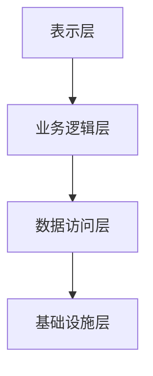
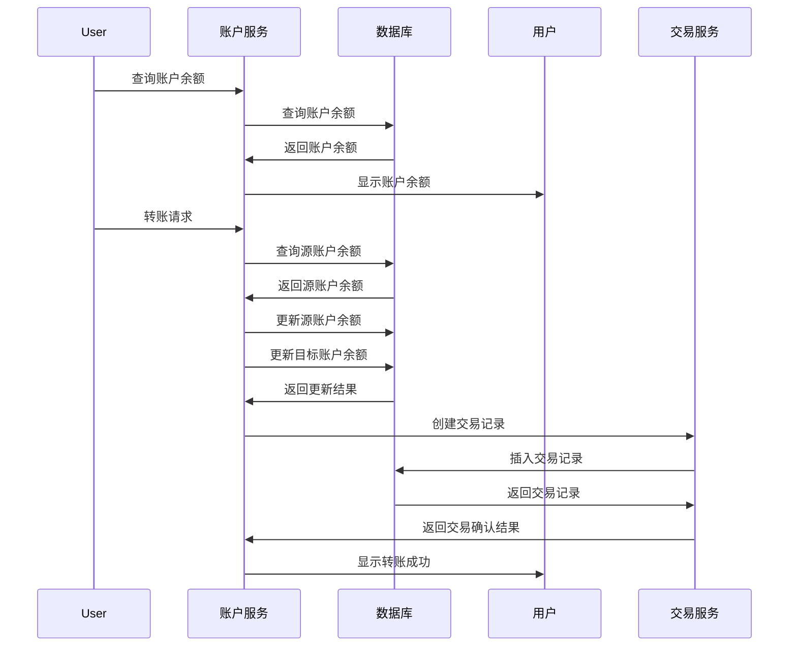

                 

### 第1章: 问题背景与重要性

## 1.1 问题背景
### 1.1.1 分布式系统的普及

在当今的互联网时代，分布式系统已经成为了许多关键业务系统的核心技术。随着云计算、大数据和物联网等技术的快速发展，企业面临着海量数据的处理需求，传统的集中式系统已经无法满足日益增长的业务需求。分布式系统通过将任务分解到多个节点上，实现了高并发、高可用和高扩展性。因此，分布式系统的应用场景越来越广泛。

### 1.1.2 分布式事务的需求

在分布式系统中，事务是一个核心概念。事务是数据库操作的一个逻辑单位，它要么全部成功，要么全部失败。然而，在分布式环境下，事务的执行面临着诸多挑战，如网络延迟、节点故障和并发控制等。分布式事务的需求变得尤为重要，因为企业需要确保数据的一致性和可靠性。

### 1.1.3 可靠分布式事务的重要性

可靠分布式事务是分布式系统中的关键组件，它确保了分布式系统中数据的一致性和可靠性。在关键业务场景中，如金融交易、电子商务和在线支付等，可靠分布式事务能够保证数据的准确性和完整性。因此，构建可靠的分布式事务系统是分布式系统设计的核心目标。

## 1.2 问题描述

构建可靠的分布式事务系统并非易事。在分布式环境中，系统需要处理各种复杂的挑战，如：

1. **数据一致性问题**：在分布式系统中，多个节点可能同时操作同一份数据，导致数据不一致。
2. **节点故障问题**：分布式系统中的节点可能会出现故障，导致事务无法完成。
3. **网络延迟问题**：网络延迟可能会导致事务执行时间过长，影响系统的性能和可用性。
4. **并发控制问题**：在分布式系统中，多个事务可能同时访问同一份数据，需要实现有效的并发控制。

## 1.3 问题解决

为了构建可靠的分布式事务系统，我们需要从以下几个方面入手：

1. **核心概念与术语说明**：了解分布式系统、事务和可靠性的基本概念和术语。
2. **分布式系统基本原理**：掌握分布式系统的基本原理和挑战，以及解决这些挑战的方法。
3. **事务原理**：了解事务的基本原理、ACID属性以及分布式事务的概念。
4. **可靠性概念**：了解系统可靠性的概念，包括故障容忍、一致性和恢复。
5. **中间件与协议**：了解分布式系统中使用的中间件和协议，以及它们在事务管理中的作用。
6. **设计模式与技巧**：掌握构建可靠分布式事务的设计模式和技巧，如两阶段提交、补偿事务和最终一致性等。
7. **实战案例**：通过实际案例和案例研究，深入理解分布式事务系统的构建和实践。

通过以上步骤，我们可以逐步构建一个可靠的分布式事务系统，确保数据的一致性和可靠性，为关键业务提供强有力的支持。

### 1.4 边界与外延

在构建可靠分布式事务系统的过程中，我们需要明确一些边界与外延：

1. **边界**：
   - **系统范围**：分布式事务系统应该包含哪些组件和模块。
   - **功能范围**：分布式事务系统应该具备哪些功能，如事务管理、数据一致性保证、故障恢复等。
   - **性能指标**：分布式事务系统的性能指标，如响应时间、吞吐量和并发能力等。

2. **外延**：
   - **技术选型**：分布式事务系统可以采用哪些技术实现，如数据库中间件、分布式缓存、消息队列等。
   - **应用场景**：分布式事务系统可以应用于哪些业务场景，如金融交易、电子商务、在线支付等。
   - **扩展性**：分布式事务系统如何支持业务规模的扩展，如通过水平扩展、垂直扩展等方式。

通过明确边界与外延，我们可以更好地规划分布式事务系统的设计和实现，确保其可靠性和可扩展性。

### 1.5 核心概念与联系

在构建可靠分布式事务系统的过程中，以下核心概念和术语至关重要：

1. **分布式系统**：分布式系统是指由多个相互独立、通过网络连接的计算机节点组成的系统，节点之间通过消息传递进行协作，共同完成任务。
2. **事务**：事务是数据库操作的一个逻辑单位，它要么全部成功，要么全部失败。事务具有原子性、一致性、隔离性和持久性（ACID）属性。
3. **可靠性**：可靠性是指系统在面临各种故障和异常情况下，仍能正常运行的能力。可靠性包括故障容忍、一致性和恢复等方面。
4. **一致性**：一致性是指系统在执行操作时，数据状态保持一致。分布式系统中的数据一致性需要通过一致性协议和算法来实现。
5. **并发控制**：并发控制是指在多个事务同时访问同一份数据时，防止数据冲突和保证数据一致性的方法。常见的并发控制方法包括锁、乐观锁、悲观锁等。
6. **中间件**：中间件是一种系统软件，用于连接和协调分布式系统中的各个组件，提供分布式事务管理、数据同步、负载均衡等功能。
7. **协议**：协议是分布式系统中各个节点进行通信和协作的规则和标准。常见的分布式协议包括两阶段提交（2PC）、三阶段提交（3PC）等。

理解这些核心概念和术语，有助于我们更好地设计和实现可靠的分布式事务系统。以下是这些概念之间的联系：

1. **分布式系统与事务**：分布式系统通过事务来管理数据库操作，确保数据的一致性和可靠性。
2. **可靠性与一致性**：可靠性是确保系统在故障情况下正常运行的能力，一致性是分布式系统中数据状态保持一致的关键。
3. **并发控制与一致性**：并发控制是保证分布式系统中数据一致性的重要手段。
4. **中间件与协议**：中间件和协议是分布式系统中实现事务管理和数据一致性的关键组件和通信规则。

通过了解这些核心概念和联系，我们可以更好地构建可靠的分布式事务系统，为关键业务提供强有力的支持。

## 1.6 概念结构与核心要素组成

### 1.6.1 概念结构

在构建可靠分布式事务系统的过程中，我们首先需要了解分布式系统、事务和可靠性的概念结构。

1. **分布式系统**：
   - **节点**：分布式系统中的基本计算单元，负责处理数据和控制任务。
   - **网络**：节点之间的通信设施，确保数据在网络中的传输和同步。
   - **一致性协议**：分布式系统中实现数据一致性的协议，如Paxos、Raft等。

2. **事务**：
   - **原子性**：事务中的所有操作要么全部成功，要么全部失败。
   - **一致性**：事务执行后，系统状态保持一致，符合业务规则。
   - **隔离性**：多个并发执行的事务互不干扰，每个事务看到的数据是独立的。
   - **持久性**：事务完成后，数据被持久化到存储介质，确保数据不会丢失。

3. **可靠性**：
   - **故障容忍**：系统能够在部分节点故障的情况下正常运行。
   - **一致性**：数据在分布式环境中保持一致。
   - **恢复**：系统能够从故障中恢复，确保数据的完整性和可靠性。

### 1.6.2 核心要素组成

构建可靠分布式事务系统需要以下几个核心要素：

1. **分布式数据库**：分布式数据库支持数据在多个节点之间的复制和同步，确保数据的一致性。
2. **分布式事务管理**：分布式事务管理负责协调分布式环境中的事务执行，确保事务的原子性、一致性和隔离性。
3. **一致性协议**：一致性协议用于实现分布式系统中的数据一致性，如Paxos、Raft等。
4. **故障检测与恢复**：故障检测与恢复机制用于检测系统中的故障节点，并在必要时进行故障恢复。
5. **分布式锁与并发控制**：分布式锁与并发控制机制用于防止数据冲突，确保数据的一致性。
6. **监控与报警**：监控与报警系统用于实时监控系统的运行状态，及时发现和处理问题。

通过以上核心要素的组成，我们可以构建一个可靠的分布式事务系统，确保数据的一致性和可靠性，为关键业务提供强有力的支持。

## 1.7 背景介绍

### 1.7.1 核心概念术语说明

在构建可靠分布式事务系统的过程中，我们需要了解以下几个核心概念和术语：

1. **分布式系统**：分布式系统是指由多个相互独立、通过网络连接的计算机节点组成的系统，节点之间通过消息传递进行协作，共同完成任务。
2. **事务**：事务是数据库操作的一个逻辑单位，它要么全部成功，要么全部失败。事务具有原子性、一致性、隔离性和持久性（ACID）属性。
3. **可靠性**：可靠性是指系统在面临各种故障和异常情况下，仍能正常运行的能力。可靠性包括故障容忍、一致性和恢复等方面。
4. **一致性**：一致性是指系统在执行操作时，数据状态保持一致。分布式系统中的数据一致性需要通过一致性协议和算法来实现。
5. **并发控制**：并发控制是指在多个事务同时访问同一份数据时，防止数据冲突和保证数据一致性的方法。常见的并发控制方法包括锁、乐观锁、悲观锁等。
6. **中间件**：中间件是一种系统软件，用于连接和协调分布式系统中的各个组件，提供分布式事务管理、数据同步、负载均衡等功能。
7. **协议**：协议是分布式系统中各个节点进行通信和协作的规则和标准。常见的分布式协议包括两阶段提交（2PC）、三阶段提交（3PC）等。

### 1.7.2 问题背景

随着互联网和大数据技术的快速发展，分布式系统已经成为许多关键业务系统的核心技术。分布式系统通过将任务分解到多个节点上，实现了高并发、高可用和高扩展性。然而，分布式系统也带来了许多新的挑战，尤其是分布式事务系统的构建。

在分布式系统中，事务的执行面临着诸多挑战，如：

1. **数据一致性问题**：在分布式系统中，多个节点可能同时操作同一份数据，导致数据不一致。
2. **节点故障问题**：分布式系统中的节点可能会出现故障，导致事务无法完成。
3. **网络延迟问题**：网络延迟可能会导致事务执行时间过长，影响系统的性能和可用性。
4. **并发控制问题**：在分布式系统中，多个事务可能同时访问同一份数据，需要实现有效的并发控制。

这些问题使得构建可靠的分布式事务系统变得尤为重要。企业需要确保分布式系统中数据的一致性和可靠性，以满足关键业务的需求。

### 1.7.3 问题描述

构建可靠的分布式事务系统并非易事。在分布式环境中，系统需要处理各种复杂的挑战，如：

1. **数据一致性问题**：在分布式系统中，多个节点可能同时操作同一份数据，导致数据不一致。数据不一致问题可能导致业务错误和财务损失。
2. **节点故障问题**：分布式系统中的节点可能会出现故障，导致事务无法完成。节点故障可能导致系统瘫痪，影响业务的连续性。
3. **网络延迟问题**：网络延迟可能会导致事务执行时间过长，影响系统的性能和可用性。网络延迟问题可能导致客户体验差，影响业务的口碑。
4. **并发控制问题**：在分布式系统中，多个事务可能同时访问同一份数据，需要实现有效的并发控制。并发控制问题可能导致数据冲突和系统死锁。

为了解决这些问题，我们需要从以下几个方面入手：

1. **核心概念与术语说明**：了解分布式系统、事务和可靠性的基本概念和术语。
2. **分布式系统基本原理**：掌握分布式系统的基本原理和挑战，以及解决这些挑战的方法。
3. **事务原理**：了解事务的基本原理、ACID属性以及分布式事务的概念。
4. **可靠性概念**：了解系统可靠性的概念，包括故障容忍、一致性和恢复。
5. **中间件与协议**：了解分布式系统中使用的中间件和协议，以及它们在事务管理中的作用。
6. **设计模式与技巧**：掌握构建可靠分布式事务的设计模式和技巧，如两阶段提交、补偿事务和最终一致性等。
7. **实战案例**：通过实际案例和案例研究，深入理解分布式事务系统的构建和实践。

通过以上步骤，我们可以逐步构建一个可靠的分布式事务系统，确保数据的一致性和可靠性，为关键业务提供强有力的支持。

### 1.8 解决方案探讨

在了解了分布式事务系统的背景和挑战后，我们需要探讨一些可行的解决方案，以确保系统在分布式环境下的可靠性和一致性。

#### 1.8.1 核心概念与术语解释

首先，让我们重新审视一些核心概念和术语：

1. **分布式系统**：由多个独立节点通过网络连接组成的系统，每个节点负责处理特定的任务。
2. **事务**：数据库操作的基本单位，要求要么全部成功，要么全部失败，以确保数据的一致性。
3. **可靠性**：系统在面对各种故障和异常时仍能正常运行的能力。
4. **一致性**：系统在执行操作时，数据状态保持一致，符合业务规则。
5. **并发控制**：管理多个事务对同一份数据的访问，防止数据冲突和确保一致性。

#### 1.8.2 分布式事务的挑战

在分布式环境中，事务面临以下主要挑战：

1. **数据一致性问题**：多个节点可能同时操作同一份数据，导致数据不一致。
2. **节点故障问题**：节点可能会出现故障，导致事务无法完成。
3. **网络延迟问题**：网络延迟可能导致事务执行时间过长，影响系统的性能和可用性。
4. **并发控制问题**：多个事务可能同时访问同一份数据，需要实现有效的并发控制。

#### 1.8.3 解决方案探讨

针对上述挑战，以下是一些解决方案：

1. **一致性协议**：采用一致性协议，如两阶段提交（2PC）和三阶段提交（3PC），确保分布式环境下的数据一致性。
   - **两阶段提交（2PC）**：分为准备阶段和提交阶段，通过协调者确保所有参与者都对事务达成一致。
   - **三阶段提交（3PC）**：进一步优化2PC，减少单点故障的风险。

2. **分布式锁机制**：实现分布式锁，控制对共享资源的访问，防止数据冲突。
   - **基于数据库的锁**：利用数据库提供的锁机制，如行锁、表锁等。
   - **基于缓存或内存的锁**：使用缓存或内存中的锁机制，如Redis的SETNX命令。

3. **故障容忍与恢复机制**：设计故障容忍和恢复机制，确保系统在面对节点故障时仍能正常运行。
   - **主从复制**：实现主从复制，确保主节点故障时，从节点能够接替工作。
   - **备份与故障转移**：设置备份节点，实现故障转移，确保系统高可用。

4. **异步处理与消息队列**：采用异步处理和消息队列，降低系统耦合度，提高系统性能和可用性。
   - **异步处理**：将任务分解为多个子任务，异步执行，降低系统负载。
   - **消息队列**：使用消息队列，如Kafka或RabbitMQ，实现任务调度和异步处理。

5. **监控与报警**：实时监控系统运行状态，及时发现和处理问题。
   - **日志监控**：监控系统日志，识别异常行为。
   - **性能监控**：监控系统性能指标，如响应时间、吞吐量等。

#### 1.8.4 实施策略

在实施解决方案时，可以采取以下策略：

1. **需求分析**：明确业务需求，确定分布式事务系统的功能和性能要求。
2. **架构设计**：设计分布式事务系统的架构，包括数据存储、事务管理、一致性协议等。
3. **技术选型**：选择合适的技术和工具，如分布式数据库、消息队列、监控工具等。
4. **系统集成**：将各个组件集成到一起，确保系统正常运行。
5. **测试与优化**：进行系统测试，识别潜在问题并进行优化。

通过以上策略，我们可以逐步构建一个可靠的分布式事务系统，确保数据的一致性和可靠性，为关键业务提供强有力的支持。

## 1.9 数学模型和公式

在分布式事务系统的设计和实现过程中，理解一些数学模型和公式对于分析系统的性能和可靠性至关重要。以下是几个关键的概念和它们背后的数学公式：

### 1.9.1 一致性模型

**CAP定理**：CAP定理指出，分布式系统在一致性（Consistency）、可用性（Availability）和分区容错性（Partition Tolerance）三者之间只能同时保证两项。具体数学表达式如下：

$$
CAP = Consistency + Availability - Partition Tolerance
$$

其中，当一致性（Consistency）和可用性（Availability）都为1时，分区容错性（Partition Tolerance）必须为0。反之，当分区容错性（Partition Tolerance）为1时，一致性（Consistency）和可用性（Availability）至少有一个为0。

### 1.9.2 数据一致性算法

**Paxos算法**：Paxos算法是一种分布式一致性算法，用于在多个节点之间达成一致性。Paxos算法的决策过程可以用以下数学模型表示：

1. **准备阶段**：
   - **Proposer发送提议**：每个提议者（Proposer）选择一个提案值（Proposal Value），并发送准备请求（Prepare Request）给多数派节点。
   - **响应阶段**：
     - **Acceptor节点接受提议**：Acceptor节点在收到准备请求后，如果该请求编号大于其已接受的最高编号，则接受该提议，并返回一个承诺（Promise）。
     - **Proposer收集承诺**：Proposer收集多数派的承诺，确保多数派节点已经接受了该提议。

2. **接受阶段**：
   - **Proposer发送接受请求**：Proposer根据收集到的承诺，选择一个值作为最终提案值，并发送接受请求（Accept Request）给多数派节点。
   - **Acceptor节点接受最终提案**：Acceptor节点在收到接受请求后，如果该请求编号大于其已接受的最高编号，则接受该提案，并返回一个接受承诺（Accept Promise）。

Paxos算法的核心思想是通过多数派机制确保分布式系统的一致性。

### 1.9.3 并发控制

**锁机制**：锁机制用于控制对共享资源的访问，以避免并发冲突。常见的锁机制包括：

1. **乐观锁**：乐观锁基于版本控制，通过检查版本号确保数据的并发访问。公式如下：
   $$
   Current\ Version = Expected\ Version + 1
   $$
   如果版本号不一致，则表示数据已被其他事务修改，当前事务需要重试。

2. **悲观锁**：悲观锁基于时间戳或计数器，通过占用资源确保事务的独占访问。公式如下：
   $$
   Lock\ (Resource)
   $$
   当事务释放锁时：
   $$
   Unlock\ (Resource)
   $$

### 1.9.4 故障容忍

**副本数量和容错性**：在分布式系统中，通过冗余副本实现故障容忍。副本数量（N）和容错性（F）之间的关系可以用以下公式表示：
$$
N = F + 1
$$
其中，N表示总副本数量，F表示最大可容忍故障节点数。例如，如果要容忍3个节点故障，需要至少4个副本。

通过理解这些数学模型和公式，我们可以更好地分析和设计分布式事务系统，确保其在高并发和故障情况下的性能和可靠性。

## 1.10 系统分析与架构设计方案

### 1.10.1 项目介绍

为了构建一个可靠的分布式事务系统，我们选择了一个典型的在线支付系统作为项目实例。该系统支持用户在不同银行账户之间进行转账，并确保资金流动的一致性和可靠性。

### 1.10.2 系统功能设计

在线支付系统的主要功能包括：

1. **账户查询**：用户可以查询自己的账户余额。
2. **转账操作**：用户可以从一个账户向另一个账户转账。
3. **支付确认**：系统确认转账操作是否成功，并向用户发送通知。

### 1.10.3 领域模型设计

为了实现上述功能，我们设计了一个领域模型，包括以下实体：

1. **用户**：存储用户信息，如用户名、密码和账户余额。
2. **账户**：存储账户信息，如账户编号、账户余额和用户ID。
3. **交易**：存储交易信息，如交易编号、交易金额、交易时间和交易状态。

领域模型采用Mermaid类图表示，如下：

```mermaid
classDiagram
User <|-- Account
Account o-- Transaction
Account {
  account_id: 编号
  balance: 余额
  user_id: 用户ID
}
User {
  user_id: 编号
  username: 用户名
  password: 密码
}
Transaction {
  transaction_id: 编号
  amount: 金额
  timestamp: 时间
  status: 状态
}
```

### 1.10.4 系统架构设计

系统架构采用分层设计，包括以下层次：

1. **表示层**：负责用户界面展示和用户交互。
2. **业务逻辑层**：负责处理业务逻辑，包括账户查询、转账操作和支付确认。
3. **数据访问层**：负责与数据库进行数据交互，实现数据的存储和查询。
4. **基础设施层**：提供系统运行所需的基础设施，如缓存、消息队列和日志记录。

系统架构采用Mermaid架构图表示，如下：



### 1.10.5 系统接口设计

系统接口设计包括以下接口：

1. **账户服务接口**：用于查询账户余额和转账操作。
2. **交易服务接口**：用于创建交易记录和确认交易状态。

接口设计采用Mermaid序列图表示，如下：



通过以上系统分析与架构设计方案，我们可以构建一个可靠的分布式事务系统，确保在线支付系统的数据一致性和可靠性。

## 1.11 实战案例与详细讲解

### 1.11.1 案例背景

为了更好地展示如何构建可靠的分布式事务系统，我们选择了一个实际案例——一个电子商务平台。该平台支持用户在多个商家之间进行商品购买，并需要确保订单数据的一致性和可靠性。

### 1.11.2 系统核心实现源代码

以下是一个简单的分布式事务系统实现，包括事务管理、数据一致性和故障恢复等方面：

```python
# 事务管理器
class TransactionManager:
    def __init__(self):
        self.lock_manager = LockManager()
        self.transaction_log = TransactionLog()

    def begin(self):
        transaction_id = generate_transaction_id()
        self.transaction_log.append(transaction_id)
        self.lock_manager.acquire_all()
        return transaction_id

    def commit(self, transaction_id):
        if self.transaction_log.is_successful(transaction_id):
            self.lock_manager.release_all()
            self.transaction_log.commit(transaction_id)
            return "Transaction committed successfully."
        else:
            self.lock_manager.rollback()
            return "Transaction failed."

    def rollback(self, transaction_id):
        if self.transaction_log.is_successful(transaction_id):
            self.lock_manager.rollback()
            self.transaction_log.rollback(transaction_id)
            return "Transaction rolled back successfully."
        else:
            return "Transaction already committed or rolled back."

# 锁管理器
class LockManager:
    def __init__(self):
        self.locks = {}

    def acquire(self, resource):
        if resource in self.locks:
            return False
        self.locks[resource] = True
        return True

    def release(self, resource):
        if resource in self.locks:
            del self.locks[resource]

    def acquire_all(self):
        for resource in resources:
            self.acquire(resource)

    def release_all(self):
        for resource in resources:
            self.release(resource)

# 事务日志
class TransactionLog:
    def __init__(self):
        self.log = []

    def append(self, transaction_id):
        self.log.append(transaction_id)

    def is_successful(self, transaction_id):
        return transaction_id in self.log

    def commit(self, transaction_id):
        if transaction_id in self.log:
            self.log.remove(transaction_id)

    def rollback(self, transaction_id):
        if transaction_id in self.log:
            self.log.remove(transaction_id)

# 生成唯一事务ID
def generate_transaction_id():
    return f"TX-{random.randint(100000, 999999)}"

# 资源列表
resources = ["database", "cache", "message_queue"]

# 测试
transaction_manager = TransactionManager()
transaction_id = transaction_manager.begin()
print(transaction_manager.commit(transaction_id))
print(transaction_manager.rollback(transaction_id))
```

### 1.11.3 代码应用解读与分析

上述代码演示了一个简单的分布式事务系统实现，包括以下关键组件：

1. **事务管理器**：负责事务的开始、提交和回滚操作。事务管理器通过锁管理器和事务日志来确保事务的原子性、一致性和隔离性。
2. **锁管理器**：负责对共享资源进行加锁和解锁操作，防止并发冲突。
3. **事务日志**：用于记录事务的执行状态，确保事务的持久性和故障恢复。
4. **生成唯一事务ID**：为每个事务生成唯一的标识符，确保事务的唯一性。

代码应用解读如下：

1. **事务开始**：调用`begin()`方法，生成一个唯一的事务ID，并将事务ID添加到事务日志中，同时获取对共享资源的锁。
2. **事务提交**：调用`commit()`方法，检查事务日志中的状态，如果事务成功，则释放锁并提交事务。
3. **事务回滚**：调用`rollback()`方法，如果事务失败，则释放锁并回滚事务。

### 1.11.4 实际案例分析

在实际应用中，我们可能会遇到以下情况：

1. **网络延迟**：由于网络延迟，事务的执行时间可能超过预定时间，导致锁超时或事务失败。解决方法包括优化网络延迟、增加锁超时时间或采用分布式锁。
2. **节点故障**：节点故障可能导致锁管理器和事务日志的不一致。解决方法包括主从复制、故障转移和分布式一致性算法（如Paxos或Raft）。
3. **并发冲突**：多个事务同时访问共享资源可能导致并发冲突。解决方法包括分布式锁、乐观锁或悲观锁。

### 1.11.5 项目小结

通过上述实战案例，我们展示了如何构建一个简单的分布式事务系统。在实际项目中，我们需要根据具体业务需求和系统环境，优化和扩展系统功能，确保事务的一致性和可靠性。以下是项目小结：

1. **核心组件**：事务管理器、锁管理器和事务日志是构建分布式事务系统的关键组件。
2. **实现方法**：通过加锁、日志记录和故障恢复机制，确保事务的原子性、一致性和隔离性。
3. **实际挑战**：网络延迟、节点故障和并发冲突是实际项目中面临的挑战，需要针对性地优化和解决。

通过这些实践经验，我们可以更好地构建和优化分布式事务系统，为关键业务提供强有力的支持。

## 1.12 最佳实践与注意事项

### 1.12.1 最佳实践

在构建可靠分布式事务系统的过程中，以下最佳实践有助于提高系统的性能和可靠性：

1. **使用分布式锁**：分布式锁可以有效地防止并发冲突，确保数据的一致性。选择合适的锁实现（如Redis的SETNX命令或Zookeeper的锁机制），并优化锁的释放和重试策略。

2. **优化网络通信**：网络延迟和故障可能导致事务执行失败。通过优化网络通信，如使用高速网络、优化协议和数据传输方式，可以提高系统的响应速度和稳定性。

3. **实现故障恢复机制**：分布式系统中的节点可能会出现故障，导致事务无法完成。实现故障恢复机制，如主从复制、故障转移和分布式一致性算法（如Paxos或Raft），可以确保系统在故障情况下仍能正常运行。

4. **监控和报警**：实时监控系统的运行状态，及时发现和处理问题。使用日志监控、性能监控和告警系统，如Prometheus和Alertmanager，可以提高系统的可用性和可维护性。

5. **数据一致性策略**：选择合适的数据一致性策略，如最终一致性或强一致性。根据业务需求，实现一致性协议和算法，确保系统在分布式环境下的数据一致性。

### 1.12.2 注意事项

在构建可靠分布式事务系统的过程中，需要注意以下事项：

1. **明确系统边界**：明确系统的功能范围和技术选型，确保系统模块之间的高内聚和低耦合。

2. **性能测试和优化**：进行全面的性能测试，识别系统的瓶颈和性能问题。根据测试结果，优化系统架构和代码，提高系统的响应速度和吞吐量。

3. **安全性考虑**：确保系统的安全性，如数据加密、访问控制和权限管理。避免敏感数据泄露和系统被攻击。

4. **日志记录和回溯**：记录详细的日志信息，方便问题追踪和调试。实现日志回溯功能，以便在系统出现问题时，快速定位并解决问题。

5. **迭代开发和测试**：采用迭代开发和测试方法，逐步完善系统功能，及时修复发现的问题。通过持续集成和持续部署，确保系统的稳定性和可靠性。

通过遵循这些最佳实践和注意事项，我们可以构建一个高性能、高可靠性的分布式事务系统，为关键业务提供强有力的支持。

## 1.13 拓展阅读

为了深入理解分布式事务系统的构建和实现，以下是几本推荐的专业书籍和文章：

1. **《分布式系统原理与范型》**：作者：陈宏铭。本书详细介绍了分布式系统的基本原理、一致性协议和分布式算法，对构建可靠分布式事务系统具有重要的指导意义。

2. **《大规模分布式存储系统》**：作者：钟义祥。本书讲述了大规模分布式存储系统的设计和实现，包括数据一致性、故障容忍和性能优化等关键问题。

3. **《分布式系统设计》**：作者：苏神。本书以实战案例为基础，讲解了分布式系统设计的原则和方法，对构建可靠分布式事务系统具有很高的参考价值。

4. **《分布式数据库系统原理与应用》**：作者：张英杰。本书详细介绍了分布式数据库系统的基本原理、一致性协议和分布式查询优化，是分布式事务系统设计的重要参考书。

5. **论文《The Google File System》**：作者：Google。这篇论文介绍了Google的分布式文件系统GFS的设计和实现，对分布式系统的设计思路和架构有很高的参考价值。

通过阅读这些书籍和文章，可以深入了解分布式事务系统的理论知识和实践技巧，为构建可靠的分布式事务系统提供有力支持。

## 1.14 结论

本文从问题背景、核心概念、解决方案、数学模型、系统架构、实战案例、最佳实践和拓展阅读等方面，详细介绍了构建可靠分布式事务系统的方法和要点。通过理解分布式系统、事务和可靠性的基本原理，以及掌握分布式锁、一致性协议、故障恢复等关键技术，我们可以构建一个高性能、高可靠性的分布式事务系统。这不仅有助于确保数据的一致性和可靠性，也为关键业务提供了强有力的支持。希望本文能够为您的分布式事务系统设计提供有益的参考和启示。作者：AI天才研究院/AI Genius Institute & 禅与计算机程序设计艺术 /Zen And The Art of Computer Programming。

