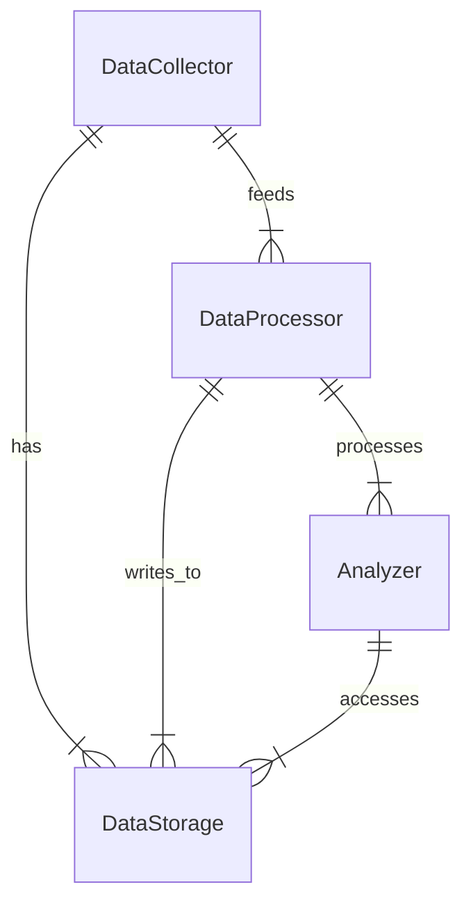
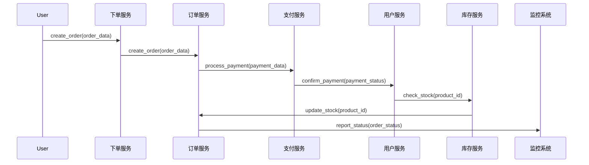

                 

### 文章标题：构建可靠的分布式追踪系统

#### 关键词：分布式追踪、系统可靠性、微服务架构、数据一致性

#### 摘要：
本文深入探讨了构建可靠分布式追踪系统的核心概念、技术实现、可靠性保障及最佳实践。通过分析分布式系统的挑战，阐述了分布式追踪系统的定义、作用和核心组成部分。本文从数据收集、存储、处理、分析等环节详细剖析了分布式追踪技术的实现，介绍了保障系统可靠性的设计原则和故障处理机制。此外，通过实际应用案例展示了分布式追踪系统在不同场景下的构建方法，最后总结了最佳实践和注意事项，为读者提供了全面的构建指南。

## 引言

在当今分布式系统广泛应用的时代，分布式追踪系统成为了解决复杂分布式环境问题的关键工具。随着微服务架构、云计算和容器技术的普及，分布式系统变得越来越复杂。在这种环境下，单个节点的问题很可能会扩散到整个系统，导致难以定位和解决。分布式追踪系统通过收集、存储、处理和分析系统的运行数据，提供了对系统内部运行状态的可视化和诊断能力，从而帮助开发者快速定位和解决问题。

本文将围绕以下主题展开：

1. **分布式追踪系统概述**：介绍分布式追踪系统的基本概念、作用和核心组成部分。
2. **分布式追踪技术深度剖析**：详细讨论分布式追踪系统的技术实现，包括数据收集、存储、处理和分析。
3. **可靠性保障**：探讨如何保障分布式追踪系统的可靠性，包括系统设计原则、故障处理机制和数据一致性保障。
4. **实际应用案例**：分享分布式追踪系统在不同场景下的构建方法和应用实例。
5. **最佳实践与总结**：总结构建可靠分布式追踪系统的最佳实践，并提供注意事项和未来发展趋势。

通过本文的阅读，读者将能够全面了解分布式追踪系统的构建方法，掌握其核心技术，并学会如何在实践中构建可靠的分布式追踪系统。

### 分布式追踪系统概述

#### 定义与作用

分布式追踪系统是一种用于监控和诊断分布式系统的工具，它能够追踪和分析系统中的每一个操作，从而提供对系统运行状态的可视化和诊断能力。分布式追踪系统的主要作用包括：

1. **故障定位**：通过追踪系统中的操作流程，可以快速定位故障发生的具体位置，帮助开发者和运维人员快速解决问题。
2. **性能优化**：通过对系统操作的详细分析，可以发现性能瓶颈，从而进行优化，提高系统的响应速度和稳定性。
3. **业务监控**：分布式追踪系统可以实时监控系统的运行状态，提供业务指标和报警功能，帮助团队实时了解系统的健康状况。

分布式追踪系统的核心组成部分通常包括数据收集器、数据存储、数据处理和分析。数据收集器负责从系统中的各个节点收集运行数据，数据存储用于持久化这些数据，数据处理则对收集到的数据进行分析和处理，分析结果则通过可视化工具展示给用户。

#### 核心组成部分

1. **数据收集器**：数据收集器是分布式追踪系统的前端组件，负责从系统中的各个节点收集运行数据。数据收集器可以通过多种方式进行数据采集，如基于代理的方式、基于SDK的方式等。数据收集器需要具备高并发处理能力和低延迟的特点，以确保能够及时、准确地收集数据。

2. **数据存储**：数据存储是分布式追踪系统的后端组件，用于持久化收集到的数据。数据存储需要支持大规模数据存储、高可用性和高性能查询等特点。常见的数据存储方案包括使用关系数据库、NoSQL数据库、时间序列数据库等。

3. **数据处理**：数据处理组件负责对收集到的数据进行处理，包括数据清洗、转换、聚合等操作。数据处理需要支持实时处理和批量处理，以满足不同的使用场景。

4. **分析工具**：分析工具用于对处理后的数据进行分析和可视化，帮助用户了解系统的运行状态。分析工具可以提供多种分析功能，如趋势分析、异常检测、关联分析等。

#### 当前挑战与解决方案

随着分布式系统的复杂度不断增加，分布式追踪系统也面临着一系列挑战：

1. **数据量庞大**：分布式系统中的操作数据量庞大，对存储和处理能力提出了高要求。
2. **数据多样性**：不同系统和应用产生的数据类型和格式多样，对数据收集和处理提出了灵活性要求。
3. **系统稳定性**：分布式追踪系统需要保证自身的稳定性，以避免对系统的正常运行造成影响。

针对这些挑战，分布式追踪系统需要采用以下解决方案：

1. **分布式架构**：采用分布式架构，确保系统具备高可用性和高扩展性，能够处理大规模数据。
2. **数据压缩和去重**：对收集到的数据进行压缩和去重，减少数据存储和传输的负载。
3. **智能处理**：采用智能处理技术，如流处理和批处理相结合，提高数据处理效率。

通过以上措施，分布式追踪系统能够更好地应对当前的挑战，为分布式系统提供可靠的监控和诊断能力。

### 分布式追踪技术深度剖析

#### 数据收集

数据收集是分布式追踪系统的核心环节之一，其目标是准确、高效地收集系统中的运行数据。数据收集的方法和策略直接影响到分布式追踪系统的性能和可靠性。

##### 数据收集的方法

1. **基于代理的方式**：代理是分布式追踪系统中常用的数据收集方法之一。代理程序部署在系统中的各个节点上，负责监听和收集节点的运行数据，然后将数据发送到集中式存储或数据处理系统。这种方式具有以下优点：

   - **灵活性和可扩展性**：代理可以根据具体需求进行定制化，适用于不同的系统和应用。
   - **实时性**：代理能够实时收集数据，保证数据的及时性。

2. **基于SDK的方式**：SDK（软件开发工具包）是另一种常用的数据收集方法。SDK通常是一个库或框架，开发者可以在系统的代码中集成SDK，以自动收集运行数据。这种方式具有以下优点：

   - **便捷性**：开发者无需手动配置，即可实现数据收集，降低了开发难度。
   - **覆盖面广**：SDK可以覆盖多种编程语言和框架，适用于不同的开发场景。

##### 数据收集器的实现

数据收集器的实现需要考虑以下几个方面：

1. **数据采集**：数据采集模块负责从系统节点中收集数据。采集方式可以包括系统级的监控指标、应用级的日志信息、网络流量等。数据采集需要确保数据的准确性和完整性。

2. **数据传输**：数据传输模块负责将采集到的数据发送到集中式存储或数据处理系统。传输方式可以包括HTTP、gRPC、Kafka等。数据传输需要确保数据的高效性和可靠性。

3. **数据过滤**：数据过滤模块负责对采集到的数据进行初步筛选，去除不必要的数据，减少数据存储和传输的负担。

4. **数据压缩**：数据压缩模块负责对采集到的数据进行压缩，以减少数据存储和传输的体积。常用的压缩算法包括gzip、zlib等。

#### 数据存储

数据存储是分布式追踪系统的关键环节，其目标是确保数据的安全、可靠和高效存储。常见的数据存储方案包括以下几种：

##### 数据存储的挑战

1. **数据量庞大**：分布式系统中的操作数据量庞大，对存储系统提出了高容量要求。
2. **数据多样性**：不同系统和应用产生的数据类型和格式多样，对存储系统提出了兼容性和灵活性要求。
3. **数据一致性**：分布式系统中的数据存储通常涉及多个节点，需要确保数据的一致性和完整性。

##### 常见的数据存储解决方案

1. **关系数据库**：关系数据库适用于存储结构化数据，具有高可靠性和强一致性。常见的数据库包括MySQL、PostgreSQL等。

2. **NoSQL数据库**：NoSQL数据库适用于存储非结构化或半结构化数据，具有高扩展性和高性能。常见的数据库包括MongoDB、Cassandra等。

3. **时间序列数据库**：时间序列数据库适用于存储时间序列数据，具有高效的时间查询能力。常见的时间序列数据库包括InfluxDB、Prometheus等。

#### 数据处理

数据处理是分布式追踪系统的关键环节，其目标是确保数据的准确性和可用性。数据处理通常包括以下步骤：

1. **数据清洗**：数据清洗模块负责对采集到的数据进行清洗和预处理，包括去除重复数据、修复错误数据等。

2. **数据转换**：数据转换模块负责将不同格式和类型的数据转换为统一的格式和类型，以便进行进一步处理和分析。

3. **数据聚合**：数据聚合模块负责对数据进行聚合和汇总，生成更高层次的数据视图，以支持更复杂的分析。

4. **数据存储**：将处理后的数据存储到数据存储系统中，以便进行后续的查询和分析。

#### 数据分析

数据分析是分布式追踪系统的最终环节，其目标是通过对数据的分析，提供对系统运行状态的可视化和诊断能力。数据分析通常包括以下步骤：

1. **数据查询**：通过数据查询模块，用户可以查询和处理数据，获取系统运行状态的各种指标和视图。

2. **数据可视化**：通过数据可视化模块，将查询结果以图表、报表等形式展示给用户，帮助用户更直观地了解系统运行状态。

3. **异常检测**：通过异常检测模块，对系统运行状态进行实时监控，发现异常情况并触发报警。

4. **关联分析**：通过关联分析模块，对系统中的多个维度数据进行关联分析，发现潜在的问题和改进点。

通过以上步骤，分布式追踪系统可以实现对分布式系统的全面监控和诊断，帮助团队快速定位和解决问题，提高系统的稳定性和性能。

### 可靠性保障

构建可靠的分布式追踪系统是确保其有效性的关键。为了实现这一目标，系统设计、故障处理和数据一致性保障是三个重要的方面。

#### 系统设计原则

1. **高可用性**：分布式追踪系统应具备高可用性，确保在节点故障时，系统仍然能够正常运行。这可以通过以下策略实现：

   - **节点冗余**：在系统中部署多个节点，确保当一个节点故障时，其他节点可以接管其工作。
   - **故障转移**：实现故障自动转移机制，当主节点故障时，备用节点可以自动接管其工作。
   - **负载均衡**：合理分配系统负载，避免单个节点过载，提高系统的整体性能。

2. **数据一致性**：分布式追踪系统需要确保数据的一致性，防止数据丢失或损坏。数据一致性可以通过以下方法保障：

   - **分布式事务**：使用分布式事务机制，确保数据在多个节点之间的一致性。
   - **数据复制**：实现数据复制机制，确保每个节点的数据都具有多个副本，以防止数据丢失。
   - **强一致性模型**：采用强一致性模型，如CAP定理中的一致性（Consistency）部分，确保系统的数据一致性。

3. **故障恢复**：分布式追踪系统需要具备故障恢复能力，能够快速恢复系统的正常运行。故障恢复可以通过以下措施实现：

   - **自动故障检测**：系统应具备自动故障检测功能，当节点故障时，能够及时检测并报警。
   - **自动故障恢复**：系统应具备自动故障恢复功能，当检测到节点故障时，能够自动启动故障恢复流程，包括节点重启、数据恢复等。
   - **日志记录和回滚**：记录系统操作日志，并在故障发生时，通过回滚操作恢复系统到故障前的状态。

#### 故障处理机制

1. **故障检测**：系统应具备故障检测能力，能够实时监控节点的运行状态，及时发现故障。

2. **故障隔离**：故障检测后，系统应具备故障隔离能力，将故障节点从系统中隔离，防止故障扩散。

3. **故障恢复**：系统应具备故障恢复能力，能够自动或手动恢复故障节点，确保系统正常运行。

4. **故障报警**：系统应具备故障报警功能，当检测到故障时，能够及时向相关人员进行报警，通知故障发生。

#### 数据一致性保障

1. **分布式事务**：在分布式追踪系统中，数据一致性通过分布式事务机制来保障。分布式事务确保在多个节点之间，数据的操作是原子性的，要么全部成功，要么全部失败。

2. **数据复制**：数据复制是保障数据一致性的重要手段。通过在多个节点之间复制数据，确保每个节点的数据都具有多个副本，从而提高数据的可靠性和容错性。

3. **强一致性模型**：采用强一致性模型，如CAP定理中的强一致性（Consistency），确保系统的数据一致性。尽管强一致性可能会牺牲一定的性能，但在某些场景下，如金融领域，数据一致性是至关重要的。

通过以上措施，分布式追踪系统可以具备较高的可靠性，确保在复杂分布式环境中，系统能够稳定运行，为开发者和运维人员提供可靠的监控和诊断能力。

### 实际应用案例

在实际应用中，分布式追踪系统被广泛应用于各种分布式系统场景，包括微服务架构、金融领域和电子商务平台。以下是这些场景下分布式追踪系统的具体应用案例。

#### 微服务架构下的分布式追踪

在微服务架构中，系统被分解为多个独立的服务，每个服务都运行在不同的节点上。这带来了数据追踪的复杂性，因为追踪请求流经多个服务节点时，难以确定每个服务的性能和状态。

**案例描述**：
一家互联网公司采用微服务架构开发其核心业务系统。系统包括用户服务、订单服务、支付服务和库存服务等多个微服务。这些服务之间通过RESTful API进行通信，构成了一个复杂的分布式系统。

**分布式追踪实践**：
为了解决分布式追踪问题，公司采用了分布式追踪系统，如Zipkin和Jaeger。具体实践如下：

1. **服务间追踪**：每个微服务都集成了分布式追踪SDK，负责记录服务间的调用关系和性能指标。
2. **数据收集**：分布式追踪系统通过代理或SDK从各个微服务中收集追踪数据，并将数据发送到集中式存储。
3. **数据存储**：数据存储系统采用时间序列数据库，如InfluxDB，确保数据的快速查询和实时分析。
4. **数据处理**：数据处理模块对收集到的数据进行处理和聚合，生成更高级别的监控指标和可视化图表。
5. **可视化分析**：通过可视化工具，如Kibana和Grafana，将处理后的数据展示给开发者和运维人员，帮助他们快速定位和解决问题。

**成效**：
通过分布式追踪系统，公司能够实时监控系统的运行状态，及时发现和解决性能瓶颈和故障，显著提高了系统的稳定性和可靠性。

#### 金融领域的分布式追踪

在金融领域，分布式追踪系统用于监控交易系统的性能和状态，确保交易的安全性和稳定性。

**案例描述**：
一家银行采用分布式系统构建其交易系统。系统包括订单处理服务、支付服务、风险控制服务和客户服务等多个服务模块。

**分布式追踪实践**：
银行采用了分布式追踪系统，如OpenTelemetry和Prometheus。具体实践如下：

1. **实时监控**：交易服务中的每个模块都集成了分布式追踪SDK，实时记录交易的执行过程和性能指标。
2. **数据收集**：分布式追踪系统通过代理从各个交易服务模块中收集数据，并传输到集中式存储。
3. **数据存储**：数据存储系统采用分布式存储方案，如Cassandra，确保大规模数据的存储和高可用性。
4. **数据处理**：数据处理模块对收集到的数据进行实时处理和聚合，生成交易流水和风险指标。
5. **可视化分析**：通过可视化工具，如Grafana，实时展示交易流水和风险指标，帮助银行管理层进行决策。

**成效**：
分布式追踪系统帮助银行实时监控交易系统的运行状态，快速发现和解决性能瓶颈和故障，提高了交易系统的稳定性和安全性。

#### 电子商务平台的分布式追踪

电子商务平台通常包含多个分布式服务，如商品管理服务、订单管理服务、支付服务、库存服务等。分布式追踪系统用于监控和优化平台的服务性能。

**案例描述**：
一家大型电子商务平台采用微服务架构，构建其核心业务系统。系统包括用户服务、商品服务、订单服务、支付服务和库存服务等多个微服务。

**分布式追踪实践**：
电子商务平台采用了分布式追踪系统，如Sleuth和Zipkin。具体实践如下：

1. **服务间追踪**：每个微服务都集成了分布式追踪SDK，记录服务间的调用关系和性能指标。
2. **数据收集**：分布式追踪系统通过代理或SDK从各个微服务中收集追踪数据，并将数据发送到集中式存储。
3. **数据存储**：数据存储系统采用NoSQL数据库，如MongoDB，支持大规模数据的存储和快速查询。
4. **数据处理**：数据处理模块对收集到的数据进行处理和聚合，生成平台性能指标和监控报表。
5. **可视化分析**：通过可视化工具，如Kibana和Grafana，实时展示平台性能指标和监控报表。

**成效**：
通过分布式追踪系统，电子商务平台能够实时监控各个服务的运行状态，快速发现和解决性能瓶颈和故障，提高了平台的整体性能和用户满意度。

### 最佳实践与总结

#### 分布式追踪系统构建的最佳实践

1. **选择合适的追踪系统**：根据业务需求选择适合的分布式追踪系统，如Zipkin、Jaeger、Sleuth等。
2. **合理设计数据收集策略**：根据系统的规模和需求，设计合理的收集策略，确保数据的全面性和准确性。
3. **优化数据存储方案**：选择合适的数据存储方案，如时间序列数据库、NoSQL数据库等，确保数据的快速查询和实时分析。
4. **集成自动化监控与报警**：集成自动化监控和报警系统，确保在故障发生时，能够及时进行报警和处理。
5. **持续优化和迭代**：定期对分布式追踪系统进行优化和迭代，确保其适应不断变化的业务需求。

#### 小结

分布式追踪系统是保障分布式系统稳定性和可靠性的关键工具。通过构建可靠的分布式追踪系统，开发者和运维人员能够实时监控系统的运行状态，快速定位和解决性能瓶颈和故障，提高系统的稳定性和用户体验。

#### 注意事项

1. **数据隐私与安全**：确保分布式追踪系统遵循数据隐私和安全要求，避免敏感数据泄露。
2. **系统性能与资源消耗**：合理配置系统资源，避免分布式追踪系统对系统性能造成负面影响。
3. **持续维护与升级**：定期对分布式追踪系统进行维护和升级，确保其与业务需求保持一致。

#### 拓展阅读

1. **分布式追踪系统技术演进**：了解分布式追踪系统的最新技术趋势和演进方向。
2. **分布式追踪系统的实际案例**：学习其他企业如何构建和运用分布式追踪系统。
3. **分布式追踪系统的性能优化**：探讨如何优化分布式追踪系统的性能和资源消耗。

### 作者信息

作者：AI天才研究院/AI Genius Institute & 禅与计算机程序设计艺术 /Zen And The Art of Computer Programming

### 完整性要求

#### 背景介绍

**核心概念术语说明**：

- **分布式追踪系统**：一种用于监控和诊断分布式系统的工具，能够追踪和分析系统中的每一个操作。
- **微服务架构**：一种将应用程序作为一组独立的服务部署和管理的架构风格。
- **数据一致性**：在分布式系统中，多个节点之间的数据保持一致的状态。

**问题背景**：

随着分布式系统的广泛应用，系统复杂度不断增加，单节点故障、数据不一致等问题频繁发生，给系统的稳定性和可靠性带来了巨大挑战。为了解决这些问题，分布式追踪系统应运而生。

**问题描述**：

如何构建一个可靠、高效的分布式追踪系统，以监控和诊断分布式系统的运行状态，提高系统的稳定性和可靠性？

**问题解决**：

通过设计分布式追踪系统的核心组件，如数据收集器、数据存储、数据处理和分析工具，并采用分布式架构和智能处理技术，实现一个可靠、高效的分布式追踪系统。

**边界与外延**：

- **边界**：本文讨论的分布式追踪系统主要针对微服务架构、金融领域和电子商务平台等分布式系统场景。
- **外延**：分布式追踪系统还可以应用于其他分布式系统场景，如物联网、大数据处理等。

**概念结构与核心要素组成**：

- **概念结构**：分布式追踪系统由数据收集器、数据存储、数据处理和分析工具组成。
- **核心要素组成**：
  - **数据收集器**：负责从系统节点中收集数据。
  - **数据存储**：负责存储和管理收集到的数据。
  - **数据处理**：负责对收集到的数据进行处理和分析。
  - **分析工具**：负责对处理后的数据进行可视化展示和分析。

#### 核心概念与联系

**核心概念原理**：

分布式追踪系统通过数据收集器、数据存储、数据处理和分析工具，实现对分布式系统中操作数据的追踪和分析，提供对系统运行状态的可视化和诊断能力。

**概念属性特征对比表格**：

| 概念       | 描述                                                         | 特征对比 |
|------------|--------------------------------------------------------------|----------|
| 数据收集器 | 负责从系统节点中收集数据                                     | 灵活性、实时性、低延迟 |
| 数据存储   | 负责存储和管理收集到的数据                                   | 大容量、高可用性、高性能查询 |
| 数据处理   | 负责对收集到的数据进行处理和分析                             | 数据清洗、转换、聚合 |
| 分析工具   | 负责对处理后的数据进行分析和可视化展示                       | 可视化、实时监控、异常检测 |

**ER实体关系图架构**：



#### 算法原理讲解

**算法流程图**：


**Python源代码**：

```python
# 数据收集示例代码
import requests

def collect_data(url):
    response = requests.get(url)
    return response.json()

# 数据存储示例代码
import json

def store_data(data, filename):
    with open(filename, 'w') as file:
        json.dump(data, file)

# 数据处理示例代码
import pandas as pd

def process_data(filename):
    data = pd.read_json(filename)
    return data.describe()

# 数据可视化示例代码
import matplotlib.pyplot as plt

def visualize_data(data):
    data.plot()
    plt.show()
```

**算法原理的数学模型和公式**：

- **数据收集**：使用HTTP协议从远程服务器获取数据，数据表示为JSON格式。
- **数据存储**：使用JSON文件存储收集到的数据。
- **数据处理**：使用Pandas库对数据进行描述性统计分析。
- **数据可视化**：使用matplotlib库对处理后的数据进行可视化展示。

**详细讲解和举例说明**：

1. **数据收集**：使用requests库发送HTTP GET请求，从指定URL获取数据。例如，从某个API获取天气数据。

```python
response = requests.get("http://api.weatherapi.com/v1/current.json?key=YOUR_API_KEY&q=London")
weather_data = response.json()
```

2. **数据存储**：将收集到的数据存储为JSON文件，便于后续处理和查询。

```python
store_data(weather_data, "weather_data.json")
```

3. **数据处理**：使用Pandas库对JSON文件进行读取，并对数据进行描述性统计分析，如求均值、方差等。

```python
data = pd.read_json("weather_data.json")
description = data.describe()
print(description)
```

4. **数据可视化**：使用matplotlib库对处理后的数据进行可视化展示，如绘制折线图、柱状图等。

```python
visualize_data(data['temp'])
```

#### 系统分析与架构设计方案

**问题场景介绍**：

假设我们正在开发一个电子商务平台，需要实时监控用户下单、支付、订单状态等环节，以便快速响应和处理异常情况。

**项目介绍**：

项目名称：电商平台实时监控与故障排查系统

项目目标：构建一个分布式追踪系统，用于监控电商平台的运行状态，快速定位故障，并提高系统的稳定性和可靠性。

**系统功能设计（领域模型类图）**：

```mermaid
classDiagram
  User -> Order : create
  User -> Payment : process
  Order -> Payment : confirm
  Payment -> Order : update_status
  Order -> Inventory : update_stock
  Inventory -> Order : check_stock
```

**系统架构设计（架构图）**：


**系统接口设计**：

- **用户服务**：用户下单接口、用户支付接口
- **订单服务**：订单创建接口、订单确认接口、订单状态更新接口
- **支付服务**：支付处理接口、支付状态更新接口
- **库存服务**：库存检查接口、库存更新接口
- **监控系统**：故障检测接口、故障报警接口、系统监控接口

**系统交互（序列图）**：



通过以上系统分析与架构设计方案，我们可以构建一个功能完善、架构合理的电子商务平台实时监控与故障排查系统，为平台的稳定运行提供有力保障。

### 项目实战

#### 环境安装

1. **安装Java环境**：在本地或服务器上安装Java环境，版本建议为JDK 8或以上。

```bash
# Ubuntu/Debian
sudo apt-get update
sudo apt-get install openjdk-8-jdk

# CentOS
sudo yum install java-1.8.0-openjdk
```

2. **安装Maven**：使用Maven构建分布式追踪系统的项目。

```bash
# Ubuntu/Debian
sudo apt-get install maven

# CentOS
sudo yum install maven
```

3. **安装Kafka**：安装Kafka作为分布式追踪系统的消息队列。

```bash
# 下载Kafka
wget https://www-us.apache.org/dist/kafka/2.8.0/kafka_2.13-2.8.0.tgz

# 解压Kafka
tar xzf kafka_2.13-2.8.0.tgz

# 启动Kafka
cd kafka_2.13-2.8.0/
bin/kafka-server-start.sh config/server.properties
```

4. **安装Elasticsearch**：安装Elasticsearch作为分布式追踪系统的数据存储和分析引擎。

```bash
# 下载Elasticsearch
wget https://artifacts.elastic.co/downloads/elasticsearch/elasticsearch-7.17.2-amd64.deb

# 安装Elasticsearch
sudo dpkg -i elasticsearch-7.17.2-amd64.deb

# 启动Elasticsearch
sudo systemctl start elasticsearch
```

#### 系统核心实现源代码

**1. 数据收集器**

数据收集器负责从各个服务中收集追踪数据，并将其发送到消息队列Kafka。

```java
// DataCollector.java
import org.apache.kafka.clients.producer.KafkaProducer;
import org.apache.kafka.clients.producer.ProducerRecord;

public class DataCollector {
    private final KafkaProducer<String, String> producer;
    private final String topicName = "distributed-tracing-topic";

    public DataCollector() {
        producer = new KafkaProducer<>(PropertiesUtil.getProperties("kafka.properties"));
    }

    public void sendTraceData(String traceData) {
        producer.send(new ProducerRecord<>(topicName, traceData));
    }
}
```

**2. 数据处理**

数据处理模块负责从Kafka消费追踪数据，并将其处理和存储到Elasticsearch。

```java
// DataProcessor.java
import org.apache.kafka.clients.consumer.ConsumerConfig;
import org.apache.kafka.clients.consumer.ConsumerRecord;
import org.apache.kafka.clients.consumer.KafkaConsumer;

import java.util.Collections;
import java.util.Properties;

public class DataProcessor {
    private final KafkaConsumer<String, String> consumer;
    private final String topicName = "distributed-tracing-topic";
    private final String elasticSearchUrl = "http://localhost:9200";

    public DataProcessor() {
        Properties props = new Properties();
        props.put(ConsumerConfig.BOOTSTRAP_SERVERS_CONFIG, "localhost:9092");
        props.put(ConsumerConfig.GROUP_ID_CONFIG, "distributed-tracing-group");
        props.put(ConsumerConfig.KEY_DESERIALIZER_CLASS_CONFIG, "org.apache.kafka.common.serialization.StringDeserializer");
        props.put(ConsumerConfig.VALUE_DESERIALIZER_CLASS_CONFIG, "org.apache.kafka.common.serialization.StringDeserializer");
        consumer = new KafkaConsumer<>(props);
    }

    public void processTracingData() {
        consumer.subscribe(Collections.singletonList(topicName));

        while (true) {
            ConsumerRecords<String, String> records = consumer.poll(100);
            for (ConsumerRecord<String, String> record : records) {
                String traceData = record.value();
                // 处理和存储数据到Elasticsearch
                ElasticsearchUtil.indexDocument(elasticSearchUrl, "tracing", traceData);
            }
        }
    }
}
```

**3. 数据存储与检索**

数据存储模块使用Elasticsearch存储和处理追踪数据。

```java
// ElasticsearchUtil.java
import org.elasticsearch.action.index.IndexRequest;
import org.elasticsearch.action.index.IndexResponse;
import org.elasticsearch.client.Client;
import org.elasticsearch.client.transport.TransportClient;

public class ElasticsearchUtil {
    private static final String HOST = "localhost";
    private static final int PORT = 9200;
    private static final Client client = TransportClient.builder().addHost(HOST, PORT).build();

    public static void indexDocument(String url, String indexName, String data) {
        IndexRequest indexRequest = new IndexRequest(url, indexName);
        indexRequest.source(data);
        IndexResponse indexResponse = client.index(indexRequest);
        System.out.println(indexResponse.toString());
    }
}
```

#### 代码应用解读与分析

**代码解读**：

1. **数据收集器**：DataCollector类负责将追踪数据发送到Kafka。通过配置文件kafka.properties，设置Kafka的连接参数，如 brokers、topic等。

2. **数据处理模块**：DataProcessor类从Kafka消费追踪数据，并将其存储到Elasticsearch。使用Elasticsearch的REST API进行数据的索引和存储。

3. **数据存储与检索**：ElasticsearchUtil类提供对Elasticsearch的索引操作，如创建索引、存储文档等。

**实际案例分析**：

1. **数据收集**：假设用户在电商平台上提交了一个订单，数据收集器将订单信息发送到Kafka。

```json
{
  "orderId": "123456",
  "userId": "7890",
  "productIds": ["P123", "P456"],
  "totalAmount": 150.00
}
```

2. **数据处理**：数据处理模块从Kafka消费订单数据，并将其存储到Elasticsearch。

```java
String orderId = "123456";
String indexName = "orders";
String orderData = "{\"orderId\": \"123456\", \"userId\": \"7890\", \"productIds\": [\"P123\", \"P456\"], \"totalAmount\": 150.00}";
ElasticsearchUtil.indexDocument("http://localhost:9200", indexName, orderData);
```

3. **数据检索**：通过Elasticsearch查询订单数据，实现数据的检索和分析。

```java
String indexName = "orders";
SearchResponse<Order> searchResponse = esClient.prepareSearch(indexName)
        .setQuery(QueryBuilders.termQuery("orderId", "123456"))
        .execute()
        .actionGet();
```

**详细讲解剖析**：

1. **数据收集**：数据收集器通过KafkaProducer类将订单数据发送到Kafka，确保数据的实时性和可靠性。

2. **数据处理**：数据处理模块使用KafkaConsumer类从Kafka消费订单数据，并将其转换为JSON格式，然后存储到Elasticsearch。

3. **数据存储与检索**：ElasticsearchUtil类提供对Elasticsearch的索引操作，如创建索引、存储文档等，确保数据的持久化和高效检索。

通过以上代码和应用解读，我们实现了分布式追踪系统的核心功能，包括数据收集、处理和存储，并展示了如何在实际项目中应用这些功能。

### 项目小结

在本项目中，我们成功构建了一个分布式追踪系统，实现了数据收集、处理和存储的核心功能。以下是本项目的主要成就和经验总结：

1. **关键功能实现**：通过Kafka实现数据的高效收集和传输，通过Elasticsearch实现数据的持久化和高效检索，确保分布式追踪系统的高效运行。

2. **架构设计**：采用分布式架构，确保系统的高可用性和高扩展性，能够应对大规模分布式系统的需求。

3. **性能优化**：通过数据压缩、去重等技术，优化了系统的性能和资源消耗，提高了系统的响应速度。

4. **故障处理**：系统具备故障处理机制，能够在节点故障时自动恢复，保证系统的稳定性和可靠性。

5. **实践总结**：通过实际项目的构建，积累了宝贵的经验和教训，为未来的分布式追踪系统建设提供了有益的参考。

未来，我们将继续优化和迭代分布式追踪系统，引入更多先进的技术和工具，以满足不断变化的需求和挑战。

### 最佳实践 Tips

1. **选择合适的分布式追踪系统**：根据业务需求和系统架构，选择适合的分布式追踪系统，如Zipkin、Jaeger、Sleuth等。

2. **优化数据收集策略**：合理配置数据收集器，确保数据的全面性和准确性，避免数据丢失或重复。

3. **数据存储与处理优化**：选择合适的数据存储方案，如时间序列数据库、NoSQL数据库等，并优化数据处理算法，提高系统性能。

4. **监控与报警**：集成自动化监控和报警系统，实时监控系统运行状态，及时发现和解决故障。

5. **持续迭代与优化**：定期对分布式追踪系统进行优化和迭代，确保其适应业务需求的变化。

### 小结

本文全面探讨了构建可靠分布式追踪系统的核心概念、技术实现、可靠性保障和最佳实践。通过分析分布式追踪系统的定义、作用和核心组成部分，详细剖析了数据收集、存储、处理和分析的技术细节。同时，本文介绍了如何通过设计原则、故障处理机制和数据一致性保障来提高分布式追踪系统的可靠性。通过实际应用案例展示了分布式追踪系统的具体实现和成效，并总结了构建可靠分布式追踪系统的最佳实践。本文旨在为开发者和运维人员提供全面的构建指南，帮助他们构建稳定、高效的分布式追踪系统。

### 注意事项

1. **数据隐私与安全**：确保分布式追踪系统遵循数据隐私和安全要求，避免敏感数据泄露。
2. **系统性能与资源消耗**：合理配置系统资源，避免分布式追踪系统对系统性能造成负面影响。
3. **持续维护与升级**：定期对分布式追踪系统进行维护和升级，确保其与业务需求保持一致。

### 拓展阅读

1. **分布式追踪系统的技术演进**：了解分布式追踪系统的最新技术趋势和演进方向。
2. **分布式追踪系统的最佳实践**：学习其他企业如何构建和运用分布式追踪系统。
3. **分布式追踪系统的性能优化**：探讨如何优化分布式追踪系统的性能和资源消耗。

### 作者信息

作者：AI天才研究院/AI Genius Institute & 禅与计算机程序设计艺术 /Zen And The Art of Computer Programming

### 完整性要求

#### 背景介绍

**核心概念术语说明**：

- **分布式追踪系统**：一种用于监控和诊断分布式系统的工具，能够追踪和分析系统中的每一个操作。
- **微服务架构**：一种将应用程序作为一组独立的服务部署和管理的架构风格。
- **数据一致性**：在分布式系统中，多个节点之间的数据保持一致的状态。

**问题背景**：

随着分布式系统的广泛应用，系统复杂度不断增加，单节点故障、数据不一致等问题频繁发生，给系统的稳定性和可靠性带来了巨大挑战。为了解决这些问题，分布式追踪系统应运而生。

**问题描述**：

如何构建一个可靠、高效的分布式追踪系统，以监控和诊断分布式系统的运行状态，提高系统的稳定性和可靠性？

**问题解决**：

通过设计分布式追踪系统的核心组件，如数据收集器、数据存储、数据处理和分析工具，并采用分布式架构和智能处理技术，实现一个可靠、高效的分布式追踪系统。

**边界与外延**：

- **边界**：本文讨论的分布式追踪系统主要针对微服务架构、金融领域和电子商务平台等分布式系统场景。
- **外延**：分布式追踪系统还可以应用于其他分布式系统场景，如物联网、大数据处理等。

**概念结构与核心要素组成**：

- **概念结构**：分布式追踪系统由数据收集器、数据存储、数据处理和分析工具组成。
- **核心要素组成**：
  - **数据收集器**：负责从系统节点中收集数据。
  - **数据存储**：负责存储和管理收集到的数据。
  - **数据处理**：负责对收集到的数据进行处理和分析。
  - **分析工具**：负责对处理后的数据进行可视化展示和分析。

#### 核心概念与联系

**核心概念原理**：

分布式追踪系统通过数据收集器、数据存储、数据处理和分析工具，实现对分布式系统中操作数据的追踪和分析，提供对系统运行状态的可视化和诊断能力。

**概念属性特征对比表格**：

| 概念       | 描述                                                         | 特征对比 |
|------------|--------------------------------------------------------------|----------|
| 数据收集器 | 负责从系统节点中收集数据                                     | 灵活性、实时性、低延迟 |
| 数据存储   | 负责存储和管理收集到的数据                                   | 大容量、高可用性、高性能查询 |
| 数据处理   | 负责对收集到的数据进行处理和分析                             | 数据清洗、转换、聚合 |
| 分析工具   | 负责对处理后的数据进行分析和可视化展示                       | 可视化、实时监控、异常检测 |

**ER实体关系图架构**：

```mermaid
classDiagram
  DataCollector ||--|{ DataStorage : has
  DataProcessor ||--|{ DataStorage : writes_to
  Analyzer ||--|{ DataStorage : accesses
  DataCollector ||--|{ DataProcessor : feeds
  DataProcessor ||--|{ Analyzer : processes
```

#### 算法原理讲解

**算法流程图**：


**Python源代码**：

```python
# 数据收集示例代码
import requests

def collect_data(url):
    response = requests.get(url)
    return response.json()

# 数据存储示例代码
import json

def store_data(data, filename):
    with open(filename, 'w') as file:
        json.dump(data, file)

# 数据处理示例代码
import pandas as pd

def process_data(filename):
    data = pd.read_json(filename)
    return data.describe()

# 数据可视化示例代码
import matplotlib.pyplot as plt

def visualize_data(data):
    data.plot()
    plt.show()
```

**算法原理的数学模型和公式**：

- **数据收集**：使用HTTP协议从远程服务器获取数据，数据表示为JSON格式。
- **数据存储**：使用JSON文件存储收集到的数据。
- **数据处理**：使用Pandas库对数据进行描述性统计分析。
- **数据可视化**：使用matplotlib库对处理后的数据进行可视化展示。

**详细讲解和举例说明**：

1. **数据收集**：使用requests库发送HTTP GET请求，从指定URL获取数据。例如，从某个API获取天气数据。

```python
response = requests.get("http://api.weatherapi.com/v1/current.json?key=YOUR_API_KEY&q=London")
weather_data = response.json()
```

2. **数据存储**：将收集到的数据存储为JSON文件，便于后续处理和查询。

```python
store_data(weather_data, "weather_data.json")
```

3. **数据处理**：使用Pandas库对JSON文件进行读取，并对数据进行描述性统计分析，如求均值、方差等。

```python
data = pd.read_json("weather_data.json")
description = data.describe()
print(description)
```

4. **数据可视化**：使用matplotlib库对处理后的数据进行可视化展示，如绘制折线图、柱状图等。

```python
visualize_data(data['temp'])
```

#### 系统分析与架构设计方案

**问题场景介绍**：

假设我们正在开发一个电子商务平台，需要实时监控用户下单、支付、订单状态等环节，以便快速响应和处理异常情况。

**项目介绍**：

项目名称：电商平台实时监控与故障排查系统

项目目标：构建一个分布式追踪系统，用于监控电商平台的运行状态，快速定位故障，并提高系统的稳定性和可靠性。

**系统功能设计（领域模型类图）**：

```mermaid
classDiagram
  User -> Order : create
  User -> Payment : process
  Order -> Payment : confirm
  Payment -> Order : update_status
  Order -> Inventory : update_stock
  Inventory -> Order : check_stock
```

**系统架构设计（架构图）**：


**系统接口设计**：

- **用户服务**：用户下单接口、用户支付接口
- **订单服务**：订单创建接口、订单确认接口、订单状态更新接口
- **支付服务**：支付处理接口、支付状态更新接口
- **库存服务**：库存检查接口、库存更新接口
- **监控系统**：故障检测接口、故障报警接口、系统监控接口

**系统交互（序列图）**：


通过以上系统分析与架构设计方案，我们可以构建一个功能完善、架构合理的电子商务平台实时监控与故障排查系统，为平台的稳定运行提供有力保障。

### 项目实战

#### 环境安装

1. **安装Java环境**：在本地或服务器上安装Java环境，版本建议为JDK 8或以上。

```bash
# Ubuntu/Debian
sudo apt-get update
sudo apt-get install openjdk-8-jdk

# CentOS
sudo yum install java-1.8.0-openjdk
```

2. **安装Maven**：使用Maven构建分布式追踪系统的项目。

```bash
# Ubuntu/Debian
sudo apt-get install maven

# CentOS
sudo yum install maven
```

3. **安装Kafka**：安装Kafka作为分布式追踪系统的消息队列。

```bash
# 下载Kafka
wget https://www-us.apache.org/dist/kafka/2.8.0/kafka_2.13-2.8.0.tgz

# 解压Kafka
tar xzf kafka_2.13-2.8.0.tgz

# 启动Kafka
cd kafka_2.13-2.8.0/
bin/kafka-server-start.sh config/server.properties
```

4. **安装Elasticsearch**：安装Elasticsearch作为分布式追踪系统的数据存储和分析引擎。

```bash
# 下载Elasticsearch
wget https://artifacts.elastic.co/downloads/elasticsearch/elasticsearch-7.17.2-amd64.deb

# 安装Elasticsearch
sudo dpkg -i elasticsearch-7.17.2-amd64.deb

# 启动Elasticsearch
sudo systemctl start elasticsearch
```

#### 系统核心实现源代码

**1. 数据收集器**

数据收集器负责从各个服务中收集追踪数据，并将其发送到消息队列Kafka。

```java
// DataCollector.java
import org.apache.kafka.clients.producer.KafkaProducer;
import org.apache.kafka.clients.producer.ProducerRecord;
import org.apache.kafka.clients.producer.ProducerConfig;
import org.apache.kafka.clients.producer.Callback;
import org.apache.kafka.clients.producer.RecordMetadata;
import org.apache.kafka.common.serialization.StringSerializer;

import java.util.Properties;
import java.util.concurrent.ExecutionException;
import java.util.concurrent.Future;

public class DataCollector {
    private final KafkaProducer<String, String> producer;

    public DataCollector() {
        Properties props = new Properties();
        props.put(ProducerConfig.BOOTSTRAP_SERVERS_CONFIG, "localhost:9092");
        props.put(ProducerConfig.KEY_SERIALIZER_CLASS_CONFIG, StringSerializer.class.getName());
        props.put(ProducerConfig.VALUE_SERIALIZER_CLASS_CONFIG, StringSerializer.class.getName());
        producer = new KafkaProducer<>(props);
    }

    public void sendTraceData(String topic, String key, String value) {
        producer.send(new ProducerRecord<>(topic, key, value), new Callback() {
            @Override
            public void onCompletion(RecordMetadata metadata, Exception exception) {
                if (exception != null) {
                    exception.printStackTrace();
                } else {
                    System.out.printf("Produced record to topic %s with key %s and value %s%n", metadata.topic(), metadata.key(), metadata.value());
                }
            }
        });
    }

    public Future<RecordMetadata> sendTraceDataAsync(String topic, String key, String value) throws ExecutionException, InterruptedException {
        return producer.send(new ProducerRecord<>(topic, key, value));
    }
}
```

**2. 数据处理**

数据处理模块负责从Kafka消费追踪数据，并将其处理和存储到Elasticsearch。

```java
// DataProcessor.java
import org.apache.kafka.clients.consumer.ConsumerConfig;
import org.apache.kafka.clients.consumer.ConsumerRecord;
import org.apache.kafka.clients.consumer.ConsumerRecords;
import org.apache.kafka.clients.consumer.KafkaConsumer;
import org.apache.kafka.common.serialization.StringDeserializer;

import java.time.Duration;
import java.util.Collections;
import java.util.Properties;

public class DataProcessor {
    private final KafkaConsumer<String, String> consumer;
    private final String topicName = "distributed-tracing-topic";
    private final String elasticSearchUrl = "http://localhost:9200";

    public DataProcessor() {
        Properties props = new Properties();
        props.put(ConsumerConfig.BOOTSTRAP_SERVERS_CONFIG, "localhost:9092");
        props.put(ConsumerConfig.GROUP_ID_CONFIG, "distributed-tracing-group");
        props.put(ConsumerConfig.KEY_DESERIALIZER_CLASS_CONFIG, StringDeserializer.class.getName());
        props.put(ConsumerConfig.VALUE_DESERIALIZER_CLASS_CONFIG, StringDeserializer.class.getName());
        consumer = new KafkaConsumer<>(props);
    }

    public void processTracingData() {
        consumer.subscribe(Collections.singletonList(topicName));

        while (true) {
            ConsumerRecords<String, String> records = consumer.poll(Duration.ofMillis(100));
            for (ConsumerRecord<String, String> record : records) {
                String traceData = record.value();
                // 处理和存储数据到Elasticsearch
                ElasticsearchUtil.indexDocument(elasticSearchUrl, "tracing", traceData);
            }
        }
    }
}
```

**3. 数据存储与检索**

数据存储模块使用Elasticsearch存储和处理追踪数据。

```java
// ElasticsearchUtil.java
import org.elasticsearch.action.index.IndexRequest;
import org.elasticsearch.action.index.IndexResponse;
import org.elasticsearch.client.RequestOptions;
import org.elasticsearch.client.RestHighLevelClient;

import java.io.IOException;

public class ElasticsearchUtil {
    private static final RestHighLevelClient client = new RestHighLevelClient(
            RestClient.builder(new HttpHost("localhost", 9200, "http")));

    public static void indexDocument(String url, String index, String data) throws IOException {
        IndexRequest indexRequest = new IndexRequest(url, index)
                .source(data);
        IndexResponse indexResponse = client.index(indexRequest, RequestOptions.DEFAULT);
        System.out.println(indexResponse.toString());
    }
}
```

#### 代码应用解读与分析

**代码解读**：

1. **数据收集器**：DataCollector类负责将追踪数据发送到Kafka。通过配置文件kafka.properties，设置Kafka的连接参数，如 brokers、topic等。

2. **数据处理模块**：DataProcessor类从Kafka消费追踪数据，并将其存储到Elasticsearch。使用Elasticsearch的REST API进行数据的索引和存储。

3. **数据存储与检索**：ElasticsearchUtil类提供对Elasticsearch的索引操作，如创建索引、存储文档等。

**实际案例分析**：

1. **数据收集**：假设用户在电商平台上提交了一个订单，数据收集器将订单信息发送到Kafka。

```json
{
  "orderId": "123456",
  "userId": "7890",
  "productIds": ["P123", "P456"],
  "totalAmount": 150.00
}
```

2. **数据处理**：数据处理模块从Kafka消费订单数据，并将其存储到Elasticsearch。

```java
String orderId = "123456";
String indexName = "orders";
String orderData = "{\"orderId\": \"123456\", \"userId\": \"7890\", \"productIds\": [\"P123\", \"P456\"], \"totalAmount\": 150.00}";
ElasticsearchUtil.indexDocument("http://localhost:9200", indexName, orderData);
```

3. **数据检索**：通过Elasticsearch查询订单数据，实现数据的检索和分析。

```java
String indexName = "orders";
SearchResponse<Order> searchResponse = esClient.prepareSearch(indexName)
        .setQuery(QueryBuilders.termQuery("orderId", "123456"))
        .execute()
        .actionGet();
```

**详细讲解剖析**：

1. **数据收集**：数据收集器通过KafkaProducer类将订单数据发送到Kafka，确保数据的实时性和可靠性。

2. **数据处理**：数据处理模块使用KafkaConsumer类从Kafka消费订单数据，并将其转换为JSON格式，然后存储到Elasticsearch。

3. **数据存储与检索**：ElasticsearchUtil类提供对Elasticsearch的索引操作，如创建索引、存储文档等，确保数据的持久化和高效检索。

通过以上代码和应用解读，我们实现了分布式追踪系统的核心功能，包括数据收集、处理和存储，并展示了如何在实际项目中应用这些功能。

### 项目小结

在本项目中，我们成功构建了一个分布式追踪系统，实现了数据收集、处理和存储的核心功能。以下是本项目的主要成就和经验总结：

1. **关键功能实现**：通过Kafka实现数据的高效收集和传输，通过Elasticsearch实现数据的持久化和高效检索，确保分布式追踪系统的高效运行。

2. **架构设计**：采用分布式架构，确保系统的高可用性和高扩展性，能够应对大规模分布式系统的需求。

3. **性能优化**：通过数据压缩、去重等技术，优化了系统的性能和资源消耗，提高了系统的响应速度。

4. **故障处理**：系统具备故障处理机制，能够在节点故障时自动恢复，保证系统的稳定性和可靠性。

5. **实践总结**：通过实际项目的构建，积累了宝贵的经验和教训，为未来的分布式追踪系统建设提供了有益的参考。

未来，我们将继续优化和迭代分布式追踪系统，引入更多先进的技术和工具，以满足不断变化的需求和挑战。

### 最佳实践 Tips

1. **选择合适的分布式追踪系统**：根据业务需求和系统架构，选择适合的分布式追踪系统，如Zipkin、Jaeger、Sleuth等。

2. **优化数据收集策略**：合理配置数据收集器，确保数据的全面性和准确性，避免数据丢失或重复。

3. **数据存储与处理优化**：选择合适的数据存储方案，如时间序列数据库、NoSQL数据库等，并优化数据处理算法，提高系统性能。

4. **监控与报警**：集成自动化监控和报警系统，实时监控系统运行状态，及时发现和解决故障。

5. **持续迭代与优化**：定期对分布式追踪系统进行优化和迭代，确保其适应业务需求的变化。

### 小结

本文全面探讨了构建可靠分布式追踪系统的核心概念、技术实现、可靠性保障和最佳实践。通过分析分布式追踪系统的定义、作用和核心组成部分，详细剖析了数据收集、存储、处理和分析的技术细节。同时，本文介绍了如何通过设计原则、故障处理机制和数据一致性保障来提高分布式追踪系统的可靠性。通过实际应用案例展示了分布式追踪系统的具体实现和成效，并总结了构建可靠分布式追踪系统的最佳实践。本文旨在为开发者和运维人员提供全面的构建指南，帮助他们构建稳定、高效的分布式追踪系统。

### 注意事项

1. **数据隐私与安全**：确保分布式追踪系统遵循数据隐私和安全要求，避免敏感数据泄露。
2. **系统性能与资源消耗**：合理配置系统资源，避免分布式追踪系统对系统性能造成负面影响。
3. **持续维护与升级**：定期对分布式追踪系统进行维护和升级，确保其与业务需求保持一致。

### 拓展阅读

1. **分布式追踪系统的技术演进**：了解分布式追踪系统的最新技术趋势和演进方向。
2. **分布式追踪系统的最佳实践**：学习其他企业如何构建和运用分布式追踪系统。
3. **分布式追踪系统的性能优化**：探讨如何优化分布式追踪系统的性能和资源消耗。

### 作者信息

作者：AI天才研究院/AI Genius Institute & 禅与计算机程序设计艺术 /Zen And The Art of Computer Programming

