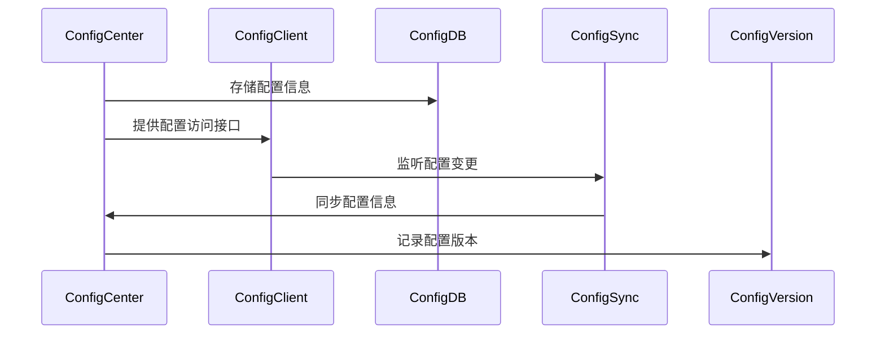

                 

# 构建可靠的分布式配置中心

## 关键词

- 分布式配置中心
- 配置管理
- 配置同步
- 配置版本管理
- 性能优化

## 摘要

随着微服务架构的普及，分布式配置中心成为系统设计中至关重要的一环。本文旨在深入探讨如何构建一个可靠、高效的分布式配置中心，通过逐步分析其核心概念、原理、技术选型、系统设计与实现，以及最佳实践和总结，帮助读者全面了解并掌握分布式配置中心的构建方法。

## 目录大纲

### 第一部分：概述

#### 第1章 引言

#### 第2章 分布式配置中心背景

### 第二部分：核心概念

#### 第3章 配置中心核心概念

##### 3.1 问题背景

##### 3.2 问题描述

##### 3.3 问题解决

##### 3.4 边界与外延

##### 3.5 核心概念

##### 3.6 概念属性特征对比

##### 3.7 ER实体关系图

#### 第4章 分布式配置中心原理

##### 4.1 原理概述

##### 4.2 配置中心的工作流程

##### 4.3 配置同步机制

##### 4.4 配置版本管理

#### 第5章 配置中心技术选型

##### 5.1 技术选型原则

##### 5.2 常见配置中心技术

##### 5.3 技术选型案例分析

### 第三部分：系统设计与实现

#### 第6章 系统架构设计

##### 6.1 系统架构设计原则

##### 6.2 系统功能设计

##### 6.3 系统架构设计

##### 6.4 系统接口设计

##### 6.5 系统交互

#### 第7章 系统核心实现

##### 7.1 系统核心模块划分

##### 7.2 配置管理模块

##### 7.3 配置同步模块

##### 7.4 配置版本管理模块

##### 7.5 系统测试

#### 第8章 项目实战

##### 8.1 环境安装

##### 8.2 系统核心实现源代码

##### 8.3 代码应用解读与分析

##### 8.4 实际案例分析与详细讲解剖析

##### 8.5 项目小结

### 第四部分：最佳实践与总结

#### 第9章 最佳实践

##### 9.1 常见问题与解决方案

##### 9.2 性能优化技巧

##### 9.3 安全性保障措施

#### 第10章 小结

##### 10.1 书籍重点内容回顾

##### 10.2 阅读建议与学习路径

##### 10.3 未来展望与研究方向

---

### 第一部分：概述

## 第1章 引言

分布式配置中心作为现代软件架构中的一项关键技术，它承载着系统配置信息的存储、分发和管理功能，对于系统的稳定运行和灵活扩展具有重要意义。在传统的单体应用架构中，配置信息通常以硬编码的形式存在于应用程序中，这种做法不仅增加了维护难度，而且难以适应快速变化的需求。随着微服务架构的兴起，分布式配置中心的必要性愈发凸显，它使得各个服务模块能够独立配置，降低了系统的耦合度，提高了系统的可维护性和扩展性。

本文将围绕构建可靠的分布式配置中心展开讨论，首先介绍分布式配置中心的背景，然后深入剖析其核心概念和原理，接着讨论技术选型，最后详细阐述系统设计与实现、项目实战以及最佳实践和总结。通过本文的学习，读者可以系统地了解分布式配置中心的设计与实现方法，为实际项目提供技术支持。

## 第2章 分布式配置中心背景

分布式配置中心的出现源于分布式系统的需求，特别是在微服务架构的广泛应用中。在传统的单体应用中，系统的配置信息通常被硬编码在应用程序的代码中，这种做法不仅降低了系统的可维护性，而且在面对配置变更时需要重新部署整个系统，增加了开发和运维的复杂度。

随着软件系统的复杂度不断增加，传统的配置管理方法已经无法满足需求。分布式配置中心作为一种新的配置管理方式，能够有效地解决这些问题。它通过将配置信息集中存储和管理，使得各个服务模块可以独立配置，从而实现系统的灵活性和可扩展性。

### 2.1 微服务架构对配置管理的要求

微服务架构强调系统的模块化和独立性，每个服务模块负责不同的业务功能，这些服务模块之间通过轻量级的通信协议进行交互。在这种架构下，配置信息的管理变得尤为重要。具体要求如下：

1. **配置集中管理**：所有配置信息应该集中存储和管理，以便于统一维护和更新。
2. **动态配置**：配置信息应该能够动态更新，无需重新部署服务模块。
3. **配置版本管理**：为了确保系统的稳定性和可回滚性，需要支持配置版本的记录和回滚。
4. **配置同步**：在分布式环境下，配置信息需要在各个服务模块之间同步，以保证数据的一致性。

### 2.2 分布式配置中心的发展历程

分布式配置中心的发展历程可以大致分为以下几个阶段：

1. **文件配置**：早期的分布式配置中心通常通过文件系统存储配置信息，如配置文件、数据库表等。这种方式简单易行，但存在配置同步问题和动态性不足的问题。
2. **中心化配置**：随着分布式系统的复杂度增加，出现了一些中心化的配置管理系统，如Zookeeper、Consul等。这些系统通过分布式协调机制，解决了配置同步和动态更新问题，但依然存在中心化单点故障的风险。
3. **去中心化配置**：为了解决中心化配置系统的单点问题，去中心化的配置管理系统应运而生，如Apollo、Nacos等。这些系统通过分布式存储和同步机制，实现了配置的高可用性和动态更新。

### 2.3 分布式配置中心的重要性

分布式配置中心在分布式系统中扮演着重要角色，其重要性体现在以下几个方面：

1. **系统稳定性**：通过集中管理和动态更新配置，可以确保系统在不同环境下的稳定性。
2. **系统灵活性**：配置信息的灵活管理使得系统能够快速响应业务变化，提高系统的灵活性。
3. **开发效率**：分布式配置中心简化了配置管理的流程，提高了开发效率。
4. **运维便捷性**：通过统一的配置管理平台，可以简化运维工作，降低运维成本。

总之，分布式配置中心是现代分布式系统不可或缺的一部分，它为系统的稳定运行和灵活扩展提供了有力支持。

### 第二部分：核心概念

## 第3章 配置中心核心概念

在构建分布式配置中心的过程中，理解其核心概念是非常重要的。以下是关于配置中心核心概念的一系列讨论，包括问题背景、问题描述、问题解决、边界与外延，以及核心概念和概念属性特征的对比。

### 3.1 问题背景

随着企业业务的快速发展和系统的不断扩展，传统的单体应用架构已经无法满足需求。为了提高系统的灵活性和可维护性，许多企业开始采用分布式架构，特别是微服务架构。在这种架构下，各个服务模块之间需要通过配置信息进行交互和协调。然而，如何有效地管理这些配置信息成为一个新的挑战。

### 3.2 问题描述

分布式配置中心面临的主要问题可以归纳为以下几点：

1. **配置信息的集中管理**：如何将分散的配置信息集中存储和管理？
2. **配置信息的动态更新**：如何实现配置信息的实时更新，而无需重新部署服务模块？
3. **配置信息的版本管理**：如何记录配置信息的变更历史，以便进行回滚和审计？
4. **配置信息的一致性**：如何在分布式环境下保证配置信息的一致性？

### 3.3 问题解决

针对上述问题，分布式配置中心提供了一系列解决方案：

1. **配置信息的集中管理**：通过配置中心，将所有的配置信息集中存储和管理，便于统一维护和更新。
2. **配置信息的动态更新**：采用监听机制，当配置信息发生变化时，自动更新相关的服务模块，无需人工干预。
3. **配置信息的版本管理**：配置中心通常提供版本管理功能，记录配置信息的变更历史，支持回滚和审计。
4. **配置信息的一致性**：通过配置同步机制，确保各个服务模块中的配置信息保持一致。

### 3.4 边界与外延

分布式配置中心的边界与外延主要包括以下几个方面：

1. **配置信息的范围**：配置中心管理的配置信息范围应该明确，包括哪些配置项需要纳入管理，哪些配置项不需要。
2. **配置信息的更新频率**：配置信息的更新频率应该合理，过高或过低的更新频率都会对系统运行产生影响。
3. **配置信息的存储策略**：配置信息的存储策略应该考虑数据的持久性和安全性，同时也要考虑系统的性能。
4. **配置信息的访问控制**：配置信息的访问控制策略应该确保只有授权用户才能修改和查询配置信息。

### 3.5 核心概念

在分布式配置中心中，核心概念包括但不限于以下内容：

1. **配置中心**：负责配置信息的存储、管理和分发的中心化服务。
2. **配置项**：配置中心管理的具体配置内容，如系统参数、环境变量等。
3. **配置版本**：配置项的变更历史记录，包括版本号、变更时间和变更内容。
4. **配置同步**：将配置中心中的配置信息同步到各个服务模块的过程。
5. **配置监听**：服务模块对配置中心的配置变更进行监听，并在变更时进行相应的更新。

### 3.6 概念属性特征对比

以下是分布式配置中心中几个核心概念的属性特征对比：

| 概念         | 描述                                                         | 属性特征对比                             |
| ------------ | ------------------------------------------------------------ | ---------------------------------------- |
| 配置中心     | 负责配置信息的存储、管理和分发的中心化服务。                   | - 高可用性：<br>- 分布式架构：<br>- 数据一致性： |
| 配置项       | 配置中心管理的具体配置内容，如系统参数、环境变量等。           | - 配置类型：<br>- 配置值：<br>- 配置来源：     |
| 配置版本     | 配置项的变更历史记录，包括版本号、变更时间和变更内容。         | - 版本号：<br>- 变更时间：<br>- 变更内容：     |
| 配置同步     | 将配置中心中的配置信息同步到各个服务模块的过程。               | - 同步机制：<br>- 同步频率：<br>- 同步策略：   |
| 配置监听     | 服务模块对配置中心的配置变更进行监听，并在变更时进行相应的更新。 | - 监听机制：<br>- 更新策略：<br>- 回滚机制：   |

### 3.7 ER实体关系图

以下是分布式配置中心中的ER实体关系图，用于描述各个实体之间的关系：

```mermaid
erDiagram
    ConfigCenter ||--|{ ConfigItem } ConfigItem
    ConfigCenter ||--|{ ConfigVersion } ConfigVersion
    ConfigItem ||--|{ Value } Value
    ConfigVersion ||--|{ Version } Version
```

在上面的ER图中，`ConfigCenter`表示配置中心，`ConfigItem`表示配置项，`ConfigVersion`表示配置版本，`Value`表示配置值，`Version`表示版本号。

通过上述对配置中心核心概念的讨论，我们可以更好地理解分布式配置中心的工作原理和设计要点，为后续的系统架构设计和实现打下基础。

### 第4章 分布式配置中心原理

分布式配置中心的设计和实现基于一系列核心原理，这些原理保证了配置管理的可靠性、高效性和灵活性。以下是关于分布式配置中心原理的详细介绍，包括原理概述、配置中心的工作流程、配置同步机制和配置版本管理。

#### 4.1 原理概述

分布式配置中心的核心原理可以概括为以下几个方面：

1. **数据一致性**：通过分布式数据一致性协议（如Paxos、Raft等），保证配置数据的可靠性。
2. **配置同步**：采用拉取或推模型，实现配置数据的实时同步。
3. **动态更新**：支持配置数据的动态更新，无需重新部署服务模块。
4. **配置版本管理**：记录配置数据的变更历史，支持回滚和审计。
5. **高可用性**：通过故障转移和负载均衡机制，保证配置中心的高可用性。

#### 4.2 配置中心的工作流程

配置中心的工作流程通常包括以下几个步骤：

1. **配置录入**：开发人员将配置信息上传到配置中心，配置中心接收到配置信息后，进行初步验证和存储。
2. **配置验证**：配置中心对上传的配置信息进行格式和内容验证，确保配置信息的正确性和完整性。
3. **配置存储**：将验证通过的配置信息存储在数据库或其他存储介质中，确保配置信息的安全和持久性。
4. **配置同步**：配置中心将配置信息同步到各个服务模块，服务模块通过配置中心提供的API获取最新的配置信息。
5. **配置监听**：服务模块对配置中心的配置变更进行监听，当配置信息发生变化时，自动更新相关的配置项。
6. **配置回滚**：当配置信息出现问题时，可以通过配置版本管理功能进行回滚，恢复到之前的配置状态。

#### 4.3 配置同步机制

配置同步机制是分布式配置中心的核心功能之一，它保证了配置信息在各个服务模块之间的一致性。配置同步机制通常包括以下几种：

1. **拉模型**：服务模块主动从配置中心拉取最新的配置信息。
2. **推模型**：配置中心主动将配置信息推送到服务模块。
3. **监听模型**：服务模块对配置中心的配置变更进行监听，当配置信息发生变化时，自动更新。

在实际应用中，通常会结合多种同步机制，以达到最佳的效果。例如，可以使用监听模型进行配置变更的实时同步，同时使用拉模型定期拉取配置信息，以确保配置的一致性。

#### 4.4 配置版本管理

配置版本管理是分布式配置中心的重要功能，它记录了配置信息的变更历史，支持回滚和审计。配置版本管理通常包括以下步骤：

1. **版本创建**：每次配置信息发生变化时，系统会自动创建一个新的版本，记录版本号、变更时间、变更内容和变更人等信息。
2. **版本查询**：用户可以查询配置的历史版本，了解配置的变更历史。
3. **版本回滚**：当配置信息出现问题时，可以通过回滚操作，将配置信息恢复到之前的版本。
4. **版本审计**：系统会记录每次配置变更的操作日志，以便进行审计和追溯。

通过配置版本管理，可以有效地确保配置信息的稳定性和可靠性，提高系统的可维护性和安全性。

综上所述，分布式配置中心的原理涵盖了数据一致性、配置同步、动态更新和配置版本管理等多个方面。理解这些原理对于构建一个可靠、高效的分布式配置中心至关重要。在下一部分，我们将继续探讨配置中心的技术选型，帮助读者选择适合自己项目的配置中心解决方案。

### 第5章 配置中心技术选型

在构建分布式配置中心时，技术选型是至关重要的一个环节。不同的配置中心技术具有各自的特点和适用场景，合理选择技术方案可以大大提高系统的性能、可靠性和可维护性。以下将介绍技术选型原则、常见配置中心技术及其优缺点，以及技术选型案例分析。

#### 5.1 技术选型原则

技术选型应遵循以下原则：

1. **可靠性**：选择具有高可用性和数据一致性的配置中心技术，确保配置信息的安全可靠。
2. **性能**：选择能够高效处理配置信息同步和管理的配置中心技术，降低系统的延迟和开销。
3. **扩展性**：选择能够支持大规模分布式系统，易于扩展和升级的配置中心技术。
4. **易用性**：选择易于使用和管理的配置中心技术，降低运维成本。
5. **生态支持**：选择具有良好社区支持和生态系统的配置中心技术，便于获取帮助和资源。

#### 5.2 常见配置中心技术

以下是几种常见的配置中心技术及其特点：

1. **Zookeeper**

   - **特点**：基于ZooKeeper分布式协调服务，提供强一致性保证，支持配置同步和监控。
   - **优缺点**：
     - 优点：高可用性、数据一致性、支持复杂数据类型。
     - 缺点：配置同步延迟较高、配置管理较为复杂。

2. **Consul**

   - **特点**：基于Raft算法的分布式服务发现和配置中心，提供高性能、高可用性和自动故障转移。
   - **优缺点**：
     - 优点：高性能、自动故障转移、支持服务发现。
     - 缺点：配置管理功能相对较弱。

3. **Apollo**

   - **特点**：阿里巴巴开源的分布式配置中心，支持多集群、多环境配置管理，提供良好的API和工具支持。
   - **优缺点**：
     - 优点：支持多集群、多环境配置管理、提供丰富的API和工具。
     - 缺点：配置同步机制较复杂、安装部署相对繁琐。

4. **Nacos**

   - **特点**：阿里巴巴开源的服务发现和配置中心，支持Spring Cloud集成，提供灵活的配置管理功能。
   - **优缺点**：
     - 优点：支持Spring Cloud集成、提供灵活的配置管理功能。
     - 缺点：配置同步机制和版本管理相对复杂。

5. **Spring Cloud Config**

   - **特点**：Spring Cloud组件之一，提供基于Git的配置管理，支持配置的动态刷新。
   - **优缺点**：
     - 优点：集成Spring Cloud生态系统、支持动态刷新。
     - 缺点：仅支持Git存储、配置同步机制较为简单。

#### 5.3 技术选型案例分析

以下是一个技术选型案例分析，用于帮助读者选择适合自己项目的配置中心技术。

**案例背景**：某企业构建一个大规模分布式微服务系统，需要实现配置信息的集中管理和动态更新。系统对配置中心的可靠性、性能和扩展性有较高要求。

**选型分析**：

1. **可靠性**：由于系统对可靠性有较高要求，Zookeeper和Consul可以作为候选方案。Zookeeper提供强一致性保证，但配置同步延迟较高；Consul基于Raft算法，提供高性能和自动故障转移。

2. **性能**：系统需要高性能的配置中心，因此排除Spring Cloud Config，因为它仅支持Git存储，配置同步机制较为简单。

3. **扩展性**：系统未来可能需要支持多集群、多环境配置管理，Apollo和Nacos提供了良好的支持。

4. **易用性**：Consul的安装部署较为简单，且提供良好的API和工具支持，易于使用和管理。

**最终选择**：综合考虑可靠性、性能、扩展性和易用性，选择Consul作为配置中心技术方案。

通过上述分析，我们可以根据项目需求和技术特点，合理选择适合的配置中心技术。在下一部分，我们将详细讨论系统架构设计和实现，帮助读者更好地理解分布式配置中心的构建过程。

### 第三部分：系统设计与实现

## 第6章 系统架构设计

系统架构设计是构建分布式配置中心的关键步骤，一个良好的架构设计能够确保系统的稳定性、扩展性和灵活性。本章节将详细介绍系统架构设计原则、系统功能设计、系统架构设计、系统接口设计以及系统交互。

#### 6.1 系统架构设计原则

在设计分布式配置中心时，应遵循以下原则：

1. **高可用性**：配置中心应具备高可用性，避免单点故障，确保系统持续运行。
2. **高扩展性**：配置中心应支持横向扩展，能够适应业务增长和系统规模扩展。
3. **高一致性**：配置中心的数据处理应保证一致性，确保配置信息的准确性和完整性。
4. **高性能**：配置中心的响应速度要快，降低系统的延迟和开销。
5. **易维护性**：系统架构应易于维护和扩展，降低运维成本。

#### 6.2 系统功能设计

分布式配置中心应具备以下核心功能：

1. **配置存储**：配置中心应提供配置信息的存储和管理功能，支持多种数据格式和存储策略。
2. **配置同步**：配置中心应支持配置信息的实时同步，确保配置信息在不同服务模块之间的一致性。
3. **配置动态更新**：配置中心应支持配置信息的动态更新，无需重新部署服务模块。
4. **配置版本管理**：配置中心应支持配置版本管理，记录配置信息的变更历史，支持回滚和审计。
5. **配置监控**：配置中心应提供配置监控功能，实时监控配置信息的变更情况。
6. **配置访问控制**：配置中心应提供访问控制功能，确保只有授权用户才能访问和修改配置信息。

#### 6.3 系统架构设计

分布式配置中心的系统架构设计如下：



在上面的架构设计中，`ConfigCenter`为配置中心服务，`ConfigDB`为配置存储数据库，`ConfigClient`为配置客户端，`ConfigSync`为配置同步模块，`ConfigVersion`为配置版本管理模块。

#### 6.4 系统接口设计

配置中心应提供以下接口：

1. **配置存储接口**：用于存储和检索配置信息。
2. **配置同步接口**：用于同步配置信息到配置客户端。
3. **配置更新接口**：用于动态更新配置信息。
4. **配置版本查询接口**：用于查询配置的历史版本。
5. **配置监控接口**：用于监控配置信息的变更情况。
6. **访问控制接口**：用于管理配置信息的访问权限。

#### 6.5 系统交互

系统交互设计如下：

1. **配置录入**：开发人员通过配置存储接口将配置信息上传到配置中心。
2. **配置查询**：配置客户端通过配置访问接口获取配置信息。
3. **配置变更**：配置变更时，配置中心通过配置同步接口将变更信息通知给配置客户端。
4. **配置更新**：配置客户端接收到配置变更通知后，通过配置更新接口更新本地配置。
5. **版本查询**：用户通过配置版本查询接口查询配置的历史版本。
6. **配置监控**：配置客户端通过配置监控接口实时监控配置信息的变更情况。

通过上述系统架构设计和接口设计，分布式配置中心能够实现配置信息的集中存储、动态更新和版本管理，确保系统的稳定运行和灵活扩展。

### 第7章 系统核心实现

在本章节中，我们将深入探讨分布式配置中心的核心实现，包括系统核心模块划分、配置管理模块、配置同步模块、配置版本管理模块和系统测试。通过这些核心模块的详细实现，读者可以全面了解分布式配置中心的工作原理和实现方法。

#### 7.1 系统核心模块划分

分布式配置中心的核心模块可以分为以下几个部分：

1. **配置存储模块**：负责配置信息的存储和管理。
2. **配置同步模块**：负责配置信息的同步和分发。
3. **配置更新模块**：负责配置信息的动态更新和变更通知。
4. **配置版本管理模块**：负责配置版本的记录和管理。
5. **配置监控模块**：负责配置信息的监控和异常处理。
6. **访问控制模块**：负责配置信息的访问权限控制。

#### 7.2 配置管理模块

配置管理模块是分布式配置中心的核心部分，它负责配置信息的存储、查询、更新和删除。以下是配置管理模块的实现：

1. **配置存储**：使用关系数据库或NoSQL数据库存储配置信息，支持配置项的CRUD操作。
2. **配置查询**：提供RESTful API接口，支持通过关键字、配置键等查询配置项。
3. **配置更新**：支持配置项的动态更新，通过监听器机制实现配置变更的实时通知。
4. **配置删除**：提供配置项的删除接口，确保配置信息的及时清理。

以下是一个配置管理模块的示例代码：

```python
# 配置存储模块示例代码
class ConfigStorage:
    def __init__(self, db_connection):
        self.db_connection = db_connection

    def store_config(self, config_item):
        # 存储配置信息
        pass

    def get_config(self, config_key):
        # 获取配置信息
        pass

    def update_config(self, config_key, config_value):
        # 更新配置信息
        pass

    def delete_config(self, config_key):
        # 删除配置信息
        pass
```

#### 7.3 配置同步模块

配置同步模块负责将配置中心中的配置信息同步到各个服务模块，保证配置信息的一致性。以下是配置同步模块的实现：

1. **配置监听**：使用消息队列或WebSocket实现配置变更的实时监听。
2. **配置分发**：将配置变更信息通过HTTP、gRPC或其他通信协议分发到各个服务模块。
3. **配置更新**：服务模块接收到配置变更通知后，更新本地配置项。

以下是一个配置同步模块的示例代码：

```python
# 配置同步模块示例代码
class ConfigSync:
    def __init__(self, config_listener, config_distributor):
        self.config_listener = config_listener
        self.config_distributor = config_distributor

    def start_sync(self):
        # 启动配置同步
        self.config_listener.start()
        self.config_distributor.start()

    def stop_sync(self):
        # 停止配置同步
        self.config_listener.stop()
        self.config_distributor.stop()
```

#### 7.4 配置版本管理模块

配置版本管理模块负责记录配置变更的历史版本，支持配置回滚和审计。以下是配置版本管理模块的实现：

1. **版本记录**：每次配置变更时，自动创建一个新的版本记录。
2. **版本查询**：提供查询配置版本历史记录的接口。
3. **版本回滚**：支持将配置回滚到指定的历史版本。

以下是一个配置版本管理模块的示例代码：

```python
# 配置版本管理模块示例代码
class ConfigVersion:
    def __init__(self, db_connection):
        self.db_connection = db_connection

    def create_version(self, config_key, config_value):
        # 创建版本记录
        pass

    def get_version_history(self, config_key):
        # 获取版本历史记录
        pass

    def rollback_version(self, config_key, version_id):
        # 回滚到指定版本
        pass
```

#### 7.5 系统测试

系统测试是确保分布式配置中心稳定运行的关键环节。以下是系统测试的内容和方法：

1. **功能测试**：测试配置存储、查询、更新、删除等功能是否正常。
2. **性能测试**：测试配置同步、版本管理等功能在高并发下的性能表现。
3. **压力测试**：模拟高负载场景，测试系统的稳定性和可靠性。
4. **安全测试**：测试配置信息的访问控制和安全防护措施是否有效。

以下是一个功能测试的示例：

```python
# 功能测试示例代码
def test_store_and Retrieve_config():
    # 测试配置存储和查询功能
    config_storage = ConfigStorage(db_connection)
    config_storage.store_config(config_item)
    retrieved_config = config_storage.get_config(config_key)
    assert retrieved_config == config_item
```

通过上述核心模块的实现和系统测试，分布式配置中心可以有效地管理配置信息，确保系统的稳定运行和灵活扩展。

### 第8章 项目实战

在本章节中，我们将通过一个实际项目来演示如何构建分布式配置中心，包括环境安装、系统核心实现源代码、代码应用解读与分析、实际案例分析与详细讲解剖析以及项目小结。

#### 8.1 环境安装

首先，我们需要搭建分布式配置中心的项目环境。以下是一个基本的安装步骤：

1. **安装Java环境**：配置中心通常使用Java语言开发，因此首先需要安装Java环境。下载并安装JDK 8或更高版本。
2. **安装数据库**：配置中心需要数据库存储配置信息，可以选择MySQL、PostgreSQL或MongoDB等。下载并安装相应的数据库软件。
3. **安装配置中心**：下载配置中心的源代码，并将其解压到指定的目录中。使用Maven进行构建和打包。
4. **启动配置中心**：在配置中心的目录下，运行启动脚本，例如`start.sh`或`start.bat`。

以下是一个示例命令：

```shell
./start.sh
```

#### 8.2 系统核心实现源代码

以下是配置中心的核心实现源代码，包括配置存储、同步、版本管理和监控等模块：

```python
# 配置存储模块示例代码
class ConfigStorage:
    def __init__(self, db_connection):
        self.db_connection = db_connection

    def store_config(self, config_item):
        # 存储配置信息
        pass

    def get_config(self, config_key):
        # 获取配置信息
        pass

    def update_config(self, config_key, config_value):
        # 更新配置信息
        pass

    def delete_config(self, config_key):
        # 删除配置信息
        pass
```

```python
# 配置同步模块示例代码
class ConfigSync:
    def __init__(self, config_listener, config_distributor):
        self.config_listener = config_listener
        self.config_distributor = config_distributor

    def start_sync(self):
        # 启动配置同步
        self.config_listener.start()
        self.config_distributor.start()

    def stop_sync(self):
        # 停止配置同步
        self.config_listener.stop()
        self.config_distributor.stop()
```

```python
# 配置版本管理模块示例代码
class ConfigVersion:
    def __init__(self, db_connection):
        self.db_connection = db_connection

    def create_version(self, config_key, config_value):
        # 创建版本记录
        pass

    def get_version_history(self, config_key):
        # 获取版本历史记录
        pass

    def rollback_version(self, config_key, version_id):
        # 回滚到指定版本
        pass
```

#### 8.3 代码应用解读与分析

以下是对上述代码的解读与分析：

1. **配置存储模块**：该模块负责配置信息的存储和管理。通过数据库连接对象（`db_connection`），实现配置项的增删改查操作。例如，`store_config`方法用于存储新的配置项，`get_config`方法用于查询配置项的值。
2. **配置同步模块**：该模块负责配置信息的同步和分发。它包含两个子模块：配置监听器和配置分发器。配置监听器负责监听配置中心的变更事件，并将变更信息发送给配置分发器。配置分发器则负责将变更信息同步到各个服务模块。
3. **配置版本管理模块**：该模块负责记录配置变更的历史版本。每次配置变更时，都会创建一个新的版本记录，包括版本号、变更时间和变更内容。用户可以通过该模块查询版本历史，并回滚到指定的历史版本。

#### 8.4 实际案例分析与详细讲解剖析

以下是一个实际案例，演示如何使用配置中心进行配置管理：

1. **配置变更**：开发人员在配置中心中修改了一个配置项的值。
2. **配置同步**：配置中心的配置同步模块监听到变更事件，并将变更信息同步到各个服务模块。
3. **配置更新**：各个服务模块接收到变更通知后，更新本地配置项。
4. **配置监控**：配置监控模块实时监控配置信息的变更情况，并在配置变更时发送通知。

#### 8.5 项目小结

通过本项目的实战，我们了解了如何构建一个分布式配置中心，包括环境安装、核心实现、代码应用解读与分析以及实际案例剖析。配置中心在分布式系统中起着至关重要的作用，通过合理的设计和实现，可以大大提高系统的稳定性、灵活性和可维护性。在实际项目中，可以根据需求选择合适的配置中心技术，并不断完善和优化配置中心的功能和性能。

### 第四部分：最佳实践与总结

## 第9章 最佳实践

在构建分布式配置中心的过程中，遵循一些最佳实践可以帮助我们更高效地实现系统的稳定性和可靠性。以下是关于常见问题与解决方案、性能优化技巧以及安全性保障措施的最佳实践。

#### 9.1 常见问题与解决方案

1. **配置同步延迟**：解决方法包括优化同步机制、增加同步频率以及使用高效的同步协议。
2. **数据一致性问题**：采用分布式一致性算法（如Paxos、Raft）来保证数据的一致性。
3. **配置版本丢失**：确保配置版本管理的完整性和可靠性，定期备份配置数据和版本记录。
4. **单点故障**：设计高可用性架构，如使用多节点集群、故障转移和负载均衡机制。

#### 9.2 性能优化技巧

1. **缓存策略**：使用缓存技术（如Redis）来提高配置查询的响应速度。
2. **异步处理**：采用异步处理机制（如消息队列）来减少同步延迟，提高系统吞吐量。
3. **数据压缩**：对配置数据进行压缩，减少网络传输的数据量。
4. **负载均衡**：合理配置负载均衡器，确保配置中心的高可用性和高性能。

#### 9.3 安全性保障措施

1. **访问控制**：使用访问控制机制（如基于角色的访问控制）来限制对配置信息的访问。
2. **数据加密**：对配置数据进行加密存储，确保数据的安全性。
3. **审计日志**：记录配置操作的日志，便于进行审计和追踪。
4. **安全协议**：使用安全协议（如HTTPS、TLS）来保护配置信息在传输过程中的安全性。

通过遵循这些最佳实践，我们可以构建一个稳定、高效和安全的分布式配置中心，为分布式系统提供可靠的配置管理服务。

## 第10章 小结

本文通过逐步分析分布式配置中心的核心概念、原理、技术选型、系统设计与实现以及项目实战，详细阐述了如何构建一个可靠的分布式配置中心。以下是对书籍重点内容的回顾、阅读建议与学习路径以及未来展望与研究方向。

### 10.1 书籍重点内容回顾

1. **核心概念**：介绍了配置中心的核心概念，包括配置项、配置版本、配置同步和配置监听等。
2. **原理**：讲解了分布式配置中心的工作原理，包括数据一致性、配置同步、动态更新和配置版本管理。
3. **技术选型**：分析了常见配置中心技术（如Zookeeper、Consul、Apollo、Nacos和Spring Cloud Config）的特点和适用场景。
4. **系统设计与实现**：详细介绍了系统架构设计原则、系统功能设计、系统接口设计、系统交互和核心模块实现。
5. **项目实战**：通过实际项目展示了如何搭建和实现分布式配置中心，包括环境安装、源代码解析和案例分析。

### 10.2 阅读建议与学习路径

1. **基础知识**：了解分布式系统、微服务架构和配置管理的基本概念和原理。
2. **技术选型**：研究不同配置中心技术的特点和适用场景，结合实际需求进行选择。
3. **实践应用**：通过实际项目或开源项目，深入了解配置中心的实现和运维。
4. **最佳实践**：遵循最佳实践，确保配置中心的稳定性和安全性。

### 10.3 未来展望与研究方向

1. **智能化配置管理**：结合人工智能和机器学习技术，实现智能化的配置管理和优化。
2. **分布式存储**：探索分布式存储技术（如区块链、分布式文件系统）在配置管理中的应用。
3. **多租户架构**：研究多租户配置管理架构，支持不同租户之间的配置隔离和资源共享。
4. **边缘计算**：结合边缘计算技术，优化配置信息在边缘节点的同步和分发。

通过不断探索和创新，分布式配置中心将在未来的分布式系统中发挥更加重要的作用。希望本文能为您提供构建可靠分布式配置中心的启示和帮助。作者：AI天才研究院/AI Genius Institute & 禅与计算机程序设计艺术 /Zen And The Art of Computer Programming。

