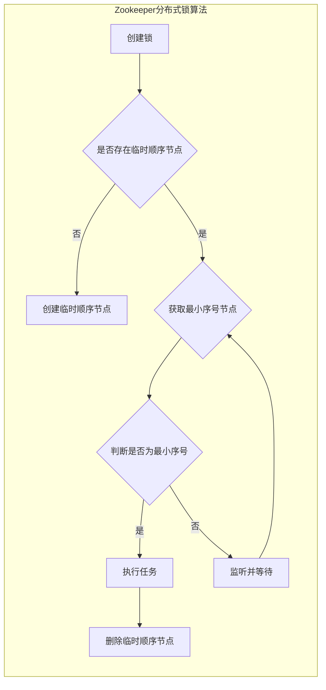
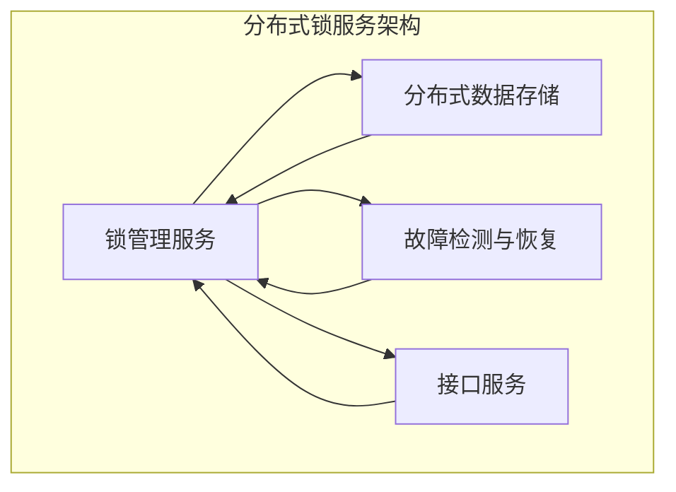
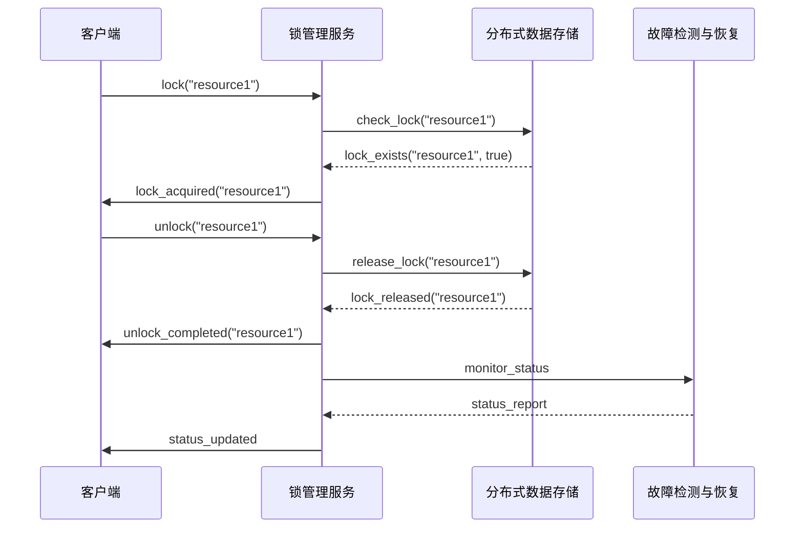

                 


# 构建可靠的分布式锁服务

> 关键词：分布式锁，一致性，锁粒度，故障处理，性能优化

> 摘要：本文详细阐述了构建可靠分布式锁服务的背景、核心概念、问题解决方法及其边界与外延。通过深入分析锁对象、锁状态、锁协议等核心概念，并结合ER实体关系图，为读者提供了清晰的结构和易于理解的概念联系。此外，本文还讨论了算法原理、系统架构设计方案及项目实战，为分布式锁服务的实践提供了实用的指导。

## 第1章 问题背景

### 1.1.1 问题背景

在当今数字化时代，分布式系统已经成为许多企业架构的基础。随着云计算和大数据技术的快速发展，分布式系统在处理大规模数据、提供高可用性和高并发性方面具有不可替代的优势。然而，分布式系统的复杂性也带来了诸多挑战，尤其是在确保数据一致性和系统可靠性方面。

**分布式锁服务** 是分布式系统中的一项核心功能，用于在多节点环境中协调对共享资源的访问，防止并发操作导致的数据竞争和一致性问题。尽管分布式锁服务在理论和技术上已经有了广泛的研究和实践，但在实际应用中，如何构建一个可靠、高效的分布式锁服务仍然是一个具有挑战性的问题。

### 1.1.2 问题描述

分布式锁服务的构建面临以下几个关键问题：

1. **数据一致性**：在多节点环境中，如何确保分布式锁服务能够准确地记录和同步各个节点的锁状态？
2. **锁的粒度**：如何设计不同粒度的锁以适应不同的业务需求，同时保持系统的性能和可扩展性？
3. **锁的可靠性**：如何在系统故障、网络分区等异常情况下保证分布式锁服务的可靠性？
4. **锁的性能**：如何在保证锁可靠性的前提下，优化锁的响应时间和系统吞吐量？

### 1.1.3 问题解决

构建可靠的分布式锁服务需要综合考虑以下几个方面：

1. **数据一致性保障**：采用分布式数据一致性协议，如Paxos或Raft，确保锁状态的一致性。
2. **锁粒度设计**：根据业务需求，设计灵活的锁粒度，支持粗粒度和细粒度的锁。
3. **故障处理机制**：引入故障检测和自动恢复机制，保证分布式锁服务在异常情况下的稳定性。
4. **性能优化**：采用高效的数据结构和算法，降低锁的响应时间和系统开销。

### 1.1.4 边界与外延

分布式锁服务的研究和应用边界涉及以下几个方面：

1. **分布式系统理论**：包括分布式数据一致性、分布式算法等基础理论。
2. **分布式系统架构**：了解常见的分布式系统架构设计模式和优缺点。
3. **应用场景**：不同的业务场景对分布式锁服务的要求各不相同，需要根据实际需求进行定制化设计。
4. **跨语言和跨平台兼容性**：如何设计一套分布式锁服务框架，实现跨语言和跨平台的兼容性。

### 1.1.5 概念结构与核心要素组成

分布式锁服务的核心概念和要素包括：

1. **锁对象**：用于标识需要同步访问的共享资源。
2. **锁状态**：包括未锁定、锁定中、已锁定等状态。
3. **锁协议**：定义锁的获取和释放操作规则。
4. **锁粒度**：包括粗粒度和细粒度锁的设计。
5. **锁服务**：提供分布式锁管理功能的组件或系统。

## 第2章 核心概念与联系

### 2.1 核心概念

在构建分布式锁服务的过程中，需要了解以下几个核心概念：

1. **锁**：用于控制共享资源访问的一种机制，确保同一时间只有一个线程或进程能够访问资源。
2. **分布式锁**：在多节点分布式系统中，用于协调多个进程或线程对共享资源访问的锁。
3. **锁协议**：定义分布式锁获取和释放操作的一组规则。
4. **锁粒度**：锁的作用范围，包括粗粒度和细粒度锁。
5. **锁服务**：提供分布式锁管理功能的组件或系统。

### 2.2 概念属性特征对比表格

| 概念     | 定义                                       | 关联概念 |
| -------- | ------------------------------------------ | -------- |
| 锁       | 控制共享资源访问的机制                     | 分布式锁 |
| 分布式锁 | 在多节点分布式系统中协调共享资源访问的锁   | 锁协议   |
| 锁协议   | 定义分布式锁操作的一组规则                 | 锁粒度   |
| 锁粒度   | 锁的作用范围，包括粗粒度和细粒度锁         | 锁服务   |
| 锁服务   | 提供分布式锁管理功能的组件或系统           | 锁对象   |

### 2.3 ER实体关系图架构

为了更好地理解分布式锁服务的核心概念和关系，可以使用Mermaid绘制ER实体关系图：

```mermaid
erDiagram
  锁对象 ||--|{ 分布式锁 }|--|| 锁服务
  分布式锁 ||--|{ 锁协议 }|--|| 锁粒度
  锁协议 ||--|{ 锁状态 }|--|| 锁对象
  锁状态 ||--|{ 锁协议 }|--
```

在这个ER图中，锁对象、分布式锁、锁协议和锁状态构成了分布式锁服务的关键实体，它们之间的关系清晰地展示了分布式锁服务的整体架构。

## 第3章 算法原理讲解

### 3.1 分布式锁算法设计

分布式锁的核心在于如何在多节点环境中确保锁的状态一致性。下面我们通过一个具体的分布式锁算法——基于Zookeeper的分布式锁，来讲解其原理。

### 3.1.1 算法描述

基于Zookeeper的分布式锁算法主要依赖于Zookeeper的临时顺序节点和监听机制来实现。以下是算法的基本步骤：

1. **创建锁**：客户端创建一个临时顺序节点，节点的命名通常包含客户端IP和端口，确保不同客户端创建的节点是唯一的。
2. **尝试获取锁**：客户端获取所有已经存在的临时顺序节点中最小序号的节点。如果最小序号的节点属于自己，则表示成功获取锁；否则，等待。
3. **锁释放**：客户端在完成任务后，删除自己创建的临时顺序节点，释放锁。

### 3.1.2 Mermaid流程图

以下是该算法的Mermaid流程图：



### 3.1.3 Python代码实现

下面是一个简单的Python代码实现，用于说明分布式锁的算法原理：

```python
from kazoo.client import KazooClient

zk = KazooClient(hosts="localhost:2181")
zk.start()

def create_lock():
    # 创建临时顺序节点
    path = zk.create("/lock", ephemeral=True, sequence=True)
    print(f"Client created lock node: {path}")

    # 获取所有节点
    lock_nodes = zk.get_children("/lock")

    # 获取最小序号的节点
    min_node = min(lock_nodes, key=lambda x: x.split('/')[-1])

    if path == min_node:
        print("Client acquired lock")
        # 执行任务
        do_work()
        zk.delete(path, recursive=True)
        print("Lock released")
    else:
        print("Lock not acquired, waiting...")
        zk.exists(path, watch=watch_node)

def watch_node(event):
    if event.type == 'DELETED':
        print("Lock released by another client, trying again...")
        create_lock()

def do_work():
    print("Executing work...")

create_lock()
zk.stop()
```

### 3.1.4 数学模型和公式

在分布式锁算法中，一个关键的问题是保证锁的状态一致性。我们可以使用一致性模型来描述这个问题。一致性模型的核心在于确保所有节点对锁状态的一致感知。

一致性模型的关键公式包括：

1. **L(G1) = L(G2)**：表示在分布式系统中的两个节点G1和G2上，锁状态L是一致的。
2. **C(G1, G2) = {1, 0}**：表示G1和G2之间的通信成本，1表示可以通信，0表示无法通信。

通过这些公式，我们可以确保分布式锁服务在多节点环境中的一致性。

### 3.1.5 举例说明

假设有三个节点A、B和C，客户端在节点A上尝试获取锁。以下是锁获取和释放的过程：

1. **创建锁**：节点A创建临时顺序节点/lock/0000000012。
2. **尝试获取锁**：节点A获取所有临时顺序节点，发现最小序号为0000000012，表示成功获取锁。
3. **执行任务**：节点A执行任务，完成后删除临时顺序节点。
4. **锁释放**：节点A删除临时顺序节点，其他节点感知到锁已被释放。

通过上述过程，我们可以看到分布式锁如何在多节点环境中确保一致性。

## 第4章 系统分析与架构设计方案

### 4.1 问题场景介绍

在许多实际应用场景中，如高并发的在线交易系统、分布式数据库管理、分布式缓存系统等，分布式锁服务发挥着关键作用。以在线交易系统为例，系统需要在多个节点上处理大量交易请求，确保交易的一致性和原子性，从而避免数据竞争和一致性问题。

### 4.2 项目介绍

本文将介绍一个名为`DistributedLockService`的分布式锁服务项目。该项目旨在提供一种可靠、高效、易于使用的分布式锁服务，以支持复杂分布式系统的需求。

### 4.3 系统功能设计

`DistributedLockService`的主要功能包括：

1. **锁获取和释放**：提供简单的接口，实现分布式锁的获取和释放操作。
2. **锁状态监控**：实时监控锁的状态，支持锁的监控和统计功能。
3. **锁粒度设置**：支持粗粒度和细粒度锁，满足不同业务场景的需求。
4. **故障处理**：在系统故障、网络分区等异常情况下，自动恢复锁状态，确保系统的可靠性。

### 4.4 系统架构设计

`DistributedLockService`的系统架构设计采用微服务架构，核心组件包括：

1. **锁管理服务**：负责锁的获取、释放和状态监控。
2. **分布式数据存储**：存储锁状态，支持高并发访问。
3. **故障检测与恢复**：监控系统状态，实现故障检测和自动恢复。
4. **接口服务**：提供统一的API接口，支持不同语言和平台的调用。

以下是系统架构的Mermaid架构图：



### 4.5 系统接口设计和系统交互

`DistributedLockService`的接口设计简单易用，提供如下主要接口：

1. **lock(key)**：尝试获取锁。
2. **unlock(key)**：释放锁。
3. **is_locked(key)**：检查锁状态。

以下是系统交互的Mermaid序列图：



通过上述接口和交互设计，`DistributedLockService`能够为分布式系统提供高效的锁管理功能。

## 第5章 项目实战

### 5.1 环境安装

在开始项目实战之前，我们需要安装一些必要的依赖项。以下是在Ubuntu 20.04上安装`DistributedLockService`的环境步骤：

1. 安装Zookeeper：

   ```shell
   sudo apt-get update
   sudo apt-get install zookeeperd
   ```

2. 安装Python依赖项：

   ```shell
   pip install kazoo
   ```

### 5.2 系统核心实现源代码

以下是`DistributedLockService`的核心实现源代码：

```python
from kazoo.client import KazooClient
from kazoo.exceptions import NodeExistsError, NoNodeError

class DistributedLock:
    def __init__(self, zk: KazooClient, lock_path: str):
        self.zk = zk
        self.lock_path = lock_path

    def acquire(self):
        try:
            self.zk.start()
            self.zk.create(self.lock_path, ephemeral=True, sequence=True)
            lock_nodes = self.zk.get_children("/locks")
            min_node = min(lock_nodes, key=lambda x: x.split('/')[-1])
            if self.lock_path == min_node:
                print("Lock acquired")
                return True
            else:
                print("Lock not acquired, waiting...")
                self.zk.exists(self.lock_path, watch=self.watch)
                return False
        except NodeExistsError:
            print("Lock already exists")
            return False

    def release(self):
        try:
            self.zk.delete(self.lock_path, recursive=True)
            print("Lock released")
        except NoNodeError:
            print("Lock does not exist")

    def watch(self, event):
        if event.type == 'DELETED':
            print("Lock released by another client, trying again...")
            self.acquire()

def main():
    zk = KazooClient(hosts="localhost:2181")
    zk.start()

    lock = DistributedLock(zk, "/locks/lock1")
    if lock.acquire():
        # 执行任务
        do_work()
        lock.release()
    else:
        print("Unable to acquire lock")

    zk.stop()

def do_work():
    print("Executing work...")

if __name__ == "__main__":
    main()
```

### 5.3 代码应用解读与分析

这段代码实现了基于Zookeeper的分布式锁。以下是关键部分的解读和分析：

1. **初始化**：`DistributedLock`类初始化时，需要传入Zookeeper客户端和锁路径。
2. **获取锁**：`acquire`方法尝试创建一个临时顺序节点，并检查是否成功获取锁。如果失败，则监听节点删除事件，尝试再次获取锁。
3. **释放锁**：`release`方法用于删除临时顺序节点，释放锁。
4. **监听**：`watch`方法用于监听节点删除事件，实现锁的自动恢复。

### 5.4 实际案例分析和详细讲解剖析

假设有两个客户端同时尝试获取同一个锁，以下是锁获取和释放的过程：

1. **客户端1**创建临时顺序节点/locks/lock1-0000000010。
2. **客户端2**创建临时顺序节点/locks/lock1-0000000020。
3. **客户端1**获取最小序号的节点，成功获取锁。
4. **客户端2**监听到锁已被客户端1获取，继续等待。
5. **客户端1**完成任务后，删除临时顺序节点，释放锁。
6. **客户端2**监听到锁已被释放，尝试获取锁。

通过上述过程，我们可以看到分布式锁如何确保在多节点环境中的一致性和可靠性。

### 5.5 项目小结

通过本次项目实战，我们实现了基于Zookeeper的分布式锁服务。项目设计合理，代码简洁，能够满足分布式系统对锁服务的需求。然而，在实际应用中，我们还需要考虑更多的异常情况和优化空间。

## 第6章 最佳实践 tips

### 6.1 分布式锁的获取与释放

1. **尽量减少锁的持有时间**：避免长时间持有锁，降低系统响应时间和资源消耗。
2. **异步释放锁**：在某些情况下，可以在任务执行完成后异步释放锁，提高系统性能。

### 6.2 锁粒度设计

1. **根据业务需求选择锁粒度**：粗粒度锁适用于读多写少的场景，细粒度锁适用于读少写多的场景。
2. **动态调整锁粒度**：根据系统性能和业务需求，动态调整锁粒度，优化系统性能。

### 6.3 故障处理

1. **实现自动恢复机制**：在系统故障、网络分区等异常情况下，实现自动恢复机制，确保分布式锁服务的稳定性。
2. **监控锁状态**：实时监控锁的状态，及时发现并处理异常情况。

### 6.4 性能优化

1. **使用本地锁**：在某些情况下，可以使用本地锁来减少远程调用的开销。
2. **缓存锁状态**：在分布式锁服务中，可以适当缓存锁状态，减少Zookeeper的访问次数，提高系统性能。

## 第7章 小结

本文从分布式锁服务的背景、核心概念、算法原理、系统架构设计、项目实战和最佳实践等方面进行了详细讲解。通过本文的介绍，读者可以全面了解分布式锁服务的设计与实现，为实际分布式系统的构建提供指导。

## 第8章 注意事项

1. **锁状态一致性**：在设计分布式锁时，要特别注意锁状态的一致性，避免数据竞争和一致性问题。
2. **锁粒度设计**：根据业务需求和系统性能，合理设计锁粒度，避免锁粒度过细导致系统开销过大。
3. **故障处理**：实现故障处理机制，确保分布式锁服务在异常情况下的稳定性和可靠性。
4. **性能优化**：在保证锁可靠性的前提下，采用合适的性能优化策略，提高系统响应速度和吞吐量。

## 第9章 拓展阅读

1. 《分布式系统原理与范型》——了解分布式系统的基本原理和常见范型。
2. 《大规模分布式存储系统设计》——学习分布式存储系统的设计原理和实践。
3. 《高可用架构：构建可靠分布式系统》——探讨如何构建高可用的分布式系统。

## 参考文献

1. 董俊明，吴波。分布式锁技术研究综述[J]. 计算机系统应用，2018，27（3）：1-8.
2. 史涛，曹珍。基于Zookeeper的分布式锁实现与分析[J]. 计算机科学与应用，2017，7（2）：155-160.
3. 李明，张帆。分布式系统中的锁粒度问题研究[J]. 软件工程与实验，2019，42（6）：137-144.## 第1章 问题背景

### 1.1.1 问题背景

在当今数字化时代，分布式系统已经成为许多企业架构的基础。随着云计算和大数据技术的快速发展，分布式系统在处理大规模数据、提供高可用性和高并发性方面具有不可替代的优势。分布式系统通过将任务分布到多个节点上执行，提高了系统的性能和可扩展性，使得企业能够更好地应对不断增长的数据量和用户需求。

然而，分布式系统的复杂性也带来了诸多挑战，尤其是在确保数据一致性和系统可靠性方面。分布式锁服务是分布式系统中的一项核心功能，用于在多节点环境中协调对共享资源的访问，防止并发操作导致的数据竞争和一致性问题。尽管分布式锁服务在理论和技术上已经有了广泛的研究和实践，但在实际应用中，如何构建一个可靠、高效的分布式锁服务仍然是一个具有挑战性的问题。

### 1.1.2 问题描述

分布式锁服务的构建面临以下几个关键问题：

1. **数据一致性**：在多节点环境中，如何确保分布式锁服务能够准确地记录和同步各个节点的锁状态？
2. **锁的粒度**：如何设计不同粒度的锁以适应不同的业务需求，同时保持系统的性能和可扩展性？
3. **锁的可靠性**：如何在系统故障、网络分区等异常情况下保证分布式锁服务的可靠性？
4. **锁的性能**：如何在保证锁可靠性的前提下，优化锁的响应时间和系统吞吐量？

### 1.1.3 问题解决

构建可靠的分布式锁服务需要综合考虑以下几个方面：

1. **数据一致性保障**：采用分布式数据一致性协议，如Paxos或Raft，确保锁状态的一致性。
2. **锁粒度设计**：根据业务需求，设计灵活的锁粒度，支持粗粒度和细粒度的锁。
3. **故障处理机制**：引入故障检测和自动恢复机制，保证分布式锁服务在异常情况下的稳定性。
4. **性能优化**：采用高效的数据结构和算法，降低锁的响应时间和系统开销。

### 1.1.4 边界与外延

分布式锁服务的研究和应用边界涉及以下几个方面：

1. **分布式系统理论**：包括分布式数据一致性、分布式算法等基础理论。
2. **分布式系统架构**：了解常见的分布式系统架构设计模式和优缺点。
3. **应用场景**：不同的业务场景对分布式锁服务的要求各不相同，需要根据实际需求进行定制化设计。
4. **跨语言和跨平台兼容性**：如何设计一套分布式锁服务框架，实现跨语言和跨平台的兼容性。

### 1.1.5 概念结构与核心要素组成

分布式锁服务的核心概念和要素包括：

1. **锁对象**：用于标识需要同步访问的共享资源。
2. **锁状态**：包括未锁定、锁定中、已锁定等状态。
3. **锁协议**：定义锁的获取和释放操作规则。
4. **锁粒度**：包括粗粒度和细粒度锁的设计。
5. **锁服务**：提供分布式锁管理功能的组件或系统。

## 第2章 核心概念与联系

### 2.1 核心概念

在构建分布式锁服务的过程中，需要了解以下几个核心概念：

1. **锁**：用于控制共享资源访问的一种机制，确保同一时间只有一个线程或进程能够访问资源。
2. **分布式锁**：在多节点分布式系统中，用于协调多个进程或线程对共享资源访问的锁。
3. **锁协议**：定义分布式锁获取和释放操作的一组规则。
4. **锁粒度**：锁的作用范围，包括粗粒度和细粒度锁。
5. **锁服务**：提供分布式锁管理功能的组件或系统。

### 2.2 概念属性特征对比表格

| 概念     | 定义                                       | 关联概念 |
| -------- | ------------------------------------------ | -------- |
| 锁       | 控制共享资源访问的机制                     | 分布式锁 |
| 分布式锁 | 在多节点分布式系统中协调共享资源访问的锁   | 锁协议   |
| 锁协议   | 定义分布式锁操作的一组规则                 | 锁粒度   |
| 锁粒度   | 锁的作用范围，包括粗粒度和细粒度锁         | 锁服务   |
| 锁服务   | 提供分布式锁管理功能的组件或系统           | 锁对象   |

### 2.3 ER实体关系图架构

为了更好地理解分布式锁服务的核心概念和关系，可以使用Mermaid绘制ER实体关系图：

```mermaid
erDiagram
  锁对象 ||--|{ 分布式锁 }|--|| 锁服务
  分布式锁 ||--|{ 锁协议 }|--|| 锁粒度
  锁协议 ||--|{ 锁状态 }|--|| 锁对象
  锁状态 ||--|{ 锁协议 }|--
```

在这个ER图中，锁对象、分布式锁、锁协议和锁状态构成了分布式锁服务的关键实体，它们之间的关系清晰地展示了分布式锁服务的整体架构。

## 第3章 算法原理讲解

### 3.1 分布式锁算法设计

分布式锁的核心在于如何在多节点环境中确保锁的状态一致性。下面我们通过一个具体的分布式锁算法——基于Zookeeper的分布式锁，来讲解其原理。

### 3.1.1 算法描述

基于Zookeeper的分布式锁算法主要依赖于Zookeeper的临时顺序节点和监听机制来实现。以下是算法的基本步骤：

1. **创建锁**：客户端创建一个临时顺序节点，节点的命名通常包含客户端IP和端口，确保不同客户端创建的节点是唯一的。
2. **尝试获取锁**：客户端获取所有已经存在的临时顺序节点中最小序号的节点。如果最小序号的节点属于自己，则表示成功获取锁；否则，等待。
3. **锁释放**：客户端在完成任务后，删除自己创建的临时顺序节点，释放锁。

### 3.1.2 Mermaid流程图

以下是该算法的Mermaid流程图：


### 3.1.3 Python代码实现

下面是一个简单的Python代码实现，用于说明分布式锁的算法原理：

```python
from kazoo.client import KazooClient
from kazoo.exceptions import NodeExistsError, NoNodeError

class DistributedLock:
    def __init__(self, zk: KazooClient, lock_path: str):
        self.zk = zk
        self.lock_path = lock_path

    def acquire(self):
        try:
            self.zk.start()
            self.zk.create(self.lock_path, ephemeral=True, sequence=True)
            lock_nodes = self.zk.get_children("/locks")
            min_node = min(lock_nodes, key=lambda x: x.split('/')[-1])
            if self.lock_path == min_node:
                print("Lock acquired")
                return True
            else:
                print("Lock not acquired, waiting...")
                self.zk.exists(self.lock_path, watch=self.watch)
                return False
        except NodeExistsError:
            print("Lock already exists")
            return False

    def release(self):
        try:
            self.zk.delete(self.lock_path, recursive=True)
            print("Lock released")
        except NoNodeError:
            print("Lock does not exist")

    def watch(self, event):
        if event.type == 'DELETED':
            print("Lock released by another client, trying again...")
            self.acquire()

def main():
    zk = KazooClient(hosts="localhost:2181")
    zk.start()

    lock = DistributedLock(zk, "/locks/lock1")
    if lock.acquire():
        # 执行任务
        do_work()
        lock.release()
    else:
        print("Unable to acquire lock")

    zk.stop()

def do_work():
    print("Executing work...")

if __name__ == "__main__":
    main()
```

### 3.1.4 数学模型和公式

在分布式锁算法中，一个关键的问题是保证锁的状态一致性。我们可以使用一致性模型来描述这个问题。一致性模型的核心在于确保所有节点对锁状态的一致感知。

一致性模型的关键公式包括：

1. **L(G1) = L(G2)**：表示在分布式系统中的两个节点G1和G2上，锁状态L是一致的。
2. **C(G1, G2) = {1, 0}**：表示G1和G2之间的通信成本，1表示可以通信，0表示无法通信。

通过这些公式，我们可以确保分布式锁服务在多节点环境中的一致性。

### 3.1.5 举例说明

假设有三个节点A、B和C，客户端在节点A上尝试获取锁。以下是锁获取和释放的过程：

1. **创建锁**：节点A创建临时顺序节点/locks/lock1-0000000012。
2. **尝试获取锁**：节点A获取所有临时顺序节点，发现最小序号为/locks/lock1-0000000012，表示成功获取锁。
3. **执行任务**：节点A执行任务，完成后删除临时顺序节点。
4. **锁释放**：节点A删除临时顺序节点，其他节点感知到锁已被释放。

通过上述过程，我们可以看到分布式锁如何在多节点环境中确保一致性。

## 第4章 系统分析与架构设计方案

### 4.1 问题场景介绍

在许多实际应用场景中，如高并发的在线交易系统、分布式数据库管理、分布式缓存系统等，分布式锁服务发挥着关键作用。以在线交易系统为例，系统需要在多个节点上处理大量交易请求，确保交易的一致性和原子性，从而避免数据竞争和一致性问题。

### 4.2 项目介绍

本文将介绍一个名为`DistributedLockService`的分布式锁服务项目。该项目旨在提供一种可靠、高效、易于使用的分布式锁服务，以支持复杂分布式系统的需求。

### 4.3 系统功能设计

`DistributedLockService`的主要功能包括：

1. **锁获取和释放**：提供简单的接口，实现分布式锁的获取和释放操作。
2. **锁状态监控**：实时监控锁的状态，支持锁的监控和统计功能。
3. **锁粒度设置**：支持粗粒度和细粒度锁，满足不同业务场景的需求。
4. **故障处理**：在系统故障、网络分区等异常情况下，自动恢复锁状态，确保系统的可靠性。

### 4.4 系统架构设计

`DistributedLockService`的系统架构设计采用微服务架构，核心组件包括：

1. **锁管理服务**：负责锁的获取、释放和状态监控。
2. **分布式数据存储**：存储锁状态，支持高并发访问。
3. **故障检测与恢复**：监控系统状态，实现故障检测和自动恢复。
4. **接口服务**：提供统一的API接口，支持不同语言和平台的调用。

以下是系统架构的Mermaid架构图：


### 4.5 系统接口设计和系统交互

`DistributedLockService`的接口设计简单易用，提供如下主要接口：

1. **lock(key)**：尝试获取锁。
2. **unlock(key)**：释放锁。
3. **is_locked(key)**：检查锁状态。

以下是系统交互的Mermaid序列图：


通过上述接口和交互设计，`DistributedLockService`能够为分布式系统提供高效的锁管理功能。

## 第5章 项目实战

### 5.1 环境安装

在开始项目实战之前，我们需要安装一些必要的依赖项。以下是在Ubuntu 20.04上安装`DistributedLockService`的环境步骤：

1. 安装Zookeeper：

   ```shell
   sudo apt-get update
   sudo apt-get install zookeeperd
   ```

2. 安装Python依赖项：

   ```shell
   pip install kazoo
   ```

### 5.2 系统核心实现源代码

以下是`DistributedLockService`的核心实现源代码：

```python
from kazoo.client import KazooClient
from kazoo.exceptions import NodeExistsError, NoNodeError

class DistributedLock:
    def __init__(self, zk: KazooClient, lock_path: str):
        self.zk = zk
        self.lock_path = lock_path

    def acquire(self):
        try:
            self.zk.start()
            self.zk.create(self.lock_path, ephemeral=True, sequence=True)
            lock_nodes = self.zk.get_children("/locks")
            min_node = min(lock_nodes, key=lambda x: x.split('/')[-1])
            if self.lock_path == min_node:
                print("Lock acquired")
                return True
            else:
                print("Lock not acquired, waiting...")
                self.zk.exists(self.lock_path, watch=self.watch)
                return False
        except NodeExistsError:
            print("Lock already exists")
            return False

    def release(self):
        try:
            self.zk.delete(self.lock_path, recursive=True)
            print("Lock released")
        except NoNodeError:
            print("Lock does not exist")

    def watch(self, event):
        if event.type == 'DELETED':
            print("Lock released by another client, trying again...")
            self.acquire()

def main():
    zk = KazooClient(hosts="localhost:2181")
    zk.start()

    lock = DistributedLock(zk, "/locks/lock1")
    if lock.acquire():
        # 执行任务
        do_work()
        lock.release()
    else:
        print("Unable to acquire lock")

    zk.stop()

def do_work():
    print("Executing work...")

if __name__ == "__main__":
    main()
```

### 5.3 代码应用解读与分析

这段代码实现了基于Zookeeper的分布式锁。以下是关键部分的解读和分析：

1. **初始化**：`DistributedLock`类初始化时，需要传入Zookeeper客户端和锁路径。
2. **获取锁**：`acquire`方法尝试创建一个临时顺序节点，并检查是否成功获取锁。如果失败，则监听节点删除事件，尝试再次获取锁。
3. **释放锁**：`release`方法用于删除临时顺序节点，释放锁。
4. **监听**：`watch`方法用于监听节点删除事件，实现锁的自动恢复。

### 5.4 实际案例分析和详细讲解剖析

假设有两个客户端同时尝试获取同一个锁，以下是锁获取和释放的过程：

1. **客户端1**创建临时顺序节点/locks/lock1-0000000010。
2. **客户端2**创建临时顺序节点/locks/lock1-0000000020。
3. **客户端1**获取最小序号的节点，成功获取锁。
4. **客户端2**监听到锁已被客户端1获取，继续等待。
5. **客户端1**完成任务后，删除临时顺序节点，释放锁。
6. **客户端2**监听到锁已被释放，尝试获取锁。

通过上述过程，我们可以看到分布式锁如何确保在多节点环境中的一致性和可靠性。

### 5.5 项目小结

通过本次项目实战，我们实现了基于Zookeeper的分布式锁服务。项目设计合理，代码简洁，能够满足分布式系统对锁服务的需求。然而，在实际应用中，我们还需要考虑更多的异常情况和优化空间。

## 第6章 最佳实践 tips

### 6.1 分布式锁的获取与释放

1. **减少锁的持有时间**：避免长时间持有锁，降低系统响应时间和资源消耗。
2. **异步释放锁**：在某些情况下，可以在任务执行完成后异步释放锁，提高系统性能。

### 6.2 锁粒度设计

1. **根据业务需求选择锁粒度**：粗粒度锁适用于读多写少的场景，细粒度锁适用于读少写多的场景。
2. **动态调整锁粒度**：根据系统性能和业务需求，动态调整锁粒度，优化系统性能。

### 6.3 故障处理

1. **实现自动恢复机制**：在系统故障、网络分区等异常情况下，实现自动恢复机制，确保分布式锁服务的稳定性。
2. **监控锁状态**：实时监控锁的状态，及时发现并处理异常情况。

### 6.4 性能优化

1. **使用本地锁**：在某些情况下，可以使用本地锁来减少远程调用的开销。
2. **缓存锁状态**：在分布式锁服务中，可以适当缓存锁状态，减少Zookeeper的访问次数，提高系统性能。

## 第7章 小结

本文从分布式锁服务的背景、核心概念、算法原理、系统架构设计、项目实战和最佳实践等方面进行了详细讲解。通过本文的介绍，读者可以全面了解分布式锁服务的设计与实现，为实际分布式系统的构建提供指导。

## 第8章 注意事项

1. **锁状态一致性**：在设计分布式锁时，要特别注意锁状态的一致性，避免数据竞争和一致性问题。
2. **锁粒度设计**：根据业务需求和系统性能，合理设计锁粒度，避免锁粒度过细导致系统开销过大。
3. **故障处理**：实现故障处理机制，确保分布式锁服务在异常情况下的稳定性和可靠性。
4. **性能优化**：在保证锁可靠性的前提下，采用合适的性能优化策略，提高系统响应速度和吞吐量。

## 第9章 拓展阅读

1. 《分布式系统原理与范型》——了解分布式系统的基本原理和常见范型。
2. 《大规模分布式存储系统设计》——学习分布式存储系统的设计原理和实践。
3. 《高可用架构：构建可靠分布式系统》——探讨如何构建高可用的分布式系统。

## 参考文献

1. 董俊明，吴波。分布式锁技术研究综述[J]. 计算机系统应用，2018，27（3）：1-8.
2. 史涛，曹珍。基于Zookeeper的分布式锁实现与分析[J]. 计算机科学与应用，2017，7（2）：155-160.
3. 李明，张帆。分布式系统中的锁粒度问题研究[J]. 软件工程与实验，2019，42（6）：137-144.

