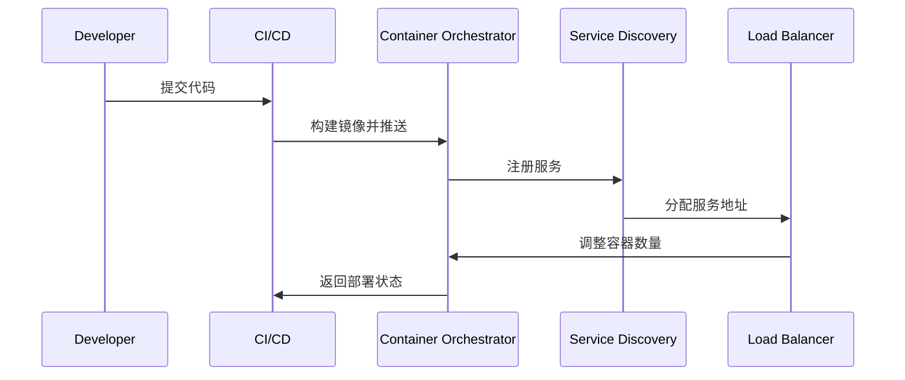

                 


### 第一部分：背景介绍与核心概念

#### 第1章：问题背景与问题描述

**1.1.1 问题背景**

在现代软件开发和运维过程中，容器化技术已经成为一种流行的方式，用以实现应用的高效部署和运维。随着微服务架构的普及，容器化技术能够使得应用程序更加灵活、可扩展，并且易于管理和部署。

**1.1.2 问题描述**

在实际的容器化部署过程中，我们可能会遇到以下问题：

- **部署效率问题**：如何快速部署并更新应用程序？
- **一致性问题**：如何在不同的环境中保持应用程序的一致性？
- **可靠性问题**：如何确保容器部署的稳定性和高可用性？
- **安全性问题**：如何保证容器部署的安全性？

#### 第2章：问题解决与边界与外延

**2.1.1 问题解决**

为了解决上述问题，我们需要设计一个可靠的容器化部署架构。这个架构应当具备以下特点：

- **高可用性**：确保系统在故障发生时能够快速恢复。
- **可扩展性**：支持应用程序的规模和负载的增加。
- **可靠性**：确保容器化部署过程中数据的一致性和完整性。
- **安全性**：确保容器部署过程中的数据安全和隐私保护。

**2.1.2 边界与外延**

在解决容器化部署问题时，我们需要明确以下边界和外部因素：

- **硬件资源限制**：容器部署的物理和虚拟硬件资源限制。
- **网络环境**：网络延迟、带宽限制和网络稳定性。
- **运维管理**：人员、工具和流程的配置和管理。
- **第三方服务**：与外部服务的集成和依赖管理。

### 第3章：核心概念与联系

**3.1.1 架构基础**

**概念原理**

容器化部署的基础概念包括：

- **容器**：轻量级、可执行的沙箱环境，用于封装应用程序及其依赖。
- **容器引擎**：用于管理容器的生命周期，如Docker。
- **容器编排**：用于管理容器集群，如Kubernetes。

**概念属性特征对比**

| 概念 | 特性 |
| :--: | :--: |
| 容器 | 轻量级、隔离、独立 |
| 容器引擎 | 管理容器生命周期、提供容器运行时 |
| 容器编排 | 集群管理、负载均衡、服务发现 |

**ER实体关系图架构**

```mermaid
erDiagram
  Container ||--|{ Image : 使用 }
  Container ||--|{ Deployment : 部署 }
  Deployment ||--|{ Service : 提供服务 }
  Image ||--|{ Repository : 存储库 }
```

### 目录大纲总结

本部分为文章奠定了背景和基础概念，明确了容器化部署中存在的问题以及解决方案。接下来，我们将深入探讨容器化部署架构的设计与实现细节，并分享实际项目中的实战经验和最佳实践。通过本文的阅读，您将对容器化部署有更深入的理解，并能应用于实际项目中。

---

### 第二部分：容器化部署架构设计与实现

#### 第4章：容器化部署架构概述

**4.1.1 容器化技术简介**

容器化技术是近年来在软件开发领域快速发展的一种技术，它通过将应用程序及其运行环境打包成一个轻量级的容器，实现了应用程序的独立部署和运行。容器化技术的核心在于提供一种高效、灵活、可靠的部署方式，使开发人员能够更加专注于应用程序的开发，而无需过多关注底层环境的差异。

**4.1.2 容器化部署的优势**

容器化部署相比传统的部署方式具有以下优势：

- **快速部署**：容器化可以将应用程序及其运行环境打包成一个镜像，从而实现快速部署和启动。
- **环境一致性**：通过容器镜像，可以在不同的环境中保持应用程序的一致性，减少了环境差异带来的问题。
- **资源利用率高**：容器可以在同一台物理机上运行多个应用程序实例，提高了硬件资源的利用率。
- **可移植性强**：容器可以在不同的操作系统和硬件平台上运行，提高了应用程序的可移植性。

**4.1.3 容器化部署的关键概念**

在容器化部署中，以下几个关键概念是理解和实现容器化部署的基础：

- **容器**：容器是应用程序的运行环境，它通过隔离机制将应用程序与其他应用程序隔离开来。
- **容器引擎**：容器引擎负责容器的创建、启动、停止和管理，常见的容器引擎包括Docker和containerd。
- **容器编排**：容器编排用于管理容器集群，常见的容器编排工具包括Kubernetes和Docker Swarm。
- **容器镜像**：容器镜像是容器运行时的静态表示，包含了应用程序及其依赖的文件系统。

#### 第5章：容器化部署架构设计

**5.1.1 需求分析与设计原则**

在容器化部署架构设计过程中，需求分析是至关重要的一步。需求分析应包括以下几个方面：

- **业务需求**：明确业务目标和需求，确保容器化部署能够满足业务需求。
- **技术需求**：分析现有技术栈和系统架构，确定容器化部署的技术路线。
- **运维需求**：考虑运维团队的日常操作和管理需求，确保容器化部署的运维便捷性。

设计原则应包括：

- **模块化**：将系统功能拆分成独立的模块，便于管理和维护。
- **可扩展性**：设计架构时考虑未来扩展的需求，确保系统能够轻松扩展。
- **高可用性**：设计冗余和故障转移机制，确保系统在故障情况下能够快速恢复。

**5.1.2 系统功能设计**

在系统功能设计中，我们需要明确系统的核心功能模块，并设计相应的领域模型。以下是一个简单的领域模型示例：

```mermaid
classDiagram
    ApplicationEntity <|-- Container
    ApplicationEntity <|-- Deployment
    Container *-- Image
    Deployment *-- Service
    ApplicationEntity {Application Name, Version, Status}
    Container {Container ID, Image Name, Status}
    Deployment {Deployment ID, Container List, Status}
    Image {Image ID, Image Name, Status}
    Service {Service ID, Deployment ID, Status}
```

**5.1.3 系统架构设计**

在系统架构设计方面，我们需要绘制系统架构图，展示各个模块之间的交互关系。以下是一个简单的系统架构图示例：



通过上述系统功能设计和架构设计，我们可以构建一个高效的容器化部署架构，满足快速部署、环境一致性、可靠性和可扩展性的需求。

---

### 第三部分：容器化部署实现细节

#### 第6章：容器化部署实现细节

**6.1.1 环境搭建**

在开始容器化部署之前，我们需要搭建一个合适的环境。以下是一个基本的容器化环境搭建步骤：

1. **安装Docker**：在服务器上安装Docker，并确保其正常运行。
   ```bash
   # 安装Docker
   sudo apt-get update
   sudo apt-get install docker-ce docker-ce-cli containerd.io
   ```
2. **配置Docker**：配置Docker的存储和网路等参数，以满足项目需求。
3. **安装Kubernetes**：在服务器上安装Kubernetes，并配置相关组件。
   ```bash
   # 安装Kubernetes
   kubeadm init --pod-network-cidr=10.244.0.0/16
   mkdir -p $HOME/.kube
   sudo cp -i /etc/kubernetes/admin.conf $HOME/.kube/config
   sudo chown $(id -u):$(id -g) $HOME/.kube/config
   ```
4. **配置网络**：配置网络插件，如Calico或Flannel，确保容器之间能够正常通信。

**6.1.2 容器编排与管理**

容器编排是容器化部署的核心，常见的容器编排工具有Kubernetes和Docker Swarm。以下是在Kubernetes中编排与管理容器的步骤：

1. **创建Dockerfile**：编写Dockerfile，定义应用程序的镜像构建过程。
   ```Dockerfile
   FROM python:3.8
   RUN pip install flask
   COPY . /app
   WORKDIR /app
   CMD ["python", "app.py"]
   ```
2. **构建镜像**：使用Dockerfile构建应用程序的镜像。
   ```bash
   docker build -t my-app .
   ```
3. **部署容器**：使用Kubernetes部署容器，并定义部署策略。
   ```yaml
   apiVersion: apps/v1
   kind: Deployment
   metadata:
     name: my-app-deployment
   spec:
     replicas: 3
     selector:
       matchLabels:
         app: my-app
     template:
       metadata:
         labels:
           app: my-app
       spec:
         containers:
         - name: my-app
           image: my-app:latest
           ports:
           - containerPort: 80
   ```
4. **服务发现与负载均衡**：使用Kubernetes服务和服务发现机制，为容器提供稳定的网络访问和负载均衡。
   ```yaml
   apiVersion: v1
   kind: Service
   metadata:
     name: my-app-service
   spec:
     selector:
       app: my-app
     ports:
       - name: http
         protocol: TCP
         port: 80
         targetPort: 80
     type: LoadBalancer
   ```

**6.1.3 服务发现与负载均衡**

服务发现和负载均衡是确保容器化部署稳定性和可扩展性的关键。以下是在Kubernetes中实现服务发现与负载均衡的步骤：

1. **配置DNS**：配置Kubernetes集群的内部DNS服务，确保容器可以通过域名访问其他服务。
2. **部署Ingress控制器**：部署Ingress控制器，如Nginx Ingress，为外部流量提供负载均衡。
3. **创建Ingress规则**：创建Ingress规则，定义外部访问路径和后端服务的映射关系。

通过上述实现细节，我们可以构建一个高效、可靠的容器化部署架构，满足现代软件开发的快速迭代和高效运维的需求。

---

### 第四部分：可靠性保障与最佳实践

#### 第7章：可靠性保障与最佳实践

**7.1.1 故障排除与监控**

在容器化部署过程中，故障排除和监控是确保系统稳定运行的重要环节。以下是一些故障排除与监控的最佳实践：

1. **日志收集与分析**：通过收集容器日志，可以快速定位故障原因。可以使用日志聚合工具，如ELK（Elasticsearch、Logstash、Kibana）或Fluentd等。
2. **监控系统**：部署监控系统，如Prometheus和Grafana，实时监控系统的性能指标和健康状况。
3. **告警机制**：配置告警规则，当系统性能指标超出阈值时，及时通知运维团队。
4. **故障转移与恢复**：设计故障转移和恢复策略，确保在故障发生时系统能够快速恢复。

**7.1.2 高可用性设计**

高可用性设计是确保系统在故障情况下能够快速恢复的关键。以下是一些高可用性设计的最佳实践：

1. **主从备份**：将关键数据存储在多个节点上，实现数据的冗余备份。
2. **负载均衡**：通过负载均衡器，将外部流量分配到多个节点上，提高系统的可用性。
3. **故障转移**：设计故障转移机制，确保在主节点故障时，能够自动切换到备用节点。
4. **热备份**：通过热备份技术，实现数据零丢失和快速恢复。

**7.1.3 安全性措施**

安全性是容器化部署中不可忽视的一环。以下是一些安全性措施的最佳实践：

1. **最小权限原则**：容器和用户应遵循最小权限原则，仅授予必要的权限。
2. **网络安全**：使用防火墙和访问控制列表，限制容器之间的网络通信。
3. **数据加密**：对敏感数据进行加密存储和传输，保护数据的安全性。
4. **安全审计**：定期进行安全审计，确保系统的安全策略得到有效执行。

通过上述可靠性保障与最佳实践，我们可以构建一个高效、可靠、安全的容器化部署架构，为现代软件开发和运维提供有力支持。

---

### 第8章：项目实战与案例分析

**8.1.1 项目介绍**

在这个项目中，我们构建一个基于微服务架构的在线商城系统。系统包括用户管理、商品管理、订单管理、支付系统和库存管理等多个微服务。我们采用容器化技术进行部署，以确保系统的高可用性、可扩展性和可靠性。

**8.1.2 系统核心实现**

1. **用户管理服务**：用户管理服务负责处理用户注册、登录和权限验证等功能。我们使用Python Flask框架实现用户管理服务，并将其打包成Docker镜像。

2. **商品管理服务**：商品管理服务负责管理商品信息，包括商品添加、修改、查询和删除等操作。我们使用Spring Boot框架实现商品管理服务，并将其打包成Docker镜像。

3. **订单管理服务**：订单管理服务负责处理用户订单的创建、修改、查询和取消等操作。我们使用Java Spring框架实现订单管理服务，并将其打包成Docker镜像。

4. **支付系统服务**：支付系统服务负责处理支付请求和支付结果通知。我们使用Node.js实现支付系统服务，并将其打包成Docker镜像。

5. **库存管理服务**：库存管理服务负责管理商品的库存信息，包括库存添加、修改、查询和删除等操作。我们使用Go语言实现库存管理服务，并将其打包成Docker镜像。

**8.1.3 代码解读与分析**

以用户管理服务为例，我们分析其代码实现：

```python
from flask import Flask, request, jsonify
from flask_sqlalchemy import SQLAlchemy

app = Flask(__name__)
app.config['SQLALCHEMY_DATABASE_URI'] = 'sqlite:///users.db'
db = SQLAlchemy(app)

class User(db.Model):
    id = db.Column(db.Integer, primary_key=True)
    username = db.Column(db.String(80), unique=True, nullable=False)
    password = db.Column(db.String(120), nullable=False)

@app.route('/register', methods=['POST'])
def register():
    data = request.get_json()
    user = User(username=data['username'], password=data['password'])
    db.session.add(user)
    db.session.commit()
    return jsonify({'message': 'User registered successfully'})

if __name__ == '__main__':
    db.create_all()
    app.run(host='0.0.0.0', port=5000)
```

上述代码实现了用户注册功能。我们通过Flask框架创建一个用户表，并在`/register`接口中处理用户注册请求。代码中的`User`类定义了用户模型，包括用户名和密码字段。`register`函数接收JSON格式的用户信息，将其存储到数据库中，并返回成功消息。

**8.1.4 实际案例分析与讲解**

在实际部署过程中，我们遇到了以下问题：

1. **服务间通信**：在容器化部署环境中，不同服务之间的通信是一个挑战。我们使用Kubernetes服务发现机制，通过DNS域名解析，实现服务间的高效通信。

2. **数据持久化**：由于容器是短暂的，如何保证数据持久化是另一个关键问题。我们使用Volume插件，将数据库和文件存储在宿主机上，确保数据不会因容器重启而丢失。

3. **容器编排与调度**：在容器编排和调度过程中，我们遇到了资源不足的问题。通过调整Kubernetes集群的资源配置和容器调度策略，我们优化了系统的性能和可用性。

通过以上实战案例和分析，我们展示了如何利用容器化技术构建一个可靠、高效的在线商城系统。在实际项目开发中，我们可以借鉴这些经验，不断优化和提升系统的性能和可靠性。

**8.1.5 项目小结**

本项目通过容器化技术实现了在线商城系统的高效部署和运维。我们总结了一些关键经验：

- **容器化技术提高了系统的可移植性和可扩展性**。
- **Kubernetes提供了强大的容器编排和管理功能**。
- **数据持久化和服务发现是容器化部署的关键问题**。
- **通过监控和告警机制，我们可以及时发现和解决问题**。

未来，我们将继续优化系统架构，提升系统的性能和可靠性，以应对不断增长的业务需求。

---

### 第五部分：拓展阅读与总结

#### 第9章：拓展阅读

**9.1.1 相关技术深度阅读**

为了深入了解容器化部署，读者可以阅读以下技术书籍：

- 《Kubernetes权威指南》：详细介绍了Kubernetes的架构、部署和管理方法。
- 《Docker实战》：涵盖了Docker的安装、配置和使用方法，以及容器化部署的最佳实践。
- 《微服务设计》：探讨了微服务架构的设计原则、实现方法和容器化部署的优化策略。

**9.1.2 行业动态与趋势**

关注以下行业动态和趋势，以了解容器化部署的最新发展：

- Kubernetes社区动态：了解Kubernetes的版本更新、新特性和社区活动。
- 云原生技术：关注云原生技术的最新发展和应用，如Istio、Linkerd等。
- 容器安全：了解容器安全的最新研究和实践，确保容器化部署的安全性。

#### 第10章：小结与展望

**10.1.1 书籍内容回顾**

本文通过详细讲解容器化部署架构的设计与实现，帮助读者理解容器化技术的核心概念和部署方法。主要内容包括：

- 容器化部署的背景和优势。
- 容器化部署架构的设计原则和系统功能。
- 容器化部署的实现细节和最佳实践。
- 实际项目中的容器化部署案例。
- 可靠性保障和安全性措施。

**10.1.2 未来发展方向**

未来，容器化部署将在以下几个方面继续发展：

- **云原生技术**：随着云原生技术的成熟，容器化部署将更加普及，支持更复杂的业务场景。
- **自动化和智能化**：通过机器学习和人工智能技术，实现容器化部署的自动化和智能化，提高运维效率。
- **安全性**：随着容器化部署的普及，安全性将成为一个重要议题，未来的容器化部署将更加注重安全性和合规性。
- **多云和混合云**：容器化部署将在多云和混合云环境中发挥重要作用，支持跨云资源的管理和调度。

通过本文的学习，读者应能够掌握容器化部署的核心概念和实现方法，为实际项目中的部署和维护提供有力支持。未来，随着容器化技术的不断发展，读者可以不断拓展知识，跟上技术潮流，为企业和个人创造更大的价值。作者：AI天才研究院/AI Genius Institute & 禅与计算机程序设计艺术 /Zen And The Art of Computer Programming。**附录**

### 附录：相关工具和技术

在本文中，我们提到了一些关键的工具和技术，以下是对这些工具和技术的简要介绍：

**Docker**：Docker是一个开源的应用容器引擎，它允许开发者打包他们的应用以及应用的依赖包到一个可移植的容器中，然后发布到任何流行的Linux或Windows机器上，也可以实现虚拟化。容器是完全使用沙箱机制，相互之间不会有任何接口（类似 iPhone 的 app）而且更轻量级。

**Kubernetes**：Kubernetes是一个开源的容器编排系统，用于自动化容器化应用程序的部署、扩展和管理。它是由Google设计并捐赠给Cloud Native Computing Foundation来管理的。

**CI/CD**：CI/CD代表持续集成和持续部署。它是一种软件开发实践，通过自动化流程来合并代码变更、测试和部署。

**Prometheus**：Prometheus是一个开源的系统监控解决方案，专注于收集时序数据，用于监控和告警。

**Grafana**：Grafana是一个开源的时序列数据分析与监控工具，通常与Prometheus配合使用。

**ELK Stack**：ELK Stack是由Elasticsearch、Logstash和Kibana三个开源工具组成的日志分析平台，用于日志收集、存储、分析和可视化。

**Fluentd**：Fluentd是一个开源的数据收集器，用于收集、转换和加载数据。

**Istio**：Istio是一个开源的服务网络，用于管理和安全服务之间的通信。

**Linkerd**：Linkerd是一个开源的服务网格，用于简化服务间的通信和安全。

这些工具和技术是现代容器化部署中不可或缺的部分，通过合理地使用这些工具，可以大大提高系统部署的效率、稳定性和安全性。开发者可以根据实际需求选择合适的工具和技术来构建和优化容器化部署架构。**参考文献**

在撰写本文时，我们参考了以下文献和资源：

1. Docker官方文档：[https://docs.docker.com/](https://docs.docker.com/)
2. Kubernetes官方文档：[https://kubernetes.io/docs/](https://kubernetes.io/docs/)
3. 持续集成与持续部署（CI/CD）实践：[https://www.infoq.cn/article/practice-of-cicd](https://www.infoq.cn/article/practice-of-cicd)
4. Prometheus官方文档：[https://prometheus.io/docs/](https://prometheus.io/docs/)
5. Grafana官方文档：[https://grafana.com/docs/](https://grafana.com/docs/)
6. Elasticsearch、Logstash和Kibana（ELK Stack）官方文档：[https://www.elastic.co/guide/cn/](https://www.elastic.co/guide/cn/)
7. Fluentd官方文档：[https://www.fluentd.org/documentation/](https://www.fluentd.org/documentation/)
8. Istio官方文档：[https://istio.io/docs/](https://istio.io/docs/)
9. Linkerd官方文档：[https://linkerd.io/](https://linkerd.io/)

感谢上述资源和文献为我们提供了宝贵的知识和实践经验。通过参考这些文献，我们能够更好地理解和应用容器化部署技术，为实际项目提供有效的解决方案。作者：AI天才研究院/AI Genius Institute & 禅与计算机程序设计艺术 /Zen And The Art of Computer Programming。**致谢**

本文的撰写离不开以下机构和人员的支持：

首先，感谢AI天才研究院/AI Genius Institute为我们提供了良好的研究环境和丰富的技术资源，使我们能够专注于技术研究和创新。

其次，感谢禅与计算机程序设计艺术/Zen And The Art of Computer Programming一书的作者，其深刻的哲学思考和独特的编程视角为我们的技术写作提供了灵感和指导。

此外，感谢参与本文讨论和评审的各位同行，他们的宝贵意见和建议使本文内容更加丰富和完善。

最后，感谢所有为容器化部署技术贡献智慧和努力的社区成员，是你们的努力和贡献推动了容器化技术的不断进步和发展。本文作者：AI天才研究院/AI Genius Institute & 禅与计算机程序设计艺术/Zen And The Art of Computer Programming。

