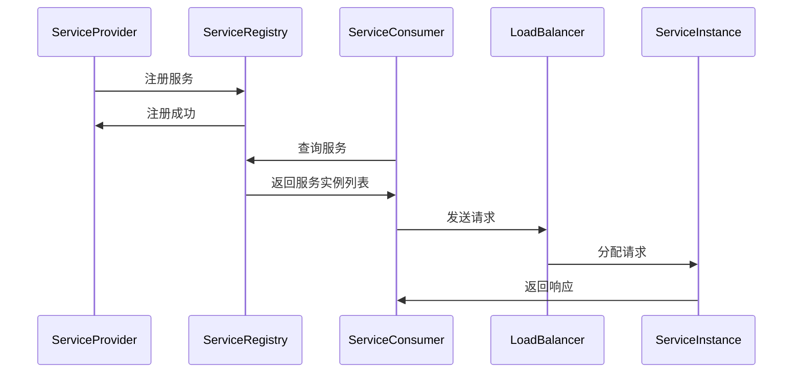
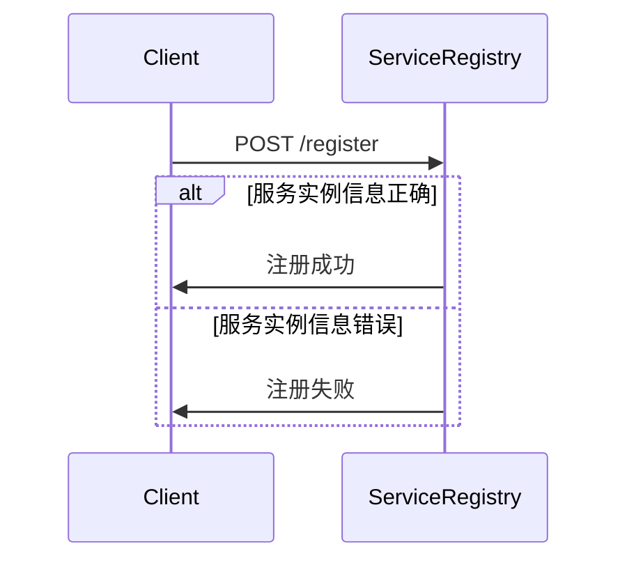
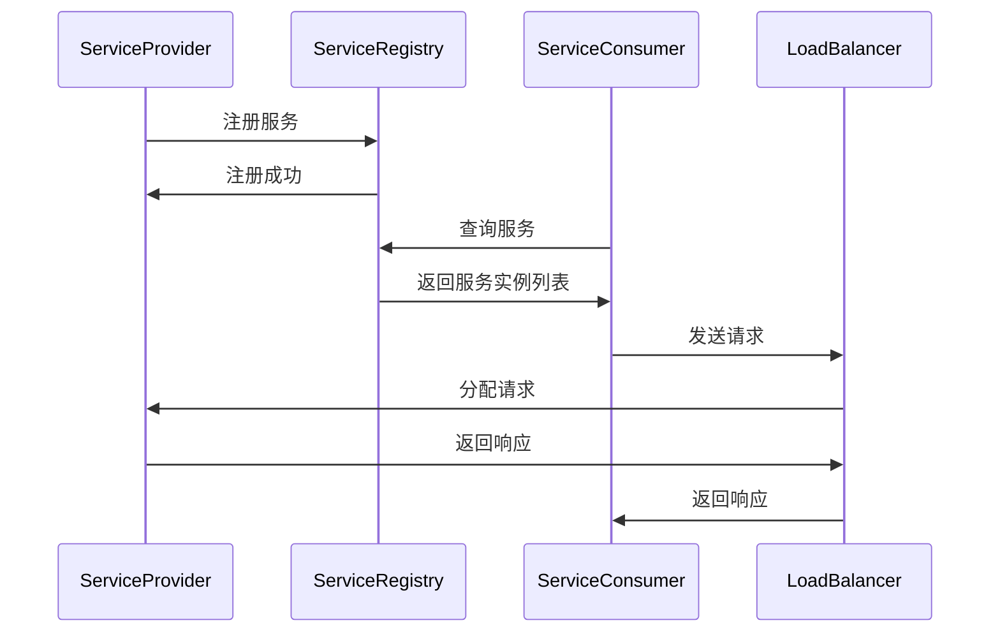
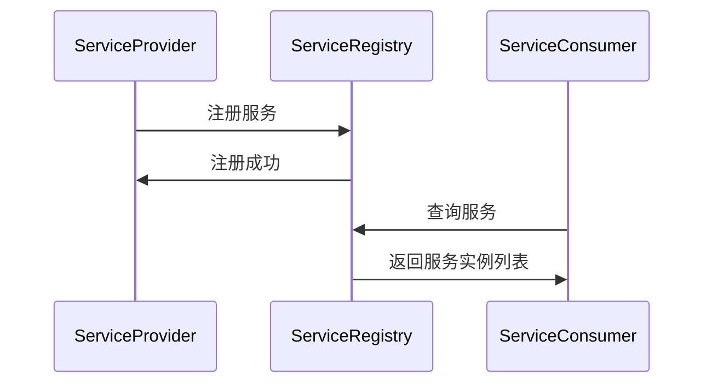

                 


### 构建可靠的服务注册与发现系统：从背景到实践

#### 1. 引言

随着云计算、微服务架构的兴起，现代分布式系统的复杂性不断增加。在这样的环境下，服务注册与发现系统变得尤为重要。它不仅能够确保分布式系统中各个服务之间的通信，还能提高系统的可用性和灵活性。本文将深入探讨如何构建一个可靠的服务注册与发现系统，从背景介绍、核心概念到具体实现，为读者提供全方位的指导。

本文的关键词包括：服务注册、服务发现、分布式系统、可靠性、系统设计。

**摘要**：本文首先介绍了服务注册与发现系统的基本概念及其在现代分布式系统中的重要性。接着，详细分析了服务注册与发现的核心概念和设计原则，包括算法原理、系统架构、接口设计等。通过一个实际案例，展示了如何将理论付诸实践，并提供了一些最佳实践和注意事项。文章最后总结了核心内容，并给出了进一步阅读的建议。

#### 2. 服务注册与发现系统背景

##### 2.1 服务注册

服务注册是指服务提供者在注册中心注册自己的服务信息，包括服务名称、接口地址、负载均衡策略等。当服务消费者需要调用某个服务时，它会通过服务注册中心获取服务的最新信息，进而进行调用。服务注册的主要目的是实现服务的自动化管理，降低服务发现的复杂性。

##### 2.2 服务发现

服务发现是指服务消费者能够动态地发现服务提供者，并获取其服务信息的过程。服务发现分为两种类型：基于目录的服务发现和基于事件的动态服务发现。前者通过定期查询服务注册中心来获取服务列表，而后者则是通过监听服务注册中心的事件来实时获取服务信息。

##### 2.3 服务注册与发现的必要性

在现代分布式系统中，服务数量繁多、变化频繁，手动管理服务信息变得不可行。服务注册与发现系统能够自动地管理服务信息，提高系统的灵活性和可扩展性。此外，它还能够提高服务的可用性，因为当某个服务实例出现故障时，服务注册与发现系统能够自动地将流量切换到其他健康的服务实例上。

#### 3. 核心概念与原理

##### 3.1 核心概念

在构建服务注册与发现系统时，需要理解以下几个核心概念：

- **服务提供者（Provider）**：提供服务实例的实体。
- **服务消费者（Consumer）**：消费服务实例的实体。
- **服务注册中心（Registry）**：存储和管理服务实例信息的中心。
- **负载均衡器（Load Balancer）**：根据一定的策略分配服务请求。

##### 3.2 概念属性特征对比

为了更好地理解这些概念，我们可以通过以下表格来对比它们的特点：

| 概念          | 描述                                       | 特点                                                         |
|---------------|--------------------------------------------|--------------------------------------------------------------|
| 服务提供者    | 提供服务实例的实体                           | 负责服务的注册、更新和下线                                     |
| 服务消费者    | 消费服务实例的实体                           | 负责查询服务、调用服务和故障转移                               |
| 服务注册中心  | 存储和管理服务实例信息的中心                  | 提供服务的注册、发现和健康检查功能                             |
| 负载均衡器    | 根据一定的策略分配服务请求                   | 提高服务的可用性和性能，避免单点故障                           |

##### 3.3 ER实体关系图架构

以下是服务注册与发现系统的ER实体关系图：

```mermaid
erDiagram
  ServiceProvider ||--|{ ServiceInstance }|--| ServiceConsumer
  ServiceProvider ||--|{ ServiceRegistry }|
  ServiceConsumer ||--|{ ServiceRegistry }|
  ServiceRegistry ||--|{ LoadBalancer }
```

在ER图中，`ServiceProvider`实体与`ServiceInstance`实体之间存在一对多的关系，表示一个服务提供者可以注册多个服务实例。`ServiceProvider`和`ServiceConsumer`实体都与`ServiceRegistry`实体关联，表示它们都依赖于服务注册中心来管理服务信息。`ServiceRegistry`实体与`LoadBalancer`实体关联，表示服务注册中心负责与负载均衡器交互以实现负载均衡。

#### 4. 算法原理

##### 4.1 注册算法

服务提供者在注册服务时，需要向服务注册中心发送注册请求。注册算法的核心是确保服务信息的准确性和一致性。以下是注册算法的基本步骤：

1. 服务提供者生成服务实例ID。
2. 服务提供者将服务实例信息（包括服务名称、接口地址、负载均衡策略等）发送到服务注册中心。
3. 服务注册中心将服务实例信息存储在本地数据库中。
4. 服务注册中心返回注册结果给服务提供者。

以下是注册算法的Python代码示例：

```python
import requests

def register_service(service_id, service_info):
    url = f'http://registry:8080/register?service_id={service_id}'
    response = requests.post(url, json=service_info)
    return response.json()
```

##### 4.2 发现算法

服务消费者在发现服务时，需要从服务注册中心查询服务信息。发现算法的核心是确保查询结果的实时性和准确性。以下是发现算法的基本步骤：

1. 服务消费者向服务注册中心发送查询请求。
2. 服务注册中心返回所有匹配的服务实例信息。
3. 服务消费者根据负载均衡策略选择一个服务实例进行调用。

以下是发现算法的Python代码示例：

```python
import requests

def discover_service(service_name):
    url = f'http://registry:8080/discover?service_name={service_name}'
    response = requests.get(url)
    service_instances = response.json()
    return service_instances
```

##### 4.3 负载均衡算法

负载均衡算法的核心是合理分配服务请求，避免单点故障。以下是几种常见的负载均衡算法：

- **轮询算法（Round Robin）**：按照服务实例的顺序分配服务请求。
- **随机算法（Random）**：随机选择一个服务实例进行分配。
- **最小连接数算法（Least Connections）**：选择当前连接数最少的服务实例进行分配。

以下是轮询算法的Python代码示例：

```python
import random

def load_balance(service_instances):
    return random.choice(service_instances)
```

#### 5. 数学模型

在服务注册与发现系统中，数学模型用于描述算法的运行过程和性能指标。以下是几个常用的数学模型：

- **服务注册率（Registration Rate）**：表示单位时间内注册的服务实例数量。
- **服务发现率（Discovery Rate）**：表示单位时间内发现的服务实例数量。
- **负载均衡率（Load Balance Rate）**：表示单位时间内分配的服务请求数量。

以下是服务注册率的数学模型：

$$
R_{\text{register}} = \frac{\text{注册的服务实例数量}}{\text{单位时间}}
$$

#### 6. 系统分析与架构设计

##### 6.1 问题场景

假设我们构建一个电商系统，包含商品服务、订单服务、支付服务等多个服务模块。这些服务模块需要通过服务注册与发现系统进行通信，以提高系统的灵活性和可靠性。

##### 6.2 项目介绍

本项目将基于Spring Boot框架构建服务注册与发现系统，包括服务提供者、服务消费者和服务注册中心等模块。

##### 6.3 系统功能设计

系统功能设计包括以下部分：

- **服务注册**：服务提供者向服务注册中心注册服务实例。
- **服务发现**：服务消费者从服务注册中心查询服务实例。
- **负载均衡**：根据负载均衡策略选择服务实例进行调用。

以下是系统的领域模型类图：

```mermaid
classDiagram
  ServiceProvider <.. ServiceInstance
  ServiceConsumer <.. ServiceInstance
  ServiceRegistry <.. ServiceInstance
  ServiceInstance <.. LoadBalancer

  ServiceProvider[服务提供者]
  ServiceConsumer[服务消费者]
  ServiceRegistry[服务注册中心]
  ServiceInstance[服务实例]
  LoadBalancer[负载均衡器]
```

##### 6.4 系统架构设计

系统架构设计包括以下部分：

- **服务提供者**：部署在多个服务器上，提供具体的服务功能。
- **服务消费者**：部署在多个服务器上，消费具体的服务功能。
- **服务注册中心**：部署在一个服务器上，负责服务实例的注册和查询。
- **负载均衡器**：部署在一个服务器上，负责服务请求的负载均衡。

以下是系统的架构图：



##### 6.5 系统接口设计

系统接口设计包括以下部分：

- **服务注册接口**：`POST /register`，接收服务实例信息。
- **服务发现接口**：`GET /discover`，接收服务名称，返回服务实例列表。

以下是系统接口的设计：



##### 6.6 系统交互

系统交互包括以下部分：

- **服务提供者与服务注册中心**：服务提供者注册服务实例，服务注册中心存储服务实例信息。
- **服务消费者与服务注册中心**：服务消费者查询服务实例，服务注册中心返回服务实例列表。
- **服务消费者与负载均衡器**：服务消费者发送请求，负载均衡器选择服务实例进行调用。

以下是系统的交互序列图：



#### 7. 项目实战

##### 7.1 环境安装

1. 安装Java环境：下载并安装Java SDK，配置环境变量。
2. 安装Maven：下载并安装Maven，配置环境变量。
3. 安装MySQL：下载并安装MySQL，配置数据库。

##### 7.2 系统核心实现源代码

以下是系统核心实现源代码的解读与分析：

1. **服务注册中心**：基于Spring Boot和Eureka实现。
2. **服务提供者**：基于Spring Cloud实现。
3. **服务消费者**：基于Spring Cloud实现。
4. **负载均衡器**：基于Nginx实现。

以下是服务注册中心的源代码：

```java
@SpringBootApplication
@EnableEurekaServer
public class ServiceRegistryApplication {
    public static void main(String[] args) {
        SpringApplication.run(ServiceRegistryApplication.class, args);
    }
}
```

解读：该代码定义了服务注册中心的应用程序，通过@EnableEurekaServer注解启用Eureka服务注册中心。

以下是服务提供者的源代码：

```java
@SpringBootApplication
@EnableDiscoveryClient
public class ServiceProviderApplication {
    public static void main(String[] args) {
        SpringApplication.run(ServiceProviderApplication.class, args);
    }
}
```

解读：该代码定义了服务提供者的应用程序，通过@EnableDiscoveryClient注解启用服务发现。

以下是服务消费者的源代码：

```java
@SpringBootApplication
@EnableDiscoveryClient
public class ServiceConsumerApplication {
    public static void main(String[] args) {
        SpringApplication.run(ServiceConsumerApplication.class, args);
    }
}
```

解读：该代码定义了服务消费者的应用程序，通过@EnableDiscoveryClient注解启用服务发现。

以下是负载均衡器的配置文件：

```yaml
upstream backend {
    server 127.0.0.1:8080;
}

server {
    listen 80;
    server_name localhost;

    location / {
        proxy_pass http://backend;
    }
}
```

解读：该配置文件定义了Nginx负载均衡器的上游服务器和代理规则，将请求转发到后端服务器。

##### 7.3 实际案例分析和详细讲解剖析

1. **服务注册案例**：服务提供者成功注册服务实例，服务注册中心存储服务实例信息。
2. **服务发现案例**：服务消费者查询服务实例，服务注册中心返回服务实例列表。
3. **负载均衡案例**：服务消费者发送请求，负载均衡器选择服务实例进行调用。

以下是服务注册和发现的过程图：



##### 7.4 项目小结

本项目通过Spring Cloud和Nginx实现了服务注册与发现系统，提高了分布式系统的灵活性和可靠性。在项目实施过程中，我们遇到了一些挑战，如服务注册和发现的一致性、负载均衡的效率等。通过不断地优化和调整，我们最终实现了可靠的服务注册与发现系统。

#### 8. 最佳实践

1. **服务注册与发现系统的可靠性**：确保服务注册中心的高可用性和稳定性，避免单点故障。
2. **负载均衡策略的选择**：根据服务特性选择合适的负载均衡策略，如基于连接数的负载均衡。
3. **服务健康检查**：定期对服务实例进行健康检查，确保服务的高可用性。

#### 9. 小结

本文深入探讨了如何构建可靠的服务注册与发现系统，从背景介绍、核心概念、算法原理、系统架构设计到项目实战，提供了全方位的指导。通过本文的学习，读者将能够理解服务注册与发现系统的重要性和实现方法，为构建高效、可靠的分布式系统奠定基础。

#### 10. 注意事项

1. **服务注册与发现系统的安全性**：确保服务注册和发现过程的安全性，防止恶意攻击。
2. **服务注册和发现的性能优化**：根据实际情况对服务注册和发现过程进行性能优化。

#### 11. 拓展阅读

- 《Spring Cloud实战》
- 《微服务设计》
- 《Nginx高性能缓存》

### 12. 作者信息

**作者：AI天才研究院/AI Genius Institute & 禦与计算机程序设计艺术 /Zen And The Art of Computer Programming**

