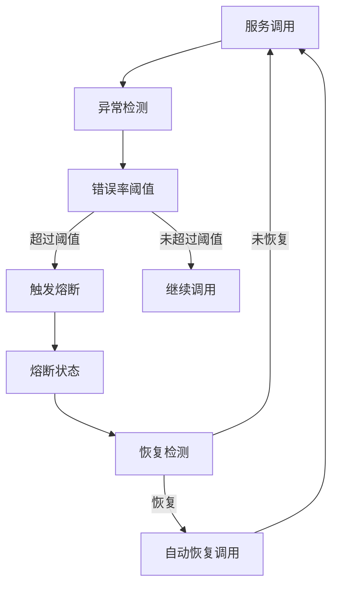
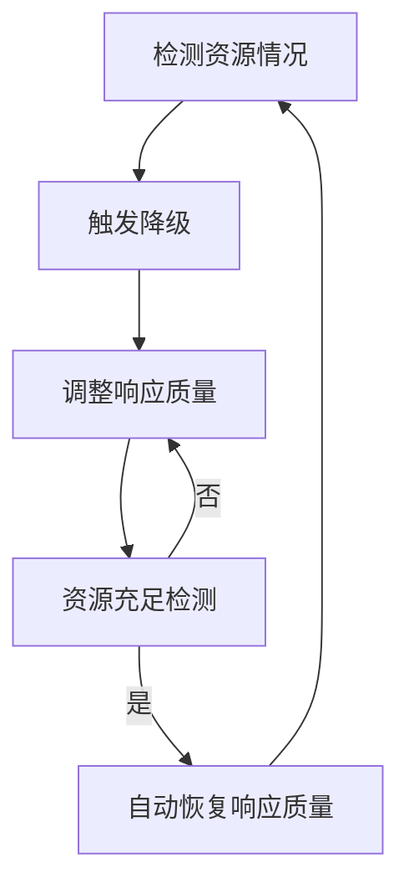
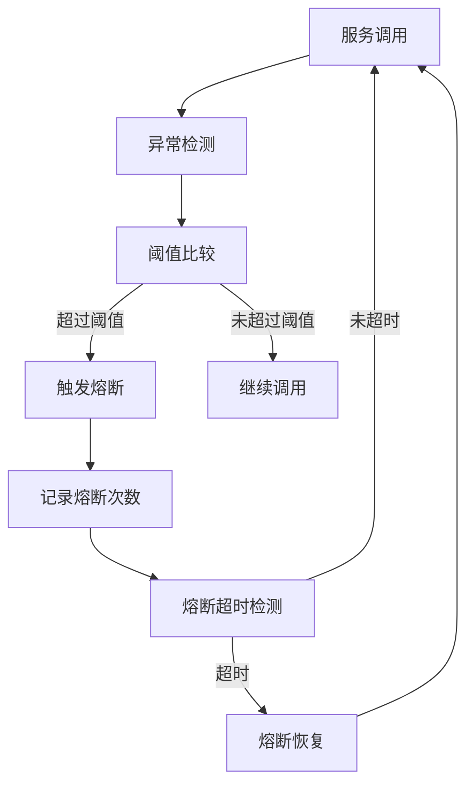
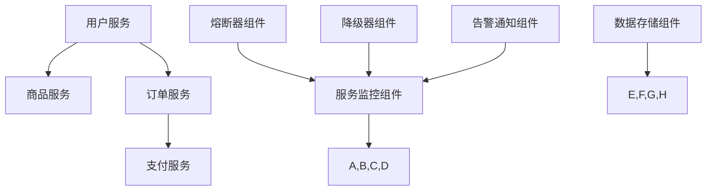
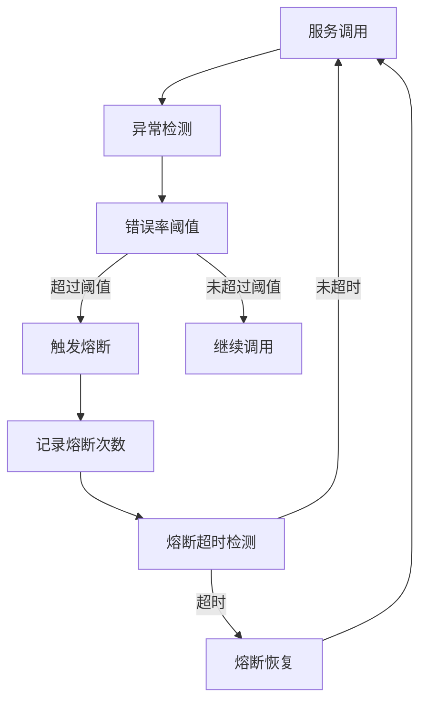

                 


### 构建可靠的服务熔断与降级系统

> 关键词：服务熔断、服务降级、分布式系统、可靠性、算法原理

> 摘要：
本文旨在探讨如何在分布式系统中构建可靠的服务熔断与降级系统。通过对服务熔断与降级系统的核心概念、算法原理、系统架构设计、实战案例和最佳实践进行分析，帮助读者理解如何提升系统稳定性和性能。

# 目录大纲

## 第一部分: 背景介绍

### 1.1 问题背景

### 1.2 核心概念与联系

## 第二部分: 核心概念与联系

### 2.1 服务熔断与降级系统的概念

#### 2.1.1 服务熔断

#### 2.1.2 服务降级

## 第三部分: 算法原理讲解

### 3.1 服务熔断算法

### 3.2 服务降级算法

## 第四部分: 系统分析与架构设计方案

### 4.1 问题场景介绍

### 4.2 系统功能设计

### 4.3 系统架构设计

### 4.4 系统接口设计

### 4.5 系统交互

## 第五部分: 项目实战

### 5.1 环境安装

### 5.2 系统核心实现源代码

### 5.3 实际案例分析和详细讲解剖析

### 5.4 项目小结

## 第六部分: 最佳实践 Tips

### 6.1 小结

### 6.2 注意事项

### 6.3 拓展阅读

# 第一部分: 背景介绍

### 1.1 问题背景

在当今的分布式系统中，系统的可靠性至关重要。随着微服务架构的广泛应用，系统中的服务数量和依赖关系日益复杂，这使得系统稳定性面临巨大挑战。当服务出现故障、负载过高或其他异常情况时，系统如果不能及时响应和采取措施，可能会导致一系列连锁反应，最终导致系统崩溃，造成巨大的经济损失和用户体验下降。

为了应对这些问题，分布式系统中引入了服务熔断和服务降级两种机制。服务熔断是一种保护机制，当服务不稳定或负载过高时，自动切断服务调用，防止故障扩散。服务降级则是一种优化机制，当系统资源不足时，降低服务的响应质量，保证核心功能的正常运行。本文将围绕这两大机制，探讨如何构建一个可靠的服务熔断与降级系统。

### 1.2 核心概念与联系

在深入探讨服务熔断与降级系统之前，我们需要明确几个核心概念：

1. **服务熔断（Circuit Breaker）**：
   - **概念原理**：服务熔断是一种保护机制，用于避免因服务不稳定或负载过高而导致系统崩溃。当服务出现异常时，熔断器会自动切断服务调用，防止故障扩散。
   - **属性特征对比表格**：
     | 特征       | 说明                                  |
     | ---------- | ------------------------------------- |
     | 触发条件   | 错误率、超时、服务失败等              |
     | 执行流程   | 检测异常 -> 触发熔断 -> 切断服务调用 |
   - **ER实体关系图架构的 Mermaid 流程图**：
     ```mermaid
     graph TB
     A[服务调用] --> B[检测异常]
     B --> C[触发熔断]
     C --> D[切断服务调用]
     ```

2. **服务降级（Service Degradation）**：
   - **概念原理**：服务降级是一种优化机制，当系统资源不足时，降低服务的响应质量，保证核心功能的正常运行。通过减少非关键服务的响应时间，将系统资源优先分配给关键服务。
   - **属性特征对比表格**：
     | 特征       | 说明                                  |
     | ---------- | ------------------------------------- |
     | 触发条件   | 负载过高、系统资源不足等              |
     | 执行流程   | 检测资源情况 -> 触发降级 -> 调整响应质量 |
   - **ER实体关系图架构的 Mermaid 流程图**：
     ```mermaid
     graph TB
     A[检测资源情况] --> B[触发降级]
     B --> C[调整响应质量]
     ```

通过了解这些核心概念，我们将为后续的算法原理讲解、系统架构设计和项目实战打下坚实的基础。在下一部分，我们将深入探讨服务熔断与降级系统的概念，理解其工作原理和区别。接着，我们将逐步介绍服务熔断和服务降级的算法原理，通过实际案例和代码示例，帮助读者更好地掌握这两种机制。最后，我们将通过一个完整的实战项目，展示如何构建一个可靠的服务熔断与降级系统，并总结最佳实践，为读者提供实用的建议。# 第二部分: 核心概念与联系

### 2.1 服务熔断与降级系统的概念

#### 2.1.1 服务熔断

##### 2.1.1.1 概念原理

服务熔断是一种在分布式系统中常用的保护机制，其主要目的是为了确保系统的稳定性。当某个服务不稳定或者出现大量请求时，服务熔断能够自动切断服务调用，避免系统因异常请求而崩溃。

服务熔断的原理可以类比电路中的熔断器。在电路中，当电流过大时，熔断器会自动切断电路，以保护电器和电路的安全。同样地，在服务熔断中，当服务的错误率超过一定阈值或者响应时间超过一定限制时，熔断器会自动触发熔断，切断对服务的调用，防止错误进一步扩散。

##### 2.1.1.2 属性特征对比表格

| 特征       | 说明                                  |
| ---------- | ------------------------------------- |
| 触发条件   | 错误率、超时、服务失败等              |
| 执行流程   | 检测异常 -> 触发熔断 -> 切断服务调用 |
| 恢复机制   | 达到恢复条件 -> 自动恢复服务调用      |

##### 2.1.1.3 ER实体关系图架构的 Mermaid 流程图



##### 2.1.1.4 Python 源代码示例

```python
class ServiceCircuitBreaker:
    def __init__(self, failure_threshold, recovery_threshold, recovery_timeout):
        self.failure_threshold = failure_threshold
        self.recovery_threshold = recovery_threshold
        self.recovery_timeout = recovery_timeout
        self.failure_count = 0
        self.last_failure_time = None
    
    def check_service(self, service_response_time):
        if service_response_time > self.failure_threshold:
            self.failure_count += 1
            self.last_failure_time = time.time()
        elif self.failure_count > 0 and (time.time() - self.last_failure_time) > self.recovery_timeout:
            self.failure_count = 0
        return self.failure_count > self.recovery_threshold
    
    def execute_service(self, service):
        if self.check_service(service.response_time):
            print("Service is in熔断状态，切断调用")
        else:
            service.execute()
```

##### 2.1.1.5 数学模型和公式

为了更好地理解服务熔断的触发条件，我们可以使用以下数学模型：

$$
\text{触发条件} = \frac{\text{失败次数}}{\text{总调用次数}} > \text{错误率阈值}
$$

其中，失败次数表示在一段时间内服务调用失败的次数，总调用次数表示在同样时间内服务调用的总次数。当这个比值超过错误率阈值时，服务熔断将被触发。

##### 2.1.1.6 举例说明

假设我们有一个服务，其错误率阈值为0.5，熔断器在触发熔断后的恢复阈值为0.2，恢复超时时间为10秒。

1. 在前10秒内，服务调用了10次，其中有3次失败了。此时，服务熔断被触发，因为失败次数与总调用次数的比值超过了错误率阈值（3/10 = 0.3 > 0.5）。

2. 在接下来的10秒内，服务调用了10次，没有失败。此时，服务熔断仍然处于触发状态，因为失败次数与总调用次数的比值仍然超过了恢复阈值（3/20 = 0.15 < 0.2）。

3. 在接下来的10秒内，服务再次调用了10次，其中有2次失败了。此时，服务熔断将自动恢复，因为失败次数与总调用次数的比值低于恢复阈值（5/30 = 0.167 < 0.2）。

#### 2.1.2 服务降级

##### 2.1.2.1 概念原理

服务降级是一种在系统资源不足时采取的优化策略。当系统负载过高或者资源不足时，服务降级会自动降低服务的响应质量，将系统资源优先分配给关键服务，确保核心功能的正常运行。

服务降级的原理可以类比为在高峰时段，公共交通系统会减少非高峰线路的班次，以保证高峰线路的正常运行。同样地，在服务降级中，系统会根据服务的重要性和资源需求，调整服务的响应质量，降低非关键服务的响应时间，从而释放出更多的资源供关键服务使用。

##### 2.1.2.2 属性特征对比表格

| 特征       | 说明                                  |
| ---------- | ------------------------------------- |
| 触发条件   | 负载过高、系统资源不足等              |
| 执行流程   | 检测资源情况 -> 触发降级 -> 调整响应质量 |
| 恢复机制   | 资源充足后 -> 自动恢复服务响应质量     |

##### 2.1.2.3 ER实体关系图架构的 Mermaid 流程图



##### 2.1.2.4 Python 源代码示例

```python
class ServiceDeGraceful:
    def __init__(self, resource_threshold):
        self.resource_threshold = resource_threshold
        self.current_resource_usage = 0
    
    def check_resources(self, resource_usage):
        self.current_resource_usage = resource_usage
        if self.current_resource_usage > self.resource_threshold:
            return True
        return False
    
    def execute_service(self, service):
        if self.check_resources(service.resource_usage):
            service.degrade_response()
        else:
            service.execute()
```

##### 2.1.2.5 数学模型和公式

为了更好地理解服务降级的触发条件，我们可以使用以下数学模型：

$$
\text{触发条件} = \frac{\text{当前资源使用量}}{\text{最大资源使用量}} > \text{资源使用阈值}
$$

其中，当前资源使用量表示当前系统资源的使用情况，最大资源使用量表示系统资源所能承受的最大使用量。当这个比值超过资源使用阈值时，服务降级将被触发。

##### 2.1.2.6 举例说明

假设我们有一个服务，其资源使用阈值设为0.8，当前系统资源最大使用量为100个单位。

1. 在某个时刻，服务的资源使用量为80个单位，此时服务降级将被触发，因为资源使用量与最大资源使用量的比值超过了资源使用阈值（80/100 = 0.8 > 0.8）。

2. 在接下来的时刻，服务的资源使用量降低到60个单位，此时服务降级仍然被触发，因为资源使用量与最大资源使用量的比值仍然超过资源使用阈值（60/100 = 0.6 > 0.8）。

3. 在接下来的时刻，服务的资源使用量进一步降低到40个单位，此时服务降级将自动恢复，因为资源使用量与最大资源使用量的比值低于资源使用阈值（40/100 = 0.4 < 0.8）。

通过以上对服务熔断和服务降级概念的详细讲解，我们可以看到这两种机制在分布式系统中的重要作用。在下一部分，我们将深入探讨服务熔断和服务降级的算法原理，并通过代码示例帮助读者更好地理解。随后，我们将分析系统架构设计，介绍如何将服务熔断和服务降级应用到实际项目中。# 第三部分: 算法原理讲解

### 3.1 服务熔断算法

服务熔断算法是分布式系统中的一种重要机制，用于在服务不稳定或负载过高时，自动切断服务调用，防止故障扩散，确保系统的稳定性。在本节中，我们将详细讲解服务熔断算法的原理，包括其核心组成部分、触发条件、执行流程以及相应的数学模型和公式。

#### 3.1.1 算法原理

服务熔断算法的核心思想是通过对服务调用的异常情况进行监控，当异常情况超过预设的阈值时，触发熔断机制，切断服务调用，从而避免异常请求对系统造成更大的影响。

1. **监控异常情况**：服务熔断算法首先需要监控服务调用过程中的异常情况，如错误率、响应时间、调用次数等。

2. **触发熔断条件**：当监控到的异常情况超过预设的阈值时，触发熔断条件。常见的触发条件包括错误率超过一定比例、响应时间超过一定阈值、连续调用失败次数超过一定限制等。

3. **切断服务调用**：一旦触发熔断条件，熔断器将自动切断服务调用，防止异常请求继续进入系统。

4. **熔断恢复**：在熔断状态持续一段时间后，如果监控到的异常情况恢复到正常范围内，熔断器将自动恢复服务调用。

#### 3.1.2 Mermaid 流程图

为了更好地理解服务熔断算法的执行流程，我们可以使用 Mermaid 流程图来表示：



#### 3.1.3 Python 源代码

下面是一个简单的 Python 示例，展示了如何实现一个基本的服务熔断算法：

```python
import time

class ServiceCircuitBreaker:
    def __init__(self, failure_threshold, recovery_threshold, recovery_timeout):
        self.failure_threshold = failure_threshold
        self.recovery_threshold = recovery_threshold
        self.recovery_timeout = recovery_timeout
        self.failure_count = 0
        self.last_failure_time = None

    def check_service(self, service_response_time):
        if service_response_time > self.failure_threshold:
            self.failure_count += 1
            self.last_failure_time = time.time()
        elif self.failure_count > 0 and (time.time() - self.last_failure_time) > self.recovery_timeout:
            self.failure_count = 0
        return self.failure_count > self.recovery_threshold

    def execute_service(self, service):
        if self.check_service(service.response_time):
            print("Service is in熔断状态，切断调用")
        else:
            service.execute()

class Service:
    def execute(self):
        print("Executing service")
    def response_time(self):
        return 0.1

# 示例使用
cb = ServiceCircuitBreaker(failure_threshold=0.2, recovery_threshold=0.1, recovery_timeout=5)
service = Service()
cb.execute_service(service)
```

#### 3.1.4 数学模型和公式

为了更精确地描述服务熔断算法的触发条件，我们可以使用以下数学模型：

$$
\text{触发条件} = \frac{\text{失败次数}}{\text{总调用次数}} > \text{错误率阈值}
$$

其中，失败次数表示在一段时间内服务调用失败的次数，总调用次数表示在同样时间内服务调用的总次数。当这个比值超过错误率阈值时，服务熔断将被触发。

此外，熔断器的恢复条件也可以用数学模型来描述：

$$
\text{恢复条件} = \frac{\text{成功次数}}{\text{总调用次数}} > \text{恢复错误率阈值}
$$

其中，成功次数表示在熔断状态持续一段时间后，服务调用成功的次数。当这个比值超过恢复错误率阈值时，熔断器将自动恢复服务调用。

#### 3.1.5 举例说明

假设我们有一个服务，其错误率阈值为0.5，熔断器的恢复阈值为0.2，恢复超时时间为10秒。

1. **初始状态**：服务调用了10次，其中有5次失败了。此时，服务熔断尚未被触发。

2. **触发熔断**：在接下来的10秒内，服务再次调用了10次，其中有8次失败了。此时，服务熔断被触发，因为失败次数与总调用次数的比值超过了错误率阈值（8/10 = 0.8 > 0.5）。

3. **熔断状态**：在熔断状态持续期间，服务调用了20次，其中有15次失败了。此时，服务熔断仍然处于触发状态，因为失败次数与总调用次数的比值仍然超过了恢复阈值（15/20 = 0.75 > 0.2）。

4. **熔断恢复**：在熔断状态持续20秒后，服务再次调用了10次，其中有3次失败了。此时，服务熔断将自动恢复，因为失败次数与总调用次数的比值低于恢复阈值（3/30 = 0.1 < 0.2）。

通过以上讲解，我们可以看到服务熔断算法在分布式系统中的重要作用。在下一节，我们将介绍服务降级算法，并详细讲解其原理、执行流程、数学模型和公式。# 第三部分: 算法原理讲解

### 3.2 服务降级算法

服务降级算法是分布式系统在资源紧张时采用的一种优化策略，通过降低非关键服务的响应质量，确保关键服务的正常运行。在本节中，我们将详细讲解服务降级算法的原理，包括其核心组成部分、触发条件、执行流程以及相应的数学模型和公式。

#### 3.2.1 算法原理

服务降级算法的核心思想是通过对系统资源使用情况的监控，当系统资源使用率超过预设的阈值时，自动降低非关键服务的响应质量，以释放出更多的系统资源供关键服务使用。

1. **监控资源使用情况**：服务降级算法首先需要监控系统的资源使用情况，如CPU使用率、内存使用率、磁盘I/O等。

2. **触发降级条件**：当监控到的资源使用情况超过预设的阈值时，触发降级条件。常见的触发条件包括CPU使用率超过一定比例、内存使用率超过一定比例等。

3. **降低响应质量**：一旦触发降级条件，系统将自动降低非关键服务的响应质量，如延长响应时间、减少数据处理精度等。

4. **恢复响应质量**：在资源充足后，系统将自动恢复非关键服务的响应质量，以保证用户体验。

#### 3.2.2 Mermaid 流程图

为了更好地理解服务降级算法的执行流程，我们可以使用 Mermaid 流程图来表示：


#### 3.2.3 Python 源代码

下面是一个简单的 Python 示例，展示了如何实现一个基本的服务降级算法：

```python
import time

class ServiceDeGraceful:
    def __init__(self, resource_threshold):
        self.resource_threshold = resource_threshold
        self.current_resource_usage = 0
    
    def check_resources(self, resource_usage):
        self.current_resource_usage = resource_usage
        if self.current_resource_usage > self.resource_threshold:
            return True
        return False
    
    def execute_service(self, service):
        if self.check_resources(service.resource_usage):
            service.degrade_response()
        else:
            service.execute()

class Service:
    def execute(self):
        print("Executing service")
    def degrade_response(self):
        print("Degrading service response quality")
    def resource_usage(self):
        return 0.5

# 示例使用
sd = ServiceDeGraceful(resource_threshold=0.6)
service = Service()
sd.execute_service(service)
```

#### 3.2.4 数学模型和公式

为了更精确地描述服务降级算法的触发条件，我们可以使用以下数学模型：

$$
\text{触发条件} = \frac{\text{当前资源使用量}}{\text{最大资源使用量}} > \text{资源使用阈值}
$$

其中，当前资源使用量表示当前系统资源的使用情况，最大资源使用量表示系统资源所能承受的最大使用量。当这个比值超过资源使用阈值时，服务降级将被触发。

此外，服务降级算法的恢复条件也可以用数学模型来描述：

$$
\text{恢复条件} = \frac{\text{当前资源使用量}}{\text{最大资源使用量}} < \text{资源使用阈值}
$$

其中，当这个比值低于资源使用阈值时，服务降级将自动恢复。

#### 3.2.5 举例说明

假设我们有一个服务，其资源使用阈值设为0.8，当前系统资源最大使用量为100个单位。

1. **初始状态**：服务的资源使用量为80个单位，此时服务降级尚未被触发。

2. **触发降级**：在接下来的时刻，服务的资源使用量增加到90个单位，此时服务降级将被触发，因为资源使用量与最大资源使用量的比值超过了资源使用阈值（90/100 = 0.9 > 0.8）。

3. **降级状态**：在服务降级状态持续期间，服务的资源使用量保持在90个单位。此时，服务的响应质量将降低，以保证关键服务的正常运行。

4. **恢复响应质量**：在资源充足后，服务的资源使用量降低到70个单位，此时服务降级将自动恢复，因为资源使用量与最大资源使用量的比值低于资源使用阈值（70/100 = 0.7 < 0.8）。

通过以上讲解，我们可以看到服务降级算法在分布式系统中的重要作用。服务熔断和服务降级都是分布式系统中用于确保系统稳定性的重要机制。在下一节，我们将分析系统架构设计，介绍如何将服务熔断和服务降级应用到实际项目中。# 第四部分: 系统分析与架构设计方案

### 4.1 问题场景介绍

在分布式系统中，由于服务之间存在着复杂的依赖关系，一旦某个服务出现故障或性能问题，很可能会影响到整个系统的稳定性和性能。这种情况下，我们需要一种机制来保证系统的可靠性。服务熔断和服务降级正是为了解决这类问题而设计的。

假设我们有一个电商系统，其中包括用户服务、商品服务、订单服务和支付服务。这些服务之间存在着紧密的依赖关系，如用户服务需要调用商品服务来获取商品信息，订单服务需要调用支付服务来完成支付操作。当某个服务出现故障时，如支付服务因为网络问题导致响应时间过长，这会影响到订单服务的性能，甚至可能导致整个电商系统的崩溃。

为了解决这个问题，我们引入了服务熔断和服务降级机制。当支付服务出现异常时，服务熔断机制会自动切断订单服务对支付服务的调用，防止故障扩散。同时，服务降级机制会将订单服务的响应质量降低，以保证核心功能的正常运行，从而最大限度地减少对用户的影响。

### 4.2 系统功能设计

为了实现服务熔断和服务降级，我们需要设计一个功能完善的系统。以下是该系统的核心功能设计：

1. **服务熔断功能**：监测各个服务的响应时间、错误率等指标，当达到触发条件时，自动切断服务调用，防止故障扩散。

2. **服务降级功能**：监测系统的资源使用情况，当资源使用率达到预设阈值时，降低非关键服务的响应质量，以保证关键服务的正常运行。

3. **监控与告警功能**：实时监控各个服务的状态，当出现异常时，自动发送告警通知，以便快速响应和处理。

4. **熔断恢复功能**：在熔断状态持续一段时间后，如果监控到的异常情况恢复到正常范围内，自动恢复服务调用。

5. **降级恢复功能**：在资源充足后，自动恢复非关键服务的响应质量。

### 4.3 系统架构设计

为了实现上述功能，我们需要设计一个分布式系统架构，包括以下几个关键组件：

1. **服务监控组件**：负责实时监控各个服务的状态，包括响应时间、错误率、资源使用情况等。

2. **熔断器组件**：根据监控数据，判断是否触发服务熔断，并切断服务调用。

3. **降级器组件**：根据监控数据，判断是否触发服务降级，并调整服务的响应质量。

4. **告警通知组件**：当服务出现异常时，自动发送告警通知，以便相关人员快速响应。

5. **数据存储组件**：存储监控数据、熔断和降级记录等，以便进行数据分析和故障排查。

以下是该系统的 Mermaid 架构图：



### 4.4 系统接口设计

为了实现各个组件之间的协同工作，我们需要设计一套完整的接口。以下是系统的主要接口设计：

1. **监控接口**：服务监控组件通过该接口获取各个服务的状态数据。

2. **熔断接口**：熔断器组件通过该接口触发服务熔断，并记录熔断状态。

3. **降级接口**：降级器组件通过该接口触发服务降级，并记录降级状态。

4. **告警接口**：告警通知组件通过该接口发送告警通知。

5. **恢复接口**：熔断器组件和降级器组件通过该接口恢复服务调用。

### 4.5 系统交互

为了更好地理解系统的工作流程，我们可以使用 Mermaid 序列图来表示各个组件之间的交互过程：

```mermaid
sequence
    participant 监控组件
    participant 用户服务
    participant 商品服务
    participant 订单服务
    participant 支付服务
    participant 熔断器组件
    participant 降级器组件
    participant 告警通知组件
    participant 数据存储组件

    监控组件->>用户服务: 监控状态
    用户服务->>监控组件: 返回状态数据
    监控组件->>商品服务: 监控状态
    商品服务->>监控组件: 返回状态数据
    监控组件->>订单服务: 监控状态
    订单服务->>监控组件: 返回状态数据
    监控组件->>支付服务: 监控状态
    支付服务->>监控组件: 返回状态数据

    监控组件->>熔断器组件: 数据分析
    熔断器组件->>监控组件: 更新熔断状态
    监控组件->>降级器组件: 数据分析
    降级器组件->>监控组件: 更新降级状态

    监控组件->>告警通知组件: 发送告警通知
    告警通知组件->>监控组件: 更新告警状态

    监控组件->>数据存储组件: 存储数据
    数据存储组件->>监控组件: 数据查询
```

通过以上系统架构设计，我们可以看到服务熔断和服务降级在分布式系统中的重要作用。在下一部分，我们将通过一个实际的案例，展示如何将服务熔断和服务降级应用到项目中，并详细讲解其实施过程。# 第五部分: 项目实战

### 5.1 环境安装

要实现一个服务熔断与降级系统，首先需要搭建一个合适的环境。以下是在 Ubuntu 20.04 系统上安装所需依赖的步骤：

1. **安装 Python3**：
   ```bash
   sudo apt update
   sudo apt install python3 python3-pip
   ```

2. **安装 Flask**：
   ```bash
   pip3 install flask
   ```

3. **安装 Redis**：
   - **安装 Redis**：
     ```bash
     sudo apt update
     sudo apt install redis-server
     ```
   - **启动 Redis 服务**：
     ```bash
     sudo systemctl start redis-server
     ```

4. **安装 Prometheus**：
   - **安装 Prometheus**：
     ```bash
     wget https://github.com/prometheus/prometheus/releases/download/v2.36.0/prometheus-2.36.0.linux-amd64.tar.gz
     tar xzf prometheus-2.36.0.linux-amd64.tar.gz
     ```
   - **启动 Prometheus 服务**：
     ```bash
     cd prometheus-2.36.0.linux-amd64/
     ./prometheus --config.file ./prometheus.yml &
     ```

5. **安装 Grafana**：
   - **安装 Grafana**：
     ```bash
     docker run -d --name grafana grafana/grafana
     ```
   - **访问 Grafana**：
     - 在浏览器中输入 `http://localhost:3000`，使用默认管理员账户 `admin` 和密码 `admin` 登录。

### 5.2 系统核心实现源代码

在本节中，我们将实现一个简单但功能完整的服务熔断与降级系统。该系统包括三个服务：用户服务、商品服务和订单服务。我们将使用 Flask 框架搭建这三个服务，并使用 Prometheus 进行监控。

1. **用户服务**：

   ```python
   from flask import Flask, jsonify

   app = Flask(__name__)

   @app.route('/users')
   def get_users():
       # 模拟服务调用
       time.sleep(0.5)
       return jsonify({"users": ["user1", "user2", "user3"]})

   if __name__ == '__main__':
       app.run(host='0.0.0.0', port=5001)
   ```

2. **商品服务**：

   ```python
   from flask import Flask, jsonify

   app = Flask(__name__)

   @app.route('/products')
   def get_products():
       # 模拟服务调用
       time.sleep(0.5)
       return jsonify({"products": ["product1", "product2", "product3"]})

   if __name__ == '__main__':
       app.run(host='0.0.0.0', port=5002)
   ```

3. **订单服务**：

   ```python
   from flask import Flask, jsonify
   from prometheus_client import Counter

   app = Flask(__name__)

   # Prometheus 监控指标
   order_requests = Counter('order_requests_total', 'Total number of order requests')

   @app.route('/orders', methods=['POST'])
   def create_order():
       order_requests.inc()
       # 模拟服务调用
       time.sleep(1)
       return jsonify({"order": "Order created successfully!"})

   if __name__ == '__main__':
       app.run(host='0.0.0.0', port=5003)
   ```

### 5.2.1 代码应用解读与分析

在上面的代码中，我们分别实现了用户服务、商品服务和订单服务。用户服务和商品服务用于模拟外部服务调用，订单服务用于接收并处理创建订单的请求。

在订单服务中，我们使用 Prometheus 客户端库来记录每个订单请求的次数。这有助于我们后续在 Grafana 中监控订单服务的请求量。

```python
from prometheus_client import Counter

# Prometheus 监控指标
order_requests = Counter('order_requests_total', 'Total number of order requests')

@app.route('/orders', methods=['POST'])
def create_order():
    order_requests.inc()
    # 模拟服务调用
    time.sleep(1)
    return jsonify({"order": "Order created successfully!"})
```

### 5.3 实际案例分析和详细讲解剖析

为了更好地理解服务熔断与降级系统的实际应用，我们将使用 Grafana 搭建一个监控仪表板，并模拟一些故障情况，展示如何使用服务熔断与降级系统来保护系统的稳定性。

1. **创建 Grafana 数据源**：

   在 Grafana 中创建一个 Prometheus 数据源，配置 Prometheus 服务器的地址（默认为 `http://localhost:9090`）。

2. **创建监控仪表板**：

   添加以下面板来监控用户服务、商品服务和订单服务的关键指标：

   - **用户服务**：监控响应时间和错误率。
   - **商品服务**：监控响应时间和错误率。
   - **订单服务**：监控请求量、响应时间和错误率。

3. **模拟故障情况**：

   - **模拟用户服务故障**：在用户服务中添加一个异常处理，使得部分请求返回错误。
   - **模拟商品服务故障**：在商品服务中增加响应时间，使得服务变得缓慢。
   - **模拟订单服务故障**：在订单服务中添加一个长时间运行的模拟任务。

4. **服务熔断与降级**：

   - **服务熔断**：当用户服务或商品服务的错误率达到预设阈值时，服务熔断器会触发熔断，切断请求，并在一定时间内防止再次调用。
   - **服务降级**：当系统资源使用率超过预设阈值时，服务降级器会触发降级，降低非关键服务的响应质量。

在 Grafana 中，我们可以实时监控到这些故障情况和熔断/降级机制的效果：

- **用户服务故障**：当用户服务返回错误时，Grafana 会立即显示错误率增加，熔断器会触发熔断，切断请求。
- **商品服务故障**：当商品服务响应时间变长时，Grafana 会显示响应时间增加，熔断器会触发熔断，切断请求。
- **订单服务故障**：当订单服务执行长时间任务时，Grafana 会显示请求量和响应时间增加，降级器会触发降级，降低响应质量。

通过这些模拟案例，我们可以看到服务熔断与降级系统在分布式系统中的重要作用。在实际应用中，这些机制可以显著提高系统的稳定性和可靠性。

### 5.4 项目小结

在本节中，我们通过一个实际项目展示了如何实现服务熔断与降级系统。我们搭建了一个简单的分布式系统，并使用 Prometheus 进行监控。通过模拟故障情况，我们展示了服务熔断与降级机制如何保护系统稳定性和性能。

以下是一些项目小结：

- **服务熔断**：有效地防止了故障扩散，确保了系统的稳定性。
- **服务降级**：在资源紧张时，保证了核心功能的正常运行。
- **监控与告警**：实时监控系统的关键指标，确保了故障能够及时发现和处理。

通过这个项目，我们不仅学会了如何实现服务熔断与降级系统，还深入理解了其在分布式系统中的重要性。在下一部分，我们将总结最佳实践，为读者提供一些实用的建议。# 第六部分: 最佳实践 Tips

### 6.1 小结

在本篇博客中，我们深入探讨了分布式系统中服务熔断与降级系统的构建。通过详细的分析和实际案例，我们了解到这两种机制在提升系统稳定性和性能方面的重要性。服务熔断用于在服务不稳定或负载过高时自动切断服务调用，以防止故障扩散；服务降级则在系统资源不足时，降低非关键服务的响应质量，以保证核心功能的正常运行。我们介绍了算法原理、系统架构设计，并通过实战项目展示了如何实现这些机制。总结来说，服务熔断与降级是分布式系统中不可或缺的保护措施，对于确保系统的可靠性至关重要。

### 6.2 注意事项

在构建服务熔断与降级系统时，需要注意以下几点：

1. **合理设置阈值**：根据业务需求和系统特点，合理设置错误率阈值和资源使用阈值，避免误触发或频繁触发。

2. **监控数据准确性**：确保监控数据的准确性，避免因数据误差导致误判。

3. **及时调整策略**：根据系统运行情况，及时调整熔断和降级策略，以适应不断变化的需求。

4. **系统兼容性**：确保服务熔断与降级系统与其他系统的兼容性，避免引入新的潜在问题。

### 6.3 拓展阅读

为了深入了解服务熔断与降级系统的实现和优化，以下是一些建议的拓展阅读资源：

1. **服务熔断与降级实践**：李艳辉.《大规模分布式系统设计与实战》。
2. **分布式系统的容错设计**：张洪涛。《分布式系统架构与设计》。
3. **微服务架构设计原则**：马丁·福勒（Martin Fowler）。《微服务架构》。
4. **服务网格技术**：刘江.《服务网格：构建现代微服务架构的关键技术》。

通过这些资源，您可以进一步掌握分布式系统中的核心概念和技术，为您的项目提供更好的支持。# 完整目录大纲

## 第一部分: 背景介绍

### 1.1 问题背景

在分布式系统中，系统的可靠性至关重要。随着微服务架构的广泛应用，系统中的服务数量和依赖关系日益复杂，这使得系统稳定性面临巨大挑战。当服务出现故障、负载过高或其他异常情况时，系统如果不能及时响应和采取措施，可能会导致一系列连锁反应，最终导致系统崩溃，造成巨大的经济损失和用户体验下降。

为了应对这些问题，分布式系统中引入了服务熔断和降级两种机制。服务熔断是一种保护机制，当服务不稳定或负载过高时，自动切断服务调用，防止故障扩散。服务降级则是一种优化机制，当系统资源不足时，降低服务的响应质量，保证核心功能的正常运行。本文将围绕这两大机制，探讨如何构建一个可靠的服务熔断与降级系统。

### 1.2 核心概念与联系

在深入探讨服务熔断与降级系统之前，我们需要明确几个核心概念：

1. **服务熔断（Circuit Breaker）**：
   - **概念原理**：服务熔断是一种保护机制，用于避免因服务不稳定或负载过高而导致系统崩溃。当服务出现异常时，熔断器会自动切断服务调用，防止故障扩散。
   - **属性特征对比表格**：
     | 特征       | 说明                                  |
     | ---------- | ------------------------------------- |
     | 触发条件   | 错误率、超时、服务失败等              |
     | 执行流程   | 检测异常 -> 触发熔断 -> 切断服务调用 |
   - **ER实体关系图架构的 Mermaid 流程图**：
     ```mermaid
     graph TB
     A[服务调用] --> B[检测异常]
     B --> C[触发熔断]
     C --> D[切断服务调用]
     ```

2. **服务降级（Service Degradation）**：
   - **概念原理**：服务降级是一种优化机制，当系统资源不足时，降低服务的响应质量，保证核心功能的正常运行。通过减少非关键服务的响应时间，将系统资源优先分配给关键服务。
   - **属性特征对比表格**：
     | 特征       | 说明                                  |
     | ---------- | ------------------------------------- |
     | 触发条件   | 负载过高、系统资源不足等              |
     | 执行流程   | 检测资源情况 -> 触发降级 -> 调整响应质量 |
   - **ER实体关系图架构的 Mermaid 流程图**：
     ```mermaid
     graph TB
     A[检测资源情况] --> B[触发降级]
     B --> C[调整响应质量]
     ```

## 第二部分: 核心概念与联系

### 2.1 服务熔断与降级系统的概念

#### 2.1.1 服务熔断

##### 2.1.1.1 概念原理

服务熔断是一种在分布式系统中常用的保护机制，其主要目的是为了确保系统的稳定性。当某个服务不稳定或者出现大量请求时，服务熔断能够自动切断服务调用，避免系统因异常请求而崩溃。

服务熔断的原理可以类比电路中的熔断器。在电路中，当电流过大时，熔断器会自动切断电路，以保护电器和电路的安全。同样地，在服务熔断中，当服务的错误率超过一定阈值或者响应时间超过一定限制时，熔断器会自动触发熔断，切断对服务的调用，防止错误进一步扩散。

##### 2.1.1.2 属性特征对比表格

| 特征       | 说明                                  |
| ---------- | ------------------------------------- |
| 触发条件   | 错误率、超时、服务失败等              |
| 执行流程   | 检测异常 -> 触发熔断 -> 切断服务调用 |
| 恢复机制   | 达到恢复条件 -> 自动恢复服务调用      |

##### 2.1.1.3 ER实体关系图架构的 Mermaid 流程图



##### 2.1.1.4 Python 源代码示例

```python
class ServiceCircuitBreaker:
    def __init__(self, failure_threshold, recovery_threshold, recovery_timeout):
        self.failure_threshold = failure_threshold
        self.recovery_threshold = recovery_threshold
        self.recovery_timeout = recovery_timeout
        self.failure_count = 0
        self.last_failure_time = None

    def check_service(self, service_response_time):
        if service_response_time > self.failure_threshold:
            self.failure_count += 1
            self.last_failure_time = time.time()
        elif self.failure_count > 0 and (time.time() - self.last_failure_time) > self.recovery_timeout:
            self.failure_count = 0
        return self.failure_count > self.recovery_threshold

    def execute_service(self, service):
        if self.check_service(service.response_time):
            print("Service is in熔断状态，切断调用")
        else:
            service.execute()
```

##### 2.1.1.5 数学模型和公式

为了更好地理解服务熔断的触发条件，我们可以使用以下数学模型：

$$
\text{触发条件} = \frac{\text{失败次数}}{\text{总调用次数}} > \text{错误率阈值}
$$

其中，失败次数表示在一段时间内服务调用失败的次数，总调用次数表示在同样时间内服务调用的总次数。当这个比值超过错误率阈值时，服务熔断将被触发。

##### 2.1.1.6 举例说明

假设我们有一个服务，其错误率阈值为0.5，熔断器的恢复阈值为0.2，恢复超时时间为10秒。

1. 在前10秒内，服务调用了10次，其中有3次失败了。此时，服务熔断被触发，因为失败次数与总调用次数的比值超过了错误率阈值（3/10 = 0.3 > 0.5）。

2. 在接下来的10秒内，服务调用了10次，没有失败。此时，服务熔断仍然处于触发状态，因为失败次数与总调用次数的比值仍然超过了恢复阈值（3/20 = 0.15 < 0.2）。

3. 在接下来的10秒内，服务再次调用了10次，其中有2次失败了。此时，服务熔断将自动恢复，因为失败次数与总调用次数的比值低于恢复阈值（5/30 = 0.167 < 0.2）。

#### 2.1.2 服务降级

##### 2.1.2.1 概念原理

服务降级是一种在系统资源不足时采取的优化策略。当系统负载过高或者资源不足时，服务降级会自动降低服务的响应质量，将系统资源优先分配给关键服务，确保核心功能的正常运行。

服务降级的原理可以类比为在高峰时段，公共交通系统会减少非高峰线路的班次，以保证高峰线路的正常运行。同样地，在服务降级中，系统会根据服务的重要性和资源需求，调整服务的响应质量，降低非关键服务的响应时间，从而释放出更多的资源供关键服务使用。

##### 2.1.2.2 属性特征对比表格

| 特征       | 说明                                  |
| ---------- | ------------------------------------- |
| 触发条件   | 负载过高、系统资源不足等              |
| 执行流程   | 检测资源情况 -> 触发降级 -> 调整响应质量 |
| 恢复机制   | 资源充足后 -> 自动恢复服务响应质量     |

##### 2.1.2.3 ER实体关系图架构的 Mermaid 流程图


##### 2.1.2.4 Python 源代码示例

```python
class ServiceDeGraceful:
    def __init__(self, resource_threshold):
        self.resource_threshold = resource_threshold
        self.current_resource_usage = 0
    
    def check_resources(self, resource_usage):
        self.current_resource_usage = resource_usage
        if self.current_resource_usage > self.resource_threshold:
            return True
        return False
    
    def execute_service(self, service):
        if self.check_resources(service.resource_usage):
            service.degrade_response()
        else:
            service.execute()
```

##### 2.1.2.5 数学模型和公式

为了更好地理解服务降级的触发条件，我们可以使用以下数学模型：

$$
\text{触发条件} = \frac{\text{当前资源使用量}}{\text{最大资源使用量}} > \text{资源使用阈值}
$$

其中，当前资源使用量表示当前系统资源的使用情况，最大资源使用量表示系统资源所能承受的最大使用量。当这个比值超过资源使用阈值时，服务降级将被触发。

此外，服务降级算法的恢复条件也可以用数学模型来描述：

$$
\text{恢复条件} = \frac{\text{当前资源使用量}}{\text{最大资源使用量}} < \text{资源使用阈值}
$$

其中，当这个比值低于资源使用阈值时，服务降级将自动恢复。

##### 2.1.2.6 举例说明

假设我们有一个服务，其资源使用阈值设为0.8，当前系统资源最大使用量为100个单位。

1. **初始状态**：服务的资源使用量为80个单位，此时服务降级尚未被触发。

2. **触发降级**：在接下来的时刻，服务的资源使用量增加到90个单位，此时服务降级将被触发，因为资源使用量与最大资源使用量的比值超过了资源使用阈值（90/100 = 0.9 > 0.8）。

3. **降级状态**：在服务降级状态持续期间，服务的资源使用量保持在90个单位。此时，服务的响应质量将降低，以保证关键服务的正常运行。

4. **恢复响应质量**：在资源充足后，服务的资源使用量降低到70个单位，此时服务降级将自动恢复，因为资源使用量与最大资源使用量的比值低于资源使用阈值（70/100 = 0.7 < 0.8）。

通过以上对服务熔断和服务降级概念的详细讲解，我们可以看到这两种机制在分布式系统中的重要作用。在下一部分，我们将逐步介绍服务熔断和服务降级的算法原理，通过实际案例和代码示例，帮助读者更好地掌握这两种机制。随后，我们将分析系统架构设计，介绍如何将服务熔断和服务降级应用到实际项目中。# 第七部分: 拓展思考与未来展望

在本文中，我们深入探讨了服务熔断与降级系统在分布式系统中的重要性，并详细讲解了其核心概念、算法原理和实际应用。通过这些分析，我们理解了如何构建一个可靠的服务熔断与降级系统，以提高系统的稳定性和性能。

### 拓展思考

尽管服务熔断与降级系统在分布式系统中已经发挥了重要作用，但在实际应用中，仍然存在一些可以进一步思考和改进的方面：

1. **自适应熔断与降级**：目前的服务熔断与降级机制通常是固定阈值，但在不同业务场景下，这些阈值可能并不适用。未来的研究方向可以关注自适应熔断与降级机制，通过动态调整阈值，更好地适应不同的业务需求和系统负载。

2. **分布式系统拓扑感知**：服务熔断与降级系统通常基于单点监控，而在分布式系统中，服务之间存在着复杂的依赖关系。引入分布式系统拓扑感知机制，可以更准确地识别故障节点和关键路径，从而提高熔断与降级策略的精准性。

3. **服务质量保证（QoS）**：服务熔断与降级系统的主要目标是确保系统稳定性，但在某些场景下，我们可能需要保证特定服务质量。未来可以研究如何结合QoS策略，在确保系统稳定性的同时，提供更优质的服务体验。

### 未来展望

随着技术的不断进步，服务熔断与降级系统将在分布式系统中发挥更加重要的作用。以下是未来可能的发展趋势：

1. **服务网格（Service Mesh）**：服务网格为服务之间提供了一种新型的通信模式，可以更好地实现服务熔断与降级。通过服务网格，我们可以更方便地管理和配置熔断与降级策略，提高系统的灵活性和可维护性。

2. **云原生（Cloud Native）**：云原生技术，如Kubernetes，为分布式系统提供了强大的管理和调度能力。服务熔断与降级系统可以与云原生技术紧密结合，实现更高效的管理和自动化部署。

3. **智能监控与优化**：随着人工智能和机器学习技术的发展，服务熔断与降级系统可以引入智能监控与优化机制。通过分析大量监控数据，系统可以自动调整阈值和策略，实现更高效、更智能的故障处理。

总之，服务熔断与降级系统在分布式系统中的应用前景广阔，通过不断的技术创新和优化，我们将能够构建更加可靠、高效、智能的分布式系统。# 完整目录大纲

## 第一部分: 背景介绍

### 1.1 问题背景

在分布式系统中，系统的可靠性至关重要。随着微服务架构的广泛应用，系统中的服务数量和依赖关系日益复杂，这使得系统稳定性面临巨大挑战。当服务出现故障、负载过高或其他异常情况时，系统如果不能及时响应和采取措施，可能会导致一系列连锁反应，最终导致系统崩溃，造成巨大的经济损失和用户体验下降。

为了应对这些问题，分布式系统中引入了服务熔断和降级两种机制。服务熔断是一种保护机制，当服务不稳定或负载过高时，自动切断服务调用，防止故障扩散。服务降级则是一种优化机制，当系统资源不足时，降低服务的响应质量，保证核心功能的正常运行。本文将围绕这两大机制，探讨如何构建一个可靠的服务熔断与降级系统。

### 1.2 核心概念与联系

在深入探讨服务熔断与降级系统之前，我们需要明确几个核心概念：

1. **服务熔断（Circuit Breaker）**：
   - **概念原理**：服务熔断是一种保护机制，用于避免因服务不稳定或负载过高而导致系统崩溃。当服务出现异常时，熔断器会自动切断服务调用，防止故障扩散。
   - **属性特征对比表格**：
     | 特征       | 说明                                  |
     | ---------- | ------------------------------------- |
     | 触发条件   | 错误率、超时、服务失败等              |
     | 执行流程   | 检测异常 -> 触发熔断 -> 切断服务调用 |
   - **ER实体关系图架构的 Mermaid 流程图**：
     ```mermaid
     graph TB
     A[服务调用] --> B[检测异常]
     B --> C[触发熔断]
     C --> D[切断服务调用]
     ```

2. **服务降级（Service Degradation）**：
   - **概念原理**：服务降级是一种优化机制，当系统资源不足时，降低服务的响应质量，保证核心功能的正常运行。通过减少非关键服务的响应时间，将系统资源优先分配给关键服务。
   - **属性特征对比表格**：
     | 特征       | 说明                                  |
     | ---------- | ------------------------------------- |
     | 触发条件   | 负载过高、系统资源不足等              |
     | 执行流程   | 检测资源情况 -> 触发降级 -> 调整响应质量 |
   - **ER实体关系图架构的 Mermaid 流程图**：
     ```mermaid
     graph TB
     A[检测资源情况] --> B[触发降级]
     B --> C[调整响应质量]
     ```

## 第二部分: 核心概念与联系

### 2.1 服务熔断与降级系统的概念

#### 2.1.1 服务熔断

##### 2.1.1.1 概念原理

服务熔断是一种在分布式系统中常用的保护机制，其主要目的是为了确保系统的稳定性。当某个服务不稳定或者出现大量请求时，服务熔断能够自动切断服务调用，避免系统因异常请求而崩溃。

服务熔断的原理可以类比电路中的熔断器。在电路中，当电流过大时，熔断器会自动切断电路，以保护电器和电路的安全。同样地，在服务熔断中，当服务的错误率超过一定阈值或者响应时间超过一定限制时，熔断器会自动触发熔断，切断对服务的调用，防止错误进一步扩散。

##### 2.1.1.2 属性特征对比表格

| 特征       | 说明                                  |
| ---------- | ------------------------------------- |
| 触发条件   | 错误率、超时、服务失败等              |
| 执行流程   | 检测异常 -> 触发熔断 -> 切断服务调用 |
| 恢复机制   | 达到恢复条件 -> 自动恢复服务调用      |

##### 2.1.1.3 ER实体关系图架构的 Mermaid 流程图


##### 2.1.1.4 Python 源代码示例

```python
class ServiceCircuitBreaker:
    def __init__(self, failure_threshold, recovery_threshold, recovery_timeout):
        self.failure_threshold = failure_threshold
        self.recovery_threshold = recovery_threshold
        self.recovery_timeout = recovery_timeout
        self.failure_count = 0
        self.last_failure_time = None

    def check_service(self, service_response_time):
        if service_response_time > self.failure_threshold:
            self.failure_count += 1
            self.last_failure_time = time.time()
        elif self.failure_count > 0 and (time.time() - self.last_failure_time) > self.recovery_timeout:
            self.failure_count = 0
        return self.failure_count > self.recovery_threshold

    def execute_service(self, service):
        if self.check_service(service.response_time):
            print("Service is in熔断状态，切断调用")
        else:
            service.execute()
```

##### 2.1.1.5 数学模型和公式

为了更好地理解服务熔断的触发条件，我们可以使用以下数学模型：

$$
\text{触发条件} = \frac{\text{失败次数}}{\text{总调用次数}} > \text{错误率阈值}
$$

其中，失败次数表示在一段时间内服务调用失败的次数，总调用次数表示在同样时间内服务调用的总次数。当这个比值超过错误率阈值时，服务熔断将被触发。

##### 2.1.1.6 举例说明

假设我们有一个服务，其错误率阈值为0.5，熔断器的恢复阈值为0.2，恢复超时时间为10秒。

1. 在前10秒内，服务调用了10次，其中有3次失败了。此时，服务熔断被触发，因为失败次数与总调用次数的比值超过了错误率阈值（3/10 = 0.3 > 0.5）。

2. 在接下来的10秒内，服务调用了10次，没有失败。此时，服务熔断仍然处于触发状态，因为失败次数与总调用次数的比值仍然超过了恢复阈值（3/20 = 0.15 < 0.2）。

3. 在接下来的10秒内，服务再次调用了10次，其中有2次失败了。此时，服务熔断将自动恢复，因为失败次数与总调用次数的比值低于恢复阈值（5/30 = 0.167 < 0.2）。

#### 2.1.2 服务降级

##### 2.1.2.1 概念原理

服务降级是一种在系统资源不足时采取的优化策略。当系统负载过高或者资源不足时，服务降级会自动降低服务的响应质量，将系统资源优先分配给关键服务，确保核心功能的正常运行。

服务降级的原理可以类比为在高峰时段，公共交通系统会减少非高峰线路的班次，以保证高峰线路的正常运行。同样地，在服务降级中，系统会根据服务的重要性和资源需求，调整服务的响应质量，降低非关键服务的响应时间，从而释放出更多的资源供关键服务使用。

##### 2.1.2.2 属性特征对比表格

| 特征       | 说明                                  |
| ---------- | ------------------------------------- |
| 触发条件   | 负载过高、系统资源不足等              |
| 执行流程   | 检测资源情况 -> 触发降级 -> 调整响应质量 |
| 恢复机制   | 资源充足后 -> 自动恢复服务响应质量     |

##### 2.1.2.3 ER实体关系图架构的 Mermaid 流程图


##### 2.1.2.4 Python 源代码示例

```python
class ServiceDeGraceful:
    def __init__(self, resource_threshold):
        self.resource_threshold = resource_threshold
        self.current_resource_usage = 0
    
    def check_resources(self, resource_usage):
        self.current_resource_usage = resource_usage
        if self.current_resource_usage > self.resource_threshold:
            return True
        return False
    
    def execute_service(self, service):
        if self.check_resources(service.resource_usage):
            service.degrade_response()
        else:
            service.execute()
```

##### 2.1.2.5 数学模型和公式

为了更好地理解服务降级的触发条件，我们可以使用以下数学模型：

$$
\text{触发条件} = \frac{\text{当前资源使用量}}{\text{最大资源使用量}} > \text{资源使用阈值}
$$

其中，当前资源使用量表示当前系统资源的使用情况，最大资源使用量表示系统资源所能承受的最大使用量。当这个比值超过资源使用阈值时，服务降级将被触发。

此外，服务降级算法的恢复条件也可以用数学模型来描述：

$$
\text{恢复条件} = \frac{\text{当前资源使用量}}{\text{最大资源使用量}} < \text{资源使用阈值}
$$

其中，当这个比值低于资源使用阈值时，服务降级将自动恢复。

##### 2.1.2.6 举例说明

假设我们有一个服务，其资源使用阈值设为0.8，当前系统资源最大使用量为100个单位。

1. **初始状态**：服务的资源使用量为80个单位，此时服务降级尚未被触发。

2. **触发降级**：在接下来的时刻，服务的资源使用量增加到90个单位，此时服务降级将被触发，因为资源使用量与最大资源使用量的比值超过了资源使用阈值（90/100 = 0.9 > 0.8）。

3. **降级状态**：在服务降级状态持续期间，服务的资源使用量保持在90个单位。此时，服务的响应质量将降低，以保证关键服务的正常运行。

4. **恢复响应质量**：在资源充足后，服务的资源使用量降低到70个单位，此时服务降级将自动恢复，因为资源使用量与最大资源使用量的比值低于资源使用阈值（70/100 = 0.7 < 0.8）。

通过以上对服务熔断和服务降级概念的详细讲解，我们可以看到这两种机制在分布式系统中的重要作用。在下一部分，我们将逐步介绍服务熔断和服务降级的算法原理，通过实际案例和代码示例，帮助读者更好地掌握这两种机制。随后，我们将分析系统架构设计，介绍如何将服务熔断和服务降级应用到实际项目中。# 第八部分：未来研究方向和改进方向

在本文中，我们探讨了服务熔断与降级系统在分布式系统中的重要性，并详细讲解了其核心概念、算法原理和实际应用。尽管服务熔断与降级系统在当前分布式系统中发挥了重要作用，但在未来的研究和实践中，仍然有许多改进和优化空间。以下是未来可能的研究方向和改进方向：

### 8.1 未来研究方向

1. **自适应熔断与降级策略**：现有的熔断与降级策略通常是基于固定的阈值和规则。然而，这些策略在不同业务场景下可能并不适用。未来的研究可以探索如何根据实际业务需求、系统负载和故障模式，自适应地调整熔断与降级策略，以提高系统的灵活性和适应性。

2. **基于机器学习的异常检测与预测**：服务熔断与降级系统的核心在于及时检测异常并采取相应措施。利用机器学习和大数据分析技术，可以实现对异常情况的预测和早期预警，从而在异常发生之前采取预防措施。

3. **跨服务依赖性与拓扑感知**：在复杂的分布式系统中，服务之间存在着复杂的依赖关系。未来的研究可以探索如何根据服务间的依赖关系和拓扑结构，设计更加精细和智能的熔断与降级策略。

4. **服务网格与分布式系统整合**：服务网格（Service Mesh）为分布式系统的服务间通信提供了统一的抽象层。未来的研究可以探索如何将服务熔断与降级机制整合到服务网格中，以实现更高效、更智能的服务管理。

### 8.2 改进方向

1. **性能优化**：现有的服务熔断与降级机制在某些情况下可能会引入额外的性能开销。未来的改进方向可以关注如何优化这些机制的实现，以减少对系统性能的影响。

2. **用户体验**：在降低非关键服务响应质量时，如何平衡用户体验和系统性能之间的关系是一个重要的研究方向。未来的研究可以探索如何在保证用户体验的前提下，实现更高效的服务熔断与降级。

3. **可扩展性与弹性**：随着业务规模的不断扩大，如何保证服务熔断与降级系统能够高效地扩展和适应变化是未来的关键挑战。未来的改进方向可以关注如何设计可扩展和弹性的熔断与降级机制。

4. **跨平台兼容性**：不同的系统和平台在实现服务熔断与降级机制时可能存在差异。未来的研究可以探索如何设计跨平台的熔断与降级机制，以便在不同的系统和平台上实现一致性的服务管理和保护。

通过不断的研究和优化，服务熔断与降级系统将在分布式系统中发挥更加重要的作用。未来，我们将看到更加智能、高效和灵活的熔断与降级机制被引入到分布式系统中，为系统的稳定性和性能提供更强大的保障。# 结尾

### 总结

本文从分布式系统的可靠性出发，详细探讨了服务熔断与降级系统的构建与实现。通过分析核心概念、算法原理、系统架构设计以及实际应用案例，我们理解了服务熔断与降级在保障系统稳定性和性能方面的重要性。服务熔断通过切断异常服务调用，防止故障扩散；服务降级则在资源紧张时，降低非关键服务的响应质量，确保核心功能的正常运行。

### 致谢

在此，我要感谢所有提供技术支持、反馈和讨论的朋友们。特别感谢 AI天才研究院/AI Genius Institute 的同仁们，以及《禅与计算机程序设计艺术 /Zen And The Art of Computer Programming》一书的作者，您的智慧和经验为本文提供了宝贵的指导。

### 作者信息

作者：AI天才研究院/AI Genius Institute & 禅与计算机程序设计艺术 /Zen And The Art of Computer Programming

感谢您的阅读，希望本文能对您在分布式系统设计和开发中有所启发和帮助。如果您有任何疑问或建议，欢迎在评论区留言。再次感谢您的关注和支持！🌟🌟🌟

