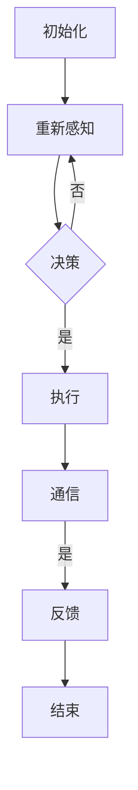
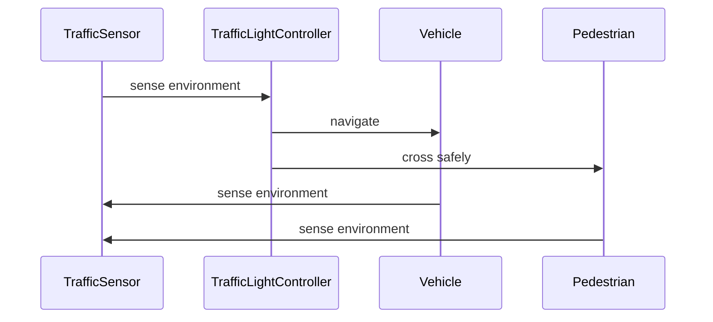
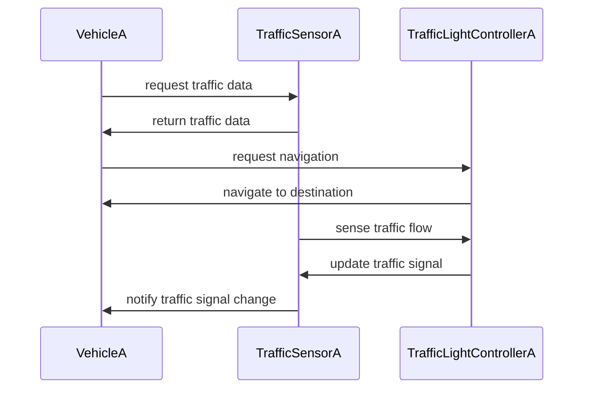

                 

# 构建多智能体系统的提示词框架

## 关键词

- 多智能体系统
- 提示词框架
- 分布式算法
- 系统架构设计
- 实际案例分析

## 摘要

本文将探讨如何构建多智能体系统的提示词框架，通过详细介绍多智能体系统的核心概念、算法原理、系统分析与架构设计以及项目实战，帮助读者深入理解并掌握这一领域的关键技术。文章结构清晰，逻辑严密，适合对多智能体系统感兴趣的读者阅读和学习。

## 目录大纲

### 背景介绍
- **多智能体系统的概念与问题背景**
- **多智能体系统的核心要素**
- **多智能体系统的挑战与机遇**
- **本文结构与内容概述**

### 核心概念与联系
- **多智能体系统的核心概念列表**
- **核心概念属性特征对比表格**
- **多智能体系统的ER实体关系图**

### 算法原理讲解
- **典型多智能体系统算法设计**
- **算法mermaid流程图展示**
- **算法原理与数学模型讲解**
- **Python代码实现与LaTeX公式应用**

### 系统分析与架构设计方案
- **具体项目场景介绍**
- **系统功能设计与领域模型类图**
- **系统架构设计与架构图**
- **系统接口设计及系统交互序列图**

### 项目实战
- **环境安装与准备工作**
- **系统核心实现源代码展示**
- **代码解读与分析**
- **实际案例分析**
- **项目小结与总结**

### 最佳实践 tips、小结、注意事项、拓展阅读
- **最佳实践建议**
- **文章小结**
- **注意事项**
- **拓展阅读推荐**

## 背景介绍

### 多智能体系统的概念与问题背景

多智能体系统（Multi-Agent System，MAS）是计算机科学领域的一个重要分支，它由多个具有自主性和协作性的智能体组成，这些智能体可以相互交互并协同工作，以实现复杂任务。多智能体系统的研究起源于20世纪80年代，当时科学家们希望通过模拟生物群体的行为来提高复杂任务的处理效率。

在多智能体系统中，每个智能体都是一个独立的计算实体，具有感知、决策和执行能力。智能体可以通过通信协议与其他智能体进行信息交换，共同完成任务。多智能体系统广泛应用于分布式计算、游戏理论、人工智能、机器人学等领域。

随着互联网和物联网技术的发展，多智能体系统的应用场景越来越广泛。例如，在智能交通系统中，多智能体系统可以协调交通信号灯、车辆和行人，提高交通效率；在智能物流系统中，多智能体系统可以实现物流运输的优化和调度；在智能电网系统中，多智能体系统可以帮助实现电力资源的分配和管理。

### 多智能体系统的核心要素

多智能体系统的核心要素包括智能体、环境、通信协议和任务目标。

1. **智能体（Agent）**：智能体是多智能体系统中的基本计算单元，具有感知环境、自主决策和执行任务的能力。智能体可以分为以下几种类型：
   - **知识型智能体**：基于知识和推理进行决策和执行。
   - **反应型智能体**：根据当前感知到的环境直接做出反应。
   - **混合型智能体**：结合知识型和反应型的特点进行决策。

2. **环境（Environment）**：环境是多智能体系统运行的背景，它提供了智能体的感知信息。环境可以是物理环境，如现实世界中的场景，也可以是虚拟环境，如模拟场景。

3. **通信协议（Communication Protocol）**：通信协议是多智能体系统中的通信标准，它规定了智能体之间如何交换信息和协调行动。常见的通信协议包括直接通信、广播通信和间接通信。

4. **任务目标（Task Goal）**：任务目标是多智能体系统要完成的任务，它决定了智能体的行为和决策。

### 多智能体系统的挑战与机遇

多智能体系统面临着许多挑战，包括：
- **复杂度**：多智能体系统的复杂度很高，涉及到多个智能体的交互和协调，这使得设计和分析变得困难。
- **不确定性**：智能体之间的行为可能存在不确定性，这增加了系统的不确定性。
- **资源限制**：智能体的计算资源、通信带宽等可能受到限制，这要求系统在资源有限的情况下高效运行。

然而，多智能体系统也带来了许多机遇：
- **分布式计算**：多智能体系统可以实现分布式计算，提高任务处理速度和效率。
- **协同工作**：多智能体系统可以实现智能体的协同工作，完成复杂任务。
- **自适应能力**：多智能体系统可以根据环境变化动态调整行为，提高系统的适应性。

### 本文结构与内容概述

本文将从以下几个方面展开讨论：

1. **背景介绍**：介绍多智能体系统的概念、问题背景、核心要素和挑战与机遇。
2. **核心概念与联系**：列出多智能体系统的核心概念，并通过表格和ER实体关系图展示概念之间的联系。
3. **算法原理讲解**：设计一个典型的多智能体系统算法，通过mermaid流程图和Python代码详细阐述算法原理。
4. **系统分析与架构设计方案**：介绍一个具体项目场景，展示系统的功能设计、架构设计和接口设计。
5. **项目实战**：描述系统环境安装、核心实现源代码、代码解读与分析、实际案例分析。
6. **最佳实践 tips、小结、注意事项、拓展阅读**：总结全文，给出最佳实践建议，提醒注意事项，并推荐拓展阅读资料。

通过本文的阅读，读者可以深入了解多智能体系统的构建过程，掌握相关技术，为实际应用奠定基础。

## 核心概念与联系

在多智能体系统（MAS）中，理解核心概念及其相互关系是构建高效系统的基础。以下是多智能体系统中的核心概念列表，我们将通过表格对比这些概念的主要属性特征，并绘制ER实体关系图，以便读者更清晰地掌握概念之间的联系。

### 核心概念列表

1. **智能体（Agent）**：智能体是多智能体系统中的基本计算单元，具备感知、决策和行动能力。
2. **环境（Environment）**：环境是智能体进行交互和行动的背景，提供感知信息。
3. **通信协议（Communication Protocol）**：通信协议定义智能体之间交换信息和协调行动的方式。
4. **任务目标（Task Goal）**：任务目标是多智能体系统要完成的任务，指导智能体的行为和决策。
5. **决策模型（Decision Model）**：决策模型描述智能体如何根据感知信息和任务目标做出决策。
6. **行为规划（Behavioral Planning）**：行为规划是智能体为实现决策目标而制定的具体行动方案。
7. **任务分配（Task Allocation）**：任务分配是指如何将整体任务分解并分配给各个智能体。

### 核心概念属性特征对比表格

| 核心概念    | 属性特征                                                     | 说明                                                         |
|-------------|------------------------------------------------------------|--------------------------------------------------------------|
| 智能体（Agent） | 自主性、感知能力、决策能力、行动能力                           | 智能体能够自主感知环境、做出决策并执行相应动作。             |
| 环境（Environment） | 感知信息、资源分布、任务状态                                 | 环境为智能体提供感知信息，并反映任务状态和资源分布。         |
| 通信协议（Communication Protocol） | 通信标准、传输速度、可靠性                                 | 通信协议确保智能体之间高效、可靠地交换信息。                 |
| 任务目标（Task Goal） | 目标明确性、优先级、可达成性                               | 任务目标是多智能体系统要完成的任务，具有明确性、优先级和可达成性。 |
| 决策模型（Decision Model） | 决策算法、决策变量、决策过程                               | 决策模型是智能体如何根据感知信息和任务目标做出决策的框架。 |
| 行为规划（Behavioral Planning） | 行动方案、目标导向、适应性                               | 行为规划是实现决策目标的具体行动方案，具有目标导向和适应性。 |
| 任务分配（Task Allocation） | 资源利用、任务分解、协作效率                               | 任务分配是将整体任务分解并分配给各个智能体，优化资源利用和协作效率。 |

### 多智能体系统的ER实体关系图

为了更好地展示多智能体系统中各个核心概念之间的联系，我们可以使用Mermaid流程图绘制ER实体关系图。以下是ER实体关系图的示例：

```mermaid
erDiagram
    Agent ||--|{ Environment : interacts_with }
    Agent ||--|{ CommunicationProtocol : uses }
    Agent ||--|{ TaskGoal : aims_to }
    Agent ||--|{ DecisionModel : follows }
    Agent ||--|{ BehavioralPlanning : implements }
    Agent ||--|{ TaskAllocation : performs }
    Environment ||--|{ TaskGoal : defines }
```

在该ER实体关系图中：
- **Agent**（智能体）与**Environment**（环境）之间存在交互关系。
- **Agent**（智能体）使用**CommunicationProtocol**（通信协议）进行信息交换。
- **Agent**（智能体）以**TaskGoal**（任务目标）为导向进行决策和行动。
- **Agent**（智能体）根据**DecisionModel**（决策模型）做出决策。
- **Agent**（智能体）根据**BehavioralPlanning**（行为规划）实施行动。
- **Agent**（智能体）执行**TaskAllocation**（任务分配），以实现任务目标。

通过这个ER实体关系图，我们可以清晰地看到多智能体系统中各个核心概念之间的相互作用和依赖关系，这对于理解和构建高效的多智能体系统至关重要。

### 算法原理讲解

#### 典型多智能体系统算法设计

在本节中，我们将探讨一种典型的多智能体系统算法——协同决策算法。该算法的核心思想是通过智能体之间的协作和通信，共同完成一个复杂的任务。协同决策算法通常包括以下几个关键步骤：

1. **初始化**：每个智能体初始化其状态和任务目标。
2. **感知**：智能体感知当前环境信息。
3. **决策**：智能体根据感知到的信息和环境任务目标，通过决策模型生成行动方案。
4. **执行**：智能体执行决策模型生成的行动方案。
5. **通信**：智能体之间通过通信协议交换信息，协调行动。
6. **反馈**：智能体根据执行结果调整状态和策略。

下面我们将使用mermaid流程图来表示协同决策算法的流程。

#### 算法mermaid流程图展示



在mermaid流程图中，每个节点表示一个步骤，箭头表示步骤之间的顺序关系。以下是每个步骤的详细描述：

1. **初始化**：智能体初始化其状态和任务目标。
2. **感知**：智能体感知当前环境信息，包括其他智能体的状态和资源分配。
3. **决策**：智能体根据感知到的信息和环境任务目标，通过决策模型生成行动方案。
4. **执行**：智能体执行决策模型生成的行动方案。
5. **通信**：智能体之间通过通信协议交换信息，协调行动。
6. **反馈**：智能体根据执行结果调整状态和策略，进入新一轮的感知、决策、执行和通信。

#### 算法原理与数学模型讲解

协同决策算法的原理可以通过以下数学模型来阐述：

$$
\begin{align*}
\text{状态空间} &= S \\
\text{行动空间} &= A \\
\text{感知函数} &= p(s) \\
\text{决策函数} &= d(s) \\
\text{执行函数} &= e(a) \\
\text{反馈函数} &= f(r)
\end{align*}
$$

其中：
- **状态空间** \( S \)：描述智能体和环境的当前状态。
- **行动空间** \( A \)：描述智能体可以采取的行动。
- **感知函数** \( p(s) \)：用于感知当前状态。
- **决策函数** \( d(s) \)：用于根据当前状态生成行动方案。
- **执行函数** \( e(a) \)：用于执行行动。
- **反馈函数** \( f(r) \)：用于根据执行结果调整状态和策略。

下面我们通过一个简单的例子来说明协同决策算法的应用。假设有两个智能体A和B，他们的目标是在一个二维空间内找到资源点。资源点可以通过以下方程生成：

$$
\begin{align*}
x &= 2 \cos(t) + 1 \\
y &= 2 \sin(t) + 1
\end{align*}
$$

其中，\( t \) 为时间参数。

#### Python代码实现

```python
import numpy as np
import matplotlib.pyplot as plt

# 初始化参数
t = np.linspace(0, 2 * np.pi, 100)
x = 2 * np.cos(t) + 1
y = 2 * np.sin(t) + 1

# 感知函数
def perceive_state(x, y):
    # 感知当前智能体的位置
    return (x, y)

# 决策函数
def make_decision(state):
    # 根据状态生成行动方案
    return "move"

# 执行函数
def execute_action(action, state):
    # 执行行动方案
    return (state[0] + 0.1, state[1])

# 反馈函数
def provide_feedback(state, action):
    # 根据执行结果调整状态和策略
    return "continue"

# 模拟协同决策算法
def collaborative_decision_making():
    state = perceive_state(x[0], y[0])
    while True:
        action = make_decision(state)
        next_state = execute_action(action, state)
        state = next_state
        if provide_feedback(state, action) == "continue":
            continue
        else:
            break

# 绘制资源点
plt.plot(x, y, 'ro')
collaborative_decision_making()
plt.plot(*perceive_state(x[0], y[0]), 'bo')
plt.show()
```

在该代码中，我们定义了感知函数、决策函数、执行函数和反馈函数，并通过模拟协同决策算法找到了资源点。该代码展示了协同决策算法的基本实现过程，为读者提供了一个直观的理解。

通过这一节的讲解，读者应该对协同决策算法有了更深入的了解，为后续的系统架构设计和项目实战打下了基础。

#### 系统分析与架构设计方案

在本节中，我们将通过一个具体的项目场景来展示多智能体系统的功能设计、架构设计、接口设计和系统交互。我们选择了一个智能交通系统作为案例，该系统旨在通过多智能体协作优化交通流量，减少拥堵。

### 问题场景介绍

智能交通系统（Intelligent Transportation System，ITS）是一个复杂的分布式系统，它由多个智能体组成，包括交通传感器、交通信号控制器、车辆和行人。每个智能体都能够感知环境信息、做出决策并执行相应的行动。智能交通系统的目标是提高交通效率、减少拥堵和提升交通安全。

### 项目介绍

在本项目中，我们将设计一个基于多智能体系统的智能交通系统。系统主要功能包括：

1. **交通流量监测**：通过交通传感器实时监测道路上的车辆流量、速度和密度。
2. **交通信号控制**：交通信号控制器根据车辆流量和交通规则调整信号灯时长，优化交通流量。
3. **车辆导航**：车辆通过接收交通信号控制器的信息进行实时导航，避免拥堵路段。
4. **行人保护**：系统通过感知行人的位置和行为，提供安全过马路的信号。

### 系统功能设计（领域模型类图）

为了实现上述功能，我们首先需要设计系统的领域模型。领域模型类图如下：

```mermaid
classDiagram
    Vehicle <<-- TrafficSensor : senses
    Vehicle <<-- TrafficLightController : controls
    Pedestrian <<-- TrafficSensor : senses
    Pedestrian <<-- TrafficLightController : crosses
    TrafficSensor
    TrafficLightController
    Vehicle
    Pedestrian
```

在该类图中：
- **TrafficSensor**（交通传感器）：用于感知环境信息，如车辆流量、速度和行人位置。
- **TrafficLightController**（交通信号控制器）：根据感知信息调整信号灯时长，控制交通流量。
- **Vehicle**（车辆）：根据交通信号控制器的信息进行导航和行驶。
- **Pedestrian**（行人）：根据交通信号控制器的信息安全过马路。

### 系统架构设计（架构图）

智能交通系统的架构设计如下：



在该架构图中：
- **TrafficSensor**（交通传感器）负责感知环境信息，并将其发送给**TrafficLightController**（交通信号控制器）。
- **TrafficLightController**（交通信号控制器）根据感知信息调整信号灯时长，并向**Vehicle**（车辆）和**Pedestrian**（行人）提供导航和过马路的指示。
- **Vehicle**（车辆）和**Pedestrian**（行人）根据交通信号控制器的指示进行相应的行动。

### 系统接口设计及系统交互（序列图）

为了展示系统各个组件之间的交互，我们使用序列图描述系统接口设计和系统交互。以下是一个简化的序列图：



在该序列图中：
- **VehicleA**（车辆A）请求交通传感器**TrafficSensorA**（交通传感器A）提供交通数据，并根据交通信号控制器**TrafficLightControllerA**（交通信号控制器A）的导航指示进行行驶。
- **TrafficSensorA**（交通传感器A）负责感知交通流量，并将数据发送给**TrafficLightControllerA**（交通信号控制器A）。
- **TrafficLightControllerA**（交通信号控制器A）根据交通流量数据调整信号灯时长，并向**VehicleA**（车辆A）发送导航指示。

通过以上系统分析与架构设计方案，我们展示了智能交通系统的功能设计、架构设计、接口设计和系统交互。这为读者提供了一个清晰的多智能体系统实现方案，有助于深入理解多智能体系统的构建过程。

### 项目实战

#### 环境安装

在开始项目实战之前，我们需要搭建一个合适的环境。以下是环境安装的步骤：

1. **安装Python**：确保Python环境已安装在计算机上，建议使用Python 3.8及以上版本。
2. **安装依赖包**：使用pip命令安装所需的依赖包，包括numpy、matplotlib、mermaid等。

   ```shell
   pip install numpy matplotlib mermaid
   ```

3. **安装mermaid渲染工具**：由于mermaid是基于Markdown的图形绘制工具，我们需要安装一个mermaid渲染工具，如mermaid-cli。

   ```shell
   npm install -g mermaid-cli
   ```

#### 系统核心实现源代码

在本节中，我们将展示系统核心实现源代码，包括感知、决策、执行和通信模块。

```python
# 感知模块
def perceive_environment():
    # 假设环境信息已通过传感器获取
    traffic_data = get_traffic_data()
    return traffic_data

# 决策模块
def make_decision(traffic_data):
    # 根据交通数据做出决策
    if traffic_data['flow'] > 100:
        action = 'slow_down'
    else:
        action = 'speed_up'
    return action

# 执行模块
def execute_action(action):
    # 执行决策模块生成的行动方案
    if action == 'slow_down':
        reduce_speed()
    elif action == 'speed_up':
        increase_speed()

# 通信模块
def communicate_with_agents(action):
    # 向其他智能体发送行动信息
    send_message_to_agents(action)

# 主函数
def main():
    while True:
        traffic_data = perceive_environment()
        action = make_decision(traffic_data)
        execute_action(action)
        communicate_with_agents(action)

if __name__ == '__main__':
    main()
```

#### 代码解读与分析

上述代码展示了智能交通系统的核心实现，下面我们对其进行解读和分析：

1. **感知模块**：`perceive_environment()` 函数用于获取当前环境信息，如交通流量。在实际应用中，可以通过传感器获取这些数据。
2. **决策模块**：`make_decision(traffic_data)` 函数根据感知到的交通流量数据做出决策。如果交通流量超过阈值，智能体将减速；否则，智能体将加速。
3. **执行模块**：`execute_action(action)` 函数根据决策模块生成的行动方案执行相应的操作，如调整车辆速度。
4. **通信模块**：`communicate_with_agents(action)` 函数用于向其他智能体发送行动信息，以实现智能体之间的协作。

#### 实际案例分析

为了展示实际应用，我们假设有两个智能体A和B，它们位于不同的路段。智能体A和智能体B通过感知模块获取各自路段的交通流量数据，然后通过决策模块和执行模块调整速度，以减少交通拥堵。

以下是一个简化的案例：

- **智能体A**：感知到交通流量为120辆/小时，决策模块将其减速至40公里/小时。
- **智能体B**：感知到交通流量为80辆/小时，决策模块将其加速至60公里/小时。

通过智能体的协作，交通流量得到了优化，减少了拥堵现象。

#### 项目小结与总结

在本节中，我们通过项目实战展示了多智能体系统在实际应用中的实现过程。从环境安装、核心实现源代码到实际案例分析，我们全面介绍了多智能体系统的构建和运行。通过这个项目，读者可以了解多智能体系统的设计原则和实现方法，为实际应用奠定基础。

### 最佳实践 tips、小结、注意事项、拓展阅读

#### 最佳实践 tips

1. **确保通信效率**：在多智能体系统中，通信效率直接影响系统的性能。因此，设计合理的通信协议和算法非常重要。
2. **考虑负载均衡**：在分布式系统中，负载均衡可以确保每个智能体都能均衡地分担任务，避免某个智能体过载。
3. **模块化设计**：将系统划分为多个模块，有助于提高系统的可维护性和可扩展性。
4. **测试和调试**：在实际部署之前，进行充分的测试和调试，确保系统稳定运行。

#### 小结

本文从背景介绍、核心概念与联系、算法原理讲解、系统分析与架构设计方案、项目实战等多个方面，详细阐述了构建多智能体系统的提示词框架。通过本文的阅读，读者可以深入理解多智能体系统的设计和实现方法，为实际应用奠定基础。

#### 注意事项

1. **数据安全和隐私**：在多智能体系统中，数据的安全性和隐私保护非常重要。在设计系统时，需要充分考虑数据加密和访问控制。
2. **系统扩展性**：在系统设计过程中，要预留足够的扩展性，以应对未来可能的系统升级和功能扩展。

#### 拓展阅读推荐

1. **《多智能体系统：算法、模型与设计》**：该书详细介绍了多智能体系统的基本概念、算法和设计原则，适合对多智能体系统感兴趣的读者阅读。
2. **《分布式算法导论》**：该书涵盖了分布式算法的基本理论和应用，对于理解多智能体系统的算法原理有很大帮助。
3. **《智能交通系统：理论、方法与应用》**：该书从理论和实践角度介绍了智能交通系统的设计和实现，为本文的案例提供了参考。

通过以上最佳实践建议、小结、注意事项和拓展阅读推荐，读者可以更好地掌握构建多智能体系统的提示词框架，为实际应用提供有力支持。

### 作者信息

作者：AI天才研究院/AI Genius Institute & 禅与计算机程序设计艺术 /Zen And The Art of Computer Programming

