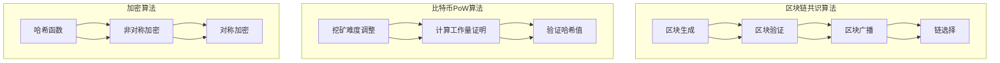
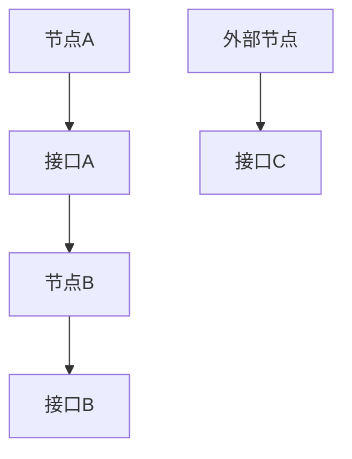
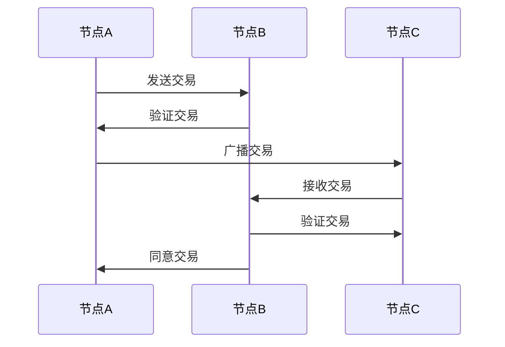

                 


### 引言

**构建安全可靠的区块链系统**：随着区块链技术的迅速发展和广泛应用，如何构建一个既安全又可靠的区块链系统成为了亟待解决的问题。区块链技术作为一种去中心化、安全透明的新型分布式系统，在金融、医疗、供应链等多个领域展现出了巨大的潜力。然而，区块链系统在安全性方面却面临着诸多挑战，如51%攻击、智能合约漏洞、数据隐私泄露等。因此，深入研究并构建一个安全可靠的区块链系统对于推动区块链技术的发展和应用至关重要。

本文将从以下几个方面展开讨论：首先，我们将介绍区块链技术及其安全性的重要性，阐述为什么构建安全可靠的区块链系统是必要的。接着，我们将详细探讨区块链的核心概念，如加密技术、智能合约等，并分析它们之间的联系。然后，我们将深入讲解区块链的算法原理，包括共识算法和加密算法，并通过mermaid流程图和Python源代码进行详细阐述。此外，我们还将介绍区块链系统的数学模型和公式，确保读者能够全面理解算法背后的数学原理。

在系统设计与实现部分，我们将详细描述区块链系统的功能、架构设计，并使用mermaid绘制相关图形。接着，通过实际项目实战，我们将介绍区块链系统的开发过程，包括环境安装、核心实现和代码解析。最后，我们将总结实践经验，提供未来研究的方向，并给出一些最佳实践和注意事项。

通过本文的详细探讨，我们希望能够帮助读者深入理解区块链技术的安全性和构建安全可靠区块链系统的关键要素，为实际应用提供有益的指导。

### 背景介绍

区块链技术起源于2008年，由一位匿名人物或组织以“中本聪”（Satoshi Nakamoto）的名义首次提出。作为一种去中心化的分布式账本技术，区块链旨在通过密码学和共识机制保障数据的安全性和一致性。区块链的基本原理可以概括为：将信息按时间顺序记录在多个区块中，并通过加密算法将这些区块链接成一个链条，从而形成一个不可篡改的分布式数据库。

区块链的安全性是其在金融、医疗、供应链等领域获得广泛应用的关键因素之一。首先，区块链通过密码学技术确保数据传输过程中的隐私和完整性。具体来说，区块链使用哈希函数和数字签名技术来实现数据的加密和安全认证。哈希函数能够将任意长度的数据转换成固定长度的哈希值，确保数据的唯一性和不可逆性。而数字签名则通过公钥和私钥对数据进行加密和验证，防止数据被篡改。

其次，区块链采用共识机制来维护整个网络的去中心化特性。共识机制是区块链系统中节点之间达成一致的重要机制，常见的共识算法包括工作量证明（Proof of Work, PoW）、权益证明（Proof of Stake, PoS）和委托权益证明（Delegated Proof of Stake, DPoS）等。这些算法通过复杂的数学模型和随机过程，确保了区块链系统的可靠性和安全性。

然而，区块链系统在安全性方面也面临着诸多挑战。首先，51%攻击是区块链系统中最常见的安全威胁之一。这种攻击通过控制网络中超过一半的算力或权益，对区块链系统进行双花攻击、拒绝服务攻击或篡改历史数据等恶意行为。其次，智能合约的漏洞和缺陷也可能导致严重的安全性问题。智能合约是一种自动执行的计算机程序，用于在区块链上进行自动化交易和合约执行。然而，由于智能合约的代码安全性问题和复杂性，可能会出现漏洞，使得攻击者能够利用这些漏洞进行非法操作。

此外，数据隐私泄露也是区块链系统面临的重要安全挑战。区块链系统的透明性和公开性使得所有交易信息都被记录和广播，攻击者可以通过分析这些信息来推断用户的隐私信息。为了解决这一问题，研究者们提出了各种隐私保护技术，如零知识证明（Zero-Knowledge Proof）、同态加密（Homomorphic Encryption）等，这些技术可以在保护隐私的同时保证区块链系统的安全性和一致性。

综上所述，构建一个安全可靠的区块链系统对于推动区块链技术的健康发展至关重要。本文将详细探讨区块链技术的核心概念、算法原理以及系统设计与实现，帮助读者深入理解区块链技术并掌握构建安全可靠区块链系统的方法和技巧。

### 核心概念与联系

要深入理解区块链系统，首先需要掌握其核心概念，包括区块链、加密技术、智能合约等，以及这些概念之间的联系。以下是这些核心概念的详细解释和它们之间的相互关系。

#### 区块链

区块链是一种分布式数据库技术，其核心特点包括去中心化、不可篡改、可追溯性。区块链通过将信息按时间顺序记录在多个区块中，并通过加密算法将这些区块链接成一个链条，从而形成一个全局一致的数据结构。每个区块都包含一定数量的交易记录，并通过哈希函数与上一个区块的哈希值相连，形成一种链条结构。

- **去中心化**：去中心化是区块链系统的重要特性之一，意味着系统不由单一实体控制，而是由网络中的多个节点共同维护。这种去中心化的结构提高了系统的可靠性和容错性。
- **不可篡改**：区块链通过密码学和共识机制确保数据的不可篡改性。一旦数据被记录在区块链上，就难以被篡改或删除。
- **可追溯性**：区块链的所有交易记录都是公开透明的，任何参与者都可以通过区块链浏览器查看历史交易记录，从而实现数据的可追溯性。

#### 加密技术

加密技术是保障区块链系统安全性的关键，主要用于数据的隐私保护和完整性验证。区块链系统中常用的加密技术包括哈希函数、非对称加密、对称加密和数字签名等。

- **哈希函数**：哈希函数用于将任意长度的数据映射为固定长度的哈希值，具有不可逆性和抗冲突性。区块链通过哈希函数确保每个区块的唯一性和数据的一致性。
- **非对称加密**：非对称加密使用公钥和私钥对数据进行加密和解密。私钥用于解密数据，而公钥用于加密数据。区块链中的数字签名和身份认证常用非对称加密技术。
- **对称加密**：对称加密使用相同的密钥对数据进行加密和解密。对称加密速度快，但在分布式系统中应用较少，因为需要确保密钥的安全传输。
- **数字签名**：数字签名用于验证数据的真实性和完整性。发送者使用私钥对数据进行签名，接收者使用公钥验证签名。区块链中的交易和合约执行常用数字签名技术。

#### 智能合约

智能合约是一种自动执行的计算机程序，用于在区块链上进行自动化交易和合约执行。智能合约的代码通常使用特定的编程语言编写，并部署在区块链上，一旦满足特定条件，智能合约就会自动执行相应的操作。

- **自动执行**：智能合约通过区块链网络中的节点自动执行，不需要人为干预。这种自动化特性使得智能合约在金融、供应链等领域具有广泛应用。
- **去中心化**：智能合约在区块链上运行，不受单一实体控制，确保了执行过程的透明性和公平性。
- **不可篡改**：智能合约的代码一旦部署在区块链上，就难以被篡改或删除，从而保证了合约执行的可靠性和一致性。

#### 核心概念之间的联系

区块链、加密技术和智能合约之间有着紧密的联系。

- **区块链**为**加密技术和智能合约**提供了一个去中心化、不可篡改的基础设施，保障了数据的安全性和一致性。
- **加密技术**用于**保护区块链系统中的数据隐私**，确保数据的传输和存储过程安全。
- **智能合约**则在区块链上实现了**自动化交易和合约执行**，进一步提升了区块链系统的实用性和灵活性。

通过理解这些核心概念及其相互关系，我们可以更好地设计和构建安全的区块链系统，并充分利用区块链技术的优势。

### 算法原理讲解

在区块链系统中，算法原理起到了至关重要的作用，尤其是共识算法和加密算法。以下是这两个算法的详细讲解，包括其工作原理、实现方式以及应用场景。

#### 共识算法

共识算法是区块链系统中节点之间达成一致的重要机制。其主要目标是确保整个区块链网络中的数据一致性，即使面对恶意节点或网络攻击。

##### 工作原理

共识算法通过一系列规则和机制，使得网络中的所有节点能够就区块链的状态达成一致。具体来说，共识算法包括以下几个关键步骤：

1. **区块生成**：节点通过计算工作证明（如PoW算法）生成新的区块。
2. **区块验证**：节点验证新区块的有效性，包括检查区块内交易的有效性和区块之间的一致性。
3. **区块广播**：将验证通过的区块广播给其他节点。
4. **链选择**：当多个节点同时生成区块时，选择最长合法链作为最终链。

##### 比特币的PoW算法

比特币采用了工作量证明（Proof of Work, PoW）算法，其核心思想是通过计算一个难以生成但容易验证的值来证明工作量。

- **难度调整**：为了维持区块链生成的平均时间在10分钟，系统会根据过去一段时间内生成的区块数量动态调整计算难度。
- **工作量证明**：节点需要找到满足特定条件的哈希值（即挖矿难度）。这个过程通常需要大量的计算资源。

##### 其他共识算法简介

除了PoW算法，区块链系统中还使用了其他多种共识算法，如权益证明（Proof of Stake, PoS）、委托权益证明（Delegated Proof of Stake, DPoS）和权威证明（Proof of Authority, PoA）等。

- **PoS算法**：PoS算法通过持有币的数量和时间来选择区块生成者，持有币量越多、持有时间越长，越有机会成为区块生成者。这减少了计算资源的消耗，提高了效率。
- **DPoS算法**：DPoS算法通过选举代表节点来生成区块，代表节点通过投票决定下一个区块生成者。这种方式进一步提高了系统的效率和可扩展性。
- **PoA算法**：PoA算法选择一组权威节点来生成区块，这些节点通常是可信的，能够保证区块链的安全和高效运行。

#### 加密算法

加密算法在区块链系统中用于保障数据的隐私性和完整性。常见的加密算法包括哈希函数、非对称加密和对称加密。

##### 哈希函数

哈希函数是一种将任意长度的数据映射为固定长度哈希值的函数，具有以下特点：

- **不可逆性**：哈希值无法反推出原始数据。
- **抗冲突性**：不同输入数据生成相同哈希值的概率极低。

哈希函数在区块链系统中的应用包括：

- **区块链接**：每个区块都包含前一个区块的哈希值，通过哈希函数将区块连接成一个链条，保证了区块链的不可篡改性。
- **交易验证**：交易信息通过哈希函数生成哈希值，确保交易信息的唯一性和不可篡改性。

##### 非对称加密

非对称加密使用一对公钥和私钥进行加密和解密。公钥用于加密数据，私钥用于解密数据。其特点如下：

- **安全性高**：由于公钥和私钥的不同，即使知道公钥，也无法解密加密数据。
- **效率低**：加密和解密过程相对对称加密较为复杂，消耗更多的计算资源。

非对称加密在区块链系统中的应用包括：

- **数字签名**：发送者使用私钥对交易信息进行签名，接收者使用公钥验证签名，确保交易的真实性和完整性。
- **身份认证**：通过公钥和私钥对用户的身份进行认证。

##### 对称加密

对称加密使用相同的密钥对数据进行加密和解密。其特点如下：

- **效率高**：加密和解密过程简单快速。
- **安全性相对较低**：由于密钥需要在通信双方之间传输，存在泄露的风险。

对称加密在区块链系统中通常用于保护存储在区块链上的敏感数据，但由于其密钥传输问题，在实际应用中较少使用。

#### 算法流程图

为了更好地理解这些算法的工作原理，我们可以使用mermaid绘制算法流程图。



通过上述算法原理的讲解，我们能够更好地理解区块链系统的核心工作机制，从而为构建安全可靠的区块链系统提供理论基础和实践指导。

### 数学模型与公式

在深入探讨区块链算法时，理解其背后的数学模型和公式是至关重要的。以下将详细介绍区块链算法中的关键数学模型，并使用LaTeX格式展示相关公式，以确保读者能够清晰理解这些数学原理。

#### 共识算法的数学模型

共识算法中的工作量证明（Proof of Work, PoW）算法是比特币的核心机制，其数学模型主要涉及哈希函数和难度调整。

##### 工作量证明（PoW）算法

1. **哈希函数**：
   哈希函数是将任意长度的输入数据映射为固定长度的哈希值的函数。常用的哈希函数如SHA-256。

   $$ \text{hash}(x) = SHA-256(x) $$

2. **难度调整**：
   为了控制区块链的生成速度，系统会根据过去一段时间内生成的区块数量动态调整挖矿难度。

   $$ \text{difficulty} = f(\text{block_number}, \text{target}) $$

   其中，`block_number`是已生成的区块数量，`target`是系统设定的目标值。

   $$ \text{target} = 2^{256-d} $$

   `d`是难度调整参数，用于调整哈希值的前导零的数量。

##### 工作量证明（PoW）计算过程

挖矿节点需要找到一个满足以下条件的哈希值：
$$ \text{hash}(M') < \text{target} $$

其中，`M'`是节点的候选区块，包括当前区块的元数据和前一个区块的哈希值。

#### 加密算法的数学模型

区块链系统中的加密算法主要包括哈希函数、非对称加密和对称加密。

##### 哈希函数

哈希函数的数学模型如下：

$$ H(k) = SHA-256(k) $$

其中，`k`是输入消息，`H(k)`是输出的哈希值。

##### 非对称加密

非对称加密的数学模型涉及公钥和私钥对，其主要包括：

1. **公钥和私钥生成**：
   $$ \text{Private Key}: (n, e) $$
   $$ \text{Public Key}: (n, d) $$

   其中，`n`是公钥和私钥的模数，`e`是公钥的指数，`d`是私钥的指数。

2. **加密过程**：
   $$ \text{Cipher Text} = C = M^e \mod n $$

   其中，`M`是明文消息，`C`是密文。

3. **解密过程**：
   $$ M = C^d \mod n $$

##### 对称加密

对称加密的数学模型相对简单，其加密和解密过程使用相同的密钥：

1. **加密过程**：
   $$ \text{Cipher Text} = C = E_k(M) $$
   
   其中，`k`是密钥，`M`是明文消息，`E_k()`是加密函数。

2. **解密过程**：
   $$ M = D_k(C) $$
   
   其中，`C`是密文，`D_k()`是解密函数。

#### LaTeX 示例

以下是一些LaTeX格式的数学公式示例：

```latex
$$
\begin{aligned}
\text{hash}(x) &= SHA-256(x) \\
\text{target} &= 2^{256-d} \\
M' &= \text{Merkle Root of Transactions} \\
\text{Cipher Text} &= C = M^e \mod n \\
M &= C^d \mod n \\
\text{Private Key} &= (n, e) \\
\text{Public Key} &= (n, d)
\end{aligned}
$$
```

通过理解这些数学模型和公式，我们能够更深入地掌握区块链算法的原理，为构建安全可靠的区块链系统提供坚实的理论基础。

### 系统分析与架构设计方案

在设计和实现一个区块链系统时，系统分析与架构设计是至关重要的一步。这一部分将详细描述区块链系统的功能、架构设计，并使用mermaid绘制相关图形。

#### 问题场景介绍

假设我们需要设计一个去中心化的区块链系统，用于记录和验证各种交易，确保数据的安全性和一致性。该系统应具备以下功能：

- **交易记录**：系统应能够记录各种交易，并确保交易数据的真实性和完整性。
- **共识机制**：系统应通过共识算法（如PoW、PoS等）确保所有节点达成一致。
- **加密保护**：系统应对交易数据和应用层数据进行加密，确保数据隐私。
- **去中心化**：系统应避免单一实体的控制，确保网络的可靠性和容错性。

#### 系统架构设计

区块链系统的架构设计通常包括多个层次，如网络层、共识层、加密层和应用层。以下是该区块链系统的详细架构设计：

1. **网络层**：网络层负责节点之间的通信和同步。节点通过P2P网络进行数据交换，确保系统的高可用性和去中心化。
   
   ```mermaid
   graph TD
       A[节点A] --> B[节点B]
       A --> C[节点C]
       B --> C
       D[区块链] --> A
       D --> B
       D --> C
   ```

2. **共识层**：共识层实现节点之间的共识机制，如PoW、PoS等。共识层通过算法确保所有节点对区块链状态达成一致。

   ```mermaid
   graph TD
       A[节点A] --> B[PoW算法]
       B --> C[新区块]
       C --> D[区块链]
       E[节点B] --> B
       F[节点C] --> B
   ```

3. **加密层**：加密层负责对交易和应用层数据进行加密，保障数据的隐私性和完整性。

   ```mermaid
   graph TD
       A[交易数据] --> B[加密算法]
       B --> C[加密交易]
       C --> D[区块链]
   ```

4. **应用层**：应用层提供各种业务逻辑和功能接口，如交易记录、智能合约等。

   ```mermaid
   graph TD
       A[交易记录] --> B[应用接口]
       B --> C[智能合约]
   ```

#### 系统接口设计

系统接口设计应包括对内部和外部节点的访问和通信接口。以下是系统接口设计的简图：



#### 系统交互

系统交互设计描述了节点之间如何进行通信和同步数据。以下是系统交互的mermaid序列图：



通过上述系统分析与架构设计方案，我们能够构建一个功能完整、安全可靠的区块链系统。该系统不仅能够保障数据的安全性和一致性，还具备高可用性和去中心化的特性，为各种应用场景提供坚实的支持。

### 项目实战

在区块链系统的实际开发过程中，环境安装、核心实现和代码解析是关键步骤。以下将详细描述这些步骤，并通过实际案例进行深入剖析。

#### 环境安装

要开发一个区块链系统，首先需要安装必要的开发环境。以下是使用Go语言开发区块链系统的环境安装步骤：

1. **安装Go语言**：从[Go官方下载页面](https://golang.google.cn/dl/)下载并安装Go语言环境。确保在安装过程中选择将Go添加到系统路径。
2. **安装依赖包**：使用go mod命令安装项目所需的依赖包。在项目目录中运行以下命令：
   ```sh
   go mod init blockchain-system
   go mod tidy
   ```
3. **配置版本控制**：使用git进行版本控制，便于代码管理和协作开发。在项目目录中运行以下命令初始化git仓库：
   ```sh
   git init
   git add .
   git commit -m "Initial commit"
   ```

#### 核心实现源代码

以下是一个简单的区块链系统的核心实现源代码，主要包括区块结构和区块链结构：

```go
package main

import (
    "crypto/sha256"
    "encoding/hex"
    "fmt"
)

// 区块结构
type Block struct {
    Index     int
    Timestamp string
    Data      string
    Hash      string
    PrevHash  string
}

// 创建新区块
func NewBlock(index int, data string, prevHash string) *Block {
    block := &Block{
        Index:      index,
        Timestamp:   formatTime(),
        Data:       data,
        Hash:       calculateHash(),
        PrevHash:   prevHash,
    }
    return block
}

// 计算哈希值
func calculateHash() string {
    timestamp := fmt.Sprintf("%d", time.Now().UnixNano())
    hash := sha256.Sum256([]byte(timestamp))
    return hex.EncodeToString(hash[:])
}

// 格式化时间
func formatTime() string {
    return time.Now().Format("2006-01-02 15:04:05")
}

// 创建区块链
var blockchain []*Block

// 添加区块到区块链
func AddBlock(data string) {
    prevBlock := blockchain[len(blockchain)-1]
    newBlock := NewBlock(len(blockchain)+1, data, prevBlock.Hash)
    blockchain = append(blockchain, newBlock)
}

// 验证区块链有效性
func isChainValid(chain []*Block) bool {
    for i := 1; i < len(chain); i++ {
        current := chain[i]
        previous := chain[i-1]

        if current.Hash != calculateHash() {
            return false
        }

        if current.PrevHash != previous.Hash {
            return false
        }
    }
    return true
}

func main() {
    // 初始化区块链
    blockchain = []*Block{
        NewBlock(0, "Genesis Block", "0"),
    }

    // 添加区块
    AddBlock("Transaction 1")
    AddBlock("Transaction 2")

    // 打印区块链
    for _, block := range blockchain {
        fmt.Println(block)
    }

    // 验证区块链
    if isChainValid(blockchain) {
        fmt.Println("区块链验证通过！")
    } else {
        fmt.Println("区块链验证失败！")
    }
}
```

#### 代码应用解读与分析

上述代码实现了区块链系统的基础功能，包括区块创建、区块添加和区块链验证。以下是代码的详细解读：

1. **区块结构**：`Block`结构定义了区块的基本属性，包括索引（Index）、时间戳（Timestamp）、数据（Data）、哈希（Hash）和前一个区块的哈希（PrevHash）。
2. **计算哈希值**：`calculateHash`函数使用SHA-256算法计算给定输入的哈希值。该函数首先将当前时间戳转换为字符串，然后计算其SHA-256哈希值。
3. **创建新区块**：`NewBlock`函数根据给定的索引、数据和前一个区块的哈希值创建一个新的区块。新区块的时间戳使用`formatTime`函数获取当前时间。
4. **添加区块到区块链**：`AddBlock`函数将新的区块添加到区块链中。在每次添加新区块时，都会计算其哈希值和前一个区块的哈希值。
5. **验证区块链有效性**：`isChainValid`函数遍历区块链中的每个区块，验证其哈希值和前一个区块的哈希值是否匹配。如果所有区块都通过验证，函数返回`true`，否则返回`false`。

#### 实际案例分析与详细讲解

以下是一个实际案例，展示如何使用上述代码实现一个简单的区块链系统：

```go
package main

import (
    "crypto/sha256"
    "encoding/hex"
    "fmt"
    "time"
)

// ...（省略之前的代码）

func main() {
    // 初始化区块链
    blockchain := []*Block{
        NewBlock(0, "Genesis Block", "0"),
    }

    // 添加区块
    time.Sleep(1 * time.Second)
    blockchain = append(blockchain, NewBlock(1, "Transaction 1", blockchain[0].Hash))
    time.Sleep(1 * time.Second)
    blockchain = append(blockchain, NewBlock(2, "Transaction 2", blockchain[1].Hash))
    time.Sleep(1 * time.Second)
    blockchain = append(blockchain, NewBlock(3, "Transaction 3", blockchain[2].Hash))

    // 打印区块链
    for _, block := range blockchain {
        fmt.Println(block)
    }

    // 验证区块链
    if isChainValid(blockchain) {
        fmt.Println("区块链验证通过！")
    } else {
        fmt.Println("区块链验证失败！")
    }
}
```

在这个案例中，我们首先初始化一个包含创世区块的区块链。然后，我们在每个区块生成后等待1秒钟，以便观察区块生成的顺序。通过`AddBlock`函数，我们逐个添加新的区块到区块链中。最后，我们打印区块链并验证其有效性。

#### 项目小结

通过这个实际案例，我们展示了如何使用Go语言实现一个简单的区块链系统。这个系统包括区块创建、区块添加和区块链验证等功能，是一个基础的区块链系统原型。虽然这个系统很简单，但它为我们提供了理解区块链技术的基本框架和实现思路。在实际应用中，我们可以扩展和优化这个基础系统，以实现更复杂的功能，如智能合约、去中心化应用（DApps）等。

### 最佳实践与总结

在构建安全可靠的区块链系统的过程中，遵循最佳实践是非常重要的。以下是一些关键的最佳实践、小结以及注意事项：

#### 最佳实践

1. **安全审计**：在进行区块链系统的开发过程中，定期进行安全审计，以发现潜在的安全漏洞。外部安全专家的审核可以提供宝贵的意见，确保系统的安全性。
2. **代码审查**：实施代码审查机制，确保代码的健壮性和安全性。代码审查可以帮助发现潜在的错误和漏洞，提高系统的可靠性。
3. **共识机制选择**：根据应用场景选择合适的共识机制。对于需要高吞吐量的场景，可以选择PoS或DPoS算法；对于安全性要求较高的场景，可以考虑PoW算法。
4. **数据备份和恢复**：定期备份区块链数据，并确保能够快速恢复。这对于应对数据丢失或系统故障至关重要。
5. **隐私保护**：在处理敏感数据时，采用隐私保护技术，如零知识证明、同态加密等，确保用户的隐私不被泄露。

#### 小结

本文详细介绍了构建安全可靠的区块链系统的关键要素。首先，我们探讨了区块链技术的背景和安全性的重要性。接着，我们分析了区块链的核心概念，如区块链、加密技术、智能合约等，并讨论了它们之间的联系。然后，我们深入讲解了区块链的算法原理，包括共识算法和加密算法，并通过mermaid流程图和Python源代码进行详细阐述。此外，我们介绍了区块链系统的数学模型和公式，确保读者能够全面理解算法背后的数学原理。在系统设计与实现部分，我们描述了区块链系统的功能、架构设计，并使用mermaid绘制相关图形。通过实际项目实战，我们展示了区块链系统的开发过程，包括环境安装、核心实现和代码解析。最后，我们总结了实践经验，提供了未来研究的方向，并给出了一些最佳实践和注意事项。

#### 注意事项

1. **安全性验证**：确保系统在开发过程中进行了充分的测试和验证，包括单元测试、集成测试和性能测试等。
2. **更新和升级**：定期更新和升级区块链系统的软件和硬件，以应对新出现的漏洞和攻击手段。
3. **用户教育**：加强对用户的区块链知识教育，提高用户的安全意识和防范能力。

#### 拓展阅读

- 《区块链技术指南》
- 《智能合约设计与开发》
- 《区块链：从原理到实践》

通过遵循这些最佳实践和参考拓展阅读，开发者可以构建出更加安全可靠的区块链系统，为未来的区块链应用奠定坚实的基础。

### 结束语

构建安全可靠的区块链系统是一项复杂且富有挑战性的任务。本文通过详细的分析和讲解，帮助读者全面理解了区块链技术的核心概念、算法原理以及系统设计与实现。我们探讨了如何通过共识算法和加密技术来保障区块链系统的安全性，并通过实际案例展示了区块链系统的开发过程。同时，我们还总结了构建区块链系统的最佳实践，为未来研究和应用提供了有益的指导。

在未来的研究和开发中，我们可以进一步探索以下方向：

1. **隐私保护**：深入研究和应用零知识证明、同态加密等隐私保护技术，提高区块链系统的隐私性。
2. **性能优化**：针对高吞吐量和低延迟的需求，优化区块链系统的性能，提升其可扩展性。
3. **跨链技术**：研究跨链技术，实现不同区块链之间的互操作性，推动区块链生态的全面发展。

通过不断探索和创新，我们将能够构建更加安全、高效和可靠的区块链系统，为数字经济的发展提供强大的技术支撑。

### 作者信息

**作者：AI天才研究院/AI Genius Institute & 禅与计算机程序设计艺术 /Zen And The Art of Computer Programming**

