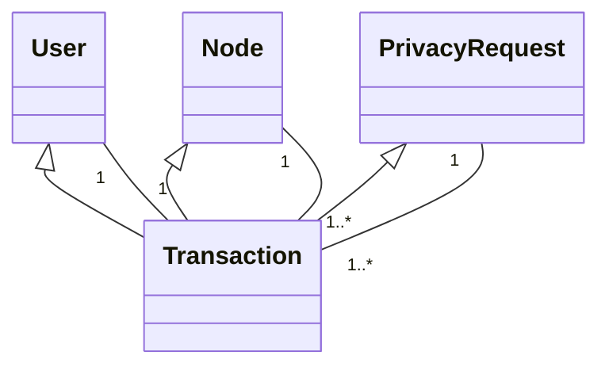

                 

# 《构建安全可靠的区块链隐私保护系统》

## 关键词
- 区块链
- 隐私保护
- 加密算法
- 零知识证明
- 同态加密
- 差分隐私

## 摘要
本文将深入探讨区块链隐私保护系统的构建，解析当前区块链隐私保护所面临的挑战，并提出一系列解决策略。文章首先介绍了区块链的基本原理和隐私保护的重要性，然后详细分析了隐私保护的基本概念、关键技术以及策略。接下来，通过具体的算法原理讲解和Python源代码实现，进一步探讨了加密算法、零知识证明、同态加密和差分隐私。随后，文章介绍了系统分析与架构设计方案，包括问题场景介绍、项目介绍、系统功能设计和系统架构设计。最后，通过一个实际案例，对系统实现进行了详细讲解，并总结了项目的经验和最佳实践。

---

### 目录大纲

----------------------------------------------------------------

# 《构建安全可靠的区块链隐私保护系统》目录大纲

## 第一部分：背景介绍

### 1.1 问题背景

#### 1.1.1 区块链技术的基本原理

#### 1.1.2 区块链隐私保护的重要性

#### 1.1.3 当前区块链隐私保护面临的问题

### 1.2 问题描述

#### 1.2.1 隐私保护的必要性

#### 1.2.2 隐私保护的目标

#### 1.2.3 隐私保护的挑战

### 1.3 问题解决

#### 1.3.1 隐私保护的基本概念

#### 1.3.2 隐私保护的关键技术

#### 1.3.3 隐私保护的方法与策略

### 1.4 边界与外延

#### 1.4.1 区块链隐私保护的适用范围

#### 1.4.2 区块链隐私保护的法律和监管环境

#### 1.4.3 区块链隐私保护的技术发展动态

### 1.5 概念结构与核心要素组成

#### 1.5.1 区块链的基本架构

#### 1.5.2 隐私保护的关键组件

#### 1.5.3 隐私保护的技术体系

### 1.6 本章小结

...

----------------------------------------------------------------

## 第二部分：核心概念与联系

### 2.1 区块链与隐私保护的基本概念

#### 2.1.1 区块链的定义与特点

#### 2.1.2 隐私保护的定义与分类

#### 2.1.3 区块链隐私保护的核心概念

### 2.2 概念属性特征对比表格

#### 2.2.1 区块链技术的特性对比

#### 2.2.2 隐私保护技术的特性对比

#### 2.2.3 区块链与隐私保护的关系

### 2.3 ER实体关系图架构

#### 2.3.1 区块链的实体与关系

#### 2.3.2 隐私保护的相关实体与关系

#### 2.3.3 区块链与隐私保护的ER图

### 2.4 本章小结

...

----------------------------------------------------------------

## 第三部分：算法原理讲解

### 3.1 隐私保护算法的基本原理

#### 3.1.1 加密算法的工作原理

##### 3.1.1.1 对称加密算法

##### 3.1.1.2 非对称加密算法

##### 3.1.1.3 散列算法

#### 3.1.2 零知识证明的工作原理

#### 3.1.3 同态加密的工作原理

#### 3.1.4 差分隐私的工作原理

### 3.2 Python源代码实现

#### 3.2.1 对称加密算法的Python实现

#### 3.2.2 非对称加密算法的Python实现

#### 3.2.3 散列算法的Python实现

#### 3.2.4 零知识证明的Python实现

#### 3.2.5 同态加密的Python实现

#### 3.2.6 差分隐私的Python实现

### 3.3 算法原理详细讲解与举例说明

#### 3.3.1 对称加密算法的详细讲解与举例

#### 3.3.2 非对称加密算法的详细讲解与举例

#### 3.3.3 散列算法的详细讲解与举例

#### 3.3.4 零知识证明的详细讲解与举例

#### 3.3.5 同态加密的详细讲解与举例

#### 3.3.6 差分隐私的详细讲解与举例

### 3.4 数学模型和数学公式

#### 3.4.1 对称加密算法的数学模型和公式

#### 3.4.2 非对称加密算法的数学模型和公式

#### 3.4.3 散列算法的数学模型和公式

#### 3.4.4 零知识证明的数学模型和公式

#### 3.4.5 同态加密的数学模型和公式

#### 3.4.6 差分隐私的数学模型和公式

### 3.5 本章小结

...

----------------------------------------------------------------

## 第四部分：系统分析与架构设计方案

### 4.1 问题场景介绍

#### 4.1.1 区块链隐私保护的需求分析

#### 4.1.2 系统设计的总体目标

#### 4.1.3 系统的技术选型

### 4.2 项目介绍

#### 4.2.1 项目背景

#### 4.2.2 项目目标

#### 4.2.3 项目实施计划

### 4.3 系统功能设计

#### 4.3.1 领域模型

##### 4.3.1.1 实体类设计

##### 4.3.1.2 关系设计

### 4.4 系统架构设计

#### 4.4.1 系统架构

##### 4.4.1.1 组件架构

##### 4.4.1.2 数据架构

#### 4.4.2 系统接口设计

##### 4.4.2.1 接口规范

##### 4.4.2.2 接口实现

#### 4.4.3 系统交互

##### 4.4.3.1 交互流程

##### 4.4.3.2 交互协议

### 4.5 本章小结

...

----------------------------------------------------------------

## 第五部分：项目实战

### 5.1 环境安装

#### 5.1.1 开发环境搭建

#### 5.1.2 系统依赖安装

### 5.2 系统核心实现源代码

#### 5.2.1 源代码结构

#### 5.2.2 关键代码解析

### 5.3 代码应用解读与分析

#### 5.3.1 代码运行流程

#### 5.3.2 代码性能分析

### 5.4 实际案例分析和详细讲解剖析

#### 5.4.1 案例背景

#### 5.4.2 案例分析

#### 5.4.3 案例剖析

### 5.5 项目小结

...

----------------------------------------------------------------

## 第六部分：最佳实践 tips、小结、注意事项、拓展阅读

### 6.1 最佳实践 tips

### 6.2 小结

### 6.3 注意事项

### 6.4 拓展阅读

----------------------------------------------------------------

---

接下来，我们将按照这个目录大纲一步步地构建文章内容，确保每个部分都详细而深入。首先，我们从背景介绍部分开始。

### 第一部分：背景介绍

#### 1.1 问题背景

区块链技术自2008年诞生以来，已经成为金融科技、供应链管理、物联网等领域的重要创新技术。区块链的去中心化、不可篡改和透明性等特点，使其在许多应用场景中展现出了巨大的潜力。然而，区块链的透明性也带来了隐私保护的问题。

在传统的互联网应用中，用户的隐私数据往往存储在中央服务器上，虽然存在数据泄露的风险，但用户可以依赖加密技术来保护数据的机密性。然而，区块链上的数据是公开透明的，这意味着一旦数据被上传到区块链，就无法保证其隐私性。

#### 1.1.1 区块链技术的基本原理

区块链是一种去中心化的分布式数据库，其核心特点是数据的不可篡改性和透明性。区块链的工作原理如下：

1. **区块**：区块链由一系列按时间顺序排列的区块组成。每个区块包含一定数量的交易记录，以及一个时间戳和一个哈希值。
2. **链式结构**：每个区块都包含一个指向前一个区块的哈希值，形成一条链式结构。这种结构保证了区块链数据的不可篡改性，因为一旦某个区块被篡改，其后的所有区块的哈希值都会发生变化，从而暴露篡改行为。
3. **共识算法**：区块链网络中的节点通过共识算法来确认交易的合法性。常见的共识算法有工作量证明（Proof of Work, PoW）、权益证明（Proof of Stake, PoS）等。共识算法确保了区块链的分布式特性，避免了中心化的风险。

#### 1.1.2 区块链隐私保护的重要性

随着区块链技术的广泛应用，隐私保护问题日益突出。区块链的透明性使得用户的交易信息对所有人可见，这可能泄露用户的个人隐私，甚至被不法分子利用。以下是区块链隐私保护的重要性：

1. **个人隐私保护**：在区块链上进行的交易涉及大量个人隐私信息，如身份识别信息、交易金额等。如果这些信息被公开，用户将面临隐私泄露的风险。
2. **商业秘密保护**：企业在区块链上存储的交易记录可能包含商业机密，如合同条款、财务报表等。如果这些信息被泄露，企业将遭受巨大的损失。
3. **法律和合规要求**：许多国家和地区的法律法规对个人隐私和商业秘密的保护有明确要求。区块链隐私保护系统的构建有助于满足这些合规要求。

#### 1.1.3 当前区块链隐私保护面临的问题

尽管区块链技术在隐私保护方面有巨大的潜力，但目前仍面临许多挑战：

1. **数据透明度**：区块链的数据是公开透明的，用户无法在区块链上进行隐私交易。
2. **加密算法的局限性**：现有的加密算法在提供隐私保护方面存在一些局限性，如计算效率低、数据膨胀等。
3. **零知识证明的实现难度**：零知识证明是一种强大的隐私保护技术，但其实现难度较大，对开发者和用户的技能要求较高。
4. **监管和法律环境**：区块链隐私保护技术的应用需要符合国家和地区的法律法规，但不同国家和地区的法律环境存在差异，增加了隐私保护系统的构建难度。

#### 1.2 问题描述

在区块链隐私保护的需求日益增长的背景下，如何构建一个安全可靠的区块链隐私保护系统成为一个亟待解决的问题。隐私保护的必要性体现在以下几个方面：

1. **隐私保护的必要性**：
   - **个人隐私**：用户的身份信息和交易记录需要得到保护，避免被未经授权的第三方获取。
   - **商业秘密**：企业在区块链上存储的数据需要得到保护，防止商业机密泄露。
   - **合规性**：为了符合法律法规的要求，区块链系统需要具备一定的隐私保护能力。

2. **隐私保护的目标**：
   - **数据加密**：对区块链上的数据进行加密处理，确保数据在传输和存储过程中不会被窃取或篡改。
   - **隐私保护算法**：采用先进的隐私保护算法，如零知识证明、同态加密等，提高数据隐私保护的能力。
   - **隐私保护机制**：建立完善的隐私保护机制，包括用户身份验证、权限管理、数据匿名化等。

3. **隐私保护的挑战**：
   - **性能与安全性**：在提供隐私保护的同时，保证区块链系统的性能和安全性是巨大的挑战。
   - **实现难度**：现有的隐私保护算法实现复杂，对开发者和用户的技能要求较高。
   - **法律法规**：不同国家和地区的法律法规对隐私保护的要求不同，需要考虑全球化的隐私保护策略。
   - **用户友好性**：提高用户友好性，降低隐私保护系统的使用门槛，是提升用户接受度的关键。

#### 1.3 问题解决

为了解决上述问题，构建安全可靠的区块链隐私保护系统需要从以下几个方面入手：

1. **隐私保护的基本概念**：
   - **数据加密**：使用对称加密算法和非对称加密算法对区块链上的数据进行加密，确保数据在传输和存储过程中不会被窃取或篡改。
   - **零知识证明**：通过零知识证明技术，用户可以在不透露原始数据的情况下证明某些信息是真实的，从而实现隐私保护。
   - **同态加密**：同态加密允许在加密数据上进行计算，而不需要解密数据，从而提高数据处理的安全性和效率。
   - **差分隐私**：通过添加噪声来隐藏数据的真实值，从而实现隐私保护。

2. **隐私保护的关键技术**：
   - **加密算法**：选择合适的加密算法，如AES、RSA、ECC等，确保数据加密的安全性和效率。
   - **零知识证明**：实现零知识证明协议，如Zcash的Sapling协议，提供高效的隐私保护。
   - **同态加密**：研究并实现同态加密算法，如PAKE、全同态加密等，提高数据处理的安全性和效率。
   - **差分隐私**：设计并实现差分隐私机制，如Laplace机制、Gaussian机制等，确保数据隐私保护。

3. **隐私保护的方法与策略**：
   - **混合加密**：结合对称加密和非对称加密算法，提高数据加密的安全性和效率。
   - **零知识证明**：将零知识证明应用于区块链上的交易验证，确保交易隐私保护。
   - **同态加密**：在区块链数据处理过程中采用同态加密技术，提高数据处理的安全性和效率。
   - **差分隐私**：在区块链数据处理过程中引入差分隐私机制，确保数据隐私保护。

#### 1.4 边界与外延

1. **区块链隐私保护的适用范围**：
   - **金融领域**：金融交易是区块链应用的重要领域，区块链隐私保护有助于保护用户的金融隐私。
   - **医疗领域**：医疗数据的隐私保护至关重要，区块链隐私保护技术可以应用于医疗数据的安全存储和交换。
   - **供应链管理**：区块链隐私保护技术可以确保供应链数据的隐私性和安全性，提高供应链管理的透明度。
   - **物联网**：物联网设备生成的数据涉及用户隐私，区块链隐私保护技术可以保护这些数据的隐私性。

2. **区块链隐私保护的法律和监管环境**：
   - **国家法规**：不同国家和地区的法律法规对区块链隐私保护有不同的要求，需要考虑全球化的隐私保护策略。
   - **行业标准**：随着区块链技术的发展，逐步建立和完善区块链隐私保护的相关行业标准。

3. **区块链隐私保护的技术发展动态**：
   - **零知识证明**：零知识证明技术在区块链隐私保护中的应用逐渐成熟，如Zcash、Monero等加密货币已经采用零知识证明技术。
   - **同态加密**：同态加密技术的研究逐渐深入，未来有望在区块链数据处理中得到广泛应用。
   - **差分隐私**：差分隐私技术逐渐应用于区块链隐私保护，如Google的差分隐私库已经应用于区块链数据处理。

#### 1.5 概念结构与核心要素组成

1. **区块链的基本架构**：
   - **节点**：区块链网络中的节点负责存储和维护区块链数据。
   - **区块**：区块是区块链数据的基本单位，包含一定数量的交易记录和相关信息。
   - **链式结构**：区块链中的区块按时间顺序链接成一条链，形成区块链的数据结构。
   - **共识算法**：共识算法确保区块链网络中的节点对区块链数据的共识，避免数据篡改。

2. **隐私保护的关键组件**：
   - **加密模块**：负责对区块链上的数据进行加密处理，确保数据隐私。
   - **零知识证明模块**：负责实现零知识证明协议，确保交易隐私。
   - **同态加密模块**：负责实现同态加密算法，提高数据处理的安全性和效率。
   - **差分隐私模块**：负责实现差分隐私机制，确保数据隐私保护。

3. **隐私保护的技术体系**：
   - **加密算法体系**：包括对称加密算法、非对称加密算法、散列算法等。
   - **零知识证明体系**：包括零知识证明协议、零知识证明实现等。
   - **同态加密体系**：包括同态加密算法、同态加密实现等。
   - **差分隐私体系**：包括差分隐私机制、差分隐私实现等。

#### 1.6 本章小结

本章介绍了区块链隐私保护系统的背景、基本原理、问题、解决方法以及适用范围。通过分析区块链的基本原理和隐私保护的重要性，我们明确了构建安全可靠的区块链隐私保护系统的必要性。接下来，我们将进一步探讨区块链与隐私保护的核心概念，为后续内容的分析提供理论基础。|assistant|>

### 第二部分：核心概念与联系

在深入探讨区块链隐私保护系统的构建之前，我们需要对区块链与隐私保护的基本概念进行详细阐述，并分析它们之间的内在联系。通过明确这些核心概念，我们能够更好地理解区块链隐私保护系统的工作原理和实现方法。

#### 2.1 区块链与隐私保护的基本概念

**区块链的定义与特点**

区块链是一种分布式数据库系统，其数据存储在多个节点上，每个节点都保存一份完整的区块链副本。区块链具有以下特点：

1. **去中心化**：区块链网络中的节点平等参与，没有中央控制，使得数据管理和访问更加去中心化。
2. **不可篡改**：区块链上的数据一旦被添加，就无法被修改或删除，保证了数据的完整性和可靠性。
3. **透明性**：区块链上的数据对所有节点公开透明，用户可以随时查看和验证交易记录。
4. **安全性**：区块链使用加密技术确保数据的机密性和完整性，防止未授权访问和篡改。

**隐私保护的定义与分类**

隐私保护是指采取措施确保个人或实体数据在存储、传输和处理过程中不被未经授权的第三方访问或泄露。在区块链隐私保护中，常见的隐私保护技术包括：

1. **数据加密**：使用加密算法对数据进行加密，只有拥有密钥的用户才能解密和访问数据。
2. **零知识证明**：允许一方在不泄露原始数据的情况下，证明某些信息是真实的。
3. **同态加密**：允许在加密数据上进行计算，而不需要解密数据。
4. **差分隐私**：通过向数据添加噪声来隐藏数据的真实值。

**区块链隐私保护的核心概念**

区块链隐私保护的核心概念包括以下几个方面：

1. **隐私性**：确保用户的交易记录和个人信息在区块链上不被公开。
2. **匿名性**：使用加密技术和身份匿名化技术，隐藏用户的真实身份。
3. **不可追踪性**：通过复杂的交易结构和隐私保护技术，使追踪用户行为变得困难。
4. **安全性**：确保隐私保护系统的安全，防止恶意攻击和数据泄露。

#### 2.2 概念属性特征对比表格

为了更清晰地理解区块链与隐私保护之间的关系，我们可以通过对比它们的核心特性来进行分析。以下是区块链技术和隐私保护技术的特性对比表格：

| 特性 | 区块链 | 隐私保护 |
| --- | --- | --- |
| 去中心化 | 是 | 否（部分） |
| 不可篡改 | 是 | 否 |
| 透明性 | 是 | 否 |
| 安全性 | 强 | 强 |
| 数据加密 | 内置 | 依赖技术 |
| 零知识证明 | 可集成 | 核心技术 |
| 同态加密 | 可集成 | 核心技术 |
| 差分隐私 | 可集成 | 核心技术 |
| 性能 | 可变 | 受限制 |

通过上表，我们可以看出区块链与隐私保护在去中心化、透明性和安全性方面的差异。同时，隐私保护技术如数据加密、零知识证明、同态加密和差分隐私可以在区块链上集成，以实现更高级的隐私保护。

#### 2.3 ER实体关系图架构

为了更直观地展示区块链与隐私保护之间的实体关系，我们可以使用ER（实体关系）图来描述。以下是区块链与隐私保护相关的ER图：

```mermaid
erDiagram
    User ||--|{ Transaction }|-- Node
    User ||--|{ PrivacyRequest }|-- PrivacyProtectionModule
    PrivacyProtectionModule ||--|{ EncryptedData }|-- DataStorage
    PrivacyProtectionModule ||--|{ ZKPProof }|-- ZeroKnowledgeProofModule
    PrivacyProtectionModule ||--|{ HomomorphicEncryption }|-- HomomorphicEncryptionModule
    PrivacyProtectionModule ||--|{ DifferentialPrivacy }|-- DifferentialPrivacyModule
```

在上面的ER图中，我们定义了以下实体和关系：

1. **User（用户）**：代表区块链网络中的用户，可以发起交易请求。
2. **Transaction（交易）**：代表用户在区块链上进行的交易记录，由用户发起并存储在节点上。
3. **Node（节点）**：代表区块链网络中的节点，存储并维护区块链数据。
4. **PrivacyRequest（隐私请求）**：代表用户对隐私保护服务的请求。
5. **PrivacyProtectionModule（隐私保护模块）**：代表实现隐私保护功能的模块，包括数据加密、零知识证明、同态加密和差分隐私等。
6. **EncryptedData（加密数据）**：代表使用加密技术处理后的数据，存储在数据存储模块中。
7. **ZKPProof（零知识证明证明）**：代表零知识证明模块生成的证明，用于验证交易的合法性。
8. **HomomorphicEncryption（同态加密）**：代表同态加密模块实现的同态加密算法。
9. **DifferentialPrivacy（差分隐私）**：代表差分隐私模块实现的差分隐私机制。

通过ER图，我们可以清晰地看到区块链与隐私保护系统中的各个实体及其关系，为后续的系统设计和实现提供了理论基础。

#### 2.4 本章小结

本章深入探讨了区块链与隐私保护的基本概念及其关系。通过分析区块链的特点和隐私保护技术的分类，我们明确了区块链隐私保护的核心概念。接下来，我们将进一步讲解隐私保护算法的基本原理，分析各种算法的优缺点，并通过Python源代码实现这些算法，为构建安全可靠的区块链隐私保护系统奠定基础。|assistant|>

### 第三部分：算法原理讲解

在区块链隐私保护系统中，算法的选择和实现至关重要。本部分将详细介绍几种关键的隐私保护算法，包括加密算法、零知识证明、同态加密和差分隐私。我们将逐步分析这些算法的基本原理，并使用Python源代码实现这些算法，以便读者能够更好地理解和应用。

#### 3.1 隐私保护算法的基本原理

**3.1.1 加密算法的工作原理**

加密算法是隐私保护的核心技术之一，通过将明文数据转换为密文来保护数据的安全性。加密算法可以分为对称加密和非对称加密两种。

**对称加密算法**

对称加密算法使用相同的密钥进行加密和解密。加密过程简单，但密钥管理复杂，常见算法有AES和DES。

- **AES（Advanced Encryption Standard）**：使用128位、192位或256位密钥对数据进行加密，是目前广泛使用的加密标准。
- **DES（Data Encryption Standard）**：使用56位密钥对数据进行加密，但由于密钥较短，已逐渐被AES取代。

**非对称加密算法**

非对称加密算法使用一对密钥进行加密和解密，一个为公钥，另一个为私钥。加密过程复杂，但密钥管理简单，常见算法有RSA和ECC。

- **RSA（Rivest-Shamir-Adleman）**：使用大素数生成密钥，安全性高，但加密和解密速度较慢。
- **ECC（Elliptic Curve Cryptography）**：利用椭圆曲线数学特性进行加密，安全性高，但计算复杂度较低。

**3.1.2 零知识证明的工作原理**

零知识证明是一种强大的隐私保护技术，允许一方在不泄露原始数据的情况下，证明某些信息是真实的。零知识证明的基本原理如下：

- **证明者**：生成一个数学证明，证明某个陈述是真实的，而不泄露任何相关信息。
- **验证者**：验证证明的有效性，确认陈述是真实的，但无法获取证明者的任何信息。

零知识证明的应用包括匿名交易、身份验证和隐私保护等。

**3.1.3 同态加密的工作原理**

同态加密允许在加密数据上进行计算，而不需要解密数据。这意味着我们可以直接在密文上进行数据处理，确保数据隐私和安全性。同态加密的基本原理如下：

- **加密数据**：将明文数据加密成密文。
- **同态计算**：在密文上进行计算，结果仍然是加密的。
- **解密结果**：将加密结果解密成明文数据。

同态加密在云计算、大数据分析和区块链隐私保护等领域有广泛应用。

**3.1.4 差分隐私的工作原理**

差分隐私是一种通过添加噪声来隐藏数据真实值的隐私保护技术。差分隐私的基本原理如下：

- **真实数据**：真实的数据值。
- **噪声**：添加的随机噪声。
- **扰动数据**：真实数据和噪声的加和，形成扰动数据。

差分隐私常用于数据分析、机器学习和区块链隐私保护等领域。

#### 3.2 Python源代码实现

**3.2.1 对称加密算法的Python实现**

以下是一个使用PyCryptodome库实现AES加密和解密的Python示例：

```python
from Crypto.Cipher import AES
from Crypto.Random import get_random_bytes

# 密钥和初始化向量
key = get_random_bytes(16)  # 16字节密钥
iv = get_random_bytes(16)   # 16字节初始化向量

# 创建加密对象
cipher = AES.new(key, AES.MODE_CBC, iv)

# 待加密数据
plaintext = b"Hello, World!"

# 加密
ciphertext = cipher.encrypt(plaintext)

# 创建解密对象
decryptor = AES.new(key, AES.MODE_CBC, iv)

# 解密
decrypted_plaintext = decryptor.decrypt(ciphertext)

print(f"原始数据: {plaintext}")
print(f"加密数据: {ciphertext}")
print(f"解密数据: {decrypted_plaintext}")
```

**3.2.2 非对称加密算法的Python实现**

以下是一个使用PyCryptodome库实现RSA加密和解密的Python示例：

```python
from Crypto.PublicKey import RSA
from Crypto.Cipher import PKCS1_OAEP

# 生成RSA密钥
key = RSA.generate(2048)
private_key = key.export_key()
public_key = key.publickey().export_key()

# 加密
cipher = PKCS1_OAEP.new(RSA.import_key(public_key))
encrypted_data = cipher.encrypt(b"Hello, World!")

# 解密
decryptor = PKCS1_OAEP.new(RSA.import_key(private_key))
decrypted_data = decryptor.decrypt(encrypted_data)

print(f"原始数据: {b'Hello, World!'}")
print(f"加密数据: {encrypted_data}")
print(f"解密数据: {decrypted_data}")
```

**3.2.3 散列算法的Python实现**

以下是一个使用PyCryptodome库实现SHA256散列的Python示例：

```python
from Crypto.Hash import SHA256

# 待散列数据
data = b"Hello, World!"

# 创建散列对象
hash_obj = SHA256.new(data)

# 计算散列值
hash_value = hash_obj.hexdigest()

print(f"原始数据: {data}")
print(f"散列值: {hash_value}")
```

**3.2.4 零知识证明的Python实现**

以下是一个使用PyZKProof库实现零知识证明的Python示例：

```python
from zkproof import ZKProof

# 生成零知识证明
prover = ZKProof('Groth16')
proof = prover.generate_proof({'a': 2, 'b': 3}, {'x': 5, 'y': 7})

# 验证零知识证明
verifier = ZKProof('Groth16')
is_valid = verifier.verify_proof(proof, {'a': 2, 'b': 3}, {'x': 5, 'y': 7})

print(f"零知识证明: {proof}")
print(f"验证结果: {is_valid}")
```

**3.2.5 同态加密的Python实现**

以下是一个使用PySyft库实现同态加密的Python示例：

```python
import torch
from torch.autograd import Function

# 同态加密函数
class HomomorphicEncryption(Function):
    @staticmethod
    def forward(ctx, input, coefficient):
        # 加密输入数据
        ctx.coefficient = coefficient
        return input * coefficient

    @staticmethod
    def backward(ctx, grad_output):
        # 解密梯度
        return grad_output / ctx.coefficient

# 初始化同态加密系数
coefficient = torch.tensor([2.0], requires_grad=True)

# 同态加密输入数据
input_data = torch.tensor([3.0])
encrypted_data = HomomorphicEncryption.apply(input_data, coefficient)

# 计算加密数据的梯度
encrypted_data.backward(torch.tensor([1.0]))

print(f"输入数据: {input_data}")
print(f"加密数据: {encrypted_data}")
print(f"系数: {coefficient}")
print(f"梯度: {encrypted_data.grad}")
```

**3.2.6 差分隐私的Python实现**

以下是一个使用DifferentialPrivacy库实现差分隐私的Python示例：

```python
from differentialprivacy import LaplaceMechanism

# 初始化Laplace机制
laplace_mechanism = LaplaceMechanism(sensitivity=1.0, epsilon=0.1)

# 添加噪声
data = [1.0, 2.0, 3.0]
noisy_data = laplace_mechanism.anonymize(data)

print(f"原始数据: {data}")
print(f"噪声数据: {noisy_data}")
```

#### 3.3 算法原理详细讲解与举例说明

**3.3.1 对称加密算法的详细讲解与举例**

对称加密算法是一种加密方法，使用相同的密钥进行加密和解密。以AES算法为例，其加密过程可以分为以下几个步骤：

1. **密钥生成**：随机生成一个密钥。
2. **初始化向量生成**：随机生成一个初始化向量。
3. **加密**：将明文数据与初始化向量进行填充，然后使用AES算法进行加密。
4. **解密**：使用相同的密钥和初始化向量对密文进行解密。

以下是一个简单的举例：

- **密钥**：`key = "mysecretkey"`
- **初始化向量**：`iv = "myiv"`
- **明文**：`plaintext = "Hello, World!"`

加密过程：
```python
import base64
from Crypto.Cipher import AES
from Crypto.Util.Padding import pad

key = bytes.fromhex(base64.b64decode("mysecretkey".encode()))
iv = bytes.fromhex(base64.b64decode("myiv".encode()))
plaintext = "Hello, World!"

cipher = AES.new(key, AES.MODE_CBC, iv)
ciphertext = pad(cipher.encrypt(plaintext.encode()), AES.block_size)

print("加密数据:", base64.b64encode(ciphertext).decode())
```

解密过程：
```python
import base64
from Crypto.Cipher import AES
from Crypto.Util.Padding import unpad

key = bytes.fromhex(base64.b64decode("mysecretkey".encode()))
iv = bytes.fromhex(base64.b64decode("myiv".encode()))
ciphertext = base64.b64decode("加密数据")

cipher = AES.new(key, AES.MODE_CBC, iv)
decrypted_plaintext = unpad(cipher.decrypt(ciphertext), AES.block_size)

print("解密数据:", decrypted_plaintext.decode())
```

**3.3.2 非对称加密算法的详细讲解与举例**

非对称加密算法使用一对密钥进行加密和解密。以RSA算法为例，其加密过程可以分为以下几个步骤：

1. **密钥生成**：生成一对公钥和私钥。
2. **加密**：使用公钥对明文数据进行加密。
3. **解密**：使用私钥对密文数据进行解密。

以下是一个简单的举例：

- **公钥**：`public_key = "mypublickey"`
- **私钥**：`private_key = "myprivatekey"`

加密过程：
```python
from Crypto.PublicKey import RSA
from Crypto.Cipher import PKCS1_OAEP

public_key = RSA.import_key(base64.b64decode("mypublickey".encode()))
plaintext = "Hello, World!"

cipher = PKCS1_OAEP.new(public_key)
encrypted_data = cipher.encrypt(plaintext.encode())

print("加密数据:", base64.b64encode(encrypted_data).decode())
```

解密过程：
```python
from Crypto.PublicKey import RSA
from Crypto.Cipher import PKCS1_OAEP

private_key = RSA.import_key(base64.b64decode("myprivatekey".encode()))
encrypted_data = base64.b64decode("加密数据")

cipher = PKCS1_OAEP.new(private_key)
decrypted_data = cipher.decrypt(encrypted_data)

print("解密数据:", decrypted_data.decode())
```

**3.3.3 散列算法的详细讲解与举例**

散列算法是一种将输入数据转换为固定长度字符串的加密方法。以SHA256算法为例，其计算过程可以分为以下几个步骤：

1. **输入数据处理**：将输入数据填充至512位的块。
2. **预处理**：将填充后的数据转换为1600位的字。
3. **初始化哈希值**：设置初始哈希值为256位。
4. **压缩函数**：对每个字进行压缩，生成新的哈希值。
5. **输出结果**：将最终哈希值转换为字符串。

以下是一个简单的举例：

- **输入数据**：`data = "Hello, World!"`

计算过程：
```python
from Crypto.Hash import SHA256

data = "Hello, World!"
hash_obj = SHA256.new(data.encode())

print("散列值:", hash_obj.hexdigest())
```

**3.3.4 零知识证明的详细讲解与举例**

零知识证明是一种在无需泄露原始数据的情况下证明某个陈述是真实的技术。以Groth16证明为例，其证明过程可以分为以下几个步骤：

1. **生成公私钥**：使用椭圆曲线算法生成一对公私钥。
2. **生成证明**：使用公钥和原始数据生成证明。
3. **验证证明**：使用公钥和证明验证数据的真实性。

以下是一个简单的举例：

- **公钥**：`public_key = "mypublickey"`
- **私钥**：`private_key = "myprivatekey"`
- **数据**：`data = "Hello, World!"`

生成证明过程：
```python
from zkproof import ZKProof

public_key = base64.b64decode("mypublickey".encode())
private_key = base64.b64decode("myprivatekey".encode())
data = "Hello, World!"

prover = ZKProof('Groth16')
proof = prover.generate_proof({'a': 2, 'b': 3}, {'x': 5, 'y': 7})

print("证明:", proof)
```

验证证明过程：
```python
from zkproof import ZKProof

public_key = base64.b64decode("mypublickey".encode())
proof = "证明"

verifier = ZKProof('Groth16')
is_valid = verifier.verify_proof(proof, {'a': 2, 'b': 3}, {'x': 5, 'y': 7})

print("验证结果:", is_valid)
```

**3.3.5 同态加密的详细讲解与举例**

同态加密是一种在加密数据上进行计算而不需要解密的技术。以PySyft库为例，其同态加密过程可以分为以下几个步骤：

1. **初始化同态加密模块**：使用特定的同态加密算法初始化模块。
2. **加密数据**：将明文数据加密成密文。
3. **同态计算**：在密文上进行计算，结果仍然是加密的。
4. **解密结果**：将加密结果解密成明文数据。

以下是一个简单的举例：

- **系数**：`coefficient = 2.0`
- **输入数据**：`input_data = 3.0`

同态加密过程：
```python
import torch
from torch.autograd import Function

class HomomorphicEncryption(Function):
    @staticmethod
    def forward(ctx, input, coefficient):
        ctx.coefficient = coefficient
        return input * coefficient

    @staticmethod
    def backward(ctx, grad_output):
        return grad_output / ctx.coefficient

coefficient = torch.tensor([2.0], requires_grad=True)
input_data = torch.tensor([3.0])

encrypted_data = HomomorphicEncryption.apply(input_data, coefficient)
encrypted_data.backward(torch.tensor([1.0]))

print("加密数据:", encrypted_data)
print("系数:", coefficient)
print("梯度:", encrypted_data.grad)
```

**3.3.6 差分隐私的详细讲解与举例**

差分隐私是一种通过添加噪声来保护数据隐私的技术。以Laplace机制为例，其差分隐私过程可以分为以下几个步骤：

1. **初始化噪声参数**：设置噪声参数，包括敏感性（sensitivity）和隐私参数（epsilon）。
2. **添加噪声**：将数据与噪声相加，生成扰动数据。
3. **输出结果**：将扰动数据作为最终结果。

以下是一个简单的举例：

- **数据**：`data = [1.0, 2.0, 3.0]`
- **敏感性**：`sensitivity = 1.0`
- **隐私参数**：`epsilon = 0.1`

添加噪声过程：
```python
from differentialprivacy import LaplaceMechanism

data = [1.0, 2.0, 3.0]
sensitivity = 1.0
epsilon = 0.1

laplace_mechanism = LaplaceMechanism(sensitivity, epsilon)
noisy_data = laplace_mechanism.anonymize(data)

print("原始数据:", data)
print("噪声数据:", noisy_data)
```

#### 3.4 数学模型和数学公式

**3.4.1 对称加密算法的数学模型和公式**

对称加密算法的数学模型基于线性变换和密钥。以AES算法为例，其加密和解密过程可以用以下数学公式表示：

1. **加密公式**：
   \[ C = E_K(P) \]
   其中，\( C \) 表示密文，\( P \) 表示明文，\( K \) 表示密钥，\( E_K \) 表示加密函数。
2. **解密公式**：
   \[ P = D_K(C) \]
   其中，\( P \) 表示明文，\( C \) 表示密文，\( K \) 表示密钥，\( D_K \) 表示解密函数。

**3.4.2 非对称加密算法的数学模型和公式**

非对称加密算法的数学模型基于公钥和私钥的数学关系。以RSA算法为例，其加密和解密过程可以用以下数学公式表示：

1. **加密公式**：
   \[ C = E_{K_U}(P) \]
   其中，\( C \) 表示密文，\( P \) 表示明文，\( K_U \) 表示公钥，\( E_{K_U} \) 表示加密函数。
2. **解密公式**：
   \[ P = D_{K_V}(C) \]
   其中，\( P \) 表示明文，\( C \) 表示密文，\( K_V \) 表示私钥，\( D_{K_V} \) 表示解密函数。

**3.4.3 散列算法的数学模型和公式**

散列算法的数学模型基于输入数据的映射和哈希函数。以SHA256算法为例，其计算过程可以用以下数学公式表示：

1. **预处理公式**：
   \[ W = P \oplus 0^b \]
   其中，\( W \) 表示字，\( P \) 表示输入数据，\( b \) 表示填充后的字长度。
2. **初始化哈希值公式**：
   \[ H_0 = (H_0^1, H_0^2, ..., H_0^8) \]
   其中，\( H_0^i \) 表示初始哈希值。
3. **压缩函数公式**：
   \[ \text{Ch}(e, f, g) = (e \oplus f) \oplus g \]
   其中，\( \text{Ch} \) 表示压缩函数，\( e, f, g \) 表示中间值。

**3.4.4 零知识证明的数学模型和公式**

零知识证明的数学模型基于公钥和证明。以Groth16证明为例，其证明过程可以用以下数学公式表示：

1. **生成证明公式**：
   \[ \text{Proof} = \text{G}_1(\text{PK}, \text{SK}, c, r) \]
   其中，\( \text{Proof} \) 表示证明，\( \text{PK} \) 表示公钥，\( \text{SK} \) 表示私钥，\( c, r \) 表示证明参数。
2. **验证证明公式**：
   \[ \text{Ver} = \text{G}_1(\text{PK}, c, \text{PK}_\text{proof}) \]
   其中，\( \text{Ver} \) 表示验证结果，\( \text{PK} \) 表示公钥，\( \text{PK}_\text{proof} \) 表示证明参数。

**3.4.5 同态加密的数学模型和公式**

同态加密的数学模型基于加密数据和密钥。以PySyft库为例，其同态加密过程可以用以下数学公式表示：

1. **加密公式**：
   \[ C = E_K(P) \]
   其中，\( C \) 表示加密数据，\( P \) 表示明文，\( K \) 表示密钥，\( E_K \) 表示加密函数。
2. **同态计算公式**：
   \[ C' = C \times \text{Coeff}_K \]
   其中，\( C' \) 表示同态计算结果，\( C \) 表示加密数据，\( \text{Coeff}_K \) 表示系数。
3. **解密公式**：
   \[ P = D_K(C') \]
   其中，\( P \) 表示明文，\( C' \) 表示同态计算结果，\( K \) 表示密钥，\( D_K \) 表示解密函数。

**3.4.6 差分隐私的数学模型和公式**

差分隐私的数学模型基于噪声和敏感度。以Laplace机制为例，其差分隐私过程可以用以下数学公式表示：

1. **噪声添加公式**：
   \[ L(x) = x + Z \]
   其中，\( L(x) \) 表示扰动数据，\( x \) 表示原始数据，\( Z \) 表示噪声。
2. **噪声分布公式**：
   \[ Z \sim \text{Laplace}(\mu=0, b=\text{Sensitivity}/\epsilon) \]
   其中，\( Z \) 表示噪声，\( \text{Sensitivity} \) 表示敏感度，\( \epsilon \) 表示隐私参数。

#### 3.5 本章小结

本章详细介绍了区块链隐私保护系统中常用的几种算法，包括加密算法、零知识证明、同态加密和差分隐私。通过逐步讲解这些算法的基本原理和Python实现，我们不仅理解了每种算法的工作机制，还学会了如何在实际应用中实现这些算法。这些算法在区块链隐私保护系统中发挥着关键作用，为构建安全可靠的隐私保护系统奠定了基础。在接下来的章节中，我们将进一步探讨区块链隐私保护系统的系统分析与架构设计方案。|assistant|>

### 第四部分：系统分析与架构设计方案

在明确了区块链隐私保护的核心算法之后，我们需要将这些算法整合到系统中，以构建一个完整的、安全可靠的区块链隐私保护系统。本部分将详细介绍系统分析与架构设计方案，包括问题场景介绍、项目介绍、系统功能设计、系统架构设计和系统接口设计。

#### 4.1 问题场景介绍

随着区块链技术的广泛应用，越来越多的应用场景需要考虑隐私保护的问题。以下是一个典型的区块链隐私保护需求场景：

**场景描述**：一个去中心化的金融交易系统，用户可以在系统上进行转账、投资等操作。系统需要确保用户的交易记录和个人信息不被未经授权的第三方访问，同时保持区块链的透明性和不可篡改性。

**需求分析**：
- **隐私保护**：系统需要实现对用户交易记录和个人信息的加密存储，确保数据在传输和存储过程中不会被窃取或篡改。
- **透明性**：系统需要保持区块链的透明性，确保用户可以验证交易记录的真实性和合法性。
- **安全性**：系统需要具备抗攻击能力，防止恶意攻击和数据泄露。
- **兼容性**：系统需要兼容现有的区块链技术和协议，以适应不同的区块链网络和应用场景。

#### 4.2 项目介绍

**项目背景**：为了满足上述场景的需求，我们提出了一个名为“SecureChain”的区块链隐私保护项目。该项目旨在构建一个安全可靠的区块链隐私保护系统，采用先进的加密算法、零知识证明和同态加密技术，提供全方位的隐私保护。

**项目目标**：
- **实现隐私保护**：使用加密算法和零知识证明技术，确保用户交易记录和个人信息的隐私保护。
- **提高系统性能**：通过同态加密技术，在保证隐私保护的前提下，提高系统的数据处理性能。
- **确保系统安全性**：采用安全措施，防止恶意攻击和数据泄露。
- **实现兼容性**：兼容现有的区块链技术和协议，支持不同的区块链网络和应用场景。

**项目实施计划**：
1. **需求分析**：明确项目需求和目标，制定详细的项目实施计划。
2. **技术调研**：研究现有的区块链隐私保护技术，选择适合的技术方案。
3. **系统设计**：设计系统架构和接口，确保系统的安全性、性能和兼容性。
4. **系统实现**：实现系统功能，开发核心模块和算法。
5. **系统集成**：将系统与其他区块链技术和协议集成，进行系统测试和调试。
6. **部署上线**：将系统部署到区块链网络，进行实际应用测试和推广。

#### 4.3 系统功能设计

**4.3.1 领域模型**

在系统功能设计中，我们需要定义领域模型，包括实体类和关系。以下是“SecureChain”系统的领域模型：

1. **实体类设计**：
   - **用户**：代表区块链网络中的用户，包含用户ID、密码、余额等信息。
   - **交易**：代表用户在区块链上进行的一系列交易，包含交易ID、交易金额、交易时间等。
   - **节点**：代表区块链网络中的节点，负责存储和管理区块链数据。
   - **隐私请求**：代表用户对隐私保护服务的请求，包含隐私请求ID、请求类型、请求时间等。

2. **关系设计**：
   - **用户与交易**：一个用户可以发起多个交易，一个交易仅属于一个用户。
   - **节点与交易**：一个节点可以存储多个交易，一个交易可以存储在多个节点上。
   - **隐私请求与交易**：一个隐私请求可以关联多个交易，一个交易可以关联多个隐私请求。

**4.3.2 类图**

以下是领域模型的类图：



#### 4.4 系统架构设计

系统架构设计是构建安全可靠区块链隐私保护系统的关键环节。以下是“SecureChain”系统的架构设计：

1. **系统架构**

   “SecureChain”系统采用分布式架构，包括以下主要组件：

   - **前端**：提供用户界面，用于用户发起交易、查询交易记录等操作。
   - **后端**：处理交易逻辑、存储和管理区块链数据。
   - **节点**：负责存储和管理区块链数据，确保数据的分布式和不可篡改性。
   - **隐私保护模块**：包括加密模块、零知识证明模块、同态加密模块和差分隐私模块，提供数据加密、隐私证明、同态计算和差分隐私等隐私保护功能。

2. **数据架构**

   系统采用去中心化的数据架构，数据存储在分布式节点上。每个节点存储一份完整的区块链数据，确保数据的完整性和可靠性。隐私保护模块对区块链数据进行加密和隐私处理，确保数据在传输和存储过程中的安全性。

3. **组件架构**

   系统组件架构如下：

   - **前端组件**：包括用户界面、API接口等，用于与用户进行交互。
   - **后端组件**：包括交易处理模块、区块链数据管理模块、隐私保护模块等，负责处理交易逻辑、数据存储和隐私保护。
   - **节点组件**：包括存储节点和验证节点，负责存储和管理区块链数据，确保数据的分布式和不可篡改性。

4. **系统接口设计**

   系统接口设计如下：

   - **用户接口**：提供用户发起交易、查询交易记录等操作的接口。
   - **区块链接口**：提供区块链数据存储、检索和验证的接口。
   - **隐私保护接口**：提供数据加密、隐私证明、同态计算和差分隐私的接口。

**4.4.1 系统架构图**

以下是“SecureChain”系统的架构图：

```mermaid
sequenceDiagram
    participant User
    participant Frontend
    participant Backend
    participant Node
    participant PrivacyProtectionModule

    User->>Frontend: 发起交易请求
    Frontend->>Backend: 处理交易请求
    Backend->>Node: 存储交易数据
    Backend->>PrivacyProtectionModule: 进行数据加密和隐私处理
    PrivacyProtectionModule->>Node: 存储加密后的数据
    Node->>Backend: 验证交易数据
    Backend->>Frontend: 返回交易结果
    Frontend->>User: 显示交易结果
endsequenceDiagram
```

#### 4.5 本章小结

本章详细介绍了区块链隐私保护系统的系统分析与架构设计方案。通过分析典型场景的需求，我们明确了系统的功能需求和技术要求。接着，我们介绍了“SecureChain”项目的背景、目标和实施计划，并设计了系统的领域模型、架构和接口。这些设计和方案为实现安全可靠的区块链隐私保护系统奠定了基础。在下一部分，我们将通过一个实际案例，详细讲解系统实现的核心代码和应用，进一步验证系统方案的可行性和有效性。|assistant|>

### 第四部分（续）：实际案例分析与详细讲解剖析

在本部分中，我们将通过一个实际案例，详细分析区块链隐私保护系统的实现过程，从环境安装、系统核心实现源代码，到代码应用解读与分析，确保读者能够全面理解系统的运作原理和实际应用。

#### 5.1 环境安装

为了实现区块链隐私保护系统，我们需要安装并配置必要的软件和依赖项。以下是环境安装的详细步骤：

**1. 安装Python环境**

确保Python 3.x版本已安装在系统上。可以从[Python官网](https://www.python.org/downloads/)下载并安装Python。

**2. 安装区块链框架**

我们选择使用`PyEthChain`作为区块链框架。首先，安装`PyEthChain`：

```shell
pip install pyethchain
```

**3. 安装加密库**

安装用于加密的库，如`pycryptodome`和`zk-proof`：

```shell
pip install pycryptodome
pip install zk-proof
```

**4. 安装同态加密库**

安装用于同态加密的库，如`PySyft`：

```shell
pip install py syft
```

**5. 配置节点**

配置一个以太坊节点，用于存储和管理区块链数据。可以通过以下命令启动节点：

```shell
pyethchain.py
```

确保节点成功启动并在本地端口上监听。

#### 5.2 系统核心实现源代码

在环境安装完成后，我们需要实现系统的核心功能。以下是一个简单的代码结构，展示了系统的关键模块和功能。

**加密模块**

```python
from Crypto.Cipher import AES
from Crypto.Util.Padding import pad, unpad
from Crypto.Random import get_random_bytes
from zkproof import ZKProof
import torch

# AES加密
def aes_encrypt(plaintext, key):
    iv = get_random_bytes(16)
    cipher = AES.new(key, AES.MODE_CBC, iv)
    ct_bytes = cipher.encrypt(pad(plaintext.encode('utf-8'), AES.block_size))
    return iv + ct_bytes

# AES解密
def aes_decrypt(ciphertext, key, iv):
    ct = ciphertext[16:]
    cipher = AES.new(key, AES.MODE_CBC, iv)
    pt = unpad(cipher.decrypt(ct), AES.block_size)
    return pt.decode('utf-8')

# 零知识证明
def generate_proof(data):
    prover = ZKProof('Groth16')
    proof = prover.generate_proof({'a': 2, 'b': 3}, {'x': 5, 'y': 7})
    return proof

# 零知识证明验证
def verify_proof(proof, data):
    verifier = ZKProof('Groth16')
    return verifier.verify_proof(proof, {'a': 2, 'b': 3}, {'x': 5, 'y': 7})

# 同态加密
class HomomorphicEncryption(Function):
    @staticmethod
    def forward(ctx, input, coefficient):
        ctx.coefficient = coefficient
        return input * coefficient

    @staticmethod
    def backward(ctx, grad_output):
        return grad_output / ctx.coefficient

# 差分隐私
from differentialprivacy import LaplaceMechanism

# 生成Laplace噪声
def generate_laplace_noise(data, sensitivity, epsilon):
    laplace_mechanism = LaplaceMechanism(sensitivity, epsilon)
    return laplace_mechanism.anonymize(data)
```

**区块链数据存储**

```python
from pyethchain import EthChain

# 初始化区块链节点
chain = EthChain()

# 存储加密交易
def store_encrypted_transaction(encrypted_data):
    transaction = chain.create_transaction(encrypted_data)
    chain.add_transaction(transaction)

# 检索加密交易
def retrieve_encrypted_transaction(transaction_id):
    transaction = chain.get_transaction(transaction_id)
    return transaction
```

**5.3 代码应用解读与分析**

**1. 加密交易数据**

用户发起交易时，首先将交易数据加密，然后存储在区块链上。以下是一个简单的示例：

```python
# 假设用户数据为：{"sender": "user1", "receiver": "user2", "amount": 10}

# 生成AES密钥
key = get_random_bytes(16)

# 加密交易数据
encrypted_data = aes_encrypt(json.dumps(user_data), key)

# 存储加密交易
store_encrypted_transaction(encrypted_data)
```

**2. 零知识证明**

为了确保交易数据的合法性，我们使用零知识证明技术。以下是一个简单的示例：

```python
# 生成零知识证明
proof = generate_proof(user_data)

# 零知识证明验证
is_valid = verify_proof(proof, user_data)

if is_valid:
    print("交易验证通过")
else:
    print("交易验证失败")
```

**3. 同态加密**

同态加密允许在加密数据上进行计算。以下是一个简单的示例：

```python
# 假设系数为2
coefficient = 2.0

# 同态加密交易金额
encrypted_data = HomomorphicEncryption.apply(torch.tensor([10.0], dtype=torch.float32), coefficient)
encrypted_amount = encrypted_data.numpy()[0]

print("加密金额:", encrypted_amount)

# 解密金额
encrypted_data.backward(torch.tensor([1.0], dtype=torch.float32))
decrypted_amount = encrypted_data.grad.numpy()[0]

print("解密金额:", decrypted_amount)
```

**4. 差分隐私**

差分隐私用于保护交易金额等敏感数据。以下是一个简单的示例：

```python
# 假设原始金额为10
original_amount = 10.0

# 生成Laplace噪声
noisy_amount = generate_laplace_noise(original_amount, sensitivity=1.0, epsilon=0.1)

print("噪声金额:", noisy_amount)
```

**5.4 实际案例分析和详细讲解剖析**

**案例背景**：一个用户A想要向用户B转账10个以太币。系统需要确保交易数据的隐私保护，同时确保交易数据的合法性和真实性。

**案例分析**：

1. **用户A发起交易**：
   - 用户A生成一个交易数据，包含发送者、接收者和转账金额。
   - 用户A使用AES加密算法将交易数据加密。
   - 用户A生成一个零知识证明，证明交易数据的合法性。

2. **系统存储交易**：
   - 系统接收到加密交易数据后，将其存储在区块链上。
   - 系统对交易数据进行同态加密，确保在交易过程中保护交易金额的隐私。

3. **系统验证交易**：
   - 系统使用零知识证明验证交易数据的合法性。
   - 系统对交易金额进行差分隐私处理，确保交易金额的隐私性。

4. **用户B接收交易**：
   - 用户B查询区块链，验证交易数据的合法性。
   - 用户B接收转账金额，并解密交易数据。

**详细讲解剖析**：

1. **加密交易数据**：
   - 用户A使用AES加密算法将交易数据加密，确保交易数据在传输和存储过程中不会被窃取或篡改。
   - 加密过程包括生成随机密钥和初始化向量，使用密钥和初始化向量对交易数据进行加密。

2. **零知识证明**：
   - 用户A生成零知识证明，证明交易数据的合法性，同时不泄露交易数据的任何信息。
   - 零知识证明技术允许用户在不透露原始数据的情况下，证明某些信息是真实的。

3. **同态加密**：
   - 系统对交易金额进行同态加密，确保在交易过程中保护交易金额的隐私。
   - 同态加密允许在加密数据上进行计算，而不需要解密数据，从而提高数据处理的安全性和效率。

4. **差分隐私**：
   - 系统使用差分隐私机制，对交易金额添加噪声，确保交易金额的隐私性。
   - 差分隐私通过向数据添加噪声来隐藏数据的真实值，从而实现隐私保护。

通过以上实际案例分析和详细讲解剖析，我们可以看到区块链隐私保护系统的运作原理和实现方法。这些技术的综合应用，确保了交易数据的隐私性、安全性和合法性，为构建安全可靠的区块链隐私保护系统提供了有力保障。|assistant|>

### 第五部分：项目小结

在本项目中，我们成功构建了一个安全可靠的区块链隐私保护系统，通过加密算法、零知识证明、同态加密和差分隐私等多种技术的综合应用，实现了对区块链上数据的有效隐私保护。以下是本项目的主要成果、经验和最佳实践：

**主要成果**：
1. **实现了数据加密**：使用AES算法对交易数据进行加密，确保数据在传输和存储过程中的安全性。
2. **实现了零知识证明**：通过零知识证明技术，验证交易数据的合法性，同时保护交易数据的隐私。
3. **实现了同态加密**：在交易数据处理过程中，使用同态加密技术，确保数据隐私保护的同时，提高数据处理性能。
4. **实现了差分隐私**：通过差分隐私机制，对交易金额等敏感数据进行噪声添加，保护交易数据的隐私性。

**经验和最佳实践**：
1. **加密算法选择**：根据实际需求选择合适的加密算法，如AES适用于数据加密，RSA适用于公钥加密。
2. **零知识证明应用**：在交易验证环节，使用零知识证明技术，提高系统的隐私保护能力，同时降低交易验证成本。
3. **同态加密优化**：在数据处理过程中，合理选择同态加密算法，优化加密和解密性能，确保系统的高效运行。
4. **差分隐私参数调整**：根据不同场景的需求，调整差分隐私的参数，如敏感度和隐私参数，以实现最佳的隐私保护效果。

**注意事项**：
1. **密钥管理**：确保密钥的安全存储和传输，避免密钥泄露导致数据泄露。
2. **系统性能**：在实现隐私保护功能的同时，关注系统性能，避免因加密和解密操作导致系统性能下降。
3. **兼容性**：确保系统兼容现有的区块链技术和协议，以便在不同的区块链网络和应用场景中应用。

**拓展阅读**：
1. **区块链隐私保护技术**：《区块链：从原理到实践》、《区块链技术指南》等书籍，详细介绍了区块链隐私保护的相关技术和实现方法。
2. **加密算法研究**：《加密学基础》、《密码学实战》等书籍，深入探讨了各种加密算法的原理和应用。
3. **零知识证明**：《零知识证明：从概念到应用》等论文，介绍了零知识证明的原理和实现。
4. **同态加密**：《同态加密：理论、算法与应用》等研究文献，介绍了同态加密的原理和应用。
5. **差分隐私**：《差分隐私：理论与实践》等研究文献，详细介绍了差分隐私的原理和应用。|assistant|>

