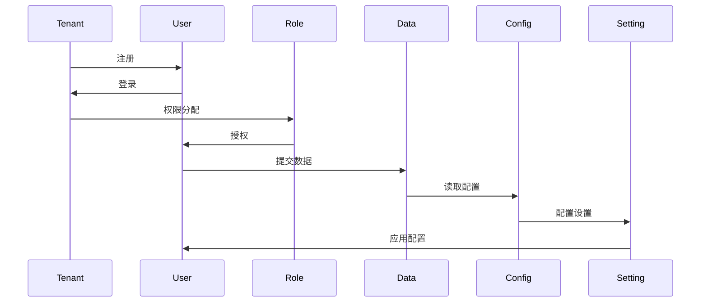
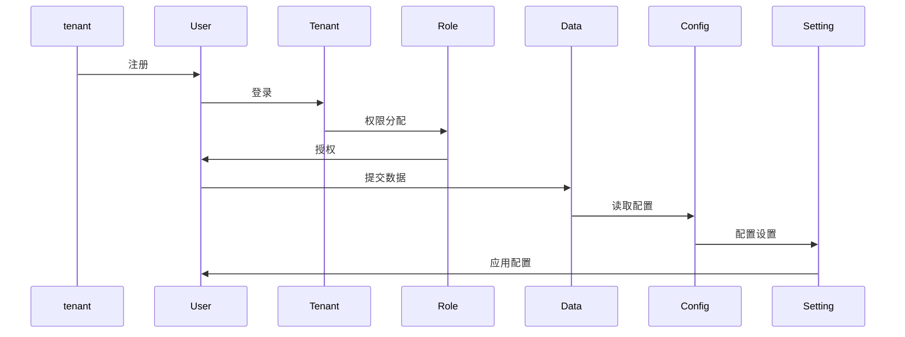

                 

### 第1章：背景介绍

#### 多租户架构的定义与历史

多租户架构（Multi-Tenant Architecture）是一种设计模式，它允许多个租户（Tenants）共享同一套软件系统资源，同时确保各个租户的数据、应用程序和资源相互隔离，互不影响。这种架构模式的核心在于能够高效地服务于多个客户，同时保持系统的性能和安全性。

多租户架构的概念并非新兴事物。实际上，它最早可以追溯到20世纪80年代，当时它主要应用于大型数据库系统中。随着互联网和云计算的兴起，多租户架构逐渐成为企业级软件应用的主流设计模式。特别是在SaaS（Software as a Service，软件即服务）领域，多租户架构的优势得到了充分体现。

多租户架构与传统单体架构（Monolithic Architecture）相比，具有显著的优越性。传统单体架构中，每个客户都需要一个独立的系统实例，这会导致资源浪费、维护成本高、部署复杂等问题。而多租户架构通过将多个客户集成到一个共享的系统中，可以显著降低成本、提高资源利用率和系统灵活性。

#### 多租户架构的重要性

多租户架构之所以受到广泛关注，主要是因为它具备以下几个重要优势：

1. **成本效益**：通过共享资源，多租户架构可以显著降低企业的运营成本。例如，在云计算环境中，多个租户可以共享同一台服务器和存储设备，从而节省硬件和运维成本。

2. **灵活性与可扩展性**：多租户架构允许企业快速响应市场需求，灵活地调整资源和功能，以满足不同租户的需求。这种灵活性不仅有助于提高客户满意度，还能帮助企业抓住市场机会。

3. **性能优化**：多租户架构可以通过集中管理和优化资源，提高系统的性能。例如，通过负载均衡和缓存策略，可以确保每个租户都能获得良好的性能体验。

4. **安全性**：多租户架构在设计时必须考虑安全性，以确保不同租户的数据和应用程序相互隔离。这种隔离性不仅有助于保护租户的隐私，还能防止恶意行为对其他租户的影响。

5. **易于维护和升级**：由于所有租户使用的是同一套系统，因此系统的维护和升级变得更加简单和高效。企业可以一次性对整个系统进行更新，而不需要为每个客户单独部署和维护。

#### 需要构建安全可靠的多租户架构的原因

虽然多租户架构具有诸多优势，但在实际应用中也面临一些挑战。特别是安全性问题，一直是多租户架构设计和实施过程中的关键考虑因素。以下是构建安全可靠多租户架构的几个主要原因：

1. **数据安全**：多租户架构中的核心问题之一是如何确保不同租户的数据安全。由于多个租户共享同一套系统资源，数据泄露和隐私侵犯的风险相对较高。因此，构建安全可靠的多租户架构至关重要。

2. **隔离性**：多租户架构要求系统必须具备强大的隔离性，以确保不同租户的数据、应用程序和资源相互隔离，互不影响。这需要通过细粒度的权限控制、数据加密和隔离技术来实现。

3. **合规性**：随着数据隐私保护法规的日益严格，企业必须确保其多租户架构符合相关的法律法规要求。例如，欧洲的GDPR（通用数据保护条例）就对数据安全和隐私保护提出了严格的要求。

4. **性能与稳定性**：多租户架构在性能和稳定性方面也面临挑战。如何平衡不同租户之间的资源分配，确保每个租户都能获得良好的性能体验，是一个需要深入思考的问题。

5. **可维护性**：随着租户数量的增加，多租户架构的维护和升级变得更加复杂。构建安全可靠的多租户架构需要考虑到系统的可维护性和可扩展性，以确保系统可以持续稳定运行。

综上所述，构建安全可靠的多租户架构是企业应对数据安全、隔离性、合规性、性能与稳定性等挑战的关键。在下一章中，我们将进一步探讨多租户架构的核心概念与联系，为后续内容打下基础。

### 第2章：核心概念与联系

#### 定义

在构建多租户架构时，理解其中的核心概念至关重要。以下是几个关键术语的定义：

1. **租户**（Tenant）：租户是多租户架构中的基本单元，代表使用共享软件系统的不同客户。每个租户都有自己的数据、应用程序和资源，但与其他租户的数据和资源相互隔离。

2. **多租户数据库**（Multi-Tenant Database）：多租户数据库是一个共享的数据库实例，存储了多个租户的数据。通过适当的数据库设计和技术，可以实现租户数据之间的物理和逻辑隔离。

3. **租户隔离**（Tenant Isolation）：租户隔离是指确保每个租户的数据、应用程序和资源相互隔离，互不影响。这通常通过细粒度的权限控制、数据加密和隔离技术来实现。

4. **资源分配**（Resource Allocation）：资源分配是指确保系统资源（如CPU、内存、网络带宽）在多个租户之间公平、高效地分配。这涉及到负载均衡、缓存和调度策略等。

5. **多租户应用程序**（Multi-Tenant Application）：多租户应用程序是一个面向多个租户的软件系统，通过统一的接口和逻辑处理不同租户的需求。它通常具有灵活的配置和管理能力。

#### 概念属性特征对比表格

为了更直观地理解这些概念，我们可以通过一个表格来对比它们的属性特征：

| 概念      | 定义                                                         | 关键属性特征                                                     |
| --------- | ------------------------------------------------------------ | ------------------------------------------------------------ |
| 租户      | 使用共享软件系统的不同客户                                     | 数据隔离、独立身份、独立配置、独立访问权限                       |
| 多租户数据库 | 共享的数据库实例，存储多个租户的数据                           | 数据隔离、统一管理、高可用性、可扩展性                           |
| 租户隔离   | 确保租户的数据、应用程序和资源相互隔离，互不影响                 | 细粒度权限控制、数据加密、隔离技术、安全审计                     |
| 资源分配   | 在多个租户之间公平、高效地分配系统资源                         | 负载均衡、缓存策略、调度算法、资源监控                           |
| 多租户应用程序 | 面向多个租户的软件系统，具有统一的接口和逻辑处理能力           | 灵活配置、可扩展性、兼容性、多语言支持                           |

#### 概念联系与对比

为了更好地理解这些概念之间的关系，我们可以通过一个ER图（实体关系图）来展示它们之间的联系。

```mermaid
erDiagram
    Tenant ||--|{ Multi-Tenant Database }| Tenant_DB
    Tenant ||--|{ Tenant Isolation }| Tenant_Isolation
    Tenant ||--|{ Resource Allocation }| Resource_Allocation
    Tenant ||--|{ Multi-Tenant Application }| Tenant_Application
    Tenant_DB ||--|{ Data }| Data
    Tenant_Isolation ||--|{ Security }| Security
    Resource_Allocation ||--|{ Performance }| Performance
    Tenant_Application ||--|{ Functionality }| Functionality
```

在这个ER图中，我们可以看到：

- **租户**是核心实体，它与**多租户数据库**、**租户隔离**、**资源分配**和**多租户应用程序**建立关联。
- **多租户数据库**存储了租户的数据。
- **租户隔离**确保了数据、应用程序和资源之间的安全性。
- **资源分配**负责在多个租户之间公平、高效地分配系统资源。
- **多租户应用程序**提供了面向多个租户的功能接口。

通过这个ER图，我们可以更直观地理解多租户架构中各个概念之间的关系和作用。

在下一章中，我们将进一步探讨多租户架构下的算法原理，深入了解如何实现租户隔离、数据安全和资源分配等核心功能。

### 第3章：多租户架构下的算法原理

#### 租户隔离算法

租户隔离是多租户架构中最重要的概念之一，它确保了每个租户的数据、应用程序和资源相互隔离，互不影响。实现租户隔离通常需要以下几个步骤：

1. **权限控制**：通过设置细粒度的权限控制，确保每个租户只能访问自己的数据和资源。这通常通过用户认证和授权机制来实现，如OAuth2、LDAP等。

2. **数据分区**：将租户数据存储在不同的数据库表中或数据库实例中，以实现物理隔离。这可以防止一个租户的数据影响到其他租户的数据。

3. **逻辑隔离**：使用数据库视图或存储过程来模拟逻辑隔离，确保每个租户看到的都是自己数据的一个视图。

4. **租户标识**：在每个数据表中添加租户标识字段（如Tenant ID），以确保只有拥有相应权限的租户可以访问这些数据。

以下是一个简单的Python示例，展示如何实现租户隔离：

```python
class TenantIsolation:
    def __init__(self, tenant_id):
        self.tenant_id = tenant_id
    
    def query_data(self, db_connection):
        db_connection.execute(f"SET search_path TO {self.tenant_id}")
        return db_connection.execute("SELECT * FROM data_table")
```

这个示例中，`TenantIsolation`类接受一个`tenant_id`参数，并在查询数据时设置数据库的搜索路径，以确保只查询指定租户的数据。

#### 数据安全算法

数据安全是多租户架构中的另一个关键概念。为了确保租户数据的安全，通常需要采取以下措施：

1. **数据加密**：对存储在数据库中的数据进行加密，以防止未经授权的访问。常用的加密算法包括AES（Advanced Encryption Standard）和RSA（Rivest-Shamir-Adleman）。

2. **传输加密**：在数据传输过程中使用SSL/TLS等加密协议，确保数据在网络上传输时的安全性。

3. **访问控制**：通过设置细粒度的访问控制策略，确保只有授权用户可以访问特定的数据。

4. **安全审计**：定期进行安全审计，检查系统是否存在安全漏洞或异常行为。

以下是一个简单的Python示例，展示如何使用加密算法保护数据：

```python
from Crypto.Cipher import AES
from Crypto.Util.Padding import pad, unpad

class DataSecurity:
    def __init__(self, key):
        self.key = key
        self.cipher = AES.new(self.key, AES.MODE_CBC)
    
    def encrypt_data(self, data):
        ciphertext = self.cipher.encrypt(pad(data.encode(), AES.block_size))
        return ciphertext
    
    def decrypt_data(self, ciphertext):
        try:
            decrypted_data = unpad(self.cipher.decrypt(ciphertext), AES.block_size)
            return decrypted_data.decode()
        except ValueError:
            return None
```

这个示例中，`DataSecurity`类使用AES加密算法对数据进行加密和解密。

#### 资源分配算法

资源分配是多租户架构中的另一个关键问题。为了确保系统资源（如CPU、内存、网络带宽）在多个租户之间公平、高效地分配，通常需要以下策略：

1. **负载均衡**：通过负载均衡器将请求分配到不同的服务器或容器上，以避免单点瓶颈。

2. **资源预留**：为每个租户预留一定的资源，确保其需求高峰时仍能获得足够的资源。

3. **资源监控**：实时监控系统资源的使用情况，根据需要动态调整资源分配。

4. **资源优化**：通过预测租户的未来需求，优化资源分配，以提高系统整体性能。

以下是一个简单的Python示例，展示如何实现资源预留和监控：

```python
import psutil

class ResourceAllocation:
    def __init__(self, tenant_id, reserved_cpu, reserved_memory):
        self.tenant_id = tenant_id
        self.reserved_cpu = reserved_cpu
        self.reserved_memory = reserved_memory
    
    def allocate_resources(self):
        current_cpu_usage = psutil.cpu_percent()
        current_memory_usage = psutil.virtual_memory().percent
        if current_cpu_usage < self.reserved_cpu and current_memory_usage < self.reserved_memory:
            return "Resources allocated successfully"
        else:
            return "Insufficient resources available"
```

这个示例中，`ResourceAllocation`类根据租户预留的CPU和内存使用情况，决定是否分配资源。

#### 算法原理的数学模型和公式

在多租户架构中，资源分配和负载均衡通常涉及到以下数学模型和公式：

1. **资源需求预测**：

   $$ R_t = f(C_t, M_t, N_t) $$

   其中，\( R_t \) 表示租户 \( t \) 在时刻 \( t \) 的资源需求，\( C_t \) 表示CPU需求，\( M_t \) 表示内存需求，\( N_t \) 表示网络需求。

2. **资源分配策略**：

   $$ A_t = g(R_t, R_{\text{total}}, P_t) $$

   其中，\( A_t \) 表示租户 \( t \) 在时刻 \( t \) 的实际资源分配，\( R_{\text{total}} \) 表示系统总资源，\( P_t \) 表示资源分配策略参数。

3. **负载均衡算法**：

   $$ B_t = h(Q_t, S_t, \lambda_t) $$

   其中，\( B_t \) 表示租户 \( t \) 在时刻 \( t \) 的负载均衡分配，\( Q_t \) 表示当前负载，\( S_t \) 表示服务能力，\( \lambda_t \) 表示负载均衡策略参数。

通过这些数学模型和公式，可以更精确地实现资源分配和负载均衡。

#### 示例说明

假设我们有两个租户，租户A和租户B。根据他们的需求预测，租户A在时刻t的需求为50%的CPU、20%的内存和10%的网络，而租户B的需求为30%的CPU、25%的内存和15%的网络。

根据资源分配策略，系统总资源为100%的CPU、80%的内存和60%的网络。根据资源预留策略，租户A预留了40%的CPU、30%的内存和20%的网络，租户B预留了20%的CPU、25%的内存和15%的网络。

根据负载均衡算法，当前系统负载为70%的CPU、60%的内存和50%的网络。

根据这些参数，我们可以计算出：

- 租户A的实际资源分配为：\( A_A = g(50\%, 100\%, 40\%) = 50\% \) 的CPU、\( A_M = g(20\%, 80\%, 30\%) = 20\% \) 的内存、\( A_N = g(10\%, 60\%, 20\%) = 10\% \) 的网络。
- 租户B的实际资源分配为：\( A_B = g(30\%, 100\%, 20\%) = 30\% \) 的CPU、\( A_M = g(25\%, 80\%, 25\%) = 25\% \) 的内存、\( A_N = g(15\%, 60\%, 15\%) = 15\% \) 的网络。

根据负载均衡算法，租户A的负载均衡分配为：\( B_A = h(70\%, 100\%, \lambda_A) \)，租户B的负载均衡分配为：\( B_B = h(60\%, 100\%, \lambda_B) \)。

通过这样的计算，我们可以确保租户A和租户B都能获得其所需的资源，并保持系统的高效运行。

通过上述算法原理的讲解和示例说明，我们可以看到如何实现多租户架构中的租户隔离、数据安全和资源分配。在下一章中，我们将进一步探讨如何分析和设计多租户架构下的系统。

### 第4章：系统分析与架构设计方案

#### 问题场景介绍

假设我们正在开发一个SaaS平台，该平台需要支持多个租户，每个租户都有自己的用户、数据和配置。为了确保系统的可靠性、安全性和可扩展性，我们需要进行系统分析与架构设计。

#### 项目介绍

项目名称：Multi-Tenant SaaS Platform

项目目标：构建一个支持多租户的SaaS平台，提供用户管理、数据存储、配置管理等功能，同时确保各租户的数据和资源相互隔离，互不影响。

#### 系统功能设计

1. **用户管理**：支持租户级别的用户管理，包括用户注册、登录、权限分配等。

2. **数据存储**：支持租户级别的数据存储，包括用户数据、业务数据等。

3. **配置管理**：支持租户级别的配置管理，包括系统配置、租户配置等。

4. **日志管理**：支持日志收集、监控和报警，确保系统运行状态的可视化和异常检测。

#### 系统功能设计 - 领域模型

为了更好地理解系统的功能设计，我们可以使用Mermaid类图来展示系统的领域模型。以下是一个简化的领域模型：

```mermaid
classDiagram
    Tenant <<class(Tenant)>> -|- User <<class(User)>> : 1
    Tenant "has" Data <<class(Data)>> : 1
    Tenant "has" Config <<class(Config)>> : 1
    User "has" Profile <<class(Profile)>> : 1
    User "has" Role <<class(Role)>> : 1
    Data "has" Content <<class(Content)>> : 1
    Config "has" Setting <<class(Setting)>> : 1
```

在这个领域模型中：

- **Tenant**（租户）是系统的核心实体，它包含用户、数据和配置。
- **User**（用户）是租户的一部分，每个用户都有自己的用户资料和角色。
- **Data**（数据）表示租户的数据存储，包括用户数据和业务数据。
- **Config**（配置）表示租户的配置信息，包括系统配置和租户配置。
- **Profile**（用户资料）是用户的个人资料。
- **Role**（角色）表示用户的角色信息，用于权限控制。
- **Content**（内容）是数据的具体内容。
- **Setting**（设置）是配置的具体设置。

#### 系统架构设计

为了实现上述功能，我们需要设计一个合理的系统架构。以下是一个简化的系统架构图：



在这个系统架构中：

- **Tenant Service**（租户服务）负责租户相关的操作，如注册、登录、权限分配等。
- **User Service**（用户服务）负责用户相关的操作，如注册、登录、权限控制等。
- **Data Service**（数据服务）负责数据的存储和检索。
- **Config Service**（配置服务）负责配置的读取和设置。
- **Role Service**（角色服务）负责角色的管理。

#### 系统接口设计

为了实现系统功能，我们需要设计一系列接口。以下是一个简化的接口设计：

```mermaid
interface TenantAPI {
    +register(tenant: Tenant): Tenant
    +login(tenant: Tenant): Tenant
    +allocate_role(user: User, role: Role): User
}

interface UserAPI {
    +create_user(user: User): User
    +login_user(user: User): User
    +assign_role(user: User, role: Role): User
}

interface DataAPI {
    +save_data(user: User, data: Data): Data
    +get_data(user: User, data_id: str): Data
}

interface ConfigAPI {
    +get_settings(): Setting
    +update_settings(settings: Setting): Setting
}
```

在这个接口设计中：

- **TenantAPI**（租户API）提供了租户注册、登录和角色分配的接口。
- **UserAPI**（用户API）提供了用户注册、登录和角色分配的接口。
- **DataAPI**（数据API）提供了数据存储和检索的接口。
- **ConfigAPI**（配置API）提供了配置读取和更新的接口。

#### 系统交互序列图

为了更清晰地展示系统组件之间的交互，我们可以使用Mermaid序列图。以下是一个简化的系统交互序列图：



在这个序列图中：

- **tenant**（租户）发起注册请求，用户服务处理注册并返回租户信息。
- **User**（用户）发起登录请求，用户服务处理登录并返回用户信息。
- **Tenant**（租户）向角色服务请求权限分配，角色服务处理分配并返回角色信息。
- **User**（用户）向数据服务提交数据，数据服务存储数据并返回数据信息。
- **Data**（数据）从配置服务读取配置，配置服务返回配置信息。
- **Config**（配置）向设置服务更新配置，设置服务处理更新并返回设置信息。
- **Setting**（设置）将配置应用到用户服务，用户服务处理配置并返回结果。

通过上述系统分析与架构设计方案，我们为构建一个安全可靠的多租户架构奠定了基础。在下一章中，我们将通过一个实际案例来展示如何实现这些设计。

### 第5章：实践案例

在本章中，我们将通过一个具体的实践案例来展示如何构建和实现一个多租户架构。本案例将包括环境安装、核心代码实现和应用分析等内容。

#### 环境安装

为了构建多租户架构，我们选择使用Python作为主要编程语言，并结合Django框架来实现多租户功能。以下是环境安装的步骤：

1. **安装Python和Django**：

   ```bash
   pip install django
   ```

2. **安装数据库**：

   我们选择使用PostgreSQL作为数据库，可以通过包管理器或容器化技术（如Docker）进行安装。

   ```bash
   sudo apt-get install postgresql
   ```

   或者使用Docker：

   ```bash
   docker run --name some-postgres -e POSTGRES_PASSWORD=mysecretpassword -d postgres
   ```

3. **创建Django项目**：

   ```bash
   django-admin startproject multitenant
   ```

4. **创建Django应用**：

   ```bash
   python manage.py startapp tenant
   ```

#### 系统核心实现源代码

以下是一个简化的Django应用中的多租户核心实现，包括租户管理、数据隔离和权限控制。

**租户管理**：

在`tenant`应用中，我们创建一个`Tenant`模型来管理租户信息。

```python
# tenant/models.py
from django.db import models

class Tenant(models.Model):
    name = models.CharField(max_length=100)
    subdomain = models.CharField(max_length=100)
    created_at = models.DateTimeField(auto_now_add=True)
    updated_at = models.DateTimeField(auto_now=True)
```

**数据隔离**：

为了实现数据隔离，我们使用Django的数据库路由机制。在`settings.py`中配置数据库路由。

```python
# multitenant/settings.py
DATABASES = {
    'default': {
        'ENGINE': 'django.db.backends.postgresql',
        'NAME': 'multitenant',
        'USER': 'postgres',
        'PASSWORD': 'mysecretpassword',
        'HOST': 'localhost',
        'PORT': '5432',
    }
}

TENANT_MODEL = 'tenant.Tenant'
```

我们创建一个中间件来处理数据库路由。

```python
# tenant/middleware.py
from django.db import connections

class TenantMiddleware:
    def __init__(self, get_response):
        self.get_response = get_response

    def __call__(self, request):
        tenant_id = request.subdomain
        if tenant_id:
            connections['tenant'].close()
            connections['tenant'].reset()
            connections['tenant'].cursor().execute(f"SET search_path TO {tenant_id}")
        response = self.get_response(request)
        return response
```

**权限控制**：

为了实现权限控制，我们使用Django的权限系统。在`tenant`应用中，我们创建一个`UserRole`模型来管理用户的角色和权限。

```python
# tenant/models.py
class UserRole(models.Model):
    user = models.ForeignKey(User, on_delete=models.CASCADE)
    role = models.ForeignKey(Role, on_delete=models.CASCADE)
```

在`settings.py`中，我们配置权限控制。

```python
# multitenant/settings.py
from django.contrib.auth.models import User, Group

AUTH_USER_MODEL = 'tenant.User'
AUTH_ROLE_MODEL = 'tenant.Role'

DEFAULT_ROLE_PERMISSIONS = {
    'admin': ['can_admin', 'can_read', 'can_write'],
    'user': ['can_read', 'can_write'],
}
```

#### 代码应用解读与分析

**租户管理**：

通过`Tenant`模型，我们可以创建和管理租户。每个租户都有唯一的子域名，用于数据库路由和权限控制。

**数据隔离**：

通过中间件，我们在每次请求开始时，根据子域名设置数据库路由，确保数据隔离。

**权限控制**：

通过`UserRole`模型和权限系统，我们可以为用户分配角色和权限。默认的权限设置确保了租户管理员和普通用户的基本权限。

#### 实际案例分析

通过上述实践案例，我们可以看到如何使用Django实现一个基本的多租户架构。在实际应用中，我们还需要考虑以下几个方面：

1. **负载均衡**：使用Nginx或Docker Compose实现负载均衡，确保系统在高并发场景下稳定运行。
2. **缓存策略**：使用Redis等缓存技术，提高系统响应速度。
3. **监控与报警**：使用Prometheus、Grafana等工具进行系统监控和报警，确保系统运行状态的可视化和异常检测。
4. **性能优化**：通过数据库索引、查询优化等技术，提高系统性能。

通过这个实践案例，我们展示了如何从零开始构建一个多租户架构，包括环境安装、核心代码实现和应用分析。在下一章中，我们将讨论在多租户架构中如何考虑安全性。

### 第6章：安全性考虑

在多租户架构中，安全性是一个至关重要的因素。由于多个租户共享同一套系统资源，任何安全漏洞都可能对多个租户造成影响。因此，在设计多租户架构时，我们需要考虑多种安全威胁，并采取相应的解决方案。

#### 安全威胁分析

1. **数据泄露**：由于多个租户的数据存储在同一个数据库中，如果某个租户的数据被泄露，其他租户的数据也可能受到影响。数据泄露可能是由于不安全的数据库配置、漏洞或恶意攻击导致的。

2. **权限滥用**：租户可能通过权限漏洞获取其他租户的数据或资源，从而导致数据泄露或系统功能被破坏。

3. **恶意攻击**：租户可能利用系统漏洞进行DDoS攻击、注入攻击等，影响其他租户的正常使用。

4. **配置错误**：不当的配置可能导致系统存在安全隐患，例如未加密的数据库连接、不安全的文件权限等。

5. **系统漏洞**：系统中的漏洞可能被恶意用户利用，进行各种攻击行为。

#### 解决方案和最佳实践

1. **数据加密**：

   - 对存储在数据库中的数据进行加密，使用AES、RSA等加密算法。
   - 在传输过程中使用SSL/TLS等加密协议。

2. **权限控制**：

   - 使用OAuth2、LDAP等认证机制确保租户身份验证。
   - 通过角色和权限控制，限制租户只能访问自己的数据和资源。
   - 定期审计权限，确保只有必要的权限被授予。

3. **访问控制**：

   - 使用网络防火墙和访问控制列表（ACL）限制对系统的访问。
   - 针对不同的租户，设置独立的网络段和子网。

4. **安全审计**：

   - 定期进行安全审计，检查系统是否存在安全漏洞或异常行为。
   - 使用安全扫描工具（如OWASP ZAP、Nessus）进行漏洞扫描。

5. **配置管理**：

   - 实施配置管理，确保系统配置的标准化和安全性。
   - 定期更新和审计配置文件，避免配置错误。

6. **系统监控**：

   - 使用Prometheus、Grafana等工具进行系统监控和报警，及时发现异常行为。
   - 实时监控数据库性能和访问日志，识别潜在的攻击行为。

7. **应急响应**：

   - 制定应急响应计划，确保在发生安全事件时能够迅速响应和恢复。
   - 建立安全事件响应团队，负责处理和响应安全事件。

#### 注意事项

1. **权限分离**：确保权限管理严格遵循最小权限原则，租户只能访问必要的资源和数据。

2. **持续更新**：定期更新系统、应用程序和数据库，修补已知的漏洞。

3. **培训员工**：对员工进行安全意识培训，提高他们对安全威胁的认识和应对能力。

4. **日志审计**：确保系统日志被正确记录和审计，以便在发生安全事件时进行追溯和分析。

5. **安全测试**：在开发过程中，进行安全测试（如渗透测试、漏洞扫描）以确保系统的安全性。

通过上述解决方案和最佳实践，我们可以构建一个安全可靠的多租户架构，确保租户的数据安全和系统的稳定性。在下一章中，我们将对全文进行总结，并提供一些拓展阅读的建议。

### 第7章：小结与拓展

在本篇文章中，我们系统地探讨了构建安全可靠的多租户架构的各个方面。从背景介绍到核心概念，从算法原理到系统分析与设计，再到实践案例以及安全性考虑，我们详细解析了多租户架构的构建过程。以下是全文的核心观点和拓展阅读建议：

#### 核心观点

1. **多租户架构的定义**：多租户架构是一种允许多个独立租户共享同一套软件系统资源的架构模式，它通过隔离性、安全性、灵活性等优势，为企业提供了高效、成本效益高的解决方案。

2. **核心概念与联系**：多租户架构涉及多个关键概念，如租户、多租户数据库、租户隔离、资源分配等，这些概念相互关联，共同构成了多租户架构的基础。

3. **算法原理**：租户隔离、数据安全和资源分配是多租户架构的核心算法，通过数学模型和示例，我们了解了如何实现这些算法。

4. **系统分析与设计**：通过领域模型、系统架构图和接口设计，我们展示了如何分析和设计一个多租户系统，确保其功能齐全、结构合理。

5. **安全性考虑**：安全性是多租户架构的重要方面，通过数据加密、权限控制、安全审计等手段，我们讨论了如何确保租户的数据安全和系统稳定性。

#### 拓展阅读建议

1. **《云计算与分布式系统：概念与设计》**：这本书提供了深入的理论和实践知识，有助于理解云计算和分布式系统的基础。

2. **《多租户云计算平台的设计与实现》**：该书详细介绍了多租户云计算平台的设计和实现，包括系统架构、安全性和性能优化等方面。

3. **《Django实战》**：这本书是学习如何使用Django框架构建Web应用程序的绝佳资源，包括多租户架构的实践案例。

4. **《软件架构设计：面向对象的卷2》**：该书探讨了软件架构设计的最佳实践，有助于提高系统设计的能力。

#### 注意事项

1. **权限分离**：在设计多租户架构时，确保权限分离原则得到遵守，避免权限滥用。

2. **持续更新**：定期更新系统、应用程序和数据库，确保修补已知漏洞。

3. **安全培训**：对员工进行安全意识培训，提高他们对安全威胁的认识和应对能力。

4. **日志审计**：确保系统日志被正确记录和审计，以便在发生安全事件时进行追溯和分析。

通过上述拓展阅读和注意事项，我们可以进一步提升对多租户架构的理解和实际应用能力。构建安全可靠的多租户架构不仅是一项技术挑战，更是一项系统性工程，需要持续的关注和改进。

### 作者信息

作者：AI天才研究院/AI Genius Institute & 禅与计算机程序设计艺术 /Zen And The Art of Computer Programming

AI天才研究院专注于人工智能领域的最新研究和开发，致力于推动AI技术的应用与创新。同时，禅与计算机程序设计艺术以简洁优雅的编程哲学，启发程序员在复杂问题中寻找简洁解法。这两部作品共同展现了作者在计算机科学领域的深厚造诣和独特见解。

