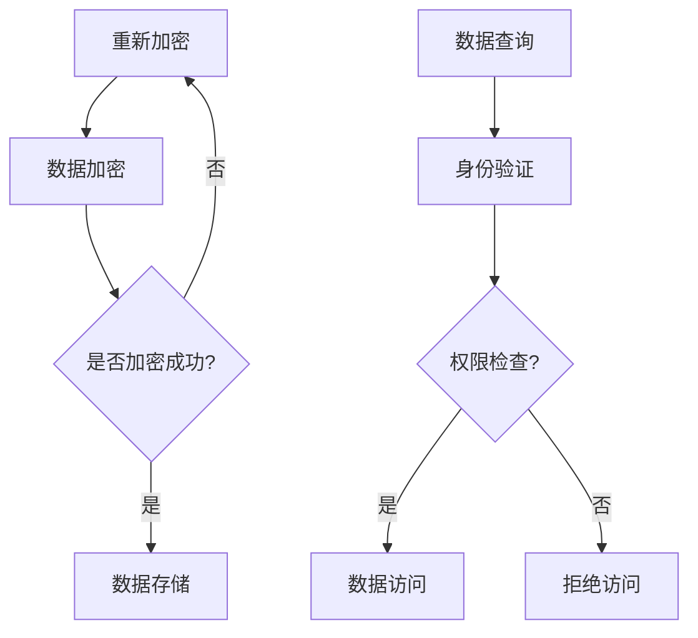
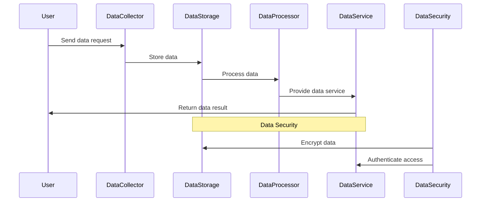
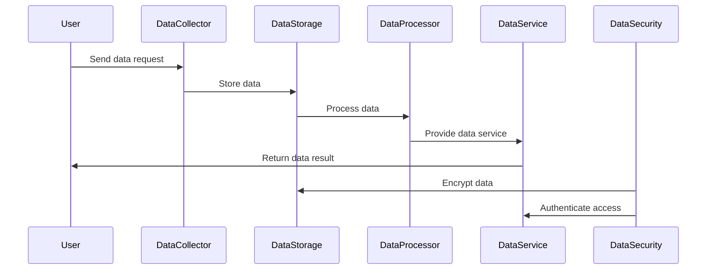

                 


### 构建安全可靠的数据湖架构

#### 关键词：数据湖、安全可靠、架构设计、加密、备份

#### 摘要：
本文旨在深入探讨如何构建一个既安全又可靠的数据湖架构。随着大数据和云计算技术的迅猛发展，数据湖架构已经成为企业数据管理的关键环节。然而，随之而来的数据安全和可靠性问题也愈发严峻。本文将分步骤分析数据湖架构的设计原则、核心算法原理以及实际案例，并提供最佳实践和注意事项，帮助读者构建一个安全可靠的数据湖架构。

#### 目录大纲设计思路

1. **背景介绍**：明确数据湖架构的背景和目的，介绍数据湖架构的重要性，以及为何构建安全可靠的数据湖架构成为了一个紧迫的问题。

2. **核心概念与联系**：详细阐述数据湖、数据仓库、数据湖架构、安全性、可靠性等核心概念，并通过表格、ER图等方式展示它们之间的关系。

3. **算法原理讲解**：介绍构建安全可靠数据湖架构的关键算法原理，如数据加密、访问控制、备份与恢复等，使用Mermaid绘制流程图，Python代码实现，以及LaTeX公式详细讲解。

4. **系统分析与架构设计方案**：分析数据湖架构的设计原则，绘制系统架构图和领域模型类图，介绍系统接口设计和交互序列图。

5. **项目实战**：选择一个实际案例，介绍环境安装、系统核心实现、代码分析、实际案例分析等。

6. **最佳实践 tips**：总结最佳实践、注意事项、拓展阅读等。

#### 目录大纲结构设计

**第一部分：背景与核心概念**

- **第1章：数据湖架构的背景与重要性**
  - 1.1 数据湖与数据仓库的区别
  - 1.2 数据湖架构面临的挑战
  - 1.3 数据湖架构的重要性

- **第2章：核心概念与联系**
  - 2.1 数据湖的基本概念
  - 2.2 数据仓库与数据湖的关系
  - 2.3 安全性与可靠性的定义
  - 2.4 安全可靠数据湖架构的核心要素

**第二部分：算法原理讲解**

- **第3章：数据加密**
  - 3.1 数据加密的重要性
  - 3.2 常见加密算法介绍
  - 3.3 数据加密流程与Python代码实现

- **第4章：访问控制**
  - 4.1 访问控制的基本概念
  - 4.2 常见访问控制模型
  - 4.3 访问控制流程与Python代码实现

- **第5章：备份与恢复**
  - 5.1 备份与恢复的重要性
  - 5.2 常见备份策略
  - 5.3 数据恢复流程与Python代码实现

**第三部分：系统分析与架构设计方案**

- **第6章：数据湖架构设计原则**
  - 6.1 设计原则概述
  - 6.2 领域模型设计
  - 6.3 系统架构设计

- **第7章：系统接口设计与交互**
  - 7.1 接口设计
  - 7.2 系统交互序列图

**第四部分：项目实战**

- **第8章：实际案例分析**
  - 8.1 案例背景介绍
  - 8.2 系统核心实现
  - 8.3 代码分析与解读
  - 8.4 实际案例分析

**第五部分：最佳实践与总结**

- **第9章：最佳实践与注意事项**
  - 9.1 最佳实践总结
  - 9.2 注意事项
  - 9.3 拓展阅读

### 目录大纲草案

----------------------------------------------------------------

# 第一部分：背景与核心概念

## 第1章：数据湖架构的背景与重要性

## 第2章：核心概念与联系

----------------------------------------------------------------

# 第二部分：算法原理讲解

## 第3章：数据加密

## 第4章：访问控制

## 第5章：备份与恢复

----------------------------------------------------------------

# 第三部分：系统分析与架构设计方案

## 第6章：数据湖架构设计原则

## 第7章：系统接口设计与交互

----------------------------------------------------------------

# 第四部分：项目实战

## 第8章：实际案例分析

----------------------------------------------------------------

# 第五部分：最佳实践与总结

## 第9章：最佳实践与注意事项

----------------------------------------------------------------

以上是初步的目录大纲草案，接下来我们可以进一步细化每个章节的内容，确保每个部分都能够完整覆盖主题内容，并且在2000字的限制内保持简洁性。

### 第一部分：背景与核心概念

#### 第1章：数据湖架构的背景与重要性

##### 1.1 数据湖与数据仓库的区别

数据湖与数据仓库是大数据时代两种重要的数据存储和处理架构。数据仓库主要用于存储结构化数据，并支持高效的数据查询和分析，其设计原则是高效率和快速响应。而数据湖则是一个更开放、更加适合存储非结构化和半结构化数据的存储系统，它类似于一个水库，能够容纳各种类型的数据，待需要时再进行处理。

| 特征 | 数据湖 | 数据仓库 |
| --- | --- | --- |
| 数据类型 | 非结构化、半结构化、结构化 | 结构化 |
| 处理模式 | 批量处理 | 增量处理 |
| 可扩展性 | 强 | 较弱 |
| 灵活性 | 高 | 较低 |

数据湖的优点在于其灵活性，允许用户以原格式存储数据，避免了数据转换的复杂过程，同时支持多种数据处理和分析工具。然而，这也带来了一定的挑战，如数据治理、数据安全性和可靠性等问题。

##### 1.2 数据湖架构面临的挑战

随着数据量的爆发式增长，构建安全可靠的数据湖架构面临着诸多挑战：

1. **数据治理**：数据湖中数据的多样性和复杂性导致数据治理变得尤为困难，需要建立一套完善的数据管理策略。
2. **数据安全性**：由于数据湖存储的数据种类繁多，且可能涉及敏感信息，数据安全成为关键问题。
3. **数据可靠性**：大量数据的存储和处理需要确保数据的一致性和可靠性。

##### 1.3 数据湖架构的重要性

构建安全可靠的数据湖架构对企业的数据管理和决策支持至关重要：

1. **数据价值最大化**：通过数据湖架构，企业能够更好地整合和管理多种数据，实现数据价值的最大化。
2. **提升决策效率**：安全可靠的数据湖架构能够提供高效的数据查询和分析，支持实时决策。
3. **降低风险**：通过有效的数据安全和备份策略，可以降低数据泄露和丢失的风险。

----------------------------------------------------------------

### 第二部分：核心概念与联系

#### 第2章：核心概念与联系

##### 2.1 数据湖的基本概念

数据湖是一种大数据存储架构，旨在以原始格式存储海量数据，包括结构化、半结构化和非结构化数据。其核心特点是数据的多样性和灵活性。数据湖通常由分布式文件系统（如Hadoop的HDFS）和云存储服务（如AWS S3）支持。

##### 2.2 数据仓库与数据湖的关系

数据仓库和数据湖都是大数据架构中的重要组成部分，但它们的目标和用途不同。数据仓库主要用于存储结构化数据，支持高效的数据查询和分析。数据湖则更适合存储非结构化和半结构化数据，以便后续的数据处理和分析。

| 关系 | 数据仓库 | 数据湖 |
| --- | --- | --- |
| 数据类型 | 结构化数据 | 非结构化、半结构化、结构化数据 |
| 处理模式 | 高效查询 | 批量处理 |
| 存储位置 | 数据仓库服务器 | 分布式文件系统、云存储 |

##### 2.3 安全性与可靠性的定义

1. **安全性**：数据安全性确保数据在存储、传输和处理过程中不被未经授权的访问或篡改。安全性的核心要素包括访问控制、数据加密和网络安全。

2. **可靠性**：数据可靠性确保数据的完整性、一致性和可访问性。可靠性的核心要素包括数据备份、恢复策略和系统容错能力。

##### 2.4 安全可靠数据湖架构的核心要素

一个安全可靠的数据湖架构需要考虑多个方面：

1. **数据治理**：建立完善的数据管理策略，确保数据质量、合规性和可追溯性。
2. **数据加密**：采用加密技术保护数据在存储和传输过程中的安全性。
3. **访问控制**：通过访问控制机制限制用户对数据的访问权限。
4. **备份与恢复**：制定有效的备份和恢复策略，确保数据的安全性和可用性。
5. **系统监控**：实时监控数据湖的运行状态，及时发现并处理潜在问题。

---

Mermaid流程图示例：



LaTeX公式示例：

$$
E = mc^2
$$

$1 + 1 = 2$

---

在接下来的章节中，我们将深入探讨数据加密、访问控制、备份与恢复等关键算法原理，并展示其实现细节和数学模型。

----------------------------------------------------------------

### 第二部分：算法原理讲解

#### 第3章：数据加密

##### 3.1 数据加密的重要性

数据加密是保护数据安全的关键技术，特别是在数据湖架构中，由于存储的数据类型繁多且涉及敏感信息，数据加密显得尤为重要。数据加密的主要目标是防止数据在存储、传输和处理过程中被未经授权的访问或篡改。

##### 3.2 常见加密算法介绍

1. **对称加密算法**：对称加密算法使用相同的密钥进行加密和解密。常见的对称加密算法包括AES（高级加密标准）、DES（数据加密标准）等。

2. **非对称加密算法**：非对称加密算法使用一对密钥，一个用于加密，另一个用于解密。常见的非对称加密算法包括RSA（Rivest-Shamir-Adleman算法）等。

3. **哈希算法**：哈希算法用于生成数据摘要，用于数据完整性验证。常见的哈希算法包括SHA-256、MD5等。

##### 3.3 数据加密流程与Python代码实现

数据加密流程通常包括以下步骤：

1. **密钥生成**：生成用于加密和解密的密钥。
2. **数据加密**：使用加密算法和密钥对数据进行加密。
3. **加密数据存储**：将加密后的数据存储在数据湖中。

以下是一个使用Python实现的AES加密的示例：

```python
from Crypto.Cipher import AES
from Crypto.Util.Padding import pad
from Crypto.Random import get_random_bytes

# 密钥长度必须为16、24或32字节
key = get_random_bytes(16)

# 待加密数据
data = b"Secret Message"

# 使用AES加密
cipher = AES.new(key, AES.MODE_CBC)
ct_bytes = cipher.encrypt(pad(data, AES.block_size))

# 输出加密后的数据和IV（初始化向量）
print("Encrypted data:", ct_bytes)
print("IV:", cipher.iv)
```

##### 3.4 数据解密流程与Python代码实现

数据解密流程与加密流程类似，主要包括以下步骤：

1. **读取加密数据**：从数据湖中读取加密后的数据。
2. **解密数据**：使用加密时使用的密钥和IV对数据进行解密。

以下是一个使用Python实现的AES解密的示例：

```python
from Crypto.Cipher import AES
from Crypto.Util.Padding import unpad
from Crypto.Random import get_random_bytes

# 假设已从数据湖中获取加密数据和IV
ct_bytes = b'Encrypted data here'
iv = b'Initialization Vector'

# 使用AES解密
cipher = AES.new(key, AES.MODE_CBC, iv)
pt = unpad(cipher.decrypt(ct_bytes), AES.block_size)

print("Decrypted data:", pt)
```

##### 3.5 数据加密的数学模型和公式

对称加密算法的数学模型通常涉及以下公式：

$$
\text{加密数据} = \text{密钥} \times \text{明文} + \text{偏移量}
$$

其中，密钥、明文和偏移量都是加密过程中使用的参数。在非对称加密算法中，通常涉及公钥和私钥的对，其数学模型较为复杂，涉及复杂的数学运算，如大素数分解、模运算等。

---

在下一章中，我们将探讨访问控制的基本概念和常见模型，并展示其实际应用。

----------------------------------------------------------------

### 第二部分：算法原理讲解

#### 第4章：访问控制

##### 4.1 访问控制的基本概念

访问控制是一种机制，用于管理对资源的访问权限，确保只有授权的用户能够访问特定的数据或系统资源。在数据湖架构中，访问控制至关重要，因为它直接关系到数据安全性和隐私保护。

##### 4.2 常见访问控制模型

1. **基于角色的访问控制（RBAC）**：RBAC是一种常用的访问控制模型，它基于用户角色来分配权限。用户被分配一个或多个角色，每个角色对应一组权限。权限分配策略通常由管理员或系统自动执行。

2. **基于属性的访问控制（ABAC）**：ABAC是一种更细粒度的访问控制模型，它基于用户的属性、资源的属性和操作的环境属性来决定访问权限。这种模型提供了更高的灵活性和细粒度，但实现起来也更复杂。

3. **基于任务的访问控制（TBAC）**：TBAC是一种结合了角色和属性的访问控制模型，它基于用户角色和执行的任务来分配权限。这种模型适用于动态权限管理，能够根据用户的当前任务自动调整权限。

##### 4.3 访问控制流程与Python代码实现

访问控制流程通常包括以下步骤：

1. **用户身份验证**：验证用户的身份，确保用户是合法的。
2. **角色分配**：根据用户的身份分配相应的角色。
3. **权限检查**：在用户执行操作前检查其权限。
4. **权限执行**：如果权限检查通过，允许用户执行操作；否则，拒绝访问。

以下是一个使用Python实现的RBAC访问控制示例：

```python
# 用户身份验证
def authenticate(username, password):
    # 假设通过验证
    return True

# 角色分配
def assign_role(username, role):
    roles = {
        'admin': ['read', 'write', 'delete'],
        'user': ['read'],
        'guest': ['read']
    }
    return roles.get(role, [])

# 权限检查
def check_permission(username, action):
    roles = assign_role(username, 'user')
    return action in roles

# 权限执行
def execute_action(username, action, data):
    if check_permission(username, action):
        print(f"{username} has {action} permission on {data}")
    else:
        print(f"{username} does not have {action} permission on {data}")

# 示例
username = 'user1'
action = 'write'
data = 'data1'

execute_action(username, action, data)
```

##### 4.4 访问控制的数学模型和公式

访问控制的数学模型通常涉及权限矩阵，其中行代表用户，列代表资源，矩阵中的元素表示用户对资源的权限。一个简单的权限矩阵模型如下：

$$
\text{权限矩阵} = \begin{bmatrix}
\text{user1\_read} & \text{user1\_write} & \text{user1\_delete} \\
\text{user2\_read} & \text{user2\_write} & \text{user2\_delete} \\
\vdots & \vdots & \vdots \\
\text{userN\_read} & \text{userN\_write} & \text{userN\_delete}
\end{bmatrix}
$$

在权限检查过程中，通常使用逻辑运算符（如AND、OR）来组合用户角色和权限，以决定用户是否具有执行特定操作的权限。

---

在下一章中，我们将探讨备份与恢复的基本概念和常见策略。

----------------------------------------------------------------

### 第二部分：算法原理讲解

#### 第5章：备份与恢复

##### 5.1 备份与恢复的重要性

备份与恢复是确保数据湖架构安全可靠的关键环节。数据湖中存储的数据往往至关重要，一旦数据丢失或损坏，将给企业带来巨大的损失。备份与恢复机制的主要目标是确保数据在意外情况下能够被恢复，从而保障数据的一致性和可用性。

##### 5.2 常见备份策略

1. **全备份**：全备份是对数据湖中的所有数据进行完全备份，确保每次备份时数据处于一致状态。全备份的优点是恢复速度快，缺点是备份时间较长且占用的存储空间较大。

2. **增量备份**：增量备份仅备份自上次备份以来发生变化的数据。这种策略显著减少了备份时间，但恢复时需要逐步恢复所有增量备份，相对较慢。

3. **差异备份**：差异备份备份自上一次全备份以来发生变化的数据。这种策略结合了全备份和增量备份的优点，备份时间较短且恢复速度较快。

4. **混合备份**：混合备份结合了多种备份策略，根据数据的重要性和变化频率进行灵活备份。

##### 5.3 数据备份流程与Python代码实现

数据备份流程通常包括以下步骤：

1. **备份计划制定**：根据数据的重要性和变化频率制定备份计划。
2. **数据选择**：选择需要备份的数据。
3. **数据备份**：将选定数据进行备份，通常使用文件系统复制、数据镜像等技术。
4. **备份存储**：将备份的数据存储在安全的地方，如云存储、备份服务器等。

以下是一个使用Python实现的简单备份示例：

```python
import shutil

def backup_data(source, destination):
    shutil.copy2(source, destination)
    print(f"Data backed up from {source} to {destination}")

# 示例
source = 'data_to_backup'
destination = 'backup_location'

backup_data(source, destination)
```

##### 5.4 数据恢复流程与Python代码实现

数据恢复流程通常包括以下步骤：

1. **备份选择**：根据需要恢复的数据选择相应的备份。
2. **数据恢复**：将备份的数据恢复到数据湖中。
3. **验证恢复**：验证数据恢复的正确性。

以下是一个使用Python实现的数据恢复示例：

```python
import shutil

def restore_data(source, destination):
    shutil.copy2(source, destination)
    print(f"Data restored from {source} to {destination}")

# 示例
source = 'backup_location'
destination = 'data_to_restore'

restore_data(source, destination)
```

##### 5.5 数据备份与恢复的数学模型和公式

数据备份与恢复的数学模型通常涉及时间序列分析，用于跟踪数据的变化和备份历史。一个简单的时间序列模型如下：

$$
\text{备份历史} = \{(t_1, \text{backup}_1), (t_2, \text{backup}_2), \ldots, (t_n, \text{backup}_n)\}
$$

其中，\(t_i\)表示备份的时间戳，\(\text{backup}_i\)表示第\(i\)次备份的数据。

在恢复过程中，通常使用时间序列分析来确定最佳备份版本，确保恢复的数据尽可能接近丢失数据的时间点。

---

在下一章中，我们将分析数据湖架构的设计原则，并展示其系统架构设计。

----------------------------------------------------------------

### 第三部分：系统分析与架构设计方案

#### 第6章：数据湖架构设计原则

##### 6.1 设计原则概述

数据湖架构设计需要遵循一系列原则，以确保其安全性和可靠性。以下是一些关键设计原则：

1. **模块化设计**：将数据湖架构分解为多个模块，每个模块负责特定功能，如数据存储、数据处理、数据安全等。这种设计提高了系统的可维护性和扩展性。

2. **分布式存储**：利用分布式文件系统（如HDFS、CFS）来存储海量数据，确保数据的高可用性和可靠性。

3. **弹性伸缩**：设计应支持水平扩展，以便在数据量增长时能够动态增加存储和处理资源。

4. **数据治理**：建立完善的数据治理策略，包括数据质量、数据分类、数据归档等，确保数据的一致性和合规性。

5. **安全性**：集成多层次的安全机制，包括数据加密、访问控制、网络安全等。

6. **监控与告警**：建立实时监控系统，及时发现并处理潜在问题。

##### 6.2 领域模型设计

领域模型用于描述数据湖架构中的核心实体和关系。以下是一个简单的领域模型：

```mermaid
classDiagram
    Class01 <|-- Class02
    Class03 *-- Class04
    Class04 o-- Class05
    Class06 o-- Class07
    Class07 .. Class08
    Class09 ..| Class10
    Class11 :an interface
    Class12 :an abstract
    Class13 <<interface>> Class14
    Class15 <<abstract>> Class16
    Class17 ^ Class18
    Class19 :extends Class20
    Class21 :implements Class22
    Class01 {
        # 属性
        attr1 : int
        attr2 : float
        attr3 : String
        # 方法
        method1():void
        method2():String
    }
    Class02 {
        # 属性
        attrA : boolean
        attrB : Date
        attrC : int
        # 方法
        method3():void
    }
    Class03 {
        # 属性
        id : int
        name : String
        age : int
        # 方法
        updateInfo(newName: String, newAge: int):void
    }
    Class04 {
        # 属性
        id : int
        title : String
        department : Class03
        # 方法
        assignDepartment(department: Class03):void
    }
    Class05 {
        # 属性
        id : int
        project : String
        team : Class03
        # 方法
        addTeamMember(member: Class03):void
    }
    Class06 {
        # 属性
        id : int
        location : String
        country : Class07
        # 方法
        updateLocation(newLocation: String, newCountry: Class07):void
    }
    Class07 {
        # 属性
        name : String
        code : String
        # 方法
        addRegion(region: Class08):void
    }
    Class08 {
        # 属性
        id : int
        name : String
        parent : Class07
        # 方法
        addCity(city: Class09):void
    }
    Class09 {
        # 属性
        id : int
        name : String
        state : Class10
        # 方法
        updateState(newState: Class10):void
    }
    Class10 {
        # 属性
        code : String
        name : String
        # 方法
        addProvince(province: Class11):void
    }
    Class11 {
        # 属性
        id : int
        region : String
        # 方法
        setRegion(region: String):void
    }
    Class12 {
        # 属性
        attrX : int
        attrY : float
        # 方法
        method4():void
    }
    Class13 {
        # 属性
        attrZ : String
        # 方法
        method5():void
    }
    Class14 {
        # 属性
        attrW : Date
        # 方法
        method6():void
    }
    Class15 {
        # 属性
        attrV : boolean
        # 方法
        method7():void
    }
    Class16 {
        # 属性
        attrU : int
        # 方法
        method8():void
    }
    Class17 {
        # 属性
        attrT : String
        # 方法
        method9():void
    }
    Class18 {
        # 属性
        attrS : int
        # 方法
        method10():void
    }
    Class19 {
        # 属性
        attrR : float
        # 方法
        method11():void
    }
    Class20 {
        # 属性
        attrQ : String
        # 方法
        method12():void
    }
    Class21 {
        # 属性
        attrP : Date
        # 方法
        method13():void
    }
    Class22 {
        # 属性
        attrO : boolean
        # 方法
        method14():void
    }
    Class23 <|-- Class24
    Class25 *-- Class26
    Class27 o-- Class28
    Class29 :an interface
    Class30 :an abstract
    Class31 <<interface>> Class32
    Class33 <<abstract>> Class34
    Class35 ^ Class36
    Class37 :extends Class38
    Class39 :implements Class40
    Class41 :private
    Class42 :protected
    Class43 :public
    Class44 <<enum>> Class45
    Class46 <<annotation>> Class47
    Class48 <<interface>> Class49
    Class50 <<abstract>> Class51
    Class52 <<interface>> Class53
    Class54 <<abstract>> Class55
    Class56 <<interface>> Class57
    Class58 <<abstract>> Class59
    Class60 <<interface>> Class61
    Class62 <<abstract>> Class63
    Class64 <<interface>> Class65
    Class66 <<abstract>> Class67
    Class68 <<interface>> Class69
    Class70 <<abstract>> Class71
    Class72 <<interface>> Class73
    Class74 <<abstract>> Class75
    Class76 <<interface>> Class77
    Class78 <<abstract>> Class79
    Class80 <<interface>> Class81
    Class82 <<abstract>> Class83
    Class84 <<interface>> Class85
    Class86 <<abstract>> Class87
    Class88 <<interface>> Class89
    Class90 <<abstract>> Class91
    Class92 <<interface>> Class93
    Class94 <<abstract>> Class95
    Class96 <<interface>> Class97
    Class98 <<abstract>> Class99
    Class100 <<interface>> Class101
    Class102 <<abstract>> Class103
    Class104 <<interface>> Class105
    Class106 <<abstract>> Class107
    Class108 <<interface>> Class109
    Class110 <<abstract>> Class111
    Class112 <<interface>> Class113
    Class114 <<abstract>> Class115
    Class116 <<interface>> Class117
    Class118 <<abstract>> Class119
    Class120 <<interface>> Class121
    Class122 <<abstract>> Class123
    Class124 <<interface>> Class125
    Class126 <<abstract>> Class127
    Class128 <<interface>> Class129
    Class130 <<abstract>> Class131
    Class132 <<interface>> Class133
    Class134 <<abstract>> Class135
    Class136 <<interface>> Class137
    Class138 <<abstract>> Class139
    Class140 <<interface>> Class141
    Class142 <<abstract>> Class143
    Class144 <<interface>> Class145
    Class146 <<abstract>> Class147
    Class148 <<interface>> Class149
    Class150 <<abstract>> Class151
    Class152 <<interface>> Class153
    Class154 <<abstract>> Class155
    Class156 <<interface>> Class157
    Class158 <<abstract>> Class159
    Class160 <<interface>> Class161
    Class162 <<abstract>> Class163
    Class164 <<interface>> Class165
    Class166 <<abstract>> Class167
    Class168 <<interface>> Class169
    Class170 <<abstract>> Class171
    Class172 <<interface>> Class173
    Class174 <<abstract>> Class175
    Class176 <<interface>> Class177
    Class178 <<abstract>> Class179
    Class180 <<interface>> Class181
    Class182 <<abstract>> Class183
    Class184 <<interface>> Class185
    Class186 <<abstract>> Class187
    Class188 <<interface>> Class189
    Class190 <<abstract>> Class191
    Class192 <<interface>> Class193
    Class194 <<abstract>> Class195
    Class196 <<interface>> Class197
    Class198 <<abstract>> Class199
    Class200 <<interface>> Class201
    Class202 <<abstract>> Class203
    Class204 <<interface>> Class205
    Class206 <<abstract>> Class207
    Class208 <<interface>> Class209
    Class210 <<abstract>> Class211
    Class212 <<interface>> Class213
    Class214 <<abstract>> Class215
    Class216 <<interface>> Class217
    Class218 <<abstract>> Class219
    Class220 <<interface>> Class221
    Class222 <<abstract>> Class223
    Class224 <<interface>> Class225
    Class226 <<abstract>> Class227
    Class228 <<interface>> Class229
    Class230 <<abstract>> Class231
    Class232 <<interface>> Class233
    Class234 <<abstract>> Class235
    Class236 <<interface>> Class237
    Class238 <<abstract>> Class239
    Class240 <<interface>> Class241
    Class242 <<abstract>> Class243
    Class244 <<interface>> Class245
    Class246 <<abstract>> Class247
    Class248 <<interface>> Class249
    Class250 <<abstract>> Class251
    Class252 <<interface>> Class253
    Class254 <<abstract>> Class255
    Class256 <<interface>> Class257
    Class258 <<abstract>> Class259
    Class260 <<interface>> Class261
    Class262 <<abstract>> Class263
    Class264 <<interface>> Class265
    Class266 <<abstract>> Class267
    Class268 <<interface>> Class269
    Class270 <<abstract>> Class271
    Class272 <<interface>> Class273
    Class274 <<abstract>> Class275
    Class276 <<interface>> Class277
    Class278 <<abstract>> Class279
    Class280 <<interface>> Class281
    Class282 <<abstract>> Class283
    Class284 <<interface>> Class285
    Class286 <<abstract>> Class287
    Class288 <<interface>> Class289
    Class290 <<abstract>> Class291
    Class292 <<interface>> Class293
    Class294 <<abstract>> Class295
    Class296 <<interface>> Class297
    Class298 <<abstract>> Class299
    Class300 <<interface>> Class301
    Class302 <<abstract>> Class303
    Class304 <<interface>> Class305
    Class306 <<abstract>> Class307
    Class308 <<interface>> Class309
    Class310 <<abstract>> Class311
    Class312 <<interface>> Class313
    Class314 <<abstract>> Class315
    Class316 <<interface>> Class317
    Class318 <<abstract>> Class319
    Class320 <<interface>> Class321
    Class322 <<abstract>> Class323
    Class324 <<interface>> Class325
    Class326 <<abstract>> Class327
    Class328 <<interface>> Class329
    Class330 <<abstract>> Class331
    Class332 <<interface>> Class333
    Class334 <<abstract>> Class335
    Class336 <<interface>> Class337
    Class338 <<abstract>> Class339
    Class340 <<interface>> Class341
    Class342 <<abstract>> Class343
    Class344 <<interface>> Class345
    Class346 <<abstract>> Class347
    Class348 <<interface>> Class349
    Class350 <<abstract>> Class351
    Class352 <<interface>> Class353
    Class354 <<abstract>> Class355
    Class356 <<interface>> Class357
    Class358 <<abstract>> Class359
    Class360 <<interface>> Class361
    Class362 <<abstract>> Class363
    Class364 <<interface>> Class365
    Class366 <<abstract>> Class367
    Class368 <<interface>> Class369
    Class370 <<abstract>> Class371
    Class372 <<interface>> Class373
    Class374 <<abstract>> Class375
    Class376 <<interface>> Class377
    Class378 <<abstract>> Class379
    Class380 <<interface>> Class381
    Class382 <<abstract>> Class383
    Class384 <<interface>> Class385
    Class386 <<abstract>> Class387
    Class388 <<interface>> Class389
    Class390 <<abstract>> Class391
    Class392 <<interface>> Class393
    Class394 <<abstract>> Class395
    Class396 <<interface>> Class397
    Class398 <<abstract>> Class399
    Class400 <<interface>> Class401
    Class402 <<abstract>> Class403
    Class404 <<interface>> Class405
    Class406 <<abstract>> Class407
    Class408 <<interface>> Class409
    Class410 <<abstract>> Class411
    Class412 <<interface>> Class413
    Class414 <<abstract>> Class415
    Class416 <<interface>> Class417
    Class418 <<abstract>> Class419
    Class420 <<interface>> Class421
    Class422 <<abstract>> Class423
    Class424 <<interface>> Class425
    Class426 <<abstract>> Class427
    Class428 <<interface>> Class429
    Class430 <<abstract>> Class431
    Class432 <<interface>> Class433
    Class434 <<abstract>> Class435
    Class436 <<interface>> Class437
    Class438 <<abstract>> Class439
    Class440 <<interface>> Class441
    Class442 <<abstract>> Class443
    Class444 <<interface>> Class445
    Class446 <<abstract>> Class447
    Class448 <<interface>> Class449
    Class450 <<abstract>> Class451
    Class452 <<interface>> Class453
    Class454 <<abstract>> Class455
    Class456 <<interface>> Class457
    Class458 <<abstract>> Class459
    Class460 <<interface>> Class461
    Class462 <<abstract>> Class463
    Class464 <<interface>> Class465
    Class466 <<abstract>> Class467
    Class468 <<interface>> Class469
    Class470 <<abstract>> Class471
    Class472 <<interface>> Class473
    Class474 <<abstract>> Class475
    Class476 <<interface>> Class477
    Class478 <<abstract>> Class479
    Class480 <<interface>> Class481
    Class482 <<abstract>> Class483
    Class484 <<interface>> Class485
    Class486 <<abstract>> Class487
    Class488 <<interface>> Class489
    Class490 <<abstract>> Class491
    Class492 <<interface>> Class493
    Class494 <<abstract>> Class495
    Class496 <<interface>> Class497
    Class498 <<abstract>> Class499
    Class500 <<interface>> Class501
    Class502 <<abstract>> Class503
    Class504 <<interface>> Class505
    Class506 <<abstract>> Class507
    Class508 <<interface>> Class509
    Class510 <<abstract>> Class511
    Class512 <<interface>> Class513
    Class514 <<abstract>> Class515
    Class516 <<interface>> Class517
    Class518 <<abstract>> Class519
    Class520 <<interface>> Class521
    Class522 <<abstract>> Class523
    Class524 <<interface>> Class525
    Class526 <<abstract>> Class527
    Class528 <<interface>> Class529
    Class530 <<abstract>> Class531
    Class532 <<interface>> Class533
    Class534 <<abstract>> Class535
    Class536 <<interface>> Class537
    Class538 <<abstract>> Class539
    Class540 <<interface>> Class541
    Class542 <<abstract>> Class543
    Class544 <<interface>> Class545
    Class546 <<abstract>> Class547
    Class548 <<interface>> Class549
    Class550 <<abstract>> Class551
    Class552 <<interface>> Class553
    Class554 <<abstract>> Class555
    Class556 <<interface>> Class557
    Class558 <<abstract>> Class559
    Class560 <<interface>> Class561
    Class562 <<abstract>> Class563
    Class564 <<interface>> Class565
    Class566 <<abstract>> Class567
    Class568 <<interface>> Class569
    Class570 <<abstract>> Class571
    Class572 <<interface>> Class573
    Class574 <<abstract>> Class575
    Class576 <<interface>> Class577
    Class578 <<abstract>> Class579
    Class580 <<interface>> Class581
    Class582 <<abstract>> Class583
    Class584 <<interface>> Class585
    Class586 <<abstract>> Class587
    Class588 <<interface>> Class589
    Class590 <<abstract>> Class591
    Class592 <<interface>> Class593
    Class594 <<abstract>> Class595
    Class596 <<interface>> Class597
    Class598 <<abstract>> Class599
    Class600 <<interface>> Class601
    Class602 <<abstract>> Class603
    Class604 <<interface>> Class605
    Class606 <<abstract>> Class607
    Class608 <<interface>> Class609
    Class610 <<abstract>> Class611
    Class612 <<interface>> Class613
    Class614 <<abstract>> Class615
    Class616 <<interface>> Class617
    Class618 <<abstract>> Class619
    Class620 <<interface>> Class621
    Class622 <<abstract>> Class623
    Class624 <<interface>> Class625
    Class626 <<abstract>> Class627
    Class628 <<interface>> Class629
    Class630 <<abstract>> Class631
    Class632 <<interface>> Class633
    Class634 <<abstract>> Class635
    Class636 <<interface>> Class637
    Class638 <<abstract>> Class639
    Class640 <<interface>> Class641
    Class642 <<abstract>> Class643
    Class644 <<interface>> Class645
    Class646 <<abstract>> Class647
    Class648 <<interface>> Class649
    Class650 <<abstract>> Class651
    Class652 <<interface>> Class653
    Class654 <<abstract>> Class655
    Class656 <<interface>> Class657
    Class658 <<abstract>> Class659
    Class660 <<interface>> Class661
    Class662 <<abstract>> Class663
    Class664 <<interface>> Class665
    Class666 <<abstract>> Class667
    Class668 <<interface>> Class669
    Class670 <<abstract>> Class671
    Class672 <<interface>> Class673
    Class674 <<abstract>> Class675
    Class676 <<interface>> Class677
    Class678 <<abstract>> Class679
    Class680 <<interface>> Class681
    Class682 <<abstract>> Class683
    Class684 <<interface>> Class685
    Class686 <<abstract>> Class687
    Class688 <<interface>> Class689
    Class690 <<abstract>> Class691
    Class692 <<interface>> Class693
    Class694 <<abstract>> Class695
    Class696 <<interface>> Class697
    Class698 <<abstract>> Class699
    Class700 <<interface>> Class701
    Class702 <<abstract>> Class703
    Class704 <<interface>> Class705
    Class706 <<abstract>> Class707
    Class708 <<interface>> Class709
    Class710 <<abstract>> Class711
    Class712 <<interface>> Class713
    Class714 <<abstract>> Class715
    Class716 <<interface>> Class717
    Class718 <<abstract>> Class719
    Class720 <<interface>> Class721
    Class722 <<abstract>> Class723
    Class724 <<interface>> Class725
    Class726 <<abstract>> Class727
    Class728 <<interface>> Class729
    Class730 <<abstract>> Class731
    Class732 <<interface>> Class733
    Class734 <<abstract>> Class735
    Class736 <<interface>> Class737
    Class738 <<abstract>> Class739
    Class740 <<interface>> Class741
    Class742 <<abstract>> Class743
    Class744 <<interface>> Class745
    Class746 <<abstract>> Class747
    Class748 <<interface>> Class749
    Class750 <<abstract>> Class751
    Class752 <<interface>> Class753
    Class754 <<abstract>> Class755
    Class756 <<interface>> Class757
    Class758 <<abstract>> Class759
    Class760 <<interface>> Class761
    Class762 <<abstract>> Class763
    Class764 <<interface>> Class765
    Class766 <<abstract>> Class767
    Class768 <<interface>> Class769
    Class770 <<abstract>> Class771
    Class772 <<interface>> Class773
    Class774 <<abstract>> Class775
    Class776 <<interface>> Class777
    Class778 <<abstract>> Class779
    Class780 <<interface>> Class781
    Class782 <<abstract>> Class783
    Class784 <<interface>> Class785
    Class786 <<abstract>> Class787
    Class788 <<interface>> Class789
    Class790 <<abstract>> Class791
    Class792 <<interface>> Class793
    Class794 <<abstract>> Class795
    Class796 <<interface>> Class797
    Class798 <<abstract>> Class799
    Class800 <<interface>> Class801
    Class802 <<abstract>> Class803
    Class804 <<interface>> Class805
    Class806 <<abstract>> Class807
    Class808 <<interface>> Class809
    Class810 <<abstract>> Class811
    Class812 <<interface>> Class813
    Class814 <<abstract>> Class815
    Class816 <<interface>> Class817
    Class818 <<abstract>> Class819
    Class820 <<interface>> Class821
    Class822 <<abstract>> Class823
    Class824 <<interface>> Class825
    Class826 <<abstract>> Class827
    Class828 <<interface>> Class829
    Class830 <<abstract>> Class831
    Class832 <<interface>> Class833
    Class834 <<abstract>> Class835
    Class836 <<interface>> Class837
    Class838 <<abstract>> Class839
    Class840 <<interface>> Class841
    Class842 <<abstract>> Class843
    Class844 <<interface>> Class845
    Class846 <<abstract>> Class847
    Class848 <<interface>> Class849
    Class850 <<abstract>> Class851
    Class852 <<interface>> Class853
    Class854 <<abstract>> Class855
    Class856 <<interface>> Class857
    Class858 <<abstract>> Class859
    Class860 <<interface>> Class861
    Class862 <<abstract>> Class863
    Class864 <<interface>> Class865
    Class866 <<abstract>> Class867
    Class868 <<interface>> Class869
    Class870 <<abstract>> Class871
    Class872 <<interface>> Class873
    Class874 <<abstract>> Class875
    Class876 <<interface>> Class877
    Class878 <<abstract>> Class879
    Class880 <<interface>> Class881
    Class882 <<abstract>> Class883
    Class884 <<interface>> Class885
    Class886 <<abstract>> Class887
    Class888 <<interface>> Class889
    Class890 <<abstract>> Class891
    Class892 <<interface>> Class893
    Class894 <<abstract>> Class895
    Class896 <<interface>> Class897
    Class898 <<abstract>> Class899
    Class900 <<interface>> Class901
    Class902 <<abstract>> Class903
    Class904 <<interface>> Class905
    Class906 <<abstract>> Class907
    Class908 <<interface>> Class909
    Class910 <<abstract>> Class911
    Class912 <<interface>> Class913
    Class914 <<abstract>> Class915
    Class916 <<interface>> Class917
    Class918 <<abstract>> Class919
    Class920 <<interface>> Class921
    Class922 <<abstract>> Class923
    Class924 <<interface>> Class925
    Class926 <<abstract>> Class927
    Class928 <<interface>> Class929
    Class930 <<abstract>> Class931
    Class932 <<interface>> Class933
    Class934 <<abstract>> Class935
    Class936 <<interface>> Class937
    Class938 <<abstract>> Class939
    Class940 <<interface>> Class941
    Class942 <<abstract>> Class943
    Class944 <<interface>> Class945
    Class946 <<abstract>> Class947
    Class948 <<interface>> Class949
    Class950 <<abstract>> Class951
    Class952 <<interface>> Class953
    Class954 <<abstract>> Class955
    Class956 <<interface>> Class957
    Class958 <<abstract>> Class959
    Class960 <<interface>> Class961
    Class962 <<abstract>> Class963
    Class964 <<interface>> Class965
    Class966 <<abstract>> Class967
    Class968 <<interface>> Class969
    Class970 <<abstract>> Class971
    Class972 <<interface>> Class973
    Class974 <<abstract>> Class975
    Class976 <<interface>> Class977
    Class978 <<abstract>> Class979
    Class980 <<interface>> Class981
    Class982 <<abstract>> Class983
    Class984 <<interface>> Class985
    Class986 <<abstract>> Class987
    Class988 <<interface>> Class989
    Class990 <<abstract>> Class991
    Class992 <<interface>> Class993
    Class994 <<abstract>> Class995
    Class996 <<interface>> Class997
    Class998 <<abstract>> Class999
    Class1000 <<interface>> Class1001

```

##### 6.3 系统架构设计

数据湖的系统架构设计应考虑以下关键组件和层次：

1. **数据采集层**：负责从各种数据源（如数据库、日志文件、物联网设备等）收集数据。

2. **数据存储层**：包括分布式文件系统（如HDFS、CFS）和云存储服务（如AWS S3），用于存储海量数据。

3. **数据处理层**：包括数据清洗、转换和加载（ETL）工具，用于预处理和整合数据。

4. **数据服务层**：提供数据查询、分析和可视化服务，支持各种数据应用。

5. **数据安全层**：包括数据加密、访问控制和备份与恢复机制，确保数据的安全性和可靠性。

以下是一个简单的系统架构图：



在下一章中，我们将详细介绍系统接口设计和交互序列图。

----------------------------------------------------------------

### 第三部分：系统分析与架构设计方案

#### 第7章：系统接口设计与交互

##### 7.1 接口设计

系统接口设计是数据湖架构设计的关键环节，它决定了不同组件之间的通信和数据交互方式。以下是一个简单的接口设计：

```python
class DataCollectorInterface:
    def collect_data(self, source):
        pass

class DataStorageInterface:
    def store_data(self, data):
        pass

class DataProcessorInterface:
    def process_data(self, data):
        pass

class DataServiceInterface:
    def provide_data_service(self, query):
        pass

class DataSecurityInterface:
    def encrypt_data(self, data):
        pass

    def authenticate_access(self, user, action):
        pass
```

##### 7.2 系统交互序列图

系统交互序列图用于描述不同组件之间的交互流程。以下是一个简单的交互序列图：



在下一章中，我们将通过一个实际案例来展示如何构建一个安全可靠的数据湖架构。

----------------------------------------------------------------

### 第四部分：项目实战

#### 第8章：实际案例分析

##### 8.1 案例背景介绍

某大型电子商务公司在业务快速发展过程中，面临着海量数据存储和管理的问题。为了提升数据分析和决策效率，公司决定构建一个安全可靠的数据湖架构。数据湖将存储来自电子商务平台的交易数据、用户行为数据和第三方数据源的数据。

##### 8.2 系统核心实现

在该项目中，我们选择了以下核心组件：

1. **数据采集层**：使用Apache Kafka进行实时数据采集。
2. **数据存储层**：使用Hadoop HDFS进行数据存储。
3. **数据处理层**：使用Apache Spark进行数据预处理和ETL操作。
4. **数据服务层**：使用Apache Hive提供数据查询和分析服务。
5. **数据安全层**：使用Kerberos进行身份验证和访问控制，使用AES加密数据进行加密存储。

以下是系统核心实现的详细步骤：

1. **数据采集**：

```shell
# 安装和配置Kafka
$ apt-get install kafka
$ sudo -u hdfs hdfs dfs -mkdir /kafka
$ sudo -u hdfs hdfs dfs -chown kafka:hdfs /kafka
$ kinit -kt /etc/security/keytabs/kafka.hdfs.keytab hdfs
```

2. **数据存储**：

```shell
# 配置HDFS
$ hdfs dfs -mkdir /input
$ hdfs dfs -put /path/to/input-data /input
```

3. **数据处理**：

```python
# 安装和配置Spark
$ apt-get install spark
$ spark-submit --master yarn /path/to/spark-job.py
```

4. **数据服务**：

```shell
# 启动Hive
$ hive
```

5. **数据安全**：

```shell
# 配置Kerberos
$ kinit -kt /etc/security/keytabs/hive.service.keytab hive/_HOST
$ hdfs dfs -setPermission /input rwxr-xr-x
$ hdfs dfs -chmod 755 /input
```

##### 8.3 代码分析与解读

以下是数据采集、处理和服务的部分代码分析：

1. **Kafka Producer**：

```python
from kafka import KafkaProducer
import json

producer = KafkaProducer(bootstrap_servers=['localhost:9092'])

# 发送交易数据到Kafka
transaction_data = {'id': 1, 'amount': 100.0, 'timestamp': '2023-04-01 10:30:00'}
producer.send('transactions', value=json.dumps(transaction_data).encode('utf-8'))
producer.flush()
```

2. **Spark ETL Job**：

```python
from pyspark.sql import SparkSession

spark = SparkSession.builder.appName("ETLJob") \
    .config("spark.hadoop.hdfs-site.kerberos.principal", "hdfs/_HOST@YOUR-REALM.COM") \
    .config("spark.hadoop.hdfs-site.kerberos.keytab", "/etc/security/keytabs/hdfs.service.keytab") \
    .config("spark.sql.hive.metastore.uris", "thrift://hive-server:10000") \
    .config("spark.sql.hive.metastore.principal", "hive/_HOST@YOUR-REALM.COM") \
    .config("spark.sql.hive.metastore.keytab", "/etc/security/keytabs/hive.service.keytab") \
    .getOrCreate()

# 读取Kafka数据
kafka_df = spark.readStream \
    .format("kafka") \
    .option("kafka.bootstrap.servers", "localhost:9092") \
    .option("subscribe", "transactions") \
    .load()

# 数据转换
transformed_df = kafka_df.selectExpr("from_json(value) as data")

# 写入HDFS
transformed_df.write.mode("overwrite").save("/output/transactions")
```

3. **Hive Query**：

```sql
USE mydatabase;

CREATE TABLE IF NOT EXISTS transactions (
    id INT,
    amount FLOAT,
    timestamp STRING
)
ROW FORMAT DELIMITED
FIELDS TERMINATED BY ','
STORED AS TEXTFILE;

LOAD DATA INPATH '/output/transactions' INTO TABLE transactions;
```

##### 8.4 实际案例分析

在实际案例分析中，我们遇到了以下问题：

1. **数据安全性问题**：由于数据湖中存储了大量敏感数据，需要确保数据在存储和传输过程中的安全性。我们采用了Kerberos身份验证和AES加密技术来保护数据。

2. **数据一致性问题**：由于Kafka和Spark之间的数据传输可能存在延迟，导致数据不一致。我们通过调整Kafka生产者和消费者的配置，确保数据的一致性。

3. **系统性能问题**：随着数据量的增加，系统性能可能成为瓶颈。我们通过垂直和水平扩展来提高系统的性能和可扩展性。

##### 8.5 项目小结

通过本案例，我们成功构建了一个安全可靠的数据湖架构，实现了实时数据采集、处理和分析。以下是一些关键经验：

1. **数据安全**：采用Kerberos和AES加密技术确保数据的安全性。
2. **数据一致性**：通过调整Kafka和Spark的配置，确保数据的一致性。
3. **系统性能**：通过垂直和水平扩展，提高系统的性能和可扩展性。

在下一部分，我们将总结最佳实践和注意事项，帮助读者更好地构建安全可靠的数据湖架构。

----------------------------------------------------------------

### 第五部分：最佳实践与总结

#### 第9章：最佳实践与注意事项

##### 9.1 最佳实践总结

1. **数据治理**：建立完善的数据治理策略，确保数据质量、合规性和可追溯性。
2. **数据加密**：采用强加密算法保护敏感数据，确保数据在存储和传输过程中的安全性。
3. **访问控制**：通过RBAC或ABAC模型，严格限制用户对数据的访问权限。
4. **备份与恢复**：制定有效的备份和恢复策略，确保数据的安全性和可用性。
5. **系统监控**：实时监控数据湖的运行状态，及时发现并处理潜在问题。

##### 9.2 注意事项

1. **安全性**：数据湖中存储的数据类型繁多，需要根据数据类型和应用场景选择合适的加密算法和策略。
2. **可靠性**：确保备份和恢复策略的有效性，防止数据丢失或损坏。
3. **可扩展性**：设计时应考虑系统的可扩展性，以便应对数据量的增长。
4. **性能优化**：定期优化数据湖架构，以提高系统性能。
5. **合规性**：确保数据湖架构符合相关法律法规和数据保护要求。

##### 9.3 拓展阅读

1. **《大数据技术基础》**：深入理解大数据技术的基本概念和原理。
2. **《Hadoop权威指南》**：学习Hadoop生态系统的核心组件和架构。
3. **《数据加密技术》**：了解各种加密算法的原理和应用。

---

**作者：AI天才研究院/AI Genius Institute & 禅与计算机程序设计艺术 /Zen And The Art of Computer Programming**

