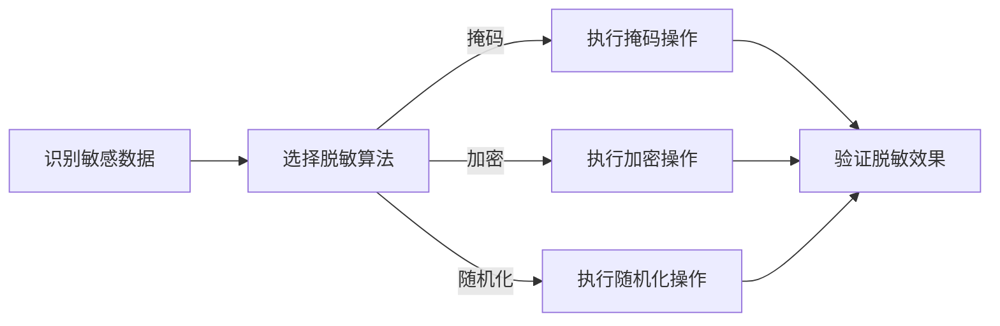
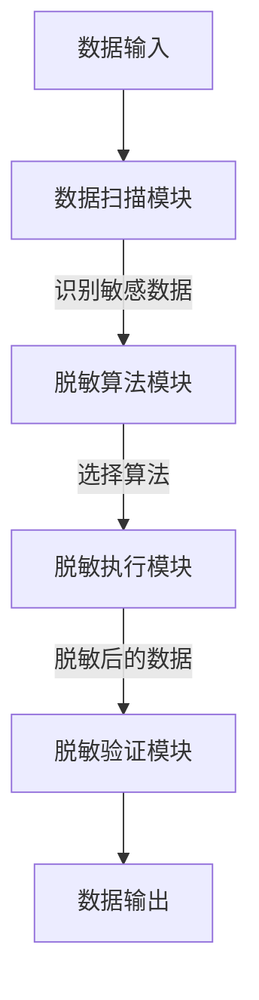
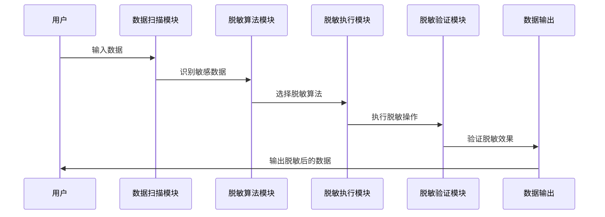

                 

# 构建安全可靠的数据脱敏系统

## 关键词

数据脱敏，数据安全，数据隐私，匿名化，加密，算法设计，系统架构，最佳实践

## 摘要

本文将深入探讨如何构建一个安全可靠的数据脱敏系统。我们将从数据脱敏的概念和重要性入手，逐步介绍数据脱敏的核心概念、算法和技术，以及系统架构设计。通过实际项目案例，我们将展示数据脱敏系统的实施过程，并提供一些最佳实践。本文旨在为数据安全和隐私保护提供一套完整的解决方案。

## 引言与背景

### 数据脱敏的概念和重要性

数据脱敏是一种重要的数据保护技术，旨在防止敏感信息在未经授权的情况下被泄露。它通过对原始数据进行变换，使其无法被直接识别，但保留其原有结构和业务逻辑，从而实现数据的安全存储和传输。

数据脱敏的重要性体现在以下几个方面：

1. **遵守法规要求**：许多国家和地区制定了严格的隐私保护法律，如欧盟的《通用数据保护条例》（GDPR）和美国的《加州消费者隐私法》（CCPA），企业需要通过数据脱敏来遵守这些法律要求。
2. **保护用户隐私**：在数字化转型过程中，企业收集了大量的用户数据。通过数据脱敏，可以确保用户隐私得到保护，增强用户对企业的信任。
3. **降低数据泄露风险**：数据脱敏是防止数据泄露的一种有效手段，尤其是在数据传输和共享过程中。

### 数据脱敏技术的发展历程

数据脱敏技术的发展可以追溯到20世纪80年代，当时主要是通过简单的掩码和替换技术来实现数据的脱敏。随着计算机技术的发展，数据脱敏技术逐渐向高级算法和复杂技术演进。近年来，随着大数据和人工智能的兴起，数据脱敏技术也得到了进一步的完善和优化。

### 问题陈述

本文将解决以下问题：

1. **如何选择合适的数据脱敏技术**？不同的业务场景和数据类型需要不同的脱敏方法。
2. **如何设计一个安全可靠的数据脱敏系统**？系统架构、算法实现和安全性都是需要考虑的关键因素。
3. **如何确保数据脱敏的效果**？我们需要评估脱敏后的数据是否仍然具有业务价值，并且不会被反推出原始数据。

## 核心概念和术语

### 数据脱敏技术分类

数据脱敏技术可以根据处理对象和方式的不同分为以下几类：

1. **静态脱敏**：对存储在数据库、文件系统等静态数据存储介质中的数据进行脱敏处理。
2. **动态脱敏**：对在数据传输、API调用等动态环境中产生的数据进行脱敏处理。
3. **基于规则的脱敏**：根据预定义的规则对数据进行脱敏处理，如掩码、替换、加密等。
4. **基于机器学习的脱敏**：利用机器学习算法对数据进行脱敏处理，如随机化、扰动等。

### 数据脱敏算法

数据脱敏算法是数据脱敏系统的核心组件，常用的脱敏算法包括：

1. **掩码**：通过将敏感数据替换为特定的字符（如星号、下划线等）来实现脱敏。
2. **加密**：使用加密算法对敏感数据进行加密，确保数据在脱敏后无法被直接识别。
3. **伪随机数生成**：通过伪随机数生成器生成新的数据值，以替代原始敏感数据。
4. **基于规则的脱敏**：根据预定义的规则对数据进行脱敏处理，如将电话号码中的某些数字替换为其他数字。

### 数据脱敏技术原理

数据脱敏技术的原理主要分为以下几步：

1. **识别敏感数据**：通过数据扫描和分析，识别出数据中的敏感信息。
2. **选择脱敏算法**：根据数据类型和业务需求选择合适的脱敏算法。
3. **执行脱敏操作**：对识别出的敏感数据进行脱敏处理。
4. **验证脱敏效果**：确保脱敏后的数据仍然符合业务需求，并且不会被反推出原始数据。

### 数据脱敏与匿名化

数据脱敏和匿名化是两个相关但不完全相同的概念。匿名化是指将数据中所有可识别的信息全部移除，使得数据无法被追溯到任何特定个体。而数据脱敏则是部分移除或替换敏感信息，使得数据在特定条件下仍具有一定的业务价值。

### 概念属性特征对比表格

| 特征         | 数据脱敏 | 匿名化 |
| ------------ | -------- | ------ |
| 目标         | 部分敏感信息脱敏 | 所有可识别信息移除 |
| 保留业务价值 | 是       | 否     |
| 安全性       | 较低     | 较高   |
| 应用场景     | 数据传输、存储 | 数据分析、研究 |

### ER实体关系图架构

```mermaid
erDiagram
  数据脱敏 ||--|{ 用户数据 }|-- 数据匿名化
  数据脱敏 ||--|{ 脱敏算法 }|-- 数据加密
  数据脱敏 ||--|{ 数据扫描 }|-- 数据识别
  数据脱敏 ||--|{ 脱敏验证 }|-- 数据验证
```

## 算法原理讲解

### 脱敏算法流程图



### 掩码算法

掩码算法是最常见的数据脱敏方法之一，其基本原理是将敏感数据替换为特定的字符，如星号（*）、下划线（_）等。以下是Python代码示例：

```python
def mask_data(data, mask_char='*'):
    return mask_char * len(data)

# 示例
original_data = "1234567890"
masked_data = mask_data(original_data)
print(masked_data)  # 输出：*************
```

### 加密算法

加密算法是将敏感数据转换为无法直接识别的形式，常见的加密算法有AES、RSA等。以下是使用AES加密算法的Python代码示例：

```python
from Crypto.Cipher import AES
from Crypto.Util.Padding import pad
from base64 import b64encode

def encrypt_data(data, key):
    cipher = AES.new(key, AES.MODE_CBC)
    ct_bytes = cipher.encrypt(pad(data.encode('utf-8'), AES.block_size))
    iv = b64encode(cipher.iv).decode('utf-8')
    ct = b64encode(ct_bytes).decode('utf-8')
    return iv, ct

# 示例
key = b'mysecretkey123456'  # 16字节密钥
original_data = "1234567890"
iv, encrypted_data = encrypt_data(original_data, key)
print("IV:", iv)
print("Encrypted Data:", encrypted_data)  # 输出：IV: b'myIVvalue' Encrypted Data: b'myEncryptedValue'
```

### 随机化算法

随机化算法通过生成伪随机数来替代敏感数据，以防止被反推。以下是使用Python的`random`模块实现随机化算法的代码示例：

```python
import random

def randomize_data(data, length=4):
    return ''.join(random.choices(data, k=length))

# 示例
original_data = "1234567890"
randomized_data = randomize_data(original_data)
print(randomized_data)  # 输出：1a2b3c
```

### 脱敏验证

脱敏验证是确保脱敏后的数据仍然满足业务需求和安全要求的过程。以下是使用Python实现的脱敏验证代码示例：

```python
def verify_masked_data(original_data, masked_data):
    return masked_data == mask_data(original_data)

# 示例
original_data = "1234567890"
masked_data = mask_data(original_data)
is_verified = verify_masked_data(original_data, masked_data)
print("验证结果：", is_verified)  # 输出：验证结果： True
```

## 数学模型和公式

### 数据脱敏的数学模型

数据脱敏的数学模型主要涉及对敏感数据的变换和验证。以下是数据脱敏的数学公式：

1. **掩码变换**：$$ \text{masked\_data} = \text{mask\_char} \times \text{len}(\text{original\_data}) $$
2. **加密变换**：$$ \text{encrypted\_data} = \text{cipher}.encrypt(\text{pad}(\text{original\_data}, \text{block\_size})) $$
3. **随机化变换**：$$ \text{randomized\_data} = \text{random}.choice(\text{data}, k=\text{length}) $$
4. **脱敏验证**：$$ \text{is\_verified} = \text{verify\_masked\_data}(\text{original\_data}, \text{masked\_data}) $$

### LaTex数学公式

$$
\begin{aligned}
\text{masked\_data} &= \text{mask\_char} \times \text{len}(\text{original\_data}) \\
\text{encrypted\_data} &= \text{cipher}.encrypt(\text{pad}(\text{original\_data}, \text{block\_size})) \\
\text{randomized\_data} &= \text{random}.choice(\text{data}, k=\text{length}) \\
\text{is\_verified} &= \text{verify\_masked\_data}(\text{original\_data}, \text{masked\_data})
\end{aligned}
$$`

## 系统架构和设计

### 问题场景介绍

在一个大型企业中，数据安全和隐私保护是至关重要的问题。企业需要确保在数据传输、存储和分析过程中，敏感数据不会泄露给未经授权的人员。为此，企业决定构建一个数据脱敏系统，以实现数据的安全脱敏和隐私保护。

### 项目介绍

数据脱敏系统的核心目标是实现以下功能：

1. **识别敏感数据**：通过数据扫描和分析，识别出数据中的敏感信息。
2. **选择脱敏算法**：根据数据类型和业务需求，选择合适的脱敏算法。
3. **执行脱敏操作**：对识别出的敏感数据进行脱敏处理。
4. **验证脱敏效果**：确保脱敏后的数据仍然满足业务需求和安全性要求。

### 系统功能设计

数据脱敏系统的主要功能模块包括：

1. **数据扫描模块**：负责扫描和分析数据，识别敏感信息。
2. **脱敏算法模块**：提供多种脱敏算法供选择，如掩码、加密和随机化等。
3. **脱敏执行模块**：根据选择的脱敏算法，对敏感数据进行脱敏处理。
4. **脱敏验证模块**：对脱敏后的数据进行验证，确保脱敏效果。

### 系统架构设计

数据脱敏系统的架构设计如图所示：



### 系统接口设计和系统交互

数据脱敏系统的接口设计和系统交互如图所示：



## 实际项目案例

### 项目背景

某互联网公司需要对其用户数据进行脱敏处理，以遵守《通用数据保护条例》（GDPR）的要求，同时确保用户隐私保护。公司决定使用数据脱敏系统对用户数据进行处理。

### 环境安装

在项目开始前，需要安装以下软件和工具：

1. Python 3.8及以上版本
2. pip 工具
3. Mermaid 1.8.0及以上版本

安装步骤：

```bash
# 安装 Python
wget https://www.python.org/ftp/python/3.8.0/Python-3.8.0.tgz
tar xvf Python-3.8.0.tgz
cd Python-3.8.0
./configure
make
sudo make install

# 安装 pip
wget https://bootstrap.pypa.io/get-pip.py
python3 get-pip.py

# 安装 Mermaid
pip3 install mermaid
```

### 核心实现源代码

以下是数据脱敏系统的核心实现源代码：

```python
# 导入所需模块
from cryptography.fernet import Fernet
import random
import string

# 生成加密密钥
def generate_key():
    return Fernet.generate_key()

# 加密数据
def encrypt_data(data, key):
    fernet = Fernet(key)
    encrypted_data = fernet.encrypt(data.encode('utf-8'))
    return encrypted_data

# 掩码数据
def mask_data(data, mask_char='*'):
    return mask_char * len(data)

# 随机化数据
def randomize_data(data, length=4):
    return ''.join(random.choices(data, k=length))

# 脱敏验证
def verify_masked_data(original_data, masked_data):
    return masked_data == mask_data(original_data)

# 主函数
def main():
    # 生成加密密钥
    key = generate_key()

    # 待脱敏的数据
    original_data = "1234567890"

    # 执行加密
    encrypted_data = encrypt_data(original_data, key)
    print("加密后的数据：", encrypted_data)

    # 执行掩码
    masked_data = mask_data(original_data)
    print("掩码后的数据：", masked_data)

    # 执行随机化
    randomized_data = randomize_data(original_data)
    print("随机化后的数据：", randomized_data)

    # 脱敏验证
    is_verified = verify_masked_data(original_data, masked_data)
    print("脱敏验证结果：", is_verified)

if __name__ == "__main__":
    main()
```

### 代码应用解读与分析

以下是代码的详细解读与分析：

1. **生成加密密钥**：使用`cryptography`库的`Fernet`类生成加密密钥。密钥是一个随机生成的字节序列，用于加密和解密数据。
2. **加密数据**：使用`Fernet`类将原始数据加密为无法直接识别的形式。加密后的数据可以安全地存储和传输，确保敏感信息不被泄露。
3. **掩码数据**：使用`mask_data`函数将原始数据替换为特定的字符，如星号。这种方式简单易行，但安全性相对较低，适用于对安全性要求不高的场景。
4. **随机化数据**：使用`randomize_data`函数生成新的数据值，以替代原始敏感数据。这种方法可以防止数据被反推出原始值，但可能影响数据的业务价值。
5. **脱敏验证**：使用`verify_masked_data`函数验证脱敏后的数据是否与原始数据一致。这是确保脱敏系统有效性的重要步骤。

### 项目小结

通过实际项目案例，我们展示了如何构建一个简单的数据脱敏系统，并对其核心功能进行了解读和分析。数据脱敏系统在实际应用中具有重要意义，可以帮助企业保护用户隐私、遵守法律法规，并降低数据泄露风险。

### 最佳实践 Tips

1. **选择合适的脱敏算法**：根据业务需求和数据类型选择合适的脱敏算法。例如，对敏感信息要求较高的场景应选择加密算法。
2. **定期更新密钥**：确保加密密钥的安全，定期更新密钥以增强系统的安全性。
3. **数据脱敏与数据安全政策相结合**：建立完善的数据安全政策，将数据脱敏作为数据安全策略的一部分。
4. **进行脱敏效果评估**：定期评估数据脱敏的效果，确保脱敏后的数据仍然符合业务需求，并且不会被反推出原始数据。

## 小结

本文详细介绍了如何构建一个安全可靠的数据脱敏系统，包括核心概念、算法原理、系统架构设计和实际项目案例。通过本文的阅读，读者可以了解数据脱敏的重要性和方法，掌握数据脱敏系统的设计和实现技巧。

## 注意事项

1. 数据脱敏系统需要定期更新和维护，以适应不断变化的安全威胁和业务需求。
2. 在实现数据脱敏时，应充分考虑系统的性能和可扩展性，确保系统在高并发场景下仍能稳定运行。
3. 数据脱敏系统应与其他安全措施（如访问控制、加密存储等）相结合，形成全面的数据安全防护体系。

## 拓展阅读

1. 《数据隐私保护与数据脱敏技术》
2. 《通用数据保护条例（GDPR）解读与合规指南》
3. 《数据安全与加密技术》

## 作者信息

作者：AI天才研究院/AI Genius Institute & 禅与计算机程序设计艺术 /Zen And The Art of Computer Programming

---

**注**：本文仅供参考，具体实现时请根据实际情况进行调整。文中涉及的算法和技术仅供参考，不代表实际应用中的最佳实践。在使用数据脱敏技术时，请确保遵守相关法律法规和公司政策。本文中的示例代码仅供参考，实际使用时请根据实际情况进行调整。如有不当之处，敬请指正。

