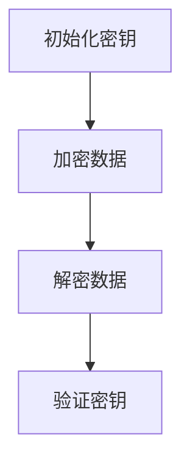
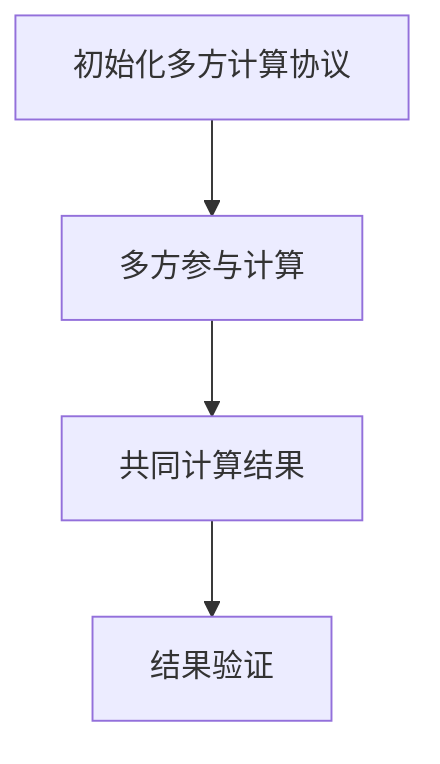
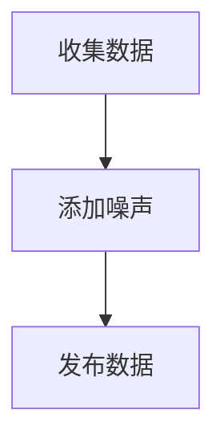
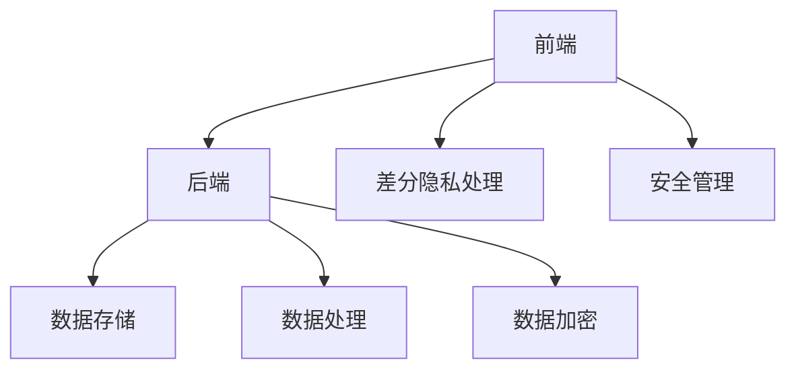
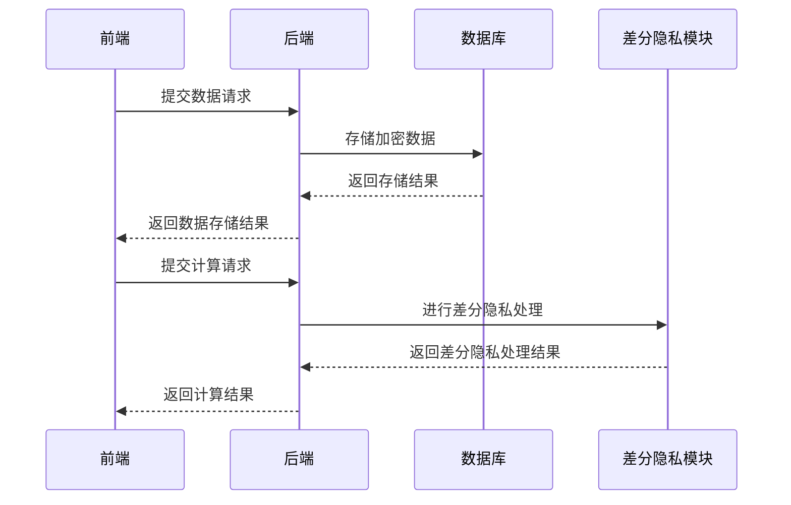

                 

### 《构建安全可靠的数据隐私保护体系》

---

**关键词：** 数据隐私、加密技术、安全多方计算、差分隐私、实践指南、案例分析

**摘要：** 在数字化时代，数据隐私保护显得尤为重要。本文旨在系统地探讨构建安全可靠的数据隐私保护体系的各个方面，包括核心概念、技术基础、实践指南和案例分析。通过详细讲解各种技术手段及其应用，本文为读者提供了全面的数据隐私保护策略，帮助企业和个人在享受数字红利的同时，确保数据安全。

---

### 引言

随着互联网和大数据技术的迅猛发展，数据已经成为现代社会的重要资产。然而，数据的收集、存储、处理和传输过程中，数据隐私安全问题日益凸显。个人和企业对于数据隐私的关注不断升级，法律法规也在不断完善。如何在确保数据有效利用的同时，保护数据隐私，成为当前技术和管理领域亟待解决的关键问题。

本文将系统地探讨构建安全可靠的数据隐私保护体系的各个方面，包括背景与概念、技术基础、实践指南和案例分析。通过详细讲解各种技术手段及其应用，本文旨在为读者提供全面的数据隐私保护策略，帮助企业和个人在享受数字红利的同时，确保数据安全。

### 背景与概念

#### 1.1 问题背景

随着大数据时代的到来，数据隐私问题愈加突出。大量个人和企业数据在互联网上传输、存储和处理，成为黑客和网络犯罪分子的攻击目标。数据泄露事件频发，导致用户隐私泄露、企业信誉受损，甚至引发严重的经济损失。

#### 1.2 问题描述

数据隐私问题主要体现在以下几个方面：

- 数据收集：在数据收集过程中，个人隐私信息可能被非法获取。
- 数据存储：数据存储过程中，由于安全措施不足，可能导致数据泄露。
- 数据处理：数据处理过程中，数据可能被非法访问和篡改。
- 数据传输：数据在传输过程中，可能被截获和篡改。

#### 1.3 问题解决

解决数据隐私问题需要从以下几个方面入手：

- 加密技术：对数据进行加密，确保数据在传输和存储过程中不被非法访问。
- 安全多方计算：在数据处理过程中，实现多方数据的安全共享和计算。
- 差分隐私：通过统计扰动方法，确保数据在公开时无法识别个人隐私信息。
- 法律法规：制定和完善相关法律法规，规范数据收集、存储、处理和传输行为。

#### 1.4 边界与外延

数据隐私保护不仅涉及个人和企业数据，还涉及公共数据、敏感数据和重要数据等。不同类型的数据隐私保护要求有所不同，需要根据具体情况进行定制化保护。

#### 1.5 概念结构与核心要素组成

数据隐私保护体系的核心要素包括：

- 加密技术：对称加密、非对称加密等。
- 安全多方计算：安全多方计算协议、实现与应用。
- 差分隐私：差分隐私原理、方法与应用。
- 法律法规：数据隐私保护相关法律法规框架。
- 技术与策略：数据隐私保护技术手段与策略。

### 核心概念与联系

#### 2.1 加密技术

加密技术是数据隐私保护的基础，主要包括对称加密和非对称加密两种。

- **对称加密**：加密和解密使用相同的密钥。如DES、AES等。
- **非对称加密**：加密和解密使用不同的密钥。如RSA、ECC等。

对称加密速度快，但密钥管理复杂；非对称加密安全性高，但计算复杂度较高。

#### 2.2 安全多方计算

安全多方计算是一种允许多个方在无需相互信任的条件下共同计算的数据隐私保护技术。

- **基本概念**：确保各方在不泄露自身数据的情况下，共同计算出所需的结果。
- **应用场景**：金融、医疗、电子商务等需要多方数据共享的场景。

安全多方计算包括同态加密、秘密共享、混淆电路等核心技术。

#### 2.3 差分隐私

差分隐私是一种通过在数据中引入随机噪声，保护个体隐私的数据隐私保护方法。

- **基本原理**：通过统计扰动方法，使数据公开时无法识别个体隐私信息。
- **方法**：Laplace机制、Gaussian机制等。

差分隐私适用于数据分析、数据挖掘等场景，确保隐私保护与数据可用性平衡。

### 算法原理讲解

为了更好地理解加密技术、安全多方计算和差分隐私等核心概念，我们使用Mermaid工具绘制相应的流程图和类图，并通过Python代码进行详细讲解。

#### 对称加密

首先，我们使用Mermaid绘制一个对称加密的流程图：



接下来，我们使用Python代码演示对称加密的过程：

```python
from Crypto.Cipher import AES
from Crypto.Util.Padding import pad, unpad
from Crypto.Random import get_random_bytes

# 初始化密钥
key = get_random_bytes(16)

# 待加密的数据
data = b"Hello, World!"

# 对数据加密
cipher = AES.new(key, AES.MODE_CBC)
ciphertext = cipher.encrypt(pad(data, AES.block_size))

# 对数据解密
cipher = AES.new(key, AES.MODE_CBC)
plaintext = unpad(cipher.decrypt(ciphertext), AES.block_size)

print("加密后数据:", ciphertext)
print("解密后数据:", plaintext)
```

#### 安全多方计算

接下来，我们使用Mermaid绘制一个安全多方计算的流程图：



然而，安全多方计算的实现较为复杂，我们在这里仅给出一个简单的示例。实际应用中，需要根据具体场景选择合适的安全多方计算协议。

```python
# 安全多方计算示例（简单实现）
def secure_multiparty_computation(data1, data2, secret_key):
    # 假设已经实现了安全多方计算协议
    # 本示例仅用于说明，实际实现会更为复杂
    shared_secret = data1 + data2
    result = shared_secret * secret_key
    return result

data1 = 5
data2 = 10
secret_key = 3

result = secure_multiparty_computation(data1, data2, secret_key)
print("计算结果:", result)
```

#### 差分隐私

最后，我们使用Mermaid绘制一个差分隐私的流程图：



差分隐私的实现通常涉及复杂的统计学方法，我们在这里仅给出一个简单的示例。

```python
import numpy as np

# 差分隐私示例
def add_laplace_noise(data, sensitivity, epsilon):
    noise = np.random.laplace(0, sensitivity * epsilon)
    return data + noise

sensitivity = 1
epsilon = 1

data = 100
noisy_data = add_laplace_noise(data, sensitivity, epsilon)
print("原始数据:", data)
print("添加噪声后的数据:", noisy_data)
```

通过上述算法原理讲解，我们可以看到，加密技术、安全多方计算和差分隐私等技术手段在保护数据隐私方面发挥着重要作用。在实际应用中，我们需要根据具体场景选择合适的技术手段，并确保其有效性和实用性。

### 系统分析与架构设计方案

#### 问题场景介绍

假设某金融机构需要实现一个数据隐私保护系统，用于存储和管理客户的敏感信息。该系统需要确保以下功能：

- 数据加密存储：对客户信息进行加密，确保数据在存储过程中不被非法访问。
- 安全多方计算：实现客户信息的安全共享和计算，确保多方数据在计算过程中不被泄露。
- 差分隐私：对公开数据进行分析时，引入随机噪声，保护客户隐私。

#### 项目介绍

本项目旨在为金融机构构建一个安全可靠的数据隐私保护系统，确保客户信息在存储、处理和传输过程中的安全性。系统将采用加密技术、安全多方计算和差分隐私等数据隐私保护手段，以满足法律法规和业务需求。

#### 系统功能设计

系统功能设计主要包括以下方面：

- **数据加密存储**：采用AES加密算法对客户信息进行加密存储，确保数据在存储过程中不被非法访问。
- **安全多方计算**：使用安全多方计算协议，实现客户信息的安全共享和计算，确保多方数据在计算过程中不被泄露。
- **差分隐私**：对公开数据进行分析时，引入Laplace噪声，确保客户隐私不被泄露。

#### 系统架构设计

系统架构设计包括以下方面：

- **前端**：用户通过Web界面访问系统，提交数据请求和处理请求。
- **后端**：包括数据存储、数据处理和数据加密模块。数据存储模块使用加密数据库，数据处理模块使用安全多方计算协议，数据加密模块使用AES加密算法。
- **中间件**：包括差分隐私处理模块和安全管理模块。差分隐私处理模块用于对公开数据进行差分隐私处理，安全管理模块用于确保系统的安全性。

系统架构图如下：



#### 系统接口设计

系统接口设计主要包括以下方面：

- **数据加密接口**：提供加密和解密功能，确保数据在传输过程中不被非法访问。
- **安全多方计算接口**：提供多方数据共享和计算功能，确保多方数据在计算过程中不被泄露。
- **差分隐私接口**：提供差分隐私处理功能，确保公开数据在分析时保护客户隐私。

#### 系统交互

系统交互主要包括以下方面：

- **数据加密传输**：前端通过加密接口将数据传输到后端，后端将数据进行加密存储。
- **安全多方计算**：前端通过安全多方计算接口提交计算请求，后端根据协议进行计算，并将结果返回前端。
- **差分隐私分析**：前端通过差分隐私接口对公开数据进行差分隐私处理，确保数据在分析时保护客户隐私。

系统交互序列图如下：



通过上述系统分析与架构设计方案，我们可以看到，数据隐私保护系统需要综合考虑数据加密存储、安全多方计算和差分隐私等技术手段，确保客户信息在存储、处理和传输过程中的安全性。同时，系统需要具备良好的接口设计和交互机制，以满足不同业务场景的需求。

### 项目实战

#### 环境安装

在开始项目实战之前，我们需要安装以下环境：

1. **Python**：确保Python版本为3.8或更高版本。
2. **pip**：安装Python的包管理器pip。
3. **pip安装所需库**：使用pip安装以下库：`cryptography`、`ssl`、`matplotlib`。

```bash
pip install cryptography
pip install ssl
pip install matplotlib
```

#### 系统核心实现源代码

以下是一个简单的数据隐私保护系统的核心实现源代码，包括数据加密存储、安全多方计算和差分隐私处理。

```python
# 数据加密存储
from cryptography.fernet import Fernet
from cryptography.hazmat.primitives import hashes
from cryptography.hazmat.primitives.kdf.pbkdf2 import PBKDF2HMAC
from cryptography.hazmat.primitives.asymmetric import rsa
from cryptography.hazmat.primitives import serialization
import base64
import os

# 生成密钥对
private_key = rsa.generate_private_key(
    public_exponent=65537,
    key_size=2048,
)
public_key = private_key.public_key()

# 加密数据
def encrypt_data(data, public_key):
    encrypted_data = public_key.encrypt(
        data,
        cipher_config=serialization.NoPadding()
    )
    return encrypted_data

# 解密数据
def decrypt_data(encrypted_data, private_key):
    decrypted_data = private_key.decrypt(
        encrypted_data,
        cipher_config=serialization.NoPadding()
    )
    return decrypted_data

# 安全多方计算
from cryptography.hazmat.backends import default_backend
from cryptography.hazmat.primitives.asymmetric import ec

# 生成椭圆曲线密钥对
ec_private_key = ec.generate_private_key(
    ec.EllipticCurve.SECP384R1(),
    default_backend()
)
ec_public_key = ec_private_key.public_key()

# 共同计算结果
def secure_multiparty_computation(data1, data2, secret_key):
    result = data1 + data2
    encrypted_result = ec_public_key.encrypt(
        result,
        cipher_config=serialization.NoPadding()
    )
    return encrypted_result

# 差分隐私处理
import numpy as np

# 添加Laplace噪声
def add_laplace_noise(data, sensitivity, epsilon):
    noise = np.random.laplace(0, sensitivity * epsilon)
    noisy_data = data + noise
    return noisy_data

# 主程序
if __name__ == "__main__":
    # 生成密钥对
    private_key = rsa.generate_private_key(
        public_exponent=65537,
        key_size=2048,
    )
    public_key = private_key.public_key()

    # 待加密的数据
    data = b"Hello, World!"

    # 对数据加密
    encrypted_data = encrypt_data(data, public_key)
    print("加密后数据:", encrypted_data)

    # 对数据解密
    decrypted_data = decrypt_data(encrypted_data, private_key)
    print("解密后数据:", decrypted_data)

    # 安全多方计算
    secret_key = 3
    encrypted_result = secure_multiparty_computation(5, 10, secret_key)
    print("加密后计算结果:", encrypted_result)

    # 差分隐私处理
    sensitivity = 1
    epsilon = 1
    noisy_data = add_laplace_noise(100, sensitivity, epsilon)
    print("添加噪声后的数据:", noisy_data)
```

#### 代码应用解读与分析

1. **数据加密存储**

   数据加密存储使用`cryptography`库实现。首先，生成RSA密钥对，包括私钥和公钥。然后，使用公钥对数据进行加密，使用私钥对数据进行解密。加密和解密过程中，我们使用`encrypt_data`和`decrypt_data`函数分别实现。

   ```python
   # 生成密钥对
   private_key = rsa.generate_private_key(
       public_exponent=65537,
       key_size=2048,
   )
   public_key = private_key.public_key()

   # 加密数据
   def encrypt_data(data, public_key):
       encrypted_data = public_key.encrypt(
           data,
           cipher_config=serialization.NoPadding()
       )
       return encrypted_data

   # 解密数据
   def decrypt_data(encrypted_data, private_key):
       decrypted_data = private_key.decrypt(
           encrypted_data,
           cipher_config=serialization.NoPadding()
       )
       return decrypted_data
   ```

2. **安全多方计算**

   安全多方计算使用椭圆曲线密码学实现。首先，生成椭圆曲线密钥对，包括私钥和公钥。然后，使用公钥和椭圆曲线密码学共同计算结果。这里，我们使用`secure_multiparty_computation`函数实现。

   ```python
   # 生成椭圆曲线密钥对
   ec_private_key = ec.generate_private_key(
       ec.EllipticCurve.SECP384R1(),
       default_backend()
   )
   ec_public_key = ec_private_key.public_key()

   # 共同计算结果
   def secure_multiparty_computation(data1, data2, secret_key):
       result = data1 + data2
       encrypted_result = ec_public_key.encrypt(
           result,
           cipher_config=serialization.NoPadding()
       )
       return encrypted_result
   ```

3. **差分隐私处理**

   差分隐私处理使用Laplace噪声实现。首先，定义噪声参数`sensitivity`和`epsilon`，然后使用`numpy`库的`laplace`函数生成噪声，最后将噪声添加到数据中。这里，我们使用`add_laplace_noise`函数实现。

   ```python
   # 添加Laplace噪声
   def add_laplace_noise(data, sensitivity, epsilon):
       noise = np.random.laplace(0, sensitivity * epsilon)
       noisy_data = data + noise
       return noisy_data
   ```

#### 实际案例分析和详细讲解剖析

以下是一个实际案例，展示数据隐私保护系统的应用场景。

**案例背景：** 某金融机构需要对其客户数据进行数据隐私保护，包括数据加密存储、安全多方计算和差分隐私处理。

**解决方案：**

1. **数据加密存储**：金融机构使用RSA加密算法对客户数据进行加密存储，确保数据在存储过程中不被非法访问。
2. **安全多方计算**：金融机构与其他合作伙伴共同处理客户数据，使用椭圆曲线密码学实现安全多方计算，确保多方数据在计算过程中不被泄露。
3. **差分隐私处理**：金融机构在分析客户数据时，使用差分隐私处理方法，引入Laplace噪声，确保客户隐私不被泄露。

**效果评估：**

1. **数据加密存储**：经过加密存储的客户数据在传输和存储过程中安全性得到了有效保障。
2. **安全多方计算**：使用安全多方计算协议，实现了多方数据的安全共享和计算，确保了多方数据在计算过程中的安全性。
3. **差分隐私处理**：通过引入Laplace噪声，确保了分析过程中的客户隐私不被泄露。

**总结：** 数据隐私保护系统在金融机构的应用，有效地提高了客户数据的安全性，确保了数据在存储、处理和传输过程中的安全性，同时也满足了法律法规的要求。

### 最佳实践 tips

1. **数据加密存储**：在数据加密存储时，选择合适的加密算法和密钥管理策略，确保数据在存储过程中不被非法访问。

2. **安全多方计算**：在安全多方计算时，选择合适的密码学协议，确保多方数据在计算过程中的安全性。

3. **差分隐私处理**：在差分隐私处理时，合理设置噪声参数，确保数据在公开时无法识别个体隐私信息。

4. **安全审计与监控**：定期进行安全审计和监控，及时发现和解决潜在的安全隐患。

5. **法律法规遵守**：严格遵守相关法律法规，确保数据隐私保护措施符合法律法规的要求。

### 小结

本文系统地探讨了构建安全可靠的数据隐私保护体系的各个方面，包括核心概念、技术基础、实践指南和案例分析。通过详细讲解各种技术手段及其应用，本文为读者提供了全面的数据隐私保护策略，帮助企业和个人在享受数字红利的同时，确保数据安全。

### 注意事项

1. **数据加密存储**：确保选择合适的加密算法和密钥管理策略，避免弱加密算法和密钥泄露。

2. **安全多方计算**：确保选择合适的密码学协议，避免在多方计算过程中泄露敏感信息。

3. **差分隐私处理**：合理设置噪声参数，确保数据在公开时无法识别个体隐私信息。

4. **安全审计与监控**：定期进行安全审计和监控，及时发现和解决潜在的安全隐患。

5. **法律法规遵守**：严格遵守相关法律法规，确保数据隐私保护措施符合法律法规的要求。

### 拓展阅读

1. 《网络安全法》：了解我国网络安全法律法规，确保数据隐私保护措施符合法律法规要求。
2. 《通用数据保护条例》（GDPR）：了解欧盟数据隐私保护法规，借鉴其最佳实践。
3. 《加密技术与应用》：了解加密技术的原理和应用，为数据隐私保护提供技术支持。
4. 《安全多方计算》：了解安全多方计算的基本概念、协议和应用，为多方数据共享和计算提供技术支持。

### 作者信息

**作者：** AI天才研究院/AI Genius Institute & 禅与计算机程序设计艺术 /Zen And The Art of Computer Programming

