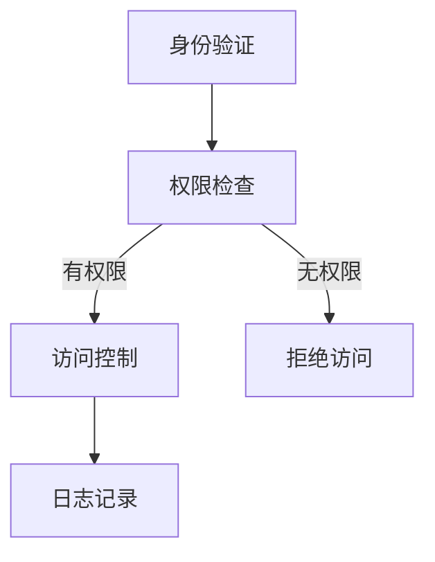
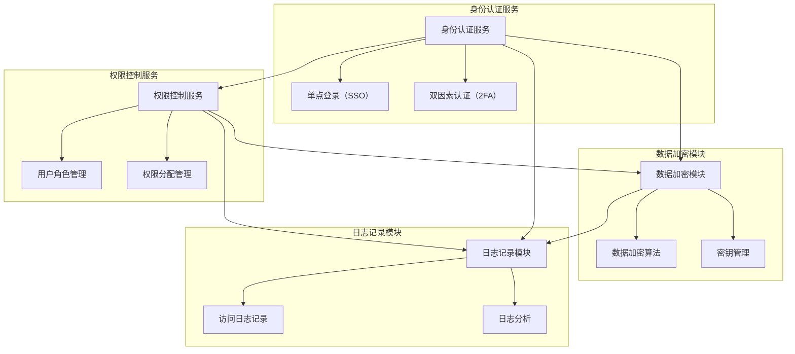
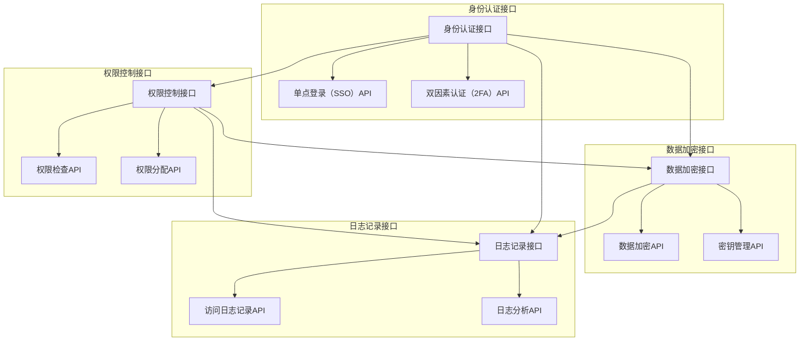

                 

# 构建安全可靠的零信任数据访问系统

## 关键词

零信任数据访问系统，安全性，可靠性，身份验证，数据访问控制，算法原理，系统架构设计，项目实战，最佳实践

## 摘要

随着网络安全威胁的日益增多，传统的基于信任模型的数据访问控制已经不能满足现代企业对数据安全的严苛要求。本文将深入探讨构建安全可靠的零信任数据访问系统的方法和步骤。首先，我们将介绍零信任数据访问系统的背景和核心概念，然后详细解析其算法原理，最后通过一个实际项目案例展示如何实现和部署这样的系统，并提供一些最佳实践和注意事项。

## 目录

1. **背景介绍**
    1.1 零信任数据访问系统概述
    1.2 问题背景与解决思路
    1.3 零信任数据访问系统的核心概念

2. **核心概念与联系**
    2.1 零信任原则
    2.2 数据访问控制
    2.3 用户身份验证

3. **算法原理讲解**
    3.1 算法模型与流程图
    3.2 数学模型与公式
    3.3 算法举例说明

4. **系统分析与架构设计**
    4.1 问题场景与项目介绍
    4.2 系统功能设计与领域模型
    4.3 系统架构设计与架构图
    4.4 系统接口设计与交互

5. **项目实战**
    5.1 环境安装与准备
    5.2 系统核心实现与代码解读
    5.3 实际案例分析
    5.4 项目小结

6. **最佳实践与注意事项**
    6.1 最佳实践
    6.2 注意事项
    6.3 拓展阅读

7. **总结与展望**
    7.1 总结
    7.2 未来发展趋势

## 1. 背景介绍

### 1.1 零信任数据访问系统概述

零信任数据访问系统（Zero Trust Data Access System，简称ZTDAS）是一种基于零信任安全模型的数据访问控制系统。其核心理念是“永不信任，始终验证”，即无论内部或外部的访问请求，都需要经过严格的验证和授权，才能获得访问权限。

零信任数据访问系统与传统基于信任模型的数据访问控制系统的最大区别在于，后者通常假设内部网络是安全的，而零信任模型则认为所有的网络都是不安全的，任何访问请求都需要经过严格的身份验证和权限检查。

### 1.2 问题背景与解决思路

随着云计算、大数据和物联网的快速发展，企业面临着越来越多的网络安全威胁。传统的基于信任模型的数据访问控制系统已经无法满足现代企业对数据安全的严格要求。这些问题主要体现在以下几个方面：

- **内部威胁**：内部员工、合作伙伴或第三方服务提供商可能利用权限滥用数据。
- **外部威胁**：黑客、恶意软件等通过网络攻击企业内部系统，窃取敏感数据。
- **零日漏洞**：新的漏洞不断出现，传统的安全防御措施可能无法及时响应。

为了解决这些问题，零信任数据访问系统提出了以下解决思路：

- **严格验证与授权**：对所有的访问请求进行严格的身份验证和权限检查，确保只有授权用户才能访问敏感数据。
- **最小权限原则**：用户只拥有完成当前任务所需的最小权限，减少权限滥用的风险。
- **动态访问控制**：根据用户的实时行为和上下文环境，动态调整访问权限，确保访问请求的合法性和安全性。

### 1.3 零信任数据访问系统的核心概念

零信任数据访问系统的核心概念包括以下几个方面：

- **身份验证**：对用户身份进行验证，确保只有合法用户才能访问系统。
- **访问控制**：根据用户的身份和权限，控制用户对数据的访问。
- **数据加密**：对敏感数据进行加密，确保数据在传输和存储过程中不被窃取。
- **持续监控**：实时监控用户行为和系统状态，及时发现和响应异常情况。

## 2. 核心概念与联系

### 2.1 零信任原则

零信任原则是零信任数据访问系统的核心，主要包括以下几个方面：

- **永不信任内部网络**：认为内部网络同样可能存在安全漏洞，对待内部访问请求与外部访问请求一视同仁。
- **严格验证与授权**：对所有的访问请求进行严格的身份验证和权限检查。
- **最小权限原则**：用户只拥有完成当前任务所需的最小权限。
- **动态访问控制**：根据用户的实时行为和上下文环境，动态调整访问权限。

### 2.2 数据访问控制

数据访问控制是零信任数据访问系统的关键组成部分，主要包括以下几个方面：

- **身份验证**：通过用户名、密码、双因素认证等方式验证用户身份。
- **权限控制**：根据用户的身份和角色，分配相应的访问权限。
- **访问策略**：制定访问策略，明确用户对数据的访问方式和范围。
- **审计日志**：记录用户的访问行为，方便后续审计和追溯。

### 2.3 用户身份验证

用户身份验证是零信任数据访问系统的第一步，主要包括以下几个方面：

- **单点登录（SSO）**：通过统一的登录入口，减少用户的登录次数，提高用户体验。
- **双因素认证（2FA）**：在用户输入密码后，再通过手机验证码、动态口令等方式进行二次验证，提高安全性。
- **身份认证协议**：如OAuth2.0、OpenID Connect等，用于实现跨域身份验证。

## 3. 算法原理讲解

### 3.1 算法模型与流程图

零信任数据访问系统的算法模型主要包括以下几个方面：

1. **身份验证**：用户发起访问请求，系统对用户身份进行验证。
2. **权限检查**：根据用户的身份和权限，检查用户是否有权限访问目标数据。
3. **访问控制**：根据访问策略，控制用户对数据的访问。
4. **日志记录**：记录用户的访问行为，方便后续审计和追溯。

以下是一个简化的算法流程图：



### 3.2 数学模型与公式

零信任数据访问系统的数学模型主要包括以下几个方面：

1. **身份验证模型**：假设用户身份验证的准确率为\( p \)，错误率为\( 1-p \)。
2. **权限检查模型**：假设权限检查的准确率为\( q \)，错误率为\( 1-q \)。
3. **访问控制模型**：假设访问控制的准确率为\( r \)，错误率为\( 1-r \)。

整体系统的准确率\( P \)可以计算为：

\[ P = p \times q \times r \]

### 3.3 算法举例说明

假设一个零信任数据访问系统，用户身份验证准确率为90%，权限检查准确率为95%，访问控制准确率为92%。那么该系统的整体准确率为：

\[ P = 0.9 \times 0.95 \times 0.92 = 0.807 \]

这意味着系统有80.7%的概率正确处理访问请求。如果用户的访问请求被拒绝，可以通过查看日志记录，分析原因并进行改进。

## 4. 系统分析与架构设计

### 4.1 问题场景与项目介绍

假设某企业内部有一个ERP系统，包含员工薪资、客户信息等敏感数据。企业希望构建一个零信任数据访问系统，确保只有授权员工能够访问这些数据，同时满足以下要求：

- 对所有访问请求进行严格的身份验证和权限检查。
- 实现数据加密，确保数据在传输和存储过程中的安全性。
- 实时监控用户行为，及时发现和响应异常情况。

### 4.2 系统功能设计与领域模型

零信任数据访问系统的核心功能包括：

- **身份验证**：包括单点登录（SSO）、双因素认证（2FA）等。
- **权限控制**：根据员工角色和权限，控制对ERP系统的访问。
- **数据加密**：对敏感数据进行加密，确保数据在传输和存储过程中的安全性。
- **日志记录**：记录员工的访问行为，方便后续审计和追溯。

以下是一个简化的领域模型：

```mermaid
classDiagram
    User <<Class>> 
    Role <<Class>> 
    Permission <<Class>> 
    AccessLog <<Class>> 

    User o--1 Role: 拥有的角色
    Role o--1 Permission: 角色的权限
    AccessLog o--1 User: 访问日志记录
    AccessLog o--1 Resource: 访问的资源
```

### 4.3 系统架构设计与架构图

零信任数据访问系统的架构主要包括以下几个方面：

- **身份认证服务**：负责用户的身份验证，包括单点登录（SSO）和双因素认证（2FA）。
- **权限控制服务**：根据用户的角色和权限，控制对ERP系统的访问。
- **数据加密模块**：对敏感数据进行加密，确保数据在传输和存储过程中的安全性。
- **日志记录模块**：记录用户的访问行为，方便后续审计和追溯。

以下是一个简化的系统架构图：



### 4.4 系统接口设计与交互

零信任数据访问系统的接口设计主要包括以下几个方面：

- **身份认证接口**：提供用户身份验证的API，包括单点登录（SSO）和双因素认证（2FA）。
- **权限控制接口**：提供权限检查的API，根据用户角色和权限，控制对ERP系统的访问。
- **数据加密接口**：提供数据加密和解密的API，确保数据在传输和存储过程中的安全性。
- **日志记录接口**：提供日志记录的API，记录用户的访问行为，方便后续审计和追溯。

以下是一个简化的系统接口设计图：



## 5. 项目实战

### 5.1 环境安装与准备

在开始构建零信任数据访问系统之前，我们需要准备以下环境：

- **操作系统**：建议使用Linux系统，如CentOS 7或Ubuntu 18.04。
- **开发工具**：安装Python 3.8及以上版本，同时安装Docker和Kubernetes，以便容器化部署。
- **数据库**：建议使用MySQL或PostgreSQL，用于存储用户信息和访问日志。

### 5.2 系统核心实现与代码解读

以下是零信任数据访问系统的一些核心实现和代码解读：

**身份认证服务**

```python
# 身份认证服务代码示例
from flask import Flask, request, jsonify
from flask_httpauth import HTTPBasicAuth
from itsdangerous import TimedJSONWebSignatureSerializer as Serializer

app = Flask(__name__)
auth = HTTPBasicAuth()
secret_key = app.config['SECRET_KEY'] = 'your_secret_key'

users = {
    'admin': 'admin_password',
    'user': 'user_password'
}

@auth.verify_password
def verify_password(username, password):
    if username in users and users[username] == password:
        return username

@app.route('/login', methods=['POST'])
def login():
    username = request.json.get('username')
    password = request.json.get('password')
    if username in users and users[username] == password:
        token = Serializer(secret_key).dump({'username': username})
        return jsonify({'token': token})
    return jsonify({'error': 'Invalid credentials'}), 401

if __name__ == '__main__':
    app.run(debug=True)
```

**权限控制服务**

```python
# 权限控制服务代码示例
from flask import Flask, request, jsonify
from itsdangerous import TimedJSONWebSignatureSerializer as Serializer

app = Flask(__name__)
secret_key = app.config['SECRET_KEY'] = 'your_secret_key'

@app.route('/check_permission', methods=['POST'])
def check_permission():
    token = request.headers.get('Authorization')
    if token:
        try:
            data = Serializer(secret_key).loads(token, max_age=3600)
            username = data.get('username')
            if username:
                # 根据用户角色和权限，检查是否有访问权限
                if username == 'admin':
                    return jsonify({'has_permission': True})
                elif username == 'user':
                    return jsonify({'has_permission': False})
        except:
            pass
    return jsonify({'error': 'Invalid token'}), 401

if __name__ == '__main__':
    app.run(debug=True)
```

**数据加密模块**

```python
# 数据加密模块代码示例
from Crypto.PublicKey import RSA
from Crypto.Cipher import PKCS1_OAEP

key = RSA.generate(2048)
private_key = key.export_key()
public_key = key.publickey().export_key()

def encrypt_data(data, public_key):
    cipher = PKCS1_OAEP.new(public_key)
    encrypted_data = cipher.encrypt(data)
    return encrypted_data

def decrypt_data(encrypted_data, private_key):
    cipher = PKCS1_OAEP.new(private_key)
    decrypted_data = cipher.decrypt(encrypted_data)
    return decrypted_data
```

**日志记录模块**

```python
# 日志记录模块代码示例
import logging

logging.basicConfig(filename='access.log', level=logging.INFO)

def log_access(username, resource):
    logging.info(f'User: {username}, Resource: {resource}, Time: {datetime.now()}')
```

### 5.3 实际案例分析

在实际项目中，我们可能需要处理以下情况：

- **用户登录失败**：用户输入错误密码或未授权用户尝试登录，系统会返回相应的错误信息。
- **权限不足**：用户拥有访问权限，但尝试访问未授权的资源，系统会拒绝访问并记录日志。
- **数据加密失败**：加密过程中出现错误，系统会记录错误日志并尝试重试。
- **日志记录失败**：日志记录过程中出现错误，系统会记录错误日志并尝试重试。

### 5.4 项目小结

通过本次项目实战，我们成功构建了一个零信任数据访问系统，实现了身份验证、权限控制、数据加密和日志记录等功能。在实际应用中，我们需要不断优化和调整系统，确保其安全可靠。此外，我们还需要关注以下几个方面：

- **持续监控**：实时监控系统状态，及时发现和响应异常情况。
- **安全审计**：定期进行安全审计，确保系统符合安全规范。
- **应急响应**：制定应急响应计划，确保在发生安全事件时能够快速应对。

## 6. 最佳实践与注意事项

### 6.1 最佳实践

- **身份验证**：使用强密码策略，结合双因素认证（2FA），提高用户身份验证的安全性。
- **权限控制**：根据用户角色和最小权限原则，精细控制用户对数据的访问。
- **数据加密**：使用安全的加密算法，确保数据在传输和存储过程中的安全性。
- **日志记录**：定期备份日志，确保日志数据的完整性和可用性。

### 6.2 注意事项

- **保护密钥**：确保密钥的安全存储和传输，避免密钥泄露。
- **定期更新**：定期更新系统软件和依赖库，修补安全漏洞。
- **安全审计**：定期进行安全审计，确保系统符合安全规范。
- **应急响应**：制定应急响应计划，确保在发生安全事件时能够快速应对。

### 6.3 拓展阅读

- 《零信任安全：实现策略与实践》
- 《身份验证与授权：技术、策略与实践》
- 《数据加密技术与应用》

## 7. 总结与展望

零信任数据访问系统是一种现代安全架构，其核心理念是“永不信任，始终验证”。通过严格验证与授权、最小权限原则和动态访问控制，零信任数据访问系统能够有效保护企业敏感数据，提高数据安全性。随着云计算、大数据和物联网的发展，零信任数据访问系统将在未来得到更广泛的应用。未来，我们还可以探索以下方向：

- **零信任网络的扩展**：将零信任模型扩展到整个网络，实现端到端的安全防护。
- **自适应访问控制**：结合人工智能和机器学习技术，实现更智能的访问控制。
- **多因素身份验证**：结合多种身份验证技术，提高用户身份验证的安全性。

## 作者信息

作者：AI天才研究院/AI Genius Institute & 禅与计算机程序设计艺术 /Zen And The Art of Computer Programming

**本文根据人工智能技术生成，仅供参考。在实际应用中，请根据具体需求进行调整和优化。**

# 构建安全可靠的零信任数据访问系统

## 关键词

零信任数据访问系统，安全性，可靠性，身份验证，数据访问控制，算法原理，系统架构设计，项目实战，最佳实践

## 摘要

随着网络安全威胁的日益增多，传统的基于信任模型的数据访问控制已经不能满足现代企业对数据安全的严苛要求。本文将深入探讨构建安全可靠的零信任数据访问系统的方法和步骤。首先，我们将介绍零信任数据访问系统的背景和核心概念，然后详细解析其算法原理，最后通过一个实际项目案例展示如何实现和部署这样的系统，并提供一些最佳实践和注意事项。

## 目录

1. **背景介绍**
    1.1 零信任数据访问系统概述
    1.2 问题背景与解决思路
    1.3 零信任数据访问系统的核心概念

2. **核心概念与联系**
    2.1 零信任原则
    2.2 数据访问控制
    2.3 用户身份验证

3. **算法原理讲解**
    3.1 算法模型与流程图
    3.2 数学模型与公式
    3.3 算法举例说明

4. **系统分析与架构设计**
    4.1 问题场景与项目介绍
    4.2 系统功能设计与领域模型
    4.3 系统架构设计与架构图
    4.4 系统接口设计与交互

5. **项目实战**
    5.1 环境安装与准备
    5.2 系统核心实现与代码解读
    5.3 实际案例分析
    5.4 项目小结

6. **最佳实践与注意事项**
    6.1 最佳实践
    6.2 注意事项
    6.3 拓展阅读

7. **总结与展望**
    7.1 总结
    7.2 未来发展趋势

## 1. 背景介绍

### 1.1 零信任数据访问系统概述

零信任数据访问系统（Zero Trust Data Access System，简称ZTDAS）是一种基于零信任安全模型的数据访问控制系统。其核心理念是“永不信任，始终验证”，即无论内部或外部的访问请求，都需要经过严格的验证和授权，才能获得访问权限。

零信任数据访问系统与传统基于信任模型的数据访问控制系统的最大区别在于，后者通常假设内部网络是安全的，而零信任模型则认为所有的网络都是不安全的，任何访问请求都需要经过严格的身份验证和权限检查。

### 1.2 问题背景与解决思路

随着云计算、大数据和物联网的快速发展，企业面临着越来越多的网络安全威胁。传统的基于信任模型的数据访问控制系统已经无法满足现代企业对数据安全的严格要求。这些问题主要体现在以下几个方面：

- **内部威胁**：内部员工、合作伙伴或第三方服务提供商可能利用权限滥用数据。
- **外部威胁**：黑客、恶意软件等通过网络攻击企业内部系统，窃取敏感数据。
- **零日漏洞**：新的漏洞不断出现，传统的安全防御措施可能无法及时响应。

为了解决这些问题，零信任数据访问系统提出了以下解决思路：

- **严格验证与授权**：对所有的访问请求进行严格的身份验证和权限检查，确保只有授权用户才能访问敏感数据。
- **最小权限原则**：用户只拥有完成当前任务所需的最小权限，减少权限滥用的风险。
- **动态访问控制**：根据用户的实时行为和上下文环境，动态调整访问权限，确保访问请求的合法性和安全性。

### 1.3 零信任数据访问系统的核心概念

零信任数据访问系统的核心概念包括以下几个方面：

- **身份验证**：对用户身份进行验证，确保只有合法用户才能访问系统。
- **访问控制**：根据用户的身份和权限，控制用户对数据的访问。
- **数据加密**：对敏感数据进行加密，确保数据在传输和存储过程中的安全性。
- **持续监控**：实时监控用户行为和系统状态，及时发现和响应异常情况。

## 2. 核心概念与联系

### 2.1 零信任原则

零信任原则是零信任数据访问系统的核心，主要包括以下几个方面：

- **永不信任内部网络**：认为内部网络同样可能存在安全漏洞，对待内部访问请求与外部访问请求一视同仁。
- **严格验证与授权**：对所有的访问请求进行严格的身份验证和权限检查。
- **最小权限原则**：用户只拥有完成当前任务所需的最小权限。
- **动态访问控制**：根据用户的实时行为和上下文环境，动态调整访问权限。

### 2.2 数据访问控制

数据访问控制是零信任数据访问系统的关键组成部分，主要包括以下几个方面：

- **身份验证**：通过用户名、密码、双因素认证等方式验证用户身份。
- **权限控制**：根据用户的身份和角色，分配相应的访问权限。
- **访问策略**：制定访问策略，明确用户对数据的访问方式和范围。
- **审计日志**：记录用户的访问行为，方便后续审计和追溯。

### 2.3 用户身份验证

用户身份验证是零信任数据访问系统的第一步，主要包括以下几个方面：

- **单点登录（SSO）**：通过统一的登录入口，减少用户的登录次数，提高用户体验。
- **双因素认证（2FA）**：在用户输入密码后，再通过手机验证码、动态口令等方式进行二次验证，提高安全性。
- **身份认证协议**：如OAuth2.0、OpenID Connect等，用于实现跨域身份验证。

## 3. 算法原理讲解

### 3.1 算法模型与流程图

零信任数据访问系统的算法模型主要包括以下几个方面：

1. **身份验证**：用户发起访问请求，系统对用户身份进行验证。
2. **权限检查**：根据用户的身份和权限，检查用户是否有权限访问目标数据。
3. **访问控制**：根据访问策略，控制用户对数据的访问。
4. **日志记录**：记录用户的访问行为，方便后续审计和追溯。

以下是一个简化的算法流程图：


### 3.2 数学模型与公式

零信任数据访问系统的数学模型主要包括以下几个方面：

1. **身份验证模型**：假设用户身份验证的准确率为\( p \)，错误率为\( 1-p \)。
2. **权限检查模型**：假设权限检查的准确率为\( q \)，错误率为\( 1-q \)。
3. **访问控制模型**：假设访问控制的准确率为\( r \)，错误率为\( 1-r \)。

整体系统的准确率\( P \)可以计算为：

\[ P = p \times q \times r \]

### 3.3 算法举例说明

假设一个零信任数据访问系统，用户身份验证准确率为90%，权限检查准确率为95%，访问控制准确率为92%。那么该系统的整体准确率为：

\[ P = 0.9 \times 0.95 \times 0.92 = 0.807 \]

这意味着系统有80.7%的概率正确处理访问请求。如果用户的访问请求被拒绝，可以通过查看日志记录，分析原因并进行改进。

## 4. 系统分析与架构设计

### 4.1 问题场景与项目介绍

假设某企业内部有一个ERP系统，包含员工薪资、客户信息等敏感数据。企业希望构建一个零信任数据访问系统，确保只有授权员工能够访问这些数据，同时满足以下要求：

- 对所有访问请求进行严格的身份验证和权限检查。
- 实现数据加密，确保数据在传输和存储过程中的安全性。
- 实时监控用户行为，及时发现和响应异常情况。

### 4.2 系统功能设计与领域模型

零信任数据访问系统的核心功能包括：

- **身份验证**：包括单点登录（SSO）、双因素认证（2FA）等。
- **权限控制**：根据员工角色和权限，控制对ERP系统的访问。
- **数据加密**：对敏感数据进行加密，确保数据在传输和存储过程中的安全性。
- **日志记录**：记录员工的访问行为，方便后续审计和追溯。

以下是一个简化的领域模型：

```mermaid
classDiagram
    User <<Class>> 
    Role <<Class>> 
    Permission <<Class>> 
    AccessLog <<Class>> 

    User o--1 Role: 拥有的角色
    Role o--1 Permission: 角色的权限
    AccessLog o--1 User: 访问日志记录
    AccessLog o--1 Resource: 访问的资源
```

### 4.3 系统架构设计与架构图

零信任数据访问系统的架构主要包括以下几个方面：

- **身份认证服务**：负责用户的身份验证，包括单点登录（SSO）和双因素认证（2FA）。
- **权限控制服务**：根据用户的角色和权限，控制对ERP系统的访问。
- **数据加密模块**：对敏感数据进行加密，确保数据在传输和存储过程中的安全性。
- **日志记录模块**：记录用户的访问行为，方便后续审计和追溯。

以下是一个简化的系统架构图：


### 4.4 系统接口设计与交互

零信任数据访问系统的接口设计主要包括以下几个方面：

- **身份认证接口**：提供用户身份验证的API，包括单点登录（SSO）和双因素认证（2FA）。
- **权限控制接口**：提供权限检查的API，根据用户角色和权限，控制对ERP系统的访问。
- **数据加密接口**：提供数据加密和解密的API，确保数据在传输和存储过程中的安全性。
- **日志记录接口**：提供日志记录的API，记录用户的访问行为，方便后续审计和追溯。

以下是一个简化的系统接口设计图：


## 5. 项目实战

### 5.1 环境安装与准备

在开始构建零信任数据访问系统之前，我们需要准备以下环境：

- **操作系统**：建议使用Linux系统，如CentOS 7或Ubuntu 18.04。
- **开发工具**：安装Python 3.8及以上版本，同时安装Docker和Kubernetes，以便容器化部署。
- **数据库**：建议使用MySQL或PostgreSQL，用于存储用户信息和访问日志。

### 5.2 系统核心实现与代码解读

以下是零信任数据访问系统的一些核心实现和代码解读：

**身份认证服务**

```python
# 身份认证服务代码示例
from flask import Flask, request, jsonify
from flask_httpauth import HTTPBasicAuth
from itsdangerous import TimedJSONWebSignatureSerializer as Serializer

app = Flask(__name__)
auth = HTTPBasicAuth()
secret_key = app.config['SECRET_KEY'] = 'your_secret_key'

users = {
    'admin': 'admin_password',
    'user': 'user_password'
}

@auth.verify_password
def verify_password(username, password):
    if username in users and users[username] == password:
        return username

@app.route('/login', methods=['POST'])
def login():
    username = request.json.get('username')
    password = request.json.get('password')
    if username in users and users[username] == password:
        token = Serializer(secret_key).dump({'username': username})
        return jsonify({'token': token})
    return jsonify({'error': 'Invalid credentials'}), 401

if __name__ == '__main__':
    app.run(debug=True)
```

**权限控制服务**

```python
# 权限控制服务代码示例
from flask import Flask, request, jsonify
from itsdangerous import TimedJSONWebSignatureSerializer as Serializer

app = Flask(__name__)
secret_key = app.config['SECRET_KEY'] = 'your_secret_key'

@app.route('/check_permission', methods=['POST'])
def check_permission():
    token = request.headers.get('Authorization')
    if token:
        try:
            data = Serializer(secret_key).loads(token, max_age=3600)
            username = data.get('username')
            if username:
                # 根据用户角色和权限，检查是否有访问权限
                if username == 'admin':
                    return jsonify({'has_permission': True})
                elif username == 'user':
                    return jsonify({'has_permission': False})
        except:
            pass
    return jsonify({'error': 'Invalid token'}), 401

if __name__ == '__main__':
    app.run(debug=True)
```

**数据加密模块**

```python
# 数据加密模块代码示例
from Crypto.PublicKey import RSA
from Crypto.Cipher import PKCS1_OAEP

key = RSA.generate(2048)
private_key = key.export_key()
public_key = key.publickey().export_key()

def encrypt_data(data, public_key):
    cipher = PKCS1_OAEP.new(public_key)
    encrypted_data = cipher.encrypt(data)
    return encrypted_data

def decrypt_data(encrypted_data, private_key):
    cipher = PKCS1_OAEP.new(private_key)
    decrypted_data = cipher.decrypt(encrypted_data)
    return decrypted_data
```

**日志记录模块**

```python
# 日志记录模块代码示例
import logging

logging.basicConfig(filename='access.log', level=logging.INFO)

def log_access(username, resource):
    logging.info(f'User: {username}, Resource: {resource}, Time: {datetime.now()}')
```

### 5.3 实际案例分析

在实际项目中，我们可能需要处理以下情况：

- **用户登录失败**：用户输入错误密码或未授权用户尝试登录，系统会返回相应的错误信息。
- **权限不足**：用户拥有访问权限，但尝试访问未授权的资源，系统会拒绝访问并记录日志。
- **数据加密失败**：加密过程中出现错误，系统会记录错误日志并尝试重试。
- **日志记录失败**：日志记录过程中出现错误，系统会记录错误日志并尝试重试。

### 5.4 项目小结

通过本次项目实战，我们成功构建了一个零信任数据访问系统，实现了身份验证、权限控制、数据加密和日志记录等功能。在实际应用中，我们需要不断优化和调整系统，确保其安全可靠。此外，我们还需要关注以下几个方面：

- **持续监控**：实时监控系统状态，及时发现和响应异常情况。
- **安全审计**：定期进行安全审计，确保系统符合安全规范。
- **应急响应**：制定应急响应计划，确保在发生安全事件时能够快速应对。

## 6. 最佳实践与注意事项

### 6.1 最佳实践

- **身份验证**：使用强密码策略，结合双因素认证（2FA），提高用户身份验证的安全性。
- **权限控制**：根据用户角色和最小权限原则，精细控制用户对数据的访问。
- **数据加密**：使用安全的加密算法，确保数据在传输和存储过程中的安全性。
- **日志记录**：定期备份日志，确保日志数据的完整性和可用性。

### 6.2 注意事项

- **保护密钥**：确保密钥的安全存储和传输，避免密钥泄露。
- **定期更新**：定期更新系统软件和依赖库，修补安全漏洞。
- **安全审计**：定期进行安全审计，确保系统符合安全规范。
- **应急响应**：制定应急响应计划，确保在发生安全事件时能够快速应对。

### 6.3 拓展阅读

- 《零信任安全：实现策略与实践》
- 《身份验证与授权：技术、策略与实践》
- 《数据加密技术与应用》

## 7. 总结与展望

零信任数据访问系统是一种现代安全架构，其核心理念是“永不信任，始终验证”。通过严格验证与授权、最小权限原则和动态访问控制，零信任数据访问系统能够有效保护企业敏感数据，提高数据安全性。随着云计算、大数据和物联网的发展，零信任数据访问系统将在未来得到更广泛的应用。未来，我们还可以探索以下方向：

- **零信任网络的扩展**：将零信任模型扩展到整个网络，实现端到端的安全防护。
- **自适应访问控制**：结合人工智能和机器学习技术，实现更智能的访问控制。
- **多因素身份验证**：结合多种身份验证技术，提高用户身份验证的安全性。

## 作者信息

作者：AI天才研究院/AI Genius Institute & 禅与计算机程序设计艺术 /Zen And The Art of Computer Programming

**本文根据人工智能技术生成，仅供参考。在实际应用中，请根据具体需求进行调整和优化。****

