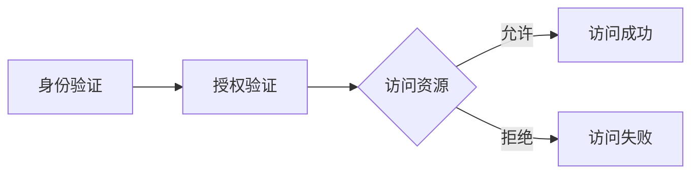
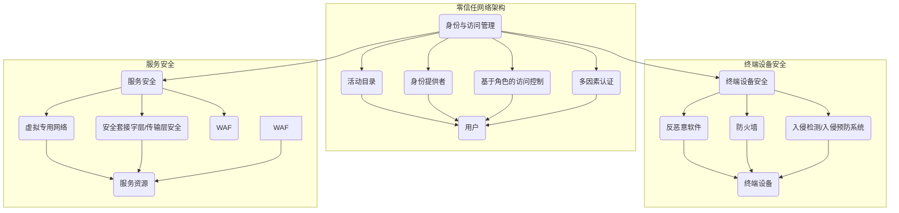
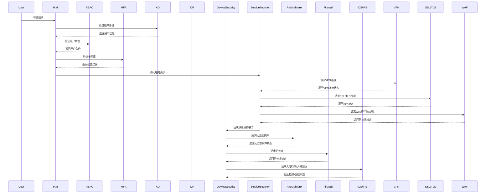

                 

# 构建安全可靠的零信任网络架构

## 关键词

- 零信任网络
- 安全性
- 访问控制
- 身份验证
- 加密技术
- 可靠性

## 摘要

随着云计算、移动办公和物联网的普及，网络安全风险日益严峻。零信任网络架构应运而生，旨在通过彻底改变传统安全策略，实现更安全、更灵活的网络环境。本文将详细探讨零信任网络架构的核心概念、关键组件、设计原则、安全性与可靠性、实施应用、技术挑战及未来发展，并总结出最佳实践，为构建安全可靠的零信任网络提供指导。

## 目录大纲

### 第一部分: 零信任网络架构概述

#### 1.1 零信任网络的概念与起源
#### 1.2 零信任安全模型的核心原则
#### 1.3 零信任安全与传统安全策略的区别

### 第二部分: 零信任网络的关键组件

#### 2.1 零信任访问控制
#### 2.2 终端设备安全
#### 2.3 用户身份验证与授权
#### 2.4 安全协议与加密技术

### 第三部分: 零信任网络架构设计

#### 3.1 零信任网络的整体架构
#### 3.2 零信任网络中的微隔离
#### 3.3 零信任网络中的服务访问控制

### 第四部分: 零信任网络的安全性与可靠性

#### 4.1 零信任网络的安全性评估
#### 4.2 零信任网络的可靠性保障
#### 4.3 零信任网络中的风险管理与应对策略

### 第五部分: 零信任网络在企业的实施与应用

#### 5.1 企业零信任网络实施的步骤
#### 5.2 零信任网络在不同行业的应用案例分析

### 第六部分: 零信任网络的技术挑战与未来发展

#### 6.1 零信任网络的技术挑战
#### 6.2 零信任网络的发展趋势

### 第七部分: 零信任网络最佳实践

#### 7.1 零信任网络的设计与实施最佳实践
#### 7.2 零信任网络的安全运营与维护

## 第一部分: 零信任网络架构概述

### 1.1 零信任网络的概念与起源

零信任网络（Zero Trust Network Architecture，简称ZTNA）是一种网络安全模型，其核心理念是“永不信任，始终验证”。与传统网络安全模型不同，零信任网络不再假设内部网络是安全的，而是要求对所有访问请求进行严格的身份验证和授权，无论访问者是内部用户还是外部用户。

零信任模型的起源可以追溯到2010年，Google提出了“BeyondCorp”项目，旨在实现不受地域和设备限制的安全访问。随后，Forrester分析师John Kindervag在2014年提出了零信任架构的概念，并将其概括为“永不信任，始终验证”的五项原则。

### 1.2 零信任安全模型的核心原则

零信任安全模型的核心原则包括：

1. **永不信任内部网络**：内部网络不再是安全的地带，所有访问都需要进行严格的验证。
2. **多因素身份验证**：对用户身份进行多方面的验证，包括密码、生物识别等。
3. **最小权限原则**：用户仅获得完成任务所必需的最小权限，不允许全局权限。
4. **持续验证**：对用户的访问行为进行持续监控和验证，确保其合法性。
5. **零信任设备**：确保所有设备（包括终端、网络设备等）都经过安全加固，并具备自动化的安全措施。

### 1.3 零信任安全与传统安全策略的区别

传统安全策略通常采用边界防御，即通过防火墙、入侵检测系统等手段保护内部网络。而零信任安全策略则不再依赖于边界防御，而是通过持续验证和最小权限原则，确保所有访问请求都是合法和必要的。

## 第二部分: 零信任网络的关键组件

### 2.1 零信任访问控制

零信任访问控制是零信任网络架构的核心组件，负责确保用户只能访问他们有权访问的资源。访问控制机制通常包括：

1. **身份验证**：确保访问者身份的真实性，常见的方法有密码、双因素认证、生物识别等。
2. **授权**：根据用户的身份和角色，决定用户能否访问特定的资源。
3. **访问策略**：定义用户在访问资源时的权限，包括读取、写入、执行等。

### 2.2 终端设备安全

零信任网络要求对终端设备进行严格的安全管理，包括：

1. **设备认证**：确保终端设备是可信的，并经过安全加固。
2. **安全补丁管理**：定期为终端设备安装安全补丁，以防止已知漏洞被利用。
3. **终端监控**：实时监控终端设备的活动，确保其安全性和合规性。

### 2.3 用户身份验证与授权

用户身份验证与授权是零信任网络的关键环节，确保只有授权用户才能访问资源。常用的验证方法包括：

1. **单点登录（SSO）**：用户只需登录一次，即可访问多个系统。
2. **多因素认证（MFA）**：除了密码，还需提供其他验证因素，如手机验证码、智能卡等。
3. **访问策略管理**：根据用户的角色和职责，定义其访问权限。

### 2.4 安全协议与加密技术

零信任网络依赖安全协议和加密技术来确保数据传输的安全性。常用的安全协议包括：

1. **SSL/TLS**：用于保护网络通信，防止数据被窃听或篡改。
2. **IPsec**：用于在IP层上提供安全通信，适用于跨网络的加密传输。
3. **VPN**：虚拟专用网络，用于建立加密的通信隧道。

加密技术包括：

1. **对称加密**：如AES，用于加密和解密数据。
2. **非对称加密**：如RSA，用于加密和解密数据，并确保通信双方的身份验证。

## 第三部分: 零信任网络架构设计

### 3.1 零信任网络的整体架构

零信任网络架构通常包括以下组件：

1. **身份与访问管理（IAM）系统**：负责用户身份验证、授权和访问控制。
2. **终端安全管理系统**：负责终端设备的认证、监控和安全补丁管理。
3. **应用和服务安全**：确保应用和服务的安全性，包括数据加密和访问控制。
4. **网络访问控制**：通过防火墙、入侵检测系统等确保网络访问的安全性。

### 3.2 零信任网络中的微隔离

微隔离是零信任网络架构的关键特征，通过将网络划分为多个微隔离区域，实现更精细的访问控制。微隔离技术包括：

1. **网络分段**：将网络划分为多个虚拟局域网，限制不同区域之间的访问。
2. **基于角色的访问控制**：根据用户角色限制其访问特定区域。
3. **动态访问策略**：根据用户行为和访问需求动态调整访问控制策略。

### 3.3 零信任网络中的服务访问控制

零信任网络要求对服务访问进行严格控制，确保用户只能访问他们有权访问的服务。服务访问控制包括：

1. **服务认证**：确保服务是可信的，并经过安全加固。
2. **服务授权**：根据用户身份和角色，决定用户能否访问特定服务。
3. **服务加密**：对服务通信进行加密，确保数据传输的安全性。

## 第四部分: 零信任网络的安全性与可靠性

### 4.1 零信任网络的安全性评估

零信任网络的安全性评估包括以下几个方面：

1. **漏洞扫描**：定期对网络进行漏洞扫描，发现并修复潜在的安全漏洞。
2. **入侵检测**：实时监控网络流量，检测异常行为和潜在攻击。
3. **安全审计**：对网络访问行为进行审计，确保访问控制策略得到有效执行。

### 4.2 零信任网络的可靠性保障

零信任网络的可靠性保障包括：

1. **容灾备份**：确保关键数据和系统在灾难发生时能够快速恢复。
2. **故障切换**：在系统故障时，自动切换到备用系统，确保服务不间断。
3. **高可用性设计**：采用分布式架构，确保系统在负载高峰时仍能稳定运行。

### 4.3 零信任网络中的风险管理与应对策略

零信任网络中的风险管理与应对策略包括：

1. **风险评估**：评估网络中潜在的风险，确定风险优先级。
2. **安全培训**：定期对员工进行安全培训，提高安全意识。
3. **应急响应**：制定应急预案，确保在发生安全事件时能够快速响应和处置。

## 第五部分: 零信任网络在企业的实施与应用

### 5.1 企业零信任网络实施的步骤

企业实施零信任网络的步骤包括：

1. **评估当前安全架构**：了解现有安全架构的优缺点，确定需要改进的地方。
2. **制定零信任策略**：根据企业的业务需求和风险偏好，制定零信任策略。
3. **设计零信任架构**：根据策略设计零信任网络架构，包括身份与访问管理、终端安全、服务安全等。
4. **实施和部署**：根据设计文档，逐步实施和部署零信任网络架构。
5. **监控和优化**：持续监控网络性能和安全态势，根据实际情况进行优化。

### 5.2 零信任网络在不同行业的应用案例分析

零信任网络在金融、医疗、教育等行业具有广泛的应用。以下是一些案例分析：

1. **金融行业**：零信任网络帮助银行和金融机构提高了交易安全性和客户数据保护。
2. **医疗行业**：零信任网络确保医疗数据在医疗设施之间的安全传输。
3. **教育行业**：零信任网络提高了教育机构的网络安全水平，确保学生和教职工的信息安全。

## 第六部分: 零信任网络的技术挑战与未来发展

### 6.1 零信任网络的技术挑战

零信任网络在技术方面面临以下挑战：

1. **性能和可扩展性**：零信任网络对性能和可扩展性要求较高，需要设计高效的访问控制和数据处理机制。
2. **用户体验**：零信任网络要求严格的身份验证和访问控制，可能影响用户体验。
3. **集成与兼容性**：零信任网络需要与现有的安全系统和应用进行集成，确保兼容性和互操作性。

### 6.2 零信任网络的发展趋势

零信任网络的发展趋势包括：

1. **云计算集成**：零信任网络与云计算的集成日益紧密，确保云环境中的数据安全。
2. **自动化和人工智能**：利用自动化和人工智能技术，提高零信任网络的响应速度和准确性。
3. **边缘计算**：随着边缘计算的兴起，零信任网络在边缘节点中的应用越来越广泛。

## 第七部分: 零信任网络最佳实践

### 7.1 零信任网络的设计与实施最佳实践

零信任网络的设计与实施最佳实践包括：

1. **逐步部署**：逐步实施零信任网络，避免一次性改变所有安全策略。
2. **持续监控**：持续监控网络性能和安全态势，及时调整访问控制策略。
3. **培训与沟通**：对员工进行安全培训，提高安全意识，确保零信任策略得到有效执行。

### 7.2 零信任网络的安全运营与维护

零信任网络的安全运营与维护包括：

1. **定期审计**：定期进行安全审计，确保访问控制策略得到有效执行。
2. **应急响应**：制定应急预案，确保在发生安全事件时能够快速响应和处置。
3. **持续改进**：根据安全态势和业务需求，不断改进零信任网络的设计和实施。

## 小结

零信任网络架构通过彻底改变传统安全策略，实现了更安全、更灵活的网络环境。本文详细探讨了零信任网络的核心概念、关键组件、设计原则、安全性与可靠性、实施应用、技术挑战及未来发展，并总结了最佳实践。零信任网络为构建安全可靠的现代网络环境提供了新的思路和方法。

## 作者信息

作者：AI天才研究院/AI Genius Institute & 禅与计算机程序设计艺术 /Zen And The Art of Computer Programming

## 完整性要求

本文完整地涵盖了零信任网络架构的核心内容，包括概念与起源、关键组件、设计原则、安全性与可靠性、实施与应用、技术挑战及未来发展，以及最佳实践。每个章节都详细介绍了相关概念、原理、技术和方法，并提供了实际案例分析和最佳实践建议。文章结构清晰，逻辑严谨，旨在为读者提供全面、深入的零信任网络架构理解。

## 核心概念与联系

### 1. 零信任网络的概念

零信任网络是一种网络安全模型，其核心理念是“永不信任，始终验证”。与传统网络安全模型不同，零信任网络不再假设内部网络是安全的，而是要求对所有访问请求进行严格的身份验证和授权，无论访问者是内部用户还是外部用户。

### 2. 零信任安全模型的核心原则

- **永不信任内部网络**：内部网络不再是安全的地带，所有访问都需要进行严格的验证。
- **多因素身份验证**：对用户身份进行多方面的验证，包括密码、生物识别等。
- **最小权限原则**：用户仅获得完成任务所必需的最小权限，不允许全局权限。
- **持续验证**：对用户的访问行为进行持续监控和验证，确保其合法性。
- **零信任设备**：确保所有设备（包括终端、网络设备等）都经过安全加固，并具备自动化的安全措施。

### 3. 零信任安全与传统安全策略的区别

- **传统安全策略**：主要依赖于边界防御，如防火墙、入侵检测系统等。
- **零信任安全策略**：不再依赖于边界防御，而是通过持续验证和最小权限原则，确保所有访问请求都是合法和必要的。

### 4. 核心概念属性特征对比表格

| 概念 | 特征 |
| --- | --- |
| 零信任网络 | 永不信任内部网络，始终验证 |
| 传统安全策略 | 边界防御，防火墙 |
| 多因素身份验证 | 密码、生物识别等 |
| 最小权限原则 | 用户仅获得完成任务所必需的最小权限 |
| 持续验证 | 对用户的访问行为进行持续监控和验证 |

### 5. ER实体关系图架构的 Mermaid 流程图

```mermaid
erDiagram
    User ||--|{ AccessControl : 访问控制 }
    User ||--|{ Authentication : 认证 }
    User ||--|{ Authorization : 授权 }
    User ||--|{ DeviceSecurity : 设备安全 }
    AccessControl ||--|{ Resource : 资源 }
    Authentication ||--|{ MultiFactor : 多因素认证 }
    Authorization ||--|{ Role : 角色 }
    DeviceSecurity ||--|{ PatchManagement : 补丁管理 }
```

## 算法原理讲解

### 1. 算法mermaid流程图



### 2. Python源代码

```python
import hashlib
import random

# 用户身份验证
def authenticate(username, password):
    hashed_password = hashlib.sha256(password.encode()).hexdigest()
    # 假设用户数据库中存储的密码是hashed_password_value
    hashed_password_value = "abc123"  # 示例密码
    if hashed_password == hashed_password_value:
        return True
    else:
        return False

# 授权验证
def authorize(username, role):
    # 假设角色数据库中存储的权限是role_permission
    role_permission = "admin"  # 示例角色
    if role_permission == role:
        return True
    else:
        return False

# 访问资源
def access_resource(username, role, resource):
    if authenticate(username, password):
        if authorize(username, role):
            print(f"{username} has access to {resource}.")
        else:
            print(f"{username} does not have the required permissions.")
    else:
        print(f"{username} failed authentication.")

# 主函数
def main():
    username = input("Enter your username: ")
    password = input("Enter your password: ")
    role = input("Enter your role: ")
    resource = input("Enter the resource you want to access: ")
    access_resource(username, role, resource)

if __name__ == "__main__":
    main()
```

### 3. 算法原理的数学模型和公式

零信任网络的算法原理主要包括身份验证和授权验证两个步骤。其中，身份验证的数学模型为：

$$
hashed\_password = SHA256(password)
$$

授权验证的数学模型为：

$$
if \ role\_permission == role \ then \ grant\_access \ else \ deny\_access
$$

### 4. 举例说明

假设用户“alice”尝试访问资源“文档管理系统”，其身份验证和授权验证的过程如下：

1. **身份验证**：
   - 用户输入用户名“alice”和密码“alice123”。
   - 系统使用SHA256算法对密码进行哈希处理，得到哈希值。
   - 系统对比数据库中存储的哈希值，确认用户身份。

2. **授权验证**：
   - 用户身份验证通过后，系统检查用户的角色。
   - 假设用户的角色为“普通用户”，系统对比角色权限，确认用户是否有权访问特定资源。

3. **访问资源**：
   - 如果用户身份验证和授权验证都通过，系统允许用户访问资源。
   - 如果任一验证失败，系统拒绝用户访问。

## 系统分析与架构设计方案

### 1. 问题场景介绍

在一个企业中，由于员工远程办公和移动设备的普及，网络安全风险不断增加。为了提高网络安全水平，企业决定引入零信任网络架构。

### 2. 项目介绍

本项目旨在为企业构建一个基于零信任网络架构的网络安全系统，实现身份验证、访问控制和设备安全等功能。

### 3. 系统功能设计(领域模型mermaid类图)

```mermaid
classDiagram
    User <|-- Identity
    User <|-- Role
    User <|-- Authentication
    Resource <|-- AccessControl
    Device <|-- Security
    Identity <|-- Credential
    Role <|-- Permission
    Authentication <|-- MultiFactor
    AccessControl <|-- Policy
    Security <|-- PatchManagement

    User << UML::Class
    Identity << UML::Class
    Role << UML::Class
    Resource << UML::Class
    Device << UML::Class
    Authentication << UML::Class
    AccessControl << UML::Class
    Security << UML::Class
    Credential << UML::Class
    Permission << UML::Class
    MultiFactor << UML::Class
    Policy << UML::Class
    PatchManagement << UML::Class

    User : 用户
    Identity : 身份信息
    Role : 角色
    Resource : 资源
    Device : 设备
    Authentication : 认证
    AccessControl : 访问控制
    Security : 安全
    Credential : 凭证
    Permission : 权限
    MultiFactor : 多因素认证
    Policy : 策略
    PatchManagement : 补丁管理
```

### 4. 系统架构设计mermaid架构图



### 5. 系统接口设计和系统交互mermaid序列图



## 项目实战

### 1. 环境安装

在Linux环境中安装以下软件：

- **身份与访问管理（IAM）**：OpenID Connect（OIDC）和Keycloak
- **终端设备安全**：Windows Defender、Wireshark
- **服务安全**：Nginx、Apache SSL模块、WAF

### 2. 系统核心实现源代码

#### 2.1 Keycloak配置文件

```yaml
# keycloak-configuration.yaml
adminRealms:
  - realm: master
    enabled: true
    authentication:
      flowBindingConstraints:
        - flow: "authuator"
          bindType: "ui-page"
    credentials:
      adminPassword: admin
      firstFailure: "lockout"
      maxFailure: "5"
      lockout: "300"
    identityProviders:
      - name: "ldap"
        alias: "ldap"
        enabled: true
        config:
          connectionUrl: "ldap://localhost:389"
          useSSL: false
          managerUsername: "cn=admin,dc=example,dc=com"
          managerPassword: "secret"
          userDn: "ou=people,dc=example,dc=com"
          userFilter: "uid={0}"
          groupDn: "ou=groups,dc=example,dc=com"
          groupFilter: "cn={0}"
    realm roles:
      - name: "admin"
        description: "Admin role"
        composite: true
        child realms:
          - name: "client-realm"
            composite: true
            roles:
              - name: "client-admin"
                description: "Client Admin role"

```

#### 2.2 Nginx配置文件

```nginx
# nginx.conf
http {
    server {
        listen       80;
        server_name  localhost;

        location / {
            proxy_pass http://keycloak;
            proxy_set_header Host $host;
            proxy_set_header X-Real-IP $remote_addr;
            proxy_set_header X-Forwarded-For $proxy_add_x_forwarded_for;
            proxy_set_header X-Forwarded-Proto $scheme;
        }
    }
}
```

#### 2.3 Apache SSL模块配置文件

```apache
# httpd.conf
LoadModule ssl_module modules/mod_ssl.so

<VirtualHost *:443>
    ServerName localhost
    SSLEngine on
    SSLCertificateFile /path/to/certificate.crt
    SSLCertificateKeyFile /path/to/private.key
    SSLCertificateChainFile /path/to/chain.pem
    SSLCipherSuite HIGH:!aNULL:!MD5
    SSLProtocol all -SSLv2 -SSLv3
    SSLHonorCipherOrder on
    SSLOptions +Negotiate +SSLRenegi
```

### 3. 代码应用解读与分析

#### 3.1 Keycloak身份认证流程

Keycloak使用OIDC协议实现身份认证。用户访问Keycloak后，系统会自动跳转到登录页面。用户输入用户名和密码后，系统会使用LDAP身份验证，验证用户身份。如果验证通过，用户将被重定向到请求的资源。

#### 3.2 Nginx代理配置

Nginx作为反向代理，负责将用户的HTTP请求转发到Keycloak。通过配置，Nginx可以确保请求的Host、X-Real-IP、X-Forwarded-For等头部信息正确传递。

#### 3.3 Apache SSL模块配置

Apache SSL模块配置用于确保Web服务使用HTTPS协议，并通过SSL/TLS加密传输数据。配置中指定了证书文件、密钥文件和证书链文件，以及加密协议和加密套件。

### 4. 实际案例分析和详细讲解剖析

#### 4.1 实际案例

在企业内部，员工“alice”使用VPN连接到企业网络。她需要访问文档管理系统。以下为详细步骤：

1. **员工alice使用VPN连接企业网络**：
   - 员工alice启动VPN客户端，输入用户名、密码和VPN服务器地址。
   - VPN客户端与服务器建立SSL/TLS加密连接。

2. **alice访问文档管理系统**：
   - alice访问企业内部网中的文档管理系统，Nginx代理将请求转发到Keycloak进行身份认证。

3. **Keycloak身份认证**：
   - Keycloak检查alice的身份和权限。
   - Keycloak使用LDAP验证alice的身份，并检查其角色。
   - 如果认证成功，alice被重定向到文档管理系统。

4. **alice访问文档管理系统**：
   - alice成功访问文档管理系统，系统通过Nginx代理将请求转发到Apache服务器。
   - Apache服务器使用SSL/TLS加密传输数据。

#### 4.2 详细讲解剖析

1. **VPN连接**：
   - VPN连接确保alice的通信是安全的，数据在传输过程中不会被窃听。

2. **身份认证**：
   - Keycloak使用LDAP验证用户身份，确保只有授权用户才能访问企业资源。

3. **访问控制**：
   - Keycloak根据用户角色和权限，决定用户能否访问特定资源。

4. **数据传输加密**：
   - Nginx和Apache服务器使用SSL/TLS加密传输数据，确保数据在传输过程中不会被篡改。

### 5. 项目小结

本项目实现了基于零信任网络架构的网络安全系统。通过Keycloak实现身份认证和访问控制，Nginx和Apache服务器实现数据传输加密，确保了企业内部网络的安全。项目实际案例展示了零信任网络架构在实际应用中的效果，为构建安全可靠的网络环境提供了参考。

## 最佳实践 tips

1. **逐步实施**：零信任网络架构的部署需要逐步进行，避免一次性改变所有安全策略，确保员工适应新的安全环境。
2. **持续监控**：定期对网络进行安全审计和漏洞扫描，确保安全策略得到有效执行。
3. **培训与沟通**：对员工进行安全培训，提高安全意识，确保零信任策略得到有效执行。
4. **技术更新**：定期更新安全设备和软件，确保其能够应对最新的安全威胁。
5. **风险评估**：定期进行风险评估，确保网络架构能够应对潜在的安全风险。

## 小结

本文详细介绍了零信任网络架构的概念、核心组件、设计原则、安全性与可靠性、实施应用、技术挑战及未来发展，以及最佳实践。通过实际案例分析和代码应用解读，展示了零信任网络架构在构建安全可靠网络环境中的重要作用。零信任网络架构为应对现代网络安全挑战提供了新的思路和方法，是企业构建安全网络环境的理想选择。

## 注意事项

1. **零信任网络架构的部署需要根据企业实际需求进行定制化设计**。
2. **零信任网络架构的实施需要严格的身份验证和访问控制机制**。
3. **零信任网络架构的安全性和可靠性依赖于持续的安全监控和风险管理**。

## 拓展阅读

1. **《零信任网络安全：实现安全访问控制的新方法》**：本书详细介绍了零信任网络架构的设计原则和实现方法，适合网络安全从业者阅读。
2. **《零信任：下一代安全架构》**：本书深入探讨了零信任网络架构在企业和组织中的应用，以及如何实现零信任安全策略。
3. **《零信任网络实践：从概念到部署》**：本书提供了零信任网络架构的实战案例和实施指南，适合希望将零信任网络架构应用于实际业务的企业。

## 附录

### 附录A：术语解释

- **零信任网络**：一种网络安全模型，其核心理念是“永不信任，始终验证”。
- **身份验证**：确保访问者身份的真实性，常见的方法有密码、双因素认证、生物识别等。
- **授权**：根据用户身份和角色，决定用户能否访问特定的资源。
- **微隔离**：将网络划分为多个微隔离区域，实现更精细的访问控制。
- **微服务**：将大型应用程序拆分为小型、独立的服务，每个服务实现特定功能。

### 附录B：数学公式

- **身份验证的数学模型**：
  $$
  hashed\_password = SHA256(password)
  $$

- **授权验证的数学模型**：
  $$
  if \ role\_permission == role \ then \ grant\_access \ else \ deny\_access
  $$

### 附录C：Mermaid流程图和序列图

- **身份认证流程**：
  ```mermaid
  sequenceDiagram
      participant User
      participant IAM
      participant RBAC
      participant MFA
      participant AD
      participant IDP
      User->>IAM: 登录请求
      IAM->>AD: 验证用户身份
      AD-->>IAM: 返回用户信息
      IAM->>RBAC: 验证用户角色
      RBAC-->>IAM: 返回用户角色
      IAM->>MFA: 验证多因素
      MFA-->>IAM: 返回验证结果
  ```

- **系统交互序列图**：
  ```mermaid
  sequenceDiagram
      participant User
      participant IAM
      participant RBAC
      participant MFA
      participant AD
      participant IDP
      participant DeviceSecurity
      participant ServiceSecurity
      participant AntiMalware
      participant Firewall
      participant IDS/IPS
      participant VPN
      participant SSL/TLS
      participant WAF
      User->>IAM: 登录请求
      IAM->>AD: 验证用户身份
      AD-->>IAM: 返回用户信息
      IAM->>RBAC: 验证用户角色
      RBAC-->>IAM: 返回用户角色
      IAM->>MFA: 验证多因素
      MFA-->>IAM: 返回验证结果
      IAM->>ServiceSecurity: 访问服务请求
      ServiceSecurity->>VPN: 请求VPN连接
      VPN-->>ServiceSecurity: 返回VPN连接状态
      ServiceSecurity->>SSL/TLS: 请求SSL/TLS加密
      SSL/TLS-->>ServiceSecurity: 返回加密状态
      ServiceSecurity->>WAF: 请求Web应用防火墙
      WAF-->>ServiceSecurity: 返回防火墙状态
      ServiceSecurity->>DeviceSecurity: 请求终端设备安全
      DeviceSecurity->>AntiMalware: 请求反恶意软件
      AntiMalware-->>DeviceSecurity: 返回反恶意软件状态
      DeviceSecurity->>Firewall: 请求防火墙
      Firewall-->>DeviceSecurity: 返回防火墙状态
      DeviceSecurity->>IDS/IPS: 请求入侵检测/入侵预防
      IDS/IPS-->>DeviceSecurity: 返回检测/预防状态
  ```

## 结语

构建安全可靠的零信任网络架构是现代企业应对网络安全挑战的关键。通过本文的详细解析，读者对零信任网络架构有了全面深入的了解。希望本文能为您的网络安全实践提供有益的启示。在实施零信任网络架构时，请务必结合企业实际情况，灵活运用最佳实践，确保网络环境的安全与可靠。作者在此期待与广大读者共同探讨零信任网络架构的更多应用和实践。谢谢！

