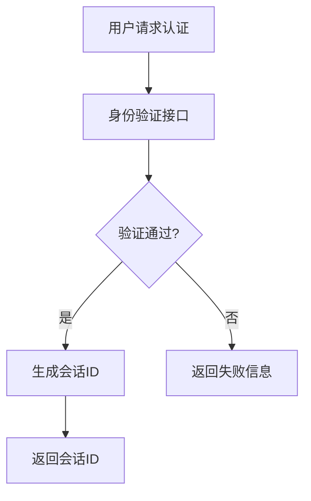
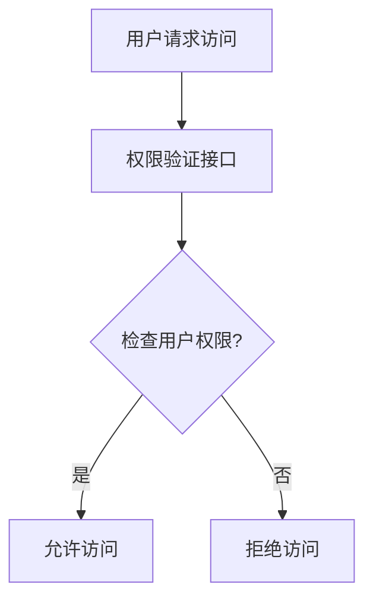
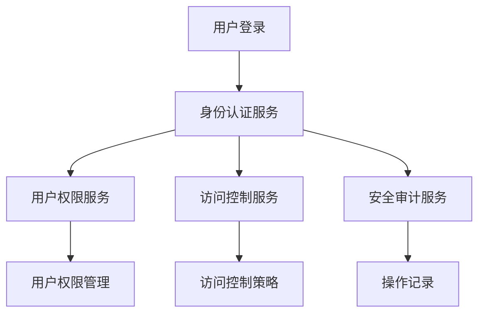
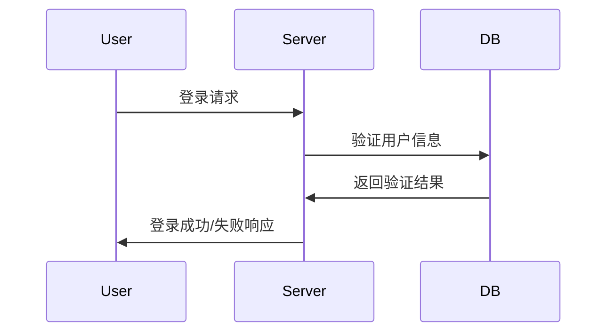

                 

# 构建安全的身份认证与授权系统

## 关键词

- 身份认证
- 授权
- 访问控制
- 安全防护
- 多因素认证
- 权限控制策略

## 摘要

本文旨在深入探讨构建一个安全且高效的身份认证与授权系统的重要性。通过对核心概念、算法原理、系统架构以及实战应用的详细分析，本文旨在为读者提供一个全面的技术指南，帮助开发者在面对日益复杂的信息安全挑战时，能够有效地构建和维护一个安全的身份认证与授权系统。

## 第一部分：背景介绍

### 1.1 问题背景

随着互联网和移动技术的迅猛发展，信息安全问题日益突出。身份认证与授权系统作为信息安全的重要组成部分，其安全性直接关系到用户数据的安全和业务的稳定性。构建一个高效、安全的身份认证与授权系统，不仅能够保护用户隐私，还能确保业务系统的正常运行。

### 1.2 问题描述

构建安全的身份认证与授权系统需要解决以下几个关键问题：

- 如何确保用户身份的真实性？
- 如何有效控制用户对系统资源的访问权限？
- 如何抵御各种网络攻击和恶意行为？
- 如何在保证安全性的同时，提供良好的用户体验？

### 1.3 问题解决

解决上述问题通常需要以下措施：

- 采用多因素认证机制，提高认证安全性。
- 设计灵活的权限控制策略，确保访问控制的有效性。
- 实施严格的安全审计和监控，及时发现并应对安全威胁。
- 在用户体验与安全性之间找到平衡点。

### 1.4 边界与外延

- **边界**：身份认证与授权系统的范围，包括企业内部系统、在线服务、移动应用等。
- **外延**：涉及的用户群体，包括内部员工、外部合作伙伴和最终用户。

### 1.5 概念结构与核心要素组成

- **核心概念**：身份认证、授权、访问控制、安全审计等。
- **核心要素**：用户身份信息、权限数据、安全策略、加密算法等。

## 第二部分：核心概念与联系

### 2.1 核心概念原理

- **身份认证**：验证用户身份的过程，确保用户身份的真实性。
- **授权**：根据用户身份和权限分配规则，确定用户对系统资源的访问权限。
- **访问控制**：通过定义访问控制策略，控制用户对系统资源的访问。
- **安全审计**：记录和监控用户操作，用于发现和应对异常行为。

### 2.2 概念属性特征对比表格

| 概念    | 属性特征                                                   |
| ------- | ---------------------------------------------------------- |
| 身份认证 | 确保用户身份的真实性，防止未经授权的访问。               |
| 授权    | 分配用户权限，控制对资源的访问。                         |
| 访问控制 | 策略实现，确保访问控制规则的执行。                       |
| 安全审计 | 记录用户操作，用于安全分析和问题追踪。                   |

### 2.3 ER实体关系图架构

```mermaid
erDiagram
    用户 ||--|{ 认证信息 }||>
    用户 ||--|{ 权限信息 }||>
    认证信息 ||--|{ 访问记录 }||>
```

## 第三部分：算法原理讲解

### 3.1 身份认证算法

#### 流程图



#### Python源代码

```python
import random
import hashlib

def authenticate(username, password):
    # 假设有一个内置的用户数据库
    users = {'user1': 'password1', 'user2': 'password2'}
    
    # 使用MD5哈希算法对用户输入的密码进行加密
    encrypted_password = hashlib.md5(password.encode()).hexdigest()
    
    if username in users and users[username] == encrypted_password:
        session_id = random.randint(100000, 999999)
        return session_id
    else:
        return "认证失败"

# 示例
session_id = authenticate('user1', 'password1')
print(session_id)
```

#### 数学模型和公式

$$
H(\text{password}) = \sum_{i=1}^{n} P(\text{hash_function}(\text{password}_i) = \text{encrypted_password})
$$

其中，$H(\text{password})$ 是密码的哈希值，$P(\text{hash_function}(\text{password}_i) = \text{encrypted_password})$ 是哈希函数对于每个密码字符的输出概率。

### 3.2 授权算法

#### 流程图



#### Python源代码

```python
def authorize(session_id, resource):
    # 假设有一个内置的权限数据库
    permissions = {'user1': {'resource1': True, 'resource2': False},
                   'user2': {'resource1': False, 'resource2': True}}

    if session_id in permissions and permissions[session_id].get(resource, False):
        return "访问允许"
    else:
        return "访问拒绝"

# 示例
authorization_result = authorize('123456', 'resource1')
print(authorization_result)
```

#### 数学模型和公式

$$
P(\text{access\_allowed}) = \sum_{i=1}^{n} P(\text{resource}_i \in \text{user}'s\_permissions)
$$

其中，$P(\text{access\_allowed})$ 是用户访问被允许的概率，$P(\text{resource}_i \in \text{user}'s\_permissions})$ 是用户拥有对资源$i$的访问权限的概率。

## 第四部分：系统分析与架构设计方案

### 4.1 问题场景介绍

在一个大型企业内部，员工需要访问公司内部的各种业务系统，如ERP系统、CRM系统等。为了确保信息安全和业务的正常运转，企业需要构建一个安全的身份认证与授权系统。

### 4.2 项目介绍

项目名称：企业身份认证与授权系统

项目目标：实现员工身份认证、权限控制和安全审计等功能，确保企业内部信息系统的安全。

### 4.3 系统功能设计

- **用户注册与登录**：用户可以通过用户名和密码进行注册和登录。
- **多因素认证**：支持密码、指纹、短信验证码等多种认证方式。
- **权限管理**：管理员可以分配不同角色的权限，实现细粒度的访问控制。
- **安全审计**：记录用户操作，便于问题追踪和安全分析。

### 4.4 系统架构设计



### 4.5 系统接口设计

- **身份认证接口**：提供用户注册、登录、多因素认证等功能。
- **权限管理接口**：提供权限分配、查询和修改等功能。
- **访问控制接口**：提供资源访问权限的查询和控制等功能。
- **安全审计接口**：提供操作记录查询和安全分析等功能。

### 4.6 系统交互



## 第五部分：项目实战

### 5.1 环境安装

在项目中，我们将使用Python作为主要开发语言，配合Django框架构建身份认证与授权系统。首先，需要在本地安装Python和Django：

```bash
pip install python
pip install django
```

### 5.2 系统核心实现

#### 用户注册与登录

```python
# users/models.py
from django.contrib.auth.models import AbstractUser
from django.db import models

class CustomUser(AbstractUser):
    email = models.EmailField(unique=True)
    is_employee = models.BooleanField(default=False)

    def __str__(self):
        return self.email

# users/views.py
from django.contrib.auth import authenticate, login
from django.shortcuts import render, redirect

def register(request):
    if request.method == 'POST':
        username = request.POST['username']
        email = request.POST['email']
        password = request.POST['password']
        user = CustomUser.objects.create_user(username=username, email=email, password=password)
        user.is_employee = True
        user.save()
        return redirect('login')
    return render(request, 'register.html')

def login(request):
    if request.method == 'POST':
        username = request.POST['username']
        password = request.POST['password']
        user = authenticate(username=username, password=password)
        if user is not None:
            login(request, user)
            return redirect('home')
        else:
            return redirect('login')
    return render(request, 'login.html')
```

#### 权限管理

```python
# permissions/models.py
from django.contrib.auth.models import Permission, Group
from django.db import models

class Permission(models.Model):
    name = models.CharField(max_length=255)
    code = models.CharField(max_length=100)
    description = models.TextField()

    def __str__(self):
        return self.name

# permissions/views.py
from django.shortcuts import render, redirect
from .models import Permission, Group

def assign_permissions(request):
    if request.method == 'POST':
        group_name = request.POST['group_name']
        permission_ids = request.POST.getlist('permissions[]')
        
        group, created = Group.objects.get_or_create(name=group_name)
        if not created:
            group.permissions.clear()
        
        for permission_id in permission_ids:
            permission = Permission.objects.get(id=permission_id)
            group.permissions.add(permission)
        
        group.save()
        return redirect('permissions_list')
    permissions = Permission.objects.all()
    return render(request, 'assign_permissions.html', {'permissions': permissions})
```

#### 访问控制

```python
# access_control/models.py
from django.contrib.auth.models import User
from .permissions.models import Permission

class AccessControl(models.Model):
    user = models.ForeignKey(User, on_delete=models.CASCADE)
    permission = models.ForeignKey(Permission, on_delete=models.CASCADE)
    resource = models.CharField(max_length=255)
    access_level = models.CharField(max_length=10, choices=[('READ', 'Read'), ('WRITE', 'Write'), ('EXECUTE', 'Execute')])

    def __str__(self):
        return f"{self.user.username} - {self.permission.name} - {self.resource}"
```

### 5.3 代码应用解读与分析

#### 用户注册与登录

上述代码中，我们定义了`CustomUser`模型，继承自`AbstractUser`，并添加了`email`和`is_employee`字段。`register`视图函数用于处理用户注册逻辑，通过表单接收用户信息，创建用户并保存到数据库。`login`视图函数用于处理用户登录逻辑，通过表单接收用户名和密码，调用`authenticate`函数验证用户身份，如果验证成功，则调用`login`函数登录用户。

#### 权限管理

在权限管理部分，我们定义了`Permission`模型，用于存储权限的名称、代码和描述。`assign_permissions`视图函数用于将权限分配给特定组。该函数接收组名和权限ID列表，查询组对象，清除当前权限，然后添加新权限。通过这种方式，我们可以将权限分组管理，实现角色权限分配。

#### 访问控制

`AccessControl`模型用于存储用户权限的详细信息，包括用户、权限、资源和访问级别。通过查询`AccessControl`模型，我们可以判断用户是否具有对特定资源的访问权限。

### 5.4 实际案例分析和详细讲解剖析

假设一个企业需要实现以下访问控制策略：

- 管理员可以访问所有资源。
- 普通员工只能访问办公文档和员工信息。
- 客户只能访问产品信息和订单状态。

为了实现这一策略，我们可以在`AccessControl`模型中添加以下记录：

```python
from access_control.models import AccessControl

# 管理员权限
AccessControl.objects.create(user=user_admin, permission=permission_all, resource='*', access_level='WRITE')

# 普通员工权限
AccessControl.objects.create(user=user_employee, permission=permission_documents, resource='documents', access_level='READ')
AccessControl.objects.create(user=user_employee, permission=permission_employee_info, resource='employee_info', access_level='READ')

# 客户权限
AccessControl.objects.create(user=user_client, permission=permission_products, resource='products', access_level='READ')
AccessControl.objects.create(user=user_client, permission=permission_order_status, resource='order_status', access_level='READ')
```

### 5.5 项目小结

在本项目中，我们构建了一个简单的企业身份认证与授权系统，实现了用户注册、登录、权限管理和访问控制等功能。通过多因素认证和严格的权限控制，我们确保了系统的安全性。在项目实施过程中，我们还充分考虑了用户体验，提供了简洁直观的操作界面。未来，我们还可以进一步优化系统，增加更多的安全措施和功能，以满足企业日益增长的需求。

## 第六部分：最佳实践 Tips

1. **密码强度要求**：确保用户密码具有足够的复杂度，包括字母、数字和特殊字符。
2. **定期更新密码**：鼓励用户定期更换密码，以提高系统的安全性。
3. **多因素认证**：结合多种认证方式，如短信验证码、指纹识别等，增加认证的安全性。
4. **权限最小化原则**：用户权限应遵循最小化原则，只授予必要的访问权限。
5. **日志审计**：定期审查系统日志，及时发现异常行为和安全漏洞。

## 第七部分：小结

本文详细探讨了构建安全的身份认证与授权系统的核心概念、算法原理、系统架构以及实战应用。通过本文的讲解，读者应能够了解如何从零开始构建一个安全、高效的身份认证与授权系统。在未来的信息安全领域，身份认证与授权系统的重要性将日益凸显，因此，深入研究和不断优化这一系统是每位开发者都应关注的重要课题。

## 第八部分：注意事项

1. **安全性**：在设计和实现身份认证与授权系统时，安全性始终是首要考虑的因素。
2. **易用性**：在确保安全性的同时，应尽量提供用户友好的操作界面和流程。
3. **法律法规**：确保系统遵循相关法律法规，如数据保护法、网络安全法等。
4. **持续更新**：随着技术发展和安全威胁的变化，系统需要持续更新和优化。

## 第九部分：拓展阅读

1. 《深入理解身份认证与授权》
2. 《Django官方文档 - 认证和授权》
3. 《安全第一：构建安全的Web应用》
4. 《密码学：理论与实践》

## 作者

作者：AI天才研究院/AI Genius Institute & 禅与计算机程序设计艺术 /Zen And The Art of Computer Programming。

