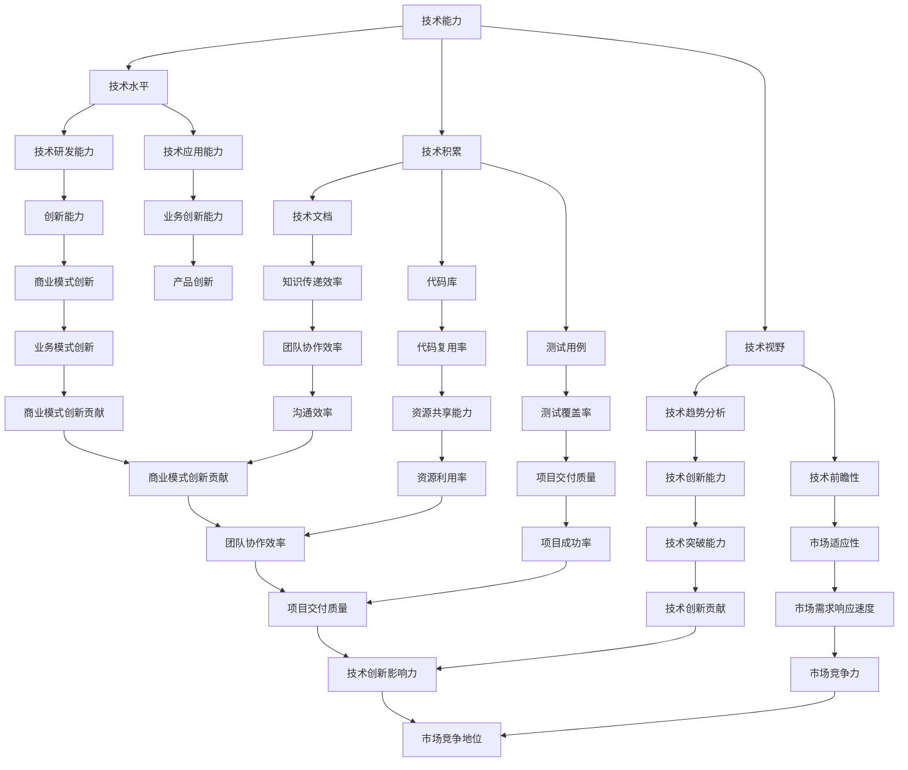

                 

# 构建技术团队核心竞争力的策略

## 关键词

- 技术团队建设
- 核心竞争力
- 人才培养
- 团队文化
- 技术路线图
- 持续改进

## 摘要

在快速发展的技术时代，技术团队的核心竞争力成为了企业成功的关键。本文将围绕构建技术团队核心竞争力的策略展开讨论，首先介绍技术团队建设的背景和重要性，然后探讨技术团队核心竞争力的定义和要素，接着分析技术团队核心竞争力的构建策略，包括明确团队目标、技术路线图、人才培养与激励机制、团队文化与协作模式。随后，我们将探讨不同技术领域核心竞争力的构建方法，分享成功案例，评估技术团队核心竞争力的方法，优化策略以及未来展望。最后，总结最佳实践并给出拓展阅读建议，以帮助读者深入了解并有效构建技术团队的核心竞争力。

### 第一部分：技术团队建设的背景与重要性

#### 1.1 技术团队建设的背景

技术团队建设是企业信息化、数字化转型的重要组成部分。随着云计算、大数据、人工智能等新兴技术的快速发展，企业对于技术团队的需求日益增加。技术团队不仅承担着研发、运维等具体技术工作，更是企业技术创新、业务发展的关键推动力。

近年来，全球范围内的技术创新速度显著加快，技术驱动的商业模式不断创新，企业竞争的焦点逐渐从传统的成本优势转向技术优势。在这种背景下，技术团队建设的重要性愈发凸显。企业需要构建一个具有核心竞争力、能够快速响应市场需求的技术团队，以保持竞争优势。

#### 1.1.1 技术发展的趋势与挑战

技术的发展趋势主要集中在以下几个方面：

1. **云计算与容器化**：云计算和容器化技术的普及，使得企业能够更灵活地部署和扩展应用程序，提高了开发和运维效率。
2. **人工智能与大数据**：人工智能和大数据技术的深度融合，为各行业带来了巨大的创新机会，但同时也带来了数据隐私、算法透明度等挑战。
3. **物联网与边缘计算**：物联网技术的快速发展，以及边缘计算的兴起，使得数据采集和处理更加分散，对技术团队的技术能力和协同工作提出了新的要求。

在这些趋势下，技术团队面临以下挑战：

1. **技术更新速度快**：技术更新速度加快，要求团队成员具备快速学习新技术的能力。
2. **跨领域知识融合**：不同领域的技术融合，需要团队成员具备跨领域的知识体系和协同工作能力。
3. **团队协作与沟通**：技术团队内部及与其他部门的协作和沟通，是提高工作效率和团队凝聚力的重要保障。

#### 1.1.2 技术团队的重要性

技术团队的重要性体现在以下几个方面：

1. **技术创新驱动**：技术团队是企业的创新引擎，通过持续的技术创新，推动企业产品和服务升级，提升市场竞争力。
2. **业务发展支撑**：技术团队为企业的业务发展提供技术保障，确保业务的稳定运行和持续扩展。
3. **企业文化建设**：技术团队是企业文化的传承者，通过共同的价值观和行为准则，塑造企业的技术氛围和文化。
4. **人才储备与培养**：技术团队是企业人才储备的重要来源，通过培养和锻炼，为企业培养一批具有核心竞争力的人才。

#### 1.2 技术团队核心竞争力的定义

技术团队核心竞争力是指团队在特定技术领域中所具备的独特能力，这种能力能够使团队在市场竞争中脱颖而出，为企业创造持续的价值。核心竞争力通常包括以下几个方面：

1. **技术水平**：团队在某一技术领域的专业水平和创新能力，包括技术研发能力、技术应用能力等。
2. **技术积累**：团队在长期技术实践中所积累的知识、经验和技术资产，如技术文档、代码库、测试用例等。
3. **团队协作**：团队内部的高效协作和沟通能力，包括项目管理、敏捷开发、跨部门协作等。
4. **创新能力**：团队在面对新挑战时的创新能力，包括技术突破、业务创新、模式创新等。
5. **市场适应能力**：团队对市场变化的快速响应和适应能力，包括市场研究、需求分析、快速迭代等。

#### 1.2.1 核心竞争力的概念

核心竞争力是指企业在特定市场环境中，能够持续创造价值、具有竞争优势的关键能力。对于技术团队而言，核心竞争力是其能够在激烈的市场竞争中脱颖而出，为企业创造持续价值的关键能力。

核心竞争力具有以下特征：

1. **独特性**：核心竞争力是团队所特有的，具有独特性和不可替代性。
2. **可持续性**：核心竞争力能够长期保持，不受市场波动和外部环境变化的影响。
3. **适应性**：核心竞争力能够适应市场变化和业务发展，具有灵活性和可扩展性。
4. **价值性**：核心竞争力能够为团队和企业创造持续的价值，提升市场竞争力。

#### 1.2.2 技术团队核心竞争力的要素

技术团队核心竞争力的构建需要从以下几个方面进行：

1. **技术能力**：技术能力是技术团队核心竞争力的基础，包括技术水平、技术积累、技术视野等。团队需要不断加强技术能力的培养，以保持技术领先优势。

2. **创新能力**：创新能力是技术团队核心竞争力的关键，包括技术创新、业务创新、模式创新等。团队需要建立创新机制，鼓励成员提出创新想法，并通过实践验证和优化。

3. **团队协作**：团队协作是技术团队核心竞争力的保障，包括项目管理、沟通协作、资源共享等。团队需要建立高效的协作机制，提高工作效率和团队凝聚力。

4. **人才培养**：人才培养是技术团队核心竞争力的重要支撑，包括培训学习、职业发展、激励机制等。团队需要关注成员的职业发展，提供培训和晋升机会，激发成员的潜力和创造力。

5. **市场适应能力**：市场适应能力是技术团队核心竞争力的重要体现，包括市场研究、需求分析、快速迭代等。团队需要关注市场动态，快速响应市场需求，提升产品的市场竞争力。

#### 1.3 背景介绍与边界界定

在本部分，我们将对技术团队建设的背景进行详细介绍，并明确本文的研究范围和边界。

##### 1.3.1 问题背景

在当前技术快速发展的背景下，技术团队建设已经成为企业竞争的关键因素。然而，如何构建一个具有核心竞争力的技术团队，实现技术创新和业务发展的双赢，成为许多企业面临的难题。

本文旨在探讨技术团队核心竞争力的构建策略，分析不同技术领域的核心竞争力要素，分享成功案例，并提出评估和优化技术团队核心竞争力的方法。

##### 1.3.2 问题描述

技术团队核心竞争力构建面临的主要问题包括：

1. **技术能力不足**：部分技术团队在技术水平、技术积累等方面存在不足，难以满足企业技术创新和业务发展的需求。
2. **创新能力欠缺**：技术团队在创新能力方面存在欠缺，难以实现技术的突破和业务的创新。
3. **团队协作不畅**：部分技术团队在团队协作方面存在沟通不畅、资源分配不合理等问题，影响了工作效率和团队凝聚力。
4. **人才培养机制不完善**：部分技术团队在人才培养机制方面存在不完善的情况，影响了成员的职业发展和创新能力。

##### 1.3.3 问题解决

为了解决上述问题，本文提出了以下解决策略：

1. **加强技术能力培养**：通过技术培训、技术交流、项目实践等方式，提高团队成员的技术水平和技术积累。
2. **激发创新能力**：建立创新机制，鼓励团队成员提出创新想法，并通过项目实践验证和优化。
3. **优化团队协作机制**：建立高效的协作机制，提高团队沟通协作效率，确保资源合理分配。
4. **完善人才培养机制**：关注成员职业发展，提供培训和晋升机会，建立激励机制，激发成员的潜力和创造力。

##### 1.3.4 边界与外延

本文的研究范围主要涉及以下方面：

1. **技术领域**：本文关注云计算、大数据、人工智能等新兴技术领域的技术团队核心竞争力构建。
2. **团队类型**：本文适用于企业内部技术团队的建设，包括研发团队、运维团队、数据分析团队等。
3. **构建策略**：本文探讨的核心竞争力构建策略包括技术能力培养、创新能力激发、团队协作优化和人才培养等方面。

本文的研究边界包括：

1. **技术深度**：本文主要关注技术团队核心竞争力的构建策略，不涉及具体技术细节的讨论。
2. **行业范围**：本文关注的企业类型主要为高科技企业、互联网企业等，不涉及其他行业的技术团队建设。

##### 1.3.5 概念结构与核心要素组成

技术团队核心竞争力的概念结构如图 1-1 所示。

图 1-1 技术团队核心竞争力概念结构图

从图 1-1 中可以看出，技术团队核心竞争力由技术能力、创新能力、团队协作能力和市场适应能力四个核心要素组成。这些要素相互关联，共同构成了技术团队的核心竞争力。

#### 1.4 本章小结

本章从技术团队建设的背景和重要性出发，探讨了技术团队核心竞争力的定义和要素，以及技术团队核心竞争力构建的背景介绍与边界界定。通过对技术发展趋势与挑战的分析，明确了技术团队的重要性。同时，本章还对技术团队核心竞争力的概念和核心要素进行了详细的阐述，为后续章节的深入探讨奠定了基础。

### 第二部分：构建技术团队核心竞争力的策略与方法

#### 2.1 核心竞争力的构建策略

构建技术团队的核心竞争力需要系统性的策略和方法，以下将详细介绍明确团队目标与战略、技术路线图与技能矩阵、人才培养与激励机制、团队文化与协作模式等方面的策略。

##### 2.1.1 明确团队目标与战略

明确团队目标是构建技术团队核心竞争力的第一步。团队目标应与企业的战略目标相一致，并具备可操作性。以下步骤可以帮助团队明确目标：

1. **制定愿景和使命**：明确团队的长期愿景和使命，这为团队提供了前进的方向和动力。
2. **设定具体目标**：根据愿景和使命，设定具体、可量化的短期和长期目标。例如，提高研发效率、提升产品质量、拓展新市场等。
3. **制定行动计划**：将目标分解为具体的行动步骤，明确责任人和时间节点，确保目标的实现。
4. **定期评估和调整**：定期评估团队目标的实现情况，根据评估结果进行调整，确保目标的持续优化。

##### 2.1.2 技术路线图与技能矩阵

技术路线图和技能矩阵是指导团队技术发展的关键工具。技术路线图明确了团队在未来一段时间内需要发展的关键技术方向和步骤，而技能矩阵则详细列出了团队成员所需的技能和能力。

1. **制定技术路线图**：
   - **市场趋势分析**：分析当前市场趋势和未来发展方向，确定关键技术方向。
   - **技术评估**：评估现有技术的优缺点，确定需要发展的技术领域。
   - **时间规划**：根据技术发展的需求和时间节点，制定具体的技术路线和里程碑。

2. **构建技能矩阵**：
   - **技能需求分析**：根据技术路线图，分析团队成员所需的技能和能力。
   - **技能评估**：评估现有团队成员的技能水平，确定技能差距。
   - **技能培养计划**：制定技能提升计划，包括培训、项目实践等。

##### 2.1.3 人才培养与激励机制

人才培养和激励机制是技术团队核心竞争力建设的重要支撑。以下策略可以帮助团队建立有效的人才培养和激励机制：

1. **培训与发展**：
   - **内部培训**：组织内部技术培训和知识分享，提高团队成员的技术水平。
   - **外部培训**：提供外部培训机会，如技术大会、研讨会等，扩展团队成员的视野。
   - **职业发展规划**：为团队成员制定职业发展规划，提供晋升和成长机会。

2. **激励机制**：
   - **绩效奖励**：建立绩效评估体系，对表现优秀的成员给予奖励。
   - **股权激励**：通过股权激励，绑定团队成员的利益，提高团队的凝聚力。
   - **荣誉与认可**：对在技术领域有突出贡献的成员给予荣誉和认可，激发其工作热情。

##### 2.1.4 团队文化与协作模式

团队文化和协作模式是技术团队核心竞争力的重要体现。以下策略可以帮助团队建立积极的团队文化和高效的协作模式：

1. **建立共同价值观**：明确团队的价值观，确保团队成员在共同的目标和价值观下工作。
2. **促进开放沟通**：鼓励团队成员之间的沟通和分享，建立开放的沟通机制。
3. **跨部门协作**：促进团队与其他部门的协作，提高项目的整体效率。
4. **敏捷开发**：采用敏捷开发方法，提高团队的开发效率和质量。
5. **持续反馈与改进**：建立持续反馈机制，不断改进团队的工作方法和流程。

##### 2.1.5 案例分享：成功构建技术团队核心竞争力的经验

为了更好地理解上述策略的实践效果，以下分享几个成功构建技术团队核心竞争力的案例：

1. **谷歌**：
   - **明确目标与战略**：谷歌通过设定明确的愿景和使命，不断推动技术创新和业务拓展。
   - **技术路线图**：谷歌制定了详细的技术路线图，明确了未来的关键技术方向。
   - **人才培养与激励机制**：谷歌通过内部培训、外部培训和专业认证等多种方式，提升员工技能，同时采用股权激励等手段绑定员工利益。
   - **团队文化**：谷歌提倡开放、创新和团队合作的文化，鼓励员工提出创意和改进建议。

2. **亚马逊**：
   - **团队协作与敏捷开发**：亚马逊采用敏捷开发方法，提高团队的响应速度和开发效率。
   - **技术能力培养**：亚马逊通过内部培训和外部合作，不断提升员工的技术水平。
   - **激励机制**：亚马逊采用绩效奖励和股权激励等多种激励手段，激发员工的工作热情。

3. **微软**：
   - **技术路线图与技能矩阵**：微软制定了详细的技术路线图和技能矩阵，确保员工技能与公司战略目标的一致性。
   - **人才培养与职业发展**：微软提供多样化的培训和学习机会，为员工制定职业发展规划。
   - **团队文化**：微软提倡创新和协作的文化，鼓励员工跨部门合作，共同解决问题。

#### 2.2 常见技术领域的竞争力构建

不同技术领域的技术团队在构建核心竞争力时，需要根据自身的特点和市场需求，采取不同的策略。以下分析云计算、大数据和人工智能等领域的技术团队如何构建核心竞争力。

##### 2.2.1 云计算领域的核心竞争力

云计算领域的技术团队核心竞争力主要体现在以下几个方面：

1. **云平台技术能力**：掌握主流云平台（如AWS、Azure、阿里云）的技术架构和服务能力，能够为不同业务场景提供定制化的云解决方案。
2. **云计算架构设计**：具备扎实的云计算架构设计能力，能够设计高效、稳定、安全的云计算系统。
3. **云安全与合规**：了解云安全的基本原则和最佳实践，能够确保云计算环境的安全和合规性。
4. **云计算运维能力**：具备丰富的云计算运维经验，能够快速响应和处理云计算环境中的问题。

##### 2.2.2 大数据领域的核心竞争力

大数据领域的技术团队核心竞争力主要体现在以下几个方面：

1. **数据处理与分析能力**：掌握大数据处理和分析的基本原理和方法，能够高效处理海量数据并提取有价值的信息。
2. **大数据技术栈**：熟悉大数据技术栈中的各类技术，如Hadoop、Spark、Flink等，能够根据需求选择合适的技术方案。
3. **数据存储与管理**：具备大数据存储和管理的能力，能够设计高效的数据存储方案，确保数据的安全性和可靠性。
4. **数据可视化与展现**：掌握数据可视化技术，能够将复杂的数据以直观的方式展现出来，帮助决策者更好地理解数据。

##### 2.2.3 人工智能领域的核心竞争力

人工智能领域的技术团队核心竞争力主要体现在以下几个方面：

1. **算法与模型开发**：掌握人工智能的基本算法和模型，能够根据业务需求设计和优化算法模型。
2. **数据科学与机器学习**：具备数据科学和机器学习的能力，能够处理和清洗数据，构建和训练模型。
3. **人工智能应用开发**：能够将人工智能技术应用于实际业务场景，解决实际问题。
4. **人工智能伦理与合规**：了解人工智能伦理和合规的基本原则，能够在开发和应用过程中遵守相关规范。

#### 2.3 成功案例分享

以下分享几个在云计算、大数据和人工智能领域构建技术团队核心竞争力的成功案例：

1. **阿里巴巴**：
   - **云计算**：阿里巴巴在云计算领域具备强大的核心竞争力，其阿里云平台在国内外市场取得了显著的成果，为客户提供定制化的云解决方案。
   - **大数据**：阿里巴巴的大数据技术团队通过多年的积累，掌握了高效的数据处理和分析技术，为电商、金融等业务提供了强有力的支持。
   - **人工智能**：阿里巴巴在人工智能领域也取得了重要突破，其人工智能算法和模型在电商推荐、智能客服等方面取得了显著成果。

2. **微软**：
   - **云计算**：微软的Azure云平台在全球范围内拥有广泛的用户基础，其云计算技术能力得到了市场的高度认可。
   - **大数据**：微软的大数据技术团队通过多年的积累，掌握了高效的数据处理和分析技术，其Azure Data Lake和Azure Synapse Analytics等产品在市场上具有很高的竞争力。
   - **人工智能**：微软在人工智能领域拥有强大的技术实力，其人工智能算法和模型在语音识别、自然语言处理等方面取得了重要突破。

3. **谷歌**：
   - **云计算**：谷歌的Google Cloud平台在云计算领域具有领先地位，其云服务覆盖范围广、技术先进，为客户提供全面的服务。
   - **大数据**：谷歌在大数据领域拥有丰富的经验，其Google BigQuery和Google Cloud Dataflow等产品在数据处理和分析方面表现出色。
   - **人工智能**：谷歌在人工智能领域具有强大的技术实力，其TensorFlow和DeepMind等产品在人工智能算法和模型方面具有很高的影响力。

#### 2.4 本章小结

本章详细探讨了构建技术团队核心竞争力的策略与方法，包括明确团队目标与战略、技术路线图与技能矩阵、人才培养与激励机制、团队文化与协作模式等方面的策略。同时，分析了云计算、大数据和人工智能等领域的技术团队如何构建核心竞争力。通过成功案例的分享，为技术团队构建核心竞争力提供了有益的启示和实践经验。

### 第三部分：技术团队核心竞争力的评估与优化

#### 3.1 核心竞争力的评估方法

技术团队核心竞争力评估是确保团队持续改进和发展的关键步骤。有效的评估方法能够帮助团队识别优势和不足，制定相应的优化策略。以下介绍几种常用的技术团队核心竞争力评估方法。

##### 3.1.1 评估指标体系

评估指标体系是评估技术团队核心竞争力的重要工具。一个全面的评估指标体系应包括以下关键指标：

1. **技术水平**：
   - **技术深度**：团队成员在特定技术领域的专业水平。
   - **技术广度**：团队成员掌握的技术领域数量。
   - **技术创新能力**：团队在技术上的创新和突破。

2. **团队协作**：
   - **沟通效率**：团队成员之间的沟通顺畅程度。
   - **协作能力**：团队在项目中的协作效率和成果。
   - **协作工具使用**：团队在项目过程中使用的协作工具和平台的利用情况。

3. **创新能力**：
   - **创新项目数量**：团队在特定时间内完成的技术创新项目数量。
   - **创新成果转化**：创新项目转化为实际产品或服务的比例。
   - **创新奖项**：团队在技术创新领域获得的奖项和荣誉。

4. **市场适应能力**：
   - **市场响应速度**：团队对市场变化的快速响应能力。
   - **市场需求满足度**：团队满足市场需求的能力和效果。
   - **市场竞争力**：团队在市场上的竞争力和市场份额。

5. **人才培养与激励机制**：
   - **员工满意度**：团队成员对团队的满意度。
   - **员工流失率**：团队成员的流失率情况。
   - **培训投入与产出**：团队在培训上的投入和培训效果的评估。

##### 3.1.2 评估流程与工具

评估流程包括以下步骤：

1. **制定评估计划**：明确评估的目标、范围、时间和参与人员，制定详细的评估计划。

2. **数据收集**：通过问卷、访谈、观察等方式收集评估所需的数据。数据来源可以包括团队成员、团队成员的直接上级、项目客户和其他利益相关者。

3. **数据分析**：对收集到的数据进行整理和分析，识别出团队的优势和不足。

4. **评估结果反馈**：将评估结果反馈给团队成员，讨论评估中发现的问题，并提出改进建议。

5. **制定改进计划**：根据评估结果，制定详细的改进计划，包括改进措施、责任人和时间节点。

常用的评估工具包括：

1. **KPI（关键绩效指标）**：通过设定关键绩效指标，对团队的表现进行量化评估。

2. **360度评估**：通过团队成员、上级、同事和客户的反馈，全面评估团队的表现。

3. **SWOT分析**：对团队的优势、劣势、机会和威胁进行综合分析，识别团队的优劣势。

4. **绩效评估工具**：如Pareto图、鱼骨图等，用于分析团队绩效的影响因素。

#### 3.2 核心竞争力的优化策略

在评估技术团队核心竞争力之后，团队需要根据评估结果制定优化策略，以提升团队的竞争力和市场适应能力。以下是一些常见的优化策略：

##### 3.2.1 技术更新与知识迭代

技术更新是技术团队核心竞争力持续提升的关键。以下策略可以帮助团队实现技术更新和知识迭代：

1. **定期培训**：组织定期的技术培训，帮助团队成员掌握最新的技术和趋势。

2. **技术分享**：鼓励团队成员分享技术心得和经验，通过内部技术分享会等形式，提升团队整体技术水平。

3. **技术交流**：积极参加技术大会、研讨会等活动，与业内专家和同行进行交流，了解最新的技术动态和趋势。

4. **技术竞赛**：组织技术竞赛，激发团队成员的创新能力，提高团队的技术实力。

##### 3.2.2 人才梯队建设与迭代

人才梯队建设是技术团队核心竞争力的重要支撑。以下策略可以帮助团队建立和优化人才梯队：

1. **梯队规划**：根据团队战略目标和业务需求，规划不同层次的人才队伍，包括核心技术人才、技术骨干、技术新兵等。

2. **人才培养**：实施有针对性的培训计划，提升团队成员的技术能力和综合素质。

3. **人才流动**：鼓励团队成员在不同项目和团队间流动，增加团队成员的跨领域经验和技能。

4. **人才激励机制**：建立有效的激励机制，如绩效奖励、股权激励等，激励团队成员的积极性和创造力。

##### 3.2.3 团队结构与流程优化

优化团队结构和流程是提升团队效率和协作能力的关键。以下策略可以帮助团队实现结构和流程的优化：

1. **团队重构**：根据团队目标和业务需求，适时对团队结构和人员配置进行调整，确保团队结构的优化。

2. **流程优化**：对现有的工作流程进行评估和优化，消除冗余环节，提高工作效率。

3. **敏捷开发**：采用敏捷开发方法，提高团队的响应速度和交付质量。

4. **工具使用**：引入先进的协作工具，如JIRA、Confluence等，提高团队的沟通协作效率。

##### 3.2.4 持续改进与反馈机制

持续改进是技术团队核心竞争力不断提升的保证。以下策略可以帮助团队建立持续改进和反馈机制：

1. **定期回顾**：定期召开团队会议，回顾工作成果和不足，总结经验教训。

2. **反馈渠道**：建立多渠道的反馈机制，如匿名反馈、面对面交流等，鼓励团队成员提出改进意见和建议。

3. **改进计划**：根据反馈意见，制定具体的改进计划，明确改进措施和责任人员。

4. **实施与跟踪**：对改进计划进行实施和跟踪，确保改进措施的有效执行。

#### 3.3 持续改进与反馈机制

持续改进和反馈机制是技术团队核心竞争力不断提升的关键。以下策略可以帮助团队建立有效的持续改进和反馈机制：

1. **定期评估**：定期对团队的核心竞争力进行评估，识别优势和不足，为改进提供依据。

2. **反馈收集**：建立多渠道的反馈机制，如员工满意度调查、项目评估等，收集团队成员和客户的反馈意见。

3. **改进计划**：根据评估结果和反馈意见，制定具体的改进计划，明确改进目标和责任人员。

4. **实施与跟踪**：对改进计划进行实施和跟踪，确保改进措施的有效执行。

5. **回顾与总结**：定期回顾改进效果，总结经验教训，持续优化改进流程。

#### 3.4 本章小结

本章介绍了技术团队核心竞争力的评估方法和优化策略。评估方法包括评估指标体系、评估流程与工具，优化策略包括技术更新与知识迭代、人才梯队建设与迭代、团队结构与流程优化、持续改进与反馈机制。通过有效的评估和优化，技术团队能够不断提升核心竞争力，为企业创造持续的价值。

### 第四部分：未来展望与趋势分析

#### 4.1 技术团队核心竞争力的未来发展趋势

技术团队核心竞争力在未来将面临诸多发展趋势，这些趋势将深刻影响技术团队的建设与运营。以下是几个关键的发展趋势：

##### 4.1.1 技术自动化与智能化

随着人工智能、机器学习等技术的发展，技术自动化和智能化将成为未来技术团队核心竞争力的重要组成部分。自动化工具和智能系统的引入将提高开发效率，减少人工错误，并使团队能够专注于更高价值的任务。例如，自动化测试、智能代码审查和自动化部署等技术将使团队能够更加高效地工作。

##### 4.1.2 跨领域融合与多元化

技术领域的融合将不断加速，技术团队将需要具备跨领域的知识和技能。例如，云计算与物联网的融合、大数据与人工智能的结合等，都将要求技术团队具备多元化技能。这种跨领域融合将促进团队的创新能力和市场适应性，使团队能够更好地应对复杂的市场需求。

##### 4.1.3 云原生技术与分布式架构

云原生技术和分布式架构的普及将推动技术团队的核心竞争力向云化方向转变。云原生应用具有更高的可扩展性、可靠性和灵活性，分布式架构则能够更好地应对分布式数据存储和处理的需求。技术团队需要适应这些技术趋势，掌握云原生架构的设计与实施，以提高团队的技术能力和市场竞争力。

##### 4.1.4 绿色计算与可持续性

随着环境问题的日益严峻，绿色计算和可持续性将成为技术团队核心竞争力的重要组成部分。绿色计算旨在通过优化数据中心的能源使用，减少碳排放。技术团队需要关注这一趋势，采取节能减排措施，开发高效、低能耗的技术解决方案，以实现可持续发展。

#### 4.2 潜在挑战与应对策略

尽管技术团队核心竞争力的发展前景广阔，但在实现这一目标的过程中，团队也将面临一系列潜在挑战。以下是几个主要挑战及其应对策略：

##### 4.2.1 技术变革速度加快

技术变革速度加快，要求团队成员具备快速学习新技术的能力。这不仅对团队成员的学习能力提出了更高要求，也对企业的培训体系和知识传递机制提出了挑战。应对策略包括：

1. **持续学习文化**：建立持续学习的企业文化，鼓励员工不断提升自身技能。
2. **在线学习平台**：搭建在线学习平台，提供丰富的学习资源，方便员工自主学习。
3. **内部知识库**：建立内部知识库，记录团队成员的经验和最佳实践，便于知识共享。

##### 4.2.2 人才短缺问题

技术领域的快速发展导致了人才短缺问题，尤其是具备高级技能的专业人才。应对策略包括：

1. **人才引进**：积极引进外部人才，特别是具有高级技能的专业人才。
2. **人才培养**：加强内部人才培养，通过培训和实践提升现有员工的技术能力。
3. **校企合作**：与高校和培训机构合作，共同培养符合企业需求的人才。

##### 4.2.3 安全与合规问题

随着技术的复杂性和应用场景的多样化，技术团队在安全与合规方面的压力也在增加。应对策略包括：

1. **安全培训**：定期进行安全培训，提高团队成员的安全意识和技能。
2. **合规审查**：建立合规审查机制，确保项目在开发、部署和使用过程中符合相关法规和标准。
3. **安全工具**：引入安全工具，如防火墙、加密技术等，提高系统的安全性。

##### 4.2.4 团队协作与沟通问题

在快速变化的技术环境中，团队协作和沟通的效率直接影响团队的工作效果。应对策略包括：

1. **敏捷开发**：采用敏捷开发方法，提高团队协作和沟通的效率。
2. **协作工具**：引入先进的协作工具，如项目管理系统、即时通讯工具等，促进团队成员之间的沟通和协作。
3. **团队文化建设**：建立积极的团队文化，鼓励团队成员之间的互助和信任。

#### 4.3 本章小结

本部分分析了技术团队核心竞争力的未来发展趋势，包括技术自动化与智能化、跨领域融合与多元化、云原生技术与分布式架构、绿色计算与可持续性等。同时，讨论了技术团队在实现核心竞争力过程中可能面临的挑战，如技术变革速度加快、人才短缺、安全与合规问题、团队协作与沟通问题等，并提出了相应的应对策略。通过这些分析，技术团队可以更好地应对未来的挑战，不断提升自身的核心竞争力。

### 第五部分：最佳实践与总结

#### 5.1 最佳实践总结

在构建技术团队核心竞争力的过程中，成功的企业往往遵循一系列最佳实践，这些实践不仅提高了团队的技术能力，也增强了团队的协作效率和创新能力。以下是构建技术团队核心竞争力的几项最佳实践：

1. **明确目标与战略**：企业应确保技术团队的目标与公司整体战略保持一致，通过设定明确的愿景和使命，为团队提供清晰的方向。

2. **技术能力培养**：定期进行技术培训，组织技术分享会，鼓励团队成员自主学习，以提升团队的整体技术水平。

3. **创新能力激发**：建立创新机制，如内部创新竞赛、项目奖金等，激发团队成员的创新热情，促进技术突破和业务创新。

4. **团队协作优化**：采用敏捷开发方法，引入协作工具，促进团队成员之间的沟通和协作，提高团队的工作效率。

5. **人才培养与激励机制**：制定人才发展规划，提供职业晋升机会，同时通过绩效奖励和股权激励等方式，激励团队成员的积极性和创造力。

6. **文化建设**：营造开放、创新和协作的文化氛围，鼓励团队成员互相学习和支持，提高团队的凝聚力。

7. **安全与合规**：重视数据安全和合规性，建立安全培训机制，确保项目在开发、部署和使用过程中符合相关法规和标准。

8. **持续反馈与改进**：定期评估团队的工作表现，收集反馈意见，并根据评估结果进行改进，确保团队持续优化和提升。

#### 5.2 经验教训与建议

在构建技术团队核心竞争力的过程中，企业往往会遇到各种挑战。以下是一些经验教训和具体建议：

1. **重视人才培养**：人才是技术团队的核心资源，企业应投入足够的资源和精力，培养和保留优秀的技术人才。

2. **建立创新文化**：创新是企业持续发展的动力，企业应积极营造鼓励创新的文化氛围，支持团队成员的创新尝试。

3. **加强团队协作**：协作是团队高效工作的关键，企业应优化团队协作流程，引入先进的协作工具，提高团队的整体协作效率。

4. **注重安全与合规**：在快速发展的技术时代，数据安全和合规性至关重要，企业应建立完善的安全和合规机制，确保项目的顺利推进。

5. **灵活应对变化**：技术环境不断变化，企业应具备快速响应市场变化的能力，及时调整团队战略和技术路线。

6. **持续改进**：建立持续改进的机制，不断评估团队的工作表现，并根据反馈进行改进，确保团队持续优化和提升。

#### 5.3 注意事项与拓展阅读

在构建技术团队核心竞争力的过程中，企业需要关注以下几个方面的注意事项：

1. **避免盲目跟风**：技术趋势变化快速，企业应根据自己的业务需求和实际情况，选择合适的技术方向和策略。

2. **保持长期视角**：构建技术团队核心竞争力是一个长期的过程，企业应保持耐心和持续投入，不能期望一蹴而就。

3. **重视员工需求**：了解员工的需求和职业发展目标，为员工提供合适的培训和发展机会，增强员工对企业的认同感和忠诚度。

4. **注重实际效果**：在实施各种策略和措施时，要关注实际效果，及时调整和优化，确保资源的合理利用。

为了更深入地了解构建技术团队核心竞争力的方法和策略，读者可以参考以下拓展阅读：

1. **《技术团队管理》**：作者[史蒂夫·乔布斯](https://book.douban.com/subject/25891005/)，提供了技术团队管理的全面指导。
2. **《敏捷开发实践指南》**：作者[杰夫·萨瑟兰](https://book.douban.com/subject/10748236/)，介绍了敏捷开发的方法和实践。
3. **《人工智能：一种现代方法》**：作者[彼得·诺曼](https://book.douban.com/subject/26707052/)，涵盖了人工智能的基本理论和实践方法。
4. **《大数据时代：生活、工作与思维的大变革》**：作者[埃里克·布鲁克纳](https://book.douban.com/subject/26382059/)，探讨了大数据对人类社会的影响。

#### 5.4 本章小结

本章总结了构建技术团队核心竞争力的最佳实践、经验教训与具体建议，并强调了在实施过程中需要注意的事项。通过深入理解这些内容，企业可以更有效地构建技术团队的核心竞争力，提升团队的技术能力、协作效率和创新能力，从而在激烈的市场竞争中脱颖而出。同时，拓展阅读部分为读者提供了进一步学习的资源，有助于深入探讨技术团队核心竞争力的构建方法。

---

## 作者信息

- 作者：AI天才研究院/AI Genius Institute & 禅与计算机程序设计艺术 /Zen And The Art of Computer Programming

本文章由AI天才研究院（AI Genius Institute）与《禅与计算机程序设计艺术》（Zen And The Art of Computer Programming）的作者合作撰写。AI天才研究院致力于探索人工智能的前沿技术，推动人工智能在各个领域的应用与发展。同时，我们也在计算机编程领域有着深厚的积累和独特的见解，希望通过这篇文章，为技术团队的核心竞争力建设提供有价值的参考和指导。希望读者在阅读本文后，能够对技术团队核心竞争力的构建有更深刻的认识，并在实践中取得良好的效果。感谢您的阅读，期待与您在技术领域的更多交流与探讨。🌟💡📚🚀

