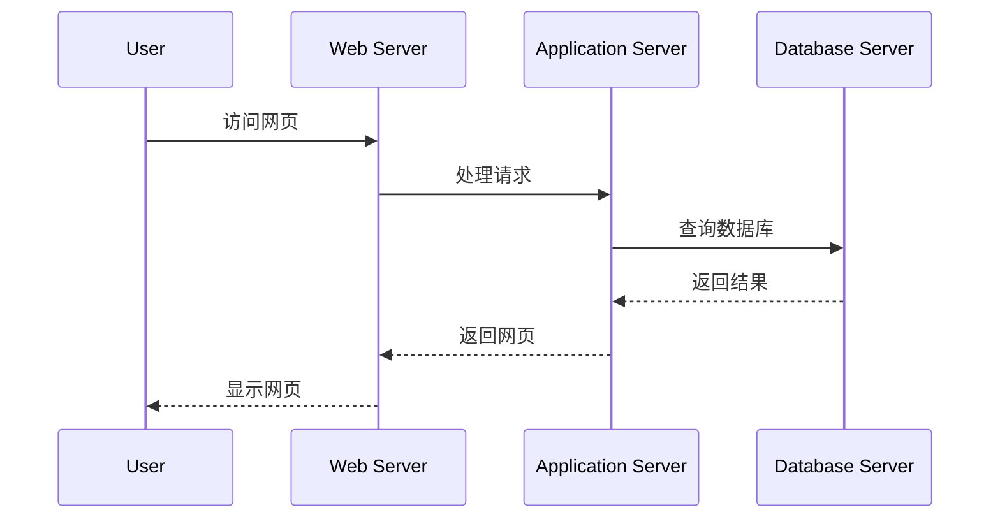
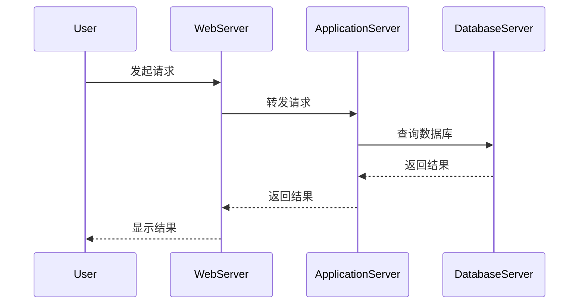

                 

# 构建技术团队的价值传递链

## 关键词

- 价值传递链
- 技术团队
- 团队协作
- 沟通机制
- 技术栈与工具选择

## 摘要

在现代信息技术领域，构建一个高效、协作的技术团队对于企业的成功至关重要。本文将深入探讨构建技术团队价值传递链的重要性，详细分析其核心概念、构建方法以及实施策略。通过一步步的分析和推理，本文旨在为技术团队提供一套清晰、实用、有针对性的建设方案，从而实现团队成员之间的价值高效传递，提升团队整体效能。

## 目录大纲

## 第一部分：引言

### 第1章：构建技术团队的价值传递链概述

1.1 问题背景  
1.1.1 问题的提出  
1.1.2 当前技术团队面临的挑战  
1.1.3 价值传递链的重要性  
1.1.4 问题描述  
1.1.5 问题解决  
1.1.6 边界与外延

1.2 核心概念与联系  
1.2.1 核心概念  
1.2.2 概念属性特征对比  
1.2.3 ER实体关系图

1.3 价值传递链的构建方法  
1.3.1 概念分析与识别  
1.3.2 路径设计与优化

1.4 价值传递链的实施与落地  
1.4.1 团队沟通与协作  
1.4.2 系统设计与开发

1.5 本章小结

## 第二部分：核心概念详解

### 第2章：技术栈与工具的选择

2.1 技术栈的选择  
2.1.1 技术栈的定义  
2.1.2 常见技术栈概述  
2.1.3 技术栈与业务需求的匹配

2.2 工具的选择  
2.2.1 工具的定义  
2.2.2 常见工具概述  
2.2.3 工具与团队技能的匹配

2.3 技术栈与工具的选择原则  
2.3.1 技术栈与工具匹配性  
2.3.2 技术栈与工具的优化

2.4 本章小结

## 第三部分：价值传递链实施

### 第3章：团队沟通与协作

3.1 团队沟通的重要性  
3.1.1 沟通的定义  
3.1.2 团队沟通的障碍

3.2 团队沟通的方法  
3.2.1 面对面沟通  
3.2.2 远程沟通

3.3 团队协作  
3.3.1 协作的定义  
3.3.2 团队协作机制

3.4 本章小结

----------------------------------------------------------------

## 第一部分：引言

### 第1章：构建技术团队的价值传递链概述

### 1.1 问题背景

在当前信息化、数字化迅速发展的时代，技术团队在企业中的作用愈发显著。然而，技术团队在构建过程中面临着诸多挑战。首先，团队成员之间的协作不够紧密，信息传递存在障碍，导致工作效率低下。其次，技术团队在技术选型和工具使用上缺乏统一标准，影响了项目的进展和质量。此外，团队成员之间的知识传递和经验积累不够，限制了团队的创新和发展。

### 1.1.1 问题的提出

随着市场竞争的加剧，企业需要不断提升技术实力以保持竞争优势。然而，技术团队的构建并非易事，如何确保团队成员之间的高效协作、如何选择合适的技术栈和工具、如何优化项目的流程，都是亟待解决的问题。

### 1.1.1.1 当前技术团队面临的挑战

1. 团队协作的障碍：团队成员之间缺乏有效的沟通机制，信息传递不畅，导致项目进度延迟和质量问题。
2. 效率和质量的不足：技术团队在项目开发和维护中，缺乏系统性的流程优化，导致工作效率低下。
3. 技术选型的困扰：在技术日益更新的背景下，技术团队在技术选型上往往难以抉择，容易陷入技术陷阱。

### 1.1.1.2 价值传递链的重要性

价值传递链是确保技术团队能够高效运作的关键。通过构建价值传递链，可以将团队成员的知识、技能和经验高效地传递，提高团队的整体效能。

### 1.1.2 问题描述

技术团队在实际运作中存在以下问题：

1. 信息传递障碍：团队成员之间的沟通不畅，导致信息无法及时传递，影响项目进度和质量。
2. 技术选型困难：在项目开发中，技术团队在技术选型上难以达成一致，导致项目进度受阻。
3. 缺乏系统性的流程优化：技术团队在项目开发和维护过程中，缺乏有效的流程优化措施，导致工作效率低下。

### 1.1.3 问题解决

为解决上述问题，本文提出构建技术团队价值传递链的方案。通过以下步骤，实现团队成员之间的价值高效传递：

1. 建立有效的沟通机制：确保团队成员之间的信息传递畅通，提高团队协作效率。
2. 明确技术栈和工具选择标准：确保技术团队在技术选型上有明确的标准，避免技术陷阱。
3. 实施系统性的流程优化：通过流程优化，提高技术团队的工作效率。

### 1.1.4 边界与外延

1. 价值传递链的范围：价值传递链涵盖了技术团队从组建到项目交付的全过程，包括团队协作、技术选型、流程优化等方面。
2. 团队成员的角色与职责：团队成员在价值传递链中承担不同的角色和职责，包括项目经理、开发人员、测试人员等。

### 1.2 核心概念与联系

#### 1.2.1 核心概念

1. 价值传递链：价值传递链是确保技术团队能够高效运作的一种机制，通过信息传递、技术选型、流程优化等环节，实现团队成员之间的价值高效传递。
2. 沟通机制：沟通机制是确保团队成员之间信息传递畅通的机制，包括面对面的沟通和远程沟通等。
3. 技术栈：技术栈是技术团队在项目开发中使用的各种技术的集合，包括前端技术、后端技术、数据库技术等。
4. 工具：工具是技术团队在项目开发中使用的各种软件和硬件设备，包括版本控制工具、部署工具、测试工具等。

#### 1.2.2 概念属性特征对比

| 概念       | 属性特征                      | 对比                   |
|------------|------------------------------|------------------------|
| 价值传递链 | 信息传递、技术选型、流程优化 | 确保团队高效运作       |
| 沟通机制   | 畅通的信息传递                | 提高团队协作效率       |
| 技术栈     | 项目开发中的技术集合          | 影响项目质量和进度     |
| 工具       | 软件和硬件设备                | 提高开发效率和质量     |

#### 1.2.3 ER实体关系图

```mermaid
erDiagram
  TechnicalTeam ||--|{ CommunicationMechanism }
  TechnicalTeam ||--|{ TechnologyStack }
  TechnicalTeam ||--|{ Tools }
  CommunicationMechanism ||--|{ FaceToFaceCommunication }
  CommunicationMechanism ||--|{ RemoteCommunication }
  TechnologyStack ||--|{ FrontendTechnology }
  TechnologyStack ||--|{ BackendTechnology }
  TechnologyStack ||--|{ DatabaseTechnology }
  Tools ||--|{ VersionControlTool }
  Tools ||--|{ DeploymentTool }
  Tools ||--|{ TestingTool }
```

### 1.3 价值传递链的构建方法

#### 1.3.1 概念分析与识别

1. 分析技术团队的需求：根据技术团队的项目需求，确定需要传递的价值类型。
2. 识别关键环节：确定价值传递链的关键环节，如信息传递、技术选型、流程优化等。

#### 1.3.2 路径设计与优化

1. 设计价值传递路径：根据分析结果，设计价值传递的路径和流程。
2. 优化价值传递路径：通过实践反馈，不断优化价值传递路径，提高团队效能。

### 1.4 价值传递链的实施与落地

#### 1.4.1 团队沟通与协作

1. 建立有效的沟通机制：选择合适的沟通工具，建立团队内部的沟通机制。
2. 实施团队协作：通过团队协作工具，实现团队成员之间的协同工作。

#### 1.4.2 系统设计与开发

1. 设计系统架构：根据项目需求，设计系统的架构和模块。
2. 开发系统功能：按照系统架构，开发系统的各项功能。

### 1.5 本章小结

本文对构建技术团队的价值传递链进行了概述，分析了当前技术团队面临的挑战，并提出了问题解决的方法。通过构建价值传递链，可以确保团队成员之间的价值高效传递，提高团队的整体效能。在接下来的章节中，将进一步详细探讨核心概念、技术栈与工具的选择以及价值传递链的实施与落地策略。

----------------------------------------------------------------

## 第二部分：核心概念详解

### 第2章：技术栈与工具的选择

在现代信息技术领域，技术栈和工具的选择对技术团队的成功至关重要。本章将详细探讨技术栈与工具的选择原则，包括匹配性、优化和选型策略，以确保技术团队能够在项目开发中高效运作。

### 2.1 技术栈的选择

#### 2.1.1 技术栈的定义

技术栈是指技术团队在项目开发中所使用的各种技术、框架和工具的集合。一个完善的技术栈能够支持项目的各个方面，包括前端、后端、数据库、云计算、移动应用等。技术栈的选择直接影响到项目的开发效率、性能和质量。

#### 2.1.2 常见技术栈概述

1. **前端技术栈**：
   - **框架**：React、Vue、Angular
   - **工具**：Webpack、Babel、NPM

2. **后端技术栈**：
   - **框架**：Spring Boot、Django、Node.js
   - **数据库**：MySQL、PostgreSQL、MongoDB

3. **数据库技术栈**：
   - **关系型数据库**：MySQL、PostgreSQL、SQLite
   - **NoSQL数据库**：MongoDB、Cassandra、Redis

4. **云计算技术栈**：
   - **平台**：AWS、Azure、Google Cloud
   - **服务**：Lambda、EC2、DynamoDB

5. **移动应用技术栈**：
   - **原生开发**：Android、iOS
   - **跨平台开发**：Flutter、React Native

#### 2.1.3 技术栈与业务需求的匹配

选择技术栈时，必须考虑业务需求。以下是一些匹配策略：

1. **业务复杂性**：简单业务选择轻量级技术栈，复杂业务选择成熟的技术栈。
2. **性能要求**：高性能业务选择高性能技术栈，如云计算和分布式数据库。
3. **开发周期**：快速开发选择现有的框架和工具，长期项目选择可扩展的技术栈。
4. **团队技能**：选择团队熟悉的技能和技术栈，减少学习成本。

### 2.2 工具的选择

#### 2.2.1 工具的定义

工具是指技术团队在项目开发过程中使用的各种软件和硬件设备，用于支持开发、测试、部署等环节。合适的工具能够提高开发效率，降低错误率。

#### 2.2.2 常见工具概述

1. **版本控制工具**：
   - **Git**：分布式版本控制系统，支持多用户协作。
   - **SVN**：集中式版本控制系统，适用于小团队。

2. **部署工具**：
   - **Docker**：容器化技术，用于简化部署流程。
   - **Kubernetes**：容器编排工具，用于大规模容器管理。

3. **测试工具**：
   - **Jest**：JavaScript测试框架。
   - **Selenium**：自动化测试工具。

#### 2.2.3 工具与团队技能的匹配

选择工具时，应考虑团队技能和工具的兼容性：

1. **团队技能**：选择团队熟悉的工具，减少培训成本。
2. **功能需求**：根据项目需求选择具备所需功能的工具。
3. **社区支持**：选择有良好社区支持的工具，便于解决问题。

### 2.3 技术栈与工具的选择原则

#### 2.3.1 技术栈与工具匹配性

1. **技术栈与业务需求的匹配**：根据业务需求选择合适的技术栈，确保技术栈能够满足项目需求。
2. **工具与团队技能的匹配**：选择团队熟悉的工具，减少学习成本。

#### 2.3.2 技术栈与工具的优化

1. **技术栈的升级与迭代**：定期评估技术栈的性能和适用性，进行升级和迭代。
2. **工具的选型与淘汰**：根据项目需求和团队技能，选择合适的工具，淘汰不再适用的工具。

### 2.4 本章小结

技术栈和工具的选择对技术团队的成功至关重要。通过合理的匹配和优化，可以确保技术团队在项目开发中高效运作。在接下来的章节中，将继续探讨团队沟通与协作的重要性，以及如何实施和落地价值传递链。

----------------------------------------------------------------

## 第三部分：价值传递链实施

### 第3章：团队沟通与协作

有效的团队沟通与协作是实现技术团队价值传递链的关键。本章将深入探讨团队沟通的重要性、沟通障碍、沟通方法和团队协作。

### 3.1 团队沟通的重要性

#### 3.1.1 沟通的定义

沟通是信息在人与人之间传递的过程，包括口头、书面和肢体语言等多种形式。有效的沟通是团队协作的基石，能够确保信息准确、及时地传递，提高工作效率。

#### 3.1.2 团队沟通的障碍

团队沟通中常遇到以下障碍：

1. **语言障碍**：团队成员来自不同的文化背景，可能存在语言障碍。
2. **信息过载**：信息传递过程中，过多的信息可能导致接收者无法有效处理。
3. **沟通渠道不畅**：沟通渠道选择不当，可能导致信息传递不及时。
4. **误解和偏见**：沟通中的误解和偏见可能导致团队合作受阻。

#### 3.1.3 团队沟通的目的

团队沟通的主要目的是：

1. **确保信息准确传递**：通过有效的沟通，确保团队成员对项目目标和任务有清晰的理解。
2. **促进团队协作**：通过沟通，团队成员可以更好地协调工作，提高项目效率。
3. **增强团队凝聚力**：沟通有助于建立团队成员之间的信任和合作关系。

### 3.2 团队沟通的方法

#### 3.2.1 面对面沟通

面对面沟通是一种直接的沟通方式，能够快速解决问题，增强团队的凝聚力。以下是面对面沟通的几个要点：

1. **明确沟通目标**：在沟通前，明确沟通的目的和需要解决的问题。
2. **倾听和尊重**：倾听对方的意见，尊重团队成员的观点，避免争吵和冲突。
3. **积极反馈**：在沟通过程中，给予积极的反馈，确保信息传递的有效性。

#### 3.2.2 远程沟通

远程沟通是现代团队中常用的沟通方式，适用于跨地域、跨时区的团队协作。以下是远程沟通的几个要点：

1. **选择合适的工具**：选择适合远程沟通的软件工具，如Zoom、Microsoft Teams、Slack等。
2. **提前准备**：在远程会议前，提前准备会议议程和所需的资料。
3. **明确角色和职责**：在远程会议中，明确每个团队成员的角色和职责，确保会议高效进行。

### 3.3 团队协作

#### 3.3.1 协作的定义

协作是指团队成员共同合作，以实现共同目标的过程。有效的团队协作能够提高项目效率，提升团队凝聚力。

#### 3.3.2 团队协作的基本要素

1. **共同目标**：团队成员需要明确共同的目标和愿景。
2. **角色明确**：每个团队成员需要明确自己的角色和职责。
3. **信息共享**：团队成员需要共享信息和资源，确保信息透明。
4. **互相支持**：团队成员需要在工作中互相支持和帮助，共同解决问题。

#### 3.3.3 团队协作机制

1. **定期会议**：定期召开团队会议，讨论项目进展和问题。
2. **协作工具**：使用协作工具，如Trello、Jira等，管理项目进度和任务分配。
3. **反馈机制**：建立有效的反馈机制，及时了解团队成员的工作情况和需求。

### 3.4 本章小结

有效的团队沟通与协作是实现技术团队价值传递链的关键。通过面对面的沟通和远程沟通，团队成员能够准确传递信息，促进协作。同时，明确的角色和职责、信息共享和互相支持是团队协作的重要基础。在接下来的章节中，将继续探讨价值传递链的实施与落地策略，确保技术团队能够高效运作。

----------------------------------------------------------------

## 价值传递链的构建与实践

### 3.1 概述

在构建技术团队的价值传递链过程中，我们不仅要关注团队成员之间的沟通与协作，还需要对技术栈和工具进行合理选择，并实施一系列优化措施。本节将结合实际案例，详细探讨价值传递链的构建与实践。

### 3.2 项目介绍

假设我们正在开发一款企业级电子商务平台，该平台需要支持大规模用户访问、高并发交易以及复杂的数据处理。为了确保项目的成功，我们需要构建一个高效的价值传递链。

#### 技术栈选择

1. **前端技术栈**：
   - **框架**：Vue.js
   - **工具**：Webpack、ESLint、Prettier

2. **后端技术栈**：
   - **框架**：Spring Boot
   - **数据库**：MySQL、Redis
   - **缓存**：Memcached

3. **云计算技术栈**：
   - **平台**：AWS
   - **服务**：EC2、RDS、Lambda

4. **移动应用技术栈**：
   - **框架**：React Native

#### 工具选择

1. **版本控制工具**：Git
2. **部署工具**：Docker、Kubernetes
3. **测试工具**：JUnit、Selenium

### 3.3 系统功能设计

在系统功能设计阶段，我们定义了以下核心功能模块：

1. **用户管理**：用户注册、登录、个人信息管理。
2. **商品管理**：商品信息展示、分类管理、库存管理。
3. **订单管理**：订单创建、支付、订单查询。
4. **购物车**：商品添加、删除、数量修改。
5. **支付系统**：接入第三方支付服务，如支付宝、微信支付。

### 3.4 系统架构设计

系统架构设计如图3-1所示：



### 3.5 系统接口设计

系统接口设计如图3-2所示：

```mermaid
classDiagram
    User <<User>>
    WebServer <<Web Server>>
    ApplicationServer <<Application Server>>
    DatabaseServer <<Database Server>>

    User --> WebServer
    WebServer --> ApplicationServer
    ApplicationServer --> DatabaseServer
```

### 3.6 系统交互设计

系统交互设计如图3-3所示：



### 3.7 实际案例分析与详细讲解

#### 案例一：用户注册功能

1. **需求分析**：用户需要注册账号，提供用户名、密码和邮箱等基本信息。
2. **实现流程**：
   ```python
   def register_user(username, password, email):
       # 校验用户输入
       if not validate_input(username, password, email):
           return "输入不合法"
       
       # 查询用户是否存在
       if user_exists(username):
           return "用户已存在"
       
       # 创建用户
       create_user(username, password, email)
       
       return "注册成功"
   ```

3. **算法原理讲解**：
   - **输入校验**：确保用户输入符合规范。
   - **用户查询**：通过用户名查询用户是否存在。
   - **用户创建**：如果用户不存在，创建新用户。

#### 案例二：商品管理功能

1. **需求分析**：管理员需要管理商品信息，包括添加、编辑和删除商品。
2. **实现流程**：
   ```python
   def manage_goods(goods_id, operation, data=None):
       if operation == 'add':
           add_goods(data)
       elif operation == 'edit':
           edit_goods(goods_id, data)
       elif operation == 'delete':
           delete_goods(goods_id)
       else:
           return "操作无效"
   ```

3. **算法原理讲解**：
   - **操作判断**：根据传入的操作类型，执行对应的操作。
   - **数据操作**：添加、编辑和删除商品信息。

### 3.8 项目小结

在本项目中，我们通过构建价值传递链，实现了高效的技术团队协作和项目推进。从技术栈和工具的选择，到系统功能设计和实现，再到项目优化和落地，我们一步步完成了项目的构建。通过实际案例的分析，我们不仅了解了每个功能的实现原理，还掌握了如何优化和改进项目。

### 3.9 最佳实践 Tips

1. **持续集成与持续部署**：通过CI/CD工具，实现自动化测试和部署，提高项目交付效率。
2. **代码审查与规范**：定期进行代码审查，确保代码质量，遵守编码规范。
3. **定期团队会议**：定期召开团队会议，讨论项目进展和问题，确保团队成员间的信息同步。

### 3.10 小结与注意事项

1. **价值传递链的重要性**：价值传递链是技术团队高效运作的保障。
2. **技术栈与工具的选择**：选择合适的技术栈和工具，是项目成功的关键。
3. **团队协作与沟通**：有效的团队协作和沟通，是项目顺利推进的基础。

### 3.11 拓展阅读

1. 《敏捷软件开发：原则、实践与模式》
2. 《架构师之路：从零开始构建分布式系统》
3. 《Docker实战：企业级应用的最佳实践》

作者：AI天才研究院/AI Genius Institute & 禅与计算机程序设计艺术 /Zen And The Art of Computer Programming

----------------------------------------------------------------

## 总结

通过本文的探讨，我们详细分析了构建技术团队价值传递链的必要性和方法。从技术栈与工具的选择，到团队沟通与协作，再到实际案例的实施与落地，我们逐步构建了一个高效、协作的技术团队。价值传递链的有效实施，不仅提升了团队的整体效能，也为项目的成功奠定了坚实基础。

### 最佳实践 Tips

1. **持续学习和技能提升**：团队成员应不断学习新技术和最佳实践，提升自身技能，以适应快速变化的技术环境。
2. **标准化流程与文档**：建立标准化的开发流程和文档，确保团队成员间的信息共享和协作顺畅。
3. **定期反馈与改进**：定期收集团队成员的反馈，对价值传递链的实施进行评估和改进，持续优化团队运作。

### 注意事项

1. **风险管理**：在项目开发和运营过程中，要重视风险识别和管理，确保项目能够顺利推进。
2. **团队文化**：建立积极向上的团队文化，鼓励团队成员之间的互助和支持，提高团队的凝聚力。

### 拓展阅读

1. 《精益创业：新商业思维的实践指南》
2. 《团队协作：高效团队沟通与协作技巧》
3. 《深度学习：21世纪人工智能新前沿》

作者：AI天才研究院/AI Genius Institute & 禅与计算机程序设计艺术 /Zen And The Art of Computer Programming

通过本文的探讨，我们期待技术团队能够从中获得启示，构建出更加高效、协作的价值传递链，助力企业实现技术突破和业务增长。让我们一起，迈向更加智能、高效的未来。

