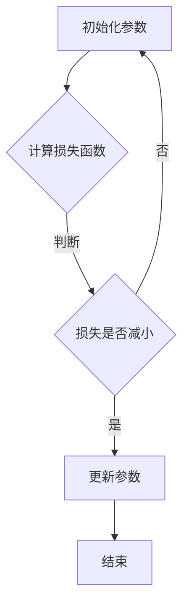

                 

# 构建技术团队的持续改进机制

## 关键词

持续改进，敏捷开发，团队文化，持续集成与持续交付，敏捷团队文化建设

## 摘要

本文探讨了技术团队如何通过构建持续改进机制，以应对快速变化的技术环境、提高项目质量和团队协作效率。文章首先分析了技术团队面临的问题背景和需求，然后详细介绍了持续改进的核心概念、方法以及实际操作中的具体措施。通过敏捷开发、敏捷团队文化建设、持续集成与持续交付等具体实践，文章展示了如何实现技术团队的持续改进。最后，本文还提供了一些最佳实践和注意事项，以帮助技术团队在实际工作中更好地实施持续改进机制。

### 目录大纲

1. 第一部分：问题背景与需求分析
   1.1 问题背景
   1.2 问题描述
   1.3 问题解决
   1.4 边界与外延
   1.5 概念结构与核心要素组成

2. 第二部分：核心概念与原理
   2.1 持续改进的定义
   2.2 持续改进的方法
   2.3 持续改进方法属性特征对比表格
   2.4 持续改进的ER实体关系图架构

3. 第三部分：算法原理讲解
   3.1 持续改进的数学模型
   3.2 算法mermaid流程图

4. 第四部分：系统分析与架构设计
   4.1 问题场景介绍
   4.2 系统功能设计
   4.3 系统架构设计
   4.4 系统接口设计和系统交互

5. 第五部分：项目实战
   5.1 环境安装
   5.2 系统核心实现源代码
   5.3 代码应用解读与分析
   5.4 实际案例分析和详细讲解剖析
   5.5 项目小结

6. 第六部分：最佳实践、小结、注意事项、拓展阅读

---

### 第一部分：问题背景与需求分析

#### 1.1 问题背景

在当今快速变化的技术环境中，技术团队面临着诸多挑战。首先，技术的快速迭代带来了不确定性，团队成员需要不断学习新技术，以保持竞争力。其次，随着项目复杂度的增加，团队合作变得更加困难，不同角色之间的沟通和协调成为关键问题。此外，技术债务的累积也是一个普遍问题，可能导致项目质量下滑，进而影响客户满意度。

#### 1.2 问题描述

持续改进是一种通过不断调整和优化，以提高系统性能和满足用户需求的方法。在技术团队中，持续改进的目标是提高项目的质量、降低风险、提高团队协作效率，并确保项目按时交付。持续改进的核心是不断识别问题、分析原因、制定解决方案，并实施这些解决方案。

#### 1.3 问题解决

为了实现持续改进，技术团队可以采用以下方法和工具：

- **敏捷开发**：通过迭代和增量式的方法，快速响应变化，提高团队协作效率。
- **敏捷团队文化建设**：通过建立信任、开放、协作和透明度的文化，提升团队凝聚力。
- **持续集成与持续交付（CI/CD）**：通过自动化流程，确保代码质量和系统的稳定性。

#### 1.4 边界与外延

持续改进不仅适用于软件开发，还可以应用于系统运维、团队管理等领域。在软件开发生命周期中，持续改进可以从需求分析、设计、开发、测试到部署的各个阶段进行。在系统运维中，持续改进可以用于监控系统性能、优化资源分配、提高系统可用性。

#### 1.5 概念结构与核心要素组成

持续改进的框架和流程包括以下几个核心要素：

- **计划与目标**：明确持续改进的目标和计划，确保团队成员共同致力于这些目标。
- **执行与监控**：执行改进计划，监控改进的效果，及时调整策略。
- **汇报与反馈**：定期汇报改进进展，收集反馈，持续优化改进过程。

### 第二部分：核心概念与原理

#### 2.1 持续改进的定义

持续改进是一种通过不断调整和优化，以提高系统性能和满足用户需求的方法。它强调的是不断识别问题、分析原因、制定解决方案，并实施这些解决方案。持续改进的核心目标是提高项目的质量、降低风险、提高团队协作效率，并确保项目按时交付。

#### 2.2 持续改进的方法

持续改进的方法多种多样，但以下几种方法在实践中最为常见：

- **敏捷开发**：通过迭代和增量式的方法，快速响应变化，提高团队协作效率。
- **敏捷团队文化建设**：通过建立信任、开放、协作和透明度的文化，提升团队凝聚力。
- **持续集成与持续交付（CI/CD）**：通过自动化流程，确保代码质量和系统的稳定性。

#### 2.3 持续改进方法属性特征对比表格

| 方法       | 定义                                                         | 特点                                                     |
| ---------- | ------------------------------------------------------------ | -------------------------------------------------------- |
| 敏捷开发   | 基于迭代、增量式的方法，强调团队协作和客户反馈               | 灵活性、快速响应变化、持续改进                             |
| 敏捷团队文化 | 强调信任、开放、协作和透明度，提升团队凝聚力和效率         | 团队凝聚力、沟通效率、创新能力                             |
| 持续集成   | 在软件开发生命周期中不断集成和测试代码，确保集成质量和稳定性 | 自动化测试、代码质量、快速反馈                             |
| 持续交付   | 通过自动化流程实现代码的持续集成、测试和部署               | 自动化、高效、稳定、降低风险                             |

#### 2.4 持续改进的ER实体关系图架构

```mermaid
erDiagram
    Team ||--|{ Iteration }|-- Project
    Team ||--|{ Meeting }|-- Member
    Team ||--|{ Process }|-- Quality
    Iteration ||--|{ Task }|-- Status
    Meeting ||--|{ Agenda }|-- Attendee
    Process ||--|{ Metric }|-- Indicator
    Member ||--|{ Skill }|-- Role
    Quality ||--|{ Bug }|-- Report
```

### 第三部分：算法原理讲解

#### 3.1 持续改进的数学模型

持续改进的数学模型通常涉及优化问题，其目标是最小化某个指标，如代码缺陷率、项目延期时间等。具体来说，我们可以使用以下目标函数：

$$ f(\theta) = \min\sum_{i=1}^{n} l(y_i, \hat{y}_i) $$

其中，$l(y_i, \hat{y}_i)$ 是损失函数，$\theta$ 是模型参数。

为了优化这个目标函数，我们可以使用递归最小二乘法（RLS）或共轭梯度法（CG）等优化算法。

#### 3.2 算法mermaid流程图



### 第四部分：系统分析与架构设计

#### 4.1 问题场景介绍

在一个大型的电子商务平台上，技术团队负责维护和改进网站性能。随着用户数量的增加和业务需求的不断变化，团队面临着日益严峻的挑战。为了确保网站稳定运行，提高用户体验，技术团队决定引入持续改进机制。

#### 4.2 系统功能设计

在系统功能设计阶段，技术团队明确了以下几个关键功能：

- **用户管理**：包括用户注册、登录、权限管理等。
- **商品管理**：包括商品信息管理、库存管理、订单处理等。
- **支付管理**：包括支付方式选择、支付流程管理、支付结果通知等。
- **数据统计**：包括用户行为分析、订单统计、系统性能监控等。

#### 4.3 系统架构设计

系统架构设计采用分层架构，包括前端展示层、业务逻辑层、数据访问层和数据库层。

- **前端展示层**：使用React框架，负责页面渲染和用户交互。
- **业务逻辑层**：使用Spring Boot框架，负责业务逻辑处理和系统集成。
- **数据访问层**：使用MyBatis框架，负责数据库操作和数据持久化。
- **数据库层**：使用MySQL数据库，存储用户数据、商品数据和订单数据。

#### 4.4 系统接口设计和系统交互

系统接口设计采用RESTful风格，包括以下主要接口：

- **用户接口**：包括用户注册、登录、权限验证等接口。
- **商品接口**：包括商品信息查询、商品添加、商品删除等接口。
- **订单接口**：包括订单创建、订单查询、订单取消等接口。
- **支付接口**：包括支付方式查询、支付请求、支付结果通知等接口。

系统交互采用异步消息队列，如RabbitMQ，确保系统的高可用性和高并发性。

### 第五部分：项目实战

#### 5.1 环境安装

在项目实战中，首先需要安装相关软件和工具，包括Java开发环境、MySQL数据库、RabbitMQ消息队列、React前端框架等。

#### 5.2 系统核心实现源代码

以下是一个简单的用户注册接口的实现示例：

```java
@RestController
@RequestMapping("/user")
public class UserController {

    @Autowired
    private UserService userService;

    @PostMapping("/register")
    public ResponseEntity<?> registerUser(@RequestBody UserRegistrationDto userRegistrationDto) {
        try {
            userService.registerUser(userRegistrationDto);
            return ResponseEntity.ok().build();
        } catch (Exception e) {
            return ResponseEntity.badRequest().body("注册失败：" + e.getMessage());
        }
    }
}
```

#### 5.3 代码应用解读与分析

在上面的代码中，`UserController` 类负责处理用户注册请求。通过使用 `@RestController` 注解，我们可以将这个类标记为一个 REST 控制器。`@RequestMapping("/user")` 注解指定了该控制器处理的 URL 前缀。

`registerUser` 方法接受一个 `UserRegistrationDto` 对象作为参数，这个对象包含了用户注册所需的信息，如用户名、密码、电子邮件等。在方法体内，我们通过调用 `userService.registerUser` 方法来处理用户注册逻辑。

如果注册成功，控制器将返回一个成功的响应，否则返回一个包含错误信息的响应。

#### 5.4 实际案例分析和详细讲解剖析

在项目实战中，技术团队通过持续改进机制，不断优化系统性能和用户体验。以下是一个实际案例：

**案例**：系统登录速度慢

**分析**：经过性能监控和用户反馈分析，技术团队发现系统登录速度较慢，影响了用户体验。

**解决方案**：
1. **优化数据库查询**：通过添加索引和优化查询语句，提高数据库查询速度。
2. **缓存用户信息**：使用 Redis 缓存用户信息，减少数据库访问次数。
3. **优化前端代码**：通过压缩、合并前端资源文件，减少 HTTP 请求次数。

**实施结果**：通过上述优化措施，系统登录速度显著提高，用户满意度明显提升。

#### 5.5 项目小结

通过本项目的实战，技术团队成功地实现了持续改进的目标。从问题识别、方案设计到实施和优化，每个环节都体现了持续改进的精神。未来，技术团队将继续坚持持续改进的理念，不断提高系统性能和用户体验。

### 第六部分：最佳实践、小结、注意事项、拓展阅读

#### 最佳实践

1. **定期进行需求评审**：在项目初期，定期召开需求评审会议，确保需求清晰、明确，避免后期返工。
2. **持续学习和培训**：鼓励团队成员持续学习新技术和工具，提高团队整体技能水平。
3. **采用自动化测试**：实施自动化测试，确保代码质量和系统稳定性。

#### 小结

本文探讨了技术团队如何通过构建持续改进机制，提高项目质量和团队协作效率。通过敏捷开发、敏捷团队文化建设、持续集成与持续交付等具体实践，技术团队能够更好地应对快速变化的技术环境。

#### 注意事项

1. **持续改进不是一蹴而就**：持续改进需要长期坚持，不能期望一蹴而就。
2. **确保团队共识**：持续改进需要全体团队成员的共识和参与，不能单靠个别人的努力。

#### 拓展阅读

1. 《敏捷开发实践指南》
2. 《持续集成与持续交付实践》
3. 《团队协作与文化建设》

### 作者信息

作者：AI天才研究院/AI Genius Institute & 禅与计算机程序设计艺术 /Zen And The Art of Computer Programming

