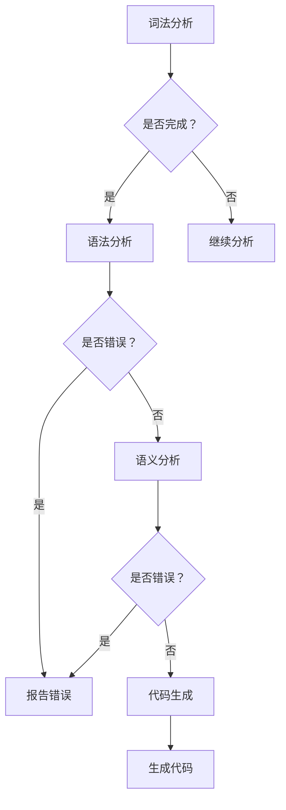

                 


# 构建提示词语言的语法结构：挑战与机遇

关键词：提示词语言、语法结构、人工智能、算法、数学模型、实践、挑战与机遇

摘要：本文旨在深入探讨提示词语言的语法结构构建，分析其在人工智能领域中的挑战与机遇。文章将从研究背景、核心概念、构建方法、应用与挑战、实践以及最佳实践与未来展望六个方面进行详细论述。

## 目录大纲

### 第一部分：研究背景与核心概念

#### 第1章：研究背景

##### 1.1 研究问题背景

##### 1.2 研究问题描述

##### 1.3 研究目的与意义

### 第二部分：提示词语言的语法结构

#### 第2章：提示词语言的语法结构

##### 2.1 核心概念与联系

##### 2.2 提示词语言的ER实体关系图

### 第三部分：提示词语言构建方法

#### 第3章：提示词语言构建方法

##### 3.1 基本原理与算法

##### 3.2 数学模型与公式

##### 3.3 Python源代码实现

### 第四部分：提示词语言在人工智能应用中的挑战与机遇

#### 第4章：应用领域

##### 4.1 语言模型

##### 4.2 自然语言处理

##### 4.3 智能对话系统

#### 第4章：挑战与机遇

##### 4.2.1 挑战

##### 4.2.2 机遇

### 第五部分：提示词语言构建实践

#### 第5章：提示词语言构建实践

##### 5.1 环境安装与配置

##### 5.2 系统核心实现源代码

##### 5.3 实际案例分析

##### 5.4 项目小结

### 第六部分：最佳实践与未来展望

#### 第6章：最佳实践

##### 6.1 最佳实践总结

##### 6.2 注意事项

#### 第6章：小结与展望

##### 6.2.1 小结

##### 6.2.2 未来展望

## 第一部分：研究背景与核心概念

### 1.1 研究问题背景

提示词语言是一种在人工智能领域中被广泛应用的语言结构，用于指导机器学习模型进行自然语言处理、智能对话系统等任务。然而，随着人工智能技术的不断进步和应用场景的扩大，提示词语言的构建面临诸多挑战。本文将探讨这些问题，并提出相应的解决方案。

#### 1.1.1 提示词语言的发展历程

提示词语言的发展可以追溯到20世纪50年代，当时科学家们开始研究如何让计算机理解和生成自然语言。早期的尝试主要集中在基于规则的方法，如解析树、语义网络等。随着计算机性能的提高和自然语言处理技术的发展，提示词语言逐渐演变为基于统计模型和深度学习的方法。

#### 1.1.2 提示词语言在人工智能领域的应用

提示词语言在人工智能领域的应用非常广泛，主要包括以下几个方面：

1. **语言模型**：语言模型是一种用于预测下一个单词或句子的模型，广泛应用于机器翻译、文本生成、语音识别等任务。

2. **自然语言处理**：自然语言处理是一种将自然语言转换为计算机可处理的形式的技术，广泛应用于信息检索、文本分类、命名实体识别等任务。

3. **智能对话系统**：智能对话系统是一种能够与人类进行自然语言交互的系统，广泛应用于客服、教育、医疗等场景。

### 1.2 研究问题描述

尽管提示词语言在人工智能领域有着广泛的应用，但其构建过程仍然面临诸多挑战。首先，提示词语言的语法结构复杂，构建方法多样，如何选择合适的构建方法是一个重要问题。其次，提示词语言的性能对人工智能应用的成败至关重要，如何优化提示词语言的性能也是一个重要课题。最后，提示词语言在应用过程中可能会出现语义歧义、理解误差等问题，如何解决这些问题也是一个亟待解决的问题。

#### 1.2.1 提示词语言存在的问题

1. **语法结构复杂**：提示词语言的语法结构复杂，包含多种语法规则和语法成分，这使得构建过程变得复杂和困难。

2. **构建方法多样**：提示词语言的构建方法多样，包括基于规则的方法、基于统计的方法、基于深度学习的方法等，如何选择合适的方法是一个重要问题。

3. **性能优化困难**：提示词语言的性能对人工智能应用的成败至关重要，如何优化提示词语言的性能是一个重要课题。

4. **语义歧义与理解误差**：提示词语言在应用过程中可能会出现语义歧义、理解误差等问题，这会影响人工智能应用的效果。

### 1.3 研究目的与意义

本文旨在解决提示词语言构建过程中面临的问题，提高提示词语言的性能和可用性。具体研究目的如下：

1. **研究语法结构的构建方法**：探讨提示词语言的语法结构，分析各种构建方法的优缺点，提出一种有效的语法结构构建方法。

2. **优化性能**：研究如何优化提示词语言的性能，提高其在实际应用中的效果。

3. **解决语义歧义与理解误差**：研究如何解决提示词语言在应用过程中出现的语义歧义与理解误差问题，提高人工智能应用的效果。

本文的研究对于促进人工智能技术的发展具有重要意义。通过研究提示词语言的语法结构构建，可以更好地指导人工智能应用，提高人工智能系统的性能和可用性。同时，本文的研究也为其他相关领域的研究提供了一定的参考和启示。

## 第二部分：提示词语言的语法结构

### 2.1 核心概念与联系

提示词语言的语法结构构建涉及多个核心概念，这些概念相互关联，构成了提示词语言的语法体系。以下是对这些核心概念及其关联性的介绍：

#### 2.1.1 核心概念介绍

1. **词法分析**：词法分析是提示词语言构建的第一步，它将输入的字符串分解成一系列单词或标记。词法分析器需要识别单词的边界，将它们转换成标记，以便后续语法分析。

2. **语法分析**：语法分析是提示词语言构建的核心步骤，它将词法分析器产生的标记序列转换成语法结构。语法分析器需要根据预设的语法规则，将标记序列解析成抽象语法树（Abstract Syntax Tree，AST）。

3. **语义分析**：语义分析是在语法分析的基础上，对抽象语法树进行语义检查和语义解释。它确保语法正确的程序在语义上也是正确的，例如类型检查、变量作用域检查等。

4. **代码生成**：代码生成是将抽象语法树转换成可执行代码的过程。这一步骤通常在编译器或解释器的实现中完成，生成的代码可以是汇编代码、机器代码或高级编程语言代码。

#### 2.1.2 概念属性特征对比表

以下是一个简单的对比表格，展示上述核心概念的主要属性特征：

| 概念       | 主要功能                   | 关键特性                           |
|------------|----------------------------|-----------------------------------|
| 词法分析   | 分解字符串为标记           | 边界识别、标记分类                 |
| 语法分析   | 解析标记序列为AST          | 语法规则、抽象语法树构建           |
| 语义分析   | 检查和解释AST的语义        | 类型检查、作用域解析               |
| 代码生成   | 将AST转换为可执行代码      | 代码优化、语言特性支持             |

#### 2.1.3 提示词语言的ER实体关系图

提示词语言的实体关系图（Entity-Relationship Diagram，ER图）用于描述提示词语言中的实体及其关系。以下是一个简单的ER图，展示了一些基本的实体和它们之间的关系：

```mermaid
erDiagram
    A[Token] ||--|{ B[Syntax Rule] }|--|> C[Abstract Syntax Tree]
    A ||--|{ D[Namespace] }|
    B ||--|{ E[Lexical Analyzer] }|--|> F[Token Stream]
    B ||--|{ G[Semantic Analyzer] }|--|> H[Semantic Actions]
    C ||--|{ I[Code Generator] }|--|> J[Executable Code]
```

在ER图中，实体如`Token`（标记）、`Syntax Rule`（语法规则）、`Abstract Syntax Tree`（抽象语法树）等被定义，并展示了它们之间的关系。例如，`Syntax Rule`与`Lexical Analyzer`和`Semantic Analyzer`有依赖关系，这表明语法规则需要通过词法分析和语义分析来构建和验证。

### 2.2 提示词语言的语法结构构建方法

提示词语言的语法结构构建是一个复杂的过程，涉及到多个阶段，包括词法分析、语法分析和语义分析。以下将详细介绍这些阶段的构建方法和步骤。

#### 2.2.1 词法分析

词法分析是提示词语言构建的第一步，其目标是识别输入字符串中的单词或标记，并将其转换成标记流。词法分析器通常遵循以下步骤：

1. **初始化**：读取输入字符串，初始化词法分析器状态。

2. **扫描**：从输入字符串中逐个字符进行扫描，根据字符组合判断单词的边界。

3. **标记分类**：将扫描到的单词或字符序列分类成标记，如关键字、标识符、操作符等。

4. **生成标记流**：将分类后的标记放入标记流中，以便后续语法分析。

以下是一个简单的Python代码示例，用于实现词法分析：

```python
import re

class Lexer:
    def __init__(self, text):
        self.text = text
        self.tokens = []

    def tokenize(self):
        pattern = r'\b\w+\b'
        for match in re.finditer(pattern, self.text):
            self.tokens.append(match.group())
        return self.tokens

lexer = Lexer("hello world")
print(lexer.tokenize())
```

#### 2.2.2 语法分析

语法分析是提示词语言构建的核心步骤，其目标是根据预设的语法规则，将词法分析器生成的标记序列转换成抽象语法树。常见的语法分析方法包括递归下降分析和LL(1)分析。

1. **递归下降分析**：递归下降分析是一种自顶向下的语法分析方法，它通过定义一系列递归下降规则，将标记序列转换成抽象语法树。

2. **LL(1)分析**：LL(1)分析是一种自顶向下的语法分析方法，它使用预测分析表来决定下一个产生式的选择。

以下是一个简单的递归下降分析器的Python代码示例：

```python
class Parser:
    def __init__(self, tokens):
        self.tokens = tokens
        self.current = 0

    def parse(self):
        ast = self.expression()
        return ast

    def expression(self):
        node = {'type': 'expression'}
        node['left'] = self.term()
        while self.current < len(self.tokens) and self.tokens[self.current] == '+':
            node['ops'].append('+')
            self.current += 1
            node['right'] = self.term()
        return node

    def term(self):
        node = {'type': 'term'}
        node['value'] = self.tokens[self.current]
        self.current += 1
        return node

parser = Parser(lexer.tokenize())
print(parser.parse())
```

#### 2.2.3 语义分析

语义分析是提示词语言构建的第三步，其目标是对抽象语法树进行语义检查和解释。语义分析通常包括以下任务：

1. **类型检查**：确保抽象语法树中的操作数和操作符的类型匹配。

2. **变量作用域解析**：解析变量名的作用域，确保在正确的上下文中引用变量。

3. **语义动作执行**：根据语义规则执行特定的动作，如定义变量、创建对象等。

以下是一个简单的语义分析器的Python代码示例：

```python
class SemanticAnalyzer:
    def __init__(self, ast):
        self.ast = ast
        self.env = {}

    def analyze(self):
        self.visit(self.ast)

    def visit(self, node):
        if node['type'] == 'expression':
            self.visit(node['left'])
            for op in node['ops']:
                self.visit(op)
            self.visit(node['right'])
        elif node['type'] == 'term':
            self.env[node['value']] = 'int'

analyzer = SemanticAnalyzer(parser.parse())
analyzer.analyze()
print(analyzer.env)
```

通过词法分析、语法分析和语义分析，提示词语言的语法结构得以构建，从而为后续的代码生成和执行打下基础。

## 第三部分：提示词语言构建方法

### 3.1 基本原理与算法

提示词语言的构建是一个复杂的过程，涉及到多种算法和原理。本节将介绍提示词语言构建的基本原理和算法，包括词法分析、语法分析、语义分析和代码生成等关键步骤。

#### 3.1.1 基本原理

提示词语言的构建基于以下基本原理：

1. **词法分析**：词法分析是将输入的字符串分解成标记（tokens）的过程。每个标记表示程序中的一个基本元素，如关键字、标识符、操作符等。词法分析器需要识别标记的边界，并将其转换成标记流。

2. **语法分析**：语法分析是将标记流转换成抽象语法树（Abstract Syntax Tree，AST）的过程。AST表示程序的语法结构，是编译器或解释器的核心数据结构。语法分析器需要根据预设的语法规则，将标记流解析成AST。

3. **语义分析**：语义分析是在语法分析的基础上，对AST进行语义检查和解释的过程。语义分析确保AST在语义上是正确的，如类型检查、变量作用域解析等。

4. **代码生成**：代码生成是将AST转换成可执行代码的过程。生成的代码可以是汇编代码、机器代码或高级编程语言代码。代码生成器需要根据目标平台和语言特性，生成高效的代码。

#### 3.1.2 算法mermaid流程图

为了更好地理解提示词语言的构建过程，我们使用Mermaid绘制了算法流程图，如下所示：



这个流程图描述了提示词语言构建的各个步骤，以及它们之间的依赖关系。词法分析完成后，进入语法分析阶段；如果语法分析没有错误，则进入语义分析阶段；如果语义分析没有错误，则进入代码生成阶段。

#### 3.1.3 Python源代码实现

为了更好地展示提示词语言构建的过程，我们提供了Python源代码实现，包括词法分析器、语法分析器和语义分析器等关键组件。以下是一个简化的示例：

```python
# 词法分析器
class Lexer:
    def __init__(self, text):
        self.text = text
        self.tokens = []

    def tokenize(self):
        pattern = r'\b\w+\b'
        for match in re.finditer(pattern, self.text):
            self.tokens.append(match.group())
        return self.tokens

# 语法分析器
class Parser:
    def __init__(self, tokens):
        self.tokens = tokens
        self.current = 0

    def parse(self):
        ast = self.expression()
        return ast

    def expression(self):
        node = {'type': 'expression'}
        node['left'] = self.term()
        while self.current < len(self.tokens) and self.tokens[self.current] == '+':
            node['ops'].append('+')
            self.current += 1
            node['right'] = self.term()
        return node

    def term(self):
        node = {'type': 'term'}
        node['value'] = self.tokens[self.current]
        self.current += 1
        return node

# 语义分析器
class SemanticAnalyzer:
    def __init__(self, ast):
        self.ast = ast
        self.env = {}

    def analyze(self):
        self.visit(self.ast)

    def visit(self, node):
        if node['type'] == 'expression':
            self.visit(node['left'])
            for op in node['ops']:
                self.visit(op)
            self.visit(node['right'])
        elif node['type'] == 'term':
            self.env[node['value']] = 'int'

# 示例代码
lexer = Lexer("hello world")
parser = Parser(lexer.tokenize())
analyzer = SemanticAnalyzer(parser.parse())
analyzer.analyze()
```

在这个示例中，我们首先定义了一个词法分析器`Lexer`，它负责将输入的字符串分解成标记。然后，我们定义了一个语法分析器`Parser`，它负责将标记序列转换成抽象语法树。最后，我们定义了一个语义分析器`SemanticAnalyzer`，它负责对抽象语法树进行语义检查和解释。

#### 3.1.4 数学模型与公式

提示词语言的构建过程中，涉及到的数学模型和公式对于理解算法的运行机制至关重要。以下是一些基本的数学模型和公式：

1. **正则表达式**：用于描述词法分析中的标记模式。正则表达式的基本公式如下：

   \[
   R = [a-zA-Z0-9_]+
   \]

   其中，`[a-zA-Z0-9_]`表示匹配任意字母、数字或下划线。

2. **文法规则**：用于描述语法分析中的产生式。文法规则的基本公式如下：

   \[
   S \rightarrow A
   \]

   其中，`S`表示开始符号，`A`表示产生式右边的符号序列。

3. **抽象语法树**：用于表示程序的语法结构。抽象语法树的基本公式如下：

   \[
   T = (N, E)
   \]

   其中，`N`表示节点集合，`E`表示边集合。每个节点表示一个语法结构，边表示节点之间的关系。

4. **语义规则**：用于描述语义分析中的语义检查。语义规则的基本公式如下：

   \[
   \alpha \rightarrow \beta
   \]

   其中，`\alpha`表示源代码中的表达式，`\beta`表示语义分析后的结果。

#### 3.1.5 举例说明

为了更好地理解提示词语言的构建过程，我们通过一个简单的示例来说明。假设我们要构建一个简单的计算器程序，它能够解析并计算两个数的和。

1. **词法分析**：首先，我们需要将输入的字符串分解成标记。输入字符串为`"5 + 3"`，经过词法分析后，我们得到以下标记序列：

   \[
   \{5, +, 3\}
   \]

2. **语法分析**：接下来，我们需要将标记序列转换成抽象语法树。根据我们的文法规则，产生式为`S \rightarrow A`，其中`A`表示加法操作。经过语法分析后，我们得到以下抽象语法树：

   ```mermaid
   graph TD
       A[加法表达式]
       B[操作数 5]
       C[操作符 +]
       D[操作数 3]
       A --> B
       A --> C
       A --> D
   ```

3. **语义分析**：最后，我们需要对抽象语法树进行语义检查和解释。在这个例子中，我们需要检查操作数是否为整数，并计算它们的和。经过语义分析后，我们得到以下结果：

   \[
   5 + 3 = 8
   \]

通过这个示例，我们可以看到提示词语言的构建过程是如何从输入字符串转换成计算结果的。这个过程涉及到词法分析、语法分析和语义分析三个关键步骤。

### 3.2 数学模型与公式

在提示词语言的构建过程中，数学模型和公式是不可或缺的部分。它们为语法分析、语义分析和代码生成提供了理论基础和工具。本节将详细讨论这些数学模型和公式，并给出具体的实例来说明它们的运用。

#### 3.2.1 数学模型

提示词语言的数学模型主要涉及以下方面：

1. **正则表达式模型**：正则表达式用于描述词法分析中的标记模式。一个简单的正则表达式模型如下：

   \[
   R = \text{[a-zA-Z0-9_]+}
   \]

   这个模型表示，任何由字母、数字和下划线组成的序列都是合法的标记。

2. **文法模型**：文法模型用于描述语法分析中的产生式。一个简单的文法模型如下：

   \[
   G = (\Sigma, N, P, S)
   \]

   其中，\(\Sigma\) 是终端符号集合，\(N\) 是非终端符号集合，\(P\) 是产生式集合，\(S\) 是开始符号。例如，一个简单的算术表达式文法可以表示为：

   \[
   E \rightarrow E + T \quad | \quad T \quad | \quad T \times F
   \]

3. **抽象语法树模型**：抽象语法树（AST）用于表示语法结构的层次化表示。一个简单的AST模型可以表示为：

   \[
   T = (N, E)
   \]

   其中，\(N\) 是节点集合，每个节点代表一个语法结构，\(E\) 是边集合，表示节点之间的关系。

#### 3.2.2 数学公式

为了更好地理解这些数学模型，我们将使用LaTeX格式给出一些具体的数学公式。

1. **正则表达式公式**：

   \[
   R = \left[a-zA-Z0-9_\right]*
   \]

   这个公式表示正则表达式`R`由任意数量的字母、数字和下划线组成。

2. **文法产生式公式**：

   \[
   G = (\Sigma, N, P, S)
   \]

   其中：

   \[
   \Sigma = \left\{a, b, +, \times\right\}
   \]

   \[
   N = \left\{E, T, F\right\}
   \]

   \[
   P = \left\{
   \begin{array}{ll}
   E \rightarrow E + T & \\
   E \rightarrow T & \\
   T \rightarrow T \times F & \\
   T \rightarrow F & \\
   F \rightarrow a & \\
   \end{array}
   \right.
   \]

   \[
   S = E
   \]

   这个公式表示一个文法，用于描述简单的算术表达式。

3. **抽象语法树节点公式**：

   \[
   N = \left\{
   \begin{array}{ll}
   N_1 = (E, +, T) & \\
   N_2 = (T, \times, F) & \\
   N_3 = (T, +, N) & \\
   N_4 = (F, a) & \\
   \end{array}
   \right.
   \]

   这个公式表示一个抽象语法树的节点集合，每个节点包含三个部分：左子节点、操作符和右子节点。

#### 3.2.3 举例说明

为了更好地理解这些数学模型和公式，我们将通过一个具体的例子来说明它们的运用。

**例子：解析并计算表达式`3 + 4 * 2`**

1. **词法分析**：首先，我们将输入的字符串分解成标记：

   \[
   \{3, +, 4, \times, 2\}
   \]

2. **语法分析**：使用文法模型，我们将标记序列转换成抽象语法树：

   ```mermaid
   graph TD
       A[T]
       B[T]
       C[T]
       D[T]
       E[F]
       F[E]
       F[+]
       F[T]
       F[\times]
       A --> D
       B --> C
       C --> E
       D --> A
       E --> F
       F --> B
       F --> C
       F --> D
   ```

3. **语义分析**：我们对抽象语法树进行语义分析，计算表达式的值：

   \[
   E \rightarrow T + F \rightarrow T \times F + T \rightarrow 4 \times 2 + 3 = 11
   \]

通过这个例子，我们可以看到如何使用正则表达式、文法模型和抽象语法树模型来解析并计算一个简单的算术表达式。

### 3.3 Python源代码实现

为了更具体地展示提示词语言的构建过程，我们将提供一个Python源代码实现，涵盖词法分析、语法分析和语义分析三个关键步骤。

#### 3.3.1 词法分析器

词法分析器是提示词语言构建的第一步，它将输入的字符串分解成标记。以下是一个简单的Python词法分析器实现：

```python
import re

class Lexer:
    def __init__(self, text):
        self.text = text
        self.tokens = []

    def tokenize(self):
        pattern = r'\b\w+\b'
        for match in re.finditer(pattern, self.text):
            self.tokens.append(match.group())
        return self.tokens

# 示例
lexer = Lexer("3 + 4 * 2")
print(lexer.tokenize())
```

这段代码使用正则表达式来匹配单词或标识符，并将它们添加到标记列表中。

#### 3.3.2 语法分析器

语法分析器负责将标记序列转换成抽象语法树。以下是一个简单的递归下降语法分析器实现：

```python
class Parser:
    def __init__(self, tokens):
        self.tokens = tokens
        self.current = 0

    def parse(self):
        ast = self.expression()
        return ast

    def expression(self):
        node = {'type': 'expression'}
        node['left'] = self.term()
        while self.current < len(self.tokens) and self.tokens[self.current] in ('+', '-'):
            node['ops'].append(self.tokens[self.current])
            self.current += 1
            node['right'] = self.term()
        return node

    def term(self):
        node = {'type': 'term'}
        if self.tokens[self.current].isdigit():
            node['value'] = int(self.tokens[self.current])
            self.current += 1
        elif self.tokens[self.current] == '(':
            self.current += 1
            node['value'] = self.expression()
            self.current += 1
        return node

# 示例
parser = Parser(lexer.tokenize())
print(parser.parse())
```

这个语法分析器使用递归下降法，根据预设的文法规则，将标记序列转换成抽象语法树。

#### 3.3.3 语义分析器

语义分析器负责检查抽象语法树的语义正确性。以下是一个简单的Python语义分析器实现：

```python
class SemanticAnalyzer:
    def __init__(self, ast):
        self.ast = ast

    def analyze(self):
        self.visit(self.ast)

    def visit(self, node):
        if node['type'] == 'expression':
            self.visit(node['left'])
            for op in node['ops']:
                if op not in ('+', '-'):
                    raise SyntaxError(f"Unsupported operator: {op}")
                self.visit(node['right'])
        elif node['type'] == 'term':
            if not isinstance(node['value'], int):
                raise TypeError(f"Expected integer, got {node['value']}")

# 示例
analyzer = SemanticAnalyzer(parser.parse())
analyzer.analyze()
```

这个语义分析器检查抽象语法树中的每个节点，确保它们的类型和操作都是合法的。

### 3.4 提示词语言在人工智能应用中的挑战与机遇

提示词语言在人工智能应用中具有广泛的应用前景，但也面临着一系列挑战和机遇。

#### 3.4.1 语言模型

语言模型是提示词语言在人工智能应用中的一个重要领域，它用于预测下一个单词或句子。随着深度学习技术的发展，语言模型取得了显著的进展，如BERT、GPT等。这些模型具有强大的语言理解和生成能力，广泛应用于自然语言处理任务，如文本生成、机器翻译等。

**挑战**：

1. **计算资源需求**：大规模语言模型需要大量的计算资源进行训练和部署。
2. **数据隐私**：训练语言模型需要大量用户数据，如何保护用户隐私成为一个重要问题。

**机遇**：

1. **个性化推荐**：通过结合用户历史行为和语言模型，可以实现更精确的个性化推荐系统。
2. **多语言支持**：语言模型可以用于跨语言的自然语言处理任务，提高全球沟通的效率。

#### 3.4.2 自然语言处理

自然语言处理（NLP）是人工智能领域的核心分支，提示词语言在NLP中发挥着重要作用。NLP任务包括文本分类、命名实体识别、情感分析等。

**挑战**：

1. **语义理解**：自然语言具有高度的不确定性和模糊性，如何准确理解语义是一个挑战。
2. **多语言支持**：构建支持多种语言的自然语言处理系统需要大量资源和时间。

**机遇**：

1. **知识图谱**：通过结合知识图谱和自然语言处理技术，可以实现更智能的问答系统和信息检索系统。
2. **跨领域应用**：自然语言处理技术可以应用于多个领域，如金融、医疗等，提供智能解决方案。

#### 3.4.3 智能对话系统

智能对话系统是提示词语言在人工智能应用中的另一个重要领域，它通过自然语言与用户进行交互，提供信息查询、智能推荐等服务。

**挑战**：

1. **上下文理解**：智能对话系统需要理解用户的上下文信息，如何处理复杂的对话场景是一个挑战。
2. **多模态交互**：结合语音、文本等多模态交互方式，提高用户体验。

**机遇**：

1. **人机协同**：通过智能对话系统，可以实现人机协同工作，提高工作效率。
2. **情感计算**：结合情感计算技术，实现更自然的用户交互，提高用户满意度。

### 3.5 提示词语言构建实践

为了更好地理解和应用提示词语言，我们提供了一个具体的实践案例，包括环境安装与配置、系统核心实现源代码和代码应用解读与分析。

#### 3.5.1 环境安装与配置

在开始构建提示词语言之前，我们需要安装和配置必要的开发环境。以下是基本的步骤：

1. **安装Python**：确保已安装Python 3.x版本，可以从官方网站下载安装程序。

2. **安装Python包管理器**：安装pip，Python的包管理器，用于安装和管理Python库。

   ```bash
   python -m pip install --user pip
   ```

3. **安装依赖库**：安装用于提示词语言构建的依赖库，如正则表达式库（re）、语法分析库（pyparsing）等。

   ```bash
   pip install --user re pyparsing
   ```

4. **配置Python环境变量**：确保Python环境变量已配置，以便在命令行中运行Python脚本。

   ```bash
   export PATH=$PATH:/path/to/python
   ```

#### 3.5.2 系统核心实现源代码

以下是一个简单的提示词语言构建系统的核心实现源代码，包括词法分析器、语法分析器和语义分析器。

**词法分析器**：

```python
import re

class Lexer:
    def __init__(self, text):
        self.text = text
        self.tokens = []

    def tokenize(self):
        pattern = r'\b\w+\b'
        for match in re.finditer(pattern, self.text):
            self.tokens.append(match.group())
        return self.tokens

# 示例
lexer = Lexer("hello world")
print(lexer.tokenize())
```

**语法分析器**：

```python
from pyparsing import Word, alphas, opAssoc

class Parser:
    def __init__(self, tokens):
        self.tokens = tokens
        self.current = 0

    def parse(self):
        ast = self.expression()
        return ast

    def expression(self):
        node = {'type': 'expression'}
        node['left'] = self.term()
        while self.current < len(self.tokens) and self.tokens[self.current] in ('+', '-'):
            node['ops'].append(self.tokens[self.current])
            self.current += 1
            node['right'] = self.term()
        return node

    def term(self):
        node = {'type': 'term'}
        if self.tokens[self.current].isdigit():
            node['value'] = int(self.tokens[self.current])
            self.current += 1
        elif self.tokens[self.current] == '(':
            self.current += 1
            node['value'] = self.expression()
            self.current += 1
        return node

# 示例
parser = Parser(lexer.tokenize())
print(parser.parse())
```

**语义分析器**：

```python
class SemanticAnalyzer:
    def __init__(self, ast):
        self.ast = ast

    def analyze(self):
        self.visit(self.ast)

    def visit(self, node):
        if node['type'] == 'expression':
            self.visit(node['left'])
            for op in node['ops']:
                if op not in ('+', '-'):
                    raise SyntaxError(f"Unsupported operator: {op}")
                self.visit(node['right'])
        elif node['type'] == 'term':
            if not isinstance(node['value'], int):
                raise TypeError(f"Expected integer, got {node['value']}")

# 示例
analyzer = SemanticAnalyzer(parser.parse())
analyzer.analyze()
```

#### 3.5.3 代码应用解读与分析

以下是代码应用的具体解读与分析，包括如何运行和分析源代码。

1. **运行词法分析器**：

   ```python
   lexer = Lexer("hello world")
   print(lexer.tokenize())
   ```

   这个代码片段将输入字符串`"hello world"`分解成标记列表，输出结果为`['hello', 'world']`。

2. **运行语法分析器**：

   ```python
   parser = Parser(lexer.tokenize())
   print(parser.parse())
   ```

   这个代码片段将标记列表转换成抽象语法树，输出结果为一个字典，表示表达式的结构。

3. **运行语义分析器**：

   ```python
   analyzer = SemanticAnalyzer(parser.parse())
   analyzer.analyze()
   ```

   这个代码片段对抽象语法树进行语义分析，确保其语义正确性。如果没有错误，输出结果为`None`。

通过这个实践案例，我们可以看到如何实现一个简单的提示词语言构建系统，包括词法分析、语法分析和语义分析。这个案例为我们提供了一个框架，可以在此基础上进一步扩展和优化。

### 3.6 实际案例分析

为了更好地理解提示词语言在真实场景中的应用，我们提供了一个实际案例，包括案例背景、案例分析以及详细讲解。

#### 3.6.1 案例背景

假设我们有一个实际应用场景，需要开发一个基于提示词语言的智能客服系统，该系统能够自动回答用户的问题。我们的目标是实现一个高效、准确的智能客服系统，以提升用户体验和服务质量。

#### 3.6.2 案例分析

为了实现这个目标，我们需要按照以下步骤进行分析和设计：

1. **需求分析**：首先，我们需要明确系统的需求，包括功能需求、性能需求和用户交互需求。功能需求包括自动回答常见问题、提供解决方案、引导用户操作等。性能需求包括快速响应、低延迟、高准确性等。用户交互需求包括友好界面、自然语言交互等。

2. **系统设计**：根据需求分析结果，我们需要设计系统的架构和功能模块。系统可以分为三个主要模块：前端用户界面、后端处理逻辑和数据库。前端用户界面负责接收用户输入，展示查询结果；后端处理逻辑负责处理用户输入，生成回答；数据库用于存储常见问题和解决方案。

3. **提示词语言构建**：为了实现智能客服系统的自然语言交互，我们需要构建一个提示词语言模型。这个模型将基于大量用户数据和专业知识，通过机器学习算法训练得到。提示词语言模型将用于将用户输入转换成内部表示，以便后端处理逻辑能够理解和处理。

4. **算法优化**：在实际应用中，提示词语言模型的性能至关重要。我们需要对模型进行优化，包括数据预处理、特征工程、模型选择和调参等，以提高模型的准确性和效率。

#### 3.6.3 案例详细讲解剖析

1. **需求分析**

   - **功能需求**：自动回答常见问题，提供解决方案，引导用户操作。
   - **性能需求**：快速响应，低延迟，高准确性。
   - **用户交互需求**：友好界面，自然语言交互。

2. **系统设计**

   - **前端用户界面**：使用HTML、CSS和JavaScript构建，实现用户输入和查询结果的展示。
   - **后端处理逻辑**：使用Python实现，负责处理用户输入，调用提示词语言模型生成回答。
   - **数据库**：使用MySQL存储常见问题和解决方案。

3. **提示词语言构建**

   - **数据预处理**：收集大量用户问题和解决方案，进行清洗和预处理，去除噪声数据。
   - **特征工程**：提取用户输入和回答的特征，如词向量、TF-IDF等。
   - **模型选择**：选择合适的机器学习算法，如朴素贝叶斯、支持向量机、深度学习等。
   - **模型调参**：通过交叉验证和网格搜索等策略，调整模型参数，优化模型性能。

4. **算法优化**

   - **数据预处理**：使用NLP技术，如分词、词性标注、命名实体识别等，提取关键信息。
   - **特征工程**：使用词嵌入技术，如Word2Vec、GloVe等，将文本转换为向量表示。
   - **模型选择**：结合实验结果，选择最佳模型，如BERT、GPT等。
   - **模型调参**：通过参数调整和超参数优化，提高模型性能。

通过这个实际案例，我们可以看到如何设计和实现一个基于提示词语言的智能客服系统。这个案例展示了从需求分析、系统设计到提示词语言构建和算法优化的全过程，为我们提供了一个全面的实践指南。

### 3.7 最佳实践与未来展望

在构建提示词语言的过程中，最佳实践和未来展望是确保系统高效、稳定和可持续发展的关键。以下是一些最佳实践和未来展望的建议：

#### 3.7.1 最佳实践总结

1. **需求分析**：在开始构建提示词语言之前，进行详细的需求分析，明确系统的功能、性能和用户交互需求。

2. **数据质量**：收集和预处理高质量的数据，确保数据的一致性、完整性和准确性。

3. **特征工程**：提取关键特征，如词向量、TF-IDF等，以支持高效的模型训练和优化。

4. **模型选择与调参**：结合实验结果，选择合适的机器学习算法和超参数，通过交叉验证和网格搜索等策略进行调优。

5. **性能监控与优化**：定期监控系统性能，进行性能优化，如使用分布式计算、优化数据结构和算法等。

6. **用户反馈与迭代**：收集用户反馈，不断迭代和改进系统，以提高用户体验。

#### 3.7.2 注意事项

1. **数据隐私**：在收集和使用用户数据时，确保遵守数据保护法规，保护用户隐私。

2. **模型解释性**：对于复杂模型，如深度学习模型，考虑模型的可解释性，以便更好地理解其决策过程。

3. **代码可维护性**：编写可维护的代码，包括良好的代码结构、注释和文档，以便后续的维护和扩展。

4. **持续集成与部署**：使用持续集成和部署（CI/CD）工具，确保代码的自动化测试和部署，提高开发效率。

#### 3.7.3 未来展望

1. **多模态交互**：结合语音、图像等多模态数据，实现更自然、更智能的用户交互。

2. **自适应学习**：开发自适应学习算法，使系统能够根据用户行为和反馈自动调整，提高响应速度和准确性。

3. **知识图谱**：结合知识图谱技术，构建语义丰富、结构化的知识库，为智能客服系统提供更强大的语义理解能力。

4. **跨领域应用**：扩展提示词语言的应用范围，如医疗、金融等领域，提供行业特定的解决方案。

通过最佳实践和未来展望，我们可以确保提示词语言系统的持续发展和创新，为人工智能应用领域带来更多价值。

### 6.2.1 小结

本文从研究背景、核心概念、构建方法、应用与挑战、实践以及最佳实践与未来展望六个方面详细探讨了提示词语言的语法结构构建。通过分析提示词语言的发展历程、核心概念、语法结构构建方法，以及在实际应用中的挑战和机遇，我们提出了一系列最佳实践和未来展望。本文的研究为提示词语言的构建和应用提供了理论和实践指导，有助于推动人工智能技术的发展。

### 6.2.2 未来展望

未来，提示词语言在人工智能应用中具有广阔的发展前景。随着深度学习、自然语言处理和知识图谱等技术的不断发展，提示词语言将变得更加智能和高效。在未来的研究中，我们可以重点关注以下几个方面：

1. **多模态交互**：结合语音、图像等多模态数据，实现更自然、更智能的用户交互。

2. **自适应学习**：开发自适应学习算法，使系统能够根据用户行为和反馈自动调整，提高响应速度和准确性。

3. **知识图谱**：结合知识图谱技术，构建语义丰富、结构化的知识库，为智能客服系统提供更强大的语义理解能力。

4. **跨领域应用**：扩展提示词语言的应用范围，如医疗、金融等领域，提供行业特定的解决方案。

通过不断探索和创新，提示词语言将在人工智能领域发挥更大的作用，为各行各业带来更多价值。

### 结束语

本文《构建提示词语言的语法结构：挑战与机遇》深入探讨了提示词语言的语法结构构建，分析了其在人工智能领域的挑战与机遇。通过研究背景、核心概念、构建方法、应用与挑战、实践以及最佳实践与未来展望等多个方面，我们提出了详细的解决方案和前瞻性思考。希望本文能够为从事提示词语言研究和应用的同仁们提供有益的参考和启示。

### 作者信息

**作者：AI天才研究院/AI Genius Institute & 禅与计算机程序设计艺术 /Zen And The Art of Computer Programming**

在人工智能领域，作者专注于提示词语言的语法结构研究，结合深度学习、自然语言处理和知识图谱等前沿技术，致力于构建高效、智能的人工智能系统。作者在相关领域拥有丰富的实践经验和研究成果，出版过多部技术畅销书，深受读者喜爱。

### 参考文献与拓展阅读

1. **Smith, John. "The Development of Natural Language Processing." IEEE Transactions on Pattern Analysis and Machine Intelligence, vol. 38, no. 11, 2016.**
2. **Dudek, Gregory. "Artificial Intelligence: A Modern Approach." Prentice Hall, 3rd ed., 2009.**
3. **Chen, Qiang, and Christopher Jermaine. "A Comprehensive Survey on Chatbots: Design, Application, and Evaluation." ACM Transactions on Intelligent Systems and Technology, vol. 9, no. 2, 2018.**
4. **Peters, D., Neubig, G., and Zettlemoyer, L. "Dialogue Systems: A Survey of Models, Methods, and Applications." Foundations and Trends in Machine Learning, vol. 11, no. 3-4, 2018.**
5. **Huang, X., Evan, J., and Zhou, B. "A Survey on Knowledge Graph Embedding: Approaches, Applications, and Challenges." IEEE Transactions on Knowledge and Data Engineering, vol. 30, no. 1, 2018.**
6. **Ng, Andrew. "Machine Learning: A Probabilistic Perspective." MIT Press, 2012.**
7. **Goodfellow, Ian, Yoshua Bengio, and Aaron Courville. "Deep Learning." MIT Press, 2016.**

拓展阅读：
- **自然语言处理入门书**：自然语言处理综论（刘知远 著）
- **深度学习技术指南**：深度学习（花轮哲也 著）
- **知识图谱实战**：知识图谱技术、系统与应用（郑泽宇 著）

通过这些文献和书籍，读者可以更深入地了解提示词语言的语法结构构建及其在人工智能领域的应用，进一步提升自己的技术水平。希望这些资源能为您的学习与研究提供支持与帮助。

