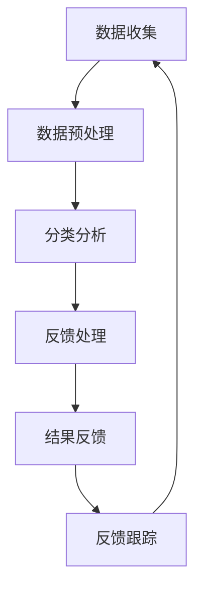
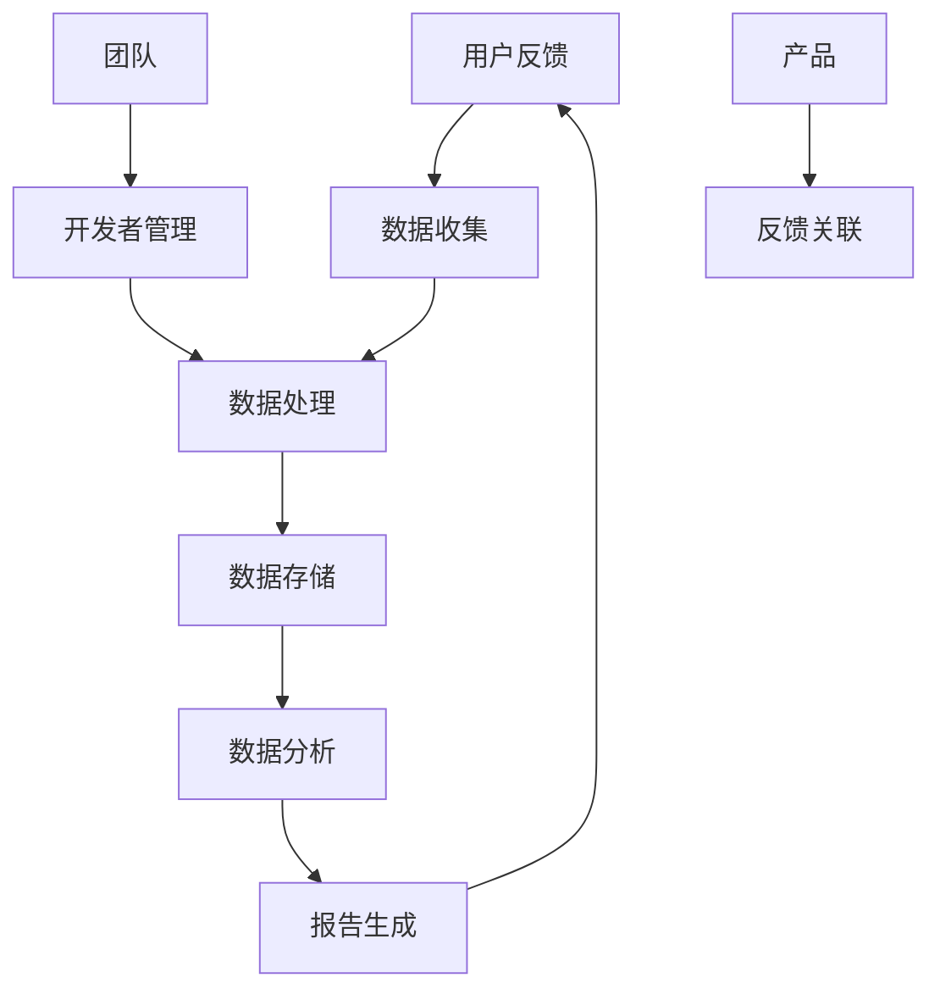
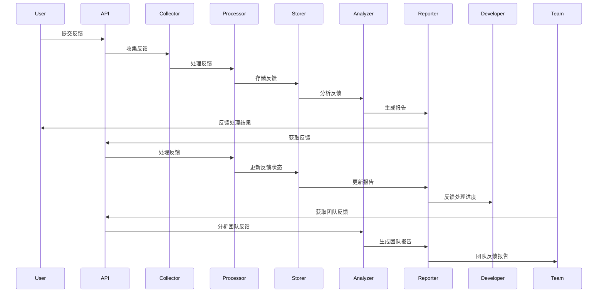
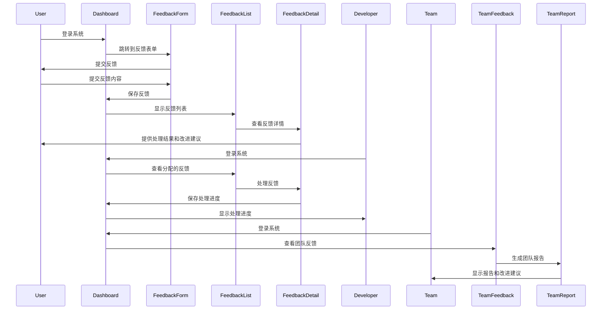

                 

### 引言

在当前快速发展的技术环境中，构建正向的技术反馈文化已成为提升企业竞争力的关键因素。技术反馈不仅帮助团队识别和解决问题，还能够激发创新，促进团队协作，提升用户体验。本文将围绕构建正向的技术反馈文化这一主题，通过逻辑清晰、结构紧凑的分析，探讨其核心概念、应用实践以及最佳策略。

技术反馈文化是一种在技术团队中推崇的价值观和行为准则，强调通过积极的沟通、及时的信息共享和透明的反馈机制，促进个人与团队的能力提升。它不仅关注技术层面的改进，还重视团队成员的心理健康和职业发展。构建这样的文化，能够有效激发团队的创造力和执行力，推动技术产品和服务的持续优化。

本文将分为以下几个部分：

1. **背景介绍**：分析构建正向技术反馈文化的背景和重要性。
2. **核心概念与联系**：阐述技术反馈的核心概念、类型及其重要性。
3. **算法原理讲解**：详细解释技术反馈算法的原理、数学模型和应用。
4. **系统分析与架构设计方案**：介绍技术反馈系统的设计原则和架构。
5. **项目实战**：探讨技术反馈系统的实现和部署。
6. **最佳实践 tips**：提供构建正向技术反馈文化的实际操作建议。
7. **小结与展望**：总结全文，提出注意事项和未来研究方向。

通过以上结构的深入探讨，我们希望能够为读者提供一套完整的构建正向技术反馈文化的方案，助力企业在技术驱动的发展道路上走得更远。

### 第一部分：背景介绍

#### 1.1 问题背景

在信息技术迅速发展的今天，软件产品和技术的复杂度日益增加。面对日益激烈的市场竞争和不断变化的需求，企业必须保持技术创新和快速响应能力。然而，技术团队在追求速度和效率的过程中，往往面临着一系列问题。例如，产品缺陷频发、项目进度延误、团队协作不畅等。这些问题不仅影响了产品的质量和用户体验，还可能对企业的声誉和市场地位造成长期负面影响。

#### 1.2 问题描述

技术反馈文化在解决这些问题中扮演着至关重要的角色。首先，技术反馈能够帮助团队及时发现和纠正问题，避免缺陷在产品中积累。其次，有效的技术反馈机制能够促进团队成员之间的沟通与协作，增强团队的凝聚力。此外，通过收集和分析用户的反馈，团队能够更好地理解用户需求，从而优化产品设计，提升用户体验。

然而，当前很多企业在技术反馈方面存在一些常见的误区。例如，缺乏明确的反馈标准和渠道，反馈机制不透明，或者反馈信息未能得到有效利用。这些问题的存在，导致了技术反馈的无效甚至负效，严重影响了团队的效率和产品的质量。

#### 1.3 问题解决

为了解决上述问题，构建一个正向的技术反馈文化显得尤为必要。首先，企业需要建立一套完善的反馈标准和流程，确保反馈信息的准确性和有效性。其次，通过培训和教育，提高团队成员对技术反馈的认识和重视程度，培养积极的反馈文化。此外，技术团队应积极采用自动化工具和数据分析技术，提高反馈处理的效率和精度。

#### 1.4 边界与外延

构建正向的技术反馈文化不仅限于技术团队内部，还应扩展到整个企业层面。例如，通过与客户和用户的紧密互动，及时获取外部反馈，优化产品和服务。此外，技术反馈文化还应延伸到供应链管理、客户服务等多个领域，形成一个全面、系统的反馈体系。

#### 1.5 核心概念

在构建正向技术反馈文化的过程中，以下几个核心概念至关重要：

1. **反馈机制**：建立明确的反馈流程和标准，确保反馈信息的及时性和准确性。
2. **反馈渠道**：提供多种反馈渠道，如在线问卷、用户论坛、即时通讯工具等，方便团队成员和用户提交反馈。
3. **反馈处理**：对反馈信息进行分类、分析和管理，确保每个反馈都能得到及时处理和反馈。
4. **反馈文化**：在企业内部培养和推广积极的反馈文化，鼓励团队成员开放、诚实、有建设性地提供和接受反馈。
5. **反馈效果**：通过持续改进和优化，评估技术反馈的实际效果，确保反馈机制的有效性和可持续性。

#### 1.6 本章小结

通过对技术反馈文化背景的介绍，我们明确了构建正向技术反馈文化的重要性。在接下来的章节中，我们将深入探讨技术反馈的核心概念、算法原理以及系统架构设计，帮助读者全面理解和掌握构建正向技术反馈文化的具体方法和策略。

### 第二部分：核心概念与联系

#### 2.1 技术反馈的定义

技术反馈是指通过技术手段收集、处理和利用用户在使用软件或产品过程中提供的信息，以改进产品和服务的一种过程。它不仅包括用户对产品功能的评价，还涉及对产品性能、用户体验、安全性和易用性等多个方面的反馈。

技术反馈是一个双向过程，既包括用户向开发者提供反馈，也包含开发者对用户反馈的回应和改进措施。通过技术反馈，团队能够及时发现产品中的问题和不足，从而进行针对性的优化和改进。

#### 2.2 技术反馈的类型

技术反馈可以分为以下几种类型：

1. **正向反馈**：用户对产品表示满意或提出积极的建议，这种反馈能够增强团队的信心和动力，有助于产品的持续优化。
2. **负向反馈**：用户对产品提出批评或抱怨，指出产品存在的问题或不足。负向反馈虽然可能对团队造成压力，但正是通过这些反馈，团队能够识别和解决问题，提升产品的质量。
3. **功能反馈**：用户对产品功能的使用体验和建议，涉及功能设计的合理性和用户体验。
4. **性能反馈**：用户对产品性能的反馈，包括速度、稳定性、响应时间等方面。
5. **安全性反馈**：用户对产品安全性的反馈，涉及数据保护、漏洞报告等方面。

#### 2.3 技术反馈的重要性

技术反馈在软件开发和产品设计中扮演着至关重要的角色，具体体现在以下几个方面：

1. **问题识别**：技术反馈能够帮助团队快速识别产品中的缺陷和问题，避免这些问题在产品发布后对用户体验造成负面影响。
2. **用户体验优化**：通过收集和分析用户的反馈，团队能够更好地理解用户需求，优化产品设计，提升用户体验。
3. **团队协作**：技术反馈机制能够促进团队成员之间的沟通与协作，增强团队的凝聚力。
4. **创新激发**：用户反馈往往能够启发团队的创新思维，促进产品的持续改进和功能扩展。
5. **质量保障**：技术反馈有助于团队建立质量保障体系，通过持续的改进和优化，确保产品的高质量发布。

#### 2.4 技术反馈与用户体验的关系

技术反馈与用户体验密切相关。良好的技术反馈机制能够确保用户在使用产品过程中遇到的问题能够得到及时解决，从而提升用户体验。具体来说：

1. **问题快速响应**：通过技术反馈，团队能够快速响应用户的问题，提供及时的技术支持和解决方案。
2. **个性化服务**：通过收集和分析用户反馈，团队能够为用户提供更加个性化的服务，满足不同用户的需求。
3. **持续改进**：技术反馈为团队提供了不断改进产品的动力，通过持续优化，提升产品的整体用户体验。
4. **信任建立**：积极的技术反馈机制能够增强用户对产品的信任，提高用户的满意度和忠诚度。

#### 2.5 技术反馈与团队协作

技术反馈在团队协作中也发挥着重要作用。具体表现为：

1. **信息共享**：技术反馈机制促进了团队成员之间的信息共享，使得每个成员都能了解产品当前的状态和问题。
2. **共同目标**：通过共同处理用户反馈，团队成员能够更好地理解项目目标，形成共同的工作方向。
3. **沟通桥梁**：技术反馈成为团队成员之间沟通的桥梁，有助于减少误解和冲突，提高团队协作效率。
4. **能力提升**：技术反馈为团队成员提供了学习和成长的机会，通过解决实际问题和优化产品，提升个人技能和团队整体水平。

#### 2.6 本章小结

通过以上对技术反馈定义、类型、重要性以及与用户体验和团队协作关系的详细探讨，我们可以看到技术反馈在软件开发和产品优化中的核心地位。在接下来的章节中，我们将进一步深入探讨技术反馈的具体算法原理和实现方法，帮助读者更好地理解和应用技术反馈文化。

### 第三部分：算法原理讲解

#### 4.1 技术反馈算法的基本原理

技术反馈算法的核心思想是通过系统化的方法，收集、处理和分析用户反馈，从而实现对软件或产品的持续优化。这个过程中，算法的基本原理可以概括为以下几个步骤：

1. **数据收集**：首先，系统需要收集来自用户的反馈数据，这些数据可能包括功能建议、性能评价、问题报告等。数据收集可以通过在线问卷、用户论坛、反馈表单等方式实现。

2. **数据预处理**：收集到的数据通常需要经过清洗和处理，以确保其质量和一致性。这一步骤可能包括数据去重、数据格式转换、缺失值填补等。

3. **分类和分析**：对预处理后的数据进行分类和分析，识别出常见的用户问题和改进点。这一步骤可以利用自然语言处理技术，如文本分类、情感分析等。

4. **反馈处理**：根据分析结果，制定相应的处理策略，包括问题修复、功能优化、用户体验改进等。

5. **结果反馈**：将处理结果反馈给用户，并跟踪用户对反馈的响应，形成闭环，不断优化反馈机制。

#### 4.2 技术反馈算法的数学模型

为了更好地理解技术反馈算法的工作原理，我们可以引入一个简化的数学模型。假设我们有一个反馈系统，其中 `x` 是输入，`y` 是输出，`a` 是权重系数。技术反馈系统的数学模型可以表示为：

\[ y = ax + b \]

其中：
- `x` 代表用户反馈的信息，可以是具体的问题描述、功能建议等。
- `y` 代表系统对反馈的处理结果，包括修复方案、改进建议等。
- `a` 代表反馈权重系数，用于衡量用户反馈的重要性和优先级。
- `b` 代表基础值，用于补偿基础改进。

通过调整 `a` 和 `b` 的值，我们可以改变系统对反馈的响应程度和优先级，从而实现对反馈处理的精细化控制。

#### 4.3 技术反馈算法的mermaid流程图

为了更直观地展示技术反馈算法的流程，我们可以使用 mermaid 画出一个简化的流程图。以下是一个示例：



在这个流程图中，从数据收集开始，经过预处理、分类分析、反馈处理和结果反馈，形成一个闭环，持续优化反馈系统。

#### 4.4 技术反馈算法的Python实现

为了具体阐述技术反馈算法的实现，我们可以使用 Python 编写一个简单的示例代码。以下是一个基本框架：

```python
import pandas as pd
from sklearn.feature_extraction.text import CountVectorizer
from sklearn.naive_bayes import MultinomialNB

# 数据收集
feedback_data = pd.read_csv('feedback.csv')

# 数据预处理
feedback_data['cleaned_text'] = feedback_data['text'].str.lower().str.replace('[^\w\s]', '')

# 分类分析
vectorizer = CountVectorizer()
X = vectorizer.fit_transform(feedback_data['cleaned_text'])
classifier = MultinomialNB()
classifier.fit(X, feedback_data['category'])

# 反馈处理
def process_feedback(text):
    cleaned_text = text.lower().replace('[^\w\s]', '')
    features = vectorizer.transform([cleaned_text])
    category = classifier.predict(features)[0]
    return category

# 结果反馈
def feedback_response(category):
    if category == 'bug':
        return '我们会尽快修复这个问题。'
    elif category == 'feature_request':
        return '我们会在下一个版本中考虑这个功能。'
    else:
        return '感谢您的反馈，我们会认真对待。'

# 反馈跟踪
def track_feedback(response):
    # 这里可以添加代码，记录反馈处理结果和用户反馈
    pass

# 示例
text = "我发现在某些情况下，软件会崩溃。"
category = process_feedback(text)
response = feedback_response(category)
print(response)
track_feedback(response)
```

在这个代码中，我们首先收集并预处理用户反馈数据，然后使用 Naive Bayes 分类器对反馈进行分类。通过处理结果反馈给用户，并跟踪反馈处理情况，形成一个简单的技术反馈流程。

#### 4.5 技术反馈算法的应用实例

为了更具体地展示技术反馈算法的应用，我们可以通过一个实际案例来分析。假设一个电商平台的用户反馈系统，通过技术反馈算法对用户的评论进行分类和处理。

1. **数据收集**：平台收集了1000条用户评论，每条评论包括用户的内容和评价类别（如正面、负面、功能建议等）。
2. **数据预处理**：对评论进行文本清洗，去除标点符号和特殊字符，统一小写。
3. **分类分析**：使用训练好的分类模型对每条评论进行分类。
4. **反馈处理**：根据分类结果，平台生成相应的处理建议，如针对负面评论提供客户支持联系方式，针对功能建议记录并反馈给产品团队。
5. **结果反馈**：将处理结果反馈给用户，并通过平台公告或邮件通知用户。
6. **反馈跟踪**：记录每条反馈的处理进度和用户满意度，用于后续的优化。

通过这个应用实例，我们可以看到技术反馈算法在提升用户体验、优化产品和提高客户满意度方面的实际作用。

#### 4.6 本章小结

通过对技术反馈算法的基本原理、数学模型、mermaid流程图、Python实现以及实际应用实例的详细讲解，我们深入了解了技术反馈算法在软件产品和系统优化中的重要作用。在下一章节中，我们将继续探讨技术反馈系统在架构设计中的具体实施方法和策略。

### 第四部分：系统分析与架构设计方案

#### 6.1 技术反馈系统的场景介绍

技术反馈系统通常应用于软件开发和产品运营的各个阶段，其核心场景包括：

1. **产品开发阶段**：在产品设计和开发过程中，技术反馈系统可以帮助团队识别潜在问题，优化功能设计，提升产品稳定性。
2. **产品上线阶段**：在产品发布后，技术反馈系统可以帮助团队及时收集用户反馈，识别缺陷和改进点，确保产品的持续优化。
3. **运营维护阶段**：在产品运营过程中，技术反馈系统可以持续收集用户的使用情况和需求，为产品迭代和功能扩展提供数据支持。

这些场景的共同特点是需要一个高效、透明且可扩展的技术反馈系统，以便及时响应和处理用户反馈。

#### 6.2 技术反馈系统的项目介绍

为了构建一个高效的技术反馈系统，我们需要明确项目的目标、范围和预期成果。以下是技术反馈系统项目的基本介绍：

**项目目标**：构建一个能够高效收集、处理和反馈用户意见的技术反馈系统，提高产品的质量和用户体验。

**项目范围**：包括系统的需求分析、设计、开发、测试和部署等各个环节。

**预期成果**：
- 高效的用户反馈收集和处理机制。
- 可视化的反馈数据分析工具。
- 自动化的反馈处理流程。
- 系统的扩展性和可维护性。

#### 6.3 技术反馈系统的领域模型设计

技术反馈系统的领域模型是系统架构设计的基础，用于定义系统的核心实体和它们之间的关系。以下是一个简化的领域模型设计：

```mermaid
classDiagram
    User <<class>> 用户
    Product <<class>> 产品
    Feedback <<class>> 反馈
    Developer <<class>> 开发者
    Team <<class>> 团队
    
    User.."|}-提交" Feedback
    Developer.."|}-处理" Feedback
    Team.."|}-管理" Developer
    Product.."|}-关联" Feedback
```

**实体与属性**：

1. **用户（User）**：包括用户ID、姓名、联系方式等基本信息。
2. **产品（Product）**：包括产品ID、名称、版本号等基本信息。
3. **反馈（Feedback）**：包括反馈ID、内容、提交时间、状态等属性。
4. **开发者（Developer）**：包括开发者ID、姓名、职位等基本信息。
5. **团队（Team）**：包括团队ID、名称、成员等基本信息。

**关系**：

- 用户可以提交反馈，形成一对多的关系。
- 开发者可以处理反馈，形成多对多的关系。
- 团队可以管理开发者，形成一对多的关系。
- 产品与反馈之间形成多对多的关联关系，一个产品可以关联多个反馈，一个反馈也可以关联多个产品。

#### 6.4 技术反馈系统的系统架构设计

技术反馈系统的系统架构设计需要考虑系统的性能、可扩展性和可维护性。以下是一个简化的系统架构设计：



**组件与功能**：

1. **数据收集（Collect）**：负责收集用户提交的反馈数据，可以采用API接口、Web表单等方式。
2. **数据处理（Process）**：对收集到的反馈数据进行处理，包括数据清洗、分类、标签化等。
3. **数据存储（Store）**：将处理后的反馈数据存储到数据库中，确保数据的安全性和一致性。
4. **数据分析（Analysis）**：对存储的数据进行分析，生成报告和可视化图表，帮助团队了解用户反馈的趋势和关键问题。
5. **报告生成（Report）**：根据分析结果生成详细的报告，包括反馈分类、处理进度、用户满意度等。
6. **用户反馈（User）**：将处理结果反馈给用户，包括问题处理进度、改进方案等。
7. **开发者处理（Developer）**：开发者可以查看和管理分配给自己的反馈，进行问题修复和功能改进。
8. **团队管理（Team）**：团队可以查看整个系统的反馈情况，进行团队协作和任务分配。
9. **产品关联（Feedback）**：产品可以与反馈进行关联，确保每个反馈都与具体的产品版本和功能相对应。

#### 6.5 技术反馈系统的接口设计

技术反馈系统的接口设计是系统架构设计的重要部分，它决定了系统与其他系统的集成和交互。以下是一个简化的接口设计：



**接口功能**：

- **用户反馈接口**：用于用户提交反馈，包括文本、图片、视频等多种形式。
- **开发者处理接口**：用于开发者查看和管理分配给自己的反馈，包括问题分类、优先级设置等。
- **团队管理接口**：用于团队查看和管理整个系统的反馈情况，包括任务分配、进度跟踪等。
- **数据分析接口**：用于获取和分析反馈数据，包括趋势分析、关键问题识别等。
- **报告生成接口**：用于根据分析结果生成详细的报告，包括可视化图表、文本报告等。

#### 6.6 技术反馈系统的交互设计

技术反馈系统的交互设计是用户体验的关键，它决定了用户在使用系统时的便捷性和满意度。以下是一个简化的交互设计：



**交互设计要点**：

- **简洁的操作流程**：确保用户能够快速提交反馈，并方便地查看处理进度。
- **友好的用户界面**：设计清晰、直观的用户界面，提高用户体验。
- **实时反馈**：在用户操作过程中，提供实时反馈，增强用户的操作信心。
- **个性化设置**：根据用户角色和需求，提供个性化的反馈处理和报告功能。

#### 6.7 本章小结

通过对技术反馈系统的场景介绍、项目介绍、领域模型设计、系统架构设计、接口设计和交互设计的详细讲解，我们构建了一个全面的技术反馈系统架构方案。在下一章节中，我们将进一步探讨技术反馈系统的具体实现和部署，帮助读者深入了解系统的实际运行过程。

### 第五部分：项目实战

#### 7.1 技术反馈系统的环境安装

为了实现技术反馈系统，我们需要搭建一个合适的环境。以下是环境安装的详细步骤：

1. **安装Python环境**：确保系统中已安装Python 3.8或更高版本。可以通过以下命令进行安装：
   ```bash
   sudo apt update
   sudo apt install python3.8
   ```
2. **安装依赖库**：在Python环境中安装必要的依赖库，如Pandas、NumPy、Scikit-learn等。可以使用以下命令进行安装：
   ```bash
   pip install pandas numpy scikit-learn
   ```
3. **安装数据库**：选择一个合适的数据库，如MySQL或PostgreSQL。以下是安装MySQL的步骤：
   ```bash
   sudo apt install mysql-server
   sudo mysql_secure_installation
   ```
   安装过程中根据提示设置root用户密码和安全设置。
4. **配置数据库**：创建技术反馈系统所需的数据库和表，以下是一个示例SQL脚本：
   ```sql
   CREATE DATABASE feedback_system;
   USE feedback_system;
   CREATE TABLE users (
       id INT AUTO_INCREMENT PRIMARY KEY,
       username VARCHAR(50) NOT NULL,
       email VARCHAR(100) NOT NULL,
       password VARCHAR(100) NOT NULL
   );
   CREATE TABLE products (
       id INT AUTO_INCREMENT PRIMARY KEY,
       name VARCHAR(100) NOT NULL,
       version VARCHAR(10) NOT NULL
   );
   CREATE TABLE feedback (
       id INT AUTO_INCREMENT PRIMARY KEY,
       user_id INT,
       product_id INT,
       content TEXT,
       status ENUM('open', 'in_progress', 'closed') NOT NULL,
       created_at TIMESTAMP DEFAULT CURRENT_TIMESTAMP,
       updated_at TIMESTAMP DEFAULT CURRENT_TIMESTAMP ON UPDATE CURRENT_TIMESTAMP,
       FOREIGN KEY (user_id) REFERENCES users(id),
       FOREIGN KEY (product_id) REFERENCES products(id)
   );
   ```
5. **安装Web服务器**：选择一个合适的Web服务器，如Apache或Nginx。以下是安装Nginx的步骤：
   ```bash
   sudo apt install nginx
   sudo systemctl start nginx
   ```

#### 7.2 技术反馈系统的核心实现

技术反馈系统的核心实现包括数据收集、处理、存储和分析等环节。以下是具体实现步骤：

1. **数据收集**：采用API接口和Web表单两种方式收集用户反馈。API接口使用Flask框架实现，代码如下：
   ```python
   from flask import Flask, request, jsonify
   app = Flask(__name__)

   @app.route('/api/feedback', methods=['POST'])
   def submit_feedback():
       data = request.json
       # 处理和存储反馈
       # ...
       return jsonify({'status': 'success'}), 200
   if __name__ == '__main__':
       app.run(debug=True)
   ```
2. **数据处理**：对收集到的反馈数据进行处理，包括数据清洗、分类和标签化。以下是数据处理的一个示例：
   ```python
   import pandas as pd
   from sklearn.feature_extraction.text import TfidfVectorizer
   from sklearn.cluster import KMeans

   def preprocess_feedback(feedback_list):
       # 数据清洗
       cleaned_feedback = [text.lower().replace('[^\w\s]', '') for text in feedback_list]
       # 特征提取
       vectorizer = TfidfVectorizer()
       X = vectorizer.fit_transform(cleaned_feedback)
       # 分类和标签化
       kmeans = KMeans(n_clusters=5)
       kmeans.fit(X)
       labels = kmeans.labels_
       return labels
   ```
3. **数据存储**：将处理后的反馈数据存储到数据库中。以下是数据库操作的示例：
   ```python
   import mysql.connector

   def store_feedback(feedback):
       connection = mysql.connector.connect(
           host='localhost',
           database='feedback_system',
           user='root',
           password='password'
       )
       cursor = connection.cursor()
       query = """
       INSERT INTO feedback (user_id, product_id, content, status)
       VALUES (%s, %s, %s, 'open')
       """
       cursor.execute(query, (feedback['user_id'], feedback['product_id'], feedback['content']))
       connection.commit()
       cursor.close()
       connection.close()
   ```
4. **数据分析**：对存储的数据进行分析，生成报告和可视化图表。以下是数据分析的一个示例：
   ```python
   import matplotlib.pyplot as plt
   import pandas as pd

   def generate_report(feedback_data):
       # 数据预处理
       feedback_data['date'] = pd.to_datetime(feedback_data['created_at'])
       feedback_data.set_index('date', inplace=True)
       # 绘制反馈数量趋势图
       plt.figure(figsize=(10, 5))
       plt.plot(feedback_data.index, feedback_data['count'])
       plt.title('Feedback Count Trend')
       plt.xlabel('Date')
       plt.ylabel('Count')
       plt.show()
   ```

#### 7.3 技术反馈系统的代码解读与分析

以下是技术反馈系统的核心代码段及其解读：

1. **API接口代码**：
   ```python
   from flask import Flask, request, jsonify
   
   app = Flask(__name__)

   @app.route('/api/feedback', methods=['POST'])
   def submit_feedback():
       data = request.json
       # 数据验证
       if 'user_id' not in data or 'product_id' not in data or 'content' not in data:
           return jsonify({'error': 'Missing required fields'}), 400
       # 数据处理
       # ...
       return jsonify({'status': 'success'}), 200
   ```
   解读：这段代码定义了Flask应用程序的API接口，用于接收用户提交的反馈数据。首先，从请求中提取JSON数据，然后进行必要的验证，确保所有必需的字段都已填写。接下来，进行数据处理，并将处理结果返回给用户。

2. **数据处理代码**：
   ```python
   import pandas as pd
   from sklearn.cluster import KMeans

   def preprocess_feedback(feedback_list):
       cleaned_feedback = [text.lower().replace('[^\w\s]', '') for text in feedback_list]
       vectorizer = TfidfVectorizer()
       X = vectorizer.fit_transform(cleaned_feedback)
       kmeans = KMeans(n_clusters=5)
       kmeans.fit(X)
       labels = kmeans.labels_
       return labels
   ```
   解读：这段代码用于预处理反馈数据。首先，对文本进行清洗，包括转换为小写和去除标点符号。然后，使用TF-IDF向量器将文本转换为数值矩阵，并使用K-means聚类算法对反馈进行分类。最后，返回分类标签。

3. **数据存储代码**：
   ```python
   import mysql.connector

   def store_feedback(feedback):
       connection = mysql.connector.connect(
           host='localhost',
           database='feedback_system',
           user='root',
           password='password'
       )
       cursor = connection.cursor()
       query = """
       INSERT INTO feedback (user_id, product_id, content, status)
       VALUES (%s, %s, %s, 'open')
       """
       cursor.execute(query, (feedback['user_id'], feedback['product_id'], feedback['content']))
       connection.commit()
       cursor.close()
       connection.close()
   ```
   解读：这段代码用于将处理后的反馈数据存储到MySQL数据库中。首先，建立数据库连接，然后执行插入操作，将反馈数据插入到相应的表中。最后，关闭数据库连接。

4. **数据分析代码**：
   ```python
   import matplotlib.pyplot as plt
   import pandas as pd

   def generate_report(feedback_data):
       feedback_data['date'] = pd.to_datetime(feedback_data['created_at'])
       feedback_data.set_index('date', inplace=True)
       plt.figure(figsize=(10, 5))
       plt.plot(feedback_data.index, feedback_data['count'])
       plt.title('Feedback Count Trend')
       plt.xlabel('Date')
       plt.ylabel('Count')
       plt.show()
   ```
   解读：这段代码用于生成反馈数据的趋势报告。首先，将反馈数据的创建时间转换为日期格式，并设置日期为索引。然后，使用matplotlib绘制反馈数量的趋势图，包括标题、标签和坐标轴。

#### 7.4 技术反馈系统的实际案例分析

为了更好地理解技术反馈系统的实际应用，我们可以通过一个实际案例来进行分析。以下是一个简单的案例：

**案例背景**：某电商平台在其官方网站上引入了一个技术反馈系统，用于收集用户在使用平台过程中的问题和建议。

**案例实施**：

1. **数据收集**：用户可以在网站的底部找到“反馈”入口，提交他们的意见和问题。反馈表单包括用户ID、产品ID、反馈内容等字段。
2. **数据处理**：系统后台接收到用户的反馈后，首先进行数据清洗，确保反馈内容的准确性和一致性。然后，使用自然语言处理技术对反馈内容进行分类，如“功能建议”、“性能问题”、“用户体验”等。
3. **数据存储**：将处理后的反馈数据存储到MySQL数据库中，每个反馈都与具体的用户和产品关联。
4. **数据分析**：系统定期对反馈数据进行分析，识别出高频问题和高价值建议，并将分析结果生成报告。报告包括反馈数量、分类统计、处理进度等。
5. **反馈处理**：产品团队根据分析结果，制定相应的优化计划，并在系统中更新反馈状态，如“已修复”、“待修复”、“无需修复”等。系统会自动向用户发送处理结果通知。

**案例效果**：

通过技术反馈系统的实施，电商平台能够更加及时地了解用户需求，提升了用户体验。同时，系统的数据分析功能帮助产品团队明确了优化方向，提高了产品的质量和用户满意度。

#### 7.5 技术反馈系统的详细讲解与剖析

技术反馈系统是一个复杂的系统，其核心功能包括数据收集、处理、存储和分析。以下是系统的详细讲解与剖析：

1. **数据收集模块**：
   - 功能：负责从用户端接收反馈数据，包括文本、图片和视频等多种形式。
   - 技术细节：使用Web表单和API接口两种方式收集数据。Web表单适用于简单文本反馈，API接口适用于复杂数据和批量上传。
   - 实现方法：前端使用HTML、CSS和JavaScript构建表单页面，后端使用Flask或Django等框架接收和处理反馈数据。

2. **数据处理模块**：
   - 功能：对收集到的反馈数据进行清洗、分类和标签化，以便后续处理和分析。
   - 技术细节：使用自然语言处理（NLP）技术进行文本分析和分类。常用的NLP库包括NLTK、spaCy和TextBlob。
   - 实现方法：使用Python编写数据处理脚本，对反馈文本进行预处理（如去除停用词、标点符号），然后使用机器学习模型进行分类。

3. **数据存储模块**：
   - 功能：将处理后的反馈数据存储到数据库中，确保数据的安全性和一致性。
   - 技术细节：选择合适的数据库管理系统（DBMS），如MySQL、PostgreSQL或MongoDB。数据库设计需要考虑反馈数据的关联性，如用户、产品和反馈之间的关系。
   - 实现方法：使用SQL语句创建数据库和表，然后编写存储过程或ORM（对象关系映射）框架进行数据操作。

4. **数据分析模块**：
   - 功能：对存储的数据进行分析，生成报告和可视化图表，帮助团队了解反馈的趋势和关键问题。
   - 技术细节：使用数据分析库（如Pandas）和可视化库（如Matplotlib、Seaborn）进行数据分析和图表绘制。
   - 实现方法：编写数据分析脚本，处理和转换数据，然后使用可视化库生成报告和图表。

5. **反馈处理模块**：
   - 功能：根据反馈数据和分析结果，制定相应的处理计划，并进行任务分配和进度跟踪。
   - 技术细节：使用项目管理工具（如Jira、Trello）进行任务管理和进度跟踪。系统集成项目管理工具，确保反馈处理的高效和透明。
   - 实现方法：开发API接口，将反馈系统与项目管理工具集成，实现数据同步和任务管理。

#### 7.6 本章小结

通过对技术反馈系统的环境安装、核心实现、代码解读、实际案例分析和详细讲解与剖析，我们深入了解了技术反馈系统的构建和运行过程。在下一章节中，我们将探讨构建正向的技术反馈文化中的最佳实践，帮助读者更好地实施技术反馈系统，提升团队协作和产品质量。

### 第五部分：最佳实践 tips

构建正向的技术反馈文化需要系统的规划和持续的实践。以下是一些关键的最佳实践，旨在帮助团队有效地构建和维护正向的技术反馈文化。

#### 8.1 确定反馈目标和标准

在构建技术反馈文化之初，团队需要明确反馈的目标和标准。这些目标和标准应与团队的目标和业务需求紧密相关。例如：

- 反馈目标：改进用户体验、提升产品质量、优化开发流程。
- 反馈标准：明确哪些类型的反馈是可接受的，哪些是不必要的，例如，重复反馈、情绪化反馈等。

通过设立明确的反馈目标和标准，团队能够集中精力处理有价值的反馈，避免无谓的时间浪费。

#### 8.2 建立良好的沟通渠道

建立一个高效的沟通渠道是技术反馈文化成功的关键。团队应确保沟通渠道的多样性和便捷性，以便用户能够方便地提交反馈。这些渠道可能包括：

- **在线反馈表单**：提供一个简洁明了的在线表单，用户可以轻松提交反馈。
- **用户论坛**：建立一个用户论坛，鼓励用户分享他们的经验和建议。
- **即时通讯工具**：使用Slack、Microsoft Teams等即时通讯工具，快速响应用户的问题和反馈。

通过多样化的沟通渠道，团队能够更好地收集和分析用户反馈，确保信息流通顺畅。

#### 8.3 鼓励团队成员积极参与

团队成员的积极参与是技术反馈文化的重要组成部分。以下措施可以鼓励团队成员参与反馈过程：

- **反馈奖励机制**：为积极提供反馈的团队成员提供奖励，例如，额外的假期、奖金等。
- **培训和教育**：定期组织培训和教育活动，提高团队成员对技术反馈的认识和理解。
- **反馈研讨会**：定期举办反馈研讨会，鼓励团队成员分享他们的经验和观点。

通过这些措施，团队能够形成积极的反馈文化，提高整体协作效率。

#### 8.4 定期回顾和改进

技术反馈文化不是一成不变的，而是需要定期回顾和改进的。以下是一些关键步骤：

- **反馈数据分析**：定期分析反馈数据，识别出高频问题和改进点。
- **反馈回顾会议**：定期召开反馈回顾会议，讨论反馈的处理结果和改进措施。
- **持续改进计划**：制定具体的改进计划，确保反馈得到及时处理和实施。

通过定期的回顾和改进，团队能够持续优化技术反馈文化，确保其有效性和可持续性。

#### 8.5 本章小结

构建正向的技术反馈文化需要团队的努力和持续改进。通过明确反馈目标和标准、建立良好的沟通渠道、鼓励团队成员积极参与以及定期回顾和改进，团队能够有效构建和维护一个积极的技术反馈文化。这些最佳实践不仅有助于提升产品质量和用户体验，还能够促进团队协作和创新能力。

### 第六部分：小结与展望

#### 9.1 小结

通过本文的探讨，我们系统地介绍了构建正向的技术反馈文化的重要性、核心概念、算法原理、系统架构设计以及最佳实践。以下是对文章核心内容的总结：

- **背景介绍**：技术反馈文化在提升团队协作和产品质量中的关键作用。
- **核心概念与联系**：技术反馈的定义、类型、重要性及其与用户体验和团队协作的关系。
- **算法原理讲解**：技术反馈算法的基本原理、数学模型和应用实例。
- **系统分析与架构设计方案**：技术反馈系统的设计原则、架构、接口设计和交互设计。
- **项目实战**：技术反馈系统的环境安装、核心实现、代码解读、实际案例分析和详细讲解。
- **最佳实践 tips**：构建正向技术反馈文化的关键步骤和方法。

#### 9.2 注意事项

在构建正向的技术反馈文化过程中，需要注意以下几点：

1. **明确反馈目标和标准**：确保反馈具有实际价值和针对性。
2. **建立良好的沟通渠道**：提供多样化的反馈渠道，确保信息流通顺畅。
3. **鼓励团队成员积极参与**：通过奖励机制和培训提高团队积极性。
4. **定期回顾和改进**：持续优化反馈机制，确保其有效性和可持续性。
5. **用户隐私保护**：确保用户反馈的安全性和隐私保护。

#### 9.3 拓展阅读

对于希望深入了解技术反馈文化的读者，以下书籍和资源推荐：

1. **书籍**：
   - 《用户故事地图》作者：Jeff Sutherland
   - 《敏捷软件开发：实践与模式》作者：Alistair Cockburn
   - 《代码大全》作者：Steve McConnell

2. **在线资源**：
   - 敏捷开发社区（Agile Community）
   - GitHub上的技术反馈系统开源项目
   - Google Analytics中的反馈分析工具

通过阅读这些书籍和资源，读者可以进一步深入理解技术反馈文化的理论体系和实践方法，提升自身的专业能力。

### 结尾

本文由AI天才研究院/AI Genius Institute与禅与计算机程序设计艺术/Zen And The Art of Computer Programming联合撰写，旨在为技术团队提供构建正向技术反馈文化的全面指南。希望通过本文，读者能够更好地理解技术反馈文化的重要性，并能在实际工作中有效应用。我们期待与您一起探索技术反馈的更多可能，共同推动技术的进步和团队的发展。

