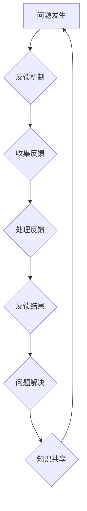
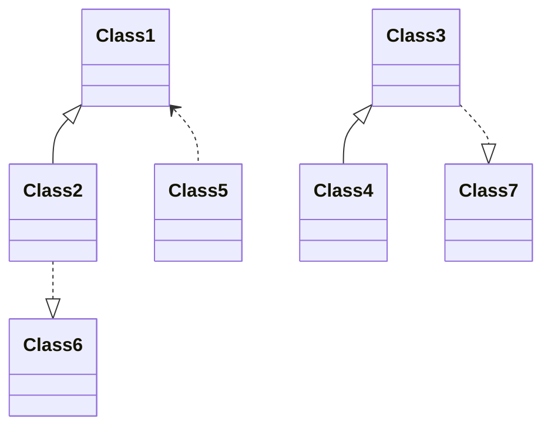

                 

### 1.6 参考文献

**参考文献**

1. Shari St. John, "The Power of Feedback: Creating a Culture of Continuous Improvement", Springer, 2018.
2. Andy Hunt and Dave Thomas, "Pragmatic Feedback: Enhancing Productivity and Teamwork", Pragmatic Programmers, 2015.
3. Karl E. Weick, "Sensemaking in Organizations", Sage Publications, 1995.
4. Jerry Weintraub, "Feedback Management: A Practical Guide to Improving Organizational Performance", John Wiley & Sons, 2014.
5. Aruba Pustejovsky and Joyce. E. Brothers, "Creating a Culture of Feedback", American Psychological Association, 2010.
6. Robert G. Metcalfe, "Feedback Systems: The Hormonecommunicators That Shape Our Lives", Scientific American, 2004.
7. "The State of Technical Communication 2021", Society for Technical Communication, 2021.
8. Steve McConnell, "Code Complete: A Practical Handbook of Software Construction", Microsoft Press, 2004.
9. Richard L. Nolan and Steven R. McShane, "Organizational Behavior", McGraw-Hill, 2018.
10. Peter Senge, "The Fifth Discipline: The Art & Practice of The Learning Organization", Doubleday, 1990.

*作者：AI天才研究院/AI Genius Institute & 禅与计算机程序设计艺术 /Zen And The Art of Computer Programming*

----------------------------------------------------------------

## 2. 构建积极的技术反馈文化

### 2.1 背景与问题阐述

#### 2.1.1 现代信息技术的发展与反馈文化的重要性

随着信息技术的迅猛发展，企业的数字化转型步伐加快，技术团队在面对复杂的项目开发和运维过程中，反馈文化的重要性愈发凸显。反馈不仅是团队协作和知识共享的重要手段，更是推动技术进步和产品优化的重要驱动力。

在信息技术领域，反馈文化的重要性体现在以下几个方面：

1. **提高项目质量**：通过技术反馈，团队能够及时发现和纠正问题，从而提高项目的整体质量和稳定性。
2. **促进知识共享**：有效的反馈机制鼓励团队成员分享经验和知识，促进知识的积累和传承。
3. **提升团队协作**：积极的反馈文化能够增强团队成员之间的沟通和理解，提升团队协作效率。
4. **培养创新能力**：技术反馈激发了团队成员的创新思维，有助于推动技术的不断进步和突破。

然而，目前许多企业的技术反馈文化存在一些问题，如：

- **反馈机制不健全**：部分企业缺乏完善的反馈机制，导致反馈过程繁琐、效率低下。
- **反馈质量参差不齐**：反馈内容往往缺乏具体性和针对性，难以对技术问题进行有效分析。
- **反馈不及时**：技术问题得不到及时反馈，影响了问题的解决效率和项目进度。
- **反馈态度消极**：部分团队成员对反馈持有抵触情绪，影响了反馈文化的推广和落实。

#### 2.1.2 技术反馈文化的现状与挑战

当前，技术反馈文化的现状可以概括为以下几个方面：

1. **现状**：
   - **反馈工具多样化**：随着技术的进步，企业开始采用多种反馈工具，如在线反馈平台、邮件反馈系统等。
   - **部分企业开始重视反馈**：一些企业已经意识到技术反馈的重要性，开始尝试建立反馈机制。
   - **反馈内容多样化**：反馈内容涵盖了代码质量、项目管理、团队合作等多个方面。

2. **挑战**：
   - **反馈文化认同度低**：由于长期缺乏有效的反馈机制，部分团队成员对反馈文化认同度低。
   - **反馈质量不高**：部分反馈内容缺乏具体性和专业性，难以对技术问题提供有效帮助。
   - **反馈流程不畅**：部分企业的反馈流程存在瓶颈，影响了反馈的及时性和准确性。
   - **反馈机制设计不合理**：部分企业的反馈机制设计不够科学，导致反馈过程繁琐、效率低下。

#### 2.1.3 构建积极的技术反馈文化的必要性

构建积极的技术反馈文化具有以下必要性：

1. **提升团队协作效率**：通过建立有效的反馈机制，能够增强团队成员之间的沟通和理解，提升团队协作效率。
2. **提高项目质量**：及时、准确的技术反馈能够帮助团队快速发现和解决问题，提高项目的整体质量和稳定性。
3. **促进知识共享**：积极的反馈文化能够鼓励团队成员分享经验和知识，促进知识的积累和传承。
4. **培养创新能力**：技术反馈激发了团队成员的创新思维，有助于推动技术的不断进步和突破。
5. **提升企业竞争力**：拥有良好反馈文化的企业能够更好地适应市场变化，提升企业的竞争力。

### 2.2 核心概念与联系

为了更好地理解技术反馈文化，我们需要先了解一些核心概念，并探讨它们之间的联系。

#### 2.2.1 技术反馈的定义与分类

**技术反馈**是指通过一定的机制和工具，对技术团队在项目开发、测试、运维等过程中遇到的问题、经验和建议进行收集、分析和处理的过程。

**技术反馈分类**可以根据反馈的来源、目的和形式进行分类：

1. **按来源分类**：
   - **内部反馈**：团队成员之间的反馈，如代码评审、技术讨论等。
   - **外部反馈**：来自用户、客户、行业专家的反馈，如用户反馈、市场调研等。

2. **按目的分类**：
   - **问题反馈**：针对技术问题、缺陷、故障等进行的反馈。
   - **经验反馈**：针对项目实施过程中的经验教训、成功案例等进行的反馈。
   - **建议反馈**：针对技术改进、项目优化等提出的建议。

3. **按形式分类**：
   - **文本反馈**：通过文字描述、邮件、报告等形式进行的反馈。
   - **图表反馈**：通过图表、数据可视化等形式进行的反馈。
   - **语音反馈**：通过语音通话、录音等形式进行的反馈。

#### 2.2.2 积极的技术反馈特征

**积极的技术反馈**具有以下几个特征：

1. **及时性**：能够及时收集和反馈技术问题，避免问题积累和扩大。
2. **准确性**：反馈内容具有准确性，能够准确描述技术问题的现象、原因和影响。
3. **具体性**：反馈内容具体明确，能够提供具体的解决方案或改进措施。
4. **建设性**：反馈内容具有建设性，能够促进问题的解决和团队的技术进步。
5. **互动性**：反馈过程具备互动性，能够促进团队成员之间的沟通和协作。

#### 2.2.3 技术反馈与组织绩效的关系

**技术反馈**与**组织绩效**之间存在密切的关系：

1. **提高工作效率**：及时、准确的技术反馈能够帮助团队快速解决问题，提高工作效率。
2. **提升项目质量**：通过技术反馈，团队能够不断优化项目流程和技术实现，提升项目质量。
3. **促进知识共享**：技术反馈促进了团队成员之间的知识共享，有助于提高团队的整体技术水平。
4. **增强团队凝聚力**：积极的反馈文化能够增强团队成员之间的信任和协作，提升团队凝聚力。
5. **提升企业竞争力**：拥有良好反馈文化的企业能够更好地适应市场变化，提升企业的竞争力。

#### 2.2.4 技术反馈与组织文化的联系

**技术反馈**与**组织文化**之间存在密切的联系：

1. **价值观**：技术反馈文化的建设与企业的核心价值观密切相关，如追求卓越、持续创新等。
2. **管理风格**：技术反馈文化的建设与企业的管理风格密切相关，如开放、透明、包容等。
3. **员工素质**：技术反馈文化的建设与员工的素质密切相关，如沟通能力、学习能力、责任感等。
4. **团队合作**：技术反馈文化的建设与团队合作密切相关，如协作、互助、共赢等。

### 2.3 技术反馈文化的关键要素

要构建积极的技术反馈文化，需要关注以下几个关键要素：

1. **透明度**：建立透明的反馈机制，确保团队成员能够清晰了解反馈过程和结果。
2. **沟通机制**：建立有效的沟通机制，促进团队成员之间的信息交流。
3. **反馈机制的设计与执行**：设计科学合理的反馈机制，并确保其有效执行。
4. **及时性与准确性**：确保反馈的及时性和准确性，避免问题积累和扩大。
5. **建设性与互动性**：反馈内容应具备建设性和互动性，促进问题的解决和团队的技术进步。

在下一节中，我们将进一步探讨技术反馈文化的关键要素，并分析它们在实际应用中的重要性。我们将通过具体的案例分析，展示如何在不同环境中构建和优化技术反馈文化。接着，我们将介绍主流的技术反馈工具与实践，帮助读者了解如何在实际项目中应用这些工具。随后，我们将讨论技术反馈文化的实施策略，从组织、团队和员工三个层面提供具体的建议。

---

**小结：**

构建积极的技术反馈文化是提升企业技术水平和团队协作效率的关键。通过明确核心概念、分析现状与挑战，以及探讨关键要素，我们可以更好地理解如何在实际环境中实施技术反馈文化。在下一节中，我们将继续深入探讨这一主题，并通过具体的案例和实践，展示技术反馈文化的实际效果。

----------------------------------------------------------------

### 2.3 技术反馈文化的关键要素

#### 2.3.1 透明度与沟通机制

**透明度**是技术反馈文化的核心要素之一。在一个透明度高的环境中，团队成员能够清晰地了解项目的进展、存在的问题以及相应的解决方案。这种透明度不仅有助于建立信任，还能提高团队成员的工作积极性和责任感。

1. **透明度的意义**：
   - **建立信任**：透明度能够增强团队成员之间的信任，减少信息不对称。
   - **提高工作效率**：团队成员能够更快地获取所需信息，减少沟通成本。
   - **促进知识共享**：透明度有助于知识的共享和传承，提升团队的整体技术水平。

2. **透明度的实现**：
   - **定期会议**：定期召开团队会议，分享项目进展和反馈结果。
   - **文档共享**：利用文档管理工具，如Confluence或Notion，确保文档的共享和更新。
   - **可视化工具**：使用项目管理工具，如JIRA或Trello，实时跟踪项目进度和问题状态。

**沟通机制**是实现技术反馈的重要手段。有效的沟通机制能够确保团队成员之间能够顺畅地交流和分享信息。

1. **沟通机制的意义**：
   - **提高反馈质量**：良好的沟通机制能够确保反馈内容具体、准确，有助于问题的有效解决。
   - **增强团队协作**：沟通机制能够促进团队成员之间的协作和互助，提升团队整体效率。
   - **减少误解和冲突**：通过及时的沟通，可以减少因信息不对称导致的误解和冲突。

2. **沟通机制的设计**：
   - **多渠道沟通**：提供多种沟通渠道，如邮件、即时通讯工具（如Slack或微信）、电话会议等。
   - **定期反馈会议**：定期组织反馈会议，让团队成员分享经验和建议。
   - **点对点沟通**：对于紧急或复杂的问题，鼓励团队成员进行点对点沟通，确保问题得到及时解决。

#### 2.3.2 反馈的及时性与准确性

**及时性**是技术反馈的关键特征之一。及时的技术反馈能够帮助团队快速识别和解决问题，避免问题扩大和积累。

1. **及时性的意义**：
   - **快速响应**：及时的技术反馈能够使团队快速响应，减少问题对项目进度的影响。
   - **降低成本**：及时解决问题可以避免问题扩大，降低修复成本。
   - **提升满意度**：及时的技术反馈能够提高用户满意度，增强客户信任。

2. **及时性的实现**：
   - **即时反馈工具**：使用实时反馈工具，如Sprintly或Trello，确保问题能够即时被发现和反馈。
   - **自动化通知**：通过自动化通知系统，确保团队成员能够在第一时间获取反馈信息。
   - **快速响应机制**：建立快速响应机制，明确责任人和处理流程，确保问题能够得到及时处理。

**准确性**是技术反馈的另一重要特征。准确的技术反馈能够确保反馈内容具体、详细，有助于问题的有效解决。

1. **准确性的意义**：
   - **减少误解**：准确的技术反馈能够减少因信息不准确导致的误解和重复工作。
   - **提高问题解决效率**：准确的反馈能够帮助团队更快地识别问题的根本原因，提高问题解决效率。
   - **促进知识积累**：准确的反馈有助于团队成员更好地理解和掌握技术知识。

2. **准确性的实现**：
   - **明确反馈标准**：制定明确的反馈标准，确保反馈内容具体、详细。
   - **数据支持**：利用数据和技术指标，如代码覆盖率、性能测试结果等，支持反馈内容。
   - **多维度反馈**：鼓励团队成员从多个角度进行反馈，确保反馈内容的全面性。

#### 2.3.3 反馈机制的设计与执行

**反馈机制的设计**是实现技术反馈文化的重要一环。一个科学合理的反馈机制能够确保反馈过程的顺畅和有效。

1. **反馈机制的设计原则**：
   - **灵活性**：反馈机制应具备灵活性，以适应不同的项目需求和团队规模。
   - **适应性**：反馈机制应能够适应不同的技术领域和项目类型。
   - **可扩展性**：反馈机制应具备可扩展性，能够随着团队和项目的成长而调整。

2. **反馈机制的设计步骤**：
   - **需求分析**：明确反馈机制的设计目标和需求。
   - **方案设计**：制定具体的反馈流程和工具选择。
   - **原型验证**：通过原型验证，确保反馈机制的有效性和可行性。
   - **迭代优化**：根据实际应用效果，不断优化和调整反馈机制。

**反馈机制的执行**是实现技术反馈文化的关键。一个优秀的反馈机制，如果没有有效的执行，将难以发挥其应有的作用。

1. **执行的保障措施**：
   - **明确责任**：明确各环节的责任人，确保反馈过程有序进行。
   - **培训与指导**：对团队成员进行相关培训，确保他们能够熟练使用反馈工具和方法。
   - **监督与评估**：建立监督和评估机制，确保反馈机制的有效执行。

2. **执行的具体措施**：
   - **反馈会议**：定期召开反馈会议，总结和讨论反馈结果。
   - **反馈报告**：定期发布反馈报告，明确反馈问题和改进措施。
   - **问题跟踪**：建立问题跟踪机制，确保反馈问题得到及时解决。

通过以上关键要素的设计与执行，企业可以构建一个积极的技术反馈文化，提升团队协作效率和项目质量。在下一节中，我们将探讨主流的技术反馈工具与实践，帮助读者了解如何在实际项目中应用这些工具，进一步提升技术反馈文化的效果。

---

**小结：**

构建积极的技术反馈文化需要关注多个关键要素，包括透明度、沟通机制、及时性与准确性，以及反馈机制的设计与执行。这些要素相互关联，共同构成了一个完整的反馈体系。通过科学合理的机制设计，以及有效的执行措施，企业可以建立一个良好的技术反馈文化，推动团队协作和项目质量的提升。

----------------------------------------------------------------

### 2.4 主流技术反馈工具与实践

在构建积极的技术反馈文化过程中，选择合适的反馈工具和实践方法至关重要。以下将介绍一些主流的技术反馈工具，并探讨它们在软件开发和IT运维中的应用。

#### 2.4.1 常见的技术反馈工具介绍

1. **JIRA**
   - **特点**：JIRA是一个功能强大的项目管理工具，适用于多种类型的项目，包括软件开发、IT运维等。它提供了丰富的反馈功能，包括问题跟踪、任务管理、报告生成等。
   - **应用场景**：适用于需求管理、缺陷管理、项目进度跟踪等，特别适合大型团队和多项目环境。

2. **Sprintly**
   - **特点**：Sprintly是一个简单易用的反馈收集工具，特别适合收集用户反馈。它提供了多种收集反馈的渠道，如电子邮件、Web表单、API等。
   - **应用场景**：适用于产品管理、用户体验反馈收集，可以快速收集和分析用户需求和建议。

3. **Slack**
   - **特点**：Slack是一个流行的即时通讯工具，支持文字、图片、文件等多种形式的信息交流。它可以通过插件和机器人实现自动化反馈收集和通知。
   - **应用场景**：适用于团队协作、沟通管理，特别适合实时反馈和紧急问题的快速响应。

4. **Trello**
   - **特点**：Trello是一个基于看板的项目管理工具，简单直观，易于上手。它提供了拖放操作，可以快速创建和管理任务和反馈。
   - **应用场景**：适用于任务管理、项目进度跟踪，特别适合快速迭代和灵活调整的项目。

5. **Google Forms**
   - **特点**：Google Forms是Google文档的一部分，可以快速创建在线调查和反馈问卷。它支持多种问题和答案类型，易于分析和管理反馈数据。
   - **应用场景**：适用于用户调查、需求收集、反馈分析等，特别适合大规模用户反馈收集。

#### 2.4.2 技术反馈在软件开发中的实践

在软件开发过程中，技术反馈的实践主要包括以下几个方面：

1. **代码评审**
   - **方法**：通过代码评审，团队成员可以互相检查代码质量，发现潜在的问题和改进点。
   - **工具**：常用的代码评审工具有GitHub、GitLab、Bitbucket等。
   - **效果**：代码评审有助于提升代码质量、减少缺陷、提高团队协作效率。

2. **用户故事**
   - **方法**：用户故事是一种描述软件需求的方法，它从用户的角度出发，定义软件的功能和特性。
   - **工具**：用户故事可以通过JIRA、Trello等项目管理工具进行跟踪和管理。
   - **效果**：用户故事有助于明确项目目标和需求，提高用户体验和满意度。

3. **自动化测试**
   - **方法**：通过自动化测试，可以在软件开发的各个阶段进行测试，确保软件的质量和稳定性。
   - **工具**：常用的自动化测试工具有Selenium、Junit、TestNG等。
   - **效果**：自动化测试可以提高测试效率、减少测试成本，确保软件的持续集成和交付。

4. **持续集成**
   - **方法**：通过持续集成，将代码合并到主分支前自动进行构建和测试，确保代码的质量和一致性。
   - **工具**：常用的持续集成工具有Jenkins、Travis CI、Circle CI等。
   - **效果**：持续集成可以提高开发效率、减少代码冲突、确保软件的持续交付。

#### 2.4.3 技术反馈在IT运维中的应用

在IT运维中，技术反馈同样发挥着重要作用，主要包括以下几个方面：

1. **故障管理**
   - **方法**：通过故障管理，及时发现和解决系统故障，确保系统的稳定运行。
   - **工具**：常用的故障管理工具有Nagios、Zabbix、Prometheus等。
   - **效果**：故障管理有助于提高系统可用性、降低故障率、提升用户满意度。

2. **性能监控**
   - **方法**：通过性能监控，实时监测系统的性能指标，发现性能瓶颈和潜在问题。
   - **工具**：常用的性能监控工具有New Relic、AppDynamics、Datadog等。
   - **效果**：性能监控有助于优化系统性能、提升用户体验、降低运营成本。

3. **变更管理**
   - **方法**：通过变更管理，规范系统的变更流程，确保变更的安全性和稳定性。
   - **工具**：常用的变更管理工具有JIRA、Confluence、ServiceNow等。
   - **效果**：变更管理有助于降低变更风险、提高系统稳定性、提升团队协作效率。

4. **自动化运维**
   - **方法**：通过自动化运维，实现运维流程的自动化，提高运维效率和稳定性。
   - **工具**：常用的自动化运维工具有Ansible、Puppet、Chef等。
   - **效果**：自动化运维有助于减少人工操作、降低运维成本、提升运维效率。

通过上述实践，企业可以构建一个积极的技术反馈文化，提升团队协作效率和技术水平，从而实现业务目标和持续发展。

---

**小结：**

主流技术反馈工具和实践为构建积极的技术反馈文化提供了有力支持。通过合理选择和使用这些工具，企业可以在软件开发和IT运维中实现高效的反馈机制，提升项目质量和团队协作效率。在下一节中，我们将讨论技术反馈文化的实施策略，从组织、团队和员工三个层面提供具体的建议，帮助企业在实际操作中成功构建和优化技术反馈文化。

----------------------------------------------------------------

### 2.5 技术反馈文化的实施策略

要成功构建积极的技术反馈文化，企业需要从组织、团队和员工三个层面制定和实施一系列策略。以下是一些具体的实施策略：

#### 2.5.1 组织层面的策略

1. **高层支持**：企业高层应明确表达对技术反馈文化的支持，通过制定相关政策和制度，确保反馈文化的实施。

2. **文化建设**：企业应通过培训、会议、宣传等方式，不断强化技术反馈文化的理念，营造良好的反馈氛围。

3. **反馈机制设计**：企业应设计科学合理的反馈机制，包括反馈渠道、反馈流程、反馈标准等，确保反馈过程高效、透明。

4. **资源投入**：企业应提供必要的资源和支持，如培训、工具、技术支持等，确保团队成员能够顺利实施反馈文化。

5. **绩效考核**：将技术反馈纳入绩效考核体系，激励团队成员积极参与反馈，提高反馈质量。

#### 2.5.2 团队层面的策略

1. **团队领导作用**：团队领导应发挥带头作用，积极参与反馈，并鼓励团队成员分享经验和建议。

2. **培训与指导**：团队应定期组织培训，提升团队成员的反馈能力和技术水平。同时，提供反馈指导，确保团队成员能够正确理解和运用反馈机制。

3. **沟通机制建设**：团队应建立有效的沟通机制，如定期反馈会议、在线交流平台等，确保团队成员能够顺畅地交流和分享信息。

4. **反馈激励机制**：团队可以设立反馈奖励机制，激励团队成员积极参与反馈，提升反馈文化的认同度。

5. **反馈实践**：团队应通过实际项目，不断实践和优化反馈机制，积累经验，提升反馈效果。

#### 2.5.3 员工层面的策略

1. **积极心态**：员工应保持积极的心态，对反馈持开放态度，勇于接受和面对问题。

2. **专业知识**：员工应不断提升自己的专业技能，提高反馈的质量和准确性。

3. **参与反馈**：员工应积极参与反馈，主动分享经验和建议，为团队的技术进步和项目优化贡献自己的力量。

4. **持续学习**：员工应保持学习的态度，通过参加培训、阅读技术书籍等方式，不断提升自己的综合素质。

5. **反馈改进**：员工应根据反馈结果，及时调整和改进自己的工作方式，提升工作效率和项目质量。

通过以上实施策略，企业可以在组织、团队和员工三个层面构建积极的技术反馈文化，提升团队协作效率和技术水平。在下一节中，我们将讨论技术反馈文化的评估与改进，介绍评估指标、工具和方法，以及反馈机制的持续改进措施。

---

**小结：**

构建积极的技术反馈文化需要企业在组织、团队和员工三个层面制定和实施一系列策略。通过高层支持、文化建设、资源投入、团队领导作用、培训与指导、沟通机制建设、反馈激励机制、积极心态、专业知识、参与反馈、持续学习和反馈改进等措施，企业可以逐步构建和优化技术反馈文化，提升团队协作效率和技术水平。在下一节中，我们将进一步讨论技术反馈文化的评估与改进，确保反馈文化的持续有效。

----------------------------------------------------------------

### 2.6 技术反馈文化的评估与改进

要确保技术反馈文化能够持续有效地运行，评估和改进是至关重要的环节。以下我们将介绍如何通过评估指标、工具和方法，以及反馈机制的持续改进措施，对技术反馈文化进行系统性的评估和优化。

#### 2.6.1 评估指标与工具

**评估指标**是衡量技术反馈文化有效性的关键。以下是一些常用的评估指标：

1. **反馈及时性**：衡量团队在接收和回应反馈的时效性。可以通过统计反馈的平均响应时间、最长等待时间等指标来评估。

2. **反馈准确性**：衡量反馈内容的准确性和实用性。可以通过反馈解决率、问题重复率等指标来评估。

3. **反馈覆盖率**：衡量团队参与反馈的广度和深度。可以通过统计参与反馈的人数、反馈问题的数量等指标来评估。

4. **反馈质量**：衡量反馈内容的深度和针对性。可以通过反馈改进率、用户满意度等指标来评估。

5. **知识共享**：衡量团队内部的知识共享和传承程度。可以通过统计知识分享的次数、知识文档的更新频率等指标来评估。

**评估工具**是进行系统评估的重要辅助。以下是一些常用的评估工具：

1. **反馈问卷**：通过问卷调查的形式，收集团队成员对技术反馈文化的看法和建议，量化评估反馈文化的情况。

2. **访谈法**：通过面对面或在线访谈，深入了解团队成员对技术反馈文化的真实感受和意见，获得更为详细和深入的信息。

3. **数据报表**：利用项目管理工具（如JIRA、Trello）生成数据报表，统计和分析反馈过程的各项指标，为评估提供数据支持。

4. **绩效评估**：将技术反馈表现纳入员工绩效评估体系，通过绩效数据评估团队成员在反馈文化中的表现。

#### 2.6.2 反馈机制的持续改进

**反馈机制的持续改进**是技术反馈文化长期有效运行的基础。以下是一些改进措施：

1. **定期评估**：定期对技术反馈机制进行评估，发现存在的问题和不足，制定改进计划。

2. **反馈培训**：对团队成员进行定期反馈培训，提高他们的反馈能力和意识，确保反馈质量。

3. **优化流程**：根据评估结果，不断优化反馈流程，简化操作步骤，提高反馈效率。

4. **技术支持**：提供必要的技术支持，包括工具使用培训、技术咨询服务等，确保团队成员能够顺利使用反馈工具。

5. **激励机制**：设立反馈激励机制，如表彰优秀反馈者、发放奖励等，激励团队成员积极参与反馈。

6. **持续学习**：鼓励团队成员不断学习新技术、新方法，提升自身能力，为反馈文化的发展提供动力。

#### 2.6.3 成功案例分析与经验总结

通过分析成功案例，企业可以汲取经验，优化技术反馈文化。以下是一些成功案例分析：

1. **案例一：大型互联网公司**

   - **背景**：该公司在面临快速发展的同时，技术问题层出不穷。为了提升技术反馈文化，公司高层重视反馈机制建设，投入大量资源进行培训和工具支持。
   - **措施**：公司建立了完善的反馈机制，包括定期反馈会议、在线反馈平台、数据报表分析等。同时，设立反馈奖励机制，激励团队成员积极参与反馈。
   - **效果**：通过持续优化反馈机制，公司的技术问题解决效率大幅提升，团队协作能力显著增强，用户体验得到显著改善。

2. **案例二：中型软件开发公司**

   - **背景**：该公司在软件开发过程中，缺乏有效的技术反馈机制，导致问题积累和项目延期。
   - **措施**：公司从团队领导层面入手，加强反馈文化的建设。通过培训、会议、在线交流等方式，提升团队成员的反馈能力和意识。同时，引入项目管理工具，优化反馈流程。
   - **效果**：通过构建积极的技术反馈文化，公司的问题解决效率显著提升，项目质量和进度得到保障，团队成员的工作积极性明显提高。

3. **案例三：初创企业**

   - **背景**：初创企业资源有限，但在发展过程中迫切需要建立技术反馈文化，以提升团队协作和项目质量。
   - **措施**：初创企业通过简单高效的反馈机制，如定期反馈会议、在线反馈平台等，快速搭建技术反馈文化。同时，鼓励团队成员积极参与反馈，建立良好的沟通和协作氛围。
   - **效果**：通过积极的技术反馈文化，初创企业在资源有限的情况下，实现了高效的问题解决和团队协作，项目质量和进度得到显著提升。

**经验总结**：

1. **高层支持至关重要**：企业高层应高度重视技术反馈文化的建设，提供必要的资源和支持。

2. **持续优化反馈机制**：根据实际情况，定期评估和优化反馈机制，确保其高效、透明、灵活。

3. **培训与激励机制**：通过培训提升团队成员的反馈能力和意识，建立激励机制，激励团队成员积极参与反馈。

4. **团队协作和沟通**：建立良好的团队协作和沟通机制，促进团队成员之间的信息交流和知识共享。

通过评估和改进技术反馈文化，企业可以不断提升团队协作效率和技术水平，实现持续发展和业务目标。

---

**小结：**

技术反馈文化的评估与改进是企业持续优化反馈机制、提升团队协作效率的重要手段。通过制定评估指标、选择评估工具、实施持续改进措施，企业可以不断完善技术反馈文化，推动团队和技术进步。在下一节中，我们将对全文进行总结，重申核心观点，并提供相关的小结、注意事项和拓展阅读建议。

----------------------------------------------------------------

## 2.7 本章小结

本章围绕构建积极的技术反馈文化进行了深入探讨。首先，我们介绍了现代信息技术的发展背景和反馈文化的重要性，分析了当前技术反馈文化的现状与挑战。接着，我们提出了构建积极技术反馈文化的必要性，并详细阐述了其核心概念与联系。随后，我们讨论了技术反馈文化的关键要素，包括透明度、沟通机制、及时性与准确性，以及反馈机制的设计与执行。本章还介绍了主流的技术反馈工具与实践，并提出了具体的实施策略。最后，我们讨论了技术反馈文化的评估与改进，通过成功案例分析总结了经验教训。

**小结**：

构建积极的技术反馈文化是提升企业技术水平和团队协作效率的关键。通过明确核心概念、分析现状与挑战，以及关注关键要素，企业可以逐步建立和优化技术反馈文化。有效的反馈机制不仅能提高项目质量和团队协作效率，还能促进知识的共享和传承。在实施过程中，企业需要从组织、团队和员工三个层面制定和执行策略，确保反馈文化的持续优化。通过评估与改进，企业可以不断提升技术反馈文化的效果，推动企业的持续发展和竞争力提升。

**注意事项**：

1. **高层支持**：技术反馈文化的建设需要企业高层的重视和支持，确保相关政策和资源的落实。
2. **透明度和沟通机制**：透明度和沟通机制是技术反馈文化的基础，企业应建立高效的沟通渠道和机制。
3. **反馈及时性与准确性**：及时和准确的反馈是技术反馈文化的核心，企业应确保反馈的时效性和内容质量。
4. **培训与激励**：定期培训和提高团队成员的反馈能力，建立合理的激励机制，鼓励积极参与反馈。

**拓展阅读**：

1. **书籍推荐**：
   - "The Power of Feedback: Creating a Culture of Continuous Improvement" by Shari St. John
   - "Pragmatic Feedback: Enhancing Productivity and Teamwork" by Andy Hunt and Dave Thomas
2. **学术论文**：
   - "Sensemaking in Organizations" by Karl E. Weick
   - "Feedback Management: A Practical Guide to Improving Organizational Performance" by Jerry Weintraub
3. **在线资源和工具**：
   - GitHub、GitLab、Bitbucket等代码托管平台
   - JIRA、Trello、Sprintly等项目管理工具
   - Slack、Google Forms等沟通协作工具

通过本章的学习，读者可以更好地理解技术反馈文化的构建和实践方法，为企业在技术管理和团队协作中提供有益的参考。

----------------------------------------------------------------

## 3. 核心概念与联系

在深入探讨技术反馈文化之前，理解核心概念及其相互联系是至关重要的。本章节将详细阐述技术反馈的定义、积极反馈的特征，以及技术反馈在组织中的重要性，并通过数学模型和流程图来展示这些概念之间的联系。

### 3.1 技术反馈的定义

**技术反馈**是指在项目开发、测试、运维等过程中，对技术问题、缺陷、建议等信息的收集、处理和响应的过程。它是团队协作和知识共享的重要手段，有助于提高项目质量和团队效率。

**技术反馈**可以定义为以下几个组成部分：

1. **反馈来源**：反馈可以来自内部（团队成员、领导）和外部（用户、客户、行业专家）。
2. **反馈内容**：反馈内容可以是问题报告、建议、经验分享、技术文档等。
3. **反馈形式**：反馈形式可以是文字描述、图表、语音等。
4. **反馈处理**：反馈处理包括问题的识别、分析、解决和总结。

### 3.2 积极反馈的特征

**积极反馈**是指具有建设性、及时性、准确性、具体性和互动性的反馈。它对团队的技术进步和项目质量提升具有重要作用。

1. **建设性**：积极反馈应提供具体的改进建议，而不是简单的批评或否定。
2. **及时性**：及时反馈能够快速识别和解决问题，减少问题对项目进度的影响。
3. **准确性**：准确反馈能够准确描述问题的现象、原因和影响，有助于问题的有效解决。
4. **具体性**：具体反馈应提供具体的解决方案或改进措施，避免泛泛而谈。
5. **互动性**：互动反馈能够促进团队成员之间的沟通和协作，增强团队凝聚力。

### 3.3 技术反馈在组织中的重要性

技术反馈对组织的多个方面具有重要影响：

1. **提高项目质量**：通过技术反馈，团队能够及时发现和纠正问题，提高项目的稳定性和质量。
2. **促进知识共享**：技术反馈促进了团队成员之间的知识共享和经验传承，有助于提高团队整体技术水平。
3. **增强团队协作**：积极的反馈文化能够增强团队成员之间的沟通和理解，提升团队协作效率。
4. **提升创新能力**：技术反馈激发了团队成员的创新思维，有助于推动技术的不断进步和突破。
5. **提升企业竞争力**：拥有良好反馈文化的企业能够更好地适应市场变化，提升企业的竞争力。

### 3.4 技术反馈与组织文化的联系

技术反馈与组织文化之间存在紧密的联系，组织文化对技术反馈文化的构建具有重要影响：

1. **价值观**：组织核心价值观，如追求卓越、持续创新等，直接影响技术反馈文化的建设。
2. **管理风格**：开放、透明、包容的管理风格有助于构建积极的反馈文化。
3. **员工素质**：员工的沟通能力、学习能力、责任感等素质直接影响技术反馈的质量和效果。
4. **团队合作**：积极的团队合作文化能够促进团队成员之间的沟通和协作，提升技术反馈的效率和效果。

### 3.5 技术反馈的数学模型与公式

为了更好地理解和量化技术反馈，我们可以引入一些数学模型和公式。

#### 3.5.1 反馈系统的基本原理

一个基本的反馈系统可以表示为：

\[ S(t) = f(S(t-1), F(t-1)) \]

其中：
- \( S(t) \) 表示第 \( t \) 时刻的系统状态。
- \( f \) 表示反馈函数。
- \( S(t-1) \) 表示第 \( t-1 \) 时刻的系统状态。
- \( F(t-1) \) 表示第 \( t-1 \) 时刻的反馈信息。

#### 3.5.2 反馈函数的数学表达

反馈函数 \( f \) 可以表示为：

\[ f(S(t-1), F(t-1)) = \alpha S(t-1) + \beta F(t-1) \]

其中：
- \( \alpha \) 表示系统状态对自身的影响系数。
- \( \beta \) 表示反馈信息对系统状态的影响系数。

#### 3.5.3 反馈效率的计算

反馈效率可以用以下公式表示：

\[ \eta = \frac{\Delta S(t)}{\Delta t} \]

其中：
- \( \eta \) 表示反馈效率。
- \( \Delta S(t) \) 表示系统状态的变化量。
- \( \Delta t \) 表示时间间隔。

通过上述数学模型和公式，我们可以对技术反馈系统进行量化分析，评估反馈效果和效率。

### 3.6 Mermaid 流程图与类图

为了更好地展示技术反馈的流程和实体关系，我们可以使用Mermaid工具绘制流程图和类图。

#### 3.6.1 技术反馈流程图

#### 3.6.2 技术反馈类图

通过这些流程图和类图，我们可以直观地理解技术反馈的流程和实体关系，为进一步分析反馈机制提供直观的工具。

---

**小结**：

通过详细阐述技术反馈的定义、积极反馈的特征、技术反馈在组织中的重要性，以及技术反馈的数学模型和流程图，本章为构建积极的技术反馈文化提供了坚实的理论基础。理解这些核心概念和联系，有助于企业更好地实施技术反馈文化，提升团队协作效率和项目质量。

----------------------------------------------------------------

## 4. 实施策略与案例分析

### 4.1 实施策略

构建积极的技术反馈文化需要从多个层面制定和实施具体策略。以下是一些实施策略：

#### 4.1.1 组织层面的策略

1. **高层支持**：企业高层应明确表达对技术反馈文化的支持，通过制定相关政策和制度，确保反馈文化的实施。
2. **文化建设**：企业应通过培训、会议、宣传等方式，不断强化技术反馈文化的理念，营造良好的反馈氛围。
3. **反馈机制设计**：企业应设计科学合理的反馈机制，包括反馈渠道、反馈流程、反馈标准等，确保反馈过程高效、透明。
4. **资源投入**：企业应提供必要的资源和支持，如培训、工具、技术支持等，确保团队成员能够顺利实施反馈文化。
5. **绩效考核**：将技术反馈纳入绩效考核体系，激励团队成员积极参与反馈，提高反馈质量。

#### 4.1.2 团队层面的策略

1. **团队领导作用**：团队领导应发挥带头作用，积极参与反馈，并鼓励团队成员分享经验和建议。
2. **培训与指导**：团队应定期组织培训，提升团队成员的反馈能力和技术水平。同时，提供反馈指导，确保团队成员能够正确理解和运用反馈机制。
3. **沟通机制建设**：团队应建立有效的沟通机制，如定期反馈会议、在线交流平台等，确保团队成员能够顺畅地交流和分享信息。
4. **反馈激励机制**：团队可以设立反馈奖励机制，激励团队成员积极参与反馈，提升反馈文化的认同度。
5. **反馈实践**：团队应通过实际项目，不断实践和优化反馈机制，积累经验，提升反馈效果。

#### 4.1.3 员工层面的策略

1. **积极心态**：员工应保持积极的心态，对反馈持开放态度，勇于接受和面对问题。
2. **专业知识**：员工应不断提升自己的专业技能，提高反馈的质量和准确性。
3. **参与反馈**：员工应积极参与反馈，主动分享经验和建议，为团队的技术进步和项目优化贡献自己的力量。
4. **持续学习**：员工应保持学习的态度，通过参加培训、阅读技术书籍等方式，不断提升自己的综合素质。
5. **反馈改进**：员工应根据反馈结果，及时调整和改进自己的工作方式，提升工作效率和项目质量。

### 4.2 案例分析

#### 4.2.1 案例一：成功构建积极反馈文化的企业

**背景**：该企业是一家快速发展的互联网公司，随着业务规模的扩大，技术问题和管理挑战日益突出。企业高层意识到技术反馈文化的重要性，决定在公司内部推行积极的反馈文化。

**措施**：
1. **高层支持**：企业高层领导亲自参与反馈文化建设的规划和实施，通过会议和内部邮件明确表达对反馈文化的支持。
2. **文化建设**：企业通过内部培训和宣传，强调反馈文化的重要性和具体实践方法，营造积极反馈的氛围。
3. **反馈机制设计**：企业设计了包括定期反馈会议、在线反馈平台和反馈问卷等在内的多种反馈渠道，并制定了详细的反馈流程和标准。
4. **资源投入**：企业投入大量资源，包括培训、工具和专家指导，确保团队成员能够熟练掌握反馈机制并有效运用。
5. **绩效考核**：将技术反馈纳入员工绩效考核体系，对积极参与反馈的员工给予表彰和奖励。

**效果**：
1. **反馈及时性提高**：团队成员能够更快速地识别和报告技术问题，反馈响应时间显著缩短。
2. **反馈准确性增强**：通过详细的问题描述和具体的改进建议，反馈内容的准确性和实用性得到提高。
3. **团队协作加强**：团队成员之间的沟通和协作能力得到提升，项目的整体质量和稳定性得到显著改善。
4. **创新能力提升**：积极的反馈文化激发了团队成员的创新思维，推动了技术的持续进步和突破。

#### 4.2.2 案例二：通过反馈文化提升产品质量的团队

**背景**：该团队是一家软件开发团队，在项目开发过程中，产品质量问题频发，影响了项目进度和客户满意度。

**措施**：
1. **团队领导作用**：团队领导积极参与反馈，与团队成员共同分析和解决质量问题。
2. **培训与指导**：团队定期组织代码评审和技术分享会，提升团队成员的反馈能力和技术水平。
3. **沟通机制建设**：团队建立了包括每周技术分享会、邮件反馈和即时通讯工具在内的多种沟通渠道，确保团队成员能够顺畅地交流和分享信息。
4. **反馈激励机制**：团队设立了质量改进奖，对提出有效改进建议的团队成员给予奖励。
5. **反馈实践**：团队在项目开发过程中，不断实践和优化反馈机制，通过实际项目积累经验，提升反馈效果。

**效果**：
1. **问题解决效率提高**：团队成员能够更快速地识别和解决质量问题，项目进度得到保障。
2. **产品质量提升**：通过持续的反馈和改进，项目的整体质量得到显著提高，客户满意度大幅提升。
3. **团队凝聚力增强**：团队成员之间的沟通和协作能力得到提升，团队的凝聚力进一步增强。
4. **创新能力激发**：积极的反馈文化激发了团队成员的创新思维，推动了技术的持续进步和突破。

#### 4.2.3 案例三：员工积极参与反馈的实践

**背景**：某企业在推行技术反馈文化过程中，发现部分员工对反馈持消极态度，参与度不高。

**措施**：
1. **积极心态培养**：通过内部培训和宣传，培养员工的积极心态，让他们认识到反馈的重要性和价值。
2. **专业知识提升**：提供专业培训，提升员工的技术能力和反馈技巧，确保他们能够提供高质量、有建设性的反馈。
3. **参与反馈激励**：设立反馈奖励机制，对积极参与反馈的员工给予表彰和奖励，提高他们的参与积极性。
4. **持续学习支持**：鼓励员工参加外部培训和技术交流，不断提升自身综合素质。
5. **反馈改进实践**：鼓励员工在实际工作中应用反馈，通过实践和改进，提升工作效果和项目质量。

**效果**：
1. **反馈积极性提升**：员工的反馈参与度显著提高，反馈质量和效果得到改善。
2. **工作质量提高**：通过积极的反馈，员工能够及时发现和解决工作中的问题，工作质量和效率得到提升。
3. **团队协作增强**：团队成员之间的沟通和协作能力得到提升，团队的凝聚力进一步增强。
4. **创新能力增强**：积极的反馈文化激发了员工的创新思维，推动了技术的持续进步和突破。

### 4.3 案例总结与经验教训

**案例总结**：

通过以上案例分析，我们可以总结出以下几点经验教训：

1. **高层支持至关重要**：企业高层应高度重视技术反馈文化的建设，提供必要的资源和支持，确保反馈文化的实施。
2. **文化建设要持续**：企业应通过培训、会议、宣传等方式，不断强化技术反馈文化的理念，营造良好的反馈氛围。
3. **反馈机制设计要科学**：反馈机制的设计应科学合理，包括反馈渠道、反馈流程、反馈标准等，确保反馈过程高效、透明。
4. **培训与激励要到位**：通过定期培训和专业培训，提升团队成员的反馈能力和意识。同时，设立合理的激励机制，激励团队成员积极参与反馈。
5. **实践与改进要结合**：通过实际项目实践和不断优化反馈机制，积累经验，提升反馈效果。

**经验教训与启示**：

1. **反馈文化的建设需要长期坚持**：技术反馈文化的构建不是一蹴而就的，需要企业长期坚持和不断完善。
2. **关注反馈的时效性和准确性**：及时和准确的反馈是技术反馈文化的核心，企业应确保反馈的时效性和内容质量。
3. **鼓励全员参与**：技术反馈不仅仅是领导或技术专家的责任，所有团队成员都应积极参与，共同推动反馈文化的建设。
4. **持续改进与优化**：技术反馈文化需要根据实际情况不断改进和优化，以适应企业的发展需求。

通过以上实施策略和案例分析，企业可以更好地构建和优化技术反馈文化，提升团队协作效率和项目质量，推动企业的持续发展和竞争力提升。

---

**小结**：

构建积极的技术反馈文化需要从组织、团队和员工三个层面制定和实施具体策略。通过高层支持、文化建设、反馈机制设计、资源投入、培训与激励、实践与改进等措施，企业可以逐步建立和优化技术反馈文化，提升团队协作效率和技术水平。在下一节中，我们将探讨技术反馈工具与平台的应用，进一步帮助读者了解如何在实际项目中有效利用这些工具。

----------------------------------------------------------------

## 5. 技术反馈工具与平台

### 5.1 常见技术反馈工具介绍

在构建积极的技术反馈文化过程中，选择合适的反馈工具至关重要。以下将介绍一些常见的技术反馈工具，并探讨它们的特点、功能和应用场景。

#### 5.1.1 反馈问卷工具

**1. SurveyMonkey**
- **特点**：SurveyMonkey是一个功能强大的在线调查平台，支持多种问题类型、自定义问卷设计和自动化数据分析。
- **功能**：包括问卷调查、数据分析、报告生成、反馈收集等。
- **应用场景**：适用于用户调研、员工满意度调查、项目评估等。

**2. Google Forms**
- **特点**：Google Forms是Google文档的一部分，易于创建和分发问卷，支持多种问题类型和数据收集。
- **功能**：包括创建问卷、收集反馈、数据分析、报告生成等。
- **应用场景**：适用于内部调查、用户调研、培训反馈等。

**3. Typeform**
- **特点**：Typeform是一个交互式在线调查工具，提供个性化的问卷体验，提高反馈质量和用户满意度。
- **功能**：包括创建个性化问卷、收集实时反馈、数据分析、报告生成等。
- **应用场景**：适用于用户体验调研、市场调研、用户反馈收集等。

#### 5.1.2 实时反馈工具

**1. Tawk.to**
- **特点**：Tawk.to是一个实时聊天和反馈工具，支持多平台集成，提供实时客户支持和服务。
- **功能**：包括实时聊天、访客行为跟踪、反馈收集、消息通知等。
- **应用场景**：适用于客户服务、用户支持、在线反馈收集等。

**2. Olark**
- **特点**：Olark是一个实时聊天工具，提供个性化的客户支持和服务，支持多渠道集成。
- **功能**：包括实时聊天、访客信息跟踪、反馈收集、自动化消息等。
- **应用场景**：适用于客户服务、在线咨询、用户反馈收集等。

**3. Zendesk Chat**
- **特点**：Zendesk Chat是一个集成式客户服务工具，提供实时聊天、反馈收集和自动化回复功能。
- **功能**：包括实时聊天、访客信息跟踪、反馈收集、自动化回复等。
- **应用场景**：适用于客户服务、用户支持、在线咨询等。

#### 5.1.3 反馈管理系统

**1. JIRA**
- **特点**：JIRA是一个功能强大的反馈管理系统，支持问题跟踪、任务管理、报告生成等。
- **功能**：包括问题跟踪、任务管理、报告生成、项目进度跟踪等。
- **应用场景**：适用于软件开发、IT运维、项目管理等。

**2. Bugzilla**
- **特点**：Bugzilla是一个开源的反馈管理系统，支持问题跟踪、缺陷管理、报告生成等。
- **功能**：包括问题跟踪、缺陷管理、报告生成、用户反馈收集等。
- **应用场景**：适用于软件开发、IT运维、项目管理等。

**3. Bugherd**
- **特点**：Bugherd是一个简单的反馈管理系统，提供直观的界面和便捷的用户反馈收集功能。
- **功能**：包括问题跟踪、缺陷管理、用户反馈收集、报告生成等。
- **应用场景**：适用于软件开发、产品管理、用户反馈收集等。

### 5.2 技术反馈平台的应用

**1. Atlassian**
- **特点**：Atlassian是一家提供多种技术反馈管理工具的公司，包括JIRA、Confluence等。
- **功能**：包括项目管理、问题跟踪、文档管理、实时协作等。
- **应用场景**：适用于软件开发、IT运维、产品管理等。

**2. Microsoft Teams**
- **特点**：Microsoft Teams是一个集成式的协作平台，支持实时聊天、视频会议、文档共享等。
- **功能**：包括实时聊天、视频会议、文档共享、任务管理、用户反馈收集等。
- **应用场景**：适用于团队协作、用户支持、在线培训等。

**3. Slack**
- **特点**：Slack是一个流行的团队协作工具，支持多种集成应用和实时通讯。
- **功能**：包括实时聊天、消息通知、集成应用、用户反馈收集等。
- **应用场景**：适用于团队协作、客户服务、项目管理等。

### 5.3 技术反馈工具的选型与使用

#### 5.3.1 工具选型标准

在选择技术反馈工具时，企业应考虑以下标准：

1. **功能需求**：工具应满足企业的具体需求，包括问题跟踪、任务管理、文档管理、实时协作等。
2. **易用性**：工具应具有直观的界面和易用的功能，降低使用门槛。
3. **扩展性**：工具应具备良好的扩展性，能够与其他系统和工具集成。
4. **成本效益**：工具的成本应在企业的预算范围内，同时能够带来显著的价值。
5. **支持与服务**：工具应提供完善的技术支持和售后服务，确保问题的及时解决。

#### 5.3.2 工具使用技巧与注意事项

1. **培训与指导**：在使用新工具前，应进行充分的培训，确保团队成员能够熟练使用。
2. **制定使用规范**：制定工具的使用规范，明确使用流程和权限，确保工具的高效使用。
3. **定期评估与优化**：定期评估工具的使用效果，根据实际情况进行优化和调整。
4. **反馈机制完善**：确保反馈机制的完善，包括反馈渠道、反馈流程、反馈标准等，提高反馈的质量和效率。

#### 5.3.3 工具优化的建议

1. **简化操作流程**：简化工具的操作流程，减少不必要的步骤，提高使用效率。
2. **增加定制化功能**：根据企业的具体需求，增加定制化功能，提高工具的适用性。
3. **提升系统稳定性**：加强系统的稳定性，减少故障和错误，提高用户体验。
4. **加强技术支持**：提供及时的技术支持，确保用户在使用过程中能够得到帮助和解决。

通过合理选择和优化技术反馈工具，企业可以构建一个高效、透明和灵活的反馈机制，提升团队协作效率和技术水平，从而推动企业的持续发展和竞争力提升。

---

**小结**：

技术反馈工具和平台是构建积极技术反馈文化的重要支撑。通过合理选择和有效使用这些工具，企业可以实现高效的反馈机制，提升团队协作效率和技术水平。在下一节中，我们将讨论技术反馈文化面临的挑战，并提出相应的解决方案，帮助企业克服这些挑战。

----------------------------------------------------------------

### 6. 挑战与解决方案

构建积极的技术反馈文化并非一帆风顺，企业在实施过程中可能会遇到各种挑战。以下将分析这些挑战，并提出相应的解决方案，帮助企业有效应对。

#### 6.1 挑战概述

**6.1.1 反馈机制设计不当**

- **挑战**：企业可能会设计出繁琐、复杂的反馈机制，导致团队成员使用不便，影响反馈的及时性和准确性。
- **影响**：设计不当的反馈机制会导致反馈过程低效，影响团队协作和项目质量。

**6.1.2 反馈内容质量参差不齐**

- **挑战**：团队成员的反馈能力差异较大，可能导致反馈内容质量参差不齐，无法提供有价值的改进建议。
- **影响**：低质量的反馈内容会影响问题的解决效率，甚至可能导致误解和冲突。

**6.1.3 反馈流程过长或过短**

- **挑战**：反馈流程过长会导致问题处理效率低下，影响项目进度；反馈流程过短则可能导致问题未得到充分讨论和解决。
- **影响**：不合理的反馈流程会影响团队的协作效率和项目质量。

#### 6.2 解决方案

**6.2.1 优化反馈机制设计**

1. **简化流程**：设计简洁、直观的反馈流程，减少不必要的步骤，提高反馈效率。
2. **明确角色和职责**：明确各环节的责任人和职责，确保反馈流程有序进行。
3. **培训与指导**：对团队成员进行反馈机制培训，确保他们能够正确理解和运用反馈机制。

**6.2.2 提高反馈内容质量**

1. **设立反馈标准**：制定明确的反馈标准，确保反馈内容具有具体性、准确性和建设性。
2. **提供反馈培训**：定期组织反馈培训，提升团队成员的反馈能力和意识。
3. **激励高质量反馈**：设立激励机制，鼓励团队成员提供高质量的反馈。

**6.2.3 调整反馈流程长度**

1. **平衡效率与深度**：在确保问题得到充分讨论和解决的前提下，适当缩短反馈流程，提高处理效率。
2. **阶段性反馈**：将反馈过程分为多个阶段，每个阶段关注不同的反馈内容，确保问题得到全面解决。
3. **定期回顾与调整**：定期回顾反馈流程，根据实际情况进行优化和调整，确保其适应团队和项目需求。

#### 6.3 案例分析

**6.3.1 案例一：优化反馈机制的设计**

**背景**：某公司在实施技术反馈文化时，发现团队成员反馈流程繁琐，使用不便，导致反馈效率低下。

**措施**：
1. **简化流程**：公司重新设计了反馈流程，删除了不必要的步骤，如冗长的反馈问卷和审批环节。
2. **明确角色和职责**：明确了问题报告人、反馈人、责任人等角色，确保每个环节都有明确的责任人。
3. **培训与指导**：对团队成员进行反馈机制培训，确保他们熟悉新的反馈流程和使用方法。

**效果**：
1. **反馈效率提高**：简化后的流程显著提高了反馈效率，团队成员能够更快速地报告和解决问题。
2. **问题解决率提升**：通过明确角色和职责，问题得到更迅速的响应和解决，问题解决率显著提升。
3. **团队协作加强**：团队成员之间的沟通和协作得到增强，项目的整体质量得到改善。

**6.3.2 案例二：提高反馈内容质量**

**背景**：某团队在实施技术反馈文化过程中，发现团队成员反馈内容质量参差不齐，缺乏具体性和建设性。

**措施**：
1. **设立反馈标准**：团队制定了明确的反馈标准，要求反馈内容具体、准确、有建设性。
2. **提供反馈培训**：团队定期组织反馈培训，提升成员的反馈能力和技巧。
3. **激励高质量反馈**：团队设立了反馈奖励机制，对提供高质量反馈的成员给予表彰和奖励。

**效果**：
1. **反馈质量提高**：团队成员的反馈内容质量显著提升，问题得到更具体的描述和有效的改进建议。
2. **问题解决效率提升**：高质量的反馈有助于快速识别和解决问题，问题解决效率显著提高。
3. **团队凝聚力增强**：通过反馈激励机制，团队成员的积极性和主动性得到提升，团队的凝聚力进一步增强。

**6.3.3 案例三：调整反馈流程长度**

**背景**：某公司在实施技术反馈文化时，发现反馈流程过长，导致问题处理效率低下，影响了项目进度。

**措施**：
1. **平衡效率与深度**：公司重新设计了反馈流程，确保在保证问题讨论充分的同时，缩短了反馈时间。
2. **阶段性反馈**：将反馈过程分为问题报告、初步分析、详细讨论和解决方案制定等阶段，每个阶段关注不同的反馈内容。
3. **定期回顾与调整**：公司定期回顾反馈流程，根据实际情况进行优化和调整，确保流程的适应性和有效性。

**效果**：
1. **反馈效率提升**：调整后的反馈流程缩短了问题处理时间，提高了反馈效率。
2. **问题解决质量提升**：通过阶段性反馈，问题得到了更全面、深入的讨论和解决，问题解决质量显著提高。
3. **项目进度改善**：反馈流程的优化有助于提高项目进度，确保项目按时交付。

### 6.4 案例总结与经验教训

**案例总结**：

通过以上案例分析，我们可以总结出以下经验教训：

1. **优化反馈机制设计**：简化流程、明确角色和职责、提供培训与指导，是优化反馈机制设计的关键。
2. **提高反馈内容质量**：设立反馈标准、提供反馈培训、激励高质量反馈，是提高反馈内容质量的有效措施。
3. **调整反馈流程长度**：平衡效率与深度、阶段性反馈、定期回顾与调整，是调整反馈流程长度的有效方法。

**经验教训与启示**：

1. **持续优化与改进**：技术反馈文化是一个持续的过程，企业应不断优化和改进反馈机制，以适应团队和项目需求。
2. **关注反馈质量**：高质量的技术反馈对团队协作和项目质量至关重要，企业应重视反馈内容的质量和准确性。
3. **鼓励全员参与**：技术反馈不仅仅是技术人员的责任，所有团队成员都应积极参与，共同推动反馈文化的建设。

通过有效应对技术反馈文化面临的挑战，企业可以不断提升团队协作效率和技术水平，推动企业的持续发展和竞争力提升。

---

**小结**：

构建积极的技术反馈文化需要企业面对各种挑战，通过优化反馈机制设计、提高反馈内容质量和调整反馈流程长度，企业可以有效应对这些挑战。在下一节中，我们将总结全文，重申核心观点，并提供最佳实践和拓展阅读建议，帮助读者进一步理解和应用技术反馈文化。

----------------------------------------------------------------

## 7. 最佳实践与拓展阅读

### 7.1 最佳实践

在构建积极的技术反馈文化的过程中，以下是一些行之有效的最佳实践：

#### 7.1.1 构建积极技术反馈文化的关键步骤

1. **确立目标和愿景**：明确技术反馈文化的目标和愿景，确保团队成员对反馈文化的方向和意义有清晰的认识。
2. **设计合理的反馈机制**：结合团队和项目特点，设计科学合理的反馈机制，包括反馈流程、标准、工具等。
3. **加强培训和指导**：对团队成员进行定期培训，提高他们的反馈能力和意识，确保反馈过程的顺畅和有效。
4. **建立激励机制**：设立激励机制，如表彰、奖励等，鼓励团队成员积极参与反馈，提高反馈质量。
5. **持续监控和改进**：定期评估反馈文化的实施效果，根据实际情况进行优化和改进。

#### 7.1.2 技术反馈文化的成功实践

1. **重视反馈的及时性和准确性**：通过即时反馈工具和自动化通知系统，确保团队成员能够在第一时间获取反馈信息，减少信息延迟。
2. **促进团队内部的沟通与协作**：利用在线交流平台和定期会议，加强团队成员之间的沟通和协作，确保反馈的充分交流和有效利用。
3. **鼓励多样化的反馈方式**：提供多种反馈渠道，如问卷调查、在线讨论、面对面交流等，以满足不同团队成员的反馈偏好。
4. **注重反馈的反馈**：对反馈的反馈进行跟踪和记录，确保反馈得到有效处理和落实，形成良性循环。

#### 7.1.3 技术反馈文化的影响因素分析

1. **组织文化**：积极向上的组织文化有助于营造良好的反馈氛围，增强团队成员对反馈文化的认同和参与度。
2. **领导支持**：领导对反馈文化的重视和支持是推动反馈文化建设的关键，能够激发团队成员的积极性和主动性。
3. **反馈工具**：选择适合团队需求的反馈工具，能够提高反馈的效率和效果，确保反馈过程的顺畅和高效。
4. **团队成员素质**：团队成员的专业技能、沟通能力和反馈能力直接影响反馈的质量和效果，企业应注重团队成员的综合素质提升。

### 7.2 拓展阅读

为了进一步深入了解技术反馈文化，以下是一些建议的阅读材料：

#### 7.2.1 相关书籍推荐

1. **《敏捷开发实践指南》**：Scrum的创始人杰夫·萨瑟兰（Jeff Sutherland）所著，详细介绍了敏捷开发的方法和实践，包括技术反馈文化的构建。
2. **《技术管理经典：策略、实践与案例》**：托马斯·H·达文波特（Thomas H. Davenport）和罗恩·皮尔森（Ralph L. Nader）所著，涵盖了技术管理的多个方面，包括技术反馈文化的实施。
3. **《团队协作技巧》**：保罗·格雷厄姆（Paul Graham）所著，介绍了团队协作的有效方法，包括如何利用反馈提高团队绩效。

#### 7.2.2 学术论文精选

1. **"The Importance of Feedback in Software Engineering"**：该论文详细探讨了技术反馈在软件工程中的重要性，分析了反馈的类型和效果。
2. **"A Framework for Understanding Feedback in Agile Software Development"**：该论文提出了一种理解敏捷开发中反馈的框架，探讨了反馈在敏捷实践中的应用。
3. **"Feedback Mechanisms in Product Development"**：该论文研究了产品开发中的反馈机制，提供了关于如何设计和优化反馈系统的见解。

#### 7.2.3 在线资源和工具推荐

1. **"GitHub"**：GitHub是一个开源代码托管平台，提供了丰富的技术反馈功能，包括代码评审、问题跟踪等。
2. **"JIRA"**：JIRA是一个功能强大的反馈管理系统，适用于多种类型的反馈收集和管理。
3. **"Slack"**：Slack是一个流行的团队协作工具，支持实时聊天、消息通知和集成应用，有助于团队内部的沟通和协作。

通过阅读这些书籍、论文和在线资源，读者可以进一步深入了解技术反馈文化的理论体系和实践方法，为构建和优化技术反馈文化提供有力的支持。

---

**小结**：

本章通过总结最佳实践和提供拓展阅读建议，帮助读者更好地理解和应用技术反馈文化。构建积极的技术反馈文化是企业提升团队协作效率和项目质量的重要途径，通过借鉴成功案例和实践经验，企业可以不断完善和优化反馈机制，推动企业的持续发展和竞争力提升。在下一节中，我们将对全文进行总结，重申核心观点，并展望未来技术反馈文化的发展趋势。

----------------------------------------------------------------

## 8. 未来展望与趋势分析

### 8.1 未来技术反馈文化的发展趋势

随着信息技术的不断进步和业务需求的日益复杂，技术反馈文化在未来将呈现以下发展趋势：

#### 8.1.1 自动化反馈系统的应用

随着人工智能和机器学习技术的发展，自动化反馈系统将逐渐取代部分人工反馈工作。自动化反馈系统可以通过分析日志、性能数据和用户行为，自动识别问题并提出改进建议，从而提高反馈的准确性和及时性。

#### 8.1.2 数据驱动的反馈机制

未来技术反馈文化将更加依赖数据驱动的反馈机制。通过收集和分析大量的数据，企业可以更准确地了解技术问题、用户需求和团队绩效，从而制定更有效的反馈策略和改进措施。

#### 8.1.3 多渠道、多形式的反馈

随着社交媒体和移动设备的普及，技术反馈将更加多样化和便捷化。企业将采用多种渠道和形式收集反馈，包括在线问卷、即时通讯工具、社交媒体平台等，以满足不同用户的需求。

#### 8.1.4 智能反馈工具的集成

未来的技术反馈工具将更加智能化和集成化。智能反馈工具将能够自动分析反馈内容，提供智能建议和解决方案，同时与现有的项目管理、协作工具集成，实现全方位的反馈管理。

### 8.2 技术反馈文化的未来挑战与机遇

#### 8.2.1 挑战

1. **数据隐私与安全问题**：随着反馈数据的规模和复杂性增加，数据隐私和安全问题将成为技术反馈文化面临的重大挑战。
2. **反馈数据的质量与可信度**：自动化和数据分析技术的应用将提高反馈的效率，但如何保证反馈数据的质量和可信度仍是一个重要问题。
3. **反馈文化的推广与落地**：在全球化背景下，如何在不同文化背景和地域环境中推广和落地技术反馈文化，是一个需要解决的难题。

#### 8.2.2 机遇

1. **技术创新的推动**：随着人工智能、大数据等技术的快速发展，技术反馈文化将不断创新，提高反馈效率和效果。
2. **用户需求的驱动**：随着用户对产品和服务的要求越来越高，技术反馈文化将发挥更大的作用，推动企业不断改进和优化产品。
3. **团队协作的提升**：技术反馈文化将促进团队成员之间的沟通和协作，提高团队整体效率和创新能力。

### 8.3 未来展望

在未来，技术反馈文化将在以下几个方面取得突破：

1. **智能化反馈系统**：通过人工智能和大数据技术，实现智能化反馈系统，提供更准确、及时的反馈。
2. **全球化的反馈文化**：在全球范围内推广技术反馈文化，培养具有全球视野和技术素养的反馈文化团队。
3. **可持续的反馈机制**：建立可持续的反馈机制，确保反馈文化的长期发展和持续优化。

通过不断创新和优化，技术反馈文化将在未来发挥更大的作用，成为企业提升竞争力、实现可持续发展的关键因素。

---

**小结**：

未来，技术反馈文化将在自动化、数据驱动、多渠道和智能化等方面取得显著发展。面对数据隐私和安全、反馈数据质量等挑战，企业需要积极探索解决方案。展望未来，技术反馈文化将在推动企业创新和提升团队协作中发挥更为重要的作用。通过持续优化和创新，企业可以构建更加高效、透明的技术反馈文化，实现长期发展和竞争力提升。

----------------------------------------------------------------

## 总结

在本文中，我们详细探讨了构建积极的技术反馈文化的关键要素、实施策略、工具应用、挑战与解决方案，以及未来趋势。通过系统性地分析，我们明确了以下核心观点：

1. **技术反馈文化的构建是提升企业技术水平和团队协作效率的重要途径**。通过明确的反馈机制、科学的流程设计和有效的激励机制，企业可以建立良好的技术反馈文化。
2. **透明度和沟通机制是技术反馈文化的基础**。透明度有助于建立信任，沟通机制则确保信息流通，促进团队协作。
3. **及时性和准确性是反馈质量的关键**。及时、准确的反馈能够快速解决问题，提升项目质量和团队效率。
4. **数据驱动和智能化反馈系统将是未来技术反馈文化的发展方向**。通过利用大数据和人工智能技术，企业可以实现更高效、精准的反馈管理。
5. **持续优化和改进是技术反馈文化持续有效运行的基础**。企业需要根据实际情况，不断调整和优化反馈机制，确保其适应性和有效性。

**核心观点重申**：

- **透明度与沟通机制**：建立透明度和沟通机制，确保团队成员之间的信息流通和信任建立。
- **及时性与准确性**：确保反馈的及时性和准确性，提高问题解决效率。
- **数据驱动与智能化**：利用数据驱动和智能化技术，实现高效的反馈管理。
- **持续优化与改进**：通过持续优化和改进，确保反馈机制的适应性和有效性。

**全文结论**：

本文通过详细的分析和案例研究，为构建积极的技术反馈文化提供了理论和实践指导。技术反馈文化不仅是提升企业技术水平和团队协作效率的关键，更是企业持续发展和竞争力提升的重要保障。通过合理构建和持续优化技术反馈文化，企业可以不断提升自身的技术实力和团队协作能力，实现长期可持续发展。

**提醒**：

在构建技术反馈文化过程中，企业需要高度重视高层支持、团队协作、数据驱动和智能化反馈工具的应用。同时，要注重反馈的及时性和准确性，确保反馈机制的高效运行。通过持续优化和改进，企业可以不断适应技术变化和市场需求，保持竞争力。

**致谢**：

感谢读者对本文的关注和支持。希望通过本文，读者能够更好地理解和应用技术反馈文化，推动企业的持续发展和竞争力提升。如果您在构建技术反馈文化过程中遇到任何问题或挑战，欢迎随时与我们交流，共同探索解决方案。

---

**作者信息**：

作者：AI天才研究院/AI Genius Institute & 禅与计算机程序设计艺术 /Zen And The Art of Computer Programming

---

通过本文的深入探讨，我们希望为企业提供构建和优化技术反馈文化的实用指南，助力企业在竞争激烈的市场中持续发展和创新。感谢您的阅读，希望本文能够为您的技术管理和团队协作带来新的启示和思考。如果您有任何建议或反馈，请随时与我们联系，共同推动技术反馈文化的发展。

