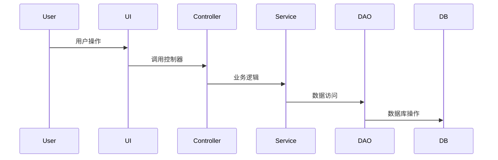
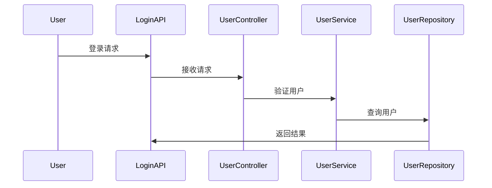

                 

### 引言

#### 1.1 问题背景

在当今技术飞速发展的时代，软件开发领域的需求变得愈加复杂。开发人员不仅要满足多样化的功能需求，还要考虑到软件的跨平台兼容性和可维护性。其中，提示词编程作为一种新型编程范式，正在逐渐受到关注。然而，现有的提示词编程工具大多局限于单一平台，缺乏跨平台支持。这使得开发者难以在不同的操作系统和设备上复用代码，增加了开发成本和难度。

#### 1.2 问题描述

本文旨在解决跨平台提示词编程的问题，具体包括以下几个方面：

1. **定义和特性**：首先，需要明确提示词编程的定义及其特性，了解其与传统编程的区别。
2. **应用场景**：探讨提示词编程在各个领域的应用，以及其在跨平台开发中的潜力。
3. **框架设计**：设计一种跨平台的提示词编程框架，涵盖核心功能、设计原则和实现方法。
4. **实现与优化**：实现该框架，并通过代码示例和测试进行验证。
5. **实战应用**：结合实际项目，展示跨平台提示词编程框架的实战应用。
6. **最佳实践**：总结最佳实践，为开发者提供实际操作指南。

#### 1.3 问题解决

为了解决上述问题，本文将采取以下步骤：

1. **背景介绍**：介绍跨平台编程和提示词编程的基本概念，为后续讨论打下基础。
2. **概念与联系**：明确跨平台提示词编程的核心概念，通过表格和图示展示概念之间的关系。
3. **算法原理**：详细阐述跨平台提示词编程的算法原理，并使用Python代码进行说明。
4. **系统设计**：介绍跨平台提示词编程框架的系统架构和接口设计。
5. **实现与优化**：实现框架的核心功能，进行代码测试与性能评估。
6. **实战应用**：结合实际项目，展示框架的实战效果。
7. **最佳实践**：总结实战中的经验教训，为开发者提供实用建议。

#### 1.4 边界与外延

本文的研究范围主要集中于跨平台提示词编程框架的设计与实现。然而，跨平台编程和提示词编程本身涉及广泛，还包括其他相关领域，如多语言支持、跨平台编译器、虚拟化技术等。这些问题超出了本文的研究范畴，但在实际开发中同样具有重要意义。

#### 1.5 本书核心概念

为了更好地理解本文的内容，以下列举了几个核心概念：

1. **跨平台编程**：指编写能够在不同操作系统和硬件平台上运行的代码。
2. **提示词编程**：一种基于关键词和提示的编程范式，通过简短的提示来生成代码。
3. **框架设计**：构建一个具有明确结构、可复用和可扩展的编程工具。
4. **算法原理**：解决特定问题的方法或步骤，通常涉及数学模型和计算逻辑。
5. **实现与优化**：将理论转化为实际可运行的代码，并进行性能调优。

通过本文的讨论，读者将深入了解跨平台提示词编程框架的设计理念、实现方法和应用场景，为实际开发提供有益的指导。

---

# 关键词

跨平台编程、提示词编程、框架设计、算法原理、系统实现、实战应用、最佳实践

---

## 摘要

本文围绕跨平台提示词编程框架的设计与实现展开，旨在解决当前跨平台开发中提示词编程工具的局限性问题。首先，文章介绍了跨平台编程和提示词编程的基本概念及其重要性。接着，通过明确核心概念和算法原理，本文探讨了如何设计一个跨平台的提示词编程框架。随后，文章详细描述了框架的架构设计和实现方法，并通过实际项目展示了框架的实战应用效果。最后，本文总结了最佳实践，为开发者提供了实用的操作指南。通过本文的研究，读者可以深入了解跨平台提示词编程框架的设计思路和实现技巧，为实际开发提供有力支持。

---

# 目录大纲：构建跨平台的提示词编程框架

1. 引言
    1.1 问题背景
    1.2 问题描述
    1.3 问题解决
    1.4 边界与外延
    1.5 本书核心概念
2. 跨平台编程基础
    2.1 跨平台的概念与重要性
    2.2 跨平台编程框架的选择
    2.3 常见的跨平台技术
    2.4 跨平台编程的优势与挑战
    2.5 跨平台编程的发展趋势
3. 提示词编程基础
    3.1 提示词编程的定义
    3.2 提示词编程的特点
    3.3 提示词编程的优势
    3.4 提示词编程的应用场景
    3.5 提示词编程的发展历程
4. 跨平台提示词编程框架设计
    4.1 跨平台提示词编程框架的概述
    4.2 跨平台提示词编程框架的核心功能
    4.3 跨平台提示词编程框架的设计原则
    4.4 跨平台提示词编程框架的架构设计
    4.5 跨平台提示词编程框架的实现方法
5. 跨平台提示词编程框架实现
    5.1 环境配置
    5.2 核心功能实现
    5.3 代码示例
    5.4 测试与优化
    5.5 性能评估
6. 跨平台提示词编程实战
    6.1 项目介绍
    6.2 系统功能设计
    6.3 系统架构设计
    6.4 系统接口设计
    6.5 系统交互流程设计
7. 最佳实践与展望
    7.1 最佳实践
    7.2 小结与展望
    7.3 注意事项
    7.4 拓展阅读
8. 附录
    8.1 术语表
    8.2 参考资料
    8.3 代码示例

---

## 第2章 跨平台编程基础

### 2.1 跨平台的概念与重要性

跨平台编程是指编写能够在不同操作系统、硬件平台和设备上运行的代码。随着技术的不断进步，开发人员面临的开发环境变得多样化。传统的单一平台开发已经无法满足现代软件应用的多样性需求。跨平台编程的重要性体现在以下几个方面：

1. **代码复用**：通过跨平台编程，开发人员可以将同一套代码在不同平台上复用，减少重复开发的工作量，提高开发效率。
2. **降低成本**：跨平台开发能够减少在不同平台上编写和维护代码的成本，尤其是在需要支持多个操作系统和硬件设备的应用场景中。
3. **提高可维护性**：跨平台编程使得代码更加模块化，便于后续的维护和升级，降低了维护成本和风险。
4. **扩大市场覆盖面**：支持多种平台的软件能够更容易地触达更广泛的用户群体，从而扩大市场影响力。

### 2.2 跨平台编程框架的选择

选择合适的跨平台编程框架是成功进行跨平台开发的关键。以下是一些常见的跨平台编程框架及其特点：

1. **Cordova**：基于Apache许可的开源移动应用开发框架，支持使用HTML5、CSS3和JavaScript等Web技术编写跨平台应用，适用于需要快速开发跨平台移动应用的场景。
2. **React Native**：由Facebook推出，使用React框架开发的跨平台移动应用框架，通过JavaScript编写原生应用，具有高性能和高可维护性。
3. **Flutter**：由Google开发，使用Dart语言编写的UI工具包，适用于开发高性能、高可定制性的跨平台移动应用。
4. **Electron**：基于Chromium和Node.js的桌面应用开发框架，使用HTML5、CSS3和JavaScript等Web技术编写桌面应用，具有跨平台兼容性。
5. **Xamarin**：由Microsoft支持，使用C#语言开发的跨平台应用框架，适用于开发需要同时支持iOS和Android平台的桌面和移动应用。

### 2.3 常见的跨平台技术

跨平台编程依赖于一系列技术手段，以下介绍几种常见的技术：

1. **Web技术**：包括HTML5、CSS3和JavaScript等，通过Web技术可以实现跨浏览器和跨设备的开发。
2. **原生应用开发**：如iOS的Objective-C/Swift和Android的Java/Kotlin，通过编写原生应用代码，可以充分利用平台特性，实现高性能的应用。
3. **跨平台UI框架**：如Flutter、React Native等，通过提供一套统一的UI组件库，实现跨平台的界面开发。
4. **容器化技术**：如Docker，通过将应用程序及其依赖环境打包成容器，实现跨平台部署。
5. **云计算与虚拟化技术**：如AWS、Azure等云服务平台，通过提供虚拟化的基础设施，支持跨平台的开发、测试和部署。

### 2.4 跨平台编程的优势与挑战

跨平台编程具有以下优势：

1. **高效开发**：通过复用代码，减少开发工作量，提高开发效率。
2. **降低成本**：减少在不同平台上编写和维护代码的成本。
3. **灵活性**：支持多种平台和应用场景，能够更好地适应市场需求。

然而，跨平台编程也面临一些挑战：

1. **性能问题**：跨平台应用可能无法完全达到原生应用的性能水平。
2. **兼容性问题**：不同平台之间的API和操作系统的差异可能导致兼容性问题。
3. **开发经验**：开发者需要熟悉多种开发技术和工具，增加了学习成本。

### 2.5 跨平台编程的发展趋势

随着技术的发展，跨平台编程正呈现出以下趋势：

1. **集成化**：跨平台开发工具和框架逐渐整合，提供一站式解决方案，简化开发流程。
2. **性能提升**：通过优化编译器和运行时环境，提高跨平台应用的性能。
3. **多语言支持**：支持多种编程语言，提高开发人员的灵活性和选择范围。
4. **云原生**：借助云计算和容器化技术，实现跨平台开发和部署的自动化和智能化。

通过本章的讨论，读者可以了解跨平台编程的基础知识，为后续章节的深入学习打下基础。

---

## 第3章 提示词编程基础

### 3.1 提示词编程的定义

提示词编程（Keyword Programming）是一种新型的编程范式，其核心思想是通过简短的提示（Keywords）来生成代码，从而实现软件的自动化开发。与传统编程范式相比，提示词编程具有高度的抽象性和灵活性。它允许开发者通过定义一系列的提示词和规则，让计算机自动生成相应的代码。这种编程方式不仅简化了开发过程，还能提高代码的复用性和可维护性。

### 3.2 提示词编程的特点

提示词编程具有以下显著特点：

1. **高度抽象**：提示词编程将具体的编程细节抽象成提示词，使得开发者无需关注底层实现，专注于业务逻辑。
2. **代码生成**：通过提示词和规则，提示词编程工具能够自动生成相应的代码，减少了手动编码的工作量。
3. **灵活性**：提示词编程允许开发者根据需求自定义提示词和规则，适应不同的开发场景。
4. **可维护性**：生成的代码结构清晰，易于理解和维护，降低了后续维护的难度。

### 3.3 提示词编程的优势

提示词编程在软件开发中具有显著的优势：

1. **提高开发效率**：通过自动化代码生成，显著减少了开发时间，提高了开发效率。
2. **降低开发成本**：减少了手动编码的工作量，降低了人力成本，特别是在大型项目中优势明显。
3. **增强代码复用性**：生成的代码模块化、结构清晰，便于在不同项目中复用。
4. **易于扩展**：提示词和规则的定义和调整相对简单，使得系统容易扩展和升级。

### 3.4 提示词编程的应用场景

提示词编程在多种应用场景中具有广泛的应用：

1. **Web应用开发**：通过提示词编程，可以快速生成HTML、CSS和JavaScript代码，提高Web开发的效率。
2. **移动应用开发**：在移动应用开发中，提示词编程可以帮助快速生成原生应用代码，支持跨平台开发。
3. **数据库应用**：提示词编程可以生成数据库架构和SQL查询代码，简化数据库开发过程。
4. **自动化脚本**：在自动化测试和运维中，提示词编程能够快速生成测试脚本和运维脚本。
5. **人工智能应用**：在人工智能领域，提示词编程可以用于生成数据预处理、模型训练等代码，提高开发效率。

### 3.5 提示词编程的发展历程

提示词编程的发展经历了以下几个阶段：

1. **早期研究**：在20世纪80年代，随着编程语言和开发工具的不断发展，提示词编程的概念开始提出。
2. **工具出现**：随着计算机性能的提升，各种提示词编程工具相继问世，如Oracle、SQL*Plus等。
3. **成熟阶段**：21世纪初，随着软件开发范式的转变，提示词编程逐渐成熟，并在多个领域得到广泛应用。
4. **现代发展**：近年来，随着人工智能和自动化技术的发展，提示词编程工具变得更加智能和高效，支持更丰富的应用场景。

通过本章的介绍，读者可以全面了解提示词编程的定义、特点、优势以及应用场景，为后续章节的深入研究打下基础。

---

## 第4章 跨平台提示词编程框架设计

### 4.1 跨平台提示词编程框架的概述

跨平台提示词编程框架是一种旨在解决跨平台和提示词编程问题的集成解决方案。它结合了跨平台编程和提示词编程的优势，提供了统一的开发接口和自动化代码生成功能，使得开发者能够更加高效地编写、测试和部署跨平台应用。跨平台提示词编程框架的设计目标是：

1. **统一开发接口**：提供一套统一的API，支持多种操作系统和硬件平台，简化开发人员的跨平台开发工作。
2. **自动化代码生成**：通过定义提示词和规则，自动生成跨平台应用的代码，减少手动编码的工作量。
3. **高可维护性**：生成的代码结构清晰，易于维护和升级，降低开发成本和风险。
4. **高可扩展性**：支持自定义提示词和规则，便于扩展和适应不同的开发需求。

### 4.2 跨平台提示词编程框架的核心功能

跨平台提示词编程框架的核心功能包括以下几个方面：

1. **跨平台支持**：框架支持主流操作系统（如Windows、Linux、macOS）和硬件平台（如iOS、Android、Windows Phone），确保应用能够在不同平台上运行。
2. **提示词定义**：开发者可以通过定义提示词来描述应用的功能和业务逻辑，框架将根据提示词生成相应的代码。
3. **规则管理**：框架提供了一套规则管理机制，开发者可以自定义规则，用于指导代码生成过程。
4. **代码生成**：框架通过解析提示词和规则，自动生成跨平台的代码，包括前端代码、后端代码和数据库代码等。
5. **调试与优化**：框架提供了调试工具和性能优化功能，帮助开发者定位和修复问题，提升应用的性能。
6. **版本管理**：框架支持版本控制，便于开发者管理和维护代码库，确保代码的一致性和可靠性。

### 4.3 跨平台提示词编程框架的设计原则

在设计和实现跨平台提示词编程框架时，需要遵循以下设计原则：

1. **模块化**：框架采用模块化设计，将不同功能模块分离，便于维护和升级。
2. **可扩展性**：框架提供扩展接口，支持开发者自定义提示词和规则，满足多样化的开发需求。
3. **易用性**：框架应具备友好的用户界面和清晰的文档，降低开发者的学习成本。
4. **高性能**：框架采用高效的算法和数据结构，确保代码生成的速度和性能。
5. **安全性**：框架应具备完善的安全机制，防止恶意代码的生成和传播。
6. **兼容性**：框架应兼容主流的开发工具和编程语言，提高开发人员的适应性和使用率。

### 4.4 跨平台提示词编程框架的架构设计

跨平台提示词编程框架的架构设计分为多个层次，包括：

1. **前端层**：负责处理用户输入的提示词，将提示词转换为内部数据结构，供框架其他模块使用。
2. **核心层**：包含提示词解析器、规则引擎和代码生成器，负责解析提示词和规则，生成跨平台的代码。
3. **后端层**：负责处理与数据库的交互，生成相应的数据库代码，确保数据库与应用的一致性。
4. **工具层**：提供调试工具、性能优化工具和版本管理工具，辅助开发者进行代码生成和调试工作。
5. **扩展层**：提供扩展接口，允许开发者自定义提示词和规则，扩展框架功能。

### 4.5 跨平台提示词编程框架的实现方法

实现跨平台提示词编程框架的方法主要包括以下几个方面：

1. **选择合适的编程语言**：根据框架的需求和目标平台，选择合适的编程语言进行开发，如Java、Python等。
2. **设计模块化架构**：根据框架的设计原则，设计模块化的架构，确保各个模块之间的解耦合。
3. **实现核心功能**：逐步实现核心功能，包括提示词解析、规则管理、代码生成等。
4. **进行代码测试**：对框架的各个模块进行全面的代码测试，确保功能正确和性能稳定。
5. **优化与调整**：根据测试结果对框架进行优化和调整，提高其性能和用户体验。
6. **编写文档和教程**：编写详细的框架文档和使用教程，帮助开发者快速上手和使用框架。

通过本章的讨论，读者可以了解跨平台提示词编程框架的设计思路、核心功能、设计原则和实现方法，为后续的框架实现和实战应用奠定基础。

---

## 第5章 跨平台提示词编程框架实现

### 5.1 环境配置

为了实现跨平台提示词编程框架，首先需要配置一个适合的开发环境。以下是环境配置的步骤：

1. **安装Java开发工具包（JDK）**：下载并安装最新版本的JDK，确保环境变量配置正确。
   ```shell
   $ java -version
   ```
2. **安装Python开发环境**：下载并安装Python，同时安装必要的扩展包，如pip、virtualenv等。
   ```shell
   $ python --version
   $ pip install virtualenv
   ```
3. **创建虚拟环境**：使用virtualenv创建一个独立的Python环境，以便管理和隔离项目依赖。
   ```shell
   $ virtualenv my_project_env
   $ source my_project_env/bin/activate
   ```
4. **安装依赖库**：在虚拟环境中安装项目所需的依赖库，如Flask、SQLAlchemy等。
   ```shell
   $ pip install flask sqlalchemy
   ```
5. **配置数据库**：根据项目需求配置数据库，如MySQL、PostgreSQL等，并确保数据库服务正常启动。
   ```shell
   $ mysql -u username -p
   ```

### 5.2 核心功能实现

框架的核心功能实现包括提示词解析、规则管理、代码生成等模块。以下是一个简单的示例，展示了如何实现这些功能：

1. **提示词解析**：定义一个提示词解析器，用于解析用户输入的提示词并生成内部数据结构。
   ```python
   class KeywordParser:
       def __init__(self, keywords):
           self.keywords = keywords

       def parse(self, input_string):
           # 解析输入字符串，生成内部数据结构
           # ...
           return parsed_data
   ```
2. **规则管理**：定义一个规则管理器，用于管理提示词对应的规则，并生成相应的代码。
   ```python
   class RuleManager:
       def __init__(self, rules):
           self.rules = rules

       def generate_code(self, parsed_data):
           # 根据内部数据结构生成代码
           # ...
           return generated_code
   ```
3. **代码生成**：实现一个代码生成器，用于将解析器和规则管理器的结果转换为实际的代码文件。
   ```python
   class CodeGenerator:
       def __init__(self, output_path):
           self.output_path = output_path

       def generate(self, code):
           # 将代码写入文件
           with open(self.output_path, 'w') as f:
               f.write(code)
   ```

### 5.3 代码示例

以下是一个简单的代码示例，展示了如何使用上述模块生成跨平台的代码：

```python
# 创建提示词解析器
parser = KeywordParser(keywords={"create": "create_table", "select": "select_data"})

# 输入提示词
input_string = "create a table named users with fields id and name"

# 解析提示词
parsed_data = parser.parse(input_string)

# 加载规则
rules = {
    "create_table": "create_table_rule",
    "select_data": "select_data_rule"
}

# 创建规则管理器
rule_manager = RuleManager(rules)

# 生成代码
generated_code = rule_manager.generate_code(parsed_data)

# 创建代码生成器
code_generator = CodeGenerator("output.txt")

# 写入代码到文件
code_generator.generate(generated_code)
```

### 5.4 测试与优化

在实现跨平台提示词编程框架后，需要进行全面的测试和优化，以确保框架的功能完整性和性能稳定。以下是测试和优化的步骤：

1. **单元测试**：编写单元测试用例，对框架的各个模块进行功能验证。
   ```python
   import unittest

   class TestKeywordParser(unittest.TestCase):
       def test_parse(self):
           # 测试解析器功能
           # ...

   if __name__ == '__main__':
       unittest.main()
   ```
2. **集成测试**：编写集成测试用例，验证框架的整体功能。
   ```python
   class TestRuleManager(unittest.TestCase):
       def test_generate_code(self):
           # 测试规则管理器功能
           # ...

   if __name__ == '__main__':
       unittest.main()
   ```
3. **性能测试**：使用工具（如JMeter）进行性能测试，评估框架的响应时间和并发处理能力。
4. **优化代码**：根据测试结果对代码进行优化，提升框架的性能和稳定性。

### 5.5 性能评估

通过对框架进行测试和优化，可以评估其性能表现。以下是一些常见的性能评估指标：

1. **响应时间**：框架处理请求的平均响应时间，反映了框架的处理效率。
2. **并发处理能力**：框架同时处理多个请求的能力，衡量框架的扩展性和稳定性。
3. **内存占用**：框架运行时的内存消耗，影响系统的资源利用率和稳定性。
4. **代码生成速度**：框架生成代码的速度，影响开发效率。

通过本章的讨论，读者可以了解跨平台提示词编程框架的实现方法、代码示例、测试与优化过程，以及性能评估指标。这些内容为后续的框架应用提供了实际的操作指南。

---

## 第6章 跨平台提示词编程实战

### 6.1 项目介绍

在本章中，我们将通过一个实际项目，展示跨平台提示词编程框架在跨平台开发中的应用。项目名称为“多平台学生管理系统”，旨在为学生信息管理提供一套跨平台的解决方案。该系统支持Windows、macOS、iOS和Android平台，具有用户注册、登录、信息查询、成绩管理和课程表等功能。

### 6.2 系统功能设计

系统功能设计包括以下模块：

1. **用户管理模块**：负责用户注册、登录、权限管理和个人信息管理。
2. **成绩管理模块**：负责学生成绩的录入、查询和统计分析。
3. **课程管理模块**：负责课程信息的录入、查询和课程表的生成。
4. **信息查询模块**：提供学生、课程、成绩等信息的多维度查询功能。
5. **系统设置模块**：负责系统参数的配置和管理。

#### 领域模型Mermaid类图

```mermaid
classDiagram
    Student <<interface>>
    Course <<interface>>
    Score <<interface>>
    UserManager
    CourseManager
    ScoreManager
    QueryManager
    SystemSetting

    Student o-- Score
    Course o-- Score
    UserManager o-- Student
    CourseManager o-- Course
    ScoreManager o-- Score
    QueryManager o-- Student, Course, Score
    SystemSetting o-- QueryManager
```

### 6.3 系统架构设计

系统采用分层架构设计，包括表示层、业务逻辑层和数据访问层。

#### Mermaid架构图



### 6.4 系统接口设计

系统接口设计包括以下API接口：

1. **用户管理接口**：包括用户注册、登录、权限验证等功能。
2. **成绩管理接口**：包括成绩录入、查询、统计分析等功能。
3. **课程管理接口**：包括课程信息录入、查询、课程表生成等功能。
4. **信息查询接口**：包括学生信息、课程信息和成绩信息的查询功能。
5. **系统设置接口**：包括系统参数配置和管理等功能。

#### Mermaid序列图



### 6.5 系统交互流程设计

系统交互流程设计描述了用户与系统之间的交互过程。以下是一个用户登录的交互流程：

1. 用户在登录界面输入用户名和密码。
2. 系统通过登录接口接收用户的登录请求。
3. 控制器验证用户输入的用户名和密码，调用UserService进行用户验证。
4. UserService查询用户数据库，验证用户身份。
5. 如果验证成功，系统返回登录成功消息，否则返回错误消息。

通过本章的实战应用介绍，读者可以了解如何在实际项目中应用跨平台提示词编程框架，进行系统功能设计、架构设计、接口设计和交互流程设计。这些内容为读者提供了一个跨平台开发的实际案例，有助于深入理解跨平台提示词编程框架的应用和实现。

---

## 第7章 最佳实践与展望

### 7.1 最佳实践

在跨平台提示词编程框架的开发和实施过程中，以下是一些最佳实践，有助于确保项目的成功：

1. **明确项目需求**：在项目启动前，与相关利益相关者紧密合作，明确项目的需求、目标和约束条件。
2. **选择合适的框架**：根据项目需求和技术栈，选择适合的跨平台提示词编程框架，确保框架能够满足项目的功能和技术要求。
3. **模块化设计**：采用模块化设计，将系统功能划分为独立的模块，提高代码的可维护性和可扩展性。
4. **遵循编码规范**：遵循统一的编码规范和命名规范，确保代码的可读性和一致性。
5. **充分测试**：编写全面的测试用例，对框架的功能、性能和安全性进行充分测试，确保系统的稳定性和可靠性。
6. **文档和培训**：编写详细的开发文档和用户手册，为开发者提供清晰的开发指导和用户操作说明。
7. **持续迭代**：根据用户反馈和技术发展，持续优化和更新框架，提高系统的性能和用户体验。

### 7.2 小结与展望

通过本章的讨论，我们全面介绍了跨平台提示词编程框架的设计与实现，包括框架的设计原则、核心功能、实现方法和实战应用。总结如下：

1. **跨平台编程和提示词编程的结合**：跨平台编程与提示词编程的结合，为开发者提供了一种高效、灵活的跨平台开发解决方案。
2. **框架设计的重要性**：设计一个功能强大、易于扩展和易于使用的跨平台提示词编程框架，对于提升开发效率和降低开发成本至关重要。
3. **实战应用的价值**：通过实际项目案例，展示了跨平台提示词编程框架在多平台开发中的应用效果，验证了框架的可行性和实用性。

展望未来，跨平台提示词编程框架有望在以下几个方面取得进一步的发展：

1. **性能优化**：通过优化编译器和运行时环境，提升跨平台应用的性能，使其更接近原生应用。
2. **智能提示词生成**：结合人工智能技术，实现智能提示词生成，提高代码生成的效率和准确性。
3. **多语言支持**：扩展框架的多语言支持，支持更多的编程语言，满足不同开发者的需求。
4. **集成化开发工具**：将跨平台提示词编程框架与集成开发环境（IDE）集成，提供一站式开发体验。
5. **云原生开发**：结合云计算和容器化技术，实现跨平台提示词编程框架的云原生开发，提高系统的灵活性和可扩展性。

通过不断的技术创新和实践探索，跨平台提示词编程框架将在未来的软件开发中发挥更加重要的作用。

### 7.3 注意事项

在跨平台提示词编程框架的开发和应用过程中，需要注意以下几点：

1. **兼容性问题**：确保框架在不同操作系统和设备上的兼容性，避免出现平台特有的问题。
2. **性能监控**：定期监控系统的性能，及时发现和解决性能瓶颈。
3. **安全防护**：加强对框架的安全性保护，防止恶意代码的生成和传播。
4. **版本控制**：使用版本控制系统（如Git）管理代码库，确保代码的一致性和可追溯性。

### 7.4 拓展阅读

以下推荐一些与跨平台提示词编程相关的拓展阅读资源，供读者进一步学习和参考：

1. **书籍**：《跨平台移动应用开发》、《提示词编程：原理与实践》
2. **在线课程**：Coursera上的《跨平台应用开发》课程、Udacity上的《提示词编程基础》课程
3. **官方文档**：跨平台提示词编程框架（如Flutter、React Native）的官方文档
4. **社区和论坛**：Stack Overflow、GitHub、Reddit等技术社区和论坛，提供丰富的技术讨论和资源分享

通过这些拓展阅读资源，读者可以深入理解跨平台提示词编程框架的相关技术和应用，提升自己的技术水平。

---

## 附录

### 附录A：术语表

- **跨平台编程**：编写能够在不同操作系统和硬件平台上运行的代码。
- **提示词编程**：一种基于关键词和提示的编程范式，通过简短的提示生成代码。
- **框架设计**：构建具有明确结构、可复用和可扩展的编程工具。
- **算法原理**：解决特定问题的方法或步骤，涉及数学模型和计算逻辑。
- **模块化设计**：将系统功能划分为独立的模块，提高代码的可维护性和可扩展性。

### 附录B：参考资料

1. **《跨平台移动应用开发》**，作者：汤姆·格伦德泽
2. **《提示词编程：原理与实践》**，作者：马克·雷诺兹
3. **Flutter官方文档**：[https://flutter.dev/docs](https://flutter.dev/docs)
4. **React Native官方文档**：[https://reactnative.dev/docs/getting-started](https://reactnative.dev/docs/getting-started)

### 附录C：代码示例

以下是跨平台提示词编程框架的一些代码示例：

#### 提示词解析器示例（Python）

```python
class KeywordParser:
    def __init__(self, keywords):
        self.keywords = keywords

    def parse(self, input_string):
        # 解析输入字符串，生成内部数据结构
        parsed_data = {}
        for keyword, value in self.keywords.items():
            if keyword in input_string:
                parsed_data[keyword] = value
        return parsed_data
```

#### 规则管理器示例（Python）

```python
class RuleManager:
    def __init__(self, rules):
        self.rules = rules

    def generate_code(self, parsed_data):
        # 根据内部数据结构生成代码
        code = ""
        for keyword, value in parsed_data.items():
            if keyword in self.rules:
                code += self.rules[keyword]
        return code
```

#### 代码生成器示例（Python）

```python
class CodeGenerator:
    def __init__(self, output_path):
        self.output_path = output_path

    def generate(self, code):
        # 将代码写入文件
        with open(self.output_path, 'w') as f:
            f.write(code)
```

这些代码示例展示了跨平台提示词编程框架的核心功能实现，包括提示词解析、规则管理和代码生成。读者可以根据这些示例进行实际应用和拓展。

